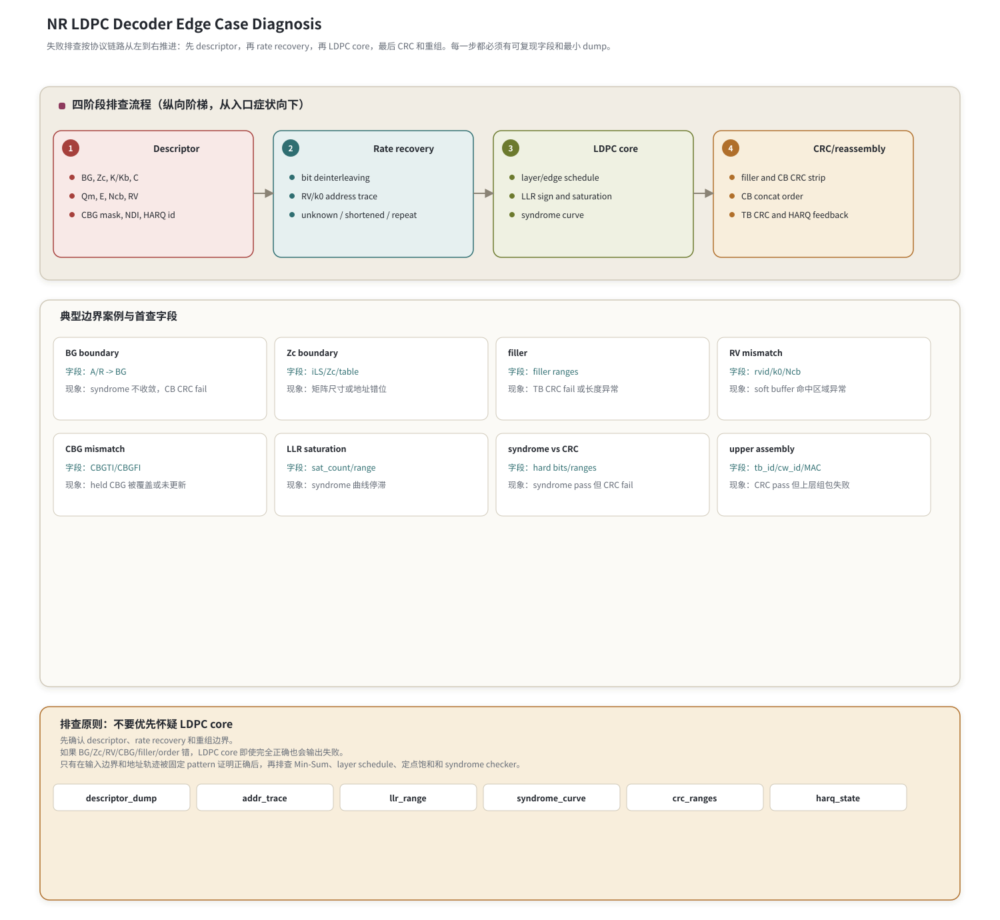

# T9.6 NR LDPC 译码边界案例
## 本节学习目标

本节使用的单篇技术缩写先统一说明：低密度奇偶校验码是 NR 数据业务采用的信道编码；基图（Base Graph, BG）是 NR LDPC 校验矩阵的模板，协议使用 BG1/BG2；提升大小（Lifting Size, Zc）把 BG 中的一个元素扩展为 $Z_c \times Z_c$ 子矩阵；对数似然比是译码器输入软信息；码块是逐块 LDPC 译码对象；CBG是 NR 部分重传的 CB 分组；传输块是最终交付给媒体接入控制层的业务块；循环冗余校验用于检查 CB/TB 候选比特；混合自动重传请求根据失败状态决定软缓存保留和重传；冗余版本（Redundancy Version, RV）决定 rate recovery 的 circular buffer 起点；调制与编码方案和传输块大小提供分段、码率和资源边界；下行控制信息携带 RV、CBG 等控制字段；上行共享信道和下行共享信道是本节引用的数据信道；寄存器传输级/专用集成电路实现要能 dump descriptor、地址轨迹、LLR 范围、syndrome 曲线和 CRC 边界。

本节不是再讲一个新算法，而是把 T8/T9 的协议、算法和工程边界串成一套排查清单。NR LDPC 链路失败时，最危险的习惯是马上怀疑 Min-Sum 或 BP 核心。实际工程中，更多失败来自 descriptor、rate recovery、filler、RV、CBG、拼接顺序或 CRC 输入边界。

学完本节后，应能做到：

- 用结构化顺序排查失败：先 descriptor，再 rate recovery，再 LDPC core，再 CRC/reassembly。
- 对 BG、Zc、filler、punctured systematic bits、limited buffer、RV mismatch、CBG mismatch、LLR saturation、syndrome/CRC 不一致、CRC 通过但上层组包失败逐项列检查字段。
- 展开 BG 选择错误、Zc 错误、RV mismatch、CBG mismatch、syndrome pass but CRC fail 等关键案例。
- 给出最小 dump 包，能让软件 golden model、RTL 波形和协议 descriptor 对齐。
- 解释为什么 syndrome pass 不能替代 CRC pass，CRC pass 也不能保证上层组包字段完全正确。

如果只记一件事：**NR LDPC 失败排查要先证明输入边界和协议地址正确，再怀疑 LDPC core；否则很容易在正确的译码核心上调错参数。**

## 前置知识检查

| 前置项 | 本节需要达到的程度 |
|:---|:---|
| T8.2 BG 选择 | 能按 payload size 和 code rate 判断 BG1/BG2。 |
| T8.3 lifting/QC 矩阵 | 知道 Zc、iLS、shift table 决定完整 H 的尺寸和边连接。 |
| T8.8 数值走读 | 知道 syndrome 检查的是 LDPC 校验约束，不等于业务 CRC。 |
| T9.1-T9.4 rate recovery | 知道 bit deinterleaving、RV/k0、unknown/shortened/repetition 和 soft buffer 地址。 |
| T9.5 重组与 CRC | 知道 filler/CB CRC/TB CRC 和 CB concat 顺序。 |

本节可以当作调试手册读。读到某个案例时，如果前置概念不清，回到表中对应章节补读。

## 任务边界与 Prompt 覆盖

| 登记表要求 | 本节覆盖位置 | 覆盖方式 |
|:---|:---|:---|
| BG 选择边界 | “案例总表”“详细案例一” | 触发条件、现象、字段、定位、修复。 |
| Zc 选择边界 | “案例总表”“详细案例二” | 矩阵尺寸和地址错位现象。 |
| filler 边界 | “案例总表” | 区分 filler 与 unknown/punctured。 |
| punctured systematic bits | “案例总表” | unknown LLR 初始化和系统位 puncturing 排查。 |
| limited buffer | “案例总表” | Ncb/N/limitedBufferRM 字段检查。 |
| RV mismatch | “案例总表”“详细案例三” | soft buffer 命中区域异常。 |
| CBG mismatch | “案例总表”“详细案例四” | 部分重传状态污染。 |
| LLR saturation | “案例总表” | sat_count 和 syndrome 曲线。 |
| syndrome 通过但 CRC 失败 | “详细案例五” | LDPC 约束与业务 CRC 边界。 |
| CRC 通过但上层组包失败 | “案例总表” | MAC/TB id/codeword/context 字段。 |
| 最小 dump 包 | “最小 dump 包” | 字段可直接用于调试。 |
| 诊断流程图 | “诊断流程图” | 用 Mermaid 和故障表展开 descriptor、rate recovery、BG/Zc、LDPC core 与 CRC 边界的排查顺序。 |
| 不优先怀疑 LDPC core | “排查顺序原则” | 明确排查顺序和原因。 |

正文额外补充 Python 诊断分类片段、RTL/ASIC 映射、验证方法和自测答案。

## 资料与协议边界

| 协议位置 | 本地证据路径 |
| :--- | :--- |
| TS 38.212 §5.2.2 | `3GPP_Rel19/processed/TS_38.212_38212-j30/content.md:717-805` |
| TS 38.212 §5.3.2 | `3GPP_Rel19/processed/TS_38.212_38212-j30/content.md:948-989` |
| TS 38.212 §5.4.2/§5.4.2.1 | `3GPP_Rel19/processed/TS_38.212_38212-j30/content.md:1175-1309` |
| TS 38.212 §5.4.2.2 | `3GPP_Rel19/processed/TS_38.212_38212-j30/content.md:1311-1323`；`docs/audits/T9.4_NR_LDPC_bit_interleaving_formula_evidence.md` |
| TS 38.212 §6.2.1-§6.2.6 | `3GPP_Rel19/processed/TS_38.212_38212-j30/content.md:1361-1415` |
| TS 38.212 §7.2.1-§7.2.6 | `3GPP_Rel19/processed/TS_38.212_38212-j30/content.md:3737-3783` |
| TS 38.214 §5.1.7/§6.1.5 | `3GPP_Rel19/processed/TS_38.214_38214-j30/content.md:2407-2437`；`content.md:7099-7125` |

边界说明：本节不会复现全部协议表值。BG 选择和 Zc 表值由 T8.2/T8.3 负责；RV/k0 由 T9.3 负责；本节引用这些章节的结论，用于组织失败排查。

## 排查顺序原则

失败排查应按协议链路从外到内推进：

1. Descriptor：BG、Zc、C、K、E、Qm、Ncb、RV、CBG、NDI、HARQ id 是否来自同一个调度上下文。
2. Rate recovery：bit deinterleaving、RV/k0 地址、unknown/shortened/repeated/filler mask 是否正确。
3. LDPC core：LLR 符号、幅度、定点饱和、layer/edge schedule、syndrome checker 是否正确。
4. CRC/reassembly：filler/CB CRC 去除、CB concat order、TB CRC 输入边界、HARQ feedback 是否正确。

不要优先怀疑 LDPC core 的原因很简单：如果 BG/Zc/RV/CBG/filler/order 错，LDPC core 得到的就是错误问题。一个完全正确的 Min-Sum 核心也无法把错误地址、错误矩阵或错误拼接顺序变成正确 TB。

## 边界案例的理论模型

为了避免把本节读成协议索引，先建立一个统一模型。一次 NR LDPC 译码可以看成函数组合：

$$
\hat{\mathbf{u}}
= \mathrm{CRCStrip}\Big(
\mathrm{LDPCDecode}\big(
\mathrm{RateRecover}(\mathbf{L}_{\mathrm{rx}}, \theta_{\mathrm{rr}}),
\theta_{\mathrm{ldpc}}
\big),
\theta_{\mathrm{crc}}
\Big).
\tag{1}
$$

其中：

- $\mathbf{L}_{\mathrm{rx}}$ 是 demapper 输出 LLR。
- $\theta_{\mathrm{rr}}$ 包含 $Q_m$、RV、$k_0$、$N_{\mathrm{cb}}$、CBG mask、unknown/shortened/repeated 状态。
- $\theta_{\mathrm{ldpc}}$ 包含 BG、$Z_c$、shift table、layer schedule、定点参数。
- $\theta_{\mathrm{crc}}$ 包含 filler 删除、CB CRC 是否存在、CB 拼接顺序、TB CRC 输入边界。

边界案例本质上是某个 $\theta$ 错了。若 $\theta_{\mathrm{rr}}$ 错，LDPC core 收到的 LLR 位置错；若 $\theta_{\mathrm{ldpc}}$ 错，core 用错校验矩阵；若 $\theta_{\mathrm{crc}}$ 错，core 输出的合法码字也会被错误抽取或拼接。调试的目的就是先判断哪个 $\theta$ 失真，而不是直接调 Min-Sum 归一化系数。

## 诊断变量的基础解释

调试日志里的字段不是为了堆砌名词，而是为了回答几个朴素问题：

| 变量 | 零基础解释 | 它回答的问题 |
|:---|:---|:---|
| descriptor | 本次译码的说明书，包含 BG、Zc、RV、CB 数、CBG 状态等。 | 我们是否在解“正确形状”的问题？ |
| address trace | 每个收到的 LLR 被放进 soft buffer 的位置序列。 | 软信息是否放到了正确编码比特位置？ |
| mask | 标记某些位置或某些 CB 是否可用、已知、未知、保持历史或本次更新。 | 哪些数据是真观察，哪些是协议填充或历史状态？ |
| syndrome curve | 每次迭代后 LDPC 校验失败数量的变化。 | LDPC core 是否在让候选码字接近合法码字？ |
| CRC boundary | CRC checker 看到的 bit 起点、终点和顺序。 | 业务完整性检查是否吃到了正确 bit 序列？ |

这五类变量的关系可以理解成一条流水线。descriptor 决定 address trace 和 mask；address trace 和 mask 决定 LDPC core 的输入；LDPC core 的输出通过 syndrome curve 观察；CRC boundary 决定这些输出如何被解释成业务数据。任何一环错，最终都可能表现为 CRC fail。

## 现象到假设的推理方式

排查不是看到 fail 就随机改参数，而是用现象缩小假设空间：

| 现象 | 更可能的假设 | 暂时不优先的假设 |
|:---|:---|:---|
| 多个 CB 同时 fail，且都在边界 TBS/MCS 附近 | BG/Zc/segmentation descriptor 错 | 单个 CN/VN 算法 bug。 |
| 初传失败，重传后更差 | RV/k0/soft combining/CBG 状态错 | 纯信道噪声突然变大。 |
| syndrome 逐步下降但最终 CRC fail | 重组、filler、bit order、CRC boundary 错 | LDPC core 完全不工作。 |
| syndrome 不下降且 LLR 大量饱和 | 定点缩放、饱和、符号约定或输入 LLR 异常 | TB concat 顺序。 |
| TB CRC pass 但 MAC 报组包错 | 交付元数据、TB id、MAC PDU 长度或多 codeword 绑定错 | LDPC syndrome checker。 |

这个推理表的价值是节省排查时间。它不保证第一个假设必然正确，但能避免把所有问题都压到 LDPC core 上。

诊断图中间区域的标题是“典型边界案例与首查字段”，它把 BG/Zc/filler、punctured systematic bits、limited buffer、RV mismatch、CBG mismatch、LLR saturation、syndrome/CRC mismatch、CRC pass but upper fail 等案例和第一批必查字段放在同一张表里。底部的“排查原则：不要优先怀疑 LDPC core”是本节调试顺序的核心约束：先确认 descriptor、rate recovery、mask 和 CRC boundary，再怀疑 Min-Sum/Layered core。

## 边界错误的传播路径

下面把几个常见边界错误拆成因果链。读这几条链路，可以理解为什么同一个最终现象 `CRC fail` 背后可能是完全不同的问题。

BG 错误的传播路径：

$$
\mathrm{wrong\ BG}
\rightarrow \mathrm{wrong\ }(m_b,n_b)
\rightarrow \mathrm{wrong\ H}
\rightarrow \mathrm{wrong\ check\ equations}
\rightarrow \mathrm{syndrome/CRC\ fail}.
\tag{2}
$$

这里 $(m_b,n_b)$ 是基图行组/列组数量。BG1 和 BG2 不是同一张图的两个名字，它们有不同的矩阵尺寸和连接模板。BG 选错时，译码器不是“性能差一点”，而是在解另一个码。

Zc 错误的传播路径：

$$
\mathrm{wrong\ }Z_c
\rightarrow \mathrm{wrong\ modulo/shift}
\rightarrow \mathrm{wrong\ edge\ endpoints}
\rightarrow \mathrm{wrong\ messages}
\rightarrow \mathrm{syndrome\ abnormal}.
\tag{3}
$$

$Z_c$ 同时影响矩阵尺寸、循环移位取模、每个 layer 的局部地址和 filler 数。一个 $Z_c$ 错误可能仍让硬件地址看起来有规律，但规律对应的是错误矩阵。

RV 错误的传播路径：

$$
\mathrm{wrong\ RV/k_0}
\rightarrow \mathrm{LLR\ written\ to\ wrong\ codebit}
\rightarrow \mathrm{soft\ evidence\ becomes\ misleading}
\rightarrow \mathrm{retransmission\ not\ improving}.
\tag{4}
$$

这解释了为什么 RV mismatch 往往在重传时暴露：初传失败后，重传本应补充新证据；如果地址错，新证据会加强错误位置，表现为合并后更差。

CBG 错误的传播路径：

$$
\mathrm{wrong\ CBG\ mask}
\rightarrow \mathrm{held/updated\ CB\ set\ wrong}
\rightarrow \mathrm{mixed\ old/new\ result}
\rightarrow \mathrm{TB\ CRC\ fail}.
\tag{5}
$$

CBG 错误不一定让单个更新 CB 的 LDPC syndrome 失败。它更常表现为 TB 层拼接状态污染：该保留的旧结果丢了，该更新的新结果缺了，或者 CBGFI 要求 flush 时仍合并旧实例。

filler 错误的传播路径：

$$
\mathrm{wrong\ filler\ mask}
\rightarrow \mathrm{known/unknown\ semantics\ wrong}
\rightarrow \mathrm{decode\ or\ reassembly\ boundary\ wrong}
\rightarrow \mathrm{CRC\ fail}.
\tag{6}
$$

filler 在译码前通常是已知结构，在重组后不属于业务 payload。若把它当 unknown，LDPC 输入错；若把它留进 payload，TB CRC 输入错。

## 手算例子：syndrome 通过但 CRC 失败

用一个极小 toy 例子说明“LDPC 约束通过”和“业务 CRC 通过”不是同一件事。设译码器输出的 hard bits 为：

$$
\hat{\mathbf{x}}=[0,1,1,0].
\tag{7}
$$

设 toy LDPC 校验矩阵为：

$$
H=
\begin{bmatrix}
1&1&1&0\\
0&1&1&0
\end{bmatrix}.
\tag{8}
$$

syndrome 为：

$$
\mathbf{s}=H\hat{\mathbf{x}}^T \bmod 2
=
\begin{bmatrix}
0\oplus1\oplus1\\
1\oplus1
\end{bmatrix}
=
\begin{bmatrix}
0\\
0
\end{bmatrix}.
\tag{9}
$$

这说明 $\hat{\mathbf{x}}$ 满足 toy LDPC 校验。但如果业务 TB candidate 应该按 `[bit0, bit1, bit2, bit3]` 输入 CRC，而实现错误地按 `[bit2, bit1, bit0, bit3]` 拼接，LDPC syndrome 仍然是 0，CRC 却可能失败。这个例子解释了为什么 T9.4 的 bit order、T9.5 的 concat order 和本节的 CRC boundary 必须单独 dump。

## 直观解释：同一个 CRC fail 背后的四类坐标系

NR LDPC 调试中最容易误解的一点是：日志里出现同一个 `CRC fail`，并不代表错误发生在同一个位置。可以把接收链路看成四套坐标系逐级转换：

| 坐标系 | 它描述的对象 | 典型错误 | 为什么会表现为 CRC fail |
|:---|:---|:---|:---|
| 调度坐标系 | 这次传输属于哪个 TB、CB、HARQ process、RV、CBG。 | `harq_id` 串扰、重传复用错误 descriptor。 | 后续所有地址和状态都以错误任务为输入。 |
| 编码比特坐标系 | demapper LLR 应放回母码 circular buffer 的哪个位置。 | RV/k0 错、limited buffer 长度错、Qm 反交织错。 | 正确软信息被放到错误编码比特，LDPC 看到的证据错。 |
| 校验矩阵坐标系 | LDPC core 用哪一个 BG、Zc、shift table 解释这些比特。 | BG/Zc/iLS 错、layer 地址错。 | core 在解另一张 H，对真实码字的约束不成立。 |
| 业务比特坐标系 | LDPC hard bits 如何删除 filler/CB CRC 并拼成 TB CRC 输入。 | filler 留入 payload、CB 顺序错、CRC 输入长度错。 | core 输出可能满足 H，但业务 bitstream 被解释错。 |

这个直观模型给出一个工程判断：如果还没有证明四套坐标系一致，就不要把 `CRC fail` 直接归因于 Min-Sum、迭代次数或归一化系数。LDPC core 是中间计算器，输入坐标和输出解释错时，它没有能力自动修复上下文错误。

## 数值例子：RV 地址错位如何污染软缓存

下面用最小数组手算一次 RV mismatch。设某个 CB 的 circular buffer 长度 $N_{\mathrm{cb}}=8$，一次传输只收到 $E=4$ 个 LLR。为了教学清晰，假设 RV0 选择地址 `[0,1,2,3]`，RV2 预期选择地址 `[4,5,6,7]`。真实硬件如果把 RV2 错当成另一组起点 `[2,3,4,5]`，同样的重传 LLR 会写入错误位置。

初传 RV0 后，soft buffer 为：

$$
\mathbf{L}^{(0)}
= [ +3,\ -2,\ +1,\ +4,\ 0,\ 0,\ 0,\ 0 ].
\tag{10}
$$

其中 0 表示还没有观测到的 unknown 位置，不是 known zero。重传 RV2 收到：

$$
\mathbf{r}^{(1)}=[-1,\ +2,\ +5,\ -3].
\tag{11}
$$

如果 RV2 地址正确，应写到 `[4,5,6,7]`，得到：

$$
\mathbf{L}^{(1)}_{\mathrm{expected}}
= [ +3,\ -2,\ +1,\ +4,\ -1,\ +2,\ +5,\ -3 ].
\tag{12}
$$

这次重传补充了 4 个之前未发送的位置，`new_count=4`，`repeat_count=0`。如果地址错成 `[2,3,4,5]`，则得到：

$$
\mathbf{L}^{(1)}_{\mathrm{wrong}}
= [ +3,\ -2,\ 0,\ +6,\ +5,\ -3,\ 0,\ 0 ].
\tag{13}
$$

这里地址 2 和 3 被错误累加，地址 6 和 7 仍然未知。表面上看 soft buffer 里也有新的 LLR，实际覆盖统计已经暴露问题：

| 项目 | 正确 RV2 | 错误 RV2 |
|:---|:---:|:---:|
| 新覆盖位置 | 4 个 | 2 个 |
| 重复覆盖位置 | 0 个 | 2 个 |
| 仍未知位置 | 0 个 | 2 个 |
| 可能现象 | 重传后可靠度提升 | 重传后 syndrome/CRC 不稳定，甚至更差 |

这个数值例子解释了为什么 T9.6 的最小 dump 包必须包含 `addr_trace_hash`、`unknown_count`、`repeat_count`、`new_count` 和 `rvidx/k0/Ncb`。只看最终 CRC fail，无法判断是信道真的差，还是重传证据被写到了错误坐标。

## 理论推导：LLR 饱和对边界错误的放大效应

HARQ 软合并通常按同一编码比特位置累加 LLR：

$$
L_i^{\mathrm{new}}
= \mathrm{sat}\left(L_i^{\mathrm{old}} + L_i^{\mathrm{rx}}\right).
\tag{14}
$$

如果地址正确，这个公式表示“同一个 bit 的独立证据相加”。如果地址错误，它就变成“不同 bit 的证据被强行相加”。定点饱和会让这种错误更难诊断，因为错误累加后的幅度可能很大，译码器会以很高置信度相信一个错误位置。

例如 6 bit signed LLR 的范围是 $[-32,31]$。若某个位置已有 $+25$，错误重传又写入 $+12$，饱和后为：

$$
\mathrm{sat}(25+12)=31.
\tag{15}
$$

从数值范围看它是“合法 LLR”，但从证据来源看它可能是错误合并。于是调试时不能只看 `llr_min/max`，还必须看 `sat_count`、地址轨迹和覆盖统计。理论上，LLR 的符号和幅度应该服务于概率证据；工程上，错误地址加饱和会把错误证据伪装成强证据。

## 诊断流程图

```mermaid
flowchart LR
FAIL["symptom: CRC fail, nonzero syndrome, or unstable HARQ combining"]
DESC["check descriptor: BG, Zc, iLS, RV, Ncb, E, Qm, filler"]
ADDR["trace address: bit deinterleaver -> RV/k0 -> soft_buffer addr"]
MASK["check masks: punctured, shortened, filler, unknown, repeated"]
SAT["inspect LLR range, saturation count, combine count"]
DEC["decoder trace: iteration, layer, syndrome_weight, first_mismatch"]
FIX["classify root cause: protocol parameter, address, mask, quantization, CRC boundary"]
FAIL --> DESC
DESC --> ADDR
ADDR --> MASK
MASK --> SAT
SAT --> DEC
DEC --> FIX
classDef primary fill:#EAF3FF,stroke:#2457A6,color:#17212F;
classDef process fill:#F7F9FC,stroke:#C9D4DF,color:#17212F;
classDef output fill:#EAF8F1,stroke:#2D8F5D,color:#17212F;
classDef risk fill:#FFF3E0,stroke:#C69220,color:#17212F;
class N0,N1 primary;
class N2,N3,N4 process;
class N5,N6 output;
class N7 risk;
```




| 内容 | 说明 |
|:---|:---|
| 入口症状 | TB/CB CRC fail、syndrome 不收敛、HARQ 合并后性能变差、强 LLR 仍稳定错。 |
| descriptor 检查 | 先核对 `BG/Zc/iLS/RV/Ncb/E/Qm/filler/CBG`，避免在错误码结构上调算法。 |
| 地址轨迹 | 追踪 demapper/bit deinterleaver、RV/k0 rate recovery、soft buffer 写入地址和 LDPC 母码位置。 |
| mask 检查 | 区分 punctured、shortened、filler、unknown 和 repeated；这些位置的初始化/累加规则不同。 |
| 饱和风险 | `sat_count` 和 `combine_count` 必须与地址轨迹一起看，错误地址加饱和会伪装成高置信度证据。 |
| decoder trace | 至少保留 `iteration`、`layer`、`syndrome_weight`、`first_mismatch`、CRC 边界和 replay command。 |
| 分类输出 | 把问题归到协议参数、地址、mask、量化/饱和、CRC/重组边界之一，再做最小复现。 |
## 案例总表

| 案例 | 触发条件 | 现象 | 必查字段 | 定位步骤 | 修复方向 |
|:---|:---|:---|:---|:---|:---|
| BG 选择边界 | $A/R$ 靠近 BG1/BG2 分支边界，或重传复用旧 descriptor | syndrome 长期不收敛；CB CRC fail；H 尺寸与 soft buffer 不匹配 | `A`, `R`, `BG`, `MCS`, `TBS`, `NDI` | 对照 T8.2 重算 BG；检查重传是否沿用初传 BG | 修正 descriptor 生成和 HARQ 上下文继承。 |
| Zc 选择边界 | $K'$ 刚好跨过 lifting size set 门限 | 矩阵尺寸、layer count、地址深度错；可能越界或 syndrome 异常 | `Zc`, `iLS`, `Kb`, `K`, `filler_count`, table id | 对照 T8.3 Table 5.3.2-1/2/3 复算 | 修正 Zc 选择和 shift table 列选择。 |
| filler 边界 | 分段后有 filler，或第 0 个 CB filler 较多 | TB CRC fail；payload 长度异常；known mask 错 | `filler_ranges`, `known_mask`, `payload_range` | 检查 filler 是否译码前 known、重组时删除 | 分离 filler、unknown、CB CRC parity 三类边界。 |
| punctured systematic bits | rate matching 未发送部分系统位或前若干系统位 | 高码率下 syndrome/CRC 异常，unknown 被当强 0 | `punctured_mask`, `unknown_llr`, `Ncb`, `k0` | 检查未观测位置 LLR 初始化 | unknown 设为中性或低置信，不强行写 known。 |
| limited buffer | `limitedBufferRM` 启用，$N_{\mathrm{cb}}$ 小于母码长度 | RV 地址落点和覆盖率异常 | `ILBRM`, `N`, `Ncb`, `E`, `rv` | 对照 T9.1/T9.3 复算 circular buffer 长度 | descriptor 明确 limited buffer，地址生成器使用 Ncb。 |
| RV mismatch | DCI RV、HARQ state 或 k0 表选择错 | soft buffer 命中区域异常；重复/新覆盖统计不对 | `rvidx`, `k0`, `BG`, `Zc`, `addr_trace` | 固定 RV pattern，比较地址轨迹 | 修正 RV 解析、k0 表和 HARQ process 更新。 |
| CBG mismatch | CBGTI bit order 反，CBGFI 误用，CBG-to-CB map 错 | held CBG 被覆盖；应更新 CBG 未更新；旧实例污染 | `CBGTI`, `CBGFI`, `cbg_id`, `cb_id`, `held_from_history` | 对照 TS 38.214 MSB->CBG#0 映射 | 修正 mask 解析和 CBGFI flush/combine 策略。 |
| LLR saturation | 输入缩放过大、HARQ 合并未饱和保护、位宽过窄 | syndrome 曲线停滞；posterior 大量夹在最大/最小值 | `llr_min/max`, `sat_count`, `scale`, `iteration` | 统计每轮饱和比例和失败 CB | 调整缩放、位宽、饱和加法和 NMS/OMS 参数。 |
| syndrome pass but CRC fail | LDPC 码字约束满足，但业务比特边界错 | syndrome weight=0，CB/TB CRC fail | `hard_bits`, `filler_ranges`, `cb_crc_ranges`, `concat_order` | 检查信息位抽取和重组 | 修正 filler/CRC stripping、CB 顺序、bit order。 |
| CRC pass but upper assembly fail | PHY TB CRC pass，但 MAC/RLC 组包失败 | PHY 交付 pass，上层序列号/长度异常 | `tb_id`, `cw_id`, `harq_id`, `MAC length`, `LCID` | 比对 MAC PDU 长度、TB mapping 和多 TB 上下文 | 修正 PHY-to-MAC 交付元数据和上下文绑定。 |

## 详细案例一：BG 选择边界

触发条件：payload size $A$ 和 target code rate $R$ 靠近 TS 38.212 §6.2.2/§7.2.2 的 BG 选择分支，或者重传时错误地重新计算 BG。

现象：

- LDPC core 能运行，但 syndrome weight 不按预期下降。
- CB CRC fail；多个 CB 同时失败。
- `H` 的 row/column group 数与 descriptor 中的 memory depth 不一致。

定位步骤：

1. 从 dump 取 `A`、`R`、MCS、TBS、direction、NDI、HARQ id。
2. 按 T8.2 的 BG 选择规则离线重算 BG。
3. 检查重传是否沿用初传的 TB/CB descriptor；同一 TB 重传不应因为某个内部状态刷新而换 BG。
4. 比较 `BG` 对应的 `Kb`、$Z_c$、$K$ 和 filler 数。

修复方向：把 BG 选择结果作为 HARQ/TB descriptor 的一部分固化；重传只更新 RV/CBG 等重传字段，不重新制造不一致的 BG。

## 详细案例二：Zc 选择边界

触发条件：$K'$ 刚好跨过某个 lifting size set 的门限，或实现把 `iLS` 当成 $Z_c$ 使用。

现象：

- 完整 H 的尺寸错误。
- Layer loop 次数或 shift ROM 读列错误。
- 地址生成看似有规律，但 syndrome 对不上 golden model。
- CB CRC/TB CRC fail，且错误随 payload size 边界集中出现。

定位步骤：

1. dump `BG`, `Kb`, `K'`, `Zc`, `iLS`, table id。
2. 对照 T8.3 Table 5.3.2-1 重算 `Zc` 和 `iLS`。
3. 对照 BG1/BG2 shift table 检查使用的是 Table 5.3.2-2 还是 Table 5.3.2-3。
4. 用一个小 row group 生成 bit-level edge list，与 RTL shift 地址比较。

修复方向：拆开 `Zc` 和 `iLS` 两个字段；ROM 索引用 `iLS`，矩阵尺寸和 modulo 用 `Zc`。

## 详细案例三：RV mismatch

触发条件：调度 RV 解析错、HARQ process id 复用错、k0 表按错误 BG 读取，或有限缓存时仍按母码长度寻址。

现象：

- soft buffer 新覆盖区域与预期 RV 窗口不一致。
- repeat coverage 和 new coverage 统计异常。
- 高信噪比下重传后性能不提升，甚至更差。

定位步骤：

1. dump `harq_id`, `tb_id`, `rvidx`, `BG`, `Zc`, `Ncb`, `E`。
2. 用 T9.3 的 k0 公式生成 expected address trace。
3. 对比 RTL/software 的 `addr_trace`、`repeat_count`、`new_count`。
4. 检查 limited buffer 场景是否使用正确 `Ncb`。

修复方向：把 `rvidx/k0/Ncb/BG/Zc` 绑定为同一 rate recovery config；任何字段变化都要打 trace。

## 详细案例四：CBG mismatch

触发条件：CBGTI 从 LSB 开始解析、CBG-to-CB map 与初传不一致、PDSCH CBGFI=0 时仍合并旧实例。

现象：

- 未传输 CBG 的 soft buffer 被改写。
- 应传输 CBG 没有新 LLR。
- 某些 CB 历史 pass 后在部分重传中变成 missing。
- TB CRC fail，但单次传输的更新 CBG 看似正常。

定位步骤：

1. dump `CBGTI`, `CBGFI`, `M`, `C`, `cbg_to_cb_map`。
2. 检查 TS 38.214 定义的 MSB 到 CBG#0 顺序。
3. 比较每个 CBG 的 before/after soft buffer hash。
4. 检查 `held_from_history` 和 `updated_this_tx` 是否互斥且完整。

修复方向：把 CBG mask 解析写成单独可测模块；固定两个 CBG 和四个 CB 的 directed test。

## 详细案例五：syndrome 通过但 CRC 失败

触发条件：LDPC core 输出满足 H 的候选码字，但信息位抽取、filler 删除、CB CRC 去除、CB 拼接或 bit order 存在错误。

现象：

- `syndrome_weight=0`。
- CB CRC 或 TB CRC fail。
- 多次高信噪比复现，迭代次数不是主要因素。

定位步骤：

1. dump hard bits 的完整 CB 向量，不只 dump payload。
2. 检查 filler ranges、punctured/unknown mask、CB CRC ranges。
3. 对照 T9.5 检查 `concat_order` 和 `tb_crc_input_len`。
4. 对照 T9.4 检查 bit deinterleaving 是否导致信息位 lane 顺序错。

修复方向：把 syndrome checker 和 CRC checker 的输入边界分别导出；不要用 syndrome pass 直接触发 HARQ ACK。

## 最小 dump 包

| 类别 | 字段 |
|:---|:---|
| 身份 | `frame/slot`, `harq_id`, `tb_id`, `cw_id`, `direction`, `ndi` |
| descriptor | `A`, `TBS`, `MCS`, `R`, `BG`, `Kb`, `K`, `Zc`, `iLS`, `C` |
| rate recovery | `Qm`, `E[r]`, `N`, `Ncb`, `rvidx`, `k0`, `addr_trace_hash`, `unknown_count`, `shortened_count`, `repeat_count` |
| CBG/HARQ | `CBGTI`, `CBGFI`, `cbg_to_cb_map`, `held_from_history`, `updated_this_tx`, `soft_buffer_before_hash`, `soft_buffer_after_hash` |
| LLR/定点 | `llr_min`, `llr_max`, `sat_count`, `scale`, `quant_bits`, `sign_convention` |
| LDPC core | `iteration_count`, `syndrome_weight_per_iter`, `early_stop_reason`, `layer_stall_count`, `bank_conflict_count` |
| CRC/reassembly | `cb_crc_present`, `cb_crc_status`, `filler_ranges`, `cb_crc_ranges`, `payload_ranges`, `concat_order`, `tb_crc_status` |
| 交付 | `harq_feedback`, `soft_buffer_release`, `mac_pdu_len`, `upper_delivery_status` |

## Python 诊断分类片段

```python
def classify_nr_ldpc_failure(d):
    if d["BG_expected"] != d["BG_seen"]:
        return "BG_SELECTION_MISMATCH"
    if d["Zc_expected"] != d["Zc_seen"] or d["iLS_expected"] != d["iLS_seen"]:
        return "ZC_OR_ILS_MISMATCH"
    if d["addr_trace_hash_expected"] != d["addr_trace_hash_seen"]:
        return "RATE_RECOVERY_OR_RV_MISMATCH"
    if d["cbg_before_hash"] != d["cbg_after_hash"] and d["cbg_mask"] == 0:
        return "CBG_HELD_STATE_CORRUPTED"
    if d["sat_count"] > d["sat_limit"]:
        return "LLR_SATURATION_RISK"
    if d["syndrome_final"] == 0 and not d["tb_crc_pass"]:
        return "SYNDROME_PASS_CRC_FAIL_BOUNDARY"
    if d["tb_crc_pass"] and not d["upper_delivery_ok"]:
        return "UPPER_ASSEMBLY_AFTER_PHY_PASS"
    return "NEEDS_LAYERED_TRACE"


toy = {
    "BG_expected": 1, "BG_seen": 1,
    "Zc_expected": 64, "Zc_seen": 64,
    "iLS_expected": 3, "iLS_seen": 3,
    "addr_trace_hash_expected": "rv2_a", "addr_trace_hash_seen": "rv2_b",
    "cbg_before_hash": "h0", "cbg_after_hash": "h0", "cbg_mask": 1,
    "sat_count": 0, "sat_limit": 12,
    "syndrome_final": 1, "tb_crc_pass": False,
    "upper_delivery_ok": False,
}

assert classify_nr_ldpc_failure(toy) == "RATE_RECOVERY_OR_RV_MISMATCH"
print("T9.6_EDGE_CASE_CLASSIFIER_OK", classify_nr_ldpc_failure(toy))
```

## RTL/ASIC 映射

| 模块 | 必须暴露的调试信号 | 风险 |
|:---|:---|:---|
| descriptor parser | BG/Zc/iLS/C/E/RV/CBG | 解析错导致全链路失败。 |
| rate recovery address generator | k0、Ncb、addr trace hash | RV mismatch 难定位。 |
| soft buffer | before/after hash、sat_count | CBG held 状态被污染。 |
| LDPC core | syndrome per iter、layer id、stall | 把外围错误判成 core bug。 |
| CRC/reassembly | ranges、concat_order、tb_crc_input_len | syndrome pass but CRC fail。 |
| feedback controller | ACK/NACK、release/retain | TB fail 后误释放。 |

## 验证方法

| 验证层 | 方法 |
|:---|:---|
| descriptor directed | 选 BG/Zc 边界点，逐个和 Python golden 对比。 |
| rate recovery directed | 固定 RV0/RV2，比较地址 trace 和覆盖统计。 |
| CBG directed | 两个 CBG、四个 CB，mask `[0,1]` 和 `[1,0]` 都跑。 |
| saturation directed | 输入极大 LLR，检查饱和计数和 syndrome 曲线。 |
| syndrome/CRC directed | 构造 syndrome pass 但拼接顺序错的 case。 |
| upper delivery directed | TB CRC pass 后检查 MAC PDU 长度和上下文 id。 |

## 常见错误

| 错误 | 后果 |
|:---|:---|
| 只看最终 CRC fail | 无法区分 BG、RV、CBG、core、reassembly。 |
| syndrome pass 就 ACK | 可能交付业务 CRC fail 的 TB。 |
| CBG mask 只影响 LLR，不影响 result/status | 部分重传重组污染。 |
| limited buffer 忘记改 Ncb | RV 地址整体错。 |
| 把 filler 和 punctured unknown 混成一类 | 译码和重组都会错。 |
| 缺少 `tb_id/cw_id/harq_id` | 多 TB 或多 codeword 场景串扰。 |

## 自测题

1. 为什么排查顺序应先 descriptor，再 rate recovery，再 LDPC core？
2. BG 选错和 Zc 选错分别会造成什么典型现象？
3. CBG mask 为 0 时，为什么不能清空对应 CB 的历史结果？
4. syndrome pass 但 TB CRC fail 时，优先查哪些边界？
5. TB CRC pass 但上层组包失败，为什么仍需要 PHY dump？

## 自测题参考答案

1. 因为 descriptor 和 rate recovery 定义了 LDPC core 的输入问题本身；外围错时 core 正确也会失败。
2. BG 选错通常让矩阵族和分段上下文错；Zc 选错会让矩阵尺寸、shift modulo、地址深度和 filler mask 错。
3. CBG mask=0 表示本次未传输该 CBG，不表示它不属于 TB；重组需要同一 HARQ/TB 上下文中的历史有效结果。
4. 查 hard bits、filler ranges、CB CRC ranges、payload ranges、concat_order、tb_crc_input_len、T9.4 bit order。
5. 因为 TB CRC pass 只说明 PHY TB candidate 通过；上层仍可能因 `tb_id/cw_id/harq_id`、MAC PDU 长度或交付元数据错误而失败。

## 协议证据表

| 结论 | 协议依据 | 本地证据 |
|:---|:---|:---|
| LDPC segmentation 产生 CB、CB CRC、filler 和 Zc 相关边界 | TS 38.212 §5.2.2 | `3GPP_Rel19/processed/TS_38.212_38212-j30/content.md:717-805` |
| NR LDPC H 来自 BG、Zc 和 shift table | TS 38.212 §5.3.2 | `content.md:948-989`；T8.3 已复现 Table 5.3.2-1/2/3 |
| LDPC rate matching 包含 bit selection、limited buffer、RV 和 CBGTI 影响 | TS 38.212 §5.4.2/§5.4.2.1 | `content.md:1175-1309` |
| bit interleaving 与 Qm 相关 | TS 38.212 §5.4.2.2 | `content.md:1311-1323`；`docs/audits/T9.4_NR_LDPC_bit_interleaving_formula_evidence.md` |
| UL/DL 数据链路最终由 TB CRC 和 CB concatenation 形成交付边界 | TS 38.212 §6.2.1-§6.2.6、§7.2.1-§7.2.6 | `content.md:1361-1415`；`content.md:3737-3783` |
| CBG 部分重传和 CBGTI/CBGFI 影响接收端状态 | TS 38.214 §5.1.7/§6.1.5 | `3GPP_Rel19/processed/TS_38.214_38214-j30/content.md:2407-2437`；`content.md:7099-7125` |

## 图示


## 执行与证据记录

| 项 | 记录 |
|:---|:---|
| 写作范围 | 新增 `docs/L2_协议算法/T9.6_NR_LDPC_decoder_edge_cases.md`。 |
| Prompt 对齐 | 覆盖 BG、Zc、filler、punctured systematic bits、limited buffer、RV mismatch、CBG mismatch、LLR saturation、syndrome/CRC 不一致、CRC pass 但上层失败、最小 dump、诊断流程图和详细案例。 |
| 协议精读 | 已读取 TS 38.212 §5.2.2/§5.3.2/§5.4.2/§6.2/§7.2，TS 38.214 §5.1.7/§6.1.5。 |
| Python toy | 正文片段输出 `T9.6_EDGE_CASE_CLASSIFIER_OK RATE_RECOVERY_OR_RV_MISMATCH`。 |
| 自动审计 | `python3 tools/audit_lesson_terms.py docs/L2_协议算法/T9.6_NR_LDPC_decoder_edge_cases.md` 输出 `LESSON_TERM_AUDIT_OK`；`python3 tools/audit_markdown_headings.py docs/L2_协议算法/T9.6_NR_LDPC_decoder_edge_cases.md` 输出 `MARKDOWN_HEADING_AUDIT_OK`；`python3 tools/audit_lesson_depth.py --strict docs/L2_协议算法/T9.6_NR_LDPC_decoder_edge_cases.md` 输出 `LESSON_DEPTH_AUDIT_OK`；`python3 tools/audit_latex_render.py docs/L2_协议算法/T9.6_NR_LDPC_decoder_edge_cases.md` 输出 `LATEX_RENDER_AUDIT_OK formulas=47`。 |
| 审核经理 | 待审核。 |

## 参考文献

1. 3GPP TS 38.212 Rel-19 `38212-j30`, Multiplexing and channel coding.
2. 3GPP TS 38.214 Rel-19 `38214-j30`, Physical layer procedures for data.
3. 本项目 T8.2：`docs/L2_协议算法/T8.2_NR_LDPC_base_graph_selection.md`。
4. 本项目 T8.3：`docs/L2_协议算法/T8.3_NR_LDPC_lifting_QC_matrix.md`。
5. 本项目 T8.8：`docs/L2_协议算法/T8.8_NR_LDPC_decoder_numeric_walkthrough.md`。
6. 本项目 T9.1-T9.5。
