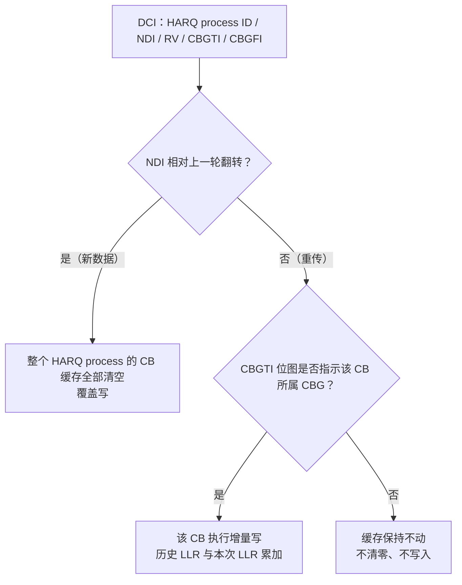
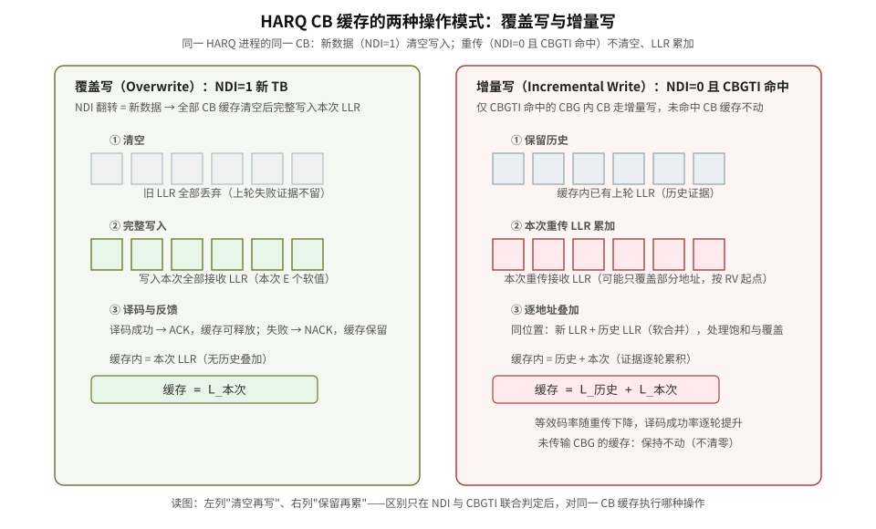

# T9.7 CB 增量写：HARQ 软缓存的两种操作模式

## 本节学习目标

[[T9.3_NR_LDPC_HARQ_soft_buffer_RV_k0|T9.3]] 讲了 NR LDPC 的软缓存、RV/k0 和 CBG 部分重传的协议语义；[[T4.3_HARQ_soft_combining_basics|T4.3]] 讲了 HARQ 软合并的 LLR 证据相加原理。本节把两者在**译码侧缓存操作**这个工程视角上收拢：UE 的 HARQ CB 缓存面对新数据和重传，分别执行**覆盖写（Overwrite）**与**增量写（Incremental Write）**两种操作。这是基带/硬件开发中高频出现的术语，也是面试常考点——本节给出从协议触发条件到缓存操作、再到硬件实现的完整闭环。

学完本节后，应能做到：

- 用一句话定义 CB 增量写，并说清它与覆盖写的本质区别。
- 从 DCI 字段（NDI、CBGTI）推导"本次传输对某个 CB 执行覆盖写还是增量写"。
- 完整走一遍初传与重传的数据流，含 LLR 累加的数值例子。
- 解释为什么 NR 按 CB 粒度做增量写（CBG 细粒度重传、缓存复用、LDPC 独立架构三方面）。
- 说明编码侧"增量读"与译码侧"增量写"如何配对构成完整 IR 流程。
- 列出硬件实现关注点（饱和/覆盖处理、定点累加、banking、接口字段）。
- 说明 CBG 配置（maxCodeBlockGroupsPerTransportBlock）如何决定增量写的粒度，以及 CBGTI 未命中时缓存保持的语义。（CBG 系统性讲解见 [[T9.8_CBG_code_block_group|T9.8]]）

## 一句话定义与术语定位

**CB 增量写**：同一 HARQ 进程中同一码块重传时，**不清空原有的 LLR 软缓存，把本次重传接收的软信息与缓存内历史软信息按地址累加写入**，实现增量冗余（IR）软合并；新数据传输则清空缓存执行覆盖写。

这个术语的三层归属：

| 层 | 归属 |
|:---|:---|
| 协议行为 | HARQ 软合并（IR）——协议定义"软信息要合并"，见 TS 38.212 §5.4.2 与 [[T4.3_HARQ_soft_combining_basics|T4.3]] |
| 缓存管理 | 软缓存按 CB 独立管理——NR R15 引入 CBG 后，缓存操作粒度从 TB 细化到 CB |
| 硬件术语 | "增量写"是基带译码侧对"LLR 累加写入"的工程叫法，对应 gNB 侧的"增量读" |

不是协议条款里的名词（协议里没有"Incremental Write"字样），而是**接收机实现层面对协议软合并语义的工程化命名**——这一点与"descriptor""rate recovery"等术语类似：协议规定行为，工程术语描述实现。

## 前置知识检查

本节假设你已掌握以下概念，这里给自包含的快速回顾（详细见链接讲义）：

- **TB / CB / CBG 与 IR**：传输块（Transport Block, TB）过大时按 LDPC 最大码长切分为码块（Code Block, CB），若干 CB 组成码块组（Code Block Group, CBG）作为重传与反馈粒度；HARQ 的增量冗余（Incremental Redundancy, IR）指重传发送不同 RV 起点的新校验比特，接收端叠加后等效码率降低（[[T3.2_transport_code_block_filler_bits|T3.2]]、[[T3.4_NR_LDPC_segmentation_rules|T3.4]]、[[T7.3_LTE_HARQ_soft_buffer_RV|T7.3]]、[[T9.3_NR_LDPC_HARQ_soft_buffer_RV_k0|T9.3]]、概念笔记 [[CBG_码块组]]）。
- **LLR 软合并与 NDI/CBGTI**：同一编码位置的多次接收证据，其 LLR 在对数域相加（[[T4.3_HARQ_soft_combining_basics|T4.3]]）；新数据指示（New Data Indicator, NDI）区分新 TB 与重传，码块组传输指示（CBG Transmission Indicator, CBGTI）位图标识本次重传哪些 CBG（TS 38.214 §5.1.7、TS 38.321 §5.3.2.2）。

## 协议触发条件：什么时候走增量写

增量写不是接收机自由发挥——它由 DCI 字段的联合语义决定，接收端只是忠实执行。

### 判定链

要点：

1. **NDI 的语义是"翻转"而不是"取值"**：TS 38.321 中 NDI 是 1 bit，新数据的判定是"与上一次相比是否 toggled"。第一次传输时 UE 也以"收到第一个传输"为准（38.321 §5.3.2.2 的流程）。因此"NDI=1 就是新数据"是简化的口语，严谨表述是"NDI 相对上一轮翻转"。
2. **RV 与 CBGTI 共同决定"本次读到哪些比特"**：重传的 RV 决定从 CB 循环缓存哪个起点读（增量读的偏移），CBGTI 决定哪些 CBG 出现。只有同时命中的 CB 才产生本次 LLR 输入。
3. **未传输 CBG 的缓存保持**：CBGTI 未指示的 CBG，其 CB 缓存**不能清零**——它们保留上一轮软信息，等未来的重传继续叠加。这正是"部分重传"与"全 TB 重传"在缓存管理上的关键差异。

### CBG 配置与分组（TS 38.214 §5.1.7 核对）

CBG 粒度由高层配置开启：`PDSCH-CodeBlockGroupTransmission`（接收侧，PDSCH-ServingCellConfig 中）。CBG 数量按 §5.1.7.1 确定：$M = \min(N, C)$，其中 $N$ 是 `maxCodeBlockGroupsPerTransportBlock` 配置的最大 CBG 数，$C$ 是 TB 的码块数——**配置决定了增量写的最小粒度单位**。分组的具体推导（$K_1/M_1$ 均衡分配）与配置细节见 [[T9.8_CBG_code_block_group|T9.8]]。

### CBGTI 与 CBGFI

- **CBGTI（传输指示）**：DCI 中长度 $M$ 的位图，bit m=1 表示本次传输包含 CBG m。接收端按位图决定哪些 CB 有本次 LLR。
- **CBGFI（反馈指示）**：DCI 中的 1 bit——为 1 时 UE 只需反馈**一个总的 ACK/NACK**（TB 级），为 0 时按 CBG 逐个反馈。它影响**反馈粒度**，不影响缓存操作本身，但工程上 CBGFI=0 时 UE 要知道每个 CBG 的译码结果才能构造多 bit 反馈。

CBGTI/CBGFI 字段的组合语义：CBGTI 管"本次传什么"，CBGFI 管"反馈怎么报"，二者配合实现"部分重传 + 按组反馈"的 NR 特性（LTE 没有这两个字段）。

## 完整数据流：从初传到多轮重传

两种操作模式的直观对照见下图：左列是覆盖写（NDI 翻转，清空再写），右列是增量写（NDI 未翻转，保留再累加）——同一 HARQ 进程的同一 CB 缓存，操作模式由 DCI 字段联合判定决定。

### 初传（NDI 翻转，覆盖写）

gNB 发送 TB 的全部 CB（含 TB CRC 与各 CB CRC），UE：

1. 定位 HARQ process（由 DCI 的 HARQ process ID）；
2. **清空该 process 的全部 CB 缓存**（覆盖写的"覆盖"含义：旧证据不再保留）；
3. 把本次接收的 LLR 按 rate recovery 写入各 CB 缓存（本次 $E$ 个软值，可能含打孔位置的中性 LLR）；
4. 逐 CB 译码；全部通过 TB CRC → 反馈 ACK，缓存可释放；部分 CB 失败 → 失败 CB 的缓存保留，反馈 NACK（粒度由 CBGFI 决定）。

### 重传（NDI 未翻转，增量写）

gNB 只重传 NACK 对应的 CBG，且发送**不同 RV**（从循环缓存不同起点读出的新校验比特）。UE 对 CBGTI 命中的每个 CB：

1. 该 CB 缓存**不清空**（历史 LLR 保留）；
2. 本次接收 LLR 按 RV 起点写入——与历史 LLR **逐地址累加**：

$$
L_{\text{cache}}[i] = L_{\text{cache}}[i] + L_{\text{new}}[i] \quad (\text{对本次覆盖的地址 } i)
$$

3. 累加后再次译码；等效码率降低（更多冗余比特参与），译码成功率提升；仍失败则缓存继续保留，等待下一轮重传继续累加。

**数值例子**：设某 CB 首次传输的某地址 LLR 观测为 $L_1 = +3.0$（含信道缩放），译码失败；重传（RV 不同）同地址观测 $L_2 = +2.2$（独立噪声）。若用覆盖写，缓存只有 $+2.2$；用增量写，缓存为 $+3.0 + 2.2 = +5.2$——置信度几乎翻倍，相当于两次独立观测的证据合并。这正是 [[T4.3_HARQ_soft_combining_basics|T4.3]] 的"证据相加"：**增量写是软合并在缓存操作层的实现**。

### 多轮重传

每轮重传都可能覆盖缓存的不同地址子集（RV 起点不同、E 可能不同）：某地址首次在第二轮出现 → 该地址从"无观测"变为写入；某地址两轮都覆盖 → 累加两次；某地址从未被覆盖 → 保持中性 LLR 或"未观测"标记。缓存管理需要逐地址跟踪**覆盖状态**（covered / not covered），这是软合并正确性的前提（[[T9.3_NR_LDPC_HARQ_soft_buffer_RV_k0|T9.3]] 的 coverage 概念）。

**数值例子：地址覆盖演化**。设某 CB 缓存 6 个地址，三轮传输的 RV 起点不同，覆盖子集与累加结果如下（未覆盖位置保持中性 LLR $L=0$，不参与译码证据）：

| 地址 | 轮 1（RV0） | 轮 2（RV2） | 轮 3（RV1） | 缓存最终值 |
|:---:|:---:|:---:|:---:|:---:|
| 0 | $+3.0$ | —（未覆盖） | — | $+3.0$ |
| 1 | $+2.1$ | $+2.2$ | — | $+4.3$ |
| 2 | $-1.4$ | $+1.0$ | $-0.8$ | $-1.2$ |
| 3 | — | $+0.8$ | $+1.6$ | $+2.4$ |
| 4 | — | — | $+2.0$ | $+2.0$ |
| 5 | — | — | — | $0$（从未覆盖） |

读表要点：地址 1 累加了两次（轮 1+轮 2），地址 3 只在轮 2/3 出现（轮 1 无观测），地址 5 三轮从未覆盖——它的缓存值**不能当成"观测为 0"**，译码时按中性 LLR（无证据）处理。覆盖状态与累加值必须逐地址独立跟踪。

## CB 粒度增量写的设计动机

### 1. 支撑 CBG 细粒度重传

NR 一个 TB 可有上百个 CB，若仅个别 CB 出错，按 CBG 只重传故障组——未出错的 CB 缓存不动，只对故障 CB 增量叠加。相比 LTE 的整 TB 重传，重传开销大幅下降（省带宽、省处理）。CB 独立缓存是 CBG 部分重传的**缓存侧前提**：没有独立缓存就无法"只更新故障 CB"。

### 2. 缓存资源最优复用

每个 CB 独立小缓存，叠加只在命中的 CB 上进行——URLLC/eMBB 等多业务共存时，冲突的 CB 增量更新，其余 CB 缓存不受干扰；缓存的分配/释放也以 CB 为粒度，避免整 TB 大缓存的低效占用。

### 3. 与 LDPC 独立编码架构天然匹配

协议规定每个 CB 拥有独立循环缓存，IR 冗余比特按 CB 独立生成（TS 38.212 §5.4.2 逐 CB rate matching）——译码侧按 CB 独立做软合并不需要跨 CB 同步，天然支持单 CB 增量写。若编码是整 TB 联合的（如某些级联码），则无法做到 CB 粒度合并。

## 编码侧配套：增量读

译码侧的"增量写"与编码侧的"增量读"成对构成完整 IR 流程：

| 侧 | 操作 | 内容 |
|:---|:---|:---|
| gNB 编码侧 | **增量读** | 从该 CB 的循环缓存按 RV 起点 $k_0$ 偏移分段读取 $E$ 个比特——每次重传读出**不同校验比特**（不同 RV 窗口，[[T9.3_NR_LDPC_HARQ_soft_buffer_RV_k0|T9.3]] 的 RV 窗口图） |
| UE 译码侧 | **增量写** | 把读出的比特经信道后形成的 LLR，按同一 $k_0$ 偏移写回/累加到该 CB 软缓存 |

两侧用**同一套坐标**（RV、$k_0$、$N_{cb}$、$E$）对齐：gNB 按 RV 从循环缓存"读"什么，UE 就按同一 RV 把 LLR"写"回什么位置。坐标错位 = 软合并错位 = 增益变损耗（甚至负增益）。这也是 descriptor 里 RV/k0 字段必须精确传递的原因（[[T9.0_TS38214_MCS_TBS_decoder_descriptor|T9.0]]、[[T4.6_decoder_interface_contracts|T4.6]]）。

## 硬件/基带实现视角

### 缓存操作模式表

| 模式 | 触发 | 缓存操作 | 用途 |
|:---|:---|:---|:---|
| CB 覆盖写 | NDI 翻转（新 TB） | 清空 CB 缓存，完整写入本次 LLR | 初次传输、新数据包 |
| CB 增量写 | NDI 未翻转 + CBGTI 命中 | 新旧 LLR 逐地址累加，保留历史软信息 | IR 重传、软合并译码 |
| CB 缓存保持 | NDI 未翻转 + CBGTI 未命中 | 不清零、不写入 | 部分重传中未涉及的 CBG |

### 硬件关注点

1. **LLR 累加与饱和**：定点域累加可能溢出——需按定点位宽饱和（saturate）处理；[[T5.1_fixed_point_numbers_for_LLR|T5.1]] 的定点 LLR 格式直接决定累加器的宽度与饱和策略。累加应在**量化后**进行还是**高精度累加后量化**，是精度/面积的权衡。
2. **覆盖状态跟踪**：每个软缓存地址需要 covered/not-covered 标记（[[T9.3_NR_LDPC_HARQ_soft_buffer_RV_k0|T9.3]] 的 coverage）——未覆盖地址在译码时应保持中性 LLR（或按设计置零），不能把"无观测"当成"观测为 0"。
3. **banking 与带宽**：增量写是读-改-写（read-modify-write）操作——先读历史 LLR、累加、写回。多 CB 并行译码时，bank 冲突与读写带宽是关键瓶颈（[[T5.2_memory_banking_buffering_basics|T5.2]]、[[T19.5_soft_buffer_HARQ_memory_architecture|T19.5]] 软缓存架构）。
4. **接口字段**：decoder descriptor 必须携带 HARQ process ID、NDI、CBGTI mask、RV、$k_0$、$E$、$N_{cb}$（[[T9.0_TS38214_MCS_TBS_decoder_descriptor|T9.0]]）——增量写控制器据此决定每个 CB 的操作模式；接口还应暴露 per-CB 的 `coverage`、`saturation_count` 诊断（[[T4.6_decoder_interface_contracts|T4.6]]）。
5. **多轮重传的正确性**：重传轮次可能改变 CBG 数量或 E（调度变化）——缓存按 CB 独立管理天然免疫组级变化，但 descriptor 必须每轮重建（不能假设与上轮相同）。

## 易混淆点与常见错误

| 混淆点 | 正确理解 |
|:---|:---|
| "增量写"是"只写新增比特" | 不对——是对**已覆盖地址做 LLR 数值累加**（对数似然相加），不是"只写没有的比特"。 |
| LTE 也有 CB 增量写 | LTE 按 CB 有独立软缓存（36.212 §5.1.4.1.2 的 Ncb），但无 CBG 粒度重传与缓存保持语义——"CB 增量写"的触发机制是 NR R15 引入 CBG 后才有的。 |
| 增量写适用于所有信道 | 仅 PDSCH/PUSCH 的 LDPC 信道存在；控制信道（Polar）无此机制（控制信息不做 IR 软合并）。 |
| NDI=1 就是新数据 | 严谨说法是"NDI 相对上一轮翻转"（38.321 的 toggled 判定）。 |
| CBGTI 未命中 = 缓存清零 | 相反——未命中的 CBG 缓存**保持不动**，等未来重传继续叠加。 |
| 增量写不依赖 RV | RV 决定本次覆盖缓存的地址子集——RV 错则累加位置错。 |
| 覆盖写后缓存仍可能残留旧值 | 覆盖写必须真正清空（或按"新 TB 不读旧缓存"处理），否则新旧 TB 软信息串扰。 |

## 协议锚点与证据边界

本节协议锚点全部核对自本地抽取件：

| 条款 | 核对内容 | 本地路径 |
|:---|:---|:---|
| TS 38.214 §5.1.7.1 | CBG 分组：`PDSCH-CodeBlockGroupTransmission` 配置、$M = \min(N, C)$、$K_1/M_1$ 分组公式 | `3GPP_Rel19/processed/TS_38.214_38214-j30/full.md` |
| TS 38.214 §5.1.7.2 / §6.1.5 | CBG 接收/发送流程（CBGTI 语义来源） | 同上 |
| TS 38.321 §5.3.2.2 | HARQ 信息组成：NDI、TBS、RV、HARQ process ID；NDI toggled 判定 | `3GPP_Rel19/processed/TS_38.321_38321-j20/full.md` |
| TS 38.212 §5.4.2 | 逐 CB rate matching、$I_{LBRM}$（limitedBufferRM 软缓存限制） | `3GPP_Rel19/processed/TS_38.212_38212-j30/full.md` |
| TS 38.212 §7.2.3 | TB 分段（CB 数与 $K_1/K_2$ 来源） | 同上 |

**证据边界**：
- "CB 增量写/增量读"是工程术语，协议文本无此措辞——本节明确标注为接收机实现语义（协议规定软合并行为，术语描述缓存操作）。
- CBG 分组的 $M_1/K_1$ 公式已与抽取件核对；CBGTI 位图长度与 `maxCodeBlockGroupsPerTransportBlock` 的 DCI 映射细节（38.212 §7.3.1）未逐字段展开，如需精确位宽需另行核对 DCI format 表。
- LLR 累加的"逐地址"实现（是否所有重传都覆盖全部 E 个地址）依赖 RV 窗口与 $N_{cb}$ 的几何关系——见 [[T9.3_NR_LDPC_HARQ_soft_buffer_RV_k0|T9.3]] 的 RV/k0 详述，本节不再重复。

## 自测题

1. 用一句话定义 CB 增量写，并指出它与覆盖写的本质区别。
2. DCI 中 NDI 未翻转且某 CB 不属于 CBGTI 指示的 CBG——该 CB 缓存应执行什么操作？
3. CBGFI=0 与 CBGFI=1 分别要求 UE 反馈什么粒度？影响缓存操作吗？
4. 为什么"增量写 = LLR 数值累加"而不是"只写新增比特"？
5. gNB 的"增量读"与 UE 的"增量写"靠什么对齐？坐标错位会造成什么后果？
6. 上表（覆盖演化例子）中地址 2 三轮都被覆盖，其缓存值经历了什么？地址 5 的缓存值应如何理解？
7. LTE 为什么没有 CB 增量写？
8. 定点实现中增量写最需要注意的两个问题是什么？

## 自测题参考答案

1. 同一 HARQ 进程同一 CB 重传时不清空缓存、把本次 LLR 与历史 LLR 按地址累加写入（IR 软合并）；覆盖写是清空后完整写入（新数据）。
2. 缓存保持不动——既不清零也不写入。
3. CBGFI=0 按 CBG 逐个反馈 ACK/NACK，CBGFI=1 反馈单个 TB 级结果；反馈粒度不影响缓存操作本身。
4. 因为软合并的本质是对数域证据相加——"新增比特"只是本次覆盖的地址子集，已覆盖地址必须累加，否则丢失历史证据。
5. 靠同一套坐标（RV、k0、Ncb、E）；错位会导致累加位置错误，软合并增益变损耗。
6. 地址 2 累加了三次：$-1.4 + 1.0 - 0.8 = -1.2$（每轮新观测都是独立证据）；地址 5 三轮从未覆盖，缓存保持中性 LLR（$0$）——它表示"无证据"，不能当"观测为 0"参与译码。
7. LTE 按 CB 有独立软缓存（36.212 §5.1.4.1.2 的 Ncb），但无 CBG 粒度重传与缓存保持语义——没有"按 CBG 触发增量"的协议机制。
8. 定点累加的饱和处理（溢出保护）；覆盖状态跟踪（covered/not-covered，未覆盖地址不能当观测为 0）。

## 与相邻章节的衔接

本节是 [[T4.3_HARQ_soft_combining_basics|T4.3]]（软合并原理）与 [[T9.3_NR_LDPC_HARQ_soft_buffer_RV_k0|T9.3]]（软缓存/RV/k0/CBG 协议语义）的**工程落点**：[[T4.3_HARQ_soft_combining_basics|T4.3]] 回答"为什么 LLR 相加"，[[T9.3_NR_LDPC_HARQ_soft_buffer_RV_k0|T9.3]] 回答"缓存放哪、RV 从哪读"，本节回答"缓存怎么操作（覆盖/增量/保持）"。硬件落点衔接 [[T5.1_fixed_point_numbers_for_LLR|T5.1]]（定点 LLR）、[[T5.2_memory_banking_buffering_basics|T5.2]]/[[T19.5_soft_buffer_HARQ_memory_architecture|T19.5]]（banking 与软缓存架构）、[[T4.6_decoder_interface_contracts|T4.6]]/[[T9.0_TS38214_MCS_TBS_decoder_descriptor|T9.0]]（descriptor 字段）。CBG 的系统性背景（配置、分组、反馈）已在本节正文完整展开，概念笔记 [[CBG_码块组]] 提供独立速查。

## 执行与证据记录

| 项目 | 记录 |
|:---|:---|
| 新增文件 | `docs/L2_协议算法/T9.7_CB_incremental_write.md`。 |
| 新增证据资产 | `docs/L2_协议算法/assets/T9.7_cb_overwrite_vs_incremental_write.svg`（覆盖写 vs 增量写对比，几何审计 R1-R11 通过，cairosvg 渲染验证通过）。 |
| 协议证据 | TS 38.214 §5.1.7（CBG 分组/接收流程）、TS 38.321 §5.3.2.2（HARQ 信息与 NDI）、TS 38.212 §5.4.2（逐 CB RM 与 ILBRM）。 |
| 证据边界 | "增量写"为接收机工程术语（协议无此措辞，已标注）；CBG 分组公式已核对抽取件；DCI 字段位宽映射未逐字段展开。 |
| LaTeX 审计 | `tools/audit_latex_render.py` 全检通过。 |

## 参考文献

- 3GPP TS 38.214, Rel-19, `38214-j30`, §5.1.7. Local path: `3GPP_Rel19/processed/TS_38.214_38214-j30`.
- 3GPP TS 38.321, Rel-19, `38321-j20`, §5.3.2.2. Local path: `3GPP_Rel19/processed/TS_38.321_38321-j20`.
- 3GPP TS 38.212, Rel-19, `38212-j30`, §5.4.2、§7.2.3. Local path: `3GPP_Rel19/processed/TS_38.212_38212-j30`.
- 本项目 [[T4.3_HARQ_soft_combining_basics|T4.3]]（软合并基础）、[[T9.3_NR_LDPC_HARQ_soft_buffer_RV_k0|T9.3]]（软缓存/RV/k0/CBG）、[[T9.0_TS38214_MCS_TBS_decoder_descriptor|T9.0]]（descriptor）、[[T5.1_fixed_point_numbers_for_LLR|T5.1]]（定点 LLR）、概念笔记 [[CBG_码块组]]。
