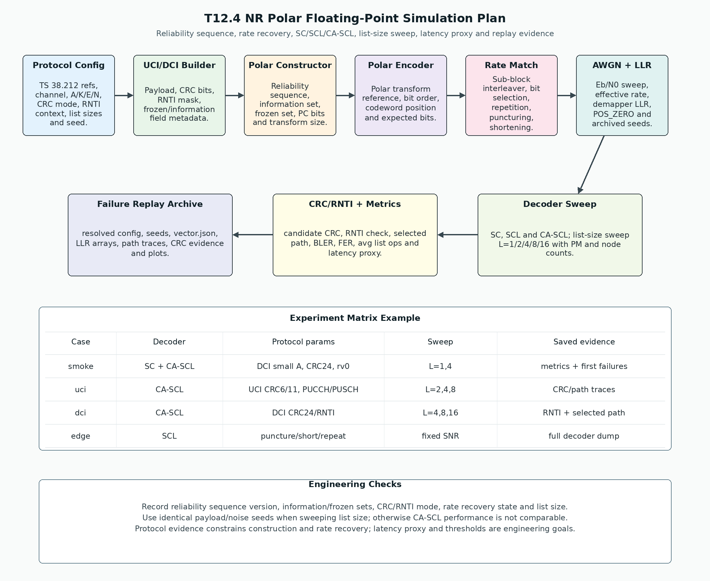

# T12.4 NR Polar 浮点仿真计划：从可靠性序列、速率恢复到 CA-SCL 列表扫描
## 本节学习目标

本节定义NRPolar的浮点仿真计划。Polar 在本项目中主要服务于控制信息译码，例如上行控制信息和下行控制信息。与 NR 低密度奇偶校验码数据链路不同，Polar 仿真更关心短块、可靠性序列、冻结位、速率恢复、逐次消除（Successive Cancellation, SC）、逐次消除列表（Successive Cancellation List, SCL）、循环冗余校验辅助 SCL（CRC-aided Successive Cancellation List, CA-SCL）、加性白高斯噪声信道和控制信息误检风险。


- 按3GPP TS 38.212 的 Polar code block segmentation、reliability sequence、Polar encoding、rate matching、UCI/DCI 调用链，定义一套可审计的浮点仿真配置。
- 解释 $A$、$K$、$E$、$N$、$L$、CRC type、无线网络临时标识（Radio Network Temporary Identifier, RNTI）和 rate recovery 状态为什么必须写入 descriptor。
- 说明可靠性序列如何决定 information set/frozen set，速率恢复如何把空口对数似然比放回 Polar codeword order。
- 比较 SC、SCL 和 CA-SCL 的仿真口径，设计 list-size sweep，并输出块错误率、BER、误检、CRC 通过率和延迟代理指标。
- 规划随机种子、输出目录、`metrics.csv`、`frames.jsonl`、失败 replay、图形结果、定点化承接和寄存器传输级/专用集成电路验证证据。

本节的核心不是“写一个能跑 CA-SCL 的脚本”这么简单，而是把协议构造、接收端算法、随机样本、list size、CRC/RNTI 选择和失败样本都绑定到同一份可复现证据。否则 list size 变大后 BLER 改善，到底来自 CA-SCL 本身、CRC 选择、rate recovery 地址、可靠性序列，还是随机样本不同，就无法判断。

## 前置知识检查

| 前置项 | 本节需要达到的程度 |
|:---|:---|
| T10.3 NR Polar 可靠性序列 | 知道 TS 38.212 Table 5.3.1.2-1 给出可靠性升序序列，选 information set 时从当前 $N$ 子序列末尾取 $K$ 个更可靠位置。 |
| T10.6 CRC 辅助 SCL | 知道 SCL 产生多条候选路径，CA-SCL 在 CRC/RNTI 通过的候选中选路径度量（Path Metric, PM）最优者。 |
| T10.7 NR Polar 速率恢复 | 知道 sub-block deinterleaving、bit selection reverse、puncturing、shortening、repetition 和 coded-bit deinterleaving 的接收侧语义。 |
| T12.1 Python Golden Model 工程布局 | 知道 `vector.json`、`seeds.json`、`metrics.csv`、`frames.jsonl`、失败 replay 和 evidence archive 的职责。 |
| LLR、BER/BLER 基础 | 知道本项目默认 `POS_ZERO`，即正 LLR 倾向 bit 0；知道 BER/BLER 是工程统计指标，不是 TS 38.212 直接给出的 decoder 合格线。 |

如果只记住一句话：NR Polar 浮点仿真必须同时固定“协议构造出的 bit 位置”和“接收机选择路径的算法状态”；只固定其中一边，CA-SCL 曲线就不可复现。

## Roadmap 卡片原文与本节执行范围

| 项目 | 内容 |
|:---|:---|
| 编号 | T12.4 |
| 前置 | T10.6, T10.7, T12.1 |
| Prompt | 请定义 NR Polar 浮点仿真计划：可靠性序列、速率恢复、SC/SCL/CA-SCL、列表大小扫描、CRC 检查、延迟代理指标、随机种子、输出和阈值。写作时参考本文“单节讲义弹性审计清单”，按本节性质取舍：基础课重理论概念、解释和推导；协议课重 3GPP 前因后果和接收侧流程；工程课重仿真、定点、RTL/ASIC、验证和证据记录。 |
| 产出 | `docs/L3/T12.4_NR_Polar_float_sim_plan.md` |
| 验收 | Learner can specify a reproducible CA-SCL performance experiment with list-size comparison. |
| 3GPP/证据 | TS 38.212 Rel-19 `38212-j30` §5.2.1/§5.3.1/§5.4.1/§6.3/§7.3。本地证据路径：`3GPP_Rel19/processed/TS_38.212_38212-j30`。 |

本节是工程仿真计划，不把 TS 38.212 的 Polar sequence 1024 项表和 sub-block interleaver pattern 重新排满全文。上游 T10.3 已完整表格化复现 TS 38.212 Table 5.3.1.2-1，T10.7 已复现 Table 5.4.1.1-1，并说明 puncturing/shortening/repetition 的接收端 LLR 语义。本节把这些协议资产接入一次可运行、可审计、可回放的 CA-SCL 浮点实验。

## 资料与协议边界

NR Polar 的协议主线集中在 TS 38.212。协议负责定义 CRC、code block segmentation、Polar construction、rate matching 以及 UCI/DCI 的调用链；SC/SCL/CA-SCL 的具体路径度量实现、list size 选择、延迟代理指标和 BLER 阈值属于接收端工程策略。

| 协议位置 | 本地证据 | 对浮点仿真的约束 | 接收端后果 |
|:---|:---|:---|:---|
| TS 38.212 §5.1 | `3GPP_Rel19/processed/TS_38.212_38212-j30/content.md:637-657` | CRC calculation 总入口，定义 CRC 附加和零余数检查语义。 | `crc_type`、CRC bit order 和 pass/fail 必须进入 trace。 |
| TS 38.212 §5.2.1 | `content.md:665-715` | Polar coding 的 code block segmentation 和 CRC attachment。 | descriptor 必须记录 $A$、CRC length、$K$、segmentation 和 CRC 后输入边界。 |
| TS 38.212 §5.3.1.1 | `content.md:839-871`；`tables/table_0011.csv/html` | Polar interleaving pattern。 | 若使用 input interleaver，必须记录 pattern 版本和反交织边界。 |
| TS 38.212 §5.3.1.2 | `content.md:873-883`；`tables/table_0012.csv/html` | Polar sequence、$Q_N$、information/frozen set、parity-check bit placement 和 $F^{\otimes n}$。 | decoder 必须使用同一 reliability sequence、information/frozen mask 和 PC bit 位置。 |
| TS 38.212 §5.4.1、§5.4.1.1-§5.4.1.3 | `content.md:1019-1125`；`tables/table_0019.csv/html` | sub-block interleaving、bit selection、coded-bit interleaving。 | rate recovery 必须恢复 codeword-order LLR，并区分 punctured/shortened/repeated。 |
| TS 38.212 §6.3.1.2.1/§6.3.1.3.1/§6.3.1.4.1 | `content.md:2325-2387` | 物理上行控制信道（Physical Uplink Control Channel, PUCCH）UCI encoded by Polar code 的 CRC、channel coding 和 rate matching 调用。 | UCI case 必须记录 CRC 长度、UCI payload 类型、PUCCH rate matching 边界。 |
| TS 38.212 §6.3.2.2.1/§6.3.2.3.1/§6.3.2.4.1 | `content.md:2863-2889` 附近 | 物理上行共享信道（Physical Uplink Shared Channel, PUSCH）UCI encoded by Polar code 调用 §6.3.1.2.1 和 rate matching。 | PUSCH UCI case 必须区分 UCI multiplexing 后的 $E$ 与 Polar decoder 输入 $N$。 |
| TS 38.212 §7.3.2/§7.3.3/§7.3.4 | `content.md:7177-7207` | DCI 24 bit CRC、RNTI 关系、Polar channel coding 和 rate matching。 | DCI case 必须记录 `rnti_type`、`rnti_value`、`crc_scramble_checked` 和 blind-detection context。 |

协议前因后果是：控制 payload 先根据 UCI/DCI 类型决定 CRC 和可能的 RNTI 边界，再进入 Polar construction；construction 根据 $A/K/E/N$、可靠性序列、rate matching 相关集合和 parity-check bit 规则确定哪些位置承载信息、CRC、PC bit 或 frozen 0；发送端 Polar 编码后执行 rate matching；接收端先做 rate recovery 得到 $N$ 个 codeword-order LLR，再由 SC/SCL/CA-SCL 译码并用 CRC/RNTI 选择最终候选。

## 浮点仿真总览图

T12.4 NR Polar Floating-Point Simulation Plan 覆盖 reliability sequence、rate recovery、SC/SCL/CA-SCL、list-size sweep、latency proxy 和 replay evidence。正文中的仿真链路如下：

```mermaid
flowchart LR
    N0["Protocol Config<br/>TS 38.212 refs, channel, A/K/E/N,<br/>CRC mode, RNTI context,<br/>list sizes and seed"]
    N1["UCI/DCI Builder<br/>Payload, CRC bits, RNTI mask,<br/>frozen/information field metadata"]
    N2["Polar Constructor<br/>Reliability sequence, information set,<br/>frozen set, PC bits and transform size"]
    N3["Polar Encoder<br/>Polar transform reference, bit order,<br/>codeword position and expected bits"]
    N4["Rate Match<br/>Sub-block interleaver, bit selection,<br/>repetition, puncturing, shortening"]
    N5["AWGN + LLR<br/>Eb/N0 sweep, effective rate,<br/>demapper LLR, POS_ZERO and archived seeds"]
    N6["Decoder Sweep<br/>SC, SCL and CA-SCL;<br/>list-size sweep L=1/2/4/8/16<br/>with PM and node counts"]
    N7["CRC/RNTI + Metrics<br/>candidate CRC, RNTI check,<br/>selected path, BLER, FER,<br/>avg list ops and latency proxy"]
    N8["Failure Replay Archive<br/>resolved config, seeds, vector.json,<br/>LLR arrays, path traces,<br/>CRC evidence and plots"]
    N0 --> N1 --> N2 --> N3 --> N4 --> N5 --> N6 --> N7 --> N8
    classDef config fill:#e3f2fd,stroke:#1565c0,color:#102027
    classDef build fill:#e8f5e9,stroke:#2e7d32,color:#102027
    classDef construct fill:#fff3e0,stroke:#ef6c00,color:#102027
    classDef encode fill:#ede7f6,stroke:#5e35b1,color:#102027
    classDef recover fill:#fce4ec,stroke:#ad1457,color:#102027
    classDef observe fill:#e0f2f1,stroke:#00897b,color:#102027
    classDef decode fill:#f1f8e9,stroke:#558b2f,color:#102027
    classDef metric fill:#fffde7,stroke:#f9a825,color:#102027
    classDef archive fill:#e8eaf6,stroke:#3949ab,color:#102027
    class N0 config
    class N1 build
    class N2 construct
    class N3 encode
    class N4 recover
    class N5 observe
    class N6 decode
    class N7 metric
    class N8 archive
```



| 流程块 | 正文含义 |
|:---|:---|
| Protocol Config | 固定 TS 38.212 refs、channel、$A/K/E/N$、CRC mode、RNTI context、list sizes 和 seed。 |
| UCI/DCI Builder | 生成 payload、CRC bits、RNTI mask，并记录 frozen/information field metadata。 |
| Polar Constructor | 生成 reliability sequence、information set、frozen set、PC bits 和 transform size。 |
| Polar Encoder | 记录 Polar transform reference、bit order、codeword position 和 expected bits。 |
| Rate Match | 执行 sub-block interleaver、bit selection、repetition、puncturing 和 shortening；接收端按这些状态做 rate recovery。 |
| AWGN + LLR | 扫描 Eb/N0，记录 effective rate、demapper LLR、`POS_ZERO` 符号约定和 archived seeds。 |
| Decoder Sweep | 比较 SC、SCL and CA-SCL，并在 $L=1/2/4/8/16$ 上统计 PM 和 node counts。 |
| CRC/RNTI + Metrics | 对候选执行 candidate CRC、RNTI check，记录 selected path、BLER、FER、avg list ops 和 latency proxy。 |
| Failure Replay Archive | 保存 resolved config、seeds、`vector.json`、LLR arrays、path traces、CRC evidence 和 plots。 |

Experiment Matrix Example 的实验矩阵至少包含这些行：

| Case | Decoder | Protocol params | Sweep | Saved evidence |
|:---|:---|:---|:---|:---|
| smoke | SC + CA-SCL | DCI small $A$、CRC24、rv0 | $L=1,4$ | metrics + first failures |
| uci | CA-SCL | UCI CRC6/11、PUCCH/PUSCH | $L=2,4,8$ | CRC/path traces |
| dci | CA-SCL | DCI CRC24/RNTI | $L=4,8,16$ | RNTI + selected path |
| edge | SCL | puncture/short/repeat，即 puncturing、shortening、repetition 三类 rate recovery 边界 | fixed SNR | full decoder dump |

Engineering Checks 包含三条硬检查：第一，记录 reliability sequence version、information/frozen sets、CRC/RNTI mode、rate recovery state 和 list size；第二，list size sweep 必须使用相同 payload/noise seeds，否则 CA-SCL 性能不可比较；第三，协议证据约束 construction 和 rate recovery，latency proxy 与 thresholds 属于工程目标。

本节流程顺序为：Protocol Config 固定 TS 38.212 证据、$A/K/E/N$、CRC/RNTI、list sizes 和 seed；UCI/DCI Builder 生成 payload 与 CRC；Polar Constructor 生成 reliability sequence、information set 和 frozen set；Polar Encoder 记录变换和 bit order；Rate Match 与 AWGN + LLR 生成接收端软信息；Decoder Sweep 比较 SC/SCL/CA-SCL 和 $L=1/2/4/8/16$；CRC/RNTI + Metrics 输出 BLER、延迟代理和失败 replay；Failure Replay Archive 保存后续复现所需的配置、LLR、路径、CRC 证据和图形结果。

## 仿真对象与不适用边界

| 范围 | 本节处理方式 |
|:---|:---|
| NR UCI/DCI Polar 控制信息 | 主线处理，覆盖 CRC、reliability sequence、rate recovery、SC/SCL/CA-SCL、list-size sweep 和 CRC/RNTI 选择。 |
| NR 下行共享信道/上行共享信道LDPC 数据链路 | 不属于本节，由 T12.3 处理；本节只在对比时说明 LDPC 与 Polar rate recovery 不可混用。 |
| 长期演进Turbo数据链路 | 不属于本节，由 T12.2 处理；本节不使用 LTE Turbo interleaver 或 circular buffer 规则。 |
| 控制信道 blind detection 全系统搜索 | 本节只记录 DCI RNTI context 和候选上下文，不展开完整物理下行控制信道（Physical Downlink Control Channel, PDCCH）candidate/aggregation level 搜索。 |
| 多径信道、同步、均衡、多输入多输出（Multiple-Input Multiple-Output, MIMO）检测 | 不属于本节；本节从理想 AWGN 或已得到的 demapper LLR 开始。 |
| BLER/误检门限 | 工程验收目标，不是 TS 38.212 强制给出的 decoder 性能线。 |

## Polar 仿真的参数身份

Polar 浮点仿真最先要固定一组参数：

| 符号/字段 | 含义 | 为什么必须记录 |
|:---|:---|:---|
| $A$ | 原始控制 payload bit 数。 | 决定 UCI/DCI 输入长度和 CRC 前边界。 |
| `crc_type`、`crc_len` | CRC 多项式类型和长度。 | CA-SCL final selector 需要知道哪些候选通过。 |
| $K$ | 进入 Polar encoding 的 bit 数。 | $K$ 通常包含 payload、CRC 和可能的辅助校验位，不等于 $A$。 |
| $E$ | rate matching 输出长度。 | 决定本次发送/接收多少 coded bits，也影响 puncturing/shortening/repetition。 |
| $N$ | Polar 母码长度，通常为 $2^n$。 | SC/SCL 树深、LLR 数组长度、transform 和 mask 都由 $N$ 决定。 |
| $L$ | SCL/CA-SCL list size。 | 决定候选数、PM 比较、CRC checker 数量、延迟和存储。 |
| `Q_sequence_hash` | 可靠性序列版本摘要。 | 确保软件和 RTL 使用同一张 TS 38.212 Table 5.3.1.2-1。 |
| `info_set_hash`、`frozen_set_hash` | information/frozen mask 摘要。 | 失败 replay 时验证路径分裂位置是否一致。 |
| `rate_recovery_state` | punctured/shortened/repeated/sub-block/coded-bit interleaving 状态。 | 判断 LLR 是否被放回正确 codeword position。 |
| `rnti_context` | DCI 的 RNTI 类型、值和 CRC 关系。 | DCI CRC pass 还必须匹配目标 RNTI context。 |

如果只记录 $N$ 和 $L$，仿真并不完整。两个实验都写 `N=128, L=8`，但一个用错可靠性序列方向，另一个把 shortened 位置填成 0 LLR，它们的曲线差异不是 CA-SCL 算法差异，而是协议构造和 rate recovery 错误。

## 可靠性序列与信息集合

Polar construction 的第一层问题是：$N$ 个 bit-channel 中，哪些位置适合承载信息，哪些位置应该固定为 frozen 0。TS 38.212 §5.3.1.2 给出 Polar sequence $Q$，并说明它按可靠性升序排列。对实际母码长度 $N$，先筛出小于 $N$ 的 bit index：

$$
Q_N=\left[q\in Q\mid q<N\right].
\tag{1}
$$

若暂不考虑 rate matching 和 parity-check bit 的额外集合，基础 information set 可抽象为：

$$
\mathcal{I}=\mathrm{last}_K(Q_N),
\tag{2}
$$

frozen set 为：

$$
\mathcal{F}=\{0,1,\ldots,N-1\}\setminus\mathcal{I}.
\tag{3}
$$

式 (1) 到式 (3) 的工程意义是：SCL 在 $\mathcal{I}$ 对应的位置需要分裂路径或读入信息约束，在 $\mathcal{F}$ 对应的位置只能判为 0。若把可靠性升序误读成降序，SCL 会在最不可靠的位置分裂，并在可靠位置强制 frozen，表现为高信噪比仍 CRC fail。

本节的 `vector.json` 必须保存：

| 字段 | 说明 |
|:---|:---|
| `Q_sequence_source` | `TS 38.212 Table 5.3.1.2-1 via T10.3`。 |
| `Q_N` | 当前 $N$ 子序列，可保存 hash 和可选完整数组。 |
| `info_indices` | information/CRC/PC bit 所在位置，至少保存 hash。 |
| `frozen_indices` | frozen 0 位置，至少保存 hash。 |
| `pc_indices` | 若当前配置使用 parity-check bits，必须记录位置与选择规则。 |

这里的 `pc_indices` 很重要。TS 38.212 §5.3.1.2 不只是给 information/frozen 集合，还涉及 parity-check bits 的放置。若某个仿真 case 暂不覆盖 PC bit，必须在配置中写 `pc_bits_enabled=false` 并说明该 case 只用于基础 SC/SCL 算法回归；若声称覆盖 UCI/DCI 协议 case，就不能绕开协议要求的 PC/CRC 相关构造。

## Rate Recovery 与 LLR 初始化

Polar rate matching 的发送端步骤包含 sub-block interleaving、bit collection/selection 和 coded-bit interleaving。接收端仿真必须反向执行：

1. 若 coded-bit interleaving 启用，先对 demapper LLR 做 coded-bit deinterleaving。
2. 根据 bit selection 结果，把 LLR 写回长度为 $N$ 的母码位置。
3. 对 punctured 位置写 0 LLR，表示没有观测证据。
4. 对 shortened 位置写强正 LLR，表示已知 0，符号前提是 `POS_ZERO`。
5. 对 repeated 位置累加多次接收 LLR，并在定点阶段饱和。
6. 执行 sub-block deinterleaving，得到 SC/SCL 需要的 codeword-order LLR。

接收端 LLR 初始化可写成：

$$
L_i=
\begin{cases}
0, & i\in\mathcal{P}_{\mathrm{punctured}},\\
L_{\max}, & i\in\mathcal{S}_{\mathrm{shortened}},\\
\sum_{m\in\mathcal{R}(i)}\ell_m, & i\in\mathcal{R}_{\mathrm{repeated}},\\
\ell_i, & \text{normal received}.
\end{cases}
\tag{4}
$$

式 (4) 是接收端工程表达，不是 TS 38.212 的原文公式。它把协议 bit selection 后的三类状态翻译为 decoder input LLR。关键是语义不能混用：punctured 是 unknown，shortened 是 known zero，repetition 是同一母码位置的多次观测累加。

## SC、SCL 与 CA-SCL

SC 是最基本的 Polar 译码：沿 Polar 树按 bit index 顺序逐位判决，frozen 位置强制 0，information 位置根据当前 LLR 做硬判决。SC 的优点是状态少、延迟可预测；缺点是一旦早期 information bit 判错，后续 partial sums 会被污染。

SCL 用 list size $L$ 缓解这个问题。在 information 位置，它不只保留一个判决，而是把候选路径分裂成 0/1 两种可能，并根据 PM 剪枝回最多 $L$ 条路径。设第 $t$ 个 information 位分裂前有候选集合 $\mathcal{P}_{t-1}$，分裂后可抽象为：

$$
\tilde{\mathcal{P}}_t=
\{(p,b)\mid p\in\mathcal{P}_{t-1},\ b\in\{0,1\}\}.
\tag{5}
$$

剪枝规则为：

$$
\mathcal{P}_t=\mathrm{best}_L(\tilde{\mathcal{P}}_t;\ PM).
\tag{6}
$$

CA-SCL 在 SCL 最后增加 CRC/RNTI 约束。设译码结束后候选为 $\mathcal{P}$，通过集合为：

$$
\mathcal{P}_{\mathrm{pass}}=
\{p\in\mathcal{P}\mid \mathrm{CRC}(p)=0\ \text{and}\ \mathrm{RNTI}(p)=\mathrm{match}\}.
\tag{7}
$$

若 $\mathcal{P}_{\mathrm{pass}}$ 非空，最终选择：

$$
p^\star=\arg\min_{p\in\mathcal{P}_{\mathrm{pass}}}PM(p).
\tag{8}
$$

若通过集合为空，接收端报告 decode fail。工程上可以保存 PM 最小路径用于调试，但不能把它当作有效 UCI/DCI 输出。

## 具体数值例子：同一帧下 L=1 与 L=4 的 CA-SCL 选择

设一个 toy DCI case 的真实 payload 为 `101001`，CRC/RNTI context 已固定，rate recovery 后得到同一组 LLR。这里只展示译码结束后的候选，不展开完整 Polar 树。若使用 SC 或 $L=1$，decoder 只保留 PM 最小路径：

| list size | path | PM | payload | CRC/RNTI | 输出 |
|---:|:---|---:|:---|:---|:---|
| 1 | P0 | 0.8 | `101011` | fail | decode fail |

这说明 $L=1$ 时，正确路径如果早期被剪掉，后面的 CRC checker 没机会看到它。若同一帧改用 $L=4$，SCL 保留更多候选：

| list size | path | PM | payload | CRC/RNTI | final selector |
|---:|:---|---:|:---|:---|:---|
| 4 | P0 | 0.8 | `101011` | fail | 丢弃 |
| 4 | P1 | 1.2 | `101001` | pass | 选中 |
| 4 | P2 | 1.9 | `001001` | fail | 丢弃 |
| 4 | P3 | 2.7 | `111001` | pass | 备选 |

CA-SCL 先形成通过集合：

$$
\mathcal{P}_{\mathrm{pass}}=\{P1,P3\}.
\tag{9}
$$

再在通过集合中选择 PM 最小路径：

$$
p^\star=P1.
\tag{10}
$$

这个例子给出三点工程直觉：第一，list size 增大不是直接“让 CRC 更强”，而是让正确路径更可能留到 CRC/RNTI 检查阶段；第二，PM 最小路径 P0 不能绕过 CRC/RNTI；第三，若 P1 和 P3 都通过，final selector 仍然需要稳定地按 PM 和 tie-breaker 选择，否则 replay 结果会不一致。

## 列表大小扫描

T12.4 的核心实验是 list-size sweep。必须让 $L=1,2,4,8,16$ 等配置使用同一批 payload seed、noise seed、协议 descriptor 和信噪比（Signal-to-Noise Ratio, SNR）点，只有 decoder list size 和与之直接相关的资源统计不同。

| $L$ | 对应 decoder | 预期观察 | 风险 |
|---:|:---|:---|:---|
| 1 | SC 或 SCL with $L=1$ | 最低复杂度，作为基线。 | 早期判错不可恢复，BLER 较差。 |
| 2/4 | 小列表 SCL/CA-SCL | 正确路径更可能保留，延迟和存储仍可控。 | PM 更新和 path copy 错误更难靠 CRC 定位。 |
| 8/16 | 常见高可靠控制配置候选 | BLER/误检可能改善。 | sorter、path memory、CRC checker 和最坏延迟显著增加。 |

比较时必须输出两个维度：

| 维度 | 字段 |
|:---|:---|
| 性能 | `bler`、`ber`、FER、`false_pass_rate`、`crc_pass_rate`、`rnti_match_rate`。 |
| 复杂度/延迟代理 | `avg_node_visits`、`max_node_visits`、`path_split_count`、`sorter_compare_count`、`crc_check_count`、`path_copy_count`、`avg_active_list_size`、`max_active_list_size`、`pm_update_count`。 |

这里的延迟代理不是纳秒级时序仿真。它是浮点阶段为后续定点和 RTL 提供的可比较指标：同一个配置下，$L$ 从 4 到 8 后，节点访问、路径复制、排序比较和 CRC 检查增加多少。后续硬件估算可以把这些计数映射到周期、静态随机存取存储器读写和比较器数量。

## AWGN、码率与 Eb/N0 口径

Polar 控制信息也需要固定噪声口径。对理想加性白高斯噪声和单位符号能量，建议沿用项目统一公式：

$$
\sigma^2=\frac{1}{2R_{\mathrm{eff}}Q_m\cdot 10^{E_b/N_0/10}}.
\tag{11}
$$

默认有效码率定义为：

$$
R_{\mathrm{eff}}=\frac{A_{\mathrm{payload}}}{E}.
\tag{12}
$$

其中 $A_{\mathrm{payload}}$ 是 CRC 前控制 payload bit 数，$E$ 是 rate matching 输出长度。若实验使用 $K/E$ 或 $(A+\mathrm{CRC})/E$，必须写入 `rate_definition`，不能混写。输出中至少记录：

| 字段 | 含义 |
|:---|:---|
| `rate_definition` | 默认 `payload_over_E`。 |
| `A_payload` | CRC 前 payload bit 数。 |
| `K_polar_input` | 进入 Polar coding 的 bit 数。 |
| `E_rate_matched` | rate matching 输出长度。 |
| `N_polar` | 母码长度。 |
| `R_eff` | AWGN 噪声缩放使用的有效码率。 |
| `Qm` | 调制阶数对应的每符号 bit 数。 |
| `energy_normalization` | 例如 `unit_symbol_energy`。 |

## 实验矩阵

| Case | 目的 | 配置 | 验收 |
|:---|:---|:---|:---|
| `smoke` | 快速发现可靠性序列、rate recovery、LLR 符号和 CRC/RNTI 选择错误。 | 小 $A/K/E/N$、少量 SNR 点、SC 与 CA-SCL $L=4$。 | 高 SNR 或无噪声下 CRC/RNTI 应通过，失败可 replay。 |
| `uci_crc` | 覆盖 UCI Polar 分支。 | UCI payload、CRC6/CRC11 或无 CRC 边界、PUCCH/PUSCH rate matching。 | CRC 长度、$E/N$、rate recovery 状态可追溯。 |
| `dci_rnti` | 覆盖 DCI CRC24/RNTI 边界。 | DCI payload、CRC24、RNTI context、CA-SCL。 | CRC pass 但 RNTI mismatch 的候选不得输出。 |
| `list_sweep` | 比较 SC/SCL/CA-SCL 和 list size。 | 同 seed，同 descriptor，$L=1,2,4,8,16$。 | 输出 BLER、误检、avg latency proxy 和失败样本。 |
| `rate_recovery_edge` | 验证 puncturing、shortening、repetition 和 interleaving。 | 人工构造边界 $E<N$、$E>N$、coded-bit interleaving on/off。 | LLR 初始化和地址 trace 与 T10.7 toy 规则一致。 |

## 输出文件与字段

```text
runs/2026-06-20T160000Z_nr_polar_awgn_seed20260620/
  config.resolved.yaml
  command.txt
  seeds.json
  metrics.csv
  frames.jsonl
  failures/
    frame_000117_pathset/
      vector.json
      input_llr.npy
      path_trace.jsonl
      crc_candidates.json
      selected_path.json
  plots/
    bler_by_list_size.png
    latency_proxy_by_list_size.png
  evidence.md
```

`metrics.csv` 至少包含：

| 字段 | 含义 |
|:---|:---|
| `run_id`、`config_hash`、`vector_schema_version` | 归档和 schema 标识。 |
| `channel_type` | `uci_pucch`、`uci_pusch`、`dci` 或 `synthetic_polar`。 |
| `decoder` | `sc`、`scl` 或 `ca_scl`。 |
| `list_size` | $L$；SC 写 1。 |
| `A_payload`、`K_polar_input`、`E_rate_matched`、`N_polar` | Polar descriptor 核心参数。 |
| `crc_type`、`crc_len`、`rnti_type`、`rnti_checked` | CRC/RNTI 选择边界。 |
| `Q_sequence_hash`、`info_set_hash`、`frozen_set_hash`、`pc_set_hash` | construction 身份。 |
| `rate_recovery_hash`、`punctured_count`、`shortened_count`、`repeated_count` | rate recovery 身份。 |
| `rate_definition`、`R_eff`、`Qm`、`ebn0_db` | AWGN 口径。 |
| `frames`、`bit_errors`、`block_errors`、`ber`、`bler`、`fer` | 曲线统计。 |
| `crc_pass_rate`、`false_pass_count`、`rnti_mismatch_count` | 控制信息可靠性统计。 |
| `avg_node_visits`、`avg_active_list_size`、`sorter_compare_count`、`path_copy_count`、`crc_check_count` | 延迟代理和复杂度统计。 |

`frames.jsonl` 至少包含 `frame_id`、`payload_seed`、`noise_seed`、`A`、`K`、`E`、`N`、`L`、`decoder`、`crc_type`、`rnti_context`、`rate_recovery_state`、`selected_path_id`、`selected_pm`、`crc_status`、`rnti_status`、`payload_match`、`first_mismatch` 和 `failure_dump`。

## 随机种子与命令模板

继承 T12.1 的 `canonical_json_sha256_u64le_v1` seed 派生规则。payload、CRC/RNTI perturbation、noise、rate recovery edge injection 和 tie-breaker 必须使用不同 stage seed。

基础 CA-SCL 曲线命令模板：

```bash
python3 -m decoder_golden.nr_polar.run_awgn \
  --config configs/nr_polar/dci_ca_scl_reference.yaml \
  --seed 20260620 \
  --snr-db 0.0:6.0:0.5 \
  --rate-definition payload_over_E \
  --energy-normalization unit_symbol_energy \
  --decoder ca_scl \
  --list-size 8 \
  --crc-mode dci_crc24_rnti \
  --latency-proxy node_visits,path_splits,sorter_compares,crc_checks,path_copies \
  --min-frames 1000 \
  --min-error-blocks 100 \
  --max-frames 200000 \
  --trace-output frames.jsonl \
  --save-failures 20 \
  --out runs/2026-06-20T160000Z_nr_polar_awgn_seed20260620
```

`list_sweep` 必须把不同 list size 放在同一个 run group 下比较。除 `--decoder`、`--list-size` 和输出子目录外，其他参数必须一致：

```bash
for L in 1 2 4 8 16; do
  decoder="ca_scl"
  if [ "$L" = "1" ]; then
    decoder="sc"
  fi

  python3 -m decoder_golden.nr_polar.run_awgn \
    --config configs/nr_polar/dci_ca_scl_reference.yaml \
    --seed 20260620 \
    --run-group 20260620_nr_polar_list_sweep \
    --snr-db 0.0:6.0:0.5 \
    --rate-definition payload_over_E \
    --energy-normalization unit_symbol_energy \
    --decoder "$decoder" \
    --list-size "$L" \
    --crc-mode dci_crc24_rnti \
    --latency-proxy node_visits,path_splits,sorter_compares,crc_checks,path_copies \
    --min-frames 1000 \
    --min-error-blocks 100 \
    --max-frames 200000 \
    --trace-output frames.jsonl \
    --save-failures 20 \
    --out "runs/20260620_nr_polar_list_sweep/L\${L}"
done
```

验收时比较各目录的 `resolved_config_hash_without_decoder_and_list_size`。这个 hash 必须一致；若不同，说明协议参数、SNR、随机样本、CRC/RNTI、rate recovery 或停止条件之一被改动，本轮不能用于 list size 横向比较。

若目标是完整比较 SC、纯 SCL 和 CA-SCL，不应只跑上面的 CA-SCL sweep。需要再加一个二维矩阵：`decoder=sc` 只在 $L=1$ 下有意义；`decoder=scl` 和 `decoder=ca_scl` 都应在 $L=2,4,8,16$ 下跑同一批样本。示例命令如下：

```bash
for decoder in sc scl ca_scl; do
  for L in 1 2 4 8 16; do
    if [ "\$decoder" = "sc" ] && [ "\$L" != "1" ]; then
      continue
    fi
    if [ "\$decoder" != "sc" ] && [ "\$L" = "1" ]; then
      continue
    fi

    python3 -m decoder_golden.nr_polar.run_awgn \
      --config configs/nr_polar/dci_ca_scl_reference.yaml \
      --seed 20260620 \
      --run-group 20260620_nr_polar_decoder_list_matrix \
      --snr-db 0.0:6.0:0.5 \
      --rate-definition payload_over_E \
      --energy-normalization unit_symbol_energy \
      --decoder "\$decoder" \
      --list-size "\$L" \
      --crc-mode dci_crc24_rnti \
      --latency-proxy node_visits,path_splits,sorter_compares,crc_checks,path_copies \
      --min-frames 1000 \
      --min-error-blocks 100 \
      --max-frames 200000 \
      --trace-output frames.jsonl \
      --save-failures 20 \
      --out "runs/20260620_nr_polar_decoder_list_matrix/\${decoder}_L\${L}"
  done
done
```

这组命令回答三个不同问题：SC 给出 $L=1$ 基线；纯 SCL 说明“只增加候选、不用 CRC/RNTI 过滤”能带来多少收益和误选风险；CA-SCL 说明 CRC/RNTI final selector 在相同候选规模下如何改变有效输出。

失败重跑：

```bash
python3 -m decoder_golden.nr_polar.replay \
  --run-dir runs/20260620_nr_polar_list_sweep/L8 \
  --frame-id 117 \
  --dump-level full \
  --show-path-trace \
  --show-crc-candidates
```

## 接收端伪代码

```text
输入：
  config：channel_type, A/K/E/N, CRC/RNTI mode, decoder, list sizes, SNR sweep
  protocol refs：TS 38.212 本地路径、表格回链和上游复现资产
  seed registry：payload/noise/rate_recovery_edge/tie_breaker seeds

对每个 ebn0_db：
  初始化 metrics
  while frames < min_frames or block_errors < min_error_blocks:
    若 frames 达到 max_frames，退出并标记 confidence_limited
    生成 UCI/DCI payload
    按 channel_type 附加 CRC，并为 DCI 设置 RNTI context
    按 TS 38.212 §5.2.1/§5.3.1 生成 K/N、reliability sequence、info/frozen/PC set
    生成参考 Polar codeword
    按 TS 38.212 §5.4.1 做 rate matching，记录 E、punctured/shortened/repeated/interleaver state
    经过 AWGN，生成 POS_ZERO LLR
    执行 coded-bit deinterleaving、bit selection reverse、sub-block deinterleaving
    对 decoder in {SC/SCL/CA-SCL} 和 list size:
      运行 Polar decoder
      记录 path split、PM、active list size、node visits、sorter compare、path copy
      对候选执行 CRC/RNTI check
      final selector 在通过候选中选 PM 最小路径
      输出 payload、CRC/RNTI 状态、first mismatch 和 path trace
    更新 BER/BLER/误检/延迟代理
    保存失败 dump 和 evidence
```

## 阈值与验收

| 阈值 | 建议字段 | 性质 |
|:---|:---|:---|
| 统计停止 | `min_frames`、`min_error_blocks`、`max_frames` | 工程统计策略。 |
| list sweep | `list_sizes=[1,2,4,8,16]` | 工程比较策略。 |
| 数值保护 | `llr_clip_float`、`pm_nan_guard`、`max_abs_pm_warn` | 浮点稳定策略。 |
| CRC/RNTI 输出 | `crc_stop_enabled`、`rnti_check_enabled`、`false_pass_policy` | 接收端交付策略。 |
| 性能目标 | `target_bler_by_case`、`target_false_pass_by_case` | 项目目标，不是协议强制门限。 |

本项目建议把阈值写成可执行验收线，而不是只写字段名。下面给一组工程模板，真实数值可以随后由项目基线更新，但每次报告必须有同等粒度的 pass/fail 规则：

| Case | 阈值例子 | 不通过时的处理 |
|:---|:---|:---|
| `smoke_no_noise` | `frames >= 100`，`block_errors = 0`，`crc_fail = 0`，`rnti_mismatch = 0`。 | 直接判定协议位序、CRC/RNTI、rate recovery 或 decoder 逻辑错误，不允许进入 BLER 曲线阶段。 |
| `rate_recovery_edge` | punctured LLR 全为 0，shortened LLR 全为 `+Lmax`，repeated 位置等于饱和前求和或饱和值，地址 trace 与 toy 期望完全一致。 | 判定 rate recovery 不合格；先修地址和 LLR 初始化，不能用 CA-SCL 参数掩盖。 |
| `dci_false_pass_guard` | 在指定 blind-detection toy set 中，`false_pass_count = 0`；若真实随机误检实验使用统计上限，则必须记录 `false_pass_upper_bound_95pct`，且不高于项目设定值。 | 判定 CRC/RNTI selector 或 RNTI context 处理不合格；必须保存所有 false-pass 候选。 |
| `list_sweep_reference` | 同一 SNR 点上，`ca_scl_L8.bler <= scl_L8.bler` 可作为趋势检查；若违反，必须解释 CRC/RNTI 过滤、样本数或实现差异。 | 标记 `trend_anomaly=true`，打开失败 replay 和置信区间检查。 |
| `confidence_limited` | 若 `block_errors < min_error_blocks` 且 `frames = max_frames`，该点不得写成“达到目标 BLER”，只能写 estimate 和 upper bound。 | 报告该点为统计受限；若该点用于验收，必须增加 `max_frames` 或降低验收深度。 |

例如 `smoke_no_noise` 的判定可以写成：

```text
PASS if frames >= 100
     and block_errors == 0
     and crc_fail == 0
     and rnti_mismatch == 0
     and replay_failures == 0
FAIL otherwise
```

若某个 DCI case 要求误通过风险，报告不能只写 `false_pass_rate=0`。当观测到 0 次 false pass 时，仍要写样本数和上界，例如 `false_pass_count=0/50000, false_pass_upper_bound_95pct=6.0e-5`。具体上界算法由 T12.5 统一定义；T12.4 只要求字段和验收口径必须存在。

基本验收项：

| 验收项 | 检查方式 |
|:---|:---|
| 协议位序 | 无噪声或极高 SNR 下，UCI/DCI CRC/RNTI 应通过。 |
| 可靠性序列 | `Q_sequence_hash/info_set_hash/frozen_set_hash` 与 T10.3 资产一致。 |
| Rate recovery | punctured 为 0 LLR，shortened 为强正 LLR，repeated 为累加。 |
| CA-SCL 选择 | PM 最佳但 CRC fail 的路径不能输出；通过候选中选 PM 最小。 |
| List-size 比较 | 不同 $L$ 使用同一 seed、descriptor 和 SNR 点。 |
| 曲线趋势 | BLER 随 $E_b/N_0$ 升高总体下降；$L$ 增大通常不应系统性变差。 |
| 失败回放 | replay 能复现 path trace、CRC candidates、selected path 和 first mismatch。 |

## 定点化承接

T13 需要从 T12.4 获得：

| 统计 | 用途 |
|:---|:---|
| `llr_min/max/percentile` | 输入 LLR 缩放、裁剪和 shortened 强 LLR 选择。 |
| `pm_min/max/percentile` | PM 位宽、归一化和饱和策略。 |
| `path_metric_delta_distribution` | sorter 比较位宽和 tie-breaker 规则。 |
| `active_list_size_histogram` | path memory 和 copy network 压力估计。 |
| `crc_check_count`、`path_copy_count` | CRC checker 复用策略和控制时序估计。 |
| `false_pass_samples` | CRC/RNTI 误通过风险和 blind detection 策略输入。 |

浮点阶段不能提前把 PM 和 LLR 硬截成目标位宽，但可以额外跑 `float_with_quant_probe`，模拟候选定点格式的裁剪和舍入，用于评估 T13 的量化损失。

## RTL/ASIC 映射

| RTL/ASIC 对象 | T12.4 输出来源 |
|:---|:---|
| Descriptor 寄存器 | `A/K/E/N/L`、`crc_type`、`rnti_context`、`decoder_mode`。 |
| Reliability ROM | `Q_sequence_hash`、`info_set_hash`、`frozen_set_hash`、`pc_set_hash`。 |
| Rate recovery 地址生成器 | sub-block pattern、bit selection reverse、coded-bit deinterleaving trace。 |
| LLR RAM | `input_llr.npy`、punctured/shortened/repeated masks。 |
| Path memory | `path_trace.jsonl`、active list size、path copy count。 |
| PM sorter | PM trace、sorter compare count、tie-breaker 规则。 |
| CRC/RNTI checker | `crc_candidates.json`、pass mask、RNTI match 状态。 |
| Final selector | selected path、selected PM、valid/fail 状态。 |

硬件不需要保存每个浮点 PM 的全部中间值，但失败帧必须能对齐输入 LLR、mask、path split、PM 排名、CRC/RNTI pass mask、最终选择和 payload mismatch。否则软件黄金模型和 RTL 对不上时，只能看到最终 CRC fail，无法定位是路径剪枝、PM 更新、CRC checker 还是 selector 错。

## 常见错误

| 错误 | 现象 | 定位方法 |
|:---|:---|:---|
| 可靠性序列方向反 | 高 SNR 仍大量 fail。 | 对比 T10.3 的 $Q_N$ 和 `info_set_hash`。 |
| $A$ 和 $K$ 混用 | CRC bit 未进入 information set，CA-SCL 无法通过。 | dump `A_payload/K_polar_input/crc_len`。 |
| punctured/shortened 混淆 | 某些 $E/N$ 配置异常差。 | 检查 rate recovery mask 和 LLR 初始化。 |
| coded-bit deinterleaving 漏用 | 高阶调制或特定 UCI/DCI case 异常。 | dump `i_bil/Qm` 和反交织前后序列。 |
| PM 最小路径绕过 CRC | 误输出无效 DCI/UCI。 | 检查 final selector 是否只比较 pass mask 内路径。 |
| RNTI 边界漏检 | 不属于当前 UE 的 DCI 被接收。 | dump `rnti_type/rnti_value/crc_scramble_checked`。 |
| list sweep seed 不一致 | 曲线差异不可解释。 | 比较 `resolved_config_hash_without_decoder_and_list_size`。 |
| PM NaN/Inf 未保护 | 曲线出现随机尖峰或 replay 不稳定。 | 检查 `pm_nan_guard` 和 LLR clip 记录。 |

## 工业用例

| 用例 | 价值 |
|:---|:---|
| 控制信道 CA-SCL list size 选型 | 用同一协议向量比较 $L=1/2/4/8/16$ 的 BLER、误检、延迟代理、path memory 和 CRC checker 压力。 |
| RTL 回归和现场问题回放 | 把失败控制信息的 descriptor、LLR、rate recovery mask、path trace、CRC/RNTI 状态和 selected path 导出为硬件 scoreboard 输入。 |

## 自测题

1. 为什么 Polar 浮点仿真不能只记录 $N$ 和 $L$？
2. list-size sweep 为什么必须使用同一 payload/noise seed？
3. punctured 和 shortened 的 LLR 初始化为什么不同？
4. CA-SCL 是否等于选 PM 最小路径？
5. 为什么 DCI case 要记录 RNTI context？

## 自测题参考答案

1. $N$ 只决定树深和母码长度，$L$ 只决定候选路径上限。真正决定路径分裂位置和 CRC/RNTI 选择的是 $A/K/E$、可靠性序列、information/frozen/PC set、rate recovery 状态和 CRC/RNTI context。

2. 否则不同 $L$ 看到的是不同随机样本，BLER 差异可能来自样本不同，而不是 list size 本身。比较 list size 时必须只改变 decoder/list-size 相关字段。

3. punctured 表示该位置没有发送，接收端没有证据，初始化为 0 LLR；shortened 表示该位置已知为 0，在 `POS_ZERO` 约定下应初始化为强正 LLR。

4. 不是。CA-SCL 要先用 CRC/RNTI 过滤候选，再在通过候选中选 PM 最小路径。PM 最小但 CRC/RNTI fail 的路径不能作为有效控制信息输出。

5. DCI 的 CRC parity bits 与 RNTI 存在边界。某条候选即使满足 CRC 余数关系，也必须匹配当前 RNTI context，才能作为当前 UE 的有效 DCI。

## 协议证据表

| 证据项 | TS 与 Rel-19 包 | 本地路径 | 状态 |
| :--- | :--- | :--- | :--- |
| CRC calculation | TS 38.212 `38212-j30` §5.1 | `3GPP_Rel19/processed/TS_38.212_38212-j30/content.md:637-657` | 已核验锚点；CRC 多项式由 T3.1 复现。 |
| Polar segmentation and CRC attachment | TS 38.212 §5.2.1 | `content.md:665-715` | 已核验锚点；公式 XML 不在本节重转写。 |
| Polar reliability sequence and encoding | TS 38.212 §5.3.1.2、Table 5.3.1.2-1 | `content.md:873-883`；`tables/table_0012.csv/html` | 上游 T10.3 已复现完整表图。 |
| Polar rate matching | TS 38.212 §5.4.1、§5.4.1.1-§5.4.1.3、Table 5.4.1.1-1 | `content.md:1019-1125`；`tables/table_0019.csv/html` | 上游 T10.7 已复现 pattern 表。 |
| UCI Polar chain | TS 38.212 §6.3.1/§6.3.2 | `content.md:2035-2387`；`content.md:2863-2889` 附近 | 已核验锚点；具体 UCI payload field 表不在本节复现。 |
| DCI Polar chain | TS 38.212 §7.3.2/§7.3.3/§7.3.4 | `content.md:7177-7207` | 已核验锚点。 |

## 未复现协议资产与关闭条件

| 候选资产 | 本节处理 | 关闭条件 |
|:---|:---|:---|
| TS 38.212 Table 5.3.1.2-1 | 上游 T10.3 已完整表格化复现，本节只消费 `Q_sequence_hash`。 | 若 T12.4 实现直接解析原表，必须把 T10.3 的 CSV/HTML、脚本和表格资产纳入 evidence archive，并验证 rank 覆盖 0..1023。 |
| TS 38.212 Table 5.4.1.1-1 | 上游 T10.7 已复现 32 项 pattern，本节只消费 pattern hash。 | 若实现内置 pattern ROM，必须跑 sub-block interleaver round-trip 单测并记录 ROM hash。 |
| UCI payload field tables | 本节只规划 Polar decoder 仿真，不复现所有 CSI/混合自动重传请求ACK field size 表。 | 若后续从高层 UCI 配置自动生成 $A$，必须复现实际使用的 TS 38.212/38.213/38.214 表格子集。 |
| PDCCH blind detection candidate set | 本节只记录 DCI RNTI context，不展开完整 PDCCH 搜索。 | 若后续评估误检率或 blind detection，必须补 PDCCH candidate、aggregation level、search space 和 RNTI sweep 的证据链。 |
| SC/SCL/CA-SCL PM 公式变体 | 本节给工程口径和 trace 字段，不规定唯一 PM 公式。 | 后续实现必须用 toy tree、无噪声向量和 PM tie-breaker regression 证明路径选择与文档一致。 |

## 图示


## 执行与证据记录

| 项目 | 记录 |
|:---|:---|
| 工作区 | `/home/yys/ClaudeCode/3gpp` |
| 写入文件 | `docs/L3/T12.4_NR_Polar_float_sim_plan.md` |
| Roadmap 卡片 | 已读取 `2026-06-19-lte-nr-decoding-learning-roadmap.md` 中 T12.4。 |
| 台账依据 | 已读取 `docs/audits/lte_nr_decoding_remaining_work_register.md` 阶段 11 与 T12.4 条目。 |
| 前置依据 | 已读取 `docs/L2/T10.3_NR_Polar_reliability_sequence.md`、`docs/L2/T10.6_CRC_aided_SCL_control_reliability.md`、`docs/L2/T10.7_NR_Polar_rate_recovery.md`、`docs/L3/T12.1_python_golden_model_project_layout.md`。 |
| 原始 manifest 核验 | `manifest.csv` 记录 TS 38.212 `38212-j30.zip/docx`，大小 `2111728`，SHA-256 `89275220eabea854a4aff5e0982cc78be830edb31a6a637abc99c17812a4d443`。 |
| processed manifest 核验 | TS 38.212 `status: processed`，paragraph `4193`，heading `165`，tables `321`，equations `4360`，media `1058`。 |
| README 核验 | 已读取 `TS_38.212_38212-j30/README.md`；确认 `content.md` 不是数学公式权威来源，公式应以 `equations/*.xml` 为准，表格优先看 `tables/*.html`。 |
| 未执行内容 | 本节是仿真计划，未运行真实 NR Polar BLER/误检仿真；后续实现必须生成 `metrics.csv`、`frames.jsonl`、失败 dump、BLER 曲线和延迟代理图。 |
| 审计结果 | `python3 tools/audit_lesson_terms.py docs/L3/T12.4_NR_Polar_float_sim_plan.md`：`LESSON_TERM_AUDIT_OK`。 |
| 审计结果 | `python3 tools/audit_markdown_headings.py docs/L3/T12.4_NR_Polar_float_sim_plan.md`：`MARKDOWN_HEADING_AUDIT_OK`。 |
| 审计结果 | `python3 tools/audit_lesson_depth.py --strict docs/L3/T12.4_NR_Polar_float_sim_plan.md`：`LESSON_DEPTH_AUDIT_OK`。 |
| 审计结果 | `python3 tools/audit_latex_render.py docs/L3/T12.4_NR_Polar_float_sim_plan.md`：`LATEX_RENDER_AUDIT_OK formulas=94`。 |
| 引用重建审计 | `python3 tools/audit_reference_rebuilds.py docs/L3/T12.4_NR_Polar_float_sim_plan.md` 返回 `REFERENCE_REBUILD_AUDIT_CANDIDATES`，退出码为 0；候选来自上游已重建协议表、PDCCH blind detection/UCI payload field 边界和正文工程公式引用，已在“未复现协议资产与关闭条件”中逐项说明。 |
| 只读复核 | 审核经理 Popper 首轮 `Critical=0`、`Important=2`、`Minor=2`；已修复阈值可执行例子、缩写首现、SC/SCL/CA-SCL 二维命令矩阵，标题保持 `## 本节学习目标` 以满足当前深度审计脚本；横向复核确认 T12.4 Prompt 覆盖充分，剩余问题为台账/矩阵同步而非正文覆盖缺口。 |

## 参考文献

- [3GPP, 2026] 3GPP TS 38.212 Rel-19 `38212-j30`, NR Multiplexing and channel coding. 本地路径：`3GPP_Rel19/processed/TS_38.212_38212-j30/`。
- [上游讲义] `docs/L2/T10.3_NR_Polar_reliability_sequence.md`，NR Polar 可靠性序列。
- [上游讲义] `docs/L2/T10.6_CRC_aided_SCL_control_reliability.md`，CRC 辅助 SCL 与控制信道可靠性。
- [上游讲义] `docs/L2/T10.7_NR_Polar_rate_recovery.md`，NR Polar 速率恢复。
- [上游讲义] `docs/L3/T12.1_python_golden_model_project_layout.md`，Python Golden Model 工程布局。
