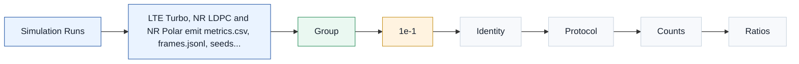

# T12.5 BER/BLER 曲线生成与报告：从 metrics.csv 到可复现性能证据
## 本节学习目标

本节讲解如何把LTE Turbo、NR LDPC和 NR Polar的浮点仿真结果整理成可复现、可审计、可比较的BER和块错误率曲线报告。这里的“报告”不是把几条线画到图上，而是让图上每一个点都能追溯到协议对象、随机种子、命令、CSV 原始计数、置信区间、停止原因和失败样本。


- 区分 BER、传输块BLER、码块BLER、控制块 BLER、FER和误通过率，避免把不同分母的指标混在同一条曲线上。
- 解释为什么3GPP TS 36.212/TS 38.212 规定的是循环冗余校验、分段、码块串接和控制信息 CRC/RNTI 语义，而不是直接规定某个仿真 BLER 门限。
- 设计统一 `metrics.csv`，让 LTE Turbo、NR LDPC 和 NR Polar 的曲线点具备同一套身份字段、计数字段、比例字段、置信区间字段、停止字段和 replay 字段。
- 使用 Wilson 置信区间、零错误上界、最小帧数、最小错误数、最大帧数和早停规则解释某个曲线点是否统计可靠。
- 制定 CSV/PNG/PDF 命名规则、失败诊断流程和报告验收标准，让性能图能进入后续定点、寄存器传输级和专用集成电路对比。

如果只记住一句话：曲线图是证据链的封面，不是证据链本身；没有计数、置信区间、seed、descriptor 和 replay 链接的 BLER 曲线不能作为译码器结论。

## 前置知识检查

| 前置项 | 本节需要达到的程度 |
|:---|:---|
| T4.5 译码器性能指标 | 知道 BER、BLER、FER、吞吐、延迟和统计波动的基本含义。 |
| T12.1 Python Golden Model 工程布局 | 知道 `metrics.csv`、`frames.jsonl`、`seeds.json`、`resolved_config.yaml`、失败 dump 和 evidence archive 的角色。 |
| T12.2 LTE Turbo 浮点仿真计划 | 知道 LTE Turbo 仿真会输出 TB/CB CRC 状态、Log-MAP/Max-Log-MAP 配置、混合自动重传请求/冗余版本（Redundancy Version, RV）和有效码率口径。 |
| T12.3 NR LDPC 浮点仿真计划 | 知道 NR LDPC 仿真会输出基图（Base Graph, BG）、$Z_c$、RV、CBG、syndrome、置信传播（Belief Propagation, BP）/Min-Sum（MS）/归一化 Min-Sum（Normalized Min-Sum, NMS）/偏移 Min-Sum（Offset Min-Sum, OMS）、CB CRC 和 TB CRC。 |
| T12.4 NR Polar 浮点仿真计划 | 知道 NR Polar 仿真会输出 $A/K/E/N/L$、连续抵消（Successive Cancellation, SC）/连续抵消列表（Successive Cancellation List, SCL）/CRC 辅助 SCL（CRC-Aided SCL, CA-SCL）、CRC/RNTI、误通过、路径度量和 list-size sweep。 |

若你还没掌握 T4.5，本节的 Wilson 区间和早停规则会显得像统计公式；若你还没掌握 T12.2 到 T12.4，本节的 CSV 字段会显得像杂乱日志。正确读法是：先明确“一个曲线点到底统计了什么协议对象”，再谈画图。

## Roadmap 卡片原文与本节执行范围

| 项目 | 内容 |
|:---|:---|
| 编号 | T12.5 |
| 前置 | T12.2, T12.3, T12.4 |
| Prompt | 请讲解如何生成、保存、绘制和解读 BER/BLER 曲线，包含置信区间、最小帧数、仿真早停、CSV/PNG 命名和失败诊断。写作时参考本文“单节讲义弹性审计清单”，按本节性质取舍：基础课重理论概念、解释和推导；协议课重 3GPP 前因后果和接收侧流程；工程课重仿真、定点、RTL/ASIC、验证和证据记录。 |
| 产出 | `docs/L3/T12.5_BER_BLER_curve_reporting.md` |
| 验收 | Learner can produce a report-ready BLER curve with reproducible seeds and metadata. |
| 3GPP/证据 | 工程任务；transport block CRC anchors from TS 36.212 Rel-19 `36212-j30` / TS 38.212 Rel-19 `38212-j30`. 本地证据路径：TS 36.212 -> `3GPP_Rel19/processed/TS_36.212_36212-j30`; TS 38.212 -> `3GPP_Rel19/processed/TS_38.212_38212-j30`. |

本节是工程报告任务，不复现新的 3GPP 表格或协议图。协议精读的重点是确认“哪些 pass/fail 事件能被叫作 TB、CB 或控制信息失败”。BER/BLER 的目标线、曲线是否足够好、仿真是否提前停止，都是项目工程策略；不能写成 TS 36.212 或 TS 38.212 强制要求。

## 统计推断基础

BER 和 BLER 的名称容易让人误解成“仿真器直接给出真实错误率”。实际不是这样。仿真看到的是有限样本：你发了 $N$ 个对象，错了 $E$ 个对象，于是得到一个观测比例。真实信道和真实译码器行为可以看成背后有一个未知错误概率 $p$，仿真只是用有限样本估计它。

这就是置信区间的来源：它要解决的问题不是协议如何编码，而是“有限样本下，这个曲线点有多可信”。直观例子是抛硬币。抛 10 次出现 0 次反面，不能推导出反面概率为 0；只能说样本太少，上界还很宽。译码仿真也一样：跑 10,000 个 TB 没错，不等于 TB BLER 为 0，只能说明在当前样本量下没有观察到错误。

因此本节的定义和推导分两层：

| 层次 | 要回答的问题 | 工程后果 |
|:---|:---|:---|
| 协议对象层 | 什么叫 TB 失败、CB 失败、控制信息失败？ | 必须回链 TS 36.212/38.212 的 CRC、分段和串接语义。 |
| 统计估计层 | 观察到 $E/N$ 后，真实错误概率可能落在哪个范围？ | 必须输出置信区间、零错误上界和停止原因。 |

把这两层混在一起会产生两个常见错误：第一，把 3GPP 的 CRC 规则误读成 BLER 门限；第二，把小样本观测值误读成真实性能。曲线报告的任务就是把协议定义、统计推断和工程证据分开记录。

## 资料与协议边界

协议给曲线报告提供统计对象的边界，而不是给曲线报告提供统计门限。TS 36.212 和 TS 38.212 的共同前因后果是：物理层先给 TB 或控制 payload 附加 CRC，再可能做 CB segmentation、CB CRC、channel coding、rate matching 和 code block concatenation。接收端反向处理后，CRC pass/fail 决定某个 TB、CB 或控制信息是否可交付；曲线报告把这些 pass/fail 事件统计成 BLER/FER/false-pass 等工程指标。

| 协议位置 | 本地证据 | 对曲线报告的约束 | 不提供什么 |
|:---|:---|:---|:---|
| TS 36.212 §5.1.1 | `3GPP_Rel19/processed/TS_36.212_36212-j30/TS_36.212_36212-j30_content.md:575-599` | LTE CRC calculation 和零余数语义，支撑 TB/CB CRC pass/fail。 | 不规定 BLER 目标值。 |
| TS 36.212 §5.1.2 | `TS_36.212_36212-j30_content.md:601-673` | LTE code block segmentation、CB CRC 和 filler 边界，支撑 CB BLER 分母。 | 不规定最小帧数或早停规则。 |
| TS 36.212 §5.1.5 | `TS_36.212_36212-j30_content.md:1025-1035` | LTE CB rate matching 输出串接成 TB 发送序列，支撑 TB 级曲线回链。 | 不规定 CSV 字段。 |
| TS 36.212 §5.2.2.1-§5.2.2.5 | `TS_36.212_36212-j30_content.md:1077-1109` | LTE 上行共享信道TB CRC、segmentation、Turbo coding、rate matching、concatenation 调用链。 | 不规定 Log-MAP 或 Max-Log-MAP 实现。 |
| TS 38.212 §5.1 | `3GPP_Rel19/processed/TS_38.212_38212-j30/TS_38.212_38212-j30_content.md:637-657` | NR CRC calculation 总入口，支撑 LDPC 和 Polar CRC pass/fail。 | 不规定仿真曲线门限。 |
| TS 38.212 §5.2.1 | `TS_36.212_36212-j30_content.md:665-715` | NR Polar segmentation and CRC attachment，支撑控制信息 BLER 和 CA-SCL final selector。 | 不规定 list size。 |
| TS 38.212 §5.2.2 | `TS_36.212_36212-j30_content.md:717-789` | NR LDPC segmentation and CB CRC，支撑 CB BLER、TB BLER 和 CBG 统计对象。 | 不规定 BP/MS/NMS/OMS 阈值。 |
| TS 38.212 §5.5 | `TS_36.212_36212-j30_content.md:1335-1351` | NR code block concatenation，支撑 TB 级统计与 CB 输出顺序。 | 不规定报告图样式。 |
| TS 38.212 §6.2.1/§6.2.3/§6.2.6 | `TS_36.212_36212-j30_content.md:1361-1415` | NR UL-SCH TB CRC、CB segmentation、CB concatenation 调用链。 | 不规定仿真停止条件。 |
| TS 38.212 §6.3.1.2.1/§6.3.1.3.1/§6.3.1.4.1 | `TS_36.212_36212-j30_content.md:2325-2387` | NR PUCCH 上的上行控制信息Polar 的 CRC6/CRC11、Polar channel coding 和 rate matching 边界，支撑 `control_bler` 的控制块对象定义。 | 不规定 PUCCH BLER 目标值。 |
| TS 38.212 §6.3.2.2.1/§6.3.2.3.1/§6.3.2.4.1 | `TS_36.212_36212-j30_content.md:2863-3009` | NR PUSCH 上 UCI Polar 复用 PUCCH UCI 的 segmentation/CRC/channel coding，并在 §6.3.2.4.1 给出 HARQ-ACK 等 UCI 的 rate matching 输入、输出和长度上下文，支撑 UCI-on-PUSCH 曲线对象。 | 不规定 UCI 仿真最小 trial 数。 |
| TS 38.212 §7.2.1/§7.2.3/§7.2.6 | `TS_36.212_36212-j30_content.md:3737-3783` | NR 下行共享信道/PCH TB CRC、CB segmentation、CB concatenation 调用链。 | 不规定性能验收阈值。 |
| TS 38.212 §7.3.2 | `TS_36.212_36212-j30_content.md:7177-7192` | NR 下行控制信息CRC24 和 RNTI scrambling 边界，支撑 false-pass、RNTI mismatch 和 DCI BLER 统计。 | 不规定 blind-detection 误检目标。 |

因此，曲线报告里的 `tb_bler`、`cb_bler`、`control_bler`、`false_pass_rate` 等字段必须能回到这些协议对象；但 `min_frames=1000`、`min_error_blocks=100`、`ci_method=wilson`、`confidence_limited=true` 等字段是工程统计口径。

## 曲线报告总览图




| 内容 | 说明 |
|:---|:---|
| Simulation Runs | Normalized CSV；Curve Builder；Report Package |
| Group | Columns；Why it matters |
| 1e-1 | 1e-2；1e-3 |
| Identity | run_id, decoder, channel, config_hash；compare only like-for-like curves |
| Protocol | TB/CB/Polar params, CRC mode, rate definition；tie BLER to protocol objects |
| Counts | frames, blocks, bits, error counts；raw evidence before ratios |
| Ratios | BER, BLER, FER, false-pass；report values and diagnostics |
| Confidence | ci_method, ci_low, ci_high；show statistical uncertainty |
| Stopping | min frames, min errors, max frames, stop reason；avoid false zero-BLER claims |
| Curve anomaly | non-monotonic BLER, zero-error point, wide CI, algorithm gap |
本节流程顺序为：LTE Turbo、NR LDPC 和 NR Polar 仿真先输出统一 `metrics.csv`、`frames.jsonl`、seed 和 failure dump；Curve Builder 只读取 CSV 和证据路径，不手工改点；报告包保存曲线图、原始 CSV、命令、协议锚点和失败 replay。曲线面板标题为 `Report-Ready BLER Curve`，横轴必须标成 `Eb/N0 (dB)`，纵轴必须标成 `BLER (log scale)`，并在纵轴刻度给出 `1e-1`、`1e-2`、`1e-3` 等对数量级。底部 `Failure Diagnosis Closure` 诊断闭环从曲线异常定位到 SNR row，再打开失败样本并 replay。

## 统计对象与分母

BER 和 BLER 的第一原则是先说清分母。若同一张图里一条线用 TB 数做分母，另一条线用 CB 数做分母，曲线数值不能直接比较。

| 指标 | 定义 | 适用对象 | 分母 |
|:---|:---|:---|:---|
| `ber` | 错误 bit 数除以总 bit 数。 | LTE Turbo、NR LDPC、NR Polar 都可输出。 | `bit_total`。 |
| `tb_bler` | TB CRC fail 或 TB 输出错误的数量除以 TB 总数。 | LTE Turbo、NR LDPC 数据链路。 | `tb_total`。 |
| `cb_bler` | CB CRC fail、syndrome fail 或 CB hard bits 错误的数量除以 CB 总数。 | LTE Turbo CB、NR LDPC CB。 | `cb_total`。 |
| `control_bler` | 上行控制信息或 DCI 控制块未正确交付的数量除以控制块总数。UCI 在 PUCCH/PUSCH 上可按 TS 38.212 §6.3 的 CRC/channel coding/rate matching 边界定义；DCI 按 TS 38.212 §7.3 的 CRC/RNTI 边界定义。 | NR Polar。 | `control_block_total`。 |
| `fer` | 一帧中任一目标对象失败即算 frame fail。 | 链路仿真、批量控制信息仿真。 | `frame_total`。 |
| `false_pass_rate` | 错误 payload 却通过 CRC/RNTI selector 的次数除以候选或试验次数。 | NR Polar DCI、blind-detection 风险实验。 | `false_pass_trials` 或 `candidate_total`，两者至少一个必须非空；若两者同时存在，绘图默认使用 `false_pass_trials`。 |
| `crc_pass_rate` | CRC pass 次数除以目标块总数。 | 停止控制和诊断。 | 对应 TB/CB/control block 总数。 |

基本估计量统一写成：

$$
\hat{p}=\frac{E}{N},
\tag{1}
$$

其中 $E$ 是错误事件数，$N$ 是对应分母。式 (1) 本身很简单，但工程错误通常出在 $E$ 和 $N$ 的定义。例如 NR LDPC 的 `cb_bler=1e-3` 不等价于 `tb_bler=1e-3`：一个 TB 可能包含多个 CB，只要其中一个 CB 失败，TB 就不能交付。

## 曲线横轴与码率口径

曲线横轴通常是 $E_b/N_0$ 或信噪比（Signal-to-Noise Ratio, SNR）。为了让三类译码器可比较，CSV 必须写清：

| 字段 | 含义 |
|:---|:---|
| `axis_name` | `ebn0_db`、`snr_db` 或 `esn0_db`。 |
| `ebn0_db`/`snr_db` | 当前仿真点的横轴数值。 |
| `rate_definition` | 例如 `payload_over_sum_E`、`tb_crc_over_sum_E`、`K_over_E`。 |
| `R_eff` | 实际用于噪声缩放的有效码率。 |
| `Qm` | 调制阶数。 |
| `energy_normalization` | 例如 `unit_symbol_energy`。 |
| `sum_E` | 本次发送的 rate matching 输出 bit 总数。 |

T12.2 到 T12.4 默认使用 `payload_over_sum_E`，即：

$$
R_{\mathrm{eff}}=\frac{A_{\mathrm{payload}}}{\sum E}.
\tag{2}
$$

若某个仿真使用 $K/E$ 或 `(payload+CRC)/E`，曲线横向位置会变化。报告可以同时比较不同口径，但必须把口径写进 `rate_definition` 和图例，不能把两种口径的点画成同一条线。

## 置信区间与零错误上界

单个曲线点的 $\hat{p}$ 只是观测值。若 $N=100$ 且 $E=1$，$\hat{p}=0.01$，但统计不确定性很大；若 $N=1{,}000{,}000$ 且 $E=10{,}000$，同样 $\hat{p}=0.01$，可信度完全不同。因此报告必须输出置信区间。

本项目建议默认使用 Wilson 区间。给定置信水平对应的 $z$ 值，常用 95% 置信水平取 $z=1.96$。定义：

$$
\mathrm{den}=1+\frac{z^2}{N},
\tag{3}
$$

$$
\mathrm{center}=
\frac{\hat{p}+\frac{z^2}{2N}}{\mathrm{den}},
\tag{4}
$$

$$
\mathrm{half}=
\frac{
z\sqrt{\frac{\hat{p}(1-\hat{p})}{N}+\frac{z^2}{4N^2}}
}{\mathrm{den}}.
\tag{5}
$$

于是：

$$
p_{\mathrm{low}}=\max(0,\mathrm{center}-\mathrm{half}),\qquad
p_{\mathrm{high}}=\min(1,\mathrm{center}+\mathrm{half}).
\tag{6}
$$

当 $E=0$ 时，不能把曲线点写成“BLER 等于 0”。此时只能写“观测到 0 次错误”，并给出上界。工程上常用 95% 近似规则：

$$
p_{\mathrm{upper},95\%}\approx \frac{3}{N}.
\tag{7}
$$

例如一个点跑了 50,000 个 TB 且没有失败，报告应写 `tb_fail_count=0`、`tb_total=50000`、`tb_bler=0`、`tb_bler_upper_95pct=6.0e-5`，并在图上用向下箭头或文字标出 upper bound。不能写“该点达到 $10^{-6}$ BLER”，因为 50,000 个样本支撑不了这个结论。

## 最小帧数、最小错误数与早停

早停的目标不是省时间本身，而是在计算预算内避免两种误判：低样本点被误认为稳定，高信噪比零错误点被误认为达到任意深的 BLER。

建议停止逻辑如下：

```text
for each snr_point:
  initialize counters
  while true:
    run one frame or batch
    update raw counts and first-failure dump
    if frames < min_frames:
      continue
    if target_error_count >= min_error_blocks:
      stop_reason = "min_errors_reached"
      break
    if frames >= max_frames:
      stop_reason = "max_frames_reached"
      confidence_limited = true
      break
    if wall_time >= max_wall_time:
      stop_reason = "timeout"
      confidence_limited = true
      break
```

推荐字段：

| 字段 | 说明 |
|:---|:---|
| `min_frames` | 每个 SNR 点至少运行的帧数或 trial 数。 |
| `min_error_blocks` | 目标错误事件至少累计多少个才认为该点有足够统计支撑。 |
| `max_frames` | 避免高 SNR 点无限运行的上限。 |
| `max_wall_time_sec` | 工程运行时间上限。 |
| `stop_reason` | `min_errors_reached`、`max_frames_reached`、`timeout`、`manual_abort`。 |
| `confidence_limited` | 未达到最小错误数却停止时置为 true。 |
| `primary_metric_for_stop` | `tb_bler`、`cb_bler`、`control_bler` 或 `false_pass_rate`。 |

一个正式报告可以接受 `confidence_limited=true` 的点，但必须在表格和图上标出来。若某条验收线依赖该点，报告应要求增加 `max_frames` 或降低验收深度。

## 统一 metrics.csv Schema

`metrics.csv` 建议一行对应一个 `run_id + snr_point + decoder_variant + protocol_case`。字段分组如下。

| 分组 | 字段 | 解释 |
|:---|:---|:---|
| 身份 | `run_id`、`run_group`、`created_at_utc`、`decoder_family`、`decoder_variant`、`case_name`、`channel_type` | 说明这一行是谁产生的。 |
| 可复现 | `config_hash`、`resolved_config_path`、`command_hash`、`git_commit`、`seed_root`、`seed_range`、`vector_schema_version` | 让同一行能被重新运行。 |
| 协议 | `spec_refs`、`protocol_anchor_hash`、`rate_definition`、`crc_mode`、`llr_sign_convention` | 连接协议证据和工程约定。 |
| 横轴 | `axis_name`、`ebn0_db`、`snr_db`、`Qm`、`R_eff`、`sum_E`、`energy_normalization` | 支撑曲线横轴和噪声缩放。 |
| 计数 | `frame_total`、`tb_total`、`cb_total`、`control_block_total`、`bit_total`、`candidate_total`、`false_pass_trials` | 分母必须可见。`false_pass_trials` 是 DCI 误通过实验的优先分母，`candidate_total` 是 blind-detection 候选分母。 |
| 错误计数 | `bit_error_count`、`tb_fail_count`、`cb_fail_count`、`control_fail_count`、`frame_fail_count`、`false_pass_count` | 分子必须可见。 |
| 比率 | `ber`、`tb_bler`、`cb_bler`、`control_bler`、`fer`、`false_pass_rate`、`crc_pass_rate` | 图上展示的比例。 |
| 置信区间 | `ci_method`、`ci_confidence`、`ber_low`、`ber_high`、`tb_bler_low`、`tb_bler_high`、`cb_bler_low`、`cb_bler_high`、`control_bler_low`、`control_bler_high`、`fer_low`、`fer_high`、`false_pass_rate_low`、`false_pass_rate_high` | 每个可画指标都要有自己的区间，不能只给 TB BLER。 |
| 零错误上界 | `ber_upper_95pct`、`tb_bler_upper_95pct`、`cb_bler_upper_95pct`、`control_bler_upper_95pct`、`fer_upper_95pct`、`false_pass_rate_upper_95pct` | 当某个指标错误数为 0 时，分别记录对应分母下的 95% 上界。 |
| 停止 | `min_frames`、`min_error_blocks`、`max_frames`、`stop_reason`、`confidence_limited` | 解释为什么停止。 |
| 诊断 | `first_failure_frame_id`、`first_failure_path`、`saved_failure_count`、`anomaly_flags`、`replay_command`、`primary_metric_for_stop`、`target_error_count`、`target_total_count`、`target_ci_low`、`target_ci_high` | 连接失败样本。`target_*` 是按 `primary_metric_for_stop` 从具体字段派生的诊断别名。 |

三类译码器还需要专属扩展字段：

| 家族 | 必填扩展字段 |
|:---|:---|
| LTE Turbo | `turbo_algorithm=logmap|maxlogmap`、`max_iter`、`iter_avg`、`interleaver_K`、`rv_idx`、`harq_process_id`、`tb_crc_fail_count`、`cb_crc_fail_count`。 |
| NR LDPC | `base_graph`、`Zc`、`lifting_set`、`rv_idx`、`k0`、`Ncb`、`decoder_variant=bp|ms|nms|oms`、`max_iter`、`iter_avg`、`syndrome_zero_rate`、`cbg_state`。 |
| NR Polar | `A`、`K`、`E`、`N`、`list_size`、`decoder_variant=sc|scl|ca_scl`、`crc_type`、`rnti_type`、`avg_active_list_size`、`pm_nan_count`。 |

宽表 schema 的优点是容易和绘图工具对接，缺点是字段较多。若后续实现更通用的长表 schema，也必须保留同等信息：`metric_name`、`event_count`、`total_count`、`rate`、`ci_low`、`ci_high`、`upper_bound_95pct`、`primary_metric_for_stop` 和 `protocol_object`。无论用宽表还是长表，核心要求不变：每个曲线点必须能说清“统计了哪个协议对象、分子是什么、分母是什么、置信区间来自哪个计数”。

`target_*` 不是新的统计口径，而是诊断别名。例如 `primary_metric_for_stop=tb_bler` 时，`target_error_count=tb_fail_count`、`target_total_count=tb_total`、`target_ci_low=tb_bler_low`、`target_ci_high=tb_bler_high`；`primary_metric_for_stop=false_pass_rate` 时，`target_error_count=false_pass_count`、`target_total_count=false_pass_trials` 或 `candidate_total`、`target_ci_low=false_pass_rate_low`、`target_ci_high=false_pass_rate_high`。这样诊断表可以统一写 `target_*`，同时不丢失具体指标字段。

## CSV、PNG 和报告命名规则

命名必须让文件离开目录后仍能看出基本身份，同时避免把所有参数塞进文件名。建议：

```text
reports/module12/
  metrics/
    20260620_nr_ldpc_bg1_awgn_payload_over_sum_E_cfg9f31a2_metrics.csv
  plots/
    20260620_nr_ldpc_bg1_awgn_tb_bler_ci95_cfg9f31a2.png
    20260620_nr_ldpc_bg1_awgn_tb_bler_ci95_cfg9f31a2.pdf
  bundles/
    20260620_nr_ldpc_bg1_awgn_cfg9f31a2_report.json
```

文件名建议包含：

| 片段 | 示例 | 作用 |
|:---|:---|:---|
| 日期 | `20260620` | 粗粒度归档。 |
| 家族 | `lte_turbo`、`nr_ldpc`、`nr_polar` | 防止跨家族混放。 |
| 关键 case | `bg1`、`dci_ca_scl`、`logmap` | 读文件名即可分辨曲线主题。 |
| 信道 | `awgn` | 区分加性白高斯噪声、fading 或 trace replay。 |
| 指标 | `tb_bler`、`control_bler`、`ber` | 图的纵轴。 |
| 置信 | `ci95` | 图是否有置信区间。 |
| config hash | `cfg9f31a2` | 防止同名覆盖。 |

`report.json` 至少保存 `plot_path`、`csv_path`、`source_run_dirs`、`command`、`config_hash`、`protocol_refs`、`audit_commands` 和 `first_failure_paths`。这样图被复制到评审材料后，仍能回到原始证据。

## 曲线生成命令模板

收集多个仿真目录：

```bash
python3 -m decoder_golden.reporting.collect_metrics \
  --runs runs/20260620_lte_turbo_awgn runs/20260620_nr_ldpc_awgn runs/20260620_nr_polar_awgn \
  --schema-version metrics_v1 \
  --require-fields run_id,decoder_family,config_hash,seed_root,axis_name,primary_metric_for_stop,ci_method,ci_confidence,stop_reason,confidence_limited \
  --out reports/module12/metrics/20260620_all_decoders_metrics.csv
```

绘制数据链路 TB BLER 曲线，适合 LTE Turbo 和 NR LDPC：

```bash
python3 -m decoder_golden.reporting.plot_curves \
  --csv reports/module12/metrics/20260620_all_decoders_metrics.csv \
  --filter "decoder_family in [lte_turbo,nr_ldpc]" \
  --metric tb_bler \
  --axis ebn0_db \
  --ci wilson \
  --confidence 0.95 \
  --group-by decoder_family,decoder_variant \
  --mark-confidence-limited \
  --out reports/module12/plots/20260620_data_channels_tb_bler_ci95_cfg9f31a2.png
```

绘制 NR Polar 控制块 BLER 曲线，适合 UCI/DCI 控制信息：

```bash
python3 -m decoder_golden.reporting.plot_curves \
  --csv reports/module12/metrics/20260620_all_decoders_metrics.csv \
  --filter "decoder_family == nr_polar" \
  --metric control_bler \
  --axis ebn0_db \
  --ci wilson \
  --confidence 0.95 \
  --group-by protocol_case,decoder_variant,list_size \
  --mark-confidence-limited \
  --out reports/module12/plots/20260620_nr_polar_control_bler_ci95_cfg9f31a2.png
```

绘制 NR Polar DCI 误通过风险曲线时，不要用 TB BLER 代替：

```bash
python3 -m decoder_golden.reporting.plot_curves \
  --csv reports/module12/metrics/20260620_all_decoders_metrics.csv \
  --filter "decoder_family == nr_polar and protocol_case contains dci" \
  --metric false_pass_rate \
  --axis ebn0_db \
  --ci wilson \
  --confidence 0.95 \
  --group-by rnti_type,decoder_variant,list_size \
  --mark-confidence-limited \
  --out reports/module12/plots/20260620_nr_polar_dci_false_pass_ci95_cfg9f31a2.png
```

生成报告包：

```bash
python3 -m decoder_golden.reporting.build_report_bundle \
  --csv reports/module12/metrics/20260620_all_decoders_metrics.csv \
  --plot reports/module12/plots/20260620_data_channels_tb_bler_ci95_cfg9f31a2.png \
  --plot reports/module12/plots/20260620_nr_polar_control_bler_ci95_cfg9f31a2.png \
  --plot reports/module12/plots/20260620_nr_polar_dci_false_pass_ci95_cfg9f31a2.png \
  --protocol-refs docs/L3/T12.2_LTE_Turbo_float_sim_plan.md docs/L3/T12.3_NR_LDPC_float_sim_plan.md docs/L3/T12.4_NR_Polar_float_sim_plan.md \
  --include-failures 20 \
  --out reports/module12/bundles/20260620_module12_curve_report.json
```

这些是工程命令模板。本仓库当前还没有真实 `decoder_golden.reporting` Python 包；本节只定义接口、字段和验收口径，执行记录中不得把模板说成已经跑出真实 BLER 曲线。

## 曲线解读规则

解读曲线时按下面顺序，不要直接看“哪条线最低”：

1. 首先检查图例和 `decoder_family/decoder_variant`，确认比较对象是否只改变了预期变量。例如 NR LDPC 比较 BP/MS/NMS/OMS 时，BG、$Z_c$、RV、seed、SNR 点和 stopping policy 应相同。
2. 看横轴口径，确认 `rate_definition`、`R_eff`、`Qm` 和 `energy_normalization` 一致。
3. 看每个点的 `N` 和错误数。错误数少于 `min_error_blocks` 的点只能作为趋势点，不应作为最终验收点。
4. 看置信区间。两条曲线的区间大量重叠时，不应声称某算法显著更优。
5. 看非单调点。BLER 随 $E_b/N_0$ 升高通常下降；若上升，优先检查样本数、seed、rate recovery、对数似然比符号和配置 hash。
6. 看失败 dump。高 SNR 仍失败的样本比低 SNR 失败更有诊断价值，因为它更可能暴露协议位序、CRC 边界或 decoder bug。

报告图上建议显式标注三类曲线语义。第一，waterfall 区域：标出 BLER 快速下降的 SNR 范围和目标 BLER 交点。第二，error-floor 风险：若高 SNR 点下降变慢，标注错误块数、置信区间和 `confidence_limited`，不要把少量失败直接写成真实错误平层。第三，capacity-gap 口径：若报告引用容量边界，必须同时写信道模型、码率、块长、目标 BLER 和边界来源；否则只写“relative gain vs baseline”，不要写“距容量多少 dB”。

这些标注仍然是报告解释，不是 3GPP 门限。曲线形态只能说明当前模型、实现和统计样本下观察到的行为；若没有失败 replay 和足够样本，报告应使用“risk”或“candidate”措辞，而不是确认某个失败机制。

## 失败诊断流程

曲线异常应从报告证据链闭环，而不是重跑大仿真碰运气。

| 异常 | 必查字段 | 可能原因 | 关闭动作 |
|:---|:---|:---|:---|
| BLER 非单调 | `frame_total`、`target_error_count`、`target_total_count`、`target_ci_low/high`、`seed_range` | 样本不足、随机波动、配置不一致。 | 增加样本或标 `trend_anomaly=true`。 |
| 高 SNR 仍大量失败 | `llr_sign_convention`、`first_failure_path`、`crc_mode` | LLR 符号反、rate recovery 地址错、CRC bit order 错。 | replay 第一失败帧，核对 descriptor 和 LLR。 |
| BLER=0 被误报 | `tb_bler_upper_95pct`、`cb_bler_upper_95pct`、`control_bler_upper_95pct`、`confidence_limited` | 没有按具体指标报告零错误上界。 | 重画图，标注 upper bound。 |
| 算法比较差异异常 | `resolved_config_hash_without_decoder` | 变体以外的参数被改动。 | 禁止横向比较，重跑同一 run group。 |
| NR Polar false pass | `rnti_type`、`rnti_value`、`crc_candidates` | CRC pass 但 RNTI context 错或 selector 错。 | 保存所有候选并 replay final selector。 |
| NR LDPC syndrome zero 但 TB CRC fail | `syndrome_zero_rate`、`cb_crc_status`、`tb_crc_status` | CB 重组、filler、CRC gate 或 hard-bit order 错。 | 追踪 CB -> TB concatenation。 |
| LTE Turbo 两种算法差距过大 | `turbo_algorithm`、`maxlog_correction`、`interleaver_K` | Log-MAP/Max-Log-MAP 口径、交织器或外信息缩放错。 | 对同一失败 CB dump alpha/beta/extrinsic。 |

最小 replay 包应包含：

```text
failure_000117/
  vector.json
  resolved_config.yaml
  seeds.json
  input_llr.npy
  expected_bits.npy
  decoder_trace.jsonl
  crc_status.json
  protocol_refs.json
  replay_command.txt
```

## 小型数值例子

设某 NR LDPC 仿真点统计 `tb_total=12000`、`tb_fail_count=36`，则：

$$
\hat{p}_{\mathrm{TB}}=\frac{36}{12000}=3.0\times 10^{-3}.
\tag{8}
$$

若 `min_error_blocks=100`，这个点虽然已经超过 `min_frames`，但错误数只有 36。报告可以画出该点和 Wilson 区间，但应写：

```text
stop_reason = max_frames_reached
confidence_limited = true
not qualified for final threshold claim
```

再看另一个高 SNR 点：`tb_total=50000`、`tb_fail_count=0`。观测值是：

$$
\hat{p}_{\mathrm{TB}}=0.
\tag{9}
$$

但 95% 零错误上界是：

$$
p_{\mathrm{upper},95\%}\approx \frac{3}{50000}=6.0\times 10^{-5}.
\tag{10}
$$

因此图上可以画一个落在下边界的点或箭头，表格必须写 `tb_bler_upper_95pct=6.0e-5`。若项目目标是 $10^{-5}$，这个点不能宣称通过。

## 接收端报告流程

```text
输入：
  run_dirs：T12.2/T12.3/T12.4 生成的仿真目录
  metrics rows：每个 SNR 点的 raw counts、ratios、CI、stop reason
  protocol refs：TS 36.212/38.212 本地锚点和上游讲义证据

对每个 run_dir：
  读取 resolved_config.yaml、seeds.json、metrics.csv、frames.jsonl
  校验 schema version、config hash、seed derivation 和 required fields
  对每个 metric row：
    校验分母非零，分子不大于分母
    计算 BER/BLER/FER/false-pass
    计算 Wilson CI 或零错误上界
    检查 stop_reason 与 confidence_limited
    记录 first_failure_path 和 replay_command
  合并同一 run_group 的曲线点
  检查横向比较只改变允许字段
  生成 PNG/PDF 和 report.json
  把审计命令、协议证据、未执行真实仿真边界写入报告包
```

## 定点化承接

T13 不只需要浮点曲线，还需要“浮点基线的证据质量”。本节输出给定点阶段的内容包括：

| 输出 | T13 用途 |
|:---|:---|
| 浮点 BER/BLER 曲线和 CI | 作为定点损失预算基线。 |
| `llr_min/max/percentile` 与饱和计数 | 决定输入 LLR 位宽和裁剪策略。 |
| `confidence_limited` 标记 | 避免用统计不足的点判断定点损失。 |
| failure replay 包 | 定点与浮点不一致时定位第一处差异。 |
| 统一 CSV schema | 让 Python 浮点、C/C++ 定点和 RTL 输出可同表比较。 |

定点对比时常见规则是：同一 SNR 点上，定点 BLER 不应显著劣于浮点基线超过预算。例如可以写 `fixed_tb_bler <= float_tb_bler * 1.10`，但只有当两侧置信区间和样本数足够时，这个规则才有统计意义。

## RTL/ASIC 映射

RTL/ASIC 阶段不直接读取论文式曲线图，而是需要可自动比对的计数器和报告字段：

| 硬件对象 | 曲线报告字段 |
|:---|:---|
| 输入计数器 | `frame_total`、`tb_total`、`cb_total`、`bit_total`。 |
| 错误计数器 | `tb_fail_count`、`cb_fail_count`、`control_fail_count`、`bit_error_count`。 |
| 停止控制 | `max_iter`、`iter_avg`、`crc_pass_rate`、`syndrome_zero_rate`、`stop_reason`。 |
| HARQ/soft buffer | `rv_idx`、`harq_process_id`、`cbg_state`、`repetition_count`、`saturation_count`。 |
| Polar list engine | `list_size`、`avg_active_list_size`、`crc_check_count`、`false_pass_count`。 |
| 回归 scoreboard | `first_failure_path`、`replay_command`、`config_hash`、`protocol_refs`。 |

硬件曲线报告必须使用同一 schema。若 RTL 仿真只能跑少量向量，就不要把 RTL 点画成同等统计深度的 BLER 曲线；应标成 directed regression pass/fail 或低样本 sanity point。

## 验证方法

| 验证项 | 检查方式 |
|:---|:---|
| Schema 完整性 | 对 `metrics.csv` 执行 required columns 检查，缺字段直接失败。 |
| 分子分母合法性 | 所有 error count 不得大于对应 total；total 为 0 的 ratio 不得画图。 |
| CI 计算 | 用固定输入 `E/N` 单测 Wilson 区间和零错误上界。 |
| 比较公平性 | 同一 run group 比较 `config_hash_without_variant`，不一致则禁止横向结论。 |
| 曲线图 | 检查坐标、图例、CI、confidence-limited 标记和输出路径。 |
| 失败 replay | 抽取前 N 个 failure path，运行 replay 命令并确认 first mismatch 一致。 |
| 协议回链 | 每个报告包都包含 TS 36.212/38.212 本地路径和上游 T12.2/T12.3/T12.4 文档路径。 |

## 常见错误

| 错误 | 后果 | 修正 |
|:---|:---|:---|
| 把 BLER=0 写成“无错误风险” | 高 SNR 曲线被严重美化。 | 写零错误上界和样本数。 |
| 混用 TB BLER、CB BLER 和 FER | 不同曲线不可比较。 | 图例和 CSV 字段必须写清指标分母。 |
| 只保存 PNG，不保存 CSV | 无法复查分子分母和 CI。 | PNG 必须和 CSV/report.json 成套归档。 |
| 不记录 `rate_definition` | 曲线横轴可能整体偏移。 | 每行记录 `R_eff`、`sum_E`、`Qm`。 |
| 算法比较时 seed 不同 | 差异可能来自随机样本。 | 使用同一 run group 和 seed registry。 |
| 平滑或插值伪造曲线 | 看起来漂亮但不是测量值。 | 只画测量点和线段，标出样本不足点。 |
| 隐藏 confidence-limited 点 | 报告结论过强。 | 图上用不同 marker 或注释标出。 |
| false-pass 没有单独统计 | 控制信道风险被 BLER 掩盖。 | NR Polar DCI 必须输出 `false_pass_rate` 和候选 dump。 |

## 工业用例

| 用例 | 价值 |
|:---|:---|
| 算法选型报告 | 比较 LTE Turbo Log-MAP/Max-Log-MAP、NR LDPC BP/MS/NMS/OMS、NR Polar SC/SCL/CA-SCL 时，保证只改变算法变量，曲线有 CI 和 replay 证据。 |
| 硬件签收基线 | 把浮点曲线、定点曲线和 RTL directed regression 放到统一 schema 下，避免硬件阶段只看单点 pass/fail。 |

## 自测题

1. 为什么不能只在报告中写 `BLER=0`？
2. `tb_bler` 和 `cb_bler` 为什么不能直接混画成一条“BLER”曲线？
3. Wilson 区间解决的是什么问题？
4. 比较 NR LDPC `ms` 和 `nms` 曲线时，哪些字段必须一致？
5. NR Polar DCI 曲线为什么还要统计 `false_pass_rate`？

## 自测题参考答案

1. 因为 `BLER=0` 只表示当前样本中观测到 0 次错误，不表示真实错误率为 0。必须同时给出样本数和零错误上界，例如 95% 上界约为 $3/N$。

2. `tb_bler` 的分母是 TB，总体交付失败由任一 CB 失败触发；`cb_bler` 的分母是 CB，反映单个码块译码失败。一个 TB 可能包含多个 CB，两者数值和含义不同。

3. Wilson 区间把有限样本造成的不确定性显示出来。它提醒读者同样的 $\hat{p}=E/N$ 在不同 $N$ 下可信度不同，也避免错误数太少时过度解读曲线差异。

4. BG、$Z_c$、RV、$E$、$N_{\mathrm{cb}}$、CBG 状态、SNR 点、seed、payload 集合、rate definition、max frames、min error blocks、LLR sign convention 和协议 descriptor 必须一致；只允许 decoder variant 及其参数不同。

5. DCI 是控制信息，CRC/RNTI selector 可能出现“错误 payload 却通过”的误通过风险。只看 control BLER 会漏掉这类风险，所以必须单独统计 `false_pass_rate`、RNTI context 和候选路径。

## 协议证据表

| 证据项 | TS 与 Rel-19 包 | 本地路径 | 状态 |
| :--- | :--- | :--- | :--- |
| LTE CRC calculation | TS 36.212 `36212-j30` §5.1.1 | `3GPP_Rel19/processed/TS_36.212_36212-j30/TS_36.212_36212-j30_content.md:575-599` | 已核验锚点；公式 XML 不在本节重转写。 |
| LTE segmentation and CB CRC | TS 36.212 §5.1.2 | `TS_36.212_36212-j30_content.md:601-673` | 已核验锚点。 |
| LTE CB concatenation | TS 36.212 §5.1.5/§5.2.2.5 | `TS_36.212_36212-j30_content.md:1025-1035`；`TS_36.212_36212-j30_content.md:1105-1109` | 已核验锚点。 |
| NR CRC calculation | TS 38.212 `38212-j30` §5.1 | `3GPP_Rel19/processed/TS_38.212_38212-j30/TS_38.212_38212-j30_content.md:637-657` | 已核验锚点。 |
| NR Polar CRC attachment | TS 38.212 §5.2.1 | `TS_36.212_36212-j30_content.md:665-715` | 已核验锚点。 |
| NR LDPC segmentation and CB CRC | TS 38.212 §5.2.2 | `TS_36.212_36212-j30_content.md:717-789` | 已核验锚点。 |
| NR CB concatenation | TS 38.212 §5.5/§6.2.6/§7.2.6 | `TS_36.212_36212-j30_content.md:1335-1351`；`TS_36.212_36212-j30_content.md:1409-1415`；`TS_36.212_36212-j30_content.md:3777-3783` | 已核验锚点。 |
| NR UCI on PUCCH Polar CRC/channel coding/rate matching | TS 38.212 §6.3.1.2.1/§6.3.1.3.1/§6.3.1.4.1 | `TS_36.212_36212-j30_content.md:2325-2387` | 已核验锚点。 |
| NR UCI on PUSCH Polar CRC/channel coding/rate matching | TS 38.212 §6.3.2.2.1/§6.3.2.3.1/§6.3.2.4.1 | `TS_36.212_36212-j30_content.md:2863-3009` | 已核验锚点。 |
| NR DCI CRC/RNTI | TS 38.212 §7.3.2 | `TS_36.212_36212-j30_content.md:7177-7192` | 已核验锚点。 |

## 未复现协议资产与关闭条件

| 候选资产 | 本节处理 | 关闭条件 |
|:---|:---|:---|
| TS 36.212/38.212 CRC 多项式完整公式 XML | 本节只引用 CRC pass/fail 语义；CRC 多项式复现由 T3.1 和对应协议讲义承担。 | 若报告脚本自动生成 CRC checker，必须把具体 CRC 多项式、bit order 和 XML/表格证据纳入 evidence archive。 |
| TS 36.212/38.212 码块分段公式 | 本节不重新推导分段公式，只使用上游 T3/T7/T9/T12.2/T12.3 的 descriptor 输出。 | 若曲线报告工具从 TB size 自动生成 CB 分段，必须复用上游 bit-exact 分段单测和协议表图证据。 |
| TS 38.212 DCI blind detection 全流程 | 本节只统计 DCI CRC/RNTI false pass，不展开 PDCCH candidate/search-space。 | 若评估真实 blind detection 误检，必须补 PDCCH 搜索空间、aggregation level、RNTI sweep 和候选数分母。 |
| TS 38.212 UCI small-block coding 表格 | 本节聚焦 Polar UCI 曲线报告；small-block UCI 不进入 T12.5 的 NR Polar 主线。 | 若后续报告 UCI 小块码性能，必须新增 `protocol_case=nr_uci_small_block`、重建相应表格和独立 control BLER 证据。 |
| 真实 BLER 曲线数据 | 本节只定义报告规范和命令模板，未运行真实 LTE/NR 大规模链路仿真。 | 后续实现 `decoder_golden.reporting` 并生成真实 CSV/PNG/PDF 后，回填报告包路径、hash、样本数和审计结果。 |
## 执行与证据记录

| 项目 | 记录 |
|:---|:---|
| 工作区 | `/home/yys/ClaudeCode/3gpp` |
| 写入文件 | `docs/L3/T12.5_BER_BLER_curve_reporting.md` |
| Roadmap 卡片 | 已读取 `2026-06-19-lte-nr-decoding-learning-roadmap.md` 中 T12.5。 |
| 台账依据 | 已读取 `docs/audits/lte_nr_decoding_remaining_work_register.md` 阶段 11 与 T12.5 条目。 |
| 前置依据 | 已读取 `docs/L1/T4.5_decoder_performance_metrics.md`、`docs/L3/T12.2_LTE_Turbo_float_sim_plan.md`、`docs/L3/T12.3_NR_LDPC_float_sim_plan.md`、`docs/L3/T12.4_NR_Polar_float_sim_plan.md`。 |
| 原始 manifest 核验 | `manifest.csv` 记录 TS 36.212 `36212-j30.zip/docx`，大小 `1420921`，SHA-256 `06a40a3b3214d372b0a6008ee1c885cd025ed30aef6399c9ea76a1d4593a1450`；TS 38.212 `38212-j30.zip/docx`，大小 `2111728`，SHA-256 `89275220eabea854a4aff5e0982cc78be830edb31a6a637abc99c17812a4d443`。 |
| processed manifest 核验 | `processed/manifest.json` 记录 TS 36.212 `source_name=36212-j30.docx`、`status=processed`、`output_dir=3GPP_Rel19/processed/TS_36.212_36212-j30`；TS 38.212 `source_name=38212-j30.docx`、`status=processed`、`output_dir=3GPP_Rel19/processed/TS_38.212_38212-j30`。 |
| 3GPP_译码知识库入口 核验 | 已读取 TS 36.212/38.212 3GPP_译码知识库入口；TS 36.212 记录 paragraphs `3430`、headings `144`、tables `250`、equations `23`、media `1034`；TS 38.212 记录 paragraphs `4193`、headings `165`、tables `321`、equations `4360`、media `1058`；3GPP_译码知识库入口 提醒公式以 `equations/*.xml` 为准，表格优先看 `tables/*.html`。 |
| 审核经理复核 | Hegel 审核 T12.5：Critical=0，Important=3，Minor=3；已修复 Important：补齐所有指标 CI/upper-bound 字段、拆分 TB BLER/control BLER/false-pass 命令模板、补 TS 38.212 §6.3 UCI PUCCH/PUSCH 协议锚点；同时修正 `tb_fail` 和通用 `error_count/ci_low/high` 命名。Copernicus 复核：Critical=0，Important=3，Minor=3；已修复 bundle 示例旧 `all_decoders_tb_bler` 残留、`target_*` 诊断别名 schema 落地、PUSCH UCI rate matching 锚点范围扩展到 `TS_36.212_36212-j30_content.md:2863-3009`，并处理首现展开和 `NR PUCCH 上上行控制信息` 文本错误。 |
| 审计结果 | `python3 tools/audit_lesson_terms.py docs/L3/T12.5_BER_BLER_curve_reporting.md`：`LESSON_TERM_AUDIT_OK`。 |
| 审计结果 | `python3 tools/audit_markdown_headings.py docs/L3/T12.5_BER_BLER_curve_reporting.md`：`MARKDOWN_HEADING_AUDIT_OK`。 |
| 审计结果 | `python3 tools/audit_lesson_depth.py --strict docs/L3/T12.5_BER_BLER_curve_reporting.md`：`LESSON_DEPTH_AUDIT_OK`。 |
| 审计结果 | `python3 tools/audit_latex_render.py docs/L3/T12.5_BER_BLER_curve_reporting.md`：`LATEX_RENDER_AUDIT_OK formulas=42`。 |
| 引用重建审计 | `python3 tools/audit_reference_rebuilds.py docs/L3/T12.5_BER_BLER_curve_reporting.md` 返回 `REFERENCE_REBUILD_AUDIT_CANDIDATES`，退出码为 0；候选来自本节明确声明不复现的协议公式/表格边界、DCI blind detection 边界和 3GPP_译码知识库入口 公式权威性提示，不构成本节失败。 |
| 未执行内容 | 本节未运行真实 LTE Turbo/NR LDPC/NR Polar BLER 仿真；未执行 `decoder_golden.reporting` 命令模板，因为当前仓库未实现该包。 |

## 参考文献

- [3GPP, 2026a] 3GPP TS 36.212 Rel-19 `36212-j30`, Multiplexing and channel coding. 本地路径：`3GPP_Rel19/processed/TS_36.212_36212-j30/`。
- [3GPP, 2026b] 3GPP TS 38.212 Rel-19 `38212-j30`, NR Multiplexing and channel coding. 本地路径：`3GPP_Rel19/processed/TS_38.212_38212-j30/`。
- [上游讲义] `docs/L1/T4.5_decoder_performance_metrics.md`，译码器性能指标。
- [上游讲义] `docs/L3/T12.2_LTE_Turbo_float_sim_plan.md`，LTE Turbo 浮点仿真计划。
- [上游讲义] `docs/L3/T12.3_NR_LDPC_float_sim_plan.md`，NR LDPC 浮点仿真计划。
- [上游讲义] `docs/L3/T12.4_NR_Polar_float_sim_plan.md`，NR Polar 浮点仿真计划。
