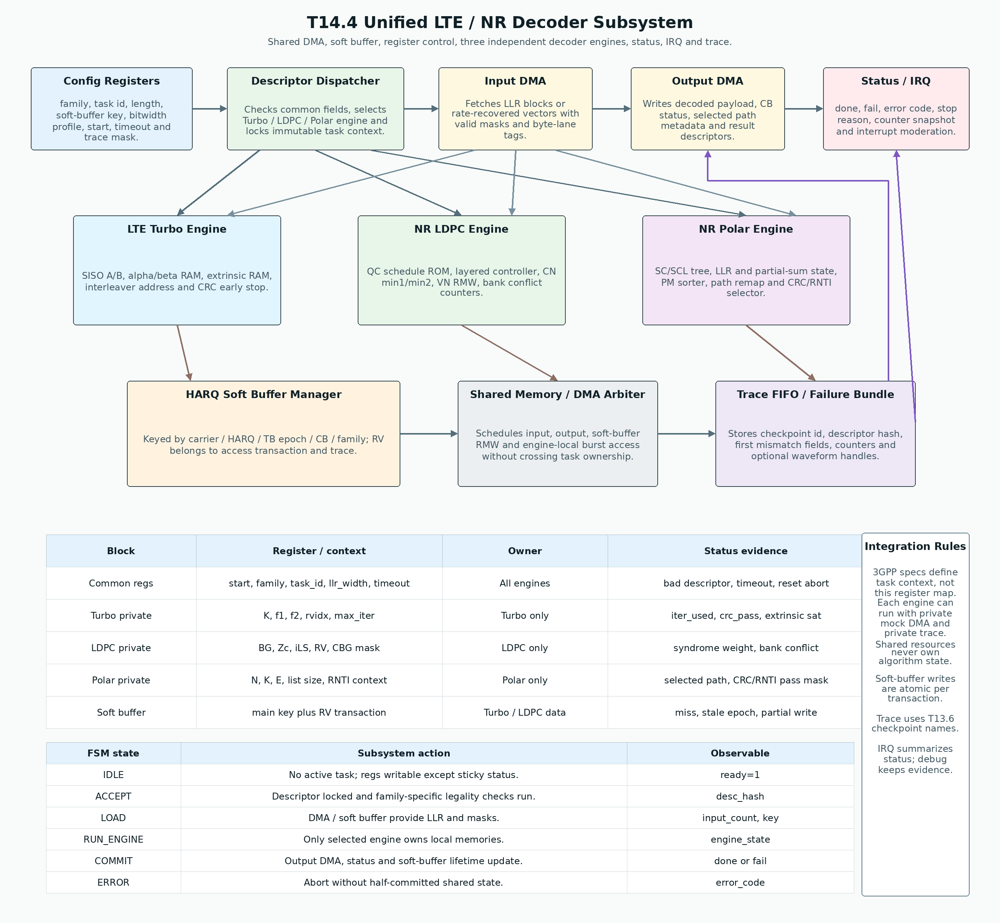

# T14.4 LTE/NR统一译码子系统架构：从三类译码引擎到共享 DMA、软缓存和状态中断
## 本节学习目标

本节设计一个统一译码子系统。这里的“统一”不是把LTE Turbo、NR LDPC和 NR Polar的算法揉成一个核心，而是把三类译码引擎放进同一个寄存器传输级/专用集成电路子系统：上层用同一种任务描述符、DMA、软缓存、配置寄存器、状态、中断请求（Interrupt Request, IRQ）和 trace/failure bundle 管理它们；每个引擎仍保留自己的算法状态和可独立测试边界。

本节第一次使用的常见缩写如下，后文不再反复展开：

| 名称 | 中文含义 |
|:---|:---|
| 长期演进 | LTE 数据链路在本项目中主要对应 Turbo 译码。 |
| 新空口 | NR 数据链路主要对应 LDPC 译码，控制信息主要对应 Polar 译码。 |
| 对数似然比 | 接收端输入软信息。 |
| 循环冗余校验 | 用于译码结果检错。 |
| 混合自动重传请求 | 用于重传与软合并上下文。 |
| 传输块 | 译码后面向上层交付的主要数据对象。 |
| 码块 | 信道编码和译码内部的分块对象。 |
| 静态随机存取存储器 | 保存软缓存和 engine-local 大数组。 |
| 调制与编码方案 | 调度上下文中的调制和码率组合。 |
| 传输块大小 | 调度和分段前后的 TB 尺寸上下文。 |
| 下行控制信息 | NR/LTE 下行控制消息上下文，本节只用于 Polar 控制任务例子。 |

先把本节会反复出现的对象列清：

| 术语 | 本节含义 |
|:---|:---|
| Unified decoder subsystem | 一个包含 Turbo、LDPC、Polar 三类译码引擎、共享 DMA、软缓存、寄存器、状态/错误/中断和 trace 的硬件子系统。 |
| Common descriptor | 三类译码任务都需要的公共身份字段，例如 `family`、`task_id`、长度、软缓存 key、位宽 profile、timeout 和 trace mask。 |
| Family extension | 只属于某一类译码器的私有字段，例如 Turbo 的 `K/f1/f2/rvidx`、LDPC 的 `BG/Zc/iLS/CBG mask`、Polar 的 `N/K/E/list_size/RNTI context`。 |
| Shared resource | 多个引擎共同使用但不保存算法私有状态的资源，例如输入 DMA、输出 DMA、软缓存管理器、trace FIFO 和状态汇总。 |
| Engine-local state | 只属于某个引擎的状态，例如 Turbo alpha/beta/extrinsic、LDPC CN/VN/message RAM、Polar path/partial-sum/PM/CRC state。 |
| Atomic soft-buffer transaction | 一次软缓存读改写要么完整提交，要么完整回滚或标记 abort，不能留下半写入证据。 |
| Failure bundle | 失败时保存 descriptor hash、soft-buffer key、checkpoint、计数器和 first mismatch 的证据包。 |


- 画出统一译码子系统顶层结构：配置寄存器、descriptor dispatcher、输入/输出 DMA、软缓存管理器、Turbo/LDPC/Polar 引擎、状态/IRQ 和 trace FIFO。
- 解释 3GPP 协议如何提供任务上下文，但不规定本节的寄存器地址、DMA 仲裁、IRQ 位定义或错误码编码。
- 区分 common register、family-private register、soft-buffer transaction 字段和 engine-local trace 字段。
- 说明为什么共享资源不能拥有算法私有状态，否则会破坏每个引擎的独立验证。
- 给出状态码、错误码、DMA/soft-buffer 流转、reset/timeout/abort 行为和独立测试入口。
- 规划 RTL/ASIC 验证：每个引擎能用 mock DMA、私有 trace 和固定 descriptor 单独跑，也能在统一子系统中做混合任务调度回归。

如果只记住一句话：统一译码子系统的核心不是“一个大 decoder”，而是“一个可调度、可隔离、可回放的系统外壳”，它把协议上下文变成任务，把 DMA/软缓存变成数据所有权，把三个独立引擎的结果变成统一 status/IRQ/trace。

## 前置知识检查

| 前置项 | 本节需要达到的程度 |
|:---|:---|
| T4.6 译码器接口契约 | 知道 descriptor、input、output、status、error、debug/trace 六类对象，以及 soft buffer key 为什么不能只用 RV。 |
| T5.2 存储分 bank 与缓存基础 | 知道 SRAM、bank、端口、软缓存、读改写、bank conflict 和共享仲裁。 |
| T5.4 RTL 状态机与握手 | 知道 `valid/ready`、start/done/error、reset、timeout、backpressure 和 CDC 风险。 |
| T13.6 Bit-exact 回归框架 | 知道三类译码器的 checkpoint manifest、failure bundle 和 status compare。 |
| T14.1 LTE Turbo RTL 微架构 | 知道 Turbo engine 的 SISO、alpha/beta、extrinsic、CRC early stop 和 trace 字段。 |
| T14.2 NR LDPC RTL 微架构 | 知道 LDPC engine 的 BG/$Z_c$/edge schedule、layered controller、bank conflict、syndrome/CRC 和 trace 字段。 |
| T14.3 NR Polar RTL 微架构 | 知道 Polar engine 的 SC/SCL、path memory、PM sorter、CRC/RNTI selector 和 trace 字段。 |

若尚未掌握 descriptor 和 soft buffer key 的关系，先回看 T4.6。本节默认你已经知道三类译码器内部差异；这里解决的是 SoC 级集成：谁接收任务、谁搬 LLR、谁拥有软缓存、谁产生中断、谁保留可复现证据。

## Roadmap 卡片原文与本节执行范围

| 项目 | 内容 |
|:---|:---|
| 编号 | T14.4 |
| 前置 | T14.1, T14.2, T14.3 |
| Prompt | 请设计统一译码子系统，包含 Turbo、LDPC、Polar 引擎、共享输入/输出 DMA、软缓存、配置寄存器、中断/状态和错误处理。边界必须清晰，使每个引擎可独立测试。写作时参考本文“单节讲义弹性审计清单”，按本节性质取舍：基础课重理论概念、解释和推导；协议课重 3GPP 前因后果和接收侧流程；工程课重仿真、定点、RTL/ASIC、验证和证据记录。 |
| 产出 | `docs/L3/T14.4_unified_decoder_subsystem_architecture.md` |
| 验收 | Learner can define top-level registers and dataflow for a multi-decoder accelerator. |
| 3GPP/证据 | LTE/NR 配置输入只作 context evidence。寄存器字段名、地址、IRQ bit 和错误码是实现设计，不能写成 3GPP 强制要求。 |

本节是集成架构课，不实现真实 RTL 源码，不给真实寄存器地址分配。正文给统一子系统结构、寄存器分层、DMA/软缓存流、状态/错误码、独立测试边界、伪代码和验证计划。真实 SystemVerilog testbench、覆盖率、综合和时序收敛在 T15 承接。

## 资料与协议边界

| 资料 | 本地路径 | 边界 |
| :--- | :--- | :--- |
| TS 36.212 | `3GPP_Rel19/processed/TS_36.212_36212-j30` | 协议不规定统一 decoder 寄存器表。 |
| TS 36.213 | `3GPP_Rel19/processed/TS_36.213_36213-j30_*` | 精确分册和字段来源在本节仍保留 `待核验`，不写成已核验寄存器字段。 |
| TS 36.321 | `3GPP_Rel19/processed/TS_36.321_36321-j20` | 本节只记录 soft-buffer/HARQ 上下文入口。 |
| TS 36.331 | `3GPP_Rel19/processed/TS_36.331_36331-j21` | 不抽取具体 RRC 信息元素到寄存器。 |
| TS 38.212 | `3GPP_Rel19/processed/TS_38.212_38212-j30` | 不规定接收机内部 DMA、软缓存或寄存器。 |
| TS 38.214 | `3GPP_Rel19/processed/TS_38.214_38214-j30` | 本节只作 context evidence，具体字段映射到 T14.6/T15 核验。 |
| TS 38.321 | `3GPP_Rel19/processed/TS_38.321_38321-j20` | 不把 MAC 状态机字段直接声明为硬件寄存器。 |
| TS 38.331 | `3GPP_Rel19/processed/TS_38.331_38331-j20` | 不复现具体 RRC 表格。 |
| T4.6 | `docs/L1/T4.6_decoder_interface_contracts.md` | 本节把接口契约升到子系统架构。 |
| T14.1-T14.3 | `docs/L3/T14.1*`、`T14.2*`、`T14.3*` | 本节不重写每个 engine 内部算法。 |

协议前因后果是：LTE/NR 接收机从 PHY/MAC/RRC 上下文得到“该译什么、长度多少、属于哪个 HARQ 上下文、如何解释 CRC/status”。统一译码子系统只接收已经整理后的任务上下文。3GPP 规定的是空口对象和流程，不规定本节的寄存器地址、DMA burst 大小、soft buffer bank 数、IRQ mask 位或错误码枚举。因此本节会反复把字段分为“协议上下文来源”和“实现寄存器设计”。

## 微架构总图


| 内容 | 说明 |
|:---|:---|
| Config Registers | family, task id, length, soft-buffer key, bitwidth profile, start, timeout and trace mask. |
| Descriptor Dispatcher | Checks common fields, selects Turbo / LDPC / Polar engine and locks immutable task context. |
| Input DMA | Fetches LLR blocks or rate-recovered vectors with valid masks and byte-lane tags. |
| Output DMA | Writes decoded payload, CB status, selected path metadata and result descriptors. |
| Status / IRQ | done, fail, error code, stop reason, counter snapshot and interrupt moderation. |
| LTE Turbo Engine | SISO A/B, alpha/beta RAM, extrinsic RAM, interleaver address and CRC early stop. |
| NR LDPC Engine | QC schedule ROM, layered controller, CN min1/min2, VN RMW, bank conflict counters. |
| NR Polar Engine | SC/SCL tree, LLR and partial-sum state, PM sorter, path remap and CRC/RNTI selector. |
| HARQ Soft Buffer Manager | Keyed by carrier / HARQ / TB epoch / CB / family; RV belongs to access transaction and trace. |
| Shared Memory / DMA Arbiter | Schedules input, output, soft-buffer RMW and engine-local burst access without crossing task ownership. |
本节流程顺序为：上方 common config registers 进入 descriptor dispatcher，dispatcher 选择 Turbo、LDPC 或 Polar engine；输入 DMA 提供 LLR 和 mask，输出 DMA 写回 payload/status；下方 soft buffer manager 和 shared memory/DMA arbiter 管理 HARQ 读改写；trace FIFO/failure bundle 保存 checkpoint；Status/IRQ 汇总 done/fail/error。本节图表中三类引擎只通过统一边界连接共享资源，内部算法状态仍归各自 engine 所有。

## 统一子系统的分层原则

统一子系统需要解决三个工程矛盾。

第一，三类译码器算法完全不同。Turbo 是迭代 SISO，LDPC 是 layered message passing，Polar 是路径搜索和排序剪枝。如果强行共享内部 RAM 或控制状态，验证会变得不可控。

第二，三类译码器外部流程又高度相似。它们都要接收 descriptor、读取 LLR、访问 soft buffer、输出 payload/status、处理 CRC 或 syndrome、报告错误、留下 trace。

第三，系统资源有限。三个引擎不一定同时工作，DMA、软缓存 SRAM、寄存器总线、IRQ 和 trace FIFO 适合共享；但共享资源必须只管理数据所有权和流控，不能偷偷保存算法私有状态。

因此本节采用四层结构：

| 层级 | 负责什么 | 不负责什么 |
|:---|:---|:---|
| Register/control layer | common config、family extension、start/status/error/IRQ。 | 不解释算法公式。 |
| Data movement layer | 输入 DMA、输出 DMA、soft-buffer RMW、shared memory arbiter。 | 不决定 Turbo/LDPC/Polar 的译码路径。 |
| Engine layer | Turbo、LDPC、Polar 私有状态和算法控制。 | 不拥有系统级 HARQ 生命周期。 |
| Evidence layer | trace FIFO、failure bundle、counter snapshot、first mismatch。 | 不替代正式 output/status。 |

这个分层的好处是每个 engine 可独立测试：给它 mock descriptor、mock input DMA、私有 soft-buffer stub 和私有 trace sink，就能跑 T14.1-T14.3 的单引擎回归；接入统一子系统后，再测试共享资源仲裁、跨任务隔离和中断状态。

## 基础理论直觉：统一的不是算法，而是所有权

零基础看统一译码子系统时，最容易误解“统一”这两个字。统一不是让 Turbo、LDPC、Polar 共用一个公式，也不是把三个引擎做成一个巨大状态机。真正统一的是四类所有权。

| 所有权 | 白话解释 | 硬件对象 |
|:---|:---|:---|
| 任务所有权 | 当前正在译哪个 block，配置是否已经锁住。 | descriptor shadow register、`task_id`、`family`。 |
| 数据所有权 | 某一拍 LLR、payload 或 status 是否已经被接收方拿走。 | `valid/ready`、DMA beat counter、`last` tag。 |
| 缓存所有权 | 某个 soft buffer 槽位属于哪个 HARQ/TB/CB 上下文。 | soft buffer key、transaction id、commit valid bit。 |
| 证据所有权 | 某个 trace/checkpoint 是哪个任务、哪个 engine、哪个失败点产生的。 | `descriptor_hash`、checkpoint id、failure bundle pointer。 |

这个直觉很重要。算法公式回答“怎么译码”；子系统架构回答“谁有权开始、谁有权写缓存、谁有权标记完成、谁有权报告失败”。如果所有权不清楚，常见结果是：LDPC 任务还在写 soft buffer，软件已经读到 done；Polar 控制任务复用了数据 TB 的 HARQ key；Turbo 失败 trace 被下一次 LDPC 任务覆盖；reset 中断后半写入的软信息被下一次重传当成真实证据。

用状态转移看，统一子系统本质上是在保护不变量：

$$
\mathrm{task\_owner}
\Rightarrow
(\mathrm{descriptor\_locked}
\land \mathrm{engine\_onehot}
\land \mathrm{status\_tagged}).
\tag{1}
$$

式 (1) 的意思是：只要一个任务拥有子系统，descriptor 必须已经锁存，只能有一个 engine 被选中，status/trace 必须带同一个 task tag。这个不变量不属于 3GPP 协议条文，但它是可验证硬件子系统的核心。

从定义上说，统一译码子系统是接收端“任务所有权管理器”，不是“第四种译码算法”。它的来源是工程集成问题：协议精读给出了 TB、CB、HARQ、RV、CRC、BG、Polar mask 等对象，单引擎微架构给出了 SISO、layered schedule 和 CA-SCL 数据通路，但真实芯片还要解决多个任务抢 DMA、抢 soft buffer、抢 trace FIFO 和同时报告状态的问题。直观地看，dispatcher 像前台登记员，DMA 像搬运员，soft buffer manager 像仓库管理员，engine 像专科医生，status/IRQ 像挂号回执；把这些角色混在一起，就是本节反复警惕的误解。工程后果是：任何符号、字段或计数器都必须能回答“它来自哪个任务、由谁拥有、何时提交、失败时怎么回放”。后面的数值例子会用三个任务说明这个不变量如何被逐步保持。

## Common Descriptor 与 Family Extension

统一寄存器表的第一原则是：公共字段少而稳定，私有字段按 family 分区。推荐公共 descriptor 如下：

| 字段 | 含义 | 使用边界 |
|:---|:---|:---|
| `descriptor_version` | descriptor 格式版本。 | 用于兼容验证和驱动。 |
| `decoder_family` | `TURBO`、`LDPC`、`POLAR`。 | 决定 dispatcher 选择哪个 engine。 |
| `task_id` / `vector_id` | 任务和回归向量身份。 | 用于 status、trace、failure bundle 对齐。 |
| `carrier_id` / `codeword_id` | 多载波和多码字上下文。 | soft buffer key 和状态表索引。 |
| `tb_epoch` / `harq_process_id` | HARQ 主上下文。 | 数据类任务使用；Polar 控制任务可填控制上下文 ID。 |
| `cb_index` / `cb_count` | CB 粒度身份。 | 多 CB TB 重组和 CB status。 |
| `llr_width` / `llr_sign_convention` | 定点输入格式和 LLR 正负号。 | 必须和 T13 fixed requirement 一致。 |
| `timeout_cycles` | 任务超时预算。 | 系统级保护，不是协议字段。 |
| `trace_enable` / `checkpoint_mask` | trace 开关。 | 验证和失败归档。 |

Family extension 分区示例：

| Family | 私有字段 | 来自哪里 | 子系统只做什么 |
|:---|:---|:---|:---|
| Turbo | `K`、`f1`、`f2`、`E`、`Ncb`、`rvidx`、`max_iter` | TS 36.212/T7/T14.1 回链。 | 检查合法集合、传给 Turbo engine。 |
| LDPC | `BG`、`Zc`、`iLS`、`K`、`N`、`E`、`Ncb`、`rv`、`k0`、`cbg_mask` | `BG/Zc/iLS/k0` 回链 TS 38.212/T9/T14.2；`cbg_mask` 是实现 descriptor 字段，语义回链 TS 38.214 CBG 调度/反馈上下文和 T9.3，不是 TS 38.212 强制寄存器字段。 | 检查组合、选择 LDPC engine。 |
| Polar | `N`、`K`、`E`、`crc_type`、`rnti_context`、`list_size`、`mask_hash` | TS 38.212/T10/T14.3 回链。 | 检查 mask/hash 和实现配置边界。 |

关键边界：`list_size`、`max_iter`、`llr_width`、`timeout_cycles`、`trace_enable` 是实现配置。即使它们被放在寄存器里，也不能写成 TS 38.212 或 TS 36.212 强制字段。

## Soft Buffer Key 与 RV Transaction

软缓存主 key 应定位“同一个逻辑软信息空间”，而不是把每个冗余版本（Redundancy Version, RV）分成独立空间。推荐主 key：

$$
\mathrm{SBKey}
=
(\mathrm{carrier},\mathrm{harq},\mathrm{codeword},\mathrm{tb\_epoch},\mathrm{cb},\mathrm{family}).
\tag{2}
$$

一次访问事务再携带 RV 和访问类型：

$$
\mathrm{SBAccess}
=
(\mathrm{SBKey},\mathrm{rv},\mathrm{access\_kind},\mathrm{addr\_map\_hash},\mathrm{saturation\_mode}).
\tag{3}
$$

式 (2)-(3) 的工程含义是：重传时同一个 TB/CB 的不同 RV 应命中同一个 soft buffer 主槽位，才能增量冗余合并；但 RV 必须进入访问事务和 trace，因为它决定本次读写哪些逻辑位置。

软缓存管理器至少需要四个状态：

| 状态 | 含义 | 错误风险 |
|:---|:---|:---|
| `EMPTY` | 当前 key 无有效软信息。 | 重传命中会变成 `ERR_SOFT_BUFFER_MISS`。 |
| `ACCUMULATING` | 已有 soft information，等待更多 RV 或译码。 | 新数据误当重传会污染缓存。 |
| `COMMIT_PENDING` | DMA/RMW 写事务未完全提交。 | reset/abort 时必须回滚或标记无效。 |
| `DONE_OR_RELEASED` | TB pass 或策略释放。 | 过早释放会破坏后续重传。 |

统一子系统不能让某个 engine 直接释放整个 HARQ soft buffer。Turbo 或 LDPC engine 只报告 CB/syndrome/CRC status；TB/CBG 生命周期应由 soft buffer manager 和上层 HARQ 管理策略决定。Polar 控制信息通常不按数据 TB 的 HARQ soft combining 模型处理，必须用 `decoder_family` 和 `crc_level/control_context` 标明语义。

## DMA 数据流与所有权

输入 DMA 负责把 LLR 和 mask 搬到 selected engine 或 soft-buffer manager。输出 DMA 负责把 payload、CB status、control decision、failure bundle 指针写回系统内存。统一子系统应把数据所有权写成握手机制：

$$
\mathrm{fire}=\mathrm{valid}\land\mathrm{ready}.
\tag{4}
$$

只有 `fire=1` 时，DMA beat 才算被接收，计数器才加一，descriptor 中的 expected length 才推进。若 `valid=1, ready=0`，上游必须保持 `data/last/sideband` 稳定。

推荐流转：

1. 配置寄存器写入 common descriptor 和 family extension。
2. 软件或上层控制写 `start`。
3. Dispatcher 锁存 descriptor，计算 `descriptor_hash`，做 common legality check。
4. Soft buffer manager 根据 NDI/TB epoch 判断清空、命中或 miss。
5. Input DMA 拉取 LLR 或 soft buffer 合并后的 LLR，送入 selected engine。
6. Engine 独占自身 local memory，输出 payload/status/trace。
7. Output DMA 写 payload 或 control decision。
8. Status unit 更新 done/fail/error、sticky counters 和 IRQ。
9. Trace FIFO 根据 mask 保存 checkpoint 或 failure bundle。

DMA 错误通常不是“总线报错”这么简单。更危险的是长度和语义错位：

| 错误 | 现象 | 防护 |
|:---|:---|:---|
| LLR 少搬一个 beat | engine 等待或错误译码。 | `input_count == expected_llr_count`。 |
| `last` 早到 | 后续旧数据被当成新块。 | `ERR_DMA_LENGTH_MISMATCH`。 |
| sideband mask 晚一拍 | LLR 与 null/filler/valid mask 错位。 | beat tag 和 sideband 同拍检查。 |
| 输出 backpressure 超时 | status 已 done 但 payload 未写完。 | `COMMIT` 状态保持 output/status 稳定。 |
| reset 时半写 soft buffer | 后续重传合并损坏证据。 | atomic transaction、commit valid bit。 |

## 具体数值例子：三个任务如何共享同一子系统

假设系统队列里连续来了三个任务：

| 顺序 | 任务 | 关键 descriptor | 期望行为 |
|:---|:---|:---|:---|
| 1 | LTE Turbo CB0 重传 | `family=TURBO`、`harq=3`、`tb_epoch=9`、`cb=0`、`rvidx=2`、`K=1024` | 命中既有 soft buffer，按 RV2 做合并，运行 Turbo engine。 |
| 2 | NR LDPC CB2 新数据 | `family=LDPC`、`harq=5`、`tb_epoch=12`、`cb=2`、`BG=1`、`Zc=192`、`rv=0` | 新数据清对应 CB soft buffer，装入 rate-recovered LLR，运行 LDPC engine。 |
| 3 | NR Polar DCI 控制信息 | `family=POLAR`、`control_context=PDCCH`、`N=512`、`E=864`、`list_size=8`、`rnti_context` | 不按数据 TB soft buffer 生命周期处理，运行 Polar engine 并输出控制有效性。 |

第 1 个任务进入 `ACCEPT` 后，dispatcher 看到 `family=TURBO`，只允许 Turbo engine 的 `start` 有效。Soft buffer manager 用式 (2) 的主 key 找到 HARQ process 3、TB epoch 9、CB0 的缓存槽；`rvidx=2` 只进入 access transaction 和 trace。若译码后 CB CRC pass，status 可标记 CB pass，但是否释放整个 TB 软缓存取决于其他 CB 和 TB CRC 状态。

第 2 个任务虽然也使用软缓存，但 `tb_epoch=12` 且 `new_data` 语义不同，不能命中第 1 个任务的缓存。Descriptor dispatcher 只启动 LDPC engine；LDPC 的 `BG/Zc/iLS` 只进入 LDPC family extension，不应被 Turbo 或 Polar 解读。若 LDPC syndrome 通过但 CB CRC fail，统一 status 必须能表达“LDPC 约束满足，但数据完整性未通过”，不能只输出一个模糊 fail。

第 3 个任务是 Polar 控制信息。它仍使用 common descriptor、input DMA、output DMA、status/IRQ 和 trace FIFO，但 soft buffer key 的 HARQ 数据语义不适用。这里如果复用第 2 个任务的 `harq/tb/cb` 字段，会造成错误的 soft buffer 生命周期。因此 Polar family extension 要用 `control_context`、`crc_type`、`rnti_context` 和 `list_size` 描述控制任务；输出 status 应是 `STATUS_CONTROL_VALID` 或控制 fail，而不是 TB ready。

这个例子说明统一子系统的“共享”有边界：寄存器入口、DMA、IRQ、trace 共享；算法状态、CRC/syndrome 解释、soft buffer 生命周期不盲目共享。

## 顶层寄存器分区

本节只给逻辑分区，不给真实地址。真实地址、bit 位和可写属性应在 T14.6 或项目 RTL 规范中核验。

微架构图中的寄存器和状态证据表先按 `Block / Register or context / Owner / Status evidence` 四列固定。这样做的目的不是给出最终地址，而是让每个字段先有清楚归属和可观测证据。

| Block | Register / context | Owner | Status evidence |
|:---|:---|:---|:---|
| Common regs | `start, family, task_id, llr_width, timeout` | All engines | `bad descriptor, timeout, reset abort` |
| Turbo private | `K, f1, f2, rvidx, max_iter` | Turbo only | `iter_used, crc_pass, extrinsic sat` |
| LDPC private | `BG, Zc, iLS, RV, CBG mask` | LDPC only | `syndrome weight, bank conflict` |
| Polar private | `N, K, E, list size, RNTI context` | Polar only | `selected path, CRC/RNTI pass mask` |
| Soft buffer | `main key plus RV transaction` | Turbo / LDPC data | `miss, stale epoch, partial write` |

| 分区 | 示例寄存器 | 访问者 | 说明 |
|:---|:---|:---|:---|
| `CAPABILITY` | family enable、max length、bank count、trace depth | 软件只读 | 说明硬件支持范围。 |
| `COMMON_CFG` | descriptor version、family、task id、llr width、timeout | 软件写、硬件锁存 | start 后不可变。 |
| `SOFTBUF_CFG` | soft buffer key、new data、rv transaction、saturation mode | 软件写、硬件锁存 | 数据类任务必需。 |
| `TURBO_CFG` | `K/f1/f2/rvidx/max_iter` | 软件写、Turbo 读 | 仅 Turbo family 有效。 |
| `LDPC_CFG` | `BG/Zc/iLS/E/Ncb/rv/cbg_mask/max_iter` | 软件写、LDPC 读 | 仅 LDPC family 有效。 |
| `POLAR_CFG` | `N/K/E/list_size/crc_type/rnti_context/mask_hash` | 软件写、Polar 读 | 仅 Polar family 有效。 |
| `CONTROL` | start、abort、soft reset、trace enable | 软件写、硬件响应 | start 触发 descriptor lock。 |
| `STATUS` | busy、done、pass/fail、engine id、stop reason | 硬件写、软件读 | 可配置 read-clear 或 write-one-clear。 |
| `ERROR` | error code、fsm state、first bad field | 硬件写、软件读 | 错误必须可定位。 |
| `IRQ` | enable、status、clear、moderation | 双方 | 只汇总状态，不承载完整 debug。 |
| `TRACE` | FIFO level、read pointer、bundle pointer | 双方 | 详细证据走 trace/failure bundle。 |

寄存器合法性检查应分两层：

| 层 | 检查 | 示例 |
|:---|:---|:---|
| Common check | family 支持、descriptor 版本、timeout、LLR sign、soft buffer key 基本完整。 | `ERR_BAD_DESCRIPTOR`。 |
| Family check | 私有字段组合是否对当前引擎可解释。 | Turbo `K/f1/f2`、LDPC `BG/Zc/iLS`、Polar `N/K/E/mask_hash`。 |

## 状态码、错误码和中断

状态码描述任务正常或可预期失败的结果：

| 状态 | 含义 | 是否中断 |
|:---|:---|:---|
| `STATUS_IDLE` | 无活动任务。 | 否。 |
| `STATUS_BUSY` | 任务运行中。 | 否。 |
| `STATUS_CB_PASS` | 当前 CB 或控制 block 通过对应检查。 | 可选。 |
| `STATUS_CB_FAIL` | 当前 CB 失败，soft buffer 可能保留。 | 可选。 |
| `STATUS_TB_READY` | TB 级输出可交付。 | 是。 |
| `STATUS_CONTROL_VALID` | Polar 控制信息 CRC/RNTI 通过。 | 是。 |
| `STATUS_ABORTED` | reset/abort/timeout 终止，输出不可交付。 | 是。 |

错误码描述接口或子系统行为异常：

| 错误码 | 触发条件 | 必须保留的证据 |
|:---|:---|:---|
| `ERR_BAD_DESCRIPTOR` | 字段越界、family 不支持、组合不一致。 | first bad field、descriptor hash。 |
| `ERR_SOFT_BUFFER_MISS` | 重传需要旧 soft buffer 但 key 未命中。 | soft buffer key、RV transaction。 |
| `ERR_DMA_LENGTH_MISMATCH` | 输入/输出 beat 数与 descriptor 不一致。 | expected/actual count、last beat tag。 |
| `ERR_ENGINE_TIMEOUT` | engine 超过 timeout cycles。 | engine state、cycle count、checkpoint id。 |
| `ERR_OUTPUT_BACKPRESSURE` | 输出通道长时间不 ready。 | output count、backpressure cycles。 |
| `ERR_RESET_ABORT` | 运行中 reset 或 abort。 | commit state、soft-buffer transaction id。 |
| `ERR_INTERNAL_ASSERT` | engine-local invariant 失败。 | family、assert id、trace bundle pointer。 |

IRQ 只应该告诉软件“有事要处理”，不应该承载完整失败原因。完整原因必须在 STATUS/ERROR/TRACE 中可读。否则现场问题只能看到一个中断位，无法知道是 DMA 长度错、soft buffer miss、CRC fail 还是 engine timeout。

Integration Rules 固化为六条：3GPP specs define task context, not this register map；Each engine can run with private mock DMA and private trace；Shared resources never own algorithm state；Soft-buffer writes are atomic per transaction；Trace uses T13.6 checkpoint names；IRQ summarizes status; debug keeps evidence。中文展开就是：协议定义任务上下文而非寄存器图；每个引擎必须可用私有 mock DMA 和私有 trace 独立运行；共享资源不能拥有算法状态；软缓存写入按事务原子提交；trace 命名沿用 T13.6 checkpoint；IRQ 只汇总状态，debug 证据留在 STATUS/ERROR/TRACE/failure bundle 中。

## 顶层 FSM

统一子系统顶层 FSM 推荐如下：

| 状态 | 进入条件 | 退出条件 | 关键动作 |
|:---|:---|:---|:---|
| `IDLE` | reset 后或任务完成。 | `start && descriptor_valid`。 | `ready=1`，允许写配置。 |
| `ACCEPT` | start 被握手接收。 | common/family check 通过或失败。 | 锁存 descriptor、生成 hash、选择 engine。 |
| `LOAD` | descriptor 合法。 | 输入 DMA 和 soft-buffer context 就绪。 | 搬入 LLR/mask，准备 engine local input。 |
| `RUN_ENGINE` | selected engine start。 | engine done/fail/error/timeout。 | 只有 selected engine owns local memories。 |
| `COMMIT` | engine 产生输出或 fail status。 | output/status/soft-buffer lifetime 更新完成。 | 原子提交 payload/status/soft-buffer transaction。 |
| `ERROR` | 任意不可恢复错误。 | software clear 或 reset。 | 禁止半提交共享状态，保存 error/trace。 |

这个 FSM 的关键不是状态名字，而是边界：`ACCEPT` 后 descriptor 不再变化；`RUN_ENGINE` 时未选中的 engine 必须 idle；`COMMIT` 时 output 和 status 必须同一个 task id；`ERROR` 不能留下半提交 soft buffer 写入。

## 每个引擎如何独立测试

边界清晰的验收标准是：拔掉统一子系统外壳后，每个 engine 仍可用 mock 环境单独跑。

| Engine | 独立测试输入 | 独立测试输出 | 必查点 |
|:---|:---|:---|:---|
| Turbo | Turbo descriptor、三路 LLR、interleaver context、CRC context。 | payload、CRC pass、iter_used、extrinsic/alpha/beta trace。 | 不依赖 LDPC/Polar 寄存器或共享状态。 |
| LDPC | LDPC descriptor、code-bit LLR、mask、edge schedule context。 | hard bits、syndrome/CRC status、layer trace。 | 不依赖 Turbo extrinsic RAM 或 Polar sorter。 |
| Polar | Polar descriptor、codeword-order LLR、mask/RNTI/CRC context。 | selected path、control payload、CRC/RNTI status、path trace。 | 不依赖数据 TB soft buffer 语义。 |

统一集成测试再检查共享部分：

| 测试 | 目标 |
|:---|:---|
| Back-to-back family switch | Turbo 后接 LDPC 后接 Polar，确认 descriptor lock、engine reset 和 trace namespace 不串。 |
| Concurrent queue arbitration | 多任务排队时 DMA/soft buffer/trace 仲裁不丢 beat。 |
| Soft-buffer new data vs retransmission | NDI/TB epoch 改变时清 buffer，重传时命中旧 key。 |
| Engine timeout isolation | 一个 engine timeout 不破坏另一个 engine 的 idle/config 状态。 |
| IRQ moderation | 多个 CB 完成只产生可控中断，不丢 sticky status。 |

## 伪代码

下面的伪代码描述子系统控制，不实现真实译码算法：

```text
function run_decoder_task(registers):
  desc = lock_common_descriptor(registers.common)
  family_ext = lock_family_extension(registers, desc.family)
  desc_hash = hash(desc, family_ext)

  err = common_check(desc)
  if err:
    commit_error(desc_hash, ERR_BAD_DESCRIPTOR, err.field)
    return

  err = family_check(desc.family, family_ext)
  if err:
    commit_error(desc_hash, ERR_BAD_DESCRIPTOR, err.field)
    return

  sb_access = build_soft_buffer_access(desc, registers.softbuf)
  err = soft_buffer_prepare(sb_access)
  if err:
    commit_error(desc_hash, err.code, sb_access.key)
    return

  llr_block = input_dma_fetch(desc.input_addr, expected_count(desc, family_ext))
  if llr_block.count != expected_count(desc, family_ext):
    soft_buffer_abort(sb_access)
    commit_error(desc_hash, ERR_DMA_LENGTH_MISMATCH, llr_block.count)
    return

  if desc.family == TURBO:
    result = turbo_engine_run(family_ext, llr_block)
  elif desc.family == LDPC:
    result = ldpc_engine_run(family_ext, llr_block)
  elif desc.family == POLAR:
    result = polar_engine_run(family_ext, llr_block)
  else:
    commit_error(desc_hash, ERR_BAD_DESCRIPTOR, desc.family)
    return

  if result.timeout:
    soft_buffer_abort(sb_access)
    commit_error(desc_hash, ERR_ENGINE_TIMEOUT, result.engine_state)
    return

  soft_buffer_commit_or_keep(sb_access, result.status)
  output_dma_write(result.payload, result.status)
  trace_fifo_write_if_enabled(desc.trace_mask, result.checkpoints)
  commit_status_and_irq(result.status, desc_hash)
```

注意 `soft_buffer_commit_or_keep` 的策略依赖 TB/CB/CBG/control 语义。CB pass 不一定释放整个 TB soft buffer；TB CRC pass 才能释放对应 HARQ 上下文；Polar control valid 通常进入控制路径，不应误释放数据 TB soft buffer。

## 定点化与 RTL/ASIC 映射

统一子系统自身不改变 LLR 数值，但它必须传递位宽和饱和策略：

| 对象 | 定点字段 | 错误后果 |
|:---|:---|:---|
| Input LLR | `llr_width`、`llr_frac`、`sign_convention` | 三类 engine 对同一 LLR 正负号理解不同。 |
| Soft buffer | `combine_width`、`saturation_mode` | HARQ 合并回绕或过早饱和。 |
| Engine private | `bitwidth_profile_id` | Turbo/LDPC/Polar fixed model 与 RTL 不一致。 |
| Trace | raw integer、sat flag、rounding mode | first mismatch 无法解释。 |

ASIC 映射建议：

| 子模块 | 映射建议 | 验证关注点 |
|:---|:---|:---|
| Register file | 小型寄存器文件，start 后锁存 shadow copy。 | start 后软件写入不影响运行任务。 |
| Descriptor dispatcher | 一拍或多拍 legality check。 | bad descriptor 不启动 engine。 |
| Input/output DMA | 支持 burst、sideband mask、backpressure。 | beat count、last、tag 对齐。 |
| Soft buffer manager | SRAM bank + transaction valid/commit bit。 | reset/abort 不半提交。 |
| Engine mux | one-hot engine start/ready/done。 | 未选中 engine 保持 idle。 |
| Trace FIFO | 低优先级、可丢弃策略必须显式配置。 | failure bundle 不被普通 trace 覆盖。 |
| IRQ/status unit | sticky status + W1C clear 或 read-clear 策略。 | 中断不丢失、状态可复现。 |

## 验证方法

最小验证计划：

| 测试 | 输入 | 通过条件 |
|:---|:---|:---|
| Common descriptor smoke | 三类 family 各一个最小合法 descriptor。 | dispatcher 选择正确 engine，status namespace 正确。 |
| Bad descriptor | unsupported family、非法 length、缺 soft buffer key。 | engine 不启动，`ERR_BAD_DESCRIPTOR` 可定位字段。 |
| DMA length mismatch | 少 beat、多 beat、`last` 早/晚。 | `ERR_DMA_LENGTH_MISMATCH`，soft buffer transaction abort。 |
| Soft-buffer miss | 重传但 key 不存在。 | `ERR_SOFT_BUFFER_MISS`，不读取随机旧数据。 |
| Family switch | Turbo -> LDPC -> Polar 连续任务。 | engine-local state 不串扰，trace checkpoint namespace 正确。 |
| Reset abort | `RUN_ENGINE` 或 `COMMIT` 中 reset。 | 无半提交输出，soft buffer valid 位处理正确。 |
| IRQ sticky | 多 CB 快速完成。 | IRQ/status 不丢事件，clear 策略符合寄存器定义。 |
| Bit-exact integration | T13.6 vector schema。 | output/status/counters/checkpoints 与 fixed model 对齐。 |

全系统回归不应只看最终 payload。至少还要比较：

- `descriptor_hash`：确认 engine 和 scoreboard 正在处理同一个任务。
- `soft_buffer_key` 和 `rv_transaction`：确认 HARQ 软信息归属正确。
- `input_count/output_count`：确认 DMA 没有少搬或多搬。
- `engine_checkpoint_id`：确认 Turbo/LDPC/Polar trace 命名不混。
- `status/error/irq_snapshot`：确认软件看到的状态与 trace 证据一致。

## 常见错误

| 错误 | 后果 | 定位方法 |
|:---|:---|:---|
| 把三类 engine 的私有字段塞进一个无版本大寄存器 | 驱动和 RTL 对字段解释漂移。 | `descriptor_version` 和 family extension schema。 |
| 共享 soft buffer 直接释放整个 TB | 某个 CB fail 后重传证据丢失。 | TB/CB/CBG status 分层测试。 |
| RV 作为主 key 的唯一后缀 | 不同 RV 无法合并到同一软信息空间。 | 检查式 (1)-(2) 的 key/transaction 区分。 |
| selected engine 之外的 engine 仍能写 trace/status | failure bundle 混入无关 checkpoint。 | one-hot engine ownership assertion。 |
| status done 早于 output DMA 完成 | 软件读到 done 后 payload 还没写完。 | `COMMIT` 状态保持 output/status 原子性。 |
| IRQ 位替代错误码 | 现场只能知道“有中断”，无法复现。 | IRQ/status/error/trace 分层审计。 |
| reset 时没有处理 pending soft-buffer write | 后续重传合并损坏数据。 | reset abort directed test。 |
| 把 3GPP 上下文写成寄存器强制字段 | 文档误导实现和审计。 | 协议证据表必须标明 context evidence。 |

## 自测题

1. 为什么统一译码子系统不应该共享 Turbo extrinsic RAM、LDPC message RAM 和 Polar path memory？
2. 为什么 RV 应属于 soft-buffer 访问事务，而不应单独作为主 key 的唯一新增维度？
3. CB CRC pass 后能否释放整个 HARQ soft buffer？
4. 为什么 IRQ 不能替代 ERROR/TRACE？
5. 为什么每个 engine 必须能在 mock DMA 环境中独立测试？
6. 若 output DMA backpressure 很久，为什么不能先把 status 标为 done？

## 自测题参考答案

1. 这些 RAM 保存算法私有状态，生命周期和一致性规则完全不同。共享会让一个 engine 的 reset、stall 或 remap 污染另一个 engine，也让 bit-exact trace 无法归因。统一子系统只能共享数据搬运和系统状态，不共享算法状态。
2. 不同 RV 通常是同一 TB/CB 的不同冗余区域或重复区域，目标是累积到同一个逻辑 soft buffer。若 RV 成为主 key 的唯一新增维度，RV0/RV2 会进入不同缓存槽，软合并失效。RV 应参与地址映射、合并事务和 trace。
3. 不能。CB pass 只说明当前 CB 通过对应检查；多 CB TB 中其他 CB 可能失败。HARQ soft buffer 的释放应以 TB/CBG 策略和 TB CRC/status 为边界。
4. IRQ 是提醒软件读取状态的摘要，不携带足够证据。ERROR/TRACE 才能说明 bad descriptor、DMA mismatch、soft buffer miss、timeout 或 internal assert 的具体原因。
5. 独立测试能证明 engine 内部算法、trace 和状态不依赖共享资源副作用。否则集成失败时无法判断是 engine 算法错、DMA 错、soft buffer 错还是 dispatcher 错。
6. 如果 payload 尚未写完就标 done，软件可能读取不完整输出或释放 soft buffer。`COMMIT` 必须保证 output/status/soft-buffer lifetime 原子一致。

## Prompt 覆盖验收表

| Prompt 要求 | 本节覆盖位置 | 结论 |
|:---|:---|:---|
| Turbo、LDPC、Polar 引擎 | 总图、分层原则、独立测试表、family extension。 | 覆盖并扩展 engine-local state 边界。 |
| 共享输入/输出 DMA | DMA 数据流与所有权、顶层图、验证方法。 | 覆盖。 |
| 软缓存 | Soft Buffer Key 与 RV Transaction、状态、错误码、验证。 | 覆盖并强调 atomic transaction。 |
| 配置寄存器 | 顶层寄存器分区、common descriptor、family extension。 | 覆盖。 |
| 中断/状态 | 状态码、错误码和中断、IRQ sticky 验证。 | 覆盖。 |
| 错误处理 | 错误码表、FSM `ERROR`、常见错误、reset abort。 | 覆盖。 |
| 每个引擎可独立测试 | 独立测试表、mock DMA、one-hot ownership。 | 覆盖并拓展。 |
| 协议前因后果 | 资料与协议边界、context evidence 说明。 | 覆盖，未伪造寄存器字段为协议强制要求。 |
| 工程验证和证据记录 | 验证方法、执行与证据记录、图形审计。 | 覆盖。 |

## 协议证据表

| 结论 | 证据 | 本地路径 | 边界 |
|:---|:---|:---|:---|
| LTE Turbo 译码任务上下文来自 LTE 编码、rate matching、HARQ 和 CRC 流程。 | TS 36.212、TS 36.213、TS 36.321、TS 36.331。 | `3GPP_Rel19/processed/TS_36.212_36212-j30`; `TS_36.213_36213-j30_*`; `TS_36.321_36321-j20`; `TS_36.331_36331-j21` | TS 36.213 精确分册字段仍 `待核验`；本节不定义协议寄存器。 |
| NR LDPC/Polar 译码任务上下文来自 NR channel coding、rate matching、HARQ/CBG、MAC/RRC 配置。 | TS 38.212、TS 38.214、TS 38.321、TS 38.331。 | `TS_38.212_38212-j30`; `TS_38.214_38214-j30`; `TS_38.321_38321-j20`; `TS_38.331_38331-j20` | 只作 context evidence；寄存器字段和 IRQ bit 是实现设计。 |
| Turbo engine 私有结构来自 T14.1。 | T14.1 本项目讲义。 | `docs/L3/T14.1_LTE_Turbo_RTL_microarchitecture.md` | alpha/beta/extrinsic/SISO 是 engine-local。 |
| LDPC engine 私有结构来自 T14.2。 | T14.2 本项目讲义。 | `docs/L3/T14.2_NR_LDPC_RTL_microarchitecture.md` | QC schedule/message RAM/bank conflict 是 engine-local。 |
| Polar engine 私有结构来自 T14.3。 | T14.3 本项目讲义。 | `docs/L3/T14.3_NR_Polar_RTL_microarchitecture.md` | path/PM/sorter/CRC selector 是 engine-local。 |
| Trace/failure bundle 命名来自 T13.6。 | T13.6 本项目讲义。 | `docs/L3/T13.6_bit_exact_regression_harness.md` | 项目验证要求，不是 3GPP 条款。 |

## 图示


## 执行与证据记录

| 项 | 命令或证据 | 结果 |
|:---|:---|:---|
| Roadmap 任务 | `2026-06-19-lte-nr-decoding-learning-roadmap.md:1171` | T14.4 prompt 已全量覆盖并拓展。 |
| 图形生成 | `python3 tools/figures/render_t14_4_unified_decoder_subsystem.py` | `WROTE .../docs/L3/assets/T14.4_unified_decoder_subsystem_architecture.png (2600, 2400)`。 |
| 脚本编译 | `PYTHONDONTWRITEBYTECODE=1 python3 -m py_compile tools/figures/render_t14_4_unified_decoder_subsystem.py` | 退出码 0。 |
| 全项目图形复核 | `python3 tools/audit_figure_geometry.py --focus-only tools/figures`; `python3 tools/audit_figure_readability.py tools/figures` | 均输出 OK。 |
| 术语审计 | `python3 tools/audit_lesson_terms.py docs/L3/T14.4_unified_decoder_subsystem_architecture.md` | `LESSON_TERM_AUDIT_OK`。 |
| 标题审计 | `python3 tools/audit_markdown_headings.py docs/L3/T14.4_unified_decoder_subsystem_architecture.md` | `MARKDOWN_HEADING_AUDIT_OK`。 |
| 深度审计 | `python3 tools/audit_lesson_depth.py --strict docs/L3/T14.4_unified_decoder_subsystem_architecture.md` | `LESSON_DEPTH_AUDIT_OK`。 |
| LaTeX 渲染审计 | `python3 tools/audit_latex_render.py docs/L3/T14.4_unified_decoder_subsystem_architecture.md` | `LATEX_RENDER_AUDIT_OK formulas=5`。 |
| 引用重建审计 | `python3 tools/audit_reference_rebuilds.py docs/L3/T14.4_unified_decoder_subsystem_architecture.md` | `REFERENCE_REBUILD_AUDIT_CANDIDATES`；候选为 TS 36.213/TS 38.331 `待核验` 上下文、实现边界和工程解释，不构成本节阻塞。 |
| 文档范围 | 本节为架构规划，不运行真实 RTL、真实 DMA、真实寄存器仿真或真实 IRQ testbench。 | T15 承接可执行 testbench、coverage、DC 综合和时序证据。 |

## 参考文献与回链

| 类型 | 条目 |
|:---|:---|
| 3GPP 协议 | 3GPP TS 36.212 Rel-19 `36212-j30`；TS 36.213 Rel-19 `36213-j30_*`；TS 36.321 Rel-19 `36321-j20`；TS 36.331 Rel-19 `36331-j21`；TS 38.212 Rel-19 `38212-j30`；TS 38.214 Rel-19 `38214-j30`；TS 38.321 Rel-19 `38321-j20`；TS 38.331 Rel-19 `38331-j20`。 |
| 接口基础 | `docs/L1/T4.6_decoder_interface_contracts.md`；`docs/L1/T5.2_memory_banking_buffering_basics.md`；`docs/L1/T5.4_RTL_state_machine_handshake_basics.md`。 |
| 微架构前置 | `docs/L3/T14.1_LTE_Turbo_RTL_microarchitecture.md`；`docs/L3/T14.2_NR_LDPC_RTL_microarchitecture.md`；`docs/L3/T14.3_NR_Polar_RTL_microarchitecture.md`。 |
| 验证回链 | `docs/L3/T13.6_bit_exact_regression_harness.md`。 |
