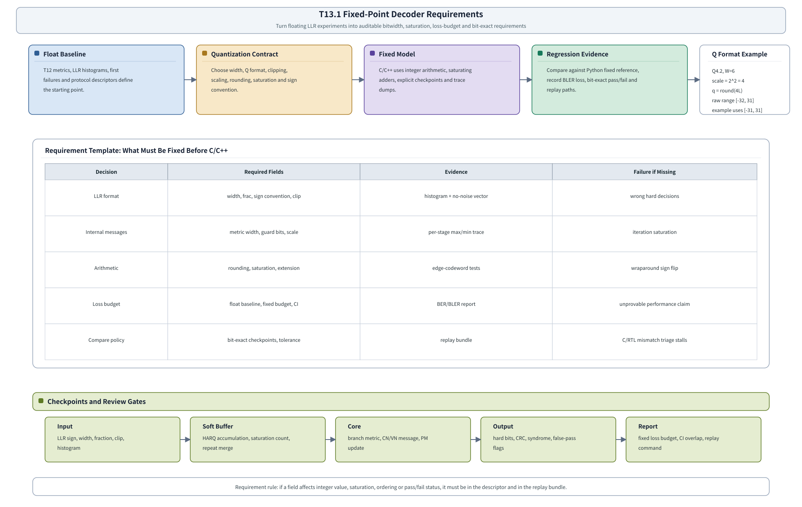

# T18.1 定点译码器需求：浮点实验到整数模型规格
## 本节学习目标

本节进入定点 C/C++ 模型阶段。前面的 T12 模块已经规定了LTE Turbo、NR LDPC和 NR Polar的浮点仿真、随机种子、日志、曲线和失败回放；但浮点模型还不能直接交给寄存器传输级和专用集成电路实现。硬件保存的是有限位宽整数，C/C++ 定点模型必须提前规定这些整数怎样表示、怎样相加、怎样饱和、怎样和浮点基线比较。

本节讲“定点译码器需求”。它不是某个单独算法，而是一份所有后续定点模型必须遵守的工程契约。

- 解释为什么对数似然比不能只写“用 6 bit”而不说明符号、小数位、裁剪、缩放和饱和。
- 为 LTE Turbo、NR LDPC、NR Polar 分别列出输入 LLR 位宽、内部消息位宽、路径度量或外信息位宽的需求字段。
- 区分浮点裁剪、整数饱和、舍入模式、符号扩展和溢出回绕。
- 给出块错误率损失预算，并说明为什么预算必须绑定置信区间、样本数和浮点基线。
- 设计 bit-exact 对比方案，说明哪些检查点必须逐整数一致，哪些性能指标允许统计比较。
- 写出一份后续 T18.2、T18.3、T18.4、T18.6 可直接复用的 fixed-point requirement 模板。

如果只记住一句话：定点需求不是“把 float 换成 int”，而是把数值语义、协议对象、整数格式、饱和行为、性能损失和回放证据同时固定下来。

## 前置知识检查

| 前置项 | 本节需要达到的程度 |
|:---|:---|
| T2.11 LLR 裁剪、缩放与量化 | 知道裁剪、缩放、量化、饱和和符号错误的基本含义。 |
| T5.1 LLR 处理中的定点数 | 知道二进制补码、Q 格式、小数位、饱和加法和符号扩展。 |
| T4.6 译码器接口契约 | 知道 descriptor、input、output、status、error、debug 六类对象，以及传输块、码块、混合自动重传请求和冗余版本（Redundancy Version, RV）字段。 |
| T17.1 Python Golden Model 工程布局 | 知道 `vector.json`、`metrics.csv`、`frames.jsonl`、seed registry、failure dump 和 replay command 的角色。 |
| T17.2-T17.5 浮点仿真计划 | 知道浮点基线如何输出 BER/BLER 曲线、置信区间、停止原因和失败样本。 |

如果你只会手算一个 Q 格式数值，但不知道它在译码器哪个缓存、哪个迭代、哪个协议对象上使用，还不能写定点需求。定点需求要同时回答“这个整数代表什么”和“它错了以后怎样被发现”。

## Roadmap 卡片原文与本节执行范围

| 项目 | 内容 |
|:---|:---|
| 编号 | T18.1 |
| 前置 | T5.1, T17.1 |
| Prompt | 请定义定点译码器需求：LLR 位宽、内部消息位宽、饱和规则、舍入、缩放、性能损失预算和 bit-exact 对比方案。写作时参考本文”单节讲义弹性审计清单”，按本节性质取舍：基础课重理论概念、解释和推导；协议课重 3GPP 前因后果和接收侧流程；工程课重仿真、定点、RTL/ASIC、验证和证据记录。 |
| 产出 | `docs/L3/T18.1_fixed_point_decoder_requirements.md` |
| 验收 | Learner can write fixed-point requirements for one decoder block and identify comparison tolerances. |
| 3GPP/证据 | 无需直接 3GPP 引用 for fixed-point methodology. Any protocol-specific fixed-point requirement must cite upstream Rel-19 evidence from T7, T9, T10, and related simulation/vector tasks. |

本节是工程需求课，不是 3GPP 协议精读课。3GPP 规范规定编码、循环冗余校验、速率匹配、控制信息和传输块处理等空口规则；通常不规定接收机内部 LLR 用 5 bit、6 bit 还是 8 bit，也不规定某个厂商的 C/C++ 饱和函数。本节只把协议字段作为定点需求的来源和回链，不把量化策略写成协议强制要求。

## 定点需求的工程动机

浮点仿真关心算法是否正确，定点需求关心同一个算法能否被有限位宽稳定实现。没有定点需求时，后续团队经常会出现下面的问题。

| 缺失项 | 常见说法 | 实际风险 |
|:---|:---|:---|
| LLR 符号约定 | “输入是 6 bit LLR。” | 正值到底表示比特 `0` 还是 `1` 不清楚，高信噪比下可能系统性 CRC 失败。 |
| 小数位和缩放 | “乘一下缩放系数。” | Python、C/C++、RTL 对同一个整数解释不同，bit-exact 永远对不上。 |
| 饱和规则 | “溢出时截断。” | 补码回绕把强正 LLR 变成负数，译码方向翻转。 |
| 内部消息位宽 | “内部先用 int16。” | Turbo 外信息、LDPC 消息、Polar 路径度量的增长规律不同，统一位宽可能浪费或溢出。 |
| 损失预算 | “性能差不多。” | 没有 BLER 基线、置信区间和样本数，无法判断定点损失是否可接受。 |
| 对比策略 | “和 Python 对一下。” | 不知道比输入、检查点、硬判决、CRC 还是曲线；失败后无法定位。 |

定点需求的价值在于把“模糊经验”变成可执行验收：给同一个 vector，Python 定点参考、C/C++ 定点模型和后续 RTL 应该在指定检查点输出同一个整数；若最终 BLER 有差异，也能回到同一组输入、同一条种子、同一份协议 descriptor 和同一个失败 dump。

## 位宽需求总览图


| 内容 | 说明 |
|:---|:---|
| Decision | Required Fields；Evidence；Failure if Missing |
| Float Baseline | Quantization Contract；Fixed Model；Regression Evidence |
| LLR format | width, frac, sign convention, clip；histogram + no-noise vector；wrong hard decisions |
| Internal messages | metric width, guard bits, scale；per-stage max/min trace；iteration saturation |
| Arithmetic | rounding, saturation, extension；edge-codeword tests；wraparound sign flip |
| Loss budget | float baseline, fixed budget, CI；BER/BLER report；unprovable performance claim |
| Compare policy | bit-exact checkpoints, tolerance；replay bundle；C/RTL mismatch triage stalls |
| Q4.2, W=6 | scale = 2^2 = 4；q = round(4L)；raw range [-32, 31]；example uses [-31, 31] |
| Input | LLR sign, width, fraction, clip, histogram |
| Soft Buffer | HARQ accumulation, saturation count, repeat merge |
本节流程顺序为：先从 T12 浮点基线、LLR 直方图和失败样本出发，固定量化契约；再由 C/C++ 定点模型实现整数运算、饱和和检查点；最后把 bit-exact 结果、BLER 损失和 replay bundle 写回证据链。中间表格是本节要求模板，底部是后续三类译码器都要打点的检查位置。

## 固定点表示的最小理论

定点译码器保存的是整数 $q$，不是实数 $L$。若使用 $F$ 个小数位，则实数解释为：

$$
\hat{L}=\frac{q}{2^F}.
\tag{1}
$$

从浮点 LLR $L$ 到整数的常见流程为：

$$
L_{\mathrm{clip}}=\min(\max(L,L_{\min}),L_{\max}),
\tag{2}
$$

$$
q_{\mathrm{raw}}=\mathrm{round\_mode}(s\cdot L_{\mathrm{clip}}),
\tag{3}
$$

$$
q=\min(\max(q_{\mathrm{raw}},q_{\min}),q_{\max}).
\tag{4}
$$

这里 $s$ 是缩放因子。若采用 Q 格式并设 $s=2^F$，式 (1) 和式 (3) 正好互为编码/解码；若工程上为了优化 BLER 选择非 $2^F$ 的比例，也必须把 `scale` 写进 descriptor，否则同一个整数无法还原语义。

对 $W$ bit 二进制补码，完整整数范围是：

$$
-2^{W-1}\le q\le 2^{W-1}-1.
\tag{5}
$$

有些译码器会不用最小负值，把范围收成 $[-(2^{W-1}-1),2^{W-1}-1]$，目的是让正负饱和值对称，减少某些 Min-Sum 或路径度量 tie-breaker 的偏置。不管选择哪种方式，需求里必须明确写 `q_min`、`q_max`，不能只写 “6 bit”。

## 手算例子：同一个 LLR 在不同需求下的结果

假设浮点输入：

$$
L=3.7.
\tag{6}
$$

需求 A：`W=6, F=2, q_min=-31, q_max=31, round=nearest_away_from_zero, clip=8`。缩放因子为 $2^2=4$：

$$
q_{\mathrm{raw}}=\mathrm{round}(3.7\times 4)=15.
\tag{7}
$$

没有超过范围，所以 $q=15$，解码为：

$$
\hat{L}=15/4=3.75.
\tag{8}
$$

需求 B：`W=5, F=1, q_min=-15, q_max=15, round=toward_zero, clip=8`。缩放因子为 $2$：

$$
q_{\mathrm{raw}}=\mathrm{trunc}(3.7\times2)=7,
\tag{9}
$$

解码为：

$$
\hat{L}=7/2=3.5.
\tag{10}
$$

两种需求的硬判决都偏向比特 `0`，但可靠度不同。若这个 LLR 进入 HARQ 软合并或 LDPC layered 迭代，后续累加、饱和和消息传播会继续放大差异。因此定点需求不能只看单个硬判决，还要记录直方图、饱和计数、检查点和最终 BLER。

## 统一 Fixed-Point Requirement 模板

总览图中这张模板的英文标题是 `Requirement Template: What Must Be Fixed Before C/C++`，强调进入 C/C++ 定点模型前必须先固定 LLR format、internal messages、arithmetic、loss budget 和 compare policy。图底部的审查区标题是 `Checkpoints and Review Gates`，对应输入量化、内部消息、算术、性能损失和回放证据五类门禁。

后续每个定点模型都必须填下面这张表。字段没有真实决定前，不允许写成“默认”“约等于”或“后续再定”。

| 分组 | 字段 | 说明 |
|:---|:---|:---|
| 身份 | `requirement_id`、`decoder_family`、`decoder_variant`、`protocol_case`、`owner`、`version` | 说明这是哪类译码器、哪种算法和哪次规格版本。 |
| 输入 LLR | `llr_width`、`llr_frac`、`llr_q_min`、`llr_q_max`、`llr_clip_min/max`、`llr_scale`、`llr_sign_convention` | 输入软信息的整数表示。 |
| 舍入与饱和 | `round_mode`、`saturation_mode`、`overflow_policy`、`sign_extend_policy`、`symmetric_range` | Python、C/C++、RTL 必须逐项一致。 |
| 内部消息 | `metric_width`、`metric_frac`、`guard_bits`、`extrinsic_width`、`message_width`、`pm_width` | 不同译码器可只填适用字段，但必须说明不适用原因。 |
| 缩放参数 | `input_scale`、`extrinsic_scale`、`nms_alpha`、`oms_beta`、`pm_scale` | 算法相关缩放不能混在 LLR 接口字段里。 |
| 饱和观测 | `sat_count_fields`、`sat_histogram_bins`、`max_abs_trace_fields` | 性能退化时用于定位是否饱和过多。 |
| 比较策略 | `bit_exact_checkpoints`、`tolerance_policy`、`first_mismatch_dump`、`replay_command` | 规定哪些点必须整数一致，哪些只做统计比较。 |
| 性能预算 | `float_baseline_ref`、`fixed_loss_budget_db`、`bler_ratio_budget`、`ci_overlap_rule` | 固定定点损失验收标准。 |
| 协议回链 | `spec_refs`、`upstream_lesson_refs`、`descriptor_hash`、`vector_schema_version` | 说明协议对象来自哪里。 |
| 专用扩展 | `turbo.*`、`ldpc.*`、`polar.*`、`simd_memory.*`、`regression.*` | 后续 T18.2-T18.6 的固定 namespace。公共表不允许把专用字段散落成临时名字。 |

公共字段只解决三类译码器共同拥有的数值契约。后续文档必须在固定 namespace 下继续扩展，而不是重新发明字段名：

| namespace | 后续章节 | 必须预留的字段 |
|:---|:---|:---|
| `turbo.*` | T18.2 LTE Turbo 定点模型 | `branch_metric_width/frac`、`alpha_width/frac`、`beta_width/frac`、`posterior_width/frac`、`extrinsic_width/frac`、`max_log_mode`、`maxstar_lut_id`、`alpha_norm_policy`、`beta_norm_policy`、`interleaver_addr_policy`、`tail_state_policy`。 |
| `ldpc.*` | T18.3 NR LDPC 定点模型 | `cn_msg_width/frac`、`vn_msg_width/frac`、`posterior_width/frac`、`min1_width`、`min2_width`、`sign_product_policy`、`nms_alpha_q`、`oms_beta_q`、`layer_schedule_id`、`syndrome_check_policy`、`message_memory_layout`。 |
| `polar.*` | T18.4 NR Polar 定点模型 | `fg_llr_width/frac`、`partial_sum_format`、`path_metric_width/frac`、`path_metric_norm_policy`、`list_size`、`list_pruning_policy`、`sorter_compare_width`、`crc_selector_policy`、`rnti_mask_policy`。 |
| `simd_memory.*` | T18.5 SIMD 与内存布局 | `lane_count`、`lane_mapping`、`alignment_bytes`、`bank_count`、`bank_conflict_policy`、`transpose_policy`、`packing_order`、`endian_policy`、`dma_burst_bytes`。 |
| `regression.*` | T18.6 Bit-Exact 回归 | `checkpoint_manifest`、`trace_format_version`、`first_mismatch_schema`、`golden_hash_policy`、`rerun_command_template`、`curve_budget_ref`、`failure_bundle_layout`。 |

这张扩展表的作用是约束命名和证据粒度。例如 T18.2 如果需要记录 alpha 归一化，就写 `turbo.alpha_norm_policy`；T18.3 如果需要记录 layered schedule，就写 `ldpc.layer_schedule_id`；T18.4 如果需要记录路径剪枝，就写 `polar.list_pruning_policy`。这样 T18.6 可以用同一个解析器读取需求，而不是为每个算法写一套临时规则。

### 示例需求片段

```yaml
requirement_id: t13_1_common_llr_v1
decoder_family: common
llr_sign_convention: positive_means_bit0
llr_width: 6
llr_frac: 2
llr_q_min: -31
llr_q_max: 31
llr_clip_min: -8.0
llr_clip_max: 7.75
llr_scale: 4.0
round_mode: nearest_away_from_zero
saturation_mode: clamp_to_q_min_q_max
overflow_policy: saturate_never_wrap
sign_extend_policy: replicate_sign_bit
bit_exact_checkpoints:
  - quantized_input_llr
  - soft_buffer_after_combine
  - decoder_input_after_rate_recovery
turbo:
  branch_metric_width: null
  alpha_norm_policy: null
ldpc:
  layer_schedule_id: null
  nms_alpha_q: null
polar:
  path_metric_width: null
  crc_selector_policy: null
simd_memory:
  lane_count: null
regression:
  checkpoint_manifest: null
tolerance_policy:
  integer_checkpoints: exact
  final_hard_bits: exact
  bler_curve: statistical_budget
fixed_loss_budget_db: 0.10
bler_ratio_budget: 1.10
ci_overlap_rule: wilson_95pct_must_overlap_or_explain
```

这只是公共 LLR 需求片段，不是所有译码器的最终位宽。`null` 表示该字段由后续专用章节关闭，不能在实现阶段默默省略。T18.2 会补 Turbo 的分支度量、alpha/beta 和外信息；T18.3 会补 LDPC 的 CN/VN 消息、min1/min2、NMS/OMS 参数；T18.4 会补 Polar 的 f/g、路径度量、部分和和列表剪枝；T18.5 会补 SIMD lane、bank 和 packing；T18.6 会补 checkpoint manifest 和 failure bundle。

## 三类译码器的位宽对象

| 对象 | LTE Turbo | NR LDPC | NR Polar |
|:---|:---|:---|:---|
| 输入 LLR | 系统位和两个校验流的解速率匹配 LLR。 | rate recovery 后进入变量节点的 LLR。 | rate recovery 后进入 $N$ 长母码位置的 LLR。 |
| 主要内部值 | 分支度量、alpha、beta、后验 LLR、外信息。 | 变量节点消息、校验节点消息、min1/min2、posterior LLR。 | f/g 中间 LLR、部分和、路径度量（Path Metric, PM）、候选路径状态。 |
| 饱和高风险处 | BCJR/Max-Log-MAP 度量归一化和外信息缩放。 | layered 更新中旧消息扣除、新消息加回、NMS/OMS 后的消息累加。 | SCL 路径分裂后的 PM 累加和 sorter/pruner 比较。 |
| bit-exact 检查点 | 每半迭代 alpha/beta/extrinsic 摘要、CRC 前硬判决。 | 每层 posterior、syndrome、CB CRC 前硬判决。 | 每个 stage 的 LLR/partial sum、每次 path split 后 PM 和 CRC selector。 |
| 性能指标 | TB/CB BLER、平均迭代次数、饱和比例。 | TB/CB BLER、syndrome zero rate、迭代次数、饱和比例。 | control BLER、false-pass rate、list survival、PM 饱和比例。 |

注意：这些字段中的协议身份来自上游讲义和 T12 descriptor，定点位宽本身是实现选择。比如 NR LDPC 的 base graph、$Z_c$、RV、CBG 状态会影响向量和缓存地址，但不会由 3GPP 直接给出“消息必须 7 bit”这种规定。

## 性能损失预算

定点模型必须比浮点模型差一点也可解释，但“差一点”必须量化。推荐从 T17.5 的 `metrics.csv` 继承下面字段：

| 字段 | 用途 |
|:---|:---|
| `float_baseline_run_id` | 指向浮点基线。 |
| `fixed_run_id` | 指向定点实验。 |
| `axis_name`、`ebn0_db`、`snr_db` | 确保横轴一致。 |
| `primary_metric_for_stop` | 确认比较的是 TB BLER、CB BLER、control BLER 还是 false-pass。 |
| `tb_bler_low/high`、`control_bler_low/high` 等 | 用置信区间判断差异是否有统计意义。 |
| `confidence_limited` | 样本不足时禁止强结论。 |
| `saturation_count`、`max_abs_llr`、`llr_histogram_hash` | 解释定点损失来源。 |

一个可执行预算可以写成：

$$
\Delta_{\mathrm{dB}} =
E_{b}/N_0\big|_{\mathrm{fixed},p^\star}
-
E_{b}/N_0\big|_{\mathrm{float},p^\star},
\tag{11}
$$

其中 $p^\star$ 是目标 BLER，例如 $10^{-2}$。若项目要求 `fixed_loss_budget_db=0.10`，则验收条件是：

$$
\Delta_{\mathrm{dB}}\le 0.10\ \mathrm{dB}.
\tag{12}
$$

在早期没有足够曲线点时，也可以使用同一 SNR 下的比值预算：

$$
\mathrm{ratio}=
\frac{\mathrm{BLER}_{\mathrm{fixed}}}{\max(\mathrm{BLER}_{\mathrm{float}},\epsilon)}.
\tag{13}
$$

但式 (13) 必须和置信区间一起看。若浮点点位是零错误且只有上界，不能用一个很小的分母得出“定点差 100 倍”的结论；应回到 T17.5 的零错误上界和 `confidence_limited` 标记。

## Bit-Exact 对比方案

bit-exact 不是“性能差不多”，而是同一个整数检查点完全一致。建议分三层：

| 层级 | 比较对象 | 通过标准 |
|:---|:---|:---|
| 数值工具层 | `quantize_llr`、`sat_add`、`round_mode`、`sign_extend` | 所有边界样本逐整数一致。 |
| 算法检查点 | rate recovery 后 LLR、soft buffer 合并后 LLR、核心内部消息摘要 | Python fixed 与 C/C++ fixed 完全一致；后续 RTL 也应一致。 |
| 性能层 | BER/BLER、平均迭代、false-pass、饱和比例 | 按 T17.5 曲线报告和预算比较，不要求逐帧和浮点完全一致。 |

bit-exact 失败时，dump 不应只保存最终 hard bits。最小失败包应包含：

```text
fixed_failure_000031/
  vector.json
  fixed_requirement.yaml
  resolved_config.yaml
  input_float_llr.npy
  quantized_input_llr.npy
  checkpoint_python_fixed.npz
  checkpoint_cpp_fixed.npz
  first_mismatch.json
  metrics_row.csv
  replay_command.txt
```

`first_mismatch.json` 至少写 `checkpoint_name`、`index`、`python_value`、`cpp_value`、`expected_width`、`round_mode`、`saturation_mode`、`descriptor_hash`。这样 T18.6 的回归框架可以直接读取。

## 接收端流程与伪代码

接收端定点化不是只在软解调后做一次。HARQ 合并、速率恢复、迭代译码、路径度量更新都会继续使用整数表示。统一流程如下：

```text
输入：float_llr, descriptor, fixed_requirement
检查：descriptor.llr_sign_convention == fixed_requirement.llr_sign_convention
对每个 LLR:
  clip 到 [llr_clip_min, llr_clip_max]
  按 round_mode 和 llr_scale 量化为整数
  clamp 到 [llr_q_min, llr_q_max]
写 quantized_input_llr
若存在 HARQ soft buffer:
  按 RV/CB/CBG key 读取旧 LLR
  用 saturating_add 合并
  记录 saturation_count
进入译码核心:
  每个检查点按 requirement 中的 width/frac/scale 更新
  保存 max_abs、sat_count、first_mismatch 所需 trace
输出 hard bits、CRC/syndrome/status
写 metrics.csv 和 failure bundle
```

Python 参考函数应避免使用语言默认舍入。下面片段显式实现 “nearest away from zero”：

```python
import math


def round_away_from_zero(x: float) -> int:
    if x >= 0:
        return int(math.floor(x + 0.5))
    return int(math.ceil(x - 0.5))


def quantize_llr(x: float, clip_min: float, clip_max: float, scale: float, q_min: int, q_max: int) -> int:
    clipped = min(max(x, clip_min), clip_max)
    raw = round_away_from_zero(clipped * scale)
    return min(max(raw, q_min), q_max)


def sat_add(a: int, b: int, q_min: int, q_max: int) -> int:
    return min(max(a + b, q_min), q_max)


assert quantize_llr(3.7, -8.0, 7.75, 4.0, -31, 31) == 15
assert quantize_llr(-3.7, -8.0, 7.75, 4.0, -31, 31) == -15
assert quantize_llr(12.0, -8.0, 7.75, 4.0, -31, 31) == 31
assert sat_add(25, 12, -31, 31) == 31
assert sat_add(-25, -12, -31, 31) == -31
print("T18.1_FIXED_REQUIREMENT_TOY_OK")
```

## 定点化策略

本项目建议用“先公共、后专用”的策略。

| 阶段 | 决策 | 原因 |
|:---|:---|:---|
| 公共 LLR 契约 | 先统一 `llr_sign_convention`、输入 LLR 位宽、clip、scale、round、sat。 | 三类译码器都消费 LLR，接口不一致会污染所有对比。 |
| 算法内部位宽 | Turbo、LDPC、Polar 分别定内部消息和路径度量。 | 三类算法数值增长机制不同，不能机械共用一个位宽。 |
| 直方图与饱和计数 | 每个检查点记录最大绝对值、饱和次数和直方图 hash。 | BLER 损失需要可解释证据。 |
| 浮点/定点曲线对比 | 每个算法至少保留一条 float baseline 和一条 fixed candidate。 | 位宽选择必须服务性能预算。 |
| bit-exact 回归 | 小向量先 exact，大曲线再统计。 | 先抓数值错误，再谈性能。 |

若项目还没有真实 C/C++ 定点模型，T18.1 仍然可以先输出 requirement 模板和 Python reference 函数。后续 T18.2-T18.4 只要引用同一模板，就不会出现三篇文档各自定义一套位宽语义的情况。

## RTL/ASIC 映射

T18.1 不是 RTL 微架构设计，但它直接决定后续硬件对象。

| 需求字段 | RTL/ASIC 对象 | 验证风险 |
|:---|:---|:---|
| `llr_width`、`message_width`、`pm_width` | 静态随机存取存储器宽度、寄存器宽度、总线宽度。 | 位宽不一致导致截断或符号扩展错误。 |
| `round_mode` | 量化器和缩放器组合逻辑。 | Python 与 RTL 默认舍入不同。 |
| `saturation_mode` | 饱和加法器、比较器、min/max clamp。 | 回绕导致符号翻转。 |
| `sat_count_fields` | 性能计数器或 debug CSR。 | 没有观测点，BLER 损失无法定位。 |
| `bit_exact_checkpoints` | RTL trace tap、scoreboard 比较点。 | 只比最终 CRC 时定位范围过大。 |

硬件阶段不应重新发明定点语义。T14/T15 应从 `fixed_requirement.yaml` 读取或手工同步同名字段；若 RTL 为时序或面积修改位宽，必须生成新的 requirement version，并重新跑 T18.6 bit-exact 回归。

## 验证方法

| 验证项 | 方法 | 通过标准 |
|:---|:---|:---|
| 术语和协议边界 | 检查首现缩写、3GPP 边界和上游路径。 | 不把量化策略写成协议强制要求。 |
| 定点工具函数 | 执行上面的 Python 片段。 | 输出 `T18.1_FIXED_REQUIREMENT_TOY_OK`。 |
| 边界整数 | 覆盖 `q_min-1`、`q_min`、`-1`、`0`、`1`、`q_max`、`q_max+1`。 | 饱和而不回绕。 |
| 符号扩展 | 将 6 bit 负数扩展到 8/16 bit。 | 数值保持负号和大小。 |
| bit-exact 检查点 | Python fixed vs C/C++ fixed。 | 指定检查点整数完全一致。 |
| 曲线预算 | fixed vs float `metrics.csv`。 | 满足 `fixed_loss_budget_db` 或 `bler_ratio_budget`，且置信区间证据充分。 |

本节当前只关闭“需求文档级验证”：术语、标题、LaTeX 显示、图形几何、toy 量化函数和模板完整性。上表中的边界整数、符号扩展、Python-vs-C/C++ bit-exact 和 fixed-vs-float 曲线预算是后续模型级验证项目，必须由 T18.2-T18.6 在真实代码或真实 trace 出现后关闭，不能由 T18.1 代替关闭。

## 常见错误

| 错误 | 后果 | 修正 |
|:---|:---|:---|
| 只写位宽，不写小数位 | 同一个整数在不同模块中代表不同 LLR。 | 必须写 `width`、`frac`、`scale`。 |
| 使用 Python 默认 `round` | Python 3 的半值舍入可能和硬件不同。 | 显式实现目标舍入规则。 |
| 饱和和裁剪混用 | 不知道是浮点输入被限制，还是整数运算被限制。 | 分别记录 `clip_min/max` 和 `q_min/q_max`。 |
| 内部消息全部复用输入 LLR 位宽 | 迭代消息或路径度量过早饱和。 | 分算法定义内部位宽和 guard bits。 |
| 只比较最终 CRC | 失败后不知道是量化、rate recovery 还是核心算法出错。 | 增加分层检查点和 first mismatch dump。 |
| 用统计曲线替代 bit-exact | 小样本曲线可能看不出确定性整数错误。 | 小向量必须逐整数一致，大曲线用于性能预算。 |

## 工业用例

| 用例 | 为什么需要 T18.1 |
|:---|:---|
| 定点模型交付评审 | 算法团队交付 C/C++ fixed model 时，评审者可按 requirement 表逐项检查位宽、饱和、舍入和检查点，而不是只看 BLER 曲线。 |
| RTL bring-up 前置签收 | 硬件团队在写 Turbo/LDPC/Polar 引擎前，先冻结 `fixed_requirement.yaml`，后续 scoreboard 才能判断 RTL mismatch 是硬件 bug 还是规格变更。 |

## 自测题

1. 为什么 “LLR 使用 6 bit” 不是完整定点需求？
2. 裁剪和饱和分别发生在什么阶段？
3. `W=6, F=2, q_min=-31, q_max=31` 时，$L=3.7$ 用 nearest-away-from-zero 得到哪个整数？
4. 为什么 bit-exact 对比不能只比较最终 CRC？
5. 定点损失预算为什么必须引用浮点 BLER 曲线和置信区间？
6. 3GPP 是否规定接收机内部 LDPC 消息必须用某个位宽？

## 自测题参考答案

1. 因为还缺少符号约定、小数位、缩放、裁剪范围、整数上下限、舍入、饱和和检查点。同样 6 bit 在不同 Q 格式下含义不同。
2. 裁剪发生在浮点或高精度输入进入整数网格前；饱和发生在量化后或整数运算后，防止超过 `q_min/q_max`。
3. $3.7\times4=14.8$，nearest-away-from-zero 得到 $15$。
4. 最终 CRC 只能说明结果失败，不能定位第一处数值分歧。bit-exact 需要在输入 LLR、soft buffer、内部消息、硬判决等检查点逐层比较。
5. 定点模型可能在个别向量上不同但整体性能仍可接受。是否可接受要看浮点基线、定点曲线、样本数、置信区间和预先声明的损失预算。
6. 不规定。3GPP 规定空口编码、CRC、速率匹配和接收处理对象，内部消息位宽是接收机实现策略，但必须通过性能和一致性验证证明可用。

## 本节验收

| 验收项 | 通过标准 |
|:---|:---|
| Prompt 覆盖 | 覆盖 LLR 位宽、内部消息位宽、饱和、舍入、缩放、性能损失预算和 bit-exact 对比方案。 |
| 模板可复用 | 能用本节 requirement 表为一个 decoder block 写需求。 |
| 协议边界 | 明确 3GPP 不规定内部定点位宽，协议字段只作为 descriptor 和向量来源。 |
| 可执行验证 | Python 片段输出 `T18.1_FIXED_REQUIREMENT_TOY_OK`。 |

## 资料与协议边界

| 资料 | 边界 |
| :--- | :--- |
| T2.11 | 本节升级为工程需求模板。 |
| T5.1 | 本节不重复完整基础课推导。 |
| T17.1 | 本节不创建真实 `sim/` 包。 |
| T17.2-T17.4 | 本节不规划各算法专属 C/C++ 数据结构，留给 T18.2-T18.4。 |
| T17.5 | 本节不生成真实 fixed BLER 曲线。 |
| TS 36.212/TS 38.212 Rel-19 | 不从协议推出内部 LLR 或消息位宽。 |

## 协议证据表

| 证据项 | 状态 | 关闭条件 |
| :--- | :--- | :--- |
| LTE Turbo 协议字段 | 回链 T7/T17.2 和 TS 36.212 Rel-19 `36212-j30`。 | T18.2 必须列具体本地路径和检查点。 |
| NR LDPC 协议字段 | 回链 T9/T17.3 和 TS 38.212 Rel-19 `38212-j30`。 | T18.3 必须列 BG、$Z_c$、RV、CBG 等字段来源。 |
| NR Polar 协议字段 | 回链 T10/T17.4 和 TS 38.212 Rel-19 `38212-j30`。 | T18.4 必须列 $A/K/E/N/L$、CRC/RNTI 和 rate recovery 来源。 |
| 定点位宽方法 | 非 3GPP 协议内容。 | 不需要协议表格；需要 Python/C/RTL 一致性证据。 |

## 图示


## 执行与证据记录

| 项目 | 记录 |
|:---|:---|
| 工作区 | `/home/yys/ClaudeCode/3gpp` |
| 写入文件 | `docs/L3/T18.1_fixed_point_decoder_requirements.md` |
| 新增证据资产 | `docs/L3/assets/T13.1_fixed_point_decoder_requirements.svg`（手绘 SVG，替代原 PIL 渲染 PNG 及 `tools/figures/render_t13_1_fixed_point_requirements.py`）。 |
| Roadmap 卡片 | 已读取 `2026-06-19-lte-nr-decoding-learning-roadmap.md` 中 T18.1。 |
| 台账依据 | 已读取 `docs/audits/lte_nr_decoding_remaining_work_register.md` 模块 13 与 T18.1 条目。 |
| 上游讲义 | 已读取 `docs/L1/T2.11_LLR_clipping_scaling_quantization.md`、`docs/L1/T5.1_fixed_point_numbers_for_LLR.md`、`docs/L3/T17.1_python_golden_model_project_layout.md`。 |
| Python 验证 | 已执行正文 toy 片段，输出 `T18.1_FIXED_REQUIREMENT_TOY_OK`。 |
| 审计结果 | `python3 tools/audit_lesson_terms.py docs/L3/T18.1_fixed_point_decoder_requirements.md`：`LESSON_TERM_AUDIT_OK`。 |
| 审计结果 | `python3 tools/audit_markdown_headings.py docs/L3/T18.1_fixed_point_decoder_requirements.md`：`MARKDOWN_HEADING_AUDIT_OK`。 |
| 审计结果 | `python3 tools/audit_lesson_depth.py --strict docs/L3/T18.1_fixed_point_decoder_requirements.md`：`LESSON_DEPTH_AUDIT_OK`。 |
| 审计结果 | `python3 tools/audit_latex_render.py docs/L3/T18.1_fixed_point_decoder_requirements.md`：`LATEX_RENDER_AUDIT_OK formulas=34`。 |
| 引用重建审计 | `python3 tools/audit_reference_rebuilds.py docs/L3/T18.1_fixed_point_decoder_requirements.md`：`REFERENCE_REBUILD_AUDIT_NO_CANDIDATES`。 |
| 未执行内容 | 本节未实现真实 C/C++ 定点模型，未生成真实 fixed BLER 曲线；边界整数、符号扩展、Python-vs-C/C++ bit-exact 和 fixed-vs-float 曲线预算属于 T18.2-T18.6 的模型级验证闭环。 |

## 参考文献

- [上游讲义] `docs/L1/T2.11_LLR_clipping_scaling_quantization.md`，LLR 裁剪、缩放与量化预览。
- [上游讲义] `docs/L1/T5.1_fixed_point_numbers_for_LLR.md`，LLR 处理中的定点数。
- [上游讲义] `docs/L3/T17.1_python_golden_model_project_layout.md`，Python Golden Model 工程布局。
- [上游讲义] `docs/L3/T17.5_BER_BLER_curve_reporting.md`，BER/BLER 曲线生成与报告。
- [3GPP, 2026a] 3GPP TS 36.212 Rel-19 `36212-j30`, Multiplexing and channel coding. 本地路径：`3GPP_Rel19/processed/TS_36.212_36212-j30/`。
- [3GPP, 2026b] 3GPP TS 38.212 Rel-19 `38212-j30`, NR Multiplexing and channel coding. 本地路径：`3GPP_Rel19/processed/TS_38.212_38212-j30/`。
