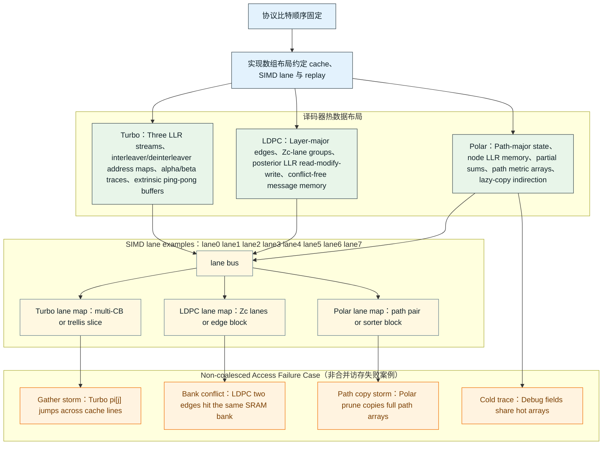
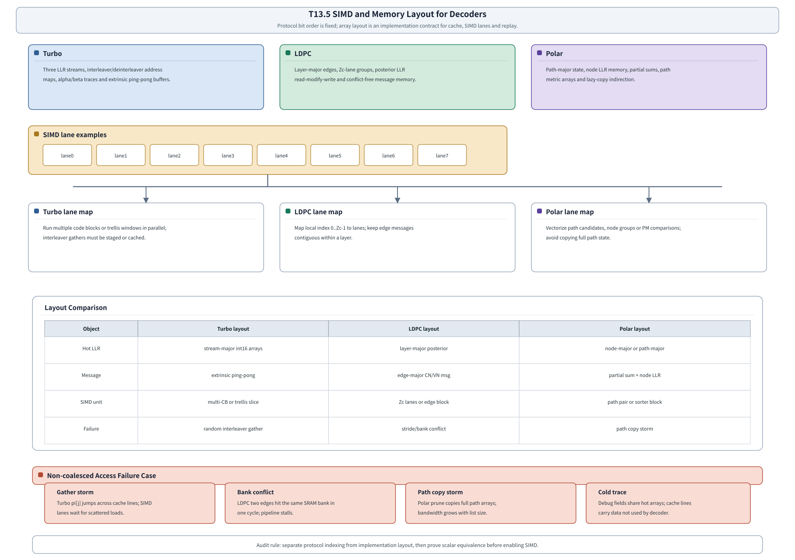

# T18.5 C/C++ 译码器 SIMD 与内存布局：从协议顺序到缓存友好数组
## 本节学习目标

本节讲LTE Turbo、NR LDPC和 NR Polar译码器的 C/C++ 内存布局。这里的主角不是新的译码算法，而是单指令多数据（Single Instruction, Multiple Data, SIMD）、缓存局部性、数组对齐、访存步长和 profiling。前面 T18.2、T18.3、T18.4 已经把对数似然比、外信息、LDPC message、Polar path metric 等对象定成整数模型；本节继续回答一个工程问题：这些整数应该按什么顺序放在内存里，中央处理器（Central Processing Unit, CPU）或后续寄存器传输级/专用集成电路才能连续读取、并行计算、稳定回放。


- 区分“协议顺序”和“实现布局”：3GPP 协议固定码块、比特选择、交织、速率匹配和循环冗余校验语义；SIMD lane、缓存行、数组对齐和预取策略是接收机实现选择。
- 为 LTE Turbo、NR LDPC、NR Polar 各写出一套 C/C++ 数组布局，并说明哪些数组是 hot path，哪些 trace/debug 字段应该冷存储。
- 解释结构数组（Array of Structures, AoS）和数组结构（Structure of Arrays, SoA）的差别，说明为什么译码器 hot loop 通常偏向 SoA。
- 说明 `alignas(64)`、64-byte cache line、SIMD load/store 宽度、tail mask、padding、stride 和 false sharing 对吞吐、延迟和 bit-exact replay 的影响。
- 给出 profiling 计划：从 scalar bit-exact baseline 到 SIMD 等价验证，再到 cache miss、cycles、branch miss、load/store throughput 和 A/B layout 实验。
- 识别非合并访存失败案例：Turbo 随机 interleaver gather、LDPC layer/edge stride 冲突、Polar path copy storm、debug trace 污染 hot cache line。

如果只记住一句话：协议告诉你“哪个比特逻辑上排第几”，内存布局决定译码器“每个时钟周期能不能高效拿到这些比特的软信息”。

## 前置知识检查

| 前置项 | 本节需要达到的程度 |
|:---|:---|
| T4.6 译码器接口契约 | 知道 descriptor、input、output、status、error、debug/trace 分层。 |
| T5.2 内存分 bank 与 buffering | 知道连续访问、bank conflict、ping-pong buffer 和静态随机存取存储器映射的基本含义。 |
| T5.3 吞吐、时延与并行度 | 知道吞吐瓶颈可能来自计算、访存、分支或同步，而不只是算法迭代次数。 |
| T18.2 LTE Turbo 定点模型 | 知道 Turbo 三路码流、交织器地址、alpha/beta、extrinsic 和 max-log 检查点。 |
| T18.3 NR LDPC 定点模型 | 知道 LDPC layered schedule、edge message、posterior LLR、min1/min2 和 syndrome check。 |
| T18.4 NR Polar 定点模型 | 知道 Polar node LLR、partial sum、path state、path metric、list pruning 和 CRC/RNTI selector。 |

如果你还没有形成“数组就是接口的一部分”的概念，本节会有点反直觉。C/C++ 定点模型不是只要算出同一个结果就行；它还要为后续 SIMD、RTL/ASIC、失败 replay 和性能归因留下可测量的结构。

## Roadmap 卡片原文与本节执行范围

| 项目 | 内容 |
|:---|:---|
| 编号 | T18.5 |
| 前置 | T18.2, T18.3, T18.4 |
| Prompt | 请讲解 Turbo、LDPC、Polar C/C++ 译码器的内存布局、对齐、SIMD 友好数组、缓存局部性和向量化机会。包含 profiling 计划和非合并访存失败案例。写作时参考本文“单节讲义弹性审计清单”，按本节性质取舍：基础课重理论概念、解释和推导；协议课重 3GPP 前因后果和接收侧流程；工程课重仿真、定点、RTL/ASIC、验证和证据记录。 |
| 产出 | `docs/L3/T18.5_SIMD_memory_layout_decoders.md` |
| 验收 | Learner can propose an array layout for one decoder and justify cache/SIMD behavior. |
| 3GPP/证据 | 无需直接 3GPP 引用 for this engineering method. The article must cite upstream protocol-vector tasks when it uses generated LTE/NR vectors. |

本节是工程课。它必须回链协议向量来源，但不把 SIMD、cache line、prefetch、AoS/SoA、alignment 或 profiler 指标写成 3GPP 强制要求。换言之，TS 36.212/TS 38.212 决定接收端要恢复什么逻辑序列；本节决定 C/C++ 模型怎样保存这些序列，让性能实验、bit-exact 比对和硬件映射可控。

## 资料与协议边界

| 资料 | 本地路径 | 边界 |
| :--- | :--- | :--- |
| T7.3/T7.5/T7.6 LTE 与混合自动重传请求/Turbo 边界 | `docs/L2_协议算法/T7.*.md` | 不在本节重新精读 TS 36.213/TS 36.321 时序。 |
| T8/T9 NR LDPC | `docs/L2_协议算法/T8.*.md`, `docs/L2_协议算法/T9.*.md` | SIMD lane 映射不是 TS 38.212 规定。 |
| T10 NR Polar | `docs/L2_协议算法/T10.*.md` | list size、lazy copy、path-major layout 是实现策略。 |
| T12 浮点仿真 | `docs/L3/T17.*.md` | 本节不生成真实性能曲线。 |
| T18.2-T18.4 定点模型 | `docs/L3/T18.2_*`, `T18.3_*`, `T18.4_*` | 本节只重排内存，不改变数值语义。 |

协议相关字段必须保留：LTE 的 `tb_id`、码块标识 `cb_id`、`rv_idx/K/E/Ncb/null_mask`，NR LDPC 的 `base_graph/Zc/layer/edge/cbg/rv/k0`，NR Polar 的 `A/K/E/N/info_set/frozen_set/rnti_context`。实现布局字段另列：`alignment_bytes`、`simd_width_bits`、`lane_count`、`stride`、`padding`、`layout_version`、`hot_trace_enabled`、`prefetch_distance`。这两组字段不能混写。

## 内存布局的性能机制

零基础看，CPU 不是一次从内存拿一个孤立整数。现代 CPU 会按 cache line 搬运数据，常见 cache line 是 64 byte。若 LLR 是 `int16_t`，一条 64 byte cache line 能放 32 个 LLR。SIMD 指令也不是一次算一个数，而是一条指令处理多个 lane。以 256-bit SIMD 为例，若每个 lane 是 16 bit，一条向量可以同时装 16 个 LLR。

这带来两个直接结论：

| 问题 | 好布局 | 坏布局 |
|:---|:---|:---|
| 访问是否连续 | 下一次 load 紧接上一次地址，硬件预取器容易跟上。 | 每个 lane 去随机地址 gather，cache line 利用率很低。 |
| lane 是否有用 | 一个 SIMD register 内的大多数 lane 都参与同一类计算。 | 大量 lane 是 padding、无效 path 或不同分支，计算吞吐被浪费。 |
| hot/cold 是否分离 | hot loop 只读写 LLR/message/metric。 | debug trace、统计字段和热数组混在同一 cache line。 |
| 写回是否冲突 | 每个线程或 lane 写独立区域。 | 多线程写同一 cache line，出现 false sharing。 |

所以，内存布局不是美化代码的风格选择，而是把“数学对象”变成“可被机器连续搬运的对象”。一个数学上正确的译码器，如果每次迭代都随机 gather、跨 cache line 写回、反复复制大数组，就可能比 scalar 基线还慢。

## SIMD 与缓存的最小理论

SIMD 的名称直观地说明了它要解决的问题：一条指令同时处理多份同类型数据。译码器里有大量“对很多 LLR 做同一类运算”的场景，例如 LDPC 对一组边消息取最小值、Turbo 对一批 branch metric 做加减、Polar 对多个 path candidate 更新 PM。若这些数据在内存中连续排列，SIMD 可以一次 load 多个元素；若这些数据散落在不同地址，SIMD 只能 gather，甚至退回多次 scalar load。

缓存的定义也要讲清楚。cache 不是协议对象，而是 CPU 为了掩盖内存访问延迟放在核心附近的小容量高速存储。cache line 是 cache 与内存交换的最小块，常见大小是 64 byte。工程后果是：即使程序只读一个 16-bit LLR，硬件也可能搬来包含它的整条 64 byte cache line。如果接下来读的是相邻 LLR，这条 cache line 被充分利用；如果接下来跳到很远地址，刚搬来的大部分字节就浪费了。

这里有一个常见误解：只要 SIMD lane 数多，程序就一定快。实际并不是这样。SIMD 快的前提是 lane 中的数据都有效、访问模式连续、分支路径一致、写回不冲突。若 16 个 lane 里只有 2 个是真实码位，其余都是 padding，或者 16 个 lane 分别访问 16 条 cache line，向量宽度反而暴露了内存瓶颈。

本节使用三个基础定义：

| 名称 | 定义 | 工程后果 |
|:---|:---|:---|
| lane | SIMD register 中独立承载一个元素的位置。 | lane 数决定一次向量运算能处理多少个 LLR/message。 |
| stride | 相邻逻辑元素在物理内存中的地址间隔。 | stride 越大，连续 load 越困难，cache line 利用率越差。 |
| hot data | hot loop 每次迭代都会读写的数据。 | hot data 应连续、对齐、少字段；debug trace 属于 cold data。 |

手算例子：一条 64 byte cache line 能装多少个 16-bit LLR？16 bit 等于 2 byte，所以

$$
N_{\mathrm{LLR/cacheline}}=\frac{64}{2}=32.
\tag{1}
$$

若某个 LDPC layer 连续读取 `posterior[z]`，每条 cache line 可服务 32 个 LLR。若改成每次读取 `posterior[z * 64]`，相邻访问间隔为 $64\times2=128$ byte，至少跨过两条 cache line；每次只用一小部分数据。这个手算例子解释了为什么 stride 是译码器性能分析里的核心字段，而不是普通数组下标细节。

## AoS 与 SoA 的数据组织

AoS 把一个对象的字段放在一起。例如：

```c
typedef struct {
  int16_t llr;
  int16_t extrinsic;
  int16_t posterior;
  uint8_t hard_bit;
  uint8_t flags;
} TurboSymbolAoS;

TurboSymbolAoS sym[K];
```

这种写法适合调试，因为 `sym[i]` 里能看到同一个位置的全部字段。但 SIMD hot loop 通常只需要 `llr[]` 或 `extrinsic[]`，不需要 `hard_bit/flags`。AoS 会让一次 cache line 搬进来很多暂时不用的字段。

SoA 把同类字段拆成连续数组：

```c
typedef struct {
  alignas(64) int16_t llr_sys[MAX_K_PAD];
  alignas(64) int16_t llr_p0[MAX_K_PAD];
  alignas(64) int16_t llr_p1[MAX_K_PAD];
  alignas(64) int16_t ext_a[MAX_K_PAD];
  alignas(64) int16_t ext_b[MAX_K_PAD];
  alignas(64) uint8_t hard_bit[MAX_K_PAD];
} TurboBlockSoA;
```

SoA 的优势是 hot loop 能连续 load/store：

$$
\text{vector load} = [L_i,L_{i+1},\ldots,L_{i+15}].
\tag{2}
$$

这正好匹配 SIMD lane。缺点是调试时要从多个数组拼回同一个符号，所以本项目要求同时保存 `layout_version` 和 trace hash，避免 debug 工具误读数组。

## 对齐、padding 与 tail mask

假设 SIMD register 宽度为 $V$ bit，元素位宽为 $w$ bit，则每个向量包含：

$$
L_{\mathrm{lane}}=\frac{V}{w}
\tag{3}
$$

个 lane。若 $V=256$、$w=16$，则 $L_{\mathrm{lane}}=16$。若某个码块长度 $K=6145$，最后一个向量不满 16 个元素。工程上有两种做法：

| 做法 | 描述 | 风险 |
|:---|:---|:---|
| padding | 把数组长度补到 16 的整数倍，padding 元素置 0 或无效标志。 | padding 不能参与 CRC、syndrome 或 PM。 |
| tail mask | 最后一个 vector load/store 使用 mask，只更新有效 lane。 | mask 规则必须进入 bit-exact replay。 |

数组长度常写为：

$$
K_{\mathrm{pad}}=\left\lceil\frac{K}{L_{\mathrm{lane}}}\right\rceil L_{\mathrm{lane}}.
\tag{4}
$$

对齐通常用 64 byte：

```c
alignas(64) int16_t llr[MAX_N_PAD];
```

64 byte 对齐不是协议要求，而是让数组首地址落在 cache line 边界，减少一次 vector load 横跨两条 cache line 的概率。若 allocator 不能保证对齐，应使用 `std::aligned_alloc`、`posix_memalign` 或项目统一 allocator，并把失败路径写进初始化检查。

具体例子：设某个 Turbo CB 的 `sys[]` 输入有 $K=34$ 个 `int16_t` LLR，目标平台使用 256-bit SIMD。由式 (3) 得到每个 vector 有 16 个 lane，由式 (4) 得到

$$
K_{\mathrm{pad}}=\left\lceil\frac{34}{16}\right\rceil\times16=48.
\tag{5}
$$

因此 `sys[0..33]` 是有效 LLR，`sys[34..47]` 是 padding。前三个 vector 的有效 lane 分布为：

| vector | lane 0-15 对应元素 | 有效 lane | tail mask |
|:---|:---|:---|:---|
| v0 | `sys[0]..sys[15]` | 16 | `0xffff` |
| v1 | `sys[16]..sys[31]` | 16 | `0xffff` |
| v2 | `sys[32]..sys[47]` | 2 | `0x0003` |

这个例子回答了本节最容易忽略的问题：padding 不是“多出来的协议比特”。它只是为了让 SIMD load/store 对齐而扩展的实现空间。CRC、硬判决输出、Turbo 迭代停止、LDPC syndrome 或 Polar PM selector 都不能把 padding lane 当作真实比特。

## 三类译码器的 SIMD 友好布局总表

| 译码器 | 热数组 | 推荐主布局 | SIMD 机会 | 最危险访存 |
|:---|:---|:---|:---|:---|
| LTE Turbo | `sys/par0/par1` LLR、alpha/beta、extrinsic、interleaver map | stream-major + multi-CB batch；或 trellis-window major | 多码块并行、trellis 状态并行、branch metric 向量化 | interleaver/deinterleaver 随机 gather/scatter |
| NR LDPC | posterior LLR、edge message、CN min1/min2、syndrome | layer-major + edge-contiguous + Zc-lane grouping | `Zc` 位置并行、edge block 并行、CN/VN 更新向量化 | layer 内多个 edge 跨 stride 或同 bank 写回 |
| NR Polar | node LLR、partial sum、path metric、path state、CRC state | path-major 或 node-major，配 lazy-copy indirection | path candidate 并行、PM compare/sort、节点批处理 | list pruning 后复制整棵 path state |

图 T18.5-1 给出本节使用的布局对比和失败案例：




| 内容 | 说明 |
|:---|:---|
| Turbo | Three LLR streams, interleaver/deinterleaver address maps, alpha/beta traces and extrinsic ping-pong buffers. |
| LDPC | Layer-major edges, Zc-lane groups, posterior LLR read-modify-write and conflict-free message memory. |
| Polar | Path-major state, node LLR memory, partial sums, path metric arrays and lazy-copy indirection. |
| Turbo lane map | Run multiple code blocks or trellis windows in parallel; interleaver gathers must be staged or cached. |
| LDPC lane map | Map local index 0..Zc-1 to lanes; keep edge messages contiguous within a layer. |
| Polar lane map | Vectorize path candidates, node groups or PM comparisons; avoid copying full path state. |
| Gather storm | Turbo pi[j] jumps across cache lines; SIMD lanes wait for scattered loads. |
| Bank conflict | LDPC two edges hit the same SRAM bank in one cycle; pipeline stalls. |
| Path copy storm | Polar prune copies full path arrays; bandwidth grows with list size. |
| Cold trace | Debug fields share hot arrays; cache lines carry data not used by decoder. |
| lane0 | lane1；lane2；lane3；lane4；lane5；lane6；lane7 |

图中的对象布局表还强调三组具体映射：Turbo 的 hot LLR 采用 stream-major int16 arrays，Message 采用 extrinsic ping-pong，SIMD unit 是 multi-CB or trellis slice；LDPC 的 hot LLR 是 layer-major posterior，Message 是 edge-major CN/VN msg，SIMD unit 是 Zc lanes or edge block；Polar 的 hot LLR 是 node-major or path-major，Message 是 partial sum + node LLR，SIMD unit 是 path pair or sorter block。对应的 failure 行分别是 random interleaver gather、stride/bank conflict 和 path copy storm。

## LTE Turbo：三路流、交织器与 extrinsic ping-pong

LTE Turbo 的输入来自 rate recovery 后三类软信息：systematic、parity 0、parity 1。协议和 T7/T18.2 固定的是码块长度、内部交织器、tail bit、冗余版本和 `<NULL>`/puncturing 语义；实现布局要决定这些流怎样进入 Turbo core。

推荐起点是 stream-major：

```c
typedef struct {
  uint16_t K;
  uint16_t K_pad;
  uint16_t simd_lanes;
  alignas(64) int16_t sys[MAX_K_PAD];
  alignas(64) int16_t par0[MAX_K_PAD];
  alignas(64) int16_t par1[MAX_K_PAD];
  alignas(64) int16_t ext_ab[MAX_K_PAD];
  alignas(64) int16_t ext_ba[MAX_K_PAD];
  alignas(64) uint16_t pi[MAX_K_PAD];
  alignas(64) uint16_t depi[MAX_K_PAD];
} TurboSimdBlock;
```

`ext_ab` 和 `ext_ba` 是两个 constituent decoder 之间传递外信息的 ping-pong buffer。不要把它们做成一个数组再靠阶段标志覆盖，因为 bit-exact replay 需要知道每半次迭代前后的外信息。`pi/depi` 是交织和反交织地址表，它们读起来像普通数组，但访问模式可能是非连续的。

Turbo 有三个主要向量化方向：

| 方向 | 方法 | 适用场景 | 风险 |
|:---|:---|:---|:---|
| 多 CB 并行 | SIMD lane 0..15 分别处理不同码块同一 trellis 位置。 | 小码块很多、HARQ batch 多。 | 不同 `K` 需要 bucket；tail mask 复杂。 |
| trellis 状态并行 | 同一码块内并行算多个 state/branch metric。 | 状态数固定，branch metric 结构规整。 | alpha/beta 递推有前后依赖。 |
| 窗口并行 | 把 trellis 分段，窗口内顺序，窗口间并行。 | 大码块、允许 warm-up 边界。 | 边界 metric 初始化影响 bit-exact。 |

最危险的是 interleaver gather：

$$
L'_{i}=L_{\pi(i)}.
\tag{6}
$$

如果 `pi(i)` 在内存中跳来跳去，SIMD lane 会变成 gather 指令或多次 scalar load。保守策略是预先生成 `pi` 的 block 化视图，把常用访问分组缓存；激进策略是按 interleaver 顺序另存一份 `sys_pi[]/ext_pi[]`，用空间换连续访问。无论哪种，必须在 descriptor 中保存 `pi_hash/depi_hash/layout_version`，证明重排没有改变逻辑映射。

## NR LDPC：layer-major、edge-contiguous 与 Zc lanes

NR LDPC 的天然并行单位是 quasi-cyclic lifting 后的 $Z_c$ 个位置。协议固定 base graph、lifting size、shift value、rate matching 和 code block group 语义；实现布局应让同一 layer 的 edge message 连续，并尽量让 $Z_c$ 的局部索引映射到 SIMD lane。

推荐布局：

```c
typedef struct {
  uint16_t Zc;
  uint16_t num_layers;
  uint16_t num_edges;
  uint16_t zc_pad;
  alignas(64) int16_t posterior[MAX_N_PAD];
  alignas(64) int16_t edge_msg[MAX_EDGE_PAD][MAX_ZC_PAD];
  alignas(64) int16_t cn_min1[MAX_LAYER_PAD][MAX_ZC_PAD];
  alignas(64) int16_t cn_min2[MAX_LAYER_PAD][MAX_ZC_PAD];
  alignas(64) uint8_t cn_argmin[MAX_LAYER_PAD][MAX_ZC_PAD];
  alignas(64) uint8_t cn_sign[MAX_LAYER_PAD][MAX_ZC_PAD];
} LdpcLayeredSoA;
```

其中 `edge_msg[edge][z]` 让同一 edge 的 $z=0..Z_c-1$ 连续。layered decoding 的核心读写是：

$$
L_v \leftarrow L_v - R_{cv}^{old},
\tag{7}
$$

$$
R_{cv}^{new}=\operatorname{CNUpdate}(\{L_{v'}\}),
\tag{8}
$$

$$
L_v \leftarrow L_v + R_{cv}^{new}.
\tag{9}
$$

式 (5)-(7) 是 read-modify-write。若同一 layer 的多个 edge 映射到相邻 variable node，`posterior[]` 访问会比较规整；若 shift 后地址跨 stride 跳动，就需要分组、预取或 bank conflict 检查。

LDPC 的 SIMD lane 可以这样理解：

$$
\text{lane }j \leftrightarrow z=j,\quad j=0,\ldots,L_{\mathrm{lane}}-1.
\tag{10}
$$

当 $Z_c$ 大于 lane 数时，按 `z_block` 分块；当 $Z_c$ 小于 lane 数时，可以合并多个 edge 或多个 code block，但这会增加调度复杂度。T18.3 中的 min1/min2、argmin、sign product 都适合 SoA：每个数组连续保存同一类量，便于 vector compare、min、blend 和 sign XOR。

非合并访存失败通常来自两处：

| 失败点 | 现象 | 修复方向 |
|:---|:---|:---|
| edge message stride 大 | 每次 CN update 读很多 cache line，只用其中少数元素。 | layer-major reorder、edge block 化、按 `Zc` 连续存储。 |
| posterior 写回冲突 | 多线程或多 lane 写相邻 cache line，甚至同 bank。 | layer 内冲突分析、bank coloring、线程分区。 |

## NR Polar：path-major、node-major 与 lazy copy

Polar SCL 的内存问题与 Turbo/LDPC 不同。它的瓶颈不一定是单个 $f/g$ 计算，而是 path split/prune 后的状态复制。若 list size 为 $L$，每条 path 都保存 node LLR、partial sum、path metric、CRC state 和 hard bits；每个 information bit 可能产生 $2L$ 个候选，再剪回 $L$ 条。

朴素布局可能是：

```c
typedef struct {
  int16_t node_llr[MAX_NODES];
  uint8_t partial_sum[MAX_NODES];
  uint8_t hard_bits[MAX_N];
  int32_t path_metric;
  uint32_t crc_state;
} PolarPathAoS;

PolarPathAoS path[MAX_L];
```

这便于理解，但 prune 时复制 `PolarPathAoS` 会造成 path copy storm。推荐把 hot 状态拆成 SoA，并引入 indirection：

```c
typedef struct {
  uint8_t L;
  uint16_t N;
  alignas(64) int16_t node_llr[MAX_L][MAX_NODE_PAD];
  alignas(64) uint8_t partial_sum[MAX_L][MAX_NODE_PAD];
  alignas(64) int32_t path_metric[MAX_L_PAD];
  alignas(64) uint16_t path_parent[MAX_L_PAD];
  alignas(64) uint16_t state_ref[MAX_L_PAD];
  alignas(64) uint8_t crc_state[MAX_L_PAD][CRC_STATE_BYTES];
} PolarSclLayout;
```

`state_ref` 是 lazy copy 的关键：剪枝后先重映射 path id，不立即复制整块 node memory；只有当两个 path 真的要写同一状态时，才 copy-on-write。这样可以把每次 prune 的成本从“复制整条路径所有节点”降到“复制少量被写分支”。

Polar 的 SIMD 机会包括：

| 机会 | 描述 | 风险 |
|:---|:---|:---|
| path candidate 并行 | 对 $2L$ 个候选同时算 PM 增量。 | PM 饱和和 tie-break 必须稳定。 |
| node group 并行 | 同一 stage 多个节点的 $f/g$ 同时算。 | 树遍历依赖 partial sum。 |
| sorter block 并行 | `2L -> L` compare/select 用 vector min/blend。 | 排序稳定性影响 bit-exact replay。 |

工程上要避免把 `path_metric`、`crc_state` 和 debug trace 混在同一结构里。PM 是每个 bit 都访问的 hot 字段；CRC state 只在特定阶段更新；trace 只在 debug 打开时需要。把它们混在一起，会让 hot loop 搬运大量 cold data。

## Packed 与 unpacked：hot bit 的压缩时机

硬判决 bit、partial sum、mask、CRC state 可以 bit-pack，也可以 byte-unpack。直觉上 bit-pack 省内存，但 SIMD 和调试不总是喜欢它。

| 表示 | 优点 | 缺点 | 推荐使用 |
|:---|:---|:---|:---|
| bit-packed | 内存小，适合长时间保存或输出 payload。 | 单 bit 访问需要 shift/mask，难向量化。 | payload、CRC 输入、最终 hard bits。 |
| byte-unpacked | 每个 bit 一个 `uint8_t`，访问简单。 | 内存更大。 | partial sum、frozen mask、active path mask、debug compare。 |
| vector mask | 与 SIMD lane 对齐，适合 blend/select。 | 平台相关。 | tail mask、candidate valid mask、PM selector。 |

经验规则：hot loop 中经常读写的 bit 状态优先 unpacked 或 vector mask；离开 hot loop 后再 pack 成协议输出格式。这样不会改变协议比特顺序，因为 pack/unpack 必须由同一份 descriptor 和 hash 验证。

## Cache locality、prefetch 与 false sharing

缓存局部性分两类。空间局部性是“访问了地址 `x` 后，很快访问 `x+1`”；时间局部性是“刚访问过的数据很快又访问”。译码器三类算法各有典型模式：

| 算法 | 空间局部性 | 时间局部性 | 优化重点 |
|:---|:---|:---|:---|
| Turbo | 三路 LLR 连续，但交织访问跳跃。 | alpha/beta 和 extrinsic 每半迭代复用。 | 交织地址分组、extrinsic ping-pong 保持连续。 |
| LDPC | 同 layer edge 和 `Zc` 位置可连续。 | posterior LLR 每层多次 read-modify-write。 | layer-major、edge-contiguous、bank conflict 检查。 |
| Polar | node LLR 随树遍历访问。 | path state 在 split/prune 前后复用。 | lazy copy、path state hot/cold 分离。 |

prefetch 不能盲目加。只有访问地址可提前知道，且预取距离不超过 cache 容量时才有帮助。Turbo interleaver 和 LDPC shifted address 可以尝试 software prefetch；Polar path copy 若因为 pruning 动态决定，prefetch 效果通常较差。

false sharing 是多线程场景的常见陷阱。两个线程写不同变量，但变量落在同一 cache line，cache coherence 会让它们互相失效。解决方法是给 per-thread stats、per-CB output、path metrics 或 syndrome counters 做 cache-line padding：

```c
typedef struct {
  alignas(64) uint64_t cycle_count;
  uint64_t iter_count;
  uint64_t sat_count;
  uint8_t pad[64 - 3 * sizeof(uint64_t)];
} ThreadLocalStats;
```

## Profiling 计划

本节的 profiling 不是只看“运行时间下降了吗”。必须分层做，避免 SIMD 版快了但结果错，或结果对了但瓶颈其实在内存。

| 阶段 | 目标 | 命令模板 | 通过标准 |
|:---|:---|:---|:---|
| Scalar baseline | 建立不使用 SIMD 的 bit-exact C/C++ 基线。 | `decoder_fixed --mode scalar --dump-checkpoints` | 与 Python fixed checkpoint 逐整数一致。 |
| SIMD equivalence | 打开 SIMD，但关闭 layout A/B 变量。 | `decoder_fixed --mode simd --compare scalar` | hard bits、CRC、PM/syndrome/extrinsic checkpoint 一致。 |
| Layout A/B | 比较 AoS、SoA、layer-major、path-major。 | `decoder_fixed --layout soa --profile perf` | 结果一致，cycles/cache miss 改善可解释。 |
| Cache profiling | 定位 load/store/cache/branch 瓶颈。 | `perf stat -e cycles,instructions,cache-misses,L1-dcache-load-misses,branches,branch-misses ...` | 指标与热点函数、数组访问模式一致。 |
| Stress replay | 用失败样本验证 tail、padding、alignment。 | `decoder_fixed --replay failure.json --layout soa --simd-width 256` | 失败可复现，dump 指向具体数组和 lane。 |

建议每次 profiling 都记录：

- `decoder`：`turbo`、`ldpc`、`polar`。
- `layout_version`：例如 `turbo_stream_major_v1`、`ldpc_layer_edge_zc_v2`。
- `simd_width_bits`：128、256、512 或 scalar。
- `element_width_bits`：LLR/message/PM 实际位宽。
- `alignment_bytes`：通常 64。
- `K/E/N/Zc/L/list_size/iteration_count`。
- `cycles_per_bit`、`cycles_per_iteration`、`cache_miss_per_kbit`、`branch_miss_rate`。
- `bit_exact_status`：与 scalar/Python/RTL checkpoint 的比较结果。

没有 bit-exact status 的性能数据不可采信，因为它可能只是跳过了某些工作。

## 非合并访存失败案例

### 案例一：Turbo interleaver gather storm

现象：SIMD 版 Turbo 比 scalar 版慢，perf 显示 L1 miss 和 load stalls 很高。检查发现 hot loop 中每个 lane 用 `pi[i+lane]` 去读 `ext[pi[i+lane]]`，地址分散在多个 cache line。

定位字段：

| 字段 | 期望 |
|:---|:---|
| `pi_hash/depi_hash` | 与协议 interleaver 表一致。 |
| `gather_count_per_iter` | 不应随 `K` 线性爆炸到无法接受。 |
| `cache_lines_per_vector` | 越接近 1 越好，若接近 lane 数说明 gather 严重。 |

修复策略：按 interleaver 顺序缓存一份 `ext_pi[]`，或把 `pi` 分块重排，让每个 vector 尽量访问相近地址。重排必须可逆，且 `depi` 检查点必须通过。

### 案例二：LDPC bank conflict

现象：layered LDPC 在 RTL 模型中吞吐上不去，C/C++ profiling 也显示 store buffer 压力高。检查发现同一 layer 内多个 edge 更新的 posterior 地址落在同一个 SRAM bank 或同一个 cache set。

定位字段：

| 字段 | 期望 |
|:---|:---|
| `layer_id/edge_id/z_block` | 能定位冲突发生在哪一层、哪条边。 |
| `bank_id = address % bank_count` | 同周期访问应尽量分散。 |
| `posterior_rmw_count` | 每层 read-modify-write 次数与协议图结构一致。 |

修复策略：对 layer 内 edge 排序、给 bank 做 coloring、调整 posterior padding，或在硬件中增加冲突仲裁。不能通过跳过某些 edge 来消除冲突。

### 案例三：Polar path copy storm

现象：list size 从 4 增加到 8 后，Polar 运行时间非线性上升。perf 显示 `memcpy` 占比高。检查发现每次 path prune 都复制完整 node LLR 和 partial sum 数组。

定位字段：

| 字段 | 期望 |
|:---|:---|
| `copy_bytes_per_bit` | 不应接近 `L * node_state_size`。 |
| `state_ref_remap` | prune 后 path id 与 state id 可追踪。 |
| `copy_on_write_count` | 只在真实写冲突时增加。 |

修复策略：引入 lazy copy 和 reference count。PM、CRC state 和 selected path id 必须与 remap 同步记录，否则 bit-exact replay 会找不到路径来源。

### 案例四：cold trace 污染 hot cache line

现象：打开 debug trace 后吞吐下降数倍，即使 trace 采样很少。检查发现 trace 字段嵌在 hot path state 结构中，每次 hot loop 都把 trace cache line 带进来。

修复策略：把 trace 写成独立 cold buffer，默认关闭；hot loop 只写 compact event id 或 ring index。详细 trace 在失败 replay 时再打开。工程记录中要区分 “measurement build” 和 “debug build”。

## RTL/ASIC 映射

C/C++ 内存布局不等于 RTL SRAM 物理布局，但它应该提前暴露硬件风险。

| C/C++ 概念 | RTL/ASIC 对应 | 检查点 |
|:---|:---|:---|
| `alignas(64)` | SRAM row/bank 边界或 burst 边界 | 起始地址、bank id、burst 长度。 |
| SoA hot arrays | 独立 SRAM macro 或 multi-bank buffer | 同周期读写端口数。 |
| `Zc` lane grouping | LDPC barrel shifter/parallel CN unit | shift address、bank conflict、layer schedule。 |
| Turbo ping-pong extrinsic | 双 buffer 或 phase buffer | phase bit、读写互斥、interleaver address。 |
| Polar lazy copy | path state indirection table | remap table、reference count、copy-on-write event。 |
| tail mask | valid lane mask | padding lane 不参与 CRC/syndrome/PM。 |

硬件映射的原则是：C/C++ 模型先把冲突显式化。若 C/C++ 模型里的数组已经需要随机 gather、跨 stride 写回、复制大状态，RTL/ASIC 不会自动变好，只会把问题变成 bank conflict、端口不足或面积浪费。

## 验证方法

本节验证分四层。

| 层级 | 验证对象 | 方法 |
|:---|:---|:---|
| 语义一致 | layout 重排前后逻辑比特顺序不变。 | 对 `layout_hash`、`protocol_order_hash`、`inverse_map_hash` 做 round-trip。 |
| 数值一致 | scalar、SIMD、不同 layout 的整数检查点一致。 | 比较 LLR、extrinsic/message、PM/syndrome/CRC。 |
| 性能可信 | profiling 指标能解释吞吐变化。 | 记录 cycles、cache miss、branch miss、load/store stalls。 |
| 边界稳健 | padding、tail mask、alignment、不同 `K/Zc/L` 不破坏结果。 | 参数 sweep + failure replay。 |

最小回归命令模板：

```bash
decoder_fixed --decoder turbo --layout stream_major --mode scalar --dump-checkpoints run/turbo_scalar
decoder_fixed --decoder turbo --layout stream_major --mode simd --compare run/turbo_scalar --profile perf

decoder_fixed --decoder ldpc --layout layer_edge_zc --mode scalar --dump-checkpoints run/ldpc_scalar
decoder_fixed --decoder ldpc --layout layer_edge_zc --mode simd --compare run/ldpc_scalar --profile perf

decoder_fixed --decoder polar --layout path_major_lazy --mode scalar --dump-checkpoints run/polar_scalar
decoder_fixed --decoder polar --layout path_major_lazy --mode simd --compare run/polar_scalar --profile perf
```

这些是计划级命令模板，不表示本节已经在仓库中实现了真实 `decoder_fixed` 二进制。真实命令将在 T18.6 bit-exact 回归框架中落地。

## 常见错误

| 错误 | 后果 | 修正 |
|:---|:---|:---|
| 把协议顺序当成物理布局，不敢重排数组。 | SIMD 难以连续访问，性能低。 | 保留 inverse map/hash，用实现布局服务 hot loop。 |
| 重排数组但没有保存 layout 版本和 hash。 | 失败 replay 无法还原逻辑位置。 | descriptor 增加 `layout_version/layout_hash/protocol_order_hash`。 |
| 把 trace 字段塞进 hot struct。 | debug 关闭时也污染 cache。 | hot/cold 分离，trace 单独 buffer。 |
| 只测吞吐，不测 bit-exact。 | 快速但错误的 SIMD 版本被误判通过。 | scalar/Python/RTL checkpoint 必须先一致。 |
| padding lane 参与 CRC 或 syndrome。 | 边界长度随机失败。 | tail mask 进入 compare trace。 |
| Polar prune 只复制 hard bits。 | PM、CRC state、partial sum 与 path id 脱节。 | path state remap 必须整体记录。 |
| LDPC layer reorder 后忘记更新 evidence hash。 | 与 TS 38.212 base graph/shift 表回链断裂。 | layer schedule 保存原始 edge id 和 reordered edge id。 |

## 自测题

1. 为什么同样的 `int16_t llr[N]`，SoA 通常比 AoS 更适合 SIMD hot loop？
2. 一个 256-bit SIMD register 处理 16-bit LLR 时有多少 lane？若 `K=1000`，padding 到多少个 LLR？
3. Turbo interleaver 为什么容易产生 gather storm？可以用哪两种方法缓解？
4. LDPC 的 `edge_msg[edge][z]` 为什么比 `edge_msg[z][edge]` 更适合 layer-major 更新？
5. Polar SCL 为什么需要 lazy copy？如果每次 prune 都 `memcpy` 完整 path state，会出现什么现象？
6. profiling 计划为什么必须先有 scalar bit-exact baseline？

## 自测题参考答案

1. SoA 把同类字段连续存储，SIMD load/store 可以一次读取多个 LLR 或 message；AoS 会把暂时不用的 flags、hard bit、trace 字段一起搬入 cache，降低 lane 和 cache line 利用率。
2. lane 数为 $256/16=16$。`K=1000` padding 到 $\lceil 1000/16\rceil\times16=1008$。最后 8 个 padding lane 必须由 tail mask 排除。
3. 因为 $L'_i=L_{\pi(i)}$ 的 `pi(i)` 可能跳到分散地址，SIMD lane 需要 gather。缓解方法包括按 interleaver 顺序缓存重排数组，或把 `pi` 分块使每个 vector 访问更接近的地址。
4. Layered decoding 通常按 layer 和 edge 处理，并在每条 edge 上遍历 $z=0..Z_c-1$。`edge_msg[edge][z]` 让同一 edge 的 `z` 连续，适合把 `z` 映射到 SIMD lane。
5. SCL 每个 information bit 可能从 $L$ 条 path 分裂到 $2L$ 条再剪回 $L$ 条。若每次剪枝都复制完整 node LLR/partial sum/CRC state，内存带宽会随 list size 急剧上升，profiling 中常表现为 `memcpy` 占比高和 cache miss 增加。
6. 因为 SIMD 版可能因为 lane mask、padding、排序 tie-break 或 gather/scatter bug 得到错误结果。没有 scalar bit-exact baseline，性能提升没有可信语义基础。

## 资料与协议边界补充：本节协议适用范围

本节涉及协议字段，但 SIMD 与内存布局不是 3GPP 强制行为。以下内容不适用“协议规定”表述：

| 内容 | 为什么不是协议强制 | 本项目怎样验收 |
|:---|:---|:---|
| `alignas(64)` | 协议不规定接收机 cache line。 | C/C++ 初始化检查和 profiling 记录。 |
| SoA/AoS/layout version | 协议只关心逻辑比特顺序和译码结果。 | round-trip hash 和 bit-exact compare。 |
| SIMD width | 不同 CPU/ASIC 平台不同。 | `simd_width_bits` 写入 run metadata。 |
| lazy copy | Polar CA-SCL 实现策略。 | path remap trace 与 selected path 一致。 |
| prefetch distance | 平台相关性能参数。 | A/B profiling 和 cache miss 指标。 |

## 图示


## 执行与证据记录

| 项目 | 记录 |
|:---|:---|
| Roadmap 卡片 | 已读取 `2026-06-19-lte-nr-decoding-learning-roadmap.md` 中 T18.5。 |
| 本节产出 | `docs/L3/T18.5_SIMD_memory_layout_decoders.md`。 |
| 新增证据资产 | `docs/L3/assets/T13.5_SIMD_memory_layout_decoders.svg`（手绘 SVG，替代原 PIL 渲染 PNG 及 `tools/figures/render_t13_5_simd_memory_layout_decoders.py`）。 |
| 协议边界 | 本节不直接精读新的 TS 条文；使用上游 T7/T8/T9/T10/T12/T18.2-T18.4 的协议向量、descriptor 和 evidence hash。 |
| Prompt 覆盖 | 已覆盖 Turbo/LDPC/Polar C/C++ 内存布局、对齐、SIMD 友好数组、缓存局部性、向量化机会、profiling 计划和非合并访存失败案例，并扩展 AoS/SoA、packed/unpacked、tail mask、false sharing、RTL/ASIC 映射和验证方法。 |
| 文档审计 | `python3 tools/audit_lesson_terms.py docs/L3/T18.5_SIMD_memory_layout_decoders.md` -> `LESSON_TERM_AUDIT_OK`；`python3 tools/audit_markdown_headings.py docs/L3/T18.5_SIMD_memory_layout_decoders.md` -> `MARKDOWN_HEADING_AUDIT_OK`；`python3 tools/audit_lesson_depth.py --strict docs/L3/T18.5_SIMD_memory_layout_decoders.md` -> `LESSON_DEPTH_AUDIT_OK`；`python3 tools/audit_latex_render.py docs/L3/T18.5_SIMD_memory_layout_decoders.md` -> `LATEX_RENDER_AUDIT_OK formulas=36`；`python3 tools/audit_reference_rebuilds.py docs/L3/T18.5_SIMD_memory_layout_decoders.md` -> `REFERENCE_REBUILD_AUDIT_NO_CANDIDATES`。 |
| 实现边界 | 本节命令为计划级模板，未声称仓库已有真实 `decoder_fixed` 二进制。 |

## 参考文献

1. 3GPP TS 36.212 Rel-19 `36212-j30`，本地处理目录：`3GPP_Rel19/processed/TS_36.212_36212-j30`。用于 LTE Turbo 编码、速率匹配和码块处理的上游协议证据回链。
2. 3GPP TS 38.212 Rel-19 `38212-j30`，本地处理目录：`3GPP_Rel19/processed/TS_38.212_38212-j30`。用于 NR LDPC、NR Polar、rate matching、CRC 和控制信息链路的上游协议证据回链。
3. `docs/L3/T18.2_LTE_Turbo_fixed_point_model_plan.md`，LTE Turbo 定点模型计划。
4. `docs/L3/T18.3_NR_LDPC_fixed_point_model_plan.md`，NR LDPC 定点模型计划。
5. `docs/L3/T18.4_NR_Polar_fixed_point_model_plan.md`，NR Polar 定点模型计划。
6. Intel Intrinsics Guide 与 Arm C Language Extensions。用于 SIMD intrinsic、load/store、mask 和 vector lane 语义的实现参考；具体 ISA 选择不属于 3GPP 协议要求。
