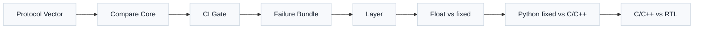
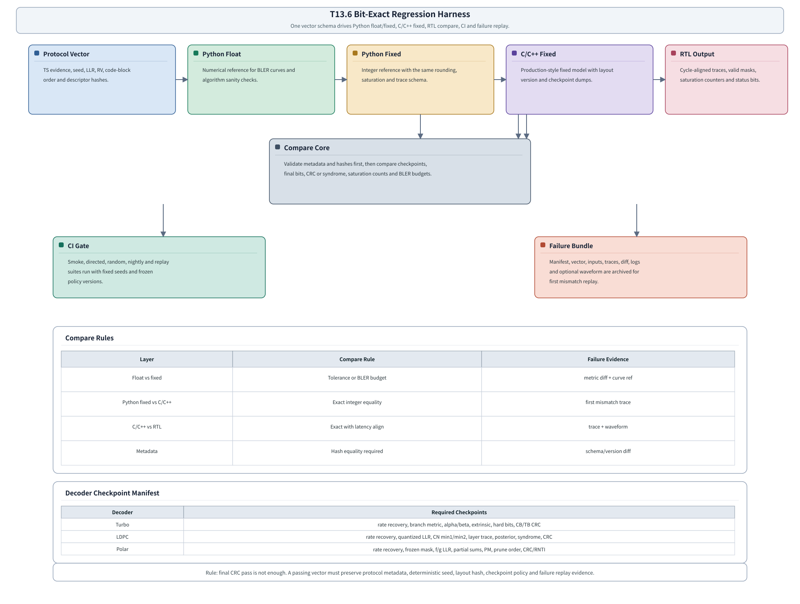

# T18.6 Bit-Exact 回归框架：从协议向量到 Python/C++/RTL 同步判定
## 本节学习目标

本节设计 bit-exact 回归框架。为了避免第一次出现的缩写含混，这里先把本节会反复使用的通信和硬件名词列清楚：3GPP规范给出空口编码、速率匹配、码块组织和控制信息规则；LTE在本项目中主要对应 Turbo译码链；NR在本项目中主要对应低密度奇偶校验码和Polar译码链。接收机输入的软信息通常写成对数似然比。译码后会检查循环冗余校验，上层对象包括传输块和码块。重传来自混合自动重传请求和冗余版本（Redundancy Version, RV）。后续硬件实现会落到寄存器传输级和专用集成电路。本节也会使用块错误率作为浮点与定点性能预算口径。


- 解释 bit-exact 的含义：在约定检查点上，两个实现输出的整数、有效位、饱和计数、选择顺序和状态字段逐项一致，而不是只看最终 CRC 是否通过。
- 设计统一 vector schema，使 Python 浮点参考、Python 定点参考、C/C++ 定点模型和后续 RTL 输出使用同一份协议元数据、随机种子、输入 LLR、量化配置和检查点清单。
- 区分“允许容差的比较”和“必须逐整数一致的比较”：浮点参考可以用于数值容差和 BLER 预算，定点参考到 C/C++、C/C++ 到 RTL 必须 bit-exact。
- 为三类译码器列出检查点：Turbo 的 rate recovery、branch metric、alpha/beta、extrinsic、硬判决和 CRC；LDPC 的量化 LLR、CN min1/min2、layer trace、posterior、syndrome 和 CRC；Polar 的 rate recovery、f/g、partial sum、path metric、剪枝顺序和 CRC/RNTI 选择。
- 写出失败归档方案：同一条向量失败后，能从 `manifest.json`、输入 LLR、metadata、trace、diff、日志和可选波形恢复到第一次不一致的位置。
- 给连续集成（Continuous Integration, CI）命令模板，说明 smoke、directed、random、nightly 和 replay 套件分别检查什么。

如果只记住一句话：bit-exact 回归不是“跑完没报错”，而是让协议向量、数值模型、C/C++ 实现、RTL 波形和失败证据共享同一条可复现证据链。

## 前置知识检查

| 前置项 | 本节需要达到的程度 |
|:---|:---|
| T4.6 译码器接口契约 | 知道 descriptor、input、output、status、error、debug/trace 分层，理解为什么元数据也是接口的一部分。 |
| T7/T8/T9/T10 协议译码链 | 能说明 LTE Turbo、NR LDPC、NR Polar 的接收侧速率恢复、码块、CRC、HARQ/RV 和边界案例来自哪些上游章节。 |
| T12 浮点仿真 | 知道 `vector.json`、seed registry、metrics、failure dump 和 BLER 曲线的作用。 |
| T18.1 定点需求 | 知道位宽、Q 格式、缩放、舍入、饱和、符号约定和性能损失预算必须写成需求。 |
| T18.2-T18.4 定点模型 | 知道三类译码器各自有哪些内部整数对象和 bit-exact checkpoint。 |
| T18.5 SIMD 与内存布局 | 知道 `layout_version`、`protocol_order_hash`、tail mask 和 SIMD lane 不能改变协议逻辑顺序。 |

若你还停留在“最终 CRC 通过就说明实现对了”的层次，本节是一个转折点。真实工程里，最终结果一致但内部检查点不同，可能来自补偿性错误、tie-breaker 差异、饱和策略不同或随机排序不稳定。这些差异在当前样本上未必暴露，换一个 SNR、RV、码长或 list size 就可能变成难定位的系统缺陷。

## Roadmap 卡片原文与本节执行范围

| 项目 | 内容 |
|:---|:---|
| 编号 | T18.6 |
| 前置 | T18.2, T18.3, T18.4 |
| Prompt | 请设计 bit-exact 回归框架，对比 Python 浮点/定点参考、C/C++ 定点模型和后续 RTL 输出。包含向量格式、元数据、种子追踪、容差、通过/失败方案和 CI 命令。写作时参考本文“单节讲义弹性审计清单”，按本节性质取舍：基础课重理论概念、解释和推导；协议课重 3GPP 前因后果和接收侧流程；工程课重仿真、定点、RTL/ASIC、验证和证据记录。 |
| 产出 | `docs/L3/T18.6_bit_exact_regression_harness.md` |
| 验收 | Learner can define a regression vector format and pass/fail policy for all three decoders. |
| 3GPP/证据 | 工程任务；protocol vectors link to TS 36.212 Rel-19 `36212-j30` / TS 38.212 Rel-19 `38212-j30`. |

本节是工程回归课。3GPP 规范不会规定你的 Python trace 文件名、C/C++ 结构体、CI 命令或 RTL scoreboard 端口；但每条协议向量必须能回链到 TS 36.212 或 TS 38.212 的 Rel-19 本地证据，以及上游 T7/T8/T9/T10/T12/T13 章节里已经精读和重建过的协议对象。换句话说，协议规定“应该恢复哪一串逻辑比特和校验语义”，本节规定“所有实现怎样证明自己恢复的是同一串东西”。

## 资料与协议边界

| 资料 | 本地路径 | 边界 |
| :--- | :--- | :--- |
| TS 36.212 Rel-19 | `3GPP_Rel19/processed/TS_36.212_36212-j30` | 不把 bit-exact 框架写成协议强制流程。 |
| TS 38.212 Rel-19 | `3GPP_Rel19/processed/TS_38.212_38212-j30` | 不从规范推导接收机内部位宽或 RTL 管线。 |
| LTE 协议精读与工程章节 | `docs/L2_协议算法/T7.*.md`, `docs/L3/T17.2_*`, `docs/L3/T18.2_*` | 本节只汇总回归字段，不重写 T7/T18.2 的完整推导。 |
| NR LDPC 协议精读与工程章节 | `docs/L2_协议算法/T8.*.md`, `docs/L2_协议算法/T9.*.md`, `docs/L3/T17.3_*`, `docs/L3/T18.3_*` | 本节不重新定义 BG、$Z_c$ 或 lifting 表。 |
| NR Polar 协议精读与工程章节 | `docs/L2_协议算法/T10.*.md`, `docs/L3/T17.4_*`, `docs/L3/T18.4_*` | 本节不重新选择 reliability sequence 或 list policy。 |
| SIMD/内存布局章节 | `docs/L3/T18.5_SIMD_memory_layout_decoders.md` | 本节不做真实 profiling，只规定回归需要记录的布局证据。 |

协议边界要严格：TS 36.212 和 TS 38.212 是协议向量的来源，不是回归框架工具链的来源。若某条向量标成 `standard=nr, decoder_family=ldpc, source_section=TS 38.212 §5.4.2`，它说明速率匹配和比特选择语义来自规范；它不说明 Python 文件、C++ 二进制或 RTL 波形由规范定义。

## bit-exact 的最小理论

“exact” 的字面意思是完全一致，但工程上要先问：在哪个对象上完全一致？浮点数天然会受到舍入、库函数、平台和表达式重排影响，因此 Python 浮点参考与定点实现通常不要求每一个中间浮点值逐 bit 一致。它的角色是建立算法趋势、无噪声样本、BER/BLER 曲线和定点损失预算。

定点链路不同。只要输入整数、缩放、舍入、饱和和 tie-breaker 都固定，Python 定点参考、C/C++ 定点模型和 RTL 应该在检查点上逐整数一致。比较对象至少包括：

| 对象 | 为什么要比较 | 只看最终 CRC 的风险 |
|:---|:---|:---|
| metadata/hash | 保证双方跑的是同一条协议向量、同一版 schema、同一版布局和同一套定点需求。 | 两个模型可能使用不同 RV、不同码块顺序或不同符号约定，却被误放在一起比较。 |
| 输入 LLR 与有效掩码 | 保证 rate recovery、HARQ 合并、padding/null lane 和裁剪输入一致。 | padding lane 或 null bit 被当作真实比特时，短样本可能仍然通过。 |
| 内部 checkpoint | 定位第一次数值分叉，比如 branch metric、min1/min2、path metric。 | 最终硬判决一致时，内部差异被隐藏；最终失败时无法定位根因。 |
| 饱和计数 | 发现位宽不足、缩放过大或累加策略不同。 | 两个实现都通过 CRC，但一个实现已经大量饱和，后续 SNR 点可能崩掉。 |
| 最终硬比特与 CRC/syndrome | 验证对外功能结果。 | 这是必要条件，不是充分条件。 |

可以把 bit-exact 看成一个分层断言：

$$
\mathrm{pass}=
\mathrm{meta\_eq}\land
\mathrm{input\_eq}\land
\mathrm{checkpoint\_eq}\land
\mathrm{output\_eq}\land
\mathrm{status\_eq}.
\tag{1}
$$

如果比较浮点与定点，则式 (1) 中的 `checkpoint_eq` 会替换成容差或统计预算：

$$
|\hat{x}_{\mathrm{float}}-\hat{x}_{\mathrm{fixed}}|\le \epsilon
\quad\text{or}\quad
\Delta \mathrm{BLER}\le B_{\mathrm{budget}}.
\tag{2}
$$

注意式 (2) 不是放宽定点模型之间的要求。Python fixed 到 C/C++ fixed，再到 RTL，目标是相同输入产生相同整数轨迹。只有这样，失败时才能把 C++ trace 和 RTL trace 对齐到同一个 `checkpoint_id`。

## 回归流水线总图




| 内容 | 说明 |
|:---|:---|
| Protocol Vector | Python Float；Python Fixed；C/C++ Fixed；RTL Output |
| TS evidence, seed, LLR, RV, code-block order and descriptor hashes. | Numerical reference for BLER curves and algorithm sanity checks.；Integer reference with the same rounding, saturation and trace schema.；Production-style fixed model with layout version and checkpoint dumps.；Cycle-aligned |
| Compare Core | Validate metadata and hashes first, then compare checkpoints, final bits, CRC or syndrome, saturation counts and BLER budgets. |
| CI Gate | Smoke, directed, random, nightly and replay suites run with fixed seeds and frozen policy versions. |
| Failure Bundle | Manifest, vector, inputs, traces, diff, logs and optional waveform are archived for first mismatch replay. |
| Layer | Compare Rule；Failure Evidence |
| Float vs fixed | Tolerance or BLER budget；metric diff + curve ref |
| Python fixed vs C/C++ | Exact integer equality；first mismatch trace |
| C/C++ vs RTL | Exact with latency align；trace + waveform |
| Metadata | Hash equality required；schema/version diff |
本节流程顺序为：先从左上角协议向量进入 Python float，再进入 Python fixed、C/C++ fixed 和 RTL output；中间 compare core 先比较 metadata/hash，再比较检查点和最终状态；下方 CI gate 负责自动执行套件，failure bundle 保存可重放证据。图下半部分把三类译码器必须进入 checkpoint manifest 的对象列出来，防止回归框架只记录最终 CRC。

总图英文标题为 `T18.6 Bit-Exact Regression Harness`，强调本节不是单个测试命令，而是从协议向量、Python float、Python fixed、C/C++ fixed、RTL output、compare core 到 CI gate 和 failure bundle 的完整回归外壳。

## 统一 vector schema

一条回归向量不只是输入 LLR。它必须同时描述协议对象、仿真条件、数值解释、实现布局和预期输出。推荐 schema 如下：

```yaml
schema_version: decoder_vector_v1
vector_id: nr_ldpc_bg1_z384_rv2_seed_000123_cb03
standard: nr
ts_release: rel19
ts_spec: TS 38.212
source_section:
  - "5.3.2"
  - "5.4.2"
local_evidence_path: 3GPP_Rel19/processed/TS_38.212_38212-j30
decoder_family: ldpc
channel_type: DL-SCH
tb_id: 0
cb_id: 3
cbg_id: 1
harq_id: 5
rv_idx: 2
protocol_fields:
  common:
    tb_id: 0
    cb_id: 3
    cbg_id: 1
    harq_id: 5
    rv_idx: 2
    channel_type: DL-SCH
  lte_turbo: null
  nr_ldpc:
    base_graph: BG1
    z_c: 384
    lifting_set: i_LS_7
    K: 8448
    N: 25344
    E: 17280
    Ncb: 25344
    k0: 12672
    filler_mask_path: filler_mask.npy
    cbg_id: 1
    cbgti: "1010"
    cbgfi: false
  nr_polar: null
seed:
  master: 20260620
  transport_block: 20260620_0000
  noise: 20260620_0000_0003
snr_db: 2.5
llr_sign_convention: positive_means_bit0
llr_format:
  float_dtype: float64
  fixed_width: 6
  fixed_frac: 2
  q_min: -31
  q_max: 31
  round_mode: nearest_away_from_zero
  saturation_mode: symmetric_saturate
protocol_order_hash: sha256:...
rate_recovery_hash: sha256:...
layout_version: ldpc_layer_major_v1
bitwidth_profile: t13_3_ldpc_fixed_v1
checkpoint_manifest: t13_6_ldpc_manifest_v1
inputs:
  llr_float_path: input_llr_float.npy
  llr_fixed_path: input_llr_q6_2.npy
  valid_mask_path: valid_mask.npy
expected_outputs:
  hard_bits_sha256: sha256:...
  crc_pass: true
  syndrome_zero: true
```

字段分组的原因如下：

| 字段组 | 必须记录的内容 | 工程原因 |
|:---|:---|:---|
| 身份字段 | `vector_id`、`schema_version`、`decoder_family`、`standard`、`ts_spec`、`source_section` | 让任何失败日志能回到协议和向量版本。 |
| 协议字段 | `tb_id`、`cb_id`、`cbg_id`、`harq_id`、`rv_idx`、`channel_type` | 区分不同码块、重传、上下行共享信道和控制/数据信道语义。 |
| 随机场景 | `seed`、`snr_db`、噪声模型、调制、调制与编码方案和传输块大小回链 | 保证随机样本可重放，性能曲线可追踪。 |
| LLR 解释 | 符号约定、浮点 dtype、整数位宽、小数位、裁剪、舍入、饱和 | 同一个整数若解释不同，bit-exact 没有意义。 |
| hash 字段 | `protocol_order_hash`、`rate_recovery_hash`、`layout_version`、`bitwidth_profile` | 防止输入顺序、速率恢复、内存布局或需求版本悄悄变化。 |
| 文件字段 | LLR、mask、trace、期望输出路径 | 让 CI 和本地 replay 使用同一套文件名约定。 |

这里的 `source_section` 不是装饰字段。若某条 NR LDPC 向量来自 TS 38.212 的 rate matching 语义，它必须记录相关章节；若某条 LTE Turbo 向量来自 TS 36.212 的 Turbo 编码和速率匹配语义，也必须记录相关章节。这样做的直接好处是：当协议版本、表格、章节或上游精读结论调整时，可以用字段查询影响了哪些向量。

`protocol_fields` 必须是可机器校验的对象，不能只把关键信息藏在 `vector_id`、文件名或 hash 里。三类译码器的专属字段建议如下：

| 译码器 | 必填协议字段 | 作用 |
|:---|:---|:---|
| LTE Turbo | `K`、`D=K+4`、`f1`、`f2`、`E`、`Ncb`、`rv_idx`、`k0`、`null_mask_path`、`tail_bits_present`、`tb_crc_type`、`cb_crc_type` | 复现 TS 36.212 内部交织器、tail bits、rate recovery、`<NULL>` 跳过和 CB/TB CRC 检查点。 |
| NR LDPC | `base_graph`、`z_c`、`lifting_set`、`K`、`N`、`E`、`Ncb`、`k0`、`filler_mask_path`、`punctured_mask_path`、`cbg_id`、`cbgti`、`cbgfi` | 复现 TS 38.212 BG/lifting、circular buffer、limited-buffer、filler/puncturing、CBG 部分重传和 syndrome/CRC 检查点。 |
| NR Polar | `A`、`K`、`E`、`N`、`crc_type`、`info_set_hash`、`frozen_set_hash`、`pc_set_hash`、`rate_recovery_mode`、`rnti_context`、`uci_or_dci_context` | 复现 TS 38.212 reliability sequence 派生、frozen/info/PC set、rate recovery、CRC/RNTI final selector 和控制信息场景。 |

字段值可以来自上游协议精读章节的表格、公式和 descriptor。若某字段不适用于当前 decoder family，必须显式写 `null` 或省略整个 family block，并由 `decoder_family` 控制 schema 校验；不能让接收端脚本猜测“缺字段代表什么”。

## 种子追踪与确定性

随机测试的常见错误是只记录一个 `seed=123`。这不足以定位失败，因为一个完整链路可能有 TB 生成、编码前比特、调制、噪声、HARQ 重传、码块选择、路径 tie-breaker、随机交织测试等多个随机源。本项目推荐层级种子：

$$
s_{\mathrm{case}}=H(s_{\mathrm{master}},\mathrm{suite},\mathrm{vector\_index}),
\tag{3}
$$

$$
s_{\mathrm{noise}}=H(s_{\mathrm{case}},\mathrm{snr},\mathrm{rv},\mathrm{cb\_id}),
\tag{4}
$$

$$
s_{\mathrm{tie}}=H(s_{\mathrm{case}},\mathrm{decoder\_family},\mathrm{checkpoint\_id}).
\tag{5}
$$

其中 $H$ 可以是项目固定的哈希派生函数。真正重要的不是哈希算法名字，而是每个派生种子都能从 manifest 里重建。若 Polar SCL 有两个 path metric 完全相同，排序 tie-breaker 必须由固定规则决定，不能依赖容器遍历顺序。若 LDPC layered schedule 有并行 edge 更新，trace 输出顺序也必须排序稳定。

## 比较层级与通过/失败政策

回归框架至少有四层比较：

| 比较关系 | 目标 | 通过条件 | 失败归档 |
|:---|:---|:---|:---|
| Python float vs Python float | 重跑确定性 | 同一环境下关键 metrics、硬比特、CRC 和统计日志稳定；允许浮点文本格式差异。 | 保存环境、依赖版本、metrics diff。 |
| Python float vs Python fixed | 定点损失评估 | 单向量可比较硬比特/CRC；曲线按 BLER budget、置信区间和 SNR 点判断。 | 保存量化误差直方图、饱和计数、曲线引用。 |
| Python fixed vs C/C++ fixed | 实现等价 | 输入整数、checkpoint、输出、状态和饱和计数逐项一致。 | 保存 first mismatch、两侧 trace、配置和编译信息。 |
| C/C++ fixed vs RTL | 硬件等价 | 延迟对齐后逐 checkpoint 一致，valid mask、status、计数器一致。 | 保存 trace、scoreboard diff、可选 VCD/FSDB 波形。 |

这张表回答了“容差到底在哪里允许”。容差只用于浮点与定点之间，或者性能曲线预算；定点实现之间不能用“差一点也行”掩盖问题。如果 C/C++ 和 RTL 的 posterior LLR 在第 4 次迭代差 1，最终 CRC 仍然通过，也必须记录为 mismatch，除非需求明确规定该 checkpoint 不参加 bit-exact，只作为诊断统计。这种豁免必须写在 `checkpoint_manifest`，不能由测试脚本临时决定。

## 三类译码器检查点

统一框架不能抹平算法差异。每类译码器必须有自己的 checkpoint manifest。

### LTE Turbo 检查点

Turbo 定点回归至少记录：

| checkpoint | 内容 | 为什么重要 |
|:---|:---|:---|
| `turbo.rate_recovery` | 三路软信息、tail bit、null/puncture mask、RV 选择结果。 | 证明 HARQ soft buffer 和 rate dematching 没有错位。 |
| `turbo.branch_metric` | 每个 trellis step 的 branch metric 或压缩摘要。 | 早期发现 LLR 符号、比例和饱和错误。 |
| `turbo.alpha_beta` | 前向/后向度量、归一化偏移、最大绝对值。 | 定位递推归一化和 guard bit 问题。 |
| `turbo.extrinsic` | constituent decoder 之间的外信息、缩放和交织地址。 | 发现 interleaver/deinterleaver 方向错、地址错或 ping-pong 覆盖。 |
| `turbo.final` | 硬判决、CB CRC、TB CRC、迭代停止原因。 | 验证对外结果和停止策略。 |

Turbo 的典型 first mismatch 是 `pi[j]` 地址方向错。最终 CRC 可能全失败，但没有 `turbo.extrinsic` trace 时，很难知道是 branch metric、alpha/beta 还是交织地址导致。bit-exact 框架要求每个 checkpoint 带 `iteration`、`half_iteration`、`cb_id` 和 `stage_hash`。

### NR LDPC 检查点

LDPC 定点回归至少记录：

| checkpoint | 内容 | 为什么重要 |
|:---|:---|:---|
| `ldpc.rate_recovery` | circular buffer 选择、filler/null mask、HARQ 合并后 LLR。 | 证明 RV 起点、puncture/shorten 和 soft combine 一致。 |
| `ldpc.quantized_llr` | 量化后 LLR、裁剪、饱和计数和直方图。 | 发现输入缩放和符号约定错误。 |
| `ldpc.cn_update` | CN sign、min1、min2、argmin、NMS/OMS 参数。 | Min-Sum 族算法最容易在 tie-breaker 和饱和上分叉。 |
| `ldpc.layer_trace` | layer id、edge range、read-modify-write 前后 posterior。 | 定位 layered schedule、bank/layout 和写回顺序问题。 |
| `ldpc.final` | posterior、hard bits、syndrome、CB CRC、TB CRC。 | 验证代数约束和对外结果。 |

LDPC 的工程难点是数据量大。不是每次 nightly 都必须保存每条 edge 的完整 trace，但 smoke 和 first mismatch replay 必须能打开完整 trace。量产级回归可以采用摘要策略：每层保存 hash、最大绝对值、饱和计数；一旦摘要不同，再自动重跑该向量并打开 full trace。

### NR Polar 检查点

Polar 定点回归至少记录：

| checkpoint | 内容 | 为什么重要 |
|:---|:---|:---|
| `polar.rate_recovery` | deinterleaving、rate recovery 后 LLR、valid mask。 | 证明协议输入顺序正确。 |
| `polar.mask` | frozen set、information set、CRC bit 位置、RNTI mask 上下文。 | 发现 construction 或控制信息上下文错位。 |
| `polar.fg` | SC/SCL 节点的 f/g 输入输出 LLR。 | 定位符号、min-sum、加法和饱和差异。 |
| `polar.partial_sum` | partial sum 更新、path state 映射、lazy-copy 引用。 | 发现 path copy 和节点回写错误。 |
| `polar.pm_prune` | path metric、候选排序、剪枝顺序、tie-breaker。 | SCL/CA-SCL 最常见不一致来源。 |
| `polar.final` | CRC pass mask、RNTI selector、selected path、decoded bits。 | 验证最终路径选择。 |

Polar 不能只比较 selected path 的最终 bit。两个实现可能在中间保留了不同 path，但最后选到同一个结果；这种差异在另一个噪声样本下会变成错选。因此 `prune_order` 和 `path_remap` 是必需检查点。

## 手算例子：一个小型 soft combine 与 bit-exact 比较

设某个小型 HARQ soft buffer 有 8 个逻辑位置。第一次发送 RV0 后，接收端得到整数 LLR：

$$
\mathbf{L}^{(0)}=[3,-2,0,1,\varnothing,\varnothing,2,-1].
\tag{6}
$$

其中 $\varnothing$ 表示这次没有发送或被打孔的位置。第二次发送 RV2 后得到：

$$
\mathbf{L}^{(1)}=[\varnothing,-1,4,\varnothing,-3,2,\varnothing,1].
\tag{7}
$$

soft combine 的缓存更新规则是同一逻辑位置累加，缺失位置保持原值：

$$
L_i^{\mathrm{buf,new}}=\mathrm{sat}(L_i^{\mathrm{buf,old}}+L_i^{\mathrm{rx}}).
\tag{8}
$$

若饱和范围为 $[-7,7]$，合并后为：

| 位置 | RV0 | RV2 | 合并结果 |
|:---:|:---:|:---:|:---:|
| 0 | 3 | 空 | 3 |
| 1 | -2 | -1 | -3 |
| 2 | 0 | 4 | 4 |
| 3 | 1 | 空 | 1 |
| 4 | 空 | -3 | -3 |
| 5 | 空 | 2 | 2 |
| 6 | 2 | 空 | 2 |
| 7 | -1 | 1 | 0 |

这组例子的 bit-exact 检查不是只看最终硬判决。Python fixed 和 C/C++ fixed 至少要同时输出：

```json
{
  "checkpoint_id": "rate_recovery.soft_combine",
  "rv_history": [0, 2],
  "q_min": -7,
  "q_max": 7,
  "input_valid_mask_rv0": "11110011",
  "input_valid_mask_rv2": "01101101",
  "combined_llr": [3, -3, 4, 1, -3, 2, 2, 0],
  "sat_count": 0
}
```

如果 RTL 输出 `[3,-3,4,1,-3,2,2,-1]`，最终 CRC 也许还会通过，但 first mismatch 已经明确在位置 7。此时要查的是同一位置 LLR 是否累加、valid mask 是否错、RV2 对应逻辑位置是否错，或者饱和/清零策略是否不同。这就是小例子的价值：它把“回归失败”变成可定位的对象，而不是一句“译码错了”。

## 失败归档格式

每次失败都应归档成独立目录，目录名至少含 suite、vector、比较层级和时间戳：

```text
failure_bundle/
  manifest.json
  vector.json
  metadata.json
  input_llr_float.npy
  input_llr_fixed.npy
  valid_mask.npy
  trace_python_fixed.jsonl
  trace_cpp_fixed.jsonl
  trace_rtl.jsonl
  diff.json
  stdout.log
  stderr.log
  waveform.vcd
```

`manifest.json` 负责描述这次失败如何重放：

```json
{
  "failure_id": "20260620_nr_ldpc_cb03_cpp_vs_rtl_first_mismatch",
  "vector_id": "nr_ldpc_bg1_z384_rv2_seed_000123_cb03",
  "compare_pair": "cpp_fixed_vs_rtl",
  "first_mismatch": {
    "checkpoint_id": "ldpc.cn_update",
    "iteration": 3,
    "layer": 12,
    "edge": 5,
    "field": "min1",
    "lhs_artifact": "trace_cpp_fixed.jsonl",
    "rhs_artifact": "trace_rtl.jsonl",
    "lhs_value": -18,
    "rhs_value": -17
  },
  "replay_command": "decoder_regress replay --bundle failure_bundle"
}
```

归档原则是“第一次不一致优先”。一次失败可能导致后面成百上千个字段都不同，但 debug 时最需要的是第一个分叉位置。CI 报告可以显示摘要，完整归档必须保留本地文件。

`metadata.json` 负责描述失败环境和比较策略。它不是日志附属品，而是 replay 的一部分。推荐必填字段如下：

```json
{
  "schema_version": "failure_metadata_v1",
  "vector_schema_version": "decoder_vector_v1",
  "trace_format_version": "checkpoint_trace_v1",
  "git_commit": "abcdef0123456789",
  "ci_job_id": "nightly-20260620-ldpc",
  "host": {
    "os": "linux",
    "arch": "x86_64",
    "python": "3.12.x"
  },
  "tool_versions": {
    "python_reference": "decoder_golden 0.0.template",
    "cpp_model": "not_implemented",
    "rtl_simulator": "not_implemented"
  },
  "build": {
    "compiler": "gcc-or-clang-version",
    "cflags": "-O2 -fno-fast-math",
    "endianness": "little"
  },
  "policy_hashes": {
    "fixed_requirement_hash": "sha256:...",
    "layout_hash": "sha256:...",
    "checkpoint_manifest_hash": "sha256:...",
    "bit_exact_policy_hash": "sha256:..."
  }
}
```

这些字段回答的是“这次比较到底在什么环境、什么策略、什么版本上发生”。若 `lhs_value` 和 `rhs_value` 不同，但 `fixed_requirement_hash`、`layout_hash` 或 `trace_format_version` 也不同，根因可能不是算法实现错误，而是比较对象没有对齐。

## CI 命令模板

下面命令是文档级模板，当前项目尚未实现名为 `decoder_regress` 的真实二进制。它们定义后续工具要达到的行为，而不是声称本仓库已经有这些命令。

```bash
decoder_regress prepare --suite lte_turbo_smoke --out run/t13_6/lte_turbo
decoder_regress run-python --mode float --suite run/t13_6/lte_turbo
decoder_regress run-python --mode fixed --suite run/t13_6/lte_turbo
decoder_regress run-cpp --model fixed --suite run/t13_6/lte_turbo
decoder_regress compare --policy bit_exact --suite run/t13_6/lte_turbo
decoder_regress archive-failure --suite run/t13_6/lte_turbo --case <id>
```

真实 CI 应该拆成不同层级：

| 套件 | 频率 | 内容 | 通过条件 |
|:---|:---|:---|:---|
| smoke | 每次提交 | 每类译码器少量无噪声、短码长、边界 RV、固定种子。 | 所有 fixed/C++/RTL 可用检查点 bit-exact。 |
| directed | 每次提交或夜间 | 协议边界案例：filler、puncture、shorten、最大/最小码长、Polar tie。 | 指定边界 checkpoint 与预期一致。 |
| random | 夜间 | 多 SNR、多 seed、多码长、多 RV、多 list size。 | 无 first mismatch，失败可归档重放。 |
| curve | 周期性 | float vs fixed BLER 曲线和置信区间。 | 定点损失不超过需求预算。 |
| replay | 每次修复前后 | 历史 failure bundle。 | 曾经失败的 first mismatch 关闭，且无新分叉。 |

## RTL/ASIC 映射

回归框架进入 RTL/ASIC 后，核心不是把 Python 文件直接搬进硬件，而是设计可比较接口：

- scoreboard 读取 RTL 输出的 checkpoint stream，并按 `checkpoint_id`、`iteration`、`cb_id`、`layer/path` 和 `valid_mask` 对齐 C/C++ trace。
- RTL trace 端口不一定常开，但必须能在 debug build 或仿真 testbench 中输出关键字段。
- 管线延迟必须显式记录，例如 `latency_cycles=37`，scoreboard 先做时间对齐，再做字段比较。
- padding lane 和 tail mask 必须参与比较。无效 lane 不比较数值，但必须比较无效标志，防止硬件误把 padding 当真实码位。
- 饱和计数器、溢出标志、迭代停止原因和 early termination 状态要进入 status compare。
- 对于大吞吐 LDPC 或 Turbo core，可以先比较 per-layer/per-window hash，再在 mismatch 时打开 full trace，减少常规仿真日志体积。

ASIC 阶段还要关注可观测性成本。所有内部消息都拉出芯片不现实，所以本节要求的是验证环境和仿真环境的 trace 能力，不是量产芯片必须暴露完整内部总线。寄存器和 debug port 的设计会在 T14/T15 继续细化。

## 验证方法

推荐验证流程如下：

1. 先跑 no-noise identity 向量，确认协议顺序、符号约定、CRC 和硬判决不反。
2. 跑小码长 directed 向量，开启 full trace，确认每类译码器的 checkpoint manifest 能定位到字段级。
3. 跑 Python fixed vs C/C++ fixed，要求逐整数一致；失败时检查 first mismatch 是否包含足够上下文。
4. 跑 C/C++ fixed vs RTL，先解决 latency/valid 对齐，再比较字段。
5. 跑 float vs fixed 曲线，检查 BLER budget 和置信区间，而不是用单条样本下结论。
6. 把所有历史 failure bundle 加入 replay suite，避免修复回退。

验收时要拒绝三类“看似通过”：只比较最终硬比特、失败后没有输入文件、随机种子无法重建。它们短期能让 CI 变绿，长期会让每次回归失败都无法定位。

## 常见错误

| 错误 | 后果 | 修正 |
|:---|:---|:---|
| 只比较最终 CRC | 内部实现分叉被隐藏，换场景后失效。 | 增加 checkpoint manifest 和 first mismatch dump。 |
| 没有记录 LLR 符号约定 | 正负号含义反转，低 SNR 下难以定位。 | schema 强制 `llr_sign_convention`。 |
| 把 float 容差套到 RTL 比较 | 掩盖整数实现错误。 | fixed/C++/RTL 之间只允许 manifest 明确豁免的字段不比较。 |
| 忽略 padding/null lane | filler、puncture、shorten 或 SIMD tail 出错。 | valid mask 与数值一起比较。 |
| 排序 tie-breaker 不稳定 | Polar SCL 或 LDPC min1/min2 偶发失败。 | 固定排序键和 seed 派生规则。 |
| 失败归档缺输入 | 无法 replay，只能重跑大套件碰运气。 | 失败 bundle 必须包含 vector、LLR、mask、trace 和 diff。 |
| metadata 不比对 | 不同协议版本、RV 或布局被误判为模型差异。 | 比较前先检查 schema/hash/version。 |

## 本节验收与 Prompt 覆盖

| Prompt 要求 | 正文证据 | 覆盖状态 |
|:---|:---|:---|
| 对比 Python 浮点/定点参考、C/C++ 定点模型和后续 RTL 输出 | `## bit-exact 的最小理论`、`## 回归流水线总图`、`## 容差、完全一致与通过/失败方案` | 已覆盖，并明确 float-vs-fixed 可用容差/BLER budget，fixed/C++/RTL 要逐整数一致。 |
| 向量格式 | `## 统一 vector schema`、`protocol_fields` 三类专属字段表 | 已覆盖，并补充 LTE Turbo、NR LDPC、NR Polar 可机器校验字段。 |
| 元数据 | `## 失败归档格式` 中 `metadata.json` schema | 已覆盖，并列 git/tool/compiler/layout/hash/CI 等 replay 必填字段。 |
| 种子追踪 | `## 种子追踪与确定性` | 已覆盖，给出 master/case/noise/tie 层级派生。 |
| 容差 | `## 容差、完全一致与通过/失败方案` | 已覆盖，区分浮点统计预算和定点 exact policy。 |
| 通过/失败方案 | `## 容差、完全一致与通过/失败方案`、`## 失败归档格式` | 已覆盖，给 first mismatch、lhs/rhs artifact、failure bundle 和 replay command。 |
| CI 命令 | `## CI 命令模板` | 已覆盖，给 smoke/directed/random/nightly/replay 模板并声明当前 runner 未实现。 |
| 三类译码器检查点 | `## 三类译码器 checkpoint manifest` | 已覆盖，分别列 Turbo、LDPC、Polar checkpoint。 |

## 自测题

1. 为什么 Python float vs Python fixed 可以使用 BLER budget，而 Python fixed vs C/C++ fixed 不应该使用“差 1 可接受”这种容差？
2. 一条 NR LDPC 向量至少应记录哪些协议字段，才能让失败回链到 TS 38.212 和上游协议精读？
3. 如果 RTL 最终 CRC 通过，但 `ldpc.cn_update.min1` 在第 3 次迭代第 12 层与 C/C++ 差 1，应该判 pass 还是 fail？为什么？
4. failure bundle 中为什么要同时保存 `vector.json`、`metadata.json`、输入 LLR 和 trace？
5. Polar SCL 的 path metric 相同路径排序为什么必须进入 bit-exact policy？

## 自测题参考答案

1. 浮点与定点本来就代表不同数值域，浮点参考用于算法趋势和统计性能，因此可用误差、BLER budget 和置信区间评价。Python fixed 与 C/C++ fixed 使用同一整数格式、舍入、饱和和 tie-breaker，理论上应逐整数一致；若允许“差 1”，first mismatch 会被吞掉，RTL 对齐也会失去标准。
2. 至少包括 `standard=nr`、`ts_spec=TS 38.212`、`ts_release=rel19`、`source_section`、本地证据路径、`decoder_family=ldpc`、`tb_id/cb_id/cbg_id/harq_id/rv_idx`、base graph、lifting size、rate recovery hash、protocol order hash 和向量来源章节。
3. 应判 fail，除非 manifest 明确该字段不参加 bit-exact。最终 CRC 通过只是对外结果一致；内部 min1 分叉说明 NMS/OMS、tie-breaker、饱和、比较器或 trace 对齐存在差异，后续样本可能失败。
4. `vector.json` 描述协议和输入身份，`metadata.json` 描述运行环境、schema、layout 和需求版本，输入 LLR 保证可重跑，trace 和 diff 定位第一次不一致。缺任何一类，失败都可能无法复现或无法归因。
5. SCL 会保留多个候选路径，path metric 相同是常见边界。若排序规则不固定，不同实现可能保留不同路径，即使当前样本最终结果一样，也会造成随机性和不可重放失败。

## 协议证据表

| 对象 | 协议/本地证据 | 本节如何使用 |
|:---|:---|:---|
| LTE Turbo 协议向量 | TS 36.212 Rel-19 `36212-j30`，路径 `3GPP_Rel19/processed/TS_36.212_36212-j30`；上游 T7/T17.2/T18.2 | vector schema 的 `standard=lte`、Turbo checkpoint、CB/TB CRC、HARQ/RV 和 soft buffer 字段回链。 |
| NR LDPC 协议向量 | TS 38.212 Rel-19 `38212-j30`，路径 `3GPP_Rel19/processed/TS_38.212_38212-j30`；上游 T8/T9/T17.3/T18.3 | vector schema 的 `standard=nr`、LDPC BG/$Z_c$/rate recovery/layered checkpoint 回链。 |
| NR Polar 协议向量 | TS 38.212 Rel-19 `38212-j30`，路径 `3GPP_Rel19/processed/TS_38.212_38212-j30`；上游 T10/T17.4/T18.4 | vector schema 的 Polar frozen/info set、rate recovery、SCL/CA-SCL、CRC/RNTI selector 回链。 |
| 定点需求 | `docs/L3/T18.1_fixed_point_decoder_requirements.md` | 提供位宽、舍入、饱和、BLER budget 和 `regression.*` namespace。 |
| C/C++ 定点模型 | `docs/L3/T18.2_*`, `docs/L3/T18.3_*`, `docs/L3/T18.4_*` | 提供各算法内部 checkpoint 和失败字段。 |
| SIMD/布局 | `docs/L3/T18.5_SIMD_memory_layout_decoders.md` | 提供 layout hash、tail mask、protocol order hash 和 scalar/SIMD compare 字段。 |

## 图示


## 执行与证据记录

本节新增文件：

- `docs/L3/T18.6_bit_exact_regression_harness.md`
- `docs/L3/assets/T13.6_bit_exact_regression_harness.svg`（手绘 SVG，替代原 PIL 渲染 PNG 及 `tools/figures/render_t13_6_bit_exact_regression_harness.py`）

本节规定的回归命令是模板，当前仓库尚未实现 `decoder_regress` 可执行工具；因此本次可执行证据集中在讲义审计、LaTeX 渲染和手绘 SVG 的几何审计与渲染验证。后续若实现真实 regression runner，应把命令输出、suite manifest、failure bundle 和 CI job URL 回写到本节或 T20.6 证据报告。

本次实际运行并记录：

```bash
python3 /tmp/audit_svg_geometry.py docs/L3/assets/T13.6_bit_exact_regression_harness.svg
# PASS（text 宿主/相交/宽度、text-text 间距、箭头终点、viewBox 越界全部通过）

python3 -c "import cairosvg; cairosvg.svg2png(url='docs/L3/assets/T13.6_bit_exact_regression_harness.svg', write_to='/tmp/T13.6_bit_exact_regression_harness.png', scale=1.5)"
# 渲染无报错

python3 tools/audit_lesson_terms.py docs/L3/T18.6_bit_exact_regression_harness.md
# LESSON_TERM_AUDIT_OK

python3 tools/audit_markdown_headings.py docs/L3/T18.6_bit_exact_regression_harness.md
# MARKDOWN_HEADING_AUDIT_OK

python3 tools/audit_lesson_depth.py --strict docs/L3/T18.6_bit_exact_regression_harness.md
# LESSON_DEPTH_AUDIT_OK

python3 tools/audit_latex_render.py docs/L3/T18.6_bit_exact_regression_harness.md
# LATEX_RENDER_AUDIT_OK formulas=13

python3 tools/audit_reference_rebuilds.py docs/L3/T18.6_bit_exact_regression_harness.md
# REFERENCE_REBUILD_AUDIT_NO_CANDIDATES
```

人工图像复核：T18.6 图（手绘 SVG）的字体与上下边框距离充足，相邻边框间距正常，箭头方向、头部和线宽正常，连线从合理真实边界进入 Compare Core；表格单元格居中，底部规则行留白正常；`/tmp/audit_svg_geometry.py` 几何审计全部 PASS，cairosvg 渲染无报错。当前 `decoder_regress`、C/C++ 二进制和 RTL scoreboard 尚未实现，因此 CI 和 replay 命令只作为接口模板，不记录为已执行。

## 参考文献

- 3GPP TS 36.212 Rel-19，本地路径 `3GPP_Rel19/processed/TS_36.212_36212-j30`。
- 3GPP TS 38.212 Rel-19，本地路径 `3GPP_Rel19/processed/TS_38.212_38212-j30`。
- `docs/L2_协议算法/T7.*.md`，LTE Turbo、HARQ、RV、rate recovery 和边界案例精读。
- `docs/L2_协议算法/T8.*.md` 与 `docs/L2_协议算法/T9.*.md`，NR LDPC base graph、lifting、rate recovery、HARQ/CBG 和译码流程精读。
- `docs/L2_协议算法/T10.*.md`，NR Polar construction、SC/SCL、CA-SCL、rate recovery 和边界案例精读。
- `docs/L3/T17.*.md`，浮点仿真、曲线、向量和失败回放计划。
- `docs/L3/T18.1_fixed_point_decoder_requirements.md` 至 `docs/L3/T18.5_SIMD_memory_layout_decoders.md`，定点需求、三类 C/C++ 定点模型计划和 SIMD/内存布局。
