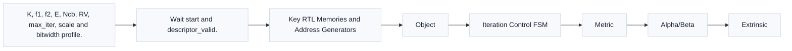

# T19.1 LTE TurboRTL 微架构：从 SISO 数据通路到 CRC 门控迭代控制
## 本节学习目标

本节设计LTE Turbo译码器的寄存器传输级微架构。先把本篇会反复使用的术语列清：Turbo 码是 LTE 数据传输主线使用的并行级联卷积码；软输入软输出（Soft-Input Soft-Output, SISO）译码器是 Turbo 迭代译码中的半迭代核心；对数似然比是接收端输入的软信息；循环冗余校验用于判断译码结果是否通过；码块是 Turbo core 一次处理的对象；传输块是多个 CB 重组后的交付对象；混合自动重传请求负责重传和软合并上下文；块错误率是后续性能验收指标；静态随机存取存储器保存 LLR、alpha/beta 度量和外信息；有限状态机（Finite State Machine, FSM）控制加载、半迭代、CRC 检查和输出；专用集成电路实现还要关注面积、功耗、时序和复位。


- 画出 LTE Turbo RTL 的主数据通路：descriptor、rate recovery 输入、SISO core、alpha/beta 存储、外信息存储、交织/解交织地址生成、CRC gate 和 trace/status 输出。
- 解释哪些字段来自3GPP TS 36.212，哪些是接收机内部实现策略。
- 给出 alpha/beta SRAM、extrinsic ping-pong RAM、LLR buffer 和 mask buffer 的规模估算方法。
- 设计半迭代 FSM：`IDLE -> LOAD -> SISO A -> SISO B -> CRC CHECK -> DONE/ERROR`。
- 说明 CRC 早停为什么只能在完整迭代边界使用，不能在半个 SISO 后随意提交。
- 给出吞吐估算、时钟/复位策略、错误状态码、bit-exact trace 字段和最小验证计划。

如果只记住一句话：TS 36.212 规定 Turbo 编码结构、内部交织器和速率匹配语义；RTL 微架构负责把这些协议输入变成可综合的数据通路、存储器、地址生成器和可验证的状态机，但不能把窗口大小、bank 数、早停策略或时钟门控写成 3GPP 强制要求。

## 前置知识检查

| 前置项 | 本节需要达到的程度 |
|:---|:---|
| T5.2 存储与 bank 基础 | 知道 SRAM、寄存器文件、ping-pong buffer、循环缓存和 bank conflict 的含义。 |
| T5.4 RTL 状态机与握手 | 知道 `valid/ready`、start/done/error、同步复位和状态转移条件。 |
| T6.4 LTE Turbo 内部交织器 | 知道 $K/f_1/f_2$ 生成交织地址，两个 SISO 之间的外信息必须按地址对齐。 |
| T6.6 Log-MAP 与 Max-Log-MAP | 知道 alpha、beta、branch metric、posterior 和 extrinsic 的算法角色。 |
| T7.1-T7.3 Rate Recovery 与 HARQ | 知道速率恢复后进入 Turbo core 的系统位和校验位 LLR，以及重传软合并的边界。 |
| T18.2 LTE Turbo 定点模型 | 知道整数位宽、归一化、饱和、trace checkpoint 和 C/C++ fixed model 的角色。 |
| T18.6 Bit-Exact 回归框架 | 知道 RTL 输出必须和 C/C++ fixed trace 在 checkpoint 上逐整数比较。 |

若你还把 RTL 理解成“把公式翻译成 Verilog”，本节需要先纠正这个直觉。微架构不是公式的逐行翻译，而是对存储、带宽、时序、控制和调试证据的安排。Turbo SISO 公式可以写在一页纸上，但一个可验证的 RTL 需要回答：每拍读哪些 LLR、写哪一列 alpha、beta 从哪里来、外信息地址怎么交织、stall 时 mask 是否同拍、CRC 结果何时可信、复位后软缓存是否清空、失败时 dump 哪个 checkpoint。

## Roadmap 卡片原文与本节执行范围

| 项目 | 内容 |
|:---|:---|
| 编号 | T19.1 |
| 前置 | T5.2, T5.4, T18.2 |
| Prompt | 请设计 LTE Turbo RTL 微架构：SISO 数据通路、alpha/beta 存储、外信息存储、交织/解交织地址生成器、乒乓迭代控制、CRC 早停、时钟/复位方案和吞吐估算。写作时参考本文“单节讲义弹性审计清单”，按本节性质取舍：基础课重理论概念、解释和推导；协议课重 3GPP 前因后果和接收侧流程；工程课重仿真、定点、RTL/ASIC、验证和证据记录。 |
| 产出 | `docs/L3/T19.1_LTE_Turbo_RTL_microarchitecture.md` |
| 验收 | Learner can draw the Turbo decoder block diagram and FSM and estimate memory size. |
| 3GPP/证据 | TS 36.212 Rel-19 `36212-j30` §5.1.3.2/§5.1.4.1；RTL design is implementation guidance。 |

本节是工程微架构课，不实现真实 SystemVerilog 源码。正文会给结构、接口、状态机、存储估算、伪代码和验证计划。真实 RTL 编码、testbench、覆盖率和综合会在 T15 承接。

## 基础理论直觉：RTL 微架构的核心问题

Turbo RTL 微架构的目标不是重新发明 Turbo 算法，而是把“迭代软译码”变成每个时钟周期都可解释、可暂停、可复位、可比较的硬件流程。名称上，SISO 的重点是“输入和输出都是软信息”：它不是只输出 0/1 的硬判决模块，而是输出下一半迭代还能继续使用的可靠度。这个可靠度需要存储、交织、裁剪和回放，因此 RTL 设计必须把算法变量和硬件对象一一对应。

可以把一个 Turbo decoder 想成两个轮流工作的评分员。第一个评分员按原始顺序看信息位和第一路校验位，给出“每个位置更像 0 还是 1”的新意见；第二个评分员按交织顺序看同一批信息位和第二路校验位，再把意见换回原始顺序。RTL 里的 SISO A、SISO B、extrinsic RAM 和 interleaver address generator，就是把这个轮流评分过程变成可综合电路。

这个直觉解释了为什么本节必须同时讲存储和控制。若只设计 SISO 算法，没有外信息 RAM，两个评分员无法交换意见；若只设计 RAM，没有交织地址，意见会写到错误位置；若只设计 CRC gate，没有 FSM，硬件不知道在第几轮可以停止；若只看最终 CRC，没有 alpha/beta/extrinsic trace，失败时无法定位第一处整数分叉。

从名称来源和历史背景看，Turbo decoder 的“迭代”不是为了把公式写得复杂，而是为了解决一个接收端问题：单次软判决在噪声下证据不足，需要两个不同顺序的约束反复补充信息。常见误解是把 RTL 微架构定义成“公式硬连线”；更准确的定义是“把符号推导中的变量、手算例子中的中间量、协议 descriptor 和工程后果全部落到时钟、存储、地址和状态上”。这个定义会影响每个设计选择：alpha/beta 是路径符号的存储化，extrinsic 是推导结果的交换通道，FSM 是接收端流程的时序化，trace 是工程后果的证据化。

## 资料与协议边界

| 资料 | 本地路径 | 边界 |
| :--- | :--- | :--- |
| TS 36.212 README | `3GPP_Rel19/processed/TS_36.212_36212-j30/README.md` | README 只证明抽取结构存在，不替代协议精读。 |
| TS 36.212 §5.1.3.2.1 | `content.md:719-745` | 接收端 SISO/Log-MAP/Max-Log-MAP 是实现策略。 |
| TS 36.212 §5.1.3.2.2 | `content.md:747-751` | RTL 如何初始化 beta、如何窗口化是实现策略。 |
| TS 36.212 §5.1.3.2.3/Table 5.1.3-3 | `content.md:761-773`，`tables/table_0009.csv/html` | 本节回链 T3.3/T6.4 的表格复现，不重复完整长表。 |
| TS 36.212 §5.1.4.1 | `content.md:777-789` | 本节只消费 rate recovery 后的 LLR 和 mask。 |
| TS 36.212 §5.1.4.1.2 | `content.md:817-923` | RTL soft buffer bank、饱和加法和 replay dump 是实现策略。 |
| T18.2 | `docs/L3/T18.2_LTE_Turbo_fixed_point_model_plan.md` | T19.1 把这些字段映射到硬件结构。 |

协议前因后果是：TS 36.212 描述发送侧如何把一个码块编码成三路 Turbo coded streams，再如何做 rate matching。接收侧必须做等价逆过程，把 demapper/HARQ soft buffer 中的 LLR 放回系统位和校验位位置，再让 Turbo decoder 迭代求出信息位。协议没有说“必须用几个 SRAM bank”或“必须几拍完成一个 SISO 更新”，但协议规定的 $K$、$f_1$、$f_2$、$E$、$N_{\mathrm{cb}}$、`rvidx`、`<NULL>` 跳过和 CRC 边界，会直接约束 RTL descriptor 和地址生成器。

## 微架构总图




| 内容 | 说明 |
|:---|:---|
| Task Descriptor | Rate Recovery；SISO Core A/B；Extrinsic RAM；CRC Gate；Status/Trace |
| K, f1, f2, E, Ncb, RV, max_iter, scale and bitwidth profile. | Read soft buffer, place system/parity LLR and valid/null masks.；Branch metric, alpha, beta, posterior and extrinsic update.；Ping-pong apriori/extrinsic storage with pi/depi address maps.；Hard decision, CB CRC, optional e |
| Wait start and descriptor_valid. | Fetch LLR, masks and interleaver context.；Decode natural order, write interleaved extrinsic.；Decode interleaved order, write deinterleaved extrinsic.；Hard decision and CB CRC after full iteration.；Commit status or timeou |
| Object | Storage / Logic；Ports and Timing；Debug Evidence |
| Metric | Teaching Formula；Interpretation |
| Alpha/Beta | 8 states x K columns per window；Two read paths for SISO, normalize per column；alpha_beta_snapshot, norm_offset |
| Extrinsic | Two ping-pong banks indexed by pi/depi；One bank read, one bank write per half-iteration；extrinsic_trace, addr_hash |
| Interleaver | f1/f2 polynomial address generator or ROM；Must align with SISO latency and stall；pi/depi hash, addr_valid |
| CRC Gate | CRC checker after hard decision；May stop after full iteration only；crc_pass, iter_used, stop_reason |
| Memory | alpha/beta + extrinsic + LLR + masks；Size grows with K, states, quantized width and ping-pong banks. |
本节流程顺序为：左上角 descriptor 进入 rate recovery 和 Turbo core，SISO Core A/B 与 Extrinsic RAM 形成半迭代交换，CRC Gate 在完整迭代边界决定 early stop，Status/Trace 输出给 bit-exact 回归；中部表格列关键存储和地址生成器；下部 FSM 展示迭代控制；底部公式表给存储、延迟和吞吐估算口径。

## RTL 模块划分

| 模块 | 输入 | 输出 | 主要职责 | 协议/实现边界 |
|:---|:---|:---|:---|:---|
| `turbo_task_ctrl` | descriptor、start、soft-buffer key | core config、status、error | 锁存 $K/f_1/f_2/E/N_{\mathrm{cb}}/rv_idx/max_iter/bitwidth_profile$，检查字段合法性。 | 字段来自协议向量；寄存器格式是实现策略。 |
| `rate_recovery_if` | soft buffer LLR、valid/null mask | `sys_llr`、`par0_llr`、`par1_llr`、mask | 消费 T7 rate recovery 结果，保证三路流与 mask 同拍。 | TS 36.212 约束 bit order；RTL buffer 组织是实现策略。 |
| `siso_core` | channel LLR、a priori、trellis config | posterior、extrinsic、hard bit | 分支度量、alpha/beta、Max-Log-MAP 或修正 Log-MAP。 | 算法实现选择，不是 3GPP 强制。 |
| `alpha_beta_mem` | SISO 写读请求 | alpha/beta snapshot | 保存路径度量，支持窗口化或全块策略。 | 位宽和窗口大小是实现策略。 |
| `extrinsic_mem` | SISO A/B 外信息 | 下一半迭代 a priori | ping-pong 存储，按 $\pi(k)$ 和 $\pi^{-1}(k)$ 地址读写。 | $f_1/f_2$ 来自 TS 36.212；bank 数是实现策略。 |
| `interleaver_addr_gen` | $K/f_1/f_2$、`k`、mode | `pi_addr`、`depi_addr` | 生成交织/解交织地址，输出 hash/debug。 | 地址公式来自协议表参数；ROM/计算实现可选。 |
| `crc_gate` | hard bits、crc_type、iter_count | `crc_pass`、`stop_reason` | 完整迭代后检查 CB CRC，决定是否 early stop。 | CRC 多项式由 T3.1/T7 回链；早停策略是实现策略。 |
| `trace_status` | checkpoint signals | trace/status/error | 输出 bit-exact 对比字段、饱和计数、首个错误位置。 | T18.6 schema 约束可回放性。 |

模块划分的核心原则是“协议字段和算法状态分离”。`K/f1/f2/rv_idx/E/Ncb` 属于 task descriptor；`alpha_width/extrinsic_scale/max_log_mode/window_size` 属于 implementation config；`crc_pass/iter_used/sat_count` 属于 status；`alpha_beta_snapshot/extrinsic_trace/addr_hash` 属于 debug trace。混在一个无版本的大总线里，会让后续 C/C++ fixed model、RTL scoreboard 和失败 bundle 难以对齐。

## 数值例子：一个 K=6144 任务的存储与周期预算

首先考察一个具体块长，避免微架构停留在框图层面。假设 LTE Turbo CB 的 $K=6144$，输入 LLR 宽度为 6 bit，alpha/beta 度量宽度为 12 bit，外信息宽度为 8 bit，最大迭代次数为 6。若暂不做窗口化，alpha/beta 全块保存需要式 (7) 的约 1.18 Mbit；外信息 ping-pong 需要式 (8) 的 98,304 bit；三路输入 LLR 需要式 (9) 的 110,592 bit。

再估周期。若 SISO core 每拍处理一个 trellis step，忽略 pipeline 填充时一个半迭代约 6144 拍。一次完整迭代含 SISO A 和 SISO B，约 12,288 拍。若最多 6 次迭代，最坏约 73,728 拍，再加 load、CRC 和状态切换。若工作频率为 400 MHz，最坏块时间约：

$$
t_{\mathrm{block}}\approx \frac{73{,}728}{400\times10^6}=184.32\ \mu s.
\tag{1}
$$

式 (1) 回答“这个最朴素单步 SISO 架构是否足够快”。如果系统吞吐目标更高，就必须提高 $P$，做并行 trellis step、窗口流水、双 SISO 并行或多 CB 并行；代价是 SRAM 端口、bank conflict、时序和验证复杂度上升。这就是 RTL 微架构取舍，而不是 TS 36.212 的协议结论。

## SISO 数据通路

SISO core 每个 trellis 时刻处理 8 个状态和若干条合法分支。教学级数据通路可以分为五段：

| 段 | 计算对象 | RTL 关注点 |
|:---|:---|:---|
| Branch Metric | $\gamma_k(s',s)$ | LLR 符号、系统/校验流选择、tail bit 边界、饱和。 |
| Alpha Update | $\alpha_k(s)$ | 前向 ACS/max-star、列归一化、窗口边界。 |
| Beta Update | $\beta_k(s)$ | 后向 ACS/max-star、trellis termination 初始化。 |
| Posterior LLR | $L_{\mathrm{post},k}$ | 支持 bit 0/1 的路径度量差、位宽增长。 |
| Extrinsic | $L_{\mathrm{ext},k}=L_{\mathrm{post},k}-L_{\mathrm{sys},k}-L_{\mathrm{a},k}$ | 扣除 channel 和 a priori，避免回声信息。 |

式 (2) 回答“外信息为什么不是后验 LLR 原样输出”：

$$
L_{\mathrm{ext},k}
=
L_{\mathrm{post},k}
-L_{\mathrm{sys},k}
-L_{\mathrm{a},k}.
\tag{2}
$$

如果漏掉 $L_{\mathrm{a},k}$，第二个 SISO 会把自己上一轮给出的证据再听一遍，迭代可能看似更快收敛，但实际是过度自信。RTL 中这通常表现为 extrinsic 饱和计数很高、CRC 偶尔提前通过、换一个 RV 或噪声点后 BLER 变差。

## Alpha/Beta 存储策略

最直观的实现是保存每一列 8 个状态的 alpha 和 beta。若码块长度为 $K$，度量位宽为 $W_{\alpha}$，全块 alpha 存储估算为：

$$
M_{\alpha}=8K W_{\alpha}\ \mathrm{bits}.
\tag{3}
$$

beta 同理：

$$
M_{\beta}=8K W_{\beta}\ \mathrm{bits}.
\tag{4}
$$

真实 ASIC 常用窗口化来减少 beta 存储或改善吞吐，例如一次处理 $W_{\mathrm{win}}$ 列。窗口化的代价是边界初始化、trace 对齐和 pipeline 控制更复杂。本文不强制某个窗口算法，只给工程检查点：

| 策略 | 优点 | 风险 | 必查 trace |
|:---|:---|:---|:---|
| 全块 alpha/beta | 直观、debug 简单。 | SRAM 大，端口压力高。 | `alpha_beta_snapshot[k][state]`。 |
| Sliding window | 存储小，适合大 K。 | 边界 beta 初始化和窗口 overlap 容易错。 | `window_id`、`boundary_metric`。 |
| Only alpha + backward recompute | 降低 beta 存储。 | 延迟增加，控制复杂。 | `recompute_count`、`stall_count`。 |

无论采用哪种策略，归一化都必须进入 bit-exact policy。常见做法是每列减去最大状态度量：

$$
\tilde{\alpha}_k(s)=\alpha_k(s)-\max_{s'}\alpha_k(s').
\tag{5}
$$

式 (5) 不改变同一列内路径排序，但改变绝对数值。如果 Python fixed 减最大值，RTL 减状态 0 或减最小值，最终 CRC 可能仍过，但 trace 会在 alpha checkpoint 第一轮就分叉。

## 外信息存储与交织地址生成

Turbo decoder 的两个 SISO 观察同一批信息位，但第二个 SISO 按内部交织后的顺序观察。TS 36.212 Table 5.1.3-3 给出合法 $K$ 对应的 $f_1$ 和 $f_2$。内部交织地址由上游 T6.4/T18.2 承接，RTL 侧可以有两种实现：

| 实现 | 方法 | 优点 | 风险 |
|:---|:---|:---|:---|
| Polynomial generator | 每拍计算 $\pi(k)$。 | ROM 小，可参数化。 | 乘法/取模路径可能成为时序热点。 |
| Precomputed ROM | 为当前 $K$ 加载 `pi/depi` 表。 | 读地址稳定，便于对齐。 | ROM/加载空间大，表版本必须 hash。 |

外信息通常使用 ping-pong RAM：

$$
M_{\mathrm{ext}}=2K W_{\mathrm{ext}}\ \mathrm{bits}.
\tag{6}
$$

系数 2 来自双 buffer：一个 bank 被当前 SISO 读取为 a priori，另一个 bank 写入新的 extrinsic。半迭代结束后交换 bank 角色。若只用单 bank，需要读改写冲突处理和 bypass 逻辑，验证难度更高。

交织地址必须和 SISO pipeline latency 同步。若地址早一拍而外信息晚一拍，数据不会溢出，也不一定立刻 CRC fail；它会变成“每个位置都拿到邻居的外信息”的系统性错误。最小 debug 字段应包含 `k`、`pi_addr`、`depi_addr`、`bank_id`、`addr_valid`、`extrinsic_in`、`extrinsic_out` 和 `stall`.

## 乒乓迭代 FSM

推荐的教学 FSM 如下：

```text
IDLE -> LOAD -> SISO_A -> SISO_B -> CRC_CHECK -> DONE
                              ^          |
                              |          |
                              +----------+
                         CRC fail and iter < max_iter
```

状态职责：

| 状态 | 进入条件 | 退出条件 | 关键输出 |
|:---|:---|:---|:---|
| `IDLE` | reset 结束，等待 `start`。 | `start && descriptor_valid`。 | `ready=1`。 |
| `LOAD` | descriptor 锁存完成。 | LLR、mask、interleaver context 可读。 | `load_req`、`context_valid`。 |
| `SISO_A` | 第一半迭代开始。 | natural-order SISO 完成。 | 写 interleaved extrinsic bank。 |
| `SISO_B` | 第二半迭代开始。 | interleaved-order SISO 完成。 | 写 deinterleaved extrinsic bank。 |
| `CRC_CHECK` | 一个完整迭代完成。 | CRC pass、达到 max_iter 或继续迭代。 | `crc_start`、`iter_count`、`stop_reason`。 |
| `DONE/ERROR` | pass、fail、timeout 或非法 descriptor。 | status 被上层读取。 | `done`、`error_code`、`trace_commit`。 |

CRC 早停只应在完整迭代后使用。SISO A 结束时只有一个方向的外信息更新，另一个方向还没有利用这轮信息；此时硬判决不是完整 Turbo iteration 的结果。若在半迭代处提交 CRC，会出现同一 max_iter 下 Python fixed 和 RTL 使用不同停止边界的问题。

## 时钟、复位与握手

T19.1 不假设多时钟域，教学架构使用单个 `clk` 和同步 active-high reset。若 SoC 顶层后来把 soft buffer、DMA 或 register bus 放在不同 clock domain，必须在 T19.4/T15 中引入 CDC 同步和异步 FIFO 证明。

建议接口：

```systemverilog
typedef struct packed {
  logic [12:0] K;
  logic [12:0] E;
  logic [12:0] Ncb;
  logic [12:0] f1;
  logic [12:0] f2;
  logic [1:0]  rv_idx;
  logic [5:0]  max_iter;
  logic        early_stop_en;
  logic [7:0]  bitwidth_profile_id;
} turbo_desc_t;
```

这段只是接口草图，不是最终 RTL 文件。真实实现还应增加 `descriptor_version`、`crc_type`、`soft_buffer_key`、`llr_sign_convention`、`layout_hash`、`trace_enable` 和非法字段检查。

复位规则：

| 对象 | reset 后状态 | 原因 |
|:---|:---|:---|
| FSM | `IDLE` | 防止未知状态启动错误写。 |
| descriptor latch | invalid | 防止复位后沿用旧任务。 |
| extrinsic RAM | 可不全清，但 valid mask 必须清。 | 大 SRAM 全清代价高，valid 控制更关键。 |
| counters | 0 | `iter_used`、`sat_count`、`stall_count` 可复现。 |
| status/error | known idle | 上层读取不能看到 X。 |

## 存储与吞吐估算

设 $K=6144$，$W_{\alpha}=W_{\beta}=12$ bit，$W_{\mathrm{ext}}=8$ bit，输入 LLR 三路各 6 bit。教学估算如下：

$$
M_{\alpha}+M_{\beta}=8K(W_{\alpha}+W_{\beta})
=8\times6144\times24=1{,}179{,}648\ \mathrm{bits}.
\tag{7}
$$

外信息 ping-pong：

$$
M_{\mathrm{ext}}=2K W_{\mathrm{ext}}
=2\times6144\times8=98{,}304\ \mathrm{bits}.
\tag{8}
$$

三路输入 LLR：

$$
M_{\mathrm{llr}}=3K W_{\mathrm{llr}}
=3\times6144\times6=110{,}592\ \mathrm{bits}.
\tag{9}
$$

这些数不是最终 ASIC 面积，只是架构早期估算。窗口化可以显著降低 alpha/beta 存储；并行 SISO 可以提高吞吐但增加端口和比较器数量。

若一个 SISO 每拍处理 $P$ 个 trellis step，单个半迭代约需：

$$
C_{\mathrm{half}}\approx \left\lceil\frac{K}{P}\right\rceil+C_{\mathrm{pipe}}.
\tag{10}
$$

完整 block 延迟：

$$
C_{\mathrm{block}}\approx N_{\mathrm{iter}}\left(2C_{\mathrm{half}}+C_{\mathrm{swap}}\right)+C_{\mathrm{load}}+C_{\mathrm{crc}}.
\tag{11}
$$

吞吐：

$$
T_{\mathrm{bps}}\approx
\frac{K f_{\mathrm{clk}}}{C_{\mathrm{block}}}.
\tag{12}
$$

式 (12) 回答的是“每秒输出多少信息 bit”。若 CRC early stop 让平均迭代数从 6 降到 3，平均吞吐会提升，但最坏时延仍必须按 `max_iter` 预算。协议不会保证每个块都早停。

## 接收端流程

1. 上游完成 LTE Turbo rate recovery 和 HARQ soft combining，提供三路 LLR、valid/null mask、`K/f1/f2/E/Ncb/rv_idx` 和 CRC 类型。
2. `turbo_task_ctrl` 检查 descriptor：$K$ 是否属于 Table 5.1.3-3 合法集合，`rv_idx` 是否在当前 transport channel 边界内，位宽 profile 是否存在。
3. `rate_recovery_if` 将输入 LLR 写入本地 buffer，mask 同拍进入有效位通道。
4. FSM 进入 `SISO_A`，用 natural order 读取系统位、校验位和 a priori，输出 interleaved extrinsic。
5. FSM 进入 `SISO_B`，按 interleaved order 读取第二校验流和外信息，输出 deinterleaved extrinsic。
6. 完整迭代结束后做 hard decision 和 CB CRC。若 pass 且 early stop 允许，则进入 `DONE`；否则继续下一轮或达到 `max_iter` 后提交 fail。
7. 输出 `decoded_bits`、`crc_pass`、`iter_used`、`sat_count`、`stop_reason`、`first_error_code` 和可选 trace。

## 伪代码

```text
on start:
  assert descriptor_valid
  check K/f1/f2/E/Ncb/rv_idx/bitwidth_profile
  load sys_llr, par0_llr, par1_llr, valid_mask
  clear extrinsic ping-pong valid state

for iter in 1..max_iter:
  siso_a:
    read natural order sys_llr/par0_llr/apriori
    compute gamma/alpha/beta/posterior
    write extrinsic_bank_next[pi(k)]

  swap extrinsic banks

  siso_b:
    read interleaved sys_llr/par1_llr/apriori
    compute gamma/alpha/beta/posterior
    write extrinsic_bank_next[depi(k)]

  hard decision from posterior
  crc_pass = cb_crc(hard_bits)
  if early_stop_en and crc_pass:
    stop_reason = CRC_PASS
    break

if not crc_pass:
  stop_reason = MAX_ITER_OR_FAIL

commit status and trace
```

## 定点化策略

RTL 位宽必须继承 T18.1/T18.2 的 fixed requirement，不能在硬件里单独“看起来够用”就改。最低字段：

| 对象 | 建议记录 | 验证方式 |
|:---|:---|:---|
| Input LLR | `llr_width`、`llr_frac`、`llr_min/max` | 与 Python fixed 输入逐元素比较。 |
| Branch Metric | `branch_metric_width`、饱和计数 | `gamma_trace` bit-exact。 |
| Alpha/Beta | `metric_width`、归一化策略 | 每列 snapshot 和 `norm_offset` 比较。 |
| Extrinsic | `extrinsic_width`、缩放、裁剪 | `extrinsic_trace` 和 saturation counter。 |
| CRC gate | hard decision 位序、CRC 类型 | CB CRC pass/fail 与 C/C++ fixed 一致。 |

定点最容易错的不是加法器，而是策略不一致：Python fixed 用 nearest rounding，RTL 用 truncation；C++ 每列减最大值，RTL 每 4 列归一化一次；Python 对 extrinsic 先缩放再裁剪，RTL 先裁剪再缩放。这些都必须进入 T18.6 的 `bit_exact_policy_hash`。

## RTL/ASIC 映射

| 结构 | ASIC 关注点 | 设计建议 |
|:---|:---|:---|
| SISO ACS/max-star datapath | 比较器树、修正 LUT、critical path | Max-Log-MAP 可先落地；Log-MAP 修正 LUT 做可选 mode。 |
| Alpha/Beta SRAM | 容量、端口、读写冲突 | 早期用单端口/双端口假设分开估算，不混写。 |
| Extrinsic RAM | ping-pong bank、读写同址 | bank id 和 valid bit 跟 trace 一起输出。 |
| Interleaver generator | 乘法/模运算时序 | 高速版本可使用预计算 ROM 或流水化 polynomial generator。 |
| CRC checker | CRC latency、pipeline flush | CRC result 进入 FSM 前必须带 block tag。 |
| Clock gating | 动态功耗 | 只能在 idle、stall 或 bank unused 时门控，不能破坏 trace 对齐。 |
| Reset | X 传播和旧任务污染 | descriptor/status/counter 必须清；大 SRAM 用 valid mask 控制。 |

## 验证方法

最小验证不应只看最终 CRC。T19.1 的 RTL testbench 至少要包含：

| 测试 | 输入 | 检查点 |
|:---|:---|:---|
| Smoke block | 小 $K$、无噪声、`max_iter=1` | FSM 顺序、descriptor latch、CRC gate 不提前。 |
| Interleaver address | 固定 $K/f_1/f_2$，遍历 $k$ | `pi/depi` 与 T6.4/T18.2 hash 一致。 |
| SISO checkpoint | C/C++ fixed trace | `gamma/alpha/beta/extrinsic` first mismatch。 |
| Early stop | 一个 pass、一个 fail case | pass 只在完整迭代后停止，fail 到 `max_iter`。 |
| Stall/reset | 随机 `ready` stall 和中途 reset | mask/LLR/address 同拍，reset 不提交旧 status。 |
| Saturation | 高幅度 LLR | `sat_count` 与 fixed model 一致。 |

最小 dump 包：

```yaml
vector_id: lte_turbo_k6144_rv0_directed_0001
descriptor:
  K: 6144
  f1: 263
  f2: 480
  E: 18444
  Ncb: 18444
  rv_idx: 0
trace:
  checkpoint: siso_a.alpha
  iter: 1
  k: 128
  state: 3
  expected: -42
  actual: -41
status:
  crc_pass: false
  iter_used: 6
  sat_count_alpha: 12
  stop_reason: MAX_ITER
```

示例中的 $f_1/f_2$ 数值必须来自已核验 Table 5.1.3-3。若测试脚本直接解析表格，应记录 `tables/table_0009.csv/html` 的 hash 和所用行号。

## 常见错误

| 错误 | 现象 | 定位方法 |
|:---|:---|:---|
| CRC 半迭代早停 | RTL 比 C++ 少跑半轮，某些块偶发 pass。 | 检查 `stop_reason` 和 `iter_phase`。 |
| interleaver 地址晚一拍 | 外信息错位，BLER 异常但无越界。 | 比较 `pi_addr/depi_addr/extrinsic_trace`。 |
| mask 未随 pipeline 延迟 | `<NULL>` 或 invalid lane 参与度量。 | dump `valid_mask_pipe`。 |
| alpha/beta 归一化策略不同 | checkpoint 差常数或局部翻转。 | 比较 `norm_offset`。 |
| extrinsic 扣除项漏掉 | 外信息过度自信，饱和计数高。 | 检查式 (2) 对应 trace。 |
| reset 后旧 descriptor 残留 | 下一块使用旧 $K/f_1/f_2$。 | reset directed test 和 descriptor valid bit。 |
| CRC latency 未打 tag | 上一个 CB 的 CRC 结果提交到当前 CB。 | `cb_id`、`crc_req_id`、`crc_rsp_id` 对齐。 |

## 自测题

1. 为什么 CRC early stop 应放在完整迭代边界，而不是 SISO A 结束后？
2. 如果 `pi_addr` 正确但 extrinsic 数据晚一拍，最终会表现为什么问题？
3. 为什么 alpha/beta 归一化必须进入 bit-exact trace？
4. $K=6144$、$W_{\alpha}=W_{\beta}=12$ bit 时，全块 alpha/beta 存储大约是多少 bit？
5. reset 时为什么可以不清整个大 SRAM，但必须清 valid mask 或 descriptor valid？

## 自测题参考答案

1. Turbo 一次完整迭代包含 SISO A 和 SISO B 两个半迭代。SISO A 后只有一个方向的外信息更新，另一个方向尚未消费新证据；此时做 CRC 会让 RTL 停止边界和 fixed model 不一致。
2. 地址本身看起来正确，但写入的是上一拍或下一拍的 extrinsic，等价于把可靠度交给邻居 bit。常见现象是无越界、CRC 偶发失败、`extrinsic_trace` first mismatch 提前出现。
3. 归一化不改变路径排序，但改变整数绝对值。若 C++ 和 RTL 减去不同 offset，后续饱和、posterior 和 extrinsic 都会不同，因此必须记录 `norm_offset`。
4. 由式 (7) 得 $8\times6144\times24=1{,}179{,}648$ bit，约 144 KiB。窗口化或重算 beta 可以降低这个数。
5. 大 SRAM 全清会消耗时间和面积控制逻辑。只要 valid mask、descriptor valid 和 status 被清，旧数据不会被当作有效输入；但如果 valid 未清，旧 extrinsic 或 LLR 可能污染下一块。

## 本节验收与 Prompt 覆盖

| Prompt 要求 | 正文证据 | 覆盖状态 |
|:---|:---|:---|
| SISO 数据通路 | `## SISO 数据通路`、图 T19.1-1 | 已覆盖。 |
| alpha/beta 存储 | `## Alpha/Beta 存储策略`、式 (3)-(5) | 已覆盖。 |
| 外信息存储 | `## 外信息存储与交织地址生成`、式 (6) | 已覆盖。 |
| 交织/解交织地址生成器 | `interleaver_addr_gen` 模块表、地址生成实现对比 | 已覆盖。 |
| 乒乓迭代控制 | `## 乒乓迭代 FSM`、图 T19.1-1 | 已覆盖。 |
| CRC 早停 | `crc_gate`、FSM、验证方法 | 已覆盖，并说明完整迭代边界。 |
| 时钟/复位方案 | `## 时钟、复位与握手` | 已覆盖。 |
| 吞吐估算 | `## 存储与吞吐估算`、式 (10)-(12) | 已覆盖。 |

## 协议证据表

| 对象 | 协议/本地证据 | 本节如何使用 |
|:---|:---|:---|
| Turbo encoder 结构 | TS 36.212 Rel-19 `36212-j30` §5.1.3.2.1，`content.md:719-745` | 说明两个 8-state constituent encoders 和内部交织器是 SISO/trellis 来源。 |
| Trellis termination | TS 36.212 §5.1.3.2.2，`content.md:747-751` | 说明 tail bits 和 beta 边界。 |
| Turbo internal interleaver | TS 36.212 §5.1.3.2.3/Table 5.1.3-3，`content.md:761-773`，`tables/table_0009.csv/html` | 说明 $K/f_1/f_2$ 是地址生成器输入，完整表由 T3.3/T6.4 复现。 |
| Rate matching | TS 36.212 §5.1.4.1，`content.md:777-789` | 说明三路流和 circular buffer 是 rate recovery 输入来源。 |
| RV/E/Ncb 边界 | TS 36.212 §5.1.4.1.2，`content.md:817-923` | 说明 `E/Ncb/rv_idx` 属于 descriptor 和 soft buffer key。 |
| RTL 微架构 | 本节工程设计 | SRAM、FSM、早停、clock/reset、bank 和 trace 是实现指导，不是 3GPP 强制要求。 |

## 图示


## 执行与证据记录

本节新增文件：

- `docs/L3/T19.1_LTE_Turbo_RTL_microarchitecture.md`
- `tools/figures/render_t14_1_lte_turbo_rtl_microarchitecture.py`
- `docs/L3/assets/T19.1_LTE_Turbo_RTL_microarchitecture.png`

已执行表格生成和图形审计：

```bash
python3 tools/figures/render_t14_1_lte_turbo_rtl_microarchitecture.py
# WROTE docs/L3/assets/T19.1_LTE_Turbo_RTL_microarchitecture.png (2400, 2140)

python3 tools/audit_figure_geometry.py tools/figures/render_t14_1_lte_turbo_rtl_microarchitecture.py

python3 tools/audit_figure_readability.py tools/figures/render_t14_1_lte_turbo_rtl_microarchitecture.py

python3 -m py_compile tools/figures/render_t14_1_lte_turbo_rtl_microarchitecture.py
# exit 0
```


文档审计命令与结果：

```bash
python3 tools/audit_lesson_terms.py docs/L3/T19.1_LTE_Turbo_RTL_microarchitecture.md
# LESSON_TERM_AUDIT_OK

python3 tools/audit_markdown_headings.py docs/L3/T19.1_LTE_Turbo_RTL_microarchitecture.md
# MARKDOWN_HEADING_AUDIT_OK

python3 tools/audit_lesson_depth.py --strict docs/L3/T19.1_LTE_Turbo_RTL_microarchitecture.md
# LESSON_DEPTH_AUDIT_OK

python3 tools/audit_latex_render.py docs/L3/T19.1_LTE_Turbo_RTL_microarchitecture.md
# LATEX_RENDER_AUDIT_OK formulas=55

python3 tools/audit_reference_rebuilds.py docs/L3/T19.1_LTE_Turbo_RTL_microarchitecture.md
# REFERENCE_REBUILD_AUDIT_CANDIDATES
```

引用重建审计输出为候选清单：主要来自 TS 36.212 Table 5.1.3-3 的上游已复现回链、协议边界表和工程公式/图说明；本节未直接复制新的协议长表。若后续 RTL 生成脚本直接解析 Table 5.1.3-3，应把 `tables/table_0009.csv/html` 的 hash、解析脚本和使用行号纳入 T15 evidence archive。

## 参考文献

- 3GPP TS 36.212 Rel-19，本地路径 `3GPP_Rel19/processed/TS_36.212_36212-j30`。
- `docs/L2/T3.3_LTE_Turbo_segmentation_rules.md`，LTE Turbo 合法块长和内部交织器表格复现。
- `docs/L2/T6.4_LTE_Turbo_interleaver_QPP.md`，QPP interleaver 地址生成。
- `docs/L2/T6.6_Log_MAP_Max_Log_MAP_Turbo.md`，Log-MAP、Max-Log-MAP 和外信息推导。
- `docs/L2/T7.1_LTE_Turbo_de_rate_matching_overview.md` 至 `docs/L2/T7.3_LTE_HARQ_soft_buffer_RV.md`，rate recovery、HARQ/RV 和 soft buffer。
- `docs/L3/T18.2_LTE_Turbo_fixed_point_model_plan.md`，LTE Turbo C/C++ 定点模型计划。
- `docs/L3/T18.6_bit_exact_regression_harness.md`，bit-exact 回归框架与 failure bundle。
