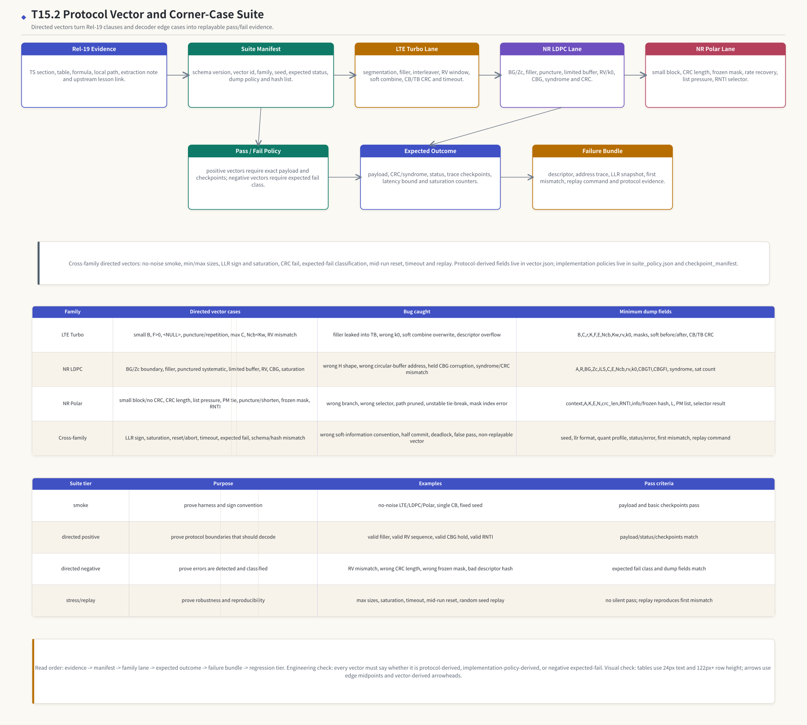

# T20.2 协议向量与边界案例套件：从 Rel-19 证据到 directed regression
## 本节学习目标

本节定义译码器验证中的协议向量与边界案例套件。这里的“协议向量”不是随便生成的一组随机比特，而是能从3GPP Release 19 证据回链到本地协议文件、上游讲义、向量生成脚本和预期输出的一条测试样本。LTE Turbo、NR LDPC和 NR Polar都有自己的协议边界：码块、循环缓存、填充位、冗余版本、码块组、冻结位、列表译码和循环冗余校验/RNTI selector 都可能成为 directed test 的主角。


- 把一条测试样本拆成协议派生字段、实现策略字段、随机种子、输入 LLR、预期输出和失败证据。
- 为 LTE Turbo、NR LDPC、NR Polar 分别列出必须有的 directed vectors，并说明每条 vector 抓什么 bug。
- 区分 positive vector、negative expected-fail vector、reset/timeout vector 和 replay vector 的通过条件。
- 设计最小 `vector.json`、`suite_policy.json`、`checkpoint_manifest` 和 failure bundle 字段。
- 说明哪些字段来自 TS 36.212、TS 38.212、TS 38.214 或上游讲义，哪些只是工程测试策略。
- 把 T20.1 的 testbench loader/scoreboard 和 T18.6 的 bit-exact 回归框架连接起来。

如果只记住一句话：T20.2 的套件不是“多跑一些随机帧”，而是把协议规则切换点、数值解释切换点和硬件状态切换点做成可复现的 directed evidence。

## 前置知识检查

| 前置项 | 本节需要达到的程度 |
|:---|:---|
| T7.6 LTE Turbo 边界案例 | 知道 filler、`<NULL>`、打孔、重复、RV、LLR 符号、CRC 误通过和 timeout 的区别。 |
| T9.6 NR LDPC 边界案例 | 知道 BG/$Z_c$、filler、punctured systematic bits、limited buffer、RV、CBG、syndrome/CRC 边界。 |
| T10.8 NR Polar 边界案例 | 知道 small block、CRC 长度、list size、PM tie、puncturing/shortening、frozen mask、RNTI 边界。 |
| T18.6 Bit-exact 回归框架 | 知道 vector schema、hash、checkpoint manifest、failure bundle 和比较策略。 |
| T20.1 Testbench 架构 | 知道 loader、driver、monitor、scoreboard、assertion、reset/timeout sequence 的角色。 |

自检问题：

| 问题 | 若回答不出来，先回看 |
|:---|:---|
| 为什么 CRC fail 不是根因分类？ | T7.6、T9.6、T10.8。 |
| 为什么 expected-fail vector 也可能是“测试通过”？ | T20.1 的 pass/fail policy。 |
| 为什么 RV mismatch 必须保存 address trace，而不是只保存 `rv=2`？ | T7.3、T7.6、T9.3、T9.6。 |
| 为什么 Polar list size 不是 3GPP 强制字段？ | T10.5、T10.8、T18.4。 |

## Roadmap 卡片原文与执行范围

| 项目 | 内容 |
|:---|:---|
| 编号 | T20.2 |
| 前置 | T7.6, T9.6, T10.8, T18.6 |
| Prompt | 请定义 LTE Turbo、NR LDPC、NR Polar 的协议向量和边界案例套件：最小/最大大小、填充位、CRC 失败、RV 不匹配、CBG、列表大小压力、LLR 饱和和运行中复位。 |
| 产出 | `docs/L3/T20.2_protocol_vector_corner_case_suite.md` |
| 验收 | Learner can list required directed tests for all three decoders and explain what each catches. |
| 证据边界 | TS 36.212 Rel-19 `36212-j30` / TS 38.212 Rel-19 `38212-j30` anchors for sizes/rate matching/CRC; exact corner tables must be verified. |

本节是验证工程课，但它必须围绕协议精读。协议规定的是编码、分段、CRC、速率匹配、RV、CBG、Polar construction 和控制信息分支；测试套件规定的是如何把这些规则变成可执行向量、预期结果、失败分类和 dump 包。不能把 `suite_tier`、`expected_fail_class`、`timeout_cycles`、`list_size_sweep` 写成 3GPP 强制字段；它们属于工程验证策略。

## 资料与协议边界

| 资料 | 本地路径 | 边界 |
| :--- | :--- | :--- |
| TS 36.212 Rel-19 `36212-j30` | `3GPP_Rel19/processed/TS_36.212_36212-j30` | 本节不重新复现 Table 5.1.3-3 全表，使用 T3.3/T6/T7 上游结论。 |
| TS 38.212 Rel-19 `38212-j30` | `3GPP_Rel19/processed/TS_38.212_38212-j30` | 本节不重新复现 BG 表和 Polar reliability table，使用 T8/T9/T10 上游结论。 |
| TS 38.214 Rel-19 `38214-j30` | `3GPP_Rel19/processed/TS_38.214_38214-j30` | 只作为 CBG/调度上下文证据，不规定 vector schema。 |
| LTE 边界章节 | `docs/L2_协议算法/T7.6_LTE_Turbo_decoder_edge_cases.md` | T20.2 转换为套件清单，不重写 T7.6 全部解释。 |
| NR LDPC 边界章节 | `docs/L2_协议算法/T9.6_NR_LDPC_decoder_edge_cases.md` | T20.2 只汇总为向量矩阵。 |
| NR Polar 边界章节 | `docs/L2_协议算法/T10.8_NR_Polar_decoder_edge_cases.md` | T20.2 不重新推导 SCL。 |
| Bit-exact 框架 | `docs/L3/T18.6_bit_exact_regression_harness.md` | 工程框架，不是 3GPP 条文。 |
| Testbench 架构 | `docs/L3/T20.1_decoder_testbench_architecture.md` | T20.2 输出给 T20.1 消费。 |

协议前因后果可以按接收端反推。发射端按照 TS 36.212 或 TS 38.212 把 TB 变成可发送的编码比特；接收端拿到的是被资源、调制、RV、CBG、rate matching 和噪声改变后的软信息。协议向量的作用就是把“按协议应该发生什么”固定下来，使 RTL 或 C/C++ 实现失败时能判断是协议字段、地址、数值、状态机还是比较策略错。

## 协议向量不是随机样本

随机样本适合统计 BLER，但不适合证明边界。比如随机生成 10000 个 NR LDPC TB，也不一定正好落在 BG1/BG2 分支边界、$Z_c$ 表切换点、limited buffer、RV 回绕、CBG hold/flush 或 syndrome pass but CRC fail 的组合上。协议向量套件需要显式设计这些点。

一条向量至少有三层身份：

| 层 | 回答的问题 | 典型字段 |
|:---|:---|:---|
| 协议身份 | 这条向量对应哪个标准、哪个章节、哪个编码对象？ | `standard`, `ts_spec`, `ts_release`, `source_section`, `local_evidence_path` |
| 测试身份 | 这条向量属于哪个 suite tier，要证明或故意破坏什么？ | `suite_tier`, `case_id`, `expected_status`, `expected_fail_class` |
| 实现身份 | 这条向量以什么数值格式、布局和 checkpoint 比较？ | `llr_format`, `quant_profile`, `layout_version`, `checkpoint_manifest` |

这三层不能混在文件名里。文件名可以叫 `nr_ldpc_rv2_cbg_seed7.json`，但机器必须能从 JSON 字段里读出 BG、$Z_c$、RV、CBGTI、CBGFI、LLR 格式、expected failure 和证据路径。

## 套件总体架构


| 内容 | 说明 |
|:---|:---|
| Rel-19 Evidence | TS section, table, formula, local path, extraction note and upstream lesson link. |
| Suite Manifest | schema version, vector id, family, seed, expected status, dump policy and hash list. |
| LTE Turbo Lane | segmentation, filler, interleaver, RV window, soft combine, CB/TB CRC and timeout. |
| NR LDPC Lane | BG/Zc, filler, puncture, limited buffer, RV/k0, CBG, syndrome and CRC. |
| NR Polar Lane | small block, CRC length, frozen mask, rate recovery, list pressure, RNTI selector. |
| Pass / Fail Policy | positive vectors require exact payload and checkpoints; negative vectors require expected fail class. |
| Expected Outcome | payload, CRC/syndrome, status, trace checkpoints, latency bound and saturation counters. |
| Failure Bundle | descriptor, address trace, LLR snapshot, first mismatch, replay command and protocol evidence. |
| evidence | manifest |
| lte | ldpc |
本节流程顺序为：Rel-19 evidence 进入 suite manifest；manifest 分发到 LTE Turbo、NR LDPC、NR Polar 三条 suite lane；每条 lane 产出 expected outcome；scoreboard 使用 pass/fail policy 判断；failure bundle 保留 descriptor、地址、LLR、first mismatch 和 replay 证据。图下半部分把三类 decoder 的 directed cases 和 suite tier 放在同一张矩阵中，避免只记某一个算法的边界。

## 向量文件对象模型

T18.6 已定义统一 vector schema。T20.2 在它上面增加 suite 分类和 corner-case 语义。建议最小目录如下：

```text
vectors/
  suite_manifest.json
  suite_policy.json
  lte_turbo/
    lte_turbo_filler_F12_cb0_seed001/
      vector.json
      input_llr_q6.bin
      expected_payload.bin
      expected_trace.jsonl
      manifest.json
  nr_ldpc/
  nr_polar/
```

`suite_manifest.json` 汇总所有向量，负责回归选择：

```json
{
  "schema_version": "decoder_suite_manifest_v1",
  "suite_id": "rel19_decoder_corner_suite_2026_06",
  "release_baseline": "Rel-19",
  "vectors": [
    {
      "vector_id": "lte_turbo_filler_F12_cb0_seed001",
      "decoder_family": "lte_turbo",
      "suite_tier": "directed_positive",
      "case_id": "lte_filler_cb0_delete",
      "expected_status": "pass",
      "source_lesson": "docs/L2_协议算法/T7.6_LTE_Turbo_decoder_edge_cases.md"
    }
  ]
}
```

`suite_policy.json` 保存工程策略，不和协议字段混写：

```json
{
  "schema_version": "decoder_suite_policy_v1",
  "expected_fail_classes": [
    "DESCRIPTOR_LEGALITY_FAIL",
    "RATE_RECOVERY_OR_RV_MISMATCH",
    "CRC_BOUNDARY_FAIL",
    "RESET_ABORT_NO_HALF_COMMIT",
    "TIMEOUT_DETECTED"
  ],
  "timeout_policy": {
    "dut_timeout_required": true,
    "testbench_timeout_required": true
  },
  "saturation_policy": {
    "llr_add_mode": "signed_saturating",
    "record_sat_count": true
  }
}
```

`vector.json` 保存单条向量身份。它必须同时让软件 golden、C/C++ 定点模型和 RTL scoreboard 看懂：

```json
{
  "schema_version": "decoder_vector_v1",
  "vector_id": "nr_ldpc_cbg_mask_msb_seed014",
  "decoder_family": "nr_ldpc",
  "standard": "nr",
  "ts_release": "rel19",
  "ts_spec": "TS 38.212",
  "source_section": ["5.2.2", "5.4.2", "7.2"],
  "local_evidence_path": "3GPP_Rel19/processed/TS_38.212_38212-j30",
  "suite_tier": "directed_negative",
  "case_id": "cbgti_bit_order_negative",
  "expected_status": "fail",
  "expected_fail_class": "CBG_MASK_MISMATCH",
  "seed": {
    "master_seed": "0x15_02_000e",
    "llr_seed": "0x15_02_100e"
  },
  "protocol_fields": {
    "bg": 1,
    "zc": 384,
    "rv_idx": 2,
    "ncb": 12000,
    "e": 4096,
    "cb_count": 4,
    "cbgti": "10",
    "cbgfi": 1
  },
  "llr_format": {
    "sign_convention": "positive_means_bit0",
    "quant_bits": 6,
    "saturation": "signed_saturating"
  },
  "checkpoint_manifest": "t13_6_ldpc_manifest_v1"
}
```

关键点是 `protocol_fields` 和 `suite_tier` 分开。`bg`、`zc`、`rv_idx`、`ncb`、`e` 是协议或协议派生字段；`directed_negative`、`expected_fail_class`、`quant_bits`、`checkpoint_manifest` 是工程验证字段。这样写能避免把测试策略误读为 3GPP 规定。

## Suite Tier 与通过条件

| Suite tier | 目的 | 典型样本 | 通过条件 |
|:---|:---|:---|:---|
| `smoke` | 证明 harness、LLR 符号、基本接口和 checkpoint 能跑通。 | 无噪声、单 CB、固定短块。 | payload/status/basic checkpoint pass。 |
| `directed_positive` | 证明合法协议边界能正确处理。 | 合法 filler、合法 RV 序列、合法 CBG hold、正确 RNTI。 | payload、CRC/syndrome、status、checkpoint 和 latency 符合预期。 |
| `directed_negative` | 证明错误输入或错误实现会被分类。 | 错 RV、错 CRC 长度、错 frozen mask、非法 descriptor。 | 不要求 CRC pass；要求 fail class、error/status、dump 字段和 first mismatch 正确。 |
| `stress` | 覆盖最大规模、饱和、吞吐、buffer 和 timeout 风险。 | 最大 CB 数、最大 $Z_c$、大 $L$、高 LLR 饱和、长输入 stream。 | 没有 silent pass、没有未分类 error、资源计数在限内。 |
| `replay` | 证明失败可复现。 | 从 nightly failure bundle 回灌。 | 同 seed、同 vector、同 policy 复现同一 first mismatch 或声明版本差异。 |

expected-fail 的通过条件需要特别强调。若一个 `RV_MISMATCH_NEGATIVE` 向量被 DUT 译成 CRC pass，测试应 fail；若 DUT 报出 `RATE_RECOVERY_OR_RV_MISMATCH` 并保存 `rv/k0/address_trace`，测试才 pass。换言之，negative vector 的正确结果是“按预期失败并可定位”，不是“强行译对”。

## LTE Turbo Directed Vector Suite

LTE Turbo suite 的证据主线来自 TS 36.212 §5.1.1、§5.1.2、§5.1.3.2 和 §5.1.4.1。接收端的测试主线是：分段 descriptor 正确，filler 和 `<NULL>` 语义正确，循环缓存地址正确，HARQ 软合并正确，CB/TB CRC 和 timeout 判定正确。

| Case ID | 向量类型 | 抓错目标 | 最小字段 | 通过条件 |
|:---|:---|:---|:---|:---|
| `lte_smoke_no_noise_single_cb` | smoke | harness、LLR 符号、单 CB 基本路径。 | `B`, `C=1`, `K`, `E`, `rv=0`, `llr_sign_convention` | payload、CB CRC、TB CRC pass；无 timeout。 |
| `lte_min_block_B_lt_40` | directed positive | 小块 filler 与最小 interleaver 支持边界。 | `B`, `K`, `F`, `K_plus/K_minus`, CB0 input snapshot | CB0 filler 只在协议位置出现，重组后 TB 长度正确。 |
| `lte_filler_cb0_delete` | directed positive | 分段 filler 留入 TB 的错误。 | `F>0`, `r`, `C`, CB0 decoded bits, reassembly offset | 所有 CB CRC pass 后，TB 重组删除 CB0 前 $F$ 位。 |
| `lte_null_skip_subblock` | directed positive | 子块交织 `<NULL>` 进入循环缓存导致地址偏移。 | `null_mask_count`, interleaver rows/cols, `Kw`, readout count | `<NULL>` 只被跳过，不进入 soft buffer 有效地址。 |
| `lte_puncture_unknown_llr` | directed positive | 打孔位置被当强 0 或强 1。 | `unknown_mask`, `E`, `Ncb`, `k0`, LLR init value | 未发送位置保持 unknown/中性，不产生强置信证据。 |
| `lte_repetition_saturation` | directed positive | 重复位置覆盖而非累加，或定点饱和错误。 | address hit count, soft before/after, `sat_count` | 同地址 LLR 累加并按 policy 饱和。 |
| `lte_max_cb_descriptor_limit` | stress/negative | 最大 CB 数或实现数组上限溢出。 | `B`, `C`, `max_cb_supported`, descriptor count | 支持范围内全译；超范围报 `DESCRIPTOR_OVERFLOW`。 |
| `lte_ncb_less_than_kw` | directed positive | limited soft buffer 下仍按 $K_w$ 寻址。 | `Kw`, `Ncb`, `rv`, `k0`, address trace | 所有地址落在 `[0,Ncb)`，unknown mask 以 `Ncb` 为空间。 |
| `lte_rv_mismatch_negative` | directed negative | 重传 RV 写到错误循环缓存位置。 | `rv`, `k0`, `E`, soft before/after, HARQ attempt | fail class 为 `RATE_RECOVERY_OR_RV_MISMATCH`，dump 地址轨迹。 |
| `lte_llr_sign_negative` | directed negative | 解调器和译码器 LLR 符号约定反。 | fixed BPSK vector, `positive_means_bit0`, hard decision | fail class 为 `LLR_SIGN_CONVENTION_MISMATCH`。 |
| `lte_crc_false_pass_audit` | stress/replay | CRC pass 后删除现场，无法分析误通过。 | seed, payload hash, CRC input hash, first mismatch policy | pass 样本也保存摘要；payload mismatch 被统计。 |
| `lte_timeout_negative` | directed negative | 最大迭代或周期 timeout 后仍交付 TB。 | `iter_count`, `cycle_count`, `timeout_cycles`, `last_cb` | timeout 不交付 TB，status/error 可定位。 |

最小 LTE dump 包应直接继承 T7.6：

| 类别 | 必备字段 |
|:---|:---|
| TB/CB descriptor | `tb_id`, `B`, `C`, `r`, `K_r`, `F`, `K_w`, `Ncb`, `E` |
| RV 地址 | `rvidx`, `k0`, `addr_first`, `addr_last`, `wrap_count`, `address_trace_hash` |
| mask | `null_mask_count`, `unknown_mask_count`, `filler_count`, `repeat_count` |
| 数值 | `llr_min`, `llr_max`, `sat_count`, `sign_convention`, `hard_decision_snapshot` |
| CRC/重组 | `cb_crc_status`, `tb_crc_status`, `reassembly_order`, `first_mismatch` |

## NR LDPC Directed Vector Suite

NR LDPC suite 的证据主线来自 TS 38.212 §5.2.2、§5.3.2、§5.4.2、§6.2/§7.2，以及 TS 38.214 §5.1.7/§6.1.5 的 CBG 上下文。接收端测试主线是：descriptor 先对，rate recovery 再对，LDPC core 最后判断；否则 syndrome/CRC fail 只是一种末端症状。

| Case ID | 向量类型 | 抓错目标 | 最小字段 | 通过条件 |
|:---|:---|:---|:---|:---|
| `ldpc_smoke_no_noise_bg1_bg2` | smoke | BG1/BG2 基本路径和 LLR 符号。 | `BG`, `Zc`, `K`, `E`, `rv=0`, `llr_sign_convention` | syndrome、CB CRC、TB CRC pass。 |
| `ldpc_bg_selection_boundary` | directed positive | BG 选择分支边界或重传复用旧 BG。 | `A`, `R`, `BG`, `MCS`, `TBS`, `NDI` | BG 与 golden descriptor 一致，H 尺寸正确。 |
| `ldpc_zc_ils_boundary` | directed positive | $Z_c$ 或 $i_{\mathrm{LS}}$ 表列选择错误。 | `K_prime`, `Zc`, `iLS`, `Kb`, table id | shift schedule、地址深度和 filler count 一致。 |
| `ldpc_filler_known_mask` | directed positive | filler 当 unknown 或留入 payload。 | `filler_ranges`, `known_mask`, payload range | filler 在译码前按 known 语义处理，重组时删除。 |
| `ldpc_punctured_systematic_unknown` | directed positive | punctured systematic bits 被强置信初始化。 | `punctured_mask`, `unknown_llr`, `Ncb`, `k0` | 未观测位置中性或低置信，mask 语义保留。 |
| `ldpc_limited_buffer_ncb` | directed positive | limited buffer 忘记改 `Ncb`。 | `ILBRM`, `N`, `Ncb`, `E`, `rv` | RV 地址和 coverage 以 `Ncb` 为地址空间。 |
| `ldpc_rv_mismatch_negative` | directed negative | DCI RV、HARQ state 或 k0 表错。 | `rvidx`, `k0`, `BG`, `Zc`, `Ncb`, address trace | fail class 为 `RATE_RECOVERY_OR_RV_MISMATCH`。 |
| `ldpc_cbgti_bit_order_negative` | directed negative | CBGTI bit order 反或 CBG-to-CB map 错。 | `CBGTI`, `CBGFI`, `M`, `C`, `cbg_to_cb_map` | fail class 为 `CBG_MASK_MISMATCH`，保存 before/after hash。 |
| `ldpc_llr_saturation_stress` | stress | LLR 缩放或饱和加法错误。 | `llr_min/max`, `sat_count`, `scale`, `iteration` | sat_count 与 expected 一致，syndrome 曲线可解释。 |
| `ldpc_syndrome_pass_crc_fail` | directed negative | syndrome pass 被误当作 TB pass。 | hard bits, `filler_ranges`, CB CRC ranges, concat order | syndrome=0 仍按 CRC/reassembly 判 fail。 |
| `ldpc_crc_pass_upper_assembly_fail` | directed negative | PHY pass 后交付元数据错。 | `tb_id`, `cw_id`, `harq_id`, MAC length, LCID | fail class 指向 upper assembly/context，不改 LDPC core。 |
| `ldpc_midrun_reset_abort` | stress/negative | reset/abort 半提交 soft buffer。 | task id, soft before/after hash, commit flag, reset cycle | 无 half commit；status/error/replay 完整。 |

最小 LDPC dump 包：

| 类别 | 必备字段 |
|:---|:---|
| descriptor | `A`, `R`, `BG`, `Zc`, `iLS`, `C`, `K`, `E`, `Qm`, `rv`, `Ncb` |
| rate recovery | `addr_trace_hash`, `unknown_count`, `repeat_count`, `punctured_mask`, `limited_buffer_flag` |
| CBG/HARQ | `CBGTI`, `CBGFI`, `cbg_to_cb_map`, `held_from_history`, `updated_this_tx` |
| 数值 | `llr_min`, `llr_max`, `sat_count`, `scale`, `quant_bits`, `sign_convention` |
| core/check | `syndrome_weight_per_iter`, `early_stop_reason`, `cb_crc_status`, `tb_crc_status` |

## NR LDPC 高 SNR failure dump 与错误子图

高信噪比（Signal-to-Noise Ratio, SNR）下仍失败的样本不能只保存最终 `CRC_FAIL`。这类样本可能来自 rate recovery 错位、LLR 符号、定点饱和，也可能来自有限长度 Tanner 本节图表中的 trapping/absorbing set。没有完整 replay dump 时，不能把它写成 error floor 证据。

建议新增 `ldpc_high_snr_failure_bundle`，字段如下：

| 字段组 | 必备字段 | 目的 |
|:---|:---|:---|
| replay identity | `vector_id`, `seed`, `snr_db`, `channel_model`, `noise_hash` | 保证同一失败可重放。 |
| protocol descriptor | `BG`, `Zc`, `iLS`, `A`, `B`, `K`, `N`, `Ncb`, `E`, `Qm`, `rv`, `CBGTI` | 排除协议字段错配。 |
| rate recovery evidence | `addr_trace_hash`, `first_64_addrs`, `unknown_count`, `repeat_count`, `known_count` | 判断是否先在 de-RM/RV 层出错。 |
| iteration trace | `syndrome_weight_per_iter`, `max_abs_llr_per_iter`, `sat_count_per_iter`, `stop_reason` | 判断停滞、震荡、饱和或迭代上限。 |
| error subgraph | `error_vn_indices`, `unsatisfied_cn_indices`, `local_edges`, `cycle_summary` | 构造 trapping/absorbing set 候选。 |
| classification | `expected_fail_class`, `analysis_boundary`, `needs_long_run_evidence` | 区分 directed negative、实现 bug 和待统计现象。 |

错误子图分析的最小流程：

1. 从译码输出与 golden payload 或 transmitted codeword 的差异得到 `error_vn_indices`。
2. 用同一 BG/$Z_c$/shift table 生成局部 Tanner 邻接，只展开错误 VN 一跳和两跳邻居。
3. 计算相连 CN 的 satisfied/unsatisfied 状态，形成候选 $(a,b)$ trapping set 描述，其中 $a$ 是错误 VN 数，$b$ 是 unsatisfied CN 数。
4. 若每个错误 VN 连接到的 satisfied checks 多于 unsatisfied checks，可标记 absorbing set candidate。
5. 生成 directed vector：固定 descriptor、固定噪声或直接固定输入 LLR，要求 DUT 重放同一 syndrome trace 或同一 fail class。

这套流程仍是诊断模板。只有当长仿真在明确 SNR、置信区间、seed 范围和 decoder 配置下反复显示高 SNR 斜率变平，才能把它写成项目性能证据。本节当前只定义 failure dump schema 和 directed vector 生成方法。

## NR Polar Directed Vector Suite

NR Polar suite 的证据主线来自 TS 38.212 §5.1、§5.2.1、§5.3.1、§5.4.1、§6.3 和 §7.3。Polar suite 和数据链路 suite 最大差异是：很多错误发生在 selector 层，而不是 SC/SCL core 本身。CRC 长度、RNTI、small block 分支和 frozen mask 都会改变“候选路径如何解释”。

| Case ID | 向量类型 | 抓错目标 | 最小字段 | 通过条件 |
|:---|:---|:---|:---|:---|
| `polar_smoke_no_noise_dci` | smoke | DCI 基本 Polar + CRC/RNTI selector。 | `context_type=DCI`, `A`, `K`, `E`, `N`, `crc_len=24`, RNTI | 正确 RNTI 下 pass，错误 RNTI 下 fail。 |
| `polar_small_block_no_crc` | directed positive/negative | small block 分支被误送 CA-SCL CRC selector。 | `context_type`, `A`, `small_block_branch`, `crc_len=0` | 走 small block 预期路径；不报 `CRC_FAIL`。 |
| `polar_uci_crc_6_11` | directed positive | UCI 6/11 bit CRC 长度选择。 | UCI context, `A`, `E`, `crc_len`, CRC input range | selector 使用正确 CRC range。 |
| `polar_dci_crc24_negative` | directed negative | DCI 24 bit CRC 被当 UCI 11 bit。 | `context_type=DCI`, `crc_len`, RNTI, CRC parity snapshot | fail class 为 `DCI_CRC_LENGTH_ERROR`。 |
| `polar_list_pressure_sweep` | stress | list size 太小或 path manager bug。 | `L=1/2/4/8`, `prune_stage`, `pm_list`, correct-path tag | 大小 sweep 结果稳定，可定位正确路径消失位置。 |
| `polar_pm_tie_stability` | directed positive/stress | PM 并列时排序不稳定。 | `pm_width`, tie candidates, `tie_break_key`, sort order | 同 seed 跨平台 selected path 一致。 |
| `polar_puncture_shorten_mismatch` | directed negative | punctured unknown 与 shortened known-zero 互换。 | `punctured_set`, `shortened_set`, `llr_init_snapshot` | fail class 指向 LLR 初始化错误。 |
| `polar_frozen_mask_negative` | directed negative | reliability 序列方向、索引基准或 `K` 定义错。 | `N`, `K`, `info_set`, `frozen_set`, mask hash | fail class 为 `FROZEN_MASK_MISMATCH`，dump bit index。 |
| `polar_uci_dci_context_mismatch` | directed negative | UCI 流按 DCI 解释或反之。 | `context_type`, `crc_len`, `rnti_context`, output semantics | descriptor parser 先报 context mismatch。 |
| `polar_rnti_crc_boundary` | directed positive/negative | DCI blind detection 误通过或漏检。 | correct/wrong RNTI pair, CRC descramble snapshot | 正确 RNTI pass，错误 RNTI fail。 |
| `polar_midrun_reset_abort` | stress/negative | SCL path state、PM、CRC state 半提交。 | path state hash, reset cycle, selected path, fail reason | reset 后无旧 path 污染，failure bundle 可 replay。 |

最小 Polar dump 包：

| 类别 | 必备字段 |
|:---|:---|
| descriptor | `context_type`, `A`, `K`, `E`, `N`, `crc_len`, `crc_poly_id`, `rnti_context`, `list_size` |
| reliability/mask | `reliability_slice`, `info_set`, `frozen_set`, `info_mask_hash`, `frozen_mask_hash`, `index_base` |
| rate recovery | `punctured_set`, `shortened_set`, `repeated_addr`, `llr_init_snapshot`, `saturation_count` |
| SCL | `path_bits`, `pm_list`, `sort_order`, `tie_break_key`, `prune_stage`, `partial_sum_hash` |
| selector | `crc_input_range`, `crc_results`, `rnti_check`, `selected_path`, `fail_reason` |

## Cross-Family Vectors

跨算法向量不是“重复跑三遍”。它们用于证明统一 testbench、统一向量 schema、统一定点策略和统一硬件状态机没有把 family-specific 字段串起来。

| Cross-family case | 抓错目标 | 最小字段 | 通过条件 |
|:---|:---|:---|:---|
| `llr_sign_convention_all` | 三类 decoder 对 LLR 符号解释不一致。 | fixed BPSK/QPSK snippets, `positive_means_bit0` | 三类 hard decision 和第一层 checkpoint 一致。 |
| `llr_saturation_all` | 饱和加法、符号扩展或计数器回绕。 | input LLR extremes, quant profile, `sat_count` | 饱和结果和计数逐项一致。 |
| `schema_hash_mismatch_negative` | loader 不检查 schema/hash。 | bad file hash, bad descriptor hash | DUT 不启动，loader 报 expected fail。 |
| `midrun_reset_no_half_commit` | reset/abort 半提交 soft buffer、path state 或 trace。 | reset cycle, commit flag, soft/path hash | 无半提交，error/status 可解释。 |
| `timeout_all` | engine deadlock 后无 DUT timeout。 | stall mode, timeout_cycles, last checkpoint | DUT timeout 与 testbench timeout 均可分类。 |
| `expected_fail_policy` | negative vector 被当普通失败。 | `expected_status=fail`, fail class, dump policy | 失败类型匹配时 suite 通过。 |

这些向量也为 T20.3 的 coverage bins 提供种子。例如 `llr_sign_convention_all` 可以同时覆盖 `decoder_family`、`llr_sign_convention`、`expected_status` 和 `checkpoint_present` 四类 coverage。

## 具体数值例子：小型循环缓存合并向量

下面用一个最小 LTE/LDPC 共通的循环缓存例子说明向量如何记录 expected outcome。设某 CB 的 circular buffer 长度 $N_{\mathrm{cb}}=8$。初传 RV0 覆盖地址 `[0,1,2,3]`，收到 LLR：

$$
\mathbf{L}^{(0)}=[+3,-2,+1,-4].
\tag{1}
$$

soft buffer 初始为全 unknown，用 0 表示中性数值，用 mask 区分 unknown：

$$
\mathbf{S}_{0}=[+3,-2,+1,-4,0,0,0,0],
\quad
\mathbf{M}_{0}=[1,1,1,1,0,0,0,0].
\tag{2}
$$

重传 RV2 预期覆盖地址 `[4,5,6,7]`，LLR 为：

$$
\mathbf{L}^{(2)}=[+2,+2,-3,+1].
\tag{3}
$$

正确合并结果为：

$$
\mathbf{S}_{\mathrm{ok}}=[+3,-2,+1,-4,+2,+2,-3,+1],
\quad
\mathbf{M}_{\mathrm{ok}}=[1,1,1,1,1,1,1,1].
\tag{4}
$$

若地址生成器把 RV2 错当成覆盖 `[2,3,4,5]`，结果变成：

$$
\mathbf{S}_{\mathrm{bad}}=[+3,-2,+3,-2,-3,+1,0,0],
\quad
\mathbf{M}_{\mathrm{bad}}=[1,1,1,1,1,1,0,0].
\tag{5}
$$

式 (5) 的危险在于数值看起来仍然“合法”，但 coverage 统计暴露了问题：地址 2、3 被重复累加，地址 6、7 仍 unknown。这个 vector 的 expected outcome 不能只写最终 CRC；至少要写：

```json
{
  "expected_checkpoint": {
    "checkpoint_id": "rate_recovery.soft_combine",
    "soft_after": [3, -2, 1, -4, 2, 2, -3, 1],
    "observed_mask_after": [1, 1, 1, 1, 1, 1, 1, 1],
    "new_coverage": 4,
    "repeat_coverage": 0,
    "sat_count": 0
  }
}
```

如果这是 negative vector，则 expected 可以反过来要求 fail class：

```json
{
  "expected_status": "fail",
  "expected_fail_class": "RATE_RECOVERY_OR_RV_MISMATCH",
  "required_dump_fields": ["rv_idx", "k0", "addr_trace_hash", "unknown_count", "repeat_count"]
}
```

## Python 诊断片段

下面的 Python 片段不是完整译码器，只验证 suite policy 中 expected-fail 分类的思想。

```python
def classify_rate_recovery(expected_addrs, observed_addrs, ncb):
    """Classify circular-buffer address evidence. Time: O(N), Space: O(N)."""
    if any(addr < 0 or addr >= ncb for addr in observed_addrs):
        return "ADDRESS_OUT_OF_RANGE"
    if observed_addrs != expected_addrs:
        missing = sorted(set(expected_addrs) - set(observed_addrs))
        repeated = len(observed_addrs) - len(set(observed_addrs))
        return {
            "fail_class": "RATE_RECOVERY_OR_RV_MISMATCH",
            "missing_expected_addresses": missing,
            "repeat_coverage": repeated,
        }
    return {"fail_class": "PASS"}


toy = classify_rate_recovery([4, 5, 6, 7], [2, 3, 4, 5], 8)
assert toy["fail_class"] == "RATE_RECOVERY_OR_RV_MISMATCH"
print("T20.2_VECTOR_CLASSIFIER_OK", toy["missing_expected_addresses"])
```

这类小诊断函数适合放在 vector generator 的单元测试里。它不证明译码性能，却能证明 expected-fail 分类、dump 字段和 replay 证据是自洽的。

## RTL/ASIC 映射

协议向量最终要驱动 RTL/ASIC 验证，因此 suite 字段必须能映射到硬件可观测点：

| 硬件对象 | 向量字段 | 验证用途 |
|:---|:---|:---|
| descriptor register/shadow | `protocol_fields`, `descriptor_hash` | 证明硬件锁存的协议任务和 reference 一致。 |
| input DMA | `input_llr`, `valid_mask`, `llr_format` | 证明 LLR 符号、宽度、端序和 backpressure 正确。 |
| soft buffer SRAM | `harq_id`, `rv_idx`, `addr_trace_hash`, `soft_before/after` | 证明 RV、CBG、reset/abort 和饱和合并正确。 |
| decoder core trace | `checkpoint_manifest`, family checkpoint fields | 定位 Turbo/LDPC/Polar 内部 first mismatch。 |
| status/error/IRQ | `expected_status`, `expected_fail_class`, `timeout_policy` | 证明 positive/negative/reset/timeout 都有可解释结论。 |
| failure RAM or trace FIFO | `required_dump_fields` | 证明现场可 replay，不只输出一位 fail。 |

ASIC bring-up 的经验是：没有 directed protocol vectors 时，硬件团队容易拿随机 CRC fail 去猜时序、位宽或算法；有了 directed vectors，可以先排除 descriptor、地址和 selector，再讨论核心算法或 timing。

## 验证方法与验收口径

T20.2 的文档级验收分四层：

| 验收层 | 必查内容 |
|:---|:---|
| Prompt 覆盖 | 最小/最大大小、填充位、CRC 失败、RV 不匹配、CBG、list pressure、LLR 饱和、运行中复位均有向量。 |
| 协议证据 | 每类协议字段回链 TS 包、章节、本地路径或上游已复现讲义；工程策略明确标注。 |
| suite 可执行性 | 每条 directed case 有 `case_id`、抓错目标、最小字段和 pass/fail 口径。 |
| 失败可 replay | failure bundle 至少含 descriptor、input LLR、address/mask/trace、first mismatch、replay command。 |

后续实现真实 vector generator 时，至少应有这些命令：

```bash
decoder_vector_gen --suite rel19_decoder_corner_suite_2026_06 --family all --out vectors/
decoder_regress --suite vectors/suite_manifest.json --tier smoke,directed --compare fixed_vs_rtl
decoder_regress --replay failures/<failure_id>/manifest.json --trace full
```

当前仓库尚未实现 `decoder_vector_gen` 或 `decoder_regress` 可执行工具；本节只给格式、策略和审计要求。不能把上述命令写成已运行通过。

## 常见错误

| 错误 | 后果 | 防护 |
|:---|:---|:---|
| 只保存最终 CRC | CRC fail 无法定位，CRC pass 也可能隐藏边界错。 | 保存 descriptor、地址、mask、trace 和 first mismatch。 |
| 把 expected-fail 当失败 | negative vector 误报，回归不可用。 | `expected_status` 与 `expected_fail_class` 进入 suite policy。 |
| 把工程策略写成协议字段 | 审查时无法区分 3GPP 强制与实现选择。 | `protocol_fields` 与 `suite_policy` 分离。 |
| 三类 decoder 共用一套最小字段 | 漏掉 CBG、frozen mask、Turbo interleaver 等 family-specific 证据。 | family-specific dump 包和 checkpoint manifest。 |
| 随机种子不可重建 | nightly failure 不能 replay。 | 保存 master seed、派生 seed、hash 和 replay command。 |
| 只测 positive vectors | 错误路径没有分类能力。 | 每类边界至少一个 negative expected-fail。 |
| reset/abort 只看 done/error | 半提交 soft buffer 或 SCL path state 污染后续任务。 | reset vector 必查 before/after hash 与 commit flag。 |
| 表格锚点未核验却写成 exact corner | 协议证据链不闭合。 | 未核验表值标注 `待核验`，回链上游已复现资产或关闭条件。 |

## 工业用例

| 用例 | 输入 | 输出 | 边界条件 | 验证方式 | 失败案例 |
|:---|:---|:---|:---|:---|:---|
| 基带芯片 RTL bring-up | T20.2 smoke + directed positive + directed negative 三层 suite。 | payload/status/checkpoint/failure bundle。 | 三类 engine 共用 DMA、soft buffer 和 status path。 | T20.1 scoreboard 对比 C/C++ fixed expected。 | LDPC CBG negative 被错误 CRC pass，暴露 CBGTI bit order 反。 |
| 现场 BLER 异常分诊 | 从 failure bundle replay 到 directed vector。 | first mismatch、地址轨迹、LLR 饱和统计。 | 重传、limited buffer、reset 或 timeout 可能交织。 | 先跑 directed replay，再跑随机邻域扩展。 | LTE RV2 重传没有减少 unknown count，定位到 `k0` 表选择错误。 |

## 自测题

1. 为什么协议向量不能只用文件名表达 `rv2_cbg` 等信息？
2. positive vector 和 directed negative vector 的通过条件有什么根本差异？
3. LTE Turbo suite 中 filler、`<NULL>` 和 punctured unknown 为什么要分别成 case？
4. NR LDPC suite 中 syndrome pass but CRC fail 说明什么？
5. NR Polar suite 中 list size pressure 为什么不是 3GPP 强制参数？
6. 为什么 reset/abort vector 必须检查 soft buffer 或 path state 的 before/after hash？
7. 为什么 `suite_policy.json` 不应该和 `protocol_fields` 混写？
8. 一条 RV mismatch vector 至少要保存哪些字段才能 replay？

## 自测题参考答案

1. 文件名不能被机器可靠校验，也无法承载完整协议证据、expected status、hash、seed 和 dump policy。字段必须进入 `vector.json`，文件名只作辅助索引。
2. positive vector 要求 payload、CRC/syndrome、status、checkpoint 等都符合预期；directed negative vector 不要求译码成功，而要求 DUT 报出预期 fail class 并保存必要证据。
3. filler 属于分段阶段 CB0 开头的补位，最终要从 TB 删除；`<NULL>` 属于子块交织内部补位，不进入循环缓存；punctured unknown 是真实编码位但本次未观测。三者生命周期不同，混淆会导致不同 bug。
4. LDPC hard bits 满足校验矩阵约束，不代表业务比特抽取、filler 删除、CB CRC 去除、CB 拼接或 TB CRC 输入边界正确。
5. 3GPP 规定 Polar 编码、CRC、rate matching 和控制信道处理；SCL list size 是接收端实现策略。测试可以 sweep `L`，但不能说协议强制某个 `L`。
6. reset/abort 可能发生在软缓存写入、CBG hold、SCL path copy 或 trace 输出中间。只看 done/error 不能发现半提交污染，before/after hash 能证明状态是否被错误改写。
7. `protocol_fields` 应只放协议或协议派生对象，便于证据审查；`suite_policy.json` 放 expected-fail、timeout、饱和、checkpoint 等工程策略。混写会把实现选择伪装成协议要求。
8. 至少保存 `rv_idx`、`k0`、`E`、`Ncb`、address trace hash、soft before/after、unknown/repeat/new coverage、HARQ attempt、expected fail class 和 replay seed。

## Prompt 覆盖验收表

| Prompt 要求 | 正文覆盖位置 | 结论 |
|:---|:---|:---|
| LTE Turbo、NR LDPC、NR Polar 三类向量 | `LTE Turbo Directed Vector Suite`、`NR LDPC Directed Vector Suite`、`NR Polar Directed Vector Suite`。 | 覆盖并扩展为 case table。 |
| 最小/最大大小 | LTE `B<40`/max C、LDPC BG/Zc/min/max、Polar small block/list/stress；`stress` tier。 | 覆盖。 |
| 填充位 | LTE filler/`<NULL>`，LDPC filler known mask，Polar puncture/shorten 相关 LLR 初始化。 | 覆盖。 |
| CRC 失败 | LTE CRC false-pass/timeout，LDPC syndrome pass but CRC fail，Polar CRC length/RNTI。 | 覆盖。 |
| RV 不匹配 | LTE `lte_rv_mismatch_negative`，LDPC `ldpc_rv_mismatch_negative`，数值例子。 | 覆盖并给出最小字段。 |
| CBG | `ldpc_cbgti_bit_order_negative`，CBGTI/CBGFI dump 字段。 | 覆盖。 |
| 列表大小压力 | `polar_list_pressure_sweep`，list size 非协议强制字段说明。 | 覆盖。 |
| LLR 饱和 | LTE repetition saturation、LDPC saturation stress、cross-family saturation。 | 覆盖。 |
| 运行中复位 | LTE/LDPC/Polar midrun reset，cross-family no-half-commit。 | 覆盖。 |
| directed test 清单与抓错目标 | 三类 decoder case table 与 cross-family table。 | 覆盖。 |
| 结构化正文要求 | Mermaid、表格、流程字段和边界说明覆盖本节图示语义。 | 覆盖。 |
| 验收与证据记录 | `验证方法与验收口径`、`执行与证据记录`、协议证据表。 | 覆盖。 |

## 协议证据表

| 结论 | 证据 | 本地路径 | 边界 |
|:---|:---|:---|:---|
| LTE Turbo vectors 的 CB/TB CRC、分段、filler、Turbo interleaver 和 rate matching 来自 TS 36.212。 | TS 36.212 Rel-19 `36212-j30` §5.1.1、§5.1.2、§5.1.3.2、§5.1.4.1；项目 T3.3、T6、T7。 | `3GPP_Rel19/processed/TS_36.212_36212-j30`、`docs/L2_协议算法/T7.6_LTE_Turbo_decoder_edge_cases.md` | 本节不重建完整协议表；exact K/f1/f2 表由上游已生成资产承接。 |
| NR LDPC vectors 的 BG/$Z_c$/filler/rate matching/RV/CRC 来自 TS 38.212。 | TS 38.212 Rel-19 `38212-j30` §5.2.2、§5.3.2、§5.4.2、§6.2、§7.2；项目 T8/T9。 | `3GPP_Rel19/processed/TS_38.212_38212-j30`、`docs/L2_协议算法/T9.6_NR_LDPC_decoder_edge_cases.md` | CBG 调度上下文需同时回链 TS 38.214；本节不复现 MCS/TBS 表。 |
| NR CBG directed vectors 需要 CBGTI/CBGFI 上下文。 | TS 38.214 Rel-19 `38214-j30` §5.1.7/§6.1.5；项目 T9.3/T9.6。 | `3GPP_Rel19/processed/TS_38.214_38214-j30` | 向量保存 CBG mask 和 fail class；调度字段解析实现另行验证。 |
| NR Polar vectors 的 CRC、construction、rate matching、UCI/DCI 分支和 RNTI 边界来自 TS 38.212。 | TS 38.212 Rel-19 `38212-j30` §5.1、§5.2.1、§5.3.1、§5.4.1、§6.3、§7.3；项目 T10。 | `3GPP_Rel19/processed/TS_38.212_38212-j30`、`docs/L2_协议算法/T10.8_NR_Polar_decoder_edge_cases.md` | list size、PM tie-break、sorter 和 path memory 是实现策略。 |
| vector schema、checkpoint manifest、failure bundle 属于工程回归框架。 | 项目 T18.6、T20.1。 | `docs/L3/T18.6_bit_exact_regression_harness.md`、`docs/L3/T20.1_decoder_testbench_architecture.md` | 不属于 3GPP 强制流程。 |

## 图示


## 执行与证据记录

| 项 | 命令或证据 | 结果 |
|:---|:---|:---|
| Roadmap 任务 | `2026-06-19-lte-nr-decoding-learning-roadmap.md` 中 T20.2 卡片。 | Prompt 已逐项覆盖并扩展。 |
| 依赖读取 | `docs/L2_协议算法/T7.6_LTE_Turbo_decoder_edge_cases.md`、`docs/L2_协议算法/T9.6_NR_LDPC_decoder_edge_cases.md`、`docs/L2_协议算法/T10.8_NR_Polar_decoder_edge_cases.md`、`docs/L3/T18.6_bit_exact_regression_harness.md`、`docs/L3/T20.1_decoder_testbench_architecture.md`。 | 已抽取三类 directed cases、最小 dump 字段、vector schema 和 testbench 消费方式。 |
| 图形资产 | `docs/L3/assets/T15.2_protocol_vector_corner_case_suite.svg` | 手绘 SVG，2026-08-04 替代原 PIL 渲染 PNG（原 `render_t15_2_protocol_vector_corner_case_suite.py` 与 PNG 已删除，图示语义不变）；SVG 几何审计六项检查全部通过，cairosvg 渲染验证无报错。 |
| Python 诊断片段 | 正文 `classify_rate_recovery()` 片段。 | 输出 `T20.2_VECTOR_CLASSIFIER_OK [6, 7]`。 |
| 引用重建候选解释 | `python3 tools/audit_reference_rebuilds.py docs/L3/T20.2_protocol_vector_corner_case_suite.md` | 输出候选清单：TS 36.212/TS 38.212 表格候选已在正文明确回链上游 T3/T6/T7/T8/T9/T10 已复现资产或标注本节不重建；“未核验表值”出现在常见错误和协议证据边界，用作防护规则；Project 引用为本项目内部讲义来源，不是外部论文图表缺失。 |
| 工具可用性 | 当前仓库尚未实现 `decoder_vector_gen`、`decoder_regress` 或真实 RTL 仿真入口。 | 本节命令为后续模板；当前可执行证据为文档审计、图形审计和 Python 片段。 |

## 参考文献

- [3GPP, 2026] 3GPP TS 36.212 Rel-19 `36212-j30`, *Evolved Universal Terrestrial Radio Access (E-UTRA); Multiplexing and channel coding*.
- [3GPP, 2026] 3GPP TS 38.212 Rel-19 `38212-j30`, *NR; Multiplexing and channel coding*.
- [3GPP, 2026] 3GPP TS 38.214 Rel-19 `38214-j30`, *NR; Physical layer procedures for data*.
- [Project, 2026] T7.6 LTE Turbo decoder edge cases, `docs/L2_协议算法/T7.6_LTE_Turbo_decoder_edge_cases.md`.
- [Project, 2026] T9.6 NR LDPC decoder edge cases, `docs/L2_协议算法/T9.6_NR_LDPC_decoder_edge_cases.md`.
- [Project, 2026] T10.8 NR Polar decoder edge cases, `docs/L2_协议算法/T10.8_NR_Polar_decoder_edge_cases.md`.
- [Project, 2026] T18.6 Bit-exact regression harness, `docs/L3/T18.6_bit_exact_regression_harness.md`.
- [Project, 2026] T20.1 Decoder SystemVerilog testbench architecture, `docs/L3/T20.1_decoder_testbench_architecture.md`.
