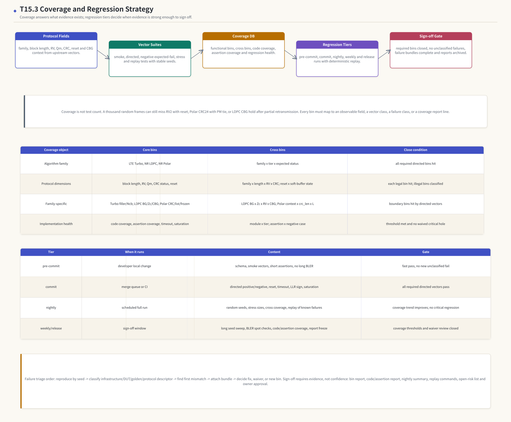

# T20.3 覆盖率与回归方案：把 directed vectors 变成可签收证据
## 本节学习目标

本节定义译码验证的覆盖率与回归方案。这里的覆盖率不是“跑了多少条测试”，而是回答一个更具体的问题：LTE Turbo、NR LDPC和 NR Polar的关键协议条件、数值条件、控制条件和实现条件，是否都被测试实际打到，并且失败时能不能复现和分诊。


- 解释功能覆盖率、代码覆盖率、断言覆盖率、交叉覆盖率和回归健康度的区别。
- 把 T20.2 的协议向量、边界案例和 expected-fail policy 转成 coverage bins。
- 给 LTE Turbo、NR LDPC、NR Polar 分别定义算法家族、块长、RV、调制阶数 $Q_m$、CRC 状态、reset/abort、LLR 饱和等覆盖点。
- 设计 pre-commit、commit、nightly、weekly/release 四级回归，并说明每一级为什么不能互相替代。
- 设计 deterministic seed 策略，让失败能用 `vector_id + seed + policy_hash` 复现。
- 设计 failure triage 和 sign-off gate，不把“这次看起来都过了”当成签收证据。

如果只记住一句话：覆盖率回答“哪些风险被证据触达”，回归回答“这些证据何时、以什么门槛、用什么可复现方式反复触达”。

## 前置知识检查

| 前置项 | 本节需要达到的程度 |
|:---|:---|
| T5.5 译码硬件验证思维 | 知道 golden model、bit-exact、directed/random、coverage、波形和 failure replay 的目的。 |
| T18.6 Bit-exact 回归框架 | 知道 `vector.json`、checkpoint manifest、failure bundle、first mismatch 和 CI 命令模板。 |
| T20.1 Testbench 架构 | 知道 driver、monitor、scoreboard、assertions、reset/timeout tests 如何产生可观测证据。 |
| T20.2 协议向量与边界案例套件 | 知道 LTE Turbo、NR LDPC、NR Polar 的 directed cases、expected-fail class 和最小 dump 包。 |
| T7/T9/T10 协议边界课 | 知道 LTE HARQ/RV、NR LDPC CBG/RV、NR Polar CRC/list/frozen mask 等覆盖点来自哪里。 |

自检问题：

| 问题 | 若回答不出来，先回看 |
|:---|:---|
| 为什么 `CRC_PASS` 不能证明所有 rate recovery 地址都正确？ | T7.3、T9.1、T18.6。 |
| 为什么 `100% code coverage` 仍可能漏掉 NR LDPC CBG hold bug？ | T9.3、T20.2。 |
| 为什么 expected-fail vector 的“失败”也要纳入覆盖率？ | T20.1、T20.2。 |
| 为什么 nightly 的随机 seed 必须能 replay？ | T17.1、T18.6。 |

## Roadmap 卡片原文与执行范围

| 项目 | 内容 |
|:---|:---|
| 编号 | T20.3 |
| 前置 | T20.1, T20.2 |
| Prompt | 请定义译码验证的功能覆盖率、代码覆盖率、回归层级、随机种子、夜间运行、失败分诊和 sign-off 标准。覆盖点包括算法家族、块长、RV、Qm、CRC 状态和复位。 |
| 产出 | `docs/L3/T20.3_coverage_regression_strategy.md` |
| 验收 | Learner can define coverage bins and regression pass criteria for a decoder subsystem. |
| 证据边界 | 无需直接 3GPP 引用 for coverage methodology. Coverage bins that depend on protocol parameters must reference upstream Rel-19 evidence from T7/T9/T10/T20.2. |

本节是验证工程课。3GPP 不规定你用什么覆盖率数据库、CI 层级、nightly 脚本或 sign-off 表；协议规定的是被覆盖的对象，例如 TB/CB、CRC、RV、rate matching、LDPC BG/$Z_c$、CBG、Polar CRC/RNTI、list size 压力和 reset 对接收侧状态的影响。因此本节的原则是：coverage 方法属于工程策略，coverage bin 中的协议参数必须能回链到上游 Rel-19 精读讲义或向量套件。

## 资料与协议边界

| 资料 | 本地路径 | 边界 |
| :--- | :--- | :--- |
| TS 36.212 Rel-19 `36212-j30` | `3GPP_Rel19/processed/TS_36.212_36212-j30` | 不规定覆盖率方法；具体协议表/公式由 T3/T6/T7 回链。 |
| TS 38.212 Rel-19 `38212-j30` | `3GPP_Rel19/processed/TS_38.212_38212-j30` | 不规定 coverage database、CI tier 或 sign-off 阈值。 |
| TS 38.214 Rel-19 `38214-j30` | `3GPP_Rel19/processed/TS_38.214_38214-j30` | MCS/TBS 具体表值仍按实际使用范围回链，不在本节复现。 |
| T7.3/T7.6 | `docs/L2/T7.3_LTE_HARQ_soft_buffer_RV.md`、`docs/L2/T7.6_LTE_Turbo_decoder_edge_cases.md` | 本节只把它们转成覆盖点。 |
| T9.3/T9.6 | `docs/L2/T9.3_NR_LDPC_HARQ_soft_buffer_RV_k0.md`、`docs/L2/T9.6_NR_LDPC_decoder_edge_cases.md` | 本节不重写 LDPC 数值推导。 |
| T10.5-T10.8 | `docs/L2/T10.*.md` | 本节不重写 Polar SCL 推导。 |
| T20.1/T20.2 | `docs/L3/T20.1_decoder_testbench_architecture.md`、`docs/L3/T20.2_protocol_vector_corner_case_suite.md` | 本节将其组织成 coverage/regression plan。 |

协议前因后果可以这样理解：协议定义了“接收端可能遇到哪些合法和非法状态”；T20.2 把这些状态变成向量；T20.3 再把向量覆盖、RTL 代码覆盖、断言覆盖、失败分类和夜间回归组织成签收证据。若 coverage bin 没有可观测字段或可复现向量，它只是愿望清单，不是验证计划。

## 覆盖率的最小理论

覆盖率（coverage）这个词容易被误解为“测试数量”。正确理解是：覆盖率是一个证据计数系统，用来回答某类风险是否被某条测试以某种可观察方式触达。

最小覆盖模型可以写成：

$$
\mathrm{coverage\_hit}(b)=
\exists v \in \mathrm{executed\_vectors}:
\mathrm{observe}(v,b)=1
\tag{1}
$$

式 (1) 中，$b$ 是一个 coverage bin，$v$ 是已经执行过的向量，$\mathrm{observe}(v,b)$ 表示向量 $v$ 的日志、monitor、scoreboard、assertion 或 coverage database 能证明该 bin 被打到。这里的关键不是存在一条测试，而是“可观察”。例如 `rv=2` 写在配置文件里不等于打到 RV2 bin；必须看到 driver 写入、DUT descriptor hash、rate recovery address trace 或 scoreboard checkpoint 能证明 DUT 真按 RV2 路径执行。

常见覆盖率对象如下：

| 覆盖率对象 | 回答的问题 | 典型数据来源 | 风险 |
|:---|:---|:---|:---|
| Functional coverage | 协议/功能条件是否被触达？ | `vector.json`、monitor、scoreboard、covergroup。 | bin 设计太粗，漏掉边界组合。 |
| Code coverage | RTL 代码行、分支、条件、状态是否被执行？ | 仿真器 code coverage report。 | 代码跑过不代表结果正确。 |
| Assertion coverage | SVA 或等价断言是否被激活、通过、失败？ | assertion report。 | 断言只写接口，不写协议状态。 |
| Cross coverage | 两个或多个风险条件的组合是否被触达？ | coverage database、post-run aggregator。 | 组合爆炸，必须选有意义的交叉。 |
| Regression health | 测试是否稳定、可 replay、失败是否分类？ | CI/nightly summary、failure bundle。 | 只看 pass rate，不看未分类失败和缺失证据。 |

一句工程判断：functional coverage 是“想证明什么”，code coverage 是“RTL 哪些代码被走过”，assertion coverage 是“哪些不变量被验证触发”，regression health 是“这些证据是否持续稳定”。它们互补，不能互相替代。

## 覆盖率与回归总图

图中英文标题为 `T20.3 Coverage and Regression Strategy`。图的视觉检查注记也迁移为正文要求：`Visual check: all arrows are straight two-point shafts with vector-derived heads; tables use 24px text and centered cells.` 这条注记用于约束后续重绘时的箭头、表格字号和单元格对齐，避免图形内容迁移后出现视觉结构偏差。

```mermaid
flowchart LR
N0["Protocol Fields"]
N1["Vector Suites"]
N2["Coverage DB"]
N3["Regression Tiers"]
N4["Sign-off Gate"]
N5["Coverage object"]
N6["Algorithm family"]
N7["Protocol dimensions"]
N0 --> N1
N1 --> N2
N2 --> N3
N3 --> N4
N4 --> N5
N5 --> N6
N6 --> N7
classDef primary fill:#EAF3FF,stroke:#2457A6,color:#17212F;
classDef process fill:#F7F9FC,stroke:#C9D4DF,color:#17212F;
classDef output fill:#EAF8F1,stroke:#2D8F5D,color:#17212F;
classDef risk fill:#FFF3E0,stroke:#C69220,color:#17212F;
class N0,N1 primary;
class N2,N3,N4 process;
class N5,N6 output;
class N7 risk;
```




| 内容 | 说明 |
|:---|:---|
| Protocol Fields | family, block length, RV, Qm, CRC, reset and CBG context from upstream vectors. |
| Vector Suites | smoke, directed, negative expected-fail, stress and replay tests with stable seeds. |
| Coverage DB | functional bins, cross bins, code coverage, assertion coverage and regression health. |
| Regression Tiers | pre-commit, commit, nightly, weekly and release runs with deterministic replay. |
| Sign-off Gate | required bins closed, no unclassified failures, failure bundles complete and reports archived. |
| protocol | vectors |
| vectors | coverage |
| coverage | regression |
| regression | signoff |
| Coverage object | Core bins；Cross bins；Close condition |
本节流程顺序为：Protocol fields 和 Vector suites 产生 coverage bins；Coverage DB 汇总功能、代码、断言、交叉和健康度；Regression tiers 决定何时运行；Sign-off gate 决定是否允许签收。本节图表中两张表分别列出覆盖对象和回归层级，避免把 coverage plan 写成泛泛的 CI 口号。

## 功能覆盖率对象模型

功能覆盖率需要先定义对象模型。建议从 T20.2 的向量对象中抽取 coverage event：

```json
{
  "event": "decoder_vector_done",
  "vector_id": "nr_ldpc_cbg_mask_msb_seed014",
  "family": "nr_ldpc",
  "suite_tier": "directed_negative",
  "expected_status": "fail",
  "observed_status": "fail",
  "expected_fail_class": "CBG_MASK_MISMATCH",
  "observed_fail_class": "CBG_MASK_MISMATCH",
  "protocol": {
    "standard": "NR",
    "channel": "DL-SCH",
    "block_length_class": "large",
    "rv": 2,
    "qm": 4,
    "crc_status": "cb_crc_fail",
    "reset_class": "none"
  },
  "implementation": {
    "llr_quant_bits": 6,
    "saturation_hit": true,
    "timeout_hit": false,
    "assertion_fail": false
  }
}
```

coverage collector 不应该直接解析 RTL waveform 的随机字段名，而应消费 testbench 已经归一化的 event。这样 Python golden、C/C++ 定点模型、RTL testbench 和 nightly aggregator 可以共享字段语义。

最小功能 coverage bins：

| Bin 组 | 必选 bins | 证据来源 | 说明 |
|:---|:---|:---|:---|
| Algorithm family | `lte_turbo`, `nr_ldpc`, `nr_polar` | `family` | 三类译码器都必须有 smoke、directed、negative、stress/replay 证据。 |
| Block length | `small`, `boundary`, `large`, `max_supported` | `B/A/K/E/N` 分类 | 具体边界来自 T7/T9/T10/T20.2。 |
| RV | `rv0`, `rv1`, `rv2`, `rv3`, `rv_mismatch` | descriptor + address trace | LTE/LDPC 的 RV 语义是循环缓存起点/窗口选择，必须看地址证据。 |
| Qm | `qm1_or_bpsk_like`, `qm2`, `qm4`, `qm6`, `qm8_if_supported` | demapper/rate-recovery metadata | Qm 影响 LLR 排列和 bit deinterleaving；不支持项写为 not applicable。 |
| CRC status | `cb_crc_pass`, `cb_crc_fail`, `tb_crc_pass`, `tb_crc_fail`, `polar_crc_pass`, `polar_crc_fail` | scoreboard/status | 不同 family 的 CRC 层级不同，不能只用一个 `crc_pass`。 |
| Reset class | `no_reset`, `reset_before_start`, `mid_run_reset`, `abort`, `timeout` | driver + monitor | reset/abort/timeout 必须观察 soft buffer commit/rollback。 |
| Expected status | `positive_pass`, `expected_fail_detected`, `unexpected_fail`, `unexpected_pass` | suite policy + scoreboard | expected-fail 正确分类也算覆盖命中。 |

功能覆盖率的一个常见错误是把 `block_length` 写成真实数字一一覆盖。真实 TB/CB 长度太多，不可能穷尽。工程上应先分类：小块、协议分支边界、表格最大支持、实现最大支持、随机长块。具体到 LTE Turbo，`K` 合法集合来自 TS 36.212 Table 5.1.3-3，上游 T3.3/T6.4 已复现；T20.3 不重新列全表，只把“合法集合中的最小、边界、最大和随机抽样”定义为 coverage bins。

## 三类译码器的覆盖矩阵

### LTE Turbo 覆盖点

LTE Turbo coverage 必须围绕 T7/T20.2 的接收端风险：

| 覆盖点 | 必选 bins | 为什么重要 | 回链 |
|:---|:---|:---|:---|
| CB segmentation | `C=1`, `C>1`, `F=0`, `F>0`, `K_minus`, `K_plus` | 抓 filler 删除、CB 顺序、重组长度错误。 | T3.3, T7.4, T7.6。 |
| RV/soft buffer | `rv0`, `rv2`, `rv_overlap`, `Ncb<Kw`, `rv_mismatch` | 抓循环缓存起点、重复累加、limited buffer。 | T7.3, T7.6。 |
| `<NULL>`/puncture/repetition | `null_skip`, `unknown_llr`, `repeat_sat` | 抓 `<NULL>` 当有效 bit、打孔当强 LLR、重复覆盖。 | T7.2, T7.6。 |
| CRC layer | `CB_CRC_PASS`, `CB_CRC_FAIL`, `TB_CRC_PASS`, `TB_CRC_FAIL` | 抓只看 TB CRC 或只看 CB CRC 的错误。 | T3.1, T7.4, T7.6。 |
| Control | `timeout`, `mid_run_reset`, `harq_context_switch` | 抓半提交 soft buffer 和 HARQ 上下文污染。 | T7.3, T19.5, T20.1。 |

LTE 的 `RV x Ncb<Kw x repeat_sat` 是有价值的交叉覆盖，因为 RV 窗口决定哪些编码比特重复或未发送，`Ncb<Kw` 决定 soft buffer 地址空间，重复位置又决定定点饱和是否出现。只覆盖 `rv2` 或只覆盖 `sat_count>0` 都不足以证明组合正确。

### NR LDPC 覆盖点

NR LDPC coverage 的核心是 BG/$Z_c$/CBG/RV 与 layered decoder 状态的组合：

| 覆盖点 | 必选 bins | 为什么重要 | 回链 |
|:---|:---|:---|:---|
| Base graph and lifting | `BG1`, `BG2`, `Zc_min`, `Zc_boundary`, `Zc_max`, `iLS_boundary` | 抓 H 矩阵尺寸、地址生成、banking。 | T8.2, T8.3, T9.6。 |
| Rate recovery/RV | `rv0..rv3`, `k0_boundary`, `limited_buffer`, `punctured_systematic` | 抓 k0、unknown LLR、limited buffer 地址。 | T9.1, T9.2, T9.3。 |
| CBG | `full_tb`, `partial_cbg`, `held_cbg`, `cbgfi_flush`, `cbgti_order_negative` | 抓部分重传和 CBG mask 位序。 | T9.3, T9.5, T9.6。 |
| Stop condition | `syndrome_pass_crc_pass`, `syndrome_pass_crc_fail`, `max_iter`, `timeout` | 抓 syndrome early stop 与 CRC 边界。 | T8.4, T8.7, T9.6。 |
| Numeric health | `min_sum`, `nms`, `oms`, `llr_sat`, `cn_sat`, `vn_sat` | 抓定点缩放和饱和。 | T8.6, T18.3, T19.2。 |

重要交叉示例：

$$
\mathrm{LDPC\_cross}
=
\mathrm{BG}
\times
\mathrm{Zc\_class}
\times
\mathrm{RV}
\times
\mathrm{CBG\_state}
\tag{2}
$$

式 (2) 不要求所有组合都穷尽。比如 `BG2 x Zc_max x rv3 x held_cbg` 若超出当前向量生成能力，可以标为 `planned` 或 `waived_with_reason`，但不能默默消失。release sign-off 前，所有 required cross bins 必须有 hit、waiver 或明确不适用原因。

### NR Polar 覆盖点

NR Polar coverage 更偏控制信息、短块、CRC/list 和 selector：

| 覆盖点 | 必选 bins | 为什么重要 | 回链 |
|:---|:---|:---|:---|
| Context | `DCI`, `UCI_on_PUCCH`, `UCI_on_PUSCH`, `small_no_crc` | 抓控制信息分支和 CRC 长度。 | T3.5, T10.1, T10.8。 |
| CRC/RNTI | `CRC6`, `CRC11`, `CRC24`, `RNTI_match`, `RNTI_mismatch` | 抓 CA-SCL final selector。 | T10.6, T10.8。 |
| List behavior | `L1_SC`, `L2`, `L4_or_more`, `PM_tie`, `all_crc_fail`, `second_best_crc_pass` | 抓路径复制、剪枝、tie-break 和 CRC-aided 选择。 | T10.5, T10.6, T18.4。 |
| Rate recovery | `puncture`, `shorten`, `repeat`, `subblock_deint`, `coded_bit_deint` | 抓 unknown/strong LLR 初始化和顺序。 | T10.7。 |
| Frozen/information mask | `mask_boundary`, `wrong_mask_negative`, `reliability_prefix` | 抓 reliability sequence 和 frozen bit enforcement。 | T10.2, T10.3, T10.8。 |

Polar 的关键交叉可以写成：

$$
\mathrm{Polar\_cross}
=
\mathrm{context}
\times
\mathrm{crc\_len}
\times
\mathrm{list\_size}
\times
\mathrm{rate\_recovery\_mode}.
\tag{3}
$$

式 (3) 中，`list_size` 是实现策略，不是 3GPP 强制字段；`context`、`crc_len`、`rate_recovery_mode` 则来自协议链路或协议派生字段。coverage report 要保留这个边界，避免把工程 knob 写成协议要求。

## 代码覆盖率与断言覆盖率

代码覆盖率的作用是发现 RTL 没走到的代码。常见指标包括 line、branch、condition、toggle、FSM state/transition。它有用，但不能当作功能正确的证据。

| 代码覆盖项 | 译码器例子 | 不能证明什么 |
|:---|:---|:---|
| Line coverage | LDPC CN update 代码被执行。 | CN min1/min2 数值正确。 |
| Branch coverage | Polar final selector 的 CRC pass/fail 分支都走过。 | RNTI mask 和 PM tie-break 正确。 |
| Condition coverage | Turbo timeout 条件的各个子条件取过 0/1。 | timeout 后 soft buffer 没有半提交。 |
| FSM coverage | `IDLE/RUN/DONE/ERROR` 状态都到过。 | 状态转换时输出 payload 有正确所有权。 |
| Toggle coverage | SRAM 地址线翻转过。 | 地址生成没跨 bank 冲突或越界。 |

断言覆盖率要和 T20.1 的 assertions 对齐。建议必选断言包括：

| Assertion | 覆盖目标 | 失败含义 |
|:---|:---|:---|
| `no_config_write_when_busy` | busy 写保护被激活并通过。 | driver 或 DUT 配置锁失效。 |
| `stable_when_valid_not_ready` | backpressure 下 stream 稳定。 | DMA handshake 违例。 |
| `no_done_and_error_same_cycle_unless_policy` | done/error 互斥或按 policy 定义。 | 状态机错误。 |
| `no_half_commit_on_reset_abort` | reset/abort 后 soft buffer 不半提交。 | HARQ 状态污染。 |
| `trace_descriptor_hash_matches` | trace 与 descriptor 一致。 | scoreboard 对错任务。 |

assertion coverage 的 sign-off 不应只看“没有 assertion fail”。若某个断言从未被激活，说明相关场景没有跑到，也应进入 coverage hole。

## 回归层级

回归层级的目的不是把测试切成快慢两堆，而是让不同风险在合适的频率被检查。

| Tier | 运行时机 | 内容 | 通过门槛 |
|:---|:---|:---|:---|
| `pre_commit` | 开发者本地提交前 | schema 检查、少量 smoke、LLR sign、最短 directed、关键断言。 | 快速完成；无新 unclassified fail；失败可 replay。 |
| `commit` | merge queue 或 CI | T20.2 directed positive/negative、reset/timeout、LLR saturation、family selector。 | required directed vectors 全 pass；expected-fail 分类一致；关键断言无 fail。 |
| `nightly` | 每晚完整运行 | random/stress seeds、交叉覆盖、已知失败 replay、较长 timeout、覆盖率汇总。 | no critical regression；coverage trend 不下降；所有新失败分类。 |
| `weekly` | 每周或 release 前 | 长 seed sweep、BLER spot check、代码/断言覆盖、waiver review。 | 覆盖率阈值达标；waiver 有 owner/理由/到期时间。 |
| `release_signoff` | 版本冻结 | freeze vector set、freeze policy、freeze report、复跑所有 required bins。 | 所有 sign-off checklist 关闭；报告可审计。 |

pre-commit 不应该跑长 BLER，因为太慢；nightly 不应该省略 directed negative，因为随机样本不保证打到 expected-fail；release sign-off 不应该只看最新一次 nightly，因为还需要 freeze policy、waiver 和证据报告。

## 随机种子策略

随机回归必须可重放。建议使用 T17.1 的分层 seed 派生方式：

$$
s_{\mathrm{case}}
=
\mathrm{uint64\_le}
\left(
\mathrm{SHA256}
\left(
\mathrm{canonical\_json}(s_{\mathrm{master}},\mathrm{suite},\mathrm{vector\_id},\mathrm{stage},\mathrm{attempt})
\right)[0:8]
\right).
\tag{4}
$$

字段解释：

| 字段 | 说明 |
|:---|:---|
| `master_seed` | nightly 或 release run 的根 seed。 |
| `suite` | `pre_commit`、`commit`、`nightly`、`weekly` 等。 |
| `vector_id` | T20.2 vector 或 random vector 名称。 |
| `stage` | `payload`、`noise`、`llr_quant`、`reset_injection`、`backpressure` 等。 |
| `attempt` | HARQ attempt 或 replay attempt。 |

每个 failure bundle 必须保存 `master_seed`、派生 seed、seed 算法版本、vector manifest hash 和 suite policy hash。否则“nightly 失败”只能算现象，不能算可定位证据。

## Nightly 运行计划

一个可执行 nightly 计划至少包括五个阶段：

1. **Environment snapshot**：记录 git hash、工具版本、RTL build id、golden model version、vector manifest hash。
2. **Directed replay**：先跑所有 required directed positive/negative，确保基础协议边界没有退化。
3. **Random/stress sweep**：按 seed budget 运行 family-specific random 与 stress。
4. **Known failure replay**：复跑仍 open 的 failure bundle，确认状态没有被误报为 fixed。
5. **Coverage/report publish**：生成 coverage DB、summary markdown、failure index、trend diff 和 sign-off delta。

命令模板可以写成：

```bash
decoder_regress \
  --suite nightly \
  --manifest vectors/suite_manifest.json \
  --policy vectors/suite_policy.json \
  --master-seed 0x202606210001 \
  --rtl-build build/decoder_subsystem.simv \
  --out runs/nightly_2026_06_21
```

本仓库当前没有 `decoder_regress` 可执行程序；上面是 T20.3 定义的工程命令模板。当前可直接运行的是本文末尾列出的审计脚本、图形脚本和 Python 片段。

## 失败分诊

失败分诊不能只写 “test failed”。建议按以下顺序：

| 步骤 | 问题 | 证据 |
|:---|:---|:---|
| 1. Reproduce | 同 seed、同 vector、同 policy 是否复现？ | replay command、manifest hash、first mismatch。 |
| 2. Classify source | 是 infrastructure、DUT、golden、protocol descriptor 还是 expected-fail policy 错？ | failure class、log、trace、hash。 |
| 3. Locate first mismatch | 第一个不同点在哪个 checkpoint？ | `checkpoint_id`, cycle, expected, observed。 |
| 4. Check protocol fields | 相关协议字段是否来自正确证据？ | TS/package/section/local path/source lesson。 |
| 5. Decide action | 修 RTL、修 golden、修 vector、修 policy、加 waiver 或新增 coverage bin？ | issue id、owner、target run。 |

失败分类建议：

| Failure class | 典型含义 |
|:---|:---|
| `INFRASTRUCTURE_FAIL` | 仿真器、文件、脚本、权限或构建问题。 |
| `VECTOR_SCHEMA_FAIL` | `vector.json`、hash、manifest 或 policy 不合法。 |
| `PROTOCOL_DESCRIPTOR_FAIL` | 协议字段不自洽或证据回链错误。 |
| `DUT_MISMATCH` | RTL 输出、checkpoint 或状态与 expected 不一致。 |
| `GOLDEN_MODEL_MISMATCH` | Python/C/C++ reference 本身不一致。 |
| `EXPECTED_FAIL_POLICY_MISMATCH` | negative vector 的 fail class 或通过口径错误。 |
| `NON_REPRODUCIBLE_FAIL` | 同 seed 无法复现，必须先保留环境证据。 |

重要原则：未分类失败不能进入 sign-off。即使 nightly 总体 pass rate 是 99.9%，只要有一个 unclassified fail，就说明证据链断了。

## 具体数值例子：小型 coverage aggregator

假设 nightly 只跑了 6 条教学向量：

| vector | family | tier | block | rv | qm | crc | reset | status |
|:---|:---|:---|:---|:---|:---|:---|:---|:---|
| V0 | LTE Turbo | smoke | small | 0 | 2 | pass | none | pass |
| V1 | LTE Turbo | directed_negative | boundary | 2 | 2 | fail | none | expected_fail |
| V2 | NR LDPC | directed_positive | large | 2 | 4 | pass | none | pass |
| V3 | NR LDPC | directed_negative | large | 3 | 4 | fail | abort | expected_fail |
| V4 | NR Polar | directed_positive | small | NA | 2 | pass | none | pass |
| V5 | NR Polar | directed_negative | boundary | NA | 2 | fail | mid_run | expected_fail |

最小 Python aggregator：

```python
events = [
    {"family": "lte_turbo", "tier": "smoke", "block": "small", "rv": 0, "qm": 2, "crc": "pass", "reset": "none", "status": "pass"},
    {"family": "lte_turbo", "tier": "directed_negative", "block": "boundary", "rv": 2, "qm": 2, "crc": "fail", "reset": "none", "status": "expected_fail"},
    {"family": "nr_ldpc", "tier": "directed_positive", "block": "large", "rv": 2, "qm": 4, "crc": "pass", "reset": "none", "status": "pass"},
    {"family": "nr_ldpc", "tier": "directed_negative", "block": "large", "rv": 3, "qm": 4, "crc": "fail", "reset": "abort", "status": "expected_fail"},
    {"family": "nr_polar", "tier": "directed_positive", "block": "small", "rv": "NA", "qm": 2, "crc": "pass", "reset": "none", "status": "pass"},
    {"family": "nr_polar", "tier": "directed_negative", "block": "boundary", "rv": "NA", "qm": 2, "crc": "fail", "reset": "mid_run", "status": "expected_fail"},
]
required = {
    ("family", "lte_turbo"),
    ("family", "nr_ldpc"),
    ("family", "nr_polar"),
    ("rv", 0),
    ("rv", 2),
    ("reset", "abort"),
    ("reset", "mid_run"),
    ("status", "expected_fail"),
}
hit = {(key, event[key]) for event in events for key in event}
missing = sorted(required - hit)
print("T20.3_COVERAGE_TOY_OK", missing)
```

输出应为：

```text
T20.3_COVERAGE_TOY_OK []
```

这个例子很小，但它说明了 coverage 的本质：先声明 required bins，再由事件打点确认命中。若没有 V3，`("reset","abort")` 会缺失；若没有 V1/V3/V5，`expected_fail` 会缺失；若只有 Polar，算法家族会缺失。

## RTL/ASIC 映射

覆盖率计划最终要落到 RTL/ASIC 验证环境。建议有四类硬件可观测点：

| 可观测点 | RTL 位置 | 覆盖用途 |
|:---|:---|:---|
| Descriptor snapshot | dispatcher、family engine input、trace header | 证明 family、block length、RV、Qm、CRC、reset policy 实际进入 DUT。 |
| Status/error/IRQ | top-level status block | 证明 pass/fail、expected-fail、timeout、abort、CRC fail 等状态可区分。 |
| Checkpoint trace | Turbo/LDPC/Polar 内部 trace mux | 证明 first mismatch 能定位到算法内部。 |
| Counters | saturation、iteration、stall、timeout、soft-buffer commit | 证明性能/定点/控制覆盖点可观察。 |

ASIC sign-off 阶段还要把代码覆盖率和综合可达性分开看。某些低功耗 gating、scan、debug-only trace 在 RTL 仿真中可能不进入功能 sign-off；它们需要 waiver 或单独 DFT/low-power 验证口径，不能混入 decoder functional coverage 统计。

## Sign-off 标准

建议 release sign-off 至少满足：

| Gate | 标准 |
|:---|:---|
| Directed suite | T20.2 required positive/negative vectors 100% pass；expected-fail class 与 policy 一致。 |
| Functional coverage | required bins 100% hit；optional bins 有趋势记录；waiver 有 owner、理由、到期条件。 |
| Cross coverage | required cross bins hit 或有批准 waiver；尤其覆盖 `family x tier x expected_status`、LDPC `BG x Zc x RV x CBG`、Polar `context x crc_len x list_size`。 |
| Code coverage | line/branch/condition/FSM 阈值达到项目门槛；未覆盖代码有分类。 |
| Assertion coverage | required assertions 被激活并通过；未激活断言不能静默签收。 |
| Regression health | 最近 N 次 nightly 无 critical regression；所有失败可 replay 且已分类。 |
| Evidence bundle | manifest、policy、seed、coverage DB、report、failure index、waiver list、tool versions、git hash 归档。 |

不要把阈值写死成全行业通用数字。不同项目、不同工具、不同 RTL 成熟度会有不同门槛。但 required directed vectors、required functional bins、unclassified failure 为 0、failure bundle 完整，这几项应作为硬门槛。

## 常见错误

| 错误 | 后果 | 修正 |
|:---|:---|:---|
| 用测试数量代替 coverage | 随机跑很多仍漏关键边界。 | 先定义 required bins 和 cross bins。 |
| code coverage 高就签收 | RTL 行跑过但协议结果错。 | 必须结合 functional/scoreboard/assertion coverage。 |
| expected-fail 不算覆盖 | 错误路径、错误码和 dump 包无人验证。 | negative vectors 正确分类也必须计入覆盖。 |
| seed 不可 replay | nightly 失败无法定位。 | 保存 master/stage seed、policy hash、manifest hash。 |
| CRC pass 当作唯一判定 | rate recovery 或内部 checkpoint 错误可能被遮住。 | 用 checkpoint manifest 和 first mismatch。 |
| reset 只在 idle 测 | mid-run abort 半提交漏掉。 | reset bins 必须覆盖 before/start/mid-run/abort/timeout。 |
| waiver 无 owner | coverage hole 永久存在。 | waiver 写 owner、理由、到期条件和复核时间。 |

## 自测题

1. 为什么 functional coverage 和 code coverage 不能互相替代？
2. 给 NR LDPC 设计一个最小 cross coverage，必须包含 BG、$Z_c$、RV 和 CBG 状态。
3. 为什么 expected-fail vector 应该计入覆盖率？
4. 一个 nightly 失败无法用相同 seed 复现，应该如何分诊？
5. release sign-off 前，`line coverage=98%` 但 `mid_run_reset x soft_buffer_commit` 没有 hit，能否签收？

## 自测题参考答案

1. Functional coverage 证明协议/功能条件被触达，code coverage 证明 RTL 代码结构被执行。代码执行不等于结果正确，功能 bin 命中也不等于所有 RTL 分支都走过；两者必须一起看。
2. 可定义 `BG in {BG1,BG2} x Zc_class in {min,boundary,max} x RV in {0,1,2,3} x CBG_state in {full_tb,partial,held,flush}`。不是所有组合都必须 required，但 release 前每个 required bin 要 hit 或 waiver。
3. 因为真实硬件必须正确拒绝非法 descriptor、错误 RV、错误 CBG mask、错误 CRC 长度和 reset/timeout 路径。negative vector 的正确结果是“按预期失败并分类”，这同样是验证证据。
4. 先标为 `NON_REPRODUCIBLE_FAIL`，保存环境 snapshot、manifest hash、policy hash、tool version、日志和波形；不要直接归因 RTL。之后比较随机源、并行调度、未初始化状态、文件版本和仿真器差异。
5. 不能直接签收。mid-run reset 与 soft buffer commit 是高风险控制路径；若它是 required cross bin，必须补测试打到，或给出正式 waiver、owner、理由和关闭条件。

## 验证方法

| 验证对象 | 方法 |
|:---|:---|
| Coverage bin schema | 用 JSON schema 或 Python checker 确认 required bins、optional bins、waiver 字段存在。 |
| Coverage event | 从 T20.1 monitor/scoreboard summary 生成归一化 event，检查字段完整性。 |
| Aggregator | 使用小型 Python 例子确认 missing bins 计算正确。 |
| Regression tier | dry-run pre-commit/commit/nightly 命令模板，确认输出目录和报告字段。 |
| Sign-off report | 检查 directed suite、functional/code/assertion/cross coverage、failure index、waiver list、tool versions。 |

当前仓库没有真实 RTL、仿真器 coverage database 或 `decoder_regress` 可执行程序，因此本节只能验证文档、图形、schema 片段和小型 aggregator 逻辑。真实 coverage DB、UCDB/FSDB/VCD、仿真器覆盖率报告和 sign-off dashboard 属于后续实现环境。

## Prompt 覆盖验收表

| Prompt 要求 | 本节覆盖位置 |
|:---|:---|
| 功能覆盖率 | `## 覆盖率的最小理论`、`## 功能覆盖率对象模型`、三类译码器覆盖矩阵。 |
| 代码覆盖率 | `## 代码覆盖率与断言覆盖率`。 |
| 回归层级 | `## 回归层级`。 |
| 随机种子 | `## 随机种子策略`。 |
| 夜间运行 | `## Nightly 运行计划`。 |
| 失败分诊 | `## 失败分诊`。 |
| sign-off 标准 | `## Sign-off 标准`。 |
| 算法家族 | 功能 bins 与三类译码器覆盖矩阵。 |
| 块长 | 功能 bins、LTE/LDPC/Polar coverage matrix。 |
| RV | 功能 bins、LTE/LDPC coverage matrix。 |
| Qm | 功能 bins、覆盖对象表和 event schema。 |
| CRC 状态 | 功能 bins、三类译码器覆盖矩阵。 |
| 复位 | 功能 bins、回归层级、失败分诊和 sign-off gate。 |

## 协议证据表

| Coverage bin | 协议/上游证据 | 本地路径或讲义 |
| :--- | :--- | :--- |
| LTE Turbo segmentation/filler/RV/CRC | TS 36.212 Rel-19 `36212-j30`；T3.3/T7.3/T7.6 | `3GPP_Rel19/processed/TS_36.212_36212-j30`；`docs/L2/T7.*.md` |
| NR LDPC BG/$Z_c$/RV/CBG/CRC | TS 38.212 Rel-19 `38212-j30`；TS 38.214 Rel-19 `38214-j30`；T8/T9 | `3GPP_Rel19/processed/TS_38.212_38212-j30`；`docs/L2/T9.*.md` |
| NR Polar CRC/list/frozen/rate recovery | TS 38.212 Rel-19 `38212-j30`；T10 | `3GPP_Rel19/processed/TS_38.212_38212-j30`；`docs/L2/T10.*.md` |
| Directed vector suite | T20.2 | `docs/L3/T20.2_protocol_vector_corner_case_suite.md` |
| Testbench observability | T20.1 | `docs/L3/T20.1_decoder_testbench_architecture.md` |

## 图示


## 执行与证据记录

| 项目 | 证据 |
|:---|:---|
| 图形资产 | `docs/L3/assets/T15.3_coverage_regression_strategy.svg` | 手绘 SVG，2026-08-04 替代原 PIL 渲染 PNG（原 `render_t15_3_coverage_regression_strategy.py` 与 PNG 已删除，图示语义不变）；SVG 几何审计六项检查全部通过，cairosvg 渲染验证无报错。 |
| 本节 Python 片段 | `T20.3_COVERAGE_TOY_OK []`；见 `## 具体数值例子`。 |
| 引用重建候选解释 | `audit_reference_rebuilds.py` 输出候选清单；候选均为协议证据边界或上游已复现表格回链：TS 36.212 章节用于 coverage bin 来源，不在本节复现公式；TS 36.212 Table 5.1.3-3 已由 T3.3/T6.4 复现；本节不新增协议公式/表格复现。 |
| 协议证据 | Coverage methodology 为工程策略。协议参数 bins 回链 T7/T9/T10/T20.2 和本地 Rel-19 路径。 |
| 工具可用性限制 | 当前仓库没有真实 RTL、仿真器 coverage database、UCDB、VCD/FSDB、`decoder_regress` 或 CI runner；命令模板为后续工程入口，不伪称已运行。 |

## 参考文献

- 3GPP TS 36.212, Rel-19, `36212-j30`, Multiplexing and channel coding. Local path: `3GPP_Rel19/processed/TS_36.212_36212-j30`.
- 3GPP TS 38.212, Rel-19, `38212-j30`, Multiplexing and channel coding. Local path: `3GPP_Rel19/processed/TS_38.212_38212-j30`.
- 3GPP TS 38.214, Rel-19, `38214-j30`, Physical layer procedures for data. Local path: `3GPP_Rel19/processed/TS_38.214_38214-j30`.
- 本项目 `docs/L3/T20.1_decoder_testbench_architecture.md`。
- 本项目 `docs/L3/T20.2_protocol_vector_corner_case_suite.md`。
- 本项目 `docs/L3/T18.6_bit_exact_regression_harness.md`。
