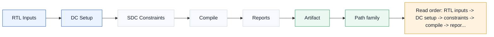

# T20.4 Synopsys Design Compiler 综合流程：从译码 RTL 到时序、面积和功耗报告
## 本节学习目标

本节讲解译码寄存器传输级的 Synopsys Design Compiler 综合流程。Design Compiler 常简称 DC，它的任务是把硬件描述语言写成的 RTL 映射到具体工艺库单元，生成门级网表，并给出时序、面积、功耗、约束违例和结构风险报告。


- 说明 DC 综合和功能仿真、覆盖率回归、时序收敛之间的边界。
- 准备一个 decoder RTL filelist，并区分设计 RTL、package、memory wrapper、testbench 和仿真专用代码。
- 写出 DC Tcl 脚本骨架：`analyze`、`elaborate`、`link`、`check_design`、`source constraints`、`compile`、`write` 和 `report`。
- 解释时钟约束、reset 假设、输入输出延迟、false path、multicycle path 的含义和风险。
- 解读 `report_timing`、`report_area`、`report_power`、`report_qor`、`check_timing`、`report_constraint`。
- 识别译码器常见综合关键路径：Turbo ACS/度量更新、LDPC check-node min tree、Polar SCL sorter、soft buffer key compare、DMA arbitration。
- 在本机未安装 DC 时，仍能清楚记录工具限制，不伪造综合结果。

如果只记住一句话：综合报告不是“功能正确证明”，而是“这个 RTL 在给定工艺库和约束下能否被映射成满足时序、面积、功耗和结构规则的硬件”的证据。

## 前置知识检查

| 前置项 | 本节需要达到的程度 |
|:---|:---|
| T19.1 LTE Turbo RTL 微架构 | 知道 Turbo SISO、alpha/beta、extrinsic、interleaver 和 CRC checkpoint。 |
| T19.2 NR LDPC RTL 微架构 | 知道 LDPC layered schedule、CN/VN、message RAM、bank conflict 和 syndrome checkpoint。 |
| T19.3 NR Polar RTL 微架构 | 知道 SC/SCL、path metric、sorter、partial sum、CRC/RNTI selector。 |
| T19.4 统一译码子系统 | 知道 dispatcher、DMA、soft buffer manager、status/error/IRQ 和 trace。 |
| T19.6 寄存器表与配置流 | 知道配置寄存器、start/done/error、timeout、trace mask 和 descriptor hash。 |
| T20.1-T20.3 | 知道 testbench、protocol vectors、coverage bins、regression tiers 和 sign-off gate。 |

自检问题：

| 问题 | 若回答不出来，先回看 |
|:---|:---|
| 为什么综合脚本不能把 testbench 文件放进 design filelist？ | T20.1。 |
| 为什么 `dc_shell` 没装时不能声称“综合通过”？ | 本节工具边界。 |
| 为什么 `report_timing` 通过不代表译码功能正确？ | T18.6、T20.1。 |
| 为什么 reset 约束写错会让时序报告看起来很好但芯片不可用？ | T5.4、T19.6。 |
| 为什么 Polar list size 或 LDPC parallelism 会影响面积和关键路径？ | T19.2、T19.3。 |

## Roadmap 卡片原文与执行范围

| 项目 | 内容 |
|:---|:---|
| 编号 | T20.4 |
| 前置 | T19.1-T19.6 |
| Prompt | 请讲解译码 RTL 的 Synopsys Design Compiler 综合流程：文件列表、时钟约束、复位假设、compile 方案、时序报告、面积报告、功耗估算和常见关键路径。若未安装 DC，必须说明工具可用性限制。 |
| 产出 | `docs/L3/T20.4_DC_synthesis_flow_decoders.md` |
| 验收 | Learner can prepare a DC script skeleton and interpret timing/area reports. |
| 证据边界 | 无需直接 3GPP 引用 for this engineering method. The article must cite upstream protocol-vector tasks when it uses generated LTE/NR vectors. |

本节是工程方法课。3GPP 协议不规定 DC Tcl、工艺库、时钟周期、compile option、面积单位或功耗模型；协议和上游讲义只影响“综合后应该验证哪些配置和向量”。若综合后要跑 LTE/NR 协议向量或 gate-level sanity，必须回链 T20.1-T20.3 和 T7/T9/T10/T20.2 的证据。

## 资料与协议边界

| 资料 | 本地路径 | 边界 |
| :--- | :--- | :--- |
| TS 36.212 Rel-19 `36212-j30` | `3GPP_Rel19/processed/TS_36.212_36212-j30` | 不规定综合约束或 DC 报告。 |
| TS 38.212 Rel-19 `38212-j30` | `3GPP_Rel19/processed/TS_38.212_38212-j30` | 不规定综合方法。 |
| TS 38.214 Rel-19 `38214-j30` | `3GPP_Rel19/processed/TS_38.214_38214-j30` | 不规定 filelist 或 clock constraints。 |
| T19.1-T19.6 | `docs/L3/T19.*.md` | 本节只讲如何综合这些 RTL。 |
| T20.1-T20.3 | `docs/L3/T20.1*.md`、`T20.2*.md`、`T20.3*.md` | 当前仓库没有真实 RTL 仿真和 DC coverage 数据库。 |

协议前因后果是：协议参数决定译码器需要支持哪些 family、块长、RV、CBG、list size 和 soft buffer 行为；这些行为塑造 RTL 结构；RTL 结构再进入 DC 综合。DC 本身只看硬件结构和约束，不理解“TS 38.212 的 CBG 语义”。因此综合通过后仍必须回到协议向量和回归证据，证明被综合的硬件没有破坏译码语义。

## 工具可用性边界

本机检查结果：

```bash
command -v dc_shell || true
command -v design_vision || true
```

两个命令在当前环境均无输出，说明当前工作区没有可调用的 Synopsys Design Compiler 命令行或图形工具。因此：

- 本节不能声称真实 DC 综合已运行。
- 本节不能给出真实 WNS/TNS、面积、功耗或 mapped netlist。
- 本节可以给出 DC Tcl 脚本骨架、filelist 组织、约束假设、报告字段和风险解读。
- 若后续在有 DC license 的机器运行，必须把真实命令、版本、工艺库、约束、报告和日志补回“执行与证据记录”。

这个限制很重要。综合流程教学可以在无工具环境编写，但 sign-off 证据不能伪造。

## 综合流程总图

图中英文标题为 `T20.4 Design Compiler Synthesis Flow for Decoders`。图的视觉检查注记也迁移为正文要求：`Visual check: arrows are straight two-point shafts with vector-derived heads; table text is centered and 24px.` 这条注记用于约束后续重绘时的箭头、表格文本和对齐，不属于 Synopsys Design Compiler 本身的功能要求。




| 内容 | 说明 |
|:---|:---|
| RTL Inputs | filelist, top module, decoder family, libraries, memory wrappers and design parameters. |
| DC Setup | analyze, elaborate, link, uniquify, check_design and compile environment snapshot. |
| SDC Constraints | clock, reset, input/output delay, false paths, multicycle paths and load model. |
| Compile | compile or compile_ultra, mapping, optimization, hierarchy policy and incremental compile. |
| Reports | timing, area, power, constraint violations, unmapped cells, DRC and netlist handoff. |
| rtl | setup |
| setup | constraints |
| constraints | compile |
| compile | reports |
| Artifact | Decoder-specific risk；DC check or report；Evidence to archive |
本节流程顺序为：RTL inputs 进入 DC setup；setup 后加载 SDC constraints；compile 映射和优化；reports 输出 timing/area/power/constraint/DRC；最后进入 triage 和 verification handoff。图下方两张表分别列出综合工件风险和译码器常见关键路径族。

## 文件列表

DC filelist 必须只包含可综合 RTL。不要把 testbench、assertion-only 文件、DPI、仿真模型、随机 generator 或 Python 生成物塞进综合 filelist。

建议目录和 filelist：

```text
rtl/
  common/
    decoder_pkg.sv
    decoder_types.sv
    fifo_sync.sv
  turbo/
    turbo_top.sv
    turbo_siso.sv
    turbo_interleaver_addr.sv
  ldpc/
    ldpc_top.sv
    ldpc_cn_update.sv
    ldpc_vn_update.sv
    ldpc_layer_ctrl.sv
  polar/
    polar_top.sv
    polar_scl_core.sv
    polar_sorter.sv
  subsystem/
    decoder_subsystem_top.sv
    decoder_dispatcher.sv
    softbuf_mgr.sv
    reg_if.sv
  mem/
    sram_1rw_wrapper.sv
scripts/dc/filelist_decoder_subsystem.tcl
```

示例 filelist：

```tcl
set RTL_FILES [list \
  rtl/common/decoder_pkg.sv \
  rtl/common/decoder_types.sv \
  rtl/common/fifo_sync.sv \
  rtl/turbo/turbo_top.sv \
  rtl/turbo/turbo_siso.sv \
  rtl/turbo/turbo_interleaver_addr.sv \
  rtl/ldpc/ldpc_top.sv \
  rtl/ldpc/ldpc_cn_update.sv \
  rtl/ldpc/ldpc_vn_update.sv \
  rtl/ldpc/ldpc_layer_ctrl.sv \
  rtl/polar/polar_top.sv \
  rtl/polar/polar_scl_core.sv \
  rtl/polar/polar_sorter.sv \
  rtl/subsystem/decoder_subsystem_top.sv \
  rtl/subsystem/decoder_dispatcher.sv \
  rtl/subsystem/softbuf_mgr.sv \
  rtl/subsystem/reg_if.sv \
  rtl/mem/sram_1rw_wrapper.sv \
]
```

filelist 审查表：

| 检查项 | 通过标准 | 常见错误 |
|:---|:---|:---|
| package 顺序 | package 先于引用它的 module。 | `decoder_pkg` 在后面导致 analyze 失败。 |
| 顶层唯一 | `TOP_MODULE` 明确。 | 同时综合单引擎和 subsystem，没有设 top。 |
| memory wrapper | SRAM wrapper 可综合，行为模型隔离。 | 用仿真 readmemh memory 当 ASIC SRAM。 |
| testbench 排除 | `tb/`、DPI、class、random 不进入 RTL filelist。 | 把 T20.1 testbench class 送进 DC。 |
| 参数固定 | family mask、parallelism、LLR width 有明确参数。 | 综合时 parameter 未覆盖，得到默认小配置。 |

## DC Tcl 脚本骨架

最小 DC 脚本可以拆成 setup、read、constraints、compile、reports 五段。

```tcl
set TOP_MODULE decoder_subsystem_top
set REPORT_DIR reports/dc_decoder_subsystem
file mkdir ${REPORT_DIR}

set_app_var search_path [list ./rtl ./libs]
set_app_var target_library [list slow.db]
set_app_var link_library [concat "*" $target_library]
set_app_var synthetic_library [list dw_foundation.sldb]

source scripts/dc/filelist_decoder_subsystem.tcl

foreach f $RTL_FILES {
  analyze -format sverilog $f
}

elaborate $TOP_MODULE
current_design $TOP_MODULE
link
uniquify
  check_design > ${REPORT_DIR}/check_design.rpt

source scripts/dc/decoder_subsystem.sdc
check_timing > ${REPORT_DIR}/check_timing.rpt

compile_ultra -no_autoungroup

report_qor > ${REPORT_DIR}/qor.rpt
report_timing -max_paths 50 -delay_type max > ${REPORT_DIR}/timing_max.rpt
report_timing -max_paths 20 -delay_type min > ${REPORT_DIR}/timing_min.rpt
report_area -hierarchy > ${REPORT_DIR}/area_hier.rpt
report_power -hierarchy > ${REPORT_DIR}/power_hier.rpt
report_constraint -all_violators > ${REPORT_DIR}/constraints.rpt
report_resources -hierarchy > ${REPORT_DIR}/resources.rpt

write -format verilog -hierarchy -output ${REPORT_DIR}/${TOP_MODULE}.mapped.v
write_sdc ${REPORT_DIR}/${TOP_MODULE}.mapped.sdc
write_sdf ${REPORT_DIR}/${TOP_MODULE}.mapped.sdf
```

`compile_ultra -no_autoungroup` 只是教学示例。真实项目可能需要针对 Turbo/LDPC/Polar engine 分别控制 hierarchy、retiming、boundary optimization、scan insertion 和 memory mapping。不要机械照抄 compile option；每个 option 都应有报告对比。

### Tcl 逐命令解释

这段 Tcl 是方法模板，不是本仓库真实 DC 签核日志。逐命令审查时至少要说明每条命令的输入、输出和失败含义：

| 命令 | 作用 | 输出或失败信号 |
|:---|:---|:---|
| `set TOP_MODULE` | 固定综合顶层，后续 `elaborate/current_design/write` 都以它为对象。 | 顶层名错会导致 elaborate 找不到设计或综合到错误层级。 |
| `file mkdir REPORT_DIR` | 创建报告目录，保证报告和网表可归档。 | 目录不可写属于 infrastructure failure，不能解释为综合失败。 |
| `set_app_var search_path` | 告诉 DC 到哪里找 RTL include、package、库文件和 wrapper。 | search path 漏项通常表现为 include/package 解析失败。 |
| `target_library` | 指定映射目标标准单元库。 | 没有真实 `.db` 时不能生成可信 area/timing/power。 |
| `link_library` | 指定 link 时可解析的目标库、宏库和已综合模块。 | black box、unresolved reference 或 memory wrapper 未解析会在 link/check_design 暴露。 |
| `synthetic_library` | 允许 DesignWare 等综合库推断算术结构。 | 使用与否会影响 multiplier/adder/comparator 面积和 timing，必须记录。 |
| `source filelist` | 读入受控 RTL 文件清单。 | testbench、DPI、assertion-only 或行为 memory 混入 filelist 是配置错误。 |
| `analyze` | 解析 SystemVerilog 源码并建立中间库对象。 | 语法、package 顺序、宏定义和 include 错误在这里暴露。 |
| `elaborate` | 展开参数、generate、module 实例并形成设计层级。 | 参数非法、实例端口不匹配、generate 边界错误在这里暴露。 |
| `current_design` | 选择后续约束和 compile 的当前设计对象。 | 若当前设计不是顶层，报告和输出会不完整。 |
| `link` | 把实例绑定到 library 或已分析模块。 | unresolved、black box 和 wrapper 缺失必须在这里关闭。 |
| `uniquify` | 为重复实例创建独立层级，避免跨实例优化互相污染。 | 面积增大或 hierarchy 名变化，需要和 trace/debug 策略一起记录。 |
| `check_design` | 查组合环、未连接端口、多驱动、黑盒等结构问题。 | `check_design` 有 serious issue 时不能进入签核。 |
| `source SDC` | 读入 clock、IO delay、false/multicycle、load/transition 等约束。 | SDC 漏约束会产生 unconstrained path，不能用漂亮 WNS 掩盖。 |
| `check_timing` | 检查路径是否被约束、clock 是否定义、端点是否可分析。 | unconstrained path、no_clock、multiple_clock 是 STA 前置失败。 |
| `compile_ultra` | 做映射、逻辑优化、时序驱动优化和部分结构推断。 | compile 后必须比较 QoR、area、timing、resource 和层级变化。 |
| `report_qor` | 汇总 WNS/TNS、面积、路径组和优化状态。 | 用于比较不同 compile option，不替代详细 timing。 |
| `report_timing -delay_type max` | 输出 setup 口径路径。 | 负 slack 表示周期内到达太晚。 |
| `report_timing -delay_type min` | 输出 hold 口径路径。 | 负 slack 表示数据太早到达，常由短路径或 clock skew 引起。 |
| `report_area -hierarchy` | 输出层级面积，用于定位 CNU、sorter、SISO、memory、barrel shifter、banking 等成本。 | 面积异常小可能是逻辑被优化掉或黑盒未解析。 |
| `report_power -hierarchy` | 输出内部功耗、开关功耗和漏电功耗估计。 | 无 SAIF/VCD 时只能作为粗略模板，不是真实功耗签核。 |
| `report_constraint -all_violators` | 汇总违反约束的路径和设计规则。 | 必须逐项分类为真实违例、约束错误或批准例外。 |
| `report_resources` | 查 DesignWare、算术资源和 memory 推断情况。 | sorter/ACS/min tree 被推成不期望结构时需回到 RTL 或 compile option。 |
| `write mapped.v` | 导出综合后门级网表。 | 只有真实 DC run 才能把它作为 gate-level simulation 输入。 |
| `write_sdc` | 导出综合后约束。 | 后续 STA 和 gate-level timing check 应使用版本化 SDC。 |
| `write_sdf` | 导出标准延迟格式，用于 SDF back-annotation。 | 当前仓库无真实 SDF；本节只定义输出位置和后续使用口径。 |

## 时钟约束

时钟约束定义了 STA 的时间尺度。没有时钟，DC 无法判断组合路径要在多长时间内完成。

示例 SDC：

```tcl
create_clock -name core_clk -period 2.000 [get_ports clk]
set_clock_uncertainty 0.120 [get_clocks core_clk]
set_clock_transition 0.080 [get_clocks core_clk]

set_input_delay 0.300 -clock core_clk [remove_from_collection [all_inputs] [get_ports clk]]
set_output_delay 0.300 -clock core_clk [all_outputs]

set_load 0.050 [all_outputs]
```

这里 `period=2.000 ns` 等价于 500 MHz 教学目标。是否合理取决于工艺库、并行度、架构和功耗目标。本节不声称该频率适用于真实产品。

时钟约束常见报告项：

| 项 | 含义 | 风险 |
|:---|:---|:---|
| WNS | Worst Negative Slack，最差路径 slack。 | 负数表示至少一条路径不满足目标周期。 |
| TNS | Total Negative Slack，所有违例路径 slack 总和。 | 负数越大，时序收敛压力越大。 |
| violating paths | 违例路径数量。 | 数量多说明不是一个局部小问题。 |
| unconstrained paths | 没有时钟或端点约束的路径。 | 报告看起来干净但实际没检查。 |

基本公式：

$$
\mathrm{slack}
=
T_{\mathrm{required}}
-
T_{\mathrm{arrival}}.
\tag{1}
$$

若 slack 小于 0，路径不满足约束。式 (1) 只是 STA 直觉，真实 DC 报告还会包含 clock uncertainty、latency、transition、load、setup/hold 等细节。

## 复位假设

译码器常有全局 reset、soft reset、abort、flush、trace clear、IRQ clear。综合约束需要明确哪些 reset 是异步端口，哪些只是同步控制信号。

| reset 类型 | 综合处理 | 风险 |
|:---|:---|:---|
| 异步全局 reset | 进入 flop reset pin；常不作为普通数据路径优化。 | reset deassertion 需要单独 CDC/RDC 检查。 |
| 同步 soft reset | 普通同步逻辑。 | 可能进入关键路径，尤其是大量寄存器清零。 |
| abort/flush | 控制状态机和 soft buffer commit。 | 错约束为 false path 会隐藏半提交风险。 |
| IRQ clear/W1C | 寄存器接口逻辑。 | 清除路径和 status fan-in 可能成关键路径。 |

不要把所有 reset/abort/clear 都粗暴 false path。false path 的含义是“这条路径不需要时序检查”，不是“这条路径很难收敛所以忽略”。若 reset 是同步控制路径，通常应该保留时序检查。

## 输入输出延迟与路径例外

若译码器顶层和上游 DMA、寄存器总线、SRAM wrapper 交互，输入输出延迟代表外部逻辑消耗的时序预算。

```tcl
set_input_delay 0.300 -clock core_clk [get_ports {in_valid in_data[*] cfg_*}]
set_output_delay 0.300 -clock core_clk [get_ports {out_valid out_data[*] status_* irq}]
```

路径例外必须谨慎：

| 例外 | 合理场景 | 不合理场景 |
|:---|:---|:---|
| false path | scan-only、debug-only、异步跨域已由 CDC 处理。 | 为隐藏 sorter、min tree 或 DMA arbitration 违例。 |
| multicycle path | 设计明确多周期握手，且 RTL 有 enable/valid 保证。 | 组合路径慢但协议没有多周期语义。 |
| max delay | 对异步握手同步前路径设物理上限。 | 替代正常同步时序约束。 |

路径例外必须写 owner、理由、适用端点和验证方法。release 前，T20.6 最终证据报告应列出所有例外。

## Compile 方案

建议分阶段：

1. **Syntax/link clean**：先保证 `analyze/elaborate/link/check_design/check_timing` 无基础错误。
2. **Baseline compile**：用保守 hierarchy 和约束跑一版，得到基线 WNS/area/power。
3. **Family engine compile**：分别综合 Turbo、LDPC、Polar 单引擎，定位各自关键路径。
4. **Subsystem compile**：综合 T19.4 统一子系统，观察 dispatcher/DMA/soft buffer/status fan-in。
5. **Incremental compile**：针对少数关键路径尝试 hierarchy、retiming、ungroup、register duplication 或 pipeline 修改。

compile option 记录表：

| Option | 目的 | 风险 |
|:---|:---|:---|
| `compile` | 基础映射和优化。 | 时序压力大时可能不够。 |
| `compile_ultra` | 更强优化和 DesignWare 推断。 | 运行时间长，可能改变 hierarchy。 |
| `-no_autoungroup` | 保持 hierarchy 便于 debug。 | 可能限制跨层优化。 |
| retiming | 移动寄存器改善路径。 | 需要等价验证和 reset/scan 审查。 |
| boundary optimization | 跨 module 边界优化。 | trace/debug hierarchy 变差。 |

综合优化不能替代架构修复。若 Polar sorter 或 LDPC min tree 组合深度本身过长，下一节 T20.5 应通过 pipeline、tree split、register duplication 或算法近似改结构，而不是只调 DC option。

## 时序报告解读

`report_timing` 需要至少看：

| 字段 | 含义 | 解读 |
|:---|:---|:---|
| startpoint | 路径起点寄存器或输入端口。 | 判断来自哪个 engine 或接口。 |
| endpoint | 路径终点寄存器或输出端口。 | 判断落在哪个状态/数据寄存器。 |
| path group | 时钟域或路径组。 | 确认是否在正确 clock 下分析。 |
| data arrival time | 数据实际到达时间。 | 组合逻辑和线延迟之和。 |
| data required time | 需求到达时间。 | 由 clock period、uncertainty 和 setup 决定。 |
| slack | 余量。 | 负数就是 setup violation。 |

一个可诊断的违例摘要应写成：

```text
Path: ldpc_cn_update/min1_tree -> ldpc_msg_ram_wr_data
Clock: core_clk 2.000 ns
Slack: -0.180 ns
Logic depth: compare tree + mux + saturation add
Likely fix: split min1/min2 tree after level 2, register bank-select early
Functional risk: verify layered schedule checkpoint after pipeline insertion
```

注意最后一行。时序修复会改变 latency、trace cycle、valid alignment 和 scoreboard expectation，必须回到 T20.1/T20.3 的回归。

## 面积报告解读

`report_area -hierarchy` 通常列出组合面积、时序单元面积、黑盒或宏面积。译码器面积关注点：

| 模块 | 面积来源 | 常见判断 |
|:---|:---|:---|
| Turbo SISO | ACS、度量 RAM、extrinsic RAM、interleaver address。 | 迭代并行度和 window 大小影响大。 |
| LDPC engine | CN/VN datapath、message memory、bank mux、layer controller。 | 并行 CN 数、`Zc` 支持范围和 banking 影响大。 |
| Polar SCL | path memory、sorter、partial sum、CRC checker。 | list size 增大面积近似快速增长。 |
| Unified subsystem | DMA、soft buffer manager、registers、trace、IRQ/status。 | 共享控制和 debug 逻辑不能失控。 |

面积估算不应只看顶层总数。若 `polar_sorter` 占比异常，说明 list size 或排序网络需要单独审查；若 `softbuf_mgr` 占比异常，可能是 SRAM wrapper 没推断成 memory，而是变成寄存器阵列。

## 功耗估算

DC 的早期功耗估算依赖开关活动。若没有真实 switching activity，`report_power` 只能算很粗的默认估计。

功耗记录至少要区分：

| 类型 | 含义 | 影响因素 |
|:---|:---|:---|
| Internal power | 单元内部翻转功耗。 | 加法器、比较器、sorter、memory wrapper。 |
| Switching power | 线网电容翻转功耗。 | 宽总线、LLR stream、message memory mux。 |
| Leakage power | 静态漏电。 | 工艺库、面积、温度角。 |

若后续有 SAIF/VCD 活动文件，脚本可加入：

```tcl
read_saif -input runs/postsim/decoder_subsystem.saif -instance decoder_subsystem_tb/dut
report_power -hierarchy > $REPORT_DIR/power_saif.rpt
```

当前仓库没有真实 RTL 仿真波形或 SAIF，因此本节不能给真实功耗数值。

## PPA 优化矩阵和低功耗模板

PPA 表只能作为方法矩阵。没有真实综合、真实 activity 和真实 STA 时，不能写“面积降低 12%”或“功耗降低 20%”。建议每一次优化都记录 `baseline_report_id`、`candidate_report_id`、`changed_rtl_or_constraint`、`functional_regression_set` 和 `accept/reject_reason`。

| 对象 | PPA 压力 | 候选优化 | 必须重验 |
|:---|:---|:---|:---|
| LDPC CNU/min tree | 比较器、mux、符号树和 saturation 形成 timing/area 压力。 | min1/min2 分级、partial parallel CNU、NMS/OMS 系数量化、pipeline。 | syndrome trace、layered RMW、块错误率/fixed loss。 |
| Polar sorter | `2L -> L` 比较网络、PM adder 和 lazy-copy mux 形成长路径。 | staged sorter、partial sort、PM 预归一化、path id 稳定 tie-break。 | PM tie、CRC-aided selector、RNTI mismatch、path remap。 |
| Turbo SISO | ACS、alpha/beta、branch metric 和 extrinsic saturation 形成递推压力。 | window 拆分、branch metric 预计算、ACS pipeline、归一化分离。 | alpha/beta checkpoint、interleaver address、CRC early stop。 |
| Memory/SRAM | LLR/message/PM/soft buffer 存储容量和端口数影响面积与功耗。 | SRAM macro、read/write port 拆分、output register、width packing。 | memory wrapper、reset/abort、failure dump address。 |
| Barrel shifter/rotator | LDPC QC shift、Polar interleaving 或 rate recovery 地址旋转可能形成 mux 网络。 | 分级 shifter、地址预旋转、bank-local rotation、lookup split。 | rate recovery address trace、bit order directed vectors。 |
| Banking | bank conflict select、crossbar 和 writeback mux 影响 timing 和面积。 | bank hash 调整、conflict queue、地址提前、局部 mux。 | bank conflict counter、throughput/latency、CBG hold。 |
| Clock gating | 空闲 engine、未命中 lane 或 early-stop 后仍翻转。 | integrated clock gate、enable clean-up、per-engine clock gate。 | gate enable glitch、reset、scan/test mode、power intent。 |

低功耗记录也必须分“方法”和“证据”。本仓库当前没有真实功耗报告，因此下表中的收益字段只能在真实 SAIF/VCD 或功耗工具报告出现后填写。

| 技术 | 译码器应用点 | 风险 | 证据字段 |
|:---|:---|:---|:---|
| clock gating | Turbo/LDPC/Polar engine idle、iteration done、soft buffer idle。 | gating enable 毛刺、scan/test mode 旁路、reset 后时钟恢复。 | gated_instances、enable_condition、activity_source、regression_id。 |
| operand isolation | sorter 比较器、CNU min tree、SISO ACS 输入无效时隔离。 | valid 传播错误会隔离真实数据。 | isolation_condition、toggle_delta、directed_valid_tests。 |
| SRAM sleep | soft buffer、message RAM、path memory 在 HARQ process 空闲时睡眠。 | wake-up latency、retention、半提交 transaction。 | sleep_state_trace、wake_cycles、abort/replay tests。 |
| Multi-Vt | 非关键控制路径用高 Vt，关键 sorter/CNU/SISO 路径保留低 Vt。 | hold、OCV 和 leakage/timing 角变化。 | vt_mix_report、setup/hold report、leakage_report。 |
| DVFS | 低吞吐控制信道或后台 replay 降频降压。 | 多模式时序、CDC/RDC、软件 QoS。 | mode_sdc、voltage_corner、throughput_budget。 |
| 早停功耗 | CRC/syndrome early stop 后关闭迭代 datapath。 | early stop 错误、trace 缺失、统计偏差。 | stop_reason、gated_cycles、BLER/false-pass regression。 |

## 常见关键路径

| Path family | 可能关键逻辑 | 初步处理方向 | 回归风险 |
|:---|:---|:---|:---|
| LTE Turbo | ACS、branch metric、alpha/beta recursion、extrinsic saturation。 | 拆 window、pipeline 度量更新、预计算分支度量。 | 迭代 latency、extrinsic trace 对齐改变。 |
| NR LDPC | CN min1/min2 tree、layered message mux、bank conflict select。 | 分层比较树、bank select 前移、message RAM 输出寄存。 | syndrome checkpoint cycle 改变。 |
| NR Polar | SCL sorter、path metric update、lazy-copy mux、CRC selector。 | 分级 sorter、partial sort、pipeline PM update。 | path tie-break 和 final selector 需重验。 |
| Soft buffer | key compare、RV address、saturating add、CBG mask merge。 | key hash 分层、地址提前、合并路径 pipeline。 | reset/abort 半提交和 CBG hold 需重验。 |
| Unified top | DMA arbitration、status/error fan-in、IRQ sticky、trace mux。 | 分区 arbitration、状态寄存、trace 采样降频。 | T20.1 monitor 和 T20.3 coverage event 需更新。 |

T20.5 会专门展开 timing closure。T20.4 只要求你能从报告中识别这些路径并提出第一步诊断，不要求在本节完成结构修改。

## 具体数值例子：用小型 timing record 分类

假设综合报告解析后得到四条违例摘要：

```python
paths = [
    {"module": "ldpc_cn_update", "slack_ns": -0.18, "cells": ["cmp", "mux", "sat_add"]},
    {"module": "polar_sorter", "slack_ns": -0.31, "cells": ["cmp", "swap", "mux"]},
    {"module": "softbuf_mgr", "slack_ns": -0.07, "cells": ["hash_cmp", "sat_add"]},
    {"module": "reg_if", "slack_ns": 0.12, "cells": ["decode"]},
]
worst = min(paths, key=lambda p: p["slack_ns"])
families = {
    "ldpc_cn_update": "NR LDPC check-node min tree",
    "polar_sorter": "NR Polar SCL sorter",
    "softbuf_mgr": "HARQ soft-buffer merge",
    "reg_if": "register decode",
}
print("T20.4_TIMING_TRIAGE_OK", worst["module"], families[worst["module"]], worst["slack_ns"])
```

输出应为：

```text
T20.4_TIMING_TRIAGE_OK polar_sorter NR Polar SCL sorter -0.31
```

这个例子不是 DC 真实输出，只是报告分诊逻辑。真实项目应从 `report_timing` 解析 startpoint、endpoint、slack、logic depth 和 cell list，再按模块映射到 T14/T15 的风险类别。

## DC 后验证与协议向量回链

综合完成后，至少需要三类验证：

| 验证 | 目的 | 回链 |
|:---|:---|:---|
| Netlist sanity | 确认 mapped netlist 可 elaboration，可跑 smoke。 | T20.1 testbench smoke。 |
| SDF/gate-level spot | 确认关键路径和时序反标不会破坏 handshake。 | T20.1 driver/monitor 和 T20.3 smoke/commit bins。 |
| Protocol vector replay | 确认综合优化没有破坏协议派生路径。 | T20.2 directed vectors，T7/T9/T10 证据。 |

DC 不会验证 LTE Turbo filler 删除、NR LDPC CBG hold 或 NR Polar CRC-aided SCL selector。它只保证网表在约束下结构可实现。功能仍由 golden/regression/testbench 保证。

## 常见错误

| 错误 | 后果 | 修正 |
|:---|:---|:---|
| 把 testbench 文件放进 DC filelist | analyze/elaborate 失败或综合出无意义逻辑。 | filelist 只放可综合 RTL。 |
| 未约束 clock | 报告没有意义。 | `create_clock`、`check_timing` 必须进证据记录。 |
| 用 false path 隐藏难路径 | 芯片可能真实违例。 | false path 必须有结构理由、owner 和验证方法。 |
| SRAM wrapper 没处理 | 大 memory 被综合成 flop 阵列。 | 使用 memory macro wrapper 或明确推断策略。 |
| 只看 WNS 不看 unconstrained path | 报告显示过了但路径没检查。 | 必看 `check_timing` 和 unconstrained endpoint。 |
| 面积突然变小就高兴 | 可能综合掉未连接逻辑或 black box。 | 查 `report_unmapped`、`check_design`、hierarchy area。 |
| 功耗报告无 activity 却当真 | 默认 toggle 不代表真实译码 workload。 | 有 SAIF/VCD 才能做更可信早期估算。 |

## 自测题

1. 为什么 `dc_shell` 未安装时不能把本节脚本称为“综合已通过”？
2. `report_timing` 中 WNS 为正，为什么仍要查看 `check_timing`？
3. 为什么 Polar SCL sorter 可能成为关键路径？
4. 一个路径被设为 false path 前，至少要记录哪些信息？
5. 综合后要不要重新跑协议向量？为什么？

## 自测题参考答案

1. 因为没有实际工具运行、工艺库、约束加载、compile log、mapped netlist 和报告输出；只能证明脚本骨架存在，不能证明综合结果。
2. WNS 只统计被约束路径。若有 unconstrained path、未定义 clock、黑盒、未链接模块，WNS 可能看起来很好但报告无效。
3. SCL sorter 要在多个候选路径之间比较 path metric，list size 增大时比较器和 mux 网络加深，容易形成长组合路径。
4. 记录起点/终点、结构理由、为什么该路径不需要单周期时序、谁批准、如何由 CDC/RDC/功能验证覆盖、何时复核。
5. 要。综合优化、retiming、hierarchy 改变和 memory wrapper 替换都可能影响 handshake、latency、trace 和功能等价；协议向量用于确认综合后 netlist 仍满足译码语义。

## 验证方法

| 验证对象 | 当前可执行方式 | 有 DC 环境时的方式 |
|:---|:---|:---|
| Tcl/filelist 结构 | 人工审查示例脚本和字段。 | `dc_shell -f scripts/dc/run_decoder_subsystem.tcl`。 |
| 工具可用性 | `command -v dc_shell || true`，当前无输出。 | 记录 `dc_shell -version`。 |
| 图形资产 | 运行 Python 图脚本和图形审计。 | 同左。 |
| 报告解读 | 使用教学 timing record Python 片段。 | 解析真实 `report_timing/report_area/report_power`。 |
| 协议回链 | 文档回链 T20.1-T20.3、T7/T9/T10。 | 综合后 smoke/gate-level replay 使用 T20.2 向量。 |

## Prompt 覆盖验收表

| Prompt 要求 | 本节覆盖位置 |
|:---|:---|
| 文件列表 | `## 文件列表`。 |
| 时钟约束 | `## 时钟约束`。 |
| 复位假设 | `## 复位假设`。 |
| compile 方案 | `## Compile 方案`、`## DC Tcl 脚本骨架`。 |
| 时序报告 | `## 时序报告解读`。 |
| 面积报告 | `## 面积报告解读`。 |
| 功耗估算 | `## 功耗估算`。 |
| 常见关键路径 | `## 常见关键路径`。 |
| 未安装 DC 的工具限制 | `## 工具可用性边界`、`## 执行与证据记录`。 |

## 图示


## 协议证据表

| 对象 | 证据 |
| :--- | :--- |
| LTE Turbo 译码配置 | TS 36.212 Rel-19 `36212-j30`，本地路径 `3GPP_Rel19/processed/TS_36.212_36212-j30`，上游 T7/T19.1/T20.2。 |
| NR LDPC 译码配置 | TS 38.212 Rel-19 `38212-j30`，TS 38.214 Rel-19 `38214-j30`，上游 T9/T19.2/T20.2。 |
| NR Polar 译码配置 | TS 38.212 Rel-19 `38212-j30`，上游 T10/T19.3/T20.2。 |
| Testbench/coverage/sign-off | T20.1、T20.2、T20.3 |
## 执行与证据记录

| 项目 | 证据 |
|:---|:---|
| DC 工具可用性 | `command -v dc_shell || true` -> 无输出；`command -v design_vision || true` -> 无输出。当前环境未安装可调用 DC 工具。 |
| 图形生成 | `python3 tools/figures/render_t15_4_dc_synthesis_flow_decoders.py` -> `WROTE ... (3000, 2860)`。 |
| 图形脚本编译 | `PYTHONDONTWRITEBYTECODE=1 python3 -m py_compile tools/figures/render_t15_4_dc_synthesis_flow_decoders.py` -> 退出码 0。 |
| 本节 Python 片段 | `T20.4_TIMING_TRIAGE_OK polar_sorter NR Polar SCL sorter -0.31`；见 `## 具体数值例子`。 |
| 未完成边界 | 未运行真实 `dc_shell`、未加载工艺库、未生成 mapped netlist、未得到真实 timing/area/power 报告、未执行 gate-level replay。 |

## 参考文献

- 3GPP TS 36.212, Rel-19, `36212-j30`, Multiplexing and channel coding. Local path: `3GPP_Rel19/processed/TS_36.212_36212-j30`.
- 3GPP TS 38.212, Rel-19, `38212-j30`, Multiplexing and channel coding. Local path: `3GPP_Rel19/processed/TS_38.212_38212-j30`.
- 3GPP TS 38.214, Rel-19, `38214-j30`, Physical layer procedures for data. Local path: `3GPP_Rel19/processed/TS_38.214_38214-j30`.
- 本项目 `docs/L3/T19.1_LTE_Turbo_RTL_microarchitecture.md`。
- 本项目 `docs/L3/T19.2_NR_LDPC_RTL_microarchitecture.md`。
- 本项目 `docs/L3/T19.3_NR_Polar_RTL_microarchitecture.md`。
- 本项目 `docs/L3/T20.1_decoder_testbench_architecture.md`。
- 本项目 `docs/L3/T20.2_protocol_vector_corner_case_suite.md`。
- 本项目 `docs/L3/T20.3_coverage_regression_strategy.md`。
