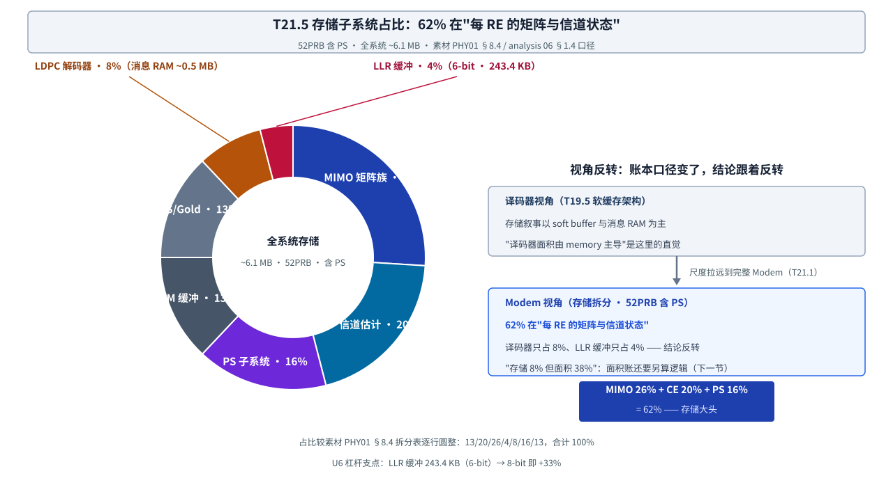

# T21.5 存储与面积估算：逐缓冲区账本与两本面积账

## 本节学习目标

第 4 章（[[T21.4_slot_cycle_budget_parallelization]]）的小结把账本交接到了本章：**周期账的"采购单"要兑现成面积账**——每个并行引擎（LDPC 的 3.0M gates、MIMO 检测的 1.5M gates、FFT 的 1.2M gates）都要在面积表里成为一行。本章把第 1 章（[[T21.1_engineering_budget_overview]]）立下的存储面积账从"三句话"展开成完整算账：先按缓冲区逐行记账（TX 12 个 + RX 14 个），再加总成子系统占比（62% 在"每 RE 的矩阵与信道状态"），再分 SRAM 与逻辑两本账换算面积（7nm ≈4.0 mm²），最后用 28nm 对照与 273PRB 外推检验这套账的算术自洽性。

本章是 T21 系列的算账章（第 5 章）：不引入新算法，而是把前四章攒下的位宽、元素数、并行引擎全部折算成"多少 MB、多少门、多少平方毫米"。第 3 章（[[T21.3_llr_dynamic_range_clipping_tradeoff]]）的 48-bit 字打包在这里变成存储杠杆（LLR 6→8 bit 即 +33%）；第 4 章的 LDPC 专用引擎在这里是面积表里最大的一行（1.5 mm²、38%）。学完本节后，应能做到：

- 说出逐缓冲区存储表的记账口径（元素数 × 位宽 = 容量；复数值按 2×I/Q；1-bit 缓冲按 bit 打包），并复述 TX 12 缓冲（≈1.04 MB）与 RX 14 缓冲（≈5.10 MB）的关键行。
- 说出 RX 侧最大单类缓冲（H_est 天线域 559.1 KB、139,776 元素四维网格）与单块最大缓冲（Rhh 778.8 KB）的尺寸公式，并解释为什么"每 RE 矩阵"类缓冲比单一 LLR 流大一个数量级。
- 用存储子系统拆分表解释 62%（MIMO 26% + 信道估计 20% + PS 16%）的含义，并概括"译码器视角 → Modem 视角"的结论转变（视角反转）。
- 用面积换算器（SRAM 30 Mbit/mm²、逻辑 3 M gates/mm²，7nm）计算面积两本账：SRAM 1.63 mm² + 逻辑 ≈2.5 mm² ≈ 4.0 mm²（40%/60%），并套算 28nm 对照（SRAM 一项 ≈16.3 mm²）。
- 解释"LDPC 存储只占 8%、面积却占 38%"这个反差的来源（面积口径分组与逻辑密度），并复述全系统功耗口径（~167 mW，无 SAIF 活动文件）。
- 说出 273PRB 存储外推的外推口径分项（RE 类 5.25×、FFT/波形类 4×、每链路一份 1×），计算全系统容量（素材汇总 ≈28.7 MB）与面积外推（≈19 mm²），并解释加权系数 4.70 < 5.25 的原因。
- 计算 6-bit 与 8-bit LLR 的缓冲容量（243.4 KB vs 324.5 KB，+33%），并权衡论证 6-bit 作为"存储换吞吐"杠杆的取舍。
- 解释存储分区竞争：H_est、Rhh 与 soft buffer 争同一块 SRAM 预算，为什么位宽选择必须跨子系统决策。

与持久理解的呼应：U5（完整 Modem 的存储账本由"每 RE 的矩阵与信道状态"主导，译码器只是小头，存储分区必须跨子系统做）在本节完成完整论证；U6（位宽选择是存储与吞吐之间的杠杆支点，48-bit 字打包与 +33% 是数字实体）在本节落地；U7（周期、存储、面积三本账是同一架构决策的三个投影，273PRB 外推是自洽性检验场）以 28.7 MB 与 19 mm² 的外推闭环。核心问题 Q4（规格书上的数字彼此自洽吗）在本章深化。

## 前置知识检查

| 前置项 | 本节需要达到的程度 |
|:---|:---|
| [[T21.1_engineering_budget_overview]] 工程预算总览 | 知道存储面积账的记账对象（逐缓冲区容量与门数）、锚点 3（6.1 MB ≈ 4.0 mm²）、面积换算器（30/3 Mbit·mm⁻²）与 62% 拆分预告；本节把它们展开成逐行算账。 |
| [[T21.2_bitwidth_tracking_methodology]] 位宽追踪方法 | 知道 Rhh 24-bit real（48-bit 实 = 24×2）、IFFT 28-bit 上界、位宽决策树；本节用"位宽 × 元素数 = 容量"把位宽表翻译成存储表。 |
| [[T21.3_llr_dynamic_range_clipping_tradeoff]] LLR 动态范围与裁剪权衡 | 知道 48-bit 字打包（8 个 6-bit/字、40,560 字、243.4 KB）与 6→8 bit +33%；本节把 LLR 缓冲放进 4% 的占比与分区竞争。 |
| [[T21.4_slot_cycle_budget_parallelization]] 时隙周期预算与并行化 | 知道 LDPC 专用引擎（~5.1M ≈ 预算 81×，素材口径）与并行引擎的 gates 行（LDPC 3.0M / MIMO 1.5M / FFT 1.2M）；本节把这些行放进面积分解表。 |
| [[SIMD_Memory_Layout_SIMD内存布局]] SIMD 与内存布局 | 知道 SoA/AoS、对齐、bank 与 lane、int8 vs int16 的吞吐-精度取舍；本节用 48-bit 字（8 lane × 6-bit）串起"位宽 → 存储 → SIMD 带宽"链条。 |
| [[T19.5_soft_buffer_HARQ_memory_architecture]] 软缓存架构 | 知道译码器视角的存储叙事（soft buffer 与消息 RAM 主导）；本节把该视角放进 Modem 尺度检验，得出反转结论。 |
| [[T18.5_SIMD_memory_layout_decoders]] SIMD 与内存布局（译码器） | 知道 48-bit 字打包与 bank 冲突概念；本节讨论 LLR 缓冲位宽变化对打包布局与带宽的影响。 |
| [[T20.4_DC_synthesis_flow_decoders]] DC 综合流程 | 知道功耗估算必须标注无 SAIF（无真实翻转活动）口径；本节的全系统 ~167 mW 即该口径下的粗估。 |

如果这些前置还不稳，先抓住一句话：**本节回答"这些缓冲区和计算逻辑在 7nm 工艺下占多大地方、换成 28nm 或 273PRB 又是多少"**。第 1 章给了换算器（30/3 Mbit·mm⁻²），本节把被换算的对象（逐缓冲区容量、逐子系统门数）逐一列清，再用两本账与两个外推验证总量自洽。

## 逐缓冲区存储表：26 个缓冲区的容量账

**逐缓冲区存储表（buffer-by-buffer storage table）**：把 TX 与 RX 数据通路上每个缓冲区按"尺寸公式 → 元素数 → 位宽 → 容量"逐行记账的存储明细表。一句话解释：它是存储面积账的"流水账"——第 1 章的三本账互锁第一条边（位宽 × 元素数 = 容量）在这里逐行兑现。**名称里的"逐缓冲区"指记账的最小粒度**：不是按子系统、不是按总量，而是按单个缓冲区的尺寸公式逐行记账——它解决的问题是，任何"这个容量从哪来"的追问都能落到一行公式上，而不是一句"估算值"。记账口径（素材 PHY01 §8.2/§8.3）：容量 = 元素数 × 位宽 ÷ 8（十进制 KB，素材口径）；复数值按 2×I/Q 位宽计（如 32b I/Q = 每复元素 4 字节）；1-bit 打包缓冲按 bit 计；外推系数列是 273PRB 外推的分项系数（下一节展开，素材 §8.4 口径：RE 类 5.25×、FFT/波形类 4×、每链路一份 1×）。

先看 TX 侧 12 个缓冲区（第 5 行 Gold 序列全量边生成边用、不落存储，故实际占用存储的是 12 个）：

| # | 缓冲区 | 尺寸公式（元素数） | 位宽 | 52PRB 容量 | 外推系数 |
|:--|:---|:---|:---|:---|:---|
| 1 | TB 比特（MCS10 默认） | TBS（6,144 bit） | 1b 打包 | 0.8 KB | 5.25× |
| 1b | TB 比特（峰值 MCS） | TBS_max（~250,000 bit） | 1b 打包 | 31.3 KB | 5.25× |
| 2 | PS 源比特 | payload_tbs（~244,000） | 1b 打包 | 30.5 KB | 5.25× |
| 3 | LDPC 输出码字（G） | N_RE×Qm×L（324,480） | 1b 打包 | 40.6 KB | 5.25× |
| 4 | Gold 序列状态 | 2×31 bit（2） | 31b | 8 B | 1× |
| 5 | Gold 序列全量 | G bits（324,480） | 1b | —（边生成边用） | — |
| 6 | QAM 符号 | G/Qm（32,448） | 32b I/Q | 129.8 KB | 5.25× |
| 7 | 层网格 | 624×14×4（34,944） | 32b I/Q | 139.8 KB | 5.25× |
| 8 | 天线网格 | 624×14×4（34,944） | 32b I/Q | 139.8 KB | 5.25× |
| 9 | TX 波形 | (1024+CP)×14×4（~61,600） | 32b I/Q | 246.4 KB | 4× |
| 10 | PS 能量表（ESS） | 129×256×2（66,048） | 32b | 264.2 KB | 1× |
| 11 | PS CB 规划 | ~200B×30CB（~6,000） | — | 6.0 KB | 5.25× |
| 12 | shaped_mask（PS） | G bits（324,480） | 1b | 40.6 KB | 5.25× |

TX 小计（52PRB 含 PS）≈ **1.04 MB**（素材口径；逐项取整相加为 1.07 MB）。三个关键行：**PS 能量表 264.2 KB**（第 10 行）是 PS 子系统最大单块存储，且与 PRB 数无关——`generateEnergyTable` 的 DP 表 129（nMax）× 256（残余能量）× 2（尾数+指数），init 阶段一次性生成、TB 间共享，273PRB 列同值；**TX 波形 246.4 KB**（第 9 行）是 TX 侧最大缓冲（4 天线 × 15,352 采样 × 32b I/Q）；二进制数据通路全线只用 1 bit/bit 打包（第 1~3、12 行），是位宽表 TX 前几行全为 1b 的存储侧体现。

再看 RX 侧 14 个缓冲区：

| # | 缓冲区 | 尺寸公式（元素数） | 位宽 | 52PRB 容量 | 外推系数 |
|:--|:---|:---|:---|:---|:---|
| 1 | ADC 缓冲 | (Nfft+CP)×14×Nrx（~61,600） | 14b 实 | 107.8 KB | 4× |
| 2 | RX 网格 | 624×14×4（34,944） | 36b I/Q | 157.2 KB | 5.25× |
| 3 | 噪声网格 | 同 RX 网格（34,944） | 36b I/Q | 157.2 KB | 5.25× |
| 4 | H_est（天线域） | 624×14×4×4（139,776） | 32b I/Q | **559.1 KB** | 5.25× |
| 5 | H_est（层域） | 624×14×4×4（139,776） | 36b I/Q | 629.0 KB | 5.25× |
| 6 | PDSCH rx（提取后） | Nre×Nrx（~32,448） | 40b I/Q | 162.2 KB | 5.25× |
| 7 | PDSCH H_est（提取后） | Nre×Nrx×L（~129,792） | 36b I/Q | 584.1 KB | 5.25× |
| 8 | Rhh 矩阵 | Nre×M×M（129,792） | 48b 实 | **778.8 KB** | 5.25× |
| 9 | H_eq（Cholesky 因子） | Nre×M×M（129,792） | 40b I/Q | 649.0 KB | 5.25× |
| 10 | Y_eq | Nre×M（32,448） | 40b I/Q | 162.2 KB | 5.25× |
| 11 | 解调输出 | Nre×L（32,448） | 32b I/Q | 129.8 KB | 5.25× |
| 12 | LLR 缓冲 | G（324,480） | 6b 有符号 | 243.4 KB | 5.25× |
| 13 | LDPC 解码器存储 | ~500K 消息值（~500K） | 8b | 500.0 KB | 5.25× |
| 14 | shaped_mask（PS） | G bits（324,480） | 1b | 40.6 KB | 5.25× |

RX 小计（52PRB 含 PS）≈ **5.10 MB**（素材口径；逐项取整相加为 4.86 MB）。四个关键行的容量推导（全部按"元素数 × 位宽 ÷ 8"）：

1. **H_est（天线域）559.1 KB 是 RX 侧最大单类缓冲**：139,776 = 624×14×4×4——子载波 × 符号 × Nrx × Ntx 的四维网格，是所有缓冲区中维度最高的；与层域合计 1.19 MB ≈ 1.2 MB，正是子系统拆分表"信道估计 20%"那一行的实体。
2. **Rhh 778.8 KB 是单块最大缓冲**：129,792 × 48b ÷ 8 = 778.8 KB——M×M = 16 个实数值/RE × 8,112 RE（PS+MIMO 路径专属）；48b 实 = 24b × 2（[[T21.2_bitwidth_tracking_methodology]] 的 Rhh 24-bit real 在这里以每 RE 16 个实数的规模放大）；Rhh 是 Hermitian 矩阵，硬件可只存上三角省一半，素材表按全矩阵计。
3. **LLR 缓冲 243.4 KB = G × 6b ÷ 8 = 324,480 × 6 ÷ 8**：6-bit 是位宽账的收口行（[[T21.3_llr_dynamic_range_clipping_tradeoff]] 的 ±31 裁剪）；8-bit 则 324.5 KB（+33%），这一对数字是第 10 节存储杠杆的主角。
4. **LDPC 解码器存储 500 KB**：~500K 个 8-bit 消息值（校验节点/变量节点消息 + 层间缓冲），与 [[T19.2_NR_LDPC_RTL_microarchitecture]] 的 message RAM 对应——注意这里只是"消息 RAM"，不含 soft buffer（第 11 节的分区竞争讨论它的归属）。

TX + RX 合计：1.04 + 5.10 ≈ **6.1 MB**（素材汇总口径；子系统拆分表的 6.14 MB 含未逐项列出的 DMRS 序列、加扰状态与控制缓冲，两口径差约 0.2 MB，不影响占比结论——占比一律以子系统拆分表为准）。这就是锚点 3 的"6.1 MB"从哪来的完整账目。**读表练习**：逐行验证"容量 = 元素数 × 位宽 ÷ 8"——比如 LLR 行 324,480×6/8 = 243,360 B ≈ 243.4 KB、H_est 行 139,776×32/8 = 559,104 B ≈ 559.1 KB；这是三本账互锁第一条边的 26 次复现。

## 存储子系统占比：62% 与视角反转

把 26 行按子系统归类（素材 §8.4 / analysis 06 §1.4，52PRB 含 PS）：

| 子系统 | SRAM | 占比 | 对应缓冲区 |
|:---|:---|:---|:---|
| MIMO Rhh/H_eq 矩阵 | ~1.6 MB | 26% | Rhh、H_eq、Y_eq、PDSCH H_est |
| 信道估计缓冲 | ~1.2 MB | 20% | H_est 天线域 + 层域 |
| PS 子系统 | ~1.0 MB | 16% | 能量表 264 KB + shaped_mask + CB 规划 |
| OFDM FFT/IFFT 缓冲 | ~0.8 MB | 13% | TX 波形、RX/噪声网格、ADC 缓冲 |
| DMRS/Gold/其他 | ~0.8 MB | 13% | DMRS 序列、加扰状态、控制 |
| LDPC 编码器/解码器 | ~0.5 MB | 8% | 消息 RAM |
| LLR 缓冲 | ~0.24 MB | 4% | LLR buffer（6-bit） |
| **总计** | **~6.1 MB** | 100% | — |

前五行与后两行的对比就是本章的主题图（图 1）：



**视角反转（perspective reversal）**：同一份存储账在"译码器子系统"口径与"完整 Modem"口径下给出相反结论的现象——译码器内部由 memory 主导，Modem 尺度下存储大头在"每 RE 的矩阵与信道状态"。一句话解释：账本口径从"一个子系统的内部"换成"全系统的中间量集合"，结论就反转了。译码器视角（[[T19.5_soft_buffer_HARQ_memory_architecture]]、[[Soft_Buffer_软缓存]]）的叙事是 soft buffer 与消息 RAM 主导，"译码器面积由 memory 主导"是那里成立的直觉；Modem 视角下，MIMO 矩阵族（26%）+ 信道估计（20%）+ PS（16%）= **62%**，译码器只占 8%、LLR 缓冲只占 4%——**结论反转**。

反转的机制（为什么"每 RE 矩阵与信道状态"比 LLR 流贵一个数量级）：LLR 是**压缩后的证据**（G = 324,480 bit，6-bit 只有 0.24 MB），而矩阵与信道状态是**压缩前的中间量集合**——H_est 按"RE 数 × 天线数"存四维网格、Rhh 按"RE 数 × M² 个实数值"存每 RE 矩阵，中间量集合的规模按"RE 数 × 每 RE 元素数"增长，远大于单一 LLR 流（8,112 RE × 16 个实数值 vs 8,112 RE × 10 bit 的码字）。一个直观的类比：LLR 是压缩后的底片，矩阵与信道状态是压缩前的原始照片——原始照片的集合当然比一张压缩图大一个数量级。**结论反转不是因为译码器变小了，而是因为账本口径从"一个子系统的内部"换成了"全系统的中间量集合"**——这是第 1 章"存储子系统占比拆分"预告的完整论证。

但注意一个反向细节：**存储占比（8%）不等于面积占比（38%）**。LDPC 解码器在面积表里是单块最大（1.5 mm²、38%），而它的存储只占 8%——这个反差恰好说明面积必须分 SRAM 与逻辑两本账看（下一节）。译码器在存储账上是小头，在面积账上是大头，两条结论都对，因为口径不同：存储账比 SRAM 容量，面积账比"逻辑门 + SRAM"。

## 面积两本账：SRAM 账与逻辑账

**面积两本账（SRAM/logic dual ledger）**：把芯片面积拆成 SRAM 面积与逻辑（标准单元）面积两本账分别换算、再相加的记账方法。一句话解释：存储容量换 SRAM 面积、逻辑门数换逻辑面积，两本账的换算器不同，谁大谁小随子系统而变——这是"译码器面积由 memory 主导"在 Modem 尺度反转的根源（PHY01 §9.1）。

**面积换算器（area converter）**（第 1 章已定义，本节直接使用）：7nm 下 SRAM 密度 30 Mbit/mm²、逻辑密度约 3 M gates/mm²（含布线拥塞与标准单元利用率；"~100 M gates/mm²"是纯 NAND2 晶体管密度理论值，工程预算必须用含布线的 3 M gates/mm²）。第一本账——SRAM 账（6.1 MB 全系统存储）：

$$
\frac{6.1\ \mathrm{MB} \times 8}{30\ \mathrm{Mbit/mm^2}} = \frac{48.8\ \mathrm{Mbit}}{30\ \mathrm{Mbit/mm^2}} \approx 1.63\ \mathrm{mm^2}
\tag{1}
$$

第二本账——逻辑账（7.4M 门，全系统逻辑加总）：

$$
\frac{7.4\ \mathrm{Mgates}}{3\ \mathrm{Mgates/mm^2}} \approx 2.47 \approx 2.5\ \mathrm{mm^2}
\tag{2}
$$

式 (1) + 式 (2) ≈ 4.1 ≈ **4.0 mm²**（52PRB、7nm），结构结论：**SRAM 约 40%、逻辑约 60%**——与"译码器面积由 memory 主导"的直觉相反，因为完整 Modem 的 MIMO 均衡、Cholesky 与 FFT 逻辑密度高。口径注（第 1 章已说明）：按素材汇总容量 6.1 MB 折算 SRAM 为 1.63 mm²；按七项加总 6.14 MB 折算为 1.64 mm²——同一算式、舍入口径差 0.01 mm²，不影响 ≈4.0 mm² 的结论。

按子系统拆开看（素材 §9.2，7nm、52PRB）：

| 子系统 | 逻辑 (M gates) | SRAM (MB) | 面积 (mm²) | 功耗 (mW) | 面积占比 |
|:---|:---|:---|:---|:---|:---|
| OFDM FFT/IFFT | 1.2 | 0.05 | 0.4 | 25 | 10% |
| 信道估计 | 0.3 | 0.2 | 0.15 | 10 | 4% |
| MIMO 检测（MMSE+Cholesky） | 1.5 | 1.6 | 0.9 | 35 | 22% |
| QAM 软解调 + CSI | 0.2 | 0.01 | 0.08 | 5 | 2% |
| **LDPC 解码器** | 3.0 | 2.0 | **1.5** | **50** | **38%** |
| LDPC 编码器 | 0.5 | 0.3 | 0.25 | 10 | 6% |
| PS 子系统 | 0.15 | 1.0 | 0.3 | 15 | 7% |
| 加扰/解扰 | 0.05 | 0.1 | 0.05 | 2 | 1% |
| 控制/DMA/总线 | 0.5 | 0.8 | 0.37 | 15 | 9% |
| **总计** | **~7.4M** | **~6.1 MB** | **~4.0 mm²** | **~167 mW** | 100% |

**一个常见误解**是拿存储占比代替面积占比——"LDPC 存储才 8%，面积怎么可能 38%？"答案是两本账口径不同（存储表按缓冲类型归类、面积表按子系统归属归类），且逻辑 3.0M gates 是实打实的面积大头；把"存储 8%"直接说成"面积 8%"是第 6 章规格书审计要挑的典型错误。四个读表要点：

1. **LDPC 解码器 1.5 mm² 单块最大（38%）**：3.0M 逻辑门（校验节点 min-tree、层控制器）+ 面积口径下 2.0 MB SRAM（消息 RAM 与软缓存归入 LDPC 子系统）。它与存储拆分表"LDPC 8%（0.5 MB 消息 RAM）"并不矛盾——**两张表的口径分组不同**：存储拆分表按缓冲类型归类（LLR 缓冲单独一行 4%），面积分解表按子系统归属归类（软缓存并入 LDPC）。这正是"口径"二字在面积账里的实际含义。
2. **MIMO 检测 0.9 mm² 面积第二（22%）、存储第一（26%）**：逻辑 1.5M gates（MMSE 求逆 + Cholesky 分解）+ SRAM 1.6 MB（Rhh/H_eq/Y_eq 缓冲）——"面积第二、存储第一"的组合，是"每 RE 矩阵"在面积账上的投影。
3. **OFDM 0.4 mm²（10%）**：FFT 引擎逻辑 1.2M gates、SRAM 仅 0.05 MB——硬件上 OFDM 用流水线结构，网格缓冲只是暂存，所以它存储占比 13% 而面积占比 10%。
4. **PS 子系统 0.3 mm²（7%）是"存储换逻辑"的典型**：逻辑极少（0.15M gates，ESS 编解码是查表/顺序逻辑），SRAM 1.0 MB 主要是能量表 + CB 规划 + shaped_mask——它的存储占比（16%）远高于面积占比（7%）。

功耗口径：全系统 ~167 mW（52PRB）是**无 SAIF（Switching Activity Interchange Format，翻转活动交换格式）活动文件的粗估**——没有真实翻转活动的功耗数字只能当量级参考（[[T20.4_DC_synthesis_flow_decoders]] 的明确要求），第 6 章审计规格书时这就是要挑的"无 SAIF 口径"标注。

## 28nm 对照与 273PRB 外推：外推口径分项

### 28nm 对照：换算器换一个密度，面积差一个量级

28nm 的 SRAM 密度降到 3 Mbit/mm²（7nm 的 1/10），逻辑密度差约 4×。只算 SRAM 一本账：

$$
\frac{48.8\ \mathrm{Mbit}}{3\ \mathrm{Mbit/mm^2}} \approx 16.3\ \mathrm{mm^2}
\tag{3}
$$

式 (3) 回答的问题是：**同样 6.1 MB 存储，28nm 下光 SRAM 一项就是 7nm 全系统面积（4.0 mm²）的 4 倍**——"SRAM 密度 10× 差距"是工艺选择的第一杠杆；若把逻辑账也按 4× 密度差折算，28nm 总面积还要再加约 10 mm²（素材只给 SRAM 一项口径，逻辑差作定性说明）。这正是第 6 章"给新工艺节点做预算"时要先查的换算器。

### 273PRB 外推：三类缓冲、三个系数

**外推口径分项（extrapolation category coefficients）**：273PRB 外推时把缓冲区按缩放根源分成三类、各配一个系数的口径——RE 类按 RE 数之比 5.25×（3276/624）、FFT/波形类按 Nfft 之比 4×、每链路一份的缓冲按 1× 不缩放。一句话解释：外推不是"总量 × 一个数"，而是"逐类 × 各自的数"，因为三类缓冲的增长根源不同（RE 规模、FFT 规模、链路共享）。逐缓冲区表的"外推系数"列就是这套分项的落点：

| 类别 | 系数 | 依据 | 代表缓冲 |
|:---|:---|:---|:---|
| RE 类 | 5.25× | 273PRB 与 52PRB 的 RE 数之比 = 3276/624 | 网格、H_est、LLR、码字、PDSCH 提取缓冲 |
| FFT/波形类 | 4× | Nfft 之比（1024 → 4096） | TX 波形、ADC 缓冲 |
| 每链路一份 | 1× | 与 PRB 数无关、链路共享 | PS 能量表 264 KB、Gold 状态 8 B |

**每链路一份（per-link buffer）**：容量不随 RE 数或 Nfft 缩放、一份链路只有一份的缓冲——PS 能量表（129×256×2 的 DP 表）在 init 阶段生成后 TB 间共享，Gold 状态只有 2×31 bit，两者 273PRB 与 52PRB 同值。它是"外推比值 < 5.25"的原因：全系统加权平均系数 = 28.7/6.1 ≈ **4.70 < 5.25**，因为含 PS 后不缩放项占比上升（素材 §8.4 原口径）。**一个常见误解**是"外推 = 总量 × 5.25"——整体乘 5.25 会得到 6.1 × 5.25 = 32.0 MB 而非 28.7 MB（偏大约 12%），面积外推也随之偏大；外推系数用错的工程后果是芯片面积预算系统性高估或低估，这正是第 6 章规格书审计的检查点之一。

外推结果（素材汇总口径；内嵌验证一节用 numpy 按分项系数逐项复核）：

| 配置 | TX+RX 不含 PS | TX+RX 含 PS | 7nm SRAM 面积 | 28nm SRAM 面积 |
|:---|:---|:---|:---|:---|
| **52PRB** | ~4.5 MB | **~6.1 MB** | ~1.6 mm² | ~16.3 mm² |
| **273PRB** | ~22.8 MB | **~28.7 MB** | ~7.7 mm² | ~76.5 mm² |

关键行的 273PRB 外推值（逐缓冲区表口径）：H_est 天线域 559.1 × 5.25 ≈ **2.94 MB**、Rhh 778.8 × 5.25 ≈ **4.08 MB**、LLR 缓冲 243.4 × 5.25 ≈ **1.27 MB**（对应 [[T21.4_slot_cycle_budget_parallelization]] 的 273PRB 时钟外推 122,880 cycles——周期账与存储账用同一套 5.25×/4×/2× 分项，这就是 U7 说的"同一架构决策的多个投影"）。面积外推：$4.0 \times (28.7/6.1) \approx 19\ \mathrm{mm^2}$（7nm、273PRB）；28nm 的 273PRB 存储若按 3 Mbit/mm² 折算则 76.5 mm²——4 个数字（4.0/16.3/19/76.5）就是"双配置 × 双工艺"的完整面积四格表。

## 内嵌验证：存储外推与面积换算

下面用 numpy 做两件事：(1) 按分项系数（5.25×/4×/1×）把 52PRB 逐缓冲区表外推到 273PRB，核对总量是否落在素材汇总口径 ~28.7 MB 附近，并核对汇总比值 28.7/6.1 = 4.70 < 5.25；(2) 用 7nm 换算器（30/3 Mbit·mm⁻²）做面积两本账，并套算 28nm 与 273PRB。逐项取整是这套账的主要误差来源（素材逐行带"~"标注），断言容差按此设定；正文与习题里的所有手算实例（243.4 KB、1.63 mm² 等）都可以在这段输出里复验。

```python
# @file    t21_5_storage_extrapolation.py
# @brief   T21.5 内嵌验证：273PRB 存储外推（5.25x/4x/1x 分项）+ 7nm/28nm 面积换算
# @note    数据口径 PHY01 8.2/8.3/8.4（逐缓冲区，十进制 KB）；素材汇总口径 6.1/28.7 MB
import numpy as np

# ---- 逐缓冲区 52PRB 容量（十进制 KB）与外推系数 ----
# 系数：5.25x RE 类 / 4x FFT 波形类 / 1x 每链路一份（PHY01 8.4 口径）
tx_names = ["TB比特(MCS10)","TB比特(峰值)","PS源比特","LDPC码字G","Gold状态",
            "QAM符号","层网格","天线网格","TX波形","PS能量表","PS CB规划","shaped_mask"]
tx_kb = np.array([0.8, 31.3, 30.5, 40.6, 0.008, 129.8, 139.8, 139.8, 246.4, 264.2, 6.0, 40.6])
tx_f  = np.array([5.25,5.25,5.25,5.25, 1.0, 5.25,5.25,5.25, 4.0, 1.0, 5.25,5.25])

rx_names = ["ADC缓冲","RX网格","噪声网格","H_est天线域","H_est层域","PDSCH rx",
            "PDSCH H_est","Rhh矩阵","H_eq","Y_eq","解调输出","LLR缓冲","LDPC解码器存储","shaped_mask"]
rx_kb = np.array([107.8,157.2,157.2,559.1,629.0,162.2,584.1,778.8,649.0,162.2,129.8,243.4,500.0,40.6])
rx_f  = np.array([4.0] + [5.25]*13)

tx52 = float(tx_kb.sum()); rx52 = float(rx_kb.sum())
tx273 = float((tx_kb*tx_f).sum()); rx273 = float((rx_kb*rx_f).sum())
tot52 = tx52 + rx52; tot273 = tx273 + rx273
print(f"TX 52PRB {tx52/1000:.3f} MB (素材 ~1.04)   RX 52PRB {rx52/1000:.3f} MB (素材 ~5.10)   逐项合计 {tot52/1000:.3f} MB")
print(f"TX 273PRB {tx273/1000:.3f} MB (素材 ~4.10)  RX 273PRB {rx273/1000:.3f} MB (素材 ~24.60) 逐项合计 {tot273/1000:.3f} MB")
print(f"素材汇总口径: 52PRB ~6.1 MB / 273PRB ~28.7 MB;  比值 28.7/6.1 = {28.7/6.1:.2f} < 5.25 (每链路一份不缩放)")
print(f"逐项外推 vs 素材汇总: 差 {abs(tot273/1000-28.7):.2f} MB (≈3%, 素材逐项取整所致)")

# ---- 7nm / 28nm 面积换算 ----
sram52 = 6.1*8/30.0
logic52 = 7.4/3.0
print(f"\n7nm 52PRB: SRAM {sram52:.2f} + 逻辑 {logic52:.2f} = {sram52+logic52:.2f} mm2 (素材 ~4.0; SRAM {100*sram52/(sram52+logic52):.0f}% / 逻辑 {100*logic52/(sram52+logic52):.0f}%)")
print(f"7nm 273PRB: SRAM 28.7*8/30 = {28.7*8/30:.2f} mm2 (素材 ~7.7);  面积外推 4.0*(28.7/6.1) = {4.0*28.7/6.1:.1f} mm2 (素材 ~19)")
print(f"28nm 52PRB: SRAM 48.8/3 = {6.1*8/3:.2f} mm2 (素材 ~16.3, 密度 30/3 = {30/3:.0f}x);  28nm 273PRB: SRAM {28.7*8/3:.1f} mm2 (素材 ~76.5)")

# ---- LLR 杠杆（十进制口径）----
G = 324480
llr6 = G*6/8; llr8 = G*8/8
print(f"\nLLR 缓冲: 6-bit {llr6/1e6:.3f} MB / 8-bit {llr8/1e6:.3f} MB, +{100*(llr8/llr6-1):.1f}%")
print(f"全系统影响 (派生值): 6.14 -> {6.14 + (llr8-llr6)/1e6:.2f} MB, +{(llr8-llr6)/1e6:.3f} MB (+{100*(llr8-llr6)/6.14/1e6:.1f}%)")

# ---- 断言 ----
assert abs(tot52/1000 - 5.93) < 0.05          # 逐项合计（素材 6.1 汇总含未逐项列出的 DMRS/控制）
assert abs(tot273/1000 - 28.7) < 1.0          # ≈28.7 MB（素材汇总口径，逐项取整容差 ~3%）
assert abs(28.7/6.1 - 4.70) < 0.01            # 加权平均系数 < 5.25
assert abs((sram52+logic52) - 4.10) < 0.15    # ≈4.0 mm2
assert abs(sram52 - 1.63) < 0.01 and abs(logic52 - 2.47) < 0.02
assert abs(6.1*8/3 - 16.3) < 0.1              # 28nm SRAM 一项
assert abs(llr8/llr6 - 4/3) < 1e-6            # +33.3%
print("断言全部通过：逐项合计 5.93 MB、273PRB ≈28.7 MB、4.0 mm2、16.3 mm2、+33.3% ✓")
```

真实运行输出（断言全部通过）：

```text
TX 52PRB 1.070 MB (素材 ~1.04)   RX 52PRB 4.860 MB (素材 ~5.10)   逐项合计 5.930 MB
TX 273PRB 4.186 MB (素材 ~4.10)  RX 273PRB 25.382 MB (素材 ~24.60) 逐项合计 29.568 MB
素材汇总口径: 52PRB ~6.1 MB / 273PRB ~28.7 MB;  比值 28.7/6.1 = 4.70 < 5.25 (每链路一份不缩放)
逐项外推 vs 素材汇总: 差 0.87 MB (≈3%, 素材逐项取整所致)

7nm 52PRB: SRAM 1.63 + 逻辑 2.47 = 4.09 mm2 (素材 ~4.0; SRAM 40% / 逻辑 60%)
7nm 273PRB: SRAM 28.7*8/30 = 7.65 mm2 (素材 ~7.7);  面积外推 4.0*(28.7/6.1) = 18.8 mm2 (素材 ~19)
28nm 52PRB: SRAM 48.8/3 = 16.27 mm2 (素材 ~16.3, 密度 30/3 = 10x);  28nm 273PRB: SRAM 76.5 mm2 (素材 ~76.5)

LLR 缓冲: 6-bit 0.243 MB / 8-bit 0.324 MB, +33.3%
全系统影响 (派生值): 6.14 -> 6.22 MB, +0.081 MB (+1.3%)
断言全部通过：逐项合计 5.93 MB、273PRB ≈28.7 MB、4.0 mm2、16.3 mm2、+33.3% ✓
```

两组读法（教学要点）：

1. **口径差是特性不是 bug**：逐项表合计 5.93 MB（52PRB）与素材汇总 6.1 MB 差 0.2 MB——素材的 6.1 含未逐项列出的 DMRS/控制缓冲且逐项取整；同理 273PRB 逐项外推 29.57 MB 与汇总 28.7 MB 差 0.87 MB（≈3%）。**"~"号不是随便画的**：外推的精度受逐项取整限制，判断"≈28.7 MB 成立"的合理容差就是 3% 量级。
2. **两本账互相独立又互相印证**：SRAM 1.63 + 逻辑 2.47 = 4.09 ≈ 4.0 mm² 与素材一致；273PRB 的 SRAM 7.65 ≈ 7.7 mm² 与面积外推 18.8 ≈ 19 mm² 也一致——四个面积数字（4.0/7.7/19/76.5）全部从同一个换算器与同一个外推比值出来，这就是"规格书数字自洽"的最小演示。

## 48-bit 字打包与 LLR 存储杠杆

**48-bit 字打包（48-bit word packing）**（第 3 章已定义，本节回顾其存储侧）：把 8 个 6-bit LLR 装进一个 48-bit 的 SRAM 字——8×6=48 恰好整数对齐，无浪费（[[T18.5_SIMD_memory_layout_decoders]] 的 bank/lane 概念；硬件接口固定 48-bit 字宽，[[SIMD_Memory_Layout_SIMD内存布局]] 的 SoA 连续存储在此落地）。G = 324,480 bit：

$$
\frac{324{,}480}{8} = 40{,}560\ \text{字},\qquad
40{,}560 \times 6\ \mathrm{B} = 243{,}360\ \mathrm{B} \approx 243.4\ \mathrm{KB}
\tag{4}
$$

式 (4) 的 243.4 KB 就是逐缓冲区表第 12 行、占比 4% 的 LLR 缓冲。换 8-bit 呢？324,480 × 8 ÷ 8 = 324,480 B ≈ **324.5 KB，+33.3%**——这就是 U6 的"位宽选择是存储与吞吐之间的杠杆支点"的数字实体。杠杆的两端：

1. **收益端**：6-bit（±31）相对 8-bit 的 BLER 损失差 <0.02 dB（[[T21.3_llr_dynamic_range_clipping_tradeoff]] 的裁剪-损失表：±31 之后收益封顶）——8-bit 换来的精度在链路仿真置信度下不可分辨。
2. **成本端**：存储 +33.3%（0.243 → 0.324 MB）；全系统影响 +0.08 MB（+1.3%，派生值）——看似不大，但 6→8 bit 同时打破打包布局（8×7=56 超 48-bit 字宽、6×7=42 浪费 6 bit）并让每个 lane 的搬移字节数上涨，**总线带宽与 SIMD 吞吐的代价不随 +33% 线性，而是按布局重设计跳变**。

这就是杠杆的完整画像：**LLR 位宽每 +1 bit，存储与带宽成本线性（或跳变）上涨，链路收益 <0.02 dB 封顶**——6-bit 是这条曲线的拐点行（第 3 章论证过 ±31 是三笔账的汇合点）。这个杠杆的工程后果分三层同时发生：存储容量（6→8 bit +33%）、打包布局（7-bit 处跳变）与搬移带宽（每 LLR 字节 +33%）——所以位宽选择从来不是"改一行表"的决策。同一杠杆在译码器内部以 int8/int16 SIMD 取舍重现（[[T18.5_SIMD_memory_layout_decoders]]：int8 吞吐翻倍有精度损失、int16 平衡）——位宽表的每一行都是同一份"动态范围 → 存储 → 面积"账本上的条目，第 6 章审计规格书时查的就是这些条目彼此是否自洽。

## 存储分区竞争：同一块 SRAM 的多方争夺

**存储分区竞争（memory partitioning competition）**：多个子系统的缓冲需求争同一块 SRAM 预算，位宽或容量决策必须跨子系统权衡的现象。一句话解释：SRAM 总量是地板（6.1 MB / 28.7 MB），谁多占一块，别人就少一块——不存在"每个子系统各自独立变大"的自由，而接收端数据通路正是这条竞争的主战场。三个 273PRB 的大块头是竞争的主角：

| 缓冲 | 273PRB 容量 | 归属子系统 | 存储占比（52PRB 口径） |
|:---|:---|:---|:---|
| H_est（天线域 + 层域） | 2.94 + 3.30 MB | 信道估计 | 20% |
| Rhh 矩阵 | 4.08 MB | MIMO | 26% |
| soft buffer（LLR 全量 6-bit） | 1.27 MB | 译码器（HARQ） | 4% |

三个实例说明"必须跨子系统决策"的含义：

1. **位宽决策不是译码器内部的事**：LLR 用 6-bit 还是 8-bit，直接改变 LLR 缓冲容量（+33%）与搬移带宽；若把 soft buffer 与 LLR 缓冲合并在同一块 SRAM 物理块上（面积表里 LDPC 解码器的 2.0 MB 就是这种归属的体现），位宽选择会连带改变 HARQ 重传的软合并容量——[[T19.5_soft_buffer_HARQ_memory_architecture]] 的软缓存管理器必须知道输入 LLR 位宽。
2. **每 RE 矩阵的"省一半"选项影响分区**：Rhh 是 Hermitian 矩阵，只存上三角可省一半（778.8 → ~389 KB）——这是 MIMO 子系统自己的优化，但它释放的 SRAM 可以给 H_est 或 soft buffer 用，分区会议必须跨子系统开。
3. **裁剪阈值的第二层账**：±31 不只是损失预算的拐点，还是存储预算的拐点——第 3 章独立习题算过：7-bit LLR 使缓冲超 0.25 MB 预算上限。所以"±31"在分区账里同样成立：它是同时满足损失预算与存储预算的最小位宽行。

一句话收束：**存储分区决策 = 在 6.1 MB 地板上的多边谈判**，谈判筹码是位宽（LLR 6-bit）、结构（Rhh 上三角）与归属（soft buffer 挂译码器还是挂 LLR 流）；第 6 章把这张谈判桌放大到功耗与吞吐，回答"任何新增子系统在这块地板之上加面积，ROI 是否成立"。

## 示范例题

### 例 1（应用，LO11）：面积换算——6.1 MB 与 7.4M gates 换出 4.0 mm²

**题目**：给定 52PRB 含 PS 配置：全系统存储 6.1 MB、全系统逻辑 7.4M gates、7nm 密度（SRAM 30 Mbit/mm²、逻辑 3 M gates/mm²）。计算：（1）SRAM 面积与逻辑面积；（2）总面积与 SRAM/逻辑占比；（3）28nm（SRAM 3 Mbit/mm²）下 SRAM 一项的面积。

**解答**：

1. SRAM 面积：$6.1 \times 8 = 48.8$ Mbit，$48.8/30 \approx 1.63$ mm²；逻辑面积：$7.4/3 \approx 2.47 \approx 2.5$ mm²。
2. 总面积 $1.63 + 2.47 \approx 4.1 \approx$ **4.0 mm²**（素材口径）；占比 SRAM $1.63/4.1 \approx 40\%$、逻辑 $2.47/4.1 \approx 60\%$。
3. 28nm：$48.8/3 \approx$ **16.3 mm²**（仅 SRAM 一项）——SRAM 密度 10× 差距使存储一项就超过 7nm 全系统面积的 4 倍。

**点评**：这道题是三本账互锁第 2 条边的收口——第 4 章的"并行度 = 面积"在这里变成"gates = 面积"的换算。注意两点：一是"40%/60%"是**结构结论**（逻辑比 SRAM 大，与译码器直觉相反），不是凑出来的比例；二是 28nm 对照只算 SRAM 一项（素材口径），逻辑密度差 ~4× 是定性的——写审计报告时要把"只算 SRAM"写进口径，否则 16.3 与 4.0 的对比会被误读为全系统对比。

### 例 2（理解，LO10）：存储拆分解释——62% 与视角反转

**题目**：给定 52PRB 存储子系统拆分表（MIMO 26% + 信道估计 20% + PS 16% = 62%；LDPC 8%、LLR 4%），请（1）解释为什么完整 Modem 的存储大头在"每 RE 的矩阵与信道状态"而非译码器；（2）概括"译码器视角 → Modem 视角"的结论转变及其机制。

**解答**：

1. **大头在中间量集合**：H_est 按"RE 数 × 天线数"存四维网格（139,776 元素/缓冲）、Rhh 按"RE 数 × M² 个实数值"存每 RE 矩阵（8,112 RE × 16 个实数值）——这些中间量按"RE 数 × 每 RE 元素数"增长；而 LLR 是压缩后的证据流（G = 324,480 bit、6-bit 只 0.24 MB）。中间量集合比证据流大一个数量级，所以 MIMO 矩阵族（26%）+ 信道估计（20%）+ PS（16%）占 62%，译码器只 8%、LLR 只 4%。
2. **结论转变**：译码器视角（T19.5）下 soft buffer 与消息 RAM 主导，"译码器面积由 memory 主导"成立；把账本口径换成"完整 Modem 的中间量集合"，结论反转为"存储大头在每 RE 矩阵与信道状态"——**反转的机制是口径变了（子系统内部 → 全系统中间量），不是译码器变小了**。附加提醒：存储占比反转不等于面积占比反转——LDPC 存储只 8%、面积却 38%（逻辑 3.0M gates），两本账必须分开读。

**点评**：理解级考点的核心是把"62%"还原成"中间量集合 vs 证据流"的规模对比，并能解释反转的机制是口径而非大小。第 6 章的规格书审计里，"面积占比用存储占比冒充"正是要挑的典型缺陷之一。

## 引导练习

### 练习 1（应用，LO12）：LLR 缓冲容量与 48-bit 字打包

**题目**：给定 G = 324,480 bit（52PRB 峰值），计算：（1）6-bit LLR 的缓冲容量与 48-bit 字打包字数；（2）8-bit 的容量与增幅；（3）若把 LLR 缓冲预算上限定为 0.25 MB，6-bit 与 8-bit 各是否满足？据此说明 6-bit 作为"存储换吞吐"杠杆的取舍。

**提示**：容量 = G × 位宽 ÷ 8（十进制 KB）；字数 = G ÷ 8（每字 8 个 LLR）；增幅 = 8/6 − 1。第 3 章的裁剪-损失表：±31（6-bit）损失 <0.02 dB、±63（7-bit）<0.01 dB——收益差在链路仿真置信度下可分辨吗？存储差呢？

**参考答案**：（1）容量 = 324,480×6/8 = 243,360 B ≈ **243.4 KB**；字数 = 324,480/8 = **40,560 字**。（2）8-bit：324,480×8/8 = 324,480 B ≈ **324.5 KB，+33.3%**。（3）6-bit 的 0.243 MB < 0.25 MB 满足；8-bit 的 0.324 MB > 0.25 MB 不满足。取舍论证：6-bit 相对 8-bit 只损失 <0.02 dB（收益封顶后的不可分辨差异），却省下 33% 存储并保住 48-bit 字装 8 个的打包布局与 8 lane 带宽——**6-bit 是同时满足损失预算与存储预算的最小位宽行**（拐点的第二层含义）。

### 练习 2（应用，LO9）：273PRB 存储外推

**题目**：给定 52PRB 含 PS 全系统存储 6.1 MB 与外推口径分项（RE 类 5.25×、FFT/波形类 4×、每链路一份 1×），以及素材汇总值 273PRB ≈ 28.7 MB。请（1）计算素材汇总口径下的加权平均外推系数；（2）解释为什么它小于 5.25；（3）若逐项外推给出 29.6 MB，判断它是否与 28.7 MB 一致，并说明判断的容差依据。

**提示**：加权系数 = 273PRB 总量 ÷ 52PRB 总量；"每链路一份"的缓冲有哪些（PS 能量表、Gold 状态）？它们在含 PS 口径里占多大？逐项表带"~"取整——外推精度受取整限制，3% 量级是合理容差（内嵌验证的实测差 0.87 MB ≈ 3%）。

**参考答案**：（1）加权平均系数 = 28.7/6.1 ≈ **4.70**。（2）4.70 < 5.25 因为并非所有缓冲都按 RE 缩放：FFT/波形类只按 4×（Nfft 之比），每链路一份（PS 能量表 264 KB、Gold 状态 8 B）按 1× 不缩放；含 PS 后不缩放项占比上升，把加权系数进一步拉低（素材 §8.4 口径）。（3）一致。29.6 与 28.7 差 0.87 MB ≈ 3%，全部来自素材逐项取整（每行带"~"标注）与两表归类差异——外推的合理判断口径是"同量级、占比结构一致"，3% 以内即为"≈28.7 MB 成立"；若差到 10% 以上就要回头查分项系数是否用错（这正是第 6 章规格书审计的检查点）。

## 独立习题

### 习 1（记忆）：复述密度换算器与面积结构

**题目**：复述 7nm 的 SRAM 与逻辑密度换算器、28nm 的 SRAM 密度、52PRB 面积两本账的结果与占比结构，以及功耗估算必须标注的口径。

**参考答案**：7nm：SRAM 30 Mbit/mm²、逻辑约 3 M gates/mm²（含布线，非纯 NAND2 理论密度）；28nm：SRAM 3 Mbit/mm²（10× 差距）、逻辑密度差约 4×。52PRB 面积两本账：SRAM 6.1 MB×8/30 ≈ 1.63 mm²、逻辑 7.4M/3 ≈ 2.47 mm²，合计 ≈4.0 mm²，**SRAM 40% / 逻辑 60%**（逻辑比 SRAM 大，与"译码器由 memory 主导"的直觉相反）。功耗 ~167 mW 必须标注**无 SAIF（无真实翻转活动）口径**。

### 习 2（应用，numpy）：存储外推与面积换算

**题目**：用 numpy 完成 273PRB 存储外推与 7nm 面积换算：（1）按分项类别（RE 类 5.25×、FFT/波形类 4×、每链路一份 1×）外推 52PRB 逐项合计 5.93 MB 到 273PRB，核对是否落在素材汇总口径 ~28.7 MB 的 3% 容差内；（2）用 30/3 Mbit·mm⁻² 换算 7nm 面积两本账（1.63 + 2.47 ≈ 4.0 mm²）；（3）核对汇总比值 28.7/6.1 ≈ 4.70 < 5.25。可对照本章"内嵌验证"（逐缓冲区写法）与本题（类别写法）两种实现。

**参考答案**（代码与输出；与本章"内嵌验证"同数据、类别聚合写法）：

```python
# @file    t21_5_exercise_2.py
# @brief   T21.5 独立习题 2 参考答案：按分项类别外推 273PRB 存储 + 7nm 面积换算
# @note    数据口径 PHY01 8.2/8.3/8.4（52PRB 含 PS，十进制 KB）；素材汇总口径 6.1/28.7 MB
import numpy as np

# ---- 分项类别（52PRB，十进制 KB；系数：5.25x RE 类 / 4x FFT 波形类 / 1x 每链路一份）----
cat_names = ["RE 类（网格/H_est/LLR/码字/提取缓冲）", "FFT 波形类（TX 波形 + ADC）", "每链路一份（PS 能量表 + Gold 状态）"]
cat_kb = np.array([5311.8, 354.2, 264.2])
cat_f  = np.array([5.25, 4.0, 1.0])

mb52 = cat_kb.sum() / 1000.0
mb273 = float((cat_kb * cat_f).sum()) / 1000.0
print(f"52PRB 逐项合计: {mb52:.3f} MB (素材汇总口径 ~6.1 MB, 差 ~0.2 MB 为未逐项列出的 DMRS/控制缓冲)")
for n, k, f in zip(cat_names, cat_kb, cat_f):
    print(f"  {n:<38} {k:>8.1f} KB  x{f:g}  = {k*f/1000:>7.2f} MB")
print(f"273PRB 逐项外推: {mb273:.2f} MB (素材汇总口径 ~28.7 MB, 差 {abs(mb273-28.7):.2f} MB ≈ 3%)")
print(f"素材汇总比值核对: 28.7/6.1 = {28.7/6.1:.2f} < 5.25 (每链路一份不缩放)")

# ---- 7nm 面积换算（SRAM 30 Mbit/mm2、逻辑 3 M gates/mm2）----
sram = 6.1 * 8 / 30.0
logic = 7.4 / 3.0
print(f"\n7nm 52PRB: SRAM {sram:.2f} + 逻辑 {logic:.2f} = {sram+logic:.2f} mm2 (素材 ~4.0; SRAM {100*sram/(sram+logic):.0f}% / 逻辑 {100*logic/(sram+logic):.0f}%)")
print(f"273PRB: SRAM 28.7*8/30 = {28.7*8/30:.2f} mm2; 面积外推 4.0*(28.7/6.1) = {4.0*28.7/6.1:.1f} mm2 (素材 ~19)")
print(f"28nm 对照: SRAM 一项 {6.1*8/3:.2f} mm2 (素材 ~16.3, 密度 10x 差距)")

# ---- 断言 ----
assert abs(mb273 - 28.7) < 1.0
assert abs(28.7/6.1 - 4.70) < 0.01
assert abs((sram + logic) - 4.10) < 0.15
assert abs(sram - 1.63) < 0.01 and abs(logic - 2.47) < 0.02
assert abs(6.1*8/3 - 16.3) < 0.1
print("断言全部通过：273PRB ≈28.7 MB、比值 4.70、4.0 mm2、16.3 mm2 ✓")
```

```text
52PRB 逐项合计: 5.930 MB (素材汇总口径 ~6.1 MB, 差 ~0.2 MB 为未逐项列出的 DMRS/控制缓冲)
  RE 类（网格/H_est/LLR/码字/提取缓冲）               5311.8 KB  x5.25  =   27.89 MB
  FFT 波形类（TX 波形 + ADC）                      354.2 KB  x4  =    1.42 MB
  每链路一份（PS 能量表 + Gold 状态）                   264.2 KB  x1  =    0.26 MB
273PRB 逐项外推: 29.57 MB (素材汇总口径 ~28.7 MB, 差 0.87 MB ≈ 3%)
素材汇总比值核对: 28.7/6.1 = 4.70 < 5.25 (每链路一份不缩放)

7nm 52PRB: SRAM 1.63 + 逻辑 2.47 = 4.09 mm2 (素材 ~4.0; SRAM 40% / 逻辑 60%)
273PRB: SRAM 28.7*8/30 = 7.65 mm2; 面积外推 4.0*(28.7/6.1) = 18.8 mm2 (素材 ~19)
28nm 对照: SRAM 一项 16.27 mm2 (素材 ~16.3, 密度 10x 差距)
断言全部通过：273PRB ≈28.7 MB、比值 4.70、4.0 mm2、16.3 mm2 ✓
```

**评分要点**：273PRB 外推落在 28.7 ± 1.0 MB（3% 容差）且能说明 0.87 MB 差来自素材逐项取整；面积 4.09 ≈ 4.0 mm²（SRAM 40%/逻辑 60%）；28nm 16.3 mm²（仅 SRAM 一项）；并能指出 4.70 < 5.25 的原因（每链路一份不缩放）。

### 习 3（评价）：6-bit vs 8-bit 杠杆论证

**题目**：某团队提议把 LLR 从 6-bit 升到 8-bit，"反正只差 2 bit，存储才 +33%，换来更稳妥的可靠性"。请评价这个提议：列出 6-bit 与 8-bit 在（1）链路损失、（2）存储、（3）打包布局与带宽、（4）soft buffer 分区 四个维度的差异，并给出你的结论与论证依据。

**参考答案**：四个维度：（1）链路损失——裁剪-损失表显示 ±31（6-bit）损失 <0.02 dB，±63（7-bit）<0.01 dB，8-bit 相对 6-bit 的改善低于链路仿真置信度分辨率（BLER 零错误上界 3/N 量级，[[3GPP全流程_缩写概念理论清单]] 理论清单"链路仿真统计"行口径），在审计口径下不可分辨；（2）存储——0.243 → 0.324 MB，+33.3%，全系统 +0.08 MB（+1.3%），且 LLR 缓冲超 0.25 MB 预算上限（第 3 章独立习题的约束）；（3）打包布局与带宽——6-bit 恰好 8 个/48-bit 字、8 lane 无浪费；7-bit 就打破布局（8×7=56 超字宽、6×7=42 浪费 6 bit），8-bit 直接翻倍每 lane 搬移字节数，带宽与 SIMD 吞吐按布局重设计跳变而非线性上涨；（4）soft buffer 分区——LLR 位宽变化连带 HARQ 软合并容量与 273PRB soft buffer（1.27 MB）的预算。**结论**：提议不成立——收益在置信度下不可分辨，成本（存储、布局、带宽、分区）系统性上涨；6-bit 是同时满足损失预算与存储预算的最小位宽行（拐点的工程含义）。评价依据：任何"加位宽"提议必须同时回答收益是否可测量（>置信度分辨率）与成本是否只付在拐点之前。

### 习 4（分析）：存储分区竞争

**题目**：273PRB 配置下，H_est（天线域 + 层域 2.94 + 3.30 MB）、Rhh（4.08 MB）与 soft buffer（LLR 全量 1.27 MB）争同一块 SRAM 预算。请分析：（1）三个竞争者的增长根源分别是什么；（2）给出两个"跨子系统释放存储"的具体手段并估算其释放量；（3）说明为什么这类决策必须跨子系统做、不能各子系统独立优化。

**参考答案**：（1）H_est 的增长根源是"RE 数 × 天线数 × 层数"的四维网格（139,776 → 734,016 元素，5.25×）；Rhh 是"RE 数 × M² 个实数值"（129,792 → 680,000 元素，5.25×）；soft buffer 是"G × 位宽"（LLR 243.4 → 1.27 MB，5.25× 与位宽两个因子）。（2）手段一：Rhh 是 Hermitian 矩阵，只存上三角可省约一半（4.08 → ~2.04 MB，释放 ~2.0 MB）；手段二：LLR 位宽 6-bit 保持（相对 8-bit 释放 0.42 MB 且保住 soft buffer 1.27 MB 不破 48-bit 打包）；手段三（可选）：H_est 层域与天线域复用物理块（两缓冲不同时被读写的时间分片）。（3）必须跨子系统的原因：SRAM 总量是地板（273PRB 28.7 MB），竞争是零和——MIMO 的 Hermitian 优化释放的 SRAM 恰好可以给 soft buffer 的 HARQ 合并深度用；各子系统独立优化会各自留满最坏余量，总量必然超地板，最后在芯片规划阶段互相挤压（面积账 4.0 → 19 mm² 的地板就是这么定的）。分析要点：把"竞争"翻译成"谁的增长根源是什么、谁的释放手段能释放多少、释放给谁"三个问题。

## 小结

本节把存储面积账从第 1 章的三句话展开成完整的逐行算账，四件核心资产：

1. **一张逐缓冲区存储表**：TX 12 缓冲（≈1.04 MB）+ RX 14 缓冲（≈5.10 MB），口径为"元素数 × 位宽 = 容量"（复数值按 2×I/Q、1-bit 打包按 bit）；最大单类 H_est 天线域 559.1 KB（四维网格 139,776 元素）、单块最大 Rhh 778.8 KB（每 RE 16 个 24-bit 实数值）；合计 6.1 MB。
2. **一个 62% 结论与视角反转**：MIMO 26% + 信道估计 20% + PS 16% = 62%——完整 Modem 的存储大头在"每 RE 的矩阵与信道状态"（中间量集合），译码器只 8%、LLR 只 4%；反转的机制是口径从"子系统内部"换成"全系统中间量集合"。
3. **两本面积账与一个换算器**：SRAM 6.1 MB×8/30 = 1.63 mm² + 逻辑 7.4M/3 ≈ 2.5 mm² ≈ 4.0 mm²（40%/60%）；28nm 光 SRAM 一项即 16.3 mm²（10× 差距）；LDPC"存储 8%、面积 38%"的反差说明面积必须分两本账读。
4. **两个外推与一个杠杆**：273PRB 按外推口径分项（RE 5.25×、FFT/波形 4×、每链路 1×）外推 ≈28.7 MB（加权系数 4.70 < 5.25）与 ≈19 mm²；LLR 6-bit 的 243.4 KB 是存储杠杆（8-bit +33.3%、7-bit 打破打包布局），soft buffer/H_est/Rhh 在 6.1 MB 地板上分区竞争。

与持久理解的呼应：U5（存储账本由每 RE 矩阵与信道状态主导、分区必须跨子系统）在本节完成完整论证——62% 拆分、反转机制与分区竞争三连；U6（位宽是存储与吞吐的杠杆支点）以 243.4 KB / +33.3% / 48-bit 打包落地；U7（三本账是同一架构决策的投影）以 273PRB 外推（28.7 MB、19 mm²）闭环——周期账（122,880 cycles，第 4 章）与存储账（28.7 MB）用同一套 5.25×/4×/2× 分项，瓶颈排序（LDPC 第一）与面积排序（LDPC 1.5 mm² 最大）是同一枚硬币的两面。

下一章（第 6 章：吞吐与全链路 ROI）把这三本账合起来审计：吞吐公式链（TBS × 2000）与硬件预算的自洽（570 Mbps ↔ 每时隙 285K bit ↔ LLR 缓冲 6.8× 裕量）、PS 增益-代价同账核算（+55% gates / +45% SRAM / +28% 功耗）、以及用"三本账同口径"检验一份 Modem 规格书的数字是不是拍脑袋。

## 自测题

1. 逐缓冲区存储表的记账口径是什么？TX 与 RX 各有多少个缓冲区、小计多少？
2. H_est（天线域）为什么是 RX 侧最大单类缓冲？Rhh 为什么是单块最大？各自的尺寸公式是什么？
3. 62% 由哪三个子系统构成？"视角反转"反转的是什么？机制是什么？
4. 面积两本账怎么算？7nm 52PRB 的 SRAM/逻辑面积与占比各是多少？28nm 的 SRAM 一项是多少？
5. "LDPC 存储只占 8%、面积却占 38%"矛盾吗？为什么？
6. 273PRB 外推的三类系数分别是什么？加权系数 4.70 < 5.25 的原因是什么？
7. 6-bit LLR 相对 8-bit 的杠杆权衡怎么论证？为什么 7-bit 会打破 48-bit 字打包？
8. 存储分区竞争指什么？举一个跨子系统释放存储的具体手段。

## 自测题参考答案

1. 口径：容量 = 元素数 × 位宽 ÷ 8（十进制 KB）；复数值按 2×I/Q；1-bit 打包按 bit。TX 12 个实际占用存储的缓冲区（Gold 全量边生成边用）小计 ≈1.04 MB；RX 14 个小计 ≈5.10 MB；合计 ≈6.1 MB（素材汇总口径）。
2. H_est 天线域：139,776 = 624×14×4×4 元素、32b I/Q、559.1 KB——四维网格（子载波×符号×Nrx×Ntx）是所有缓冲中维度最高的单类。Rhh：129,792 = 8,112 RE × 16 个实数值、48b 实（24b×2）、778.8 KB——单块最大；Hermitian 可只存上三角省一半。
3. 62% = MIMO 矩阵族 26% + 信道估计 20% + PS 16%。反转的是"存储大头在哪"的结论：译码器视角是 soft buffer 与消息 RAM 主导（面积由 memory 主导），Modem 视角是每 RE 矩阵与信道状态主导。机制：口径从"子系统内部"换成"全系统中间量集合"——中间量按 RE 数 × 每 RE 元素数增长，比压缩后的 LLR 证据流大一个数量级。
4. SRAM：6.1 MB×8/30 = 1.63 mm²；逻辑：7.4M/3 ≈ 2.47 mm²；合计 ≈4.0 mm²（SRAM 40%、逻辑 60%）。28nm：48.8/3 ≈ 16.3 mm²（仅 SRAM 一项）。
5. 不矛盾。存储拆分表按缓冲类型归类（LDPC 消息 RAM 0.5 MB = 8%，LLR 缓冲单独一行）；面积分解表按子系统归属归类（LDPC 解码器 3.0M gates 逻辑 + 面积口径下 2.0 MB SRAM，1.5 mm² = 38%）。两张表口径分组不同，且逻辑密度高是 LDPC 面积占比远高于存储占比的主因。
6. RE 类 5.25×（3276/624）、FFT/波形类 4×（Nfft 之比）、每链路一份 1×（PS 能量表、Gold 状态）。加权系数 = 28.7/6.1 ≈ 4.70 < 5.25，因为并非所有缓冲都按 RE 缩放，且含 PS 后不缩放项（能量表 264 KB）占比上升。
7. 收益端：±31（6-bit）损失 <0.02 dB，8-bit 改善在链路仿真置信度下不可分辨；成本端：存储 +33.3%（0.243 → 0.324 MB，超 0.25 MB 预算）、7-bit 即打破打包布局（8×7=56 超 48-bit 字宽、6×7=42 浪费 6 bit）、带宽与 SIMD 布局跳变、soft buffer 分区连带受影响。结论：6-bit 是同时满足损失预算与存储预算的最小位宽行。
8. 多个子系统（H_est、Rhh、soft buffer）争同一块 SRAM 预算的零和竞争。实例：Rhh 只存 Hermitian 上三角释放约 2.0 MB（273PRB），可转给 soft buffer 加深 HARQ 合并或给 H_est 加余量——必须在分区会议层面跨子系统分配。

## 资料与协议边界

本节内容边界必须如实声明：

| 内容 | 属性 | 位置 |
|:---|:---|:---|
| 时隙结构、RE 计数（624/8,112/3276）、Nfft（1024/4096）、G 与 TBS | 协议/系统事实（3GPP 规定调度与资源网格） | TS 38.211/38.214 Rel-19 本地抽取件 |
| 逐缓冲区存储表（TX 12 + RX 14）、容量与位宽、子系统拆分（62%）、面积与功耗估算 | **工程估算（非协议数值）** | PHY01 §8.2–§8.4/§9、analysis 06 §1/§4、[[3GPP全流程_缩写概念理论清单]] G 节 |
| 6.1 MB / 28.7 MB / 4.0 mm² / 16.3 mm² / 19 mm² / 76.5 mm²、40%/60%、4.70 | 素材口径（52PRB、7nm、含 PS；逐项取整差 3% 内） | 同上（3GPP 不规定接收机内部存储与面积） |
| 外推口径分项（5.25×/4×/1×）、LLR 6-bit 杠杆、存储分区方案 | 实现选择（协议不规定） | 本节与 T21 系列 |
| 功耗 ~167 mW | 无 SAIF 活动文件的粗估口径 | PHY01 §9.2、[[T20.4_DC_synthesis_flow_decoders]] |

## 执行与证据记录

| 项目 | 记录 |
|:---|:---|
| 素材底座 | 读取 [[3GPP全流程_缩写概念理论清单]] G 节（工程代价：存储占比、面积/功耗、PS 代价）、概念笔记 [[SIMD_Memory_Layout_SIMD内存布局]]（字打包/SoA/lane）、外部语料 PHY01 §8（逐缓冲区存储表 TX 12/RX 14、子系统拆分、5.25× 推导）与 §9（面积两块拼图、子系统面积分解、28nm/273PRB 外推）、analysis 06 §1（全系统存储总表与子系统拆分）与 §4（面积估算）；数字与素材逐项核对（1.04/5.10/6.1、559.1/778.8/243.4、62%/26%/20%/16%/8%/4%、1.63/2.47/4.0、16.3/19/76.5、28.7、4.70、+33.3%、~167 mW）。 |
| numpy 验证 | "内嵌验证"一节实跑输出（断言全部通过）：逐项合计 5.93 MB、273PRB 分项外推 29.57 ≈ 28.7 MB（差 0.87 MB ≈ 3%）、比值 4.70、SRAM 1.63 + 逻辑 2.47 = 4.09 ≈ 4.0 mm²、28nm 16.27 ≈ 16.3 mm²、LLR +33.3%；独立习题 2 参考答案（类别聚合写法）另行实跑一致（29.57 MB、4.70、4.09、16.27）。 |
| 手算核对 | 324,480×6/8 = 243,360 B、40,560 字、324,480×8/8 = 324,480 B（+33.3%）、139,776×32/8 = 559,104 B、129,792×48/8 = 778,752 B、6.1×8/30 = 1.627、7.4/3 = 2.467、28.7×8/30 = 7.65、4.0×(28.7/6.1) = 18.82、48.8/3 = 16.27、28.7/6.1 = 4.70——全部与 numpy 独立重算一致。 |
| SVG 验证 | 存储占比环形图（1280×720）：`audit_svg_layout.py` 输出 SVG_LAYOUT_AUDIT_PASS / ALL_PASS（含宿主/越界/重叠/箭头四规则）；Noto 实测字宽的字框 Y 扫描——9 组同 x 区间文本对最小垂直间距 14.2px（≥8px）PASS；cairosvg PNG 三通道——OCR 检出标题带/面板/62% 条/底注全部文本，像素采样确认 7 个扇形颜色、5 个环内白色标签、2 个外置标签、中心孔文字与 62% 条文字均在预期坐标。 |
| 死链检查 | 全部 wikilink 目标存在（T21.1–T21.4、T18.5/T19.2/T19.5/T20.4、L2 T12.1/T13.1、concepts SIMD_Memory_Layout/3GPP全流程_缩写概念理论清单/Soft_Buffer_软缓存）；T21.6 未创建、未链接；T14/T15 系列已随 rel19 清理删除，正文引用全部改用 T19/T20 系列。 |

## 参考文献

- [上游讲义] `docs/L3/T21.1_engineering_budget_overview.md`，工程预算总览：存储面积账、锚点 3、面积换算器与 62% 预告。
- [上游讲义] `docs/L3/T21.3_llr_dynamic_range_clipping_tradeoff.md`，LLR 动态范围与裁剪权衡：48-bit 字打包、243.4 KB 与 ±31 拐点。
- [上游讲义] `docs/L3/T21.4_slot_cycle_budget_parallelization.md`，时隙周期预算与并行化：并行引擎的 gates 行与 273PRB 外推口径。
- [上游讲义] `docs/L3/T19.5_soft_buffer_HARQ_memory_architecture.md`，软缓存架构：译码器视角对照与 HARQ 存储。
- [概念笔记] `docs/concepts/SIMD_Memory_Layout_SIMD内存布局.md`，SIMD 与内存布局：SoA、对齐、int8/int16 取舍。
- [素材语料] `reproduction_output/deep_dive/PHY01_物理层链路与Modem硬件预算.md` §8–§9，逐缓冲区存储表、子系统拆分、面积与功耗、28nm/273PRB 外推。
- [素材语料] `reproduction_output/analysis/06_存储成本与吞吐量分析.md` §1/§4，全系统存储总表与面积估算。
- [3GPP, 2026a] 3GPP TS 38.211 Rel-19 `38211-j30`，时隙结构与资源网格（RE 计数）。
- [3GPP, 2026b] 3GPP TS 38.214 Rel-19 `38214-j30`，§5.1.3.2（TBS）。
