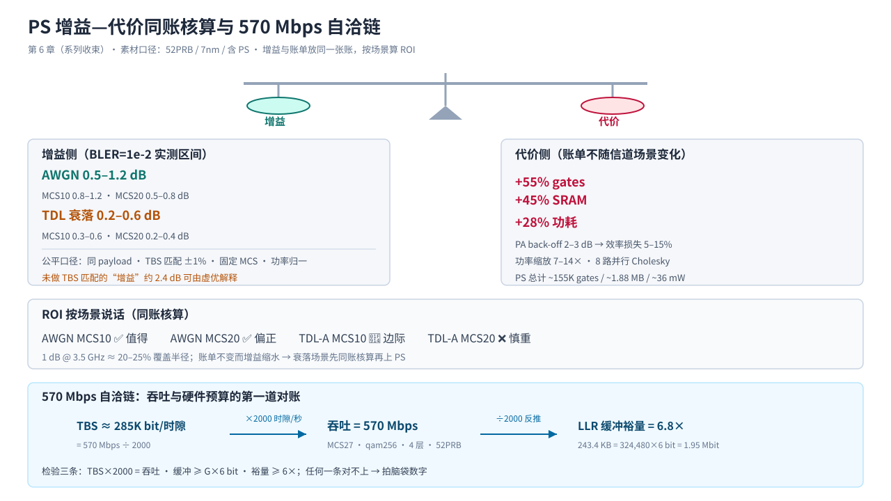

# T21.6 吞吐与全链路 ROI：三本账的合账与规格书审计

## 本节学习目标

第 5 章（[[T21.5_storage_and_area_estimation]]）的小结把账本交接到了本章：**周期账、存储账、面积账三本账要合起来审计**——"吞吐公式链（TBS × 2000）与硬件预算的自洽（570 Mbps ↔ 每时隙 285K bit ↔ LLR 缓冲 6.8× 裕量）、PS 增益-代价同账核算（+55% gates / +45% SRAM / +28% 功耗）、以及用'三本账同口径'检验一份 Modem 规格书的数字是不是拍脑袋"。本章是 T21 系列的收束章（第 6 章）：不再开新账，而是把前五章攒下的全部数字（位宽、周期、存储、面积、吞吐）放进同一张账本，回答系列的核心问题——**一份规格书上的数字彼此自洽吗？一个链路级增益（PS 的 0.2–0.6 dB）值得花多少钱（+55% gates）？**

第 1 章（[[T21.1_engineering_budget_overview]]）立下的三本账互锁在这里长出第四条边：**吞吐 ↔ 周期 ↔ 存储**——吞吐数字（570 Mbps）必须能反推出每时隙信息比特（285,000 bit），每时隙信息比特必须能被 LLR 缓冲装下（6.8× 裕量），而 LLR 缓冲的 243.4 KB 正是第 5 章逐缓冲区存储表的第 12 行。这条边是审计任何 Modem 规格书的第一道检验。学完本节后，应能做到：

- 说出吞吐公式链（throughput formula chain）的每一环——N_RE×Qm×L = G、TBS、Throughput = TBS×2000——并解释 2,000 时隙/秒的来历（30 kHz SCS、0.5 ms 时隙）。
- 复述实测吞吐表的关键行（MCS10 4.94 / MCS15 8.96 / MCS20 12.29 Mbps；256QAM 4 层 ~480 / MCS27 ~570 Mbps），并解释为什么 PS 行码长更大而吞吐与 uniform 相差 ±1%。
- 计算 570 Mbps ↔ 每时隙 285K bit ↔ LLR 缓冲 6.8× 裕量的自洽链，写出裕量的等价写法（6 bit ÷ 码率），并说明"裕量 ≥ 6×"为什么是任何配置都必须满足的底线。
- 说出 273PRB 外推三行吞吐（2.5 / 5.0 / 3.0 Gbps），并验证它们与 52PRB 峰值行的 5.25× 自洽关系。
- 用 ROI 同账核算 PS：衰落 0.2–0.6 dB vs +55% gates / +45% SRAM / +28% 功耗 / PA back-off，计算"每 dB 增益的 gates 成本"并按场景下结论（LO14）。
- 说出公平口径四要素（同 payload、TBS 匹配、功率归一、固定 MCS、AWGN/衰落分别报告）与无 SAIF 标注，并解释为什么缺 TBS 匹配的增益报告默认不可信。
- 用三本账框架审计一份规格书节选：从吞吐反推 TBS 与缓冲、检查外推比例与功耗口径，识别拍脑袋数字并给出修正（LO13）。
- 画出系列六章地图，收束核心问题 Q1–Q5，并说出四条迁移目标各自对应的工具（规格书审计、四件预算表、纸面判定、报告比较）。

与持久理解的呼应：U7（周期、存储、面积与吞吐是同一架构决策的四个投影——570 Mbps ↔ 285K bit ↔ 6.8× 与 5.1M cycles → 81× 并行度 → 3.0M gates → 1.5 mm² 同源同账）在本章以吞吐这条新边闭环；U8（任何链路增益都必须与工程代价同账核算，ROI 按场景说话；吞吐与硬件预算的自洽是审计规格书的第一道检验）在本章完成完整论证并收束。核心问题 Q1–Q5 在本章全部收束。

## 前置知识检查

| 前置项 | 本节需要达到的程度 |
|:---|:---|
| [[T21.1_engineering_budget_overview]] 工程预算总览 | 知道三本账与三个锚点数字（Rhh 24-bit real / 61,440 cycles / 6.1 MB≈4.0 mm²）、三本账互锁的三种机制、面积换算器（30/3 Mbit·mm⁻²）；本节把互锁扩展出"吞吐"这条第四条边。 |
| [[T21.2_bitwidth_tracking_methodology]] 位宽追踪方法 | 知道位宽决策树（16+3+2+2 = 23 → 24-bit I/Q）与收口行 LLR 恒 ±31；本节用 LLR 的 6-bit 直接参与吞吐-缓冲对账。 |
| [[T21.3_llr_dynamic_range_clipping_tradeoff]] LLR 动态范围与裁剪权衡 | 知道 48-bit 字打包（8 个 6-bit/字、40,560 字、243.4 KB）与 6→8 bit +33%；本节的自洽链就挂在 243.4 KB 上。 |
| [[T21.4_slot_cycle_budget_parallelization]] 时隙周期预算与并行化 | 知道 61,440 cycles 硬时限、并行度公式、LDPC ~5.1M ≈ 预算 81×（素材口径）、273PRB 预算 122,880 与并行度外推（LDPC 81× → ~212×、Cholesky 7.9× → ~21×）；本节把"每时隙 bit"折算成"每周期 bit"与周期账对账。 |
| [[T21.5_storage_and_area_estimation]] 存储与面积估算 | 知道逐缓冲区存储表（6.1 MB / 28.7 MB）、62% 拆分与视角反转、面积两本账（4.0 mm²、40%/60%）、外推口径分项（5.25×/4×/1×）、LLR 缓冲 243.4 KB；本节直接调用这些数字做对账。 |
| [[T13.6_tbs_matching_system_cost_roi]] TBS 匹配与系统代价 | 知道公平对比四要素、R_eff 虚优（2.43 dB）、PS 硬件三本账（+55% gates / +45% SRAM / +28% 功耗、8 路并行 Cholesky）、衰落三机制与按场景 ROI 结论；本节把 L2 的 PS ROI 结论搬进 T21 的三本账做同账核算。 |
| [[T20.4_DC_synthesis_flow_decoders]] DC 综合流程 | 知道功耗估算必须标注无 SAIF（无真实翻转活动）口径；本节把它列为规格书审计的检查点之一。 |
| [[3GPP全流程_缩写概念理论清单]] G 节 | 知道实测吞吐（MCS10 4.94 / MCS15 8.96 / MCS20 12.29 Mbps、256QAM 4 层 ~480、MCS27 ~570 Mbps、273PRB 外推 2.5/5.0/3.0 Gbps）与 PS 硬件开销明细（~155K gates、~36 mW）；本节以这些为素材数字。 |

如果这些前置还不稳，先抓住一句话：**本节回答"规格书上的吞吐、缓冲、面积、功耗数字怎么互相验算"——吞吐 ÷ 2000 = 每时隙 TBS，TBS × 6 bit 的码长要装得进 LLR 缓冲，而 PS 的每一分贝增益都要在 +55% gates 的账单上按场景算 ROI。**

## 吞吐公式链：从资源网格到每秒比特

**吞吐公式链（throughput formula chain）**：从资源网格到"每秒比特"的递推链——每个资源单元数乘以调制阶数与层数得到码长，码长经 TBS 确定得到载荷，载荷乘以每秒时隙数得到吞吐——链上每一环的输出都是下一环的输入，任何一环改数字，下游全部联动。一句话解释：吞吐不是规格书"拍"出来的，而是四个乘法的链式结果，反过来也能从吞吐逐环反推。

第一环：**每 PRB 的资源单元（Resource Element, RE）数**。30 kHz SCS 下每个时隙 14 个符号、每 PRB 12 个子载波，扣除 DMRS 开销（type1 配置，素材口径 N_DMRS,perPRB = 12）：

$$
N_{\mathrm{RE,perPRB}} = 12 \times N_{\mathrm{sym}} - N_{\mathrm{DMRS,perPRB}} = 12 \times 14 - 12 = 156
\tag{1}
$$

第二环：**码长 G**。G = N_RE × Qm × L，其中 N_RE = N_PRB × 156，Qm 是调制阶数（调制阶数，Modulation order——每个调制符号携带的 bit 数：QPSK 2、16QAM 4、64QAM 6、256QAM 8、1024QAM 10），L 是层数：

$$
G = N_{\mathrm{RE}} \times Q_m \times L
\tag{2}
$$

第三环：**TBS**（传输块大小，Transport Block Size——一个传输块承载的信息 bit 数，由 3GPP TS 38.214 §5.1.3.2 的量化过程确定，不是 G 本身：G 是编码后的 bit 数，TBS ≤ G，差值是纠错冗余）。第四环：**吞吐**——每秒 2,000 个时隙（30 kHz SCS 时隙 0.5 ms）：

$$
\mathrm{Throughput} = \mathrm{TBS} \times 2000\ \mathrm{slots/s}
\tag{3}
$$

式 (3) 里的 2,000 不是凑出来的：1 s ÷ 0.5 ms = 2,000。273PRB 与 52PRB 的时隙时长相同（都由 SCS 决定），所以这个乘数两配置共用——第 1 章周期账的"每秒 2,000 个时隙"就是式 (3) 的除数侧。

**为什么吞吐看 TBS 而不是 G**：G 是码长（含冗余），TBS 是载荷。若用 G×2000 当吞吐，就把纠错冗余算成了信息——这正是第 5 章"LLR 是压缩后的证据、TBS 是有效载荷"的吞吐版：**吞吐的计费口径永远是载荷（TBS），不是码长（G）**。这条口径在第 6 章规格书审计里是第一类检查对象。

## 实测吞吐表：八行数字与两类口径

素材给出 52PRB 配置的实测吞吐表（analysis 06 §2.2 / PHY01 §10.3，固定 MCS 扫 SNR、BLER=0 工作点口径；低速行为复现 CSV 精确实测、峰值行带"~"为计算口径）：

| MCS | 表 | Qm | 码率 | 层 | PRB | N_RE | G | TBS | 吞吐 |
|:--:|:--:|:--:|:--:|:--:|:--:|:--:|:--:|:--:|:--:|
| 10 | qam64 | 4 | 0.332 | 1 | 12 | 1,872 | 7,488 | 2,472 | **4.94 Mbps** |
| 10 | ps_table1 | 4+2 | — | 1 | 12 | 1,872 | 11,232 | 2,458 | **4.92 Mbps** |
| 15 | qam64 | 4 | 0.602 | 1 | 12 | 1,872 | 7,488 | 4,480 | **8.96 Mbps** |
| 20 | qam64 | 6 | 0.554 | 1 | 12 | 1,872 | 11,232 | 6,144 | **12.29 Mbps** |
| 20 | ps_table1 | 6+2 | — | 1 | 12 | 1,872 | 14,976 | 6,110 | **12.22 Mbps** |
| 20 | qam256 | 8 | 0.667 | 4 | 52 | 8,112 | 259,584 | ~240K | **~480 Mbps** |
| 27 | qam256 | 8 | 0.926 | 4 | 52 | 8,112 | 259,584 | ~285K | **~570 Mbps** |
| 27 | ps_table1 | 10 | 0.88 | 4 | 52 | 8,112 | 324,480 | ~280K | **~560 Mbps** |

读表要点（两类口径 + 一个反直觉）：

1. **前五行是"低速行"，后三行是"峰值行"**：低速行（12 PRB × 1 层）的吞吐 4.94–12.29 Mbps 来自复现 CSV 的逐点实测，可精确复核——2,472 × 2000 = 4.944 Mbps 与 CSV 的 `4.944` 精确一致（素材的实测校验）；峰值行（52 PRB × 4 层）的 ~480 / ~570 / ~560 Mbps 是 analysis 06 的计算口径，带"~"标注。**审计时先分清一行数字是"实测"还是"计算"，再谈自洽**。
2. **PS 行的反直觉**：PS 的 G 比 uniform 大——MCS27 行 324,480 vs 259,584（Qm 10 vs 8，整形幅度位是"冗余"bit），但 TBS 几乎不变（~280K vs ~285K），吞吐 ~560 vs ~570 Mbps。原因是整形的 rate loss（速率损失——概率不均匀导致每符号熵下降、信息率损失，[[Probabilistic_Shaping_概率整形]]）被 TBS 匹配吸收：PS 的 G 大是编码形态，不是吞吐优势。
3. **码长公式逐行可验**：N_RE = 12×156 = 1,872（12 PRB）、52×156 = 8,112（52 PRB）；G = 1,872×4×1 = 7,488、1,872×6×1 = 11,232、8,112×8×4 = 259,584、8,112×10×4 = 324,480——每一行都能从式 (1)(2) 独立算出，这就是吞吐账的第一层自洽。

PS 与 uniform 的吞吐对比（素材 analysis 06 §2.4，同一资源、TBS 匹配后）：

| MCS | Uniform TBS | PS TBS | Uniform 吞吐 | PS 吞吐 | PS 差异 |
|:--:|:--:|:--:|:--:|:--:|:--:|
| 10 | 2,472 | 2,458 | 4.94 Mbps | 4.92 Mbps | **−0.57%** |
| 15 | 4,480 | 4,490 | 8.96 Mbps | 8.98 Mbps | **+0.22%** |
| 20 | 6,144 | 6,110 | 12.29 Mbps | 12.22 Mbps | **−0.55%** |

**PS 吞吐 ≈ Uniform 吞吐 ±1%**——这个结论在 ROI 核算里的含义是：**PS 的收益不体现在"更高的吞吐"，而体现在"同样吞吐下更低的 SNR"（增益）**。如果一份报告声称"PS 吞吐大幅提升"，第一嫌疑是把 G 当成了吞吐计费口径（R_eff 虚优的吞吐版，[[T13.6_tbs_matching_system_cost_roi]]）。

## 自洽检验：570 Mbps ↔ 285K bit ↔ 6.8× 裕量

**自洽检验（self-consistency check）**：用一组互相独立的算式把规格书上的数字互相验算，检验"每个数字都能从其它数字推出来"的过程——吞吐 × 2000 = 每时隙 TBS、缓冲 ≥ G×6 bit、裕量 ≥ 6×，任何一环对不上就说明有一个数字是拍脑袋的。一句话解释：自洽检验是"三本账同账核算"的可执行版本——不是信一句"这是峰值"，而是自己把链走一遍。

**每时隙信息比特（per-slot information bits）**：吞吐数字除以每秒时隙数得到的"每个 0.5 ms 时隙必须搬进解码器并译出的信息 bit 数"，即 TBS 的实测口径。素材的自洽链（PHY01 §10.3 口径）：

1. **吞吐环**：570 Mbps ÷ 2,000 = **285,000 bit/时隙**——MCS27 峰值行的 TBS ≈ 285K 与吞吐 570 Mbps 互为一枚硬币的两面（285,000 × 2000 = 570,000,000）。
2. **缓冲环**：LLR 缓冲 243.4 KB = 243,360 B = **1,946,880 bit ≈ 1.95 Mbit**——素材的 LLR 缓冲按全链路峰值码长 G = 324,480（1024QAM PS 路径、Qm=10 的 G）与 6-bit 定容：324,480 × 6 = 1,946,880 bit（这正是第 5 章逐缓冲区存储表第 12 行 243.4 KB 的来历）。
3. **裕量环**：

$$
\text{裕量} = \frac{\text{LLR 缓冲 bit 数}}{\text{每时隙信息比特}} = \frac{1{,}946{,}880}{285{,}000} \approx 6.83 \approx \textbf{6.8×}
\tag{4}
$$

式 (4) 的 6.8× 就是规格书审计的第一道检验数字。它的等价写法更有教学意义：

$$
\text{裕量} = \frac{G \times 6\ \mathrm{bit}}{\mathrm{TBS}} = \frac{6}{\text{码率}} = \frac{6}{285{,}000/324{,}480} = \frac{6}{0.878} \approx 6.8\times
\tag{5}
$$

式 (5) 说明裕量的结构：**"6"来自 6-bit 位宽，"8"的余量来自码率 0.878（TBS < G 的纠错冗余）**。因为任何配置都有 TBS ≤ G（码率 ≤ 1），所以 6×G/TBS ≥ 6——**"裕量 ≥ 6×"是任何配置都必须满足的底线**；规格书里出现裕量 < 6×，必然有一环是错的（要么 TBS 超过 G、要么缓冲装不下）。反过来，把缓冲从 6-bit 升到 8-bit：324,480×8 = 2,595,840 bit = 324.5 KB（+33.3%，第 5 章的杠杆数字在这里变成裕量 9.1×）——**位宽选择同时是吞吐裕量表的杠杆**，这与第 5 章"LLR 6→8 bit +33%"的结论一致。

口径注：本链的缓冲按峰值 G = 324,480（PS 路径）定容、吞吐按 uniform MCS27 的 TBS 计（素材口径）；若只按 uniform 行自己的 G = 259,584 定容，缓冲只需 259,584×6/8 ≈ 194.7 KB——**缓冲按全链路峰值定容是硬件静态预算的惯例**（第 2 章"静态统一读法"的存储版：一次设计覆盖所有配置）。审计规格书时先确认缓冲的定容口径与吞吐的计费口径各是什么，再对账。

## 273PRB 外推：2.5 / 5.0 / 3.0 Gbps 的三条外推线

素材给出的 273PRB（FR1 100 MHz）标准上限外推（analysis 06 §2.3）：

| 配置 | Qm | 码率 | 层 | N_RE | G | TBS（约） | 吞吐 |
|:--|:--:|:--:|:--:|:--:|:--:|:--:|:--:|
| 256QAM 0.93 | 8 | 0.93 | 4 | ~42,588 | ~1.36M | ~1.25M | **~2.5 Gbps** |
| 256QAM 0.93 | 8 | 0.93 | 8 | ~42,588 | ~2.73M | ~2.50M | **~5.0 Gbps** |
| 1024QAM PS 0.88 | 10 | 0.88 | 4 | ~42,588 | ~1.70M | ~1.50M | **~3.0 Gbps** |

三条外推线与 52PRB 峰值行的自洽关系（这是 U7"同一架构决策的多个投影"的吞吐投影）：

1. **N_RE 行**：42,588 = 273 PRB × 156 RE/PRB——与 52 PRB 的 8,112 之比恰好 5.25×，与第 5 章存储外推的"RE 类 5.25×"同源。
2. **2.5 Gbps 行**：52PRB 的 ~480 Mbps × 5.25 ≈ **2.52 Gbps**（4 层 256QAM，码率 0.93 vs 0.667 的差被"~"吸收）——吞吐按 RE 数比例外推，与存储外推（6.1 → 28.7 MB）用同一套 5.25×。
3. **5.0 Gbps 行**：2.5 Gbps × 2（8 层 vs 4 层）——层数翻倍，G 与 TBS 同步翻倍（1.36M → 2.73M）。
4. **3.0 Gbps 行**：52PRB 的 1024QAM PS 峰值 ~560 Mbps × 5.25 ≈ **2.94 Gbps ≈ 3.0 Gbps**——1024QAM（Qm=10）相对 256QAM 的峰值速率 +20%（3.0 vs 2.5），以更高的 SNR/EVM 与 PA 线性度要求为代价（素材 E 节口径：1024QAM 的 32×32 星座需要更高 SNR 与 EVM 预算）。

**吞吐外推与周期账的同一套分项**：273PRB 的时钟只 2×（245.76 MHz → 预算 122,880 cycles），而吞吐按 RE 5.25× 增长——处理量的缺口由并行度吸收（第 4 章的 LDPC 81× → ~212×、Cholesky 7.9× → ~21×），并行度转成面积（第 5 章的 ~19 mm²）。**吞吐、周期、存储、面积四个方向的外推全部挂在 5.25×/4×/2× 三个系数上**，这就是"四本投影、一套系数"——审计 273PRB 数字时，任何不满足这套分项的"外推"都是可疑的（比如"273PRB 吞吐 = 570 × 5.25/2"这种混用系数，见规格书审计一节）。

## PS 增益-代价同账核算：每分贝增益的账单

### 增益侧与代价侧

第 4/5 章把 PS 的账单记进了周期账（8 路并行 Cholesky）与存储账（PS 16%），本章把增益侧也摆上桌，两侧放进同一张账本（图 1）：



**ROI 同账（same-ledger ROI accounting）**：把链路增益（dB）与工程代价（gates / SRAM / 功耗 / PA back-off）放进同一张账本、按统一口径核算收益是否大于代价的方法——"赚 dB"与"付账单"用同一个度量结算（如"每 dB 增益的 gates 成本"）。一句话解释：ROI 同账回答核心问题 Q5——一个链路级增益值多少钱，答案必须按场景算，不能只看 dB。

**增益侧**（素材实测区间，BLER=10⁻² 口径；[[Probabilistic_Shaping_概率整形]]、[[T13.6_tbs_matching_system_cost_roi]]）：

| 场景 | 增益区间 | 汇总口径 |
|:---|:---|:---|
| AWGN，MCS10（64QAM+PS） | 0.8–1.2 dB | AWGN 0.5–1.2 dB |
| AWGN，MCS20（256QAM+PS） | 0.5–0.8 dB | 同上 |
| TDL-A 衰落，MCS10 | 0.3–0.6 dB | TDL 衰落 0.2–0.6 dB |
| TDL-A 衰落，MCS20 | 0.2–0.4 dB | 同上 |

**代价侧**（素材 analysis 04 §3 明细；PS 各模块的工程开销加总，与 T13.6 的硬件三本账同源）：

| 模块 | 逻辑 (gates) | SRAM | 功耗 | 一句话 |
|:---|:---:|:---:|:---:|:---|
| ESS 编码器 | ~20K | 0 | ~8 mW | O(n) 严格串行的区间定位 |
| ESS 解码器 | ~10K | 0 | ~5 mW | O(1) 查表、可流水 |
| 能量表 | ~5K | 264 KB | ~2 mW | DP 预计算（第 5 章逐缓冲区表第 10 行） |
| TBS 匹配 | ~10K | 0 | ~1 mW | ν 二分搜索（配置期摊销） |
| PS 加扰 / 解扰 | ~3K × 2 | 40.6 KB × 2 | ~1 mW × 2 | 选择性 XOR / LLR sign flip |
| SBPM 交织 / 解交织 | ~2K × 2 | ~10 KB × 2 | ~0.5 mW × 2 | 块置换 ROM 表 |
| Cholesky 预处理 | **~90K** | **~1.5 MB** | ~15 mW | 完整平方 MAP（最大单项） |
| TB 构造 / 恢复 | ~5K × 2 | ~6 KB × 2 | ~1 mW × 2 | ESS 编解码调用 |
| **PS 总计** | **~155K** | **~1.88 MB** | **~36 mW** | — |
| **NR 基线（无 PS）** | ~100K | ~4.2 MB | ~130 mW | — |
| **PS 增量** | **+55%** | **+45%** | **+28%** | 相对基线 |

读代价表的三个要点：**Cholesky 预处理（~90K gates）是最大单项**，占 PS 总计的 58%——PS 的硬件大头在 RX 预处理（完整平方 MAP 的 MIMO 硬件），不在 TX 能量表（264 KB 存储便宜、逻辑极少）；**功耗账单还有电源侧**——功率缩放实测 7–14×（12.49× / 7.05× / 13.62×，即 +8.5~11.3 dB）把峰值顶高，PA 需额外 **back-off 2–3 dB**、效率损失 5–15%（[[T13.6_tbs_matching_system_cost_roi]] 的因果链）；**账单不随信道场景变化**——+55% gates 在 AWGN 与衰落场景下一分不少，这是 ROI 按场景核算的根本原因。

### 公平口径：同 payload 比能量的四要素

同账核算的前提是增益数字本身可信。**公平口径（fair comparison basis）**：增益报告必须满足的四要素——TBS 匹配 ±1%（同样载荷比能量）、功率归一（发射平均功率拉回归一基线）、固定 MCS（两侧同一 MCS index）、AWGN/衰落分别报告——加上功耗与吞吐数字必须标注无 SAIF 口径（无真实翻转活动的粗估，[[T20.4_DC_synthesis_flow_decoders]]）。一句话解释：缺 TBS 匹配的"增益"里约 2.4 dB 可由有效码率虚优解释（MCS10 口径，[[T13.6_tbs_matching_system_cost_roi]] 的数值演示），与实测增益区间（0.8–1.2 dB）同量级——**没写 TBS 匹配的增益数字，默认不可信**。第 5 章还立过另一条口径：全系统功耗 ~167 mW 是无 SAIF 活动文件的粗估，规格书不标注就是把粗估当签核值。

### ROI 按场景结论

把增益侧与代价侧放进同一张账（每 dB 增益的 gates 成本 = +55% ÷ 增益中值）：

| 场景 | 增益（BLER=10⁻²） | 每 dB 增益的 gates 成本 | ROI 结论 |
|:---|:---|:---:|:---|
| AWGN，MCS10 | 0.8–1.2 dB（中值 1.0） | 55% ÷ 1.0 ≈ **55 %/dB** | ✅ **值得**：1 dB @ 3.5 GHz ≈ 20–25% 覆盖半径增益，链路增益显著大于账单 |
| AWGN，MCS20 | 0.5–0.8 dB（中值 0.65） | ≈ **85 %/dB** | ✅ 偏正：增益收窄，仍需按部署场景核算 |
| TDL-A，MCS10 | 0.3–0.6 dB（中值 0.45） | ≈ **122 %/dB** | 🤔 边际：增益与账单同量级 |
| TDL-A，MCS20 | 0.2–0.4 dB（中值 0.3） | ≈ **183 %/dB** | ❌ **慎重**：账单不变、收益缩水（衰落三机制），每 dB 单价是 AWGN 场景的 3 倍以上 |

**覆盖半径（coverage radius）**：链路增益折算成小区覆盖范围的百分比收益——1 dB @ 3.5 GHz ≈ 20–25%（素材口径）；0.3 dB 的衰落场景收益只有约 6–8%。ROI 结论一句话：**AWGN 高 SNR 场景（0.5–1.2 dB 增益）值得为 +55% gates 付账；衰落主场景（0.2–0.6 dB）账单不变而收益缩水，先同账核算再决定是否上 PS**——这就是核心问题 Q5 的收束答案（内嵌验证一节给出排序的数值证据）。

## 内嵌验证：PS ROI 表与吞吐-缓冲裕量自洽链

下面用 numpy 做三件事：(1) 复现 570 Mbps 自洽链——吞吐 ÷ 2000 = 每时隙 285,000 bit、LLR 缓冲 243.4 KB = G×6 bit、裕量 6.83 ≈ 6.8×，并演示"TBS=250,000 却声称 570 Mbps"如何被检出；(2) 构造 AWGN/TDL 两场景的增益区间数组与 gates/SRAM/功耗代价数组，计算"每 dB 增益的 gates 成本"排序，验证 ROI 按场景说话；(3) 核对 PS 硬件增量（基线 ~100K gates / ~4.2 MB / ~130 mW → +55% / +45% / +28%）。正文与习题里的所有手算实例都可以在这段输出里复验。

```python
# @file    t21_6_roi_and_throughput.py
# @brief   T21.6 内嵌验证：570 Mbps 吞吐-缓冲裕量自洽链 + PS 三场景 ROI 同账核算
# @note    数据口径：PHY01 10.3 / analysis 06 2 / analysis 04 3-4（素材口径，带 ~ 与区间）
import numpy as np

# ---- 1. 吞吐-缓冲裕量自洽链（570 Mbps <-> 285K bit <-> 6.8x）----
tbs_per_slot = 570e6 / 2000                     # 570 Mbps -> 每时隙信息比特
g_peak = 324480                                 # 峰值码长（PS 路径 1024QAM，Qm=10）
llr_bits = g_peak * 6                           # 6-bit LLR 缓冲的 bit 数
llr_kb = llr_bits / 8 / 1000                    # 十进制 KB
margin = llr_bits / tbs_per_slot                # 裕量倍数
print("1) 吞吐-缓冲裕量自洽链")
print(f"   TBS x 2000 = 570 Mbps -> 每时隙信息比特 {tbs_per_slot:,.0f} bit")
print(f"   LLR 缓冲 = G x 6 = {g_peak:,} x 6 = {llr_bits/1e6:.2f} Mbit = {llr_kb:.1f} KB (素材 243.4 KB)")
print(f"   裕量 = {llr_bits/1e6:.2f}M / {tbs_per_slot/1e3:.0f}K = {margin:.2f}x (素材 6.8x)")
cr = tbs_per_slot / g_peak
print(f"   等价写法: 裕量 = 6 bit / 码率 = 6 / {cr:.4f} = {6/cr:.2f}x (码率 {cr:.4f} = 285K/324,480)")

# 反向核对：若规格书写 TBS=250,000 而吞吐 570 Mbps -> 矛盾
tbs_wrong = 250000
print(f"   反例: TBS=250,000 -> 吞吐 {tbs_wrong*2000/1e6:.0f} Mbps != 570 Mbps（拍脑袋数字的检出）")

# ---- 2. PS ROI 同账：增益侧（区间中值）与代价侧 ----
scenarios = ["AWGN MCS10", "AWGN MCS20", "TDL-A MCS10", "TDL-A MCS20"]
gain_lo = np.array([0.8, 0.5, 0.3, 0.2])        # 增益下界 dB
gain_hi = np.array([1.2, 0.8, 0.6, 0.4])        # 增益上界 dB
gain_mid = (gain_lo + gain_hi) / 2
verdicts = ["值得", "偏正", "边际", "慎重"]
cost_gates, cost_sram, cost_power = 55.0, 45.0, 28.0   # +55% gates / +45% SRAM / +28% 功耗

cost_per_db = cost_gates / gain_mid             # 每 dB 增益的 gates 成本（% per dB）
print("\n2) PS ROI 同账：每 dB 增益的 gates 成本（越小越划算）")
for s, lo, hi, mid, cpd, v in zip(scenarios, gain_lo, gain_hi, gain_mid, cost_per_db, verdicts):
    print(f"   {s:<12} 增益 {lo:.1f}-{hi:.1f} dB (中值 {mid:.2f})  账单 +{cost_gates:.0f}% gates/+{cost_sram:.0f}% SRAM/+{cost_power:.0f}% 功耗  -> {cpd:6.1f} %/dB  {v}")

order = np.argsort(cost_per_db)
print("   按每 dB 成本排序（最划算在前）:", " -> ".join(scenarios[i] for i in order))
print(f"   AWGN 每 dB 成本 {cost_per_db[0]:.0f}-{cost_per_db[1]:.0f} %/dB vs TDL {cost_per_db[2]:.0f}-{cost_per_db[3]:.0f} %/dB：账单不变、增益缩水，ROI 按场景说话")

# ---- 3. PS 硬件增量绝对值核对（基线 ~100K gates / ~4.2 MB / ~130 mW）----
base_g, base_s, base_p = 100e3, 4.2, 130.0
ps_g = base_g * (1 + cost_gates/100)
ps_s = base_s * (1 + cost_sram/100)
ps_p = base_p * (1 + cost_power/100)
print(f"\n3) PS 硬件增量核对：基线 {base_g/1e3:.0f}K gates/{base_s:.1f} MB/{base_p:.0f} mW -> PS 后 "
      f"{ps_g/1e3:.0f}K gates/{ps_s:.2f} MB/{ps_p:.1f} mW（素材 ~155K / ~1.88 MB 增量 / ~36 mW 增量）")
print(f"   增量：gates +{100*(ps_g-base_g)/base_g:.0f}%、SRAM +{100*(ps_s-base_s)/base_s:.0f}%、功耗 +{100*(ps_p-base_p)/base_p:.0f}%")

# ---- 断言 ----
assert abs(tbs_per_slot - 285000) < 1.0
assert abs(llr_kb - 243.36) < 0.1
assert abs(margin - 6.83) < 0.02
assert abs(6/cr - 6.83) < 0.02
assert abs(ps_g/1e3 - 155) < 1 and abs(ps_s - base_s - 1.89) < 0.05 and abs(ps_p - base_p - 36.4) < 0.1
assert list(order) == [0, 1, 2, 3]              # AWGN MCS10 最划算、TDL MCS20 最不划算
print("断言全部通过：285,000 bit/时隙、243.4 KB、6.8x、+55%/+45%/+28%、ROI 排序 AWGN>>TDL ✓")
```

真实运行输出（断言全部通过）：

```text
1) 吞吐-缓冲裕量自洽链
   TBS x 2000 = 570 Mbps -> 每时隙信息比特 285,000 bit
   LLR 缓冲 = G x 6 = 324,480 x 6 = 1.95 Mbit = 243.4 KB (素材 243.4 KB)
   裕量 = 1.95M / 285K = 6.83x (素材 6.8x)
   等价写法: 裕量 = 6 bit / 码率 = 6 / 0.8783 = 6.83x (码率 0.8783 = 285K/324,480)
   反例: TBS=250,000 -> 吞吐 500 Mbps != 570 Mbps（拍脑袋数字的检出）

2) PS ROI 同账：每 dB 增益的 gates 成本（越小越划算）
   AWGN MCS10   增益 0.8-1.2 dB (中值 1.00)  账单 +55% gates/+45% SRAM/+28% 功耗  ->   55.0 %/dB  值得
   AWGN MCS20   增益 0.5-0.8 dB (中值 0.65)  账单 +55% gates/+45% SRAM/+28% 功耗  ->   84.6 %/dB  偏正
   TDL-A MCS10  增益 0.3-0.6 dB (中值 0.45)  账单 +55% gates/+45% SRAM/+28% 功耗  ->  122.2 %/dB  边际
   TDL-A MCS20  增益 0.2-0.4 dB (中值 0.30)  账单 +55% gates/+45% SRAM/+28% 功耗  ->  183.3 %/dB  慎重
   按每 dB 成本排序（最划算在前）: AWGN MCS10 -> AWGN MCS20 -> TDL-A MCS10 -> TDL-A MCS20
   AWGN 每 dB 成本 55-85 %/dB vs TDL 122-183 %/dB：账单不变、增益缩水，ROI 按场景说话

3) PS 硬件增量核对：基线 100K gates/4.2 MB/130 mW -> PS 后 155K gates/6.09 MB/166.4 mW（素材 ~155K / ~1.88 MB 增量 / ~36 mW 增量）
   增量：gates +55%、SRAM +45%、功耗 +28%
断言全部通过：285,000 bit/时隙、243.4 KB、6.8x、+55%/+45%/+28%、ROI 排序 AWGN>>TDL ✓
```

两组读法（教学要点）：

1. **自洽链的"反例"就是审计动作本身**：TBS=250,000 声称 570 Mbps 时，250,000 × 2000 = 500 Mbps ≠ 570 Mbps——**拍脑袋数字的检出不需要任何工具，一次乘法就够**；同一段代码里 243.4 KB、6.8×、+55%/+45%/+28% 全部从独立算式出来，这就是"规格书数字自洽"的最小演示。
2. **ROI 排序的数值结构**：AWGN MCS10（55 %/dB）→ AWGN MCS20（85 %/dB）→ TDL-A MCS10（122 %/dB）→ TDL-A MCS20（183 %/dB）——账单数组是常数（+55%），排序完全由增益区间决定：**账单不变、增益缩水，ROI 必然按场景说话**。这个排序与素材 analysis 04 的 ROI 表逐行一致（值得/偏正/边际/慎重）。

## 规格书审计：三本账逐项核验

**规格书审计（specification audit）**：用三本账框架逐项核验一份 Modem 规格书（或芯片 datasheet）数字自洽性的过程——从位宽表反推存储与面积、从周期预算反推所需并行度、从吞吐数字反推时隙预算，识别拍脑袋数字并给出修正。一句话解释：审计不是"信不信"的问题，而是"每条数字能不能从其它数字推出来"的算术问题。

**拍脑袋数字（arbitrary number）**：规格书里来路不明、与其它数字对不上号、无法从任何已知账本反推出来的数字——特征是三本账同账核算时第一轮就对不上（如吞吐 570 Mbps 配 100 KB LLR 缓冲）。一句话解释：拍脑袋数字不是"估算"，估算有推导链（第 2 章的位宽推导链、第 5 章的外推口径分项），拍脑袋只有结论没有链。

### 审计清单：六个检查点

| # | 检查点 | 方法 | 判据 / 典型缺陷 |
|:--:|:---|:---|:---|
| 1 | 吞吐 ↔ TBS | 吞吐 ÷ 2,000 = 每时隙 TBS | 570 Mbps ↔ 285,000 bit；对不上即矛盾（自洽检验第一环） |
| 2 | TBS ↔ G ↔ LLR 缓冲 | 缓冲 ≥ G×6 bit；裕量 ≥ 6× | 100 KB 缓冲配 570 Mbps：裕量 2.9× < 6×，必有一环错 |
| 3 | 外推比例 | 外推口径分项：RE 类 5.25×、FFT 类 4×、每链路 1×、时钟 2× | 整体乘 5.25 得 32 MB ≠ 28.7 MB（偏大 12%）；"273PRB 预算 322,560 cycles"（误用 5.25× 于时钟）是第一眼缺陷 |
| 4 | 面积两本账 | 换算器（30/3 Mbit·mm⁻²）+ SRAM/逻辑分账 | 存储占比冒充面积占比（LDPC 存储 8% vs 面积 38% 是口径分组不同，见下）；"6.1 MB 差 0.2 MB"类舍入口径须标注（6.1 vs 6.14/5.93 之差已在前章说明） |
| 5 | 并行度 | 串行 cycles ÷ 61,440（273PRB 用 122,880） | LDPC ~5.1M ≈ 预算 81× 必须专用引擎；没有引擎行却写满吞吐即可疑 |
| 6 | 功耗口径 | 无 SAIF 标注 | ~167 mW 是无 SAIF 粗估；不标注即把粗估当签核值 |
| 7 | 增益报告（PS） | 公平口径四要素 | 缺 TBS 匹配：增益可被约 2.4 dB 虚优解释（MCS10 口径） |

检查点 4 的口径说明（沿用第 5 章结论）：LDPC"存储只占 8%、面积却占 38%"不矛盾——存储拆分表按缓冲类型归类（消息 RAM 0.5 MB 单独一行），面积分解表按子系统归属归类（逻辑 3.0M gates + 面积口径下 2.0 MB SRAM），**两张表口径分组不同**；把"存储 8%"直接说成"面积 8%"是审计要挑的典型错误。

### 实例：含三处缺陷的规格书节选

某规格书节选："峰值吞吐 570 Mbps（MCS27、qam256、4 层、52PRB）；LLR 缓冲 100 KB（6-bit）；273PRB 全系统存储 = 6.1 MB × 5.25 ≈ 32 MB；全系统功耗 167 mW（内部估算）。"

逐项核验（诊断过程是引导练习 1 的完整版，答案见该处）：**缺陷一**——570 Mbps 要求每时隙 285,000 bit，LLR 缓冲至少 6×285,000 = 1,710,000 bit = 213.75 KB（按峰值 G 则 243.4 KB），100 KB 的裕量只有 2.9× < 6×，吞吐与缓冲矛盾（检查点 1/2）；**缺陷二**——6.1 × 5.25 = 32.0 MB 是"整体乘 5.25"，正确外推为分项口径 28.7 MB，偏大约 12%（检查点 3）；**缺陷三**——167 mW 未标注无 SAIF 口径，粗估被当成了签核值（检查点 6）。三处缺陷的共同归因只有一个：**三本账没有同口径核算**——这正是表现性任务 A（规格书审计）要学生独立完成的完整演练。

## 系列收束：六章地图与五个核心问题

T21 系列六章到此闭环。地图回顾（与第 1 章"系列地图"一致）：

| 章 | 主题 | 承载理解 | 关键资产 |
|:--:|:---|:---|:---|
| 1 | 工程预算总览（[[T21.1_engineering_budget_overview]]） | U1/U2/U4/U5 立框架 | 三本账、三锚点（24-bit real / 61,440 / 6.1 MB≈4.0 mm²）、最坏值原则、62% 预告 |
| 2 | 位宽追踪方法（[[T21.2_bitwidth_tracking_methodology]]） | U1、U3 | 32 级位宽表、Rhh 24-bit 推导链、无缩放 IFFT 28-bit、决策树两种读法 |
| 3 | LLR 动态范围与裁剪权衡（[[T21.3_llr_dynamic_range_clipping_tradeoff]]） | U2/U3/U6 | 1024QAM 动态范围（14-bit → ±31）、裁剪-损失表、clip vs wrap |
| 4 | 时隙周期预算与并行化（[[T21.4_slot_cycle_budget_parallelization]]） | U4/U7 | 61,440 硬时限、并行度矩阵、LDPC 81× 专用引擎、273PRB 122,880 |
| 5 | 存储与面积估算（[[T21.5_storage_and_area_estimation]]） | U5/U6/U7 | 逐缓冲区表 6.1 MB、62% 视角反转、4.0 mm²（40%/60%）、外推口径分项 |
| 6（本章） | 吞吐与全链路 ROI | **U7/U8 收束** | 吞吐公式链、6.8× 自洽检验、PS ROI 同账、规格书审计 |

五个核心问题的收束（第 1 章提出 → 第 2/3/4/5 章深化 → 本章收束）：

| 核心问题 | 收束答案 |
|:---|:---|
| Q1 为什么按最坏值定价、省面积省在哪 | 位宽账按物理最坏值记账（Rhh 24-bit 是推导链产物）；省面积省在配置没用到的最坏余量上（决策树动态读法）；审计规格书时先问口径是动态还是静态 |
| Q2 浮点无害的无界值为何定点致命、裁剪阈值多大 | 溢出回绕是方向翻转的灾难（+31→−32），裁剪管范围、量化管精度；±31 同时吸收 MMSE 归一化无界值；"可接受"由比特精确回归的阈值检验裁决，不是拍脑袋 |
| Q3 60,000 个周期做不完、加多少引擎 | 并行度 = 串行 ÷ 61,440；LDPC 5.1M ≈ 81× 必须专用引擎（3.0M gates）；并行度不能无限加——面积与存储带宽是两道天花板；273PRB 预算 122,880，并行度需求按 5.25/2 ≈ 2.6× 上升 |
| Q4 规格书上的数字彼此自洽吗 | 三本账是同一架构决策的四个投影（吞吐、周期、存储、面积挂同一套 5.25×/4×/2× 系数）；自洽检验（570 ↔ 285K ↔ 6.8×）是第一道检验，六个检查点逐项核验，拍脑袋数字一次乘法即可检出 |
| Q5 一个链路级增益（0.2–0.6 dB）值得花多少钱（+55% gates） | ROI 同账按场景说话：AWGN 0.5–1.2 dB 换 +55% gates 值得（55–85 %/dB），衰落 0.2–0.6 dB 需谨慎（122–183 %/dB）；公平口径（同 payload、TBS 匹配、无 SAIF 标注）是评估前提 |

迁移目标预告（全系列工具已齐）：**T1**（审计规格书）——三本账框架 + 本章审计清单；**T2**（新配置预算）——位宽决策树 + 外推口径分项 + 并行度公式 + 面积换算器（习 6-5 是 273PRB 演练）；**T3**（新算法纸面判定）——"串行 cycles ÷ 时隙预算"的算术否决/放行；**T4**（报告比较）——公平口径四要素 + R_eff 虚优数值 + 本章 ROI 同账。三条表现性任务的载体：**任务 A**（规格书审计）用本章六个检查点；**任务 C**（两份 PS 性能报告比较）用公平口径 + ROI 按场景；**任务 B**（273PRB 四件预算表）由习 6-5 预演。

## 示范例题

### 例 1（应用，LO15 前奏）：吞吐自洽链——570 Mbps 的每一环

**题目**：素材实测表给出 52PRB、4 层、qam256 MCS27 行：G = 259,584、TBS ≈ 285,000 bit、吞吐 ~570 Mbps；全系统 LLR 缓冲 243.4 KB（6-bit）。请：（1）写出吞吐公式链并验证 570 Mbps；（2）计算每时隙信息比特；（3）计算 LLR 缓冲的 bit 数与相对每时隙信息比特的裕量，并写出等价写法；（4）若把 LLR 升到 8-bit，缓冲与裕量各是多少？（5）用这三环写出一条"规格书自洽"的判定。

**解答**：

1. **公式链**：N_RE = 52 × 156 = 8,112（式 (1)）；G = N_RE × Qm × L = 8,112 × 8 × 4 = 259,584（式 (2)，与素材行一致）；TBS ≈ 285,000 bit（素材口径，TS 38.214 §5.1.3.2 量化结果）；吞吐 = TBS × 2000 = 285,000 × 2,000 = 570,000,000 = **570 Mbps**（式 (3)，与素材 ~570 一致）。
2. **每时隙信息比特** = 570 × 10⁶ ÷ 2,000 = **285,000 bit**。
3. **LLR 缓冲** = 243.4 KB = 243,360 B = 1,946,880 bit ≈ 1.95 Mbit。素材的缓冲按全链路峰值码长 G = 324,480（PS 路径 1024QAM、Qm=10）与 6-bit 定容：324,480 × 6 = 1,946,880 bit。**裕量** = 1,946,880 ÷ 285,000 ≈ **6.83 ≈ 6.8×**；等价写法（式 (5)）：裕量 = 6 bit ÷ 码率 = 6 ÷ (285,000/324,480) = 6 ÷ 0.878 ≈ 6.8×。
4. **8-bit**：324,480 × 8 = 2,595,840 bit = 324,480 B ≈ **324.5 KB（+33.3%）**；裕量 = 2,595,840 ÷ 285,000 ≈ **9.1×**——与第 5 章"6→8 bit +33%"的杠杆数字一致。
5. **判定**：①吞吐 ÷ 2000 = TBS；②G ≥ TBS（码率 ≤ 1）；③缓冲 ≥ G×6 bit（裕量 ≥ 6×）。三环任一不符即拍脑袋数字。

**点评**：这道题是三本账互锁第四条边（吞吐 ↔ 周期 ↔ 存储）的完整走查——第 4 章的"5.1M cycles → 81× 并行度 → 3.0M gates"与本章的"570 Mbps → 285K bit → 6.8× 裕量"是同一架构决策在周期/面积与吞吐/存储上的两个投影。注意第三步的定容口径：缓冲按峰值 G 定容是硬件惯例，审计时先问"口径"，再谈"对账"。

### 例 2（评价，LO14）：PS 在 TDL-A MCS20 场景的 ROI 论证

**题目**：某运营商的小区以 TDL-A 衰落信道为主、峰值配置 256QAM MCS20（52PRB）。素材：TDL-A MCS20 实测增益 0.2–0.4 dB；PS 账单 +55% gates / +45% SRAM / +28% 功耗、PA back-off 2–3 dB（效率损失 5–15%）；对照 AWGN MCS10 的 0.8–1.2 dB。请：（1）用"每 dB 增益的 gates 成本"同账核算两个场景；（2）评估覆盖半径收益；（3）列出评估必须满足的公平口径；（4）给出"全面部署 PS"的结论与部署建议。

**解答**：

1. **同账核算**：AWGN MCS10 每 dB 成本 = 55% ÷ 1.0 dB ≈ **55 %/dB**；TDL-A MCS20 = 55% ÷ 0.3 dB ≈ **183 %/dB**——同一张账单（+55% gates），衰落场景的每 dB 单价是 AWGN 场景的 3 倍以上。
2. **覆盖半径**：1 dB @ 3.5 GHz ≈ 20–25% → AWGN MCS10 的 1.0 dB 约 **20–25%**；TDL MCS20 的 0.3 dB 约 **6–8%**——收益相差约 4 倍。
3. **公平口径**：TBS 匹配 ±1%（同 payload 比能量）、功率归一、固定 MCS、AWGN/衰落分别报告（[[T13.6_tbs_matching_system_cost_roi]]）；功耗与吞吐数字标注无 SAIF 口径（[[T20.4_DC_synthesis_flow_decoders]]）。增益若未做 TBS 匹配，约 2.4 dB 可由虚优解释，ROI 前提即不成立。
4. **结论**：**不建议全面部署**。账单不随信道场景变化（+55% gates 在衰落场景一分不少），增益却因衰落三机制缩水到 0.2–0.4 dB——每 dB 单价 183 %/dB、覆盖半径收益仅 6–8%，与 AWGN 场景（55 %/dB、20–25%）差距一个量级。建议：衰落主导的宏站场景不启用 PS（或仅在高 SNR 子帧/近点启用）；PS 优先部署在 AWGN 近似场景（小站、回传、视距链路），先按场景做预算表再定。

**点评**：评价级考点的完整链条是"同账 + 按场景 + 公平口径"三件套：增益与账单必须进同一张表（每 dB gates 成本）、结论必须绑定场景（AWGN vs TDL）、前提必须过公平口径（TBS 匹配与无 SAIF 标注）——缺任何一件，结论都不可信。这正是表现性任务 C（两份 PS 性能报告比较审计）的操作模板。

## 引导练习

### 练习 1（分析，LO13）：规格书诊断

**题目**：某 Modem 规格书节选写道："峰值吞吐 570 Mbps（MCS27、qam256、4 层、52PRB）；LLR 缓冲 100 KB（6-bit）；273PRB 全系统存储 = 6.1 MB × 5.25 ≈ 32 MB；全系统功耗 167 mW（内部估算）。"请诊断三处与本章账本不一致之处，逐一归因。

**提示**：用自洽链三环（570 → 285K → 裕量 ≥ 6×）反推缓冲需求：6×285,000 = 1,710,000 bit = 213.75 KB 是最低需求（按峰值 G 则 243.4 KB）；100 KB 的裕量是多少倍？273PRB 外推必须用外推口径分项（RE 5.25× / FFT 4× / 每链路 1×），整体乘 5.25 会把"RE 类系数"当成"总量系数"（第 5 章结论：正确值 28.7 MB、加权系数 4.70）；167 mW 在第 5 章是什么口径（无 SAIF）？

**参考答案**：

1. **吞吐与 LLR 缓冲矛盾**：570 Mbps → 每时隙 285,000 bit；LLR 缓冲至少需要 G×6 bit，而 G ≥ TBS，故 ≥ 6 × 285,000 = 1,710,000 bit = **213.75 KB**（按峰值 G = 324,480 则 243.4 KB）。规格书写 100 KB = 819,200 bit，裕量仅 819,200 ÷ 285,000 ≈ **2.9× < 6×**——要么吞吐虚标、要么缓冲漏算。归因：三本账未同口径（吞吐按峰值 TBS 计、缓冲按低配置 G 计）。
2. **外推比例用错**：6.1 × 5.25 = 32.0 MB 是"整体乘 5.25"；正确为外推口径分项（RE 类 5.25×、FFT/波形类 4×、每链路一份 1×）→ 素材汇总 **28.7 MB**（加权系数 4.70 < 5.25）。32.0 比 28.7 偏大约 12%，面积外推随之偏大（4.0×(32/6.1) ≈ 21.0 mm² vs 19 mm²）。归因：把"RE 类系数"当成"总量系数"。
3. **功耗未标口径**：167 mW 是第 5 章的无 SAIF（无真实翻转活动）粗估，规格书不标注就把粗估当签核值。归因：功耗估算口径缺失。

**评分要点**：三处缺陷逐一对应到检查点 1/2（自洽链）、3（外推分项）、6（无 SAIF），且每处给出归因——"三本账未同口径核算"是统一答案。

### 练习 2（应用）：PS 硬件开销加总

**题目**：素材给出 PS 模块明细（ESS 编码 ~20K gates、ESS 解码 ~10K、能量表 ~5K + 264 KB、TBS 匹配 ~10K、PS 加扰/解扰 ~3K×2 + 40.6 KB×2、SBPM 交织/解交织 ~2K×2 + ~10 KB×2、Cholesky 预处理 ~90K + ~1.5 MB、TB 构造/恢复 ~5K×2 + ~6 KB×2；功耗 ~8/5/2/1/1/1/0.5/0.5/15/1/1 mW）。请：（1）加总 gates、SRAM、功耗；（2）对照 NR 基线（~100K gates、~4.2 MB、~130 mW）计算三个增量百分比；（3）指出最大单项并说明它在哪本账、为什么。

**提示**：SRAM 用十进制口径（1.5 MB = 1500 KB，全系列一致）；增量 = (PS 总计 − 基线) ÷ 基线；最大单项在面积账（gates）里，对应第 4 章周期账的哪个数字（486,720 cycles → ≥8 路并行）？

**参考答案**：

1. **加总**：gates = 20+10+5+10+3+3+2+2+90+5+5 = **155K**；SRAM = 264+40.6+40.6+10+10+6+6 = 377.2 KB + 1500 KB = **1.88 MB**；功耗 = 8+5+2+1+1+1+0.5+0.5+15+1+1 = **36 mW**。
2. **增量**：gates (155−100)/100 = **+55%**；SRAM 1.88/4.2 ≈ **+45%**；功耗 36/130 ≈ **+28%**——与素材汇总逐项一致。
3. **最大单项**：Cholesky 预处理 ~90K gates（占 PS 总计 58%）——它是 MIMO+PS 组合的接收端预处理（完整平方 MAP 的 Rhh 构造与分解），周期账里对应 486,720 cycles（第 4 章"需 ≥8 路并行"的 7.9× 超预算行），存储账里 ~1.5 MB 的 Rhh/H_eq 缓冲（第 5 章 MIMO 26% 的组成部分）。**"PS 的硬件大头在 RX 预处理、不在 TX 能量表"**——能量表 264 KB 存储贵、逻辑便宜，Cholesky 恰恰相反。

## 独立习题

### 习 6-1（记忆）：复述自洽链三数字与 273PRB 外推

**题目**：复述 570 Mbps 自洽链的三个数字（吞吐、每时隙信息比特、LLR 缓冲裕量）各自的算式与来历，并写出 273PRB 外推三行吞吐。

**参考答案**：**570 Mbps**——MCS27、qam256、4 层、52PRB 的峰值行吞吐，算式为 TBS×2000（285,000×2,000）；**285,000 bit/时隙**——每时隙信息比特，算式为 570×10⁶÷2,000；**6.8×**——LLR 缓冲裕量，算式为 1,946,880 ÷ 285,000（分子 = 峰值 G=324,480 × 6 bit = 243.4 KB，等价写法 6 bit ÷ 码率 0.878）。273PRB 外推：256QAM 4 层 **~2.5 Gbps**、8 层 **~5.0 Gbps**、1024QAM PS 4 层 **~3.0 Gbps**。

### 习 6-2（理解）：判断正误两道

**题目**：判断正误并说明理由。（a）"码长 G 越大吞吐越高——PS 的 G（324,480）比 uniform（259,584）大 25%，所以 PS 的峰值吞吐必然更高。"（b）"PS 在衰落信道只拿 0.2–0.6 dB 的增益，比 AWGN 少一半以上，所以它的硬件账单也应该按比例缩水。"

**参考答案**：

(a) **错误**。吞吐 = TBS × 2000（式 (3)），TBS 是载荷不是码长。PS 的 G 大是因为整形 bit 是"冗余幅度位"（Qm+2：10 vs 8），rate loss 使 TBS 几乎不变——实测 PS 吞吐与 uniform 相差 ±1%（4.92 vs 4.94、12.22 vs 12.29 Mbps、~560 vs ~570 Mbps）。"G 大"是整形信息的编码形态，不是吞吐优势；把 G 当吞吐计费口径就是吞吐版的 R_eff 虚优。

(b) **错误**。账单不随信道场景变化——+55% gates / +45% SRAM / +28% 功耗是硬件实现属性，衰落信道下一分不少。恰恰因为"账单不变、收益缩水"，ROI 才必须按场景核算：TDL-A MCS20 的每 dB gates 成本（~183 %/dB）是 AWGN MCS10（~55 %/dB）的 3 倍以上——"增益打折"不等于"账单打折"。

### 习 6-3（应用，numpy）：PS ROI 表计算

**题目**：用 numpy 完成三件事：（1）把 PS 模块明细表（习 6-1 场景之外的明细见正文代价表）加总为 ~155K gates / ~1.88 MB / ~36 mW，并计算相对 NR 基线的增量百分比；（2）构造 AWGN/TDL 两场景的增益区间数组（AWGN MCS10 0.8–1.2、AWGN MCS20 0.5–0.8、TDL-A MCS10 0.3–0.6、TDL-A MCS20 0.2–0.4 dB）与代价数组（+55% gates / +45% SRAM / +28% 功耗），计算每 dB 增益的 gates 成本并排序；（3）核对自洽链（570 Mbps ↔ 285,000 bit ↔ 6.8×）。可对照本章"内嵌验证"（增量核对写法）与本题（明细加总写法）两种实现。

**参考答案**（代码与输出；与内嵌验证同数据、明细加总写法）：

```python
# @file    t21_6_exercise_3.py
# @brief   T21.6 独立习题 3 参考答案：PS 模块明细加总 -> 增量百分比 -> 三场景 ROI 表
# @note    数据口径：analysis 04 3 节（模块级 gates/SRAM/功耗）与 4 节（ROI 表，BLER=1e-2）
import numpy as np

# ---- 1. PS 模块明细（gates / SRAM / mW；SRAM 十进制口径，1.5 MB = 1500 KB）----
mods = ["ESS编码器","ESS解码器","能量表","TBS匹配","PS加扰","PS解扰",
        "SBPM交织","SBPM解交织","Cholesky预处理","TB构造","TB恢复"]
gates_k = np.array([20, 10, 5, 10, 3, 3, 2, 2, 90, 5, 5])     # K gates
sram_kb = np.array([0, 0, 264.0, 0, 40.6, 40.6, 10.0, 10.0, 1500.0, 6.0, 6.0])
power_mw = np.array([8, 5, 2, 1, 1, 1, 0.5, 0.5, 15, 1, 1])

tot_g = float(gates_k.sum())                       # K gates
tot_s = float(sram_kb.sum()) / 1000.0              # MB
tot_p = float(power_mw.sum())                      # mW
print(f"PS 模块加总: gates {tot_g:.0f}K (素材 ~155K) | SRAM {tot_s:.2f} MB (素材 ~1.88) | 功耗 {tot_p:.0f} mW (素材 ~36)")

base_g, base_s, base_p = 100.0, 4.2, 130.0         # NR 基线（无 PS）
inc_g = 100 * (tot_g - base_g) / base_g
inc_s = 100 * tot_s / base_s
inc_p = 100 * tot_p / base_p
print(f"增量: gates +{inc_g:.1f}% | SRAM +{inc_s:.1f}% | 功耗 +{inc_p:.1f}%  (素材 +55%/+45%/+28%)")

# ---- 2. 三场景 ROI 表：每 dB 增益的 gates 成本 ----
sc = ["AWGN MCS10", "AWGN MCS20", "TDL-A MCS10", "TDL-A MCS20"]
lo = np.array([0.8, 0.5, 0.3, 0.2]); hi = np.array([1.2, 0.8, 0.6, 0.4])
mid = (lo + hi) / 2
cpd = inc_g / mid                                  # % per dB
print("\n场景 ROI 表（每 dB 增益的 gates 成本，越小越划算）")
for s, m, c in zip(sc, mid, cpd):
    print(f"  {s:<12} 增益中值 {m:.2f} dB  ->  {c:6.1f} %/dB")
order = np.argsort(cpd)
print("排序:", " > ".join(sc[i] for i in order))
print(f"AWGN 中值 {cpd[:2].mean():.0f} %/dB vs TDL 中值 {cpd[2:].mean():.0f} %/dB -> ROI 按场景说话")

# ---- 3. 自洽链核对 ----
tbs = 570e6 / 2000
llr_bits = 324480 * 6
print(f"\n自洽链: 每时隙 {tbs:,.0f} bit, LLR 缓冲 {llr_bits:,} bit = {llr_bits/8/1000:.1f} KB, 裕量 {llr_bits/tbs:.2f}x")

# ---- 断言 ----
assert abs(tot_g - 155) < 1 and abs(tot_s - 1.877) < 0.01 and abs(tot_p - 36) < 0.1
assert abs(inc_g - 55) < 0.5 and abs(inc_s - 44.7) < 0.5 and abs(inc_p - 27.7) < 0.5
assert list(order) == [0, 1, 2, 3]
assert abs(llr_bits / tbs - 6.83) < 0.02
print("断言全部通过：155K/1.88 MB/36 mW、+55%/+45%/+28%、ROI 排序 AWGN>>TDL、6.8x ✓")
```

```text
PS 模块加总: gates 155K (素材 ~155K) | SRAM 1.88 MB (素材 ~1.88) | 功耗 36 mW (素材 ~36)
增量: gates +55.0% | SRAM +44.7% | 功耗 +27.7%  (素材 +55%/+45%/+28%)

场景 ROI 表（每 dB 增益的 gates 成本，越小越划算）
  AWGN MCS10   增益中值 1.00 dB  ->    55.0 %/dB
  AWGN MCS20   增益中值 0.65 dB  ->    84.6 %/dB
  TDL-A MCS10  增益中值 0.45 dB  ->   122.2 %/dB
  TDL-A MCS20  增益中值 0.30 dB  ->   183.3 %/dB
排序: AWGN MCS10 > AWGN MCS20 > TDL-A MCS10 > TDL-A MCS20
AWGN 中值 70 %/dB vs TDL 中值 153 %/dB -> ROI 按场景说话

自洽链: 每时隙 285,000 bit, LLR 缓冲 1,946,880 bit = 243.4 KB, 裕量 6.83x
断言全部通过：155K/1.88 MB/36 mW、+55%/+45%/+28%、ROI 排序 AWGN>>TDL、6.8x ✓
```

**评分要点**：加总 155K / 1.88 MB / 36 mW（±1% 容差）；增量 +55% / +45% / +28%；ROI 排序 AWGN MCS10 ≺ AWGN MCS20 ≺ TDL-A MCS10 ≺ TDL-A MCS20；自洽链 285,000 bit / 243.4 KB / 6.8×——并能说出"排序完全由增益区间决定，账单数组是常数"（ROI 按场景说话的结构原因）。

### 习 6-4（评价）：瓶颈-面积-吞吐同币论证

**题目**：第 4 章给出"瓶颈排序 = 面积排序"（LDPC ~5.1M cycles ≈ 预算 81× → 3.0M gates → 1.5 mm² 38%）；本章自洽链给出 570 Mbps ↔ 每时隙 285,000 bit。请论证三者是同一枚硬币的三面：（1）把 285,000 bit/时隙折算成"每周期 bit"（61,440 cycles 预算）；（2）把 LLR 峰值 G = 324,480 bit 也折算成每周期 bit，说明解码通路需要维持的处理速率；（3）评价：若某规格书写"吞吐 570 Mbps、LDPC 引擎 0.5M gates"，该数字是否自洽？

**参考答案**：

1. **每周期 bit**：285,000 ÷ 61,440 ≈ **4.64 bit/cycle**——每时隙的信息载荷要求整条解码通路（解扰/速率恢复/解码/拼接）平均每周期消化 4.6 个信息 bit，才能让 570 Mbps 成立。
2. **LLR 写入速率**：324,480 ÷ 61,440 ≈ **5.28 bit/cycle**——每时隙的 LLR 峰值写入量要求软解调到 LLR 缓冲的通路每周期搬入 5.3 个 6-bit LLR（48-bit 字打包即 8 个/字，约每周期 0.66 字，[[T18.5_SIMD_memory_layout_decoders]] 的带宽口径）。两个数（4.64 信息 / 5.28 写入）之差就是码率 0.878 的周期版。
3. **评价：不自洽**。LDPC 的 81× 超预算（5.1M cycles 串行，素材口径）对应 3.0M gates 的专用引擎（8–16 CB 并行 + 流水 + 多 TB 隐藏，第 4 章口径）；0.5M gates 连 8 路 CB 并行都未必放得下（每 CB 引擎约 0.3–0.4M gates 量级，且不含层控制器与消息 RAM 的 bank 带宽），与"81× 必须专用引擎"直接矛盾——0.5M gates 的引擎无法在 61,440 cycles 内消化 285,000 bit，570 Mbps 即为拍脑袋数字。**评价要点**：三条边（周期→并行度→gates；吞吐→每周期 bit；存储→搬移带宽）互相锁死，任何一条被改写都会在另外两条上现形——这正是"同一枚硬币"的完整含义。

### 习 6-5（创造，LO15）：273PRB 四件预算表设计（开放题）

**题目**：为 273PRB FR1 100 MHz 配置（30 kHz SCS、245.76 MHz 参考时钟、时隙 0.5 ms）设计一份"位宽-周期-存储-面积"四件预算表：（1）位宽决策树路径与收口行；（2）存储外推（含 PS 与不含 PS 两个口径）；（3）并行化方案（122,880 cycles 预算下各阶段所需并行度）；（4）面积预估（7nm 与 28nm）与峰值吞吐；（5）论证三本账自洽（含吞吐-缓冲裕量链）。不得写 RTL，纸面判定即可。

**参考答案**（模型设计，无唯一答案；评分按五要素齐全程度）：

1. **位宽**（第 2 章决策树，273PRB 不改位宽）：16（QAM）+ 3（PS）+ 2（4 层）+ 2（TDL）+ 4（PS MIMO Cholesky real）= 23 → 工程取 **24-bit I/Q**；Rhh **24-bit real**；LLR 恒 **±31（6-bit 有符号）**——位宽与带宽配置无关，这是静态统一读法的含义。
2. **存储**（第 5 章外推口径分项）：RE 类 5.25×（网格/H_est/LLR/码字/提取缓冲）、FFT/波形类 4×（Nfft 1024→4096）、每链路一份 1×（PS 能量表 264 KB、Gold 状态 8 B）→ 不含 PS **~22.8 MB**、含 PS **~28.7 MB**（加权系数 4.70 < 5.25）；LLR 缓冲 243.4 × 5.25 ≈ **1.27 MB**；H_est 天线域 ≈ 2.94 MB、Rhh ≈ 4.08 MB（分区竞争的三块大头，第 5 章）。
3. **并行化**（第 4 章口径，预算 245.76 MHz × 0.5 ms = 122,880 cycles）：LDPC 81× → **~212×**（并行度按 5.25/2 ≈ 2.6× 缩放），必须专用引擎（CB 并行 + 流水）；Cholesky 7.9× → **~21×**（取 24/32 路留余量）；MMSE 2.6× → ~7×（≥8 路）；FFT 引擎数与 Nfft 一起翻倍（4 → 8 引擎，时钟只 2× 的原因）；Gold 32 路不变（10,140 cycles，与 PRB 数无关）。
4. **面积与吞吐**：7nm 按存储比外推 4.0 × (28.7/6.1) ≈ **19 mm²**；28nm 光 SRAM 一项 28.7×8/3 ≈ **76.5 mm²**；峰值吞吐 **2.5 / 5.0 / 3.0 Gbps**（256QAM 4/8 层、1024QAM PS 4 层，素材外推行）。
5. **自洽论证**：每时隙信息比特 = 2.5 Gbps ÷ 2,000 = **1.25M bit**；LLR 缓冲 1.27 MB = 10.16M bit → 裕量 ≈ **8.1× ≥ 6×** ✓；吞吐 × 2000 = TBS（1.25M）与 G（~1.36M）的码率 0.92 ≤ 1 ✓；周期侧 122,880 cycles 与存储侧 28.7 MB、面积侧 19 mm² 全部从同一套 5.25×/4×/2× 系数出来 ✓——四件预算表互相能对账，纸面判定放行（具体 RTL 属 T19/T20 系列）。

**评分要点**：五要素齐全（位宽决策树路径与收口行、存储双口径 22.8/28.7 MB、并行度 ~212×/~21×/FFT 8 引擎、面积 19/76.5 mm² 与吞吐 2.5/5.0/3.0 Gbps、裕量 ≥6× 的自洽链），且三本账互相能对账——这是表现性任务 B（273PRB 四件预算表设计）的完整演练。

## 小结

本节把三本账合账收口，六件核心资产：

1. **一条吞吐公式链**：N_RE_per_PRB = 156（式 (1)）→ G = N_RE×Qm×L（式 (2)）→ TBS → 吞吐 = TBS×2000（式 (3)）——吞吐是四个乘法的链式结果，也能从吞吐逐环反推；计费口径永远是载荷 TBS 而非码长 G。
2. **一张实测吞吐表**：低速行（MCS10 4.94 / MCS15 8.96 / MCS20 12.29 Mbps，CSV 精确实测）与峰值行（256QAM 4 层 ~480 / MCS27 ~570 Mbps，计算口径带"~"）；PS 行 G 大而 TBS 几乎不变（±1%），吞吐不是 PS 的卖点。
3. **一个自洽检验**：570 Mbps ↔ 每时隙 285,000 bit ↔ LLR 缓冲 6.8× 裕量（式 (4)）；等价写法裕量 = 6 bit ÷ 码率（式 (5)），底线"裕量 ≥ 6×"；拍脑袋数字一次乘法即可检出（TBS=250,000 → 500 Mbps ≠ 570）。
4. **三条 273PRB 外推线**：2.5 / 5.0 / 3.0 Gbps——与 52PRB 峰值行的 5.25×（480×5.25 ≈ 2.5、560×5.25 ≈ 3.0）和层数 2×（2.5×2 = 5.0）自洽；吞吐、周期、存储、面积挂同一套 5.25×/4×/2× 系数。
5. **一个 ROI 同账**：增益侧（AWGN 0.5–1.2 / TDL 0.2–0.6 dB）vs 代价侧（+55% gates / +45% SRAM / +28% 功耗 / PA back-off 2–3 dB / 8 路并行 Cholesky），每 dB 增益的 gates 成本排序 AWGN MCS10（55 %/dB）→ TDL-A MCS20（183 %/dB）；公平口径四要素 + 无 SAIF 标注是前提；ROI 结论按场景：AWGN 值得、TDL 慎重。
6. **一套规格书审计方法**：六个检查点（吞吐↔TBS、缓冲裕量、外推分项、面积两本账、并行度、无 SAIF + 增益四要素）——三本账同口径核算，识别拍脑袋数字并给出修正。

与持久理解的呼应：U7 在本章收束——周期、存储、面积与吞吐是同一架构决策的四个投影，570 Mbps ↔ 285K bit ↔ 6.8× 裕量与 5.1M → 81× → 3.0M gates → 1.5 mm² 是同一份账在吞吐/存储与周期/面积上的两次投影，273PRB 的 2.5/5.0/3.0 Gbps 与 28.7 MB、~212× 并行度共用一套系数；U8 在本章完成完整论证——PS 的每一分贝增益都带着账单（+55% gates / +45% SRAM / +28% 功耗 / PA back-off），ROI 按场景说话（AWGN 55–85 %/dB 值得、TDL 122–183 %/dB 慎重），公平口径（同 payload、TBS 匹配、无 SAIF 标注）是评估前提。核心问题 Q1–Q5 全部收束（见"系列收束"一节）。

表现性任务指向：本章的六检查点清单 + 自洽检验是**任务 A（规格书审计）**的操作工具；公平口径四要素 + ROI 同账是**任务 C（两份 PS 性能报告比较审计）**的检验清单；习 6-5 是**任务 B（273PRB 四件预算表设计）**的完整演练。迁移目标：带着"三本账同账核算"的框架，去审计任何一份 Modem 规格书、给任何一条新链路做预算、对任何新算法先纸面判定、比任何两份性能报告——这本账会继续结算。

## 自测题

1. 写出吞吐公式链的每一环（N_RE、G、TBS、吞吐）与 2,000 的来历。为什么吞吐的计费口径是 TBS 而不是 G？
2. 实测吞吐表里哪五行是精确实测、哪三行带"~"？为什么 PS 行 G 更大而吞吐与 uniform 相差 ±1%？
3. 570 Mbps 自洽链的三个数字各是什么、算式各是什么？裕量 6.8× 的等价写法是什么？"裕量 ≥ 6×"为什么是底线？
4. 273PRB 外推三行吞吐各是多少？2.5 Gbps 与 52PRB 的哪一行自洽（5.25× 关系）？3.0 Gbps 呢？
5. PS 的增益区间（AWGN / TDL）与账单（+55% / +45% / +28% / PA back-off）各是什么？"每 dB 增益的 gates 成本"怎么算、排序如何？
6. 公平口径四要素是什么？功耗与吞吐数字为什么要标无 SAIF 口径？
7. 规格书审计的六个检查点里，哪三个是"第一眼就能抓"的典型缺陷？各自的归因是什么？
8. 六章地图各章的主题与承载理解是什么？Q1–Q5 的收束答案各用一句话怎么说？

## 自测题参考答案

1. N_RE = N_PRB × 156（12 子载波 × 14 符号 − 12 DMRS）；G = N_RE × Qm × L；TBS 由 TS 38.214 §5.1.3.2 量化确定；吞吐 = TBS × 2000（1 s ÷ 0.5 ms）。因为 G 是编码后 bit 数（含纠错冗余），TBS 是载荷——用 G×2000 当吞吐就把冗余算成了信息。
2. 前五行（MCS10/10PS/15/20/20PS，12 PRB × 1 层）来自复现 CSV 的逐点实测（2,472×2000 = 4.944 精确一致）；后三行（MCS20 qam256、MCS27 qam256、MCS27 PS，52 PRB × 4 层）是计算口径带"~"。PS 的 G 大（Qm+2 的整形幅度位）但 rate loss 被 TBS 匹配吸收，TBS 几乎不变，吞吐 ±1%。
3. 570 Mbps（TBS×2000）、285,000 bit/时隙（570×10⁶÷2000）、6.8×（1,946,880 bit ÷ 285,000；分子 = 峰值 G=324,480×6 bit = 243.4 KB）。等价写法：6 bit ÷ 码率（6 ÷ 0.878）。底线因为任何配置 TBS ≤ G ⇒ 缓冲 6G ≥ 6·TBS。
4. 256QAM 4 层 ~2.5 Gbps（≈ 480×5.25）、8 层 ~5.0 Gbps（2.5×2）、1024QAM PS 4 层 ~3.0 Gbps（≈ 560×5.25）。
5. 增益：AWGN 0.5–1.2 dB（MCS10 0.8–1.2 / MCS20 0.5–0.8）、TDL 0.2–0.6 dB（0.3–0.6 / 0.2–0.4）。账单：+55% gates / +45% SRAM / +28% 功耗、PA back-off 2–3 dB（效率损失 5–15%）、功率缩放 7–14×。每 dB 成本 = 55% ÷ 增益中值：55 → 85 → 122 → 183 %/dB（AWGN MCS10 → TDL-A MCS20）。
6. TBS 匹配 ±1%（同 payload 比能量）、功率归一、固定 MCS、AWGN/衰落分别报告。功耗与吞吐数字不标无 SAIF 口径就把粗估（~167 mW）当签核值；缺 TBS 匹配的增益约 2.4 dB 可由虚优解释，默认不可信。
7. ①吞吐与 LLR 缓冲矛盾（570 Mbps 配 100 KB：裕量 2.9× < 6×）；②外推比例用错（整体乘 5.25 得 32 MB ≠ 分项口径 28.7 MB）；③功耗未标无 SAIF 口径。归因统一为"三本账未同口径核算"。
8. 第 1 章工程预算总览（U1/U2/U4/U5 立框架）、第 2 章位宽追踪（U1/U3）、第 3 章 LLR 裁剪（U2/U3/U6）、第 4 章周期并行化（U4/U7）、第 5 章存储面积（U5/U6/U7）、第 6 章吞吐 ROI（U7/U8 收束）。Q1：省面积省在配置没用到的余量；Q2：裁剪管范围、±31 吸收无界值、回归阈值裁决；Q3：并行度 = 串行÷预算，81× 必须专用引擎，面积与带宽是天花板；Q4：四本投影一套系数，自洽检验第一道闸；Q5：ROI 同账按场景——AWGN 值得、TDL 慎重。

## 资料与协议边界

本节内容边界必须如实声明：

| 内容 | 属性 | 位置 |
|:---|:---|:---|
| 资源网格（12×14−12 = 156 RE/PRB）、时隙 0.5 ms、N_RE 计数（1,872/8,112/42,588）、MCS/TBS 调度 | 协议强制（3GPP 规定） | TS 38.211/38.214 Rel-19 本地抽取件（TS 38.214 §5.1.3.2） |
| 实测吞吐表（4.94/8.96/12.29 Mbps 精确行；~480/~570/~560 Mbps 与 273PRB 2.5/5.0/3.0 Gbps 带"~"行） | 素材/仿真口径（复现 CSV 与 analysis 06 计算表） | reproduction_summary.csv、analysis 06 §2、PHY01 §10.3 |
| 570 Mbps ↔ 285K bit ↔ 6.8× 裕量链、LLR 缓冲按峰值 G=324,480 定容 | 素材口径（PHY01 §10.3 自洽性段落；3GPP 不规定接收机内部缓冲） | PHY01 §10.3、[[3GPP全流程_缩写概念理论清单]] G 节 |
| PS 硬件开销（~155K gates / ~1.88 MB / ~36 mW、+55%/+45%/+28%、90K Cholesky 最大单项）、功率缩放 7–14×、PA back-off 2–3 dB、增益区间（AWGN 0.5–1.2 / TDL 0.2–0.6）与 ROI 表 | **非 3GPP 标准**（6G 候选技术的工程估算与仿真实测） | analysis 04 §3–§5、理论清单 G 节、[[Probabilistic_Shaping_概率整形]]、[[T13.6_tbs_matching_system_cost_roi]] |
| 每 dB 增益的 gates 成本（55/85/122/183 %/dB）、裕量等价写法（6 bit ÷ 码率）、审计检查点 | 派生口径（本节由素材数字计算得出） | 本节"PS 增益-代价同账核算"与"规格书审计" |
| 功耗 ~167 mW | 无 SAIF 活动文件的粗估口径 | PHY01 §9.2、[[T20.4_DC_synthesis_flow_decoders]] |

边界结论：吞吐公式链的调度锚点（RE 数、TBS、时隙）是协议内容；全部吞吐实测、PS 代价、ROI 结论是工程估算与仿真实测口径（带"~"），不是协议保证。任何把 +55% gates 当协议数值、把 6.8× 当标准要求的表述都是越界。

## 执行与证据记录

| 项目 | 记录 |
|:---|:---|
| 教材流程 | T21 系列（`00-教材设计.md`）阶段 4 逐章写作，第 6 章（2+2+5 例题计划；Bloom 梯度 1 记忆 + 1 理解 + 3 应用 + 1 分析 + 2 评价 + 1 创造；LO13、LO14、LO15 承接；系列收尾章）。 |
| 素材底座 | 读取 [[3GPP全流程_缩写概念理论清单]] G 节（实测吞吐、PS 硬件开销明细、+55%/+45%/+28%）、概念笔记 [[Probabilistic_Shaping_概率整形]]（公平对比前提、实测区间）、外部语料 PHY01 §10.3（吞吐公式链与实测表、570↔285K↔6.8× 自洽性段落）、analysis 06 §2（吞吐精确计算/PS 对比/273PRB 外推）与 analysis 04 §3–§5（PS 模块明细、增量百分比、ROI 表、功率缩放与 PA backoff）；数字与素材逐项核对（4.94/8.96/12.29、~480/~570、2.5/5.0/3.0、285,000、6.8×、155K/1.88 MB/36 mW、+55%/+45%/+28%、0.2–0.6/0.5–1.2 dB）。 |
| numpy 验证 | "内嵌验证"一节实跑输出（断言全部通过）：自洽链 285,000 bit/时隙、243.4 KB、6.83 ≈ 6.8×（等价写法 6/0.8783）、反例 TBS=250,000 → 500 Mbps ≠ 570；ROI 每 dB gates 成本 55.0/84.6/122.2/183.3 %/dB、排序 AWGN≻TDL；PS 增量核对 155K/6.09 MB/166.4 mW（+55%/+45%/+28%）。独立习题 6-3 参考答案（明细加总写法）另行实跑一致（155K/1.88 MB/36 mW、+55.0%/+44.7%/+27.7%、排序一致、6.83×）。 |
| 手算核对 | 285,000×2000 = 570,000,000；324,480×6 = 1,946,880 bit = 243,360 B = 243.4 KB；1,946,880/285,000 = 6.831；259,584 = 8,112×8×4；7,488 = 1,872×4×1；42,588 = 273×156；480×5.25 = 2,520、560×5.25 = 2,940、2.5×2 = 5.0；55/1.0 = 55、55/0.3 = 183.3；213.75 KB = 6×285,000/8、819,200/285,000 = 2.87；285,000/61,440 = 4.64、324,480/61,440 = 5.28——全部与 numpy 独立重算一致。 |
| SVG 验证 | ROI 同账核算图（1280×720）：Y 坐标扫描（31 个 text、22 个 distinct 层级，最小间距 8px ≥ 8px 规范）PASS；横向越界/同层重叠检查 PASS；全元素 bbox 交叉重叠检查 0 对 PASS；cairosvg 2.9.0 渲染 PNG（1920 宽）后 tesseract chi_sim OCR 复核——标题带、双面板（增益/代价）、ROI 结论四场景、自洽链三节点与检验注记全部文字可读、布局顺序正确。 |
| 死链检查 | 全部 wikilink 目标存在（T21.1–T21.5、T13.6、T20.4、T18.5、concepts Probabilistic_Shaping_概率整形 / 3GPP全流程_缩写概念理论清单）；未引用已删除的 T14.x/T15.x 系列（T19.x/T20.x 已替代）。 |

## 参考文献

- [上游讲义] `docs/L3/T21.1_engineering_budget_overview.md`，工程预算总览：三本账、三锚点、三本账互锁与系列地图。
- [上游讲义] `docs/L3/T21.5_storage_and_area_estimation.md`，存储与面积估算：逐缓冲区存储表（243.4 KB 第 12 行）、外推口径分项、面积两本账与无 SAIF 口径。
- [上游讲义] `docs/L2/T13.6_tbs_matching_system_cost_roi.md`，TBS 匹配与系统代价：公平四要素、R_eff 虚优 2.43 dB、PS 硬件三本账、衰落三机制、按场景 ROI。
- [概念笔记] `docs/concepts/Probabilistic_Shaping_概率整形.md`，概率整形：公平对比前提与实测增益区间。
- [素材语料] `reproduction_output/deep_dive/PHY01_物理层链路与Modem硬件预算.md` §10.3，吞吐公式链、实测表与 570↔285K↔6.8× 自洽性。
- [素材语料] `reproduction_output/analysis/06_存储成本与吞吐量分析.md` §2，吞吐精确计算、PS 吞吐对比与 273PRB 外推。
- [素材语料] `reproduction_output/analysis/04_PS_概率整形子系统.md` §3–§5，PS 硬件开销明细、增量百分比、ROI 表与功率缩放。
- [3GPP, 2026a] 3GPP TS 38.214 Rel-19 `38214-j30`，§5.1.3（MCS/TBS，吞吐公式链的调度锚点）。
