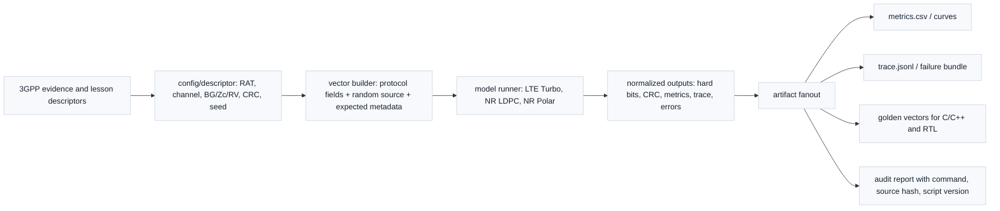
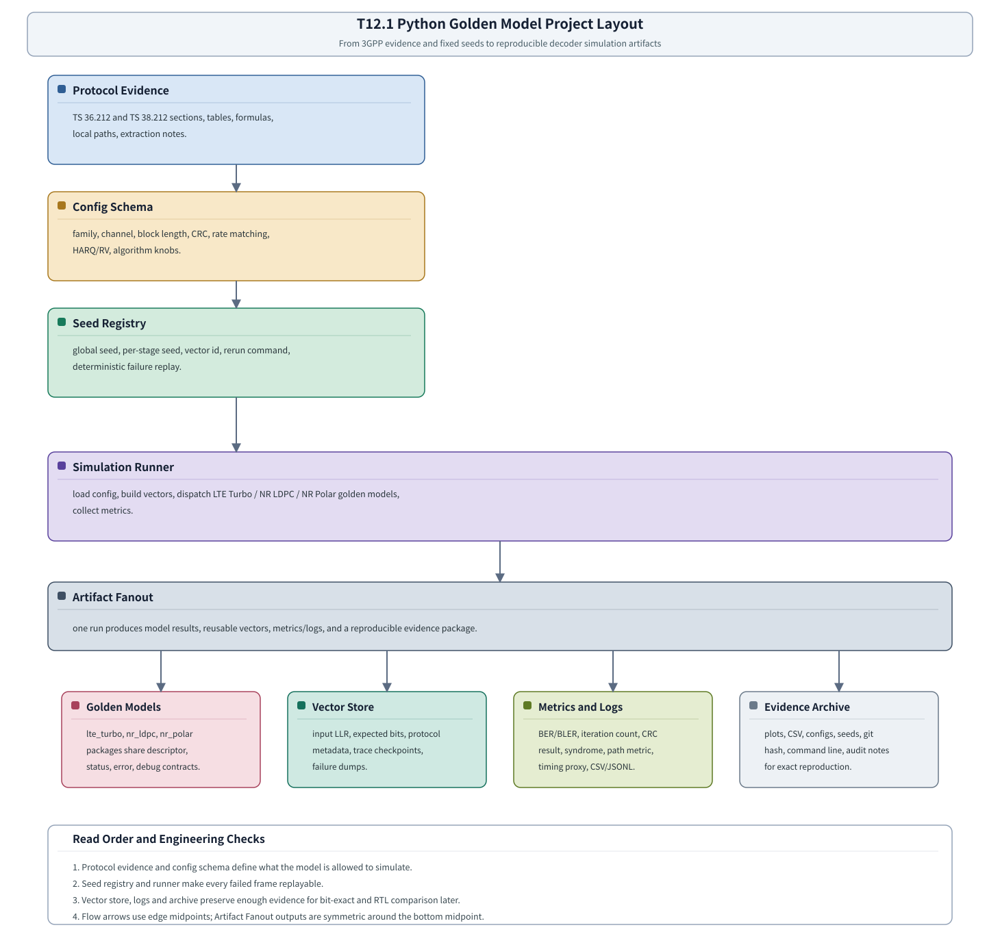

# T17.1 Python Golden Model 工程布局：让三类译码仿真可复现、可追踪、可回放
## 本节学习目标

本节进入 L3 工程实现阶段。前面的 L1/L2 讲义已经把LTE Turbo、NR LDPC、NR Polar的数学对象、协议链路、速率恢复、混合自动重传请求软缓存、接口契约和边界案例逐步讲清楚；从这一节开始，目标变成把这些知识组织成一个可执行、可复现、可审计的 golden model 工程。

Golden model 中文常译为“黄金参考模型”。它不是因为代码一定完美，而是因为后续 C/C++ 定点模型、寄存器传输级实现、专用集成电路验证和回归系统都要拿它当参考。若 golden model 自身目录混乱、随机种子不可追踪、协议参数来源不清、失败帧无法重跑，那么后续所有位精确（bit-exact）对比都会变成猜测。

本节不实现真实 LTE Turbo、NR LDPC 或 NR Polar 译码算法，而是规定工程布局。

- LTE Turbo、NR LDPC、NR Polar 的 Python 参考模型应如何分包，哪些字段共用，哪些字段由算法私有扩展承接。
- 配置文件、向量文件、随机种子、日志、曲线和失败 dump 应该放在哪里。
- 一个失败帧如何从 `run_id`、`seed`、`vector_id` 和协议描述符（descriptor）精确回放。
- 3GPP 协议证据怎样进入仿真工程，但不把工程目录名误写成协议规定。
- 后续 [[T17.2_LTE_Turbo_float_sim_plan|T17.2]]-[[T17.5_BER_BLER_curve_reporting|T17.5]]、T13、T14、T15 如何复用同一套 schema、日志和证据归档。

如果只记住一句话：golden model 工程的核心不是“写一个 decode 函数”，而是让每一次译码实验都有可复现输入、可解释协议身份、可回放随机性、可对比输出和可归档证据。

## 前置知识检查

| 前置项 | 本节需要达到的程度 |
|:---|:---|
| [[T4.6_decoder_interface_contracts|T4.6]] 译码器接口契约 | 知道 descriptor、input、output、status、error、debug 六类对象，以及对数似然比符号、传输块/码块、HARQ process ID、冗余版本（Redundancy Version, RV）和 soft buffer key 的作用。 |
| [[T5.5_decoder_hardware_verification_mindset|T5.5]] 验证思维 | 知道 golden model、bit-exact、边界案例、回归、波形/日志定位的基本关系。 |
| [[T4.5_decoder_performance_metrics|T4.5]] 性能指标 | 知道BER、块错误率、FER、迭代次数、延迟代理和统计停止条件不是 3GPP 强制门限，而是工程评估对象。 |
| T6-T11 协议课 | 知道 LTE Turbo、NR LDPC、NR Polar 的协议链路、输入输出和典型失败字段各不相同。 |
| Python 基础 | 会读目录树、JSON/YAML 风格配置、CSV/JSONL 日志和命令行参数。 |

本节不是 Python 包管理教程，也不要求现在真的写完三类译码器。它只定义工程结构和证据链，以便后续每个仿真任务落到同一个规范里。

## Roadmap 卡片原文与本节执行范围

| 项目 | 内容 |
|:---|:---|
| 编号 | T17.1 |
| 前置 | T4.6, T5.5 |
| Prompt | 请规定 LTE Turbo、NR LDPC、NR Polar Python golden model 的工程布局，包括包结构、配置文件、向量文件、随机种子、日志和可复现命令示例。 |
| 产出 | `docs/L3_工程实现/T17.1_python_golden_model_project_layout.md` |
| 验收 | Learner can scaffold a reproducible decoder simulation project. |
| 3GPP/证据 | 工程任务；protocol vector generation later cites TS 36.212 Rel-19 `36212-j30` / TS 38.212 Rel-19 `38212-j30`。本地证据路径：`3GPP_Rel19/processed/TS_36.212_36212-j30`、`3GPP_Rel19/processed/TS_38.212_38212-j30`。 |

本节的执行范围是“工程布局规范”。因此协议依据用于说明向量来源和参数回链，不在本节重新复现 TS 36.212/38.212 的编码、速率匹配或循环冗余校验公式。具体 LTE Turbo 浮点仿真由 [[T17.2_LTE_Turbo_float_sim_plan|T17.2]] 承接，NR LDPC 由 [[T17.3_NR_LDPC_float_sim_plan|T17.3]] 承接，NR Polar 由 [[T17.4_NR_Polar_float_sim_plan|T17.4]] 承接，BER/BLER 曲线由 [[T17.5_BER_BLER_curve_reporting|T17.5]] 承接。

## 资料与协议边界

Golden model 工程本身不是 3GPP 规范内容。3GPP 不会规定 Python 包名、配置文件名、日志字段名或随机种子格式。协议规定的是被仿真的对象：CRC、分段、编码结构、速率匹配、RV、控制/数据信道处理链路和相关参数来源。

| 协议证据 | 本地路径 | 对 golden model 的作用 | 本节边界 |
|:---|:---|:---|:---|
| TS 36.212 Rel-19 `36212-j30` §5.1.1 | `3GPP_Rel19/processed/TS_36.212_36212-j30/content.md`，`sections.jsonl` | LTE CRC calculation 是 LTE Turbo 向量 pass/fail 的协议来源之一。 | 本节只登记向量来源，不重写 CRC 多项式。 |
| TS 36.212 Rel-19 `36212-j30` §5.1.2、§5.1.3.2、§5.1.4.1 | `3GPP_Rel19/processed/TS_36.212_36212-j30/content.md`，`sections.jsonl` | LTE CB segmentation、Turbo coding、rate matching/RV 是 [[T17.2_LTE_Turbo_float_sim_plan|T17.2]] 向量字段来源。 | 具体地址、交织和 RV 恢复由 [[T17.2_LTE_Turbo_float_sim_plan|T17.2]] 使用。 |
| TS 38.212 Rel-19 `38212-j30` §5.1、§5.2.2、§5.3.2、§5.4.2 | `3GPP_Rel19/processed/TS_38.212_38212-j30/content.md`，`sections.jsonl` | NR LDPC CRC、segmentation、base graph/lifting、rate matching 是 [[T17.3_NR_LDPC_float_sim_plan|T17.3]] 向量字段来源。 | CRC 多项式复现见上游讲义；具体 BG/Zc/k0 查表由 [[T17.3_NR_LDPC_float_sim_plan|T17.3]]/T8/T9 回链。 |
| TS 38.212 Rel-19 `38212-j30` §5.1、§5.2.1、§5.3.1、§5.4.1、§6.3、§7.3 | `3GPP_Rel19/processed/TS_38.212_38212-j30/content.md`，`sections.jsonl` | NR Polar CRC、CRC/RNTI、segmentation、encoding、rate matching、上行控制信息/下行控制信息控制信息链路是 [[T17.4_NR_Polar_float_sim_plan|T17.4]] 向量字段来源。 | reliability sequence 和 rate recovery 已由 [[T10.3_NR_Polar_reliability_sequence|T10.3]]/[[T10.7_NR_Polar_rate_recovery|T10.7]] 承接；UCI/DCI 精确 CRC/RNTI 字段由 [[T17.4_NR_Polar_float_sim_plan|T17.4]] 使用时关闭。 |
| TS 38.214 Rel-19 `38214-j30` §5.1.3、§6.1.4 | `3GPP_Rel19/processed/TS_38.214_38214-j30/content.md`，`sections.jsonl` | 调制与编码方案/传输块大小/RV 可作为系统级参数来源。 | 具体 MCS/TBS 表值保留 L3/system bit-exact 条件项，按实际使用范围复现。 |

协议前因后果要写入每个 vector 的 metadata。一个仿真向量不能只写 `N=1024, K=512`，还应说明这些参数来自哪条链路、哪个 code family、哪个 TS 章节、哪个本地表或哪一节讲义已重建。

本节的协议证据粒度按“工程布局任务”处理：能直接闭环到本节 schema 的内容写成章节级来源和本地路径；涉及具体表、图或公式的 bit-exact 数值，不在本节重复复现，而是回链到已重建讲义或后续 [[T17.2_LTE_Turbo_float_sim_plan|T17.2]]-[[T17.4_NR_Polar_float_sim_plan|T17.4]]。具体边界如下：

| 证据对象 | 本节是否闭环 | 精细锚点或关闭条件 |
|:---|:---|:---|
| LTE Turbo 合法 $K/f_1/f_2$ | 不在本节重复闭环 | 已由 [[T3.3_LTE_Turbo_segmentation_rules|T3.3]]/[[T6.4_LTE_Turbo_internal_interleaver|T6.4]] 使用 TS 36.212 Table 5.1.3-3 的 `table_0009.csv/html` 和正文表格闭环；[[T17.2_LTE_Turbo_float_sim_plan|T17.2]] 使用时回链。 |
| LTE Turbo 编码器结构 | 不在本节重复闭环 | 已由 [[T6.3_LTE_Turbo_encoder_trellis_termination|T6.3]] 正文复现 TS 36.212 Figure 5.1.3-2 的 PCCC、内部交织器和终止路径；[[T17.2_LTE_Turbo_float_sim_plan|T17.2]] 使用时回链。 |
| LTE sub-block interleaver | 不在本节重复闭环 | 已由 [[T7.2_LTE_subblock_deinterleaver_circular_buffer|T7.2]]/[[T11.2_LTE_NR_rate_matching_comparison|T11.2]] 复现 TS 36.212 Table 5.1.4-1 的 `table_0010.csv/html`。 |
| NR LDPC BG/Zc 和 rate matching 表 | 本节只登记来源 | [[T17.3_NR_LDPC_float_sim_plan|T17.3]] 使用具体数值时必须回链 T8/T9 已重建资产或在 [[T17.3_NR_LDPC_float_sim_plan|T17.3]] 重新列出表/图/公式证据。 |
| NR Polar reliability/rate matching 表 | 本节只登记来源 | [[T17.4_NR_Polar_float_sim_plan|T17.4]] 使用具体数值时必须回链 T10 已重建资产或在 [[T17.4_NR_Polar_float_sim_plan|T17.4]] 重新列出表/图/公式证据。 |
| TS 38.214 MCS/TBS 表 | 本节不闭环 | 保留 L3/system bit-exact 条件项；实际使用时定位具体章节、表格、抽取文件并复现使用子集。 |

## 工程布局的必要性

通信仿真最容易从一个临时脚本开始：

```text
python3 turbo_test.py
```

刚开始这很快，但一旦进入三类译码器、多种 SNR、多种码率、多种 RV、多种算法开关和随机失败帧，散装脚本会暴露四个问题。

| 问题 | 典型表现 | 后续后果 |
|:---|:---|:---|
| 参数不可追踪 | 只知道某次 BLER 异常，但不知道当时 BG、Zc、RV、CRC、seed 是什么。 | 无法复现失败帧，无法判断是协议地址错、算法错还是随机波动。 |
| 随机性不可回放 | 使用全局随机数，未记录 stage seed。 | 同一命令第二天跑不出同一个失败。 |
| 输出不可比对 | LTE Turbo 输出字段和 NR Polar 输出字段完全不同，没有公共 status/error/debug。 | C/C++ 和 RTL scoreboard 需要为每类模型重写大量胶水代码。 |
| 证据不可审计 | 日志里没有协议来源、本地路径、脚本版本和命令行。 | 无法证明仿真符合哪一版 3GPP 资料。 |

因此 T17.1 要先定义工程布局。这个布局不是为了好看，而是为了让失败可以复现、结果可以比较、证据可以归档、后续 RTL 可以接同一套向量。

## 总体工程流转图

下图展示本节建议的 golden model 工程流转。




| 内容 | 说明 |
|:---|:---|
| 输入证据 | 3GPP source、lesson descriptor、协议表 hash、命令行和随机种子一起进入工程配置，不允许只保存图表或口头说明。 |
| config/descriptor | 记录 RAT/channel、码型、BG/Zc/RV、CRC、TBS/CB 信息、噪声参数、seed 和协议来源。 |
| vector builder | 从 descriptor 生成可回放输入向量，附带 expected metadata，避免失败帧无法复现。 |
| model runner | 同一工程入口调度 LTE Turbo、NR LDPC、NR Polar 浮点模型，保持统一输入/输出接口。 |
| normalized outputs | 输出 hard bits、CRC、BLER/BER metrics、decoder trace、first mismatch、error code 和 replay command。 |
| artifact fanout | 同一 run 产出 metrics、trace/failure bundle、golden vectors 和审计报告，服务后续 C/C++/RTL scoreboard。 |
| 审计边界 | 报告必须包含 source hash、script version、command、seed 和未运行项，不能把模板当实测证据。 |
## 建议目录结构

建议在未来工程实现时使用如下目录。这里写成 `sim/`，表示仿真工程根目录；本节不强制当前仓库立即创建完整代码树。

```text
sim/
  pyproject.toml
  README.md
  configs/
    lte_turbo/
      awgn_bler_smoke.yaml
      harq_rv_replay.yaml
    nr_ldpc/
      bg1_nms_smoke.yaml
      bg2_oms_edge.yaml
    nr_polar/
      dci_ca_scl_smoke.yaml
      uci_short_payload.yaml
  src/decoder_golden/
    common/
      descriptor.py
      schema.py
      seeds.py
      logging.py
      metrics.py
      vectors.py
      evidence.py
    lte_turbo/
      encoder_ref.py
      rate_recovery_ref.py
      decoder_float.py
      crc_ref.py
    nr_ldpc/
      bg_select_ref.py
      rate_recovery_ref.py
      decoder_float.py
      crc_ref.py
    nr_polar/
      reliability_ref.py
      rate_recovery_ref.py
      sc_scl_float.py
      crc_rnti_ref.py
  vectors/
    protocol/
    toy/
    random/
    regression/
  runs/
    2026-06-20T000000Z_lte_turbo_smoke/
      config.resolved.yaml
      command.txt
      seeds.json
      metrics.csv
      frames.jsonl
      failures/
      plots/
      evidence.md
  tests/
    test_schema.py
    test_seed_replay.py
    test_vector_roundtrip.py
```

这个目录按”稳定公共层”和”三类算法私有层”分开。下表涉及的算法缩写此前已在 L1/L2 专题中展开，本节统一列出中文对应：基图（Base Graph, BG）、提升值（lifting size, Zc）、置信传播（Belief Propagation, BP）/ 最小和（Min-Sum, MS）/ 归一化最小和（Normalized Min-Sum, NMS）/ 偏移最小和（Offset Min-Sum, OMS）、串行抵消（Successive Cancellation, SC）/ 串行抵消列表（Successive Cancellation List, SCL）/ CRC 辅助串行抵消列表（CRC-Aided SCL, CA-SCL）、对数最大后验概率（Log-MAP）/ 最大对数最大后验概率（Max-Log-MAP）、递归系统卷积码（Recursive Systematic Convolutional, RSC）、网格图（trellis）、校验子（syndrome）。

| 层级 | 内容 | 设计原因 |
|:---|:---|:---|
| `common/` | descriptor、schema、seed、logging、metrics、vectors、evidence。 | 让 LTE Turbo、NR LDPC、NR Polar 共用输入输出契约。 |
| `lte_turbo/` | LTE Turbo 编码、rate recovery、浮点译码、CRC。 | 承接 TS 36.212 和 T6/T7 的协议链路。 |
| `nr_ldpc/` | BG/Zc、rate recovery、BP/MS/NMS/OMS、CRC。 | 承接 TS 38.212 和 T8/T9 的协议链路。 |
| `nr_polar/` | reliability sequence、rate recovery、SC/SCL/CA-SCL、CRC/RNTI。 | 承接 TS 38.212 和 T10 的控制信息链路。 |
| `vectors/` | protocol、toy、random、regression 四类向量。 | 区分教学小例子、协议驱动向量、随机性能向量和回归锁定向量。 |
| `runs/` | 每次运行的完整归档。 | 失败重跑和审计证据都从这里恢复。 |

目录名可以调整，但职责边界不应混乱。特别是 `common/descriptor.py` 不应该塞进 LDPC min-sum 的内部消息；`nr_ldpc/decoder_float.py` 也不应该自己解释 LTE `rvidx`。

## 公共 Descriptor Schema

[[T4.6_decoder_interface_contracts|T4.6]] 已经给出中立接口契约。T17.1 需要把它转成仿真配置 schema。最小公共 descriptor 可分成四类字段。

| 字段组 | 字段示例 | 用途 |
|:---|:---|:---|
| 协议身份 | `standard`、`release`、`ts_id`、`section_refs`、`channel`、`direction` | 说明这个向量要模拟哪条协议链路。 |
| 译码对象 | `code_family`、`tb_id`、`cb_index`、`cb_count`、`payload_bits`、`crc_type` | 确定当前译码对象和 pass/fail 层级。 |
| 速率恢复/HARQ | `rv`、`harq_process_id`、`new_data_indicator`、`rate_recovery_params`、`soft_buffer_key` | 保证不同重传、不同 CB、不同 RV 不混淆。 |
| 仿真控制 | `seed`、`snr_db`、`max_iterations`、`algorithm`、`llr_sign_convention`、`llr_width_float` | 控制随机样本、算法开关和输入软信息语义。 |

一个教学级 JSON 配置片段如下：

```json
{
  "run_name": "lte_turbo_awgn_smoke",
  "global_seed": 20260620,
  "code_family": "TURBO",
  "standard": "LTE",
  "release": "Rel-19",
  "protocol_refs": [
    {
      "ts": "36.212",
      "package": "36212-j30",
      "sections": ["5.1.1", "5.1.2", "5.1.3.2", "5.1.4.1"],
      "local_path": "3GPP_Rel19/processed/TS_36.212_36212-j30"
    }
  ],
  "channel": "DL-SCH",
  "tb_size_bits": 1024,
  "crc_type": "CRC24A",
  "rv_sequence": [0],
  "snr_db": [0.0, 0.5, 1.0],
  "max_iterations": 8,
  "llr_sign_convention": "POS_ZERO"
}
```

这段不是 3GPP 原文。它是把协议对象、算法参数和仿真控制放进同一个可审计配置里的工程格式。

## 向量文件格式

向量文件需要同时服务三类用途：教学复现、性能仿真和 bit-exact 回归。建议使用“元数据 + 二进制/数组 payload”的结构。

| 文件 | 内容 | 建议格式 |
|:---|:---|:---|
| `vector.json` | descriptor、协议来源、seed、长度、算法配置、期望输出摘要。 | JSON。 |
| `input_llr.npy` | 接收端输入 LLR，已经按本节约定的正号语义存储。 | NumPy `.npy` 或压缩数组。 |
| `expected_bits.npy` | 教学或协议向量的参考输出 bit。 | NumPy `.npy`。 |
| `trace.jsonl` | 每帧或每 CB 的中间状态。 | 每行一个 JSON 对象。 |
| `evidence.md` | 协议来源、生成命令、脚本版本和人工说明。 | Markdown。 |

对于随机 BLER 仿真，不一定每一帧都保存完整 LLR；但失败帧必须保存完整输入和 metadata。否则后续无法定位“某个 SNR 点有异常”的根因。

`vector.json` 不能只写自然语言说明，至少应有可机器检查的最小 schema。下面字段是后续 [[T17.2_LTE_Turbo_float_sim_plan|T17.2]]-[[T17.5_BER_BLER_curve_reporting|T17.5]] 的共同最低要求：

| 字段 | 类型或格式 | 必须性 | 说明 |
|:---|:---|:---|:---|
| `schema_version` | string，例如 `decoder-vector-v1` | 必须 | 防止后续字段扩展后旧向量被误读。 |
| `vector_id` | string | 必须 | 全局唯一向量名，建议含标准、码族、信道、长度、RV、seed 和 frame/CB 序号。 |
| `standard`、`release`、`code_family` | enum/string | 必须 | 例如 `LTE`、`Rel-19`、`TURBO`。 |
| `protocol_refs` | array | 必须 | 每项含 `ts`、`package`、`sections`、`local_path`、可选 `table_or_figure`。 |
| `dimensions` | object | 必须 | 至少含 `tb_bits`、`cb_count`、`cb_index`、`k_bits`、`e_bits`；Polar 控制块可用 `control_bits`。 |
| `ordering` | object | 必须 | 明确 `bit_order`、`llr_order`、`cb_order`、`tb_reassembly_order`，避免数组同形但语义相反。 |
| `arrays` | object | 必须 | 指向 `input_llr.npy`、`expected_bits.npy`、可选 `tx_bits.npy`；每个数组写 `dtype`、`shape`、`sha256`。 |
| `llr_sign_convention` | enum | 必须 | 例如 `POS_ZERO`，表示正 LLR 倾向比特 0。 |
| `seed_state` | object | 必须 | 写入全局 seed、stage seed 和 seed 派生算法。 |
| `expected_status` | object | 必须 | 至少含 `crc_pass`、`error_count` 或 `known_payload_hash`。 |

数组也必须有明确物理含义。`input_llr.npy` 建议使用 `float64` 作为浮点 golden reference 的默认保存类型，shape 为一维 `[E]` 或二维 `[C, E_max]`；若使用二维，必须用 mask 或 per-CB `e_bits` 区分 padding。`expected_bits.npy` 建议使用 `uint8`，取值只能为 0/1，shape 为 `[K]`、`[C, K_max]` 或控制信息 `[A]`。所有数组在 `vector.json` 中记录 `sha256`，这样失败 replay 能确认“读到的数组就是当时归档的数组”。

## 随机种子设计

只记录一个 `global_seed` 不够。仿真链路里通常至少有 payload 生成、噪声生成、fading 生成、HARQ 重传选择、边界注入几类随机过程。如果所有过程共享一个裸随机流，后续新增一个统计字段就可能改变全部随机序列。

建议使用分层 seed，但不能使用 Python 内置 `hash()`。Python 内置 `hash()` 受进程随机化影响，不适合跨机器、跨版本或跨天回放。可复现实验应固定 seed 派生算法：

$$
s_{\mathrm{stage}}=\mathrm{uint64\_le}\left(
\mathrm{SHA256}\left(\mathrm{canonical\_json}(s_{\mathrm{global}},\mathrm{run\_name},\mathrm{stage},\mathrm{frame\_id})\right)[0:8]\right)
\tag{1}
$$

式 (1) 中，$s_{\mathrm{global}}$ 是全局种子，`run_name` 是实验名，`stage` 可以是 `payload`、`noise`、`interleaver_test`、`edge_injection` 等，`frame_id` 是帧序号。`canonical_json` 表示字段名排序、UTF-8 编码、无多余空白、整数按十进制文本保存的规范化 JSON。`SHA256(...)[0:8]` 表示取摘要前 8 字节，`uint64_le` 表示按 little-endian 解释成无符号 64 bit 整数。生成的 `s_stage` 可作为 NumPy `PCG64` 的初始化 seed；若后续 C/C++ 模型需要 128 bit seed，则应明确写成 `uint128_le(SHA256(...)[0:16])`，不能隐式改变位宽。

这样做的好处是：增加一个新 stage 不会改变旧 stage 的随机序列；不同语言实现只要遵守同一 canonicalization、哈希函数、截断位宽和端序，就能得到同一个 stage seed。

建议 `seeds.json` 至少包含：

| 字段 | 示例 | 作用 |
|:---|:---|:---|
| `global_seed` | `20260620` | 实验级根种子。 |
| `run_name` | `nr_ldpc_bg1_nms_smoke` | 防止不同实验同 seed 冲突。 |
| `frame_id` | `137` | 失败帧定位。 |
| `payload_seed` | `...` | 重建 payload。 |
| `noise_seed` | `...` | 重建信道样本。 |
| `edge_seed` | `...` | 重建边界注入。 |
| `rng_algorithm` | `numpy_pcg64` | 防止随机数库变化造成不可复现。 |
| `seed_derivation_algorithm` | `canonical_json_sha256_u64le_v1` | 防止不同实现对 `hash(...)`、字符串拼接或端序理解不同。 |

## 日志字段

日志应区分 summary、frame trace 和 failure dump。

### Summary CSV

`metrics.csv` 面向曲线绘图和批量比较。

| 字段 | 含义 |
|:---|:---|
| `run_id` | 一次实验的唯一 ID。 |
| `family` | `TURBO`、`LDPC`、`POLAR`。 |
| `standard` | `LTE` 或 `NR`。 |
| `snr_db` | 当前 SNR 或 $E_b/N_0$ 点。 |
| `frames` | 已仿真帧数。 |
| `error_blocks` | 错误 TB/CB/control block 数。 |
| `bler` | `error_blocks / frames`。 |
| `avg_iterations` | 平均迭代次数或路径搜索代理。 |
| `failures_saved` | 已保存完整 dump 的失败帧数量。 |

### Frame JSONL

`frames.jsonl` 面向失败定位，每行一个 frame 或 CB。

```json
{
  "run_id": "2026-06-20T000000Z_lte_turbo_smoke",
  "frame_id": 137,
  "vector_id": "lte_turbo_dl_sch_tb1024_rv0_seed20260620_f137",
  "code_family": "TURBO",
  "tb_id": 137,
  "cb_index": 0,
  "rv": 0,
  "snr_db": 1.0,
  "crc_pass": false,
  "iterations_used": 8,
  "stop_reason": "MAX_ITER",
  "failure_dump": "failures/frame_000137_cb000.json"
}
```

### Failure Dump

失败 dump 必须比 summary 更重。建议保存：

| 类别 | 字段 |
|:---|:---|
| 输入 | `input_llr_path`、`llr_sign_convention`、`rate_recovery_state`、`soft_buffer_key`。 |
| 期望 | `expected_bits_path`、`expected_crc`、`expected_status`。 |
| 实际 | `decoded_bits_path`、`crc_pass`、`syndrome_zero`、`selected_path`、`iterations_used`。 |
| 诊断 | `first_mismatch_bit`、`saturation_count`、`stop_reason`、`algorithm_state_hash`。 |
| 证据 | `protocol_refs`、`config_hash`、`git_commit`、`command_line`、`seed_state`。 |

## 可复现命令示例

本节不要求当前仓库已有这些命令；它规定后续工程应提供的命令形态。命令必须让用户看出：配置文件、seed、输出目录和失败重跑入口在哪里。

```bash
python3 -m decoder_golden.run \
  --config configs/lte_turbo/awgn_bler_smoke.yaml \
  --seed 20260620 \
  --snr-db 0.0:2.0:0.5 \
  --out runs/2026-06-20T000000Z_lte_turbo_smoke
```

失败帧重跑命令应能直接从归档恢复：

```bash
python3 -m decoder_golden.replay \
  --run-dir runs/2026-06-20T000000Z_lte_turbo_smoke \
  --frame-id 137 \
  --cb-index 0 \
  --dump-level full
```

为了避免“命令能跑但证据不完整”，runner 结束时至少检查这些文件存在：

```text
config.resolved.yaml
command.txt
seeds.json
metrics.csv
frames.jsonl
evidence.md
```

## 三类译码器的包结构差异

公共目录只解决共用问题，算法目录仍要保留差异。

| 包 | 必须包含 | 不应包含 |
|:---|:---|:---|
| `lte_turbo` | Turbo internal interleaver、RSC/trellis、Log-MAP/Max-Log-MAP、LTE rate recovery、LTE CRC。 | NR LDPC base graph、Polar reliability sequence。 |
| `nr_ldpc` | BG/Zc、QC-LDPC 扩展、BP/MS/NMS/OMS、LDPC rate recovery、syndrome/CRC。 | LTE Turbo trellis、Polar path metric sorter。 |
| `nr_polar` | Reliability sequence、frozen mask、SC/SCL/CA-SCL、Polar rate recovery、CRC/RNTI selector。 | LDPC layered schedule、Turbo alpha/beta。 |
| `common` | Descriptor、seed、logging、metrics、evidence、vector IO、fixed enums。 | 某一种算法的内部消息更新。 |

这种分层避免两个常见错误。第一，把所有算法都塞进一个 `decoder.py`，后续无法定位某个字段属于公共接口还是算法内部状态。第二，每个算法包都自定义日志和错误码，后续 bit-exact 回归需要写三套 scoreboard。

## 输入输出 Schema

建议所有模型入口统一为：

```python
def decode(desc: Descriptor, input_llr: LlrArray, context: DecodeContext) -> DecodeResult:
    ...
```

`DecodeResult` 至少包含：

| 字段 | LTE Turbo | NR LDPC | NR Polar |
|:---|:---|:---|:---|
| `decoded_bits` | CB payload 或 TB 重组输入。 | CB payload 或 TB 重组输入。 | UCI/DCI/control payload。 |
| `crc_pass` | CB/TB CRC。 | CB/TB CRC。 | CRC-aided 或 DCI/UCI CRC。 |
| `syndrome_zero` | 通常不适用。 | LDPC syndrome。 | 不适用。 |
| `iterations_used` | Turbo iteration。 | LDPC iteration。 | SC 可为 1，SCL 可记录路径阶段或节点访问代理。 |
| `stop_reason` | `CRC_PASS`、`MAX_ITER`。 | `SYNDROME_PASS`、`CRC_PASS`、`MAX_ITER`。 | `CRC_SELECTED`、`NO_VALID_PATH`、`LIST_EXHAUSTED`。 |
| `debug` | trellis/extrinsic 摘要。 | layer/syndrome/min1/min2 摘要。 | path metric/list/CRC selector 摘要。 |

输出字段不同，但外层 runner 不应该关心内部算法。runner 只读取统一 status、error、debug 字段，再把算法私有 debug 放进 `family_debug`。

## 失败重跑规则

失败重跑是 golden model 工程的生命线。建议规则如下：

1. 所有失败帧必须有 `vector_id`，且 `vector_id` 能唯一定位 `run_id + frame_id + cb_index/control_id + rv + seed`。
2. 如果失败帧来自随机仿真，必须保存 payload、LLR 和协议 descriptor，不能只保存 seed。
3. 如果失败帧来自协议表驱动向量，必须保存表名、表版本、本地路径和表项索引。
4. Replay 命令不得重新随机生成关键输入；它只能读取归档并复算。
5. Replay 输出应包含 `first_mismatch`、`status_diff` 和 `debug_diff` 三类对比。

一个最小 replay 对比表：

| 对比项 | 通过标准 |
|:---|:---|
| Config hash | 与原 run 完全一致，除非明确使用 override。 |
| Seed state | 与 `seeds.json` 一致。 |
| Input LLR hash | 与归档一致。 |
| Decoded bits hash | 与原失败记录一致。 |
| Status/error/debug | 与原失败记录一致，或差异被记录为非确定性 bug。 |

## 小型工程例子：一次失败帧的证据链

假设某次 LTE Turbo smoke test 的第 137 帧失败。散装脚本可能只输出：

```text
frame=137 crc_fail
```

这对工程定位几乎不够。按本节布局，同一个失败应形成下列证据链：

| 字段 | 示例 | 作用 |
|:---|:---|:---|
| `run_id` | `2026-06-20T000000Z_lte_turbo_smoke` | 找到完整运行目录。 |
| `vector_id` | `lte_turbo_dl_sch_tb1024_rv0_seed20260620_f137_cb0` | 唯一定位标准、信道、TB 长度、RV、seed、帧和 CB。 |
| `protocol_refs` | TS 36.212 `36212-j30` §5.1.1/§5.1.2/§5.1.3.2/§5.1.4.1 | 说明 CRC、CB、Turbo 和 rate matching 的来源。 |
| `input_llr_hash` | `sha256:...` | 确认重跑时 LLR 输入未变。 |
| `seed_state` | `global=20260620, payload=..., noise=...` | 确认随机过程可回放。 |
| `status` | `crc_pass=false, stop_reason=MAX_ITER, iterations=8` | 说明失败不是文件丢失，而是译码未通过。 |
| `replay_command` | `python3 -m decoder_golden.replay --run-dir ... --frame-id 137 --cb-index 0` | 直接复现失败。 |

这个小型例子说明：失败帧的“证据”不是一句错误日志，而是一组能把协议身份、随机性、输入数组、输出状态和重跑命令连接起来的字段。

## 结果归档与命名规则

推荐 `run_id` 格式：

```text
YYYY-MM-DDThhmmssZ_family_channel_case_seed
```

例如：

```text
2026-06-20T000000Z_nr_ldpc_pdsch_bg1_rv0_seed20260620
```

输出目录必须自包含。不要把关键配置只放在开发者本地 shell history 中。建议每个 run 目录都保存：

| 文件 | 必需 | 说明 |
|:---|:---:|:---|
| `config.resolved.yaml` | 是 | 合并默认值后的最终配置。 |
| `command.txt` | 是 | 完整命令行。 |
| `seeds.json` | 是 | 全局和分阶段 seed。 |
| `metrics.csv` | 是 | 曲线和统计摘要。 |
| `frames.jsonl` | 是 | 每帧/每 CB 状态。 |
| `failures/` | 条件必需 | 至少保存前若干失败帧的完整 dump。 |
| `plots/` | 曲线任务必需 | BER/BLER PNG/PDF。 |
| `evidence.md` | 是 | 协议路径、脚本版本、审计记录和已知限制。 |

## 浮点仿真方案

T17.1 的浮点仿真不是某个具体算法，而是 runner 和 schema 的 smoke test。建议最小 smoke test 使用 toy decoder：

| 测试 | 输入 | 期望 |
|:---|:---|:---|
| Schema load | 一个 LTE Turbo toy config。 | 能生成 resolved config 和 descriptor。 |
| Seed replay | 同一 config 跑两次。 | payload/noise seed 和 toy output hash 相同。 |
| Family dispatch | `TURBO`、`LDPC`、`POLAR` 三个 toy family。 | 输出统一 `DecodeResult` 字段。 |
| Failure dump | 人工注入 CRC fail。 | 生成 failure JSON、LLR hash、first mismatch 和 replay 命令。 |

后续 [[T17.2_LTE_Turbo_float_sim_plan|T17.2]]-[[T17.4_NR_Polar_float_sim_plan|T17.4]] 会把 toy decoder 替换成真实浮点算法。

## 定点化与 Bit-Exact 承接

虽然 T17.1 是浮点仿真布局，但它必须提前服务 T13 的定点模型。

| 设计项 | 对 T13 的影响 |
|:---|:---|
| `llr_sign_convention` | 定点 LLR 正负号必须与浮点一致。 |
| `llr_scale_hint` | 记录浮点到定点的候选缩放因子。 |
| `saturation_policy` | 后续定点模型需要知道是否饱和、如何计数。 |
| `trace_checkpoints` | C/C++ 和 RTL 对比时按 checkpoint 定位第一处差异。 |
| `vector_schema_version` | 防止旧向量被新模型错误解释。 |

建议从 T12 开始就在 vector metadata 中预留：

```json
{
  "quantization": {
    "llr_width": null,
    "internal_width": null,
    "rounding": "not_applicable_float",
    "saturation": "not_applicable_float"
  }
}
```

这样 T13 可以在不改 vector 主结构的情况下填入定点参数。

## RTL/ASIC 验证承接

T14/T15 会把 Python 输出变成 RTL scoreboard 的输入。为了避免后期重做，T17.1 应提前定义 RTL 需要的证据字段。

| RTL/ASIC 需要的字段 | T17.1 应如何保存 |
|:---|:---|
| Descriptor bit fields | 保存 JSON 字段和 packed bitfield 预览。 |
| Input LLR stream | 保存顺序、位宽、lane、`last`、可选 position。 |
| Output bits | 保存 payload bits、CRC 是否移除、filler 是否移除。 |
| Status/error | 保存 `crc_pass`、`iterations_used`、`stop_reason`、`error_code`。 |
| Debug | 保存 `soft_buffer_key`、`rv`、`first_mismatch`、`saturation_count`、`candidate_id`。 |
| Timing proxy | 保存迭代次数、节点访问数、路径扩展数或 layer count。 |

这不代表 Python 要模拟每个 RTL 周期。它只保证后续 RTL 输出可以和 Python 在同一对象层级上对齐。

## 验证方法

| 验证层级 | 检查内容 | 通过标准 |
|:---|:---|:---|
| 静态 schema | 配置字段、枚举、路径、默认值。 | 缺字段、非法 family、非法 CRC 类型必须报错。 |
| Seed replay | 同一 config、同一 seed 重跑。 | payload hash、noise hash、status hash 一致。 |
| Vector roundtrip | vector 写入再读取。 | descriptor、LLR hash、expected bits hash 不变。 |
| Family dispatch | 三类 toy model。 | 输出统一 `DecodeResult`，family debug 不污染公共字段。 |
| Failure dump | 人工注入失败。 | replay 命令可重放同一失败。 |
| Evidence archive | 每个 run 目录。 | `config.resolved.yaml`、`command.txt`、`seeds.json`、`metrics.csv`、`frames.jsonl`、`evidence.md` 齐全。 |

建议后续工程命令形态：

```bash
python3 -m pytest tests/test_schema.py tests/test_seed_replay.py tests/test_vector_roundtrip.py -q
python3 -m decoder_golden.run --config configs/nr_polar/dci_ca_scl_smoke.yaml --seed 20260620 --out runs/smoke
python3 -m decoder_golden.replay --run-dir runs/smoke --frame-id 0 --dump-level full
```

本节没有创建这些测试文件和 Python 包；命令是后续 T12 工程实现的验收模板。

## 常见错误

| 错误 | 表现 | 修复原则 |
|:---|:---|:---|
| 只保存 BLER，不保存失败帧 | 曲线异常无法定位。 | 至少保存前 N 个失败帧的完整 dump。 |
| seed 只写在命令行，不落盘 | 运行目录无法独立复现。 | 每个 run 保存 `seeds.json` 和 `command.txt`。 |
| 三类译码器各自定义 status | 后续 scoreboard 复杂且容易漏字段。 | 公共 `DecodeResult` 固定字段，私有信息放 `family_debug`。 |
| 协议参数无来源 | 不知道某个 `K/Zc/RV` 来自哪里。 | metadata 写 TS、章节、本地路径、表项或上游讲义。 |
| replay 重新随机生成输入 | 失败不稳定，无法定位。 | replay 只能读取归档输入和 seed state。 |
| config 默认值不保存 | 后续版本默认值变化导致结果变。 | 保存 resolved config。 |
| 目录按临时实验命名 | 多人协作时无法检索。 | 使用稳定 `run_id` 和 family/channel/case/seed 命名规则。 |

## 自测题

1. 为什么 golden model 的输出不能只保存 `decoded_bits`？
2. 为什么同一个全局 seed 不足以保证长期可复现？
3. 为什么 LTE Turbo、NR LDPC、NR Polar 应共用 descriptor/status/error/debug 外层字段？
4. 一个失败帧若没有保存 LLR，只保存了 seed，可能出现什么复现风险？
5. 为什么配置文件必须保存 resolved config，而不是只保存用户写的 override？
6. T17.1 为什么要记录 3GPP 本地路径，即使本节不复现协议公式？

## 自测题参考答案

1. `decoded_bits` 只能说明输出内容，不能说明 CRC 层级、迭代次数、停止原因、错误码、HARQ soft buffer key 和协议身份。后续 C/C++/RTL 对比需要这些状态字段定位差异。
2. 随机流程有多个 stage。只用全局 seed 时，新增一个随机调用可能改变后续所有随机数。分阶段 seed 能让 payload、noise、edge injection 等过程互不干扰。
3. 三类译码器算法不同，但接收机系统需要统一调度、统一记录、统一回归和统一 scoreboard。公共字段固定，算法差异放进 `family_debug`，可以减少后续接口胶水。
4. seed 只能复现随机生成过程的前提是代码、库版本、随机算法和调用顺序完全不变。保存 LLR 可以绕开这些变化，直接复现译码输入。
5. 默认值会随代码版本变化。resolved config 固化了当次运行实际使用的全部参数，后续回放不会被新默认值污染。
6. Golden model 的参数必须能追溯到协议来源。即使本节只定义工程布局，后续向量生成和审计仍需要知道每个参数来自哪个 TS、章节、本地表或上游讲义。

## 本节验收

| 验收项 | 通过标准 |
|:---|:---|
| 工程布局 | 能画出或写出 `common/`、`lte_turbo/`、`nr_ldpc/`、`nr_polar/`、`vectors/`、`runs/` 的职责。 |
| Schema | 能说明公共 descriptor、vector metadata、status/error/debug 的最小字段。 |
| Seed/replay | 能解释分阶段 seed 和失败帧 replay 的必要性。 |
| 协议证据 | 能列出 TS 36.212/38.212 本地路径，以及本节只登记来源、不重建公式的边界。 |
| 后续承接 | 能说明 [[T17.2_LTE_Turbo_float_sim_plan|T17.2]]-[[T17.5_BER_BLER_curve_reporting|T17.5]]、T13、T14、T15 如何复用本节目录、向量和日志。 |

## 协议证据表

| 证据项 | TS 与 Rel-19 包 | 本地路径 | 边界 |
| :--- | :--- | :--- | :--- |
| LTE CRC/segmentation/Turbo/rate matching | TS 36.212 Rel-19 `36212-j30` | `3GPP_Rel19/processed/TS_36.212_36212-j30/` | 不在本节复现公式、表格或图。 |
| NR LDPC CRC/segmentation/coding/rate matching | TS 38.212 Rel-19 `38212-j30` | `3GPP_Rel19/processed/TS_38.212_38212-j30/` | CRC 多项式复现见上游讲义；具体 BG/Zc/k0 查表由 [[T17.3_NR_LDPC_float_sim_plan|T17.3]] 和上游 T8/T9 承接。 |
| NR Polar CRC/CRC-RNTI/segmentation/coding/rate matching | TS 38.212 Rel-19 `38212-j30` | `3GPP_Rel19/processed/TS_38.212_38212-j30/` | reliability sequence/rate recovery 由 [[T10.3_NR_Polar_reliability_sequence|T10.3]]/[[T10.7_NR_Polar_rate_recovery|T10.7]] 承接；UCI/DCI CRC/RNTI 字段由 [[T17.4_NR_Polar_float_sim_plan|T17.4]] 使用时精确闭环。 |
| NR MCS/TBS/RV 背景 | TS 38.214 Rel-19 `38214-j30` | `3GPP_Rel19/processed/TS_38.214_38214-j30/` | 具体 MCS/TBS 表值仍为 L3/system bit-exact 条件项。 |

## 图示


## 执行与证据记录

| 项目 | 记录 |
|:---|:---|
| 工作区 | `/home/yys/ClaudeCode/3gpp` |
| 写入文件 | `docs/L3_工程实现/T17.1_python_golden_model_project_layout.md` |
| 新增证据资产 | `docs/L3_工程实现/assets/T17.1_golden_model_project_layout.svg`（手绘 SVG，替代原 PIL 渲染 PNG 及 `tools/figures/render_t12_1_golden_model_layout.py`）。 |
| Roadmap 卡片 | 已读取 `2026-06-19-lte-nr-decoding-learning-roadmap.md` 中 T17.1。 |
| 台账依据 | 已读取 `docs/audits/lte_nr_decoding_remaining_work_register.md` 阶段 11 与 T17.1 条目。 |
| 前置依据 | 已读取 `docs/L1_基础/T4.6_decoder_interface_contracts.md`，复用 descriptor/status/error/debug、LLR 符号、HARQ/RV/soft buffer key 口径。 |
| 协议资料 | 本节登记 TS 36.212 `36212-j30`、TS 38.212 `38212-j30`、TS 38.214 `38214-j30` 本地路径；不新增协议表/图/公式复现。 |
| 脚手架验证 | 本节未在仓库内创建长期 `sim/` 包，避免把规划性目录误当成已实现工程；已对正文目录树做只读 scaffold 验收，确认包含 `configs/`、`src/decoder_golden/common/`、`src/decoder_golden/lte_turbo/`、`src/decoder_golden/nr_ldpc/`、`src/decoder_golden/nr_polar/`、`vectors/`、`runs/`、`tests/`，并补充 `vector.json` schema、seed 算法、run/replay 命令和 runner 文件检查清单作为可执行工程创建模板。 |
| Scaffold 验证口径 | 本节不创建真实长期 `sim/` Python 包，但正文已给出目录树、配置字段、向量文件 schema、seed 派生算法、日志字段、失败重跑命令形态和 runner 结束检查清单；这些内容构成本节 scaffold 验收模板。 |
| 未执行内容 | 未运行真实 BLER 仿真、未生成真实 protocol vectors；具体可执行工程由 [[T17.2_LTE_Turbo_float_sim_plan|T17.2]]-[[T17.5_BER_BLER_curve_reporting|T17.5]] 按本节 schema 承接。 |
| 审核修复 | 根据只读审核反馈补充 `vector.json` 最小 schema、数组 dtype/shape/hash、禁止 Python 内置 `hash()` 的 seed 派生算法、`seed_derivation_algorithm` 字段、NR LDPC/Polar CRC 协议回链和 scaffold 验证口径。 |
| 审计结果 | `python3 tools/audit_lesson_terms.py docs/L3_工程实现/T17.1_python_golden_model_project_layout.md`：`LESSON_TERM_AUDIT_OK`。 |
| 审计结果 | `python3 tools/audit_markdown_headings.py docs/L3_工程实现/T17.1_python_golden_model_project_layout.md`：`MARKDOWN_HEADING_AUDIT_OK`。 |
| 审计结果 | `python3 tools/audit_lesson_depth.py --strict docs/L3_工程实现/T17.1_python_golden_model_project_layout.md`：`LESSON_DEPTH_AUDIT_OK`。 |
| 审计结果 | `python3 tools/audit_latex_render.py docs/L3_工程实现/T17.1_python_golden_model_project_layout.md`：`LATEX_RENDER_AUDIT_OK formulas=4`。 |
| 引用重建审计 | `python3 tools/audit_reference_rebuilds.py docs/L3_工程实现/T17.1_python_golden_model_project_layout.md` 返回 `REFERENCE_REBUILD_AUDIT_CANDIDATES`，退出码为 0；候选为本节明确声明不重建的协议公式边界和协议来源登记，不构成失败。 |

## 参考文献

- [3GPP, 2026a] 3GPP TS 36.212 Rel-19 `36212-j30`, E-UTRA Multiplexing and channel coding. 本地路径：`3GPP_Rel19/processed/TS_36.212_36212-j30/`。
- [3GPP, 2026b] 3GPP TS 38.212 Rel-19 `38212-j30`, NR Multiplexing and channel coding. 本地路径：`3GPP_Rel19/processed/TS_38.212_38212-j30/`。
- [3GPP, 2026c] 3GPP TS 38.214 Rel-19 `38214-j30`, NR Physical layer procedures for data. 本地路径：`3GPP_Rel19/processed/TS_38.214_38214-j30/`。
- [Python Software Foundation, 2026] Python documentation, packaging and command-line execution background. 本节只使用通用工程组织思想，不引用具体 Python 文档内容作为协议证据。
