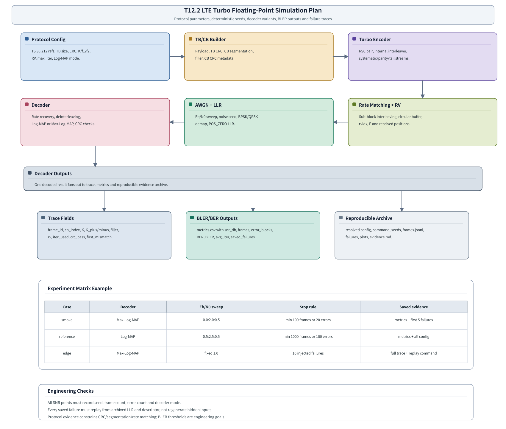

# T17.2 LTE Turbo 浮点仿真计划：从协议比特链路到可复现 BLER 曲线
## 本节学习目标

本节进入LTE Turbo的浮点仿真规划。这里的“浮点”表示对数似然比、信道噪声、Log-MAP/Max-Log-MAP 递推和外信息交换都先用 `float64` 或同等级浮点数表达，目标是建立算法正确性和协议位序的黄金参考，而不是立即考虑位宽、饱和和硬件吞吐。

本节学习目标：

- 用3GPP TS 36.212 的循环冗余校验、码块分段、Turbo 编码、速率匹配和冗余版本（Redundancy Version, RV）规则生成参考链路。
- 定义加性白高斯噪声信道、二进制相移键控或正交相移键控软解调和 LLR 符号约定。
- 说明解速率匹配、混合自动重传请求软合并、Log-MAP/Max-Log-MAP 译码、码块CRC 和TB CRC 如何组成接收端仿真链路。
- 设计信噪比扫描、随机种子、最小帧数、错误块停止条件、输出文件、失败 trace 和曲线阈值。
- 区分协议约束与工程验收：TS 36.212 规定比特处理和 CRC 语义，但不规定某条块错误率曲线必须达到哪个门限。

本节的核心不是只写一个 `simulate.py`，而是把“每一个误块为什么发生、是否能重跑、对应哪条协议规则、输出是否可被后续定点、寄存器传输级和专用集成电路使用”都规划清楚。

## 前置知识检查

| 前置项 | 本节需要达到的程度 |
|:---|:---|
| T6.7 Turbo 迭代 | 知道两个软输入软输出（Soft-Input Soft-Output, SISO）译码器交换外信息，最大迭代次数影响最坏延迟，CRC 早停是接收端实现策略。 |
| T7.4 LTE 码块重组与 TB CRC | 知道 TB 可分成多个 CB，$K_-$ 短块在前、$K_+$ 长块在后，filler 只在第 0 个 CB 开头删除。 |
| T17.1 Golden Model 工程布局 | 知道 `vector.json`、`input_llr.npy`、`metrics.csv`、`frames.jsonl`、`seeds.json`、失败 replay 和 evidence archive 的职责。 |
| LLR 基础 | 知道正 LLR 倾向比特 0 或 1 必须由工程约定明确，本项目默认使用 `POS_ZERO`。 |
| BER/BLER 基础 | 知道BER和 BLER 是统计指标，不是 3GPP 直接给出的译码器合格线。 |

如果前置知识不足，先回看 T2.8、T4.5、T6.7、T7.3、T7.4 和 T17.1。本节默认你已经理解“协议位序必须 bit-exact，算法曲线和阈值是工程评估”这个边界。

## Roadmap 卡片原文与本节执行范围

| 项目 | 内容 |
|:---|:---|
| 编号 | T17.2 |
| 前置 | T6.7, T7.4, T17.1 |
| Prompt | 请定义 LTE Turbo 浮点仿真计划：编码器参考、AWGN 信道、解速率匹配、Log-MAP/Max-Log-MAP 译码、CRC 检查、BLER 曲线、随机种子、输出和阈值。写作时参考本文“单节讲义弹性审计清单”，按本节性质取舍：基础课重理论概念、解释和推导；协议课重 3GPP 前因后果和接收侧流程；工程课重仿真、定点、RTL/ASIC、验证和证据记录。 |
| 产出 | `docs/L3_工程实现/T17.2_LTE_Turbo_float_sim_plan.md` |
| 验收 | Learner can run or implement a plan that produces LTE Turbo BLER curves and decoder traces. |
| 3GPP/证据 | TS 36.212 Rel-19 `36212-j30` §5.1.1-§5.1.4.1；TS 36.213 调制与编码方案/传输块大小 anchors `待核验`。本地证据路径：TS 36.212 -> `3GPP_Rel19/processed/TS_36.212_36212-j30`; TS 36.213 -> `3GPP_Rel19/processed/TS_36.213_*`，精确分册 `待核验`。 |

本节是工程仿真计划，不把 TS 36.212 的全部表格重新复制一遍。已经在上游讲义重建的协议资产继续引用：TS 36.212 Table 5.1.3-3 的合法 $K/f_1/f_2$ 表见 T3.3/T6.4，Figure 5.1.3-2 的 Turbo 编码器结构重建见 T6.3，Table 5.1.4-1 的 32 列子块交织置换见 T7.2/T11.2。本节重点是把这些协议资产接成一次可运行、可审计、可回放的浮点实验。

## 资料与协议边界

TS 36.212 Rel-19 `36212-j30` 是本节 LTE Turbo 比特处理的主要依据。本地路径为 `3GPP_Rel19/processed/TS_36.212_36212-j30/content.md`、`sections.jsonl`、`tables/` 和 `media/`。本节使用的协议链路如下。

| 协议位置 | 本地证据 | 对浮点仿真的约束 | 接收端后果 |
|:---|:---|:---|:---|
| TS 36.212 §5.1.1 CRC calculation | `content.md` around line 575 | 定义 CRC24A、CRC24B、CRC16、CRC8 的生成多项式和系统式附加口径。 | TB CRC 和 CB CRC 的 pass/fail 必须使用同一比特顺序和多项式。 |
| TS 36.212 §5.1.2 Code block segmentation and code block CRC attachment | `content.md` around line 601 | 规定最大码块大小 $Z=6144$、多 CB 时附加 CRC24B、filler 位于第 0 个 CB 开头。 | 仿真 descriptor 必须记录 $C$、$K_r$、$F$、CB CRC 长度和重组顺序。 |
| TS 36.212 §5.1.3.2.1 Turbo encoder | `content.md` around line 721；T6.3 重建图 | 规定 LTE Turbo 为并行级联卷积码，含两个 8 状态组成编码器和内部交织器，母码率为 1/3。 | 编码器参考必须输出系统流、第一校验流、第二校验流和 trellis termination。 |
| TS 36.212 §5.1.3.2.2 Trellis termination | `content.md` around line 747 | 规定前 3 个尾比特终止第一组成编码器，后 3 个尾比特终止第二组成编码器。 | 浮点 decoder 的 trellis 边界和参考 encoder tail bits 必须一致。 |
| TS 36.212 §5.1.3.2.3 Turbo internal interleaver | `content.md` around line 761；`tables/table_0009.csv/html` | 规定 $K$ 对应的 $f_1,f_2$ 二次置换参数。 | SISO-1/SISO-2 外信息交换必须使用同一交织和解交织地址。 |
| TS 36.212 §5.1.4.1 Rate matching for turbo coded transport channels | `content.md` around line 777 | 规定三路流子块交织、比特收集、循环缓存和速率匹配输出。 | 接收端 rate recovery 必须把收到的 LLR 放回正确循环缓存地址。 |
| TS 36.212 §5.1.4.1.2 Bit collection, selection and transmission | `content.md` around line 827 and 923 | 规定 soft buffer size $N_{\mathrm{cb}}$、输出长度 $E$、`rvidx` 和选择流程。 | HARQ 重传必须按同一 CB/进程/RV 地址进行软合并。 |
| TS 36.213 MCS/TBS | `3GPP_Rel19/processed/TS_36.213_*` | `待核验`：用于系统级 MCS/TBS 输入锚点。 | 本节不使用具体 MCS/TBS 表值作为已核验事实，关闭条件是定位精确分册、章节、表格和本地抽取文件。 |

协议前因后果是：发送端先把 TB 做 CRC，再分段为 CB，必要时给每个 CB 附加 CB CRC；每个 CB 用 LTE Turbo 编码器产生三路母码流，再经 rate matching 和 RV 选择形成本次传输的比特序列。接收端的浮点仿真必须做逆过程：软解调得到本次传输 LLR，rate recovery 回填循环缓存，HARQ 合并同一编码比特位置的软信息，Turbo 译码输出 CB 硬判决，最后按 CB/TB 两级 CRC 验收。

## 浮点仿真总览图

下图是本节建议的 LTE Turbo 浮点仿真链路。它不是协议原图，而是工程仿真数据流图。


| 内容 | 说明 |
|:---|:---|
| Protocol Config | TB/CB Builder；Turbo Encoder；Rate Matching + RV；AWGN + LLR；Decoder |
| TS 36.212 refs, TB size, CRC, K/f1/f2, RV, max_iter, Log-MAP mode. | Payload, TB CRC, CB segmentation, filler, CB CRC metadata.；RSC pair, internal interleaver, systematic/parity/tail streams.；Sub-block interleaving, circular buffer, rvidx, E and received positions.；Eb/N0 sweep, noise seed |
| Decoder Outputs | One decoded result fans out to trace, metrics and reproducible evidence archive. |
| Trace Fields | frame_id, cb_index, K, K_plus/minus, filler, rv, iter_used, crc_pass, first_mismatch. |
| BLER/BER Outputs | metrics.csv with snr_db, frames, error_blocks, BER, BLER, avg_iter, saved_failures. |
| Reproducible Archive | resolved config, command, seeds, frames.jsonl, failures, plots, evidence.md. |
| Case | Decoder；Eb/N0 sweep；Stop rule；Saved evidence |
| smoke | Max-Log-MAP；0.0:2.0:0.5；min 100 frames or 20 errors；metrics + first 5 failures |
| reference | Log-MAP；0.5:2.5:0.5；min 1000 frames or 100 errors；metrics + all config |
| edge | Max-Log-MAP；fixed 1.0；10 injected failures；full trace + replay command |
本节流程顺序为：Protocol Config 先固定 TS 36.212 证据、TB/CB 尺寸、RV、最大迭代次数和 Log-MAP 模式；TB/CB Builder、Turbo Encoder、Rate Matching + RV 生成发送侧参考；AWGN + LLR 生成接收端软信息；Decoder 负责 rate recovery、Log-MAP/Max-Log-MAP 和 CRC；最后落到 trace、metrics 和 reproducible archive。

## 实验对象与边界

本节的仿真对象是 LTE Turbo 编码传输信道的解码链路。为了避免实验目标漂移，先定义哪些属于本节，哪些不属于本节。

| 范围 | 本节处理方式 |
|:---|:---|
| TB payload、TB CRC、CB 分段、CB CRC、filler | 按 TS 36.212 §5.1.1-§5.1.2 建 descriptor 和参考比特流。 |
| LTE Turbo encoder | 用参考 encoder 生成系统流、两路校验流和尾比特，作为 decoder 输入正确性的基准。 |
| Rate matching 和 RV | 生成发送位置和接收回填地址；支持单次 RV0，也支持 HARQ 多 RV 合并测试。 |
| AWGN 信道 | 先用 BPSK 或 QPSK 等效软解调验证 decoder，不把多径、同步、信道估计作为主线。 |
| Log-MAP/Max-Log-MAP | 作为浮点 decoder 变体，用同一输入比较 BLER、平均迭代和 trace。 |
| BLER/BER 曲线 | 工程统计输出，阈值是项目验收线，不是 3GPP 协议门限。 |
| TS 36.213 MCS/TBS | 标记 `待核验`；可以手工给定 TB size 和 code rate，不声称来自已核验 MCS/TBS 表。 |
| 射频、同步、均衡、MIMO 检测 | 不属于本节；本节从已得到的符号软信息或理想 AWGN 软信息开始。 |

## 参考编码器

浮点仿真需要编码器参考，原因不是“接收机里要编码”，而是仿真必须知道发送端真实码字。若没有参考编码器，decoder fail 时无法判断是信道噪声、rate recovery 地址、interleaver、tail bits 还是 decoder 算法出错。

参考编码器输入为一个 CB 的编码输入序列：

$$
\mathbf{c}_r=[c_{r,0},c_{r,1},\ldots,c_{r,K_r-1}]
\tag{1}
$$

TS 36.212 §5.1.3.2.1 规定 LTE Turbo 编码器输出三路流。可以抽象写成：

$$
\mathbf{d}^{(0)}=\mathrm{sys}(\mathbf{c}_r),\quad
\mathbf{d}^{(1)}=\mathrm{rsc}_1(\mathbf{c}_r),\quad
\mathbf{d}^{(2)}=\mathrm{rsc}_2(\pi(\mathbf{c}_r))
\tag{2}
$$

其中 $\pi$ 是 LTE Turbo 内部交织器。$\mathbf{d}^{(0)}$ 是系统流，直观上保留原信息比特顺序；$\mathbf{d}^{(1)}$ 和 $\mathbf{d}^{(2)}$ 是两个组成编码器产生的校验流。式 (2) 是工程抽象，具体反馈和校验抽头、尾比特路径由 TS 36.212 Figure 5.1.3-2 和 T6.3 重建图约束。

参考编码器必须输出以下 metadata：

| 字段 | 含义 |
|:---|:---|
| `K` | 当前 CB 的 Turbo 输入长度，必须来自合法 $K$ 集合。 |
| `f1`、`f2` | Table 5.1.3-3 给出的内部交织器参数。 |
| `filler_mask` | 第 0 个 CB 开头 filler 位置，编码输入按协议口径处理。 |
| `tail_bits` | 两个 8 状态组成编码器 trellis termination 相关 bit。 |
| `streams` | `d0`、`d1`、`d2` 三路母码流，供 rate matching 使用。 |

一个常见错误是只保存编码后的串行码字，不保存三路流。这样 rate matching 出错时无法定位是 sub-block interleaver、bit collection 还是循环缓存选择错误。

## AWGN 信道与 LLR 生成

本节建议先用 AWGN 信道建立浮点基线。AWGN 的意思是噪声样本独立、均值为 0、服从高斯分布，并以加法形式叠加到发送符号上。对 BPSK，若把比特 0 映射为 $+1$、比特 1 映射为 $-1$，接收符号为：

$$
y=x+n,\qquad n\sim\mathcal{N}(0,\sigma^2)
\tag{3}
$$

在 `POS_ZERO` 约定下，LLR 定义为：

$$
L=\log\frac{P(b=0\mid y)}{P(b=1\mid y)}
\tag{4}
$$

BPSK-AWGN 下有：

$$
L=\frac{2y}{\sigma^2}
\tag{5}
$$

式 (5) 是仿真最重要的符号约定检查之一。若发送端用 0 -> $+1$，且 `POS_ZERO` 表示正 LLR 倾向 0，那么 $y$ 越接近 $+1$，LLR 应越正。若工程里把正负号反了，Turbo decoder 常表现为低信噪比和高信噪比都不收敛，CRC 大面积失败。

噪声方差和 $E_b/N_0$ 的换算必须写入配置。对码率 $R$、每符号比特数 $Q_m$ 的理想 AWGN 仿真，可用项目约定公式：

$$
\sigma^2=\frac{1}{2R Q_m\cdot 10^{E_b/N_0/10}}
\tag{6}
$$

式 (6) 的前提是符号能量归一化为 1，且 $E_b/N_0$ 用 dB 输入。若仿真改用 $E_s/N_0$ 或直接 SNR，必须另写字段，不能把三个量混用。

### 码率与 Eb/N0 口径

LTE Turbo 经过 CRC、CB 分段、rate matching 和 RV 选择后，“码率”可能有多种统计口径。若不固定口径，同一组 LLR 会被不同实现加上不同噪声方差，BLER 曲线会出现横向偏移。

本节建议把 AWGN 曲线的默认口径定义为有效发送码率：

$$
R_{\mathrm{eff}}=\frac{A_{\mathrm{payload}}}{\sum_{r=0}^{C-1}E_r}
\tag{7}
$$

其中 $A_{\mathrm{payload}}$ 是 TB CRC 附加前的业务 payload bit 数，$E_r$ 是第 $r$ 个 CB 本次传输的 rate matching 输出长度。这个口径回答的是“每个实际发送编码比特承载多少业务 payload bit”。它适合画工程 BLER 曲线，因为 BLER 统计对象通常是 payload TB 是否最终通过 CRC 并交付。

若实验目的改成验证编码链路本身，也可以定义：

$$
R_{\mathrm{tbcrc}}=\frac{B}{\sum_{r=0}^{C-1}E_r}
\tag{8}
$$

其中 $B=A_{\mathrm{payload}}+L_{\mathrm{TBCRC}}$，表示 TB CRC 附加后的 bit 数。两种口径都可以使用，但必须在配置和输出里写清楚。本项目默认 `rate_definition=payload_over_sum_E`，即公式 (7)。

`config.resolved.yaml`、`metrics.csv` 和 `frames.jsonl` 至少记录：

| 字段 | 含义 |
|:---|:---|
| `rate_definition` | 默认 `payload_over_sum_E`；若改用 `tbcrc_over_sum_E` 必须显式写出。 |
| `A_payload` | TB CRC 前的 payload bit 数。 |
| `B_tb_crc` | TB CRC 后、CB 分段前的 bit 数。 |
| `sum_E` | 当前 RV/传输配置下所有 CB 的 $\sum_r E_r$。 |
| `R_eff` | 用于公式 (6) 的实际 $R$。 |
| `Qm` | 调制阶数对应的每符号 bit 数。 |
| `energy_normalization` | 例如 `unit_symbol_energy`，说明公式 (6) 的能量归一化前提。 |

## 解速率匹配与 HARQ 合并

TS 36.212 §5.1.4.1 把发送端 rate matching 分成三步：三路母码流先做 sub-block interleaving，再 bit collection 进入循环缓存，最后从 `rvidx` 决定的区域选择 $E$ 个可发送位置。接收端 rate recovery 是这个过程的逆向证据回填。

对第 $r$ 个 CB，发送端选择得到的位置序列可记为：

$$
\mathcal{A}_{r,\mathrm{rv}}=[a_0,a_1,\ldots,a_{E-1}]
\tag{9}
$$

其中每个 $a_k$ 是循环缓存中的有效编码比特地址，不包括协议 `<NULL>` 位置。接收端收到 LLR 序列 $\mathbf{L}^{\mathrm{rx}}$ 后，把它放回软缓存：

$$
S_r[a_k]\leftarrow S_r[a_k]+L^{\mathrm{rx}}_k
\tag{10}
$$

式 (10) 是增量冗余 HARQ 软合并的核心。若同一个编码比特位置在多次传输中都被发送，LLR 累加会增强可靠度；若某次 RV 发送了前一次未发送的校验位置，soft buffer 会补齐新的证据。浮点仿真里可以不饱和，定点模型和 RTL 阶段必须加入饱和策略。

未发送的位置不是 filler，也不是 0 LLR 的协议比特。工程上通常初始化为 $0.0$，表示“没有证据”，但仍保留该编码比特地址。随后 deinterleaver 把软缓存拆回 Turbo decoder 需要的系统流和两路校验流。

### 小型数值例子：三次接收 LLR 如何写入软缓存

为了只看 rate recovery 和软合并，先把协议地址生成器简化成一个 8 格循环缓存。假设初始软缓存为：

$$
\mathbf{S}=[0,0,0,0,0,0,0,0]
\tag{11}
$$

第一次 RV0 发送地址 $\mathcal{A}_{0}=[0,1,2,3]$，接收 LLR 为 $[1.2,-0.4,0.7,0.1]$，回填后：

$$
\mathbf{S}=[1.2,-0.4,0.7,0.1,0,0,0,0]
\tag{12}
$$

第二次 RV2 发送地址 $\mathcal{A}_{2}=[2,3,4,5]$，接收 LLR 为 $[0.5,0.2,-1.1,0.9]$，其中地址 2 和 3 已经有旧证据，所以累加：

$$
\mathbf{S}=[1.2,-0.4,1.2,0.3,-1.1,0.9,0,0]
\tag{13}
$$

这个例子表达两个工程要点。第一，同一编码比特位置重传时做 LLR 累加，不是覆盖。第二，地址 4 和 5 原来没有观测，现在由 RV2 补充校验证据；这正是增量冗余优于简单重复的地方。真实 LTE 地址不是这个 8 格玩具表，而是 TS 36.212 §5.1.4.1.2 的循环缓存扫描和 `rvidx` 起点规则。

## Log-MAP 与 Max-Log-MAP

Turbo decoder 的 SISO 模块在卷积码网格上做前向、后向和分支度量递推。Log-MAP 在对数域精确计算路径概率和，Max-Log-MAP 用最大项近似概率和。

对两个候选路径度量 $a,b$，Log-MAP 使用：

$$
\operatorname{maxstar}(a,b)=\max(a,b)+\log(1+e^{-|a-b|})
\tag{14}
$$

Max-Log-MAP 近似为：

$$
\operatorname{maxstar}(a,b)\approx\max(a,b)
\tag{15}
$$

式 (14) 的修正项会提升低信噪比和短块场景下的精度，但计算更重；式 (15) 更简单，适合作为硬件近似和定点阶段起点，但 BLER 可能有损失。浮点仿真必须支持两种模式，因为 T13/T14 会关心“性能损失换来多少实现简化”。

每个半迭代中，SISO 输出后验 LLR。外信息按 T6.7 的定义传给另一个 SISO：

$$
L_{\mathrm{ext},k}=L_{\mathrm{post},k}-L_{\mathrm{ch},k}-L_{\mathrm{a},k}
\tag{16}
$$

其中 $L_{\mathrm{ch},k}$ 是系统比特信道 LLR，$L_{\mathrm{a},k}$ 是先验 LLR。浮点仿真的 trace 至少要保存每次迭代的 `iter_index`、`siso_stage`、`crc_pass`、`max_abs_llr`、`nan_count`、`avg_abs_ext` 和 `stop_reason`。这些字段能定位数值爆炸、符号反转和外信息重复计数。

## CRC 检查与停止条件

CRC 在本节有两类作用。第一，作为协议定义的错误检测：TB CRC 和 CB CRC 的计算、附加和检查必须对齐 TS 36.212 §5.1.1-§5.1.2。第二，作为接收端实现策略中的早停条件：若某轮候选硬判决通过 CRC，可以停止继续迭代。

硬判决使用 `POS_ZERO` 约定：

$$
\hat{u}_k=
\begin{cases}
0,&L_{\mathrm{post},k}\ge 0\\
1,&L_{\mathrm{post},k}<0
\end{cases}
\tag{17}
$$

停止条件建议写成：

$$
\mathrm{stop}=(i\ge I_{\max})\lor(\mathrm{crc\_pass}\land \mathrm{early\_stop\_enabled})
\tag{18}
$$

式 (18) 不是 3GPP 规定，它是仿真配置。协议规定 CRC 如何计算，接收机可以选择是否用 CRC 早停。实验输出必须同时记录 `max_iter`、`iter_used`、`early_stop_enabled` 和 `stop_reason`，否则 BLER、吞吐和平均迭代次数无法复核。

## 实验矩阵

总览图里的实验表标题为 `Experiment Matrix Example`，用于展示 smoke、reference、edge 三类实验在 `snr_db`、`frames`、`max_iter`、`map_mode` 和 `saved_failures` 上的最小差异。图中的工程检查区标题为 `Engineering Checks`，对应本节后续的协议位序、随机种子、失败 replay、CRC 边界和曲线统计检查。

建议先从小矩阵开始，逐步扩大到完整曲线。不要一开始就跑几十个 SNR 点，否则失败定位成本很高。

| Case | 目的 | 配置 | 验收 |
|:---|:---|:---|:---|
| `smoke` | 快速发现位序、LLR 符号、CRC 和数组 shape 错误。 | 单 TB size、RV0、Max-Log-MAP、少量帧、保存前 5 个失败。 | 命令可运行，输出完整 evidence，失败可 replay。 |
| `reference` | 生成正式 BLER 曲线。 | Log-MAP、多个 $E_b/N_0$ 点、最小帧数和最小错误数停止。 | 曲线随 $E_b/N_0$ 升高下降，CSV 字段齐全。 |
| `algorithm_compare` | 比较 Log-MAP 与 Max-Log-MAP。 | 同一 seed、同一 frame 序列、两种 decoder mode。 | 可对齐每个 SNR 点的 BLER、BER、avg_iter。 |
| `harq_rv` | 验证 RV 与软合并。 | RV 序列如 `[0,2]` 或 `[0,2,3,1]`，同一 HARQ process。 | 重传后 BLER 或 fail case 改善，soft buffer 地址可追踪。 |
| `edge` | 验证边界。 | 小块、filler、多 CB、puncturing/repetition、LLR sign 注入。 | 错误能被 trace 明确定位。 |

SNR 扫描字段建议写成三元组或数组。三元组 `0.0:2.0:0.5` 表示从 0.0 dB 到 2.0 dB，步长 0.5 dB。正式曲线不应只依赖固定帧数，还应设置最小错误块数，例如“至少 1000 帧，且每个点至少 100 个错误块；若达到最大帧数仍不足错误数，则记录置信度不足”。

## 输出文件与字段

T17.2 必须继承 T17.1 的归档口径。一次运行输出建议如下：

```text
runs/2026-06-20T120000Z_lte_turbo_awgn_seed20260620/
  config.resolved.yaml
  command.txt
  seeds.json
  metrics.csv
  frames.jsonl
  failures/
    frame_000137_cb000/
      vector.json
      input_llr.npy
      expected_bits.npy
      decoded_bits.npy
      decoder_trace.jsonl
  plots/
    bler_curve.png
  evidence.md
```

`metrics.csv` 是曲线入口，至少包含：

| 字段 | 含义 |
|:---|:---|
| `run_id` | 一次运行唯一标识，建议含时间、case、seed 和短 config hash。 |
| `config_hash` | 解析后配置的 SHA-256 摘要。 |
| `vector_schema_version` | 例如 `decoder-vector-v1`。 |
| `decoder_mode` | `log_map` 或 `max_log_map`。 |
| `ebn0_db` | 当前 $E_b/N_0$ 点。 |
| `rate_definition`、`R_eff`、`sum_E`、`Qm` | AWGN 噪声缩放使用的码率口径和调制阶数字段。 |
| `tb_size_bits`、`C`、`K_profile` | TB/CB 尺寸摘要。 |
| `rv_sequence` | 本次仿真使用的 RV 序列。 |
| `frames` | 已仿真 TB 数。 |
| `bit_errors` | payload bit 错误数。 |
| `block_errors` | TB 或 CB 错误块数，必须说明统计对象。 |
| `ber`、`bler` | BER/BLER 统计值。 |
| `avg_iter`、`max_iter_seen` | 平均和最大实际迭代次数。 |
| `failures_saved` | 保存完整 dump 的失败数量。 |

`frames.jsonl` 面向定位，至少包含 `frame_id`、`tb_id`、`cb_index`、`K`、`F`、`E`、`rv`、`harq_process_id`、`rate_definition`、`R_eff`、`sum_E`、`Qm`、`noise_seed`、`payload_seed`、`crc_pass_cb`、`crc_pass_tb`、`iter_used`、`stop_reason`、`first_mismatch` 和 `failure_dump`。

## 随机种子与可复现性

本节必须继承 T17.1 的 seed 派生规则，禁止使用 Python 内置 `hash()`。建议 `seeds.json` 记录：

| 字段 | 示例 |
|:---|:---|
| `global_seed` | `20260620` |
| `seed_derivation_algorithm` | `canonical_json_sha256_u64le_v1` |
| `rng_algorithm` | `numpy_pcg64` |
| `payload_seed.frame_137` | 从 `global_seed/run_name/payload/137` 派生 |
| `noise_seed.frame_137` | 从 `global_seed/run_name/noise/137` 派生 |
| `edge_seed.frame_137` | 从 `global_seed/run_name/edge/137` 派生 |

对比 Log-MAP 和 Max-Log-MAP 时，必须使用相同 payload seed 和 noise seed。否则两条曲线的差异可能来自随机样本不同，而不是算法不同。

## 命令模板

正式工程命令应显式包含 seed、SNR sweep、最小帧数、BLER 停止、trace 输出和 decoder mode。

```bash
python3 -m decoder_golden.lte_turbo.run_awgn \
  --config configs/lte_turbo/awgn_bler_reference.yaml \
  --seed 20260620 \
  --snr-db 0.0:2.5:0.5 \
  --rate-definition payload_over_sum_E \
  --energy-normalization unit_symbol_energy \
  --min-frames 1000 \
  --min-error-blocks 100 \
  --max-frames 200000 \
  --decoder log_map \
  --max-iter 8 \
  --rv-sequence 0 \
  --trace-output frames.jsonl \
  --save-failures 10 \
  --out runs/2026-06-20T120000Z_lte_turbo_awgn_seed20260620
```

失败帧 replay 命令必须只依赖归档输入，不重新生成隐藏随机输入：

```bash
python3 -m decoder_golden.lte_turbo.replay \
  --run-dir runs/2026-06-20T120000Z_lte_turbo_awgn_seed20260620 \
  --frame-id 137 \
  --cb-index 0 \
  --decoder log_map \
  --dump-level full
```

## 接收端伪代码

```text
输入：
  config：TB size、CRC 类型、RV 序列、E、Eb/N0 sweep、rate_definition、decoder mode、max_iter
  seed registry：payload/noise/edge stage seeds

对每个 ebn0_db：
  初始化统计 frames=0, bit_errors=0, block_errors=0
  while frames < min_frames or block_errors < min_error_blocks:
    若 frames 达到 max_frames，退出并标记 confidence_limited
    生成 TB payload，附加 TB CRC
    按 TS 36.212 §5.1.2 分段，得到 CB descriptor
    根据 rate_definition 计算 R_eff、sum_E、Qm 和噪声方差
    对每个 CB：
      生成参考 Turbo 母码流 d0/d1/d2
      按 TS 36.212 §5.1.4.1 生成 RV 地址和发送比特
      经过 AWGN 信道并生成 POS_ZERO LLR
      rate recovery 回填 soft buffer
      若有 HARQ 重传，按同一 soft_buffer_key 累加 LLR
      拆回系统流和两路校验流
      运行 Log-MAP 或 Max-Log-MAP Turbo decoder
      每轮记录 iter、crc_pass、LLR 范围和 stop_reason
      输出 CB 硬判决和 CB CRC 状态
    按 T7.4 重组 CB，删除 filler 和 CB CRC
    检查 TB CRC，更新 BER/BLER
    若失败且 failures_saved 未满，保存 vector、LLR、decoded bits 和 trace
  写 metrics.csv、frames.jsonl、evidence.md 和曲线图
```

## 阈值与停止规则

本节提到的“阈值”必须分成三类。

| 阈值类型 | 示例 | 性质 |
|:---|:---|:---|
| 仿真停止阈值 | `min_frames=1000`、`min_error_blocks=100`、`max_frames=200000` | 工程统计策略。 |
| 失败保存阈值 | `save_failures=10`、`trace_full_on_fail=true` | 证据归档策略。 |
| 性能验收阈值 | 某配置下 BLER 小于项目内部目标 | 项目目标，不是 3GPP 协议规定。 |

若某个 SNR 点没有收集到足够错误块，不能只写 `BLER=0`。应写：

$$
\widehat{\mathrm{BLER}}=\frac{N_{\mathrm{err}}}{N_{\mathrm{frames}}}
\tag{19}
$$

并记录 `confidence_limited=true`。若 $N_{\mathrm{err}}=0$，工程报告可以写上界估计或交给 T17.5 的置信区间统一处理。

## 浮点仿真验收

单次 T17.2 实验至少满足以下验收项：

| 验收项 | 检查方式 |
|:---|:---|
| 协议位序 | 无噪声或极高 SNR 下，RV0 单次传输应全部 CRC pass。 |
| LLR 符号 | 注入一帧已知 BPSK 符号，正 LLR 应硬判为 0。 |
| Rate recovery | 保存发送地址 $\mathcal{A}_{r,\mathrm{rv}}$，replay 时能逐地址回填相同 soft buffer。 |
| Turbo decoder | 同一输入下 Log-MAP 与 Max-Log-MAP 输出可比较，且不出现 NaN/Inf。 |
| HARQ 合并 | 同一编码比特位置重传时 LLR 累加，不同位置补充证据。 |
| 曲线趋势 | BLER 随 $E_b/N_0$ 升高总体下降；若不下降，必须检查符号、地址和 CRC。 |
| 失败回放 | 任一保存失败可由 replay 命令复现同一 `first_mismatch` 和 CRC 状态。 |

## 定点化承接

浮点仿真结束后，T13 会把 LLR 和内部度量转成定点。T17.2 应提前输出这些统计：

| 统计 | 对定点化的作用 |
|:---|:---|
| `llr_min`、`llr_max`、`llr_percentile_99_9` | 决定输入 LLR 裁剪范围和缩放。 |
| `max_abs_alpha_beta` | 决定 Log-MAP/Max-Log-MAP 内部路径度量位宽。 |
| `max_abs_ext` | 决定外信息 RAM 位宽和饱和策略。 |
| `saturation_if_q6`、`saturation_if_q8` | 预估定点候选格式的溢出风险。 |
| `bler_delta_maxlog` | 判断 Max-Log-MAP 近似是否可接受。 |

浮点阶段不应提前把 LLR 截断到硬件位宽，但可以在 trace 中模拟候选裁剪策略。这样 T13 能比较“纯浮点参考”和“浮点中插入定点量化”的性能差距。

## RTL/ASIC 映射

寄存器传输级和专用集成电路阶段需要从 T17.2 获得可直接进入 testbench 的对象。

| RTL/ASIC 对象 | T17.2 输出来源 |
|:---|:---|
| 输入 LLR 静态随机存取存储器初始化 | `input_llr.npy` 或量化后的定点向量。 |
| Descriptor 寄存器 | `vector.json` 中的 `K`、`E`、`rv`、`crc_type`、`max_iter`、`soft_buffer_key`。 |
| Interleaver 地址 ROM 验证 | `f1/f2` 和派生 $\pi(k)$ 地址 dump。 |
| Rate recovery 地址生成器验证 | $\mathcal{A}_{r,\mathrm{rv}}$ dump。 |
| Decoder trace scoreboard | 每轮 `iter_used`、CRC 状态、最终 hard bits。 |
| 性能回归 | `metrics.csv` 中的 BLER/avg_iter 对比。 |

RTL 不需要复现 Python 的所有浮点内部变量，但必须能在关键边界上对齐：输入 LLR、descriptor、输出 hard bits、CRC pass/fail、迭代次数和失败首个 mismatch。

## 常见错误

| 错误 | 现象 | 定位方法 |
|:---|:---|:---|
| LLR 符号反转 | 所有 SNR 点 BLER 接近 1，高 SNR 不改善。 | BPSK 单符号测试，检查 `POS_ZERO`。 |
| $E_b/N_0$ 与 SNR 混用 | 曲线整体横向偏移，和参考不一致。 | 检查公式 (6)、码率 $R$ 和 $Q_m$。 |
| 内部交织器地址错 | 低 SNR 和高 SNR 都有异常，SISO 外信息无效。 | dump $\pi(k)$ 和解交织地址，与 Table 5.1.3-3 参数核对。 |
| `<NULL>` 与未发送位置混淆 | rate recovery 后数组长度或 CRC 异常。 | 分开记录 `null_mask`、`punctured_mask`、`unknown_llr_mask`。 |
| CB 重组顺序错 | 单个 CB CRC pass，但 TB CRC fail。 | 按 T7.4 检查 $K_-$ 在前、$K_+$ 在后和 filler 删除。 |
| 重传 soft buffer key 错 | HARQ 重传不改善甚至恶化。 | 检查 `tb_id/cb_index/harq_process_id/rv` 是否共同组成 key。 |
| 早停记录不完整 | BLER 可复现，但 avg_iter 不可解释。 | trace 必须记录 `early_stop_enabled`、`iter_used`、`stop_reason`。 |

## 工业用例

| 用例 | 价值 |
|:---|:---|
| LTE Turbo decoder 算法选型 | 用同一协议向量比较 Log-MAP、Max-Log-MAP、归一化近似和早停策略，选择性能、延迟和复杂度折中。 |
| RTL 回归向量生成 | 从保存失败和边界 case 中导出 LLR、descriptor、expected bits 和 CRC 状态，喂给后续 RTL scoreboard。 |

## 自测题

1. 为什么 T17.2 需要参考编码器，即使真实接收机不会重新编码？
2. AWGN-BPSK 下，若项目约定 `POS_ZERO` 且 0 映射为 $+1$，$y=+0.8$ 时 LLR 应该偏正还是偏负？
3. BLER 阈值是否是 3GPP TS 36.212 强制规定？
4. HARQ 重传时，相同编码比特位置的 LLR 如何处理？
5. 若每个 CB CRC 都通过，但 TB CRC 失败，优先检查什么？

## 自测题参考答案

1. 仿真必须知道发送端真实码字和三路母码流，才能生成 rate matching 输入、AWGN 软信息和 expected bits。没有参考编码器，decoder fail 时无法区分编码位序、rate recovery 地址、interleaver、tail bits 或 decoder 算法错误。

2. 应偏正。公式 $L=2y/\sigma^2$ 表明 $y>0$ 时 LLR 为正，表示比特 0 更可能。

3. 不是。TS 36.212 规定 CRC、分段、Turbo 编码、rate matching 等比特处理规则；BLER 阈值是项目或产品工程验收目标。

4. 按 soft buffer 地址累加，浮点阶段可直接相加，定点/RTL 阶段需要饱和。若重传发送了新位置，则对应地址从未知证据变成有观测证据。

5. 优先检查 CB 重组顺序、CB CRC 删除、filler 删除和 TB CRC 位序。尤其要确认 $K_-$ 块在前、$K_+$ 块在后，第 0 个 CB 开头 filler 被删除且未把打孔位置当 filler。

## 协议证据表

| 证据项 | TS 与 Rel-19 包 | 本地路径 | 状态 |
| :--- | :--- | :--- | :--- |
| LTE CRC | TS 36.212 Rel-19 `36212-j30` §5.1.1 | `3GPP_Rel19/processed/TS_36.212_36212-j30/content.md` | 已核验锚点。 |
| LTE CB segmentation | TS 36.212 §5.1.2 | `3GPP_Rel19/processed/TS_36.212_36212-j30/content.md` | 已核验锚点。 |
| LTE Turbo encoder | TS 36.212 §5.1.3.2.1、Figure 5.1.3-2 | `3GPP_Rel19/processed/TS_36.212_36212-j30/content.md`；T6.3 重建图 `docs/L2_协议算法/assets/T6.3_TS36.212_Figure_5.1.3-2_turbo_encoder_rebuild.svg` | 已重建图。 |
| LTE trellis termination | TS 36.212 §5.1.3.2.2 | `3GPP_Rel19/processed/TS_36.212_36212-j30/content.md` | 已核验锚点。 |
| LTE Turbo internal interleaver | TS 36.212 §5.1.3.2.3、Table 5.1.3-3 | `tables/table_0009.csv/html`；T3.3/T6.4 重建资产 | 已重建上游资产。 |
| LTE Turbo rate matching | TS 36.212 §5.1.4.1-§5.1.4.1.2、Figure 5.1.4-1、Table 5.1.4-1 | `content.md`、`tables/table_0010.csv/html` | 已核验锚点；完整地址实现由代码阶段承接。 |
| LTE MCS/TBS 系统输入 | TS 36.213 Rel-19 split docs | `3GPP_Rel19/processed/TS_36.213_*` | `待核验`：需定位精确分册、章节、表格和抽取文件。 |

## 图示


## 执行与证据记录

| 项目 | 记录 |
|:---|:---|
| 工作区 | `/home/yys/ClaudeCode/3gpp` |
| 写入文件 | `docs/L3_工程实现/T17.2_LTE_Turbo_float_sim_plan.md` |
| 新增证据资产 | `docs/L3_工程实现/assets/T12.2_LTE_Turbo_float_sim_flow.svg`（手绘 SVG，替代原 PIL 渲染 PNG 及 `tools/figures/render_t12_2_lte_turbo_float_sim_flow.py`）。 |
| Roadmap 卡片 | 已读取 `2026-06-19-lte-nr-decoding-learning-roadmap.md` 中 T17.2。 |
| 台账依据 | 已读取 `docs/audits/lte_nr_decoding_remaining_work_register.md` 阶段 11 与 T17.2 条目。 |
| 前置依据 | 已读取 `docs/L2_协议算法/T6.7_Turbo_iteration_extrinsic_stopping.md`、`docs/L2_协议算法/T7.4_LTE_code_block_reassembly_TB_CRC.md`、`docs/L3_工程实现/T17.1_python_golden_model_project_layout.md`。 |
| 协议资料 | 使用 TS 36.212 `36212-j30` §5.1.1-§5.1.4.1 本地抽取物；TS 36.213 MCS/TBS 保持 `待核验`。 |
| 原始 manifest 核验 | `rg -n "36212-j30|36\\.212|TS_36\\.212" 3GPP_Rel19/manifest.csv 3GPP_Rel19/processed/manifest.json 3GPP_Rel19/README.md` 确认 `manifest.csv` 第 8 行记录 TS 36.212 Rel-19 `36212-j30.zip`、`36212-j30.docx`、源 URL、大小 `1420921` 和 SHA-256 `06a40a3b3214d372b0a6008ee1c885cd025ed30aef6399c9ea76a1d4593a1450`。 |
| processed manifest 核验 | `3GPP_Rel19/processed/manifest.json` 中 TS 36.212 记录为 `status: processed`，`source_name: 36212-j30.docx`，`output_dir: 3GPP_Rel19/processed/TS_36.212_36212-j30`，`paragraph_count: 3430`，`heading_candidate_count: 144`，`table_count: 250`，`equation_count: 23`，`media_count: 1034`。 |
| README 核验 | 已读取 `3GPP_Rel19/processed/TS_36.212_36212-j30/README.md`；确认该目录包含 `source.docx`、`document.xml`、`content.md`、`sections.jsonl`、`metadata.json`、`tables/`、`equations/`、`media/`，并记录阅读边界：公式以 `equations/*.xml` 为准，`content.md` 不是数学公式权威来源。 |
| 未执行内容 | 本节是仿真计划，未运行真实 LTE Turbo BLER 仿真；后续实现必须按本节命令模板生成 `metrics.csv`、`frames.jsonl`、失败 dump 和曲线图。 |
| 审计结果 | `python3 tools/audit_lesson_terms.py docs/L3_工程实现/T17.2_LTE_Turbo_float_sim_plan.md`：`LESSON_TERM_AUDIT_OK`。 |
| 审计结果 | `python3 tools/audit_markdown_headings.py docs/L3_工程实现/T17.2_LTE_Turbo_float_sim_plan.md`：`MARKDOWN_HEADING_AUDIT_OK`。 |
| 审计结果 | `python3 tools/audit_lesson_depth.py --strict docs/L3_工程实现/T17.2_LTE_Turbo_float_sim_plan.md`：`LESSON_DEPTH_AUDIT_OK`。 |
| 审计结果 | `python3 tools/audit_latex_render.py docs/L3_工程实现/T17.2_LTE_Turbo_float_sim_plan.md`：`LATEX_RENDER_AUDIT_OK formulas=91`。 |
| 引用重建审计 | `python3 tools/audit_reference_rebuilds.py docs/L3_工程实现/T17.2_LTE_Turbo_float_sim_plan.md` 返回 `REFERENCE_REBUILD_AUDIT_CANDIDATES`，退出码为 0；候选来自 TS 36.213 MCS/TBS 明确 `待核验`、TS 36.212 表/图已由上游讲义重建的回链，以及正文公式引用，不构成本节失败。 |

## 参考文献

- [3GPP, 2026a] 3GPP TS 36.212 Rel-19 `36212-j30`, E-UTRA Multiplexing and channel coding. 本地路径：`3GPP_Rel19/processed/TS_36.212_36212-j30/`。
- [3GPP, 2026b] 3GPP TS 36.213 Rel-19 split extraction candidates. 本地路径：`3GPP_Rel19/processed/TS_36.213_*`，本节 MCS/TBS 精确锚点仍为 `待核验`。
- [上游讲义] `docs/L2_协议算法/T6.7_Turbo_iteration_extrinsic_stopping.md`，Turbo 迭代、外信息交换与停止。
- [上游讲义] `docs/L2_协议算法/T7.4_LTE_code_block_reassembly_TB_CRC.md`，LTE 码块重组与传输块 CRC。
- [上游讲义] `docs/L3_工程实现/T17.1_python_golden_model_project_layout.md`，Python Golden Model 工程布局。
