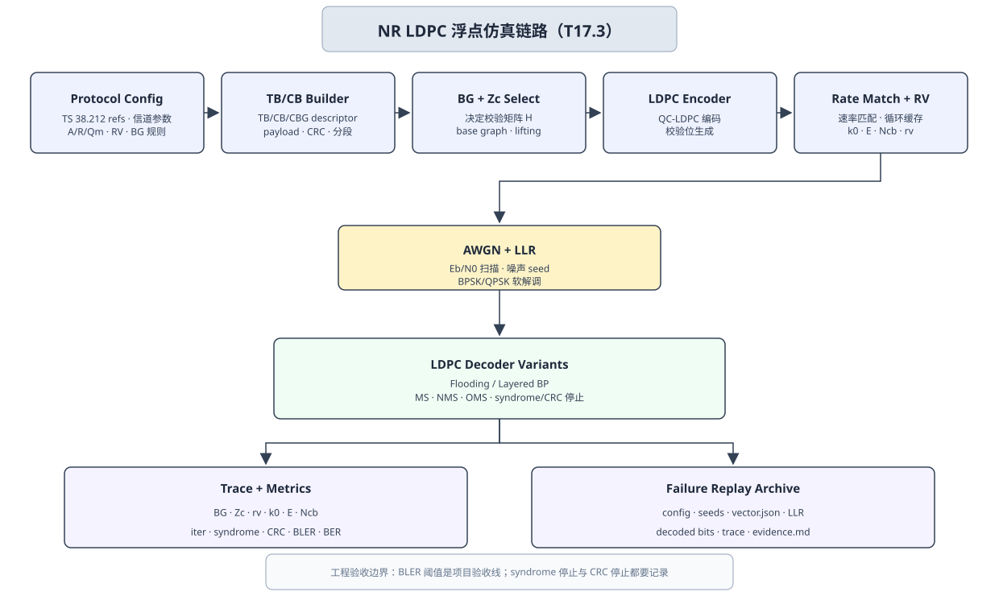

# T17.3 NR LDPC 浮点仿真计划：从基图、提升与速率恢复到可比较 BLER 曲线
## 本节学习目标

本节定义NR LDPC的浮点仿真计划。浮点仿真的目标是先把协议参数、软信息、消息传递算法、循环冗余校验和块错误率统计做成可复现的黄金参考，再交给后续定点 C/C++、寄存器传输级和专用集成电路阶段。


- 按3GPP TS 38.212 的基图（Base Graph, BG）选择、提升大小 $Z_c$、码块分段、LDPC 编码和速率匹配规则，定义一个可审计的 NR LDPC 仿真配置。
- 解释接收端为什么必须记录传输块、码块以及 $A$、$B$、$C$、$K$、$K'$、$K_b$、$Z_c$、$N$、$E$、$N_{\mathrm{cb}}$、冗余版本（Redundancy Version, RV）和 $k_0$。
- 定义加性白高斯噪声信道、对数似然比符号、有效码率和随机种子。
- 比较置信传播（Belief Propagation, BP）、Min-Sum（MS）、归一化 Min-Sum（Normalized Min-Sum, NMS）和偏移 Min-Sum（Offset Min-Sum, OMS）的仿真口径。
- 输出 BLER/BER曲线、迭代次数、syndrome、CRC、失败 dump、可重跑命令和协议证据。

本节的重点不是实现最快的 decoder，而是让每个 BLER 点、每个失败 CB、每个算法变体都能回到同一份协议 descriptor、同一组随机种子和同一套输入 LLR。

## 前置知识检查

| 前置项 | 本节需要达到的程度 |
|:---|:---|
| [[T8.8_NR_LDPC_decoder_numeric_walkthrough|T8.8]] NR LDPC 译码数值走读 | 知道校验节点（Check Node, CN）、变量节点（Variable Node, VN）、syndrome、MS 一轮更新和硬判决。 |
| [[T9.5_NR_LDPC_reassembly_TB_CRC|T9.5]] NR LDPC 码块重组与 TB CRC | 知道 TB 可分成多个 CB，CBG、filler、CB CRC 和 TB CRC 的接收端边界。 |
| [[T17.1_python_golden_model_project_layout|T17.1]] Python Golden Model 工程布局 | 知道 `vector.json`、`seeds.json`、`metrics.csv`、`frames.jsonl`、失败 replay 和 evidence archive 的职责。 |
| [[T9.3_NR_LDPC_HARQ_soft_buffer_RV_k0|T9.3]]/[[T9.4_NR_LDPC_bit_deinterleaving|T9.4]] 速率恢复 | 知道 RV、$k_0$、limited-buffer rate matching、bit deinterleaving 和软缓存状态会影响 LLR 放置。 |
| LLR 与性能指标 | 知道正 LLR 倾向 0 或 1 必须明确，本项目默认 `POS_ZERO`；知道 BLER/BER 是工程统计指标。 |

如果只记住一句话：NR LDPC 浮点仿真必须把“协议决定的图和地址”与“接收机自选的消息传递算法”分开记录，否则算法比较会被 BG/Zc/RV/LLR 地址错误污染。

## Roadmap 卡片原文与本节执行范围

| 项目 | 内容 |
|:---|:---|
| 编号 | T17.3 |
| 前置 | T8.8, T9.5, T17.1 |
| Prompt | 请定义 NR LDPC 浮点仿真计划：基图选择、提升、速率匹配/恢复、Min-Sum 变体、CRC 检查、BLER 曲线、随机种子、输出和阈值。写作时参考本文“单节讲义弹性审计清单”，按本节性质取舍：基础课重理论概念、解释和推导；协议课重 3GPP 前因后果和接收侧流程；工程课重仿真、定点、RTL/ASIC、验证和证据记录。 |
| 产出 | `docs/L3_工程实现/T17.3_NR_LDPC_float_sim_plan.md` |
| 验收 | Learner can specify a reproducible NR LDPC BLER simulation and compare BP/MS/NMS/OMS. |
| 3GPP/证据 | TS 38.212 Rel-19 `38212-j30` §5.2.2/§5.3.2/§5.4.2/§6.2/§7.2；TS 38.214 Rel-19 `38214-j30` §5.1.3/§6.1.4。本地证据路径：TS 38.212 -> `3GPP_Rel19/processed/TS_38.212_38212-j30`; TS 38.214 -> `3GPP_Rel19/processed/TS_38.214_38214-j30`。其中 TS 38.214 提供调制与编码方案和传输块大小系统输入锚点。 |

本节是工程仿真计划，不重复完整复现 TS 38.212 的 BG1/BG2 shift table。上游 [[T8.3_NR_LDPC_lifting_QC_matrix|T8.3]] 已表格化重建 TS 38.212 Table 5.3.2-2/3，[[T9.3_NR_LDPC_HARQ_soft_buffer_RV_k0|T9.3]] 已讨论 Table 5.4.2.1-2 的 $k_0$ 边界，[[T9.4_NR_LDPC_bit_deinterleaving|T9.4]] 已固化 bit interleaving 公式证据。本节把这些协议资产接入浮点实验。

## 资料与协议边界

NR LDPC 的协议链路主要来自 TS 38.212，调制阶数、目标码率、TBS 和 CBG 调度语义来自 TS 38.214。本节只把这些协议结论作为仿真参数来源；BP/MS/NMS/OMS 的具体迭代调度、归一化因子、偏移量、早停策略和 BLER 阈值属于接收端工程策略。

| 协议位置 | 本地证据 | 对浮点仿真的约束 | 接收端后果 |
|:---|:---|:---|:---|
| TS 38.212 §5.2.2 | `content.md` around line 717 | LDPC 分段、BG1/BG2 最大 CB size、CB CRC、filler、$K_b$ 和 $Z_c$ 选择来源。 | descriptor 必须记录 BG、$K_b$、$Z_c$、$C$、$K$、$K'$、filler 和 CB CRC present。 |
| TS 38.212 §5.3.2 | `content.md` around line 945；`tables/table_0013/0014/0015.csv/html` | LDPC 编码、BG1/BG2 矩阵大小、lifting set、shift table 和 parity-check matrix 生成。 | decoder 的 Tanner graph、layer schedule 和 syndrome checker 必须来自同一 $H$。 |
| TS 38.212 §5.4.2、§5.4.2.1、§5.4.2.2 | `content.md` around line 1175 | LDPC rate matching、bit selection、limited buffer、RV $k_0$ 和 bit interleaving。 | rate recovery 必须回填正确 $N_{\mathrm{cb}}$ 地址并执行 bit deinterleaving。 |
| TS 38.212 §6.2、§7.2 | `content.md` 上行共享信道/下行共享信道chain | UL-SCH/DL-SCH 调用 TB CRC、BG selection、CB segmentation、LDPC coding、rate matching 和 CB concatenation。 | 仿真要区分 channel/direction，并记录 UL/DL 调用链。 |
| TS 38.214 §5.1.3、§6.1.4 | `content.md` PDSCH/PUSCH MCS/TBS sections | MCS、$Q_m$、target code rate、RV 和 TBS 的系统输入来源。 | 若使用系统级输入，必须记录 MCS table、$Q_m$、target rate、TBS 和下行控制信息/RV 来源。 |
| TS 38.214 §5.1.7.1、§5.1.7.2 | `3GPP_Rel19/processed/TS_38.214_38214-j30/content.md:2407-2437` | PDSCH CBG 分组、CBGTI bit mapping、CBG 是否传输和 CBGFI 合并/刷新语义。 | 下行 CBG 部分重传测试必须记录 CBGTI/CBGFI、held/updated CB 状态和旧实例是否可合并。 |
| TS 38.214 §6.1.5.1、§6.1.5.2 | `3GPP_Rel19/processed/TS_38.214_38214-j30/content.md:7099-7125` | PUSCH CBG 分组、CBGTI bit order、初传/重传时哪些 CBG 被包含。 | 上行 CBG 部分重传测试必须记录 CBGTI 从 MSB 到 CBG#0 的映射，未调度 CBG 不产生新 LLR。 |
| TS 38.212 §5.4.2.1、§6.1.2.1.1、§7.3.1.2.1 | `3GPP_Rel19/processed/TS_38.212_38212-j30/content.md:1257-1289`；`3GPP_Rel19/processed/TS_38.212_38212-j30/content.md:4489`；`3GPP_Rel19/processed/TS_38.212_38212-j30/content.md:6097-6103` | LDPC bit selection 中未被 CBGTI 调度的 CB、PUSCH/PDSCH DCI 中 CBGTI/CBGFI 字段存在性。 | rate recovery 必须把 `scheduled_cb_count`、`held_cb_count`、CBGTI bit width 和 CBGFI present 写入 descriptor。 |

协议前因后果是：媒体接入控制层交给物理层 TB；物理层先做 TB CRC，然后按 BG 规则和最大 CB size 分段，选 $Z_c$ 并展开 QC-LDPC 矩阵；编码后再按 RV 和 rate matching 选择发送比特。接收端要反向恢复：demapper 给 LLR，bit deinterleaver 和 circular buffer 回填到 LDPC codeword 域，decoder 在同一 $H$ 上迭代，syndrome/CRC 给停止和验收证据，最后 CB 重组和 TB CRC 决定交付。

## 浮点仿真总览图



| 内容 | 说明 |
|:---|:---|
| Protocol Config | TB/CB Builder；BG + Zc Select；LDPC Encoder；Rate Match + RV；AWGN + LLR |
| LDPC Decoder Variants | Flooding or layered BP, MS, NMS and OMS with syndrome and CRC stopping records. |
| Trace + Metrics | BG, Zc, rv, k0, E, Ncb, iter, syndrome, CRC, BLER, BER, avg_iter. |
| Failure Replay Archive | resolved config, seeds, vector.json, LLR arrays, decoded bits, trace and evidence.md. |
| Case | Variant；Protocol params；Stop rule；Saved evidence |
| reference | BP + NMS；BG/Zc/R sweep, rv0；1000 frames or 100 errors；config + curve data |
本节流程顺序为：Protocol Config 固定 TS 38.212/38.214 证据、信道、$A/R/Q_m/RV/BG$ 规则和 decoder variant；TB/CB Builder 生成 TB/CB/CBG descriptor；BG + Zc Select 决定 $H$；Rate Match + RV 和 AWGN + LLR 生成接收端软信息；LDPC Decoder Variants 统一比较 BP/MS/NMS/OMS；Trace + Metrics 与 Failure Replay Archive 负责可复现证据。

## 仿真对象与不适用边界

| 范围 | 本节处理方式 |
|:---|:---|
| NR DL-SCH/UL-SCH LDPC 数据链路 | 主线处理，覆盖 BG、$Z_c$、rate recovery、decoder、CRC 和 BLER。 |
| PCH | 可按 DL-SCH/PCH rate matching 边界记录，但本节不展开具体系统调度。 |
| Polar控制信道 | 不属于本节，由 [[T17.4_NR_Polar_float_sim_plan|T17.4]] 处理。 |
| 小块编码 | 不属于本节主线；TS 38.212 small block coding 不使用 LDPC decoder。 |
| MIMO、信道估计、均衡 | 不属于本节；本节从理想 AWGN 或已得到的 demapper LLR 开始。 |
| BLER 门限 | 工程验收目标，不是 TS 38.212/38.214 强制给出的 decoder 合格线。 |

## 基图、提升与矩阵身份

LDPC 译码器不是只靠 $N$ 和 $K$ 工作，它必须知道完整的 parity-check matrix $H$。NR 不直接在协议里列出每个 bit-level $H$，而是用 BG、lifting set、$Z_c$ 和 shift table 生成准循环 LDPC（Quasi-Cyclic LDPC, QC-LDPC）矩阵。

对 BG1，协议给出 46 个 row group 和 68 个 column group；对 BG2，给出 42 个 row group 和 52 个 column group。提升后，bit-level 列数可抽象为：

$$
N_{\mathrm{BG1}}=68Z_c,\qquad N_{\mathrm{BG2}}=52Z_c.
\tag{1}
$$

每个 base matrix 非零项被替换为一个循环右移的 $Z_c\times Z_c$ identity matrix：

$$
P^{(s)}_{r,c}=I_{Z_c}\ \text{right-shifted by}\ s.
\tag{2}
$$

式 (1) 和式 (2) 的工程意义是：decoder 的边连接、layer 顺序、bank 地址、syndrome checker 都来自同一个 `bg_id/lifting_set/Zc/shift_table_version`。若仿真只记录 `N=8448`，不记录 BG 和 $Z_c$，失败帧无法重建 $H$。

descriptor 至少包含：

| 字段 | 含义 |
|:---|:---|
| `base_graph` | `BG1` 或 `BG2`，来自协议选择规则或配置。 |
| `lifting_set` | Table 5.3.2-1 的 set index。 |
| `Zc` | lifting size。 |
| `Kb` | 分段和 $Z_c$ 选择使用的基准列数。 |
| `K_prime` | 含 filler 的 CB 输入长度。 |
| `N_ldpc` | 由 BG 和 $Z_c$ 决定的 LDPC codeword 域长度。 |
| `H_hash` | 由 BG、set、$Z_c$、shift table 生成的 $H$ 结构摘要。 |

## Rate Matching 与 Rate Recovery

TS 38.212 §5.4.2 规定 LDPC rate matching 包含 bit selection 和 bit interleaving。接收端需要逆向执行：

1. demapper 输出 modulation-order 顺序的 LLR。
2. bit deinterleaver 把 LLR 放回 rate matching 输出序列顺序。
3. rate recovery 根据 RV、$k_0$、$E$、$N_{\mathrm{cb}}$ 和 limited-buffer 状态回填 circular buffer。
4. punctured/shortened/未发送位置按已知规则初始化。
5. soft buffer 合并后，形成 LDPC decoder 的输入 LLR。

对第 $r$ 个 CB，本次接收位置可记为：

$$
\mathcal{A}_{r,\mathrm{rv}}=[a_0,a_1,\ldots,a_{E_r-1}].
\tag{3}
$$

接收端软合并为：

$$
S_r[a_k]\leftarrow \operatorname{sat}_{\mathrm{float}}\left(S_r[a_k]+L^{\mathrm{rx}}_k\right).
\tag{4}
$$

浮点阶段的 $\operatorname{sat}_{\mathrm{float}}$ 可以是恒等函数；但本节仍保留这个符号，是为了让 T13 定点阶段直接替换成饱和加法。所有实验必须记录 `old_observed_mask`、`new_observed_mask`、`repeat_count`、`unknown_mask` 和 `shortened_mask`，否则无法解释混合自动重传请求或 limited-buffer 下的失败。

## 码率与 Eb/N0 口径

NR LDPC rate matching 后的有效发送码率也必须固定口径。本节沿用 [[T17.2_LTE_Turbo_float_sim_plan|T17.2]] 的默认口径：

$$
R_{\mathrm{eff}}=\frac{A_{\mathrm{payload}}}{\sum_{r=0}^{C-1}E_r}.
\tag{5}
$$

这里 $A_{\mathrm{payload}}$ 是 TB CRC 前的 payload bit 数，$\sum_r E_r$ 是本次传输所有 scheduled CB 的 rate matching 输出长度之和。若 CBG 部分重传导致某些 CB 本次未调度，必须把 `scheduled_cb_count`、`held_cb_count` 和 `sum_E_scheduled` 写清楚；否则 $R_{\mathrm{eff}}$ 与实际噪声缩放不一致。

AWGN、二进制相移键控或正交相移键控等效仿真的噪声方差建议写成：

$$
\sigma^2=\frac{1}{2R_{\mathrm{eff}}Q_m\cdot 10^{E_b/N_0/10}}.
\tag{6}
$$

输出中必须记录 `rate_definition=payload_over_sum_E`、`R_eff`、`sum_E`、`Qm`、`energy_normalization=unit_symbol_energy`。若使用 TS 38.214 MCS target rate 作为横轴或配置来源，也要额外记录 `target_code_rate`，不能把 target rate 与 rate-matched effective rate 混写。

## BP、SPA、MS、NMS 与 OMS 变体

置信传播（Belief Propagation, BP）是一类在 Tanner graph 上来回传消息的迭代译码思想。把 BP 写成精确的概率乘积形式时，常称为和积算法（Sum-Product Algorithm, SPA）：变量节点把来自信道和其他校验的证据送给校验节点，校验节点再根据“这一行 parity check 必须满足偶校验”的约束，把反向证据送回变量节点。MS、NMS 和 OMS 都是在校验节点处对 SPA 的近似，目的是把 `tanh/atanh` 这种昂贵非线性运算换成符号乘积、最小值、缩放或偏移。

公式前先固定符号，避免把算法名看成黑盒：

| 符号 | 含义 | 白话解释 |
|:---|:---|:---|
| $i$ | 校验节点 CN 的索引 | parity-check matrix $H$ 的某一行。 |
| $j$ | 变量节点 VN 的索引 | codeword 的某一个编码比特位置。 |
| $\mathcal{N}(i)$ | 与 CN $i$ 相连的 VN 集合 | 第 $i$ 行 parity check 里所有参与校验的比特。 |
| $q_{j\to i}$ | VN $j$ 送给 CN $i$ 的 LLR 消息 | “比特 $j$ 目前倾向 0 还是 1，以及有多确信”。 |
| $r_{i\to j}$ | CN $i$ 送回 VN $j$ 的 LLR 消息 | “为了让第 $i$ 条校验成立，其他比特对 $j$ 的反向约束”。 |
| $\operatorname{sign}(\cdot)$ | LLR 符号 | 决定 CN 输出倾向 0 还是 1。 |
| $|\cdot|$ | LLR 幅度 | 决定证据强度。 |
| $\tanh/ \operatorname{atanh}$ | SPA 的非线性变换 | 把多个独立软证据组合成 parity-check 约束消息。 |

SPA 的 check node 在 LLR 域可以写成：

$$
r_{i\to j}
=2\,\operatorname{atanh}
\prod_{j'\in\mathcal{N}(i)\setminus j}
\tanh\left(\frac{q_{j'\to i}}{2}\right).
\tag{7}
$$

MS 近似为：

$$
r_{i\to j}^{\mathrm{MS}}
=
\left(\prod_{j'\in\mathcal{N}(i)\setminus j}\operatorname{sign}(q_{j'\to i})\right)
\min_{j'\in\mathcal{N}(i)\setminus j}|q_{j'\to i}|.
\tag{8}
$$

NMS 在 MS 幅度上乘缩放因子 $\alpha$：

$$
r_{i\to j}^{\mathrm{NMS}}=\alpha r_{i\to j}^{\mathrm{MS}},\qquad 0<\alpha\le 1.
\tag{9}
$$

OMS 保留 MS 的符号，只在幅度上减偏移 $\beta$ 并截断到非负：

$$
r_{i\to j}^{\mathrm{OMS}}
=
\operatorname{sign}\!\left(r_{i\to j}^{\mathrm{MS}}\right)
\max\!\left(|r_{i\to j}^{\mathrm{MS}}|-\beta,0\right),\qquad \beta\ge 0.
\tag{10}
$$

直觉上，SPA 最接近概率模型但计算最重；MS 用“最弱的一条输入证据决定输出幅度”近似 SPA，硬件友好但通常偏乐观；NMS 用 $\alpha$ 把 MS 幅度整体压低；OMS 用 $\beta$ 专门削弱小幅度消息。浮点仿真要同时输出 BLER、BER、平均迭代次数、syndrome stop rate 和失败样本，因为某个变体可能曲线略差但迭代次数更少，也可能在低信噪比下更容易产生错误收敛。

四种变体的配置字段如下：

| 变体 | 必填字段 | 主要观察点 |
|:---|:---|:---|
| `bp` | `schedule`、`max_iter` | BLER 最好但计算重，关注 NaN/Inf 和 atanh 稳定性。 |
| `ms` | `schedule`、`max_iter` | 硬件友好，关注性能损失。 |
| `nms` | `alpha`、`schedule`、`max_iter` | 关注 $\alpha$ 扫描和 BLER/avg_iter 取舍。 |
| `oms` | `beta`、`schedule`、`max_iter` | 关注低幅度消息被削零后的收敛变化。 |

比较算法时必须使用同一批 payload seed、noise seed、BG/Zc/RV/E descriptor。否则曲线差异可能来自样本不同，而不是算法不同。

## 小型数值例子：同一组消息的三种 Min-Sum 变体

设某个 CN 给目标 VN 的其他输入 LLR 为：

$$
\mathbf{q}=[+0.8,-1.4,+2.2].
\tag{11}
$$

符号乘积为负，最小幅度为 $0.8$。因此：

$$
r^{\mathrm{MS}}=-0.8.
\tag{12}
$$

若 NMS 使用 $\alpha=0.75$：

$$
r^{\mathrm{NMS}}=-0.6.
\tag{13}
$$

若 OMS 使用 $\beta=0.2$：

$$
r^{\mathrm{OMS}}=-0.6.
\tag{14}
$$

这个例子说明：NMS 和 OMS 可能在某条边上给出相同数值，但它们对不同幅度消息的整体压缩方式不同。仿真不能只看一条边，要看完整 BLER、平均迭代次数和失败样本。

## 实验矩阵

图中的 `Experiment Matrix Example` 是本节最小实验矩阵口径。它不替代后续完整回归套件，但每个正式曲线点都至少要能归入下面四类之一：

| Case | Variant | Protocol params | Stop rule | Saved evidence |
|:---|:---|:---|:---|:---|
| `smoke` | MS | BG1/BG2 small set, rv0 | 100 frames or 20 errors | metrics + first failures |
| `reference` | BP + NMS | BG/Zc/R sweep, rv0 | 1000 frames or 100 errors | config + curve data |
| `harq` | NMS | rv0, rv2, CBG masks | replay fixed frames | soft buffer traces |
| `edge` | OMS | limited buffer, filler, short | injected failures | full decoder dump |

| Case | 目的 | 配置 | 验收 |
|:---|:---|:---|:---|
| `smoke` | 快速发现 BG/Zc、LLR 符号、syndrome 和 CRC 错误。 | 小 BG1/BG2 集合、RV0、MS、少量帧。 | 命令可运行，失败可 replay。 |
| `reference` | 生成正式 BLER 曲线。 | BP 或 NMS，多 SNR 点，固定 min frames/error blocks。 | 曲线随 $E_b/N_0$ 升高下降。 |
| `variant_compare` | 比较 BP/MS/NMS/OMS。 | 同 seed、同 descriptor、不同 variant。 | 输出 BLER、BER、avg_iter、syndrome stop rate。 |
| `harq_cbg` | 验证 RV、soft buffer 和 CBG 部分重传。 | RV0/RV2，CBGTI/CBGFI，held/updated CB。 | soft buffer trace 可解释重传收益。 |
| `edge` | 验证 limited buffer、filler、shortened、punctured 和 saturation。 | 注入边界 descriptor 和故障。 | 错误被 dump 字段定位。 |

图中的 `Engineering Checks` 固化为三条工程检查：第一，每帧必须记录 `BG`、`Zc`、lifting set、`k0`、`Ncb`、`E`、limited-buffer state 和 bit-interleaver mode；第二，比较 BP、MS、NMS 和 OMS 时必须使用 identical payload/noise seeds，否则曲线不可比较；第三，协议证据约束 BG selection、lifting 和 rate matching，BLER thresholds 仍然是 engineering goals，不能写成 TS 38.212/38.214 强制门限。

## 输出文件与字段

```text
runs/2026-06-20T130000Z_nr_ldpc_awgn_seed20260620/
  config.resolved.yaml
  command.txt
  seeds.json
  metrics.csv
  frames.jsonl
  failures/
    frame_000231_cb002/
      vector.json
      input_llr.npy
      decoded_bits.npy
      syndrome_trace.jsonl
      message_stats.json
  plots/
    bler_curve.png
  evidence.md
```

`metrics.csv` 至少包含：

| 字段 | 含义 |
|:---|:---|
| `run_id`、`config_hash`、`vector_schema_version` | 归档和 schema 标识。 |
| `decoder_variant` | `bp`、`ms`、`nms` 或 `oms`。 |
| `alpha`、`beta` | NMS/OMS 参数，不适用时写空。 |
| `schedule` | `flooding` 或 `layered`。 |
| `base_graph`、`Zc`、`lifting_set` | $H$ 身份。 |
| `rv_sequence`、`k0_profile`、`Ncb_profile`、`E_profile` | rate recovery 身份。 |
| `rate_definition`、`R_eff`、`sum_E`、`Qm` | AWGN 噪声缩放口径。 |
| `frames`、`bit_errors`、`block_errors`、`ber`、`bler` | 曲线统计。 |
| `avg_iter`、`max_iter_seen`、`syndrome_zero_rate`、`crc_pass_rate` | decoder 行为统计。 |

`frames.jsonl` 至少包含 `frame_id`、`tb_id`、`cb_index`、`cbg_id`、`base_graph`、`Zc`、`K`、`N`、`E`、`Ncb`、`rv`、`k0`、`limited_buffer`、`decoder_variant`、`iter_used`、`syndrome_weight_final`、`cb_crc_status`、`tb_crc_status`、`first_mismatch` 和 `failure_dump`。

## 随机种子与命令模板

继承 [[T17.1_python_golden_model_project_layout|T17.1]] 的 `canonical_json_sha256_u64le_v1` seed 派生规则。payload、noise、CBG mask injection、LLR saturation injection 必须使用不同 stage seed。

```bash
python3 -m decoder_golden.nr_ldpc.run_awgn \
  --config configs/nr_ldpc/bg_sweep_reference.yaml \
  --seed 20260620 \
  --snr-db 0.0:4.0:0.5 \
  --rate-definition payload_over_sum_E \
  --energy-normalization unit_symbol_energy \
  --decoder nms \
  --alpha 0.75 \
  --schedule layered \
  --max-iter 25 \
  --min-frames 1000 \
  --min-error-blocks 100 \
  --max-frames 200000 \
  --trace-output frames.jsonl \
  --save-failures 10 \
  --out runs/2026-06-20T130000Z_nr_ldpc_awgn_seed20260620
```

`variant_compare` 必须把四种 decoder 变体放在同一个 run group 下比较。除 `--decoder`、`--alpha`、`--beta` 和输出子目录外，其他参数必须一致，尤其是 `--seed`、`--config`、`--snr-db`、`--rate-definition`、`--energy-normalization`、`--schedule` 和 `--max-iter`。推荐命令矩阵如下：

| 变体 | 命令差异 | 输出目录规则 | 参数留空规则 |
|:---|:---|:---|:---|
| BP/SPA | `--decoder bp` | `runs/.../variant_compare/bp` | `alpha=""`，`beta=""`。 |
| MS | `--decoder ms` | `runs/.../variant_compare/ms` | `alpha=""`，`beta=""`。 |
| NMS | `--decoder nms --alpha 0.75` | `runs/.../variant_compare/nms_alpha0p75` | `beta=""`，`alpha` 必须写入 `config.resolved.yaml` 和 `metrics.csv`。 |
| OMS | `--decoder oms --beta 0.20` | `runs/.../variant_compare/oms_beta0p20` | `alpha=""`，`beta` 必须写入 `config.resolved.yaml` 和 `metrics.csv`。 |

可执行命令模板：

```bash
for variant in bp ms nms oms; do
  extra_args=""
  out_suffix="$variant"
  if [ "$variant" = "nms" ]; then
    extra_args="--alpha 0.75"
    out_suffix="nms_alpha0p75"
  fi
  if [ "$variant" = "oms" ]; then
    extra_args="--beta 0.20"
    out_suffix="oms_beta0p20"
  fi

  python3 -m decoder_golden.nr_ldpc.run_awgn \
    --config configs/nr_ldpc/bg_sweep_reference.yaml \
    --seed 20260620 \
    --run-group 20260620_nr_ldpc_variant_compare \
    --snr-db 0.0:4.0:0.5 \
    --rate-definition payload_over_sum_E \
    --energy-normalization unit_symbol_energy \
    --decoder "$variant" \
    $extra_args \
    --schedule layered \
    --max-iter 25 \
    --min-frames 1000 \
    --min-error-blocks 100 \
    --max-frames 200000 \
    --trace-output frames.jsonl \
    --save-failures 10 \
    --out "runs/20260620_nr_ldpc_variant_compare/$out_suffix"
done
```

验收时比较 `runs/20260620_nr_ldpc_variant_compare/*/config.resolved.yaml` 的 `resolved_config_hash_without_decoder_variant`。这个 hash 必须一致；如果不一致，说明 BG/Zc/RV/E、随机帧、SNR 或停止条件之一被改动，本轮不能用于 BP/MS/NMS/OMS 横向比较。

失败重跑：

```bash
python3 -m decoder_golden.nr_ldpc.replay \
  --run-dir runs/2026-06-20T130000Z_nr_ldpc_awgn_seed20260620 \
  --frame-id 231 \
  --cb-index 2 \
  --dump-level full
```

## 接收端伪代码

```text
输入：
  config：channel, A, MCS/TBS or explicit TB size, rv sequence, decoder variant
  protocol refs：TS 38.212/38.214 本地路径和表/图回链
  seed registry：payload/noise/edge seeds

对每个 ebn0_db：
  初始化 metrics
  while frames < min_frames or block_errors < min_error_blocks:
    若 frames 达到 max_frames，退出并标记 confidence_limited
    生成 payload，附加 TB CRC
    按 TS 38.212 §5.2.2 选择 BG、K_b、Zc 并分段
    对每个 CB：
      建立 H 身份：BG、lifting_set、Zc、shift_table_hash
      生成参考 LDPC codeword
      按 TS 38.212 §5.4.2 生成 rv/k0/E/Ncb 地址
      经过 AWGN 并生成 POS_ZERO LLR
      bit deinterleaving + rate recovery + soft combining
      运行 BP/MS/NMS/OMS decoder
      每轮记录 syndrome_weight、message stats、stop_reason
      输出 hard bits、CB CRC 状态和 decoder trace
    按 T9.5 重组 CB，检查 TB CRC
    更新 BER/BLER/avg_iter/syndrome_zero_rate
    保存失败 dump 和 evidence
```

## 阈值与验收

| 阈值 | 建议字段 | 性质 |
|:---|:---|:---|
| 统计停止 | `min_frames`、`min_error_blocks`、`max_frames` | 工程统计策略。 |
| 迭代停止 | `max_iter`、`syndrome_stop_enabled`、`crc_stop_enabled` | 接收机实现策略。 |
| 消息保护 | `llr_clip_float`、`nan_guard`、`max_abs_message_warn` | 数值稳定策略。 |
| 性能目标 | `target_bler_by_case` | 项目目标，不是协议强制门限。 |

基本验收项：

| 验收项 | 检查方式 |
|:---|:---|
| 协议位序 | 无噪声或极高 SNR 下，CB/TB CRC 应通过。 |
| $H$ 身份 | 同一 `base_graph/Zc/lifting_set` 生成的 syndrome checker 与 decoder 使用同一边集合。 |
| Rate recovery | `rv/k0/E/Ncb` dump 能回放同一 soft buffer。 |
| 算法比较 | BP/MS/NMS/OMS 使用同一 seed 和 frame 序列。 |
| 曲线趋势 | BLER 随 $E_b/N_0$ 升高总体下降。 |
| 失败回放 | replay 能复现 syndrome trace 和 CRC 状态。 |

## 定点化承接

T13 需要从 T17.3 获得：

| 统计 | 用途 |
|:---|:---|
| `llr_min/max/percentile` | 输入 LLR 缩放和裁剪。 |
| `message_min/max/percentile` | CN/VN message RAM 位宽。 |
| `min1/min2_distribution` | MS/NMS/OMS comparator 和定点范围。 |
| `saturation_if_q6/q8` | 候选定点格式风险。 |
| `bler_delta_ms/nms/oms` | 近似算法相对 BP 的损失。 |

浮点阶段不能提前把消息硬截成目标位宽，但可以额外跑 `float_with_quant_probe`，用于预估 T13 的量化损失。

## RTL/ASIC 映射

| RTL/ASIC 对象 | T17.3 输出来源 |
|:---|:---|
| Descriptor 寄存器 | `base_graph`、`Zc`、`K`、`N`、`E`、`rv`、`k0`、`max_iter`。 |
| 地址生成器 | rate recovery 地址 dump 和 layer/edge list dump。 |
| LLR RAM 初始化 | `input_llr.npy` 或后续定点向量。 |
| Message RAM 规划 | `edge_count`、`layer_count`、message statistics。 |
| Syndrome checker | `H_hash`、final hard bits 和 syndrome trace。 |
| Scoreboard | CB CRC、TB CRC、iter_used、first mismatch。 |

硬件不需要保存每条浮点消息，但必须能在失败帧上对齐输入 LLR、descriptor、最终 hard bits、syndrome、CRC 和迭代次数。

## 常见错误

| 错误 | 现象 | 定位方法 |
|:---|:---|:---|
| BG/Zc 选错 | 高 SNR 仍大量 fail，syndrome 不收敛。 | 比较 descriptor 与 TS 38.212 §5.2.2/[[T8.2_NR_LDPC_base_graph_selection|T8.2]]/[[T8.3_NR_LDPC_lifting_QC_matrix|T8.3]]。 |
| $H$ 与 syndrome checker 不同源 | decoder 声称通过但 checker fail。 | 检查 `H_hash` 和 layer list。 |
| Rate recovery 地址错 | 特定 RV fail，RV0 可能正常。 | dump `rv/k0/A_rv` 地址和 soft buffer mask。 |
| bit deinterleaving 方向反 | 高阶调制下 BLER 异常。 | 用 [[T9.4_NR_LDPC_bit_deinterleaving|T9.4]] toy pattern 验证 LLR 顺序。 |
| NMS/OMS 参数未记录 | 曲线不可复现。 | `metrics.csv` 必须写 `alpha/beta`。 |
| syndrome stop 替代 CRC | syndrome zero 但 TB CRC fail 被误交付。 | CB/TB CRC gate 必须独立记录。 |

## 工业用例

| 用例 | 价值 |
|:---|:---|
| NR LDPC 算法选型 | 用同一协议向量比较 BP/MS/NMS/OMS、flooding/layered、迭代次数和早停策略。 |
| RTL 回归和现场问题回放 | 把失败帧的 descriptor、LLR、rate recovery mask、syndrome trace 和 CRC 状态导出为硬件 scoreboard 输入。 |

## 自测题

1. 为什么 `base_graph`、`Zc` 和 `lifting_set` 必须写入 `vector.json`？
2. 比较 BP 和 NMS 时，为什么必须使用同一 payload/noise seed？
3. `target_code_rate` 和 `R_eff` 能否混用？
4. syndrome zero 是否等于 TB 可以交付？
5. CBG 部分重传时，本次未调度 CB 应如何处理？

## 自测题参考答案

1. 它们共同决定 parity-check matrix $H$。只记录 $N/K$ 无法重建边集合、layer 顺序和 syndrome checker。

2. 否则 BLER 差异可能来自随机帧不同，而不是算法不同。算法比较必须控制输入样本一致。

3. 不能。`target_code_rate` 来自 MCS/TBS 选择，`R_eff=A_payload/\sum E_r` 是本次 rate-matched 发送口径。AWGN 噪声缩放必须声明使用哪一个。

4. 不等于。syndrome zero 只说明 hard bits 满足 LDPC parity-check equations；CB/TB CRC 仍是接收端交付和 HARQ 反馈的关键 gate。

5. 不能清空。应根据 HARQ/CBG 状态保持历史 soft buffer 或历史 CB result，并记录 held/updated 状态；具体可合并边界由 CBGTI/CBGFI 和协议上下文决定。

## 协议证据表

| 证据项 | TS 与 Rel-19 包 | 本地路径 | 状态 |
| :--- | :--- | :--- | :--- |
| LDPC segmentation | TS 38.212 `38212-j30` §5.2.2 | `3GPP_Rel19/processed/TS_38.212_38212-j30/content.md` | 已核验锚点；公式 XML 不在本节重转写。 |
| LDPC coding and H | TS 38.212 §5.3.2、Table 5.3.2-1/2/3 | `tables/table_0013/0014/0015.csv/html` | 上游 [[T8.3_NR_LDPC_lifting_QC_matrix|T8.3]] 已复现。 |
| LDPC rate matching | TS 38.212 §5.4.2、§5.4.2.1、§5.4.2.2 | `content.md`、[[T9.3_NR_LDPC_HARQ_soft_buffer_RV_k0|T9.3]]/[[T9.4_NR_LDPC_bit_deinterleaving|T9.4]] 证据 | 使用上游证据回链。 |
| UL-SCH/DL-SCH chain | TS 38.212 §6.2、§7.2 | `content.md` | 已核验锚点。 |
| MCS/TBS/RV | TS 38.214 `38214-j30` §5.1.3、§6.1.4 | `3GPP_Rel19/processed/TS_38.214_38214-j30/content.md` | 本节不复现完整 MCS/TBS 表。 |
| CBG partial retransmission | TS 38.214 §5.1.7.1/§5.1.7.2、§6.1.5.1/§6.1.5.2；TS 38.212 §5.4.2.1、§6.1.2.1.1、§7.3.1.2.1 | `3GPP_Rel19/processed/TS_38.214_38214-j30/content.md:2407-2437`；`3GPP_Rel19/processed/TS_38.214_38214-j30/content.md:7099-7125`；`3GPP_Rel19/processed/TS_38.212_38212-j30/content.md:1257-1289`；`3GPP_Rel19/processed/TS_38.212_38212-j30/content.md:4489`；`3GPP_Rel19/processed/TS_38.212_38212-j30/content.md:6097-6103` | 本节直接核验本地锚点，同时引用 [[T9.3_NR_LDPC_HARQ_soft_buffer_RV_k0|T9.3]]/[[T9.5_NR_LDPC_reassembly_TB_CRC|T9.5]] 的接收端细化。 |

## 未复现协议资产与关闭条件

引用重建审计会把正文中出现的若干协议名词识别为候选。以下表格说明它们在本节的边界和关闭条件，避免把“当前工程计划不展开”误读为“无需核验”。

| 候选资产 | 本节处理 | 关闭条件 |
|:---|:---|:---|
| PCH rate matching | 本节主线是 DL-SCH/UL-SCH LDPC BLER 仿真，PCH 只作为 TS 38.212 §5.4.2 的相邻边界提及。 | 若后续创建 PCH 专项仿真，必须新增 PCH 专用 descriptor、TS 38.212 PCH 调用链本地路径和无噪声回归向量。 |
| TS 38.214 MCS/TBS 表 | 本节只要求记录系统输入 `Qm/target_code_rate/TBS`，不复现完整 MCS/TBS 表。 | 一旦使用 MCS index 自动派生 TBS 或 target rate，必须复现实际使用的 TS 38.214 表格子集，记录表号、本地 CSV/HTML、脚本和输出资产。 |
| TS 38.214 TBS 公式 | 本节允许显式传入 payload/TB size，不把 TBS 计算作为仿真核心。 | 若命令支持 `--mcs-index` 或 `--resource-grid` 自动算 TBS，必须增加 TBS 公式逐步推导、单元测试和协议证据路径。 |
| TS 38.212 Table 5.3.2-1/2/3 | 上游 [[T8.3_NR_LDPC_lifting_QC_matrix|T8.3]] 已重建 BG lifting set 和 shift table，本节只消费 `base_graph/lifting_set/Zc/shift_table_hash`。 | 若 T17.3 后续实现自己解析原表生成 $H$，必须把 [[T8.3_NR_LDPC_lifting_QC_matrix|T8.3]] 资产纳入 evidence archive，并用 `H_hash` 与上游重建结果逐项比对。 |
| TS 38.212 Table 5.4.2.1-2 | 上游 [[T9.3_NR_LDPC_HARQ_soft_buffer_RV_k0|T9.3]] 已复现 `rvid/BG/k0` 公式形式，本节只要求 dump `rv/k0/Ncb/E`。 | 若仿真实现从协议表自动生成 $k_0$，必须重跑 [[T9.3_NR_LDPC_HARQ_soft_buffer_RV_k0|T9.3]] toy 校验并保存 `rv/k0` 地址 trace。 |
| BP/SPA、MS、NMS、OMS 公式 | 本节直接给出 decoder 算法公式，是接收端工程算法，不是 3GPP 强制 decoder 实现。 | 后续实现必须用 toy message、无噪声码字和 syndrome regression 证明公式方向、LLR 符号和停机条件一致。 |

## 图示

## 执行与证据记录

| 项目 | 记录 |
|:---|:---|
| 工作区 | `/home/yys/ClaudeCode/3gpp` |
| 写入文件 | `docs/L3_工程实现/T17.3_NR_LDPC_float_sim_plan.md` |
| Roadmap 卡片 | 已读取 `2026-06-19-lte-nr-decoding-learning-roadmap.md` 中 T17.3。 |
| 台账依据 | 已读取 `docs/audits/lte_nr_decoding_remaining_work_register.md` 阶段 11 与 T17.3 条目。 |
| 前置依据 | 已读取 `docs/L2_协议算法/T8.8_NR_LDPC_decoder_numeric_walkthrough.md`、`docs/L2_协议算法/T9.5_NR_LDPC_reassembly_TB_CRC.md`、`docs/L3_工程实现/T17.1_python_golden_model_project_layout.md`。 |
| 原始 manifest 核验 | `manifest.csv` 记录 TS 38.212 `38212-j30.zip/docx`，大小 `2111728`，SHA-256 `89275220eabea854a4aff5e0982cc78be830edb31a6a637abc99c17812a4d443`；TS 38.214 `38214-j30.zip/docx`，大小 `3147069`，SHA-256 `a8f929709cbf5dd4a2b1941eb29c0978ed680a7e830d333174306945a805cdda`。 |
| processed manifest 核验 | TS 38.212 `status: processed`，paragraph `4193`，heading `165`，tables `321`，equations `4360`，media `1058`；TS 38.214 `status: processed`，paragraph `4935`，heading `210`，tables `151`，equations `4917`，media `802`。 |
| README 核验 | 已读取 `TS_38.212_38212-j30/README.md` 与 `TS_38.214_38214-j30/README.md`；确认 `content.md` 不是数学公式权威来源，公式应以 `equations/*.xml` 为准，表格优先看 `tables/*.html`。 |
| 未执行内容 | 本节是仿真计划，未运行真实 NR LDPC BLER 仿真；后续实现必须生成 `metrics.csv`、`frames.jsonl`、失败 dump 和曲线图。 |
| 审计结果 | `python3 tools/audit_lesson_terms.py docs/L3_工程实现/T17.3_NR_LDPC_float_sim_plan.md`：`LESSON_TERM_AUDIT_OK`。 |
| 审计结果 | `python3 tools/audit_markdown_headings.py docs/L3_工程实现/T17.3_NR_LDPC_float_sim_plan.md`：`MARKDOWN_HEADING_AUDIT_OK`。 |
| 审计结果 | `python3 tools/audit_lesson_depth.py --strict docs/L3_工程实现/T17.3_NR_LDPC_float_sim_plan.md`：`LESSON_DEPTH_AUDIT_OK`。 |
| 审计结果 | `python3 tools/audit_latex_render.py docs/L3_工程实现/T17.3_NR_LDPC_float_sim_plan.md`：`LATEX_RENDER_AUDIT_OK formulas=104`。 |
| 引用重建审计 | `python3 tools/audit_reference_rebuilds.py docs/L3_工程实现/T17.3_NR_LDPC_float_sim_plan.md` 返回 `REFERENCE_REBUILD_AUDIT_CANDIDATES`，退出码为 0；候选来自 PCH/MCS/TBS 边界、上游已重建 TS 38.212 表格回链和正文公式引用，不构成本节失败。 |
| 审核经理复核 | 首轮复核结论 `Critical=0, Important=4`；已补 BP/SPA 符号解释与 SPA 全称、BP/MS/NMS/OMS 可执行命令矩阵、CBG/CBGTI/CBGFI 本地精确锚点、未复现协议资产关闭条件。 |

## 参考文献

- [3GPP, 2026a] 3GPP TS 38.212 Rel-19 `38212-j30`, NR Multiplexing and channel coding. 本地路径：`3GPP_Rel19/processed/TS_38.212_38212-j30/`。
- [3GPP, 2026b] 3GPP TS 38.214 Rel-19 `38214-j30`, NR Physical layer procedures for data. 本地路径：`3GPP_Rel19/processed/TS_38.214_38214-j30/`。
- [上游讲义] `docs/L2_协议算法/T8.8_NR_LDPC_decoder_numeric_walkthrough.md`，NR LDPC 译码数值走读。
- [上游讲义] `docs/L2_协议算法/T9.5_NR_LDPC_reassembly_TB_CRC.md`，NR LDPC 码块重组与传输块 CRC。
- [上游讲义] `docs/L3_工程实现/T17.1_python_golden_model_project_layout.md`，Python Golden Model 工程布局。
