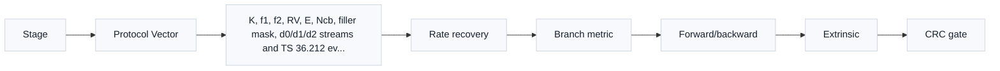
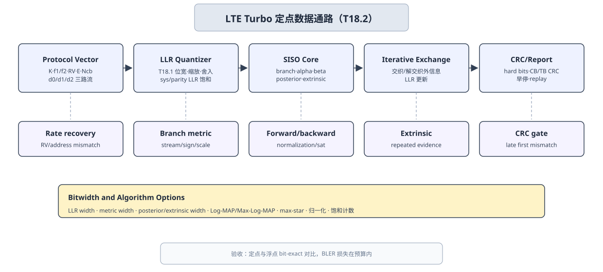

# T18.2 LTE Turbo 定点模型计划：C/C++ 整数译码器规格
## 本节学习目标

本节规划LTE Turbo的 C/C++ 定点译码器模型。T17.2 已经定义浮点仿真：编码器参考、加性白高斯噪声信道、解速率匹配、Log-MAP/Max-Log-MAP、循环冗余校验、块错误率曲线和失败回放。本节把这些浮点对象约束成整数模型：每条对数似然比怎样量化，分支度量怎样计算，alpha/beta 路径度量怎样归一化和饱和，外信息怎样缩放，交织地址怎样驱动数组访问，以及 C/C++ 输出怎样和 Python 定点参考做 bit-exact 对比。


- 说明 LTE Turbo 定点模型和 T17.2 浮点模型的输入、输出和检查点关系。
- 为分支度量、alpha/beta 度量、后验 LLR、外信息和 soft buffer 分配位宽、缩放和饱和策略。
- 区分 Log-MAP、Max-Log-MAP 和修正 Max-Log-MAP 在定点实现中的不同代价。
- 设计 C/C++ 结构体、数组布局、状态字段和 trace 字段。
- 写出分支度量、前向递推、后向递推、外信息扣除和 CRC gate 的 bit-exact 检查方案。
- 解释哪些字段来自3GPP TS 36.212，哪些字段是接收机实现策略。

如果只记住一句话：LTE Turbo 定点模型不是把浮点 Log-MAP 直接换成 `int16_t`，而是把协议位序、交织地址、外信息原则、饱和度量和分层检查点一起固定下来。

## 前置知识检查

| 前置项 | 本节需要达到的程度 |
|:---|:---|
| T6.5 BCJR/MAP 直觉 | 知道分支度量、前向度量 alpha、后向度量 beta 和后验 LLR 的含义。 |
| T6.6 Log-MAP 与 Max-Log-MAP | 知道 `max-star` 修正项、Max-Log-MAP 近似和外信息扣除。 |
| T6.4 LTE Turbo 内部交织器 | 知道 $K/f_1/f_2$ 生成交织/解交织地址，外信息必须按地址对齐。 |
| T7.3 LTE 混合自动重传请求软缓存与 RV | 知道冗余版本（Redundancy Version, RV）选择循环缓存窗口，同一编码比特位置的 LLR 要累加或饱和。 |
| T18.1 定点译码器需求 | 知道 Q 格式、裁剪、舍入、饱和、性能损失预算和 bit-exact 检查点。 |

本节假设你已经知道 Turbo 译码器由两个软输入软输出（Soft-Input Soft-Output, SISO）译码器迭代交换外信息。若这个概念还不清楚，应先回看 T6.7；否则定点外信息缩放和交织地址会显得像单纯数组搬运。

本节后半部分还会把模型映射到寄存器传输级和专用集成电路的检查点。这里的 RTL/ASIC 不是协议要求，而是为了让 C/C++ 定点模型以后能成为硬件 scoreboard 的黄金参考。

## Roadmap 卡片原文与本节执行范围

| 项目 | 内容 |
|:---|:---|
| 编号 | T18.2 |
| 前置 | T6.6, T7.3, T18.1 |
| Prompt | 请规划 C/C++ 定点 LTE Turbo 译码器模型：分支度量、alpha/beta 度量、外信息缩放、交织器地址、饱和、max-log 修正选项和对 Python 的 bit-exact 测试。写作时参考本文”单节讲义弹性审计清单”，按本节性质取舍：基础课重理论概念、解释和推导；协议课重 3GPP 前因后果和接收侧流程；工程课重仿真、定点、RTL/ASIC、验证和证据记录。 |
| 产出 | `docs/L3_工程实现/T18.2_LTE_Turbo_fixed_point_model_plan.md` |
| 验收 | Learner can specify C/C++ structures and tests for a fixed-point Turbo decoder. |
| 3GPP/证据 | TS 36.212 Rel-19 `36212-j30` §5.1.3.2/§5.1.4.1; algorithm implementation evidence. 本地证据路径：TS 36.212 -> `3GPP_Rel19/processed/TS_36.212_36212-j30`. |

本节不实现真实 C/C++ 源码，而是写定点模型计划。协议精读的范围是确认 LTE Turbo 的结构、内部交织器、尾比特、速率匹配和 RV 语义；Log-MAP、Max-Log-MAP、位宽、缩放、饱和、早停和数组布局都是接收机实现策略，不能写成 TS 36.212 强制要求。

## 资料与协议边界

| 资料 | 本地路径 | 边界 |
| :--- | :--- | :--- |
| TS 36.212 §5.1.1 | `3GPP_Rel19/processed/TS_36.212_36212-j30/content.md:575-599` | CRC 算法由上游 T3.1/T17.2 回链，本节只消费状态。 |
| TS 36.212 §5.1.2 | `content.md:601-673` | 不重新推导分段公式。 |
| TS 36.212 §5.1.3.2.1/§5.1.3.2.2 | `content.md`，T6.3 重建图 | 不规定接收机必须用 Log-MAP 或 Max-Log-MAP。 |
| TS 36.212 §5.1.3.2.3/Table 5.1.3-3 | `tables/table_0009.csv/html`，T6.4/T6.6 回链 | 本节不复制全表，使用上游已重建资产。 |
| TS 36.212 §5.1.4.1/§5.1.4.1.2 | `content.md:777-923`，`tables/table_0010.csv/html` | 接收机 soft buffer 写回、重传合并和饱和是逆向实现策略，不是 TS 36.212 直接规定的内部行为。 |
| T6.6 | `docs/L2_协议算法/T6.6_Log_MAP_Max_Log_MAP_Turbo.md` | 算法文献背景，不是 3GPP 规范公式。 |
| T17.2 | `docs/L3_工程实现/T17.2_LTE_Turbo_float_sim_plan.md` | 本节不生成真实 BLER 曲线。 |

定点模型要继承协议对象，但不能把内部整数格式当作协议对象。例如 `K`、`f1`、`f2`、`rv_idx`、`E` 和 `Ncb` 必须来自协议向量或上游 descriptor；但 `alpha_width=12`、`extrinsic_scale=0.75`、`round_mode=nearest_away_from_zero` 是工程选择。

## Turbo 定点模型的理论底座

Turbo 码这个名称来自“涡轮”直觉：两个组成译码器像两级增压器一样反复交换软信息，让一次判断中还不确定的比特在多轮迭代后逐步变可靠。它解决的问题是：单个卷积码译码器只看一条 trellis，很容易在低信噪比下对局部路径过早下结论；两个交织后的 trellis 从不同顺序观察同一批信息位，可以把“这个位置像 0”或“这个位置像 1”的概率证据互相传递。

本节的理论对象有五个：

| 名称 | 定义 | 接收端用途 | 定点风险 |
|:---|:---|:---|:---|
| 分支度量 `gamma` | trellis 某一时刻从状态 $s'$ 走到状态 $s$ 的局部可信度。 | 把系统位、校验位和先验 LLR 合成路径分数。 | LLR 符号错或饱和，会奖励错误分支。 |
| 前向度量 `alpha` | 从起点走到当前状态的累计可信度。 | 表示“过去路径”对当前状态的支持。 | 长块累加会溢出，需要归一化。 |
| 后向度量 `beta` | 从当前状态走到终点的累计可信度。 | 表示“未来路径”对当前状态的支持。 | 尾比特初始化错，会在块尾集中出错。 |
| 后验 LLR | 综合过去、当前分支和未来路径后，对某个信息位的最终软判断。 | 生成硬判决和外信息。 | 位宽不足会把强证据压扁。 |
| 外信息 | 后验中去掉本次输入信道证据和先验证据后的新信息。 | 交给另一个 SISO，避免重复使用同一证据。 | 扣除项漏掉会形成“回声信息”。 |

对零基础读者，可以把一次 SISO 译码理解为“给每条可能路径打分”。分支度量回答“这一步像不像收到的 LLR”；alpha 回答“走到这里以前这条路线累计有多可信”；beta 回答“从这里走到终点还有多可信”；后验 LLR 把所有支持比特 0 的路径和支持比特 1 的路径做对比；外信息只保留新增加的判断，再通过交织器换一个顺序送给另一个 SISO。

为什么定点模型比浮点模型更容易出错？原因不是公式变了，而是每个“可信度”都被放进有限整数格点。一个浮点后验 LLR 可以是 $18.3$，但 6 bit 输入 LLR 可能只能保存到 $31$ 或 $-31$ 这样的整数上限；alpha/beta 每列有 8 个状态，如果不归一化，累计分数会很快撞到上限。工程后果是：低层整数错误会伪装成算法性能差，直到 bit-exact checkpoint 把第一处 mismatch 定位出来。

一个常见误解是“Turbo 定点只要让最终 CRC 通过就行”。CRC 通过只能说明这个样本最终成功，不能说明分支度量、alpha/beta 和外信息都按规格工作。定点 C/C++ 模型的目标是把每一层中间变量也变成可比较证据：如果 Python fixed 和 C/C++ fixed 的 `gamma_trace` 第一列就不同，问题在量化或分支符号；如果 `gamma_trace` 一致但 `alpha_trace` 不同，问题在递推、归一化或饱和；如果 alpha/beta 一致但 CRC 前 hard bits 不同，问题可能在后验、外信息或交织地址。

再看一个两状态玩具例子，帮助建立直观。假设某一列只有两条候选路径支持信息位 0，累计分数分别为 21 和 18；两条候选路径支持信息位 1，累计分数分别为 7 和 5。Max-Log-MAP 的硬近似会认为“支持 0 的最好路径”比分数最高的“支持 1 的最好路径”大 14，因此后验 LLR 偏向 0。若定点实现把 21 加上新的分支度量后回绕为 -12，最好路径就会被错误丢掉，接收端会把强可靠的 0 看成弱可靠甚至错误的 1。这个例子说明：位宽、饱和和归一化不是实现细节装饰，而是保持路径排序含义的理论条件。

本节后续推导会反复使用这些符号：$u_k$ 表示第 $k$ 个信息位，$p_k$ 表示组成编码器产生的校验位，$L_{\mathrm{sys},k}$ 是系统位信道 LLR，$L_{\mathrm{par},k}$ 是校验位信道 LLR，$L_{\mathrm{a},k}$ 是来自另一个 SISO 的先验 LLR。分支度量把这三类证据合成局部路径分数；alpha/beta 递推把局部分数扩展为整条路径分数；外信息推导则回答“去掉我已经知道的证据后，还能给另一个译码器什么新证据”。这条定义链不清楚，后面的 C 结构体、trace 字段和 RTL 检查点都会失去含义。

## 定点数据通路图




| 内容 | 说明 |
|:---|:---|
| Stage | Integer Object；Compare Field；Failure Signal |
| Protocol Vector | LLR Quantizer；SISO Core；Iterative Exchange；CRC/Report |
| K, f1, f2, RV, E, Ncb, filler mask, d0/d1/d2 streams and TS 36.212 evidence. | Apply T18.1 width, scale, round and saturation to system and parity LLR streams.；Compute branch metric, alpha, beta, posterior and extrinsic with Log-MAP or Max-Log-MAP.；Interleave and deinterleave extrinsic LLR; update  |
| Rate recovery | sys/parity LLR, soft buffer；quantized_input, combined_llr；RV or address mismatch |
| Branch metric | G_k for 8-state trellis；gamma_trace；stream/sign/scale error |
| Forward/backward | alpha/beta columns；alpha_beta_snapshot；normalization or saturation |
| Extrinsic | posterior - channel - apriori；extrinsic_trace；repeated evidence |
| CRC gate | hard bits and CB/TB CRC；crc_status, iter_used；late first mismatch |
| Log-MAP | max-star correction LUT, higher accuracy, wider trace checks |
| Max-Log-MAP | max only, hardware friendly, needs BLER loss budget |
本节流程顺序为：Protocol Vector 提供 $K/f_1/f_2$、RV、$E$、$N_{\mathrm{cb}}$ 和三路流；LLR Quantizer 按 T18.1 量化系统流与校验流；SISO Core 计算分支度量、alpha、beta、后验和外信息；Iterative Exchange 通过交织/解交织地址交换外信息；CRC/Report 记录硬判决、CB/TB CRC、早停和 replay。中部表格列出四层 compare checkpoint，底部列出 Log-MAP、Max-Log-MAP、度量归一化、外信息缩放和饱和观测。

图中底部选项区的标题是 `Bitwidth and Algorithm Options`，覆盖 LLR width、metric width、posterior/extrinsic width、Log-MAP/Max-Log-MAP 选项、max-star 修正、归一化和饱和计数。

## 输入输出与 C/C++ 对象

T18.2 的 C/C++ 模型应从 T17.2 的失败包或 run directory 读取对象，而不是临时构造散装数组。

| 输入对象 | 字段 | 用途 |
|:---|:---|:---|
| `vector.json` | `K`、`f1`、`f2`、`filler_mask`、`tail_bits`、`rv_idx`、`E`、`Ncb`、`harq_process_id` | 协议身份和地址生成。 |
| `input_llr.npy` | 系统流、第一校验流、第二校验流或 rate recovery 后 LLR | 定点量化输入。 |
| `fixed_requirement.yaml` | `llr_width`、`metric_width`、`extrinsic_width`、`round_mode`、`saturation_mode` | 数值格式和比较口径。 |
| `interleaver.json` | `pi`、`depi`、`K`、`f1`、`f2`、`hash` | 外信息交织与解交织。 |
| `expected_bits.npy` | CB 信息位或 TB payload 参考 | 最终 hard bits 和 CRC 诊断。 |

建议 C/C++ 结构体分成四类：

```c
typedef struct {
  uint16_t K;
  uint16_t f1;
  uint16_t f2;
  uint16_t E;
  uint16_t Ncb;
  uint16_t D;      /* Turbo stream length after trellis termination: D = K + 4. */
  uint8_t  rv_idx;
  uint8_t  max_iter;
  uint8_t  early_stop_enabled;
  uint8_t  tail_bits_per_stream;
} LteTurboDescriptor;

typedef struct {
  int8_t llr_width;
  int8_t llr_frac;
  int16_t llr_min;
  int16_t llr_max;
  int8_t metric_width;
  int8_t metric_frac;
  int16_t metric_min;
  int16_t metric_max;
  int8_t posterior_width;
  int8_t posterior_frac;
  int8_t extrinsic_width;
  int8_t extrinsic_frac;
  int16_t extrinsic_min;
  int16_t extrinsic_max;
  int16_t branch_metric_min;
  int16_t branch_metric_max;
  int16_t extrinsic_scale_q15;
  uint8_t round_mode;
  uint8_t saturation_mode;
  uint8_t max_log_mode;
  uint8_t maxstar_lut_id;
  int8_t maxstar_lut_frac;
  uint8_t alpha_norm_policy;
  uint8_t beta_norm_policy;
  uint8_t tail_state_policy;
} TurboFixedConfig;

typedef struct {
  int16_t *sys_llr;
  int16_t *par0_llr;
  int16_t *par1_llr;
  int16_t *apriori;
  int16_t *extrinsic;
  int16_t *posterior;
} TurboFixedBuffers;

typedef struct {
  uint16_t iter_index;
  uint8_t siso_stage;
  uint32_t branch_metric_sat_count;
  uint32_t alpha_sat_count;
  uint32_t beta_sat_count;
  uint32_t extrinsic_sat_count;
  int16_t max_abs_branch_metric;
  int16_t max_abs_alpha;
  int16_t max_abs_beta;
  int16_t max_abs_ext;
  uint32_t first_sat_index;
  uint8_t cb_crc_pass;
} TurboFixedTrace;
```

这些结构体是计划级接口，不是最终应用二进制接口（Application Binary Interface, ABI）。关键点是：协议 descriptor、定点格式、数组缓冲区和 trace 不能混成一个大结构，否则后续 T18.6 和 RTL scoreboard 很难单独比较。`TurboFixedConfig` 必须能唯一决定 bit-exact 行为：同一个输入向量、同一个配置对象和同一个代码版本，不能因为舍入、饱和、Log-MAP mode、查找表（Look-Up Table, LUT）或归一化策略缺字段而得到两个合法答案。

## 分支度量定点化

T6.6 给出二进制相移键控/AWGN 教学模型下的分支度量：

$$
G_k(s',s)=\frac{1}{2}L_{\mathrm{a},k}x(u_k)
+\frac{1}{2}L_{\mathrm{sys},k}x(u_k)
+\frac{1}{2}L_{\mathrm{par},k}x(p_k),
\tag{1}
$$

其中 $x(0)=+1$，$x(1)=-1$。定点模型有两种实现口径：

| 口径 | 做法 | 优点 | 风险 |
|:---|:---|:---|:---|
| 半 LLR 口径 | 保留 $\frac{1}{2}$，先右移或缩放再累加。 | 数值接近公式。 | 奇数 LLR 的舍入规则必须固定。 |
| 吸收比例口径 | 把 $\frac{1}{2}$ 吸收到 metric scale，使用 $L_{\mathrm{a}}+L_{\mathrm{sys}}+L_{\mathrm{par}}$ 同尺度累加。 | 硬件简单。 | trace 必须写清和浮点公式的比例关系。 |

本项目建议 T18.2 先采用“吸收比例口径”，即所有分支度量在同一个 `metric_scale` 下保存。若日后引入 Log-MAP 修正 LUT，LUT 的输入输出也必须使用同一 scale。

小型数值例子：设 `llr_width=6`，$F=2$，三个输入整数为：

$$
L_{\mathrm{a}}=4,\quad L_{\mathrm{sys}}=12,\quad L_{\mathrm{par}}=-3.
\tag{2}
$$

若分支对应 $u=0,p=1$，则 $x(u)=+1,x(p)=-1$。吸收比例口径下：

$$
G=4+12+(-3)(-1)=19.
\tag{3}
$$

若 `metric_q_max=31`，不饱和；若输入变为 $L_{\mathrm{sys}}=31,L_{\mathrm{a}}=20,L_{\mathrm{par}}=-15$，则：

$$
G_{\mathrm{raw}}=20+31+15=66,
\tag{4}
$$

必须饱和到 `metric_q_max`，并增加 `branch_metric_sat_count`。如果实现只保留低位，66 可能回绕成负数，路径比较方向直接错。

## Alpha/Beta 度量与归一化

前向度量 alpha 和后向度量 beta 会随 trellis 长度增长。即使每一步分支度量很小，累加很多列后也会超过有限位宽。定点模型必须规定归一化：

$$
\tilde{A}_k(s)=A_k(s)-\max_{s'}A_k(s'),
\tag{5}
$$

$$
\tilde{B}_k(s)=B_k(s)-\max_{s'}B_k(s').
\tag{6}
$$

式 (5)、式 (6) 的作用是把同一列的最大状态度量移到 0 附近。对后验 LLR 而言，同一列所有候选同时减去常数，不改变路径集合之间的相对差值；对硬件而言，它能防止度量无限增长。

需求字段建议如下：

| 字段 | 推荐初值 | 说明 |
|:---|:---|:---|
| `metric_width` | 12 或 14 bit 起步 | 覆盖分支度量累加和归一化误差。 |
| `metric_frac` | 与输入 LLR 相同或多 1 bit | 保持 `max-star` LUT 输入一致。 |
| `alpha_norm` | `subtract_column_max` | 每列递推后归一化。 |
| `beta_norm` | `subtract_column_max` | 后向递推同样归一化。 |
| `neg_inf_value` | `metric_q_min` 或保留值 | 非法状态初始化，不能用浮点 `-inf`。 |
| `alpha_beta_snapshot_period` | 每列或每窗口 | bit-exact 调试时的 dump 粒度。 |

尾比特和 trellis termination 会影响 beta 初始化。TS 36.212 规定 Turbo 编码器终止结构；定点 decoder 可以选择完整终止约束或窗口化近似，但必须在 descriptor 中标注。若终止状态初始化错，常见现象是高信噪比下尾部比特 first mismatch 集中出现。

## Log-MAP、Max-Log-MAP 与修正选项

Log-MAP 的核心运算是：

$$
\max^{\star}(a,b)=\max(a,b)+\log(1+e^{-|a-b|}).
\tag{7}
$$

Max-Log-MAP 使用：

$$
\max^{\star}(a,b)\approx\max(a,b).
\tag{8}
$$

定点 C/C++ 模型应支持三种 mode：

| mode | 定点实现 | 必填字段 | 适用阶段 |
|:---|:---|:---|:---|
| `max_log_map` | 只做比较和选择。 | `metric_width`、`norm_policy`、`extrinsic_scale` | 首个 bit-exact smoke。 |
| `log_map_lut` | 对 $|a-b|$ 查修正项表。 | `maxstar_lut_scale`、`maxstar_lut_entries`、`lut_round_mode` | 逼近浮点 Log-MAP。 |
| `scaled_max_log_map` | Max-Log-MAP 后外信息乘缩放。 | `extrinsic_scale_q15`、`scale_round_mode` | 性能/复杂度折中。 |

T18.2 不应要求所有 mode 一次完成。推荐先实现 `max_log_map`，用无噪声和小块向量证明位序、交织、外信息和 CRC gate 正确；再引入 LUT 或缩放，比较 `bler_delta_maxlog` 和定点损失。

## 外信息缩放与交织地址

每个 SISO 输出后验 LLR $L_{\mathrm{post},k}$ 后，传给另一个 SISO 的不是完整后验，而是外信息：

$$
L_{\mathrm{ext},k}=L_{\mathrm{post},k}-L_{\mathrm{ch},k}-L_{\mathrm{a},k}.
\tag{9}
$$

定点实现中，式 (9) 对应三个操作：

1. 用更宽的临时整数做减法，避免中间回绕。
2. 按 `extrinsic_scale_q15` 或 `extrinsic_shift` 做缩放。
3. 饱和到 `extrinsic_min/max` 后写入外信息随机存取存储器（Random-Access Memory, RAM）。

TS 36.212 §5.1.3.2.3 用 $K/f_1/f_2$ 给出 Turbo 内部交织器的二次置换参数。上游 T6.4 已采用下面的索引约定：

$$
\Pi(j)=\left(f_1j+f_2j^2\right)\bmod K,\quad 0\le j<K.
\tag{10}
$$

本项目规定 `pi[j] = Pi(j)`，并按：

$$
c'_j=c_{\Pi(j)}
\tag{11}
$$

生成交织输出。换言之，`j` 是交织后数组的位置，`pi[j]` 是从原始数组读取的位置。这个约定和另一些代码中使用的 $c'_{\Pi(j)}=c_j$ 相反；两种约定本身都可以工作，但 Python、C/C++、RTL 和测试向量必须统一。本节后续所有 `pi/depi` 都沿用 T6.4 的 `c'_j=c_{pi[j]}` 约定。

若第一 SISO 在原始顺序产生外信息 `ext1[q]`，送入第二 SISO 的先验数组应按交织顺序读取：

$$
L_{\mathrm{a2},j}=L_{\mathrm{ext1},\Pi(j)}.
\tag{12}
$$

第二 SISO 在交织顺序产生 `ext2[j]` 后，回到第一 SISO 原始顺序时可按：

$$
L_{\mathrm{a1},\Pi(j)}=L_{\mathrm{ext2},j}.
\tag{13}
$$

若使用 `depi[q]`，则 `depi[q]` 满足 `pi[depi[q]] = q`，可写成：

$$
L_{\mathrm{a1},q}=L_{\mathrm{ext2},\Pi^{-1}(q)}.
\tag{14}
$$

实现错误通常不是数组越界，而是 $\Pi$ 与 $\Pi^{-1}$ 用反，或者把 T6.4 的 `c'_j=c_{pi[j]}` 约定和另一种正向写法混用。测试必须包含：

| 测试 | 方法 | 通过标准 |
|:---|:---|:---|
| 地址往返 | 对随机数组执行 `deinterleave(interleave(x))`。 | 逐元素一致。 |
| 外信息非回声 | 构造后验、信道、先验，检查式 (9)。 | 外信息不重复包含旧证据。 |
| 饱和观测 | 构造大后验和大先验。 | `extrinsic_sat_count` 可解释。 |
| first mismatch | 故意翻转一处地址。 | dump 指向 interleaver checkpoint。 |

## C/C++ 数组布局计划

第一版 C/C++ 模型以清晰和 bit-exact 为先，不先追求单指令多数据（Single Instruction, Multiple Data, SIMD）。T18.5 会再处理 SIMD 和缓存布局。本节建议数组采用结构化分离：

| 数组 | 形状 | 类型 | 说明 |
|:---|:---|:---|:---|
| `sys_llr[K]` | 原始顺序 | `int16_t` | 系统位信道 LLR。 |
| `par0_llr[D]` | 原始 trellis 顺序 | `int16_t` | 第一组成译码器校验流，$D=K+4$。 |
| `par1_llr[D]` | 交织 trellis 顺序 | `int16_t` | 第二组成译码器校验流，$D=K+4$。 |
| `apriori[K]` | 当前 SISO 输入顺序 | `int16_t` | 来自另一 SISO 的外信息。 |
| `extrinsic[K]` | 当前 SISO 输出顺序 | `int16_t` | 新产生外信息。 |
| `alpha[K+1][8]` | 时间 x 状态 | `int16_t` 或 `int32_t` | 调试版可全存，优化版可窗口化。 |
| `beta[K+1][8]` | 时间 x 状态 | `int16_t` 或 `int32_t` | 调试版可全存，优化版可窗口化；若采用滑窗后向递推，必须在 trace 中记录窗口边界和初始化状态。 |
| `pi[K]`、`depi[K]` | 地址表 | `uint16_t` | 来自协议交织器参数。 |

状态字段至少包括 `iter_index`、`siso_stage`、`mode`、`branch_metric_sat_count`、`alpha_sat_count`、`beta_sat_count`、`extrinsic_sat_count`、`max_abs_branch_metric`、`max_abs_alpha`、`max_abs_beta`、`max_abs_ext`、`cb_crc_pass`、`stop_reason`。

这里不能把 `D` 写成含糊的 `K+tail`。TS 36.212 在 Turbo coding 处给出三路编码流长度 $D=K+4$；trellis termination 有 6 个 tail bits，前三个用于终止第一组成编码器，后三个用于终止第二组成编码器，但三路 rate matching 输入流的长度按 $D=K+4$ 组织。C/C++ dump 应显式记录 `K`、`D`、`tail_bits_per_stream=4` 和 6 个 termination bit 的来源，避免把“每路多 4 个位置”和“总共 6 个 tail bits”混成同一个变量。

## Bit-Exact 测试方案

T18.2 的 bit-exact 不直接对浮点 Log-MAP，而是按三层比较：

| 层级 | 参考 | 被测 | 比较规则 |
|:---|:---|:---|:---|
| Python fixed | Python 定点参考函数 | C/C++ 定点函数 | 所有整数检查点 exact。 |
| Python float | T17.2 浮点模型 | Python/C fixed | 曲线和检查点趋势比较，不要求整数一致。 |
| C/C++ fixed | T18.2 模型 | 后续 RTL | 指定检查点 exact。 |

命令模板：

```bash
python3 -m decoder_golden.fixed.lte_turbo_prepare \
  --run runs/20260620_lte_turbo_awgn_seed20260620 \
  --fixed-requirement configs/fixed/t13_2_lte_turbo_q6_metric12.yaml \
  --out runs_fixed/20260620_lte_turbo_q6_prepare

cmake --build build --target lte_turbo_fixed_test

build/tests/lte_turbo_fixed_test \
  --vector runs_fixed/20260620_lte_turbo_q6_prepare/failures/frame_000137_cb000/vector.json \
  --requirement configs/fixed/t13_2_lte_turbo_q6_metric12.yaml \
  --dump runs_fixed/20260620_lte_turbo_q6_prepare/cpp_trace/frame_000137_cb000 \
  --checkpoints branch_metric,alpha_beta,extrinsic,crc

python3 -m decoder_golden.compare.checkpoints \
  --python runs_fixed/20260620_lte_turbo_q6_prepare/python_trace/frame_000137_cb000 \
  --cpp runs_fixed/20260620_lte_turbo_q6_prepare/cpp_trace/frame_000137_cb000 \
  --policy exact_integer \
  --out runs_fixed/20260620_lte_turbo_q6_prepare/compare/frame_000137_cb000.json
```

这些命令是接口模板，当前仓库尚未实现 `decoder_golden.fixed` 或 C/C++ test binary。执行记录不能把它们写成已运行。

## 性能损失与验收预算

定点模型必须继承 T17.5 的曲线报告口径。推荐字段：

| 字段 | 说明 |
|:---|:---|
| `float_baseline_run_id` | T17.2 浮点 Log-MAP 或 Max-Log-MAP 基线。 |
| `fixed_run_id` | 当前定点模型运行。 |
| `fixed_requirement_id` | 位宽/缩放/饱和规格版本。 |
| `fixed_loss_budget_db` | 例如 0.10 dB。 |
| `bler_ratio_budget` | 同一 SNR 点 BLER 比值预算，例如 1.10。 |
| `sat_count_branch/alpha/beta/extrinsic` | 解释性能损失。 |
| `confidence_limited` | 样本不足时禁止强结论。 |

若 `max_log_map` 定点模型和浮点 Log-MAP 比较，损失包含两部分：算法近似损失和定点量化损失。更严谨的矩阵应包含：

| 比较 | 目的 |
|:---|:---|
| float Log-MAP vs float Max-Log-MAP | 算法近似损失。 |
| float Max-Log-MAP vs fixed Max-Log-MAP | 定点量化损失。 |
| fixed Max-Log-MAP q6 vs q8 | 输入/内部位宽敏感性。 |
| fixed scaled Max-Log-MAP vs fixed unscaled | 外信息缩放收益。 |

## RTL/ASIC 映射

T18.2 的定点模型会直接变成 T19.1 RTL 微架构的前置规格。

| C/C++ 对象 | RTL/ASIC 对象 | 风险 |
|:---|:---|:---|
| `sys_llr/par_llr/apriori` | SISO 输入 RAM 和读端口。 | 端口顺序或符号扩展错误。 |
| `alpha/beta` | alpha/beta RAM、滑窗缓存或寄存器阵列。 | 位宽不足和初始化错误。 |
| `maxstar_lut` | 修正项 ROM。 | LUT scale 与 metric scale 不一致。 |
| `extrinsic` | 外信息 RAM 和交织地址写回。 | 地址方向错或重复计数。 |
| `sat_count` | debug counter 或控制状态寄存器（Control and Status Register, CSR）。 | 没有可观测饱和信息。 |
| `crc_status` | 早停控制输入。 | CRC latency 和 pipeline flush 边界。 |

RTL 可以选择滑窗、并行 SISO 或折叠架构；但只要它声明兼容某个 `fixed_requirement_id`，就必须在 T18.6/T15 中通过同一组 bit-exact 检查点。

## 验证方法

| 验证项 | 方法 | 通过标准 |
|:---|:---|:---|
| 分支度量 | 用固定 LLR 和 trellis 分支计算式 (1)。 | C/C++ 与 Python fixed 的 `gamma_trace` 一致。 |
| Alpha/Beta | 无噪声短块，dump 每列 8 状态度量。 | 归一化后逐列一致，不回绕。 |
| 外信息 | 构造后验、信道、先验三元组。 | 满足式 (9)，缩放和饱和计数一致。 |
| 交织地址 | `K/f1/f2` 生成 `pi/depi` 并做往返。 | `deinterleave(interleave(x))=x`。 |
| CRC gate | 高 SNR 或无噪声向量。 | 通过 CRC 并记录 `iter_used`。 |
| HARQ/RV | 使用 T7.3 风格 RV0/RV2 重传向量。 | soft buffer 合并后检查点一致。 |
| 性能预算 | fixed vs float 曲线。 | 满足 T18.1/T17.5 预算和置信区间要求。 |

## 常见错误

| 错误 | 后果 | 修正 |
|:---|:---|:---|
| 把完整 posterior 当外信息传递 | 旧证据重复计数，LLR 过度自信。 | 使用式 (9) 扣除信道和先验。 |
| Alpha/Beta 不归一化 | 长块时度量溢出或全部饱和。 | 每列减最大值并记录归一化策略。 |
| `pi`/`depi` 方向混淆 | 两个 SISO 对错比特交换外信息。 | 地址往返测试和 first mismatch dump。 |
| Max-Log-MAP 损失归咎于定点 | 算法近似和量化损失混淆。 | 先跑 float Log-MAP vs float Max-Log-MAP。 |
| 饱和只看输入 LLR | 内部 alpha/beta 或外信息已经饱和。 | 分检查点记录 saturation counters。 |
| 只比最终 CRC | 定位范围过大。 | branch metric、alpha/beta、extrinsic、CRC 四层 checkpoint。 |

## 工业用例

| 用例 | 价值 |
|:---|:---|
| LTE Turbo C 模型交付 | 算法团队交付 fixed Max-Log-MAP 时，评审者可逐项检查位宽、交织、外信息、饱和和 bit-exact trace。 |
| RTL SISO bring-up | 硬件团队先用同一 CB 的 branch metric、alpha/beta、extrinsic trace 对齐，再看 CB/TB CRC，避免直接调大曲线。 |

## 自测题

1. 为什么 TS 36.212 可以约束交织地址，却不规定必须使用 Max-Log-MAP？
2. 分支度量中 $L_{\mathrm{sys}}$ 和 $L_{\mathrm{par}}$ 符号约定错会造成什么现象？
3. Alpha/Beta 每列归一化为什么不改变后验判断？
4. 外信息为什么要扣除系统信道 LLR 和先验 LLR？
5. 比较定点 Max-Log-MAP 与浮点 Log-MAP 时，为什么要拆分算法近似损失和量化损失？
6. T18.2 最少应保存哪四层 compare checkpoint？

## 自测题参考答案

1. TS 36.212 规定 LTE Turbo 编码结构、内部交织器和速率匹配位序；接收机采用 Log-MAP、Max-Log-MAP、SOVA 或其他算法是实现选择，只要能按协议恢复和校验比特。
2. 分支会奖励错误路径、惩罚正确路径，高信噪比也可能大量 CB/TB CRC 失败。
3. 同一列所有状态度量同时减去同一个常数，只改变绝对值，不改变候选路径之间的相对差值。
4. posterior 已经包含信道证据和先验；若完整传给另一个 SISO，会重复使用旧证据，导致外信息过度自信。
5. Max-Log-MAP 本身相对 Log-MAP 有近似损失；定点又引入量化和饱和损失。混在一起无法判断应该改算法模式还是改位宽。
6. 分支度量、alpha/beta、外信息、CRC gate。工程上还应保存 interleaver 地址和 soft buffer 合并状态。

## 本节验收

| 验收项 | 通过标准 |
|:---|:---|
| Prompt 覆盖 | 覆盖分支度量、alpha/beta、外信息缩放、交织地址、饱和、max-log 修正和 Python bit-exact 测试。 |
| C/C++ 计划 | 给出结构体、数组布局、状态字段和命令模板。 |
| 协议边界 | 明确 TS 36.212 约束结构和地址，不强制定点算法模式。 |
| 检查点 | 至少有 branch metric、alpha/beta、extrinsic、CRC 四层 compare。 |

## 协议证据表

| 证据项 | TS 与 Rel-19 包 | 本地路径 | 状态 |
| :--- | :--- | :--- | :--- |
| LTE CRC | TS 36.212 `36212-j30` §5.1.1 | `3GPP_Rel19/processed/TS_36.212_36212-j30/content.md:575-599` | 已核验锚点。 |
| LTE CB segmentation | TS 36.212 §5.1.2 | `content.md:601-673` | 已核验锚点。 |
| LTE Turbo encoder/trellis | TS 36.212 §5.1.3.2.1/§5.1.3.2.2 | `content.md`；T6.3 重建图 | 上游已重建图。 |
| LTE internal interleaver | TS 36.212 §5.1.3.2.3/Table 5.1.3-3 | `tables/table_0009.csv/html`；T6.4/T17.2 | 上游已复现。 |
| LTE Turbo rate matching | TS 36.212 §5.1.4.1/§5.1.4.1.2 | `content.md:777-923`；`tables/table_0010.csv/html` | 已核验锚点；soft buffer 合并/饱和属于实现策略。 |
| Log-MAP/Max-Log-MAP | 非 3GPP 强制关系式 | T6.6；Robertson/Hagenauer 文献 | 实现策略。 |

## 未复现协议资产与关闭条件

| 候选资产 | 本节处理 | 关闭条件 |
|:---|:---|:---|
| TS 36.212 Table 5.1.3-3 全表 | 本节回链 T6.4/T17.2，不重新复制长表。 | 若 T18.2 代码直接解析原表生成地址，必须把 CSV/HTML、脚本和 hash 纳入 fixed evidence archive。 |
| TS 36.213 调制与编码方案/传输块大小 | 本节不使用具体 MCS/TBS 表值。 | 若 fixed vector 从 MCS index 自动生成 TB size 或 $Q_m$，必须关闭 T17.2 标记的 `待核验` 分册/章节/表格。 |
| 真实 C/C++ trace | 本节只给计划和命令模板。 | 实现 `lte_turbo_fixed_test` 后回填真实 branch/alpha/beta/extrinsic/CRC trace。 |

## 图示


## 执行与证据记录

| 项目 | 记录 |
|:---|:---|
| 工作区 | `/home/yys/ClaudeCode/3gpp` |
| 写入文件 | `docs/L3_工程实现/T18.2_LTE_Turbo_fixed_point_model_plan.md` |
| 新增证据资产 | `docs/L3_工程实现/assets/T18.2_LTE_Turbo_fixed_point_model.svg`（手绘 SVG，替代原 PIL 渲染 PNG 及 `tools/figures/render_t13_2_lte_turbo_fixed_point_model.py`）。 |
| Roadmap 卡片 | 已读取 `2026-06-19-lte-nr-decoding-learning-roadmap.md` 中 T18.2。 |
| 台账依据 | 已读取 `docs/audits/lte_nr_decoding_remaining_work_register.md` 阶段 12 与 T18.2 条目。 |
| 上游讲义 | 已读取 `docs/L2_协议算法/T6.6_Log_MAP_Max_Log_MAP_Turbo.md`、`docs/L2_协议算法/T7.3_LTE_HARQ_soft_buffer_RV.md`、`docs/L3_工程实现/T17.2_LTE_Turbo_float_sim_plan.md`、`docs/L3_工程实现/T18.1_fixed_point_decoder_requirements.md`。 |
| 审计结果 | `python3 tools/audit_lesson_terms.py docs/L3_工程实现/T18.2_LTE_Turbo_fixed_point_model_plan.md`：`LESSON_TERM_AUDIT_OK`。 |
| 审计结果 | `python3 tools/audit_markdown_headings.py docs/L3_工程实现/T18.2_LTE_Turbo_fixed_point_model_plan.md`：`MARKDOWN_HEADING_AUDIT_OK`。 |
| 审计结果 | `python3 tools/audit_lesson_depth.py --strict docs/L3_工程实现/T18.2_LTE_Turbo_fixed_point_model_plan.md`：`LESSON_DEPTH_AUDIT_OK`。 |
| 审计结果 | `python3 tools/audit_latex_render.py docs/L3_工程实现/T18.2_LTE_Turbo_fixed_point_model_plan.md`：`LATEX_RENDER_AUDIT_OK formulas=57`。 |
| 引用重建审计 | `python3 tools/audit_reference_rebuilds.py docs/L3_工程实现/T18.2_LTE_Turbo_fixed_point_model_plan.md`：`REFERENCE_REBUILD_AUDIT_CANDIDATES`，候选为 TS 36.212 表/关系式回链、T6.4/T17.2 已重建资产、实现策略边界、论文引用和 TS 36.213 MCS/TBS 条件项；本节未直接使用 MCS/TBS 表值。 |
| 审核经理复核 | Ohm 复核无 Critical；Important 已处理：补 `branch_metric_sat_count`，扩展 `TurboFixedConfig`，补内部交织器关系和 `pi/depi` 约定，明确 $D=K+4$ 与 tail bits 边界，拆分 TS 36.212 rate matching 与接收端 soft buffer 实现策略，回填图表和审计证据。 |
| 未执行内容 | 本节未实现真实 C/C++ 定点 Turbo decoder，未执行命令模板，未生成真实 fixed BLER 曲线；命令模板需在 `decoder_golden.fixed` 和 `lte_turbo_fixed_test` 实现后关闭。 |

## 参考文献

- [3GPP, 2026] 3GPP TS 36.212 Rel-19 `36212-j30`, Multiplexing and channel coding. 本地路径：`3GPP_Rel19/processed/TS_36.212_36212-j30/`。
- [Robertson et al., 1995] P. Robertson, E. Villebrun, and P. Hoeher, “A comparison of optimal and sub-optimal MAP decoding algorithms operating in the log domain,” IEEE ICC, 1995.
- [Hagenauer et al., 1996] J. Hagenauer, E. Offer, and L. Papke, “Iterative decoding of binary block and convolutional codes,” IEEE Transactions on Information Theory, 1996.
- [上游讲义] `docs/L2_协议算法/T6.6_Log_MAP_Max_Log_MAP_Turbo.md`，Log-MAP 与 Max-Log-MAP Turbo 译码。
- [上游讲义] `docs/L2_协议算法/T7.3_LTE_HARQ_soft_buffer_RV.md`，LTE HARQ 软缓存与冗余版本。
- [上游讲义] `docs/L3_工程实现/T17.2_LTE_Turbo_float_sim_plan.md`，LTE Turbo 浮点仿真计划。
- [上游讲义] `docs/L3_工程实现/T18.1_fixed_point_decoder_requirements.md`，定点译码器需求。
