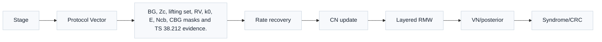
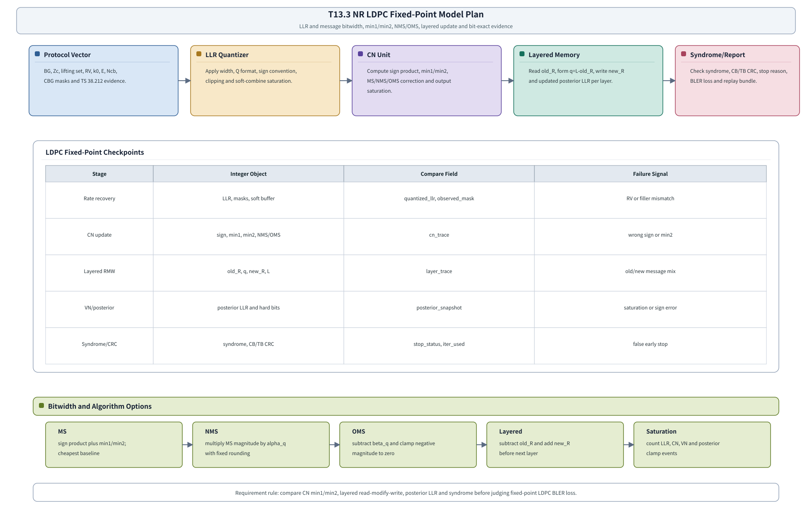

# T18.3 NR LDPC 定点模型计划：C/C++ 整数消息传递规格
## 本节学习目标

本节规划NR LDPC的 C/C++ 定点译码器模型。T17.3 已经定义浮点仿真：基图（Base Graph, BG）、提升大小 $Z_c$、速率恢复、置信传播（Belief Propagation, BP）、和积算法（Sum-Product Algorithm, SPA）、Min-Sum（MS）、归一化 Min-Sum（Normalized Min-Sum, NMS）、偏移 Min-Sum（Offset Min-Sum, OMS）、syndrome、循环冗余校验、块错误率曲线和失败回放。本节把这些浮点对象约束成整数模型：输入对数似然比怎样量化，校验节点（Check Node, CN）和变量节点（Variable Node, VN）消息怎样保存，`min1/min2` 怎样逐整数比较，NMS/OMS 参数怎样定点化，layered read-modify-write 怎样避免旧消息重复计数，以及 C/C++ 输出怎样和 Python 定点参考做 bit-exact 对比。


- 为 NR LDPC 输入 LLR、CN message、VN/posterior LLR、`min1/min2`、syndrome trace 分配位宽、小数位、饱和和舍入策略。
- 说明 TS 38.212 规定 BG、$Z_c$、rate matching 和 RV 语义，但不规定接收机内部 MS/NMS/OMS 位宽。
- 写出 MS/NMS/OMS 的整数执行路径，解释 `alpha_q`、`beta_q`、min1/min2、符号异或和饱和计数。
- 设计 layered schedule 的 C/C++ 数组布局、状态字段、read-modify-write trace 和 bit-exact checkpoints。
- 给出 NMS/OMS 实验口径和 BLER 损失比较方法，避免把算法近似损失和量化损失混在一起。

如果只记住一句话：NR LDPC 定点模型不是把浮点 message passing 改成 `int16_t`，而是把协议矩阵身份、整数消息语义、min1/min2 来源、layered 写回、syndrome/CRC gate 和曲线损失预算一起固定下来。

## 前置知识检查

| 前置项 | 本节需要达到的程度 |
|:---|:---|
| T8.6 LDPC MS/NMS/OMS | 知道 CN 输出符号来自其他输入符号，幅度来自排除自身后的最小值；知道 NMS 的 $\alpha$ 和 OMS 的 $\beta$ 是实现参数。 |
| T8.7 LDPC layered schedule | 知道 layered update 的核心是 $L_j\leftarrow L_j-r_{old}+r_{new}$，后续 layer 读取新 posterior。 |
| T9.3 NR LDPC 混合自动重传请求soft buffer | 知道 RV、$k_0$、$E$、$N_{\mathrm{cb}}$、CBG和 soft combining 会决定 LDPC 输入 LLR。 |
| T17.3 NR LDPC 浮点仿真计划 | 知道浮点基线如何输出 BP/MS/NMS/OMS 曲线、syndrome trace、message statistics 和 failure dump。 |
| T18.1 定点译码器需求 | 知道 Q 格式、裁剪、舍入、饱和、性能损失预算和 bit-exact 检查点。 |

如果还不清楚 CN、VN、posterior LLR 和 syndrome 的区别，先回看 T8.4-T8.8。T18.3 默认你已经知道 LDPC 是一张 Tanner graph 上的消息传递译码，本节只把这些消息变成可审计的整数。

## Roadmap 卡片原文与本节执行范围

| 项目 | 内容 |
|:---|:---|
| 编号 | T18.3 |
| 前置 | T8.6, T9.3, T18.1 |
| Prompt | 请规划 C/C++ 定点 NR LDPC 译码器模型：LLR/消息位宽、最小/次小存储、归一化/偏移、layered 调度、饱和、syndrome 检查和 bit-exact 测试。写作时参考本文”单节讲义弹性审计清单”，按本节性质取舍：基础课重理论概念、解释和推导；协议课重 3GPP 前因后果和接收侧流程；工程课重仿真、定点、RTL/ASIC、验证和证据记录。 |
| 产出 | `docs/L3_工程实现/T18.3_NR_LDPC_fixed_point_model_plan.md` |
| 验收 | Learner can define fixed-point NMS/OMS experiments and compare BLER loss to floating point. |
| 3GPP/证据 | TS 38.212 Rel-19 `38212-j30` §5.3.2/§5.4.2; algorithm implementation evidence. 本地证据路径：TS 38.212 -> `3GPP_Rel19/processed/TS_38.212_38212-j30`. |

本节不实现真实 C/C++ 源码，而是写定点模型计划。协议精读的范围是确认 NR LDPC 的 BG、$Z_c$、lifting set、shift table、rate matching、limited buffer、RV 和 bit interleaving 语义；MS/NMS/OMS、layered schedule、位宽、缩放、饱和、syndrome early stop 频率、数组布局和调试计数器都是接收机实现策略，不能写成 TS 38.212 强制要求。

## 资料与协议边界

| 资料 | 本地路径 | 边界 |
| :--- | :--- | :--- |
| TS 38.212 §5.2.2 | `3GPP_Rel19/processed/TS_38.212_38212-j30/content.md` | 不在本节重新推导分段规则。 |
| TS 38.212 §5.3.2 | `content.md`；`tables/table_0013/0014/0015.csv/html` | 本节使用上游 T8.3 重建资产，不重画完整 BG shift table。 |
| TS 38.212 §5.4.2/§5.4.2.1/§5.4.2.2 | `content.md`；T9.3/T9.4 回链 | 接收端 LLR soft buffer 写回和饱和合并是逆向实现策略。 |
| T8.6 | `docs/L2_协议算法/T8.6_LDPC_MS_NMS_OMS.md` | 算法实现，不是 3GPP 强制译码算法。 |
| T8.7 | `docs/L2_协议算法/T8.7_layered_LDPC_decoding_schedule.md` | 调度是实现策略，TS 38.212 不规定 decoder schedule。 |
| T17.3 | `docs/L3_工程实现/T17.3_NR_LDPC_float_sim_plan.md` | 本节不生成真实 fixed BLER 曲线。 |

定点模型要继承协议对象，但不能把内部整数格式当作协议对象。例如 `base_graph=BG1`、`Zc=384`、`rv=2`、`E`、`Ncb` 和 `CBGTI` 必须来自协议向量或上游 descriptor；但 `cn_msg_width=7`、`posterior_width=10`、`nms_alpha_q=246`、`oms_beta_q=2` 和 `layer_schedule_id=layered_bg_row_order_v1` 是工程选择。

## LDPC 定点模型的理论底座

LDPC 译码的核心不是“求一个多项式”，而是在 Tanner graph 上反复交换软信息。每个 VN 对应一个编码比特，保存信道 LLR 和来自若干 CN 的约束消息；每个 CN 对应 parity-check matrix $H$ 的一行，要求相连变量的 GF(2) 和为 0。译码器的目标是把这些局部约束逐层传回到每个比特，直到 hard decision 同时满足 syndrome 和 CRC 边界。

本节的定点对象有六个：

| 对象 | 定义 | 接收端用途 | 定点风险 |
|:---|:---|:---|:---|
| channel LLR | rate recovery 后的母码位置软信息。 | 初始化 posterior LLR。 | 符号约定、shortened/unknown/repetition 处理错会污染整块。 |
| CN message `R` | CN 送给 VN 的外信息。 | 约束某个比特满足 parity check。 | min1/min2 或符号错会让错误约束传播。 |
| VN/posterior LLR `L` | channel LLR 与所有 CN message 的当前合成。 | 硬判决、syndrome 和下一层更新。 | layered 中旧消息扣除错会重复计数。 |
| `min1/min2` | 某个 CN 输入幅度的最小值和次小值。 | 高效生成排除自身的 CN 输出幅度。 | 输出给最小边时若仍用 min1，会形成回声信息。 |
| NMS/OMS 参数 | NMS 缩放 $\alpha$、OMS 偏移 $\beta$ 的定点版本。 | 控制 MS 近似的过度自信。 | 系数量化和舍入不同会破坏 bit-exact。 |
| syndrome trace | hard decision 代入 $H$ 后的校验子。 | early stop 和失败定位。 | syndrome zero 不能替代 TB CRC。 |

为什么 LDPC 定点模型特别容易出错？因为它的错误不一定立刻体现在最终 hard bits 上。一个 CN 的 `min2` 选择错，可能只让某条边消息偏大；几个 layer 后，posterior LLR 被逐步推向饱和；最后 syndrome 不收敛或 CRC 失败时，根因已经离最终输出很远。因此 T18.3 必须把 CN update、layered read-modify-write、posterior LLR 和 syndrome 分层打点。

一个小型直觉例子：某个 CN 的其他输入 LLR 幅度是 $[1,3,4]$。MS 输出幅度是 1。如果目标边自己正好是幅度 1 的那条输入，排除自身后输出幅度应该变成 3。若实现仍用 1，它就把目标边自己的弱证据返回给自己；若定点缩放又把 1 饱和或截断，后续 VN 会收到错误强度的约束。这个问题不会被协议表直接发现，只能靠 bit-exact `cn_trace` 和 toy vector 发现。

## 定点数据通路图




| 内容 | 说明 |
|:---|:---|
| Stage | Integer Object；Compare Field；Failure Signal |
| Protocol Vector | LLR Quantizer；CN Unit；Layered Memory；Syndrome/Report |
| BG, Zc, lifting set, RV, k0, E, Ncb, CBG masks and TS 38.212 evidence. | Apply width, Q format, sign convention, clipping and soft-combine saturation.；Compute sign product, min1/min2, MS/NMS/OMS correction and output saturation.；Read old_R, form q=L-old_R, write new_R and updated posterior LL |
| Rate recovery | LLR, masks, soft buffer；quantized_llr, observed_mask；RV or filler mismatch |
| CN update | sign, min1, min2, NMS/OMS；cn_trace；wrong sign or min2 |
| Layered RMW | old_R, q, new_R, L；layer_trace；old/new message mix |
| VN/posterior | posterior LLR and hard bits；posterior_snapshot；saturation or sign error |
| Syndrome/CRC | syndrome, CB/TB CRC；stop_status, iter_used；false early stop |
| Layered | subtract old_R and add new_R before next layer |
| Saturation | count LLR, CN, VN and posterior clamp events |
本节流程顺序为：Protocol Vector 提供 BG、$Z_c$、lifting set、RV、$k_0$、$E$、$N_{\mathrm{cb}}$ 和 CBG masks；LLR Quantizer 量化 rate recovery 后输入；CN Unit 计算符号、min1/min2、MS/NMS/OMS 和饱和；Layered Memory 执行 old_R/q/new_R/posterior read-modify-write；Syndrome/Report 输出 syndrome、CB/TB CRC、BLER loss 和 replay bundle。中部表格列出五层 compare checkpoint，底部列出算法和位宽选项。

图中底部选项区的标题是 `Bitwidth and Algorithm Options`，覆盖 input LLR、CN message、posterior、min1/min2、MS/NMS/OMS、NMS alpha、OMS beta、饱和策略和 syndrome/CRC gate。

## 输入输出与 C/C++ 对象

C/C++ 定点模型应从 T17.3 run directory 或 failure bundle 读取对象，而不是手写散装数组。

| 输入对象 | 字段 | 用途 |
|:---|:---|:---|
| `vector.json` | `base_graph`、`Zc`、`lifting_set`、`K`、`N`、`E`、`Ncb`、`rv`、`k0`、`cb_id`、`cbg_id`、`filler_mask` | 协议身份和地址生成。 |
| `input_llr.npy` | rate recovery 后 mother-code 位置 LLR | 定点量化输入。 |
| `fixed_requirement.yaml` | `llr_width`、`cn_msg_width`、`vn_msg_width`、`nms_alpha_q`、`oms_beta_q`、`round_mode`、`saturation_mode` | 数值格式和比较口径。 |
| `layer_schedule.json` | layer、edge、column group、shift、local index policy、hash | layered 地址和 message memory 访问。 |
| `expected_bits.npy` | CB 信息位或 TB payload 参考 | 最终 hard bits、CB CRC 和 TB CRC 诊断。 |

建议 C/C++ 结构体分成四类：

```c
typedef struct {
  uint8_t  base_graph;      /* 1 or 2 */
  uint16_t Zc;
  uint8_t  lifting_set;
  uint16_t K;
  uint16_t N;
  uint16_t E;
  uint16_t Ncb;
  uint8_t  rv_idx;
  uint16_t k0;
  uint16_t cb_id;
  uint16_t cbg_id;
  uint8_t  max_iter;
  uint8_t  syndrome_stop_enabled;
} NrLdpcDescriptor;

typedef struct {
  int8_t llr_width;
  int8_t llr_frac;
  int16_t llr_min;
  int16_t llr_max;
  int8_t cn_msg_width;
  int8_t cn_msg_frac;
  int16_t cn_msg_min;
  int16_t cn_msg_max;
  int8_t posterior_width;
  int8_t posterior_frac;
  int16_t posterior_min;
  int16_t posterior_max;
  int8_t min_width;
  int8_t min_frac;
  uint16_t nms_alpha_q;
  uint8_t nms_alpha_frac;
  uint16_t oms_beta_q;
  uint8_t oms_beta_frac;
  uint8_t decoder_variant;       /* ms, nms, oms */
  uint8_t round_mode;
  uint8_t saturation_mode;
  uint8_t sign_product_policy;
  uint8_t layer_schedule_id;
} NrLdpcFixedConfig;

typedef struct {
  int16_t *channel_llr;
  int16_t *posterior_llr;
  int16_t *old_r_msg;
  int16_t *new_r_msg;
  uint16_t *edge_to_var;
  uint16_t *layer_start;
} NrLdpcFixedBuffers;

typedef struct {
  uint16_t iter_index;
  uint16_t layer_index;
  uint32_t llr_sat_count;
  uint32_t cn_sat_count;
  uint32_t posterior_sat_count;
  uint32_t min1_min2_tie_count;
  int16_t max_abs_llr;
  int16_t max_abs_cn_msg;
  int16_t max_abs_posterior;
  uint16_t syndrome_weight;
  uint8_t cb_crc_pass;
  uint8_t stop_reason;
} NrLdpcFixedTrace;
```

这些结构体是计划级接口，不是最终应用二进制接口（Application Binary Interface, ABI）。`NrLdpcFixedConfig` 必须能唯一决定 bit-exact 行为：同一个输入向量、同一个配置对象和同一个代码版本，不能因为 NMS/OMS 系数量化、舍入、符号异或、min tie-break 或 layer schedule 缺字段而得到两个合法答案。

## LLR 与消息位宽

LDPC 定点位宽至少分三层，不建议只写“LLR 6 bit”：

| 层 | 字段 | 说明 |
|:---|:---|:---|
| 输入 LLR | `llr_width/frac/min/max/scale/sign_convention` | rate recovery 后的 channel evidence。 |
| CN message | `cn_msg_width/frac/min/max` | CN 输出消息，通常用于 message memory。 |
| posterior/VN | `posterior_width/frac/min/max/guard_bits` | channel LLR 与多个 CN message 累加后的当前总证据。 |

变量节点 posterior 的动态范围通常大于单条 CN message。若一个 VN 连接 $d_v$ 条边，粗略上 posterior 可能接近：

$$
L_j \approx L_{\mathrm{ch},j}+\sum_{i\in\mathcal{M}(j)}R_{i\to j}.
\tag{1}
$$

式 (1) 说明了为什么 posterior 需要 guard bits。若 `posterior_width` 与 `cn_msg_width` 完全相同，layered 更新中几条中等强度消息相加后就可能饱和；若饱和过多，BLER 损失会被误认为 NMS/OMS 参数不合适。

建议第一版实验矩阵至少比较：

| requirement id | LLR | CN message | posterior | 用途 |
|:---|:---|:---|:---|:---|
| `ldpc_q6_msg6_post8` | Q4.2 6 bit | Q4.2 6 bit | Q6.2 8 bit | 面积优先 baseline。 |
| `ldpc_q7_msg7_post10` | Q4.3 7 bit | Q4.3 7 bit | Q7.3 10 bit | 性能/面积折中。 |
| `ldpc_q8_msg8_post12` | Q5.3 8 bit | Q5.3 8 bit | Q8.3 12 bit | 接近浮点趋势的参考。 |

这些不是协议常数，只是实验入口。最终选择必须由 T17.5 曲线和 T18.6 bit-exact regression 证明。

## CN Update：符号、Min1、Min2 与饱和

对某个 CN，输入给目标边 $j$ 的其他 VN-to-CN 消息为 $q_{j'\to i}$。MS 输出为：

$$
R_{i\to j}^{\mathrm{MS}}
=
\left(\prod_{j'\in\mathcal{N}(i)\setminus j}\operatorname{sign}(q_{j'\to i})\right)
\min_{j'\in\mathcal{N}(i)\setminus j}|q_{j'\to i}|.
\tag{2}
$$

定点实现不应逐边重新扫描全部输入，而是先计算：

$$
m_1=\min_{k\in\mathcal{N}(i)}|q_{k\to i}|,
\qquad
k_1=\arg\min_{k\in\mathcal{N}(i)}|q_{k\to i}|,
\tag{3}
$$

$$
m_2=\min_{k\in\mathcal{N}(i)\setminus k_1}|q_{k\to i}|.
\tag{4}
$$

输出给 $j$ 的幅度为：

$$
M_{i\to j}=
\begin{cases}
m_2, & j=k_1,\\
m_1, & j\ne k_1.
\end{cases}
\tag{5}
$$

式 (5) 是 bit-exact 的高风险点。C/C++ 必须 dump `min1_value`、`min1_index`、`min2_value`、`target_edge`、`selected_min` 和 `sign_excluding_target`。如果 `target_edge == min1_index` 时仍使用 `min1_value`，就是把自身证据带回自身。

小型数值例子：输入幅度为 $[5,2,7,3]$，`min1=2` 来自边 1，`min2=3` 来自边 3。输出给边 0、2、3 时幅度用 2；输出给边 1 时幅度用 3。若边 1 的输出仍用 2，`cn_trace` 必须判失败。

## NMS 与 OMS 定点参数

NMS 在 MS 输出上乘 $\alpha$：

$$
R_{i\to j}^{\mathrm{NMS}}=\alpha R_{i\to j}^{\mathrm{MS}},\qquad 0<\alpha\le1.
\tag{6}
$$

定点模型建议把 $\alpha$ 写成 Q 格式，例如 `nms_alpha_q=246, nms_alpha_frac=8` 表示：

$$
\alpha_q=\frac{246}{2^8}=0.9609375.
\tag{7}
$$

整数实现可写为：

$$
R^{\mathrm{NMS}}_q=
\operatorname{sat}\left(
\operatorname{round}\left(\frac{\alpha_q^{\mathrm{int}}\cdot R^{\mathrm{MS}}_q}{2^{F_\alpha}}\right)
\right).
\tag{8}
$$

OMS 在幅度上减 $\beta$ 并截零：

$$
R_{i\to j}^{\mathrm{OMS}}
=
\operatorname{sign}(R_{i\to j}^{\mathrm{MS}})
\max(|R_{i\to j}^{\mathrm{MS}}|-\beta,0).
\tag{9}
$$

若 `oms_beta_q=2, oms_beta_frac=2`，则 $\beta=0.5$。整数实现必须先在幅度域减 offset，再恢复符号，且 `magnitude < beta` 时输出 0，不能下溢成负幅度。NMS/OMS 的 `round_mode`、`saturation_mode` 和 tie-break 都必须写入 `fixed_requirement.yaml`。

## Layered Read-Modify-Write

Layered schedule 中，posterior LLR 已包含旧 CN message。当前 layer 重新计算某条边的新消息后，更新关系是：

$$
Q_{j\to i}=L_j-R_{old,i\to j},
\tag{10}
$$

$$
L_j\leftarrow Q_{j\to i}+R_{new,i\to j}.
\tag{11}
$$

式 (10) 和式 (11) 是定点 LDPC 最重要的检查点。若实现写成 `L_j += R_new`，旧消息会重复计数；若 `R_old` 没同步更新，下一次处理同一 layer 会减错值。

需要固定的 trace 字段：

| 字段 | 含义 |
|:---|:---|
| `iter_index`、`layer_index`、`edge_index` | 定位更新位置。 |
| `old_posterior_q` | 更新前 $L_j$。 |
| `old_r_q` | 旧 $R_{old,i\to j}$。 |
| `q_msg_q` | 式 (10) 的 VN-to-CN 输入。 |
| `new_r_q` | CN update 输出。 |
| `new_posterior_q` | 式 (11) 的更新后 posterior。 |
| `sat_flags` | q、R、posterior 是否饱和。 |

T18.6 的 bit-exact compare 应能在 `layer_trace` 中定位第一处 mismatch。

## C/C++ 数组布局计划

第一版 C/C++ 模型以清晰和 bit-exact 为先，不先追求单指令多数据（Single Instruction, Multiple Data, SIMD）。T18.5 会再处理 SIMD lane、cache 和 bank。

| 数组 | 形状 | 类型 | 说明 |
|:---|:---|:---|:---|
| `channel_llr[N]` | mother-code 位置 | `int16_t` | rate recovery 后量化输入。 |
| `posterior_llr[N]` | mother-code 位置 | `int16_t` 或 `int32_t` | 当前 VN 总证据。 |
| `r_msg[num_edges * Zc]` | edge x local | `int16_t` | 旧 CN-to-VN message。 |
| `edge_to_var[num_edges * Zc]` | edge x local | `uint16_t/uint32_t` | bit-level VN 地址。 |
| `layer_start[num_layers+1]` | layer index | `uint32_t` | 每层 edge 范围。 |
| `filler_mask[N]`、`known_mask[N]`、`observed_mask[N]` | mother-code 位置 | bitset | LLR 初始化和验证。 |

状态字段至少包括 `iter_index`、`layer_index`、`decoder_variant`、`llr_sat_count`、`cn_sat_count`、`posterior_sat_count`、`min1_min2_tie_count`、`max_abs_llr`、`max_abs_cn_msg`、`max_abs_posterior`、`syndrome_weight`、`cb_crc_pass`、`stop_reason`。

## Bit-Exact 测试方案

T18.3 的 bit-exact 不直接对浮点 BP，而是按三层比较：

| 层级 | 参考 | 被测 | 比较规则 |
|:---|:---|:---|:---|
| Python fixed | Python 定点 LDPC reference | C/C++ fixed | 所有整数检查点 exact。 |
| Python float | T17.3 浮点 BP/MS/NMS/OMS | Python/C fixed | 曲线和统计比较，不要求整数一致。 |
| C/C++ fixed | T18.3 模型 | 后续 RTL | 指定 checkpoint exact。 |

命令模板：

```bash
python3 -m decoder_golden.fixed.nr_ldpc_prepare \
  --run runs/20260620_nr_ldpc_awgn_seed20260620 \
  --fixed-requirement configs/fixed/t13_3_nr_ldpc_q7_msg7_post10.yaml \
  --decoder-variant nms \
  --variant-sweep ms,nms,oms \
  --out runs_fixed/20260620_nr_ldpc_q7_prepare

cmake --build build --target nr_ldpc_fixed_test

build/tests/nr_ldpc_fixed_test \
  --vector runs_fixed/20260620_nr_ldpc_q7_prepare/failures/frame_000231_cb002/vector.json \
  --requirement configs/fixed/t13_3_nr_ldpc_q7_msg7_post10.yaml \
  --decoder-variant nms \
  --dump runs_fixed/20260620_nr_ldpc_q7_prepare/cpp_trace/frame_000231_cb002 \
  --checkpoints quantized_llr,cn_min,layered_rmw,posterior,syndrome_crc

python3 -m decoder_golden.compare.checkpoints \
  --python runs_fixed/20260620_nr_ldpc_q7_prepare/python_trace/frame_000231_cb002 \
  --cpp runs_fixed/20260620_nr_ldpc_q7_prepare/cpp_trace/frame_000231_cb002 \
  --policy exact_integer \
  --out runs_fixed/20260620_nr_ldpc_q7_prepare/compare/frame_000231_cb002.json

python3 -m decoder_golden.reporting.fixed_loss \
  --float-baseline runs/20260620_nr_ldpc_awgn_seed20260620/metrics.csv \
  --fixed-runs runs_fixed/20260620_nr_ldpc_q7_prepare/ms/metrics.csv,runs_fixed/20260620_nr_ldpc_q7_prepare/nms/metrics.csv,runs_fixed/20260620_nr_ldpc_q7_prepare/oms/metrics.csv \
  --group-by decoder_variant,snr_db \
  --fields syndrome_stop_rate,cb_crc_pass_rate,tb_crc_pass_rate,bler,fixed_loss_db,sat_count_llr,sat_count_cn,sat_count_posterior \
  --out runs_fixed/20260620_nr_ldpc_q7_prepare/reports/ms_nms_oms_fixed_loss.json
```

这些命令是接口模板，当前仓库尚未实现 `decoder_golden.fixed` 或 C/C++ test binary。执行记录不能把它们写成已运行。

## NMS/OMS 实验与 BLER 损失比较

定点损失比较必须拆成两层：

| 比较 | 目的 |
|:---|:---|
| float BP/SPA vs float MS/NMS/OMS | 算法近似损失。 |
| float NMS/OMS vs fixed NMS/OMS | 定点量化损失。 |
| fixed q6/msg6 vs fixed q8/msg8 | 位宽敏感性。 |
| fixed NMS alpha sweep vs fixed OMS beta sweep | 参数与定点格式交互。 |

推荐输出字段：

| 字段 | 说明 |
|:---|:---|
| `float_baseline_run_id` | T17.3 浮点基线。 |
| `fixed_run_id` | 当前定点运行。 |
| `decoder_variant` | `ms`、`nms`、`oms`。 |
| `nms_alpha_q`、`oms_beta_q` | 定点参数。 |
| `fixed_requirement_id` | 位宽/缩放/饱和规格版本。 |
| `fixed_loss_budget_db` | 例如 0.10 dB。 |
| `bler_ratio_budget` | 同一 SNR 点 BLER 比值预算。 |
| `sat_count_llr/cn/posterior` | 解释性能损失。 |
| `confidence_limited` | 样本不足时禁止强结论。 |

若固定点 NMS 比浮点 BP 差 0.25 dB，不能直接说“定点损失 0.25 dB”。必须先看浮点 NMS 相对浮点 BP 的损失，再看 fixed NMS 相对 float NMS 的额外损失。

## RTL/ASIC 映射

T18.3 的定点模型会直接变成 T19.2 NR LDPC RTL 微架构的前置规格。

| C/C++ 对象 | RTL/ASIC 对象 | 风险 |
|:---|:---|:---|
| `channel_llr/posterior_llr` | LLR RAM、posterior RAM、read/write ports。 | 符号扩展、bank conflict、写后读 hazard。 |
| `r_msg` | CN message RAM。 | 旧消息与新消息不同步。 |
| `min1/min2 trace` | CN unit compare tree。 | tie-break、min2、sign excluding target 错。 |
| `nms_alpha_q/oms_beta_q` | scale/offset datapath。 | 系数量化和舍入不一致。 |
| `layer_schedule` | edge schedule ROM 和 address generator。 | BG/Zc/shift 地址错。 |
| `syndrome_status` | syndrome checker 和 early stop controller。 | 未完整检查 $H$ 就提前停止。 |
| `sat_count` | debug counter 或控制状态寄存器（Control and Status Register, CSR）。 | 没有可观测饱和信息。 |

RTL 可以选择不同并行度、bank mapping、layer folding 或 partial parallelism；但只要它声明兼容某个 `fixed_requirement_id`，就必须在 T18.6/T15 中通过同一组 bit-exact 检查点。

## 验证方法

| 验证项 | 方法 | 通过标准 |
|:---|:---|:---|
| LLR 量化 | 强正、强负、0、unknown、shortened、repeated LLR。 | `quantized_llr` 与 Python fixed 一致。 |
| CN min1/min2 | 构造唯一最小值、并列最小值、目标边为 min1 的输入。 | `selected_min`、`sign_excluding_target` 逐整数一致。 |
| NMS/OMS | 固定 `alpha_q/beta_q` 和舍入模式。 | 缩放/偏移后整数一致且不下溢。 |
| Layered RMW | 构造 `old_L/old_R/new_R` 三元组。 | 满足式 (10)、式 (11)。 |
| Syndrome | 无噪声短块和单比特错误。 | syndrome zero/pass 和 nonzero/fail 可解释。 |
| HARQ/RV | 使用 T9.3 风格 RV0/RV2 重传向量。 | soft buffer 合并和 input LLR checkpoint 一致。 |
| 性能预算 | fixed vs float 曲线。 | 满足 T18.1/T17.5 预算和置信区间要求。 |

## 常见错误

| 错误 | 后果 | 修正 |
|:---|:---|:---|
| `min1` 输出给自身边 | 回声信息，消息幅度偏小或错误。 | 目标边为 min1 时使用 `min2`，记录 `target_edge`。 |
| 符号异或包含目标边 | CN 输出符号错。 | `sign_excluding_target` 单独测试。 |
| `L += R_new` 而不是减旧加新 | old message 重复计数，posterior 过度自信。 | 按式 (10)、式 (11) 打 checkpoint。 |
| NMS/OMS 参数只写浮点 | C/C++、Python、RTL 舍入不同。 | 写 `alpha_q/beta_q/frac/round_mode`。 |
| 饱和只看输入 LLR | 内部 CN/posterior 已饱和。 | 分层记录 saturation counters。 |
| syndrome zero 替代 TB CRC | 可能误交付错误业务块。 | syndrome、CB CRC、TB CRC 分层 gate。 |
| TS 38.212 row table 顺序当作强制 schedule | 把实现调度误写成协议规定。 | 协议给 $H$，schedule 是实现策略；必须记录 `layer_schedule_id`。 |

## 工业用例

| 用例 | 价值 |
|:---|:---|
| NR LDPC C 模型交付 | 算法团队交付 fixed NMS/OMS 时，评审者可逐项检查位宽、min1/min2、layered RMW、饱和和 bit-exact trace。 |
| LDPC RTL CN unit bring-up | 硬件团队先对齐 CN `sign/min1/min2/NMS/OMS` trace，再对齐 layer/posterior/syndrome，避免直接调大曲线。 |

## 自测题

1. 为什么 TS 38.212 可以约束 BG 和 $Z_c$，却不规定 `cn_msg_width=7`？
2. 输出给 `min1` 所在边时为什么必须使用 `min2`？
3. Layered update 中为什么要先减旧消息再加新消息？
4. NMS 的 `alpha_q` 为什么必须记录小数位和舍入模式？
5. 比较 fixed NMS 与 float BP 时，为什么要拆分算法近似损失和定点量化损失？
6. T18.3 最少应保存哪五层 compare checkpoint？

## 自测题参考答案

1. TS 38.212 规定 NR LDPC 的协议矩阵和 rate matching 对象；接收机内部消息位宽是实现选择，只要能按协议恢复、译码和校验。
2. 因为 CN 输出给某条边时必须排除该边自己的输入。若目标边就是全局最小值来源，继续使用 `min1` 会把自身证据带回自身，违反外信息原则。
3. posterior LLR 已经包含旧 CN message；只加新 message 会重复计数。正确做法是 $Q=L-R_{old}$，再 $L=Q+R_{new}$。
4. 同一个浮点 $\alpha$ 可以被不同整数 Q 格式表示，乘法后舍入也可能不同。缺少小数位和舍入模式会导致 Python/C/RTL 不 bit-exact。
5. BP/SPA 到 NMS 本身有算法近似损失；float NMS 到 fixed NMS 才是定点量化损失。混在一起无法判断应该改算法还是改位宽。
6. 量化 LLR、CN min1/min2、layered read-modify-write、posterior LLR、syndrome/CRC。工程上还应保存 soft buffer 合并和 layer schedule hash。

## 本节验收

| 验收项 | 通过标准 |
|:---|:---|
| Prompt 覆盖 | 覆盖 LLR/消息位宽、min1/min2、NMS/OMS、layered、饱和、syndrome 和 Python bit-exact 测试。 |
| C/C++ 计划 | 给出结构体、数组布局、状态字段和命令模板。 |
| 协议边界 | 明确 TS 38.212 约束 BG/Zc/rate matching，不强制定点算法模式和位宽。 |
| 检查点 | 至少有 quantized LLR、CN min、layered RMW、posterior、syndrome/CRC 五层 compare。 |

## 协议证据表

| 证据项 | TS 与 Rel-19 包 | 本地路径 | 状态 |
| :--- | :--- | :--- | :--- |
| NR LDPC segmentation | TS 38.212 `38212-j30` §5.2.2 | `3GPP_Rel19/processed/TS_38.212_38212-j30/content.md` | 已由 T17.3/T9.5 回链。 |
| NR LDPC coding and H | TS 38.212 §5.3.2、Table 5.3.2-1/2/3 | `tables/table_0013/0014/0015.csv/html`；T8.3 | 上游已复现。 |
| NR LDPC rate matching | TS 38.212 §5.4.2/§5.4.2.1/§5.4.2.2 | `content.md`；T9.3/T9.4 | 使用上游证据回链。 |
| MS/NMS/OMS | 非 3GPP 强制算法 | T8.6；Fossorier/Chen 文献 | 实现策略。 |
| Layered schedule | 非 3GPP 强制调度 | T8.7；Hocevar 文献 | 实现策略。 |

## 未复现协议资产与关闭条件

| 候选资产 | 本节处理 | 关闭条件 |
|:---|:---|:---|
| TS 38.212 Table 5.3.2-1/2/3 全表 | 本节回链 T8.3，不重新复制长表。 | 若 T18.3 代码直接解析原表生成 layer schedule，必须把 T8.3 CSV/HTML、脚本和 hash 纳入 fixed evidence archive。 |
| TS 38.212 Table 5.4.2.1-2 | 本节只消费 T9.3 的 `rv/k0/Ncb/E` descriptor。 | 若 fixed model 从协议表自动生成 $k_0$，必须纳入 T9.3 的公式证据和 toy 校验。 |
| TS 38.214 调制与编码方案/传输块大小/CBG 表 | 本节不使用具体 MCS/TBS 表值，只要求 vector 已包含 $E/Q_m/RV/CBGTI$。 | 若 fixed vector 从 MCS index 自动生成 TB size、$Q_m$ 或 CBG mask，必须重建实际使用表格子集。 |
| 真实 C/C++ trace | 本节只给计划和命令模板。 | 实现 `nr_ldpc_fixed_test` 后回填真实 quantized LLR、CN、layer、posterior、syndrome/CRC trace。 |

## 图示


## 执行与证据记录

| 项目 | 记录 |
|:---|:---|
| 工作区 | `/home/yys/ClaudeCode/3gpp` |
| 写入文件 | `docs/L3_工程实现/T18.3_NR_LDPC_fixed_point_model_plan.md` |
| 新增证据资产 | `docs/L3_工程实现/assets/T13.3_NR_LDPC_fixed_point_model.svg`（手绘 SVG，替代原 PIL 渲染 PNG 及 `tools/figures/render_t13_3_nr_ldpc_fixed_point_model.py`）。 |
| Roadmap 卡片 | 已读取 `2026-06-19-lte-nr-decoding-learning-roadmap.md` 中 T18.3。 |
| 台账依据 | 已读取 `docs/audits/lte_nr_decoding_remaining_work_register.md` 阶段 12 与 T18.3 条目。 |
| 上游讲义 | 已读取 `docs/L2_协议算法/T8.6_LDPC_MS_NMS_OMS.md`、`docs/L2_协议算法/T8.7_layered_LDPC_decoding_schedule.md`、`docs/L3_工程实现/T17.3_NR_LDPC_float_sim_plan.md`、`docs/L3_工程实现/T18.1_fixed_point_decoder_requirements.md`。 |
| 术语审计 | `python3 tools/audit_lesson_terms.py docs/L3_工程实现/T18.3_NR_LDPC_fixed_point_model_plan.md`：`LESSON_TERM_AUDIT_OK`。 |
| 标题审计 | `python3 tools/audit_markdown_headings.py docs/L3_工程实现/T18.3_NR_LDPC_fixed_point_model_plan.md`：`MARKDOWN_HEADING_AUDIT_OK`。 |
| 深度审计 | `python3 tools/audit_lesson_depth.py --strict docs/L3_工程实现/T18.3_NR_LDPC_fixed_point_model_plan.md`：`LESSON_DEPTH_AUDIT_OK`。 |
| LaTeX 审计 | `python3 tools/audit_latex_render.py docs/L3_工程实现/T18.3_NR_LDPC_fixed_point_model_plan.md`：`LATEX_RENDER_AUDIT_OK formulas=55`。 |
| 引用重建审计 | `python3 tools/audit_reference_rebuilds.py docs/L3_工程实现/T18.3_NR_LDPC_fixed_point_model_plan.md`：`REFERENCE_REBUILD_AUDIT_CANDIDATES`，候选来自上游已重建 TS 38.212 表格回链、实现策略边界、论文引用和 TS 38.214 MCS/TBS 条件项；本节未直接使用 MCS/TBS 表值。 |
| 未执行内容 | 本节未实现真实 C/C++ 定点 NR LDPC decoder，未执行命令模板，未生成真实 fixed BLER 曲线。 |

## 参考文献

- [3GPP, 2026] 3GPP TS 38.212 Rel-19 `38212-j30`, NR Multiplexing and channel coding. 本地路径：`3GPP_Rel19/processed/TS_38.212_38212-j30/`。
- [Fossorier et al., 1999] M. P. C. Fossorier, M. Mihaljevic, and H. Imai, “Reduced Complexity Iterative Decoding of Low-Density Parity Check Codes Based on Belief Propagation,” IEEE Transactions on Communications, 1999.
- [Chen and Fossorier, 2002] J. Chen and M. P. C. Fossorier, “Near Optimum Universal Belief Propagation Based Decoding of Low-Density Parity Check Codes,” IEEE Transactions on Communications, 2002.
- [Hocevar, 2004] D. E. Hocevar, “A Reduced Complexity Decoder Architecture via Layered Decoding of LDPC Codes,” IEEE Workshop on Signal Processing Systems, 2004.
- [上游讲义] `docs/L2_协议算法/T8.6_LDPC_MS_NMS_OMS.md`，LDPC Min-Sum、NMS 与 OMS。
- [上游讲义] `docs/L2_协议算法/T8.7_layered_LDPC_decoding_schedule.md`，LDPC 分层译码调度。
- [上游讲义] `docs/L3_工程实现/T17.3_NR_LDPC_float_sim_plan.md`，NR LDPC 浮点仿真计划。
- [上游讲义] `docs/L3_工程实现/T18.1_fixed_point_decoder_requirements.md`，定点译码器需求。
