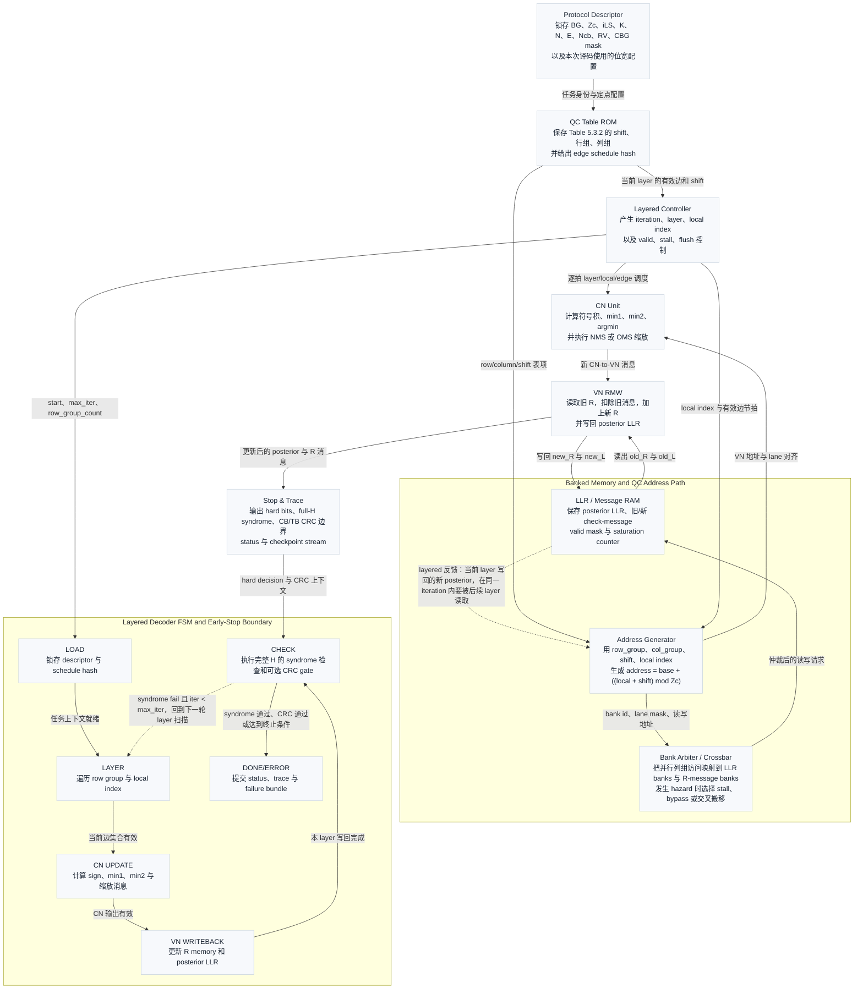
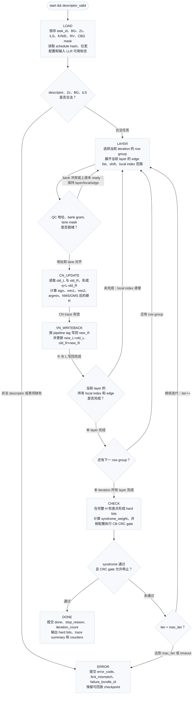
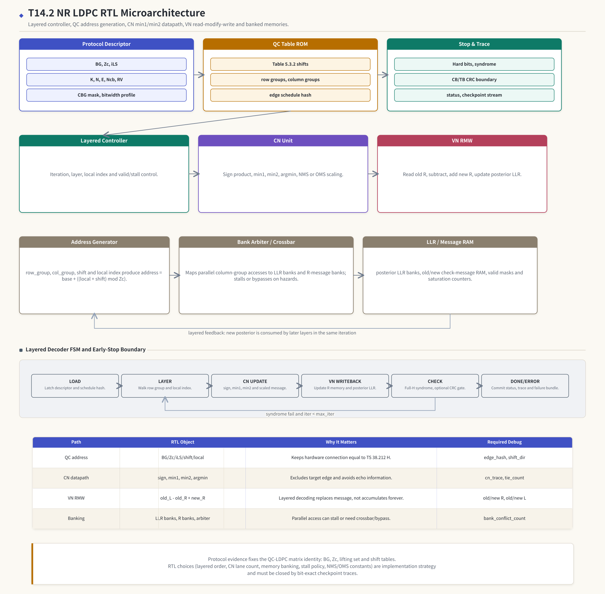

# T19.2 NR LDPCRTL 微架构：从 QC 地址生成到 Layered 存储 Bank
## 本节学习目标

本节设计NR LDPC译码器的寄存器传输级微架构。先把本篇会反复使用的术语列清：基图（Base Graph, BG）是协议给出的稀疏连接模板；提升大小（lifting size）$Z_c$ 把模板中的一个连接扩展成 $Z_c$ 条规律连接；准循环 LDPC（Quasi-Cyclic LDPC, QC-LDPC）表示矩阵由循环移位单位矩阵拼成；校验节点（Check Node, CN）对应奇偶校验方程；变量节点（Variable Node, VN）对应编码比特；对数似然比是接收端软信息；循环冗余校验用于码块或传输块完整性检查；码块是 LDPC core 一次译码的对象；传输块是多个 CB 重组后的交付对象；CBG是混合自动重传请求部分重传可操作的 CB 集合；块错误率是性能验收指标；专用集成电路实现要关注面积、功耗、吞吐、时序和验证证据。


- 从3GPP TS 38.212 §5.3.2 的 BG、$Z_c$、lifting set 和 shift table 推出 RTL 的 edge schedule、地址生成器和 syndrome checker 输入。
- 画出 layered NR LDPC decoder 的主数据通路：descriptor、QC table ROM、layered controller、CN min1/min2 unit、VN read-modify-write、LLR/message RAM bank、syndrome/CRC gate 和 trace/status 输出。
- 解释 layered update 为什么是 $L_j \leftarrow L_j-r_{\mathrm{old}}+r_{\mathrm{new}}$，不是把所有消息无限累加。
- 说明 CN unit 为什么要保存 `min1/min2/argmin/sign`，以及目标边本身为最小值时为什么必须用 `min2`。
- 设计 message memory、posterior LLR memory、edge schedule ROM 和 bank conflict 处理策略，并能给出吞吐估算口径。
- 区分 syndrome early stop、CB CRC 和 TB CRC 的边界，避免把局部 layer 检查误写成完整 CB 通过。
- 规划 bit-exact 验证：`quantized_llr`、`cn_update`、`layer_trace`、`posterior_snapshot`、`syndrome_crc` 等检查点必须能和 C/C++ fixed model 对齐。

如果只记住一句话：TS 38.212 定义 NR LDPC 的矩阵身份，即 BG、$Z_c$、set index 和 shift value 如何生成完整 $H$；RTL 微架构负责把这个矩阵身份实现成地址、存储、比较器、流水、bank、早停和可回放 trace，但 layered 调度、Min-Sum 变体、位宽、bank 数、stall 策略和吞吐目标都是接收机实现策略，不是 3GPP 强制规定。

## 前置知识检查

| 前置项 | 本节需要达到的程度 |
|:---|:---|
| T5.2 存储分 bank 与缓存基础 | 知道静态随机存取存储器、寄存器文件、多 bank、bank conflict、stall、bypass 和 crossbar 的含义。 |
| T5.4 RTL 状态机与握手 | 知道 `valid/ready`、start/done/error、同步复位、pipeline stall 和状态转移条件。 |
| T8.3 NR LDPC 提升大小与 QC 矩阵构造 | 知道 BG、$Z_c$、$i_{\mathrm{LS}}$、shift value 和 $P^p$ 的含义。 |
| T8.6 LDPC MS/NMS/OMS | 知道 CN 输出符号、min1/min2、归一化 Min-Sum（Normalized Min-Sum, NMS）和偏移 Min-Sum（Offset Min-Sum, OMS）。 |
| T8.7 Layered LDPC 调度 | 知道 layered read-modify-write 公式和 syndrome/CRC early-stop 边界。 |
| T9.1-T9.5 NR LDPC rate recovery 与 HARQ | 知道 rate recovery 后的 LLR 如何进入 LDPC core，RV、$k_0$、$N_{\mathrm{cb}}$ 和 CBG mask 是 descriptor 上下文。 |
| T18.3 NR LDPC 定点模型计划 | 知道整数位宽、CN message、posterior LLR、layer trace、saturation 和 C/C++ fixed checkpoint。 |
| T18.6 Bit-Exact 回归框架 | 知道 RTL 输出必须和 Python/C++ fixed trace 在 metadata/hash/checkpoint 上逐项比较。 |

若尚未掌握“CN、VN 和 syndrome 是什么”，先回看 T8.4-T8.8。本节默认你已经理解 LDPC 是在 Tanner graph 上交换软信息；这里要解决的是：这张由协议表定义的大图，如何变成 ASIC 中每拍可读写的 banked memory、地址生成器、比较器树和 stop controller。

## Roadmap 卡片原文与本节执行范围

| 项目 | 内容 |
|:---|:---|
| 编号 | T19.2 |
| 前置 | T5.2, T5.4, T18.3 |
| Prompt | 请设计 NR LDPC RTL 微架构：layered 调度控制器、校验节点单元、变量节点更新、最小/次小数据通路、消息存储、LLR 存储、bank 冲突处理、syndrome/CRC 早停和吞吐估算。写作时参考本文“单节讲义弹性审计清单”，按本节性质取舍：基础课重理论概念、解释和推导；协议课重 3GPP 前因后果和接收侧流程；工程课重仿真、定点、RTL/ASIC、验证和证据记录。 |
| 产出 | `docs/L3_工程实现/T19.2_NR_LDPC_RTL_microarchitecture.md` |
| 验收 | Learner can draw a layered LDPC decoder architecture and identify memory banking constraints. |
| 3GPP/证据 | TS 38.212 Rel-19 `38212-j30` §5.3.2 的 table-driven QC 结构；RTL design is implementation guidance。 |

本节是工程微架构课，不实现真实 SystemVerilog 源码。正文会给结构、接口、状态机、存储估算、伪代码和验证计划。真实 RTL 编码、testbench、覆盖率、综合约束和时序报告会在 T20 系列承接。

## 资料与协议边界

| 资料 | 本地路径 | 边界 |
| :--- | :--- | :--- |
| TS 38.212 README | `3GPP_Rel19/processed/TS_38.212_38212-j30/README.md` | README 只证明抽取结构存在，不替代协议精读。 |
| TS 38.212 §5.3.2 | `content.md:945-989` | 协议定义编码矩阵，不定义接收端 decoder schedule。 |
| Table 5.3.2-1 | `tables/table_0013.csv/html` | 本节引用表语义，完整表已由 T8.3/T3.4 表格化复现。 |
| Table 5.3.2-2 | `tables/table_0014.csv/html` | RTL 只读取本任务 BG 对应表，不在本文重复长表。 |
| Table 5.3.2-3 | `tables/table_0015.csv/html` | RTL 只读取本任务 BG 对应表，不在本文重复长表。 |
| TS 38.212 §5.4.2 | `content.md:1175-1295` | 本节不重写 rate recovery，默认输入 LLR 已放回 LDPC code-bit 位置。 |
| T8.3 | `docs/L2_协议算法/T8.3_NR_LDPC_lifting_QC_matrix.md` | T19.2 把它映射到 RTL 地址和 bank。 |
| T8.7 | `docs/L2_协议算法/T8.7_layered_LDPC_decoding_schedule.md` | T19.2 扩展为微架构和验证字段。 |
| T18.3 | `docs/L3_工程实现/T18.3_NR_LDPC_fixed_point_model_plan.md` | T19.2 把对象变成 RTL 端口、SRAM、counter 和 trace。 |
| T18.6 | `docs/L3_工程实现/T18.6_bit_exact_regression_harness.md` | 本节只定义 RTL 侧怎么输出这些 checkpoint。 |

协议前因后果是：NR 使用 LDPC 处理数据传输的大码块。TS 38.212 不把完整奇偶校验矩阵 $H$ 一项项写出，而是用 BG 表、lifting size set 和 shift value 生成结构化稀疏矩阵。这样做的工程后果非常直接：硬件不需要保存完整 $H$，只需要保存 row group、column group、shift 和 local index 规则；但硬件必须保证生成出的连接和协议表完全一致，否则 syndrome、CRC 和 BLER 都会出错。

## 基础理论直觉：RTL 微架构的核心问题

LDPC 译码器不是一个“把输入 LLR 加一加”的模块。它在一张很大的二分图上工作：一边是变量节点，表示每个编码比特当前更像 0 还是 1；另一边是校验节点，表示若干比特异或后应该满足 0。译码器反复让校验节点和变量节点交换软信息，逐步修正每个比特的可靠度。

如果把 LDPC decoder 想成硬件流水线，最难的地方不只在 CN 公式，而在“数据在哪里、什么时候读、什么时候写回”。一个 CN 处理完某一层后，会改变多个 VN 的 posterior LLR；下一层如果也连接到这些 VN，就应该立刻看到新 posterior。这就是 layered schedule 的优势，也正是 read-modify-write 风险的来源。

一个零基础数值例子可以说明这个风险。假设某个变量节点当前 posterior 为 $L_j=1.20$，上一轮这个 CN 给它的旧消息是 $r_{\mathrm{old}}=0.30$，当前 CN 算出的新消息是 $r_{\mathrm{new}}=-0.50$。Layered 更新不是简单做 $1.20+(-0.50)$，而是先扣掉旧消息，再加上新消息：

$$
L_j^{\mathrm{new}}
=L_j^{\mathrm{old}}-r_{\mathrm{old}}+r_{\mathrm{new}}
=1.20-0.30-0.50
=0.40.
\tag{1}
$$

式 (1) 回答“为什么 RTL 需要同时读 old R 和 old L”。若硬件忘记扣掉旧消息，结果会是 $0.70$；若硬件扣错 bank 的旧消息，数值也许还在合理范围内，但 layered 语义已经错了。这个错误通常不会被最终 CRC 立即定位，必须靠 `layer_trace` 记录 `old_L/old_R/q/new_R/new_L`。

## 协议精读：§5.3.2 如何变成地址生成器

TS 38.212 §5.3.2 给出两个关键事实。第一，BG1 的基矩阵有 46 个行组和 68 个列组；BG2 的基矩阵有 42 个行组和 52 个列组。第二，Table 5.3.2-2/3 中列出的有效元素要替换成 $Z_c \times Z_c$ 的循环移位单位矩阵，未列出的元素替换成全零矩阵。于是完整 $H$ 的尺寸为：

$$
\mathbf{H}\in\{0,1\}^{m_b Z_c \times n_b Z_c}.
\tag{2}
$$

式 (2) 回答“协议表如何决定 syndrome checker 的维度”。对 BG1，$m_b=46,n_b=68$；对 BG2，$m_b=42,n_b=52$。如果 $Z_c=384$，BG1 的 bit-level 校验行数是 $46\times384$，变量列数是 $68\times384$。RTL 不会真的实例化这么大的二维矩阵，而是用地址生成器逐层访问相连变量。

对某个有效基图元素 $(i,j)$，Table 5.3.2-2/3 给出 shift value $V_{i,j}$。若当前 local index 为 $\ell$，右循环移位的一个常见地址表达为：

$$
\mathrm{var\_local}
=
(\ell+V_{i,j})\bmod Z_c.
\tag{3}
$$

完整变量地址为：

$$
\mathrm{var\_addr}
=jZ_c+\mathrm{var\_local}.
\tag{4}
$$

式 (3)-(4) 回答“一个协议 shift 如何变成 RAM 地址”。这里要特别防止两个错误：第一，shift value 为 0 是有效连接，不是“没有连接”；第二，右移和左移都会保持每行每列一个 1，所以只看行列权重可能发现不了方向反了，必须用 golden matrix 或 syndrome sanity test 检查。

RTL 对象映射如下：

| 协议对象 | RTL 对象 | 用途 | 错误后果 |
|:---|:---|:---|:---|
| `BG` | `base_graph_id` | 选择 BG1/BG2 表和行列组上限。 | 行列组数、edge schedule 和 syndrome 维度全错。 |
| `$Z_c$` | `lifting_size` | 决定 local loop 上限、RAM 深度和地址周期。 | 地址越界、filler mask 和 syndrome 维度错。 |
| `$i_{\mathrm{LS}}$` | `lifting_set_index` | 选择 Table 5.3.2-2/3 中对应 shift 列。 | shift value 取错，结构仍稀疏但连接错。 |
| `(row_group,column_group)` | `edge_schedule_entry` | 一个 layer 内需要访问哪些 VN group。 | layer edge 数、bank 访问和 trace 全错。 |
| `shift_value` | `barrel_shift` / address adder | 生成 bit-level 连接。 | syndrome 不收敛，特定 BG/Zc 失败。 |

## 微架构总图

RTL 视角下，本节的 NR LDPC 微架构可以概括为：Layered controller 驱动 QC 地址生成，CN 数据通路执行 `sign/min1/min2/argmin`，VN read-modify-write 更新 posterior LLR，banked memory 承担 LLR 和 message 的并行访问，Stop & Trace 在 full-H syndrome、CRC gate、status 和 checkpoint stream 处收口。模块名保留 RTL 常用英文，节点说明、箭头说明和旁注使用中文展开，便于把图中的每个工程元素直接读成设计约束。



这条链路从 `Protocol Descriptor` 开始。descriptor 一次锁存 `BG/Zc/iLS/K/N/E/Ncb/RV/CBG mask/bitwidth profile`，保证后续 QC 表访问、地址生成、CN 量化和 trace 都基于同一个任务上下文。`QC Table ROM` 读取 TS 38.212 Table 5.3.2 的 shift、row group、column group，并给出 edge schedule hash；`Layered Controller` 再把 iteration、layer、local index、valid/stall/flush 变成逐拍控制。这里的 edge schedule hash 很关键：它不是为了提升性能，而是为了让 RTL、C/C++ fixed model 和 Python golden matrix 能证明“正在跑同一张 $H$”。

CN 侧负责符号积、`min1/min2/argmin` 和 NMS/OMS 缩放。`min1/min2/argmin` 不是可选优化，而是排除目标边自身证据的硬件机制：目标边不是最小时输出 `min1`，目标边恰好是最小时输出 `min2`。VN 侧执行“读 old R、扣 old R、加 new R、更新 posterior LLR”，也就是 layered update 的核心 read-modify-write。若只在图里画 CN unit，不画 `old_R` 和 `old_L` 的读回路径，微架构是不完整的，因为调试时无法区分 CN 算错、VN 扣错旧消息，还是 bank 返回了错误地址。

中间的 `Banked Memory and QC Address Path` 是这张微架构的存储主干。`Address Generator` 用 `row_group/col_group/shift/local index` 生成 `address = base + ((local + shift) mod Zc)`；`Bank Arbiter / Crossbar` 把并行 column-group 访问映射到 LLR banks 和 R-message banks，遇到 hazard 时选择 stall、bypass 或交叉搬移；`LLR / Message RAM` 同时保存 posterior LLR banks、old/new check-message RAM、valid masks 和 saturation counters。虚线反馈表示 layered decoder 的关键性质：一个 layer 刚写回的新 posterior，会在同一 iteration 内被后续 layer 消费，不能等到下一轮才可见。若反馈延迟、pipeline tag 或 bypass 选择错了，最后常表现为“少数 BG/Zc/shift 组合 BLER 异常”，而不是每个向量都失败。

| 路径 | RTL Object | Why It Matters：为什么重要 | Required Debug：必须暴露的调试字段 |
|:---|:---|:---|:---|
| QC address | `BG/Zc/iLS/shift/local` | 保证硬件连接与 TS 38.212 定义的 $H$ 一致；`shift=0` 也必须作为有效边处理，不能被当成空元素。 | `edge_hash`, `shift_dir`, `row_group`, `col_group`, `local_idx` |
| CN datapath | `sign`, `min1`, `min2`, `argmin` | 目标边必须被排除，避免把自身证据回灌成 echo information；tie-breaker 必须和 fixed model 一致。 | `cn_trace`, `tie_count`, `argmin_id`, `sat_count` |
| VN RMW | `old_L - old_R + new_R` | Layered decoding 是替换消息，不是无限累加消息；`old_R`、`new_R` 与 `edge_id` 必须同拍或同 tag 对齐。 | `old_R`, `new_R`, `old_L`, `new_L`, `edge_id` |
| Banking | LLR banks、R banks、arbiter | 并行访问可能 stall，也可能需要 crossbar 或 bypass；bank 策略只能改变时序，不能改变 $H$ 的连接关系。 | `bank_conflict_count`, `stall_count`, `bypass_sel`, `layout_version` |
| Stop boundary | full-H syndrome、CB CRC、TB CRC | 只能在完整 $H$ 检查点上做 syndrome early stop；CB CRC 和 TB CRC 是不同边界，不能互相替代。 | `syndrome_weight`, `crc_pass`, `stop_reason`, `failure_bundle_id` |

FSM 的语义也要和数据通路对齐。`LOAD` 只做 descriptor 和 schedule hash 锁存，不应该启动任何 CN 计算；`LAYER` 负责 row group、local index 和 edge 有效集合；`CN UPDATE` 必须在 `q=L-old_R` 准备好之后才计算 sign/min1/min2；`VN WRITEBACK` 同时更新 R memory 和 posterior LLR，并携带可回放的 pipeline tag；`CHECK` 只能在完整 $H$ 的 syndrome 检查点和可选 CRC gate 上作早停判断；`DONE/ERROR` 提交 status、trace 和 failure bundle。若 `CHECK` 的 syndrome fail 且 `iter < max_iter`，控制回到 `LAYER` 进入下一轮，而不是在局部 layer 上宣布 CB 通过。

底部旁注可以进一步写成一条设计审计规则：协议证据固定的是 QC-LDPC 矩阵身份，即 `BG`、`Zc`、lifting set 和 shift tables；RTL 策略只决定如何以多少 lane、多少 bank、什么 stall/bypass 策略、什么 NMS/OMS 常数来执行同一张矩阵。凡是会影响数值或访问顺序的实现选择，都必须进入 bit-exact checkpoint traces：`edge_hash` 关闭表解析和地址方向，`cn_trace` 关闭 min1/min2/argmin，`old/new R` 与 `old/new L` 关闭 VN RMW，`bank_conflict_count/stall_count` 关闭存储冲突，`syndrome_weight/crc_pass/stop_reason` 关闭早停边界。这样最终 CRC 失败时，工程师能沿着 trace 定位到协议表解析、地址生成、CN 数据通路、VN 写回、bank hazard 或 stop controller 中的具体一环。

## RTL 模块划分

| 模块 | 输入 | 输出 | 主要职责 | 协议/实现边界 |
|:---|:---|:---|:---|:---|
| `ldpc_task_ctrl` | descriptor、start、soft-buffer key | core config、status、error | 锁存 `BG/Zc/iLS/K/N/E/Ncb/rv/k0/cbg_mask/max_iter/bitwidth_profile`。 | descriptor 字段来自协议向量；寄存器布局是实现策略。 |
| `qc_table_rom` | `BG`、`iLS`、row group | column groups、shift values、edge count | 保存 Table 5.3.2-2/3 的有效 entries 或压缩 edge list。 | 表值来自 TS 38.212；压缩格式是实现策略。 |
| `layered_ctrl` | max_iter、row_group_count、edge_count | layer/local/edge valid、stall、flush | 控制 iteration、layer、local index 和 pipeline hazard。 | layer 顺序是实现策略，但连接关系必须等价于 $H$。 |
| `addr_gen` | column group、shift、local index、bank mapping | RAM address、bank id、lane mask | 由式 (3)-(4) 生成 variable address 并映射到 bank。 | 地址公式来自 QC 结构；bank mapping 是实现策略。 |
| `cn_unit` | VN-to-CN messages $q$ | CN-to-VN messages $r_{\mathrm{new}}$ | 符号异或、min1/min2/argmin、NMS/OMS、饱和。 | MS/NMS/OMS 是 decoder 实现选择。 |
| `vn_rmw` | posterior LLR、old R、new R | updated posterior、new R write data | 执行 $L_j-r_{\mathrm{old}}+r_{\mathrm{new}}$ 和饱和写回。 | RMW 语义来自 layered 算法，不是 3GPP 强制 schedule。 |
| `bank_arbiter` | 多 lane 读写请求 | grant/stall/bypass/crossbar select | 处理 LLR RAM 和 message RAM 的 bank conflict。 | 不能改变协议连接，只能改变访问时序。 |
| `syndrome_crc_gate` | posterior hard bits、edge schedule、CRC context | stop_reason、crc_pass、syndrome_weight | 完整检查点后做 syndrome 和条件 CRC gate。 | syndrome 是 LDPC 码约束；CRC 是数据完整性边界。 |
| `trace_status` | checkpoint signals | trace/status/error counters | 输出 bit-exact trace、first mismatch 对齐字段和 counters。 | T18.6 schema 约束可回放性。 |

模块划分的核心原则是“协议身份、算法状态、存储布局和可观测性分层”。`base_graph/z_c/i_ls` 决定 $H$；`nms_alpha_q/oms_beta_q/message_width` 决定算法整数化；`bank_count/layout_version` 决定物理访问；`syndrome_weight/bank_conflict_count/first_mismatch` 决定验证能否定位问题。把这些混在一个无版本大总线里，会让 T20 的 RTL scoreboard 无法证明它和 C/C++ fixed model 正在处理同一个向量。

## CN Unit：符号、Min1、Min2 与目标边排除

Min-Sum 族 CN update 的直觉是：一个校验方程要求相连比特的异或和为 0。对目标边 $j$ 输出消息时，CN 只能使用“除目标边以外”的其他输入证据，否则就是把目标边自己的信息又返回给自己。LLR 域 Min-Sum 的输出可写成：

$$
r_{i\to j}
=
\left(\prod_{j'\in\mathcal{N}(i)\setminus j}\mathrm{sign}(q_{j'\to i})\right)
\min_{j'\in\mathcal{N}(i)\setminus j}\left|q_{j'\to i}\right|.
\tag{5}
$$

式 (5) 回答“CN 输出的符号和幅度从哪里来”。硬件不可能为每条目标边重复扫描所有输入，所以会先在整组输入上找 `min1`、`min2` 和 `argmin`。若目标边不是 `argmin`，输出幅度用 `min1`；若目标边就是 `argmin`，输出幅度必须用 `min2`：

$$
\mathrm{mag}_{\mathrm{out}}(e)=
\begin{cases}
\mathrm{min2}, & e=\mathrm{argmin},\\
\mathrm{min1}, & e\ne\mathrm{argmin}.
\end{cases}
\tag{6}
$$

一个手算例子：输入幅度为 $[5,2,7,3]$，`min1=2` 来自边 1，`min2=3` 来自边 3。输出给边 0、2、3 时幅度用 2；输出给边 1 时必须用 3。如果 RTL 对边 1 仍输出 2，就把边 1 自己的弱证据回灌给边 1，短期看消息更“强”，长期会造成过度自信或不收敛。

NMS 和 OMS 常见实现为：

$$
r_{\mathrm{NMS}}=\alpha r_{\mathrm{MS}},\quad 0<\alpha\le 1,
\tag{7}
$$

$$
r_{\mathrm{OMS}}=\mathrm{sign}(r_{\mathrm{MS}})
\max(|r_{\mathrm{MS}}|-\beta,0).
\tag{8}
$$

式 (7)-(8) 是实现策略，不是 TS 38.212 强制译码算法。RTL 必须记录 `algorithm_mode`、`nms_alpha_q`、`oms_beta_q`、rounding mode、saturation count 和 tie-breaker policy，否则 C/C++ fixed 和 RTL 的 first mismatch 会落在 CN unit 内部却无法解释。

## VN Read-Modify-Write 数据通路

Layered VN update 的最小数据通路是：

1. 根据 `addr_gen` 读取当前 posterior $L_j$。
2. 从 message RAM 读取旧 CN message $r_{\mathrm{old}}$。
3. 计算 VN-to-CN 输入：

$$
q_{j\to i}=L_j-r_{i\to j}^{\mathrm{old}}.
\tag{9}
$$

4. CN unit 生成新消息 $r_{i\to j}^{\mathrm{new}}$。
5. 写回 posterior：

$$
L_j^{\mathrm{new}}=q_{j\to i}+r_{i\to j}^{\mathrm{new}}.
\tag{10}
$$

6. 同拍或按 pipeline tag 写回 message RAM 的 $r_{i\to j}^{\mathrm{new}}$。

式 (9)-(10) 与式 (1) 等价，回答“为什么 old R 和 new R 必须一起进入 trace”。若 `old_R` 读错 bank，`q` 就错；若 `new_R` 写回延迟没有携带 `edge_id`，下一层可能读到旧消息；若 posterior 饱和策略和 C++ 不同，最终 CRC 可能过，但 `posterior_snapshot` 已经分叉。

## Memory Banking 专章

NR LDPC RTL 的主存储至少包括四类：

| 存储 | 保存内容 | 地址来源 | 主要风险 |
|:---|:---|:---|:---|
| Channel/quantized LLR RAM | rate recovery 后输入 LLR。 | code-bit index、filler/puncture mask。 | LLR 符号、mask、RV soft-combine 对齐错误。 |
| Posterior LLR RAM | 当前 $L_j$。 | 式 (4) 的 variable address。 | 多 layer 共享变量导致 read-after-write hazard。 |
| Message RAM | 每条 edge 的旧/新 $r_{i\to j}$。 | edge id、row group、column group、local index。 | old/new R 混用、写错 edge。 |
| Edge Schedule ROM | row group、column group、shift、edge range。 | BG、$i_{\mathrm{LS}}$。 | 表解析错、shift 列错、row 顺序 hash 不一致。 |

Bank mapping 的目标是让并行 lane 能在同一拍读写不同 bank。教学级 bank 选择可写成：

$$
\mathrm{bank}=\mathrm{var\_addr}\bmod B,
\tag{11}
$$

其中 $B$ 是 bank 数。式 (11) 简单，但不保证无冲突。若同一拍两个 lane 的 `var_addr` 映射到同一 bank，RTL 有三种选择：

| 策略 | 行为 | 优点 | 代价 |
|:---|:---|:---|:---|
| Stall | 暂停部分 lane，下一拍重试。 | 简单，易验证。 | 吞吐下降，`pipeline_stall_count` 增加。 |
| Crossbar + multi-port | 通过更复杂网络访问多 bank/多端口。 | 吞吐高。 | 面积、时序和验证复杂度上升。 |
| Schedule folding | 编译 layer schedule，避开高冲突组合。 | 平衡吞吐和面积。 | 需要 `layer_schedule_hash` 和离线/固件配合。 |

bank conflict 是实现问题，不是协议问题。无论 stall 还是 crossbar，输出必须等价于同一个 TS 38.212 $H$。因此 RTL 必须记录 `bank_conflict_count`、`pipeline_stall_count`、`updated_variable_count`、`layout_version` 和 `edge_schedule_hash`。

## Layered Decoder FSM 与早停边界

Layered decoder 的状态机要回答三个问题：任务何时开始，layer 内的 CN/VN 更新何时能安全推进，以及什么检查点才允许 early stop。下面的流程图把主状态、错误出口和迭代回路拆开写清，避免把“当前 layer 看起来正常”误当成“整个 CB 已经通过”。



图中的 `ADDR_READY` 是硬件实现里最容易被忽略的状态条件。地址生成本身只依赖 `row_group/col_group/shift/local index`，但真正能不能推进到 `CN_UPDATE`，还要看 bank arbiter 是否给到 grant、并行 lane 是否已经对齐、old L 和 old R 是否读回。如果 bank conflict 选择 stall，状态机必须保持当前 layer/local/edge，不允许 local index 偷跑；如果选择 bypass，也必须把 bypass 选择写进 trace，否则 fixed model 对不上 RTL 的每拍行为。

`CHECK` 只能出现在一个完整 iteration 的所有 layer 完成之后。它使用完整 $H$ 的 hard decision 计算 syndrome weight，再根据任务配置决定是否执行 CB CRC gate。若 syndrome 未通过且 `iter < max_iter`，状态机回到 `LAYER` 并进入下一轮；若 syndrome 通过但 CRC gate 不允许停止，或者 descriptor/timeout/trace mismatch 出现异常，则进入 `ERROR` 并输出 `failure_bundle_id`。这里的 `DONE` 只表示当前 CB 的 RTL core 任务结束，不等价于整个 TB 已经交付；TB CRC 和 HARQ feedback 仍由后续重组流程判断。

状态职责：

| 状态 | 进入条件 | 退出条件 | 关键输出 |
|:---|:---|:---|:---|
| `LOAD` | `start && descriptor_valid`。 | descriptor、LLR、schedule context 可读。 | `task_id`、`base_graph_id`、`z_c`、`schedule_hash`。 |
| `LAYER` | 新 iteration 或下一 row group。 | 当前 layer 的 edge/local index 建立。 | `layer_id`、`local_idx`、`edge_valid`。 |
| `CN_UPDATE` | `q` 输入准备好。 | min1/min2、sign 和 scaled message 完成。 | `cn_trace_valid`。 |
| `VN_WRITEBACK` | CN 输出有效。 | posterior 和 message RAM 写回完成。 | `old_R/new_R/old_L/new_L` trace。 |
| `CHECK` | 合法检查点。 | syndrome/CRC 结果或继续迭代。 | `syndrome_weight`、`crc_pass`、`stop_reason`。 |
| `DONE/ERROR` | pass、max_iter、timeout 或非法 descriptor。 | status 被上层读取。 | `done`、`error_code`、`failure_bundle_id`。 |

syndrome early stop 和 CRC early stop 必须分层：

| 检查 | 对象 | 含义 | 不能替代什么 |
|:---|:---|:---|:---|
| syndrome | 完整 LDPC codeword hard decision | 是否满足 $H\hat{\mathbf{x}}^T=\mathbf{0}$。 | 不能替代 TB/CB CRC。 |
| CB CRC | 分段后带 CB CRC 的码块数据 | 码块数据完整性。 | 不能替代完整 TB 交付判断。 |
| TB CRC | 重组后的 transport block | 最终 PHY 交付和 HARQ 反馈边界。 | 不能定位某个 CN/layer 错误。 |

只检查当前 layer 或已处理 layer 的 syndrome weight，只能作为调试统计，不能作为“CB 通过”。合法 early stop 应在完整 $H$ 的 syndrome 检查点，且 CRC gate 的条件要与上游分段和 CRC 配置一致。

## 吞吐和存储估算

设某个 BG 有 $E_{\mathrm{bg}}$ 个有效基图 entries，每个 entry 扩展成 $Z_c$ 条 bit-level edge。若每拍处理 $P_{\mathrm{lane}}$ 条 edge，忽略 stall 的一个 iteration 周期近似为：

$$
C_{\mathrm{iter,ideal}}
\approx
\left\lceil
\frac{E_{\mathrm{bg}}Z_c}{P_{\mathrm{lane}}}
\right\rceil
C_{\mathrm{pipe}}.
\tag{12}
$$

考虑 bank conflict 和 pipeline bubble：

$$
C_{\mathrm{iter}}
=C_{\mathrm{iter,ideal}}+C_{\mathrm{stall}}.
\tag{13}
$$

完整 CB 周期：

$$
C_{\mathrm{CB}}
\approx
N_{\mathrm{iter}} C_{\mathrm{iter}}
+C_{\mathrm{load}}
+C_{\mathrm{check}}.
\tag{14}
$$

吞吐估算：

$$
T_{\mathrm{bps}}
\approx
\frac{K f_{\mathrm{clk}}}{C_{\mathrm{CB}}}.
\tag{15}
$$

式 (12)-(15) 回答“RTL 架构参数如何影响吞吐”。提高 lane 数会降低理想 edge 周期，但可能增加 bank conflict、crossbar 面积和 critical path；增加 bank 数可以降低冲突，但会增加 SRAM instance、仲裁器和布线压力；early stop 会改善平均吞吐，但不能降低最坏时延预算。

存储估算可按：

$$
M_{\mathrm{posterior}}
=n_b Z_c W_L,
\tag{16}
$$

$$
M_{\mathrm{message}}
=E_{\mathrm{bg}} Z_c W_R,
\tag{17}
$$

其中 $W_L$ 是 posterior LLR 位宽，$W_R$ 是 CN message 位宽。式 (17) 说明 message RAM 常常是 LDPC decoder 的大头之一；如果只画 CN unit 而不画 message RAM，微架构是不完整的。

## 接收端流程

1. 上游完成 NR LDPC rate recovery、HARQ soft combining 和 bit deinterleaving，向 LDPC core 提供 quantized LLR、mask、`BG/Zc/iLS/K/N/E/Ncb/rv/k0/cbg_mask` 和 CRC context。
2. `ldpc_task_ctrl` 检查 descriptor：BG 是否为 1 或 2，$Z_c$ 是否属于 Table 5.3.2-1，$i_{\mathrm{LS}}$ 是否匹配，rate recovery hash 是否存在。
3. `qc_table_rom` 选择 Table 5.3.2-2 或 Table 5.3.2-3 的有效 entries，生成本任务 `edge_schedule_hash`。
4. `layered_ctrl` 按 iteration、row group、local index 和 edge index 驱动访问。
5. `addr_gen` 根据 column group、shift 和 local index 产生 posterior/message RAM 地址和 bank id。
6. `bank_arbiter` 检查冲突；若冲突，按设计选择 stall、bypass 或 crossbar。
7. `cn_unit` 计算 sign、min1、min2、argmin、NMS/OMS 和饱和。
8. `vn_rmw` 扣除 old R，加上 new R，写回 posterior 和 message RAM。
9. 完整合法检查点后计算 hard decision、syndrome weight 和条件 CRC。
10. 输出 `decoded_bits`、`syndrome_weight`、`crc_pass`、`iter_used`、`stop_reason`、`bank_conflict_count`、`pipeline_stall_count`、`sat_count` 和 trace。

## 伪代码

```text
on start:
  assert descriptor_valid
  check BG, Zc, iLS, K, N, E, Ncb, rv, k0, bitwidth_profile
  load quantized_llr and masks
  schedule = build_edge_schedule(BG, iLS, Zc)
  clear counters and trace tags

for iter in 1..max_iter:
  for layer in selected_row_groups:
    for local in 0..Zc-1:
      for edge in schedule[layer]:
        var_addr = edge.column_group * Zc + ((local + edge.shift) mod Zc)
        bank = bank_map(var_addr)
        if bank_conflict:
          stall_or_crossbar()
        old_L = posterior_ram[var_addr]
        old_R = message_ram[edge.id, local]
        q[edge] = saturate(old_L - old_R)

      cn_result = cn_min_sum(q, algorithm_mode, alpha_or_beta)

      for edge in schedule[layer]:
        new_R = cn_result[edge]
        new_L = saturate(q[edge] + new_R)
        posterior_ram[var_addr(edge)] = new_L
        message_ram[edge.id, local] = new_R
        trace(layer, local, edge, old_L, old_R, q, new_R, new_L)

  hard = hard_decision(posterior_ram)
  syndrome_weight = syndrome_check(hard, schedule)
  crc_pass = conditional_crc_check(hard, crc_context)
  if early_stop_enabled and syndrome_weight == 0 and crc_gate_allows_stop(crc_pass):
    stop_reason = SYNDROME_CRC_PASS
    break

commit status and failure bundle if needed
```

## 定点化策略

RTL 位宽必须继承 T18.3 的 fixed requirement。最低字段：

| 对象 | 建议记录 | 验证方式 |
|:---|:---|:---|
| Input LLR | `llr_width/frac/min/max/sign_convention` | 与 Python fixed 输入逐元素比较。 |
| CN message | `cn_msg_width/frac/min/max` | `ldpc.cn_update` checkpoint 比较。 |
| Posterior LLR | `posterior_width/frac/guard_bits` | `layer_trace` 和 final posterior snapshot。 |
| Min1/Min2 | `min1_value/min1_index/min2_value/tie_policy` | directed tests 覆盖唯一最小和并列最小。 |
| NMS/OMS | `algorithm_mode/nms_alpha_q/oms_beta_q/rounding` | 固定输入 trace 与 C/C++ fixed 一致。 |
| Saturation | `sat_count_cn/sat_count_posterior` | 高幅度 LLR directed test。 |

定点常见误区是只记录最终 hard bits。LDPC 的内部消息可能在第 3 层就已经和 C++ fixed 差 1，但最终 CRC 偶然通过。bit-exact 策略必须规定：Python fixed、C/C++ fixed 和 RTL fixed 之间，参加 manifest 的整数 checkpoint 要完全一致；只有 float-vs-fixed 性能曲线可以用容差或 BLER 损失预算。

## RTL/ASIC 映射

| 结构 | ASIC 关注点 | 设计建议 |
|:---|:---|:---|
| QC table ROM | 表容量、压缩格式、版本 hash | 用 row/column/shift edge list，不保存完整 $H$。 |
| Address generator | modulo $Z_c$、shift 方向、barrel alignment | 对每个 BG/Zc directed test 比较 golden edge list。 |
| CN compare tree | min1/min2 critical path、tie-breaker | 分级比较树，输出 `argmin` 和 `tie_count`。 |
| VN RMW | old/new message 对齐、饱和、write-after-read | pipeline tag 携带 `layer/local/edge_id`。 |
| LLR/message RAM | bank count、端口、冲突、bypass | 先以可验证 stall 策略落地，再扩展 crossbar。 |
| Syndrome checker | 使用同一 edge schedule | 不另写一套未经 hash 的 syndrome 地址表。 |
| CRC gate | 条件性 CB CRC、TB CRC interface | CRC result 必须带 `cb_id/task_id` tag。 |
| Trace/status | first mismatch、counter、failure bundle | 与 T18.6 `checkpoint_manifest` 对齐。 |

## 验证方法

最小验证不应只看最终 CRC。T19.2 的 RTL testbench 至少包含：

| 测试 | 输入 | 检查点 |
|:---|:---|:---|
| QC address smoke | 小 $Z_c$、BG1/BG2 各一个 row group | `var_addr` 与 T8.3 toy/golden matrix 一致。 |
| Shift direction negative | 人为左移替代右移 | 行列权重可能过，但 syndrome/golden edge mismatch 必须失败。 |
| CN min1/min2 directed | 幅度 `[5,2,7,3]`，目标边为 min1 | `selected_min=min2`。 |
| Layered RMW directed | 固定 `old_L=1.20, old_R=0.30, new_R=-0.50` | `new_L=0.40` 的定点等价值。 |
| Bank conflict | 构造两个 lane 同 bank | `bank_conflict_count` 增加，结果等价无冲突串行模型。 |
| Early stop | 无噪声 pass、单比特错误、CRC fail | stop 只在合法完整检查点发生。 |
| Reset/stall | 随机 `ready` stall 和中途 reset | pipeline tag、valid mask 和 status 不污染下一任务。 |
| Bit-exact replay | T18.6 vector + C++ fixed trace | `quantized_llr/cn_update/layer_trace/final` 全一致。 |

最小 dump 包：

```yaml
vector_id: nr_ldpc_bg1_zc384_directed_0001
descriptor:
  standard: nr
  decoder_family: ldpc
  base_graph: 1
  z_c: 384
  lifting_set: 1
  K: 8448
  N: 26112
  E: 12000
  Ncb: 25344
  rv: 0
  k0: 0
  cb_id: 0
  cbg_id: 0
implementation:
  algorithm_mode: nms
  nms_alpha_q: 246
  cn_msg_width: 7
  posterior_width: 10
  bank_count: 16
  layer_schedule_id: layered_bg1_row_order_v1
trace:
  checkpoint_id: ldpc.cn_update
  iteration: 2
  layer: 12
  local: 31
  edge: 5
  field: min1
  expected: 2
  actual: 3
status:
  syndrome_weight: 17
  cb_crc_pass: false
  bank_conflict_count: 24
  pipeline_stall_count: 24
```

示例数值是结构示例，真实向量必须从上游协议向量和 T18.6 manifest 生成，并记录表格 hash、rate recovery hash、bitwidth profile hash 和 RTL commit hash。

## 常见错误

| 错误 | 现象 | 定位方法 |
|:---|:---|:---|
| 把 shift value 0 当作无连接 | 部分 row group 少边，syndrome 维度不对。 | 比较 `edge_count` 和 Table 5.3.2-2/3 entries。 |
| shift 方向反 | 行列权重正确但 syndrome 不收敛。 | 小 $Z_c$ golden matrix 和 direction negative test。 |
| RMW 忘记扣 old R | posterior 过度自信，BLER 异常。 | `old_L/old_R/q/new_R/new_L` trace。 |
| 目标边为 min1 时仍输出 min1 | CN echo 信息，特定层 first mismatch。 | `argmin/selected_min` directed test。 |
| bank conflict 直接丢 lane | 随机块失败，updated variable 数不足。 | `updated_variable_count` 和 bank conflict replay。 |
| 局部 layer syndrome 当作完整通过 | 早停过早，C++/RTL iter_used 不一致。 | stop checkpoint tag 和 full-H syndrome。 |
| syndrome 通过即提交 TB pass | syndrome zero 但 CRC fail 的块被误交付。 | 分离 `syndrome_weight/cb_crc_pass/tb_crc_pass`。 |
| syndrome checker 用另一套表 | core 和 checker 同时错或互相不一致。 | `edge_schedule_hash` 必须相同。 |
| reset 后旧 schedule hash 残留 | 下一个 CB 使用上一任务 BG/Zc。 | reset directed test 和 descriptor valid bit。 |

## 自测题

1. 为什么 TS 38.212 §5.3.2 能决定 RTL 地址生成器，却不能决定 decoder 必须用 layered schedule？
2. 式 (1) 中为什么要扣掉 $r_{\mathrm{old}}$？
3. CN unit 为什么需要 `min2`，而不是只保存全局最小值 `min1`？
4. 如果 bank conflict 发生，RTL 可以 stall 吗？stall 会不会改变协议语义？
5. syndrome zero、CB CRC pass 和 TB CRC pass 的边界分别是什么？
6. 为什么 syndrome checker 应复用 core 的 edge schedule hash？

## 自测题参考答案

1. §5.3.2 定义完整 $H$ 的结构，即哪些变量和校验相连；decoder 如何遍历这些连接是接收机实现策略。Layered、flooding、并行度、bank 数和位宽都不是协议强制。
2. 当前 posterior 已经包含旧 CN message。如果直接加新 message，旧约束会被重复计算，LLR 幅度会逐层漂移；扣旧加新才能表达“替换该 CN 对 VN 的外信息”。
3. 对目标边输出时必须排除目标边自身。如果目标边恰好提供了最小幅度，排除后应使用次小值；否则会把目标边自己的弱证据返回给自己。
4. 可以。stall 只改变访问时序，不改变最终连接和数学更新；但必须用 valid/tag 保持 old_R/new_R/posterior 对齐，并记录 `bank_conflict_count` 和 `pipeline_stall_count`。
5. syndrome zero 表示 hard decision 满足 LDPC 校验矩阵；CB CRC pass 表示该码块数据完整性通过；TB CRC pass 表示重组后的传输块可交付并影响 HARQ 反馈。三者不能互相替代。
6. 如果 checker 使用另一套地址表，可能 core 错而 checker 也错，或者 core 正而 checker 报错。复用同一个 schedule hash 能证明 core 更新和 syndrome 检查基于同一协议矩阵身份。

## 本节验收与 Prompt 覆盖

| Prompt 要求 | 正文证据 | 覆盖状态 |
|:---|:---|:---|
| layered 调度控制器 | `## Layered Decoder FSM 与早停边界`、图 T19.2-1 | 已覆盖。 |
| 校验节点单元 | `## CN Unit：符号、Min1、Min2 与目标边排除` | 已覆盖。 |
| 变量节点更新 | `## VN Read-Modify-Write 数据通路` | 已覆盖。 |
| 最小/次小数据通路 | 式 (5)-(6)、CN directed test | 已覆盖。 |
| 消息存储 | `## Memory Banking 专章`、式 (17) | 已覆盖。 |
| LLR 存储 | `## Memory Banking 专章`、式 (16) | 已覆盖。 |
| bank 冲突处理 | bank mapping、stall/crossbar/folding 表 | 已覆盖并拓展。 |
| syndrome/CRC 早停 | early-stop 边界表、FSM、验证方法 | 已覆盖。 |
| 吞吐估算 | 式 (12)-(16) | 已覆盖。 |
| 结构化正文要求 | Mermaid、表格、流程字段和边界说明覆盖本节图示语义。 | 覆盖。 |

## 协议证据表

| 对象 | 协议/本地证据 | 本节如何使用 |
|:---|:---|:---|
| LDPC §5.3.2 入口 | TS 38.212 Rel-19 `38212-j30`，`content.md:945-989` | 定位 BG、$Z_c$、Table 5.3.2-1/2/3 和 QC 展开规则。 |
| BG1/BG2 行列组数 | `content.md:971` | 说明 BG1 为 46 行组、68 列组；BG2 为 42 行组、52 列组。 |
| lifting size sets | `tables/table_0013.csv/html`，Table 5.3.2-1 | 说明 $Z_c$ 和 $i_{\mathrm{LS}}$ 是地址生成器和 schedule ROM 的输入。 |
| BG1 shift table | `tables/table_0014.csv/html`，Table 5.3.2-2 | 说明 BG1 的 effective entries 和 shift value 来源。 |
| BG2 shift table | `tables/table_0015.csv/html`，Table 5.3.2-3 | 说明 BG2 的 effective entries 和 shift value 来源。 |
| QC 展开规则 | `content.md:977-989` | 说明有效元素替换为循环移位单位矩阵，其他元素为零矩阵。 |
| Rate recovery context | TS 38.212 §5.4.2，`content.md:1175-1295` | 说明 `E/Ncb/rv/k0` 是 decoder descriptor 的上游来源。 |
| RTL 微架构 | 本节工程设计 | layered order、CN lane 数、bank mapping、NMS/OMS、stall 和 trace 是实现指导。 |

## 图示


## 执行与证据记录

本节新增文件：

- `docs/L3_工程实现/T19.2_NR_LDPC_RTL_microarchitecture.md`
- `docs/L3_工程实现/assets/T19.2_NR_LDPC_RTL_microarchitecture.svg`（手绘 SVG，2026-08-04 替代原 PIL 渲染 PNG；原 `tools/figures/render_t14_2_nr_ldpc_rtl_microarchitecture.py` 与 `T14.2_NR_LDPC_RTL_microarchitecture.png` 已删除，图示语义与数据不变）

已执行图形验证（手绘 SVG 几何审计 + 渲染验证）：

```text
SVG 几何审计（六项检查：text 落盒、不穿非宿主盒、文字宽度、text-text 不重叠、箭头端点贴边、连线不穿盒）全部通过。
cairosvg -s 1.5 渲染预览无报错，输出 3750x3660 PNG。
```


文档审计命令与结果：

```bash
python3 tools/audit_lesson_terms.py docs/L3_工程实现/T19.2_NR_LDPC_RTL_microarchitecture.md
# LESSON_TERM_AUDIT_OK

python3 tools/audit_markdown_headings.py docs/L3_工程实现/T19.2_NR_LDPC_RTL_microarchitecture.md
# MARKDOWN_HEADING_AUDIT_OK

python3 tools/audit_lesson_depth.py --strict docs/L3_工程实现/T19.2_NR_LDPC_RTL_microarchitecture.md
# LESSON_DEPTH_AUDIT_OK

python3 tools/audit_latex_render.py docs/L3_工程实现/T19.2_NR_LDPC_RTL_microarchitecture.md
# LATEX_RENDER_AUDIT_OK formulas=85

python3 tools/audit_reference_rebuilds.py docs/L3_工程实现/T19.2_NR_LDPC_RTL_microarchitecture.md
# REFERENCE_REBUILD_AUDIT_CANDIDATES
```

引用重建审计输出为候选清单：候选主要来自 TS 38.212 Table 5.3.2-1/2/3 的上游已复现回链、§5.3.2 协议公式转写、本文工程估算公式和正文说明。本节未新增复制协议长表，完整表由 T8.3/T3.4 的表格化复现资产承接；若后续 RTL 生成脚本直接解析 Table 5.3.2-2/3，应把 `tables/table_0014.csv/html` 和 `tables/table_0015.csv/html` 的 hash、解析脚本、使用行列和 schedule hash 纳入 T20 evidence archive。

## 参考文献

- 3GPP TS 38.212 Rel-19，本地路径 `3GPP_Rel19/processed/TS_38.212_38212-j30`。
- `docs/L2_协议算法/T8.3_NR_LDPC_lifting_QC_matrix.md`，NR LDPC 提升大小、QC 矩阵构造和 Table 5.3.2-1/2/3 复现。
- `docs/L2_协议算法/T8.6_LDPC_MS_NMS_OMS.md`，Min-Sum、NMS、OMS、min1/min2 和硬件取舍。
- `docs/L2_协议算法/T8.7_layered_LDPC_decoding_schedule.md`，layered read-modify-write、syndrome/CRC 边界和硬件风险。
- `docs/L2_协议算法/T9.1_NR_LDPC_rate_recovery_overview.md` 至 `docs/L2_协议算法/T9.5_NR_LDPC_reassembly_TB_CRC.md`，rate recovery、RV、CBG、bit deinterleaving 和 TB CRC。
- `docs/L3_工程实现/T18.3_NR_LDPC_fixed_point_model_plan.md`，NR LDPC C/C++ 定点模型计划。
- `docs/L3_工程实现/T18.6_bit_exact_regression_harness.md`，bit-exact 回归框架和 LDPC checkpoint manifest。
- Hocevar, D. E., 2004, “A Reduced Complexity Decoder Architecture via Layered Decoding of LDPC Codes”, IEEE Workshop on Signal Processing Systems.
