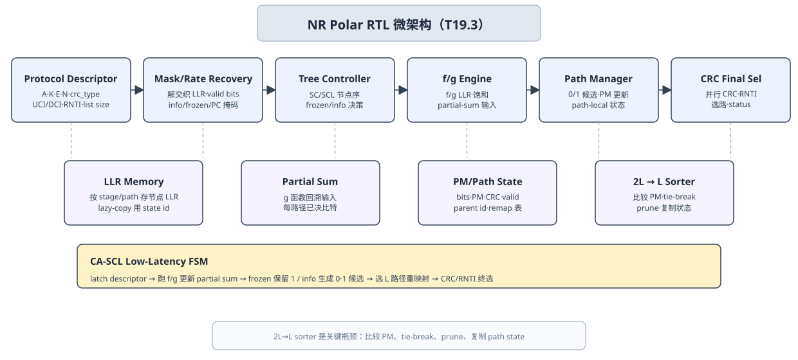

# T19.3 NRPolarRTL 微架构：从 CA-SCL 树遍历到排序器瓶颈
## 本节学习目标

本节设计NRPolar的寄存器传输级微架构。这里的主角不是重新推导 Polar（极化码，Polar Code）编码本身，而是把逐次消除译码（Successive Cancellation, SC）、逐次消除列表译码（Successive Cancellation List, SCL）和循环冗余校验辅助 SCL（CRC-aided SCL, CA-SCL）落到硬件可实现的数据通路：树遍历控制、对数似然比存储、部分和（partial sum）存储、路径存储、路径度量（Path Metric, PM）更新、`2L -> L` 排序/剪枝器、CRC（循环冗余校验，Cyclic Redundancy Check）/无线网络临时标识（Radio Network Temporary Identifier, RNTI）检查器和低延迟控制状态机。

先把本节会反复出现的对象列清：

| 术语 | 本节含义 |
|:---|:---|
| Polar descriptor | 一次 Polar 译码任务的协议身份和实现配置，包括 $A,K,E,N$、CRC 类型、RNTI 上下文、information/frozen mask hash、list size 和 trace 选项。 |
| SC tree | Polar 译码的二叉树遍历结构，通过 $f/g$ 函数从 codeword LLR（对数似然比，Log-Likelihood Ratio）推出 $\hat{u}$。 |
| SCL path | 一条候选 $\hat{u}$ 前缀及其绑定状态：LLR state、partial sum、path bits、PM、CRC state。 |
| CA-SCL selector | 先用 CRC/RNTI 过滤候选，再在通过候选中选择 PM 最小路径的 final selector。 |
| Sorter bottleneck | information bit 处每条 path 分裂为 0/1 两个候选，最多形成 $2L$ 个候选，再排序保留 $L$ 条；它常是延迟、面积和验证最难点。 |
| Lazy copy | 剪枝时不立即复制整块 LLR/partial-sum/path state，而是复制状态引用，写时再分离的实现策略。 |
| Bit-exact（比特精确，bit-exact） trace | Python/C/C++/RTL（寄存器传输级，Register Transfer Level）在同一 checkpoint 输出相同整数、path id、排序顺序和 CRC 结果的证据。 |


- 从3GPP TS 38.212 §5.3.1 和 §5.4.1 说明 Polar RTL 的协议输入：可靠性序列、information/frozen/parity-check set、$G_N=F^{\otimes n}$、rate matching 和 coded-bit interleaving。
- 画出 CA-SCL decoder architecture：rate-recovered LLR 输入、LLR memory、$f/g$ processing engine、partial-sum memory、path manager、PM update、`2L -> L` sorter/pruner、CRC/RNTI final selector 和 status/trace 输出。
- 解释 TS 38.212 规定 Polar construction 和 rate matching，但不规定接收机必须使用 SC、SCL、CA-SCL、list size、PM 近似、sorter 拓扑或 lazy-copy 策略。
- 说明 LLR memory、partial-sum memory、path bits、PM RAM 和 CRC state 必须按 path 绑定，剪枝后要一起 remap。
- 推导 $f/g$、PM 增量、partial sum 更新和 CA-SCL final selector 的硬件数据依赖。
- 解释 `2L -> L` sorter 为什么是瓶颈：候选数、比较器、tie-break、path copy/remap 和时序都在 information bit 处集中爆发。
- 规划 RTL/专用集成电路验证：`polar.rate_recovery`、`polar.mask`、`polar.fg`、`polar.partial_sum`、`polar.pm_prune`、`polar.final` 必须能和 [[T18.6_bit_exact_regression_harness|T18.6]] 的 bit-exact 框架对齐。

如果只记住一句话：TS 38.212 固定 Polar 译码任务“应该恢复哪一组协议比特和母码位置”，RTL 微架构固定“怎样在有限位宽、有限存储端口和有限周期内稳定地遍历树、保留路径、排序剪枝、检查 CRC/RNTI，并输出可回放证据”。

## 前置知识检查

| 前置项 | 本节需要达到的程度 |
|:---|:---|
| [[T5.2_memory_banking_buffering_basics|T5.2]] 存储分 bank 与缓存基础 | 知道静态随机存取存储器、寄存器文件、bank、端口、stall、bypass 和 crossbar 的含义。 |
| [[T5.4_RTL_state_machine_handshake_basics|T5.4]] RTL 状态机与握手 | 知道 `valid/ready`、start/done/error、pipeline stall、flush、reset 和 timeout。 |
| [[T10.3_NR_Polar_reliability_sequence|T10.3]] NR Polar 可靠性序列 | 知道 information set、frozen set 和可靠性序列来自 TS 38.212 Table 5.3.1.2-1。 |
| [[T10.4_Polar_SC_decoding|T10.4]] Polar SC | 知道 $f/g$ 函数、树遍历、frozen 判决和 partial sum。 |
| [[T10.5_Polar_SCL_decoding|T10.5]] Polar SCL | 知道 information bit 分裂路径，PM 越小越好，超过列表大小 $L$ 后剪枝。 |
| [[T10.6_CRC_aided_SCL_control_reliability|T10.6]] CA-SCL | 知道 final selector 先看 CRC/RNTI pass mask，再在通过路径中选择 PM 最小者。 |
| [[T10.7_NR_Polar_rate_recovery|T10.7]] NR Polar rate recovery | 知道 puncturing、shortening、repetition 和 coded-bit deinterleaving 对 decoder input LLR 的影响。 |
| [[T18.4_NR_Polar_fixed_point_model_plan|T18.4]] NR Polar 定点模型计划 | 知道 LLR 位宽、PM 饱和、path remap、CRC/RNTI selector 和 trace 字段。 |
| [[T18.6_bit_exact_regression_harness|T18.6]] Bit-exact 回归框架 | 知道 RTL 不能只比较最终 decoded bits，必须比较中间 path/PM/sort/CRC checkpoint。 |

若尚未掌握 LLR 的正负号含义、partial sum 为什么不是普通 bit 缓存，先回看 [[T10.4_Polar_SC_decoding|T10.4]] 和 [[T10.5_Polar_SCL_decoding|T10.5]]。本节默认你已经理解 Polar 树的算法行为；这里解决的是 ASIC（专用集成电路，Application-Specific Integrated Circuit）中如何把它做成可定时、可复现、可定位的结构。

## Roadmap 卡片原文与本节执行范围

| 项目 | 内容 |
|:---|:---|
| 编号 | T19.3 |
| 前置 | T5.2, T5.4, T18.4 |
| Prompt | 请设计 NR Polar RTL 微架构：SC/SCL 树遍历、LLR 存储、部分和存储、路径存储、路径度量更新、排序/剪枝器、CRC 检查器和低延迟控制。写作时参考本文“单节讲义弹性审计清单”，按本节性质取舍：基础课重理论概念、解释和推导；协议课重 3GPP 前因后果和接收侧流程；工程课重仿真、定点、RTL/ASIC、验证和证据记录。 |
| 产出 | `docs/L3_工程实现/T19.3_NR_Polar_RTL_microarchitecture.md` |
| 验收 | Learner can draw a CA-SCL decoder architecture and explain sorter bottleneck. |
| 3GPP/证据 | TS 38.212 Rel-19 `38212-j30` §5.3.1/§5.4.1；RTL design is implementation guidance。 |

本节是工程微架构课，不交付真实 SystemVerilog 源码。正文给结构、公式依赖、存储对象、控制状态、伪代码、验证点和证据记录。真实 testbench、覆盖率、综合脚本、时序收敛和签收报告会在 T15 承接。

## 资料与协议边界

| 资料 | 本地路径 | 边界 |
| :--- | :--- | :--- |
| TS 38.212 README | `3GPP_Rel19/processed/TS_38.212_38212-j30/README.md` | README 只证明抽取结构存在，不替代协议精读。 |
| TS 38.212 §5.3.1 | `content.md:815-837` | 当前 Markdown 抽取公式符号缺失，精确公式以 Word/tables 和前文复现为准。 |
| TS 38.212 §5.3.1.1 | `content.md:839-871`; `tables/table_0011.csv/html` | RTL 可预计算 interleaver/mask，不表示协议规定具体硬件结构。 |
| TS 38.212 §5.3.1.2 | `content.md:873-943`; `tables/table_0012.csv/html` | 完整可靠性序列由 [[T10.3_NR_Polar_reliability_sequence|T10.3]] 复现；本节引用其结果和 hash。 |
| TS 38.212 §5.4.1 | `content.md:1019-1021` | 本节只关心接收端 rate recovery 后的 RTL 输入契约。 |
| TS 38.212 §5.4.1.1 | `content.md:1023-1079`; `tables/table_0019.csv/html` | 完整 pattern 已由 [[T10.7_NR_Polar_rate_recovery|T10.7]] 复现。 |
| TS 38.212 §5.4.1.2 | `content.md:1081-1109` | 接收侧 LLR 初始化是实现翻译，不是协议逐字公式。 |
| TS 38.212 §5.4.1.3 | `content.md:1111-1125` | 是否启用和上下文来自对应上行控制信息/下行控制信息链路。 |
| [[T10.4_Polar_SC_decoding|T10.4]]-[[T10.7_NR_Polar_rate_recovery|T10.7]] | `docs/L2_协议算法/T10.*.md` | 算法和接收端实现策略，不是 TS 38.212 强制 decoder。 |
| [[T18.4_NR_Polar_fixed_point_model_plan|T18.4]] | `docs/L3_工程实现/T18.4_NR_Polar_fixed_point_model_plan.md` | T19.3 把这些对象映射到 RTL memory/control/trace。 |
| [[T18.6_bit_exact_regression_harness|T18.6]] | `docs/L3_工程实现/T18.6_bit_exact_regression_harness.md` | 本节定义 RTL 侧怎么输出 checkpoint。 |

协议前因后果是：NR Polar 主要承载控制信息链路，输入尺寸和可靠性构造由 TS 38.212 固定；接收机必须按同一 construction 和 rate matching 反操作理解 LLR 位置，否则 CA-SCL 的树遍历再正确也会在错误位置上工作。协议没有要求硬件使用某种 sorter、某个 list size 或某种 PM 近似，因此这些内容必须写成实现策略，并用 bit-exact 证据关闭。

## 微架构总图



| 内容 | 说明 |
|:---|:---|
| Protocol Descriptor | Mask / Rate Recovery；Tree Controller；f/g Engine；Path Manager；CRC Final Selector |
| A, K, E, N, crc_type, UCI（上行控制信息，Uplink Control Information）/DCI（下行控制信息，Downlink Control Information） context, RNTI context and list-size config. | Deinterleaved LLR, info/frozen/PC masks, valid bits and rate-recovery mode.；SC/SCL node order, frozen/information decisions and low-latency schedule.；LLR f and g functions, saturation, partial-sum input and path-local st |
| LLR Memory | Stores node LLRs per stage and path. Lazy-copy uses state ids instead of full copy. |
| Partial Sum Memory | Stores decided bits used by g function and tree backtracking per path. |
| PM / Path State | Path bits, PM, CRC state, valid flags, parent id and remap table. |
| 2L -> L Sorter | Critical bottleneck: compare candidate PM, tie-break, prune and copy state. |
| Latch descriptor, masks and rate-recovered LLR. | Run f/g nodes and update partial sums.；Frozen keeps one; information creates 0/1 candidates.；Select best L paths and remap all state ids.；Parallel CRC and optional RNTI final selector.；Commit selected path, status and fa |
| Structure | RTL Object；Bottleneck / Risk；Required Debug |
| Tree traversal | node_state, stage, path_id；Wrong node order changes f/g input.；node_trace, stage_id |
| Path split | frozen/info mask, 0/1 candidates；Frozen bit split or info bit forced.；split_count, mask_hash |
本节流程顺序为：上方从 Protocol Descriptor、Mask/Rate Recovery、Tree Controller、$f/g$ Engine、Path Manager 到 CRC Final Selector；中部单独展开 path-state memories 和 `2L -> L` sorter bottleneck；表格列出关键 RTL object、风险和 debug 字段；下部给出 CA-SCL low-latency FSM；底部强调协议 evidence 与实现策略边界。

## 协议对象如何落到 RTL Descriptor

Polar RTL core 的第一个模块通常不是 $f/g$ engine，而是 task descriptor parser。原因很简单：同一块硬件可能译不同长度、不同链路、不同 CRC 和不同 rate matching 状态的 Polar block。如果 descriptor 错，后续所有路径都在错误任务上运行。

推荐 descriptor 分成两类字段：

| 类别 | 字段 | 来源与作用 |
|:---|:---|:---|
| 协议身份 | `A_payload`、`K_polar`、`E_rate_matched`、`N_polar` | 来自 TS 38.212 Polar segmentation、coding 和 rate matching 结果；决定输入/输出长度。 |
| 构造证据 | `reliability_seq_hash`、`info_set_hash`、`frozen_set_hash`、`pc_set_hash` | 证明 information/frozen/parity-check set 来自同一份 TS 38.212 construction。 |
| rate recovery | `subblk_pattern_id`、`coded_bit_interleave_en`、`puncture_shortening_mode`、`rate_recovery_hash` | 证明 demapper LLR 已恢复到 Polar codeword order。 |
| 控制信息上下文 | `crc_type`、`crc_len`、`rnti_checked`、`rnti_value`、`uci_or_dci` | 决定 final selector 的 CRC/RNTI 检查边界。 |
| 实现配置 | `list_size`、`llr_width`、`pm_width`、`path_copy_policy`、`sorter_policy` | 实现策略，不是协议字段；必须进入 trace 以保证 bit-exact。 |
| 调试与签收 | `task_id`、`vector_id`、`trace_enable`、`checkpoint_mask`、`timeout_cycles` | 验证和 failure bundle 对齐。 |

这里要避免一个常见错误：把 `list_size` 写成 TS 38.212 的协议参数。TS 38.212 规定 Polar 编码和 rate matching 的对象，不规定接收机必须保留多少条 SCL path。`list_size` 是接收机实现配置，影响性能、面积和延迟，但不能改变协议输入输出定义。

## Rate Recovery 到 Decoder Input

CA-SCL core 消费的是长度 $N$ 的 codeword-order LLR：

$$
\mathbf{L}^{(0)}=[L_0,L_1,\ldots,L_{N-1}].
\tag{1}
$$

这个向量不是 demapper 原始输出顺序。接收端必须先反向执行 Polar rate matching：

$$
\text{demapper LLR}
\rightarrow \text{coded-bit deinterleaving}
\rightarrow \text{bit-selection restore}
\rightarrow \text{sub-block deinterleaving}
\rightarrow \mathbf{L}^{(0)}.
\tag{2}
$$

对 RTL 来说，rate recovery adapter 至少输出四类对象：

| 对象 | 含义 | 后续消费者 |
|:---|:---|:---|
| `llr_init[N]` | 恢复后的整数 LLR。 | LLR input RAM。 |
| `valid_mask[N]` | 位置是否由实际接收 LLR 支撑。 | debug、puncture/shorten 检查。 |
| `state_mask[N]` | normal、punctured、shortened、repeated。 | directed test 和 failure bundle。 |
| `sat_flag[N]` | repetition 累加或 shortened 强正是否饱和。 | 定点审计和块错误率分析。 |

puncturing、shortening 和 repetition 的 RTL 初始化可以写成：

$$
L_i^{(0)}=
\begin{cases}
0, & i\in\mathcal{P}_{\mathrm{punctured}},\\
L_{\max}, & i\in\mathcal{S}_{\mathrm{shortened}},\\
\operatorname{sat}\left(\sum_{m\in\mathcal{R}(i)}\ell_m\right), & i\in\mathcal{R}_{\mathrm{repeated}},\\
\ell_i, & \text{normal received}.
\end{cases}
\tag{3}
$$

式 (3) 是接收端工程翻译：punctured 是未知，shortened 是已知 0，repetition 是同一母码位置的软信息累加。它必须和 [[T10.7_NR_Polar_rate_recovery|T10.7]]、[[T18.4_NR_Polar_fixed_point_model_plan|T18.4]]、[[T18.6_bit_exact_regression_harness|T18.6]] 的 `polar.rate_recovery` checkpoint 一致。

## SC/SCL 树遍历数据通路

Polar SC 译码在二叉树上递归运行。对一个二比特节点，编码关系可写为：

$$
x_0=u_0\oplus u_1,\qquad x_1=u_1.
\tag{4}
$$

接收端用 $f$ 函数估计左侧，用 $g$ 函数在已知左侧 partial sum 后估计右侧。精确 $f$ 函数为：

$$
f(a,b)=2\tanh^{-1}\left(\tanh\frac{a}{2}\tanh\frac{b}{2}\right).
\tag{5}
$$

RTL 中常用 min-sum 近似：

$$
f_{\mathrm{MS}}(a,b)=\operatorname{sgn}(a)\operatorname{sgn}(b)\min(|a|,|b|).
\tag{6}
$$

$g$ 函数为：

$$
g(a,b,\beta)=b+(1-2\beta)a,\qquad \beta\in\{0,1\}.
\tag{7}
$$

式 (7) 是 partial sum 依赖的来源。若 $\beta=0$，$g=b+a$；若 $\beta=1$，$g=b-a$。这要求 RTL 的 tree controller 在进入右子树前，必须保证对应 path 的 partial sum 已经更新并可读。

SCL 在 leaf 处增加 path split：

$$
i\in\mathcal{F}\Rightarrow \hat{u}_i=0,\quad \text{no split},
\tag{8}
$$

$$
i\in\mathcal{I}\Rightarrow \hat{u}_i\in\{0,1\},\quad \text{split}.
\tag{9}
$$

所以 tree traversal datapath 可以拆成：

| 模块 | 输入 | 输出 | 关键风险 |
|:---|:---|:---|:---|
| `tree_controller` | `N`、leaf index、visit phase、active paths | node/stage/path schedule | node order 错会导致 $f/g$ 读错层级。 |
| `fg_pe_array` | node LLR、partial sum、path id | child/parent LLR | 符号、饱和、guard bit 和 path id 对齐。 |
| `leaf_decision_unit` | leaf LLR、frozen/info mask | forced bit 或 candidate bits | frozen bit 不应分裂；information bit 不应强制。 |
| `split_controller` | candidate bits、PM input | candidate path list | candidate count、parent id 和 bit value 必须可追踪。 |
| `backtrack_unit` | leaf decisions、partial sum | parent beta | partial sum 更新时机错会污染右子树。 |

当 $L=1$ 时，SCL 退化为 SC，path manager 永远只保留一条路径。这个退化测试是 RTL smoke test 的第一层：`list_size=1` 时，如果 SC reference 和 SCL core 不一致，问题通常在 tree traversal、$f/g$、partial sum 或 frozen mask。

## LLR Memory 设计

LLR memory 保存树节点的中间软信息。最直观但最贵的方式是为每条 path 保存整棵树所有 stage 的 LLR：

$$
M_{\mathrm{LLR,raw}}\approx L\cdot N\cdot W_{\mathrm{LLR}}\cdot c_{\mathrm{stage}},
\tag{10}
$$

其中 $L$ 是 list size，$W_{\mathrm{LLR}}$ 是 LLR 位宽，$c_{\mathrm{stage}}$ 表示是否保存所有 stage 或压缩保存活动 stage。真实实现会用 stage buffer、lazy-copy、共享引用或 semi-parallel schedule 降低存储。

LLR RAM 推荐字段：

| 字段 | 含义 |
|:---|:---|
| `llr_rd_addr/llr_wr_addr` | node/stage/local/path 映射后的读写地址。 |
| `stage_id` | 当前树层级。 |
| `node_id` | 当前节点或子树编号。 |
| `path_id` | 当前 path 的逻辑 id。 |
| `state_id` | lazy-copy 下实际物理状态引用。 |
| `fg_op` | `f`、`g`、leaf、backtrack。 |
| `llr_sat_flag` | $f/g$ 或输入恢复发生饱和。 |

LLR memory 的关键不是“存得下”，而是剪枝后还能知道每条 survivor path 对应哪个 LLR state。若 sorter 输出 `old_path=3 -> new_path=1`，LLR state、partial-sum state、path bits、PM 和 CRC state 必须一起 remap；只更新 PM RAM 会产生不可定位的路径错贴。

## Partial-Sum Memory 与 Beta Network

partial sum 是树中硬判决状态，不是 payload bit 数组。对二比特节点：

$$
\boldsymbol{\beta}=[\hat{u}_0\oplus\hat{u}_1,\ \hat{u}_1].
\tag{11}
$$

对更大子树：

$$
\boldsymbol{\beta}_{\mathrm{parent}}
=
[\boldsymbol{\beta}_{L}\oplus\boldsymbol{\beta}_{R},\ \boldsymbol{\beta}_{R}].
\tag{12}
$$

这解释了 partial-sum memory 的两个硬件要求：

1. 进入右子树 $g$ 计算前，左子树 partial sum 必须已经可读。
2. path prune/remap 后，partial sum state 必须跟着 survivor path 走。

推荐结构：

| 模块 | 职责 |
|:---|:---|
| `partial_sum_ram` | 按 path/stage/node 保存 beta。 |
| `beta_update_network` | leaf 决策后按式 (11)-(12) 更新父节点 beta。 |
| `ps_addr_gen` | 根据 tree traversal phase 生成读写地址。 |
| `path_remap_apply` | sorter commit 后更新 `path_id -> ps_state_id` 映射。 |
| `hazard_checker` | 检查 $g$ 读 beta 和 beta writeback 的 read-after-write 关系。 |

[[T18.6_bit_exact_regression_harness|T18.6]] 的 `polar.partial_sum` checkpoint 至少要包含 `path_id`、`stage_id`、`node_id`、`beta_before`、`beta_after`、`parent_path_id`、`ps_state_id` 和 `lazy_ref`。否则当 RTL 和 fixed model 在某个右子树 LLR 分叉时，无法判断是 $g$ 函数错还是 beta 贴错路径。

控制流程图中的英文条件 `next bit while paths remain active` 表示：只要路径列表仍有活动候选，控制器就推进到下一个 bit；若路径耗尽或 CRC/RNTI selector 已经给出终止状态，则进入失败或完成分支。

## Path Memory 与 Copy/Remap

SCL 的 path 不是一串 bit。它是一组绑定状态：

$$
\mathrm{PathState}
=
\{\hat{\mathbf{u}}_{\mathrm{prefix}},\ \mathrm{LLRState},\ \mathrm{PartialSumState},\ PM,\ \mathrm{CRCState}\}.
\tag{13}
$$

information bit 分裂时，一条 parent path 生成两个 candidate：

$$
p^{(0)}=p\Vert 0,\qquad p^{(1)}=p\Vert 1.
\tag{14}
$$

剪枝保留 survivor 后，path manager 要提交 remap：

$$
\mathrm{new\_path\_id}\rightarrow
\{\mathrm{parent\_path\_id},\ \mathrm{candidate\_bit},\ \mathrm{llr\_state\_id},\ \mathrm{ps\_state\_id},\ \mathrm{crc\_state\_id},\ PM\}.
\tag{15}
$$

两种 copy 策略：

| 策略 | 做法 | 优点 | 风险 |
|:---|:---|:---|:---|
| Deep copy | 分裂或剪枝时复制完整 LLR/partial/path/CRC state。 | 行为直观，debug 简单。 | 存储带宽和延迟高。 |
| Lazy copy | 复制状态引用和引用计数，写时再分离。 | 降低复制带宽，适合较大 $L$。 | refcount、write isolation 和 remap 更难验证。 |

不管采用哪种策略，trace 必须让 fixed model 和 RTL 看到同一个 `parent_path_id -> new_path_id` 映射。很多“最终 CRC 偶尔失败”的问题，本质是剪枝时 PM 选对了，但 partial sum 或 CRC state 没有跟着 path 走。

## PM 更新与饱和

本项目约定 PM 越小越好。给定 leaf LLR $L$ 和候选 bit $b\in\{0,1\}$，精确负对数似然增量可写为：

$$
\Delta PM(b,L)=
\ln\left(1+\exp\left(-(1-2b)L\right)\right).
\tag{16}
$$

RTL 常用近似：

$$
\Delta PM_{\mathrm{approx}}(b,L)=
\begin{cases}
0, & b=\mathbf{1}[L<0],\\
|L|, & b\ne\mathbf{1}[L<0].
\end{cases}
\tag{17}
$$

更新为：

$$
PM_{\mathrm{new}}=\operatorname{sat}\left(PM_{\mathrm{old}}+\Delta PM\right).
\tag{18}
$$

如果 PM 位宽不足，多个候选会饱和到同一个最大值。这不是小问题：排序器必须有稳定 tie-break，例如先比 `PM`，再比 `path_id`，再比 `candidate_bit` 或固定 rank。推荐 sort key：

$$
\mathrm{sort\_key}=(PM,\ \mathrm{tie\_rank},\ \mathrm{candidate\_id}).
\tag{19}
$$

PM RAM 至少记录：

| 字段 | 说明 |
|:---|:---|
| `pm_before` | 分裂前 path PM。 |
| `pm_inc0/pm_inc1` | bit=0/1 两个候选增量。 |
| `pm_after0/pm_after1` | 饱和后的候选 PM。 |
| `pm_sat` | 是否饱和。 |
| `pm_norm_offset` | 若实现 PM normalization，记录减去的 offset。 |
| `tie_rank` | 并列 PM 时的稳定比较键。 |

PM normalization 是实现策略。若每轮减去当前最小 PM，可以降低位宽压力，但 fixed model、RTL 和 scoreboard 必须使用相同 normalization 时机和舍入，否则 path ordering 会分叉。

## `2L -> L` Sorter/Pruner 瓶颈

SCL 的最大硬件瓶颈通常不是单个 $f/g$ 函数，而是 information bit 处的候选排序。若当前有 $L$ 条 active path，一个 information bit 最多产生 $2L$ 个候选：

$$
\mathcal{C}_i=\{(p,b)\mid p\in\mathcal{P}_i,\ b\in\{0,1\}\}.
\tag{20}
$$

剪枝规则为：

$$
\mathcal{P}_{i+1}=\mathrm{TopL}_{\min PM}(\mathcal{C}_i).
\tag{21}
$$

这条式子在软件里只是排序，在 RTL 里意味着：

| 对象 | 随 $L$ 增长的压力 |
|:---|:---|
| candidate PM | 每个 information bit 生成最多 $2L$ 个 PM。 |
| comparator network | 需要 top-$L$ 比较，比较器数量和级数增加。 |
| path remap | survivor rank 决定 LLR/partial/path/CRC state 映射。 |
| copy bandwidth | survivor 可能来自同一 parent 的不同 candidate，需要复制或 lazy fork。 |
| timing closure | PM add、saturate、compare、select、remap 可能串成关键路径。 |

可选 sorter 拓扑：

| 拓扑 | 特点 | 适用场景 |
|:---|:---|:---|
| Full sort | 完整排序 $2L$ 个候选。 | $L$ 小、验证简单。 |
| Top-L partial sort | 只保证最小 $L$ 个候选有序或半有序。 | 常见折中。 |
| Bitonic/odd-even network | 规则比较网络，适合流水化。 | 需要可综合、时序稳定的 ASIC。 |
| Two-stage prune | 先每 parent 选局部候选，再全局比较。 | 降低比较量，但必须证明不丢正确 top-$L$。 |

验证时不能只比较 selected path。`polar.pm_prune` checkpoint 必须输出 `candidate_pm[2L]`、`candidate_bit`、`parent_path_id`、`sort_key`、`survivor_order`、`drop_mask`、`old_to_new_remap` 和 `tie_policy`。如果 PM 并列，tie-break 是功能的一部分，不是无关细节。

## 具体数值例子：$L=2$ 的 PM 排序与 Path Remap

这个例子不是 3GPP 一致性向量，只用于把 sorter/pruner 的硬件动作讲清楚。设当前有两条 active path：

| logical path | prefix | $PM_{\mathrm{old}}$ | `llr_state_id` | `ps_state_id` | `crc_state_id` |
|:---|:---|---:|:---|:---|:---|
| P0 | `[0,0]` | 1.0 | LLR0 | PS0 | CRC0 |
| P1 | `[0,1]` | 0.2 | LLR1 | PS1 | CRC1 |

当前 leaf 是 information bit。P0 看到的 leaf LLR 为 $+2.5$，P1 看到的 leaf LLR 为 $-0.7$。按式 (17)，正 LLR 支持 bit 0，负 LLR 支持 bit 1。因此四个候选为：

| candidate id | parent | candidate bit | PM increment | candidate PM | 解释 |
|:---|:---|:---:|---:|---:|:---|
| C0 | P0 | 0 | 0.0 | 1.0 | P0 的 LLR 支持 0。 |
| C1 | P0 | 1 | 2.5 | 3.5 | P0 逆 LLR 方向取 1。 |
| C2 | P1 | 0 | 0.7 | 0.9 | P1 逆 LLR 方向取 0。 |
| C3 | P1 | 1 | 0.0 | 0.2 | P1 的 LLR 支持 1。 |

`2L -> L` sorter 要保留 PM 最小的两条：

| survivor rank | candidate | new logical path | new prefix | remap |
|:---|:---|:---|:---|:---|
| 0 | C3 | P0' | `[0,1,1]` | parent P1 -> new P0'，继承或 lazy-copy `LLR1/PS1/CRC1`，再写入 bit 1。 |
| 1 | C2 | P1' | `[0,1,0]` | parent P1 -> new P1'，从同一 parent fork，必须复制或写时复制 `LLR1/PS1/CRC1`，再写入 bit 0。 |

这个例子暴露两个硬件风险。第一，两个 survivor 都来自同一个 parent P1，path manager 不能只把 P1 原地改名为 P0'，还必须为 P1' 准备独立 state，否则后续某个 path 写 partial sum 会污染另一个 path。第二，P0 的旧状态虽然还在物理 SRAM（静态随机存取存储器，Static Random-Access Memory）里，但 logical path 已被剪掉；若 lazy-copy 引用计数没有减少，后续状态回收会泄漏或复用错误。

对应 checkpoint 应记录：

```json
{
  "checkpoint": "polar.pm_prune",
  "leaf_index": 2,
  "list_size": 2,
  "candidate_pm": [1.0, 3.5, 0.9, 0.2],
  "candidate_parent": ["P0", "P0", "P1", "P1"],
  "candidate_bit": [0, 1, 0, 1],
  "survivor_order": ["C3", "C2"],
  "old_to_new_remap": [
    {"parent": "P1", "candidate": "C3", "new_path": "P0'"},
    {"parent": "P1", "candidate": "C2", "new_path": "P1'"}
  ]
}
```

RTL scoreboard 看到这个 JSON 后，不能只检查 `survivor_order`。它还要检查 `P0'` 和 `P1'` 后续的 LLR state、partial sum state 和 CRC state 是否已经分离。

## CRC/RNTI Checker 与 Final Selector

CA-SCL 的 final selector 不是简单选择 PM 最小路径。设 survivor path 集合为：

$$
\mathcal{P}=\{p_0,p_1,\ldots,p_{L-1}\}.
\tag{22}
$$

每条 path 有 CRC/RNTI 检查：

$$
C(p_i)\in\{\mathrm{pass},\mathrm{fail}\}.
\tag{23}
$$

通过集合为：

$$
\mathcal{P}_{\mathrm{pass}}=\{p_i\in\mathcal{P}\mid C(p_i)=\mathrm{pass}\}.
\tag{24}
$$

若通过集合非空：

$$
p^\star=\arg\min_{p_i\in\mathcal{P}_{\mathrm{pass}}}PM(p_i).
\tag{25}
$$

若通过集合为空，RTL 应报告 decode fail，并可输出 debug fallback path，但不能把 fallback path 标记为协议有效控制信息。

CRC/RNTI block 推荐两种实现：

| 实现 | 做法 | 优点 | 代价 |
|:---|:---|:---|:---|
| Parallel checker | 对 $L$ 条 survivor path 并行检查 CRC/RNTI。 | 低延迟，适合控制信道。 | 面积较大。 |
| Shared checker | 一个或少量 checker 复用扫描 path。 | 面积小。 | tail latency 增加，控制 FSM 更复杂。 |

final selector trace 至少记录 `crc_ok[path]`、`rnti_ok[path]`、`pass_mask`、`selected_path_id`、`selected_pm`、`decode_valid` 和 `fail_reason`。这能直接覆盖 [[T10.6_CRC_aided_SCL_control_reliability|T10.6]] 的典型风险：PM 最佳路径 CRC fail，而次优路径 CRC pass。

## 低延迟控制 FSM

NR Polar 译码服务控制信息，工程上通常更重视 latency predictability。总延迟可以粗略拆成：

$$
T_{\mathrm{decode}}
=T_{\mathrm{rate\ recovery}}
+T_{\mathrm{tree}}
+T_{\mathrm{split/sort}}
+T_{\mathrm{crc/final}}
+T_{\mathrm{status}}.
\tag{26}
$$

推荐 FSM：

| 状态 | 进入条件 | 退出条件 | 输出/检查点 |
|:---|:---|:---|:---|
| `LOAD` | `start && descriptor_valid`。 | descriptor、mask、LLR input buffer 就绪。 | `task_id`、`N/K/E`、mask hash。 |
| `TRAVERSE` | 有 active path 和未访问节点。 | 到达 leaf 或子树 backtrack 完成。 | `polar.fg`、node trace。 |
| `SPLIT` | leaf 为 frozen 或 information。 | frozen leaf 完成 forced-bit commit；information leaf 完成 0/1 candidate list 生成。 | forced bit 或 0/1 candidates。 |
| `SORT_PRUNE` | information bit 产生候选且候选数超过 $L$。 | survivor order 和 remap commit。 | `polar.pm_prune`。 |
| `CRC_CHECK` | 全部 leaf 完成。 | pass mask 和 selected path 得到。 | `polar.final`。 |
| `DONE/ERROR` | pass、fail、timeout、非法 descriptor。 | 上层读取 status。 | done、error code、failure bundle id。 |

低延迟策略包括：

- mask 和 reliability ROM（只读存储器，Read-Only Memory）预取，避免译码关键路径动态筛表。
- rate recovery 和 mask construction 并行。
- semi-parallel $f/g$ processing element array，让每拍处理多个 node lane。
- PM update 和 candidate generation 并行。
- sorter pipeline 化，并把 `sort -> remap commit` 切成稳定时序边界。
- lazy-copy 减少 path state 复制带宽。
- CRC checker 并行化，降低 tail latency。

这些都是实现策略。协议要求的是输入输出和 bit sequence 关系正确，不要求某种 FSM 或 pipeline cut。

## 存储与吞吐估算

教学级估算可以先按对象分：

$$
M_{\mathrm{path\ bits}}\approx L\cdot K,
\tag{27}
$$

$$
M_{\mathrm{PM}}\approx L\cdot W_{\mathrm{PM}},
\tag{28}
$$

$$
M_{\mathrm{partial}}\approx L\cdot N,
\tag{29}
$$

$$
M_{\mathrm{LLR}}\approx L\cdot N\cdot W_{\mathrm{LLR}}\cdot \rho_{\mathrm{stage}},
\tag{30}
$$

其中 $\rho_{\mathrm{stage}}$ 表示 stage 压缩或共享后的系数。若 full-state 保存所有 stage，$\rho_{\mathrm{stage}}$ 会更高；若只保存活动 stage 和 lazy-copy 引用，$\rho_{\mathrm{stage}}$ 可下降。

吞吐估算可拆成：

| 项 | 估算口径 | 主要优化点 |
|:---|:---|:---|
| rate recovery | $E$ 个输入 LLR 的反交织、恢复和累加周期。 | 多 lane deinterleaver、重复位置累加并行。 |
| tree traversal | 约随 $N\log_2N$ 的 node 访问或 semi-parallel schedule。 | PE 数量、stage buffer、visit order。 |
| split/sort | information bit 数量乘 sorter latency。 | sorter topology、pipeline depth、list size。 |
| path remap/copy | survivor 数和 copy policy。 | lazy-copy、banked state RAM。 |
| CRC/final | $L$ 条 survivor 的 CRC/RNTI checker。 | 并行 checker 或 tail latency 复用。 |

T15 做 RTL testbench 时，cycle model 应记录 `rate_recovery_cycles`、`fg_cycles`、`sort_cycles`、`copy_cycles`、`crc_cycles`、`stall_cycles` 和 `timeout_hit`。

## 接收端伪代码

```text
nr_polar_ca_scl_decode(task):
  descriptor = parse_and_lock(task)
  assert descriptor.N is power_of_two
  assert descriptor.mask_hash matches reliability construction

  llr0, valid_mask = polar_rate_recovery(task.rx_llr, descriptor)
  init_path_list(L=descriptor.list_size)
  path[0].llr_state = load_llr(llr0)
  path[0].pm = 0
  path[0].crc_state = crc_init(descriptor.crc_type)

  for leaf_index in 0 .. N-1:
    tree_traverse_to_leaf(path_list, leaf_index)
    if frozen_mask[leaf_index]:
      for p in path_list:
        force_bit_and_update_partial_sum(p, bit=0)
        update_online_crc_if_needed(p, bit=0)
    else:
      candidates = []
      for p in path_list:
        leaf_llr = read_leaf_llr(p, leaf_index)
        for bit in [0, 1]:
          c = clone_or_lazy_fork(p)
          c.pm = saturating_pm_update(p.pm, leaf_llr, bit)
          c.bit = bit
          c.parent_path_id = p.path_id
          candidates.append(c)
      path_list = sorter_top_l(candidates, descriptor.list_size, stable_tie_break)
      commit_path_remap(path_list)
      update_partial_sum_and_crc(path_list, leaf_index)
    emit_checkpoint_if_enabled()

  pass_mask = crc_rnti_check(path_list, descriptor)
  selected = select_min_pm_among_pass(path_list, pass_mask)
  return selected_or_fail(selected, pass_mask)
```

伪代码中的 `clone_or_lazy_fork` 是实现策略。若使用 lazy copy，必须保证第一次写 LLR/partial/CRC state 前已经完成写时复制；否则两个逻辑 path 会共享并互相污染状态。

## RTL/ASIC 映射建议

| RTL 模块 | 核心输入 | 核心输出 | 验证观测点 |
|:---|:---|:---|:---|
| `nr_polar_task_ctrl` | start、descriptor、soft buffer key | locked config、status/error | descriptor hash、illegal config。 |
| `polar_rate_recovery_adapter` | demapper LLR、interleaver flags、$E/N$ | codeword-order LLR、valid/state mask | `polar.rate_recovery`。 |
| `polar_mask_loader` | reliability ROM、$N/K$、CRC/PC context | frozen/info/PC mask | `polar.mask`。 |
| `scl_tree_controller` | active path mask、leaf index | node visit schedule、fg op | node trace。 |
| `fg_pe_array` | LLR operands、partial sum | node/leaf LLR | `polar.fg`。 |
| `partial_sum_unit` | leaf bit、stage/node/path | beta update | `polar.partial_sum`。 |
| `path_manager` | split candidates、survivor order | path id remap、state id map | parent/new path map。 |
| `pm_update_unit` | leaf LLR、candidate bit、old PM | candidate PM、sat flag | PM before/inc/after。 |
| `top_l_sorter` | up to `2L` candidate keys | survivor rank/drop mask | `polar.pm_prune`。 |
| `crc_rnti_selector` | survivor bits/CRC state/PM | selected path、valid/fail | `polar.final`。 |
| `trace_status` | checkpoint bus | trace stream、failure bundle | first mismatch replay。 |

ASIC 设计时，`fg_pe_array`、`top_l_sorter` 和 SRAM 端口是三类主要时序压力。经验上，$f/g$ 算子可以通过加 pipeline、降低 fanout 和半并行处理解决；sorter 则容易把 PM add、饱和、比较、mux 和 path remap 串成一条长路径。因此 T19.3 的验收必须让学习者能解释 sorter bottleneck，而不只是画出一个名为 sorter 的框。

## 浮点仿真方案

T19.3 的 RTL bit-exact 目标来自 [[T17.4_NR_Polar_float_sim_plan|T17.4]] 的 NR Polar 浮点仿真计划。浮点 golden model 必须覆盖本节全部微架构模块的等价行为：SC/SCL 树遍历、LLR memory 访存模式、partial-sum 更新、PM 饱和、sorter/pruner 分支和 CRC/RNTI final selection。定点化前必须先在浮点域确认：

- 使用 [[T17.4_NR_Polar_float_sim_plan|T17.4]] 规定的 AWGN（加性白高斯噪声，Additive White Gaussian Noise）信道、调制方案和 BLER（块错误率，Block Error Rate）基线，验证浮点 SC/SCL 的 BLER 曲线与 T10 理论推导一致。
- 对 $L \in \{1, 2, 4, 8\}$ 各跑足够帧数，确认 PM update、saturation 行为和 CRC-aided path selection 在浮点域无逻辑错误。
- 生成关键 checkpoint：active path list、PM order、prune survivor map、LLR memory state 和 CRC state，供定点模型对齐。

## 定点化策略

NR Polar SCL 定点化的难点不在单个加法器位宽，而在于以下三类跨模块决策：

| 决策点 | 风险 | 本节策略 |
|:---|:---|:---|
| LLR 输入位宽与缩放 | 过度量化会让 $f/g$ 算子失去软信息分辨能力；位宽过大浪费 SRAM 和 PE 面积 | 采用 [[T18.4_NR_Polar_fixed_point_model_plan|T18.4]] 规定的 $(W, F)$ 格式；rate recovery 输出的 LLR 在进入 `scl_tree_controller` 之前完成缩放和对称饱和 |
| PM（Path Metric）累加与饱和 | PM 随码长单调递增，长码下可能溢出；不同 path 的 PM 差值才是选择依据 | PM 使用 [[T18.4_NR_Polar_fixed_point_model_plan|T18.4]] 的 $\Delta$-PM 相对表示，每次更新后统一减去当前最小 PM；饱和位宽按 $K=1643$ 最差情况设计，并预留 2 bit guard |
| LLR/partial-sum memory 定点一致性 | SC tree 的上行 LLR 和下行 partial-sum 使用不同 $(W,F)$ 会导致 tree 内部不一致 | 上下行统一使用同一位宽配置；beta network 的 partial-sum 在写回前完成舍入 |
| path copy/remap 的精确复制 | 定点 round 方向不同会让 fork 后的 path 从第一步就产生差异 | 规定 nearest-even rounding 并写入 `bit_exact_policy_hash`；所有 checkpoint 比较使用整数域逐元素对比 |

定点模型验证分三层：(1) Python fixed 与 Python float 的 BLER 损失在 [[T18.4_NR_Polar_fixed_point_model_plan|T18.4]] 预算内；(2) C/C++ fixed 与 Python fixed 的 checkpoint 逐元素一致；(3) RTL 与 C/C++ fixed 在 [[T18.6_bit_exact_regression_harness|T18.6]] regression harness 下 bit-exact 对齐。

## Bit-exact 验证方法

不能只比较最终 payload 或 CRC。Polar SCL 的危险在于中间 path list 可以短暂分叉，最后又碰巧选到同一结果。[[T18.6_bit_exact_regression_harness|T18.6]] 要求的 checkpoint 在 RTL 侧映射如下：

| checkpoint | RTL 输出 | 必查字段 |
|:---|:---|:---|
| `polar.rate_recovery` | rate recovery adapter trace | interleaver enable、state mask、LLR after restore、sat count。 |
| `polar.mask` | mask loader trace | frozen/info/PC set hash、CRC bit positions、RNTI context。 |
| `polar.fg` | tree controller + PE trace | path id、stage、node、op、input LLR、output LLR、sat flag。 |
| `polar.partial_sum` | beta network trace | path id、stage、node、beta before/after、state id、lazy ref。 |
| `polar.pm_prune` | PM update + sorter trace | candidate PM、sort key、survivor order、drop mask、remap。 |
| `polar.final` | CRC/RNTI selector trace | pass mask、selected path、selected PM、decoded bits、fail reason。 |

directed tests 至少包含：

| 测试 | 目的 |
|:---|:---|
| `L=1` SC 等价 | 证明 SCL core 的单路径退化行为正确。 |
| frozen bit 负 LLR | frozen 仍强制 0，不按 LLR 分裂。 |
| PM 并列 | 检查稳定 tie-break 和 bit-exact reproducibility。 |
| PM 饱和 | 检查 saturation flag、normalization 和 sorter order。 |
| path remap 压力 | 同一 parent 派生两个 survivor，检查 LLR/partial/CRC state 不错贴。 |
| CRC fail/pass 交叉 | PM 最小路径 CRC fail，次优路径 CRC/RNTI pass，应选次优。 |
| rate recovery 边界 | punctured=0、shortened=强正、repetition=累加饱和。 |
| timeout/flush | 非法 descriptor 或 backpressure 时状态可恢复。 |

## 常见错误

| 错误 | 为什么错 | 怎么发现 |
|:---|:---|:---|
| 把 TS 38.212 写成强制 CA-SCL/list size | 协议规定 construction/rate matching，不规定接收机算法结构。 | 协议证据表中实现字段应标为 implementation strategy。 |
| frozen bit 也分裂 | frozen 位置由 construction 强制为 0。 | frozen negative LLR directed test。 |
| partial sum 当作 leaf bit 缓存 | partial sum 是子树硬编码状态。 | `polar.partial_sum` 与重新编码子树比较。 |
| PM 越大越好/越小越好约定混乱 | sorter 方向会反。 | PM toy vector 和 sort key trace。 |
| 剪枝只复制 path bits | LLR state、partial sum、CRC state 会贴错路径。 | path remap 压力测试。 |
| CRC/RNTI final selector 先按 PM 选一条再查 CRC | CA-SCL 应先过滤 pass mask，再在 pass 中选 PM 最小。 | PM 最佳 CRC fail 案例。 |
| rate recovery 顺序错误 | demapper LLR 没放回 codeword order，树再正确也无效。 | `polar.rate_recovery` hash 和 state mask。 |
| 图表或文档只画框不记录 trace 字段 | T15 无法 bit-exact 定位 mismatch。 | checkpoint 表缺字段即审计失败。 |

## 自测题

1. 为什么 T19.3 说 sorter 是 bottleneck，而不是 $f/g$ 函数？
2. 剪枝后为什么不能只更新 PM 和 path bits？
3. PM 最小路径 CRC fail 时，为什么不能输出为有效控制信息？
4. 为什么 rate recovery 要放在 RTL 架构图最前面？
5. PM 饱和后为什么还要稳定 tie-break？
6. 在上面的 $L=2$ 例子中，两个 survivor 都来自 P1，path manager 必须额外做什么？

## 自测题参考答案

1. $f/g$ 函数是局部算子，输入输出规则简单，容易流水化；information bit 处的 sorter 同时面对最多 $2L$ 个候选 PM、稳定 tie-break、survivor 选择、path remap 和 state copy，比较网络与控制决策集中，时序和验证压力更大。
2. 一条 path 还绑定 LLR state、partial sum 和 CRC state。若这些状态不随 survivor remap，后续 $g$ 函数、PM 更新或 CRC 检查会用到别的路径状态，最终错误难以定位。
3. CA-SCL 的 final selector 约束是先形成 CRC/RNTI pass 集合，再在通过集合中选 PM 最小路径。CRC/RNTI fail 表示该候选不满足控制信息检错/归属边界，即使 PM 最小也不能标记为 valid。
4. CA-SCL 树消费的是 Polar codeword-order LLR。若 coded-bit deinterleaving、bit-selection restore 或 sub-block deinterleaving 方向错，后续所有 $f/g$、PM 和 CRC 都在错误位置上运行。
5. 饱和会把不同候选压成相同 PM。若 sorter 在并列时没有固定比较键，Python/C++/RTL 可能保留不同 path，bit-exact replay 不可复现。
6. path manager 必须为两个 survivor 准备彼此独立的 path state。若使用 deep copy，就复制 P1 的 LLR state、partial sum state 和 CRC state 后分别写入 bit 1/bit 0；若使用 lazy copy，就要建立两个 logical path 的引用和写时复制规则，保证后续任一路径写 partial sum、LLR state 或 CRC state 时不会污染另一条路径。

## 协议证据表

| 结论 | 证据 | 本地路径 | 边界 |
|:---|:---|:---|:---|
| Polar coding 是 NR TS 38.212 的 channel coding 对象。 | TS 38.212 Rel-19 `38212-j30` §5.3.1。 | `3GPP_Rel19/processed/TS_38.212_38212-j30/content.md:815-837` | Markdown 抽取公式符号缺失，作为章节锚点使用。 |
| Polar construction 使用 input interleaving、reliability sequence、information/frozen/PC set 和 $G_N=F^{\otimes n}$。 | TS 38.212 §5.3.1.1/§5.3.1.2；Table 5.3.1.1-1/Table 5.3.1.2-1。 | `content.md:839-943`; `tables/table_0011.csv/html`; `tables/table_0012.csv/html` | 完整可靠性序列由 [[T10.3_NR_Polar_reliability_sequence|T10.3]] 回链复现，本节不重复长表。 |
| Polar rate matching 包括 sub-block interleaving、bit selection 和 coded-bit interleaving。 | TS 38.212 §5.4.1/§5.4.1.1-§5.4.1.3。 | `content.md:1019-1125`; `tables/table_0019.csv/html` | 接收侧 LLR 初始化是工程反操作。 |
| SC/SCL/CA-SCL、list size、PM 近似、sorter、lazy copy 和 RTL FSM 属于实现策略。 | TS 38.212 没有规定接收机内部 decoder microarchitecture。 | 本节证据边界与 [[T10.4_Polar_SC_decoding|T10.4]]-[[T10.7_NR_Polar_rate_recovery|T10.7]]、[[T18.4_NR_Polar_fixed_point_model_plan|T18.4]]、[[T18.6_bit_exact_regression_harness|T18.6]] 回链。 | 禁止写成 3GPP 强制要求。 |
| Bit-exact checkpoint 必须覆盖 rate recovery、mask、$f/g$、partial sum、PM prune 和 final selector。 | [[T18.6_bit_exact_regression_harness|T18.6]] 本项目回归框架。 | `docs/L3_工程实现/T18.6_bit_exact_regression_harness.md` | 项目验证要求，不是协议条款。 |

## 图示

## 执行与证据记录

| 项 | 命令或证据 | 结果 |
|:---|:---|:---|
| Roadmap 任务 | `2026-06-19-lte-nr-decoding-learning-roadmap.md:1160` | T19.3 prompt 已全量覆盖并拓展。 |
| 术语审计 | `python3 tools/audit_lesson_terms.py docs/L3_工程实现/T19.3_NR_Polar_RTL_microarchitecture.md` | `LESSON_TERM_AUDIT_OK`。 |
| 标题审计 | `python3 tools/audit_markdown_headings.py docs/L3_工程实现/T19.3_NR_Polar_RTL_microarchitecture.md` | `MARKDOWN_HEADING_AUDIT_OK`。 |
| 深度审计 | `python3 tools/audit_lesson_depth.py --strict docs/L3_工程实现/T19.3_NR_Polar_RTL_microarchitecture.md` | `LESSON_DEPTH_AUDIT_OK`。 |
| LaTeX 渲染审计 | `python3 tools/audit_latex_render.py docs/L3_工程实现/T19.3_NR_Polar_RTL_microarchitecture.md` | `LATEX_RENDER_AUDIT_OK formulas=102`。 |
| 引用重建审计 | `python3 tools/audit_reference_rebuilds.py docs/L3_工程实现/T19.3_NR_Polar_RTL_microarchitecture.md` | `REFERENCE_REBUILD_AUDIT_CANDIDATES`；候选均为上游已复现表格回链、工程公式/实现策略边界或章节锚点，不构成本节阻塞。 |
| 审核经理复核 | 只读审核经理复核 | `Critical=0`；`Important=2` 已修复：Roadmap 锚点错链、文档级审计记录缺项。Minor 已修复：frozen leaf 与 information leaf 的 `SPLIT` 退出条件区分、`py_compile` 改为无副作用命令记录。 |

## 参考文献与回链

| 类型 | 条目 |
|:---|:---|
| 3GPP 协议 | 3GPP TS 38.212 Rel-19 `38212-j30`，§5.3.1、§5.3.1.1、§5.3.1.2、§5.4.1、§5.4.1.1、§5.4.1.2、§5.4.1.3。 |
| 本地协议抽取 | `3GPP_Rel19/processed/TS_38.212_38212-j30/content.md`；`tables/table_0011.csv/html`；`tables/table_0012.csv/html`；`tables/table_0019.csv/html`。 |
| 前置讲义 | `docs/L2_协议算法/T10.4_Polar_SC_decoding.md`；`docs/L2_协议算法/T10.5_Polar_SCL_decoding.md`；`docs/L2_协议算法/T10.6_CRC_aided_SCL_control_reliability.md`；`docs/L2_协议算法/T10.7_NR_Polar_rate_recovery.md`。 |
| 定点与验证 | `docs/L3_工程实现/T18.4_NR_Polar_fixed_point_model_plan.md`；`docs/L3_工程实现/T18.6_bit_exact_regression_harness.md`。 |
| 原始论文背景 | E. Arikan, “Channel Polarization: A Method for Constructing Capacity-Achieving Codes for Symmetric Binary-Input Memoryless Channels,” IEEE Transactions on Information Theory, 2009。本节未引用该论文的具体表格或图。 |
