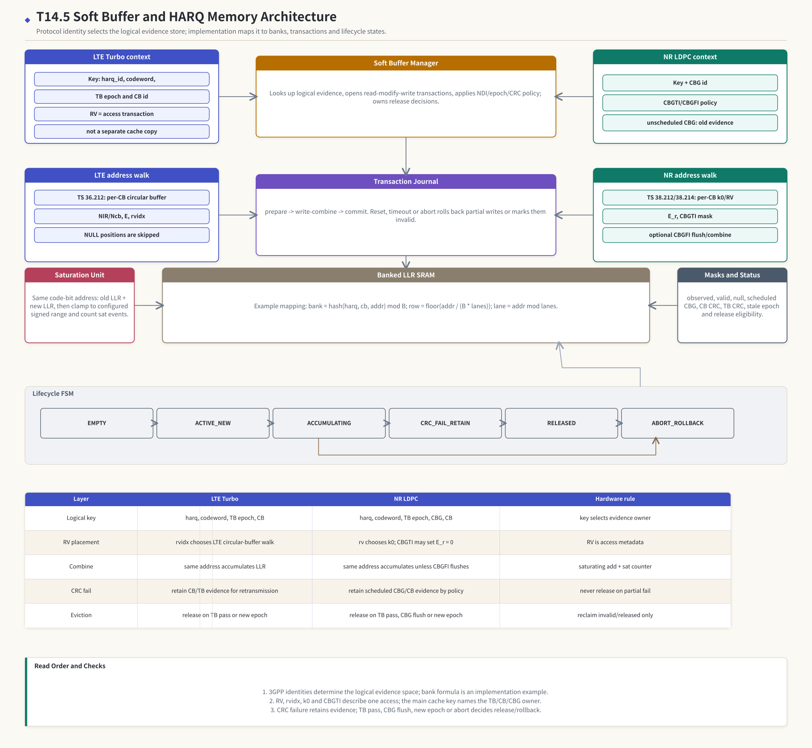

# T19.5 软缓存与 HARQ 存储架构：从协议身份到 SRAM bank、事务提交和失败恢复
## 本节学习目标

本节设计 3GPP LTE/NR译码子系统中的软缓存与混合自动重传请求存储架构。这里的软缓存保存对数似然比这种软信息；协议身份来自传输块、码块、NR CBG（码块组，Code Block Group）、冗余版本（Redundancy Version, RV）和循环冗余校验结果；工程实现落到静态随机存取存储器bank、读改写事务、饱和加法、淘汰和恢复策略。

本节第一次使用的单篇技术缩写如下，后文不再反复展开：

| 名称 | 中文含义 |
|:---|:---|
| 低密度奇偶校验码 | NR 数据业务的主要信道编码，T19.5 关注它的 HARQ（混合自动重传请求，Hybrid Automatic Repeat Request）soft buffer 和 CBG 部分重传。 |
| Turbo（Turbo 码，Turbo Code） | LTE 数据业务的信道编码，T19.5 关注它的 per-CB circular buffer 和 `rvidx`。 |
| Polar（极化码，Polar Code） | NR 控制信息的信道编码；本节只把它作为统一子系统边界，不把数据 HARQ soft buffer 语义套到 Polar 控制任务。 |
| 寄存器传输级 | 将软缓存管理器、bank、事务日志和状态机落成硬件的设计层级。 |
| 专用集成电路 | 本节的存储 bank、仲裁、饱和和状态机最终面向 ASIC（专用集成电路，Application-Specific Integrated Circuit）映射。 |
| 块错误率 | 后续仿真中观察 soft-buffer/RV/CBG 错误是否影响链路性能的指标。 |


- 解释 soft buffer 是“接收证据库”，不是简单 packet cache，也不是四个 RV 各一份的数组。
- 为 LTE Turbo 设计一个包含 `harq_id/codeword/tb_epoch/cb_id/rvidx` 的 soft-buffer address map，并说明 `rvidx` 是访问事务字段，不是主缓存 key。
- 为 NR LDPC（低密度奇偶校验码，Low-Density Parity-Check Code）设计一个包含 `harq_id/codeword/tb_epoch/cbg_id/cb_id/rv/k0/CBGTI/CBGFI` 的 soft-buffer address map，并说明未调度 CBG 保持旧证据。
- 说明同一编码比特位置的新旧 LLR（对数似然比，Log-Likelihood Ratio）如何累加、定点饱和并记录 saturation counter。
- 设计 SRAM（静态随机存取存储器，Static Random-Access Memory） bank 映射、write-combine 队列、事务日志、commit/rollback、eviction 和 CRC（循环冗余校验，Cyclic Redundancy Check） fail 后恢复策略。
- 区分协议规定、项目 descriptor 字段和具体 RTL（寄存器传输级，Register Transfer Level）/ASIC 实现策略，避免把 bank 数、寄存器地址或淘汰策略误写成 3GPP 强制要求。

如果只记住一句话：soft buffer 的主 key 命名“哪一个 TB（传输块，Transport Block）/CB（码块，Code Block）/CBG 的证据”，RV/RV index 和 `k0` 命名“本次访问这个证据库的哪一段地址”，两者混淆就会破坏 HARQ 软合并。

## 前置知识检查

| 前置项 | 本节需要达到的程度 |
|:---|:---|
| [[T4.3_HARQ_soft_combining_basics|T4.3]] HARQ soft combining 基础 | 知道 CRC fail 后软信息要保留，重传 LLR（对数似然比，Log-Likelihood Ratio）按同一编码位置合并。 |
| [[T5.1_fixed_point_numbers_for_LLR|T5.1]] 定点 LLR | 知道有符号定点、饱和加法和 saturation counter 的意义。 |
| [[T5.2_memory_banking_buffering_basics|T5.2]] 存储 bank 与循环缓存基础 | 知道 SRAM bank、row、lane、读改写、bank conflict 和循环缓存地址。 |
| [[T7.3_LTE_HARQ_soft_buffer_RV|T7.3]] LTE HARQ 软缓存与 RV | 知道 TS 36.212 中 LTE Turbo per-CB circular buffer、`NIR/Ncb/E/rvidx` 和 `<NULL>` 跳过语义。 |
| [[T9.3_NR_LDPC_HARQ_soft_buffer_RV_k0|T9.3]] NR LDPC HARQ、RV k0（速率匹配起点，Rate matching starting position） 与 CBG | 知道 TS 38.212 中 NR LDPC `rv/k0/E_r` 和 TS 38.214 中 CBGTI/CBGFI 的接收端含义。 |
| [[T19.4_unified_decoder_subsystem_architecture|T19.4]] 统一译码子系统 | 知道 soft buffer manager 是统一子系统共享资源，engine 不能直接释放整个 HARQ 上下文。 |

自检问题：

| 问题 | 若回答不出来，先回看 |
|:---|:---|
| 为什么同一个 RV 重复命中的地址要累加 LLR，而不是覆盖旧值？ | [[T1.5_LLR_soft_decision|T1.5]]、[[T4.3_HARQ_soft_combining_basics|T4.3]]、[[T7.3_LTE_HARQ_soft_buffer_RV|T7.3]]。 |
| 为什么 `harq_id=3, cb=0, rv=0` 和 `harq_id=3, cb=0, rv=2` 应该命中同一个主 soft buffer？ | [[T7.3_LTE_HARQ_soft_buffer_RV|T7.3]]、[[T19.4_unified_decoder_subsystem_architecture|T19.4]]。 |
| NR 的 CBGTI bit 为 0 时，组内 CB（码块，Code Block）的 soft buffer 应该怎样处理？ | [[T9.3_NR_LDPC_HARQ_soft_buffer_RV_k0|T9.3]]。 |
| CBGFI=0 与 CBGFI=1 的工程差别是什么？ | [[T9.3_NR_LDPC_HARQ_soft_buffer_RV_k0|T9.3]]、TS 38.214 §5.1.7.2。 |
| reset 发生在 soft-buffer 写事务中间时，为什么不能留下半写入状态？ | [[T5.4_RTL_state_machine_handshake_basics|T5.4]]、[[T18.6_bit_exact_regression_harness|T18.6]]、[[T19.4_unified_decoder_subsystem_architecture|T19.4]]。 |

## Roadmap 卡片原文与执行范围

| 项目 | 内容 |
|:---|:---|
| 编号 | T19.5 |
| 前置 | T7.3, T9.3, T19.4 |
| Prompt | 请设计软缓存与 HARQ 存储架构：进程 ID、TB（传输块，Transport Block）/CB/CBG 索引、RV 放置、饱和、存储 bank 划分、淘汰方案和 CRC 失败后的恢复。包含 LTE 与 NR 差异。 |
| 产出 | `docs/L3_工程实现/T19.5_soft_buffer_HARQ_memory_architecture.md` |
| 验收 | Learner can propose a soft-buffer address map for LTE Turbo and NR LDPC. |
| 证据 | TS 36.212 §5.1.4.1；TS 38.212 §5.4.2；TS 38.214 §5.1.7/§6.1.5；TS 36.213 anchors `待核验`。 |

本节是 L3 工程架构课。它会精读协议给出的逻辑身份和 rate-matching/HARQ 语义，但不会给真实芯片寄存器地址、真实 SRAM macro 宽度、真实综合时序或真实软件驱动 ABI。真实寄存器配置流在 [[T19.6_decoder_register_map_configuration_flow|T19.6]]，真实 SystemVerilog testbench、覆盖率和时序签收在 T15 承接。

## 资料与协议边界

3GPP 协议规定的是空口对象、编码/rate matching 规则、RV 起点和 CBG 调度语义；协议不规定接收机内部 SRAM bank 数、哈希函数、事务日志格式、饱和阈值、淘汰优先级或 IRQ 字段。T19.5 的核心工作是把协议对象翻译成可验证的硬件存储对象，同时保持边界清楚。

| 资料 | 本地路径 | 边界 |
| :--- | :--- | :--- |
| TS 36.212 Rel-19 `36212-j30` §5.1.4.1 | `3GPP_Rel19/processed/TS_36.212_36212-j30/content.md:777-930` | 不规定接收端 SRAM bank 和饱和位宽。 |
| TS 38.212 Rel-19 `38212-j30` §5.4.2 | `3GPP_Rel19/processed/TS_38.212_38212-j30/content.md:1249-1315` | 当前抽取件表格公式不完整，正文只使用已核验语义和上游 [[T9.3_NR_LDPC_HARQ_soft_buffer_RV_k0|T9.3]] 复现边界。 |
| TS 38.214 Rel-19 `38214-j30` §5.1.7 | `3GPP_Rel19/processed/TS_38.214_38214-j30/content.md:2407-2437` | CBGFI 是下行 CBG 重传语义，不是 SRAM 字段强制格式。 |
| TS 38.214 Rel-19 `38214-j30` §6.1.5 | `3GPP_Rel19/processed/TS_38.214_38214-j30/content.md:7099-7125` | 本节只讲译码器/接收侧状态；不展开 PUSCH（物理上行共享信道，Physical Uplink Shared Channel）调度器。 |
| TS 36.213 Rel-19 | `3GPP_Rel19/processed/TS_36.213_*` | 精确分册和章节仍 `待核验`，不把字段写成已关闭证据。 |
| [[T7.3_LTE_HARQ_soft_buffer_RV|T7.3]] | `docs/L2_协议算法/T7.3_LTE_HARQ_soft_buffer_RV.md` | T19.5 升级为存储架构，不重复所有 rate matching 推导。 |
| [[T9.3_NR_LDPC_HARQ_soft_buffer_RV_k0|T9.3]] | `docs/L2_协议算法/T9.3_NR_LDPC_HARQ_soft_buffer_RV_k0.md` | T19.5 升级为 bank/transaction/lifecycle 架构。 |
| [[T19.4_unified_decoder_subsystem_architecture|T19.4]] | `docs/L3_工程实现/T19.4_unified_decoder_subsystem_architecture.md` | T19.5 深化其中 soft buffer manager。 |

协议前因后果是：LTE/NR 的 HARQ 机制让接收端把多次传输的软信息作为同一逻辑证据来使用。TS 36.212 和 TS 38.212/38.214 告诉我们“哪些编码比特在本次传输中出现、属于哪个 TB/CB/CBG、由哪个 RV 起点选择”；硬件 soft buffer 要解决的是“这些 LLR 存在哪里、如何并发访问、何时合并、何时保留、何时释放、失败时如何回放证据”。

## 基础直觉：soft buffer 是证据库，不是 packet cache

packet cache 保存的是已经成形的数据包；soft buffer 保存的是“某个编码比特更像 0 还是 1”的软证据。它还没有通过 CRC，不应被当成正确 payload。HARQ 重传到来时，接收端不是把新 packet 覆盖旧 packet，而是把同一编码比特位置的独立观测合并。

用概率语言看，若两次接收观测在给定比特 $b$ 下近似独立，则 LLR 可以相加：

$$
L_{\mathrm{combined}}(b)
=
\log\frac{P(y_1,y_2\mid b=0)}{P(y_1,y_2\mid b=1)}
=
L_1(b)+L_2(b).
\tag{1}
$$

式 (1) 的前提是“同一个编码比特位置”。如果 RV 地址、CBG mask 或 HARQ key 错了，硬件仍然可能做加法，但数学语义已经坏掉。许多现场问题表现为 LLR 幅度越来越大、译码迭代也在跑、但 CRC 始终失败，根因往往不是译码核心算法，而是 soft buffer 把不同位置的证据加在一起。

工程上可以把 soft buffer 看成三张表：

| 表 | 保存什么 | 失败时风险 |
|:---|:---|:---|
| Context table | `harq_id/codeword/tb_epoch/family` 等主上下文。 | 新 TB 命中旧 TB，或重传找不到旧证据。 |
| Block descriptor table | 每个 TB 下的 `cb_id/cbg_id/Ncb/E/rv/k0/status`。 | CB/CBG 顺序错，CBGTI bit order 反，Ncb 边界错。 |
| LLR SRAM + masks | 每个逻辑地址的 LLR、observed/valid/null/scheduled/stale mask。 | 未观测位置被当成 0，或旧损坏 CBG 继续被合并。 |

## 架构总图



| 内容 | 说明 |
|:---|:---|
| LTE Turbo context | Key: harq_id, codeword, TB epoch and CB id. RV belongs to the access transaction, not to a separate cache copy. |
| NR LDPC context | Key extends with CBG id and CBGTI/CBGFI policy. Unscheduled CBG keeps old evidence. |
| Soft Buffer Manager | Looks up logical evidence, opens read-modify-write transactions, applies NDI（新数据指示，New Data Indicator）/epoch/CRC policy and owns release decisions. |
| LTE address walk | TS 36.212: per-CB circular buffer, NIR/Ncb, E and rvidx. NULL positions are skipped. |
| NR address walk | TS 38.212/38.214: per-CB k0/RV, E_r, CBGTI mask and optional CBGFI flush/combine. |
| Transaction Journal | prepare -> write-combine -> commit. Reset, timeout or abort rolls back partial writes or marks them invalid. |
| Saturation Unit | Same code-bit address: old LLR + new LLR, then clamp to configured signed range and count sat events. |
| Masks and Status | observed, valid, null, scheduled CBG, CB CRC, TB CRC, stale epoch and release eligibility. |
| Banked LLR SRAM | Example mapping: bank = hash(harq, cb, addr) mod B; row = floor(addr / (B * lanes)); lane = addr mod lanes. |
| Layer | LTE Turbo；NR LDPC；Hardware rule |
本节流程顺序是：左侧 LTE Turbo context 和 address walk，右侧 NR LDPC context 和 address walk，中间 soft buffer manager 和 transaction journal，下方 banked LLR SRAM、lifecycle FSM 和 LTE/NR 对比表。本节图表中的 bank 公式是实现示例，不是 3GPP 规定。

图中右下说明区标题为 `Read Order and Checks`，要求按 ContextKey、AddrKey、old LLR、new LLR、saturation、commit/rollback 和 lifecycle state 的顺序检查一次软缓存事务。

## 协议身份到存储对象的映射

T19.5 推荐把 soft buffer identity 分成四层。层级越高，越接近协议身份；层级越低，越接近 SRAM 地址。

| 层 | 字段 | LTE Turbo | NR LDPC | 说明 |
|:---|:---|:---|:---|:---|
| ContextKey | `carrier_id, harq_id, codeword_id, tb_epoch, family` | 必需 | 必需 | 命名同一个 HARQ/TB 证据空间。 |
| BlockKey | `cb_id, cbg_id(optional)` | `cb_id` | `cbg_id, cb_id` | LTE 主要是 TB/CB；NR 增加 CBG partial retransmission 粒度。 |
| AddrKey | `logical_code_bit_addr` | circular buffer address | circular buffer address | 命名同一编码比特位置。 |
| Access | `rv/rvidx, k0/start, E, scheduled_mask, flush/combine, ndi` | `rvidx, E, Ncb` | `rv, k0, E_r, CBGTI, CBGFI` | 描述本次访问，不应单独分裂主缓存空间。 |

可以写成：

$$
\mathrm{ContextKey}
=
(\mathrm{carrier},\mathrm{harq},\mathrm{codeword},\mathrm{tb\_epoch},\mathrm{family}),
\tag{2}
$$

$$
\mathrm{BlockKey}
=
(\mathrm{ContextKey},\mathrm{cb},\mathrm{cbg\ optional}),
\tag{3}
$$

$$
\mathrm{AddrKey}
=
(\mathrm{BlockKey}, a),
\quad 0\le a<N_{\mathrm{cb}}.
\tag{4}
$$

一次重传访问再定义为：

$$
\mathrm{Access}
=
(\mathrm{BlockKey},\mathrm{rv},k_0,E,\mathrm{scheduled\_mask},\mathrm{flush\_policy},\mathrm{ndi}).
\tag{5}
$$

式 (2)-(5) 是本节最重要的设计分层。`rv/rvidx/k0/E` 决定本次从哪里读或写；`ContextKey/BlockKey/AddrKey` 决定这些 LLR 属于谁。如果把 RV 放进主 key 中，RV0 和 RV2 会各自落入不同缓存槽，软合并失效；如果完全不记录 RV，失败时又无法重放地址生成。

## LTE Turbo 存储语义

TS 36.212 §5.1.4.1 规定 Turbo rate matching 是 per coded block 的过程。三路编码流经过 sub-block interleaver 后做 bit collection，形成 circular buffer；§5.1.4.1.2 进一步引入 `NIR`、`Ncb`、`E` 和 `rvidx`。接收端的 soft buffer 架构要保留以下语义：

| 协议对象 | 接收端存储含义 | 硬件字段 |
|:---|:---|:---|
| `C` | 一个 TB 分成多少个 CB。 | `cb_count`，用于分配 block descriptor。 |
| `NIR` | TB 级 soft buffer 能力预算。 | 只参与 `Ncb` 计算，通常不直接作为 SRAM 行数。 |
| `Ncb` | 第 r 个 CB 的 circular-buffer 有效长度。 | `block_desc[r].ncb`。 |
| `E` | 本次传输对该 CB 输出/接收的 LLR 数。 | `access.e_count` 和 DMA（直接存储器访问，Direct Memory Access） expected count。 |
| `rvidx` | 本次 RV 起点/区域选择。 | `access.rv_index` 和 trace，不是主 key。 |
| `<NULL>` | 子块交织中的无效占位。 | `null_mask`，扫描时跳过，不消费 LLR。 |

LTE 的主 key 可以设计为：

```text
LTE BlockKey = (carrier_id, harq_id, codeword_id, tb_epoch, cb_id, family=TURBO)
LTE Access   = (LTE BlockKey, rvidx, E, Ncb, null_mask_hash, ndi)
```

接收端流程：

1. 新 TB epoch 到来时，清空该 `harq_id/codeword_id/tb_epoch` 下旧 CB descriptor 和 LLR SRAM valid bits。
2. 对每个 CB，根据 `Ncb` 建立地址范围 `0..Ncb-1`。
3. 本次 RV 到来时，`rvidx` 生成 circular-buffer scan order。
4. 扫描遇到 `<NULL>` 或无效位置时跳过，不从 DMA LLR 流消费值。
5. 有效位置首次命中时写入 LLR，并置 `observed=1`。
6. 有效位置重复命中时做饱和加法，并记录 saturation counter。
7. CB CRC fail 或 TB CRC fail 时保留对应证据；TB pass 或新 epoch 才释放。

## NR LDPC 存储语义

TS 38.212 §5.4.2 给出 LDPC bit selection。它的关键是：若某个 CB 未被 CBGTI 调度，本次该 CB 的 `E_r=0`；若被调度，则根据 RV 和 base graph 选择 `k0` 起点，再从 circular buffer 中取 `E_r` 个有效位置。TS 38.214 §5.1.7 和 §6.1.5 说明 CBG 分组、CBGTI bit order 和 `0/1` 含义；PDSCH（物理下行共享信道，Physical Downlink Shared Channel） CBG 重传还可能带 CBGFI，指示旧 CBG 实例是否可合并。

NR 的主 key 建议显式包含 CBG：

```text
NR BlockKey = (carrier_id, harq_id, codeword_id, tb_epoch, cbg_id, cb_id, family=LDPC)
NR Access   = (NR BlockKey, rv, k0, E_r, Ncb, cbgti_bit, cbgfi, ndi)
```

NR soft buffer 的差异在于：

| 情况 | 接收端动作 | 不能做什么 |
|:---|:---|:---|
| 初传，NDI 指示新 TB | 清空新 epoch 下相关 TB/CB/CBG 旧证据，建立 fresh context。 | 不能沿用旧 HARQ process 的 LLR。 |
| 重传，CBGTI bit = 0 | 对应 CBG 不产生新 LLR，组内 CB soft buffer 保持。 | 不能清空、覆盖或填入中性 LLR。 |
| 重传，CBGTI bit = 1 且 CBGFI=1 或无 flush 指示 | 组内 CB 按 `rv/k0/E_r` 写入或累加。 | 不能把 `E_r` 分配到未调度 CBG。 |
| PDSCH 重传，CBGFI=0 | 被重传 CBG 的旧实例可能损坏，应 flush、隔离或把旧 observed mask 置 stale，再写本次新证据。 | 不能继续把旧 CBG LLR 当作可合并证据。 |
| TB CRC fail | 保留需要重传的 CBG/CB 证据，等待后续调度。 | 不能释放整个 HARQ context，除非上层明确新 epoch 或 flush。 |

这里的 `cbg_id` 是工程存储粒度，不改变 LDPC 校验矩阵。CBG 改变的是“哪些 CB 本次被访问”和“旧证据能否合并”，不是把一个 CB 编码成另一种码。

## 逻辑地址到 SRAM bank 的实现示例

协议只规定逻辑地址，不规定 SRAM bank。为了可实现并发读改写，可以把 `AddrKey` 映射到 bank、row、lane。一个简单示例是：

$$
\mathrm{bank}
=
\mathrm{hash}(\mathrm{harq},\mathrm{cb},a)\bmod B,
\tag{6}
$$

$$
\mathrm{row}
=
\left\lfloor \frac{a}{B\cdot W_{\mathrm{lane}}}\right\rfloor,
\qquad
\mathrm{lane}
=
a\bmod W_{\mathrm{lane}}.
\tag{7}
$$

其中 $B$ 是 bank 数，$W_{\mathrm{lane}}$ 是一行内的 lane 数，$a$ 是 logical code-bit address。式 (6)-(7) 只是实现示例，真实芯片可以按 CB striping、HARQ process striping 或 address interleaving 设计，但必须满足三个不变量：

| 不变量 | 含义 | 验证方法 |
|:---|:---|:---|
| Same address stable | 同一 `AddrKey` 在同一 layout version 下总是映射到同一 bank/row/lane。 | golden address trace 对比 RTL address trace。 |
| Different context isolated | 不同 `ContextKey` 不会无意共享同一 valid/mask 状态。 | 多 HARQ process 串扰测试。 |
| RMW atomic | 读旧 LLR、加新 LLR、写回和 mask 更新要么完整提交，要么回滚。 | reset/abort directed test。 |

bank conflict 策略有三类：

| 策略 | 优点 | 风险 |
|:---|:---|:---|
| Stall on conflict | 实现简单，数据正确性清楚。 | 高吞吐场景下 stall 增多。 |
| Write-combine queue | 可合并同一行/同一 bank 的多个更新。 | 需要事务日志和顺序保证。 |
| Multi-port or replicated mask | 降低冲突。 | 面积和一致性验证成本高。 |

T19.5 推荐把 first silicon 的目标设为“正确性优先”：冲突可以 stall，但不能丢 LLR、乱序合并或半提交。

## 饱和、掩码和事务日志

同一编码比特位置的 soft combining 在定点硬件中应写成饱和加法：

$$
L_{\mathrm{new\_soft}}[a]
=
\operatorname{clip}
\left(
L_{\mathrm{old\_soft}}[a]+L_{\mathrm{rx}}[t],
L_{\min},L_{\max}
\right).
\tag{8}
$$

其中 $L_{\min}$ 和 $L_{\max}$ 由 LLR 位宽决定。例如 6 bit signed LLR 常见范围可取 $[-32,31]$；`+28 + +10` 应饱和为 `+31`，不是二进制回绕成负数。硬件至少记录：

| 字段 | 用途 |
|:---|:---|
| `sat_pos_count` / `sat_neg_count` | 统计正/负饱和次数，定位过度自信或缩放错误。 |
| `observed_mask` | 区分“中性 LLR=0，因为未观测”和“观测值恰好为 0”。 |
| `null_mask` | LTE `<NULL>` 或 NR filler/shortened/known 类位置的处理边界。 |
| `scheduled_mask` | NR CBG/CB 本次是否被调度。 |
| `stale_mask` | CBGFI=0、reset abort 或 epoch mismatch 后旧证据是否失效。 |
| `commit_valid` | 本次 write-combine 事务是否完整提交。 |

事务日志至少保存：

```text
txn_id
BlockKey
rv_or_rvidx
addr_map_hash
write_count_expected
write_count_done
pre_state_valid_snapshot
commit_state
abort_reason
```

这个日志不是为了好看，而是为了现场恢复。若 reset 发生在 `write_count_done=37/128`，下一次重传不能把前 37 个新 LLR 和 91 个旧 LLR 混成一个合法 soft buffer。可选策略是回滚到 `pre_state_valid_snapshot`，或把本次事务覆盖过的地址置 stale 并让上层要求重传；无论哪种，都要能被 trace 解释。

## 生命周期、淘汰和 CRC 失败恢复

soft buffer 生命周期可以抽象为：

```text
EMPTY -> ACTIVE_NEW -> ACCUMULATING -> CRC_FAIL_RETAIN -> RELEASED
                       \-> ABORT_ROLLBACK
```

各状态含义如下：

| 状态 | 进入条件 | 退出条件 | 关键动作 |
|:---|:---|:---|:---|
| `EMPTY` | 槽位无有效 context。 | 新 TB 或新 CB context 分配。 | 清 valid/mask/counters。 |
| `ACTIVE_NEW` | NDI/new epoch 或初传。 | 本次 LLR 写入完成。 | 清旧证据，准备首次写入。 |
| `ACCUMULATING` | 初传或重传写入后等待译码。 | CRC pass/fail、重传或 abort。 | 保留 soft evidence。 |
| `CRC_FAIL_RETAIN` | CB/TB CRC fail 或 syndrome/CRC 未通过。 | 后续重传、CBG flush、新 epoch 或释放。 | 保留可合并证据，记录 fail reason。 |
| `RELEASED` | TB pass、明确新 epoch 或资源回收条件满足。 | 槽位回到 EMPTY 或重新分配。 | 可淘汰、可复用。 |
| `ABORT_ROLLBACK` | reset、timeout、DMA mismatch、transaction abort。 | 软件 clear 或 rollback 完成。 | 撤销半写入或标 stale。 |

淘汰策略必须保守：

- 不淘汰 active HARQ context，除非上层明确新数据 epoch 或 abort。
- 优先回收 `RELEASED`、`EMPTY` 或已被新 epoch 替代的槽位。
- 内存压力下不能随机丢一个 failed TB 的 soft buffer；应报告 `ERR_SOFT_BUFFER_PRESSURE` 或让调度/驱动降级。
- 如果重传到来但旧 context 不存在，应报告 miss，而不是把空槽位当旧证据。

CRC fail 后的恢复规则：

| 场景 | 恢复策略 |
|:---|:---|
| 单个 CB CRC fail | 保留该 CB soft buffer，等待同一 TB/CB 后续重传；其他 CB pass 状态保留。 |
| TB CRC fail | 保留 TB 下需要合并的 CB/CBG 证据，不提前释放整个 TB。 |
| NR CBGFI=0 | 对被重传 CBG 的旧实例做 flush/stale，避免与可能损坏的旧证据合并。 |
| DMA mismatch | 本次事务 abort，旧 committed 状态保持，错误写入不应对外可见。 |
| reset during commit | 通过 transaction journal 回滚或标 stale，status 不得写成正常 done。 |

## 小型 LTE 地址映射例子

设 LTE Turbo 某 CB 的 `Ncb=32`，soft buffer 使用 6 bit signed LLR，主 key 为：

```text
LTE BlockKey = (carrier=0, harq=3, codeword=0, tb_epoch=9, cb=0, family=TURBO)
```

初传 RV0 写入 8 个 LLR，地址为 `0..7`：

| 地址 | 0 | 1 | 2 | 3 | 4 | 5 | 6 | 7 |
|:---|:---:|:---:|:---:|:---:|:---:|:---:|:---:|:---:|
| RV0 LLR | +8 | -5 | +3 | +10 | -7 | +2 | +4 | -6 |
| soft | +8 | -5 | +3 | +10 | -7 | +2 | +4 | -6 |

CRC fail 后保留。重传 RV2 写入地址 `6..13`，LLR 为：

| 地址 | 6 | 7 | 8 | 9 | 10 | 11 | 12 | 13 |
|:---|:---:|:---:|:---:|:---:|:---:|:---:|:---:|:---:|
| RV2 LLR | +5 | -4 | +9 | -3 | +6 | +7 | -8 | +1 |
| 处理 | 累加 | 累加 | 首次写 | 首次写 | 首次写 | 首次写 | 首次写 | 首次写 |
| soft 后 | +9 | -10 | +9 | -3 | +6 | +7 | -8 | +1 |

地址 6 从 `+4` 加到 `+9`，地址 7 从 `-6` 加到 `-10`，地址 8..13 是新证据。这里 RV2 没有改变主 key，只改变 access address walk。若实现把 RV2 写到另一个 buffer，地址 6/7 的重复可靠度就丢失；若实现按 LLR 流序号 `0..7` 写入，又会把 RV2 的地址 6/7 错加到地址 0/1。

## 小型 NR CBG 部分重传例子

设 NR LDPC 某 TB 有 4 个 CB，分成 2 个 CBG：

| CBG | 包含 CB | 初传状态 |
|:---|:---|:---|
| CBG0 | CB0, CB1 | 已收到 RV0，CB0 pass，CB1 fail。 |
| CBG1 | CB2, CB3 | 已收到 RV0，CB2 fail，CB3 fail。 |

一次重传携带：

```text
harq=5, tb_epoch=12, rv=2, CBGTI=[0, 1], CBGFI=1
```

接收端动作：

| 对象 | 动作 | 原因 |
|:---|:---|:---|
| CBG0 / CB0, CB1 | 保持 soft buffer，不消费本次 LLR。 | CBGTI[0]=0 表示对应 CBG 本次未传输。 |
| CBG1 / CB2, CB3 | 按 `rv=2/k0` 生成地址并合并。 | CBGTI[1]=1 且 CBGFI=1，旧实例可合并。 |
| TB status | 不能立即释放。 | CBG0 的 CB1 历史 fail 仍需后续策略处理，TB CRC 尚未 pass。 |

若同样重传是 `CBGFI=0`，则 CBG1 的旧 CB2/CB3 证据不能无条件保留。工程实现可以把 CBG1 旧 observed mask 清掉再写本次 LLR，或把旧证据标 stale 并由 policy 决定是否隔离；但不能继续执行式 (8) 的旧新累加。

## 接收端流程

接收端 soft buffer manager 的流程如下：

1. 从 descriptor 接收 `family, harq_id, codeword_id, tb_epoch, cb_id/cbg_id, rv/rvidx, E, Ncb, ndi, crc context`。
2. 若 `ndi` 或 `tb_epoch` 表示新 TB，清空对应 context 下旧 valid/mask/counters。
3. 对 LTE：用 `rvidx/E/Ncb/null_mask` 生成本次 circular-buffer address walk。
4. 对 NR：先用 CBGTI 判断本 CB/CBG 是否 scheduled；若未调度，`E_r=0` 且 soft buffer 保持；若调度，再用 `rv/k0/E_r/Ncb` 生成 address walk。
5. 若 CBGFI=0 且对应 CBG 被重传，先执行 flush/stale policy。
6. 对每个接收 LLR，读取 old LLR 和 observed bit。
7. 首次观测写入；重复观测按式 (8) 饱和累加。
8. 更新 observed/valid/saturation counters，并把事务状态写入 journal。
9. engine 译码后，根据 CB CRC/TB CRC/CBG policy 决定保留、释放或标 stale。
10. 输出 status、trace 和最小 dump 包。

## 伪代码

```text
function start_harq_access(desc):
  ctx = build_context_key(desc)
  block = build_block_key(ctx, desc.cb_id, desc.cbg_id)

  if desc.ndi_toggle or desc.tb_epoch_is_new:
    clear_context(ctx)

  if desc.family == LDPC and desc.cbgti_present:
    if cbgti_bit(desc.cbg_id) == 0:
      mark_no_update(block)
      return NO_NEW_LLR
    if desc.cbgfi_present and desc.cbgfi == 0:
      flush_or_stale_cbg(desc.cbg_id)

  access = build_access(block, desc.rv, desc.k0, desc.E, desc.Ncb)
  txn = journal_prepare(access)
  return txn

function combine_llr(txn, logical_addr, rx_llr):
  entry = read_soft_buffer(txn.block_key, logical_addr)
  if entry.observed == false:
    next_llr = rx_llr
    next_observed = true
  else:
    next_llr = saturating_add(entry.llr, rx_llr)
    next_observed = true
  enqueue_write(txn, logical_addr, next_llr, next_observed)

function finish_decode(txn, crc_status, tb_status, abort_reason):
  if abort_reason:
    journal_rollback_or_mark_stale(txn, abort_reason)
    return ERROR
  journal_commit(txn)
  if tb_status == PASS:
    release_context(txn.context_key)
  elif crc_status == FAIL:
    retain_for_retransmission(txn.block_key)
  return status_from_crc(crc_status, tb_status)
```

## 浮点仿真方案

T19.5 的浮点仿真不是为了重新证明 Turbo/LDPC 性能，而是验证地址、mask 和 lifecycle。建议做一个 Python reference：

| 仿真项 | 内容 |
|:---|:---|
| 输入 | `family, harq_id, tb_epoch, cb_id, cbg_id, rv/rvidx, k0, E, Ncb, cbgti, cbgfi, rx_llr`。 |
| 状态 | `soft_llr[ContextKey][BlockKey][addr]`、`observed_mask`、`sat_count`、`lifecycle_state`。 |
| 输出 | `addr_trace`、`write_trace`、`combine_trace`、`release_trace`、`error_trace`。 |
| directed tests | LTE RV0/RV2 重叠；NR CBGTI `[0,1]`；CBGFI=0 flush；reset during write；soft-buffer miss。 |
| pass/fail | address trace 与手算一致；CBGTI=0 不产生写；saturation 与定点模型一致；abort 不半提交。 |

命令模板：

```bash
python3 -m decoder_golden.softbuf \
  --case lte_rv0_rv2_overlap \
  --llr-width 6 \
  --dump out/t14_5/lte_rv0_rv2.json

python3 -m decoder_golden.softbuf \
  --case nr_cbgti_partial_retx \
  --llr-width 6 \
  --dump out/t14_5/nr_cbgti_partial.json
```

当前仓库尚未实现 `decoder_golden.softbuf`，上述命令是计划级接口。本文已用手算例子和图形脚本完成架构级验证。

## 定点化策略

定点化重点不在 `Ncb` 或 `k0`，而在 LLR 合并：

| 对象 | 推荐策略 | 验证点 |
|:---|:---|:---|
| soft LLR | signed 6-8 bit 起步，范围由 [[T18.1_fixed_point_decoder_requirements|T18.1]]/[[T18.2_LTE_Turbo_fixed_point_model_plan|T18.2]]/[[T18.3_NR_LDPC_fixed_point_model_plan|T18.3]] profile 定义。 | 正负饱和、符号约定、zero-is-neutral。 |
| accumulator | 可比 storage 多 1-2 bit 后再 clip。 | 防止内部加法回绕。 |
| saturation | saturating add，不使用 wraparound。 | `+28 + +10 -> +31`，`-30 + -8 -> -32`。 |
| masks | `observed` 与 `llr==0` 分离。 | 未观测位置不会被误当硬 0。 |
| counters | 每个 CB/CBG 或 transaction 统计 sat events。 | 过饱和能在 trace 中定位。 |

若 BLER（块错误率，Block Error Rate）变差但 CRC fail dump 显示 `sat_pos_count/sat_neg_count` 异常高，通常说明 demapper scaling、LLR width、HARQ 合并次数或 RV 重复覆盖存在问题。soft buffer manager 必须把 saturation 作为可观测工程信号，而不是隐藏在 SRAM 写回内部。

## RTL/ASIC 映射

推荐 RTL 模块划分：

| 模块 | 职责 | 关键接口 |
|:---|:---|:---|
| `harq_context_table` | 保存 `ContextKey`、epoch、valid、release 状态。 | lookup/allocate/release。 |
| `block_descriptor_table` | 保存 `cb_id/cbg_id/Ncb/E/status/mask hash`。 | per CB/CBG read/write。 |
| `rv_address_generator` | LTE `rvidx` 或 NR `rv/k0` 生成 logical address walk。 | `next_addr`, `consume_llr`, `skip_null`。 |
| `write_combine_queue` | 聚合同一 bank/row 的 RMW 操作。 | enqueue, conflict stall, drain。 |
| `llr_sram_banks` | 保存 LLR 和 observed/mask bits。 | banked read/write。 |
| `saturation_alu` | 执行 signed saturating add。 | old/new/result/sat flag。 |
| `transaction_journal` | 记录 prepare/commit/abort。 | txn id、rollback/stale。 |
| `lifecycle_fsm` | 处理 new data、CRC fail、TB pass、CBGFI、eviction。 | state、release、error。 |
| `trace_dump` | 输出 address/write/commit/fail evidence。 | [[T18.6_bit_exact_regression_harness|T18.6]] failure bundle。 |

ASIC 关注点：

- bank 数和 row 宽要匹配最大吞吐，但第一目标是正确性和可验证性。
- mask SRAM 可与 LLR SRAM 分离，避免每次只改 mask 也读写宽 LLR 行。
- write-combine queue 深度不足时允许 stall，但不得丢 write。
- CBGFI flush、new epoch clear 和 abort rollback 是高风险控制路径，应有独立 assertions。
- context table 最好带 generation/epoch，避免 HARQ process id 复用时旧指针命中新 TB。

## 验证方法

最小验证计划：

| 测试 | 输入 | 通过条件 |
|:---|:---|:---|
| LTE RV overlap | 同一 `LTE BlockKey`，RV0 后 RV2，部分地址重叠。 | 重叠地址饱和累加，新地址首次写，主 key 不变。 |
| LTE new epoch | 同一 `harq_id/cb_id`，`tb_epoch` 变化。 | 旧 observed/mask 清空，旧 LLR 不参与新 TB。 |
| NR CBGTI hold | `CBGTI=[0,1]`。 | CBG0 无 write trace，CBG1 正常写。 |
| NR CBGFI flush | `CBGTI=[1]` 且 `CBGFI=0`。 | 旧 CBG stale/clear 后写新证据，不做旧新累加。 |
| Saturation directed | 旧 LLR 接近正负边界。 | saturating add 结果正确，sat counter 增加。 |
| Bank conflict | 多地址映射到同 bank。 | stall 或 queue 顺序正确，无丢写。 |
| Reset during transaction | 写入一半时 reset。 | rollback/stale 策略生效，status 不是 normal done。 |
| Soft-buffer pressure | 无 released 槽位时新分配。 | 报错或 backpressure，不随机淘汰 active context。 |

最小 dump 包：

```text
descriptor_hash
ContextKey / BlockKey
rv_or_rvidx / k0 / E / Ncb
CBGTI / CBGFI / NDI / tb_epoch
addr_trace[0:K]
write_before_after[0:K]
observed_mask_digest
sat_pos_count / sat_neg_count
crc_status / tb_status / lifecycle_state
txn_id / commit_state / abort_reason
bank_conflict_count
```

## 常见错误

| 错误 | 后果 | 定位方法 |
|:---|:---|:---|
| 把 RV 放进主缓存 key，导致 RV0/RV2 分开存 | 重传无法软合并，BLER 异常。 | 比较 `ContextKey` 与 `Access`，看同一 TB/CB 是否复用主槽。 |
| CBGTI bit order 反了 | 本该保持的 CBG 被更新，本该更新的 CBG 保持。 | dump `cbg_id -> cb_id` 和 MSB/LSB 映射。 |
| CBGFI=0 仍旧新累加 | 损坏旧证据污染新证据。 | 检查 stale/flush trace。 |
| 未观测位置只存 LLR=0，无 observed mask | 无法区分“没有证据”和“可靠度为 0”。 | 必须 dump observed mask。 |
| 饱和加法用普通二进制加法 | LLR 回绕，强可靠变成反号。 | directed saturation test。 |
| CRC fail 后释放整个 TB | 后续重传 miss，吞吐和 BLER 变差。 | lifecycle trace。 |
| reset 中半写入仍 commit | 后续重传出现不可复现 fail。 | transaction journal。 |
| 随机淘汰 active context | soft buffer pressure 下丢证据。 | eviction policy directed test。 |

## 工业用例

| 用例 | 输入 | 输出 | 边界条件 | 验证方式 | 失败案例 |
|:---|:---|:---|:---|:---|:---|
| LTE 高 BLER 场景下的 RV 地址错误定位 | `harq=3, cb=0, rvidx=0/2, Ncb, E, rx_llr`。 | `addr_trace`、soft buffer before/after、sat counters。 | `<NULL>` 跳过、RV 顺序可能不固定。 | 手算 RV0/RV2 重叠地址，与 RTL trace 对比。 | RV2 被写到流序号 `0..E-1`，导致 CRC 持续 fail。 |
| NR CBG partial retransmission 现场恢复 | `harq=5, tb_epoch=12, CBGTI=[0,1], CBGFI=1/0, rv=2`。 | CBG0 hold，CBG1 combine 或 flush 后写入。 | CBGTI MSB 对应 CBG#0；CBGFI=0 不可合并。 | dump CBG mask、CBG-to-CB map、write trace、stale mask。 | LSB-first 解析 CBGTI，更新了错误 CBG。 |

## 自测题

1. 为什么 soft buffer 主 key 不应包含 RV 作为“第几份缓存”的维度？
2. LTE 的 `Ncb` 和本次 `E` 有什么区别？
3. NR 的 CBGTI bit 为 0 时，组内 CB 的 soft buffer 应怎样处理？
4. CBGFI=0 为什么会影响 old LLR 是否能参与累加？
5. 为什么 `LLR=0` 不能替代 `observed_mask=0`？
6. reset 发生在 write-combine queue drain 中间时，transaction journal 至少要保留什么？
7. 内存压力下能否淘汰 CRC fail 后等待重传的 active context？
8. bank conflict 的正确性风险是什么？

## 自测题参考答案

1. RV 描述本次访问同一个 TB/CB 证据库的起点和区域。若每个 RV 单独开缓存槽，重传 LLR 无法与旧地址累加，HARQ soft combining 失效。RV 应属于 access metadata 和 trace。
2. `Ncb` 是该 CB soft buffer/circular buffer 的逻辑地址范围，跨重传保留；`E` 是本次传输实际接收的 LLR 数量。一个 CB 可以多次接收不同 `E` 的 RV 窗口，并写入同一 `Ncb` 地址空间。
3. 组内 CB 本次没有新 LLR，soft buffer、observed mask、sat counters 和历史 status 应保持。不能清空、覆盖或填入中性 LLR。
4. CBGFI=0 表示早前接收的相同 CBG 实例可能损坏，旧 LLR 不能被无条件当作独立可靠证据。实现应 flush、stale 或隔离旧证据，再处理本次重传。
5. LLR=0 表示两个比特假设当前同样可能；observed_mask=0 表示该编码位置没有接收证据。二者语义不同，译码器和 debug 都需要区分。
6. 至少保留 transaction id、BlockKey、已写地址数、expected write count、pre-state snapshot 或 stale 范围、commit state 和 abort reason。这样才能回滚或解释半写入。
7. 不能随机淘汰。CRC fail 后的 active context 是后续重传软合并的证据；内存压力应优先回收 released/empty 槽位，或显式报错/backpressure。
8. bank conflict 本身可以 stall；风险是为了绕过 stall 而乱序写、丢写或让两个 RMW 同时修改同一地址，导致 old/new LLR 合并不可复现。

## Prompt 覆盖验收表

| Prompt 要求 | 正文覆盖位置 | 结论 |
|:---|:---|:---|
| 进程 ID | ContextKey、LTE/NR key、接收端流程、验证 dump。 | 覆盖，使用 `harq_id` 和 epoch 防复用串扰。 |
| TB/CB/CBG 索引 | 协议身份映射、LTE/NR 存储语义、小型例子。 | 覆盖，LTE 以 TB/CB 为主，NR 加 CBG。 |
| RV 放置 | 式 (5)、LTE `rvidx`、NR `rv/k0`、例子和伪代码。 | 覆盖，RV 为 access metadata。 |
| 饱和 | 式 (8)、定点化策略、验证方法。 | 覆盖，含 saturation counter。 |
| 存储 bank 划分 | 式 (6)-(7)、bank conflict 策略、RTL 映射。 | 覆盖，明确是实现示例。 |
| 淘汰方案 | 生命周期、淘汰策略、CRC fail 恢复。 | 覆盖，禁止随机淘汰 active context。 |
| CRC 失败后的恢复 | 生命周期、恢复表、伪代码、自测题。 | 覆盖。 |
| LTE 与 NR 差异 | LTE/NR 存储语义、对比表、小型例子。 | 覆盖并扩展 CBGFI/CBGTI。 |
| 结构化正文要求 | Mermaid、表格、流程字段和边界说明覆盖本节图示语义。 | 覆盖。 |
| 验收 | 能提出 LTE/NR soft-buffer address map。 | 覆盖，正文给出 `LTE BlockKey` 与 `NR BlockKey`。 |

## 协议证据表

| 结论 | 证据 | 本地路径 | 边界 |
|:---|:---|:---|:---|
| LTE Turbo rate matching per CB，生成 circular buffer，并用 `NIR/Ncb/E/rvidx` 驱动 bit selection。 | TS 36.212 Rel-19 `36212-j30` §5.1.4.1/§5.1.4.1.2。 | `3GPP_Rel19/processed/TS_36.212_36212-j30/content.md:777-930` | 协议不规定接收端 bank、饱和位宽和事务日志。 |
| NR LDPC bit selection 通过 `E_r`、RV 和 `k0` 选择每个 CB 的 circular-buffer 输出；CBGTI 未调度时可令该 CB 本次不发送。 | TS 38.212 Rel-19 `38212-j30` §5.4.2。 | `3GPP_Rel19/processed/TS_38.212_38212-j30/content.md:1249-1315` | 当前抽取件表格公式不完整；本节不冒充 bit-exact（比特精确，bit-exact） 表格重建。 |
| NR PDSCH CBG 分组、CBGTI bit order、初传全 CBG、重传按 CBGTI 指示和 CBGFI flush/combine 语义来自 TS 38.214。 | TS 38.214 Rel-19 `38214-j30` §5.1.7. | `3GPP_Rel19/processed/TS_38.214_38214-j30/content.md:2407-2437` | CBGFI 影响接收端合并策略，不规定 SRAM 实现格式。 |
| NR PUSCH CBG 分组和 CBGTI bit order/0/1 语义来自 TS 38.214。 | TS 38.214 Rel-19 `38214-j30` §6.1.5。 | `3GPP_Rel19/processed/TS_38.214_38214-j30/content.md:7099-7125` | 本节只用于译码器状态设计，不展开上行调度流程。 |
| LTE HARQ/RV 调度侧上下文需要 TS 36.213。 | TS 36.213 Rel-19。 | `3GPP_Rel19/processed/TS_36.213_*` | 精确分册和章节仍 `待核验`，本节只标 anchor，不写成已核验字段。 |
| 统一子系统中 soft buffer key 和 RV transaction 的分层来自 [[T19.4_unified_decoder_subsystem_architecture|T19.4]]。 | 本项目 [[T19.4_unified_decoder_subsystem_architecture|T19.4]]。 | `docs/L3_工程实现/T19.4_unified_decoder_subsystem_architecture.md` | 项目实现架构，不是 3GPP 条款。 |

## 图示

## 执行与证据记录

| 项 | 命令或证据 | 结果 |
|:---|:---|:---|
| Roadmap 任务 | `2026-06-19-lte-nr-decoding-learning-roadmap.md:1177` | T19.5 prompt 已逐条覆盖并拓展。 |
| 协议证据读取 | TS 36.212 §5.1.4.1、TS 38.212 §5.4.2、TS 38.214 §5.1.7/§6.1.5 本地 `content.md` | 已用于协议边界和证据表；TS 36.213 精确锚点保持 `待核验`。 |
| 术语审计 | `python3 tools/audit_lesson_terms.py docs/L3_工程实现/T19.5_soft_buffer_HARQ_memory_architecture.md` | 首轮发现 BLER 未展开，已补“块错误率”；复跑输出 `LESSON_TERM_AUDIT_OK`。 |
| 标题审计 | `python3 tools/audit_markdown_headings.py docs/L3_工程实现/T19.5_soft_buffer_HARQ_memory_architecture.md` | `MARKDOWN_HEADING_AUDIT_OK`。 |
| 深度审计 | `python3 tools/audit_lesson_depth.py --strict docs/L3_工程实现/T19.5_soft_buffer_HARQ_memory_architecture.md` | `LESSON_DEPTH_AUDIT_OK`。 |
| LaTeX 渲染审计 | `python3 tools/audit_latex_render.py docs/L3_工程实现/T19.5_soft_buffer_HARQ_memory_architecture.md` | `LATEX_RENDER_AUDIT_OK formulas=15`。 |
| 引用重建审计 | `python3 tools/audit_reference_rebuilds.py docs/L3_工程实现/T19.5_soft_buffer_HARQ_memory_architecture.md` | 输出 `REFERENCE_REBUILD_AUDIT_CANDIDATES`；候选已分类：TS 36.213 精确锚点按要求保留 `待核验`，TS 38.212 `k0` 表格抽取不完整且本节只使用语义/上游 [[T9.3_NR_LDPC_HARQ_soft_buffer_RV_k0|T9.3]] 边界，T19.5 的正文图表为本节教学内容，项目内 [[T7.3_LTE_HARQ_soft_buffer_RV|T7.3]]/[[T9.3_NR_LDPC_HARQ_soft_buffer_RV_k0|T9.3]]/[[T19.4_unified_decoder_subsystem_architecture|T19.4]] 为本地参考讲义，不是外部论文公式缺失。 |

## 参考文献

- [3GPP, 2026] 3GPP TS 36.212 Rel-19 `36212-j30`, *Evolved Universal Terrestrial Radio Access (E-UTRA); Multiplexing and channel coding*, §5.1.4.1.
- [3GPP, 2026] 3GPP TS 38.212 Rel-19 `38212-j30`, *NR; Multiplexing and channel coding*, §5.4.2.
- [3GPP, 2026] 3GPP TS 38.214 Rel-19 `38214-j30`, *NR; Physical layer procedures for data*, §5.1.7 and §6.1.5.
- [Project, 2026] [[T7.3_LTE_HARQ_soft_buffer_RV|T7.3]] LTE HARQ soft buffer and RV lesson, `docs/L2_协议算法/T7.3_LTE_HARQ_soft_buffer_RV.md`.
- [Project, 2026] [[T9.3_NR_LDPC_HARQ_soft_buffer_RV_k0|T9.3]] NR LDPC HARQ soft buffer, RV k0 and CBG lesson, `docs/L2_协议算法/T9.3_NR_LDPC_HARQ_soft_buffer_RV_k0.md`.
- [Project, 2026] [[T19.4_unified_decoder_subsystem_architecture|T19.4]] Unified decoder subsystem architecture, `docs/L3_工程实现/T19.4_unified_decoder_subsystem_architecture.md`.
