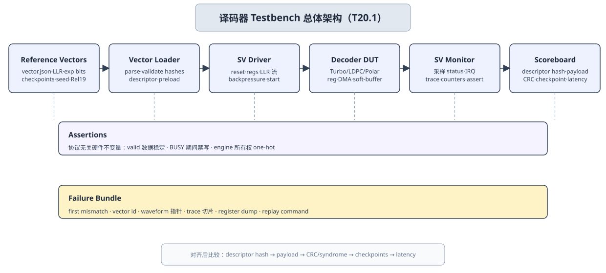

# T20.1 译码器 SystemVerilog Testbench 架构：从协议向量到 RTL 通过/失败判定
## 本节学习目标

本节设计译码器寄存器传输级验证中的 SystemVerilog testbench 架构。这里的 testbench 不是“写一个 initial block 跑一下”，而是一套能把 3GPP 协议向量、定点参考模型、统一译码子系统、三类译码引擎和失败证据串起来的验证外壳。DUT 可以是 LTE Turbo 单引擎、NR LDPC 单引擎、NR Polar 单引擎，也可以是 T19.4 的统一译码子系统。


- 画出 Turbo、LDPC、Polar 译码器共用的 SystemVerilog testbench block diagram。
- 说明 reference vector loader、driver、monitor、scoreboard、assertion、reset/timeout sequence 和 failure bundle 各自负责什么。
- 把 T18.6 的 `vector.json`、checkpoint manifest 和 failure bundle 映射到 RTL 验证对象。
- 把 T19.6 的寄存器配置流映射成 testbench driver：写寄存器、锁存 descriptor、启动任务、等待 done/error、读取 status/trace。
- 给出三类译码器的最小 directed tests：LTE Turbo、NR LDPC、NR Polar 分别要抓什么 bug。
- 设计 pass/fail 口径：payload、CRC/syndrome、status/error/IRQ、descriptor hash、checkpoint、latency、饱和计数和 timeout 都要参与判断。
- 说明哪些内容来自 3GPP 协议向量，哪些内容是工程验证方法，不把 testbench 结构写成协议规定。

如果只记住一句话：T20.1 的 testbench 是“协议向量和 RTL 行为之间的审判席”。driver 负责把向量变成硬件事务，monitor 负责把硬件行为变成观测记录，scoreboard 负责把两者按同一套 descriptor、hash、checkpoint 和时序对齐后判定。

## 前置知识检查

| 前置项 | 本节需要达到的程度 |
|:---|:---|
| T5.4 RTL 状态机与握手 | 理解 `valid/ready`、start/done/error、reset、timeout 和 backpressure。 |
| T5.5 硬件验证思维 | 知道 golden model、bit-exact、directed/random、coverage、波形和 failure replay 的基本目的。 |
| T18.6 Bit-exact 回归框架 | 知道 `vector.json`、checkpoint manifest、descriptor hash、first mismatch 和 failure bundle。 |
| T19.1 LTE Turbo RTL 微架构 | 知道 Turbo engine 的 rate recovery、SISO、alpha/beta、extrinsic、CRC checkpoint。 |
| T19.2 NR LDPC RTL 微架构 | 知道 LDPC engine 的 BG、$Z_c$、layered schedule、CN/VN update、syndrome checkpoint。 |
| T19.3 NR Polar RTL 微架构 | 知道 Polar engine 的 rate recovery、SC/SCL、path metric、sort/prune、CRC/RNTI final selector。 |
| T19.4 统一译码子系统 | 知道 descriptor dispatcher、input/output DMA、soft buffer manager、status/IRQ/trace 和独立 engine 边界。 |
| T19.6 寄存器表与配置流 | 知道配置字段、shadow lock、legality check、busy 写保护、error code 和 IRQ 清除。 |

自检问题：

| 问题 | 若回答不出来，先回看 |
|:---|:---|
| 为什么最终 CRC pass 不能替代 bit-exact checkpoint 比较？ | T18.6。 |
| 为什么 BUSY 中写配置必须由断言或 directed test 抓住？ | T19.6。 |
| 为什么 HARQ soft buffer 要测试 reset/abort 中的半提交？ | T19.5。 |
| 为什么 Polar SCL 的 path metric tie-breaker 要进入 scoreboard？ | T10.5、T18.4、T19.3。 |

## Roadmap 卡片原文与执行范围

| 项目 | 内容 |
|:---|:---|
| 编号 | T20.1 |
| 前置 | T18.6, T19.1-T19.3 |
| Prompt | 请设计 Turbo、LDPC、Polar 译码引擎的 SystemVerilog testbench 架构，包含 driver、monitor、scoreboard、参考向量加载器、断言、复位测试和超时方案。 |
| 产出 | `docs/L3_工程实现/T20.1_decoder_testbench_architecture.md` |
| 验收 | Learner can write a testbench plan that compares RTL output to golden vectors. |
| 证据边界 | testbench methodology 不需要直接 3GPP 引用；生成向量必须回链 T7、T9、T10、T20.2 的 Rel-19 证据。 |

本节是工程验证架构课。3GPP 规范不规定你的 SystemVerilog class、interface、mailbox、scoreboard 算法或 timeout cycle 数；协议只规定向量中 TB/CB/CBG、CRC、rate matching、HARQ/RV、LDPC BG/$Z_c$、Polar construction 等语义。本节规定如何在 RTL 仿真中证明 DUT 按这些语义工作。

## 资料与协议边界

| 资料 | 本地路径 | 边界 |
| :--- | :--- | :--- |
| TS 36.212 Rel-19 `36212-j30` | `3GPP_Rel19/processed/TS_36.212_36212-j30` | 不规定 SV driver/monitor/scoreboard。 |
| TS 38.212 Rel-19 `38212-j30` | `3GPP_Rel19/processed/TS_38.212_38212-j30` | 不规定 RTL trace 端口或 SVA。 |
| TS 38.214 Rel-19 `38214-j30` | `3GPP_Rel19/processed/TS_38.214_38214-j30` | testbench 只消费已解析 descriptor。 |
| LTE 译码协议与工程章节 | `docs/L2_协议算法/T7.*.md`, `docs/L3_工程实现/T19.1_LTE_Turbo_RTL_microarchitecture.md` | 本节不重写 Turbo 算法推导。 |
| NR LDPC 协议与工程章节 | `docs/L2_协议算法/T8.*.md`, `docs/L2_协议算法/T9.*.md`, `docs/L3_工程实现/T19.2_NR_LDPC_RTL_microarchitecture.md` | 本节不重写 LDPC 协议表。 |
| NR Polar 协议与工程章节 | `docs/L2_协议算法/T10.*.md`, `docs/L3_工程实现/T19.3_NR_Polar_RTL_microarchitecture.md` | 本节不重写 Polar construction。 |
| Bit-exact 回归框架 | `docs/L3_工程实现/T18.6_bit_exact_regression_harness.md` | 本节把它落到 RTL testbench。 |
| 统一子系统与寄存器配置 | `docs/L3_工程实现/T19.4_unified_decoder_subsystem_architecture.md`, `docs/L3_工程实现/T19.6_decoder_register_map_configuration_flow.md` | 真实 RTL 端口名以实现为准。 |

协议前因后果是：T7/T9/T10 负责回答“这条向量为什么合法、按协议应该输出什么”；T18.6 负责回答“参考模型和 RTL 应该在哪些 checkpoint 一致”；T19.1-T19.6 负责回答“硬件有哪些接口、状态和错误码”；T20.1 把这些对象放到 SystemVerilog testbench 中，形成可执行验证闭环。

## Testbench 的工程动机

零基础看硬件验证时，最容易低估的是“通过/失败判定”的复杂度。译码器不是一个输入字、输出字的组合逻辑。它有以下特点：

| 特点 | 验证后果 |
|:---|:---|
| 输入是长 LLR stream，不是一拍数据。 | driver 必须产生 DMA beat、valid/ready、last、mask 和 backpressure。 |
| 输出有 payload、status、IRQ、trace、counter。 | monitor 必须同时采样多条接口，不能只看 payload。 |
| 三类 decoder 延迟不同。 | scoreboard 必须做 latency alignment，不能按固定 cycle 比较。 |
| HARQ soft buffer 有历史状态。 | vector loader 必须能 preload 或清空软缓存，并验证 commit/rollback。 |
| 定点内部对象很多。 | checkpoint manifest 必须限定哪些内部 trace 参与 bit-exact。 |
| reset/abort/timeout 是真实系统路径。 | reset tests 和 timeout scheme 必须和正常 pass path 同级设计。 |

因此 testbench 的目标不是让仿真“跑完”，而是让每个失败都有定位证据：

$$
\mathrm{failure\_evidence}
=
(\mathrm{vector\_id},\mathrm{descriptor\_hash},\mathrm{first\_mismatch},\mathrm{trace\_slice},\mathrm{register\_dump},\mathrm{replay\_command}).
\tag{1}
$$

式 (1) 是本节的核心对象。若失败日志只有 `CRC_FAIL`，工程师仍然不知道是 rate recovery、LLR 符号、软缓存 RV、定点饱和、内部地址、CRC 方向还是状态机错。合格的 testbench 应该把 first mismatch 定位到 `turbo.extrinsic.iter3`、`ldpc.cn_update.layer12.edge5` 或 `polar.pm_prune.stage7` 这类可复现位置。

## Testbench 总体架构


| 内容 | 说明 |
|:---|:---|
| Reference Vectors | vector.json, LLR binary, expected bits, checkpoints, seed and Rel-19 evidence links. |
| Vector Loader | parse schema, validate hashes, build descriptor, preload memories and replay metadata. |
| SV Driver | reset, write registers, stream LLR, model backpressure and launch start pulse. |
| Decoder DUT | Turbo, LDPC, Polar engines behind register, DMA, soft-buffer and trace interfaces. |
| SV Monitor | sample outputs, status, IRQ, trace packets, counters and assertion events. |
| Scoreboard | compare descriptor hash, payload, CRC/syndrome status, checkpoints and latency after alignment. |
| Assertions | protocol-free hardware invariants: stable valid data, no write while busy, one-hot engine ownership. |
| Failure Bundle | first mismatch, vector id, waveform pointer, trace slice, register dump and replay command. |
| vectors | loader |
| loader | driver |
本节流程顺序为：reference vectors 进入 vector loader；loader 构造 descriptor、LLR、expected checkpoints；SV driver 写寄存器、stream LLR、控制 reset/timeout；DUT 运行；SV monitor 采集 output/status/IRQ/trace；scoreboard 比较 expected 与 observed；assertions 并行检查硬件不变量；failure bundle 保存 first mismatch 和 replay 证据。图下半部分列出 reset/timeout 序列和三类译码器最小 directed focus。

图中底部强调语句 `Reset and Timeout Tests are first-class sequences, not afterthoughts` 必须作为 testbench 要求执行：reset、abort、timeout 和 backpressure 序列要进入正式 directed/random suite，而不是在主流程完成后临时补测。

## Reference Vector Loader

reference vector loader 是 testbench 的入口。它把 T18.6 的文件包变成 SystemVerilog 可消费的事务对象。

最小输入文件建议如下：

| 文件 | 内容 | loader 检查 |
|:---|:---|:---|
| `vector.json` | schema version、decoder family、协议字段、seed、LLR 格式、expected output、checkpoint manifest。 | schema 版本、必填字段、协议证据路径、hash。 |
| `input_llr_q*.bin` | 定点 LLR stream。 | 长度、端序、符号扩展、valid mask 对齐。 |
| `preload_softbuf.bin` | 可选 HARQ soft buffer 初始状态。 | soft buffer key、observed mask、saturation counter。 |
| `expected_payload.bin` | 期望硬判决或 payload。 | 长度、CRC pass/fail 标记。 |
| `expected_trace.jsonl` | 期望 checkpoint 序列或摘要。 | checkpoint id、iteration/layer/path tag、hash。 |
| `manifest.json` | 文件 SHA-256、生成命令、git hash、Rel-19 证据回链。 | 所有文件存在且 hash 一致。 |

loader 的第一条规则：发现向量证据不完整时直接 fail，不启动 DUT。因为没有协议来源或 hash 的向量，即使 RTL 通过，也无法纳入 sign-off。

推荐 loader 输出一个 typed transaction：

```systemverilog
typedef struct packed {
  logic [7:0]   family;
  logic [31:0]  task_id;
  logic [15:0]  cb_index;
  logic [15:0]  cb_count;
  logic [7:0]   rv;
  logic [15:0]  llr_width;
  logic [31:0]  timeout_cycles;
  logic [255:0] descriptor_hash;
} decoder_desc_t;
```

真实实现可以拆分成 class 或 interface，但核心字段必须和 T19.6 的配置流对齐。若 `descriptor_hash` 在 loader、driver log、DUT trace 中不同，scoreboard 必须优先报 descriptor mismatch，而不是继续比较 payload。

## Driver 设计

driver 的职责是把 transaction 变成 DUT 可见的时序。它不是简单把字段赋值，而要遵守配置、DMA、reset 和 backpressure 的时序契约。

### 寄存器驱动流程

1. 等待 DUT 不 busy，清除上次 `STATUS_DONE`、`ERROR_CODE`、`IRQ_STATUS`。
2. 写 `COMMON_CFG`、`SOFTBUF_CFG` 和当前 family 的配置寄存器。
3. 若向量要求 preload soft buffer，先通过 soft buffer preload port 或 memory model 初始化。
4. 写 `TRACE_MASK`、`TIMEOUT_CYCLES`、`IRQ_ENABLE`。
5. 写 `CONTROL_START=1`，记录 `start_cycle`。
6. 按配置 stream LLR DMA beat，必要时插入 backpressure。
7. 等待 done/error/timeout，或由 sequence 主动写 `CONTROL_ABORT`。
8. 交给 monitor/scoreboard 判定，不在 driver 内部提前判 pass。

伪代码：

```systemverilog
task automatic drive_one_vector(decoder_vector v);
  wait_idle();
  clear_status_error_irq();
  write_common_cfg(v.desc);
  write_softbuf_cfg(v.desc);
  write_family_cfg(v.desc);
  preload_soft_buffer_if_needed(v);
  write_trace_and_timeout(v.desc);
  pulse_start();
  stream_llr(v.input_llr, v.valid_mask, v.backpressure_pattern);
  wait_completion_or_abort(v.timeout_policy);
endtask
```

driver 必须支持三个扰动开关：

| 扰动 | 用途 | 必须检查 |
|:---|:---|:---|
| `backpressure_pattern` | 模拟 DMA 或下游 ready 间歇拉低。 | `valid=1, ready=0` 时 data/sideband 稳定。 |
| `reset_injection` | clean reset、mid-run reset、soft reset。 | 没有半提交 soft buffer，status/error 可解释。 |
| `timeout_injection` | stall engine、stall input DMA、stall output DMA。 | error code、last checkpoint、IRQ 和 replay 信息正确。 |

## Monitor 设计

monitor 的职责是被动采样 DUT 行为。它不应该驱动 DUT，也不应该替 DUT 做决策。建议拆成四类 monitor：

| Monitor | 采样对象 | 输出给 scoreboard 的记录 |
|:---|:---|:---|
| Register monitor | 配置总线写读、W1C/W1P、busy 写入。 | `reg_event(task_id, addr, data, cycle)`。 |
| Stream monitor | input/output DMA valid/ready/data/last/sideband。 | `stream_beat(port, beat_index, data, mask, last, cycle)`。 |
| Status/IRQ monitor | done/pass_fail/error/stop_reason/IRQ。 | `status_event(task_id, status, error, irq_cycle)`。 |
| Trace monitor | checkpoint trace、counter、descriptor hash。 | `checkpoint_event(id, tag, payload_hash, cycle)`。 |

monitor 需要做 latency capture，但不负责最终判定。例如 output payload 比 expected 晚 2000 cycle，不是 monitor 直接 fail；monitor 记录 `first_output_cycle` 和每个 beat，scoreboard 根据 timeout policy 判断是否超时。

## Scoreboard 设计

scoreboard 是通过/失败判定中心。它至少执行六层比较：

| 层级 | 比较对象 | 失败分类 |
|:---|:---|:---|
| Descriptor | loader hash vs DUT trace hash。 | `DESC_HASH_MISMATCH`。 |
| 输入接收 | driver sent beats vs DUT accepted beats。 | `INPUT_DROP_OR_DUP`。 |
| 输出 payload | expected bits vs observed output after latency alignment。 | `PAYLOAD_MISMATCH`。 |
| 状态 | CRC/syndrome/pass_fail/stop_reason/error_code/IRQ。 | `STATUS_MISMATCH`。 |
| Checkpoint | expected trace manifest vs observed trace/hash。 | `CHECKPOINT_MISMATCH`。 |
| 计数器 | saturation、iteration、layer/path、latency、bank conflict。 | `COUNTER_MISMATCH` 或 `PERF_LIMIT_FAIL`。 |

scoreboard 的 pass 函数可写成：

$$
\mathrm{rtl\_pass}
=
\mathrm{desc\_eq}
\land \mathrm{input\_accepted}
\land \mathrm{payload\_eq}
\land \mathrm{status\_eq}
\land \mathrm{checkpoint\_eq}
\land \mathrm{timeout\_ok}.
\tag{2}
$$

若某条向量只打开 checkpoint 摘要，不打开 full trace，则 `checkpoint_eq` 比较摘要 hash 和关键计数器；若摘要不一致，replay sequence 必须自动重跑并打开 full trace。不能因为 full trace 太大就完全不比较内部对象。

scoreboard 还需要处理 expected fail 向量。协议边界案例中，有些向量本来就应该 CRC fail 或 syndrome nonzero。此时通过条件不是 `pass_fail=1`，而是 DUT 的 fail 类型、错误码、stop reason 和 failure bundle 与 expected 一致。

## 具体数值例子：一条 NR LDPC CBG 重传向量

假设 T20.2 后续提供一条 NR LDPC directed vector：`decoder_family=ldpc`，`BG=1`，`Zc=192`，`rv=2`，`cbg_id=1`，`CBGTI=0100`，`CBGFI=1`，HARQ soft buffer 中已经有 RV0 的旧 LLR。这个例子不新增协议表值，只用 T9.3/T19.5 已讲过的 CBG/RV 语义展示 testbench 如何工作。

| 步骤 | testbench 动作 | 关键检查 |
|:---|:---|:---|
| 1 | loader 读取 `vector.json`、旧 soft buffer preload、RV2 输入 LLR 和 expected trace。 | manifest hash、Rel-19 evidence path、`descriptor_hash`。 |
| 2 | driver 写 `COMMON_CFG`、`SOFTBUF_CFG`、`LDPC_CFG`，preload soft buffer，然后 pulse `CONTROL_START`。 | 写寄存器顺序、busy 前配置完整、`rv=2` 和 `CBG_MASK` 进入 shadow。 |
| 3 | driver stream RV2 LLR，并按向量要求插入两段 backpressure。 | stalled 时 LLR/mask/last 稳定。 |
| 4 | monitor 采样 input accepted count、soft buffer transaction、LDPC trace、status/IRQ。 | 没有 input beat 丢失，`TRACE_DESC_HASH` 与 loader 一致。 |
| 5 | scoreboard 比较 `ldpc.rate_recovery.k0_hash`、`ldpc.layer_trace` 摘要、syndrome、CB CRC 和 CBG hold/update mask。 | RV2 只更新目标 CBG，未调度 CBG 保持旧 observed mask。 |
| 6 | 若 mismatch，failure bundle 保存 first mismatch、soft buffer before/after、register dump 和 replay command。 | replay 能打开 full `ldpc.rate_recovery` 和 `softbuf.transaction` trace。 |

这条例子的验收重点不是“LDPC 最终能不能译过”，而是 testbench 能否证明：同一条 HARQ 历史、同一个 RV2 起点、同一组 CBG 选择和同一套定点 LLR 被 DUT 正确接收、合并、译码和报告。若最终 CRC fail 但 syndrome trace、soft buffer mask 和 expected fail 状态完全一致，这条负例仍然可以是通过的 directed test。

## Assertions

SVA 用于检查硬件不变量。它不替代 scoreboard，因为断言通常不知道 expected payload；它负责抓“任何向量下都不应发生”的接口错误。

推荐断言：

| 断言 | 含义 | 典型 bug |
|:---|:---|:---|
| valid data stable | `valid && !ready` 时 data/sideband/last 稳定。 | backpressure 下丢 LLR 或 mask 错位。 |
| no write while busy | BUSY 中配置写不应改变 active shadow。 | 运行中参数漂移。 |
| engine one-hot | 同一任务只允许一个 engine active。 | family decode 错或 dispatcher bug。 |
| no half commit | abort/reset 后 soft buffer commit valid 不应半置位。 | HARQ soft buffer 污染。 |
| done status stable | done 后到 clear 前 status/error/trace pointer 稳定。 | 软件读结果时被覆盖。 |
| timeout bounded | busy 持续超过 timeout 必须进入 error/abort 路径。 | deadlock。 |

SVA 示例：

```systemverilog
property p_input_stable_when_stalled;
  @(posedge clk) disable iff (!rst_n)
    in_valid && !in_ready |=> $stable({in_data, in_mask, in_last});
endproperty
assert property (p_input_stable_when_stalled);

property p_engine_onehot;
  @(posedge clk) disable iff (!rst_n)
    dut_busy |-> $onehot0({turbo_active, ldpc_active, polar_active});
endproperty
assert property (p_engine_onehot);

property p_done_status_stable_until_clear;
  @(posedge clk) disable iff (!rst_n)
    status_done && !status_clear |=> $stable({status_done, pass_fail, error_code, stop_reason});
endproperty
assert property (p_done_status_stable_until_clear);
```

这些断言不依赖 3GPP 章节，因此属于工程验证规则。若断言失败，即使最终 payload 恰好正确，也必须 fail。

## Reset 与 Timeout 测试

reset 和 timeout 不是附属测试。真实芯片中，译码器可能因为小区切换、调度取消、软件恢复、仿真超时或异常重传被中断。最小测试矩阵如下：

| 测试 | 注入点 | 期望行为 | 必须保存的证据 |
|:---|:---|:---|:---|
| clean reset | start 前 | 寄存器、FIFO、local memory、status/error 回到已知值。 | reset 后寄存器 dump。 |
| mid-run hard reset | BUSY 中，输入已发一半 | active task abort，soft buffer 不半提交，status 可解释。 | abort cycle、soft buffer commit state、trace last checkpoint。 |
| soft reset | done 后 clear 前 | 按设计清内部状态，capability 保留。 | status/error 清除行为。 |
| driver abort | BUSY 中写 `CONTROL_ABORT` | DUT 停止当前任务，输出 `STOP_ABORT` 或等价状态。 | abort command、stop reason、IRQ。 |
| input DMA timeout | LLR stream 中断 | `ERR_INPUT_TIMEOUT` 或统一 timeout。 | accepted beat count。 |
| output backpressure timeout | 输出 ready 长时间为 0 | status 不应提前覆盖 payload commit。 | output beat count、done cycle。 |

timeout 不能只靠仿真器外层固定延时后结束仿真。那只能杀死仿真，不能证明 DUT 能自报错。推荐双层 timeout：

$$
T_{\mathrm{tb}} > T_{\mathrm{dut}} + T_{\mathrm{margin}}.
\tag{3}
$$

其中 $T_{\mathrm{dut}}$ 写入 DUT timeout register，$T_{\mathrm{tb}}$ 是 testbench 防死锁上限。若 $T_{\mathrm{dut}}$ 到期但 DUT 不报错，scoreboard 报 `DUT_TIMEOUT_NOT_REPORTED`；若 $T_{\mathrm{tb}}$ 到期，testbench 报 `TB_DEADLOCK` 并保存当前波形。

## 三类译码器 directed tests

### LTE Turbo

| Directed test | 输入重点 | Scoreboard checkpoint | 预期抓错 |
|:---|:---|:---|:---|
| 无噪声最小 CB | 高可靠 LLR、单 CB、CRC pass。 | `turbo.final.crc`。 | LLR 符号反、payload bit order 错。 |
| interleaver 地址 | 选择已知 `K/f1/f2`，打开 extrinsic trace。 | `turbo.extrinsic.addr_hash`。 | 交织/解交织方向错。 |
| RV window | 同一 HARQ key 先 RV0 后 RV2。 | `turbo.rate_recovery.rv_hash`。 | circular buffer 起点错、旧 LLR 未合并。 |
| CB CRC fail | 人为翻转一个输入区域。 | `turbo.final.cb_crc`、`stop_reason`。 | fail 被误报 pass 或 early stop 错。 |
| max iteration | 低可靠 LLR，CRC 不通过。 | iteration count、stop reason。 | 迭代计数多一/少一。 |

Turbo 的重点是“地址”和“迭代”。若只比较最终 payload，交织地址 bug 可能在某些短向量上被隐藏。

### NR LDPC

| Directed test | 输入重点 | Scoreboard checkpoint | 预期抓错 |
|:---|:---|:---|:---|
| BG/Zc 合法组合 | BG1/BG2、多个 `Zc`。 | `ldpc.schedule_hash`。 | lifting set 或 row/column 地址错。 |
| RV/k0 | RV0/1/2/3，固定 `E`。 | `ldpc.rate_recovery.k0_hash`。 | k0 公式、Zc 对齐或 circular buffer 起点错。 |
| CBG hold/flush | CBGTI 只更新部分 CBG，CBGFI 切换。 | soft buffer observed/held mask。 | 未调度 CBG 被覆盖或旧证据错误保留。 |
| syndrome early stop | 构造可早停和不可早停样本。 | `syndrome_zero`、iteration count。 | syndrome pass/fail 方向错。 |
| CN min1/min2 tie | 多个最小幅度相等。 | `ldpc.cn_update.argmin`。 | tie-breaker 与定点参考不一致。 |

LDPC 的重点是“rate recovery + layered trace”。CBG 和 RV 错通常不会表现为随机噪声，而是表现为特定 HARQ 历史状态下的系统性错位。

### NR Polar

| Directed test | 输入重点 | Scoreboard checkpoint | 预期抓错 |
|:---|:---|:---|:---|
| frozen mask | N=小值、已知 info/frozen set。 | `polar.mask_hash`、hard decision。 | frozen/info 互换。 |
| rate recovery | puncture/shorten/repetition 三类。 | `polar.rate_recovery.llr_init`。 | unknown LLR 初始化错。 |
| list-size pressure | L=2/4/8，同一输入。 | `polar.pm_prune.order`。 | sorter、path copy 或 prune 错。 |
| CRC/RNTI select | 多候选中只有一个通过。 | `polar.final.selected_path`。 | CRC/RNTI mask 或 final selector 错。 |
| PM tie-break | 两条路径 metric 相等。 | `polar.pm_prune.tie_order`。 | 非确定排序导致随机失败。 |

Polar 的重点是“候选路径身份”。两个候选 payload 可能只差一个 bit，若 monitor 没有采集 path id、PM、CRC pass mask 和 selected path，debug 会很慢。

## Output Artifacts 与 Failure Bundle

每条仿真向量至少输出：

| 工件 | 内容 |
|:---|:---|
| `run.log` | vector id、seed、start/done cycle、pass/fail、stop reason。 |
| `observed_status.json` | status、error、IRQ、counter、latency。 |
| `observed_trace.jsonl` | checkpoint event 或摘要 hash。 |
| `scoreboard_diff.json` | 第一处不一致、expected/observed、比较策略。 |
| `register_dump.json` | start 前 shadow、done 后 status/error/trace pointer。 |
| `waveform.vcd/fsdb` | 可选，失败或 debug 模式保存。 |
| `replay.sh` | 一条命令重跑同一向量、同一 seed、同一 trace mask。 |

failure bundle 必须能回答四个问题：

1. 失败向量从哪条协议证据生成？
2. DUT 看到的 descriptor 和 reference loader 的 descriptor 是否一致？
3. 第一处 mismatch 在哪个 checkpoint、哪个 cycle、哪个 CB/iteration/layer/path？
4. 如何用同一命令重放并打开更详细 trace？

## Testbench 伪代码

```systemverilog
initial begin
  tb_env env;
  decoder_vector vec;
  env = new();
  env.build();
  env.reset_clean();

  foreach (vector_list[i]) begin
    vec = env.loader.load(vector_list[i]);
    env.scoreboard.expect(vec);
    env.driver.drive_one_vector(vec);
    env.monitor.wait_done_or_error(vec.timeout_tb_cycles);
    env.scoreboard.compare_and_emit_bundle(vec);
    env.clean_between_vectors(vec.cleanup_policy);
  end

  env.report_summary();
end
```

这段伪代码刻意没有把比较放在 driver 里。driver 只负责施加刺激，monitor 只负责观测，scoreboard 只负责判定。三者混在一起会导致“刺激代码提前知道答案”，增加漏检风险。

## 与 UVM 的关系

本节结构可以映射到 UVM，但不强制项目当前必须使用 UVM：

| 本节对象 | UVM 对应 | 非 UVM 对应 |
|:---|:---|:---|
| vector loader | `uvm_sequence` / config DB reader | 普通 SystemVerilog class + file parser。 |
| driver | `uvm_driver` | interface task。 |
| monitor | `uvm_monitor` | passive always block + mailbox。 |
| scoreboard | `uvm_scoreboard` | class queue + compare function。 |
| assertions | bind SVA module | 直接实例化 assertion module。 |
| failure bundle | `uvm_report_server` extension | JSON writer task。 |

选择 UVM 的好处是组件化和复用，缺点是入门成本高。对本项目学习文档而言，关键不是类库名字，而是角色边界、证据字段和 pass/fail 口径清楚。

## 浮点、定点与 RTL 的比较关系

本节不重新定义浮点仿真。比较链路应继承 T18.6：

| 比较对象 | RTL testbench 中的处理 |
|:---|:---|
| Python float vs Python fixed | 在向量生成阶段完成，产出定点 expected 和性能预算。 |
| Python fixed vs C/C++ fixed | 由 T18.6 回归完成，产出 checkpoint manifest 和 expected trace。 |
| C/C++ fixed vs RTL | T20.1 scoreboard 的主任务，按 checkpoint 和输出状态 bit-exact 比较。 |

因此 RTL testbench 通常不直接调用浮点模型逐拍比较。它消费已经冻结的 expected artifact。若必须 co-simulate C/C++ reference，也应把它包装成 deterministic reference server，并保存版本/hash，不能让 reference 在仿真中根据 DUT 行为动态改变期望。

## RTL/ASIC 映射

T20.1 是验证架构，但它反向约束 RTL/ASIC 可观测性：

| RTL/ASIC 设计点 | testbench 需要的可观测性 |
|:---|:---|
| descriptor shadow | 可读 hash 或 trace event，证明配置锁存一致。 |
| soft buffer transaction | commit/abort/held/updated 计数器，证明 HARQ 行为。 |
| engine checkpoint | 可选 trace port 或 trace RAM，能在 debug 模式输出内部摘要。 |
| status/error/IRQ | done 前后稳定，W1C 行为可验证。 |
| timeout counter | 可配置，能触发 deterministic timeout。 |
| reset/abort | 能区分 hard reset、soft reset、software abort。 |

如果 RTL 没有任何内部 trace，testbench 仍可做黑盒 payload/status 验证，但无法满足 bit-exact bring-up 的定位要求。工程上建议 trace 可通过 `TRACE_MASK` 分级打开，量产配置可关闭。

## 验证方法与验收口径

单篇验收建议如下：

| 验收项 | 通过标准 |
|:---|:---|
| 架构覆盖 | 文档能明确 driver、monitor、scoreboard、loader、assertion、reset、timeout 和 failure bundle。 |
| 三类 decoder | 至少各有一组 directed tests，并说明要抓的 bug。 |
| 协议回链 | 向量生成回链 T7/T9/T10/T20.2 和 Rel-19 本地路径；testbench 方法不冒充 3GPP 规定。 |
| pass/fail | payload、status、CRC/syndrome、IRQ、trace、descriptor hash 和 timeout 均进入判定。 |
| 工具边界 | 说明当前仓库没有真实 SystemVerilog simulator/RTL run；可运行的是文档审计和表格生成审计。 |
| 证据记录 | 记录表格生成、几何/可读性审计、术语/标题/深度/LaTeX/引用审计。 |

## 常见错误

| 错误 | 后果 | 防护 |
|:---|:---|:---|
| driver 直接读 expected 并决定何时停 | 刺激与判定耦合，漏检。 | driver 不判定，scoreboard 统一比较。 |
| 只比较最终 payload | 内部 checkpoint 漏检，CRC fail 难定位。 | 按 T18.6 manifest 比较 trace。 |
| 忽略 expected fail 向量 | 负例被误判为失败。 | expected status 支持 pass/fail 两类。 |
| timeout 只靠仿真器外层杀死 | DUT 自身 deadlock 无法分类。 | DUT timeout 与 TB timeout 双层设计。 |
| monitor 主动驱动 ready 或 clear | 观测者改变 DUT 行为。 | monitor passive，driver/sequencer 负责驱动。 |
| reset 后不检查 soft buffer commit | 半写入污染后续 HARQ。 | reset/abort directed test + no half commit assertion。 |
| descriptor hash 不比较 | 配置端序、位域、shadow lock 错不易发现。 | loader/driver/DUT trace 三方 hash。 |
| SVA 只在 smoke 打开 | 随机/边界回归漏掉接口不变量。 | assertions 默认启用，必要时按严重度分级。 |

## 工业用例

| 用例 | 输入 | 输出 | 边界条件 | 验证方式 | 失败案例 |
|:---|:---|:---|:---|:---|:---|
| 多引擎 RTL bring-up | 连续运行 LTE Turbo、NR LDPC、NR Polar 三条 directed vectors。 | 每条 vector 的 payload/status/trace/IRQ/failure bundle。 | 三类配置字段不同，未使用 family 字段不能污染当前任务。 | loader hash、driver register log、monitor trace、scoreboard diff。 | 上一条 LDPC `Zc` 残留导致 Polar legality checker 错判。 |
| HARQ 重传恢复定位 | LTE RV0/RV2 或 NR CBG hold/flush 向量。 | soft buffer transaction trace、LLR 合并结果、CRC/syndrome 状态。 | reset/abort 可能发生在 soft buffer commit 前。 | reset-injection sequence、no-half-commit assertion、scoreboard mask compare。 | abort 后旧 observed mask 被半更新，下一次重传错误合并。 |

## 自测题

1. 为什么 reference vector loader 发现 manifest hash 不一致时应该直接 fail，而不是继续跑 DUT？
2. driver、monitor、scoreboard 三者的边界分别是什么？
3. 为什么 `descriptor_hash` mismatch 应优先于 payload mismatch 报告？
4. expected CRC fail 向量的通过条件是什么？
5. 为什么 timeout 要分 DUT timeout 和 testbench timeout 两层？
6. LTE Turbo、NR LDPC、NR Polar 各自最需要打开哪类 checkpoint？
7. SVA 和 scoreboard 的职责有什么不同？
8. 为什么 reset/abort 测试必须检查 soft buffer commit 状态？

## 自测题参考答案

1. manifest hash 不一致说明输入文件、期望输出或协议证据版本已经不可信。继续跑 DUT 只会得到不可追溯结果，不能纳入 sign-off。
2. driver 施加刺激，例如写寄存器、stream LLR、注入 backpressure/reset；monitor 被动观测 RTL 输出、status、IRQ、trace；scoreboard 把 expected 和 observed 对齐后判定 pass/fail。
3. descriptor hash 不一致说明 DUT 运行的配置与 reference 不同，此时 payload mismatch 只是后果。先报 descriptor mismatch 能直接定位寄存器写入、端序、位域或 shadow lock 问题。
4. expected fail 向量通过条件是 DUT 报出预期的 fail 类型、stop reason、error/status/trace，而不是强行要求 CRC pass。
5. DUT timeout 证明硬件能自检测并上报超时；testbench timeout 防止仿真无限挂死。若只有外层 timeout，无法证明 DUT 的错误处理路径。
6. Turbo 重点是 rate recovery、branch metric、alpha/beta、extrinsic、CRC；LDPC 重点是 rate recovery、CN min1/min2、layer trace、syndrome/CRC；Polar 重点是 rate recovery、f/g、partial sum、path metric、prune order、CRC/RNTI final selector。
7. SVA 检查接口和控制不变量，例如 stalled data stable、engine one-hot、no write while busy；scoreboard 比较具体向量的 expected/observed payload、status 和 checkpoint。
8. HARQ soft buffer 保存跨重传证据。reset/abort 若留下半提交 LLR 或 mask，后续重传会把损坏证据当成真实软信息，问题可能延迟到下一次 RV 才暴露。

## Prompt 覆盖验收表

| Prompt 要求 | 正文覆盖位置 | 结论 |
|:---|:---|:---|
| Turbo、LDPC、Polar 译码引擎 | `三类译码器 directed tests`、图表底部 decoder family 表。 | 覆盖。 |
| SystemVerilog testbench 架构 | `Testbench 总体架构`、`与 UVM 的关系`。 | 覆盖并扩展。 |
| driver | `Driver 设计`、寄存器驱动流程、伪代码。 | 覆盖。 |
| monitor | `Monitor 设计`。 | 覆盖。 |
| scoreboard | `Scoreboard 设计`、式 (2)。 | 覆盖。 |
| 参考向量加载器 | `Reference Vector Loader`。 | 覆盖。 |
| 断言 | `Assertions`、SVA 示例。 | 覆盖。 |
| 复位测试 | `Reset 与 Timeout 测试`。 | 覆盖。 |
| 超时方案 | `Reset 与 Timeout 测试`、式 (3)。 | 覆盖。 |
| 协议证据边界 | `资料、协议依据与本地路径`、`协议证据表`。 | 覆盖，明确 testbench 方法非协议规定。 |
| 结构化正文要求 | Mermaid、表格、流程字段和边界说明覆盖本节图示语义。 | 覆盖。 |
| 验收 | `验证方法与验收口径`、自测题和答案。 | 覆盖。 |

## 协议证据表

| 结论 | 证据 | 本地路径 | 边界 |
|:---|:---|:---|:---|
| LTE Turbo RTL 向量必须回链 LTE CB segmentation、Turbo interleaver、rate matching 和 CRC。 | TS 36.212 Rel-19 `36212-j30`；项目 T7/T19.1。 | `3GPP_Rel19/processed/TS_36.212_36212-j30`、`docs/L2_协议算法/T7.*.md`、`docs/L3_工程实现/T19.1_LTE_Turbo_RTL_microarchitecture.md` | 本节不重建协议表；T20.2 后续定义 exact vector suite。 |
| NR LDPC RTL 向量必须回链 BG/$Z_c$、rate recovery、RV/k0、CBG 和 CRC/syndrome。 | TS 38.212 Rel-19 `38212-j30`、TS 38.214 Rel-19 `38214-j30`；项目 T8/T9/T19.2。 | `3GPP_Rel19/processed/TS_38.212_38212-j30`、`TS_38.214_38214-j30`、`docs/L2_协议算法/T8.*.md`、`docs/L2_协议算法/T9.*.md`、`docs/L3_工程实现/T19.2_NR_LDPC_RTL_microarchitecture.md` | testbench 只消费已生成向量和 descriptor。 |
| NR Polar RTL 向量必须回链 reliability/frozen mask、rate recovery、CRC/RNTI 和 SCL/CA-SCL 选择语义。 | TS 38.212 Rel-19 `38212-j30`；项目 T10/T19.3。 | `3GPP_Rel19/processed/TS_38.212_38212-j30`、`docs/L2_协议算法/T10.*.md`、`docs/L3_工程实现/T19.3_NR_Polar_RTL_microarchitecture.md` | list size、PM 近似、sorter 是实现策略。 |
| vector schema、checkpoint manifest、failure bundle 的字段来自项目 bit-exact 框架。 | T18.6。 | `docs/L3_工程实现/T18.6_bit_exact_regression_harness.md` | 工程回归框架，不是 3GPP 条文。 |
| register/status/error/IRQ/trace 驱动对象来自统一子系统和寄存器配置流。 | T19.4、T19.6。 | `docs/L3_工程实现/T19.4_unified_decoder_subsystem_architecture.md`、`docs/L3_工程实现/T19.6_decoder_register_map_configuration_flow.md` | 真实端口名、总线协议和地址以 RTL 实现为准。 |

## 图示


## 执行与证据记录

| 项 | 命令或证据 | 结果 |
|:---|:---|:---|
| Roadmap 任务 | `2026-06-19-lte-nr-decoding-learning-roadmap.md:1203-1212` | T20.1 prompt 已逐条覆盖并扩展。 |
| 图形资产 | `docs/L3_工程实现/assets/T20.1_decoder_testbench_architecture.svg` | 手绘 SVG，2026-08-04 替代原 PIL 渲染 PNG（原 `render_t15_1_decoder_testbench_architecture.py` 与 PNG 已删除，图示语义不变）；SVG 几何审计六项检查全部通过，cairosvg 渲染验证无报错。 |
| 工具可用性 | 当前仓库未发现真实 SystemVerilog RTL 仿真入口或 simulator 脚本。 | 本节只运行文档/图形审计；SV/UVM 命令为后续实现模板，不能写成已通过仿真。 |

## 参考文献

- [3GPP, 2026] 3GPP TS 36.212 Rel-19 `36212-j30`, *Evolved Universal Terrestrial Radio Access (E-UTRA); Multiplexing and channel coding*.
- [3GPP, 2026] 3GPP TS 38.212 Rel-19 `38212-j30`, *NR; Multiplexing and channel coding*.
- [3GPP, 2026] 3GPP TS 38.214 Rel-19 `38214-j30`, *NR; Physical layer procedures for data*.
- [Project, 2026] T18.6 Bit-exact regression harness, `docs/L3_工程实现/T18.6_bit_exact_regression_harness.md`.
- [Project, 2026] T19.1 LTE Turbo RTL microarchitecture, `docs/L3_工程实现/T19.1_LTE_Turbo_RTL_microarchitecture.md`.
- [Project, 2026] T19.2 NR LDPC RTL microarchitecture, `docs/L3_工程实现/T19.2_NR_LDPC_RTL_microarchitecture.md`.
- [Project, 2026] T19.3 NR Polar RTL microarchitecture, `docs/L3_工程实现/T19.3_NR_Polar_RTL_microarchitecture.md`.
- [Project, 2026] T19.4 Unified decoder subsystem architecture, `docs/L3_工程实现/T19.4_unified_decoder_subsystem_architecture.md`.
- [Project, 2026] T19.6 Decoder register map and configuration flow, `docs/L3_工程实现/T19.6_decoder_register_map_configuration_flow.md`.
