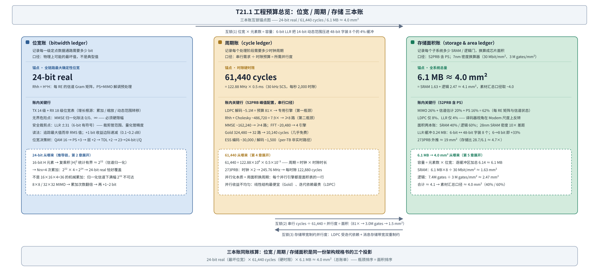

# T21.1 工程预算总览：位宽/周期/存储三本账

## 本节学习目标

前五个 L3 模块（T17–T20）讲的是译码器自己：浮点仿真、定点需求、RTL 微架构、验证与综合。但一颗真实的基带芯片里，译码器只是众多子系统之一——它前面有 OFDM 解调、信道估计、MIMO 均衡与软解调，旁边还有加扰、速率恢复与概率整形（Probabilistic Shaping, PS）的收发通路。本章（T21 系列第 1 章）把视角从"译码器"拉高到"完整 Modem"：从 ADC 到低密度奇偶校验码（Low-Density Parity-Check, LDPC）解码输出的整条接收链路，要在一份硬件规格书里被量化为三类资源——**位宽、周期、存储与面积**。这条链路搬运的软信息是对数似然比（Log-Likelihood Ratio, LLR，[[LLR_对数似然比]]）——LLR 的符号表示判决方向、绝对值表示可靠度，从软解调一路送到译码器；三本账里，LLR 既是位宽账的收口（裁剪点），也是存储账的杠杆支点。这三类资源各记一本账，三本账彼此互锁。

本节是 T21 系列的地图章：不把任何一本账算完，而是把三本账的记账对象、三个锚点数字和互锁关系立起来。学完本节后，应能做到：

- 说出"工程预算"在本系列中的范围（完整 Modem 接收链路而非单个译码器），并列出位宽账、周期账、存储面积账三本账各自的记账对象。
- 复述 Qm.n 格式（Q 格式）的结构（m 位整数 + n 位小数 + 1 位符号）与两条性质（动态范围 ≈6m dB、精度 ε=2^(−n)），并会换算一个具体格式（如 Q5.2）的数值范围。
- 说出三个锚点数字——Rhh 24-bit real、61,440 cycles、6.1 MB≈4.0 mm²——各自"从哪来"的一句话推导链。
- 解释为什么位宽账必须按"物理上可能的最坏值"记账而不是典型值，并说明溢出回绕为什么是灾难性错误（+31 翻转为 −32）。
- 复述 LLR 裁剪-损失权衡表（裁剪-损失权衡）的四组数值（±7/4-bit/<0.1 dB、±15/5-bit/<0.05 dB、±31/6-bit/<0.02 dB、±63/7-bit/<0.01 dB），并指出 ±31 是 6-bit 拐点行。
- 说出完整 Modem 存储拆分的 62%（MIMO 26% + 信道估计 20% + PS 16%）与译码器占比（LDPC 8%、LLR 4%），并解释"译码器视角 → Modem 视角"的结论反转。
- 用一句话描述三本账互锁的三种机制（位宽 × 元素数 = 容量；串行 cycles ÷ 61,440 = 并行度 = 面积；存储带宽制约并行度），并预告"瓶颈排序 = 面积排序"。
- 在系列地图中定位本章与后续五章的分工，并说出核心问题 Q1–Q5 中任意三个在第 1 章的提出位置。

与持久理解的呼应：U1（位宽账记最坏值而非典型值）、U2（裁剪管范围、量化管精度；±31 是拐点）、U4（61,440 cycles 是硬时限，并行化本质是"用面积换周期"）、U5（完整 Modem 的存储大头在每 RE 的矩阵与信道状态，译码器只是小头）在本节全部提出；每条都在后续章节逐层深化、第 6 章收束。系列地图见"系列地图：六章预览与五个核心问题"一节。

## 前置知识检查

| 前置项 | 本节需要达到的程度 |
|:---|:---|
| [[T18.1_fixed_point_decoder_requirements]] 定点译码器需求 | 知道"LLR 用 6 bit"不是完整需求——还要符号、小数位、裁剪、饱和、损失预算与 bit-exact 对比；本节把这份工程契约从译码器放大到全 Modem。 |
| [[Fixed_Point_Numbers_定点数]] 定点数 | 知道 Qm.n 结构（m 位整数 + n 位小数 + 1 位符号）与补码范围；本节补上动态范围 ≈6m dB、精度 2^(−n) 两条性质，并把它们用作读位宽表的尺子。 |
| [[LLR_Quantization_LLR量化]] LLR 量化与裁剪 | 知道裁剪管范围、量化管精度、±31（6-bit）是工程拐点、溢出回绕是灾难性错误；本节把裁剪-损失权衡表放进三本账的第一行，第 3 章展开完整推导。 |
| [[T5.1_fixed_point_numbers_for_LLR]] 定点数基础 | 知道二进制补码、饱和加法、符号扩展；本节不重复基础推导，只引用结论。 |
| [[T2.11_LLR_clipping_scaling_quantization]] LLR 裁剪缩放量化 | 知道裁剪、缩放、量化的分工；本节在 Modem 尺度上复用同一套词汇。 |
| M12 系列（[[T12.1_mimo_receiver_chain_overview]] 等） | 知道 MIMO 接收链路、MMSE 均衡（[[MMSE_均衡]]）、信道估计（[[Channel_Estimation_信道估计]]）的对象与公式；Rhh、Cholesky 是"每 RE 矩阵"预算的宿主。 |
| M13 系列（[[T13.1_probabilistic_shaping_overview_shaping_gain]] 等） | 知道 PS 的整形增益（AWGN 0.5–1.2 dB）与代价（rate loss、TBS 匹配）；PS 在存储账里占 16%，在第 6 章的 ROI 账里是主角。 |
| [[T19.5_soft_buffer_HARQ_memory_architecture]] 软缓存架构 | 知道译码器视角的存储大头是 soft buffer；本节将检验这个结论在 Modem 尺度上是否仍然成立。 |
| [[T18.5_SIMD_memory_layout_decoders]] SIMD 与内存布局 | 知道 48-bit 字打包、bank 与 lane 的概念；6-bit LLR 装 8 个/字是"位宽 → 存储"互锁的实例。 |

如果这些前置还不稳，先抓住一句话：**本节回答"一份 Modem 规格书上的位宽、周期、存储与面积数字是怎么来的、彼此怎么咬合"**。前置知识里所有关于"译码器内部"的直觉，正是本节要拉到 Modem 尺度上重新检验的对象。

## 从译码器到完整 Modem：三本账的开账理由

T17–T20 系列的隐含尺度是"一个译码器"：Turbo、LDPC、Polar 各自的定点位宽、微架构与验证。而接收链路的完整硬件图景（来自对 Qualcomm `evaluation-link-simulator` 的复现预算，见素材语料 PHY01 §7–§10 与 analysis 06）是：发射链路 14 级 + 接收链路 18 级定点数据通路，TX+RX 共几十个缓冲区，每个处理阶段都有独立的周期需求。把这个图景折算成硬件规格，就需要三本账。

**工程预算（engineering budget）**：把链路级性能要求（一个时隙内完成接收处理、达到某个吞吐）折算成位宽、周期、存储与面积三类资源约束的估算方法。一句话解释：先回答"每级数据通路要多少 bit、每个阶段要多少周期、每个子系统要多少存储与面积"，再回答"这些数字是否自洽"。

三本账的命名与记账对象（下文逐本展开）：

| 账本 | 记账对象 | 单位 | 账本上限 |
|:---|:---|:---|:---|
| 位宽账（bitwidth ledger） | 每一级定点数据通路需要多少 bit | bit | 由物理最坏值决定 |
| 周期账（cycle ledger） | 每个处理阶段需要多少时钟周期 | cycles | 每时隙 61,440（硬时限） |
| 存储面积账（storage & area ledger） | 每个子系统需要多少存储与逻辑，换算成芯片面积 | MB、M gates、mm² | 由工艺与预算目标决定 |

**声明口径**：本节全部硬性数字（位宽、容量、周期、面积）来自仿真器复现的工程预算（[[3GPP全流程_缩写概念理论清单]] G 节、PHY01 §7–§10、analysis 06），是"估算事实"而非"协议事实"——3GPP 标准（TS 38.211/38.212/38.214）只规定空口比特序列与调度过程，从不规定芯片内部 LLR 用 6 bit 还是 8 bit、SRAM 用多少 MB。把素材数字当协议强制值是本节最常见的误读。

## 三本账各记什么

### 位宽账：物理上可能的最大值要多少 bit

**位宽账（bitwidth ledger）**：记录每一级定点数据通路"物理上可能的最坏值"需要多少 bit 的账本。一句话解释：它回答"float 换成整数时，这一级至少要留几 bit 才不会溢出"。

记账对象是 TX 14 级 + RX 18 级的完整位宽表（PHY01 §7.2）：从 TX 的源比特（1 bit 打包）、QAM 映射（12–18 bit I/Q）、PS 功率缩放（+3 bit）、预编码（+1）、IFFT（最坏 28-bit）到 RX 的 ADC（14 bit）、OFDM FFT（18 bit I/Q）、信道估计（16–24 bit I/Q）、Rhh（24-bit real）、MMSE 均衡（18 bit I/Q）、LLR 裁剪（6-bit 有符号）。位宽增长的三大根源贯穿全表：**累加**（乘法器输出加起来的位数）、**缩放**（功率归一化/除法的动态范围）、**动态范围转移**（噪声方差随 SNR 变化）。

位宽表上要认三个标记（第 2 章逐一推导）：

| 标记 | 位置 | 含义 |
|:---|:---|:---|
| 🔴 最大确定性位宽 | Rhh = HᴴH，24-bit real | 全链路"物理上可能"的最大值，位宽账的锚点 |
| ⚡ 无界危险点 | MMSE 归一化除法 | csi→0 时出现 0/0、∞，浮点无害、定点致命 |
| ✅ 安全裁剪点 | LLR ±31（6-bit 有符号） | 裁剪把无界值兜在最大可靠度上，是位宽账的收口 |

### 周期账：每个时隙有多少周期可用

**周期账（cycle ledger）**：记录每个处理阶段在参考时钟下需要多少时钟周期的账本。一句话解释：它回答"0.5 ms 的一个时隙里，每件事做不做得完、要做几份并行"。

**时隙 cycle 预算（slot cycle budget）**：每个时隙内参考时钟能提供的周期总数，是接收链路处理的硬时限。30 kHz 子载波间隔（Subcarrier Spacing, SCS）下时隙时长 0.5 ms，52PRB 配置参考时钟 122.88 MHz：

$$
61{,}440 = 122.88\times10^6 \times 0.5\times10^{-3}
\tag{1}
$$

式 (1) 回答的问题是：**从 ADC 到 LDPC 解码输出的整条接收数据通路，每 0.5 ms 只有 61,440 个周期**。273PRB（FR1 100 MHz）配置时钟翻倍到 245.76 MHz，预算翻倍为 122,880 cycles。每秒 2,000 个时隙。

**并行度（parallelism）**：串行周期需求 ÷ 时隙预算，即"一件事拆成几份同时做"。一句话解释：并行度是周期账对面积账发出的采购单——每加一份并行，面积表里就多一行。52PRB 峰值配置（4 层、1024QAM）各阶段的串行需求（PHY01 §10.2）：

| 阶段 | 串行 cycles | 相对预算 | 所需并行 |
|:---|:---|:---|:---|
| OFDM FFT（4 天线） | ~20,480 | 33% | 4 引擎 |
| 信道估计（DMRS） | ~5,000 | 8% | 1 引擎 |
| Rhh + Cholesky | ~486,720 | 7.9× | ≥8 路 |
| MMSE 均衡 | ~162,240 | 2.6× | ≥4 路 |
| QAM 软解调 | ~65,000 | 1.1× | ≥2 路 |
| LDPC 解码 | ~5.1M | 81× | 专用引擎 |
| PS ESS 编码 / 解码 | ~30,000 / ~1,500 | — | 1/CB（非实时路径） |

两个"超预算"行是周期账的主角：LDPC 串行需求约是预算的 81 倍（5.1M ≈ 30 个码块 × 每码块约 8,500 cycles × 20 次最大迭代），必须专用引擎；Rhh+Cholesky 约 7.9 倍，需 ≥8 路 RE 级并行。其余阶段 2–4 路即可（[[Gold_序列加扰]] 的 Gold 序列 324,480 cycles 用 32 路状态跳跃压到 10,140，几乎是免费的并行）。

### 存储面积账：多少 SRAM、多少门、多少平方毫米

**存储面积账（storage & area ledger）**：记录每个子系统需要多少静态随机存取存储器（Static Random-Access Memory, SRAM）容量与逻辑门数、并换算成芯片面积（mm²）的账本。一句话解释：它回答"这些缓冲区和计算逻辑在 7nm 工艺下占多大地方"。

**面积换算器（area converter）**：把容量与门数换算成面积的工艺系数。7nm 下 SRAM 密度 30 Mbit/mm²、逻辑密度约 3 M gates/mm²（含布线拥塞与利用率）；28nm 下 SRAM 密度降至 3 Mbit/mm²。注意"~100 M gates/mm²"是纯 NAND2 晶体管密度理论值，工程面积预算必须用含布线的 3 M gates/mm²。

52PRB 含 PS 的全系统账：TX ~1.04 MB + RX ~5.10 MB ≈ **6.1 MB**；换算面积：

$$
\frac{6.1\ \mathrm{MB}\times 8}{30\ \mathrm{Mbit/mm^2}} \approx 1.63\ \mathrm{mm^2}\quad(\mathrm{SRAM}),
\qquad
\frac{7.4\ \mathrm{Mgates}}{3\ \mathrm{Mgates/mm^2}} \approx 2.47\ \mathrm{mm^2}\quad(\mathrm{逻辑})
\tag{2}
$$

式 (2) 合计约 4.1 mm²，素材汇总口径取 **≈4.0 mm²**（SRAM 占 40%、逻辑占 60%）。口径注：按素材汇总容量 6.1 MB 折算 SRAM 为 1.63 mm²；按七项加总 6.14 MB 折算为 1.64 mm²——同一算式、舍入口径差 0.01 mm²，不影响 ≈4.0 mm² 的结论（与"内嵌验证"一节 numpy 输出一致）。这个"逻辑比 SRAM 大"的结构结论与译码器直觉相反——Modem 的 MIMO 均衡、Cholesky 与 FFT 逻辑密度高（第 5 章展开）。28nm 对照：SRAM 一项即 ≈16.3 mm²。

### 三本账互锁：同一架构决策的三个投影

**三本账互锁（three-ledger interlock）**：位宽、周期、存储面积三本账之间的三种耦合关系——任何一本账的决策都会在另外两本上留下条目。一句话解释：三本账不是三张孤立表，而是同一份架构决策的三个投影。

三条互锁边（图 1 的三个箭头）：

1. **位宽 × 元素数 = 容量（位宽账 → 存储面积账）**：每个缓冲区的容量 = 元素数 × 每元素位宽。LLR 不裁剪需要约 14-bit 表示动态范围，裁剪到 ±31 后 6-bit 恰好压进"48-bit 字装 8 个 LLR"的存储布局（[[T18.5_SIMD_memory_layout_decoders]]）——LLR 缓冲只占全系统 4%，6→8 bit 即 +33%。
2. **串行 cycles ÷ 61,440 = 并行度 = 面积（周期账 → 存储面积账）**：并行化决策的本质是"用面积换周期"。5.1M cycles 的 LDPC 串行需求决定 81× 并行度，并行度决定 LDPC 引擎的 3.0M gates，gates 决定其 1.5 mm² 面积——**瓶颈排序与面积排序是同一枚硬币的两面**。
3. **存储带宽制约并行度（存储面积账 → 周期账）**：LDPC 的并行度受消息存储带宽双重制约（迭代依赖 + 每轮读写消息 RAM 的带宽），所以它是最贵的并行；Gold 序列无数据依赖、无存储冲突，所以 32 路几乎免费。

图 1 把三条互锁边和三个锚点画成一张图：



## 三个锚点数字从哪来

三本账各有一个起定标作用的锚点数字。下面给出各自"从哪来"的一句话推导链；完整推导在第 2/4/5 章。

### 锚点 1：Rhh 24-bit real（位宽账）

**Rhh（信道 Gram 矩阵）**：每个资源单元（Resource Element, RE）上由等效信道矩阵构造的互相关矩阵 $R_{\mathrm{hh}} = H^{\mathrm{H}}H$（上标 H 表示共轭转置），是 MIMO 检测与 PS 解调预处理（MMSE/Cholesky 路径）的核心中间量。PS+MIMO 路径逐 RE 计算 $R_{\mathrm{hh}} = \sum_{i_{\mathrm{rx}}=1}^{N_{\mathrm{rx}}} \overline{\tilde{H}(i_{\mathrm{rx}},i_{\mathrm{tx}})}\cdot\tilde{H}(i_{\mathrm{rx}},j_{\mathrm{tx}})$（Nrx 根接收天线的累加）。

24-bit real 的推导链（PHY01 §7.3.1）：

1. H 元素定点 16-bit（含符号）。信道归一化（$\mathbb{E}|h|^2=1$）下幅度统计有界：RMS 幅度 ≈ 2¹¹；
2. 单个复乘积 $\overline{H}\cdot H = |H|^2$：16×16 定点乘 → 32-bit 积，统计上界 |H|² ≈ 2²²；
3. Nrx=4 次累加：$2^{22}\times4 = 2^{24}$ → **24-bit real 恰好覆盖**；
4. 理论上限（H 满幅 2¹⁵、4 天线同相、含虚部交叉项）约 36-bit，但归一化信道下不可达——所以 24-bit 是工程安全值，**不是 16×16×4=36 的机械累加**。

### 锚点 2：61,440 cycles（周期账）

推导就是式 (1)：时钟 × 时隙时长。61,440 不是拍脑袋的整数，而是"0.5 ms 内 122.88 MHz 能跳多少下"的精确算术。它的角色是**除数**：所有串行周期需求都除以它得到并行度（LDPC ≈81×、Cholesky ≈7.9×）。273PRB 时它翻倍为 122,880——注意 273PRB 的时钟只需 245.76 MHz 而不是 4×122.88 MHz，因为 FFT 引擎数量与 Nfft 一起翻倍即可保持吞吐（1.4 节的面积换周期权衡）。

### 锚点 3：6.1 MB ≈ 4.0 mm²（存储面积账）

6.1 MB 是 TX+RX 逐缓冲区容量加总（TX 含 PS ~1.04 MB + RX 含 PS ~5.10 MB，PHY01 §8.2/§8.3），素材表口径 6.14 ≈ 6.1 MB。面积由式 (2) 的两本账换算：SRAM 1.63 + 逻辑 2.47 ≈ 4.1 → 素材取 **≈4.0 mm²**。这个锚点的用途是"总量地板"：任何新增子系统（比如第 6 章的 PS 硬件化）都要在这块地板之上加面积，并回答 ROI。

## Qm.n 格式：读位宽账的第一把尺子

**Qm.n 格式（Qm.n format）**：定点数的一种表示约定——m 位整数 + n 位小数 + 1 位符号，总位宽 W = m + n + 1（[[Fixed_Point_Numbers_定点数]]）。一句话解释：Qm.n 是"这个整数每一 bit 代表什么"的契约，同一位宽不同 Q 格式含义完全不同（T18.1 的定点需求表把这一点列为第一行）。

两条性质（本节直接可用的尺子）：

1. **动态范围 ≈ 6m dB**：整数部分 m 位能表示的幅度比是 $2^m$，折算分贝 $20\log_{10}(2^m)\approx6.02m\approx6m$ dB。m=5 时约 30.1 dB，m=3 时约 18.1 dB。
2. **精度 ε = 2^(−n)**：小数部分最低位代表 $2^{-n}$，这是量化网格的步长。n=2 时步长 0.25。

例：Q5.2（W = 5+2+1 = 8 bit）：值域 $[-2^5,\ 2^5-2^{-2}] = [-32,\ 31.75]$，动态范围 ≈ 30 dB，精度 0.25。对照 T18.1 的 LLR 例（W=6、F=2，即 Q3.2）：值域 [−8, 7.75]，动态范围 ≈ 18 dB，精度 0.25——同样 6 bit 总位宽，换 Q 格式就换了一整套语义。

为什么这两条够用：**动态范围对着"账"**——最坏值放不放得下；**精度对着"损"**——量化损失有多大。位宽账的每一行都可以用"动态范围够不够 + 精度损失可不可接受"两个问题来审。

## 按最坏值记账：典型值会漏掉灾难场景

位宽账的第一原则：**按"物理上可能的最坏值"记账，不按典型值（RMS 值）记账**。理由不是"工程师保守"，而是典型值会漏掉灾难场景。

**溢出回绕（overflow wraparound）**：二进制补码加法超出表示范围后，从最大正数翻转到最小负数的行为（如 +31 再加 1 变成 −32）。一句话解释：回绕不是"精度变差一点"，而是**方向翻转**——"极可靠"的 LLR 变成"极不可靠"，译码器会把证据往反方向用。

最坏值账本与灾难场景的对应（PHY01 §7.3.5 的实证）：

| 场景 | 典型值口径会怎样 | 最坏值口径要怎样 |
|:---|:---|:---|
| MMSE 归一化除法，深衰落 RE 上 csi→0 | 平均 csi 正常，除法输出"看起来"有界 | 0/0、∞ 是物理上会出现的值：浮点无害（IEEE 754 给 NaN/Inf），定点必须硬限幅 |
| 无缩放 IFFT，624 子载波同相 | 平均输出幅度远小于最坏 | $\max|x(n)| \le N_{\mathrm{sc}}\cdot\max|X(k)| = 1024\times$ → 理论 28-bit 上界 |
| Rhh 累加，4 天线同相 | RMS 幅度 2²² 量级 | 满幅理论上界 2³²（实际不可达），24-bit 是归一化信道下的工程安全值 |

"那省面积到底省在哪里？"——省在**配置没用到的最坏余量**上，不省在最坏值本身。位宽决策树（bitwidth decision tree）——按当前配置逐级累加位宽的决策路径：调制（QPSK 12 / 16QAM 14 / 256QAM 16 / 1024QAM 16 min）→ PS 启用 +3 → 4 层 +2 → TDL 信道 +2 → PS MIMO Cholesky +4 real → 最终 23→24-bit I/Q、Rhh 24-bit real、LLR 恒 ±31（PHY01 §7.3.4）。两种读法：动态配置读法（实际链路按当前 MCS/PS/层数/信道选位宽，省面积）与静态统一读法（一次设计覆盖所有配置）。第 2 章展开整棵树的推导，本节只需要记住：**树的每一行加的都是"物理上可能的最坏值"，不是平均值**。

## 裁剪-损失权衡表预告

**裁剪-损失权衡（clipping–loss tradeoff）**：LLR 裁剪阈值（clipping threshold，|LLR| 超过即截断为 ±C 的界限）与块错误率（Block Error Rate, BLER）损失之间的权衡关系。一句话解释：阈值越小位宽越省但丢真实可信度，阈值越大损失越小但位宽成本线性上涨——权衡表就是这条曲线的采样点（[[LLR_Quantization_LLR量化]]）。

| 裁剪阈值 C | 位宽 | BLER 损失 |
|:---|:---|:---|
| ±7 | 4-bit | < 0.1 dB |
| ±15 | 5-bit | < 0.05 dB |
| ±31 | 6-bit | < 0.02 dB |
| ±63 | 7-bit | < 0.01 dB |

读这张表的三条结论：

1. **收益边际递减**：位宽每 +1 bit 只换约 0.1–0.2 dB 改善；±31 之后损失已低于 0.02 dB 且下降趋缓——**±31 是工程拐点**，再加位宽只付成本（存储线性上涨）难见回报。
2. **±31 吸收无界值**：MMSE 归一化除法的病态放大值（csi→0 的 0/0、∞）被裁剪兜在最大可靠度上——限幅是硬需求而非优化（对应位宽账的 ⚡ 与 ✅ 两个标记）。
3. **裁剪管范围、量化管精度**：裁剪防溢出（回绕是灾难），量化只损失精度（有界可预测、可接受）——"可接受"最终由比特精确回归（[[T18.6_bit_exact_regression_harness]]）的阈值检验裁决，不是拍脑袋。第 3 章给出 1024QAM 动态范围的完整推导（LLR_max ≈ 11,200 → 未裁剪需约 14-bit）。

## 译码器视角 vs Modem 视角：存储大头在哪里

先回顾译码器视角（[[T19.5_soft_buffer_HARQ_memory_architecture]]、[[Soft_Buffer_软缓存]]）：译码器内部的存储叙事以 soft buffer 与消息 RAM 为主——混合自动重传请求（Hybrid Automatic Repeat reQuest, HARQ）要保留旧软信息、LDPC 要存层间消息，直觉是"译码器面积由 memory 主导"。

把镜头拉远到完整 Modem（52PRB 含 PS，PHY01 §8.4 / analysis 06 §1.4），按子系统拆分：

| 子系统 | SRAM | 占比 | 对应缓冲区 |
|:---|:---|:---|:---|
| MIMO Rhh/H_eq 矩阵 | ~1.6 MB | 26% | Rhh、H_eq、Y_eq、PDSCH H_est |
| 信道估计缓冲 | ~1.2 MB | 20% | H_est 天线域 + 层域 |
| PS 子系统 | ~1.0 MB | 16% | 能量表 264 KB + shaped_mask + CB 规划 |
| OFDM FFT/IFFT 缓冲 | ~0.8 MB | 13% | TX 波形、RX/噪声网格、ADC 缓冲 |
| DMRS/Gold/其他 | ~0.8 MB | 13% | DMRS 序列、加扰状态、控制 |
| LDPC 编码器/解码器 | ~0.5 MB | 8% | 消息 RAM |
| LLR 缓冲 | ~0.24 MB | 4% | LLR buffer（6-bit） |
| **总计** | **~6.1 MB** | 100% | — |

**结论反转**：MIMO 矩阵族（26%）+ 信道估计（20%）+ PS（16%）= **62%**——完整 Modem 的存储大头在"每 RE 的矩阵与信道状态"，译码器只占 8%、LLR 缓冲只占 4%。"译码器面积由 memory 主导"的直觉在 Modem 尺度上反转；存储分区（memory partitioning）决策必须跨子系统做——H_est、Rhh 与 soft buffer 争同一块 SRAM 预算（第 5 章展开）。

### 内嵌验证：存储子系统占比拆分

下面用 numpy 验证上表：七个子系统容量加总是否 ≈6.1 MB、占比是否逐行吻合素材表、62% 拆分是否成立，并顺带核对 LLR 缓冲的 6→8 bit +33% 与 61,440 cycles / 4.0 mm² 两个锚点。

```python
# @file    t21_1_storage_split.py
# @brief   T21.1 内嵌验证：存储子系统占比拆分 + 三锚点核对
# @note    数据口径 PHY01 §8.4 / analysis 06 §1.4（52PRB 含 PS）；
#          断言与素材表逐行核对，容差覆盖舍入
import numpy as np

# ---- 存储子系统拆分（52PRB 含 PS，素材口径，单位 MB）----
names = ["OFDM FFT/IFFT", "信道估计", "MIMO Rhh/H_eq", "LLR", "LDPC", "PS", "DMRS/Gold/其他"]
sizes = np.array([0.8, 1.2, 1.6, 0.24, 0.5, 1.0, 0.8])   # MB
total = float(sizes.sum())
pct = 100.0 * sizes / total

print(f"子系统拆分合计: {total:.2f} MB  (素材口径 ~6.1 MB)")
for name, sz, p in zip(names, sizes, pct):
    print(f"  {name:<14} {sz:>5.2f} MB   {p:>5.1f}%")

top3 = float(sizes[1] + sizes[2] + sizes[5])            # CE + MIMO + PS
print(f"MIMO+CE+PS 合计: {top3:.2f} MB = {100.0*top3/total:.1f}%  (素材口径 62%)")

# ---- LLR 缓冲按 6-bit 反算（峰值 G = 324,480 bit）----
llr6 = 324480 * 6 / 8 / 1e6
llr8 = 324480 * 8 / 8 / 1e6
print(f"LLR 缓冲: 6-bit {llr6:.3f} MB / 8-bit {llr8:.3f} MB  (+{100*(llr8/llr6-1):.0f}%)")

# ---- 三锚点核对：61,440 cycles 与 6.1 MB -> ~4.0 mm² ----
cycles = 122.88e6 * 0.5e-3
cycles273 = 245.76e6 * 0.5e-3
sram_mm2 = total * 8 / 30.0          # 7nm SRAM 密度 30 Mbit/mm²
logic_mm2 = 7.4 / 3.0                # 逻辑密度 3 M gates/mm²
print(f"时隙预算: {cycles:.0f} cycles (122.88 MHz x 0.5 ms) / 273PRB {cycles273:.0f} cycles (245.76 MHz)")
print(f"面积: SRAM {sram_mm2:.2f} + 逻辑 {logic_mm2:.2f} = {sram_mm2+logic_mm2:.2f} mm²  (素材口径 ~4.0)")

# ---- 断言 ----
assert abs(total - 6.14) < 0.01
rounded = [int(round(p)) for p in pct]
assert rounded == [13, 20, 26, 4, 8, 16, 13]            # 与素材表逐行一致
assert abs(100.0 * top3 / total - 61.9) < 0.3            # 62%
assert abs(llr6 - 0.24) < 0.01 and abs(llr8 / llr6 - 4.0 / 3.0) < 1e-6   # +33%
assert abs(cycles - 61440) < 0.5 and abs(cycles273 - 122880) < 0.5
assert abs((sram_mm2 + logic_mm2) - 4.10) < 0.15         # ≈4.0 mm²
print("断言全部通过：拆分 13/20/26/4/8/16/13、62%、6.1 MB、61,440/122,880、≈4.0 mm² ✓")
```

真实运行输出（断言全部通过）：

```text
子系统拆分合计: 6.14 MB  (素材口径 ~6.1 MB)
  OFDM FFT/IFFT   0.80 MB    13.0%
  信道估计            1.20 MB    19.5%
  MIMO Rhh/H_eq   1.60 MB    26.1%
  LLR             0.24 MB     3.9%
  LDPC            0.50 MB     8.1%
  PS              1.00 MB    16.3%
  DMRS/Gold/其他    0.80 MB    13.0%
MIMO+CE+PS 合计: 3.80 MB = 61.9%  (素材口径 62%)
LLR 缓冲: 6-bit 0.243 MB / 8-bit 0.324 MB  (+33%)
时隙预算: 61440 cycles (122.88 MHz x 0.5 ms) / 273PRB 122880 cycles (245.76 MHz)
面积: SRAM 1.64 + 逻辑 2.47 = 4.10 mm²  (素材口径 ~4.0)
断言全部通过：拆分 13/20/26/4/8/16/13、62%、6.1 MB、61,440/122,880、≈4.0 mm² ✓
```

两组读法（教学要点）：

1. **拆分的数值结构**：7 个子系统容量加总 6.14 MB（素材口径 6.1 MB）；占比逐行圆整后恰好 13/20/26/4/8/16/13，合计 100%——素材表的百分比不是独立拍出来的，而是同一份加总的口径（"总量 6.1 MB"与"占比 62%"自洽）。
2. **锚点互锁**：同一段代码里，61,440 cycles 与 4.0 mm² 都从各自的乘法/除法链出来——三个锚点共享同一份算术，这就是"三本账同账核算"的最小演示：任何一个锚点改了，另外两个必须重新对账（第 6 章的规格书审计就查这个）。

## 系列地图：六章预览与五个核心问题

T21 系列六章的分工与承载的持久理解：

| 章 | 主题 | 承载理解 | 关键内容 |
|:---|:---|:---|:---|
| 第 1 章（本节） | 工程预算总览：三本账 | U1/U2/U4/U5 立框架 | 三本账各记什么、三锚点（24-bit real / 61,440 / 6.1 MB≈4.0 mm²）、Qm.n、最坏值原则、裁剪表预告、62% 拆分、互锁关系 |
| 第 2 章 | 位宽追踪方法 | U1（推导链）、U3 | TX 14 级 + RX 18 级位宽表、Rhh 24-bit 推导链、无缩放 IFFT 28-bit 上界、位宽决策树两种读法 |
| 第 3 章 | LLR 动态范围与裁剪权衡 | U2/U3/U6 | 1024QAM 动态范围（LLR_max≈11,200→14-bit）、裁剪-损失表与 ±31 拐点、MMSE 归一化无界值吸收、clip vs wrap |
| 第 4 章 | 时隙周期预算与并行化 | U4/U7 | 并行度 = 串行 cycles ÷ 61,440、Gold 32 路/Cholesky ≥8 路/LDPC 专用引擎、273PRB 外推（122,880 cycles） |
| 第 5 章 | 存储与面积估算 | U5/U6/U7 | 逐缓冲区存储表、62% 反转、7nm/28nm 密度换算器、4.0 mm²（40%/60%）、48-bit 字打包、LLR 杠杆 |
| 第 6 章 | 吞吐与全链路 ROI | U7/U8 | 吞吐公式链（TBS×2000）、570 Mbps↔285K bit↔6.8× 裕量自洽、PS 增益-代价同账（+55% gates）、规格书审计、四件预算表整合 |

五个核心问题在第 1 章的提出位置与后续走向：

| 核心问题 | 本节提出 | 深化 | 收束 |
|:---|:---|:---|:---|
| Q1 为什么按最坏值定价、省面积省在哪 | "最坏值账本 + 决策树两种读法" | 第 2 章推导链与决策树 | 第 6 章审计 |
| Q2 浮点无害的无界值为何定点致命、裁剪阈值多大 | "裁剪表预告 + ±31 拐点" | 第 3 章动态范围推导 | 第 6 章验收口径 |
| Q3 60,000 个周期做不完、加多少引擎 | "61,440 硬时限 + 并行度定义" | 第 4 章并行化矩阵 | 第 6 章吞吐自洽 |
| Q4 规格书数字自洽吗 | "三本账互锁 + 同账核算" | 第 5 章存储/面积算账 | 第 6 章规格书审计 |
| Q5 链路增益值得花多少钱 | "PS 16% 存储 + 62% 大头" | 第 4/5 章硬件代价 | 第 6 章 PS ROI 同账 |

与既有系列的衔接：位宽账复用 [[T18.1_fixed_point_decoder_requirements]] 的定点契约词汇（Q 格式、饱和、bit-exact）并把范围从译码器放大到全链路；周期账把 [[T12.1_mimo_receiver_chain_overview]] 的 MIMO 检测与 M13 系列的 PS 预处理（[[T13.6_tbs_matching_system_cost_roi]] 的系统代价预告）放进同一张并行度表；存储面积账对照 [[T19.5_soft_buffer_HARQ_memory_architecture]] 的译码器视角给出 Modem 尺度的反转结论。

## 示范例题

### 例 1（记忆）：复述 Qm.n 格式并换算 Q5.2

**题目**：给定 Qm.n 格式的定义，请（1）复述其结构；（2）写出两条性质（动态范围与精度）的表达式；（3）换算 Q5.2 的总位宽、值域、动态范围与精度。

**解答**：

1. **结构**：Qm.n = m 位整数 + n 位小数 + 1 位符号，总位宽 W = m + n + 1。
2. **两条性质**：动态范围 ≈ 6m dB（来自 $20\log_{10}(2^m)\approx6.02m$）；精度 ε = 2^(−n)。
3. **Q5.2 换算**：W = 5 + 2 + 1 = 8 bit；值域 $[-2^5,\ 2^5-2^{-2}] = [-32,\ 31.75]$；动态范围 ≈ 6×5 = 30 dB（精确值 30.10 dB）；精度 ε = 2⁻² = 0.25。

**点评**：这道题把"同一位宽不同含义"钉死——T18.1 的 LLR 例（W=6、F=2）与本例 Q5.2（W=8）说明，工程上任何位宽条目必须同时写 Q 格式（m、n、符号约定），否则"6 bit"没有语义。

### 例 2（理解）：61,440 锚点来历与三锚点预告

**题目**：有人说"61,440 cycles 是规格书里拍出来的预算数字"。请（1）写出它的完整来历；（2）预告三个锚点数字并各用一句话说出它们的来历；（3）说明为什么这三个数字适合做整本账的锚点。

**解答**：

1. **来历**：61,440 = 参考时钟 × 时隙时长 = 122.88 MHz × 0.5 ms（30 kHz SCS 时隙）。它不是一个"目标"，而是"0.5 ms 内时钟能跳多少下"的精确算术——整条接收数据通路必须在这个硬时限内完成。
2. **三锚点预告**：**Rhh 24-bit real**——H 元素 16-bit、归一化信道下 |H|² 统计有界 ≈ 2²²、Nrx=4 次累加恰好 2²⁴，是全链路最大确定性位宽；**61,440 cycles**——时钟 × 时隙时长的时隙预算，是所有并行度决策的除数；**6.1 MB ≈ 4.0 mm²**——逐缓冲区容量加总（含 PS），再经 7nm 密度换算器（SRAM 30 Mbit/mm²、逻辑 3 M gates/mm²）得到面积。
3. **为什么是锚点**：三个数字各自是"一本账的边界"——位宽账的物理最坏值、周期账的硬时限、存储面积账的总量地板；而且它们互相可验（位宽×元素数=容量、串行÷预算=并行度），改任何一个都必须重对另外两本账。

**点评**：理解级考点的核心是把"数字"还原成"算术链"。锚点不是记忆负担，而是对账的起点——第 6 章审计规格书时，先核对这三个数字的自洽性。

## 引导练习

### 练习 1（应用）：273PRB 时隙预算计算

**题目**：52PRB 配置的参考时钟是 122.88 MHz，每时隙 61,440 cycles。273PRB（FR1 100 MHz）配置的参考时钟是 245.76 MHz。请计算 273PRB 的每时隙 cycles 预算，并说明为什么时钟只翻倍而不是按子载波数比例（5.25×）翻倍。

**提示**：预算 = 时钟 × 时隙时长。时隙时长由子载波间隔决定（30 kHz → 0.5 ms），273PRB 与 52PRB 的时隙时长相同。再想：为什么 FFT 引擎数量与 Nfft 一起翻倍就能保持吞吐（PHY01 §1.4 的面积换周期权衡）？

**参考答案**：273PRB 每时隙预算 = 245.76 MHz × 0.5 ms = 122,880 cycles。时钟只需 2×（245.76/122.88），不需要按 RE 数 5.25× 或 Nfft 4× 翻倍——周期预算按"每时隙 cycles"计，处理量的增长（RE 5.25×、FFT 4×）由并行度（引擎数）吸收：FFT 引擎数量与 Nfft 一起翻倍即可保持每时隙吞吐。这正是"面积换周期"的经典权衡：273PRB 面积约 19 mm²（按存储比 28.7/6.1 ≈ 4.7× 外推），时钟只涨 2×。

### 练习 2（理解）：判断正误——"位宽收益线性，所以加位宽是通用手段"

**题目**：判断正误并说明理由："位宽每增加 1 bit，硬件成本（存储与面积）线性上涨；既然成本是线性的，收益应该也是线性的——遇到性能不达标就把相关位宽加 1 bit，是稳妥的通用做法。"

**提示**：查裁剪-损失权衡表：±7→±15→±31→±63 每行 +1 bit，BLER 损失从 <0.1 到 <0.01 dB——损失下降的斜率是变陡还是变缓？再想位宽账的三标记：加位宽解决的是哪类问题（动态范围不够），对无界危险点（MMSE 0/0）加位宽有用吗？

**参考答案**：错误。位宽收益是**边际递减**的：裁剪-损失表显示 ±31（6-bit）之后损失已低于 0.02 dB 且下降趋缓，位宽每 +1 bit 只换约 0.1–0.2 dB 改善（±31 之后更少），而成本（存储容量、SRAM 面积）确实线性上涨——"成本线性、收益递减"意味着存在收益拐点（±31），拐点之后加位宽是净亏损。更关键的是**加位宽解决不了错误类型的问题**：MMSE 归一化除法的 0/0、∞ 是"无界值"，不是"动态范围不够"——对无界值加位宽毫无用处，必须裁剪/硬限幅。通用做法不是"加位宽"，而是先按位宽决策树走查增长根源（累加/缩放/动态范围转移），再决定是加位宽、加余量还是加裁剪。

## 独立习题

### 习 1（记忆）：复述裁剪-损失权衡表

**题目**：复述 LLR 裁剪-损失权衡表的四组数值（裁剪阈值、位宽、BLER 损失），并说明为什么 ±31 是 6-bit 拐点行。

**参考答案**：±7/4-bit/<0.1 dB；±15/5-bit/<0.05 dB；±31/6-bit/<0.02 dB；±63/7-bit/<0.01 dB。±31 是拐点行：从它起 BLER 损失已低于 0.02 dB 且继续加位宽损失几乎不再下降（收益封顶），而位宽成本（存储、面积）线性上涨——再加位宽只付成本、难见回报；同时 ±31 恰好能把 MMSE 归一化除法在病态 csi（信道状态信息）下放大的无界值（0/0、∞）兜在最大可靠度上。

### 习 2（应用，numpy）：存储占比拆分验证

**题目**：已知 52PRB 含 PS 配置的存储子系统拆分（MIMO Rhh/H_eq 1.6 MB、信道估计 1.2 MB、PS 子系统 1.0 MB、LDPC 编/解码 0.5 MB、LLR 缓冲 0.24 MB、OFDM FFT/IFFT 0.8 MB、DMRS/Gold/其他 0.8 MB）。用 numpy 计算：（1）总量与各子系统占比；（2）验证"MIMO + 信道估计 + PS = 62%"与"总量 ≈ 6.1 MB"；（3）验证 LDPC 与 LLR 各占 <10%。

**参考答案**（代码与输出；与本章"内嵌验证"同数据、不同写法，可对照）：

```python
# @file    t21_1_exercise_2.py
# @brief   T21.1 独立习题 2：存储子系统占比拆分验证（素材口径 PHY01 §8.4）
# @note    与正文内嵌验证同数据；断言容差与素材表一致
import numpy as np

# 存储子系统拆分（52PRB 含 PS，素材口径，单位 MB）
parts = {
    "MIMO Rhh/H_eq": 1.6, "信道估计": 1.2, "PS 子系统": 1.0,
    "LDPC 编/解码": 0.5, "LLR 缓冲": 0.24,
    "OFDM FFT/IFFT": 0.8, "DMRS/Gold/其他": 0.8,
}
total = float(sum(parts.values()))
print(f"子系统拆分合计: {total:.2f} MB  (素材口径 ~6.1 MB)")
for k, v in parts.items():
    print(f"  {k:<14} {v:>5.2f} MB   {100*v/total:>5.1f}%")

top3 = parts["MIMO Rhh/H_eq"] + parts["信道估计"] + parts["PS 子系统"]
print(f"MIMO+CE+PS = {100*top3/total:.1f}%  (素材口径 62%)")
assert abs(total - 6.14) < 0.01
assert abs(100*top3/total - 61.9) < 0.3
assert 100*parts["LDPC 编/解码"]/total < 10 and 100*parts["LLR 缓冲"]/total < 5
print("断言全部通过：总量 6.1 MB、大头 62%、LDPC/LLR 均 <10% ✓")
```

```text
子系统拆分合计: 6.14 MB  (素材口径 ~6.1 MB)
  MIMO Rhh/H_eq   1.60 MB    26.1%
  信道估计            1.20 MB    19.5%
  PS 子系统          1.00 MB    16.3%
  LDPC 编/解码       0.50 MB     8.1%
  LLR 缓冲          0.24 MB     3.9%
  OFDM FFT/IFFT   0.80 MB    13.0%
  DMRS/Gold/其他    0.80 MB    13.0%
MIMO+CE+PS = 61.9%  (素材口径 62%)
断言全部通过：总量 6.1 MB、大头 62%、LDPC/LLR 均 <10% ✓
```

**评分要点**：总量 6.14 MB（素材口径 6.1 MB）±0.01；MIMO+CE+PS = 61.9% ≈ 62% ±0.3；LDPC 8.1%、LLR 3.9% 均 <10%；且能解释百分比来自同一份加总（不是独立拍出来的数字）。

### 习 3（理解）：判断正误——"瓶颈排序与面积排序无关"

**题目**：判断正误并说明理由："LDPC 是串行周期需求最大的瓶颈（81× 超预算），但它的面积占比最小（存储只占 8%），所以瓶颈排序与面积排序是两回事。"

**参考答案**：错误。这句话混淆了"存储占比"与"面积占比"两个口径。周期账与面积账的排序一致是"同一枚硬币的两面"：LDPC 串行需求最大（5.1M cycles → 81× 并行度），并行度决定 LDPC 引擎的 3.0M gates（全系统 7.4M gates 中最大），gates 决定其面积——PHY01 §9.2 中 LDPC 解码器 1.5 mm² 是单块最大子系统（38%），MIMO 检测 0.9 mm² 次之（22%），与周期账的瓶颈排序（LDPC 第一、Rhh+Cholesky 第二）完全一致。而"LDPC 存储只占 8%"说的是 SRAM 拆分口径（消息 RAM 0.5 MB vs 全系统 6.1 MB），LDPC 的面积大头在逻辑（3.0M gates 的 min-tree 与层控制器）而非存储——恰恰是"存储 8%、面积 38%"这个反差，说明面积必须分 SRAM 与逻辑两本账看，不能拿存储占比代替面积占比。

### 习 4（分析）：比较译码器视角与 Modem 视角的存储大头

**题目**：译码器视角（T19.5 系列）认为译码器面积由 memory（soft buffer、消息 RAM）主导；Modem 视角给出存储拆分：MIMO 26% + 信道估计 20% + PS 16% = 62%，LDPC 8%、LLR 4%。请（1）列出两个视角各自的"大头"对象与原因；（2）解释结论反转的机制；（3）给出一个"必须跨子系统做决策"的工程实例。

**参考答案**：

1. **两个视角的大头**：译码器视角的大头是 soft buffer 与消息 RAM——HARQ 要保留旧软信息（[[Soft_Buffer_软缓存]]）、LDPC 分层调度要存层间消息，所以在译码器内部确实 memory 主导。Modem 视角的大头是"每 RE 的矩阵与信道状态"：H_est 是四维网格（子载波×符号×Nrx×Ntx，139,776 元素，RX 侧最大单类缓冲 559 KB）、Rhh 每 RE 存 16 个实数值（778.8 KB）、PS 能量表 264 KB——三者加总 62%。
2. **反转机制**：尺度变了。译码器只看到自己消费的 LLR 流（G=324,480 bit，6-bit 只有 0.24 MB）；Modem 要为**每一级处理保留中间量**——FFT 网格、信道估计、每 RE 矩阵——这些中间量按"RE 数 × 天线数 × 每 RE 矩阵元素"增长，远大于单一 LLR 流。换句话说：LLR 是"压缩后的证据"，矩阵与信道状态是"压缩前的中间量"，中间量集合比证据流大一个数量级。
3. **跨子系统决策实例**：存储分区（memory partitioning）必须跨子系统做——H_est（273PRB 达 2.94 MB）、Rhh（4.08 MB）与 soft buffer（1.27 MB）争同一块 SRAM 预算；位宽选择（如 LLR 用 6-bit 还是 8-bit）不只是译码器内部决策，它直接改变 LLR 缓冲容量（+33%）与总线带宽，进而影响周期账的存储带宽制约项。**分析要点**：结论反转不是因为译码器变小了，而是因为账本的口径从"一个子系统的内部"换成了"全系统的中间量集合"。

## 小结

本节把 T21 系列的账本框架立住了，四件核心资产留给后续篇目：

1. **三本账各记什么**：位宽账记"物理上可能的最坏值"要多少 bit（TX 14 级 + RX 18 级，三大增长根源：累加、缩放、动态范围转移）；周期账记每个阶段多少周期（硬时限 61,440，并行度 = 串行 ÷ 预算）；存储面积账记多少 SRAM、多少门、多少 mm²（7nm 换算器：30 Mbit/mm²、3 M gates/mm²）。
2. **三个锚点数字**：Rhh 24-bit real（16-bit H → |H|² ≈ 2²² → 4 次累加 2²⁴）、61,440 cycles（122.88 MHz × 0.5 ms）、6.1 MB ≈ 4.0 mm²（逐缓冲区加总 ÷ 密度换算器）——每本账一个边界，互相可验。
3. **最坏值账本 + 裁剪表预告**：典型值会漏掉灾难场景（MMSE 归一化 0/0、IFFT 28-bit 上界）；溢出回绕是方向翻转的灾难，量化损失是有界可预测的可接受误差；裁剪-损失表 ±7~±63 损失 <0.1~<0.01 dB，±31 是 6-bit 拐点。
4. **存储大头反转**：完整 Modem 的存储大头在每 RE 的矩阵与信道状态（MIMO 26% + CE 20% + PS 16% = 62%），译码器只占 8%、LLR 只占 4%——"译码器面积由 memory 主导"的直觉在 Modem 尺度上反转。

与持久理解的呼应：U1（位宽账记最坏值而非典型值，Rhh 24-bit 是推导链产物而非机械累加）在本节立下账本原则；U2（溢出回绕灾难 vs 量化损失可接受，裁剪管范围、量化管精度，±31 是拐点）以裁剪表预告的形式开题；U4（61,440 是硬时限，并行化本质是"用面积换周期"，Gold 免费/Cholesky ≥8 路/LDPC 专用引擎）在本节给出除数与三行样本；U5（62% 存储大头在矩阵与信道状态，存储分区必须跨子系统）在本节完成结论反转。

下一章（第 2 章：位宽追踪方法）把位宽账的每一行展开：TX 14 级 + RX 18 级完整位宽表、Rhh 24-bit 的四步推导链、无缩放 IFFT 28-bit 上界（max|x(n)| ≤ N_sc·|X|_max）、以及位宽决策树的两种读法——"追踪最大值而非 RMS 值"将变成可执行的逐级算法。

## 自测题

1. 位宽账、周期账、存储面积账各自的记账对象、单位与账本上限分别是什么？三个锚点数字各属于哪本账？
2. Qm.n 格式的两条性质（动态范围、精度）的表达式是什么？Q5.2 的总位宽、值域、动态范围与精度各是多少？
3. 位宽账为什么要按"物理上可能的最坏值"记账？举一个"典型值口径会漏掉"的具体场景。
4. 复述 LLR 裁剪-损失权衡表的四组数值。为什么说 ±31 是 6-bit 拐点行？
5. 完整 Modem 存储拆分的 62% 由哪三个子系统构成？LDPC 与 LLR 缓冲各占多少？这个拆分与译码器视角的直觉有何不同？
6. 三本账互锁的三种机制分别是什么？"瓶颈排序 = 面积排序"指的是哪两个排序？

## 自测题参考答案

1. 位宽账记每一级定点数据通路需要多少 bit（单位 bit，上限由物理最坏值决定）——锚点 Rhh 24-bit real；周期账记每个处理阶段需要多少时钟周期（单位 cycles，上限 61,440 时隙硬时限）——锚点 61,440 cycles；存储面积账记每个子系统多少 SRAM/逻辑门并换算成面积（单位 MB、M gates、mm²）——锚点 6.1 MB ≈ 4.0 mm²。
2. 动态范围 ≈ 6m dB（$20\log_{10}(2^m)\approx6.02m$）；精度 ε = 2^(−n)。Q5.2：W = 5+2+1 = 8 bit；值域 [−32, 31.75]；动态范围 ≈ 30 dB；精度 0.25。
3. 因为典型值（RMS 值）会漏掉"物理上可能出现"的灾难场景。例：MMSE 归一化除法在深衰落 RE（csi→0）上输出 0/0、∞——平均 csi 正常时典型值口径看不出问题，但该无界值一旦进入定点寄存器就溢出回绕（+31→−32 方向翻转），必须按最坏值预埋硬限幅。
4. ±7/4-bit/<0.1 dB；±15/5-bit/<0.05 dB；±31/6-bit/<0.02 dB；±63/7-bit/<0.01 dB。±31 是拐点行：从它起 BLER 损失低于 0.02 dB 且继续加位宽几乎不再下降（收益封顶），而位宽成本线性上涨；同时 ±31 恰好吸收 MMSE 归一化的无界放大值。
5. 62% = MIMO 矩阵族 26% + 信道估计 20% + PS 16%；LDPC 仅 8%、LLR 缓冲仅 4%。与译码器视角（soft buffer 与消息 RAM 主导）相反——完整 Modem 的存储大头在"每 RE 的矩阵与信道状态"（中间量集合），不在压缩后的 LLR 证据流。
6. 互锁①：位宽 × 元素数 = 容量（位宽账 → 存储面积账）；互锁②：串行 cycles ÷ 61,440 = 并行度 = 面积（周期账 → 存储面积账）；互锁③：存储带宽制约并行度（存储面积账 → 周期账）。"瓶颈排序 = 面积排序"指周期账的瓶颈排名（LDPC 第一、Rhh+Cholesky 第二）与面积账的子系统排名（LDPC 1.5 mm² 最大、MIMO 0.9 mm² 次之）一致——同一枚硬币的两面。

## 资料与协议边界

本节内容边界必须如实声明：

| 内容 | 属性 | 位置 |
|:---|:---|:---|
| 空口比特序列与调度过程（Gold 加扰、DMRS、MCS/TBS、时隙结构） | 协议强制（3GPP 规定） | TS 38.211/38.214 Rel-19 本地抽取件 |
| 全链路位宽表（TX 14 级 + RX 18 级）、存储预算、周期预算、面积与功耗估算 | **工程估算（非协议数值）** | PHY01 §7–§10、analysis 06、[[3GPP全流程_缩写概念理论清单]] G 节 |
| Rhh 24-bit real、61,440 cycles、6.1 MB≈4.0 mm²、62% 拆分 | 素材口径（52PRB、7nm、含 PS） | 同上（3GPP 不规定接收机内部位宽/存储/面积） |
| LLR 裁剪阈值、Qm.n 位宽、并行度、存储分区 | 实现选择（协议不规定） | 本节与 T21 系列 |

## 执行与证据记录

| 项目 | 记录 |
|:---|:---|
| 素材底座 | 读取 [[3GPP全流程_缩写概念理论清单]] G 节、概念笔记 [[Fixed_Point_Numbers_定点数]] 与 [[LLR_Quantization_LLR量化]]、外部语料 PHY01 §7–§10、analysis 06 §1/§3。 |
| 上游讲义 | [[T18.1_fixed_point_decoder_requirements]]（定点契约词汇）、M12 系列（[[T12.1_mimo_receiver_chain_overview]]）、M13 系列（[[T13.1_probabilistic_shaping_overview_shaping_gain]]）、[[T19.5_soft_buffer_HARQ_memory_architecture]]（译码器视角对照）。 |
| numpy 验证 | "内嵌验证"一节实跑输出"断言全部通过：拆分 13/20/26/4/8/16/13、62%、6.1 MB、61,440/122,880、≈4.0 mm² ✓"；独立习题 2 参考答案另行实跑一致。 |
| 手算核对 | Qm.n 动态范围（m=3→18.06 dB、m=5→30.10 dB）、LLR 缓冲 243,360 B、Gold 32 路 10,140 cycles、并行度 81×/7.9× 均与 numpy 独立重算一致。 |
| SVG 验证 | Y 扫描（text/rect/line 层级间距 ≥8px）PASS；cairosvg 渲染 PNG 后 OCR 逐区核对（标题带、三面板、锚点数字、推导链、互锁箭头、底线）内容齐全无交叠；`audit_svg_layout.py` 输出 PASS。 |
| 审计结果 | `audit_lesson_terms.py`：LESSON_TERM_AUDIT_OK；`audit_markdown_headings.py`：MARKDOWN_HEADING_AUDIT_OK；`audit_lesson_depth.py`：LESSON_DEPTH_AUDIT_OK；`audit_latex_render.py`：LATEX_RENDER_AUDIT_OK。 |
| 引用重建分诊 | `audit_reference_rebuilds.py` 输出候选行（非阻断 triage）："图 1"引用均已在本节正文内嵌 SVG 重建；"能量表 264 KB"是缓冲区名称而非外部图表引用；"公式"指正文式 (1)/(2) 或上游讲义内容，无需重建。 |

## 参考文献

- [上游讲义] `docs/L3_工程实现/T18.1_fixed_point_decoder_requirements.md`，定点译码器需求：LLR 位宽、饱和、损失预算与 bit-exact 对比。
- [上游讲义] `docs/L2_协议算法/T13.1_probabilistic_shaping_overview_shaping_gain.md`，概率整形总览：整形增益与系统代价。
- [概念笔记] `docs/concepts/Fixed_Point_Numbers_定点数.md`，Qm.n 格式与补码。
- [概念笔记] `docs/concepts/LLR_Quantization_LLR量化.md`，LLR 裁剪-损失权衡表与 ±31 拐点。
- [素材语料] `reproduction_output/deep_dive/PHY01_物理层链路与Modem硬件预算.md` §7–§10，全链路位宽追踪、存储预算、面积与 cycle 预算。
- [素材语料] `reproduction_output/analysis/06_存储成本与吞吐量分析.md` §1/§3，存储拆分与处理延时预算。
- [3GPP, 2026a] 3GPP TS 38.211 Rel-19 `38211-j30`，§5.2.1（Gold 序列）、§7.3.1.1（PDSCH 加扰）。
- [3GPP, 2026b] 3GPP TS 38.214 Rel-19 `38214-j30`，§5.1.3.2（TBS）。
