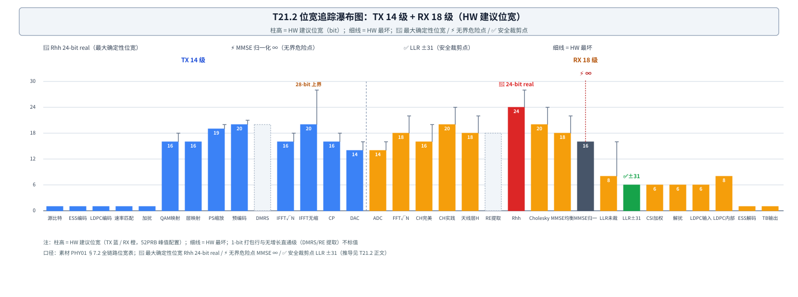

# T21.2 位宽追踪方法：从最坏推导链到位宽决策树

## 本节学习目标

第 1 章把位宽账立成了三本账之一：记账对象是"物理上可能的最坏值"，TX 14 级 + RX 18 级共 32 级，三个锚点数字互锁，其中位宽账的锚点是 Rhh 24-bit real。但第 1 章只给了三个标记（🔴 最大确定性位宽 / ⚡ 无界危险点 / ✅ 安全裁剪点）与一句话推导链，没有回答三个"怎么算"的问题：每一级的位宽数字具体从哪来？为什么有的行是 24-bit、有的行是 28-bit、有的行干脆是 ∞？把 32 级收成一张可执行的位宽决策表时，每一步加法加的是什么？本章把位宽账展开成一套可执行的方法：**三级口径 + 三大根源 + 三条推导链 + 一棵决策树**。"追踪最大值而非 RMS 值"从第 1 章的原则，变成逐级可算的算法。

学完本节后，应能做到：

- 说出位宽表三级口径（MATLAB bits / HW 建议 / HW 最坏）各自的含义，并指出本系列位宽账的记账口径是哪一列。
- 复述位宽增长的三大根源（累加 / 缩放 / 动态范围转移），并能为位宽表中的任意一行归因。
- 在 TX 14 级 + RX 18 级位宽表中指出三个标记行（🔴 Rhh 24-bit real、⚡ MMSE 归一化 ∞、✅ LLR ±31），并解释各自为什么是"最大 / 危险 / 收口"。
- 按"信道归一化 → H 幅度统计有界 → |H|² 有界（2²²）→ 4 次累加 2²⁴"的推导链计算 Rhh 工程位宽 24-bit real，并说明为什么不是 16×16×4=36-bit（LO5）。
- 运用 max|x(n)| ≤ N_sc·max|X(k)| 计算 Nfft=1024 无缩放 IFFT 的最坏输出位宽 28-bit，并验证"10 级蝶形 = +10 bit"（LO6）。
- 计算 PS 功率缩放 √13.62 ≈ 3.69 ≈ 2^1.88 的理论 +2 bit 与工程 +3 bit，并说出余量的去向（峰均比）。
- 走查位宽决策树（16+3+2+2=23 → 24-bit I/Q、Rhh 24-bit real、LLR 恒 ±31），并区分动态配置读法与静态统一读法各自省什么、不省什么。
- 解释 MMSE 归一化除法的 0/0、∞ 为什么必须用分母钳位（csi_safe）与硬限幅兜底，而不是加位宽。

与持久理解的呼应：本节完整兑现 U1（位宽账记"物理上可能的最坏值"，Rhh 24-bit 是"信道归一化 → 幅度统计有界 → |H|² 有界 → 4 次累加"的推导链产物，不是 16×16×4=36-bit 的机械累加）；并以"无界值必须限幅而非加位宽"为 U3 开题（裁剪阈值与限幅的完整论证在第 3 章给出）。核心问题 Q1（给最坏值定价为什么不能按平均值省）在本章深化：省面积省在"配置没用到的最坏余量"上，答案藏在决策树的两种读法里。

## 前置知识检查

| 前置项 | 本节需要达到的程度 |
|:---|:---|
| [[T21.1_engineering_budget_overview]] 工程预算总览 | 三本账框架、三个锚点、最坏值记账原则、Qm.n 两条性质；本节把位宽账从"预告"展开为"逐级追踪方法"。 |
| [[Fixed_Point_Numbers_定点数]] 定点数 | Qm.n 结构（m 位整数 + n 位小数 + 1 位符号）与补码范围；本节用 Q 格式给位宽表每一行标定语义（口径约定：LLR 例 W=6、F=2，即 Q3.2）。 |
| [[T12.3_linear_detectors_mf_zf_mmse]] 线性检测器 | MMSE 均衡、矩阵求逆、归一化的对象与公式；本节追踪的 Rhh → Cholesky → MMSE 路径正是其硬件位宽版本。 |
| [[T13.5_ps_receiver_llr_prior]] PS 接收机 LLR 先验 | PS 解调预处理（Rhh、Cholesky）在接收链路中的位置；本节 Rhh 24-bit 推导针对的就是这条 PS+MIMO 路径。 |
| [[T18.1_fixed_point_decoder_requirements]] 定点译码器需求 | 定点契约词汇（Q 格式、饱和、裁剪、bit-exact）；本节把"单译码器位宽"放大为"全链路 32 级位宽表"。 |
| [[LLR_Quantization_LLR量化]] LLR 量化与裁剪 | ±31 拐点与裁剪-损失表；本节把 ±31 放到位宽表的收口行（✅），第 3 章展开动态范围完整推导。 |
| [[T5.1_fixed_point_numbers_for_LLR]] 定点数基础 | 二进制补码、饱和加法、符号扩展；LLR 未裁剪行的"∞/σ² 放大"正是溢出回绕灾难的入口。 |

如果这些前置还不稳，先抓住一句话：**本节把第 1 章预告的 32 级位宽表逐级走读，把三个标记行逐一推导出来——位宽追踪方法 = 三级口径 + 三大根源 + 三条推导链 + 一棵决策树**。

## 位宽追踪的三级口径与三大增长根源

### 三级位宽口径：同一级的三种"位宽"

**三级位宽口径（three-level bitwidth convention）**：素材位宽表对每一级同时登记三个数字——MATLAB bits、HW 建议 bits、HW 最坏 bits——三者回答不同的问题。一句话解释：MATLAB bits 是"仿真器里怎么存"，HW 建议 bits 是"工程上建议用多少"（留 2~4 bit 余量），HW 最坏 bits 是"物理上可能出现多大"（含理论最坏场景）。

| 口径 | 含义 | 例子（QAM 映射 1024QAM） |
|:---|:---|:---|
| MATLAB bits | 仿真器数据类型：double 复数 128-bit（实部 64 + 虚部 64）、double 实数 64-bit、int8 8-bit | 复数 double 128b |
| HW 建议 bits | 工程设计推荐值，留 2~4 bit 余量 | 16 I/Q |
| HW 最坏 bits | 物理上可能出现的最大位宽，含理论最坏场景 | 18 I/Q |

**口径约定**：本系列位宽账记的是 **HW 建议**列（工程值）——第 1 章的三个标记（Rhh 24-bit real、MMSE ∞、LLR ±31）全部落在这一列；HW 最坏列是"上界登记"，用于异常预算与 FFT 引擎这类"必须按上界预留"的场合。两个口径的差别本身就是设计决策：Rhh 用建议口径（统计上界 + 饱和），无缩放 IFFT（逆快速傅里叶变换，Inverse Fast Fourier Transform, IFFT；接收侧对称的是快速傅里叶变换，Fast Fourier Transform, FFT）用最坏口径（代数上界，蝶形网络必须预留）——下文两条推导链分别演示。

### 三大增长根源：三类位宽增长机制

**增长根源（bitwidth growth root causes）**：位宽表中所有行的位宽增长都可以归入三类机制——累加（accumulation）、缩放（scaling）、动态范围转移（dynamic range shift）。一句话解释：增长根源是"这一级的位宽为什么比上一级大"的归因框架，诊断任何位宽问题先问"它是哪一类"。

| 根源 | 机制 | 典型行（HW 建议 → 最坏） |
|:---|:---|:---|
| 累加 | 乘法器输出位宽 + 累加次数取对数：16×16 乘 → 32-bit 积；N 次累加最多 +log₂N bit | Rhh（Nrx 次累加）、预编码（4 层同相叠加 ×2）、无缩放 IFFT（N_sc 相量叠加） |
| 缩放 | 功率归一化 / 除法的动态范围：乘一个 >1 的系数、或除一个 →0 的分母 | PS 功率缩放（×√13.62）、信道估计 DMRS（LS 除法放大）、MMSE 归一化（0/0） |
| 动态范围转移 | 噪声方差 σ² 随信噪比（Signal-to-Noise Ratio, SNR）变化，把无界量引进数值路径 | LLR 未裁剪（∞/σ² 放大）、TDL 信道（深衰落动态范围） |

### 追踪最大值而非 RMS 值：三种"最坏"的读法

第 1 章立下第一原则：位宽账按"物理上可能的最坏值"记账，不按典型值（RMS 值）记账。本节把"最坏"拆成三种可操作的读法，这就是三级口径存在的理由：

1. **满幅代数上界**：所有输入同时取最大绝对值（如 H 满幅 2¹⁵、4 天线同相）——理论上限，但归一化信道下物理不可达（Rhh 的 36-bit 就属于这一类）；
2. **统计上界**：在归一化约束（E|h|²=1）下，信号幅度的统计量级（RMS ≈ 2¹¹、|H|² ≈ 2²²）——物理上会达到、但带尾巴（Rhh 的 24-bit 属于这一类，尾巴由饱和吸收）；
3. **经验上界**：仿真/实测中出现的最大样本——HW 最坏列登记的就是这个量级（Rhh 的 28-bit 最坏列）。

三条推导链分别演示这三种读法怎么用：Rhh 用"统计上界 + 饱和"，无缩放 IFFT 用"代数上界 + 蝶形预留"，PS 缩放用"算术进位 + 工程余量"。核心问题 Q1 的答案也随之清晰：**省面积省在"配置没用到的最坏余量"上（决策树动态读法），不省在最坏值本身**——最坏值不是预算的浪费，而是防回绕的保险。

## TX 14 级 + RX 18 级：逐级走读位宽表

位宽表来自素材语料 PHY01 §7.2（52PRB 峰值配置：1024 正交幅度调制（Quadrature Amplitude Modulation, QAM）+ PS + 4 层）。表上三个标记沿用第 1 章的"账内关键行"约定：🔴 = 全链路最大确定性位宽（Rhh 24-bit real）；⚡ = 无界危险点（MMSE 归一化除法）；✅ = 安全裁剪点（LLR ±31）。

### TX 路径 14 级

| # | 阶段 | MATLAB | HW 建议 | HW 最坏 | 增长原因 | 缓解 |
|:---|:---|:---|:---|:---|:---|:---|
| 1 | 源比特（Source bits） | int8 8b | 1b（打包） | 1b | 二进制 0/1 | — |
| 2 | PS ESS 编码 | int8 8b | 1b（打包） | 1b | 二进制 | — |
| 3 | LDPC 编码 | int8 8b | 1b（打包） | 1b | 二进制 | — |
| 4 | 速率匹配（Rate Matching） | int8 8b | 1b（打包） | 1b | 二进制 | — |
| 5 | 加扰（Scrambling） | int8 8b | 1b（打包） | 1b | XOR 保持二进制 | — |
| 6 | QAM 映射（1024QAM） | 复 double 128b | 16 I/Q | 18 I/Q | ±31/√682 ≈ ±1.19 | LUT |
| 7 | 层映射（Layer Mapping） | 复 double 128b | 16 I/Q | 16 I/Q | 仅重排 | — |
| 8 | ⚡ PS 功率缩放 | 复 double 128b | 19 I/Q | 20 I/Q | ×√13.62 ≈ ×3.69（11.3 dB） | LUT 预计算 |
| 9 | 预编码（4 层） | 复 double 128b | 20 I/Q | 21 I/Q | 4 层同相叠加 ×2 | — |
| 10 | DMRS 插入 | 不变 | — | — | 直接覆写 | — |
| 11 | IFFT（含 1/√N） | 复 double 128b | 16 I/Q | 18 I/Q | 10 级蝶形 | 1/√N 缩放 |
| 12 | IFFT（无缩放） | 复 double 128b | 20 I/Q | **28 I/Q** | 624 子载波同相 ×624 | 分级缩放 |
| 13 | 循环前缀（Cyclic Prefix, CP）添加 | 复 double 128b | 16 I/Q | 18 I/Q | 复制无增长 | — |
| 14 | 数模转换器（Digital-to-Analog Converter, DAC） | 实数 | 14 | 16 | 模拟输出 | 削峰 |

走读要点（按增长根源分组）：

- **打包五级（#1–#5，1-bit）**：源比特、PS 枚举球面整形（Enumerative Sphere Shaping, ESS）编码、LDPC 编码、速率匹配、加扰全部是二进制 0/1——int8 的 8 bit 在硬件里打包成 1 bit，没有任何算术增长（根源：无）。
- **QAM 映射（#6，16/18）**：查表（Look-Up Table, LUT）输出星座点，幅度有界（1024QAM 最大符号 ±31/√682 ≈ ±1.19）。四档调制建议值：QPSK 12、64QAM 14、256QAM 16、1024QAM 16（min）——这是位宽决策树的基础行（见下文）。
- **⚡ PS 功率缩放（#8，19/20）**：×√13.62 ≈ ×3.69 的功率归一化放大，是 TX 侧唯一的"大倍数缩放"级（关键行 3，7.3.3 节推导）。均匀（uniform，关闭 PS）路径此级 ×1 无增长。
- **预编码（#9，20/21）**：4 层同相叠加最多 ×2 → +1 bit（累加类）。
- **两条 IFFT（#11/#12）**：同一指令的两个位宽版本——归一化（1/√N）功率守恒，16/18 够用；无缩放省掉逐级归一化，最坏 28 I/Q（关键行 2，7.3.2 节推导）。
- **直通与收口（#10/#13/#14）**：DMRS 插入直接覆写、CP 复制无增长；DAC 14-bit 建议（削峰预处理后）。

### RX 路径 18 级

| # | 阶段 | MATLAB | HW 建议 | HW 最坏 | 增长原因/风险 | 缓解 |
|:---|:---|:---|:---|:---|:---|:---|
| 1 | 模数转换器（Analog-to-Digital Converter, ADC） | 实数 | 14 | 16 | 量化噪声 | 模拟前端 |
| 2 | OFDM FFT（1/√N） | 复 double 128b | 18 I/Q | 22 I/Q | 10 级蝶形 | 1/√N 缩放 |
| 3 | 信道估计（完美） | 复 double 128b | 16 I/Q | 20 I/Q | 理想值无噪声 | — |
| 4 | 信道估计（实践 DMRS） | 复 double 128b | 20 I/Q | 24 I/Q | LS 除法放大 | 限幅 |
| 5 | 天线→层 H | 复 double 128b | 18 I/Q | 22 I/Q | 矩阵乘 | — |
| 6 | PDSCH 资源单元（Resource Element, RE）提取 | 不变 | — | — | 索引操作 | — |
| 7 | 🔴 Rhh = HᴴH | 复 double 128b | **24 实数** | 28 实数 | Nrx 次累加 | 饱和 |
| 8 | Cholesky H_eq | 复 double 128b | 20 I/Q | 24 I/Q | sqrt 压缩范围 | — |
| 9 | MMSE 均衡 | 复 double 128b | 18 I/Q | 22 I/Q | 矩阵求逆 | — |
| 10 | ⚡ MMSE 归一化 | 复 double 128b | 16 I/Q | **∞** | **0/0 除法** | **硬限幅** |
| 11 | LLR（未裁剪） | double 64b | 8 有符号 | 16 有符号 | ∞/σ² 放大 | 裁剪 |
| 12 | ✅ LLR（裁剪后） | double 64b | **6 有符号** | 6 有符号 | **±31 硬限幅** | — |
| 13 | CSI 加权 | double 64b | 6 有符号 | 6 有符号 | 乘后裁剪 | — |
| 14 | 解扰（Descramble） | double/bit | 6 有符号 | 6 有符号 | 符号翻转 | — |
| 15 | LDPC 输入 | double 64b | 6 有符号 | 6 有符号 | 最优输入范围 | — |
| 16 | LDPC 内部 | double 64b | 8 有符号 | 8 有符号 | 消息传递累加 | — |
| 17 | ESS 解码 | int8 8b | 1b | 1b | 表查找 | — |
| 18 | TB 比特输出 | int8 8b | 1b | 1b | 二进制 | — |

走读要点：

- **前端（#1–#2）**：ADC 14-bit 起步（量化噪声由模拟前端决定）；OFDM FFT 10 级蝶形 → 18/22（缩放类，1/√N 归一化）。
- **信道状态（#3–#5）**：完美信道估计 16/20；实践 DMRS 估计多 4 bit（最小二乘（Least Squares, LS）除法放大 1/|X|²，缩放类），缓解列直接写"限幅"——这就是"无界值用限幅兜底"在表中最早的登记。
- **矩阵路径（#7–#10）**：🔴 Rhh 24-bit real（关键行 1）→ Cholesky 20（sqrt 压缩范围，比 Rhh 窄 4 bit）→ MMSE 均衡 18（矩阵求逆）→ ⚡ MMSE 归一化 16/∞（关键行 4）。Rhh 是这条路的最大值，也是全链路最大确定性位宽。
- **软信息收口（#11–#16）**：LLR 未裁剪 8/16（∞/σ² 放大，动态范围转移类）→ ✅ 裁剪 ±31 后 6-bit → CSI 加权 / 解扰 / LDPC 输入恒 6-bit → LDPC 内部 8-bit（消息传递累加）。从无界到收口，全部发生在最后 6 行。
- **收尾（#17–#18）**：ESS 解码表查找、TB 输出，回到二进制 1-bit。

### 瀑布图：32 级一图看全

图 1 把 32 级画成一张位宽瀑布图：柱高 = HW 建议位宽，细线 = HW 最坏，三个标记行就地标出。



读图三步：先看 TX 段（蓝）从 1 bit 一路涨到 20（IFFT 无缩放建议值），再在 RX 段（橙）找三个标记——🔴 Rhh 24-bit real 是最高柱、⚡ MMSE 归一化头上顶着 ∞、✅ LLR ±31 是最低的安全收口；最后看 LLR 之后 6 行全部压在 6-bit 线上——裁剪把动态范围收口，这是位宽账的终点。

## 关键行 1：Rhh 24-bit —— 最坏推导链四步

**最坏推导链（worst-case derivation chain）**：从物理假设出发、把"这一级最多能到多大"逐级乘出来的推导方法，固定四步——① 假设（输入口径）→ ② 单级上界（一次运算的最大量级）→ ③ 运算增长（累加/缩放把上界放大多少）→ ④ 覆盖检查（工程位宽取多少、尾巴怎么办）。一句话解释：位宽账上的每一个数字都应该能还原成一条四步推导链，还原不出来就是拍脑袋。

Rhh（信道 Gram 矩阵，第 1 章定义）在 PS+MIMO 解调预处理中逐 RE 计算 $R_{\mathrm{hh}} = \sum_{i_{\mathrm{rx}}=1}^{N_{\mathrm{rx}}} \overline{\tilde{H}(i_{\mathrm{rx}},i_{\mathrm{tx}})}\cdot\tilde{H}(i_{\mathrm{rx}},j_{\mathrm{tx}})$（素材源码 `preprocess_demod_input.m:70` 的 `sum(abs(H).^2)`）。其 24-bit real 的推导链（素材 PHY01 §7.3.1）：

**① 假设——信道归一化**：仿真器 `normalizeOutputs=true` 保证 $E|h|^2=1$。H 元素定点 16-bit（含符号），满幅 2¹⁵；归一化下有效 RMS 幅度 ≈ 2¹¹（按 LSB=2⁻¹¹ 计即 Q4.11 类格式：整数位只需覆盖 ±1 量级，其余是小数位，峰值余量 16×——"留余量"的含义就是这里）。

**② 单级上界——|H|² 统计有界**：单个复乘积 $\overline{H}\cdot H = |H|^2$。16×16 定点乘 → 32-bit 积；统计口径 $|H|^2 \approx (2^{11})^2 = 2^{22}$。

**③ 运算增长——4 次累加**：Nrx=4 次累加 → $2^{22} \times 4 = 2^{24}$。对角元素是非负功率量，24-bit（无符号）恰好覆盖——**24-bit real 是对角路径的工程安全值**。

**④ 覆盖检查——尾巴与理论上限**：理论上限是 H 满幅 2¹⁵ 时 $|H|^2 = 2^{30}$、4 天线同相累加 $= 2^{32}$、再计虚部交叉项 → ~36-bit；但归一化信道下 H 元素远非满幅（RMS 只有满幅的 1/16），**理论 36-bit 实际不可达**。内嵌验证（本节末）给出量化数字：4 天线累加的均值恰好落在 2²⁴，RE 级尾巴（约 43% 超过 2²⁴）由表中缓解列"饱和"吸收，HW 最坏列 28-bit real 登记的就是真实尾部分布的量级。

**为什么不是 16×16×4=36-bit**：36-bit 的算术（两个 16-bit 满幅相乘 = 2³⁰、4 天线同相 = 2³²、虚部交叉项 ≈ 36-bit）要求每个 RE 的每根天线同时满幅同相——在归一化信道下这是"物理上不可能出现的输入"。位宽账付钱的对象是"物理上可能的最坏值"，推导链的职责就是把"可能"两个字算清楚：统计口径 2²² × 4 = 2²⁴，这才是该付的钱。**24-bit 是推导链产物，不是乘法器位宽的机械累加**（U1）。

**扩展**：8×8 或 32×32 MIMO 时累加次数翻倍 → 需再 +1~2 bit（Nrx=8 → $2^{25}$，+1 bit；内嵌验证同时给出 Nrx=8 的数字）。

### 内嵌验证：Rhh 累加上界模拟

下面用 numpy 复现推导链：生成归一化 16-bit 定点 H 样本（E|h|²=1），模拟 Nrx=4 与 Nrx=8 的 |H|² 累加，验证"4 次累加落在 2²⁴ 口径、8 次需 +1 bit"，并顺带给出留余量与尾部的实证数字。

```python
# @file    t21_2_rhh_accum_upper_bound.py
# @brief   T21.2 内嵌验证：Rhh 累加上界模拟（Nrx=4 vs Nrx=8）
# @note    素材口径 PHY01 §7.3.1：信道归一化 E|h|^2=1、H 元素 16-bit 定点
#          （Q4.11 类，LSB=2^-11，有效 RMS 幅度≈2^11）、|H|^2 统计口径≈2^22、
#          4 次累加≈2^24（24-bit real）、8 次累加≈2^25（+1 bit）。
# @date    2026-08-04
import numpy as np

rng = np.random.default_rng(20260804)
N_RE = 200_000            # 约 23 个时隙的 RE 数（52PRB 每时隙 8,736 RE）
NRX_MAX = 8

# 1) 归一化复信道样本：E|h|^2 = 1（MATLAB NormalizeChannelOutputs 口径）
h = (rng.standard_normal((N_RE, NRX_MAX)) + 1j * rng.standard_normal((N_RE, NRX_MAX))) / np.sqrt(2.0)

# 2) 16-bit 定点化：Q4.11 类格式（LSB = 2^-11），饱和到 ±2^15
q = np.clip(np.round(h * 2**11), -(2**15), 2**15 - 1)

# 3) 每 RE 每接收天线 |H|^2 = Re^2 + Im^2（整数 LSB 单位，16x16 乘 -> 32-bit 积）
p_rx = q.real.astype(np.int64) ** 2 + q.imag.astype(np.int64) ** 2

s4 = p_rx[:, :4].sum(axis=1)   # Nrx=4 累加
s8 = p_rx.sum(axis=1)          # Nrx=8 累加

print(f"RMS|q_h|        ≈ {np.sqrt(np.mean(np.abs(q) ** 2)):>10.0f}   （素材口径 2^11 = {2**11}）")
print(f"max|q_h|        ≈ {int(np.abs(q).max()):>10d}   （16-bit 满幅 2^15 = {2**15}，留余量成立）")
print(f"单天线 |H|^2 均值 ≈ {p_rx.mean():>12.0f}   （素材口径 2^22 = {2**22}）")
print(f"Nrx=4 累加均值   ≈ {s4.mean():>12.0f}   （素材口径 2^24 = {2**24}）")
print(f"Nrx=8 累加均值   ≈ {s8.mean():>12.0f}   （素材口径 2^25 = {2**25}，8 天线需 +1 bit）")
print(f"P(Σ4 ≤ 2^24) = {np.mean(s4 <= 2**24):.1%}   P(Σ8 ≤ 2^25) = {np.mean(s8 <= 2**25):.1%}"
      f"（RE 级尾部由饱和吸收，对应表中缓解列）")

# 4) 断言：推导链均值口径与素材一致（容差 2%）
assert abs(np.sqrt(np.mean(np.abs(q) ** 2)) - 2**11) / 2**11 < 0.05
assert abs(p_rx.mean() - 2**22) / 2**22 < 0.02
assert abs(s4.mean() - 2**24) / 2**24 < 0.02    # 4 次累加落在 2^24 口径
assert abs(s8.mean() - 2**25) / 2**25 < 0.02    # 8 次累加 -> +1 bit
assert abs(s8.mean() / s4.mean() - 2.0) < 0.02  # 天线数翻倍 = 累加位宽 +1
print("断言全部通过：RMS|h|≈2^11、|H|^2≈2^22、4 次累加≈2^24、8 次≈2^25（+1 bit）✓")
```

真实运行输出（断言全部通过）：

```text
RMS|q_h|        ≈       2049   （素材口径 2^11 = 2048）
max|q_h|        ≈       8073   （16-bit 满幅 2^15 = 32768，留余量成立）
单天线 |H|^2 均值 ≈      4197138   （素材口径 2^22 = 4194304）
Nrx=4 累加均值   ≈     16815079   （素材口径 2^24 = 16777216）
Nrx=8 累加均值   ≈     33577105   （素材口径 2^25 = 33554432，8 天线需 +1 bit）
P(Σ4 ≤ 2^24) = 56.4%   P(Σ8 ≤ 2^25) = 54.8%（RE 级尾部由饱和吸收，对应表中缓解列）
断言全部通过：RMS|h|≈2^11、|H|^2≈2^22、4 次累加≈2^24、8 次≈2^25（+1 bit）✓
```

两组读法（教学要点）：

1. **推导链的数字被逐项验证**：RMS|q_h| ≈ 2049 ≈ 2¹¹、单天线 |H|² 均值 ≈ 4.197×10⁶ ≈ 2²²、4 次累加均值 ≈ 16.815×10⁶ ≈ 2²⁴、8 次累加均值 ≈ 33.577×10⁶ ≈ 2²⁵——"4 次落在 2²⁴、8 次 +1 bit"成立（量化噪声使均值偏高 <0.3%，不影响口径）。同时 max|q_h| ≈ 8073 ≈ 2¹³ << 2¹⁵："16-bit 表示留余量"不是说法，是模拟事实。
2. **尾巴是诚实的**：逐 RE 看，约 43% 的 RE 累加超过 2²⁴——"恰好覆盖"是统计口径（均值），不是逐 RE 保证。这正是表中缓解列写"饱和"、HW 最坏列写 28-bit real 的原因：24-bit 累加器 + 饱和吸收尾部，HW 最坏列登记真实尾部分布。完美信道（H≡1）特例下 4 次累加精确等于 2²⁴、100% 覆盖——"恰好"二字在最简单的场景里是字面意义的精确。

## 关键行 2：无缩放 IFFT 28-bit —— 蝶形网络的上界

**无缩放 IFFT（unscaled IFFT）**：不做逐级归一化、只在最后统一处理的 IFFT；与之相对的是归一化 IFFT（乘 1/√N，功率守恒变换，时/频域位宽相当，16~18 bit 够用）。一句话解释：无缩放 IFFT 省掉逐级右移，代价是时域输出按"所有频域相量同相相加"的最坏情况增长。

推导（素材 PHY01 §7.3.2）：

$$
\max_n |x(n)| \le \sum_{k} |X(k)| \le N_{\mathrm{sc}} \cdot \max_k |X(k)| = 1024 \times |X|_{\max}
$$

- **上界来自三角不等式**：时域样点是 N_sc 个频域相量的叠加，幅度最多等于各相量幅度之和；Nfft=1024（含零填充后的满格）时最多 1024 个 bin 同相叠加 → 幅度 ×1024 ≈ 2¹⁰。
- **"10 级蝶形 = +10 bit"**：log₂(1024) = 10——蝶形网络每一级最多把两个同符号相量相加（×2），10 级最多 ×2¹⁰；输入 18-bit（幅度上界 2¹⁷）→ 输出 ≤ 1024·2¹⁷ = 2²⁷，含符号 28-bit **恰好装下**。28-bit 是 FFT 引擎内部蝶形必须预留的物理位宽，不是工程建议值。
- **为什么工程上只用 20-bit**：实际 624 个有效子载波（52PRB × 12）→ ×624 ≈ 2⁹·³，且全部同相的概率极低；工程建议"无缩放 IFFT + DAC 前归一化"用 20-bit。
- **缓解——蝶形分级缩放（butterfly staged scaling）**：在蝶形网络中每 2~3 级右移 1 bit（相当于分段归一化），把 IFFT 输出压回 16~18 bit；代价是极少数深衰落符号的量化噪声，对 BLER 无显著影响。

与 Rhh 的对照（口径差异的教学点）：Rhh 的 24-bit 是**统计上界**（归一化使满幅不可达，尾巴由饱和吸收）；IFFT 的 28-bit 是**代数上界**（同相叠加是物理可能的，只是概率极低）——前者是"实际值域 + 工程安全值"，后者是"防回绕的硬件预留"。同一个"最坏值"原则，两种兑现方式。

## 关键行 3：PS 功率缩放 +2/+3 bit

PS 功率缩放（TX #8）把星座整体放大 $\sqrt{\mathrm{psPowerScaling}}$ 倍（素材 PHY01 §7.3.3）：

- **算术**：$\sqrt{13.62} \approx 3.69 \approx 2^{1.88}$——幅度放大 1.88 bit（20·log₁₀ 3.69 ≈ 11.3 dB）；
- **理论 +2 bit**：整数位按 2 的幂进位，1.88 bit 必须进位到 2 bit；
- **工程 +3 bit**：放大后幅度最大的是外圈星座符号，其峰均功率比（Peak-to-Average Power Ratio, PAPR）更高——工程上留 1 bit 余量 → 16 → 19 I/Q（HW 建议列；最坏列 20）。
- **关闭 PS（uniform 路径）**：此级 ×1 无增长——决策树里 PS 是"可选加法"。

这行的教学点：**理论值 +2 与工程值 +3 的差，就是"留余量"三个字的实价**——1 bit 的存储代价换外圈符号不溢出（第 5 章算这笔账：LLR 6→8 bit 即 +33%，同一杠杆）。

## 位宽决策树：23→24 与两种读法

**位宽决策树（bitwidth decision tree）**（第 1 章已定义）：按当前配置逐级累加位宽的决策路径——树的每一行加的都是"物理上可能的最坏值"。本节给完整走查（素材 PHY01 §7.3.4）：

```text
┌─ 调制? ───────────────────────────────────────────────┐
│ QPSK          → I/Q 12-bit                            │
│ 16QAM/64QAM   → I/Q 14-bit                            │
│ 256QAM        → I/Q 16-bit                            │
│ 1024QAM       → I/Q 16-bit (min)                      │
├─ PS 启用? ────────────────────────────────────────────┤
│ Yes → +3 bit I/Q（功率缩放余量；理论 +2）              │
├─ 层数? ───────────────────────────────────────────────┤
│ 4 层 → +2 bit（预编码同相叠加 +1、层域信道矩阵 +1）    │
├─ 信道? ───────────────────────────────────────────────┤
│ TDL → +2 bit（信道估计噪声、深衰落 LLR 动态范围）      │
├─ PS MIMO?（仅 PS+MIMO 路径）──────────────────────────┤
│ Cholesky 4×4 → +4 bit real（Rhh 累加余量）             │
├─ LLR 输出 ────────────────────────────────────────────┤
│ 恒定：clip ±31（6-bit 有符号）→ LDPC 输入              │
└───────────────────────────────────────────────────────┘

最终 I/Q 位宽 = 16 + 3 + 2 + 2 = 23 → 工程取 24-bit I/Q
最终 real 位宽 = 24-bit（Rhh，全链路最大确定性位宽）✅
```

逐级加法都能回链到前面的推导：**16 基础** = 1024QAM 星座 ±31/√682 ≈ ±1.19 幅度（2 bit 整数 + 精度 + 余量）；**+3（PS）** = 关键行 3 的理论 +2 与峰均比余量 1；**+2（4 层）** = 预编码同相叠加 +1（表 #9）、层域信道矩阵 +1；**+2（TDL）** = 信道估计噪声与深衰落动态范围（动态范围转移类）；**+4 real（Cholesky）** = Rhh 累加余量（关键行 1 的 real 路径，素材口径"PS MIMO Cholesky 4×4"）；**LLR 恒 ±31** = 裁剪收口，不随配置增长（✅ 行在树上没有加法）。

**两种读法**（概念首现讲解：动态配置读法与静态统一读法——同一棵树的两个使用方式）：

| 读法 | 做法 | 省什么 | 不省什么 |
|:---|:---|:---|:---|
| 动态配置读法 | 实际链路按当前 MCS/PS/层数/信道选位宽 | 省"配置没用到的最坏余量"（仿真器默认配置 qam64/MCS10/1 层/AWGN 或 TDL 落在树低端 12~16 bit） | 不省最坏值本身——每级仍是物理最坏口径 |
| 静态统一读法 | 一次设计覆盖所有配置：24-bit I/Q + 24-bit real + 6-bit LLR | 省运行时位宽决策逻辑与控制路径 | 不省位宽——面积按峰值配置（1024QAM+PS+4 层+TDL+Cholesky）封顶 |

核心问题 Q1 在本章的答案：**省面积省在"配置没用到的最坏余量"上**——动态读法省的是峰值配置的余量（同一棵树，不同配置不同价位）；静态读法不省位宽但省了灵活性。规格书审计（第 6 章）要检查的正是：规格书声明了哪种读法、面积数字与哪种读法自洽。

## 定点除法保护：csi_safe 与硬限幅

**csi_safe（分母钳位）与硬限幅（hard clipping）**：对无界中间值的两道硬件闸门——csi_safe 把除法分母钳到非零，硬限幅把除法输出兜在 ±MAX 之内。一句话解释：无界值浮点无害、定点致命，闸门是硬需求而非优化。

无界危险点的出处（素材源码 `new_pdsch_decode.m:78-88`）：

```text
effective_csi = max(csi - n_var, 0);
mmse_gain = effective_csi ./ csi;           % ⚡ csi→0 时 0/0 → NaN
normalized_input = demod_input ./ mmse_gain; % ⚡ mmse_gain→0 → ∞
```

深衰落 RE 上 $csi \rightarrow 0$，除法输出无界。为什么加位宽没用：**无界值不是"动态范围不够"**——任何有限位宽都装不下 ∞；浮点有 IEEE 754 的 NaN/Inf 语义兜底（无害），定点寄存器没有，只能补码回绕（第 1 章 +31→−32 的方向翻转灾难）。所以对策不是加位宽，是两道闸门：

1. **分母钳位**：`csi_safe = max(csi, ε)`——把 0/0 变成"有限值/ε"，消除 NaN；
2. **输出硬限幅**：`clip(·, −MAX_DEMOD, +MAX_DEMOD)`——把巨大值兜在最大可靠度上。

该无界值不会破坏链路：软解调后 LLR 仍会被 CSI 加权与 ±31 裁剪吸收（✅ 收口），但**中间寄存器不限幅就会溢出回绕**——所以限幅是硬需求而非优化（U3）。第 3 章给出这条路径的完整动态范围推导（LLR_max ≈ 11,200 → 未裁剪需约 14-bit → 裁剪到 ±31 后 6-bit 即够），并把"裁剪阈值是越大越好还是够用就好"算成一张权衡表。

## 示范例题

### 例 1（应用，LO5）：Rhh 24-bit 推导链

**题目**：给定 H 元素 16-bit 定点、信道归一化 E|h|²=1、Nrx=4 的 Rhh 场景，按"幅度统计有界 → |H|² 有界（2²²）→ 4 次累加"的推导链计算工程位宽，并解释为什么不是 16×16×4=36-bit。

**解答**：

1. **幅度统计有界**：归一化信道下 H 元素 RMS 幅度 ≈ 2¹¹（16-bit 满幅 2¹⁵ 之下留 16× 余量）。
2. **|H|² 有界**：单个复乘积 conj(H)·H = |H|²，16×16 定点乘 → 32-bit 积，统计口径 (2¹¹)² = 2²² = 4,194,304。
3. **4 次累加**：4 × 2²² = 2²⁴ = 16,777,216 → 24-bit（无符号）恰好覆盖对角元素（非负功率量）——工程位宽 **24-bit real**。
4. **为什么不是 36-bit**：36-bit 对应"满幅 2¹⁵ × 满幅 2¹⁵ = 2³⁰、4 天线同相 = 2³²、再计虚部交叉项"的代数上界；归一化信道下 H 元素 RMS 只有满幅的 1/16，该输入物理不可达。推导链算的是"物理上可能的最坏值"，不是乘法器位宽的机械累加。
5. **数字核对**：与本节内嵌 numpy 一致——单天线均值 ≈ 4.197×10⁶ ≈ 2²²、4 次累加均值 ≈ 16.815×10⁶ ≈ 2²⁴（量化噪声 <0.3%）。
6. **扩展**：Nrx=8 → 8 × 2²² = 2²⁵ → 需 +1 bit（25-bit）。

**点评**：推导链四步（假设 → 单级上界 → 运算增长 → 覆盖检查）是位宽问题的通用模板——任何"这一级该用多少 bit"的争论，都可以套四步把数字算出来，而不是用乘法器位宽机械相加。

### 例 2（应用，LO6）：无缩放 IFFT 28-bit

**题目**：给定 Nfft=1024 的无缩放 IFFT 与 18-bit 输入 I/Q，运用 max|x(n)| ≤ N_sc·max|X(k)| 计算最坏输出位宽，并验证"10 级蝶形 = +10 bit"。

**解答**：

1. **上界**：max|x(n)| ≤ Σ_k |X(k)| ≤ N_sc·max|X(k)| = 1024 × |X|_max（三角不等式；Nfft=1024 含零填充满格）。
2. **位宽算术**：18-bit 有符号输入 → |X|_max ≤ 2¹⁷−1 → 输出 ≤ 1024·(2¹⁷−1) = 2²⁷ − 2¹⁰ < 2²⁷ → 含符号 **28-bit** 恰好装下。
3. **蝶形验证**：log₂(1024) = 10 级蝶形；每级两个同符号相量相加最多 ×2 → 10 级最多 ×2¹⁰ = +10 bit；18 + 10 = 28 ✓。
4. **工程口径**：实际 624 个有效子载波 → ×624 ≈ 2⁹·³，且全同相概率极低 → 建议值 20-bit；28-bit 是 FFT 引擎内部蝶形必须预留的物理位宽。
5. **缓解**：蝶形分级缩放（每 2~3 级右移 1 bit）把输出压回 16~18 bit，代价是深衰落符号的少量量化噪声（对 BLER 无显著影响）。

**点评**：与例 1 对照——Rhh 的 24-bit 是统计上界（工程安全值 + 饱和），IFFT 的 28-bit 是代数上界（防回绕预留）；同一个"追踪最大值"原则，两种兑现方式。两个数字都是"恰好装下"：2²⁴ 恰好覆盖 4 次累加、2²⁷ 恰好小于 28-bit 有符号上界——位宽表里的整数不是拍出来的，是算出来的。

## 引导练习

### 练习 1（应用）：PS 功率缩放 +2/+3 bit

**题目**：PS 功率缩放系数 psPowerScaling = 13.62。计算：（1）√13.62；（2）折合的 bit 数与 dB 数；（3）说明为什么理论上是 +2 bit、工程上是 +3 bit；（4）关闭 PS（uniform 路径）时这一级如何。

**提示**：2^x = 3.69 求 x = log₂ 3.69 ≈ 1.88；20·log₁₀ 3.69 ≈ 11.3 dB；整数位按 2 的幂进位；放大后幅度最大的是外圈星座符号（峰均比最高），工程余量 1 bit。

**参考答案**：√13.62 ≈ 3.69 ≈ 2^1.88——幅度放大 1.88 bit → 整数位进位取理论 +2 bit；20·log₁₀(3.69) ≈ 11.34 dB ≈ 11.3 dB。外圈星座符号放大后峰均比更高，工程留 1 bit 余量 → 实现 +3 bit（16 → 19 I/Q，HW 建议列）。关闭 PS 时此级 ×1 无增长（16-bit 原样通过）。理论 +2 与工程 +3 的 1 bit 差，就是"留余量"的实价。

### 练习 2（分析）：位宽表三大增长根源归类

**题目**：把以下六行分别归入三大增长根源（累加 / 缩放 / 动态范围转移），并为每个给出一句话理由：Rhh、无缩放 IFFT、MMSE 归一化、LLR 未裁剪、预编码（4 层）、信道估计（实践 DMRS）。

**提示**：问"这一级的位宽增长来自什么运算"——加法/累加（次数取对数）？乘法/除法/归一化（缩放系数）？还是随 SNR 变化的量（σ²）？

**参考答案**：

| 行 | 根源 | 一句话理由 |
|:---|:---|:---|
| Rhh | 累加 | Nrx 次 |H|² 累加，2²² → 2²⁴（+log₂4 = 2 bit） |
| 无缩放 IFFT | 累加 | N_sc 个频域相量叠加，×1024 → +10 bit |
| MMSE 归一化 | 缩放 | 除法分母 csi→0 → 0/0、∞ |
| LLR 未裁剪 | 动态范围转移 | ∞/σ² 放大，σ² 随 SNR 变化 |
| 预编码（4 层） | 累加 | 4 层同相叠加 ×2 → +1 bit |
| 信道估计（实践 DMRS） | 缩放 | LS 除法放大 1/|X|² → 限幅 |

## 独立习题

### 习 1（应用，numpy）：Rhh 累加上界模拟

**题目**：用 numpy 独立实现（与内嵌验证同模型、不同写法）：生成 100,000 个 RE 的归一化复信道样本（E|h|²=1，16-bit 定点量化，LSB=2⁻¹¹），分别模拟 Nrx=4 与 Nrx=8 的 |H|² 累加，验证：（1）单天线 |H|² 均值 ≈ 2²²；（2）4 次累加落在 2²⁴ 口径；（3）8 次累加需 +1 bit（2²⁵）。

**参考答案**（代码与输出；与"内嵌验证"同数据口径、不同抽样写法，可对照）：

```python
# @file    t21_2_exercise_1.py
# @brief   T21.2 独立习题 1：Rhh 累加上界模拟（Nrx=4 与 Nrx=8，独立实现版）
# @note    数据口径 PHY01 §7.3.1（信道归一化 E|h|^2=1、16-bit 定点 Q4.11 类）；
#          与正文内嵌验证同模型、不同写法（分两次独立抽样）
import numpy as np

rng = np.random.default_rng(42)
N = 100_000                       # RE 数
h4 = (rng.standard_normal((N, 4)) + 1j * rng.standard_normal((N, 4))) / np.sqrt(2.0)
h8 = (rng.standard_normal((N, 8)) + 1j * rng.standard_normal((N, 8))) / np.sqrt(2.0)

def q16(h):
    return np.clip(np.round(h * 2**11), -(2**15), 2**15 - 1)

p4 = q16(h4)
p8 = q16(h8)
pow4 = p4.real.astype(np.int64) ** 2 + p4.imag.astype(np.int64) ** 2
pow8 = p8.real.astype(np.int64) ** 2 + p8.imag.astype(np.int64) ** 2
s4 = pow4.sum(axis=1)
s8 = pow8.sum(axis=1)

print(f"单天线 |H|^2 均值 ≈ {pow4.mean():.0f}   （2^22 = {2**22}）")
print(f"Nrx=4 累加均值   ≈ {s4.mean():.0f}   （2^24 = {2**24}）")
print(f"Nrx=8 累加均值   ≈ {s8.mean():.0f}   （2^25 = {2**25}，需 +1 bit）")
print(f"Nrx=8 / Nrx=4 均值比 ≈ {s8.mean() / s4.mean():.3f}   （天线数翻倍 = 位宽 +1）")
assert abs(pow4.mean() - 2**22) / 2**22 < 0.02
assert abs(s4.mean() - 2**24) / 2**24 < 0.02
assert abs(s8.mean() - 2**25) / 2**25 < 0.02
print("断言通过：单天线 ≈2^22、4 次累加落在 2^24 口径、8 次需 +1 bit ✓")
```

```text
单天线 |H|^2 均值 ≈ 4198923   （2^22 = 4194304）
Nrx=4 累加均值   ≈ 16795694   （2^24 = 16777216）
Nrx=8 累加均值   ≈ 33540255   （2^25 = 33554432，需 +1 bit）
Nrx=8 / Nrx=4 均值比 ≈ 1.997   （天线数翻倍 = 位宽 +1）
断言通过：单天线 ≈2^22、4 次累加落在 2^24 口径、8 次需 +1 bit ✓
```

**评分要点**：单天线均值 ≈ 2²² ±2%；4 次累加 ≈ 2²⁴ ±2%（落在 2²⁴ 口径）；8 次 ≈ 2²⁵ ±2%（+1 bit）；均值比 ≈ 2.0（天线数翻倍 = 位宽 +1）；且能解释量化噪声使均值略高于 2 的幂（<0.3%）。

### 习 2（分析）：位宽决策树走查 23→24

**题目**：走查位宽决策树：（1）写出 1024QAM 基础位宽与每一级加法的来源；（2）解释 23→24 的取整；（3）说明为什么 LLR 行在树上没有加法；（4）指出动态配置读法与静态统一读法各自省什么、不省什么。

**参考答案**：

1. **基础与加法**：16（1024QAM 星座 ±31/√682 ≈ ±1.19 幅度 → 2 bit 整数 + 精度 + 余量）+ PS +3（√13.62 ≈ 3.69 ≈ 2^1.88 理论 +2 + 峰均比余量 1）+ 4 层 +2（预编码同相叠加 +1、层域信道矩阵 +1）+ TDL +2（信道估计噪声、深衰落 LLR 动态范围）= 16+3+2+2 = 23。
2. **23 → 24**：素材口径"最终 I/Q 位宽 = 23 → 工程取 24-bit I/Q"——23 bit 加 1 bit 工程余量/对齐取整，24-bit 是静态统一读法下的 I/Q 封顶值。
3. **LLR 行没有加法**：LLR 恒定 clip ±31（6-bit 有符号）——裁剪把一切动态范围收口（✅ 安全裁剪点），位宽由裁剪阈值决定，与调制/层数/信道无关；树上所有加法都发生在它之前的路径上。
4. **两种读法**：动态配置读法省"配置没用到的最坏余量"（默认配置 qam64/MCS10/1 层/AWGN 或 TDL 落在树低端 12~16 bit），不省最坏值本身；静态统一读法不省位宽（按峰值 1024QAM+PS+4 层+TDL+Cholesky 封顶），省运行时位宽决策逻辑与控制路径。

### 习 3（理解）：判断正误——"按 RMS 值定标位宽可以省面积"

**题目**：判断正误并说明理由："位宽表按最坏值记账太保守——实际链路里最坏场景几乎不出现，按 RMS 值（典型值）定标位宽，可以省下可观面积。"

**参考答案**：错误。三条理由：（1）**典型值口径漏掉灾难场景**——内嵌验证显示 4 天线 Rhh 累加约 43% 的 RE 超过 2²⁴，MMSE 归一化 0/0、IFFT 全同相都是物理上会出现的输入；"几乎不出现"是错觉，因为典型值把尾巴平均掉了；（2）**溢出回绕是方向翻转的灾难**（+31→−32），不是"精度差一点"——按 RMS 定标等于把尾部直接送进回绕，LLR 证据方向翻转（第 1 章原则的重申）；（3）**省面积的正道不是省最坏值**——是决策树的动态配置读法（省"配置没用到的最坏余量"，默认配置 12~16 bit 与峰值 24 bit 的差）与饱和吸收尾部（量化损失有界可预测，第 3 章量化），最坏值本身是防回绕的保险，不能省。

### 习 4（分析）：诊断 36-bit 机械累加错误

**题目**：一位工程师主张："Rhh 应该用 36-bit——16×16 定点乘是 32-bit，4 次累加就是 36-bit，机械上不可能更少。"诊断这个主张的错误。

**参考答案**：混淆了**满幅代数上界**与**统计口径**。（1）16×16 满幅 = 2³⁰（两个 2¹⁵ 相乘）、4 天线同相 = 2³²、再计虚部交叉项才凑出 ~36-bit——它要求每个 RE 的每根天线同时满幅同相，归一化信道下概率按指数衰减、物理不可达；（2）归一化信道 E|h|²=1 下 H 元素 RMS 仅 2¹¹（满幅的 1/16），32-bit 积的统计口径是 2²²、4 次累加 2²⁴——"物理上可能的最坏值"由推导链给出（假设 → 单级上界 → 运算增长 → 覆盖检查），不是由乘法器位宽机械相加；（3）对不可达输入付费的代价：每元素多付 12 bit × 每 RE 16 个实数值 × 全部 RE，存储与面积线性上涨（第 5 章按 30 Mbit/mm² 算账）；（4）真实的最坏由 HW 最坏列（28-bit real）与饱和登记——"建议 24 / 最坏 28"两列口径各司其职，36-bit 属于哪一列都不是。

## 小结

本节把位宽账从第 1 章的"三标记预告"展开成可执行的方法，四件核心资产：

1. **三级口径 + 三大根源**：位宽表的读法（MATLAB bits / HW 建议 / HW 最坏各回答什么问题）与归因框架（累加 / 缩放 / 动态范围转移）——诊断任何位宽问题的两把尺子。
2. **三条推导链**：Rhh 24-bit（统计上界 + 饱和吸收尾巴，2²² × 4 = 2²⁴）、无缩放 IFFT 28-bit（代数上界 + 蝶形预留，18 + 10 = 28）、PS 功率缩放 +2/+3 bit（√13.62 ≈ 2^1.88 进位 + 峰均比余量）——位宽表上每个数字都能还原成四步推导链。
3. **一棵决策树**：16+3+2+2 = 23 → 24-bit I/Q、Rhh 24-bit real、LLR 恒 ±31；动态配置读法省"配置没用到的最坏余量"、静态统一读法一次封顶——核心问题 Q1 的答案。
4. **除法保护**：csi_safe 分母钳位 + 硬限幅——无界值浮点无害（IEEE 754）、定点致命（回绕），限幅是硬需求而非优化。

与持久理解的呼应：U1 在本节完整兑现——Rhh 24-bit 是"信道归一化 → H 幅度统计有界 → |H|² 有界（2²²）→ 4 次累加 2²⁴"的推导链产物，不是 16×16×4=36-bit 的机械累加；内嵌验证把链上每个数字逐项核对（RMS≈2¹¹、均值≈2²²/2²⁴/2²⁵）。U3 以"无界值必须限幅而非加位宽"开题：MMSE 归一化的 ∞ 由 csi_safe 与硬限幅兜底、由 ✅ ±31 收口——裁剪阈值"够用就好"的完整论证（LLR_max ≈ 11,200 → 14-bit → ±31/6-bit）在第 3 章给出。

下一章（第 3 章：LLR 动态范围与裁剪权衡）把位宽账的收口行展开：1024QAM 动态范围推导（为什么未裁剪 LLR 要 14-bit）、裁剪-损失权衡表与 ±31 拐点、clip vs wrap 的方向翻转演示——"±31 是工程拐点而非凑出来的整数"将成为第 2 章决策树最后一行的完整推导。

## 自测题

1. 位宽表三级口径（MATLAB bits / HW 建议 / HW 最坏）各自回答什么问题？本系列位宽账记哪一列？
2. 位宽增长的三大根源是什么？Rhh、无缩放 IFFT、MMSE 归一化、LLR 未裁剪各属于哪一类？
3. 写出 Rhh 24-bit 的四步推导链，并说明为什么不是 16×16×4=36-bit。
4. 无缩放 IFFT 的上界不等式是什么？Nfft=1024、输入 18-bit 时给出多少位？"10 级蝶形"怎么来的？
5. PS 功率缩放为什么理论上 +2 bit、工程上 +3 bit？1 bit 余量的去向是什么？
6. 位宽决策树最终 23→24-bit I/Q 由哪些加法组成？动态配置读法与静态统一读法分别省什么？
7. MMSE 归一化除法的 0/0、∞ 为什么不能靠加位宽解决？csi_safe 与硬限幅各做什么？

## 自测题参考答案

1. MATLAB bits 回答"仿真器里怎么存"（double 复数 128-bit 等）；HW 建议回答"工程上建议用多少"（留 2~4 bit 余量）；HW 最坏回答"物理上可能出现多大"（含理论最坏场景）。位宽账记 HW 建议列（三个标记 🔴/⚡/✅ 全在这一列）；HW 最坏列是上界登记。
2. 累加（乘法器输出 + 累加次数取对数）、缩放（功率归一化/除法的动态范围）、动态范围转移（σ² 随 SNR 变化）。Rhh → 累加；无缩放 IFFT → 累加；MMSE 归一化 → 缩放；LLR 未裁剪 → 动态范围转移。
3. ① 信道归一化 E|h|²=1，H 元素 16-bit、RMS 幅度 ≈ 2¹¹；② 单个 |H|² 的 32-bit 积统计口径 ≈ 2²²；③ Nrx=4 次累加 4 × 2²² = 2²⁴ → 24-bit real 恰好覆盖；④ 满幅代数上界 2³²~36-bit 归一化下不可达。不是 36-bit：36-bit 是"满幅 × 满幅 × 同相 + 交叉项"的代数上界，对应物理上不出现的输入；推导链算的是统计口径 + 饱和吸收尾巴。
4. max|x(n)| ≤ Σ_k|X(k)| ≤ N_sc·max|X(k)| = 1024·|X|_max；输入 18-bit → 输出 ≤ 2²⁷ → 28-bit 含符号；log₂(1024) = 10 级蝶形、每级最多 ×2 → +10 bit（18 + 10 = 28）。
5. √13.62 ≈ 3.69 ≈ 2^1.88 → 幅度放大 1.88 bit，整数位进位取 +2；外圈星座符号放大后峰均比更高，工程留 1 bit 余量 → +3（16 → 19 I/Q）。余量去向：外圈符号不溢出。
6. 16（1024QAM）+ 3（PS）+ 2（4 层：预编码 +1、层域 H +1）+ 2（TDL）= 23 → 工程取 24-bit I/Q；另有 Cholesky 4×4 +4 real（Rhh 路径）。动态读法省"配置没用到的最坏余量"；静态读法省运行时决策逻辑，面积按峰值封顶。
7. 无界值不是"动态范围不够"——任何有限位宽都装不下 ∞，加位宽只加成本不加覆盖。csi_safe = max(csi, ε) 把 0/0 变成有限值；硬限幅 clip(·, ±MAX) 把巨大值兜在最大可靠度，防止中间寄存器溢出回绕。

## 资料与协议边界

本节内容边界必须如实声明：

| 内容 | 属性 | 位置 |
|:---|:---|:---|
| 空口比特序列与调度过程（QAM 星座、PS 功率缩放系数、MCS/层数/信道配置） | 协议/配置强制（3GPP 规定或仿真器配置） | TS 38.211/38.214 Rel-19 本地抽取件、evaluation-link-simulator 配置 |
| 全链路位宽表（TX 14 级 + RX 18 级）、HW 建议/HW 最坏、Rhh 24-bit、IFFT 28-bit、决策树 | **工程估算（非协议数值）** | PHY01 §7、analysis 05 §1-§4、[[3GPP全流程_缩写概念理论清单]] G 节 |
| Rhh 累加上界模拟的统计口径（E|h|²=1、尾部覆盖率、+1 bit） | 素材口径的 numpy 复现（本节） | 内嵌验证一节 |
| 位宽决策树两种读法、csi_safe 与硬限幅策略 | 实现选择（协议不规定） | 本节与 T21 系列 |

## 执行与证据记录

| 项目 | 记录 |
|:---|:---|
| 素材底座 | 读取 [[3GPP全流程_缩写概念理论清单]] G 节、概念笔记 [[Fixed_Point_Numbers_定点数]]、外部语料 PHY01 §7.1-§7.3.5、analysis 05 §1-§4；核对素材源码 `preprocess_demod_input.m:70`（Rhh 累加）与 `new_pdsch_decode.m:78-88`（MMSE 归一化除法）。 |
| numpy 验证 | "内嵌验证"实跑输出"断言全部通过：RMS\|h\|≈2^11、\|H\|^2≈2^22、4 次累加≈2^24、8 次≈2^25（+1 bit）✓"（RMS 2049、均值 4197138 / 16815079 / 33577105、尾部覆盖率 56.4%/54.8%）；独立习题 1 参考答案另行实跑一致（4198923 / 16795694 / 33540255，均值比 1.997）。 |
| 手算核对 | √13.62=3.6905、log₂3.6905=1.884≈1.88、20·log₁₀3.6905=11.34 dB、2²²=4,194,304、2²⁴=16,777,216、2²⁷−2¹⁰<2²⁷、log₂624≈9.3——均与 numpy 独立重算一致。 |
| SVG 验证 | Y 扫描 PASS（text-text/text-rect 无重叠，同 x 区间文字层级最小间距 8.8px，74 text / 33 rect 全检）；`audit_svg_layout.py` 输出 `SVG_LAYOUT_AUDIT_PASS / ALL_PASS`；cairosvg 渲染 PNG 后墨迹带分区核对（标题/图例/标注/柱区/x 标签/注脚六带齐全）、内容 bbox x 39-1629 / y 15-533 在画布内、关键柱颜色几何核对（Rhh 红柱 x 1057-1091 y 224-440、LLR 绿柱 x 1095-1125 y 386-440）、OCR 检出标题/Rhh 24-bit real/MMSE 归一化/±31/28-bit 上界/x 轴 32 级标签（emoji 与 ∞ 由 cairosvg 单色字形替代，OCR 按占位计）。 |
| 审计结果 | `audit_lesson_terms.py`：LESSON_TERM_AUDIT_OK；`audit_markdown_headings.py`：MARKDOWN_HEADING_AUDIT_OK；`audit_latex_render.py`：LATEX_RENDER_AUDIT_OK。 |
| 死链检查 | 全部 wikilink 目标存在（T21.1、L2 M12/T13.5、L1 T5.1/T2.16、concepts 系列）；T21.3-T21.6 未创建、未链接。 |

## 参考文献

- [上游讲义] `docs/L3_工程实现/T21.1_engineering_budget_overview.md`，工程预算总览：三本账、三锚点、最坏值原则与三标记预告。
- [上游讲义] `docs/L2_协议算法/T12.3_linear_detectors_mf_zf_mmse.md`，线性检测器：MF/ZF/MMSE 与矩阵求逆。
- [上游讲义] `docs/L2_协议算法/T13.5_ps_receiver_llr_prior.md`，PS 接收机 LLR 先验与解调预处理路径。
- [概念笔记] `docs/concepts/Fixed_Point_Numbers_定点数.md`，Qm.n 格式与补码。
- [概念笔记] `docs/concepts/LLR_Quantization_LLR量化.md`，LLR 裁剪-损失权衡表与 ±31 拐点。
- [素材语料] `reproduction_output/deep_dive/PHY01_物理层链路与Modem硬件预算.md` §7，全链路位宽追踪（三级口径、32 级表、Rhh/IFFT/PS 推导、决策树、除法保护）。
- [素材语料] `reproduction_output/analysis/05_位宽追踪与瓶颈分析.md` §1-§4，统一位宽表、最大位宽答案、MMSE 除法放大深度、决策树。
- [素材源码] `evaluation-link-simulator-main/+toolbox/+ProbShaping/+demod/preprocess_demod_input.m`（Rhh 累加）与 `+phy/+pdsch/new_pdsch_decode.m`（MMSE 归一化除法）。
