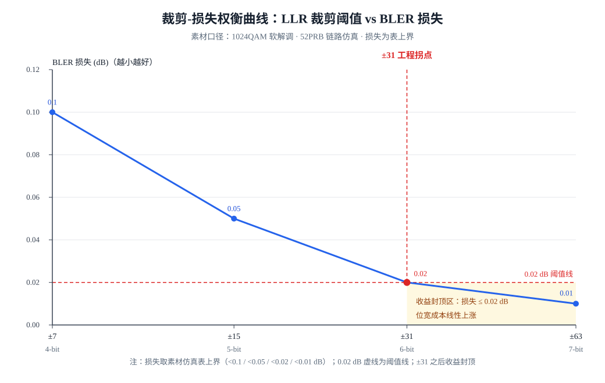

# T21.3 LLR 动态范围与裁剪权衡

## 本节学习目标

第 2 章（[[T21.2_bitwidth_tracking_methodology]]）把位宽账展开成可执行的方法，收口行是一棵位宽决策树：树的最后一格写着"LLR 输出：恒定 clip ±31（6-bit 有符号）"。但那一格是**预告**，不是推导——为什么是 31 而不是 7、15 或 63？为什么 6-bit 够用，而"不裁剪"就要 14-bit？为什么这个数值恰好同时兜住 MMSE 归一化除法的无界值？第 2 章小结把这笔账留给了本章：**"±31 是工程拐点而非凑出来的整数"，正是本节要补完的完整推导**。

本章是 T21 系列的权衡章（第 3 章）：它不新增账本，而是把第 1 章预告的裁剪-损失权衡表（[[T21.1_engineering_budget_overview]]）从"四行数字"展开成一条完整的论证链——先回答 LLR 的动态范围到底有多大（1024QAM 下不裁剪要 14-bit），再回答裁剪为什么是对的（溢出回绕是灾难、量化损失是可接受的），最后回答阈值取多少（±31：位宽成本线性涨、收益在 ±31 封顶，且恰好吸收 MMSE 归一化的病态放大值）。学完本节后，应能做到：

- 用自己的话解释"裁剪管范围、量化管精度"的分工，并用温度计模型（thermometer model）说明裁剪丢掉的是什么、保住的是什么。
- 解释为什么溢出回绕是方向翻转的灾难性错误（+31 回绕成 −32，把"极可靠"变成"极不可靠"），并说明它为什么不能靠"加位宽"解决。
- 完成 1024QAM、SNR=30 dB 的 LLR 动态范围推导：max|y−x|²≈11.2（由 (2×31/√682)²≈5.6 乘 I/Q 两维）、σ²=0.001→LLR_max≈11,200→未裁剪需约 14-bit。
- 解释为什么裁剪到 ±31 后 6-bit 即够：裁剪丢掉的是极端幅值的细节，保住的是方向（符号）与极性（相对可靠度），并说明量化损失与裁剪损失同属"有界可预测"误差。
- 复述裁剪-损失权衡表的四组数值（±7/4-bit/<0.1 dB、±15/5-bit/<0.05 dB、±31/6-bit/<0.02 dB、±63/7-bit/<0.01 dB），并指出 ±31 是 6-bit 拐点行及判据（位宽成本线性涨、收益封顶）。
- 说明 ±31 吸收 MMSE 归一化无界值的机制：csi→0 的 0/0、∞ 在浮点无害、定点致命，限幅是硬需求而非优化，并指出裁剪的三个落点。
- 计算 48-bit 字打包：8 个 6-bit LLR 装 1 个字（G=324,480 bit→40,560 字→243.4 KB），并对比 8-bit 的 +33% 存储代价。
- 说出"可接受"的最终判据：由比特精确回归（[[T18.6_bit_exact_regression_harness]]）的阈值检验裁决，而不是工程拍脑袋。

与持久理解的呼应：U2（溢出回绕是灾难、量化损失有界可预测，"可接受"由比特精确回归裁决）以"clip vs wrap"实证收口；U3（裁剪阈值不是越大越好，±31 是收益拐点，同时吸收 MMSE 归一化无界值）在本节完成完整论证；U6（位宽是存储与吞吐的杠杆支点，6-bit 压进 48-bit 字装 8 个的布局）以打包计算落地。三条都指向同一个结论：**±31 不是拍脑袋的整数，而是"动态范围推导 + 损失预算 + 无界值吸收"三笔账的汇合点**。核心问题 Q2（无界值为何定点致命、裁剪阈值够用就好）在本章深化。

## 前置知识检查

| 前置项 | 本节需要达到的程度 |
|:---|:---|
| [[T21.1_engineering_budget_overview]] 工程预算总览 | 知道裁剪-损失权衡表四组数值的预告、三标记（🔴 Rhh 24-bit / ⚡ MMSE 无界 / ✅ LLR ±31）与"裁剪管范围、量化管精度"一句话；本节把预告变成推导。 |
| [[T21.2_bitwidth_tracking_methodology]] 位宽追踪方法 | 知道 LLR 恒 ±31 是位宽决策树收口行、MMSE 归一化是无界危险点、硬限幅是第一道闸门；本节给出该行的完整推导与 clip vs wrap 实证。 |
| [[LLR_Quantization_LLR量化]] LLR 量化与裁剪 | 知道裁剪阈值 C、均匀/非均匀量化、LLR 动态范围推导链与 ±31 拐点的结论；本节把这些结论逐项推导并配图。 |
| [[T12.3_linear_detectors_mf_zf_mmse]] 线性检测器 | 知道 MMSE 均衡与归一化除法的对象与公式；本节讨论其无界值（csi→0 的 0/0、∞）为什么浮点无害、定点致命。 |
| [[T2.11_LLR_clipping_scaling_quantization]] LLR 裁剪缩放量化 | 知道裁剪、缩放、量化的分工词汇（L1 预览）；本节在 Modem 尺度上给出量化公式与损失表。 |
| [[T18.5_SIMD_memory_layout_decoders]] SIMD 与内存布局 | 知道 48-bit 字打包、bank 与 lane 的概念；本节从位宽反推打包布局（8×6-bit=48-bit）并算存储账。 |

如果这些前置还不稳，先抓住一句话：**本节回答"LLR 从软解调出来时浮点动态范围有多大、压成定点要多大代价、±31 这个数是怎么算出来的"**。第 2 章把位宽账记到"LLR 恒 ±31"为止，本节把这一行的来龙去脉补齐。

## 温度计模型：裁剪管范围、量化管精度

先把两道信号调理工序的分工钉死。浮点 LLR（对数似然比，Log-Likelihood Ratio，[[LLR_对数似然比]]）在进入定点译码器之前要过两道闸门：**裁剪（clipping）**与**量化（quantization）**（[[T2.11_LLR_clipping_scaling_quantization]]）。

**裁剪（clipping）**：把超出裁剪阈值（clipping threshold，记为 C）的 LLR 一律截断为 ±C 的工序。一句话解释：裁剪划定"表示范围"——阈值之外的极端值不再区分大小，全部记为"最可靠"。

**量化（quantization）**：把阈值之内的连续值按步长 Δ 取到最近格点的工序。一句话解释：量化决定"表示精度"——阈值之内的正常值被映射到有限的定点网格上，每个格点代表一小段连续区间。

两者的分工可以概括为一张对照表（这是贯穿全章的第一根主线）：

| 工序 | 管什么 | 处理对象 | 误差性质 |
|:---|:---|:---|:---|
| 裁剪 | 范围（量程） | 阈值 C 之外的极端值 | 有界（最多丢到 ±C 的细节） |
| 量化 | 精度（步长） | 阈值之内的正常值 | 有界可预测（步长 Δ/2 以内） |

**温度计模型（thermometer model）**：把 LLR 想象成一支温度计的刻度——LLR 的**符号**是判决方向（像 0 还是像 1），**绝对值**是可信度读数（多可靠）。裁剪就是温度计的量程上限：读数超量程时，温度计只停在最顶端刻度，丢掉的是极端读数的细节，保住的是方向和极性。这个模型第一次出现于概念笔记 [[LLR_Quantization_LLR量化]]，本章把它当作读整张裁剪-损失表的直觉工具。一句话记忆：**宁可牺牲极端读数，也不能让指针撞坏表盘**——撞坏表盘就是下一节的溢出回绕。

为什么裁剪不是"随便砍掉信息"？因为对迭代译码器（LDPC/Turbo/Polar）来说，LLR 的**方向**（符号）驱动证据往哪边用，**相对大小**决定证据的权重；而"8 和 80 谁更可靠"的极端细节，在有限位宽下通常不值得花 bit 去区分（[[T2.11_LLR_clipping_scaling_quantization]] 的裁剪预览与本节的损失表给出同一结论）。裁剪的代价是丢掉"极端幅值细节"，收益是位宽从 14-bit 压到 6-bit——这正是第 5 章 U6 杠杆（存储与吞吐）的支点。

## 溢出回绕：方向翻转的灾难性错误

**溢出回绕（overflow wraparound）**：二进制补码加法超出表示范围后，从最大正数翻转到最小负数的行为——+31 再加 1 变成 −32。一句话解释：回绕不是"精度变差一点"，而是**方向翻转**——"极可靠"的证据瞬间变成"极不可靠"，译码器会把证据往反方向用。术语首次完整定义见 [[T21.1_engineering_budget_overview]]，本节给它的危害补上数值证据。

回绕为什么是灾难性的，用 6-bit 有符号（Q5.0，值域 [−32, 31]，Q 格式约定 W=m+n+1 见 [[Fixed_Point_Numbers_定点数]]）看两个动作：

1. 加法回绕：LLR = +31（极可靠"像 0"），再加 1 → −32（极可靠"像 1"）——同一个证据，方向完全翻转；
2. 减法回绕：LLR = −32，减 1 → +31——同理。

注意这里的语法：6-bit 补码能表示 [−32, 31]，但本知识库的裁剪口径是 **|LLR| 超过 C=31 一律截断为 ±31**（概念笔记 [[LLR_Quantization_LLR量化]] 的公式 clip(LLR, ±C)），所以合法值域实际是 [−31, +31]——**−32 这个码只作为"回绕灾难码"出现**，它不属于任何真实 LLR。这是第 2 章"硬限幅是第一道闸门"的完整说法：裁剪先把值域关进 [−31, +31]，回绕就无从发生。

回绕为什么不能靠"加位宽"解决？因为回绕是**运算结果超出当前表示范围**的症状，而 LLR 的输入（MMSE 归一化除法）可以产生物理上的 ∞——任何有限位宽都装不下 ∞，加位宽只加成本、不加覆盖（第 2 章 [[T21.2_bitwidth_tracking_methodology]] 的"除法保护"一节已论证）。所以治理手段只有两个：**csi_safe 分母钳位**把 0/0 变成有限值，**硬限幅**把巨大值兜在最大可靠度上。本节末尾的"内嵌验证"用 numpy 实跑给这段论述提供逐数值的证据。

## LLR 动态范围推导：未裁剪位宽的 14-bit 上界

现在回答第一个问题：**LLR 从软解调出来时，物理上最大能到多大？** 推导分四步（素材口径：analysis 03 §4 与概念笔记 [[LLR_Quantization_LLR量化]]，全部数字在本节末尾用 numpy 独立重算核对）：

**第 1 步：1024QAM 的星座几何。** 软解调用 max-log-MAP 近似（[[T2.9_QAM_Max_Log_MAP_demapping]]）：

$$
L(b_k) \approx \frac{1}{\sigma^2}\Big(\min_{s \in S_{k,0}}\lVert y - s \rVert^2 - \min_{s \in S_{k,1}}\lVert y - s \rVert^2\Big)
\tag{1}
$$

式 (1) 回答的问题是：LLR 是"到 0 侧最近星座点的距离平方 − 到 1 侧最近星座点的距离平方"再除以噪声方差 σ²。分子是两个距离平方的差，分母是噪声功率——**LLR 的动态范围反比于 σ²**：SNR 越高、噪声越小，同一个几何差异折算出的 LLR 越大。1024QAM 星座平均能量 E|x|² = 682（2/3·(2¹⁰−1)），归一化因子 1/√682，外圈星座点在 ±31/√682 处（32×32 网格，每维 32 个电平，距原点最远 ±31 个电平）。

**第 2 步：单维最大距离平方 ≈ 5.6。** 接收点 y 落在星座边界、发送点 x 在最远对角时距离最大：每维从 −31/√682 到 +31/√682，跨度 2×31/√682：

$$
\Big(\frac{2\times31}{\sqrt{682}}\Big)^2 = \frac{3844}{682} \approx 5.64 \approx 5.6
\tag{2}
$$

**第 3 步：I/Q 两维合成 ≈ 11.2。** |y−x|² 是复平面上两维距离平方之和，于是

$$
\max|y-x|^2 \approx 5.6 \times 2 \approx 11.2
\tag{3}
$$

**第 4 步：除以噪声方差得 LLR_max。** SNR = 30 dB → σ² = 10^(−30/10) = 0.001：

$$
LLR_{max} \approx \frac{11.2}{0.001} \approx 11{,}200
\tag{4}
$$

11,200 需要多少位？2¹³ = 8,192 < 11,200 ≤ 2¹⁴ = 16,384，所以有符号表示需要 **约 14-bit**（13 位数值 + 1 位符号）。这就是"不裁剪就要 14-bit"的直接来历——而位宽账的每一 bit 都要付存储与面积（第 5 章 U6 的 +33% 就是 6→8 bit 的代价，14-bit 更不必说）。**裁剪必须存在的理由就在式 (4)**：14-bit 的动态范围里，99.99% 以上的 LLR 实际落在很小的区间内，为"物理上可能出现一次的 11,200"准备 14-bit 是浪费。

裁剪丢掉什么、保住什么，用式 (1) 的语言说：裁剪丢掉的是"距离差极大、噪声极小"的极端幅值细节（LLR > C 的那些读数的精确值）；保住的是**方向（符号）**——0 侧近还是 1 侧近——与**极性（相对可靠度）**——这个 LLR 比别的强还是弱。迭代译码靠符号与相对权重工作，这正是裁剪损失可以做到 <0.02 dB 的根本原因。

## 均匀量化与非均匀量化：精度分配策略

动态范围定下来之后，第二个问题是**阈值之内的精度怎么放**。两种主流做法：

**均匀量化（uniform quantization）**：量化步长 Δ 固定，先裁剪、后取格点：

$$
LLR_q = \operatorname{round}\Big(\operatorname{clip}(LLR, \pm C)/\Delta\Big)\cdot\Delta
\tag{5}
$$

式 (5) 回答的问题是：整个 [−C, +C] 区间用同一把尺子量——Δ = 2C/2^(W−1) 由裁剪阈值 C 与位宽 W 唯一确定，比如 C=31、W=6 → Δ = 1（纯整数格点）。均匀量化实现最简单（一个移位/舍入即可），位宽表上每一行都是它的实例。

**非均匀量化（non-uniform quantization）**：小 |LLR| 区域用细步长、大 |LLR| 区域用粗步长。理由是：**小 LLR 处于判决边界附近、方向尚未确定**，其细节对迭代译码的修正最敏感；大 LLR 已接近可靠判决，粗量化损失有限。一句话解释：把精度预算花在"还拿不准"的证据上，不为"已经确定"的证据浪费格点。

两个概念的对照（[[LLR_Quantization_LLR量化]] 的科学定义节）：

| 方案 | 步长 | 实现代价 | 适用判断 |
|:---|:---|:---|:---|
| 均匀量化 | 全局固定 Δ | 最低（round 即可） | 位宽预算紧张、追求确定性时首选 |
| 非均匀量化 | 小 |LLR| 细、大 |LLR| 粗 | 高（查表/分段映射） | 想在不加位宽的情况下保住边界判决精度 |

本系列的口径是均匀量化：**LLR 恒裁剪 ±31（6-bit 有符号），步长 Δ=1**（[[LLR_Quantization_LLR量化]] 的协议锚点节：仿真链路统一口径）。非均匀量化是"知道有更好的选择但代价更高"的对照项——它说明 ±31/6-bit 不是唯一正确解，而是**均匀量化框架下**的工程拐点（下一节的权衡表就是在这个框架下采样的）。

## 裁剪-损失权衡表：四组采样点

第三个问题：**阈值 C 取多少？** 素材给出四组采样点（analysis 03 §4 与概念笔记 [[LLR_Quantization_LLR量化]]，图 1 是这条曲线的可视化）：

| 裁剪阈值 C | 位宽 | 覆盖概率（±Nσ） | BLER 损失 |
|:---|:---|:---|:---|
| ±7 | 4-bit | ~0.9999 | < 0.1 dB |
| ±15 | 5-bit | ~0.99999 | < 0.05 dB |
| ±31 | 6-bit | ~1.0 | < 0.02 dB |
| ±63 | 7-bit | ~1.0 | < 0.01 dB |



读这张表的三条结论（第 1 章预告、本章论证）：

1. **收益边际递减**：每加 1 bit（阈值翻倍），BLER 损失依次 <0.1 → <0.05 → <0.02 → <0.01 dB——损失下降的斜率越来越缓；位宽每 +1 bit 只换约 0.1–0.2 dB 改善（±31 之后更少）。覆盖概率列说明物理机制：±7 已覆盖 99.99% 的 LLR 分布，±31 已覆盖 ~100%——继续扩量程覆盖的是"几乎不出现"的尾巴。
2. **±31 是 6-bit 拐点行**：从它起损失已低于 0.02 dB 且继续加位宽几乎不再下降（收益封顶），而位宽成本（存储、面积）线性上涨——再加位宽只付成本、难见回报（下一节完整论证）。
3. **损失量级与"可接受"判据**：四组损失全部是"有界可预测"的可接受误差——这是量化/裁剪误差与溢出回绕（灾难性错误）的本质区别；"可接受"的最终裁决者是比特精确回归（[[Bit_Exact_Regression_比特精确回归]]）的阈值检验：浮点↔定点 BLER 曲线在阈值内重合、RTL↔定点逐比特一致，不是工程拍脑袋（[[T18.6_bit_exact_regression_harness]]）。

## ±31 是工程拐点：成本线性、收益封顶

为什么说 ±31 是"拐点"而不是"再大一点更好"？把成本与收益分开算：

**成本侧（线性涨）**：位宽每 +1 bit，LLR 缓冲容量线性 +1/6（6→7 bit 即 +16.7%、6→8 bit +33%，见"48-bit 字打包"一节的数字）；存储面积、总线带宽同步上涨。更关键的是**打包布局被打破**：8 个 6-bit LLR 恰好 48-bit 装 1 字，7-bit 装 8 个要 56-bit、装 6 个浪费 12 bit——阈值一旦从 ±31 升到 ±63，存储布局要重新设计（第 5 章展开这笔账）。

**收益侧（封顶）**：±31 已覆盖 ~100% 的 LLR 分布（覆盖概率列），损失 <0.02 dB 且下降趋缓；±63 相对 ±31 的改善不足 0.01 dB——低于链路仿真本身的置信度分辨率（BLER 零错误上界 3/N 量级，见 [[3GPP全流程_缩写概念理论清单]] 的链路仿真统计行），在审计口径下"不可分辨"。

**工程拐点（engineering inflection point）**：成本线性上涨曲线与收益封顶曲线的交汇处——拐点之前每加 1 bit 都换来可测量的损失下降，拐点之后每加 1 bit 只付成本、难见回报。±31（6-bit）就是这张表的拐点：它是"动态范围推导（14-bit 上限）+ 损失预算（<0.02 dB）+ 存储布局（48-bit 字装 8 个）"三笔账的汇合点，不是凑出来的整数。注意区分两个"封顶"：裁剪把 LLR 封顶在 ±31（值域闸门），收益封顶是这条权衡曲线的自然形状（阈值越大、曲线越平）——前者是设计、后者是物理。

## ±31 吸收 MMSE 归一化的无界值

拐点论证还有一个隐藏筹码：**±31 恰好把 MMSE 归一化除法的病态放大值兜在最大可靠度上**。这是第 2 章 ⚡ 标记（无界危险点）的收口。

先交代对象。**MMSE 归一化（MMSE normalization）**：MMSE 均衡（[[MMSE_均衡]]、[[T12.3_linear_detectors_mf_zf_mmse]]）之后，仿真链路对均衡输出做一步除法归一化（素材源码 `new_pdsch_decode.m:78-88`，PHY01 §7.3.5）：

```matlab
effective_csi = max(csi - n_var, 0);
mmse_gain = effective_csi ./ csi;          % csi→0 时 0/0 → NaN
normalized_input = demod_input ./ mmse_gain; % mmse_gain→0 → ∞
```

其中 **csi（信道状态信息，Channel State Information）**（[[CSI_SINR]]）是均衡后的信噪比估计，n_var 是噪声方差。深衰落 RE 上 csi ≈ n_var → 0：第一步的除法是 0/0（NaN），第二步是 1/0（∞）——这就是位宽账 ⚡ 标记的"无界危险点"。

**为什么浮点无害、定点致命**：浮点域（IEEE 754）里 0/0 得到 NaN、1/0 得到 ±Inf，这两个值可以被后续运算"携带"而不会破坏进程——软解调之后 LLR 仍会被 CSI 加权与 ±31 裁剪吸收（PHY01 §7.3.5 的实证结论："该无界值不会破坏链路"）。定点域没有 NaN/Inf 这两个码：无保护的加法/乘法一旦碰到巨大中间值就溢出回绕（+31→−32 方向翻转），把"该兜在最大可靠度上的值"变成"极不可靠的错误证据"——这就是第 2 章"无界值必须限幅而非加位宽"的完整因果链。

**三个裁剪落点（clipping landing points）**：±31 在链路里不是一个点，而是三道闸门（PHY01 §12 的口径；"裁剪落点"指同一裁剪值在数据通路上的多次实施位置）：

| 落点 | 位置 | 作用 |
|:---|:---|:---|
| 第 1 落点 | MMSE 归一化输出（硬限幅 clip(·, ±MAX_DEMOD)） | 把 0/0、∞ 兜在中间寄存器不溢出——回绕的第一道防线 |
| 第 2 落点 | apply_csi_weighting 之后（LLR × CSI 再裁剪，RX 位宽表第 13 行） | 把加权后的 LLR 重新收进 ±31——CSI 加权会放大可靠度 |
| 第 3 落点 | LDPC 输入接口（RX 位宽表第 15 行） | 保证译码器吃到的是最优输入范围——接口契约 |

三个落点对应第 2 章"硬限幅是第一道闸门"的三个实施位置：归一化输出保护中间寄存器、加权之后保护存储、输入接口保护译码器。**限幅是硬需求而非优化**——这句话的意思是：去掉任何一道，无界值就有机会在定点域回绕，而回绕是灾难性错误（第 1 章 U2 与本节"内嵌验证"）。±31 恰好承担这个角色，是因为它的量程（31）远大于正常 LLR 的典型幅值、又足够小不至于让病态放大值在进入定点域前造成中间溢出——裁剪阈值与无界值吸收在这里合流。

## 48-bit 字打包：存储布局跟着位宽走

位宽决策的最后一笔账是存储（U6 杠杆）。**48-bit 字打包（48-bit word packing）**：把 8 个 6-bit LLR 装进一个 48-bit 的 SRAM 字——8×6=48，恰好整数对齐，无浪费（[[T18.5_SIMD_memory_layout_decoders]] 的 bank/lane 概念在本系列的实现是 [[T18.1_fixed_point_decoder_requirements]] 的输入接口约定）。

数值账（素材口径：52PRB 峰值配置，G = 324,480 bit 编码比特，PHY01 §8.3 第 12 行）：

$$
\frac{324{,}480}{8} = 40{,}560\ \text{字},\qquad 40{,}560\times6\ \mathrm{B} = 243{,}360\ \mathrm{B} \approx 243.4\ \mathrm{KB}
\tag{6}
$$

式 (6) 回答的问题是：LLR 缓冲在 6-bit 下只占 243.4 KB——在全系统 6.1 MB 存储里仅 4%（52PRB 含 PS 口径，第 1 章 [[T21.1_engineering_budget_overview]] 的存储拆分表）。换 8-bit 呢？324,480×8/8 = 324,480 B ≈ 324.5 KB，**+33%**——这就是"6→8 bit 即 +33%"的来源，也是 U6 说的"位宽选择是存储与吞吐之间的杠杆支点"的数字实体。

为什么打包与裁剪阈值直接配套：48-bit 字是硬件接口的固定宽度（[[T18.5_SIMD_memory_layout_decoders]] 的 8 路读取粒度），6-bit LLR 恰好 8 个/字；若阈值升到 ±63（7-bit），8×7=56 超出 48-bit 字宽、6×7=42 浪费 6 bit——打包布局被打断，存储与带宽同时变贵。**裁剪阈值、位宽、打包布局是同一份决策的三个投影**：±31/6-bit/8 个每字互相咬合，这正是第 1 章"三本账互锁"（位宽 × 元素数 = 容量）在本章的实例。

## 内嵌验证：clip vs wrap——方向翻转模拟

下面用 numpy 实证本节的核心命题：**裁剪把越界值兜在 ±31 并保持方向，回绕把越界值翻成相反方向**。构造一个含 +40/−40 越界邻域值、+31 边界邻域值（+31+1=32 与 −32−1=−33）与满幅越界值的测试向量，分别过"有符号饱和裁剪 clip(·, ±31)"与"无保护的 6-bit 补码截断（回绕）"，逐值对比。

```python
# @file    t21_3_clip_vs_wrap.py
# @brief   T21.3 内嵌验证：6-bit 有符号裁剪 vs 溢出回绕的方向翻转演示
# @note    素材口径 PHY01 §7.3.5 / analysis 03 §4：LLR 恒裁剪 ±31（6-bit 有符号）；
#          裁剪阈值 C=31 为对称量程（|LLR|>C 一律截断为 ±C，见 LLR_Quantization 概念笔记）；
#          6-bit 补码能表示 [-32, 31]，但 -32 只作为回绕灾难码出现
# @date    2026-08-04
import numpy as np

BITS = 6
MAX_POS = 2 ** (BITS - 1) - 1      # +31（裁剪阈值 C）
MIN_NEG = -(2 ** (BITS - 1))       # -32（补码最小码，回绕灾难码）

def clip_sat(x):
    """有符号饱和裁剪：|x| 超过阈值 C=31 一律截断到 ±C（裁剪管范围，第一道闸门）。"""
    return np.clip(x, -MAX_POS, MAX_POS)

def wrap_6bit(x):
    """模拟无保护的 6-bit 补码截断（溢出回绕）：(x+32) mod 64 - 32。"""
    x = np.asarray(x, dtype=np.int64)
    return np.mod(x + 32, 64) - 32

# 测试向量：+40/-40 越界邻域、+31 边界邻域（+31+1=32 与 -33）与满幅越界值
xs = np.array([+40, -40, +31, +32, -33, -31, -32, +63, -63, 0])
clipped = clip_sat(xs)
wrapped = wrap_6bit(xs)

print("原始 | 裁剪(±31) | 回绕(6-bit) | 裁剪保方向? | 回绕翻转方向?")
for x, c, w in zip(xs, clipped, wrapped):
    clip_keeps = (np.sign(c) == np.sign(x)) or (x == 0)
    wrap_flips = (np.sign(w) != np.sign(x)) and (x != 0)
    print(f"{x:>4} | {c:>8} | {w:>10} | {str(clip_keeps):^10} | {str(wrap_flips):^10}")

flips = int(np.sum((np.sign(wrapped) != np.sign(xs)) & (xs != 0)))
print(f"\n回绕导致的符号翻转（方向翻转灾难）次数: {flips}")
print(f"裁剪后全部满足 |c|<=31: {bool(np.all(np.abs(clipped) <= MAX_POS))}")

# 关键断言：+31+1 回绕成 -32（方向翻转）；裁剪把越界值兜在 ±31 并保持符号
assert wrap_6bit(32) == -32, "+31+1 必须回绕成 -32"
assert wrap_6bit(-33) == +31, "-32-1 必须回绕成 +31"
assert clip_sat(40) == 31 and clip_sat(-40) == -31
assert clip_sat(63) == 31 and clip_sat(-63) == -31
assert np.all(np.abs(clipped) <= MAX_POS)          # 裁剪后无越界码
assert flips == 6    # +40/-40/+32/-33/+63/-63 六个回绕值全部符号翻转
print("断言全部通过：+31+1→-32、-32-1→+31、裁剪保持符号、回绕翻转 6 次 ✓")

# ---- 顺带核对：LLR 动态范围推导链（analysis 03 §4 口径）----
d2 = (2 * 31 / np.sqrt(682)) ** 2        # 单维最大距离平方 ≈ 5.6
d2_2d = 2 * d2                           # I+Q 两维 ≈ 11.2
sigma2 = 10 ** (-30 / 10)                # SNR=30 dB -> σ²=0.001
llr_max = d2_2d / sigma2                 # ≈ 11200
bits = int(np.ceil(np.log2(llr_max)))
print(f"\nmax|y-x|^2 单维 = {d2:.4f} ≈ 5.6；两维 = {d2_2d:.4f} ≈ 11.2")
print(f"σ² = {sigma2:.4f}；LLR_max = {llr_max:.1f} ≈ 11200；需 {bits}-bit 有符号")
assert abs(d2 - 5.6) < 0.05 and abs(d2_2d - 11.2) < 0.1
assert abs(sigma2 - 0.001) < 1e-6 and bits == 14
print("断言全部通过：11.2 / σ²=0.001 / LLR_max≈11200 / 14-bit ✓")

# ---- 顺带核对：48-bit 字打包（PHY01 §8.3 第 12 行口径）----
G = 324480
words = G // 8
llr6_bytes = words * 6
llr8_bytes = words * 8
print(f"\n48-bit 字打包：G={G} -> {words} 字 x 6B = {llr6_bytes} B；8-bit = {llr8_bytes} B（+{100*(llr8_bytes/llr6_bytes-1):.0f}%）")
assert words == 40560 and llr6_bytes == 243360 and llr8_bytes == 324480
print("断言全部通过：40,560 字 / 243.4 KB / 8-bit 324.5 KB +33% ✓")
```

真实运行输出（断言全部通过）：

```text
原始 | 裁剪(±31) | 回绕(6-bit) | 裁剪保方向? | 回绕翻转方向?
  40 |       31 |        -24 |    True    |    True   
 -40 |      -31 |         24 |    True    |    True   
  31 |       31 |         31 |    True    |   False   
  32 |       31 |        -32 |    True    |    True   
 -33 |      -31 |         31 |    True    |    True   
 -31 |      -31 |        -31 |    True    |   False   
 -32 |      -31 |        -32 |    True    |   False   
  63 |       31 |         -1 |    True    |    True   
 -63 |      -31 |          1 |    True    |    True   
   0 |        0 |          0 |    True    |   False   

回绕导致的符号翻转（方向翻转灾难）次数: 6
裁剪后全部满足 |c|<=31: True
断言全部通过：+31+1→-32、-32-1→+31、裁剪保持符号、回绕翻转 6 次 ✓

max|y-x|^2 单维 = 5.6364 ≈ 5.6；两维 = 11.2727 ≈ 11.2
σ² = 0.0010；LLR_max = 11272.7 ≈ 11200；需 14-bit 有符号
断言全部通过：11.2 / σ²=0.001 / LLR_max≈11200 / 14-bit ✓

48-bit 字打包：G=324480 -> 40560 字 x 6B = 243360 B；8-bit = 324480 B（+33%）
断言全部通过：40,560 字 / 243.4 KB / 8-bit 324.5 KB +33% ✓```

三个读法（教学要点）：

1. **方向翻转是回绕的签名**：10 个测试值里回绕造成 6 次符号翻转——+40 变成 −24、+63 变成 −1，都是"正证据变负证据"；其中最刺眼的一行是 +32（即 +31+1）：裁剪把它兜在 +31（方向不变），回绕把它翻成 −32（方向翻转）——这就是"灾难性错误"的逐数值证据。而裁剪列全部保持符号（±31 以内），−32 灾难码从未出现。
2. **推导链与素材一致**：同一段代码顺带重算了动态范围推导链——单维 5.6364 ≈ 5.6、两维 11.2727 ≈ 11.2、σ²=0.001、LLR_max 11,272.7 ≈ 11,200（素材取 ≈11,200 的舍入）、需 14-bit——手算与 numpy 独立重算完全一致。
3. **打包账自洽**：40,560 字 × 6 B = 243.4 KB、8-bit 324.5 KB（+33%）——式 (6) 与第 1 章存储拆分表（LLR 缓冲 4%）同口径。正文所有数字都在这三段输出里复验过。

## 示范例题

### 例 1（应用）：1024QAM LLR 动态范围推导

**题目**：给定 1024QAM 软解调（max-log-MAP，[[T2.9_QAM_Max_Log_MAP_demapping]]）与 SNR=30 dB 工作点，请（1）推导 max|y−x|² ≈ 11.2 的来历（含单维与两维两步）；（2）计算 σ² 与 LLR_max；（3）说明未裁剪需要约多少 bit，并解释裁剪丢掉什么、保住什么。

**解答**：

1. **单维**：1024QAM 平均能量 E|x|² = 682（2/3·(2¹⁰−1)），归一化因子 1/√682；外圈星座点距原点最远 31 个电平，即 ±31/√682。接收点 y 在边界、发送点 x 在最远对角时单维跨度 2×31/√682：(2×31/√682)² = 3844/682 ≈ 5.64 ≈ 5.6。**两维**：|y−x|² 是复平面距离平方，I+Q 相加：5.6×2 ≈ 11.2。
2. **σ² 与 LLR_max**：σ² = 10^(−30/10) = 0.001；LLR_max ≈ 11.2/0.001 ≈ 11,200（精确值 11,272.7，素材取 ≈11,200）。
3. **位宽**：2¹³ = 8,192 < 11,200 ≤ 2¹⁴ = 16,384 → 有符号需约 14-bit（13 位数值 + 1 位符号）。裁剪丢掉的是极端幅值细节（LLR > C 读数的精确值），保住的是方向（符号）与极性（相对可靠度）——迭代译码靠这两者工作，所以损失可以做到 <0.02 dB。

**点评**：这道题把"14-bit"从记忆数字变成四步推导链（几何 → 单维 → 两维 → 除 σ²），与第 2 章 Rhh 24-bit 的推导链同构——位宽表上每个数字都能还原成算术链，这正是 U1 的方法论在 LLR 行上的复现。

### 例 2（理解）：裁剪 vs 量化分工

**题目**：有人说"裁剪和量化都是给 LLR 引入误差，性质一样"。请用自己的话解释为什么这个说法是错的：溢出回绕为什么是灾难性错误（+31 回绕成 −32）、量化损失为什么是可接受误差，并说明"可接受"由什么裁决。

**解答**：

1. **分工不同**：裁剪管范围（把 |LLR| > C 的极端值截断为 ±C，防的是溢出），量化管精度（把阈值内的值按步长 Δ 取格点，损的是精度）。裁剪错误的极端形态是**溢出回绕**——补码加法超出范围后 +31 加 1 变成 −32，符号翻转，译码器把"极可靠"的证据往反方向用，这是**灾难性错误**（方向性错误，无法靠后续迭代自愈）；量化损失的极端形态是 ±Δ/2 的舍入——**有界、可预测、随位宽增加边际递减**，属于**可接受误差**。
2. **判据**：一个误差是否"可接受"，不由工程师拍脑袋，而由**比特精确回归**（[[T18.6_bit_exact_regression_harness]]）的阈值检验裁决——浮点↔定点 BLER 曲线在阈值内重合、RTL↔定点逐比特一致。裁剪-损失表（±7~±63 全部 <0.1 dB）就是这条判据在 LLR 行上的实例：四组损失都在阈值内，所以都是可接受的；回绕不在表里，因为它不是"损失"而是"错误"。

**点评**：理解级考点的核心是把两列误差分开记账——有界可预测的（量化/裁剪损失）可以谈"接受"，方向翻转的（回绕）只能谈"消灭"。本节的"内嵌验证"表里，"回绕翻转方向?"一列 6 个 True，就是这道题的数值背书。

## 引导练习

### 练习 1（应用）：裁剪阈值选择

**题目**：某接收机设计要求两项约束：①裁剪导致的 BLER 损失 ≤ 0.02 dB；②LLR 缓冲容量 ≤ 0.25 MB（编码比特数 G = 324,480 bit，52PRB 峰值配置）。请从裁剪-损失权衡表（±7/4-bit、±15/5-bit、±31/6-bit、±63/7-bit）中选择满足双约束的阈值与位宽，并说明为什么其余选项不满足。

**提示**：约束①直接查损失列——<0.05 dB 的行不满足 ≤0.02 dB；约束②按容量公式算——容量 = G × 位宽 / 8，逐行代入 4/5/6/7 bit。再想：满足双约束的行是否唯一？它对应哪个"拐点"？

**参考答案**：**±31/6-bit**。约束①排除 ±7（<0.1 dB）与 ±15（<0.05 dB）；±63/7-bit 的损失 <0.01 dB 满足①，但容量 = 324,480×7/8 = 283,920 B ≈ 0.284 MB > 0.25 MB，违反②；±31/6-bit 的损失 <0.02 dB 满足①，容量 = 324,480×6/8 = 243,360 B ≈ 0.243 MB < 0.25 MB 满足②，且唯一。这正是 ±31 被称为"拐点"的工程含义：它是同时满足损失预算与存储预算的最小位宽行。

### 练习 2（分析）：MMSE 无界值限幅分析

**题目**：MMSE 归一化除法在深衰落 RE（csi → 0）上产生 0/0、∞（[[T12.3_linear_detectors_mf_zf_mmse]] 的归一化步骤，素材源码 `new_pdsch_decode.m:78-88`）。请分析：（1）为什么该无界值在浮点链路中"无害"、在定点链路中"致命"？（2）±31 裁剪的三个落点分别在链路的哪个位置、各自防什么？（3）为什么"给 MMSE 归一化加位宽"不能替代限幅？

**提示**：浮点有 NaN/Inf 两个码可以"携带"无界值（IEEE 754），定点没有——这是"无害 vs 致命"的分水岭。三个落点从 PHY01 §12 的口径找：归一化输出、CSI 加权之后、LDPC 输入接口。加位宽解决的是"动态范围不够"，无界值是"范围装不下"——两类问题的治理手段不同。

**参考答案**：

1. **无害 vs 致命**：浮点域中 0/0 → NaN、1/0 → ±Inf（IEEE 754 定义），无界值可以被后续运算携带，软解调后 LLR 仍会被 CSI 加权与 ±31 裁剪吸收，链路不破坏；定点补码没有 NaN/Inf 码，任何中间寄存器一旦容纳无界值就溢出回绕——方向翻转、证据反转，这是灾难性错误。所以同一物理现象在两种实现里命运完全不同。
2. **三个落点**：第 1 落点 MMSE 归一化输出（硬限幅）——保护中间寄存器不回绕（回绕的第一道防线）；第 2 落点 apply_csi_weighting 之后（乘 CSI 再裁剪）——CSI 加权会放大可靠度，重新收进 ±31；第 3 落点 LDPC 输入接口——保证译码器输入处于最优范围。三道闸门是同一裁剪值在数据通路上的三个实施位置，任何一道缺失，无界值都有机会在定点域回绕。
3. **加位宽不替代限幅**：无界值不是"动态范围不够"——任何有限位宽都装不下 ∞；加位宽只加成本、不加覆盖（第 2 章 [[T21.2_bitwidth_tracking_methodology]] 的"除法保护"一节）。治理手段是 csi_safe 分母钳位（把 0/0 变有限）+ 硬限幅（把巨大值兜在最大可靠度）。**分析要点**：先判断错误的"类型"（无界 vs 超界），再选治理手段（限幅 vs 加位宽）——这是位宽决策树的读法在危险点上的延伸。

## 独立习题

### 习 1（记忆）：复述裁剪-损失权衡表

**题目**：复述 LLR 裁剪-损失权衡表的四组数值（含覆盖概率列），并说明为什么 ±31 是 6-bit 拐点行。

**参考答案**：±7/4-bit/覆盖 ~0.9999/损失 <0.1 dB；±15/5-bit/~0.99999/<0.05 dB；±31/6-bit/~1.0/<0.02 dB；±63/7-bit/~1.0/<0.01 dB。±31 是拐点行：从它起损失已低于 0.02 dB 且继续加位宽几乎不再下降（收益封顶），而位宽成本（存储、面积）线性上涨；同时 ±31 恰好吸收 MMSE 归一化除法在病态 csi 下放大的无界值（0/0、∞），兜在最大可靠度上。

### 习 2（应用，numpy）：clip vs wrap 模拟

**题目**：用 numpy 独立实现 6-bit 有符号裁剪与回绕的对比模拟（与"内嵌验证"同模型、不同写法）：构造测试向量 [−40, +33, −31, +31, +45, −45]，分别过 clip(·, ±31) 与 6-bit 补码回绕，输出逐值对比表与符号翻转次数，并用断言验证"裁剪保持符号、回绕翻转符号、+31+1→−32"。

**参考答案**（代码与输出；与正文"内嵌验证"同模型、不同数据，可对照）：

```python
# @file    t21_3_exercise_2.py
# @brief   T21.3 独立习题 2：clip vs wrap 对比模拟（独立实现版）
# @note    口径与正文内嵌验证一致：裁剪阈值 C=31、6-bit 补码
import numpy as np

def clip_sat(x):
    return np.clip(x, -31, 31)

def wrap_6bit(x):
    x = np.asarray(x, dtype=np.int64)
    return np.mod(x + 32, 64) - 32

xs = np.array([-40, +33, -31, +31, +45, -45])
c, w = clip_sat(xs), wrap_6bit(xs)
for x, cc, ww in zip(xs, c, w):
    print(f"{x:>4} -> 裁剪 {cc:>3} | 回绕 {ww:>3} | 回绕翻转: {bool(np.sign(ww)!=np.sign(x) and x!=0)}")
flips = int(np.sum((np.sign(w) != np.sign(xs)) & (xs != 0)))
print(f"回绕符号翻转次数: {flips}")
assert np.all(np.sign(c) == np.sign(xs))          # 裁剪保持符号（含 0 恒真）
assert flips == 4                                  # -40/+33/+45/-45 翻转
assert wrap_6bit(32) == -32 and wrap_6bit(-33) == 31
print("断言全部通过：裁剪保持符号、回绕翻转 4 次、+31+1→-32 ✓")
```

```text
 -40 -> 裁剪 -31 | 回绕  24 | 回绕翻转: True
  33 -> 裁剪  31 | 回绕 -31 | 回绕翻转: True
 -31 -> 裁剪 -31 | 回绕 -31 | 回绕翻转: False
  31 -> 裁剪  31 | 回绕  31 | 回绕翻转: False
  45 -> 裁剪  31 | 回绕 -19 | 回绕翻转: True
 -45 -> 裁剪 -31 | 回绕  19 | 回绕翻转: True
回绕符号翻转次数: 4
断言全部通过：裁剪保持符号、回绕翻转 4 次、+31+1→-32 ✓
```

**评分要点**：逐值表正确（裁剪列全部 ∈ [−31, +31] 且保符号；回绕列 4 次翻转）；断言含"回绕翻转次数=4"与"+31+1→−32"；能指出 −32 只在回绕列出现。

### 习 3（理解）：判断正误两道

**题目**：判断正误并说明理由。

（a）"裁剪阈值越大，译码性能一定越好；±63 的损失 <0.01 dB 优于 ±31 的 <0.02 dB，所以 ±63 是更优选择。"

（b）"量化误差与裁剪误差性质相同，都是可以接受的精度损失；只要总位宽够大，溢出回绕也不会发生。"

**参考答案**：

（a）**错误**。损失大小不是唯一判据——±31 之后收益封顶：±63 相对 ±31 的改善不足 0.01 dB，低于链路仿真本身的置信度分辨率（BLER 零错误上界 3/N 量级），在审计口径下不可分辨；而成本线性上涨：7-bit 使 LLR 缓冲 +16.7%、48-bit 字打包被打破（8×7=56 超字宽），存储、面积、带宽全线上涨。"越大越好"忽略了成本侧，拐点（±31）之后是净亏损。

（b）**错误**。前半句错：裁剪防溢出（回绕是灾难性错误、方向翻转），量化只损失精度（有界可预测、可接受）——两类误差性质不同，不能混为一谈。后半句也错：回绕不是"位宽不够大"的问题——MMSE 归一化的无界值（0/0、∞）是物理上可能出现的，任何有限位宽都装不下 ∞，加位宽只加成本、不加覆盖；防回绕靠裁剪/硬限幅（第一道闸门）而不是靠加位宽。

### 习 4（应用）：48-bit 字打包计算

**题目**：给定编码比特数 G = 324,480 bit（52PRB 峰值配置），请计算：（1）6-bit LLR 的 48-bit 字打包需要多少个字、缓冲多少字节；（2）换 8-bit 后字节数与增幅；（3）若改用 7-bit，48-bit 字能装几个 LLR、浪费多少 bit，并说明这对"±31 拐点"论证意味着什么。

**参考答案**：

1. **6-bit**：字数 = 324,480/8 = 40,560 字；容量 = 40,560×6 = 243,360 B ≈ 243.4 KB。
2. **8-bit**：324,480×8/8 = 324,480 B ≈ 324.5 KB；增幅 +33%（324.5/243.4 − 1 = 1/3）。
3. **7-bit**：48/7 = 6 个整数个（6×7 = 42 bit，浪费 6 bit）——7-bit 无法整装进 48-bit 字：装 6 个浪费 12.5%、装 7 个超宽。这意味着阈值升到 ±63 不只是"多 1 bit 存储"，还要重新设计打包布局与带宽粒度——成本非线性上涨，这正是 ±31（8×6=48 恰好整装）作为拐点的存储侧论据。

**评分要点**：三个数字（40,560 字 / 243.4 KB / +33%）与素材口径一致；第 (3) 问能指出"7-bit 破坏 48-bit 整装"这一非线性的成本项——它是"拐点"论证中常被忽略的一半。

### 习 5（评价）：±31 vs ±63 拐点论证

**题目**：一位同事提议把 LLR 裁剪阈值从 ±31（6-bit）升到 ±63（7-bit），理由是"损失从 <0.02 dB 降到 <0.01 dB，性能更好"。请从损失侧、成本侧、判据侧三个角度评估这个提议，并给出你的结论与一句话理由。

**参考答案**：**不建议采纳**。三个角度：

1. **损失侧**：±63 相对 ±31 的改善不足 0.01 dB，且 ±31 已覆盖 ~100% 的 LLR 分布——覆盖的是"几乎不出现"的尾巴；0.01 dB 低于链路仿真置信度分辨率（BLER 零错误上界 3/N 量级），在审计口径下不可分辨——"更好"没有可验证的证据支撑。
2. **成本侧**：位宽成本线性上涨（LLR 缓冲 +16.7%），且 7-bit 破坏 48-bit 字打包（48/7 非整数，装 6 个浪费 12.5% 或装 7 个超宽）——打包布局、总线带宽要重新设计，实际成本高于"多 1 bit"的账面。
3. **判据侧**：±31 已在比特精确回归阈值内（<0.02 dB，浮点↔定点 BLER 重合）；"可接受"由阈值检验裁决而非数值大小竞赛——在阈值内的所有选择性能等价，选择最小位宽是理性决策。

**结论**：±31 是"损失预算 + 存储预算 + 打包布局 + 无界值吸收"四笔账的汇合点，±63 只买到了不可分辨的损失改善、付出了可测量的存储与布局代价——**拐点之后加位宽是净亏损**。一句话理由：收益封顶、成本线性、判据在阈值内，所以够用就好。

## 小结

本节把位宽账的收口行从"LLR 恒 ±31"的预告展开成完整论证，四件核心资产：

1. **一条推导链**：1024QAM 几何（(2×31/√682)²≈5.6）→ I/Q 两维（≈11.2）→ 除以 σ²（SNR=30 dB → 0.001）→ LLR_max≈11,200 → 未裁剪约 14-bit——"不裁剪要 14-bit"是算出来的，不是规格书拍的。
2. **一张权衡表**：±7/4-bit/<0.1 dB、±15/5-bit/<0.05 dB、±31/6-bit/<0.02 dB、±63/7-bit/<0.01 dB——收益边际递减（覆盖概率 ~0.9999 → ~1.0），±31 是收益封顶与成本线性上涨的交汇点。
3. **一个实证**：clip vs wrap 逐数值演示——裁剪把越界值兜在 ±31 并保持方向，回绕把 +31+1 翻成 −32（方向翻转灾难）；6 个越界测试值在回绕下全部符号翻转，裁剪下一个都没有。
4. **三笔配套账**：±31 吸收 MMSE 归一化无界值（三个裁剪落点：归一化输出/CSI 加权后/LDPC 输入）；48-bit 字装 8 个 6-bit LLR（40,560 字、243.4 KB、8-bit +33%）；"可接受"由比特精确回归阈值检验裁决。

与持久理解的呼应：U2 在本节完成闭环——"溢出回绕是方向翻转的灾难性错误、量化损失是有界可预测的可接受误差"从第 1 章的断言变成 numpy 逐数值的证据，且"可接受"的判据明确交给比特精确回归；U3 完整兑现——±31 不是凑出来的整数，而是动态范围推导（14-bit）、损失预算（<0.02 dB）、无界值吸收（0/0、∞ 兜底）与存储布局（48-bit 整装）四笔账的汇合点；U6 落地——6-bit 压进 48-bit 字装 8 个的布局、LLR 缓冲 4% 与 6→8 bit +33% 的杠杆数字就位。

下一章（第 4 章：时隙周期预算与并行化）从"每个数多宽"转向"每件事做多久"：61,440 cycles 的硬时限、串行周期需求 ÷ 预算 = 并行度（LDPC ~5.1M cycles ≈ 预算 81×、Rhh+Cholesky ≈7.9×、Gold 32 路几乎免费），以及 273PRB 的时钟外推——LLR 的 6-bit 在这里变成存储带宽账里的一行。

## 自测题

1. 用温度计模型解释：裁剪丢掉什么、保住什么？溢出回绕对应温度计的什么故障？
2. 写出 1024QAM、SNR=30 dB 的 LLR 动态范围四步推导链，并说明"约 14-bit"是怎么来的。
3. 复述裁剪-损失权衡表四组数值。为什么 ±31 是 6-bit 拐点行？
4. 均匀量化与非均匀量化各自的特点是什么？本系列采用哪种？为什么？
5. MMSE 归一化的 0/0、∞ 为什么浮点无害、定点致命？±31 的三个裁剪落点分别在链路哪里？
6. 48-bit 字打包：G=324,480 bit 时 6-bit 需要多少字、多少字节？8-bit 增幅多少？
7. 判断正误："裁剪损失和量化损失性质相同"；"把位宽加到 32-bit 就不会溢出回绕了"。

## 自测题参考答案

1. 裁剪是温度计的量程上限：读数超量程只停在最顶端刻度，丢掉极端读数的细节，保住方向（符号）与极性（相对可靠度）。溢出回绕是"指针撞坏表盘"：+31 加 1 翻成 −32，方向翻转，把极可靠变成极不可靠。
2. ① 1024QAM 归一化 1/√682，外圈 ±31/√682；② 单维 (2×31/√682)² ≈ 5.6；③ I/Q 两维 ≈ 11.2；④ LLR_max = 11.2/σ²，SNR=30 dB → σ²=0.001 → ≈11,200；2¹³=8,192 < 11,200 ≤ 2¹⁴=16,384 → 有符号约 14-bit（13 位数值 + 1 位符号）。
3. ±7/4-bit/<0.1 dB；±15/5-bit/<0.05 dB；±31/6-bit/<0.02 dB；±63/7-bit/<0.01 dB。±31 是拐点行：损失已 <0.02 dB 且继续加位宽几乎不再下降（收益封顶），位宽成本却线性上涨；且 ±31 恰好吸收 MMSE 归一化无界值。
4. 均匀量化步长全局固定（实现最简，LLR_q = round(clip(LLR,±C)/Δ)·Δ）；非均匀量化小 |LLR| 细、大 |LLR| 粗（把精度预算给判决边界附近的方向未定证据）。本系列采用均匀量化：LLR 恒裁剪 ±31（6-bit 有符号）、步长 Δ=1。
5. 浮点有 NaN/Inf 码可携带无界值（IEEE 754），软解调后仍被 CSI 加权与 ±31 裁剪吸收，链路不破坏；定点补码没有这两个码，中间寄存器容纳无界值即溢出回绕（方向翻转）。三个落点：MMSE 归一化输出（硬限幅，护中间寄存器）、apply_csi_weighting 之后（乘后重裁，护存储）、LDPC 输入接口（护译码器）。
6. 字数 = 324,480/8 = 40,560 字；容量 = 40,560×6 = 243,360 B ≈ 243.4 KB；8-bit = 324,480 B ≈ 324.5 KB，+33%。
7. 两句都错。裁剪防溢出（回绕是方向翻转的灾难），量化只损精度（有界可预测）——性质不同。回绕不是位宽不够：无界值（0/0、∞）任何有限位宽都装不下，加位宽只加成本不加覆盖；防回绕靠裁剪/硬限幅。

## 资料与协议边界

本节内容边界必须如实声明：

| 内容 | 属性 | 位置 |
|:---|:---|:---|
| QAM 星座、软解调公式（max-log-MAP）、SNR/σ² 定义、1024QAM 平均能量 682 | 协议/物理事实（3GPP 规定或信号模型） | TS 38.211 Rel-19 本地抽取件、[[T2.9_QAM_Max_Log_MAP_demapping]] |
| LLR 动态范围推导链（11.2 / 11,200 / 14-bit）、裁剪-损失表（±7~±63）、±31 吸收机制、三个裁剪落点 | **工程估算（非协议数值）** | analysis 03 §4、PHY01 §7.3.5/§12、[[3GPP全流程_缩写概念理论清单]] G 节 |
| 48-bit 字打包、LLR 缓冲 243.4 KB（6-bit）/324.5 KB（8-bit）、4% 存储占比 | 素材口径（52PRB 含 PS；3GPP 不规定接收机内部存储布局） | PHY01 §8.3、[[T18.5_SIMD_memory_layout_decoders]] |
| 裁剪阈值选择、均匀量化口径、clip vs wrap 演示 | 实现选择（协议不规定） | 本节与 T21 系列 |
| 仿真链路统一口径：LLR 恒裁剪 ±31（6-bit 有符号） | 知识库仿真器口径 | [[LLR_Quantization_LLR量化]] 协议锚点节 |

## 执行与证据记录

| 项目 | 记录 |
|:---|:---|
| 素材底座 | 读取 [[3GPP全流程_缩写概念理论清单]] G 节（LLR 裁剪-损失权衡行）、概念笔记 [[LLR_Quantization_LLR量化]]、外部语料 PHY01 §7.2（RX 位宽表第 10-15 行）/§7.3.5（MMSE 归一化无界值）与 analysis 03 §4（LLR 位宽裁剪分析）；数字与素材逐项核对（11.2 / 11,200 / 14-bit / 四组裁剪行 / 三个落点 / 243.4 KB）。 |
| numpy 验证 | "内嵌验证"一节实跑输出（三段断言全过）：clip vs wrap 逐值表（回绕翻转 6 次、裁剪保方向）、推导链（5.6364/11.2727/σ²=0.001/11,272.7≈11,200/14-bit）、打包账（40,560 字/243,360 B/+33%）；独立习题 2 参考答案另行实跑一致（翻转 4 次，断言通过）。 |
| 手算核对 | (2×31/√682)²=3844/682=5.6364≈5.6、×2=11.2727≈11.2、2¹³=8,192 < 11,200 ≤ 2¹⁴=16,384、324,480/8=40,560、40,560×6=243,360 B、8-bit 324,480 B（+33%）、48/7=6 余 6——全部与 numpy 独立重算一致。 |
| SVG 验证 | 裁剪-损失权衡曲线（1040×660）：Y 扫描 27 text/2 rect 全检、同 x 区间文字最小层级间距 9.0px（≥8px）PASS；`audit_svg_layout.py` 输出 SVG_LAYOUT_AUDIT_PASS / ALL_PASS；cairosvg PNG（1560×990）三通道——墨迹 bbox x 65-1504 / y 36-941 在画布内、OCR 检出标题/±31 工程拐点/0.02 dB 阈值线/y 刻度 0.02-0.10/x 刻度 ±7~±63 与 4-bit~7-bit、几何核对（红色水平虚线 px y=730 即 svg 486.7、垂直虚线 x=1049 即 svg 699.6、±31 红圆 252 像素命中、±7 蓝圆 201 像素命中、封顶区精确色占比 88.7% vs 白底 0.55%）。 |
| 审计结果 | `audit_lesson_terms.py`：LESSON_TERM_AUDIT_OK；`audit_markdown_headings.py`：MARKDOWN_HEADING_AUDIT_OK；`audit_latex_render.py`：LATEX_RENDER_AUDIT_OK。 |
| 死链检查 | 全部 wikilink 目标存在（T21.1/T21.2、L2 T12.3、L1 T2.9/T2.11/T5.1、L3 T18.1/T18.5/T18.6、concepts 系列）；T21.4-T21.6 未创建、未链接。 |

## 参考文献

- [上游讲义] `docs/L3_工程实现/T21.1_engineering_budget_overview.md`，工程预算总览：三本账、裁剪-损失表预告与三标记。
- [上游讲义] `docs/L3_工程实现/T21.2_bitwidth_tracking_methodology.md`，位宽追踪方法：决策树收口行（LLR 恒 ±31）与除法保护。
- [概念笔记] `docs/concepts/LLR_Quantization_LLR量化.md`，裁剪/量化分工、动态范围推导链、±31 拐点与吸收机制。
- [概念笔记] `docs/concepts/Fixed_Point_Numbers_定点数.md`，Qm.n 格式与补码。
- [素材语料] `reproduction_output/deep_dive/PHY01_物理层链路与Modem硬件预算.md` §7.2/§7.3.5/§8.3/§12，RX 位宽表、MMSE 归一化无界值、LLR 缓冲与三个裁剪落点。
- [素材语料] `reproduction_output/analysis/03_DM_解调流程逐文件分析.md` §4，LLR 位宽裁剪分析（动态范围推导与裁剪-损失表）。
