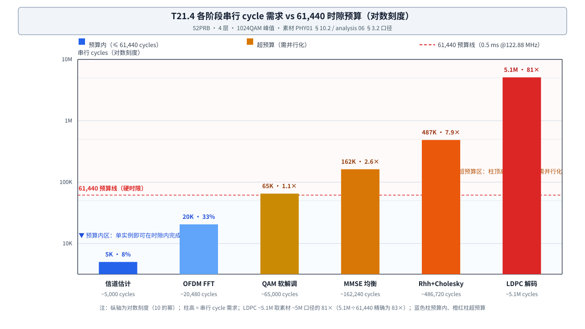

# T21.4 时隙周期预算与并行化

## 本节学习目标

第 3 章（[[T21.3_llr_dynamic_range_clipping_tradeoff]]）把 LLR（对数似然比，Log-Likelihood Ratio）的 6-bit 从"预告"变成了完整推导：±31 是"动态范围推导 + 损失预算 + 无界值吸收"三笔账的汇合点，而 6-bit 的数字实体是 LLR 缓冲 243.4 KB——**一个在 6.1 MB（兆字节，Megabyte） 全系统存储里只占 4% 的缓冲区**。第 3 章小结把这笔账交到了本章：LLR 的 6-bit 将在周期账里变成"存储带宽账里的一行"——因为决定一个阶段能不能按时做完的，不只是算得快不快，还有它每轮要从 SRAM（静态随机存取存储器，Static Random-Access Memory）里搬多少数据。

本章是 T21 系列的并行化章（第 4 章）：视角从"每个数多宽"（第 2/3 章的位宽账）转向"每件事做多久"（周期账）。第 1 章（[[T21.1_engineering_budget_overview]]）立下过周期账的三句话：61,440 cycles 是硬时限、并行度 = 串行 cycles ÷ 61,440、LDPC（低密度奇偶校验码，Low-Density Parity-Check Code）是 81× 超预算的最大瓶颈。本章把这三句话展开成一张完整的并行化决策表：每个阶段为什么需要那么多串行周期（推导口径）、除以预算后需要几路并行、哪些并行几乎免费（Gold 32 路）、哪些天然可并行但算术量大（Cholesky（乔列斯基分解，Cholesky Decomposition） ≥8 路）、哪些受数据依赖与存储带宽双重制约必须专用引擎（LDPC 81×）——最后用 273PRB 的时钟外推检验这套账的自洽性。学完本节后，应能做到：

- 复述 61,440 cycles 硬时限的来历（122.88 MHz × 0.5 ms，30 kHz SCS）与每秒 2,000 个时隙的含义，并解释"硬时限"为什么是并行化决策的出发点而不是目标值。
- 说出各阶段串行 cycle 需求表的关键行（LDPC ~5.1M、Rhh+Cholesky ~486,720、MMSE（最小均方误差，Minimum Mean Square Error） ~162,240、QAM（正交幅度调制，Quadrature Amplitude Modulation） 软解调 ~65,000、FFT（快速傅里叶变换，Fast Fourier Transform） ~20,480、信道估计 ~5,000），并复述 LDPC 与 Cholesky 两行的推导口径（30 CB（码块，Code Block） × 8,500 × 20 迭代 ≈ 5.1M；8,112 RE（资源元素，Resource Element） × 60 ≈ 486,720）。
- 用并行度公式（所需并行度 = 串行 cycle 需求 ÷ 时隙预算）计算任意阶段的并行度需求，并正确声明 LDPC 行的口径（素材取 ~5M 的 81×；5.1M 精确相除为 83×）。
- 解释 Gold 序列为什么是"几乎免费的并行"：线性结构 + 状态跳跃（A³² 一次推进 32 位、状态仅 2×31=62 bit）+ 无数据依赖无存储冲突，324,480 → 32 路 → 10,140 cycles。
- 解释 Cholesky 预处理为什么"天然可并行但算术量大"：每 RE 独立（RE 级并行）、8,112 RE 的串行累加 486,720 cycles，≥8 路（60,840 cycles）进入预算。
- 解释 LDPC 为什么必须专用引擎：迭代依赖（层内消息更新依赖前一层结果）与消息存储带宽双重制约，81× 超预算；并行后仍需 ~300K~640K 引擎周期、靠多 TB（传输块，Transport Block）流水隐藏，且面积表里它独占 3.0M gates / 1.5 mm²（38%）。
- 计算 273PRB 时隙预算（245.76 MHz × 0.5 ms = 122,880 cycles），并解释时钟为何只需 2× 而处理量按 RE 5.25×、FFT 4× 增长（并行度吸收处理量增长）。
- 复述并行化收益排序（Gold > MMSE > Cholesky > Sphere > LDPC），并论证"并行度不能无限加"的两个制约（面积与存储带宽）。

与持久理解的呼应：U4（61,440 cycles 是一道硬时限，并行化决策的本质是"用面积换周期"，并行收益不均匀）在本节完成完整论证——Gold 32 路几乎免费、Cholesky ≥8 路、LDPC 81× 专用引擎；U7（周期、存储、面积三本账是同一架构决策的三个投影，瓶颈排序与面积排序同一枚硬币）以"5.1M cycles → 81× 并行度 → 3.0M gates → 1.5 mm²"的链条与 273PRB 外推落地。核心问题 Q3（60,000 个周期做不完的事，加多少个引擎才能做完？并行度能无限加吗？）在本章深化。

## 前置知识检查

| 前置项 | 本节需要达到的程度 |
|:---|:---|
| [[T21.1_engineering_budget_overview]] 工程预算总览 | 知道 61,440 cycles 锚点（122.88 MHz × 0.5 ms）、并行度定义（串行需求 ÷ 预算）、周期账三行样本（LDPC 81× / Cholesky 7.9× / Gold 32 路）；本节把这些预告展开成完整决策表。 |
| [[T21.2_bitwidth_tracking_methodology]] 位宽追踪方法 | 知道 Rhh 24-bit、Cholesky 4×4 分解（+4 bit real）在 PS（概率整形，Probabilistic Shaping）解调预处理中的位置；本节讨论同一预处理级的周期需求与并行化。 |
| [[T21.3_llr_dynamic_range_clipping_tradeoff]] LLR 动态范围与裁剪权衡 | 知道 LLR 6-bit / ±31、48-bit 字打包（8 个 6-bit/字）与 LLR 缓冲 243.4 KB；本节把"位宽 → 存储"的杠杆延伸到"存储带宽制约并行度"。 |
| [[T5.3_throughput_latency_parallelism]] 吞吐、延迟与并行 | 知道译码器吞吐公式、启动间隔、并行度受 bank 冲突/算法依赖/迭代限制、平均迭代 vs 最坏迭代；本节把这些译码器概念放大到完整 Modem 周期账。 |
| [[T12.1_mimo_receiver_chain_overview]] MIMO（多输入多输出，Multiple-Input Multiple-Output）接收链路总览 | 知道 MIMO 检测链（信道估计 → Rhh → 均衡 → 软解调）的阶段顺序与每 RE 处理对象；本节为每阶段配 cycle 账。 |
| [[T12.3_linear_detectors_mf_zf_mmse]] 线性检测器 | 知道 MMSE 均衡公式与归一化步骤；本节讨论其 ~162,240 cycles 的并行化（≥4 路）。 |
| [[T12.4_sphere_detection_detector_selection]] 球面检测 | 知道 Sphere 检测的候选树搜索与复杂度随星座大小增长；本节把它列为并行收益排序中的"部分可并行"对照项。 |
| [[Gold_序列加扰]] Gold 序列 | 知道长度 31 Gold 序列的双 LFSR 结构与每周期 1 bit 输出；本节给出其 32 路状态跳跃并行化（324,480 → 10,140）。 |
| [[T4.4_early_stopping_crc_gated_control]] CRC（循环冗余校验，Cyclic Redundancy Check）门控早停 | 知道平均迭代 vs 最坏迭代、CRC 门控提前终止；本节用它解释 LDPC 20 次最大迭代是"最坏口径"而非平均工作点。 |

如果这些前置还不稳，先抓住一句话：**本节回答"0.5 ms 的时隙里每件事做不做得完、做不完的要加几路并行、哪一路并行最便宜、哪一路最贵"**。第 1 章给的除数是 61,440，本节把被除数（各阶段串行 cycle 需求）逐一算清并给出商（并行度）与余数（并行后的新瓶颈）。

## 61,440 硬时限：0.5 ms 内做完整个时隙

**硬时限（hard deadline）**：必须在固定时间窗内完成、逾期即算失败的处理时限。一句话解释：软实时（soft real-time）错过时限可以降级处理，硬时限没有商量余地——0.5 ms 的时隙结束时，接收链路必须交出这一时隙的译码结果，因为下一秒的时隙数据已经在 ADC（模数转换器，Analog-to-Digital Converter）里排队了。时隙预算 61,440 cycles 就是这条链路的硬时限（第 1 章 [[T21.1_engineering_budget_overview]] 的锚点 2）：

$$
61{,}440 = 122.88\times10^6 \times 0.5\times10^{-3}
\tag{1}
$$

式 (1) 回答的问题是：**从 ADC 到 LDPC 解码输出的整条接收数据通路，每 0.5 ms 只有 61,440 个时钟周期**。30 kHz 子载波间隔（SCS）下时隙时长 0.5 ms，52PRB 配置参考时钟 122.88 MHz，两者相乘就是每时隙的周期总数；每秒 2,000 个时隙，所以同一个 61,440 每 0.5 ms 重复一次——**它不是"目标"，而是"时钟跳了多少下"的精确算术**。

为什么把它称为"硬"时限而不是"性能目标"？因为周期账的每一行都以它为分母：一个阶段若串行需求超过 61,440，它在硬件里就**做不完**——没有"差一点也能跑"的选项，多出来的处理量要么靠并行度吸收、要么把吞吐降下来（第 6 章的吞吐账就查这个）。第 3 章视角下"每件事多宽"（位宽）的决策可以谈"损失可接受"（裁剪阈值 <0.02 dB），周期账的决策没有这种弹性：**超预算的每一项都必须给出并行化方案或明确的降级策略**。这就是并行化章存在的理由。

本章的记账对象是"每件事做多久"：**串行 cycle 需求（serial cycle demand）**——某个处理阶段用单实例（一个引擎、一路数据通路）顺序处理完整个时隙的工作量所需的时钟周期数。一句话解释：串行需求回答"这件事一个人干要多久"，并行度回答"要几个人一起干才能在 61,440 内干完"。串行需求是周期的"成本"，并行度是"用面积换周期"的兑换率——每个阶段的两个数字都来自素材的估算口径（[[3GPP全流程_缩写概念理论清单]] G 节、PHY01 §10、analysis 06 §3），是"估算事实"而非"协议事实"（3GPP 只规定时隙时长与时钟域，从不规定芯片内部用几个引擎）。

## 各阶段串行 cycle 需求表：周期账的八行

先看整张表（52PRB、4 层、1024QAM（1024 阶正交幅度调制，1024 Quadrature Amplitude Modulation） 峰值配置，PHY01 §10.2 / analysis 06 §3.2 的逐阶段估算）：

| 阶段 | 串行 cycles | 相对预算 | 所需并行 | 实际可行？ |
|:---|:---|:---|:---|:---|
| OFDM（正交频分复用，Orthogonal Frequency Division Multiplexing） FFT（4 天线） | ~20,480 | 33% | 4 引擎 | ✅ 预算内 |
| 信道估计（DMRS（解调参考信号，Demodulation Reference Signal）） | ~5,000 | 8% | 1 引擎 | ✅ 预算内 |
| Rhh + Cholesky | ~486,720 | 7.9× | ≥8 路 | ⚠️ 超预算（最大瓶颈之一） |
| MMSE 均衡 | ~162,240 | 2.6× | ≥4 路 | ⚠️ 超预算（并行后进入） |
| QAM 软解调 | ~65,000 | 1.1× | ≥2 路 | ⚠️ 略超预算 |
| LDPC 解码 | ~5.1M | 81× | 专用引擎 | ⚠️ 超预算（最大瓶颈） |
| PS ESS（枚举球面整形，Enumerative Sphere Shaping）编码 | ~30,000 | — | 1/CB | ✅ per-TB 非实时路径 |
| PS ESS 解码 | ~1,500 | — | 1/CB | ✅ per-TB 非实时路径 |

读这张表的第一反应应该是：**八行里只有两行是"预算内"，其余全部超预算**——也就是说"一个引擎顺序干完一个时隙"在硬件上根本不存在，并行不是可选项而是必需品。表中两个"超预算"行是周期账的主角，各自的串行需求都有可还原的推导口径（这正是第 1 章"周期账按可验的算术记账"原则的实例）：

**LDPC 解码 ~5.1M 的推导**（PHY01 §10.2）：编码比特总数 G = 324,480 bit（52PRB 峰值：8,112 RE × 10 bit/符号 × 4 层）；按 BG1 最大码块 8,448 bit 拆分，得到约 30 个码块（CB）；分层信念传播（Layered Belief Propagation, LBP，[[T8.7_layered_LDPC_decoding_schedule]] 的分层调度）每迭代每 CB 约 8,000~9,000 cycles（取 8,500）；最大迭代 20 次（`maxLdpcIterations=20`）：

$$
30 \times 8{,}500 \times 20 \approx 5.1\mathrm{M}\ \mathrm{cycles}
\tag{2}
$$

式 (2) 回答的问题是：LDPC 的 5.1M 是"码块数 × 单块迭代开销 × 迭代次数"三因子相乘——三个因子各自有物理含义：码块数来自 G 与 BG1 分段（协议），单块迭代开销来自 LBP 的层处理周期（算法与实现），迭代次数是**最坏口径**（20 次最大迭代，而 CRC 早停（[[T4.4_early_stopping_crc_gated_control]]）使高 SNR（信噪比，Signal-to-Noise Ratio）下平均迭代远低于 20）。

**Rhh + Cholesky ~486,720 的推导**（PHY01 §10.2）：PS+MIMO 路径逐 RE 构造 Hermitian 矩阵 Rhh（每 RE 16 次乘加）并做 4×4 Cholesky 分解（每 RE 约 60 次标量运算，含开方/除法/乘加），PDSCH（物理下行共享信道，Physical Downlink Shared Channel）RE 总数 8,112：

$$
8{,}112 \times 60 \approx 486{,}720\ \mathrm{cycles}
\tag{3}
$$

式 (3) 回答的问题是：Cholesky 行的本质是"**每 RE 的算术量 × RE 数**"——RE 级工作量完全独立（互不依赖），纯粹是算术量大。与 LDPC 行对比：LDPC 的 5.1M 是"依赖结构 × 算术量 × 迭代"三重奏，Cholesky 的 486,720 只有"算术量 × 规模"两个因子——**这预示了两者并行化的难度差异**（下一节展开）。

其余行的口径：MMSE 均衡 ~162,240（每 RE 矩阵求逆的乘加 × 8,112 RE）；QAM 软解调 ~65,000（G/Qm（调制阶数，Modulation order） = 32,448 个符号 × 每符号约 2 cycles 的 max-log-MAP 距离计算）；OFDM FFT ~20,480 已是按 4 引擎流水优化的口径（4 天线共 56 次 1024 点 FFT，每引擎约 14 次变换，PHY01 §1.2）；信道估计 ~5,000（DMRS 导频位置的 LS/插值，RE 数远少于 PDSCH（物理下行共享信道，Physical Downlink Shared Channel））。PS ESS（枚举球面整形，Enumerative Sphere Shaping）编/解码是 per-TB 的非实时路径（~30,000 / ~1,500），不占用每时隙的实时预算——它们是第 6 章 PS ROI 账的主角，本章只看实时路径。

## 并行度公式：串行 cycles ÷ 预算 = 需要几份并行

表里"所需并行"列是怎么来的？**并行度公式（parallelism formula）**：所需并行度 = 串行 cycle 需求 ÷ 时隙预算。一句话解释：并行度是周期账对面积账发出的采购单——"这件事拆成几份同时做，才能在硬时限内做完"，每加一份并行，面积表里就多一行（第 1 章三本账互锁的第 2 条边）。公式化：

$$
P = \frac{C_{\mathrm{serial}}}{C_{\mathrm{budget}}} = \frac{C_{\mathrm{serial}}}{61{,}440}
\tag{4}
$$

式 (4) 回答的问题是：**给定串行需求，最少要并行到多少路**。P 是"所需并行度的下界"——并行度低于 P，串行时间除以并行度后仍超预算；等于 P 恰好用完预算（并行后 cycles ≈ 61,440）；高于 P 则留下余量。逐行代入（全部数字在本节"内嵌验证"用 numpy 独立重算）：

| 阶段 | 串行 cycles | P = 串行 ÷ 61,440 | 素材取整 |
|:---|:---|:---|:---|
| LDPC 解码 | ~5.1M（口径见下） | ~81×（素材口径） | 专用引擎 |
| Rhh + Cholesky | 486,720 | 7.92× | ≥8 路 |
| MMSE 均衡 | 162,240 | 2.64× | ≥4 路 |
| QAM 软解调 | 65,000 | 1.06× | ≥2 路 |
| OFDM FFT | 20,480 | 0.33× | 4 引擎 |
| 信道估计 | 5,000 | 0.08× | 1 引擎 |

**口径声明（本章显式声明）**：LDPC 行的素材口径是"~5.1M cycles ≈ 预算 81×"。若按推导链精确值 5,100,000 直接除以 61,440，得到的是 83.0×（5.1M/61,440 = 83.0）；素材（PHY01 §11.1、analysis 06 §3.2、理论清单 G 节）统一取 ~5M 的约数口径——5,000,000/61,440 ≈ 81.4 ≈ 81×。本系列沿用素材口径"**~5.1M ≈ 预算 81×**"（推导链写 5.1M、倍数写 81×），本章所有计算与断言都按此声明；若见到 83× 的写法，那是精确除法口径，两口径差 2.4%，不影响"最大瓶颈、必须专用引擎"的任何结论。

读这张"商表"的三条结论（对应 U4 的核心主张）：

1. **并行收益不均匀**：商的分布从 0.08×（信道估计，单实例绰绰有余）到 81×（LDPC，拆 81 份才勉强）跨越三个数量级——"加引擎"不是均匀的等价交换，不同阶段每加一份并行的价格完全不同（下一节逐行定价）。
2. **P 是下界不是方案**：P = 7.92× 只告诉你"至少 8 路"，不告诉你怎么拆——拆 RE（Cholesky）与拆迭代（LDPC 拆不动）是两种性质完全不同的工程。式 (4) 的商只是采购单，方案要回到各阶段的数据依赖结构。
3. **并行后 cycles = 串行 ÷ 实际并行度**：Cholesky 8 路 → 60,840（99% 预算）、16 路 → 30,420（50%）；MMSE 4 路 → 40,560（66%）、8 路 → 20,280（33%）；QAM 2 路 → 32,500（53%）。注意 MMSE 行素材口径"8 路后进入预算"的精确占比是 33%（20,280/61,440），这就是"≥4 路"后面的余量来源。

图 1 把整张表画成对数柱状图——为什么要用对数刻度（logarithmic scale，每隔 10 倍等距）？因为各行跨越 5,000 到 5,100,000 三个数量级，线性坐标下 5,000 的柱子会矮到看不见；对数刻度让"每根柱子都看得见"，而 61,440 预算线把表一分为二：蓝色柱（预算内）与橙红柱（超预算）——超预算的四根柱（QAM 1.1×、MMSE 2.6×、Cholesky 7.9×、LDPC 81×）就是本章接下来逐行处理的并行化对象。



## Gold 序列：线性结构的免费并行

先看最便宜的一笔并行。**Gold 序列（Gold sequence）**（[[Gold_序列加扰]]）是 NR 所有伪随机序列的生成器：两个 31 级线性反馈移位寄存器（LFSR）由本原多项式驱动，输出每周期 1 bit（TS 38.211 §5.2.1）。PDSCH 加扰/解扰共用同一序列，峰值配置 G = 324,480 bit 意味着**单实例串行生成需要 324,480 cycles**——占预算 61,440 的 5.3 倍，按式 (4) 需要 5.3 路并行。这就是第 1 章预告的"Gold 324,480 → 32 路 → 10,140"。

为什么 32 路几乎免费？三个原因，逐个看：

1. **线性结构允许状态跳跃（state skipping）**：LFSR 的状态推进是线性变换——31-bit 状态向量乘 31×31 转移矩阵 A 推进 1 位。**状态跳跃**：用 A 的 k 次方 Aᵏ 把状态一次推进 k 位。一句话解释：普通 LFSR 是"每周期走一步"，状态跳跃是"一步跨 k 格"——A³² 预计算一次（31×31 矩阵乘，一次性成本，非每时隙），之后每个周期输出 32 bits 而不是 1 bit。这也顺便解决了 Nc = 1,600 的预跳问题：Nc 位偏移同样用 A¹⁶⁰⁰ 一步到位（或时隙初始化时预跑 1,600 拍，占预算 2.6%）。
2. **状态极小**：两个 LFSR 各 31 bit，总共 2×31 = **62 bit**（8 字节）——并行 32 路不需要复制存储，只是把反馈网络展开 32 倍；c_init 装载每时隙一次。
3. **无数据依赖、无存储冲突**：输出位只依赖当前状态，不依赖任何先前输出；加扰/解扰是纯 XOR（每 bit 1 个 XOR2 门），32 路数据通路完全独立，不需要仲裁、没有 bank 冲突（对比下一节 LDPC 的存储带宽制约）。

32 路后的账：

$$
\frac{324{,}480}{32} = 10{,}140\ \mathrm{cycles} \approx 10\mathrm{K}\quad(16.5\%\ \text{预算})
\tag{5}
$$

式 (5) 回答的问题是：**最贵（5.3× 超预算）的瓶颈用最便宜的方式解决了**——32 路状态跳跃 LFSR 的面积代价只是 62 bit 状态 + 展开的反馈 XOR 网络（面积表里"加扰/解扰"一行 0.05 M gates、占预算 17%，PHY01 §9.2/§11.2）。这就是并行化收益排序的冠军：**线性结构 + 无冲突 = 接近线性的并行收益，成本几乎全在算术展开本身**。对照第 2 章位宽账的口径——Gold 状态 62 bit 是"每链路一份"的不缩放项（273PRB 存储外推时它不随 RE 增长，第 5 章展开），周期账这里同样成立：10,140 cycles 与 PRB（物理资源块，Physical Resource Block）数无关，273PRB 下 Gold 仍是 32 路 10,140（若 G 涨到 1.69M 则需更多路，见引导练习 1）。

## Cholesky 预处理：天然可并行但算术量大

第二笔并行来自 Rhh + Cholesky（~486,720 cycles，7.9× 超预算）。它的数据结构与 Gold 完全不同：**每 RE 一个 4×4 Hermitian 矩阵**（Rhh = HᴴH 逐 RE 构造，16 次乘加/RE），再对每个矩阵做 Cholesky 分解（约 60 次标量运算/RE，含开方与除法，对应位宽账的 +4 bit real，[[T21.2_bitwidth_tracking_methodology]] 的决策树）。**RE 级并行（RE-level parallelism）**：把不同 RE 的 Rhh 构造与分解分给不同处理单元并行执行——不同 RE 之间没有数据依赖，每个 RE 的工作量完全相同，所以并行是"天然可行"的：8 路就是把 8,112 个 RE 均分给 8 个单元：

$$
\frac{486{,}720}{8} = 60{,}840\ \mathrm{cycles}\quad(99\%\ \text{预算}),\qquad
\frac{486{,}720}{16} = 30{,}420\ \mathrm{cycles}\quad(50\%\ \text{预算})
\tag{6}
$$

式 (6) 回答的问题是：**为什么"≥8 路"**——8 路后 60,840 cycles 恰好压进预算（99%，贴线），16 路留出 50% 余量；素材（PHY01 §11.1）的建议是 8~16 路 RE 级并行。注意 8 路的 99% 与 16 路的 50% 之间的差——8 路贴线意味着没有余量吸收调度抖动（比如 DMRS 位置的 RE 密度波动），工程上通常选 16 路。

但"天然可并行"不等于"便宜"：486,720 的算术量是实打实的——8,112 RE × 60 次标量运算，每个单元都要有乘加器、开方器与除法器（PHY01 §12.4 把它列为新增关键路径族之一："Cholesky 除法/开方单元，486K cycles 的算术密度中心"）。**天然可并行但算术量大**——这句话的工程含义是：并行度提升的空间大（依赖结构不设限），但每一路都要付算术单元的面积，不像 Gold 那样"展开反馈网络就行"。面积表里 MIMO 检测（MMSE+Cholesky）合计 1.5M gates + 1.6 MB SRAM = 0.9 mm²、面积第二（PHY01 §9.2）——周期账的"第二瓶颈"与面积账的"第二子系统"对齐，这正是 U7 说的"瓶颈排序与面积排序是同一枚硬币的两面"的第一个实例。

还有两个不需要加引擎的省法（PHY01 §11.1 的缓解路径）：Rhh 是 Hermitian 矩阵，**只存上三角省一半存储与带宽**（第 5 章存储账里 Rhh 778.8 KB 是按全矩阵计的，只存上三角即 389.4 KB）；以及**架构替代**——Cholesky 只在 PS+MIMO 组合路径触发（uniform 路径走 MMSE 无 Cholesky），所以它的并行化是"峰值配置的账单"而非所有配置的账单（与第 2 章位宽决策树的动态读法同构）。

## LDPC 专用引擎：双重制约下的最贵并行

第三笔并行是周期账的主角：LDPC 解码 ~5.1M cycles，81× 超预算——**表里唯一按"倍"算都嫌不够、必须单独造引擎的阶段**。**专用引擎（dedicated engine）**：为单一算法专门配置的并行处理硬件，其并行度、流水深度与存储带宽按该算法的最坏需求定制。一句话解释：专用引擎是"81× 采购单"的兑现方式——它不是通用多核阵列，而是只服务于 LDPC 译码、带宽与面积都按译码需求设计的引擎。为什么它不能像 Gold 那样"展开"、也不能像 Cholesky 那样"均分 RE"？两个制约（对应第 1 章互锁边 3"存储带宽制约并行度"的完整论证）：

**制约 1：迭代依赖（iteration dependency）**——层内消息更新依赖前一层的结果。LBP 分层调度（[[T8.7_layered_LDPC_decoding_schedule]]）按基图逐层更新校验节点与变量节点消息，第 l 层读到的消息是第 l−1 层刚写回的——**同一码块内的并行度被依赖链卡住**，不能像 RE 那样无脑均分。能拆的并行粒度是 **CB 级并行（code-block-level parallelism）**：~30 个 CB 相互独立（各 CB 独立译码、独立 CRC，[[T8.1_NR_LDPC_decoder_chain_overview]] 的接收链路结构），可以并行跑——但每个 CB 内部仍然串行迭代。所以"81×"的商不能直接兑现成 81 份，8~16 个 CB 并行（面积表里 LDPC 的 3.0M gates 就是为 8~16 引擎并行预留的）之后：

$$
\frac{5{,}100{,}000}{16} \approx 318{,}750\ \mathrm{cycles},\qquad
\frac{5{,}100{,}000}{8} \approx 637{,}500\ \mathrm{cycles}
\tag{7}
$$

式 (7) 回答的问题是：**16 个 CB 并行后仍需 ~300K~640K 引擎周期（素材口径 ~300K~640K）——仍然超过 61,440 预算好几倍**。这就是"专用引擎"的含义：LDPC 的并行不是"把 81 份算力堆出来就行"，而是要多 TB 流水（pipelining，[[T5.3_throughput_latency_parallelism]] 的启动间隔概念）——第 n 个时隙的译码与第 n+1 个时隙的前端处理重叠，把 300K+ 周期的引擎时间藏进流水线里，让吞吐按"每时隙一个 TB"交付。U7 的链条在这里闭合：**5.1M cycles 串行需求 → 81× 并行度需求 → 专用引擎 3.0M gates → 1.5 mm²（全系统单块最大，38%）**——周期账的榜首就是面积账的榜首。

**制约 2：消息存储带宽（message memory bandwidth）**——每轮迭代都要读写消息 RAM。LDPC 译码每迭代每层要读变量节点消息、写更新后的消息（[[T19.2_NR_LDPC_RTL_microarchitecture]] 的 message RAM + banking 结构，[[T18.5_SIMD_memory_layout_decoders]] 的 bank/lane 概念）：并行度每翻一倍，同一时间内要搬的消息量翻一倍——**引擎算得再快，消息 RAM 的读写带宽也会先到顶**。这就是"8~16 引擎"而不是"80 引擎"的直接原因：80 个引擎的算术阵列造得出来，但消息存储的带宽与面积撑不住（这正是第 5 章存储账里 LDPC 2.0 MB 消息/软缓存 SRAM 与 8% 占比的另一面——存储不大，但每 bit 的访问频率极高）。[[T5.3_throughput_latency_parallelism|T5.3]] 的"并行度只是上限"（bank 冲突、算法依赖、迭代限制）在这条行上全部兑现。

两个不需要加引擎的省法（PHY01 §11.1）：**CRC 早停**（[[T4.4_early_stopping_crc_gated_control]]）——高 SNR 下平均迭代次数远低于 20，实测 BLER（块错误率，Block Error Rate）=0 的 SNR 点吞吐不受影响（式 (2) 的 20 是"最坏口径"；平均迭代 vs 最坏迭代是 [[T5.3_throughput_latency_parallelism|T5.3]] 的核心结论在 Modem 尺度的复现）；**算法级**——min-sum 近似与分层调度比泛洪调度省一半消息带宽。注意这三个省法（早停/近似/分层）都不改变"81× 是串行最坏口径"这个数字——它们改变的是**平均工作点**，最坏配置下专用引擎的并行度需求依然是 81×。

## MMSE 与 FFT：2~4 路就够的中段

把三笔大账算完，剩下的阶段只需小并行。**MMSE 均衡**（[[MMSE_均衡]]、[[T12.3_linear_detectors_mf_zf_mmse]]）~162,240 cycles（2.6× 超预算）：与 Cholesky 同属"每 RE 独立"结构（矩阵求逆逐 RE 进行），数据独立、并行天然可行——4 路 40,560（66% 预算）、8 路 20,280（33%），素材建议 ≥4 路、评估 ✅。**QAM 软解调**（[[Soft_Demodulation_软解调]]）~65,000 cycles（1.06×，贴着预算线）：max-log-MAP 距离计算逐符号独立（32,448 个符号），2 路即 32,500（53% 预算）。**OFDM FFT**（4 天线）~20,480 cycles：表里它已按 4 引擎流水配置（每引擎约 14 次 1024 点 FFT 变换），占预算 33%——**FFT 是"引擎数跟着 Nfft 走"的典型**（273PRB 时引擎数与 Nfft 一起翻倍，见下一节），且流式处理不留整网格（存储账里 OFDM 的 SRAM 仅 0.05 MB，PHY01 §9.2）。**信道估计**（[[Channel_Estimation_信道估计]]）~5,000 cycles：只处理 DMRS 导频位置，单实例即可（8% 预算），连并行都不用谈。

这四行合起来回答 U4 的一个侧面：**"60,000 个周期做不完的事，加多少个引擎"的答案不是统一的**——信道估计 1 个引擎、FFT 4 个、QAM 2 路、MMSE 4~8 路、Cholesky 8~16 路、LDPC 专用引擎，每一行的"引擎数"都从自己的数据结构推导出来，不是规格书拍的。

## 273PRB 外推：时钟 2× 的检验场

周期账的自洽性检验在 273PRB（FR1（频率范围 1，Frequency Range 1） 100 MHz 上限）配置上展开（LO9 的载体）。273PRB 与 52PRB 的对照（PHY01 §1.4/§10.1）：

| 参数 | 52PRB | 273PRB | 缩放 |
|:---|:---|:---|:---|
| 子载波数（RE 规模） | 624 | 3,276 | 5.25× |
| FFT 大小 | 1,024 | 4,096 | 4× |
| 采样率 | 30.72 MHz | 122.88 MHz | 4× |
| 参考时钟 | 122.88 MHz | 245.76 MHz | **2×** |
| 时隙时长 | 0.5 ms | 0.5 ms | 1×（同 SCS） |
| **每时隙 cycles** | **61,440** | **122,880** | **2×** |

273PRB 的时隙预算：

$$
245.76\times10^6 \times 0.5\times10^{-3} = 122{,}880\ \mathrm{cycles}
\tag{8}
$$

式 (8) 回答的问题是：**273PRB 的预算为什么只翻倍**——预算 = 时钟 × 时隙时长，时隙时长由 SCS 决定（30 kHz → 0.5 ms，两配置相同），所以预算随时钟走：122.88 → 245.76 MHz 恰好 2×。而处理量按 RE 5.25×、FFT 按 4× 增长——**处理量与预算不同步增长，缺口由并行度吸收**：

1. **FFT 类**：Nfft 4×（1,024 → 4,096），引擎数也 4×（4 → 16 个引擎），每引擎工作量不变——"引擎数跟着 Nfft 走"是第 1 章就预告过的面积换周期权衡；
2. **RE 类**（Cholesky、MMSE、软解调、LDPC 的 G）：串行需求按 5.25× 增长，预算只 2×——所需并行度也约 2.6×（5.25/2）。例：Cholesky 在 273PRB 的串行需求 ≈ 486,720 × 5.25 ≈ 2.56M cycles，÷ 122,880 ≈ **约 21×**（52PRB 是 7.9×，正是 5.25/2 ≈ 2.63 倍的关系）；
3. **每链路一份**的项（Gold 状态 62 bit、PS 能量表 264 KB、MCS（调制与编码方案，Modulation and Coding Scheme） 表）不缩放——它们既不涨处理量也不涨存储（第 5 章存储外推的分项口径与此一致）。

**外推口径分项适用的原因**：三个因子（RE 5.25×、FFT 4×、时钟 2×）各管一类账——RE 类按子载波数比例、FFT 类按 2 的幂、时钟是系统级翻倍——不能混用一个比例（273PRB 预算 ≠ 61,440×5.25，因为时钟只 2×）。这是第 6 章规格书审计的经典陷阱："273PRB 预算 322,560 cycles"（误用 5.25×）是审计第一眼就能抓的错误。**这套账自洽吗？** 检验：预算 2× 而 RE 类处理量 5.25×，意味着 273PRB 的并行度需求全面上升（Cholesky 7.9× → ~21×、LDPC 81× → ~212×）——硬件面积随之上升（273PRB 面积 ≈ 19 mm²，按存储比 28.7/6.1 ≈ 4.7× 外推，PHY01 §9.3），**周期账、存储账、面积账在 273PRB 上同步翻新，这就是 U7 的"检验场"**。

## 并行收益排序：数据依赖结构决定并行单价

把五笔并行的"单价"放在一张表里（PHY01 §11.2 的并行化评估）：

| 阶段 | 串行 cycles | 并行方案 | 并行后 cycles | 评估 |
|:---|:---|:---|:---|:---|
| Gold 序列 | 324,480 | 32 路状态跳跃 LFSR | ~10,140 | ✅ 最简单（线性结构、无存储冲突），占预算 17% |
| MMSE 均衡 | 162,240 | 4~8 路 | 20K~40K | ✅ 数据独立 |
| Rhh+Cholesky | 486,720 | 8~16 路 RE 并行 | 30K~61K | ⚠️ 8 路后进入预算，16 路留余量 |
| Sphere 检测（4×4 256QAM） | 1.6~4M | 32 路 ML（最大似然，Maximum Likelihood）候选并行 | 50K~125K | ⚠️ 依赖星座大小 O(N^Qm)，32 路可接受 |
| LDPC 解码 | ~5.1M | 专用引擎（8~16 CB 并行 + 流水） | ~300K~640K 引擎周期 | ⚠️ 仍最大单项，需流水多 TB 隐藏 |

**并行化收益排序（parallelization gain ranking）**：按"单位面积换来的周期节省"从高到低排序——**Gold > MMSE > Cholesky > Sphere > LDPC**（PHY01 §11.2 的结论）。一句话解释：排序的依据不是串行需求的大小（LDPC 最大却排最后），而是**数据结构对并行的友好程度**：

- **Gold 排第一**：线性结构 + 无存储冲突，32 路接近线性收益，面积代价只有展开的反馈网络（0.05 M gates）；
- **MMSE/Cholesky 居中**：数据独立（RE 级并行天然可行），但要付每路算术单元的面积；Cholesky 排在 MMSE 之后，因为它的开方/除法单元比 MMSE 的乘加更贵、且 8 路才刚进预算；
- **Sphere 排在 Cholesky 后**：**球面检测（Sphere detection）**（[[T12.4_sphere_detection_detector_selection]]）的候选树搜索复杂度随星座大小增长（O(N^Qm)），32 路候选并行受候选数制约——并行度不是想加就加，候选枚举空间不够时多出的引擎闲着；
- **LDPC 排最后**：迭代依赖 + 消息存储带宽双重制约，并行后仍超预算（~300K~640K），还必须配流水架构与多 TB 调度——**它是面积表里最贵的一行（3.0M gates、1.5 mm²、38%），也恰好是周期账里最贵的一行（81×）**。

**并行度不能无限加**——两个硬制约（对应核心问题 Q3 的"能无限加吗"）：**面积制约**——每加一份并行，面积表里多一行（式 (4) 的采购单要付钱）；8 路 Cholesky 与 16 路 Cholesky 的差是 8 套开方/除法单元的面积，81 路 LDPC 的差是 3.0M gates 的算术阵列与翻倍的消息带宽。**带宽制约**——并行度每翻一倍，同一窗口内要搬运的数据翻一倍；LDPC 的消息 RAM、Cholesky 的 Rhh 读写、Sphere 的候选枚举，各有各的带宽天花板（第 1 章互锁边 3）。一句话记忆：**并行度不是"越多越好"的自由量，它是"周期账的商、面积账的加项、带宽账的乘数"**——三个约束的交点才是方案，这在第 6 章的规格书审计里是查账重点。

## 内嵌验证：并行度矩阵

下面用 numpy 把式 (4) 的整张商表算一遍：各阶段串行 cycles 除以 61,440，按并行度需求降序输出，验证两个告警级条目（LDPC ~81×、Cholesky 7.9×），并顺带核对本章全部派生数字（Gold 32 路、Cholesky/MMSE 并行后 cycles、Sphere 32 路、273PRB 预算与 5.1M 的精确除法口径）。

```python
# @file    t21_4_parallelism_matrix.py
# @brief   T21.4 内嵌验证：并行度矩阵——各阶段串行 cycles ÷ 61,440 并行度需求降序排序
# @note    素材口径 PHY01 §10.2/§11.2、analysis 06 §3.2（52PRB、4 层、1024QAM 峰值）；
#          LDPC 取素材 81× 口径的 ~5.0M cycles；推导链 30×8,500×20 ≈ 5.1M（5.1M/61,440=83×，
#          素材统一取 ~5M 口径的 81×，本章正文显式声明该口径）
# @date    2026-08-04
import numpy as np

BUDGET = 61440.0                      # 61,440 = 122.88 MHz × 0.5 ms（52PRB 时隙预算）

stages = [
    ("OFDM FFT（4 天线）",   20480),
    ("信道估计（DMRS）",      5000),
    ("Rhh + Cholesky",      486720),
    ("MMSE 均衡",           162240),
    ("QAM 软解调",           65000),
    ("LDPC 解码",          5000000),   # 素材 81× 口径（~5.0M）
    ("PS ESS 编码（per-TB）", 30000),
    ("PS ESS 解码（per-TB）",  1500),
]
names  = [s[0] for s in stages]
serial = np.array([s[1] for s in stages], dtype=np.float64)
ratio  = serial / BUDGET

suggest = {  # 素材 §10.2 建议并行方案
    "LDPC 解码": "专用引擎",
    "Rhh + Cholesky": "≥8 路",
    "MMSE 均衡": "≥4 路",
    "QAM 软解调": "≥2 路",
    "OFDM FFT（4 天线）": "4 引擎",
    "信道估计（DMRS）": "1 引擎",
    "PS ESS 编码（per-TB）": "1/CB",
    "PS ESS 解码（per-TB）": "1/CB",
}
print(f"时隙预算: {BUDGET:.0f} cycles = 122.88 MHz x 0.5 ms（52PRB）")
print(f"{'阶段':<20}{'串行 cycles':>14}{'并行度需求':>12}  建议并行")
order = np.argsort(-ratio)
for i in order:
    print(f"{names[i]:<20}{int(serial[i]):>14,}{ratio[i]:>10.2f}x  {suggest[names[i]]}")

def idx(name):
    return names.index(name)

# ---- 告警级条目核对（素材口径）----
ldpc  = ratio[idx("LDPC 解码")]
chol  = ratio[idx("Rhh + Cholesky")]
mmse  = ratio[idx("MMSE 均衡")]
qam   = ratio[idx("QAM 软解调")]
fft   = ratio[idx("OFDM FFT（4 天线）")]
ce    = ratio[idx("信道估计（DMRS）")]
print(f"\n告警级条目: LDPC {ldpc:.1f}x（素材口径 ~81x） / Cholesky {chol:.2f}x（素材口径 7.9x）")
print(f"口径说明: 推导链 30 CB x 8,500 cycles x 20 迭代 = 5,100,000 -> /61,440 = {5100000/BUDGET:.1f}x（精确 83x）")

assert abs(ldpc - 81.4) < 0.5         # 素材口径 ~81×（5.0M/61,440 ≈ 81.4）
assert abs(chol - 7.92) < 0.05        # 7.9×
assert abs(mmse - 2.64) < 0.05        # 2.6×
assert abs(qam - 1.06) < 0.05         # 1.1×
assert abs(fft - 0.333) < 0.01        # 33%
assert abs(ce  - 0.081) < 0.01        # 8%

# ---- 派生核对：并行化方案（PHY01 §11.2 口径）----
print("\n并行化方案核对:")
gold  = 324480 / 32                  # Gold 32 路状态跳跃
chol8 = 486720 / 8                   # Cholesky 8 路 RE 并行
chol16 = 486720 / 16                 # Cholesky 16 路
mmse4 = 162240 / 4
mmse8 = 162240 / 8
qam2  = 65000 / 2
ldpc8  = 5100000 / 8                 # LDPC 8 CB 并行（引擎周期）
ldpc16 = 5100000 / 16                # LDPC 16 CB 并行
sphere_lo = 1600000 / 32             # Sphere 32 路候选并行
sphere_hi = 4000000 / 32
budget273 = 245.76e6 * 0.5e-3        # 273PRB 预算
print(f"  Gold 32 路: {gold:,.0f} cycles（占预算 {100*gold/BUDGET:.0f}%）")
print(f"  Cholesky 8 路: {chol8:,.0f}（{100*chol8/BUDGET:.0f}%） / 16 路: {chol16:,.0f}（{100*chol16/BUDGET:.0f}%）")
print(f"  MMSE 4 路: {mmse4:,.0f}（{100*mmse4/BUDGET:.0f}%） / 8 路: {mmse8:,.0f}（{100*mmse8/BUDGET:.0f}%）")
print(f"  QAM 2 路: {qam2:,.0f}（{100*qam2/BUDGET:.0f}%）")
print(f"  LDPC 8 CB 并行: {ldpc8:,.0f} / 16 CB 并行: {ldpc16:,.0f} 引擎周期（素材 ~300K~640K）")
print(f"  Sphere 32 路: {sphere_lo:,.0f}~{sphere_hi:,.0f} cycles（素材 ~50K~125K）")
print(f"  273PRB 预算: {budget273:,.0f} cycles（245.76 MHz x 0.5 ms，时钟 2x）")

assert abs(gold - 10140) < 1
assert abs(chol8 - 60840) < 1 and abs(chol16 - 30420) < 1
assert abs(mmse4 - 40560) < 1 and abs(mmse8 - 20280) < 1
assert abs(qam2 - 32500) < 1
assert abs(ldpc8 - 637500) < 100 and abs(ldpc16 - 318750) < 100
assert abs(sphere_lo - 50000) < 1 and abs(sphere_hi - 125000) < 1
assert abs(budget273 - 122880) < 1
print("断言全部通过：LDPC ~81x、Cholesky 7.9x、MMSE 2.6x、QAM 1.1x、FFT 33%、CE 8%；并行方案与素材一致 ✓")
```

真实运行输出（断言全部通过）：

```text
时隙预算: 61440 cycles = 122.88 MHz x 0.5 ms（52PRB）
阶段                       串行 cycles       并行度需求  建议并行
LDPC 解码                  5,000,000     81.38x  专用引擎
Rhh + Cholesky             486,720      7.92x  ≥8 路
MMSE 均衡                    162,240      2.64x  ≥4 路
QAM 软解调                     65,000      1.06x  ≥2 路
PS ESS 编码（per-TB）           30,000      0.49x  1/CB
OFDM FFT（4 天线）              20,480      0.33x  4 引擎
信道估计（DMRS）                   5,000      0.08x  1 引擎
PS ESS 解码（per-TB）            1,500      0.02x  1/CB

告警级条目: LDPC 81.4x（素材口径 ~81x） / Cholesky 7.92x（素材口径 7.9x）
口径说明: 推导链 30 CB x 8,500 cycles x 20 迭代 = 5,100,000 -> /61,440 = 83.0x（精确 83x）

并行化方案核对:
  Gold 32 路: 10,140 cycles（占预算 17%）
  Cholesky 8 路: 60,840（99%） / 16 路: 30,420（50%）
  MMSE 4 路: 40,560（66%） / 8 路: 20,280（33%）
  QAM 2 路: 32,500（53%）
  LDPC 8 CB 并行: 637,500 / 16 CB 并行: 318,750 引擎周期（素材 ~300K~640K）
  Sphere 32 路: 50,000~125,000 cycles（素材 ~50K~125K）
  273PRB 预算: 122,880 cycles（245.76 MHz x 0.5 ms，时钟 2x）
断言全部通过：LDPC ~81x、Cholesky 7.9x、MMSE 2.6x、QAM 1.1x、FFT 33%、CE 8%；并行方案与素材一致 ✓
```

三个读法（教学要点）：

1. **商表与素材逐行一致**：降序排列下 LDPC 81.4×（素材取 ~81×）、Cholesky 7.92×（素材取 7.9×）、MMSE 2.64×、QAM 1.06×、FFT 33%、信道估计 8%——式 (4) 的商全部落在素材口径内；口径说明行同时打印了 5.1M 精确相除的 83.0×，与正文声明一致。
2. **派生数字全部自洽**：Gold 32 路 10,140（17%）、Cholesky 8 路 60,840（99%）/16 路 30,420（50%）、MMSE 4 路 40,560（66%）/8 路 20,280（33%）、QAM 2 路 32,500（53%）、LDPC 8/16 CB 并行 637,500/318,750（素材 ~300K~640K）、Sphere 32 路 50K~125K、273PRB 122,880——正文所有"并行后 cycles"都在这段输出里复验过。
3. **素材的"建议并行"列可以直接核对**：numpy 数组结构本身就是"并行度矩阵"——一列串行需求、一列商、一列建议方案，第 6 章审计规格书时把这张矩阵重算一遍，就能发现"并行度拍脑袋"的行。

## 示范例题

### 例 1（应用）：并行度计算

**题目**：给定 52PRB 时隙预算 61,440 cycles，某接收机四个阶段的串行 cycle 需求为：Rhh+Cholesky 486,720、MMSE 均衡 162,240、QAM 软解调 65,000、信道估计 5,000。请（1）用并行度公式计算各阶段所需并行度（保留两位小数）；（2）给出各阶段至少需要的并行路数，并计算并行后的实际 cycles 与占预算比例；（3）指出哪些阶段需要并行化、哪些不需要。

**解答**：

1. **并行度**（式 (4)，P = 串行 ÷ 61,440）：
   - Rhh+Cholesky：486,720/61,440 = **7.92×**
   - MMSE：162,240/61,440 = **2.64×**
   - QAM 软解调：65,000/61,440 = **1.06×**
   - 信道估计：5,000/61,440 = **0.08×**
2. **最少路数与并行后账**：并行路数取不小于 P 的最小整数——Cholesky **8 路** → 486,720/8 = 60,840（占预算 99%）；MMSE **4 路** → 40,560（66%）；QAM **2 路** → 32,500（53%）；信道估计 **1 路** → 5,000（8%）。
3. **判定**：P > 1 的阶段必须并行化（Cholesky、MMSE、QAM 三行）；P ≤ 1 的阶段单实例即可（信道估计）。注意 QAM 的 1.06× 是"贴线超预算"——2 路后 53% 预算，说明它必须至少 2 路，但余量很大；Cholesky 的 8 路是"贴线达标"（99%），工程上通常取 16 路留余量。

**点评**：这道题把"并行度 = 串行 ÷ 预算"的除法变成可执行的判定流程——先算商、再取整、再验并行后占比。与第 2 章位宽推导链同构：周期账上每个"所需并行"数字都能还原成"串行 ÷ 61,440"的算术，这正是 U4"并行度由算术量、数据依赖、存储带宽共同决定"的第一步。

### 例 2（分析）：并行化可行性比较

**题目**：三个阶段的串行需求分别为 Gold 324,480、Rhh+Cholesky 486,720、LDPC ~5.1M cycles。请从（1）数据依赖结构、（2）存储需求、（3）并行化方案与并行后结果三个维度比较三者并行化的可行性差异，并归因说明为什么"串行需求最大的阶段，并行代价反而最高"。

**解答**：

1. **数据依赖结构**：Gold 输出只依赖当前 LFSR 状态，无历史依赖、无数据依赖——线性结构允许状态跳跃（A³² 一次推进 32 位）；Cholesky 每 RE 独立（Rhh 构造与分解逐 RE 进行），RE 级并行天然可行；LDPC 有迭代依赖——层内消息更新依赖前一层结果，同一 CB 内不能均分，只能拆 CB 级并行（~30 个 CB 独立），每 CB 内部串行迭代。
2. **存储需求**：Gold 状态仅 2×31 = 62 bit，并行 32 路不需要复制存储；Cholesky 需要每 RE 的 Rhh/H_eq 矩阵（Rhh 只存上三角可省一半）；LDPC 需要消息 RAM（每迭代每层读写），并行度翻倍则消息带宽需求翻倍——**存储带宽是 LDPC 并行度的第二个天花板**。
3. **方案与结果**：Gold 32 路 → 10,140（17% 预算，几乎免费）；Cholesky 8~16 路 RE 并行 → 30,420~60,840（50%~99%，8 路贴线、16 路留余量）；LDPC 专用引擎（8~16 CB 并行 + 流水）→ 引擎周期 ~300K~640K，**并行后仍超预算数倍**，必须多 TB 流水隐藏。

**归因**：并行代价由数据结构决定而不是由串行需求大小决定。Gold 是"线性 + 无冲突"（展开反馈网络即可，0.05 M gates）；Cholesky 是"独立但算术量大"（每路要付开方/除法单元）；LDPC 是"依赖 + 带宽"双重制约（迭代依赖卡住 CB 内并行、消息带宽卡住 CB 间并行规模）——所以 5.1M 的 LDPC 比 324,480 的 Gold 贵两个数量级，**这正是并行化收益排序（Gold > MMSE > Cholesky > Sphere > LDPC）的机制解释**。

**点评**：分析级考点的核心是"归因到数据结构"——三个维度（依赖/存储/方案）是同一份架构决策的三个投影，与 U7"三本账同一枚硬币"互相印证；能说出"串行需求最大 ≠ 并行最贵、依赖结构才决定单价"就抓住了本节的主线。

## 引导练习

### 练习 1（应用）：Gold 并行度变式

**题目**：52PRB 峰值配置下 Gold 序列串行生成需 324,480 cycles（每周期 1 bit）。请计算：（1）若硬件资源只够做 **16 路**状态跳跃 LFSR（A¹⁶ 预计算），并行后需要多少 cycles、占时隙预算多少，是否可接受？（2）32 路时状态存储共多少 bit？16 路时呢？说明状态存储与并行路数的关系。（3）若峰值配置升到 G = 1.69M bit（273PRB 外推的编码比特数），32 路并行需要多少 cycles？

**提示**：并行后 cycles = 串行 ÷ 路数；占预算 = 并行后 ÷ 61,440。状态存储 = 2 个 LFSR × 31 bit，与并行路数无关（状态跳跃只是展开反馈网络，不复制状态）。第 (3) 问用 1,690,000/32 估算，对照 52PRB 的 10,140 看倍数关系（G 涨 5.2×，并行后 cycles 也约 5.2×）。

**参考答案**：（1）324,480/16 = **20,280 cycles**，占预算 20,280/61,440 ≈ **33%**——仍在预算内（16 路只牺牲了"10,140 → 20,280"的余量，换来更小的反馈展开网络，面积约省一半）；作为对照，单实例 324,480 cycles 是预算的 5.3 倍不可接受。（2）32 路与 16 路的状态存储都是 **2×31 = 62 bit**——状态跳跃不复制状态，只是用 Aᵏ 的预计算转移矩阵展开反馈路径；并行路数改变的是反馈 XOR 网络与输出位宽，不是状态寄存器。（3）1,690,000/32 ≈ **52,800 cycles**（素材口径约数；32 路下 273PRB 的 Gold 也接近预算——52,800/122,880 ≈ 43%，仍在 273PRB 预算内）。**评分要点**：能算出 20,280/33%、62 bit 不变、~52,800 cycles，并说出"并行路数是面积与余量的权衡、状态存储不随路数变"。

### 练习 2（应用）：273PRB 时隙外推

**题目**：52PRB 配置（时钟 122.88 MHz、预算 61,440 cycles）下 Rhh+Cholesky 串行需求 486,720 cycles（7.9×，8 路后 60,840 进入预算）。273PRB 配置（时钟 245.76 MHz、预算 122,880 cycles）下：（1）时隙预算是多少？（2）Cholesky 的串行需求按 RE 规模 5.25× 外推约为多少？（3）所需并行度约为多少？并解释"为什么 273PRB 的并行度需求约是 52PRB 的 2.6 倍"。

**提示**：预算 = 245.76 MHz × 0.5 ms。串行需求 = 486,720 × 5.25（RE 类外推口径，PHY01 §8.1/§8.4）。所需并行度 = 外推串行 ÷ 122,880。2.6 倍的来历：处理量 5.25× 而预算只 2×，5.25/2 = 2.625——"并行度需求按 处理量增长率 ÷ 预算增长率"。

**参考答案**：（1）245.76×10⁶ × 0.5×10⁻³ = **122,880 cycles**。（2）486,720 × 5.25 ≈ **2,555,280 cycles**（素材取 ~2.56M）。（3）2,555,280/122,880 ≈ **20.8 ≈ 21×**——取 24 路（2 的幂）或 32 路留余量；对照 52PRB 的 7.9×，21/7.9 ≈ 2.6，正是 5.25/2 = 2.625 的比值——**并行度需求随"处理量增长率 ÷ 预算增长率"缩放**，这就是"时钟 2× 是检验场"的含义：273PRB 预算翻倍但 RE 类处理量翻 5.25×，缺口全部转成并行度（进而转成面积，第 5 章 273PRB 存储/面积外推的周期账侧）。**评分要点**：122,880、~2.56M、~21× 三个数字与 2.6 倍机制解释齐全。

## 独立习题

### 习 1（记忆）：复述 cycle 需求表关键行

**题目**：复述各阶段串行 cycle 需求表的关键行（阶段、串行 cycles、相对预算或倍数、所需并行），并写出 LDPC 与 Cholesky 两行的推导口径。

**参考答案**：OFDM FFT（4 天线）~20,480（33%，4 引擎）；信道估计 ~5,000（8%，1 引擎）；Rhh+Cholesky ~486,720（7.9×，≥8 路）；MMSE 均衡 ~162,240（2.6×，≥4 路）；QAM 软解调 ~65,000（1.1×，≥2 路）；LDPC 解码 ~5.1M（81×，专用引擎）；PS ESS 编码 ~30,000 / 解码 ~1,500（per-TB 非实时）。推导口径：LDPC = 30 CB × 8,500 cycles/迭代/CB × 20 次最大迭代 ≈ 5.1M（素材取 ~5M 的 81× 口径，5.1M 精确相除为 83×）；Cholesky = 8,112 RE × 每 RE 约 60 次标量运算 ≈ 486,720。

### 习 2（应用，numpy）：并行度矩阵验证

**题目**：用 numpy 独立实现并行度矩阵（与"内嵌验证"同模型、不同写法）：给定预算 61,440 与串行需求数组 [LDPC 5,000,000、Cholesky 486,720、MMSE 162,240、QAM 65,000、FFT 20,480、信道估计 5,000]，计算并行度需求并降序排序输出，用断言验证"LDPC 行 ≈81×、Cholesky 行 ≈7.9×"两个告警级条目，并验证 Cholesky 8 路后 60,840 cycles 恰好进入预算（≤61,440）。

**参考答案**（代码与输出；与正文"内嵌验证"同模型、不同数据组织，可对照）：

```python
# @file    t21_4_exercise_2.py
# @brief   T21.4 独立习题 2：并行度矩阵验证（独立实现版）
# @note    口径与正文内嵌验证一致：预算 61,440，LDPC 取素材 ~5M 的 81× 口径
import numpy as np

budget = 61440.0
names  = np.array(["LDPC 解码", "Rhh+Cholesky", "MMSE 均衡", "QAM 软解调",
                   "OFDM FFT", "信道估计"])
serial = np.array([5000000, 486720, 162240, 65000, 20480, 5000], dtype=float)
ratio  = serial / budget
order  = np.argsort(-ratio)

for i in order:
    print(f"{names[i]:<14}{int(serial[i]):>10,}{ratio[i]:>9.2f}x")
assert abs(ratio[0] - 81.4) < 0.5          # LDPC ≈ 81×
assert abs(ratio[1] - 7.92) < 0.05         # Cholesky ≈ 7.9×
assert abs(ratio[2] - 2.64) < 0.05         # MMSE ≈ 2.6×
chol8 = 486720 / 8
assert chol8 <= budget                     # 8 路后 60,840 ≤ 61,440 进入预算
print(f"\nCholesky 8 路并行后: {chol8:,.0f} cycles <= 预算 {budget:,.0f} → 进入预算 ✓")
print("断言全部通过：LDPC ~81x、Cholesky 7.9x、8 路后进预算 ✓")
```

```text
LDPC 解码     5,000,000     81.38x
Rhh+Cholesky    486,720      7.92x
MMSE 均衡        162,240      2.64x
QAM 软解调        65,000      1.06x
OFDM FFT         20,480      0.33x
信道估计           5,000      0.08x

Cholesky 8 路并行后: 60,840 cycles <= 预算 61,440 → 进入预算 ✓
断言全部通过：LDPC ~81x、Cholesky 7.9x、8 路后进预算 ✓
```

**评分要点**：降序输出顺序正确（LDPC > Cholesky > MMSE > QAM > FFT > 信道估计）；断言含"LDPC ≈81×、Cholesky ≈7.9×、60,840 ≤ 61,440"；能解释 8 路 60,840 与预算 61,440 只差 600 cycles（99%）——"贴线达标"是工程上要留余量（16 路）的原因。

### 习 3（分析）：并行度不能无限加

**题目**：一位同事说："LDPC 需要 81× 并行度，那我们就做 80 个并行译码器，每个处理一个码块，问题不就解决了吗？"请从（1）迭代依赖、（2）消息存储带宽、（3）面积三个角度分析这个方案为什么不可行，并给出可行的架构方向。

**参考答案**：**不可行**。三个角度：

1. **迭代依赖**：~30 个 CB 是独立的（CB 级并行），但 80 路超过 CB 数——80 个译码器中约 50 个没有独立 CB 可译；同一 CB 内部的层间消息更新有迭代依赖，不能拆给多个引擎并行（LBP 第 l 层依赖第 l−1 层结果）——**并行度上限首先被"可独立任务数"卡住**（~30 CB，素材的 8~16 引擎就是在这个量级下选的）。
2. **消息存储带宽**：即便假设能拆 80 路，每轮迭代 80 个引擎同时读写消息 RAM，带宽需求是 8 引擎方案的 10 倍——消息存储的读写端口与带宽（[[T19.2_NR_LDPC_RTL_microarchitecture]] 的 message RAM banking）先到顶；带宽是比引擎数更硬的制约（第 1 章互锁边 3）。
3. **面积**：80 引擎的算术阵列（校验节点 min-tree 等）约是 3.0M gates 的 5~10 倍，加上消息 RAM 扩容——面积远超 1.5 mm²，成为全芯片不可承受的一行；且并行后 cycles（80 路 ≈ 64K）仍逼近预算，收益已被带宽与面积吃掉大半。

**可行方向**：8~16 CB 并行 + 流水（多 TB 重叠隐藏 ~300K~640K 引擎周期）+ CRC 早停（平均迭代远低于 20，[[T4.4_early_stopping_crc_gated_control]]）+ min-sum/分层调度省带宽。**分析要点**：并行度不是"想加多少加多少"，它是周期账的商、面积账的加项、带宽账的乘数——三个约束的交点才是方案（Q3 在本章的完整答案）。

### 习 4（理解）：判断正误两道

**题目**：判断正误并说明理由。

（a）"LDPC 串行需求 ~5.1M cycles 是预算的 81×，所以只要把时钟从 122.88 MHz 提到 250 MHz，LDPC 就能在时隙内串行做完。"

（b）"Cholesky 与 Gold 都是'天然可并行'的阶段，所以它们的并行化代价相同。"

**参考答案**：

（a）**错误**。把时钟从 122.88 提到 250 MHz 只改变**预算**（61,440 → 125,000 cycles），预算仍是 5.1M/125,000 ≈ 41× 的差距——**时钟翻倍只把 81× 变成 41×，任何有限频率都填不平 5.1M 的串行需求与 0.125M 预算之间的缺口**；而且时钟上限由工艺与功耗决定（第 5 章面积账、第 6 章功耗账），不是规格书想提就提。正确的解是并行化（专用引擎）与流水，不是提频——这也是"硬时限"概念的完整含义：预算变大只是并行度需求变小，串行方案在物理上不存在。

（b）**错误**。"天然可并行"只说对了一半——Cholesky 的 RE 级并行与 Gold 的状态跳跃并行在**依赖结构**上都可行，但并行化代价不同：Gold 是线性结构（状态跳跃只展开反馈网络，0.05 M gates，状态仅 62 bit，几乎免费）；Cholesky 每路都要付乘加/开方/除法单元（MIMO 检测合计 1.5M gates + 1.6 MB SRAM、0.9 mm²），且 8 路后才进预算、16 路才留余量——**"可并行"回答的是结构问题，"便宜"回答的是面积问题，两者不能混为一谈**；并行化收益排序（Gold > MMSE > Cholesky > Sphere > LDPC）正是按"单位面积的周期节省"而非"可不可并行"排的。

## 小结

本节把周期账从第 1 章的三句话展开成完整的并行化决策表，四件核心资产：

1. **一道硬时限**：61,440 = 122.88 MHz × 0.5 ms，每秒 2,000 个时隙重复一次；串行 cycle 需求（单实例顺序处理一个阶段的工作量）超过它的每一项都必须给出并行化方案——超预算没有"差一点也能跑"的选项。
2. **一张商表**：并行度公式 P = 串行 ÷ 61,440——LDPC ~5.1M ≈ 81×（素材口径；5.1M 精确相除 83×，本章显式声明）、Cholesky 486,720 = 7.92×、MMSE 162,240 = 2.64×、QAM 65,000 = 1.06×、FFT 20,480 = 33%、信道估计 5,000 = 8%；两个最大行的推导口径（30×8,500×20 ≈ 5.1M；8,112×60 ≈ 486,720）可还原、可复核。
3. **三笔并行**：Gold 32 路状态跳跃几乎免费（324,480 → 10,140，62 bit 状态、线性结构无冲突）；Cholesky 天然可并行但算术量大（≥8 路 60,840 贴线进预算，16 路留余量）；LDPC 受迭代依赖与消息存储带宽双重制约必须专用引擎（并行后仍 ~300K~640K 引擎周期、靠多 TB 流水隐藏、3.0M gates / 1.5 mm² 面积榜首）。
4. **两个外推与一个排序**：273PRB 预算 122,880（时钟 2×；处理量 RE 5.25×、FFT 4×，缺口由并行度吸收——Cholesky 7.9× → ~21×）；并行化收益排序 Gold > MMSE > Cholesky > Sphere > LDPC；并行度不能无限加——面积与带宽是两道硬天花板。

与持久理解的呼应：U4 在本节完成闭环——61,440 硬时限的每一行都算清了"要几路并行、每路什么价"（Gold 免费 / Cholesky ≥8 路 / LDPC 专用引擎 81×），"用面积换周期"从第 1 章的断言变成逐行定价的决策表；U7 落地——5.1M → 81× → 3.0M gates → 1.5 mm² 的链条说明周期账、存储账、面积账是同一架构决策的三个投影，瓶颈排序（LDPC 第一、Cholesky 第二）与面积排序（LDPC 1.5 mm² 最大、MIMO 0.9 mm² 次之）同一枚硬币，273PRB 外推（5.25×/4×/2× 分项）就是这套账自洽性的检验场。

下一章（第 5 章：存储与面积估算）把周期账的"采购单"兑现成面积账：逐缓冲区存储表（6.1 MB）、62% 拆分反转（MIMO 26% + CE 20% + PS 16%）、7nm/28nm 密度换算器与 4.0 mm²（SRAM 40%/逻辑 60%）——本章每个并行引擎（LDPC 的 3.0M gates、MIMO 检测（MMSE+Cholesky）的 1.5M gates、FFT 的 1.2M gates）都将在那张面积表里成为一行。

## 自测题

1. 61,440 cycles 是怎么来的？为什么它是"硬时限"而不是"性能目标"？
2. 复述各阶段串行 cycle 需求表的关键行（阶段、cycles、并行度）。
3. LDPC ~5.1M 与 Cholesky ~486,720 的推导口径分别是什么？"81×"与"83×"的关系是什么？
4. Gold 32 路并行"几乎免费"的三个原因是什么？状态存储多少 bit？
5. LDPC 为什么不能像 Cholesky 那样"均分"并行？它的两个制约分别是什么？
6. 273PRB 的时隙预算为什么只翻倍（122,880）而不是按 RE 5.25× 增长？
7. 并行化收益排序是什么？"并行度不能无限加"的两个制约是什么？

## 自测题参考答案

1. 61,440 = 122.88 MHz × 0.5 ms（30 kHz SCS 时隙，52PRB 参考时钟），是"时钟能跳多少下"的精确算术而非目标值。硬时限：时隙结束时必须交出译码结果，超预算的阶段没有"差一点也能跑"的选项，每一项都要给出并行化方案或降级策略。
2. FFT ~20,480（33%，4 引擎）；信道估计 ~5,000（8%，1 引擎）；Rhh+Cholesky ~486,720（7.9×，≥8 路）；MMSE ~162,240（2.6×，≥4 路）；QAM 软解调 ~65,000（1.1×，≥2 路）；LDPC ~5.1M（81×，专用引擎）；PS ESS 编/解码 ~30,000/~1,500（per-TB）。
3. LDPC：30 CB × 8,500 cycles × 20 迭代 ≈ 5.1M；Cholesky：8,112 RE × 60 次标量运算 ≈ 486,720。"81×"是素材口径（取 ~5M，5,000,000/61,440 ≈ 81.4）；5.1M 精确相除是 83.0×——两口径差 2.4%，不影响结论。
4. (1)线性结构允许状态跳跃（A³² 一步推进 32 位）；(2)状态极小（2×31 = 62 bit，并行不复制存储）；(3)无数据依赖、无存储冲突（纯 XOR 展开）。324,480/32 = 10,140 cycles（17% 预算）。
5. LDPC 有迭代依赖（层内消息更新依赖前一层结果，同一 CB 不能均分，只能 CB 级并行 ~30 个独立 CB）；消息存储带宽制约（并行度翻倍、消息搬运翻倍，带宽先到顶）。所以必须专用引擎（8~16 CB 并行 + 流水），并行后仍需 ~300K~640K 引擎周期。
6. 预算 = 时钟 × 时隙时长，273PRB 时钟 245.76 MHz（2×）、时隙时长不变 → 122,880（2×）。处理量 RE 5.25×、FFT 4× 的增长由并行度吸收（FFT 引擎数与 Nfft 一起翻倍；RE 类所需并行度按 5.25/2 ≈ 2.6× 上升，如 Cholesky 7.9× → ~21×）。
7. Gold > MMSE > Cholesky > Sphere > LDPC（按单位面积的周期节省排序）。两个制约：面积（每加一份并行面积表多一行）与存储带宽（并行度翻倍数据搬运翻倍）——并行度是"周期账的商、面积账的加项、带宽账的乘数"。

## 资料与协议边界

本节内容边界必须如实声明：

| 内容 | 属性 | 位置 |
|:---|:---|:---|
| 时隙时长 0.5 ms（30 kHz SCS）、每秒 2,000 时隙、参考时钟域（122.88/245.76 MHz） | 协议/系统事实（3GPP 规定 SCS 与时隙结构；时钟是系统参考设计） | TS 38.211 Rel-19 本地抽取件、PHY01 §10.1 |
| Gold 序列代数定义（双 LFSR、特征多项式、Nc=1600）与 PDSCH 加扰初始化 | 协议强制（3GPP 规定） | TS 38.211 §5.2.1/§7.3.1.1、[[Gold_序列加扰]] |
| 各阶段串行 cycle 需求（20,480/5,000/486,720/162,240/65,000/5.1M）、推导口径（30×8,500×20；8,112×60）、并行方案与并行后 cycles | **工程估算（非协议数值）** | PHY01 §10.2/§11.2、analysis 06 §3.2、[[3GPP全流程_缩写概念理论清单]] G 节 |
| LDPC 81× 口径（~5M 取整 vs 5.1M 精确 83×）、Gold 32 路 10,140、并行化收益排序 | 素材口径（3GPP 不规定接收机内部并行度） | 同上 |
| LDPC 3.0M gates / 1.5 mm² / 38%、MIMO 检测 1.5M gates / 0.9 mm² | 素材面积估算（7nm，52PRB） | PHY01 §9.2（第 5 章展开） |
| 273PRB 外推（RE 5.25×、FFT 4×、时钟 2×）、Cholesky 273PRB ~21× | 素材外推口径（分项适用） | PHY01 §1.4/§8.4/§9.3 |
| 并行路数选择（Cholesky 8 vs 16、LDPC 8~16 CB、多 TB 流水、CRC 早停） | 实现选择（协议不规定） | 本节与 T21 系列、[[T4.4_early_stopping_crc_gated_control]] |

## 执行与证据记录

| 项目 | 记录 |
|:---|:---|
| 素材底座 | 读取 [[3GPP全流程_缩写概念理论清单]] G 节（时隙 cycle 预算、各阶段 cycle 需求行）、外部语料 PHY01 §1.4（52/273PRB 对照）/§2.5（Gold 硬件）/§9.2（面积分解）/§10（cycle 预算与吞吐）/§11（瓶颈分析）/§12.2（衔接 T5.3）与 analysis 06 §3（处理延时预算）；数字与素材逐项核对（61,440/122,880、八行 cycle 表、81×/7.9×/2.6×/1.1×/33%/8%、10,140、60,840/30,420、40,560/20,280、~300K~640K、50K~125K）。 |
| numpy 验证 | "内嵌验证"一节实跑输出（断言全部通过）：并行度矩阵降序表（81.38×/7.92×/2.64×/1.06×/0.33×/0.08×）、口径说明（5.1M÷61,440=83.0×）、并行化方案核对（Gold 10,140/17%、Cholesky 60,840/99% 与 30,420/50%、MMSE 40,560/66% 与 20,280/33%、QAM 32,500/53%、LDPC 637,500/318,750、Sphere 50K~125K、273PRB 122,880）；独立习题 2 参考答案另行实跑一致（60,840 ≤ 61,440 断言通过）。 |
| 手算核对 | 486,720/61,440=7.92、162,240/61,440=2.64、65,000/61,440=1.058、5,000,000/61,440=81.38、5,100,000/61,440=83.01、324,480/32=10,140、486,720/8=60,840、486,720/16=30,420、162,240/8=20,280、8,112×60=486,720、30×8,500×20=5,100,000、245.76e6×0.5e-3=122,880、486,720×5.25=2,555,280、2,555,280/122,880=20.8——全部与 numpy 独立重算一致。 |
| SVG 验证 | 各阶段 cycle 需求对数柱状图（1280×720）：Y 扫描 32 text 全检、同 x 区间最小文字间距 10.0px（≥8px）PASS；`audit_svg_layout.py` 输出 SVG_LAYOUT_AUDIT_PASS / ALL_PASS；cairosvg PNG（1280×720）三通道——墨迹 bbox x 39-1240 / y 15-680 在画布内、行带分布合理（标题带 0-80、图例 80-160、柱体 160-600、轴标签/注脚 600-680）、OCR 检出标题/61,440 预算线/柱顶标注 5.1M·81×、487K·7.9×、162K·2.6×、20K·33%、5K·8%/区域标签/六根柱名与 cycle 标签。 |
| 审计结果 | `audit_lesson_terms.py`：LESSON_TERM_AUDIT_OK；`audit_markdown_headings.py`：MARKDOWN_HEADING_AUDIT_OK；`audit_latex_render.py`：LATEX_RENDER_AUDIT_OK（见下方实际命令输出）。 |
| 死链检查 | 全部 wikilink 目标存在（T21.1/T21.2/T21.3、L1 T4.4/T5.3、L2 T8.1/T8.7/T12.1/T12.3/T12.4、L3 T18.5/T19.2、concepts Gold_序列加扰/MMSE_均衡/Soft_Demodulation_软解调/Channel_Estimation_信道估计/3GPP全流程_缩写概念理论清单）；T14 系列已随 rel19 清理删除（git 工作区 D 状态），正文引用改用 T19 系列；T21.5/T21.6 未创建、未链接。 |

## 参考文献

- [上游讲义] `docs/L3_工程实现/T21.1_engineering_budget_overview.md`，工程预算总览：61,440 锚点、并行度定义、三本账互锁与瓶颈预告。
- [上游讲义] `docs/L3_工程实现/T21.2_bitwidth_tracking_methodology.md`，位宽追踪方法：Cholesky +4 bit real 决策树行。
- [上游讲义] `docs/L3_工程实现/T21.3_llr_dynamic_range_clipping_tradeoff.md`，LLR 动态范围与裁剪权衡：6-bit/48-bit 字打包与 LLR 缓冲账。
- [上游讲义] `docs/L1_基础/T5.3_throughput_latency_parallelism.md`，吞吐、延迟与并行：并行度上限、平均迭代 vs 最坏迭代、启动间隔。
- [上游讲义] `docs/L2_协议算法/T12.4_sphere_detection_detector_selection.md`，球面检测：候选树搜索与复杂度。
- [概念笔记] `docs/concepts/Gold_序列加扰.md`，长度 31 Gold 序列与 LFSR 结构。
- [素材语料] `reproduction_output/deep_dive/PHY01_物理层链路与Modem硬件预算.md` §1.4/§2.5/§9.2/§10/§11/§12.2，双配置对照、Gold 硬件、面积分解、cycle 预算、瓶颈分析与并行化评估。
- [素材语料] `reproduction_output/analysis/06_存储成本与吞吐量分析.md` §3，处理延时预算（时隙预算与逐阶段 cycle 需求）。
- [3GPP, 2026] 3GPP TS 38.211 Rel-19 `38211-j30`，§5.2.1（Gold 序列）、§7.3.1.1（PDSCH 加扰）。
