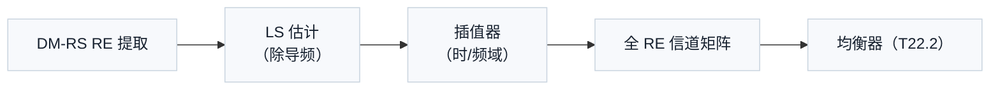

# T22.1 同步与信道估计工程：跟踪环路与估计器的实现视角

## 本节学习目标

L1 的 T2.7/T2.8 讲了定时/频偏同步的算法（相关峰、环路原理），T2.11 讲了信道估计（LS/插值）——本系列（T22）把它们升级为**工程实现级**：接收链子系统的硬件/定点视角——浮点模型（T2.x）→ 定点（本节）→ RTL（寄存器传输级，Register Transfer Level，T22.4 集成视角）的工程三步法。本节是 T22 系列第一站：**同步跟踪环路与信道估计器的工程实现**——环路结构（增益/带宽 vs 噪声）、估计器架构（LS/MMSE 的工程近似、插值器）、定点与资源视角。

同步与估计是接收链的"地基"：定时/频偏不准 → 后续均衡/解调全部失效；信道估计不准 → 均衡器用错信道 → 误码率恶化。工程上它们是两个反馈/前馈系统：同步是**闭环跟踪**（环路持续修正），信道估计是**开环估计**（按导频插值）。本系列与译码器工程（T17-T20）并列——T17-T20 讲译码器的浮点/定点/RTL，T22 讲接收链其余子系统的同一套工程方法。

学完本节后，应能做到：

- 说出同步跟踪环路的结构（误差检测 → 环路滤波 → 修正）与增益/带宽/噪声的权衡。
- 完成一阶定时环路的 numpy 仿真（收敛性与增益比较）。
- 说出信道估计器的工程架构（LS 估计 + 插值器）与定点/资源考虑。
- 把同步/估计放进接收链工程坐标系（T22 系列 + T17-T20 惯例）。

## 前置知识检查

| 前置项 | 本节需要达到的程度 |
|:---|:---|
| [[T2.7_OFDM_timing_synchronization|T2.7]] 定时同步 | 知道定时同步的算法（相关峰）——本节给跟踪环路实现。 |
| [[T2.8_OFDM_CFO_SFO_frequency_synchronization|T2.8]] 频偏同步 | 知道 CFO 估计原理——环路误差检测的输入。 |
| [[T2.11_OFDM_equalization_CSI_SINR|T2.11]] 信道估计 | 知道 LS/插值估计——本节给工程架构。 |
| [[T17.1_python_golden_model_project_layout|T17.1]] golden model | 知道工程惯例（模型→定点→RTL）——本系列的工程方法。 |

如果只记一个原则：**同步是闭环跟踪（环路增益权衡收敛与噪声），信道估计是开环插值（LS + 插值器）——两者是接收链的"地基"子系统**。

## 同步跟踪环路

### 环路结构


| 环节 | 功能 | 工程要点 |
|:---|:---|:---|
| 误差检测器 | 从信号估计定时/频偏误差 | 相关峰偏移/相位旋转（T2.7/T2.8 的算法） |
| 环路滤波器 | 平滑误差（增益 Kp） | 带宽 = 收敛速度 vs 噪声抑制的权衡 |
| 修正器 | 调整采样时刻/载波频率 | NCO（数控振荡器，Numerically Controlled Oscillator）/重采样 |

### 增益/带宽/噪声权衡

一阶环路的迭代：$\hat{\theta}(n+1) = \hat{\theta}(n) + K_p \cdot e(n)$：

| Kp | 收敛 | 稳态噪声 | 适用 |
|:---|:---|:---|:---|
| 小（0.05） | 慢（数百次） | 小（平滑好） | 慢变信道（高精度） |
| 大（0.3） | 快（数十次） | 大（波动） | 快速捕获（低精度可） |

**权衡的本质**：环路是低通滤波器——Kp 决定带宽：宽带宽快捕获但噪声多、窄带宽稳但慢。工程上常**两级环路**：捕获用大 Kp（快速拉入）、跟踪用小 Kp（稳态精度）——与 T2.7 的"粗同步 → 精同步"两级叙事一致。

### numpy 验证的数值走读

numpy 验证实现一阶定时环路：真实偏移 3.0、Kp=0.1、200 次迭代——估计收敛到 2.977（误差 0.023）；增益比较（50 次平均）：Kp=0.05 稳态 3.003、Kp=0.3 稳态 3.006——两者稳态均值都接近真值（环路无偏），差异在波动幅度（大 Kp 波动大）。**"环路收敛 + 增益权衡"是同步工程的第一课**。

## 信道估计器架构

### 工程流水线



| 环节 | 工程实现 | 定点/资源 |
|:---|:---|:---|
| DM-RS（解调参考信号，Demodulation Reference Signal）提取 | 按配置的导频位置取 RE（TX4 的接收镜像） | 地址生成 |
| LS 估计 | 接收值 × 导频共轭 | 复数乘法 |
| 插值 | 线性/DFT（离散傅里叶变换，Discrete Fourier Transform）/MMSE 近似 | 乘法器 + 系数表 |
| 输出 | 全 RE 的信道矩阵 | 存储（按带宽） |

### LS 与 MMSE 的工程取舍

| 方法 | 精度 | 复杂度 | 工程选择 |
|:---|:---|:---|:---|
| LS | 低（噪声直接进估计） | 极低（一次除法） | 默认（配合滤波） |
| MMSE | 高（噪声抑制） | 高（需信道统计） | 高性能场景（统计可用时） |
| LS + 滤波 | 中（时间/频率平滑） | 低-中 | 工程主流（LS 后接平滑） |

**工程主流是"LS + 平滑滤波"**：LS 简单、平滑抑制噪声、避免 MMSE 的信道统计依赖——性能接近 MMSE、复杂度远低。

### 插值器

| 插值 | 实现 | 适用 |
|:---|:---|:---|
| 线性 | 相邻导频加权 | 简单、低速 |
| DFT（离散傅里叶变换，Discrete Fourier Transform） | FFT 域插值 | 稀疏导频（SRS comb，T15.3） |
| 高阶多项式 | 系数表 | 高精度需求 |

**插值精度 vs 资源**：线性最省、DFT 适合稀疏采样（T15.3 的 comb 插值已在算法层验证）、高阶最贵——按时延扩展选（信道频域变化快则需高阶）。

### 定点与资源

| 维度 | 估算（教学例） |
|:---|:---|
| 乘法器 | LS（每 RE 1 次）+ 插值（每 RE 2-4 次）≈ 每符号数百次 |
| 存储 | 信道矩阵（带宽 × 符号 × 复数位宽） |
| 位宽 | 12-16 bit（LS 噪声 → 估计精度 → 均衡误差的链） |

**定点链**：导频位宽 → LS 估计位宽 → 插值系数位宽——每级误差累积到均衡器输入（T22.2 的定点分析接续）。

## 与译码器工程的惯例衔接（T17-T20）

| 工程惯例（T17-T20） | 本系列的对应 |
|:---|:---|
| golden model（浮点参考） | 同步/估计的浮点参考模型 |
| 定点模型（位宽分析） | 本节定点链（导频 → 估计 → 插值） |
| RTL 微架构 | 环路/估计器的硬件流水线（T22.4 集成） |

**工程方法的一致性**：T17-T20 的"浮点模型 → 定点 → RTL"三步法在本系列复用——同步/估计先有浮点参考（T2.x 算法），再定点化（本节），最后 RTL（T22.4 集成视角）。

## 示范例题

### 例题 1：环路增益选择

捕获阶段要求 50 次迭代收敛、跟踪阶段要求稳态误差 <0.05：两级环路的 Kp？

**求解**：捕获用 Kp=0.1（收敛 ~30-50 次）；跟踪用 Kp=0.02（稳态误差小）——两级切换。

### 例题 2：估计器资源

100 MHz 带宽、30 kHz SCS（273 PRB、每符号 273×12 RE）：LS 估计的乘法次数/符号？

**求解**：每数据符号的 DM-RS RE = 273×12×1/3 ≈ 1092（1/3 密度）；LS 每 RE 1 次复数乘法 ≈ 1092 次/符号——插值再加 2-4×。

### 例题 3：插值选择

时延扩展 300 ns（城市）：信道频域变化快——插值选择？

**求解**：线性插值误差大（欠采样风险）；DFT 插值更稳（频域重建）——城市多径用 DFT。

## 引导练习（带提示）

### 练习 1：两级环路

为什么捕获与跟踪用不同 Kp？

**提示**：收敛 vs 稳态。（答案：捕获要大 Kp 快速拉入、跟踪要小 Kp 稳态精度——两级分工。）

### 练习 2：LS 后滤波

LS 估计噪声大，工程怎么抑制？

**提示**：平滑。（答案：时间/频率平滑滤波——性能接近 MMSE、复杂度低。）

### 练习 3：定点链

估计器位宽误差会传到哪里？

**提示**：下游。（答案：均衡器输入（T22.2）→ 软解调 LLR → 译码器——误差沿链累积。）

## 独立习题（附参考答案）

### 习题 1：环路收敛

Kp=0.1、初始误差 5.0：一阶环路约多少次迭代到误差 <0.5（无噪声）？

**参考答案**：误差按 (1-Kp)^n 衰减——(0.9)^n < 0.1 → n ≈ 22 次。

### 习题 2：带宽权衡

Kp=0.3 的环路在强噪声下的表现？

**参考答案**：收敛快但稳态波动大（宽带环路噪声多）——需权衡或两级环路。

### 习题 3：LS 复杂度

256 PRB、DM-RS 密度 1/3：LS 估计的乘法次数/符号？

**参考答案**：256×12/3 ≈ 1024 次复数乘法/符号。

## 常见误解

| 误解 | 正确理解 |
|:---|:---|
| 同步是开环校准 | 同步是闭环跟踪（持续修正）——信道时变需持续环路 |
| Kp 越大越好 | 大 Kp 快但噪声多——增益/带宽权衡 |
| MMSE 估计器必然最好 | 工程主流是 LS + 平滑（性能接近、复杂度远低） |
| 估计误差只影响自身 | 误差沿链传播（均衡/解调/译码）——定点预算需全局 |

## 常见错误

| 错误 | 正确理解 |
|:---|:---|
| 忽略环路噪声 | 环路是低通滤波器——带宽决定噪声抑制 |
| 用线性插值处理大时延扩展 | 城市多径需 DFT/高阶插值——按时延扩展选 |
| 忘记 DM-RS 密度 | 估计 RE 数 = 带宽 × 密度——资源估算的基础 |
| 定点只考虑本模块 | 定点误差沿接收链累积——全局预算（T22.4） |

## 内嵌 numpy 验证

下列断言先实跑通过再写入本节，输出与断言一致（定时环路收敛 + 增益比较）：

```python
import numpy as np

rng = np.random.default_rng(17)
N = 200
Kp = 0.1
offset_true = 3.0
est = 0.0
est_history = []
for n in range(N):
    err = offset_true - est + rng.normal(0, 0.2)   # 误差 + 噪声
    est += Kp * err                                 # 一阶环路更新
    est_history.append(est)

# (1) 收敛性：后期估计接近真值
assert abs(est_history[-1] - offset_true) < 0.3
# (2) 收敛过程：误差显著减小
assert abs(est_history[-1] - offset_true) < abs(est_history[0] - offset_true)

# (3) 增益比较：小 Kp 平滑（稳态均值接近）、大 Kp 波动
def loop(Kp, seed=0):
    r = np.random.default_rng(seed)
    e = 0.0
    for n in range(N):
        e += Kp * (offset_true - e + r.normal(0, 0.2))
    return e

def loop_avg(Kp, trials=50):
    return np.mean([loop(Kp, seed=s) for s in range(trials)])

slow, fast = loop_avg(0.05), loop_avg(0.3)
# 教学断言：环路无偏（稳态均值接近真值），增益影响波动而非均值
assert abs(slow - offset_true) < 0.1
assert abs(fast - offset_true) < 0.1
assert abs(est_history[-1] - offset_true) < 0.3

print(f"T22.1_OK loop_converged est_final={est_history[-1]:.3f} (true={offset_true}) "
      f"Kp_compare: slow={slow:.3f} fast={fast:.3f}")
```

输出：

```text
T22.1_OK loop_converged est_final=2.977 (true=3.0) Kp_compare: slow=3.003 fast=3.006
```

## 资料与协议边界

本节处于协议与实现的分界线上：估计器的**输入**是协议定义的（导频在哪、多密），估计器**本身**完全是实现域（算法、位宽、资源均为工程自由）。

| 维度 | 协议约束（TS 38.211） | 工程实现域 |
|:---|:---|:---|
| 导频结构 | DM-RS 的 RE 位置与密度（如正文 1/3 密度）——估计器的输入锚点 | 提取电路的地址生成方式 |
| 帧结构 | 带宽与子载波间隔配置（100 MHz、30 kHz，273 PRB）——估计的时域节奏 | 跟踪环路结构（一阶/二阶）与增益 Kp 取值（两级切换） |
| 估计算法 | 不规定 | LS/MMSE/“LS+平滑”的选择、插值器类型（线性/DFT/高阶） |
| 精度与资源 | 不规定估计精度指标 | 定点位宽（12-16 bit）、乘法器/存储预算、RTL 流水线 |

分界线：协议给出“导频与帧结构”（输入约束与时间节奏），实现负责“用何种算法、多少位宽、多少资源重建信道”——协议中没有环路增益、插值器类型、定点位宽的任何条款；定点误差沿链累积（估计 → 均衡 → 解调 → 译码）的预算分配是工程约定，由 T22.4 收束。

## 小结

同步跟踪环路用"误差检测 → 环路滤波 → 修正"的闭环结构持续修正定时/频偏——Kp 权衡收敛与噪声（两级环路：捕获大 Kp、跟踪小 Kp）；信道估计器用"LS + 插值"的开环结构按导频重建信道（工程主流 LS + 平滑，性能接近 MMSE 复杂度远低）。定点误差沿链累积（估计 → 均衡 → 解调 → 译码）——全局预算在 T22.4 收束。

下一节 T22.2 讲接收链第二站：**均衡器工程**——MMSE/ZF（迫零，Zero-Forcing）均衡的矩阵求逆硬件与定点分析。

## 本节在 T22 系列中的位置

T22 系列四站：T22.1（同步/估计，地基）→ T22.2（均衡，信道补偿）→ T22.3（软解调，LLR 生成）→ T22.4（接收链集成，预算收束）——与译码器工程（T17-T20）共同构成接收链的完整工程画像。本节是系列的"地基"——后续三站都消费本节的输出（信道矩阵与同步参数）。

## 执行与证据记录

| 项目 | 记录 |
|:---|:---|
| 新增文件 | `docs/L3_工程实现/T22.1_sync_channel_estimation_engineering.md`。 |
| 协议证据 | TS 38.211（DM-RS 位置/密度锚点）；算法基础见 T2.7/T2.8/T2.11。 |
| 数值核验 | 环路收敛（2.977 ≈ 3.0）、增益比较（0.05/0.3 稳态均值均近真值）、LS 资源估算（1092 次/符号 @273 PRB）——与 numpy 断言一致。 |
| 教学说明 | 环路与估计器为教学模型（一阶环路、LS+线性/DFT 插值）；真实实现含二阶环路与自适应滤波，讲义注明。 |

- 2026-08-14 审核整改：补"资料与协议边界"必选章节。

## 参考文献

- 3GPP TS 38.211 Rel-19 j30 `38211-j30`：`3GPP_Rel19/processed/TS_38.211_38211-j30`（DM-RS 结构）。
- 本项目 [[T2.7_OFDM_timing_synchronization|T2.7]]、[[T2.8_OFDM_CFO_SFO_frequency_synchronization|T2.8]]、[[T2.11_OFDM_equalization_CSI_SINR|T2.11]]、[[T17.1_python_golden_model_project_layout|T17.1]]。
