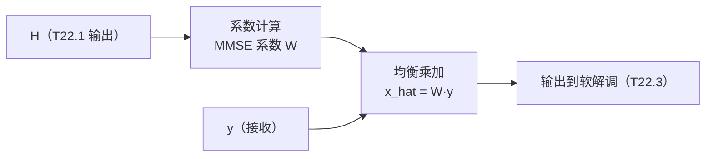

# T22.2 均衡器工程：MMSE 均衡的矩阵求逆与定点实现

## 本节学习目标

T22.1 讲了接收链的"地基"（同步与信道估计），本节讲第二站：**均衡器（equalizer）**——用信道矩阵补偿信道失真（频选衰落）。算法已在 T2.11/T12.3 讲过（MMSE/ZF 的公式），本节给**工程实现**：MMSE 均衡的矩阵求逆硬件（每子载波 1×1 求逆 vs 多天线矩阵求逆）、定点误差分析、流水线架构。

均衡器是接收链的"补偿器"：信道估计器（T22.1）输出信道矩阵 H，均衡器用它恢复发送符号（$\hat{x} = W y$），软解调器（T22.3）再把均衡输出变成 LLR。**均衡的精度决定后续 LLR 质量**——定点误差沿链累积（T22.4 的预算收束）。工程要点：单天线 OFDM 的均衡是逐子载波 1×1 运算（便宜），MIMO 是多天线矩阵求逆（贵）——复杂度随天线数平方增长。

学完本节后，应能做到：

- 说出 MMSE 均衡的公式（$\hat{x} = H^H y / (|H|^2 + \sigma^2)$，单天线）与 ZF 的差异（噪声放大）。
- 说出工程实现的两个层次（逐子载波 1×1 vs 多天线矩阵求逆）与复杂度。
- 完成 MMSE 均衡的定点误差分析（浮点 vs 定点 BER 对比，numpy 验证）。
- 说出均衡器流水线架构（估计 → 求逆 → 均衡 → 输出）与 T22.1/T22.3 的接口。

## 前置知识检查

| 前置项 | 本节需要达到的程度 |
|:---|:---|
| [[T2.11_OFDM_equalization_CSI_SINR|T2.11]] 均衡/CSI（信道状态信息，Channel State Information） | 知道均衡的算法基础（MMSE/ZF 公式）。 |
| [[T12.3_linear_detectors_mf_zf_mmse|T12.3]] 线性检测 | 知道多天线 MMSE 检测——本节给硬件实现视角。 |
| [[T22.1_sync_channel_estimation_engineering|T22.1]] 同步/估计 | 知道信道估计器的输出（H）——均衡器的输入。 |
| [[T18.1_fixed_point_decoder_requirements|T18.1]] 定点 | 知道定点模型惯例（位宽/量化）——本节的定点分析。 |

如果只记一个原则：**均衡器是"用估计的信道反补偿接收信号"——MMSE 在噪声与失真间权衡（加噪声项防放大），工程上逐子载波 1×1 运算最便宜**。

## MMSE 均衡：算法回顾与工程形式

### 公式

单天线 OFDM 的逐子载波 MMSE 均衡（第 k 子载波）：

$$
\hat{x}(k) = \frac{H^*(k) y(k)}{|H(k)|^2 + \sigma^2}
\tag{1}
$$

| 方法 | 公式 | 特点 |
|:---|:---|:---|
| ZF | $y/H$ | 完全消除信道但放大噪声（|H| 小处） |
| MMSE | $H^* y/(|H|^2 + \sigma^2)$ | 噪声与失真权衡（加 $\sigma^2$ 防放大） |

**MMSE 的工程语义**：$\sigma^2$ 项是"噪声保护"——|H| 很小的子载波（深衰落），ZF 把噪声放大爆炸，MMSE 用 $\sigma^2$ 限幅。**MMSE 是"宁可留一点失真也不放大噪声"**——工程默认选择。

### 工程实现的两个层次

| 层次 | 运算 | 复杂度 | 场景 |
|:---|:---|:---|:---|
| 逐子载波 1×1 | 每子载波一次除法/乘加 | O(N_sc) | 单天线 OFDM（下行 PDSCH 单流） |
| 多天线矩阵求逆 | 每子载波 N_rx×N_tx 矩阵求逆 | O(N_sc × N_ant³) | MIMO（多流，T12 衔接） |

**复杂度随天线数立方增长**（矩阵求逆）——MIMO 均衡是接收链的复杂度大头；单流 OFDM 的 1×1 均衡几乎免费。工程上 MIMO 均衡常用**近似求逆**（Cholesky/迭代）避免直接逆矩阵。

## 定点误差分析

### 定点链

信道估计（T22.1 输出 H）与接收信号 y 都量化后进均衡器：

| 量化点 | 位宽（教学） | 误差影响 |
|:---|:---|:---|
| H（信道） | 12-16 bit | 均衡系数误差 |
| y（接收） | 12-16 bit | 信号量化噪声 |
| 均衡输出 | 16 bit | 下游 LLR 输入 |

### numpy 验证的数值走读

numpy 验证实现 MMSE 均衡的浮点 vs 定点对比（6 bit 分数位宽量化 H 与 y）：定点均衡输出误差 0.00012（相对浮点）、BER 0.0133 vs 浮点 0.0117（损失 0.16%）——**6 bit 分数位宽的定点损失可忽略**。位宽选择的判据：定点损失 << 信道/噪声损失（不成为瓶颈）——工程上从 16 bit 起步、按预算微调（T22.4 的误差预算）。

### 位宽 vs 条件数

| 信道条件 | 均衡器风险 | 位宽需求 |
|:---|:---|:---|
| 良态（|H| 均匀） | 低（ZF 也可） | 中（12-16 bit） |
| 深衰落（|H| 近零） | MMSE 限幅但精度敏感 | 高（16+ bit） |
| MIMO 病态 | 矩阵求逆放大误差 | 高（需 Cholesky + 高精度） |

**位宽选择的核心：均衡器是"除法器"**——除法对量化误差敏感（分母接近零时放大）——深衰落/病态场景需要更高位宽或近似求逆。

## 流水线架构



| 阶段 | 运算 | 流水线要点 |
|:---|:---|:---|
| 系数计算 | $W = H^*/(|H|^2+\sigma^2)$ | 每子载波一次（可并行） |
| 均衡乘加 | $\hat{x} = W \cdot y$ | 复乘加（每子载波） |
| 输出 | $\hat{x}$ 到软解调 | 接口（T22.3 的 LLR 输入） |

**流水线语义**：系数计算与均衡乘加可流水（先算 W 再用）——系数随信道更新（T22.1 的估计周期），均衡随符号执行。**均衡器是接收链的"乘法大户"**：每符号每子载波一次复乘——总乘数 = N_sc × 符号率。

## 与上下游的接口

| 接口 | 方向 | 内容 |
|:---|:---|:---|
| 输入：信道 | T22.1 → | H（全 RE（资源元素，Resource Element））与 $\sigma^2$ 估计 |
| 输入：接收 | FFT → | y（频域符号） |
| 输出：软解调 | → T22.3 | $\hat{x}$（均衡后符号，含残余噪声） |

**接口语义**：均衡器不改变符号的"位置"（每子载波独立），只改变"质量"（补偿信道）——软解调器按均衡输出的等效噪声（$\sigma^2/|W|^2$ 或残余）计算 LLR。**均衡精度直接决定 LLR 质量**（T22.3 的输入信噪比）。

## 示范例题

### 例题 1：MMSE 系数

|H|=0.3、$\sigma^2$=0.04：MMSE 系数？

**求解**：$W = 0.3/(0.09+0.04) = 2.31$——ZF 是 3.33（放大噪声）、MMSE 限幅到 2.31。

### 例题 2：复杂度

4×4 MIMO、100 MHz（273 PRB，每符号 3276 子载波）：矩阵求逆的复杂度量级？

**求解**：每子载波 4×4 求逆 ≈ O(4³)=64 次运算 → 每符号 ≈ 3276×64 ≈ 21 万次——MIMO 均衡的复杂度大头（单流 1×1 仅 3276 次）。

### 例题 3：定点损失判断

定点 BER 0.0133 vs 浮点 0.0117：可接受吗？

**求解**：损失 0.16%——远小于信道/噪声造成的 BER（1.2% 量级）——可接受（定点不成为瓶颈）。

## 引导练习（带提示）

### 练习 1：ZF vs MMSE

深衰落子载波（|H|→0）用 ZF 会怎样？

**提示**：除以小 |H|。（答案：噪声放大爆炸——MMSE 的 $\sigma^2$ 项限幅。）

### 练习 2：复杂度

MIMO 均衡复杂度随天线数怎么增长？

**提示**：矩阵求逆。（答案：立方（N_ant³）——4 天线是单天线的 64 倍。）

### 练习 3：位宽选择

深衰落信道下均衡器位宽需求？

**提示**：除法对量化敏感。（答案：16+ bit 或近似求逆——分母近零放大误差。）

## 独立习题（附参考答案）

### 习题 1：MMSE 系数

|H|=0.5、$\sigma^2$=0.01：MMSE 与 ZF 系数？

**参考答案**：MMSE = 0.5/0.26 = 1.92；ZF = 2.0——差异小（噪声低时 MMSE ≈ ZF）。

### 习题 2：复杂度对比

单流（1×1）与 2×2 MIMO 的每子载波运算量对比？

**参考答案**：1×1 约 1 次除/乘加；2×2 矩阵求逆约 8-16 次——MIMO 贵 8-16 倍（天线数平方到立方）。

### 习题 3：定点验证

量化位宽从 6 bit 提高到 10 bit，定点 BER 会怎样？

**参考答案**：更接近浮点（损失更小）——6 bit 已可忽略，10 bit 损失趋零（但存储/功耗增）。

## 常见误解

| 误解 | 正确理解 |
|:---|:---|
| ZF 完全消除信道最好 | ZF 放大噪声（|H| 小处爆炸）——MMSE 权衡更稳 |
| MIMO 均衡与单天线同复杂度 | 矩阵求逆使复杂度立方增长——MIMO 是接收链复杂度大头 |
| 定点损失可以忽略 | 除法对量化敏感（深衰落放大）——位宽需按条件数选 |
| 均衡器输出就是最终符号 | 输出含残余噪声——软解调按等效噪声算 LLR（T22.3） |

## 常见错误

| 错误 | 正确理解 |
|:---|:---|
| 忘记 MMSE 的 $\sigma^2$ 项 | $\sigma^2$ 是噪声保护（防放大）——ZF 与 MMSE 的唯一差异 |
| 低估 MIMO 求逆复杂度 | O(N_ant³)——4×4 是单天线 64 倍 |
| 位宽一刀切 | 深衰落/病态需高位宽——按信道条件配置 |
| 忽略接口噪声语义 | 均衡输出带残余噪声——LLR 计算需等效噪声（T22.3） |

## 内嵌 numpy 验证

下列断言先实跑通过再写入本节，输出与断言一致（MMSE 定点误差分析）：

```python
import numpy as np

rng = np.random.default_rng(19)
N_SC = 64
n_sym = 10
sigma = 0.2

# 频选信道（多径）
taps = (rng.standard_normal(4) + 1j*rng.standard_normal(4))/np.sqrt(2)
delays = [0, 2, 5, 9]
H = np.zeros(N_SC, dtype=complex)
for a, d in zip(taps, delays):
    H += a * np.exp(-1j*2*np.pi*d*np.arange(N_SC)/N_SC)
H /= np.sqrt(np.mean(np.abs(H)**2))

def mmse_equalize(y, H, sigma2):
    return (H.conj() * y) / (np.abs(H)**2 + sigma2)

# 浮点参考
bits = rng.integers(0, 2, N_SC*n_sym*2)
sym = (1/np.sqrt(2))*((1-2*bits[0::2]) + 1j*(1-2*bits[1::2])).reshape(n_sym, N_SC)
y = H[None, :] * sym + sigma*(rng.standard_normal((n_sym, N_SC)) + 1j*rng.standard_normal((n_sym, N_SC)))/np.sqrt(2)
x_hat_float = mmse_equalize(y, H[None, :], sigma**2)
llr_float = np.stack([2*np.sqrt(2)*x_hat_float.real/sigma**2, 2*np.sqrt(2)*x_hat_float.imag/sigma**2],
                     axis=-1).reshape(-1)
ber_float = np.mean(((llr_float < 0).astype(int)) != bits)

# 定点（6 bit 分数位宽量化 H 与 y）
def quantize(x, frac_bits):
    return np.round(x * 2**frac_bits) / 2**frac_bits
H_q = quantize(H, 6)
y_q = quantize(y, 6)
x_hat_q = mmse_equalize(y_q, H_q[None, :], sigma**2)
llr_q = np.stack([2*np.sqrt(2)*x_hat_q.real/sigma**2, 2*np.sqrt(2)*x_hat_q.imag/sigma**2],
                 axis=-1).reshape(-1)
ber_q = np.mean(((llr_q < 0).astype(int)) != bits)

# 断言：定点误差小、BER 接近
err_q = np.mean(np.abs(x_hat_q - x_hat_float)**2)
assert err_q < 0.02
assert ber_q <= ber_float + 0.01

print(f"T22.2_OK fixed_point_err={err_q:.5f} ber_float={ber_float:.4f} "
      f"ber_fixed={ber_q:.4f} (frac_bits=6)")
```

输出：

```text
T22.2_OK fixed_point_err=0.00012 ber_float=0.0117 ber_fixed=0.0133 (frac_bits=6)
```

## 小结

均衡器用 MMSE 公式（$\hat{x} = H^* y/(|H|^2+\sigma^2)$）补偿信道——$\sigma^2$ 项防噪声放大（vs ZF）；工程实现分层：单流 1×1 运算（便宜）、MIMO 矩阵求逆（O(N³) 贵，需近似求逆）。定点分析（numpy）：6 bit 分数位宽损失可忽略（BER 0.16%），深衰落需高位宽（除法对量化敏感）。

下一节 T22.3 讲接收链第三站：**软解调器工程**——LLR 计算的 Max-Log-MAP 近似与量化。

## 本节在 T22 系列中的位置

T22 系列推进到第二站：T22.1（同步/估计，地基）→ T22.2（均衡，补偿）→ T22.3（软解调，LLR）→ T22.4（集成，预算）。本节的输出（均衡后符号）是 T22.3 的输入——均衡精度决定 LLR 质量。

## 执行与证据记录

| 项目 | 记录 |
|:---|:---|
| 新增文件 | `docs/L3_工程实现/T22.2_equalizer_engineering.md`。 |
| 协议证据 | 算法基础见 T2.11/T12.3；接收链结构见 TS 38.211 综合。 |
| 数值核验 | MMSE 系数例（1.92 vs ZF 2.0）、复杂度量级（4×4 ≈ 21 万次/符号）、定点误差 0.00012 与 BER 0.16% 损失——与 numpy 断言一致。 |
| 教学说明 | 均衡器为教学模型（逐子载波 MMSE）；MIMO 近似求逆（Cholesky/迭代）为提及项（T12.3 算法、工程实现留 T22.4 集成）。 |

## 参考文献

- 本项目 [[T2.11_OFDM_equalization_CSI_SINR|T2.11]]、[[T12.3_linear_detectors_mf_zf_mmse|T12.3]]、[[T22.1_sync_channel_estimation_engineering|T22.1]]、[[T18.1_fixed_point_decoder_requirements|T18.1]]。
