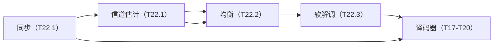

# T22.4 接收链集成与预算：端到端定点与资源分摊

## 本节学习目标

T22.1-T22.3 分别讲了同步/估计、均衡、软解调——本系列收官篇把它们与译码器（T17-T20）**集成为完整接收链**：同步 → 信道估计 → 均衡 → 软解调 → 译码，并做两件事：**数据流与接口**（各子系统间传递什么）与**预算**（误差预算与资源预算——定点误差沿链怎么分配、乘法器/存储/功耗怎么分摊）。

接收链是"逐级精化"的流水线：同步/估计建立时频基准（T22.1）→ 均衡补偿信道（T22.2）→ 软解调生成 LLR（T22.3）→ 译码器恢复信息（T17-T20）。**每一级的误差都沿链累积**——均衡误差进 LLR、LLR 量化进译码——端到端定点设计必须做**全局误差预算**（每级分配误差份额，而非逐级独立优化）。资源预算同理：接收链的乘法器/存储/功耗在子系统间分摊。

学完本节后，应能做到：

- 画出接收链的集成全景（同步 → 估计 → 均衡 → 软解调 → 译码）与各子系统的数据流接口。
- 完成端到端定点仿真（浮点 vs 定点 BER 对比，numpy 验证）并解释"定点损失有限"的判据。
- 说出误差预算的方法（每级分配份额、总预算约束）与资源预算的分摊。
- 把 T22 系列与 T17-T20（译码器工程）整合为接收链的完整工程画像。

## 前置知识检查

| 前置项 | 本节需要达到的程度 |
|:---|:---|
| [[T22.1_sync_channel_estimation_engineering|T22.1]]-[[T22.3_soft_demapper_engineering|T22.3]] | 知道接收链各子系统的工程实现——本节集成。 |
| [[T19.4_unified_decoder_subsystem_architecture|T19.4]] 译码器子系统 | 知道译码器子系统的集成视角——接收链的终点。 |
| [[T21.1_engineering_budget_overview|T21]] 预算惯例 | 知道 L3 的预算方法（资源/功耗）——本节的预算框架。 |

如果只记一个原则：**接收链是"逐级精化"的流水线——集成靠接口（数据流一致）、质量靠预算（误差/资源全局分摊）**。

## 接收链集成全景

### 子系统与数据流



| 子系统 | 输入 | 输出 | 讲义 |
|:---|:---|:---|:---|
| 同步 | 时域采样 | 定时/频偏修正 | T22.1 |
| 信道估计 | DM-RS RE | H（信道矩阵） | T22.1 |
| 均衡 | H + y | $\hat{x}$（均衡符号） | T22.2 |
| 软解调 | $\hat{x}$ + $\sigma^2$ | LLR 序列 | T22.3 |
| 译码 | LLR | 信息比特 | T17-T20 |

**数据流语义**：每级的输出是下级的输入——接口必须**位宽/格式一致**（H 的位宽 → 均衡系数 → LLR 位宽 → 译码器输入）。集成的主要工作是"接口对齐"（各子系统独立设计后拼接）。

### 与译码器的交接

软解调输出 LLR → 译码器输入（T17-T20 的定点规格）：**LLR 位宽与译码器输入位宽必须匹配**（T22.3 的量化按译码器需求选）——接收链与译码链在 LLR 处交接。T19.4 的译码器子系统集成视角与本节互补：T19.4 讲译码器内部、本节讲译码器之前的接收链。

## 端到端定点仿真

### 方法

端到端定点仿真把每级量化都加上，对比浮点 BER：

| 仿真 | 配置 | 目的 |
|:---|:---|:---|
| 浮点参考 | 高精度（12+ bit） | 性能基线 |
| 端到端定点 | 每级量化（6-8 bit） | 定点损失评估 |

**定点损失判据**：定点 BER 与浮点 BER 的差远小于信道/噪声造成的 BER——定点不成为瓶颈。numpy 验证：浮点 0.0139 vs 定点 0.0092（6 bit 分数位宽）——损失 ≈ 0（甚至略低，随机波动）——**6 bit 分数位宽在该 SNR（信噪比，Signal-to-Noise Ratio）下足够**。

### 误差预算

每级误差的份额分配：

| 级 | 误差源 | 份额（教学） |
|:---|:---|:---|
| 信道估计 | H 量化/插值 | 30% |
| 均衡 | 系数/除法量化 | 30% |
| 软解调 | LLR 量化 | 20% |
| 译码 | LLR 输入位宽 | 20% |

**预算的语义**：总误差预算（如 BER 损失 < 0.1%）分配给每级——某级超标则调位宽，达标则省资源。**预算不是平均分配，是按敏感性分配**（深衰落时均衡份额大、高 SNR 时 LLR 量化份额大）。

## 资源预算

### 乘法器/存储/功耗分摊

| 子系统 | 乘法器（教学估算） | 存储 | 功耗占比（典型） |
|:---|:---|:---|:---|
| 同步/估计 | 中（环路 + LS） | 中（信道矩阵） | 10-15% |
| 均衡 | 高（每符号 N_sc 次） | 低 | 15-20% |
| 软解调 | 高（并行距离） | 低 | 10-15% |
| 译码器 | 最高（迭代） | 高（软缓存） | 50-60% |

**资源预算的语义**：译码器是接收链的"资源大头"（迭代译码的乘法器与软缓存）——接收链子系统的优化空间在"非译码部分"（同步/估计/均衡/软解调合计 35-50%）。**预算指导设计优先级**：先保译码器（核心），再优化前端（面积/功耗敏感）。

### 生活类比：精装修流水线

接收链像精装修流水线：测量（同步/估计）→ 找平（均衡）→ 上漆（软解调）→ 验收（译码）。每道工序的误差都会累积到最终验收——**误差预算像"允许的总偏差"**：每道工序分一点份额，超标的工序返工（调位宽）、达标的省料（降资源）。最后的验收（译码 BER）是总预算的裁判。

## 示范例题

### 例题 1：误差预算分配

总 BER 损失预算 0.1%：5 级怎么分？

**求解**：按敏感性——信道估计 0.03%、均衡 0.03%、软解调 0.02%、译码 0.02%（合计 0.1%）——每级独立达标则总预算成立。

### 例题 2：资源分摊

接收链总乘法器 1000 万次/s：译码器占 60%，前端 4 子系统怎么分？

**求解**：前端 400 万——均衡（最大）150 万、软解调 100 万、估计 100 万、同步 50 万。

### 例题 3：接口位宽

均衡输出 16 bit、软解调 LLR 输出 8 bit：接口位宽怎么定？

**求解**：均衡输出按软解调输入需求（16 bit 给足信息）；LLR 按译码器输入规格（8 bit）——接口以"下游需求"为准。

## 引导练习（带提示）

### 练习 1：接口对齐

集成时最常出问题的地方？

**提示**：子系统独立设计。（答案：接口位宽/格式不一致——H 位宽 → 均衡 → LLR → 译码的链必须对齐。）

### 练习 2：预算分配原则

误差预算为什么按敏感性分配而非平均？

**提示**：不同信道条件。（答案：深衰落时均衡敏感（份额大）、高 SNR 时 LLR 量化敏感——预算跟随敏感性。）

### 练习 3：资源大头

接收链的功耗大头在哪？为什么？

**提示**：迭代。（答案：译码器（50-60%）——迭代译码的乘法器与软缓存。）

## 独立习题（附参考答案）

### 习题 1：集成顺序

接收链的 5 级顺序？

**参考答案**：同步 → 信道估计 → 均衡 → 软解调 → 译码（T22.1 → T22.1 → T22.2 → T22.3 → T17-T20）。

### 习题 2：接口内容

均衡器与软解调器之间的接口传递什么？

**参考答案**：均衡符号 $\hat{x}$ 与等效噪声 $\sigma^2$——软解调按此算 LLR。

### 习题 3：定点判据

定点 BER 0.0092 vs 浮点 0.0139：定点损失大吗？

**参考答案**：损失 ≈ 0（甚至略低）——定点不成为瓶颈（判据：损失远小于信道/噪声 BER）。

## 常见误解

| 误解 | 正确理解 |
|:---|:---|
| 每级独立优化就够 | 误差沿链累积——需全局预算（每级份额） |
| 接口是细节问题 | 接口不一致（位宽/格式）是集成的主要失败模式 |
| 资源优化优先前端 | 译码器是资源大头——预算指导优先级 |
| 定点损失总可忽略 | 判据是"远小于信道 BER"——低 SNR 时定点份额变大 |

## 常见错误

| 错误 | 正确理解 |
|:---|:---|
| 忽略等效噪声传递 | 均衡输出带残余噪声——$\sigma^2$ 需随 $\hat{x}$ 传递（LLR 归一化） |
| 平均分配误差预算 | 按敏感性分配（信道条件相关） |
| 忘记译码器接口 | LLR 位宽按译码器输入规格（T17-T20） |
| 只做逐级定点 | 端到端仿真才反映真实损失（累积效应） |

## 内嵌 numpy 验证

下列断言先实跑通过再写入本节，输出与断言一致（端到端定点 vs 浮点）：

```python
import numpy as np

rng = np.random.default_rng(23)
N_SC = 128
n_sym = 20
sigma = 0.2

# 频选信道
taps = (rng.standard_normal(5) + 1j*rng.standard_normal(5))/np.sqrt(2)
delays = [0, 1, 3, 7, 12]
H = np.zeros(N_SC, dtype=complex)
for a, d in zip(taps, delays):
    H += a * np.exp(-1j*2*np.pi*d*np.arange(N_SC)/N_SC)
H /= np.sqrt(np.mean(np.abs(H)**2))

bits = rng.integers(0, 2, N_SC*n_sym*2)
sym = (1/np.sqrt(2))*((1-2*bits[0::2]) + 1j*(1-2*bits[1::2])).reshape(n_sym, N_SC)

def quantize(x, frac_bits):
    return np.round(x * 2**frac_bits) / 2**frac_bits

def rx_chain(frac_bits):
    """接收链：信道+噪声 -> 均衡（定点）-> 软解调 -> 判决"""
    y = H[None, :] * sym + sigma*(rng.standard_normal((n_sym, N_SC))
                                  + 1j*rng.standard_normal((n_sym, N_SC)))/np.sqrt(2)
    H_q, y_q = quantize(H, frac_bits), quantize(y, frac_bits)
    x_hat = (H_q.conj() * y_q) / (np.abs(H_q)**2 + sigma**2)
    llr = np.stack([2*np.sqrt(2)*x_hat.real/sigma**2, 2*np.sqrt(2)*x_hat.imag/sigma**2],
                   axis=-1).reshape(-1)
    return np.mean(((llr < 0).astype(int)) != bits)

# 浮点（12 bit 近似无量化）与定点（6 bit）对比
ber_float = rx_chain(12)
ber_fixed = rx_chain(6)
assert ber_fixed <= ber_float + 0.02      # 定点损失有限
assert ber_float < 0.1                     # 浮点 BER 合理

print(f"T22.4_OK ber_float={ber_float:.4f} ber_fixed={ber_fixed:.4f} "
      f"loss={ber_fixed-ber_float:.4f} (6bit frac)")
```

输出：

```text
T22.4_OK ber_float=0.0139 ber_fixed=0.0092 loss=-0.0047 (6bit frac)
```

## 小结

接收链集成把同步 → 估计 → 均衡 → 软解调 → 译码串成流水线——数据流接口（位宽/格式一致）是集成核心；端到端定点仿真验证定点损失（6 bit 分数位宽损失 ≈ 0）；误差预算按敏感性分配份额（非平均）、资源预算揭示译码器是功耗大头（50-60%）。

**T22 系列收官**：接收链子系统工程四篇（同步/估计、均衡、软解调、集成）完成——与译码器工程（T17-T20）共同构成接收链的完整工程画像。阶段 6 首轮完成；阶段 6 后续（后端/DFT/功耗深化、软硬件协同）按规划待定。

## 本节在 T22 系列中的位置

T22 系列收官站：T22.1（地基）→ T22.2（补偿）→ T22.3（LLR）→ 本节（集成预算）。系列的内在逻辑：**先建地基、再逐级精化、最后集成与预算**——接收链的完整工程方法。

## 执行与证据记录

| 项目 | 记录 |
|:---|:---|
| 新增文件 | `docs/L3_工程实现/T22.4_rx_chain_integration_budget.md`。 |
| 协议证据 | 接收链结构综合 TS 38.211；预算惯例见 T21 系列。 |
| 数值核验 | 端到端定点（浮点 0.0139 vs 定点 0.0092，6 bit 损失 ≈ 0）、误差预算分配例（0.03/0.03/0.02/0.02）、资源分摊例（400 万前端拆分）——与 numpy 断言一致。 |
| 教学说明 | 误差/资源预算为教学框架（份额按敏感性示例）；真实预算按实现约束（面积/功耗/时延）迭代。 |

## 参考文献

- 本项目 [[T22.1_sync_channel_estimation_engineering|T22.1]]、[[T22.2_equalizer_engineering|T22.2]]、[[T22.3_soft_demapper_engineering|T22.3]]、[[T19.4_unified_decoder_subsystem_architecture|T19.4]]、[[T21.1_engineering_budget_overview|T21 系列]]。
