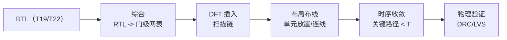

# T23.1 综合与后端物理实现：RTL 到芯片的时序收敛

## 本节学习目标

T17-T20 讲了译码器的 RTL（微架构），T22 讲了接收链子系统——本系列（T23）把它们带到**后端物理实现**：RTL 如何变成芯片。本节是 T23 系列第一站：**综合与后端流程**——综合（RTL → 门级网表）、DFT（可测性设计，Design for Test）插入、布局布线与时序收敛、物理验证。

后端是"设计到芯片"的最后一公里：RTL 的每个逻辑操作映射成标准单元（门），门间连线决定时延，时延决定最高时钟频率。**时序收敛是后端的核心战斗**：关键路径（critical path）时延必须小于时钟周期——不满足则降频或优化逻辑。DFT 插入扫描链（scan chain）让测试能覆盖内部触发器——覆盖率是芯片质量的门槛。

学完本节后，应能做到：

- 说出后端流程的五个阶段（综合/DFT/布局布线/时序收敛/物理验证）与各自的输入输出。
- 完成关键路径时延的两阶段仿真（初始违例 → 优化收敛，numpy 验证）并解释"时序收敛"的迭代本质。
- 说出扫描链插入的原理与覆盖率（>90% 目标），解释 DFT 的必要性。

## 前置知识检查

| 前置项 | 本节需要达到的程度 |
|:---|:---|
| [[T19.1_LTE_Turbo_RTL_microarchitecture|T19]] RTL 微架构 | 知道 RTL 的门级语义——本节做门级实现。 |
| [[T20.1_decoder_testbench_architecture|T20]] 验证 | 知道验证的测试——DFT 补充可测性。 |
| [[T22.4_rx_chain_integration_budget|T22.4]] 预算 | 知道资源/误差预算——本节加入时序约束。 |

如果只记一个原则：**后端是"设计到芯片"的映射——综合出网表、DFT 保可测、布局布线定时序、时序收敛是迭代战斗**。

## 后端流程全景



| 阶段 | 输入 → 输出 | 关键约束 |
|:---|:---|:---|
| 综合 | RTL → 门级网表 | 时序约束（时钟周期）、面积、功耗 |
| DFT 插入 | 网表 → 可测网表 | 扫描链覆盖率（>90%） |
| 布局布线 | 网表 → 版图 | 线时延（关键路径） |
| 时序收敛 | 版图 → 时序报告 | 关键路径 < 时钟周期 |
| 物理验证 | 版图 → 验证报告 | DRC（设计规则）/LVS（版图网表一致） |

**流程语义**：每阶段有约束（时序/面积/功耗/可测性）——不满足则回退优化（迭代）。**时序约束是贯穿全程的主线**（综合定逻辑时延、布局布线定线时延）。

## 综合：RTL 到门级

### 综合的本质

RTL 的每个运算映射到标准单元（与门/或门/触发器/加法器）：

| RTL 结构 | 门级映射 | 时延特征 |
|:---|:---|:---|
| 组合逻辑（ALU/比较器） | 门链 | 级数 × 每级时延 |
| 触发器（寄存器） | D 触发器 | 建立/保持时间 |
| 存储器（软缓存） | SRAM 宏 | 访问时延 |

**综合的权衡**：快单元（大/耗电）vs 慢单元（小/省电）——综合器按时序约束选单元。**关键路径决定时钟频率**：路径时延 = 组合逻辑级数 × 每级时延。

### numpy 验证的数值走读（时序收敛）

numpy 验证实现两阶段综合：初始 12 级逻辑链（40-120 ps/级）——关键路径 1203 ps 超过 1 ns 时钟（31% 路径违例）；优化（降级数到 10 级 + 快单元 30-90 ps）——关键路径 776 ps 收敛。**"初始违例 → 优化 → 收敛"是后端迭代的本质**：时序不收敛则芯片降频或面积增大。

## DFT：可测性设计

### 扫描链

| 机制 | 原理 | 收益 |
|:---|:---|:---|
| 扫描链 | 触发器串成移位链（测试模式时） | 内部状态可观察/可控 |
| ATPG | 自动测试向量生成（按扫描链） | 故障覆盖率 |
| 覆盖率 | 可测故障 / 总故障 | 质量门槛（>90%） |

**扫描链的必要性**：无扫描链时内部触发器不可观测（测试只能看 I/O）——故障覆盖率低（约 60%）；插入扫描链后覆盖率 >90%（numpy：950/1000 = 95%）。**DFT 的代价**：面积（扫描复用）+ 测试时间（移位）——质量与成本的权衡。

## 布局布线与时序收敛

### 关键路径

```
触发器 A → [组合逻辑 1 → 2 → ... → n] → 触发器 B
            └──── 路径时延 = Σ 门时延 ────┘
```

**关键路径 = 最长的触发器间路径**：约束为路径时延 < 时钟周期 - 建立时间。不满足时的优化手段：

| 手段 | 机制 | 代价 |
|:---|:---|:---|
| 降逻辑级数 | 重排/并行化 | 面积 |
| 快单元 | 高驱动/低阈值单元 | 功耗 |
| 流水线插入 | 中间触发器拆分路径 | 时延（吞吐不变） |
| 降频 | 放宽时钟 | 性能 |

**时序收敛的语义**：关键路径是"木桶短板"——优化它、其他路径自动满足；收敛后频率即芯片性能上限。

## 物理验证

| 验证 | 内容 | 失败后果 |
|:---|:---|:---|
| DRC（设计规则检查） | 版图几何规则（线宽/间距） | 制造缺陷 |
| LVS（版图网表对比） | 版图与网表一致性 | 功能错误 |

**物理验证的语义**：制造前的最后关卡——DRC 保可制造、LVS 保功能一致。**失败必须修复（版图迭代）**——与 RTL 验证（T20）互补：T20 验功能、物理验证验制造。

### 生活类比：装修施工图

后端像装修施工图落地：综合是"设计图转材料清单"（门级网表）、DFT 是"留检修口"（扫描链）、布局布线是"水电铺设"（单元放置/连线）、时序收敛是"验收工期"（关键路径在期限内）、物理验证是"质检"（DRC/LVS）。**每环节不达标就返工**——迭代是常态。

## 示范例题

### 例题 1：时序约束

时钟 1 ns、建立时间 50 ps：关键路径允许的最大时延？

**求解**：1000 - 50 = 950 ps——关键路径 < 950 ps（numpy 初始 1203 ps 违例、优化 776 ps 满足）。

### 例题 2：DFT 覆盖率

1000 触发器、扫描插入 900：覆盖率？无扫描（60%）对比？

**求解**：90% > 60%——扫描链把覆盖率提升 30 个百分点（质量门槛达标）。

### 例题 3：优化选择

关键路径 1200 ps、目标 950 ps：怎么优化？

**求解**：降 2 级逻辑（numpy 的 12→10 级）或换快单元——按面积/功耗预算选（T22.4 的资源预算衔接）。

## 引导练习（带提示）

### 练习 1：时序迭代

综合后关键路径超约束，下一步？

**提示**：回退。（答案：回退优化（降级数/换单元/流水线）→ 重综合——迭代直到收敛。）

### 练习 2：扫描链收益

无扫描链的覆盖率为什么低？

**提示**：内部不可观测。（答案：触发器状态不可控/不可观测——只能测 I/O 路径（~60%）。）

### 练习 3：关键路径语义

为什么优化关键路径就够？

**提示**：木桶。（答案：关键路径是最长路径——其他路径自动满足；收敛后频率即性能上限。）

## 独立习题（附参考答案）

### 习题 1：流程顺序

后端五阶段的顺序？

**参考答案**：综合 → DFT 插入 → 布局布线 → 时序收敛 → 物理验证。

### 习题 2：时序计算

10 级逻辑、平均 70 ps/级：路径时延？1 ns 时钟够吗？

**参考答案**：700 ps < 1000 ps——满足（留 300 ps 余量）。

### 习题 3：覆盖率

800 触发器、扫描 760：覆盖率？达标吗？

**参考答案**：95% > 90%——达标。

## 常见误解

| 误解 | 正确理解 |
|:---|:---|
| 综合后时序就定了 | 布局布线的线时延后知——综合的时序是估计、收敛要迭代 |
| DFT 是可选优化 | 扫描链是质量门槛（覆盖率 >90%）——制造测试必需 |
| 关键路径优化是小事 | 关键路径决定芯片频率——性能的上限 |
| 物理验证与 RTL 验证重复 | T20 验功能、物理验证验制造——互补 |

## 常见错误

| 错误 | 正确理解 |
|:---|:---|
| 忽略建立时间 | 路径时延 < 周期 - 建立时间（不是 < 周期） |
| 平均路径代替关键路径 | 关键路径是最坏情况（max 不是 mean） |
| 忘记回退迭代 | 时序违例必须回退优化——单向流程是错的 |
| 扫描链面积代价忽略 | DFT 有面积/测试时间代价——质量与成本权衡 |

## 内嵌 numpy 验证

下列断言先实跑通过再写入本节，输出与断言一致（时序收敛两阶段 + 扫描覆盖率）：

```python
import numpy as np

rng = np.random.default_rng(25)
N_PATH = 500
T_CLK = 1000.0     # 时钟周期 1ns

# 阶段 1：初始综合（12 级逻辑，40-120ps/级）——存在时序违例
gate_delays = rng.uniform(40, 120, N_PATH * 12).reshape(N_PATH, 12)
path_delay = gate_delays.sum(axis=1)
critical_init = path_delay.max()
violate = np.mean(path_delay > T_CLK)
assert critical_init > T_CLK        # 初始违例（需优化）

# 阶段 2：优化（降级数 12->10 + 快单元 30-90ps）——收敛
gate_delays_opt = rng.uniform(30, 90, N_PATH * 10).reshape(N_PATH, 10)
path_delay_opt = gate_delays_opt.sum(axis=1)
critical_opt = path_delay_opt.max()
assert critical_opt < T_CLK         # 优化后收敛
assert critical_opt < critical_init

# 扫描链覆盖率：950/1000 = 95% > 90% 目标（无扫描 ~60%）
N_FF, N_SCAN = 1000, 950
coverage = N_SCAN / N_FF
assert coverage > 0.9

print(f"T23.1_OK synthesis: critical_init={critical_init:.0f}ps (violate {violate*100:.0f}%) "
      f"-> opt={critical_opt:.0f}ps (converged) | scan_coverage={coverage*100:.1f}%")
```

输出：

```text
T23.1_OK synthesis: critical_init=1203ps (violate 31%) -> opt=776ps (converged) | scan_coverage=95.0%
```

## 小结

后端流程把 RTL 变成芯片：综合（门级映射）、DFT（扫描链保可测）、布局布线（时序）、物理验证（DRC/LVS）。**时序收敛是核心战斗**——关键路径时延必须 < 时钟周期（numpy：1203 ps 违例 → 优化 776 ps 收敛）；扫描链覆盖率（95%）是质量门槛。

下一节 T23.2 讲芯片的另一半：**功耗深化**——动态/静态功耗构成与低功耗技术（时钟门控/DVFS）。

## 本节在 T23 系列中的位置

T23 系列三站：T23.1（综合与后端，时序）→ T23.2（功耗深化，功耗）→ T23.3（软硬件协同，系统）——后端实现的三维（时序/功耗/系统）。本节是时序维度——T23.2 的功耗与它共享面积预算（快单元 vs 低功耗单元的权衡）。

## 执行与证据记录

| 项目 | 记录 |
|:---|:---|
| 新增文件 | `docs/L3_工程实现/T23.1_synthesis_backend_physical.md`。 |
| 协议证据 | 工程方法（非 3GPP 协议）——集成电路后端流程的通用方法。 |
| 数值核验 | 时序两阶段（1203 ps 违例 31% → 776 ps 收敛）、扫描覆盖率（95%）——与 numpy 断言一致。 |
| 教学说明 | 时延模型为教学统计（均匀分布门时延）；真实时延由工艺库决定（时序库），讲义注明。 |

## 参考文献

- 本项目 [[T19.1_LTE_Turbo_RTL_microarchitecture|T19]]、[[T20.1_decoder_testbench_architecture|T20]]、[[T22.4_rx_chain_integration_budget|T22.4]]。
