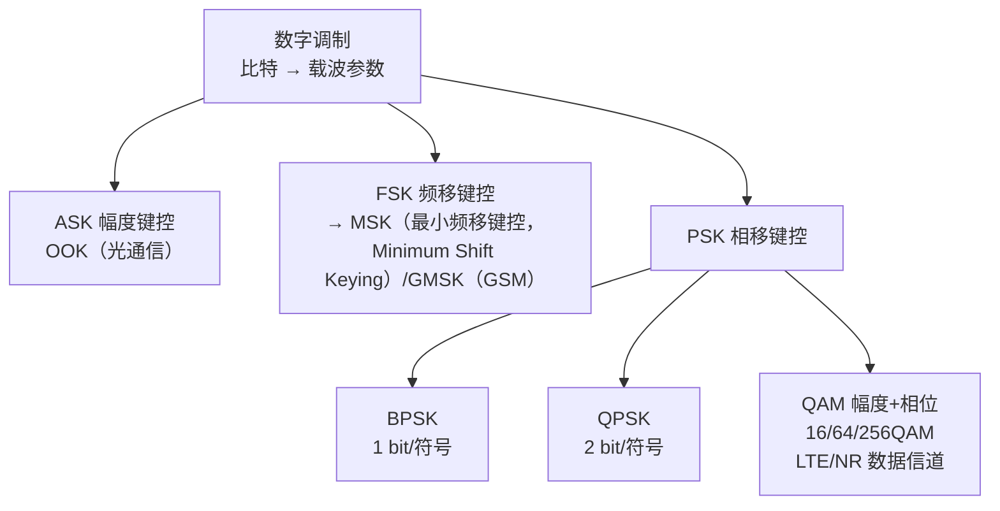

# ASK FSK PSK 键控调制

数字调制把二进制比特"画"到载波上。正弦载波有三个可变的参数——幅度 A、频率 f、相位 φ——键控调制（Keying）就是分别用比特去控制这三个参数：ASK（幅度键控）控幅度、FSK（频移键控）控频率、PSK（相移键控）控相位。LTE/NR 实际使用的是 PSK 家族的 BPSK（二进制相移键控）/QPSK（正交相移键控）以及 QAM（正交幅度调制，Quadrature Amplitude Modulation），但 ASK/FSK 是理解"为什么是 PSK 胜出"的对照基础。

## 独立解释任务

任务目标：讲清 ASK/FSK/PSK 三种键控调制的原理、信号表达式、解调方式与性能差异，说明 PSK 家族如何演进到 BPSK/QPSK 再到 QAM，并衔接知识库既有调制内容（T2.13 软解调、T2.14 QAM）。

## 科学定义

### 通用信号模型

正弦载波的一般形式为 $s(t) = A \cos(2\pi f t + \varphi)$，三个参数各承载信息：

| 调制 | 键控参数 | 比特 → 参数映射 | 解调方式 |
|:---|:---|:---|:---|
| ASK（幅度键控） | A | 1 → A₁（有载波），0 → A₀（或 0） | 包络检波（非相干）或相干 |
| FSK（频移键控） | f | 1 → f₁，0 → f₂ | 鉴频/包络检波（非相干）或相干 |
| PSK（相移键控） | φ | 1 → 0°，0 → 180° | 相干解调（需要本地参考相位） |

### 三种键控的信号表达式（二进制）

ASK：

$$
s_{\mathrm{ASK}}(t) = \begin{cases} A \cos(2\pi f_c t), & \text{bit} = 1 \\ 0, & \text{bit} = 0 \end{cases}
$$

FSK：

$$
s_{\mathrm{FSK}}(t) = \begin{cases} A \cos(2\pi f_1 t), & \text{bit} = 1 \\ A \cos(2\pi f_2 t), & \text{bit} = 0 \end{cases}
$$

PSK（BPSK）：

$$
s_{\mathrm{PSK}}(t) = \begin{cases} A \cos(2\pi f_c t), & \text{bit} = 1 \\ -A \cos(2\pi f_c t), & \text{bit} = 0 \end{cases}
$$

### 性能对比

| 维度 | ASK | FSK | PSK（BPSK 为代表） |
|:---|:---|:---|:---|
| 带宽效率 | 低（抗噪差迫使低速率） | 最低（占用 2 个频点） | 中 |
| 功率效率/抗噪 | 差（幅度易受衰落干扰） | 中 | 最好（星座点距离最大） |
| 解调复杂度 | 低（包络检波） | 中（鉴频） | 高（需载波相位同步） |
| 星座几何 | 同轴两点（A=0 与 A=A） | 两个频率点 | 圆上两点（0° 与 180°） |
| 代表应用 | 早期电报/光通信 OOK（通断键控，On-Off Keying） | GSM（全球移动通信系统，Global System for Mobile Communications）的 GMSK（高斯最小频移键控，Gaussian Minimum Shift Keying，FSK 的连续相位变体） | LTE/NR 控制信道 BPSK/QPSK |

AWGN（加性白高斯噪声，Additive White Gaussian Noise）下误码性能定性：**PSK 优于 FSK 优于 ASK**——星座点间欧氏距离 PSK 最大；ASK 的一个点落在原点（幅度为 0），衰落信道下极易被淹没；FSK 占两个频率位置，带宽代价高。

### 家族演进：从 PSK 到 QAM

- BPSK（1 bit/符号）→ QPSK（2 bit/符号，四相位）→ 8PSK（3 bit/符号）→ QAM（幅度+相位联合键控，16QAM 4 bit/符号、64QAM 6 bit/符号、256QAM 8 bit/符号）。
- LTE/NR 数据信道用 QAM 家族、控制信道用 BPSK/QPSK（可靠性优先）；QPSK 在星座上即"四个正交相位"，可视为 PSK 家族的最高带宽效率形态之一，再往上加星座点需联合调幅度——这就是 QAM。
- 知识库衔接：软解调/LLR（对数似然比，Log-Likelihood Ratio）计算见 T2.13（BPSK/QPSK）与 T2.14（QAM Max-Log-MAP）；星座几何见 Modulation_Constellations_调制星座。

### 调制家族分类树

## 直观模型

三种键控像三种提问方式：ASK 是"灯亮=1，灯灭=0"（幅度）；FSK 是"吹口哨，高音=1 低音=0"（频率）；PSK 是"点头=1，摇头=0"（相位）——点头摇头和摆手幅度无关，所以抗干扰最强，这正是 PSK 胜出的直觉。

## 常见误解

| 误解 | 正确理解 |
|:---|:---|
| PSK 在所有场景都优于 ASK/FSK | PSK 需要载波相位同步（复杂度高），深衰落/非相干场景 FSK 有优势（GMSK 抗噪且频谱好） |
| FSK 带宽效率高 | FSK 占多个频率位置，带宽效率最低；GMSK 是连续相位+高斯滤波后带宽才变窄 |
| 非相干解调一定差 | 非相干省去相位同步，接收机简单；误码损失有限（BPSK 相干 vs 非相干约 1 dB） |
| QAM 与 PSK 无关 | QAM 是 PSK 的推广——先键控相位再加幅度键控，16QAM 可视为 12PSK+4ASK 的合成几何 |

## 协议锚点

- NR 调制映射：TS 38.211 §5.1（BPSK/QPSK/16QAM/64QAM/256QAM 星座表 Table 5.1-1 起，本地 `3GPP_Rel19/processed/TS_38.211_38211-j30`）。
- LTE 调制映射：TS 36.211 §7.1（本地 `TS_36.211_*`）。
- GMSK 为 GSM（2G）调制：**非 3GPP LTE/NR 制式，本地无 GSM 资料，仅作背景对照**。
- 误码率理论：AWGN 下 BPSK 误比特率 $P_b = Q(\sqrt{2E_b/N_0})$（通信原理教材背景，非协议强制）。

## 图谱关联

- [[概念图谱入口]]
- [[Modulation_Constellations_调制星座]]
- [[T2.13_BPSK_QPSK_soft_demapping]]
- [[T2.14_QAM_Max_Log_MAP_demapping]]
- 关系语义：ASK/FSK/PSK 是调制星座的源头家族——LTE/NR 的 BPSK/QPSK/QAM 全部落在 PSK 家族及其 QAM 推广上；软解调（T2.13/T2.14）就是对这些星座点做距离度量与 LLR 计算。
