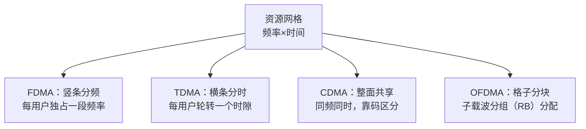

# Multiple Access 多址接入

多址接入（Multiple Access）解决"多个用户如何共享同一段无线频谱"的问题。历史上出现过四类主流方案：FDMA（频分多址）、TDMA（时分多址）、CDMA（码分多址）、OFDMA（正交频分多址）——它们分别在频率、时间、码、子载波四个维度上给用户划分互不干扰的资源。LTE/NR 最终选择了 OFDMA（下行）/SC-FDMA（上行，单载波频分多址，Single Carrier Frequency Division Multiple Access），这个选择是 1G 到 5G 演进的技术收敛。

## 独立解释任务

任务目标：讲清 FDMA/TDMA/CDMA/OFDMA 四种多址方式各自的资源划分原理、代表系统、优缺点，解释为什么 LTE/NR 在 4G/5G 时代选择了 OFDMA 而不是 CDMA。

## 科学定义

### 多址接入的必要性

基站要在同一频段同时服务多个手机。物理层能区分用户的手段只有四个维度：频率（F）、时间（T）、码（C）、空间/子载波——四种多址方式本质是"把资源网格切成互不干扰的块分给用户"。

### FDMA：频分多址（Frequency Division Multiple Access）

- 原理：把可用频带切成互不重叠的频率信道，每用户独占一个信道，相邻信道间留保护间隔（guard band）防串扰。
- 代表系统：1G 模拟蜂窝（AMPS）、GSM（全球移动通信系统，Global System for Mobile Communications）的频段划分部分。
- 优点：实现简单（滤波即可）、用户间无同步要求。
- 缺点：频谱利用率低（保护带浪费）、频点规划复杂（同频干扰要间隔复用距离）。

### TDMA：时分多址（Time Division Multiple Access）

- 原理：同一频率按时间切成时隙（time slot），每用户轮转使用自己的时隙；收发两端只需在分配时隙内工作。
- 代表系统：GSM（2G）是 FDMA + TDMA 结合：先按 200 kHz 频带 FDMA 切分，再在每个频带内按时隙 TDMA 复用 8 个用户。
- 优点：比纯 FDMA 频谱利用率高；手机可只在时隙内收发（省电）。
- 缺点：需要全网时钟同步；时隙间要保护时间（guard period）；单用户突发速率受时隙占比限制。

### CDMA：码分多址（Code Division Multiple Access）

- 原理：所有用户同时同频发射，用不同的扩频码区分——每个用户的数据比特被乘以各自的正交/准正交码片序列，接收端用同一码做相关解扩，把目标用户信号"捞"出来，其他用户的码间干扰被解扩过程抑制。
- 代表系统：3G 的 WCDMA（宽带码分多址）与 cdma2000（码分多址 2000）。WCDMA 码片速率 3.84 Mcps，载波带宽 5 MHz。
- 优点：抗窄带干扰/抗多径能力强；软切换；蜂窝间复用因子可为 1（无需频率规划）。
- 缺点：**远近效应**——近处强用户会淹没远处弱用户，必须快速功率控制；多用户干扰随用户数增长（呼吸效应）；正交码数量有限，容量受干扰而非受带宽约束。

### OFDMA：正交频分多址（Orthogonal Frequency Division Multiple Access）

- 原理：OFDM（正交频分复用，Orthogonal Frequency Division Multiplexing）把宽带信道分成大量正交子载波（相邻子载波间隔 Δf = 15 kHz 等），OFDMA 把子载波按资源块（RB，12 子载波）分组分配给不同用户——频域上的"粒度化 FDMA"，但子载波间正交重叠、无需保护带。
- 代表系统：LTE/NR 下行（DL）用 OFDMA；上行（UL）用 SC-FDMA（DFT（离散傅里叶变换，Discrete Fourier Transform）预编码 OFDM，降低峰均比 PAPR）。
- 优点：频谱效率高（正交子载波无保护带浪费）；资源分配粒度细（RB 级调度，可频率选择性调度把用户放到信道好的子载波）；天然支持 MIMO（多输入多输出，Multiple Input Multiple Output）与频率分集。
- 缺点：对频偏（CFO）敏感（破坏正交性→载波间干扰 ICI）；峰均比 PAPR 高（上行用 SC-FDMA 缓解）。

### 资源划分示意

### 四种方式对比

| 维度 | FDMA | TDMA | CDMA | OFDMA |
|:---|:---|:---|:---|:---|
| 划分维度 | 频率 | 时间 | 码 | 子载波（频+时） |
| 用户间隔离 | 频率不重叠 | 时隙不重叠 | 码正交（理想） | 子载波正交 |
| 同步要求 | 无 | 全网同步 | 码同步 | 时频同步（CP（循环前缀，Cyclic Prefix）内） |
| 频谱效率 | 低（保护带） | 中 | 中高（干扰受限） | 高 |
| 远近效应 | 无 | 无 | 严重（需功率控制） | 轻微（调度缓解） |
| 代表系统 | AMPS（1G） | GSM（2G） | WCDMA/cdma2000（3G） | LTE/NR（4G/5G） |

### 演进史：LTE/NR 选用 OFDMA 的原因

| 代际 | 制式 | 多址方式 |
|:---|:---|:---|
| 1G | AMPS 等 | FDMA（模拟） |
| 2G | GSM | FDMA + TDMA |
| 3G | WCDMA/cdma2000 | CDMA |
| 4G | LTE | OFDMA（DL）+ SC-FDMA（UL） |
| 5G | NR | OFDMA（DL/UL 均可）+ 灵活子载波间隔 |

LTE/NR 弃 CDMA 选 OFDMA 的原因：(1) CDMA 容量受多用户干扰限制、需精细功率控制，OFDMA 在调度器侧做资源分配即可规避干扰；(2) OFDMA 的 RB 粒度支持频率选择性调度与 MIMO 波束成形，CDMA 全带宽共享难以做频域调度；(3) 正交子载波在理想同步下无小区内干扰，接收机简单。代价是 OFDMA 对频偏和 PAPR 敏感——这正是 T2.8（频偏同步）与 T2.18（PAPR）要解决的问题。

## 直观模型

FDMA 是分车道：每辆车独占一条车道；TDMA 是红绿灯轮放：一条路分时段放行；CDMA 是一个大厅里多人同时讲不同语言，你能听懂你的语言就"解扩"出了对方；OFDMA 是停车场划格子：每辆车停在自己的格子里，格子按需求分配。

## 常见误解

| 误解 | 正确理解 |
|:---|:---|
| OFDM 就是 OFDMA | OFDM 是单用户调制方案（所有子载波给一个人），OFDMA 是多址方案（子载波分组给多用户） |
| CDMA 是 3G 技术所以落后 | CDMA 的码分思想仍在抗干扰等领域使用，4G 弃用是工程权衡（调度/MIMO），不是"淘汰=错误" |
| 多址 = 复用 | 复用（Multiplexing）是单链路把多路信号合到一起，多址是共享资源给多用户，概念相邻但对象不同 |
| LTE 上行也是 OFDMA | 上行是 SC-FDMA（DFT 预编码），为降低 PAPR——本笔记详见 T2.18 的 PAPR 背景 |

## 协议锚点

- NR 资源网格与 OFDMA：TS 38.211 §4（帧结构）/§5（OFDM 调制，本地 `3GPP_Rel19/processed/TS_38.211_38211-j30`）。
- LTE 物理资源：TS 36.211 §6（本地 `TS_36.211_*`）。
- SC-FDMA：TS 36.211 §5.6（LTE 上行）、TS 38.211 §5.4（NR 上行 DFT-s-OFDM）。
- 调度粒度 RB/资源分配：TS 38.214 §5.1（本地 `TS_38.214_38214-j30`）。
- WCDMA（TS 25.213）为 3G 制式：**本地 3GPP_Rel19 无 TS 25 系列资料，锚点仅指标准，不核验**。

## 图谱关联

- [[概念图谱入口]]
- [[Spectrum_and_Frequency_Point_频谱与频点]]
- [[Spreading_扩频与解扩]]
- [[T2.0_OFDM_system_overview]]
- 关系语义：多址接入是频谱资源（频谱与频点）之上的"分蛋糕"机制；OFDMA 是 T2.0 OFDM 总览的多用户扩展；CDMA 依赖扩频技术（扩频与解扩）；LTE/NR 接收链路的资源网格与调度全部建立在 OFDMA 划分之上。
