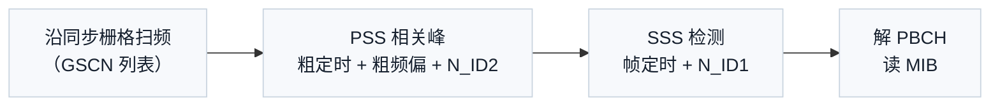

# PSS SSS 同步信号与小区搜索

同步信号（PSS/SSS）是 UE 开机后第一个要找的东西：PSS（主同步信号，Primary Synchronization Signal）与 SSS（辅同步信号，Secondary Synchronization Signal）一起让 UE 完成符号/帧定时、频率粗同步并推导物理小区 ID，随后才能解 PBCH（物理广播信道，Physical Broadcast Channel）拿到系统信息。小区搜索（Cell Search）就是"沿同步栅格扫频 → 找 PSS/SSS → 推小区 ID → 读 PBCH"的完整流程——它是全链路的第一步，也是 [[Spectrum_and_Frequency_Point_频谱与频点]] 中同步栅格设计的落地场景。

## 独立解释任务

任务目标：讲清 PSS/SSS 的作用、序列结构与小区 ID 推导、SSB（同步信号块，Synchronization Signal Block）的时频结构，以及小区搜索流程如何与同步栅格、定时同步（T2.7）和频偏同步（T2.8）衔接。

## 科学定义

### PSS/SSS 的必要性

UE 开机时不知道小区频率、定时、小区 ID 的任何信息。PSS/SSS 提供三个功能：(1) 粗定时（符号级/帧级）——相关峰给出边界；(2) 粗频偏估计——相关峰的位置与相位含 CFO（载波频偏，Carrier Frequency Offset）信息（T2.8 利用 PSS/SSS 相关）；(3) 小区 ID 推导。

### 序列结构与小区 ID

NR（TS 38.211 §7.4.2）：

- PSS：长度 127 的 m 序列（BPSK（二进制相移键控，Binary Phase Shift Keying）调制），3 个取值对应 $N_{\mathrm{ID}}^{(2)} \in \{0,1,2\}$。
- SSS：两个 m 序列交织（长度 127），携带 $N_{\mathrm{ID}}^{(1)} \in \{0,\ldots,335\}$。
- 物理小区 ID：$N_{\mathrm{ID}}^{\mathrm{cell}} = 3 N_{\mathrm{ID}}^{(1)} + N_{\mathrm{ID}}^{(2)}$（共 1008 个）。

LTE（TS 36.211 §6.11）：PSS 用 Zadoff-Chu 序列（62 长），SSS 用两个 m 序列；ID 推导逻辑相同（504 个小区 ID）。

### SSB 时频结构（NR）

- SSB = PSS + SSS + PBCH + PBCH DM-RS（解调参考信号，Demodulation Reference Signal），占 4 个符号 × 240 子载波（20 RB）。
- 频域位置由同步栅格（GSCN（全球同步信道号，Global Synchronization Channel Number））决定（TS 38.101-1 §5.4.3.1，见 [[Spectrum_and_Frequency_Point_频谱与频点]]）；时域按 SSB 突发集（SSB burst set）周期性发送（5/10/20 ms 等）。
- SSB 索引（SSB index）隐含在 DM-RS 序列/PBCH 内容中，用于多波束场景区分波束。

### 小区搜索流程

## 直观模型

小区搜索像"深夜在陌生城市找电台"：先按频率表（同步栅格）扫一圈找到有信号的频道（PSS 相关峰），再听台呼（SSS 确认是哪个台），最后听报站信息（PBCH/MIB（主信息块，Master Information Block））确定频道内容。

## 常见误解

| 误解 | 正确理解 |
|:---|:---|
| PSS 就能完成同步 | PSS 只给符号级粗定时与粗频偏，帧定时要 SSS，精细同步靠 T2.7/T2.8 的跟踪环路 |
| 同步信号是数据信号 | PSS/SSS 是固定序列的参考信号，不承载用户数据，仅用于同步与 ID |
| 小区 ID 从 PBCH 读 | 小区 ID 由 PSS+SSS 直接推导（$N_{\mathrm{ID}}^{(1)}$ 有 336 个取值、$N_{\mathrm{ID}}^{(2)}$ 有 3 个取值，共 336×3=1008 个），PBCH 只给帧号等系统信息 |
| SSB = PSS + SSS | SSB 还含 PBCH 与 PBCH DM-RS——同步与广播是一体的 |

## 协议锚点

- NR PSS/SSS：TS 38.211（Rel-19 j30）§7.4.2，本地 `3GPP_Rel19/processed/TS_38.211_38211-j30`。
- NR SSB 结构与位置：TS 38.211 §7.4.3，本地同卷。
- LTE PSS/SSS：TS 36.211（Rel-19 j30）§6.11，本地 `TS_36.211_*`。
- 同步栅格/GSCN：TS 38.101-1 §5.4.3.1（本地 `TS_38.101_38101-1-j60_s00-0504/content.md` 1141 行起，已核验）。
- 与接收链路衔接：T2.7（定时同步）、T2.8（CFO/SFO）——PSS/SSS 相关峰是它们的输入。

## 图谱关联

- [[概念图谱入口]]
- [[Spectrum_and_Frequency_Point_频谱与频点]]
- [[Timing_Sync_定时同步]]
- [[Gold_序列加扰]]
- [[T14.4_PBCH_cell_search_system_info|T14.4 小区搜索与系统信息]]
- [[PBCH_MIB_广播信道]]
- 关系语义：小区搜索是接收链路的第一个环节——同步栅格决定搜哪里（频谱与频点），PSS/SSS 给定时与 ID（T2.7/T2.8 的输入），PBCH 把搜索流程接到系统信息获取（广播信道）。
