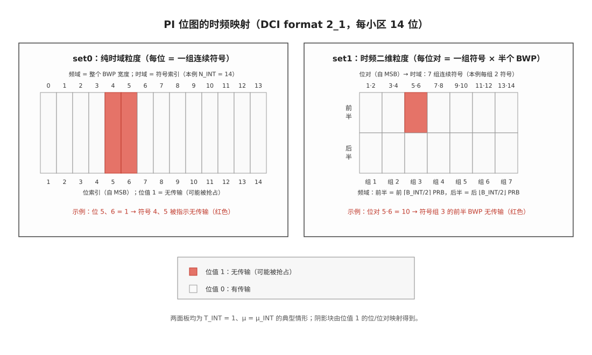

# Preemption Indication 抢占指示

抢占指示（Pre-emption Indication，PI）是 NR 中基站通过 DCI format 2_1（INT-RNTI 加扰的组公共 PDCCH（物理下行控制信道，Physical Downlink Control Channel））下发的通知：在最近一个监测周期内，哪些 PRB（物理资源块，Physical Resource Block）和 OFDM（正交频分复用，Orthogonal Frequency Division Multiplexing）符号上"基站可能没有向该 UE 发送数据"。它是 eMBB（增强移动宽带，Enhanced Mobile Broadband）与 URLLC（超可靠低时延通信，Ultra-Reliable Low-Latency Communication）下行复用的配套机制——URLLC 低时延分组不等时隙边界、直接打孔正在进行的 eMBB 传输之后，被抢占的 eMBB 接收端借助 PI 定位被打孔的位置，把受损的 LLR（对数似然比，Log-Likelihood Ratio）从软解调输入中剔除，避免用被破坏的信息参与译码。

## 独立解释任务

任务目标：讲清下行抢占为什么发生、PI 如何指示（DCI 2_1 的 14 位位图如何映射到时频平面）、UE 收到指示后能做什么不能做什么，以及它与上行取消指示（CI）的区别。

## 科学定义

### 机制背景：URLLC 抢占 eMBB

URLLC 业务的时延预算在毫秒量级，若等下一个时隙边界再调度，排队时延不可接受。NR 允许基站直接在一个进行中的 eMBB 时隙内、用部分符号与部分 PRB 立即调度 URLLC 传输——被覆盖的 eMBB 资源相当于被打孔（puncturing）。由于该打孔发生在调度 eMBB 的 DCI 之后，eMBB UE 事先不知情；若它把被打孔位置的干扰信号当作自己的数据软解调，译码将严重劣化。PI 就是事后的"补发通知"。

### 配置与监测（RRC 层）

UE 被配置 `DownlinkPreemption` 后（TS 38.331），获得以下参数：

| RRC 参数 | 含义 |
|:---|:---|
| `int-RNTI` | 监测 DCI format 2_1 用的 RNTI（无线网络临时标识，Radio Network Temporary Identifier） |
| `dci-PayloadSize` | DCI 2_1 的信息载荷位数（上限 126，`maxINT-DCI-PayloadSize = 126`） |
| `int-ConfigurationPerServingCell` | 每个服务小区的 `servingCellId` 与其在 DCI 2_1 中的字段位置 `positionInDCI` |
| `timeFrequencySet` | 指示粒度：`set0`（纯时域）或 `set1`（时频二维），见下文位图映射 |

监测时机由承载该格式的搜索空间集决定（`monitoringSlotPeriodicityAndOffset` 等，TS 38.213 §10.1 通用机制），且协议要求 DCI 2_1 每时隙至多一个监测时机。

### 指示的时频范围

UE 检测到 DCI 2_1 后，**可假设**（may assume）在指示的 PRB 与符号上没有发给自己的传输；该指示不适用于 SS/PBCH 块的接收。

- **PRB 集合**：等于激活下行 BWP（带宽部分，Bandwidth Part），含 $B_{\mathrm{INT}}$ 个 PRB。
- **符号集合**：该 PDCCH 接收首符号之前的最后 $N$ 个符号，$N = T_{\mathrm{INT}} \cdot N_{\mathrm{symb}}^{\mathrm{slot}} \cdot 2^{\mu - \mu_{\mathrm{INT}}}$。其中 $T_{\mathrm{INT}}$ 是监测周期（`monitoringSlotPeriodicityAndOffset` 给出的值）、$N_{\mathrm{symb}}^{\mathrm{slot}}$ 是每时隙符号数（常规 CP 下为 14）、$\mu$ 是位图对应服务小区的 SCS（子载波间隔，Subcarrier Spacing）配置、$\mu_{\mathrm{INT}}$ 是 UE 接收该 DCI 2_1 的下行 BWP 的 SCS 配置。剔除 `tdd-UL-DL-ConfigurationCommon` 指示的上行符号后，得到的符号数记为 $N_{\mathrm{INT}}$。协议要求 $\mu$、$\mu_{\mathrm{INT}}$、$T_{\mathrm{INT}}$ 的组合不得使 $N$ 非整数。

### 14 位位图映射（`timeFrequencySet`）

每个服务小区对应 DCI 2_1 中的一条 Pre-emption indication，固定 14 位。映射方式由 `timeFrequencySet` 决定：

- **`set0`（纯时域粒度）**：14 位自 MSB 起与 14 组连续符号一一对应。前 $N_{\mathrm{INT}} \bmod 14$ 组各含 $\lceil N_{\mathrm{INT}}/14 \rceil$ 个符号，后 $14 - N_{\mathrm{INT}} \bmod 14$ 组各含 $\lfloor N_{\mathrm{INT}}/14 \rfloor$ 个符号；每位覆盖整个 BWP 宽度。
- **`set1`（时频二维粒度）**：14 位自 MSB 起按 7 对组织，与 7 组连续符号一一对应。前 $N_{\mathrm{INT}} \bmod 7$ 组各含 $\lceil N_{\mathrm{INT}}/7 \rceil$ 个符号，后 $7 - N_{\mathrm{INT}} \bmod 7$ 组各含 $\lfloor N_{\mathrm{INT}}/7 \rfloor$ 个符号；对中第一位指示该符号组的前 $\lceil B_{\mathrm{INT}}/2 \rceil$ 个 PRB，第二位指示后 $\lfloor B_{\mathrm{INT}}/2 \rfloor$ 个 PRB。
- **位值语义**：0 = 对应资源上基站有向该 UE 的传输；1 = 无传输（即可能被抢占）。

典型配置（$T_{\mathrm{INT}} = 1$、$N_{\mathrm{symb}}^{\mathrm{slot}} = 14$、$\mu = \mu_{\mathrm{INT}}$，故 $N_{\mathrm{INT}} = 14$）下的逐位对照：

| 位（自 MSB） | set0：$N_{\mathrm{INT}} = 14$ | set1：$N_{\mathrm{INT}} = 14$ |
|:---|:---|:---|
| 1 | 符号组 1 = 符号 0 | 符号组 1（符号 0-1）的前 $\lceil B_{\mathrm{INT}}/2 \rceil$ PRB |
| 2 | 符号组 2 = 符号 1 | 符号组 1（符号 0-1）的后 $\lfloor B_{\mathrm{INT}}/2 \rfloor$ PRB |
| 3 | 符号组 3 = 符号 2 | 符号组 2（符号 2-3）的前 $\lceil B_{\mathrm{INT}}/2 \rceil$ PRB |
| 4 | 符号组 4 = 符号 3 | 符号组 2（符号 2-3）的后 $\lfloor B_{\mathrm{INT}}/2 \rfloor$ PRB |
| 5 | 符号组 5 = 符号 4 | 符号组 3（符号 4-5）的前 $\lceil B_{\mathrm{INT}}/2 \rceil$ PRB |
| 6 | 符号组 6 = 符号 5 | 符号组 3（符号 4-5）的后 $\lfloor B_{\mathrm{INT}}/2 \rfloor$ PRB |
| 7 | 符号组 7 = 符号 6 | 符号组 4（符号 6-7）的前 $\lceil B_{\mathrm{INT}}/2 \rceil$ PRB |
| 8 | 符号组 8 = 符号 7 | 符号组 4（符号 6-7）的后 $\lfloor B_{\mathrm{INT}}/2 \rfloor$ PRB |
| 9 | 符号组 9 = 符号 8 | 符号组 5（符号 8-9）的前 $\lceil B_{\mathrm{INT}}/2 \rceil$ PRB |
| 10 | 符号组 10 = 符号 9 | 符号组 5（符号 8-9）的后 $\lfloor B_{\mathrm{INT}}/2 \rfloor$ PRB |
| 11 | 符号组 11 = 符号 10 | 符号组 6（符号 10-11）的前 $\lceil B_{\mathrm{INT}}/2 \rceil$ PRB |
| 12 | 符号组 12 = 符号 11 | 符号组 6（符号 10-11）的后 $\lfloor B_{\mathrm{INT}}/2 \rfloor$ PRB |
| 13 | 符号组 13 = 符号 12 | 符号组 7（符号 12-13）的前 $\lceil B_{\mathrm{INT}}/2 \rceil$ PRB |
| 14 | 符号组 14 = 符号 13 | 符号组 7（符号 12-13）的后 $\lfloor B_{\mathrm{INT}}/2 \rfloor$ PRB |

### UE 收到指示后的行为边界

PI 给的是**假设许可**而不是强制动作：UE 检测到 2_1 后可以假设指示资源上没有自己的数据，从而在软解调时丢弃（或置零）对应位置的 LLR，避免被 URLLC 打孔信号污染译码输入——这正是 PI 与译码链路（[[LLR_对数似然比]] → 软解调 → LDPC 译码）的接口。协议不强制 UE 必须丢弃，也不改变 HARQ（混合自动重传请求，Hybrid Automatic Repeat Request）流程：若丢弃后译码失败，仍由常规 HARQ-ACK 反馈 NACK 触发重传。指示对 SS/PBCH 块接收不适用。

## 直观模型

把下行时隙想成一条车队通行的公路：eMBB 数据是排满整条路的长车队，URLLC 是必须立即通过的救护车。救护车到来时不必等下一个绿灯（时隙边界），直接占用某段路的几条车道（部分符号 × 部分 PRB）通过——长车队里对应位置的货物（eMBB 的调制符号）被压坏。事后调度中心（基站）给货主（被抢占的 eMBB UE）发一张"让行说明单"（PI 位图）：标出刚才哪个时段、哪几段车道没有送达。货主据此把破损货物（对应位置的 LLR）丢掉，用剩下的完好货物继续验货（译码），而不是把压坏的货物混进去。

## 常见误解

| 误解 | 正确理解 |
|:---|:---|
| PI 表示指示资源上一定发生了抢占 | PI 只是"可假设无传输"的通知；位值 1 表示基站未向该 UE 发送数据，可能是被抢占，也可能是其他原因 |
| 14 位 = 14 个 PRB 的位图 | 14 位是时频联合位图：set0 下每位对应一组连续符号（覆盖整个 BWP 宽度），set1 下每对位对应一组符号 × 半个 BWP；位对应的粒度是"符号组 × PRB 子集"而不是单个 PRB |
| 抢占指示与上行取消指示是同一个机制 | PI 是下行机制（DCI 2_1、INT-RNTI、TS 38.213 §11.2）；上行对应物是取消指示 CI（DCI 2_4、CI-RNTI、TS 38.213 §11.2A），两者配置与位图语义相互独立（见 [[T14.2_DCI_format_detailed]]） |
| 收到 PI 后必须立即重传被抢占的 TB | PI 不改变 HARQ 流程；UE 丢弃受损 LLR 后正常译码，失败则按常规流程反馈 NACK 触发重传 |
| PI 对小区内所有下行接收都适用 | 明确不适用于 SS/PBCH 块接收；且指示范围限于"最近一个监测周期"内的符号集合 |
| 被抢占 eMBB UE 通过 DCI 提前知道抢占 | eMBB 的调度 DCI 先于抢占发生，UE 事先不知情；PI 是事后（下一监测时机）的通知，UE 收到时受损符号早已过去，因此只能做 LLR 层面的补救 |

## 协议锚点

| 资料 | 本地路径 | 内容边界 |
|:---|:---|:---|
| TS 38.212 Rel-19 §7.3.1.3.2 | `3GPP_Rel19/processed/TS_38.212_38212-j30/content.md:6769-6777` | DCI 2_1 字段清单（Pre-emption indication 1..N）、INT-RNTI 加扰、每指示 14 位、载荷上限 126 位 |
| TS 38.213 Rel-19 §11.2 | `3GPP_Rel19/processed/TS_38.213_38213-j30/content.md:7945-7979` | 监测配置、可假设语义、PRB/符号集合公式、`timeFrequencySet` set0/set1 位图映射（公式原文为 WMF 图片，已从 `specs/38213-j30.docx` 抽取核验） |
| TS 38.213 Rel-19 §11.2A | `3GPP_Rel19/processed/TS_38.213_38213-j30/content.md:7969-8012` | 上行取消指示 CI（对照机制，本文不展开） |
| TS 38.331 Rel-19 DownlinkPreemption | `3GPP_Rel19/processed/TS_38.331_38331-j20/content.md:43295-43315` | RRC 配置参数；`maxINT-DCI-PayloadSize = 126` 见 `content.md:85049` |
| TS 38.214 Rel-19 | 本地 `38214-j30` 正文仅至第 9 章 | Rel-15/16 时代的下行抢占 UE 过程曾位于 §11.2.2；现版本该过程由 TS 38.213 §11.2 完整定义 |
| TS 38.133 | 本地抽取仅含附录 sA.1-A.3 | PI 监测的最小性能要求由该规范规定，条款正文不在本地证据范围内 |

## 图谱关联

- [[概念图谱入口]]
- [[DCI_下行控制信息]]
- [[BWP_带宽部分]]
- [[LLR_对数似然比]]
- [[Scheduler_MAC调度器与资源分配]]
- [[Scheduling_Grant_调度与授权]]
- [[T14.2_DCI_format_detailed]]
- [[T2.2_NR_numerology_time_domain_hierarchy]]
- 关系语义：抢占指示是 DCI 2_1 的载荷语义，作用于激活 BWP 的时频资源，产物是"丢弃哪些 LLR"的输入决策；微时隙是抢占得以发生的时间域基础。
