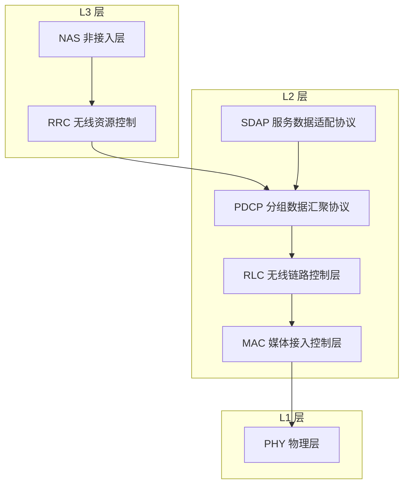

# Protocol Stack 协议栈

3GPP 无线接口协议栈把空口协议按 L1/L2/L3 分三层：L1 物理层（PHY）、L2 的 MAC/RLC/PDCP（NR 另加 SDAP）、L3 的 RRC（控制面）及其上的 NAS。这套三层命名是 3GPP 自己的体系，与 OSI 七层参考模型只是功能上松散对应——「层2 是数据链路层吗」的答案是：功能对应，但不是同一体系。

## 独立解释任务

任务目标：用一张分层图 + 一张对照表讲清 3GPP 无线接口协议栈 L1/L2/L3 如何划分，并回答「3GPP 层2 是不是 OSI 数据链路层」。

## 科学定义

| 3GPP 层 | 子层/协议 | 一句话职责 |
|:---|:---|:---|
| L1 | PHY（物理层） | 比特/符号的调制、信道编码与空口传输 |
| L2 | MAC（媒体接入控制层） | 逻辑信道复用、HARQ、调度 |
| L2 | RLC（无线链路控制层） | 分段重组、ARQ 重传（TM/UM/AM 三模式） |
| L2 | PDCP（分组数据汇聚协议） | 加解密、头压缩、重排序 |
| L2 | SDAP（服务数据适配协议，NR 独有） | QoS 流到无线承载的映射 |
| L3 | RRC（无线资源控制，控制面） | 配置与连接管理；其上为 NAS（非接入层） |

- 用户面 L2 为 SDAP/PDCP/RLC/MAC，控制面在 PDCP 之上换成 RRC/NAS（TS 38.300 §4.4.1/§4.4.2）。
- **层2 是多个子层的集合**，不是单一协议。

## OSI 七层与各层典型协议

OSI（Open Systems Interconnection，开放式系统互联）参考模型把网络功能分为七层，每层有代表性协议：

| OSI 层 | 典型协议/技术 | 一句话职责 |
|:---|:---|:---|
| 应用层 L7 | HTTP、FTP、SMTP、DNS、SSH | 面向用户应用 |
| 表示层 L6 | TLS/SSL（部分观点）、JPEG、ASCII | 数据表示/加密/压缩 |
| 会话层 L5 | RPC、NetBIOS | 会话建立与管理 |
| 传输层 L4 | TCP、UDP | 端到端传输 |
| 网络层 L3 | IP、ICMP、IPsec | 寻址与路由 |
| 数据链路层 L2 | 以太网 MAC、IEEE 802.11、PPP | 相邻节点成帧与差错控制 |
| 物理层 L1 | 以太网物理收发、光纤 | 比特传输 |

**TCP/IP 四层对照**：互联网实际实现是 TCP/IP 模型（链路层 ≈ OSI L1+L2、网络层 ≈ OSI L3、传输层 ≈ OSI L4、应用层 ≈ OSI L5-L7）。OSI 是参考模型，不是实现清单。

## 直观模型

用户数据像寄信：贴面单（SDAP 标记 QoS 流）→ 装信封并加密（PDCP）→ 拆成包裹（RLC 分段）→ 装进卡车（MAC 成帧 + HARQ）→ 发车（PHY 空口传输）；分拣中心按地址路由类比网络层，柜台收件回执类比传输层。

## 常见误解

| 误解 | 正确理解 |
|:---|:---|
| 3GPP 层2 就是 OSI 数据链路层 | 功能对应但体系不同——3GPP 自有三层命名，OSI 映射是教学类比，非 3GPP 标准 |
| PDCP 加密/完整性保护属链路层 | OSI 语境中加密属上层（表示层附近）功能 |
| RRC 是网络层 | RRC 是控制面配置/连接管理协议，无寻址路由功能 |
| OSI 七层是实际实现 | 实际互联网是 TCP/IP 四层；OSI 是参考模型 |

## 协议锚点

- TS 38.300（Rel-19 j20）§4.4 Radio Protocol Architecture（§4.4.1 用户面、§4.4.2 控制面）、§6 Layer 2 —— 本地 `3GPP_Rel19/processed/TS_38.300_38300-j20/content.md`（§4.4 自 2461 行、§6 自 3373 行，已核验）。
- TS 36.300（j10）§6 Layer 2 —— 本地 `3GPP_Rel19/processed/TS_36.300_36300-j10/content.md`（已核验存在；LTE 侧更精确的协议架构章节号实施时登记）。
- 注意：OSI 映射为教学类比，非 3GPP 标准术语；OSI 七层表属参考模型知识，非协议强制要求。

## 图谱关联

- [[概念图谱入口]]
- [[Physical_Channels_物理信道]]
- [[T0.1_LTE_NR_decoder_protocol_reading_map]]
- 关系语义：协议栈分层是所有协议解读的总坐标系——物理信道（L1）与后续 MAC/RLC/PDCP 内容（L2）都挂在这棵树上；「层2 vs OSI 数据链路层」是进入 L2 系列前必须厘清的教学定位。
