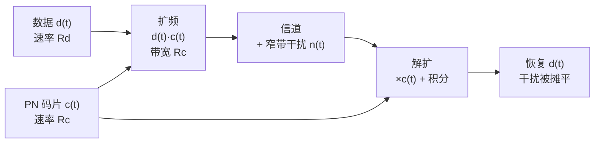

# Spreading 扩频与解扩

扩频（Spread Spectrum）把窄带数据信号有意地扩展到很宽的频带上去传输——做法是用高速率的码片序列（PN 码，伪随机序列，Pseudo-Noise）去调制数据比特。解扩（De-spreading）是接收端用同一码片序列做相关运算，把宽频信号"挤回"窄带，同时把窄带干扰"摊开"。扩频是 CDMA（码分多址，Code Division Multiple Access）的技术基石：3G 的 WCDMA（宽带码分多址，Wideband Code Division Multiple Access）用不同正交码区分用户；4G/5G 弃用 CDMA，但扩频的抗干扰思想仍在抗干扰通信、GNSS（全球导航卫星系统，Global Navigation Satellite System）等领域活跃。

## 独立解释任务

任务目标：讲清直接序列扩频（Direct Sequence Spread Spectrum，DSSS）的扩频-解扩机制、处理增益公式、抗干扰原理，说明扩频与 CDMA 多址的关系，以及为什么 LTE/NR 不再使用扩频体制。

## 科学定义

### 扩频动机

三个动机：(1) 抗干扰——窄带干扰在解扩后功率被摊平；(2) 抗截获——信号功率谱密度低，隐蔽；(3) 多址能力——不同用户用不同码，实现 CDMA。

### DSSS 原理

数据比特 $d(t)$（速率 $R_d$）与码片序列 $c(t)$（速率 $R_c$，码片 chip 是扩频码的最小单元）相乘：

$$
s_{\mathrm{spread}}(t) = d(t) \cdot c(t)
$$

码片速率远大于数据速率（$R_c \gg R_d$），乘积信号的带宽从 $R_d$ 量级展宽到 $R_c$ 量级——这就是"扩频"。每个数据比特被 `SF = R_c / R_d` 个码片表示，SF 称为扩频因子（Spreading Factor）。

### 处理增益（Processing Gain）

$$
G_p = 10 \log_{10} \frac{R_c}{R_d} \quad \text{dB}
$$

处理增益是扩频体制的核心指标：解扩时目标信号相干累加（幅度按 SF 增加），窄带干扰非相干摊平——信噪比改善约 $G_p$ dB。例：WCDMA 语音 12.2 kbps（AMR 编码后符号速率约 30 kbps）、码片 3.84 Mcps（兆码片每秒，megachips per second），扩频因子 SF = 3.84 Mcps / 30 kbps = 128，处理增益 $10\log_{10}(128) \approx 21$ dB。

### 解扩：相关器

接收端用与发送端同步的同一码片序列相乘并积分（相关器）：

1. 接收信号 $r(t) = s_{\mathrm{spread}}(t) + n(t)$（含干扰）
2. 乘以本地 $c(t)$：$r(t) \cdot c(t) = d(t) \cdot c^2(t) + n(t)c(t) = d(t) + n(t)c(t)$（$c^2(t)=1$）
3. 积分一个数据比特周期——$d(t)$ 相干累积，$n(t)c(t)$ 被码片翻转"搅乱"后摊平

**同步是难点**：本地码必须与发送码在码片级对齐，错一个码片相关就塌陷——接收端用滑动相关/匹配滤波器做捕获，再跟踪。这就是"解扩前先同步"的含义。

### 扩频-解扩流程

### 与 CDMA 的关系

CDMA 多址 = 扩频 + 正交码分工：每个用户分配**不同的正交码**（WCDMA 用 OVSF 码（正交可变扩频因子码，Orthogonal Variable Spreading Factor），Walsh 码（沃尔什码，Walsh code）是其基础），所有用户同时同频发射，接收端用目标用户的码解扩——其他用户的信号因码不正交（严格说非目标码与目标码相关为 0 或很低）而"解扩不出来"，等效为摊平的干扰。远近效应与功率控制因此成为 CDMA 的命门（详见 [[Multiple_Access_多址接入]]）。

### 4G/5G 弃用 CDMA/扩频的原因

(1) 多用户干扰限制容量——正交码在真实信道（多径、频偏）下不再严格正交，容量受限；(2) 全带宽共享使频率选择性调度不可行，MIMO（多输入多输出，Multiple Input Multiple Output）波束成形也难以按用户频域分配；(3) OFDMA（正交频分多址，Orthogonal Frequency Division Multiple Access）在调度器层面规避干扰，接收机更简单、容量更高。扩频思想仍在抗干扰军事通信、GNSS、以及 NB-IoT（窄带物联网，Narrowband IoT）的窄带设计对照中存在。

### 其他扩频方式（对比）

| 方式 | 原理 | 代表 |
|:---|:---|:---|
| 直接序列 DSSS | 码片序列直接相乘（本笔记主角） | WCDMA、GPS |
| FHSS（跳频扩频，Frequency Hopping Spread Spectrum） | 载波频率按伪随机序列跳变 | 蓝牙、军事抗干扰 |
| THSS（跳时扩频，Time Hopping Spread Spectrum） | 发射时刻按序列跳变 | 军事 |

## 直观模型

扩频像"把一句话用几百个词重复说出（码片）"，解扩是"把重复部分相干叠加找回原话"；一个窄带噪声像一只蚊子，重复说话的人不怕蚊子在某一时刻嗡嗡——因为每次都被"摊平"。CDMA 就是大厅里每对人用不同暗语重复说话。

## 常见误解

| 误解 | 正确理解 |
|:---|:---|
| 扩频 = 加密 | 扩频提高抗截获性（功率密度低）但不是加密——码序列已知即可解扩，密钥安全是另一回事 |
| 扩频浪费带宽 | 换来了抗干扰/抗截获/多址能力，且多用户共享同一带宽，整体频谱效率并不低 |
| CDMA = 扩频 = WCDMA | 扩频是物理层技术，CDMA 是用扩频实现的多址方式，WCDMA 是 3G 的一个具体制式（TS 25 系列） |
| 4G 不用扩频所以扩频过时 | OFDMA 是工程权衡；扩频在 GNSS/抗干扰通信仍是主流 |

## 协议锚点

- WCDMA 扩频与调制：TS 25.213——**本地 3GPP_Rel19 无 TS 25 系列资料，锚点仅指标准，不核验**（3G 制式，Rel-19 收录范围之外）。
- LTE/NR 无扩频体制：上行 DFT-s-OFDM 与 OFDMA 见 TS 38.211 §5.3/§5.4（本地 `TS_38.211_38211-j30`）。
- 扩频因子概念对照：NR 的 SCS（子载波间隔，Subcarrier Spacing）/CP（循环前缀，Cyclic Prefix）结构（TS 38.211 §5.3）与扩频无关，勿混淆。

## 图谱关联

- [[概念图谱入口]]
- [[Multiple_Access_多址接入]]
- [[AWGN_信道模型]]
- [[T2.8_OFDM_CFO_SFO_frequency_synchronization]]
- 关系语义：扩频是 CDMA 多址的物理层基石（多址接入）；解扩的相干累加思想与 LLR 软合并（T7/T9 软缓存）异曲同工；OFDMA 体制下同步仍是解调前提（T2.8）。
