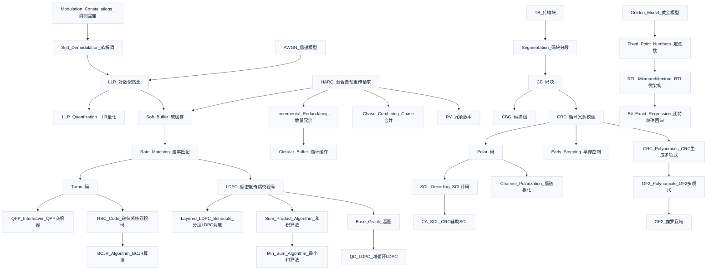

# 概念图谱入口

本目录承载 Obsidian Graph 的细粒度知识节点。协议资料仍以 TS 编号、章节号和本地路径作为锚点，不把 `3GPP_Rel19/processed` 抽取文件纳入关系图谱。

## 数学基础

- [[GF2_伽罗瓦域]]
- [[GF2_Polynomials_GF2多项式]]
- [[Probability_Bayes_概率与贝叶斯]]
- [[LLR_对数似然比]]
- [[Information_Theory_信息论基础]]
- [[dB_分贝]]

## 信道与信号

- [[AWGN_信道模型]]
- [[Fading_Channel_衰落信道]]
- [[Modulation_Constellations_调制星座]]
- [[Soft_Demodulation_软解调]]
- [[Pilot_导频]]
- [[CPICH_公共导频信道]]
- [[LLR_Quantization_LLR量化]]
- [[Multiple_Access_多址接入]]
- [[ASK_FSK_PSK_键控调制]]
- [[RF_Frontend_射频前端]]
- [[Spreading_扩频与解扩]]
- [[Spectrum_and_Frequency_Point_频谱与频点]]

## 协议结构

- [[CRC_循环冗余校验]]
- [[CRC_Polynomials_CRC生成多项式]]
- [[TB_传输块]]
- [[CB_码块]]
- [[CBG_码块组]]
- [[Filler_Bits_填充位]]
- [[Segmentation_码块分段]]
- [[MCS_Table_Effective_Code_Rate_MCS表与有效码率]]
- [[Power_Control_上行功率控制]]
- [[UL_DL_Differences_上下行差异]]
- [[MAC_Layer_Mapping_MAC层映射]]
- [[Carrier_Aggregation_载波聚合]]
- [[BWP_带宽部分]]
- [[Scheduler_MAC调度器与资源分配]]
- [[Scheduling_Grant_调度与授权]]
- [[Preemption_Indication_抢占指示]]
- [[Protocol_Stack_协议栈]]

## HARQ 与速率匹配

- [[HARQ_混合自动重传请求]]
- [[RV_冗余版本]]
- [[Chase_Combining_Chase合并]]
- [[Incremental_Redundancy_增量冗余]]
- [[Circular_Buffer_循环缓存]]
- [[Soft_Buffer_软缓存]]
- [[Rate_Matching_速率匹配]]
- [[HARQ_Process_HARQ进程管理]]

## Turbo 译码

- [[Turbo_码]]
- [[RSC_Code_递归系统卷积码]]
- [[TBCC_咬尾卷积码]]
- [[BCJR_Algorithm_BCJR算法]]
- [[QPP_Interleaver_QPP交织器]]
- [[Iterative_Decoding_迭代译码]]
- [[Early_Stopping_早停控制]]

## NR LDPC 译码

- [[LDPC_低密度奇偶校验码]]
- [[Base_Graph_基图]]
- [[QC_LDPC_准循环LDPC]]
- [[Sum_Product_Algorithm_和积算法]]
- [[Min_Sum_Algorithm_最小和算法]]
- [[Layered_LDPC_Schedule_分层LDPC调度]]

## NR Polar 译码

- [[Polar_码]]
- [[Channel_Polarization_信道极化]]
- [[SCL_Decoding_SCL译码]]
- [[CA_SCL_CRC辅助SCL]]

## 发送链路

- [[Gold_序列加扰]]
- [[Precoding_预编码]]
- [[Layer_Mapping_层映射]]
- [[MIMO_多天线系统]]
- [[Massive_MIMO_超大规模MIMO]]
- [[DMRS_解调参考信号]]
- [[Physical_Channels_物理信道]]
- [[DFT_sOFDM_上行波形]]
- [[Modulation_Mapping_调制映射]]
- [[RE_Mapping_资源元素映射]]
- [[TX_Chain_发送端处理链总览]]
- [[PRACH_随机接入]]
- [[SRS_探测参考信号]]
- [[CSI_RS_信道状态信息参考信号]]
- [[PTRS_相位跟踪参考信号]]
- [[TRS_跟踪参考信号]]
- [[CRS_小区特定参考信号]]
- [[Beam_Management_波束管理]]
- [[Beam_Coherence_波束相干理论]]
- [[PSS_SSS_同步信号与小区搜索]]
- [[PCI_物理小区标识]]
- [[PBCH_MIB_广播信道]]
- [[PCCPCH_主公共控制物理信道]]
- [[PDCCH_物理下行控制信道]]
- [[PCFICH_物理控制格式指示信道]]
- [[DCI_下行控制信息]]
- [[PUCCH_上行控制信道与UCI]]

## 信道与接收链路

- [[TDL_信道模型]]
- [[Channel_Estimation_信道估计]]
- [[MMSE_均衡]]
- [[Sphere_Decoding_球面检测]]
- [[CSI_SINR]]
- [[QAM1024_1024QAM]]
- [[Timing_Sync_定时同步]]
- [[Coherence_Bandwidth_Time_相干带宽与时间]]
- [[Detector_Comparison_检测器对比]]
- [[Diversity_Combining_分集与合并]]
- [[Link_Adaptation_链路自适应与CQI]]

## 概率整形

- [[Probabilistic_Shaping_概率整形]]
- [[PAS_概率幅度整形]]
- [[MB_Distribution_MB分布]]
- [[Distribution_Matching_分布匹配]]
- [[ESS_枚举球面整形]]
- [[SBPM_整形比特位置映射]]
- [[Selective_Scrambling_选择性加扰]]
- [[LLR_Prior_LLR先验]]
- [[Geometric_Shaping_几何整形]]

## 工程实现

- [[Fixed_Point_Numbers_定点数]]
- [[Golden_Model_黄金模型]]
- [[SIMD_Memory_Layout_SIMD内存布局]]
- [[Bit_Exact_Regression_比特精确回归]]
- [[RTL_Microarchitecture_RTL微架构]]

## 独立深化原则

每个概念节点都按独立任务维护，不把它们只当作讲义里的普通名词。单个任务的验收标准是：能给出科学定义、直观模型、接收端动作、协议锚点、常见误解，并至少连接到相关讲义或上下游概念。

## 总览图

