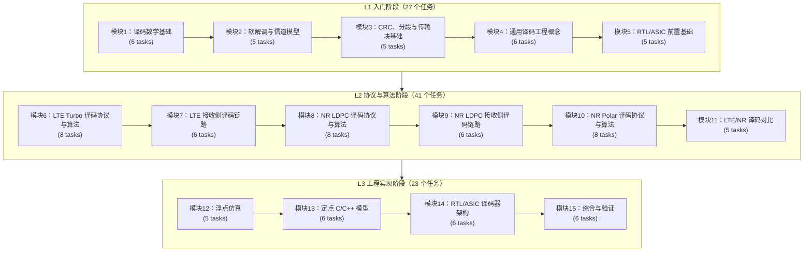

# LTE/NR Decoding Learning Roadmap Implementation Plan

> **For agentic workers:** REQUIRED SUB-SKILL: Use superpowers:subagent-driven-development (recommended) or superpowers:executing-plans to implement this plan task-by-task. Steps use checkbox (`- [ ]`) syntax for tracking.

**Goal:** Create the approved Chinese LTE/NR decoding learning roadmap at `2026-06-19-lte-nr-decoding-learning-roadmap.md`, with all 91 task cards and detailed prompts.

**Architecture:** The roadmap is a single Markdown route/task-card document, not the downstream 91 lesson articles. It adapts the approved design spec into the reference roadmap style: front-matter requirements, Rel-19 quick-reference tables, Mermaid overview, staged modules, and full task-card tables. Verification is inspection-driven with command-line checks for counts, required fields, protocol-evidence wording, and scope boundaries.

**Tech Stack:** Markdown, local Rel-19 processed corpus under `3GPP_Rel19/processed/`, `rg`, `python3` one-off validation scripts, Git.

---

## Source Files and Responsibilities

| File | Action | Responsibility |
|:---|:---|:---|
| `docs/superpowers/specs/2026-06-19-lte-nr-decoding-roadmap-design.md` | Read only | Approved blueprint, module inventory, 91 task cards, task-card field requirements, evidence rules |
| `2026-05-23-ldpc-bp-learning-roadmap-design.md` | Read only | Reference style for title block, quick-reference tables, Mermaid overview, staged modules, and card tables |
| `合规与遵从.md` | Read only | Binding Chinese teaching, Rel-19 evidence, formatting, zero-basis, and review constraints |
| `3GPP_Rel19/manifest.csv` | Read only | Rel-19 package names and local corpus inventory |
| `3GPP_Rel19/processed/manifest.json` | Read only | Processed extraction status and counts |
| `2026-06-19-lte-nr-decoding-learning-roadmap.md` | Create | Final Chinese learning roadmap with 3 stages, 15 modules, 91 task cards, and detailed prompts |

## Constraints to Preserve

| Area | Required Handling |
|:---|:---|
| Scope | Focus on LTE Turbo decoding, NR LDPC decoding, and NR Polar decoding. Do not turn the roadmap into a broad LTE/NR protocol-stack course. |
| Card count | Exactly 91 task cards, `T1.1` through `T20.6`, with module counts from the approved spec. |
| Card fields | Every card has `编号`, `前置`, `Prompt`, `产出`, `验收`, and `3GPP/证据`. |
| Prompt depth | The final roadmap defines the full article skeleton once in `任务卡片统一写作要求`. Each task-card `Prompt` then contains the task-specific writing instruction plus this short binding sentence: `写作时必须套用本文“单节工程讲义统一骨架”；若协议、接收流程、仿真、定点或 RTL 部分不适用，必须说明原因并保留验收与证据记录。` Do not repeat the full 18-section skeleton in all 91 cards. |
| Evidence | Every protocol-derived claim cites TS number, Rel-19 package, section/table/figure/formula when applicable, and local path. Unverified anchors remain marked `待核验`. |
| Formatting | Markdown tables only; Mermaid diagrams use `%%{init: {'theme': 'default'}}%%`; formulas use LaTeX blocks with `\tag{}` in downstream article requirements. |
| Language | Final roadmap is Chinese. First appearance of English terms uses Chinese term first, English in parentheses. |

### Task 1: Recheck Approved Inputs

**Files:**
- Read: `docs/superpowers/specs/2026-06-19-lte-nr-decoding-roadmap-design.md`
- Read: `2026-05-23-ldpc-bp-learning-roadmap-design.md`
- Read: `合规与遵从.md`
- Read: `3GPP_Rel19/processed/manifest.json`
- Read: `3GPP_Rel19/manifest.csv`

- [ ] **Step 1: Confirm the approved spec still has 91 task headings**

Run:

```bash
rg -n '^##### T[0-9]+\\.[0-9]+' docs/superpowers/specs/2026-06-19-lte-nr-decoding-roadmap-design.md | wc -l
```

Expected:

```text
91
```

- [ ] **Step 2: Confirm all stage and module headings are present in the spec**

Run:

```bash
rg -n '^(### L[123]|#### M[0-9]+ )' docs/superpowers/specs/2026-06-19-lte-nr-decoding-roadmap-design.md
```

Expected: output includes `### L1 Beginner Stage`, `### L2 Protocol-Algorithm Stage`, `### L3 Engineering Stage`, and module headings `M1` through `M15`.

- [ ] **Step 3: Recheck processed Rel-19 corpus status**

Run:

```bash
python3 - <<'PY'
import json
from collections import Counter
with open('3GPP_Rel19/processed/manifest.json', encoding='utf-8') as f:
    data = json.load(f)
items = data if isinstance(data, list) else data.get('documents', data.get('items', []))
counts = Counter((item.get('status') or item.get('processing_status') or 'unknown') for item in items)
print('total', len(items))
for key in sorted(counts):
    print(key, counts[key])
PY
```

Expected: prints the current total and status counts. If they differ from the design-time `33 processed + 1 converted`, copy the current counts into the final roadmap and state that the corpus was rechecked on `2026-06-19`.

- [ ] **Step 4: Confirm local protocol directories used by the roadmap exist**

Run:

```bash
for p in \
  3GPP_Rel19/processed/TS_36.212_36212-j30 \
  3GPP_Rel19/processed/TS_38.212_38212-j30 \
  3GPP_Rel19/processed/TS_38.214_38214-j30 \
  3GPP_Rel19/processed/TS_38.211_38211-j30 \
  3GPP_Rel19/processed/TS_38.213_38213-j30 \
  3GPP_Rel19/processed/TS_36.321_36321-j20 \
  3GPP_Rel19/processed/TS_38.321_38321-j20 \
  3GPP_Rel19/processed/TS_36.331_36331-j21 \
  3GPP_Rel19/processed/TS_38.331_38331-j20; do
    test -d "$p" && echo "OK $p" || echo "MISSING $p"
  done
```

Expected: all listed paths print `OK`. If any LTE wildcard source such as TS 36.211 or TS 36.213 has multiple directories, keep the roadmap entry as `3GPP_Rel19/processed/TS_36.211_*` or `3GPP_Rel19/processed/TS_36.213_*` and mark exact part `待核验`.

- [ ] **Step 5: Commit no changes in this task**

Run:

```bash
git status --short
```

Expected: no new roadmap file yet, unless prior task execution already started.

### Task 2: Create the Final Roadmap Scaffold

**Files:**
- Create: `2026-06-19-lte-nr-decoding-learning-roadmap.md`
- Read: `2026-05-23-ldpc-bp-learning-roadmap-design.md`
- Read: `合规与遵从.md`

- [ ] **Step 1: Create the document header and target profile**

Create `2026-06-19-lte-nr-decoding-learning-roadmap.md` with this top-level structure:

```markdown
# 3GPP LTE/NR 译码全栈学习路线 — 完整任务清单

> **目标用户**：通信领域纯新手，具备 Python 基础语法，但不默认掌握线性代数、概率论、随机变量、矩阵、对数似然比（Log-Likelihood Ratio, LLR）、信噪比（Signal-to-Noise Ratio, SNR）、加性白高斯噪声（Additive White Gaussian Noise, AWGN）、定点数或 RTL 时序。
> **最终目标**：全栈通信译码工程师 — 理论推导 -> 浮点仿真 -> 定点 C/C++ 模型 -> Verilog/SystemVerilog RTL -> Synopsys Design Compiler 综合与验证。
> **3GPP 版本**：Rel-19，优先使用本地 `3GPP_Rel19/` 资料。
> **重点范围**：LTE Turbo 译码、NR LDPC 译码、NR Polar 译码。
> **版本**：v1.0（3 个阶段，15 个模块，91 个任务卡片）。

---

## 文档格式与合规规范

## 本地 Rel-19 资料基线

## LTE/NR 译码协议速查表

## 总览：三阶段十五模块学习路线

## 任务卡片统一写作要求

# L1 入门阶段

# L2 协议与算法阶段

# L3 工程实现阶段

## 执行、审查与证据记录规则

## 路线图自检清单
```

- [ ] **Step 2: Fill `文档格式与合规规范`**

Add a Markdown table that binds these rules:

| 项目 | 必须写入的要求 |
|:---|:---|
| Rel-19 溯源 | 任何来自 3GPP 的结论必须列出 TS 编号、Rel-19 包名、章节号、表/图/公式号和本地路径 |
| 待核验 | 未核对表格 HTML、公式 XML、media 或原始 Word XML 时，必须标记 `待核验` |
| 零基础保护 | 首次出现数学、通信或硬件概念时，先白话解释和可数例子，再给符号公式 |
| 中文术语 | 首次出现英文术语时写成 `中文术语（English term/abbreviation）` |
| 表格 | 只使用 Markdown 表格 |
| 图表 | Mermaid 必须使用 `%%{init: {'theme': 'default'}}%%` |
| 公式 | 块级公式使用独立 `$$` 围栏并带 `\tag{}` |
| 代码注释 | C/C++ 使用 Doxygen；SystemVerilog 标注时钟域、复位策略和位宽；Python/MATLAB 标注关键复杂度 |
| 用例 | 每节最多 2 个工业用例，每个用例有输入、输出、边界条件、验证方式和失败案例 |
| 技能 | 涉及 3GPP Word 表格、公式、media 或原始 XML 时使用 `$3gpp-word-extraction` |

- [ ] **Step 3: Fill `本地 Rel-19 资料基线`**

Use the current manifest counts from Task 1 and include at least these rows:

| 资料 | 路径 | 用途 |
|:---|:---|:---|
| 原始 ZIP | `3GPP_Rel19/archive/` | 保存官方下载包 |
| 原始 Word | `3GPP_Rel19/specs/` | 官方 Word 文档解压结果 |
| 下载清单 | `3GPP_Rel19/manifest.csv` | 协议号、Rel-19 包名、SHA-256、官方 URL |
| 结构化抽取 | `3GPP_Rel19/processed/` | agent 阅读、检索、表格/公式定位 |
| 抽取总清单 | `3GPP_Rel19/processed/manifest.json` | 文档处理状态和计数 |

- [ ] **Step 4: Fill `LTE/NR 译码协议速查表`**

Add separate quick-reference tables for LTE, NR LDPC, NR Polar, and boundary context. Use the approved spec anchors. Keep any unverified exact table/formula/media claims marked `待核验`.

- [ ] **Step 5: Add the Mermaid overview**

Insert this diagram with Chinese labels and the required Mermaid init line:

```markdown

```

- [ ] **Step 6: Add task-card unified writing requirements**

Add the required field table and a subsection named `单节工程讲义统一骨架`. In that subsection, write the 18-section per-article skeleton from the approved spec, translated into Chinese, exactly once. Include the rule that foundation tasks must replace non-applicable receive-flow or RTL sections with explicit bridge sections instead of omitting them.

After the skeleton, add this reusable short binding sentence and state that every task-card `Prompt` must end with it:

```text
写作时必须套用本文“单节工程讲义统一骨架”；若协议、接收流程、仿真、定点或 RTL 部分不适用，必须说明原因并保留验收与证据记录。
```

- [ ] **Step 7: Commit the scaffold**

Run:

```bash
git add 2026-06-19-lte-nr-decoding-learning-roadmap.md
git commit -m "Create LTE NR decoding roadmap scaffold"
```

Expected: commit succeeds.

### Task 3: Add L1 Task Cards

**Files:**
- Modify: `2026-06-19-lte-nr-decoding-learning-roadmap.md`
- Read: `docs/superpowers/specs/2026-06-19-lte-nr-decoding-roadmap-design.md:221`

- [ ] **Step 1: Add L1 module headings and summaries**

Add Chinese headings and one summary table for:

| Module | Count | Range |
|:---|---:|:---|
| M1 译码数学基础 | 6 | T1.1-T1.6 |
| M2 软解调与信道模型 | 5 | T2.1-T2.5 |
| M3 CRC、分段与传输块基础 | 5 | T3.1-T3.5 |
| M4 通用译码工程概念 | 6 | T4.1-T4.6 |
| M5 RTL/ASIC 前置基础 | 5 | T5.1-T5.5 |

- [ ] **Step 2: Add M1 cards T1.1-T1.6**

For each card, convert the approved spec table into Chinese with the exact required fields:

```markdown
### T1.1 面向译码器的 GF(2) 二元运算

| 项目 | 内容 |
|:---|:---|
| **编号** | T1.1 |
| **前置** | 无 |
| **Prompt** | 请为通信新手讲解有限域 GF(2) 如何支撑 LTE/NR 译码器中的二元运算，覆盖异或加法、与乘法、多项式表示、CRC 与校验方程的关系、两个手算例子和一个固定输入的 Python 校验片段。写作时必须套用本文“单节工程讲义统一骨架”；若协议、接收流程、仿真、定点或 RTL 部分不适用，必须说明原因并保留验收与证据记录。 |
| **产出** | `docs/L1/T1.1_GF2_binary_arithmetic_for_decoders.md` |
| **验收** | ... |
| **3GPP/证据** | ... |
```

Repeat this full table format for `T1.1`, `T1.2`, `T1.3`, `T1.4`, `T1.5`, and `T1.6`. Do not abbreviate a prompt by referring to a previous prompt. Each prompt must be task-specific and must end with the short binding sentence from `单节工程讲义统一骨架`; do not paste the full 18-section skeleton into each card.

- [ ] **Step 3: Add M2 cards T2.1-T2.5**

Repeat the same complete table format for `T2.1` through `T2.5`. Preserve `待核验` on exact TS 36.211/TS 38.211 modulation anchors where the approved spec marks them unverified.

- [ ] **Step 4: Add M3 cards T3.1-T3.5**

Repeat the same complete table format for `T3.1` through `T3.5`. Preserve TS 36.212 and TS 38.212 section anchors from the approved spec.

- [ ] **Step 5: Add M4 cards T4.1-T4.6**

Repeat the same complete table format for `T4.1` through `T4.6`. Keep algorithm-background tasks clear about which parts are implementation guidance rather than protocol claims.

- [ ] **Step 6: Add M5 cards T5.1-T5.5**

Repeat the same complete table format for `T5.1` through `T5.5`. For engineering-foundation tasks with no direct 3GPP citation, explicitly state that downstream protocol tasks provide normative evidence.

- [ ] **Step 7: Verify L1 count**

Run:

```bash
python3 - <<'PY'
import re
text = open('2026-06-19-lte-nr-decoding-learning-roadmap.md', encoding='utf-8').read()
ids = re.findall(r'^### (T[1-5]\\.[0-9]+)\\b', text, flags=re.M)
print(len(ids))
print(ids[0], ids[-1])
PY
```

Expected:

```text
27
T1.1 T5.5
```

- [ ] **Step 8: Commit L1 cards**

Run:

```bash
git add 2026-06-19-lte-nr-decoding-learning-roadmap.md
git commit -m "Add L1 decoder roadmap task cards"
```

Expected: commit succeeds.

### Task 4: Add L2 Task Cards

**Files:**
- Modify: `2026-06-19-lte-nr-decoding-learning-roadmap.md`
- Read: `docs/superpowers/specs/2026-06-19-lte-nr-decoding-roadmap-design.md:530`

- [ ] **Step 1: Add L2 module headings and summaries**

Add Chinese headings and one summary table for:

| Module | Count | Range |
|:---|---:|:---|
| M6 LTE Turbo 译码协议与算法 | 8 | T6.1-T6.8 |
| M7 LTE 接收侧译码链路 | 6 | T7.1-T7.6 |
| M8 NR LDPC 译码协议与算法 | 8 | T8.1-T8.8 |
| M9 NR LDPC 接收侧译码链路 | 6 | T9.1-T9.6 |
| M10 NR Polar 译码协议与算法 | 8 | T10.1-T10.8 |
| M11 LTE/NR 译码对比 | 5 | T11.1-T11.5 |

- [ ] **Step 2: Add M6 LTE Turbo cards T6.1-T6.8**

Convert every approved M6 card into Chinese. Preserve TS 36.212 Rel-19 `36212-j30` anchors, Figure 5.1.3-2, Table 5.1.3-3, and `待核验` media/table requirements exactly where applicable.

- [ ] **Step 3: Add M7 LTE receive-chain cards T7.1-T7.6**

Convert every approved M7 card into Chinese. Keep receive-side wording: de-rate matching, sub-block deinterleaving, HARQ soft buffer, code block reassembly, TB CRC, DL/UL differences, and edge cases.

- [ ] **Step 4: Add M8 NR LDPC algorithm cards T8.1-T8.8**

Convert every approved M8 card into Chinese. Keep base graph, lifting size, quasi-cyclic matrix, Tanner graph, belief propagation, Min-Sum variants, layered schedule, and numeric walkthrough coverage.

- [ ] **Step 5: Add M9 NR LDPC receive-chain cards T9.1-T9.6**

Convert every approved M9 card into Chinese. Preserve TS 38.212 §5.4.2, TS 38.214 MCS/TBS/HARQ/CBG context, and exact `k0` or table anchors marked for later verification.

- [ ] **Step 6: Add M10 NR Polar cards T10.1-T10.8**

Convert every approved M10 card into Chinese. Preserve reliability sequence, SC, SCL, CRC-aided SCL, Polar rate recovery, UCI/DCI context, and TS 38.212 §5.2.1/§5.3.1/§5.4.1/§6.3/§7.3 evidence.

- [ ] **Step 7: Add M11 comparison cards T11.1-T11.5**

Convert every approved M11 card into Chinese. Keep comparison scope tied to decoder choice, rate matching, HARQ soft buffers, hardware tradeoffs, and channel type mapping.

- [ ] **Step 8: Verify L2 count**

Run:

```bash
python3 - <<'PY'
import re
text = open('2026-06-19-lte-nr-decoding-learning-roadmap.md', encoding='utf-8').read()
ids = re.findall(r'^### (T(?:6|7|8|9|10|11)\\.[0-9]+)\\b', text, flags=re.M)
print(len(ids))
print(ids[0], ids[-1])
PY
```

Expected:

```text
41
T6.1 T11.5
```

- [ ] **Step 9: Commit L2 cards**

Run:

```bash
git add 2026-06-19-lte-nr-decoding-learning-roadmap.md
git commit -m "Add L2 LTE NR decoding task cards"
```

Expected: commit succeeds.

### Task 5: Add L3 Task Cards and Closing Rules

**Files:**
- Modify: `2026-06-19-lte-nr-decoding-learning-roadmap.md`
- Read: `docs/superpowers/specs/2026-06-19-lte-nr-decoding-roadmap-design.md:995`

- [ ] **Step 1: Add L3 module headings and summaries**

Add Chinese headings and one summary table for:

| Module | Count | Range |
|:---|---:|:---|
| M12 浮点仿真 | 5 | T17.1-T17.5 |
| M13 定点 C/C++ 模型 | 6 | T18.1-T18.6 |
| M14 RTL/ASIC 译码器架构 | 6 | T19.1-T19.6 |
| M15 综合与验证 | 6 | T20.1-T20.6 |

- [ ] **Step 2: Add M12 floating-point simulation cards T17.1-T17.5**

Convert every approved M12 card into Chinese. Keep reproducible seeds, commands, outputs, thresholds, BER/BLER reporting, and protocol-vector provenance requirements.

- [ ] **Step 3: Add M13 fixed-point C/C++ cards T18.1-T18.6**

Convert every approved M13 card into Chinese. Emphasize bit-exact interfaces, LLR/message width, saturation, SIMD layout, regression harness, and upstream protocol evidence.

- [ ] **Step 4: Add M14 RTL/ASIC architecture cards T19.1-T19.6**

Convert every approved M14 card into Chinese. Preserve Turbo, LDPC, Polar, unified subsystem, soft-buffer/HARQ memory, and register-map/configuration-flow coverage.

- [ ] **Step 5: Add M15 synthesis and verification cards T20.1-T20.6**

Convert every approved M15 card into Chinese. Keep SystemVerilog testbench, protocol vectors, coverage/regression, DC synthesis, timing closure, and final evidence-report coverage.

- [ ] **Step 6: Add `执行、审查与证据记录规则`**

Add a closing section requiring every downstream article to record:

| 记录项 | 要求 |
|:---|:---|
| 本地资料 | List all `3GPP_Rel19/...` files/directories read |
| 技能/脚本 | Record `$3gpp-word-extraction`, scripts, validators, and review tools used |
| 协议证据 | TS number, Rel-19 package, section, table/figure/formula, local path |
| 未核验项 | Keep `待核验` until raw table/formula/media is checked |
| 仿真证据 | Command, seed, dependency, output file, threshold |
| 定点/RTL 证据 | Bit width, saturation, vector provenance, waveform/regression result |
| 审查结论 | Review scope, findings, fixes, remaining risk |

- [ ] **Step 7: Add `路线图自检清单`**

Add a final checklist with these rows:

| 检查项 | 通过标准 |
|:---|:---|
| 任务数量 | Exactly 91 cards |
| 模块数量 | 15 modules |
| 译码族覆盖 | LTE Turbo, NR LDPC, NR Polar all present |
| 字段完整性 | Every card has 6 required fields |
| Prompt 完整性 | Every prompt contains task-specific scope and the short binding sentence pointing to `单节工程讲义统一骨架`; the full article skeleton appears once in the global writing requirements |
| 证据状态 | Unverified anchors marked `待核验` |
| 范围控制 | MAC/RRC/RLC/PDCP only appear as decoder boundary/configuration context |

- [ ] **Step 8: Verify L3 count**

Run:

```bash
python3 - <<'PY'
import re
text = open('2026-06-19-lte-nr-decoding-learning-roadmap.md', encoding='utf-8').read()
ids = re.findall(r'^### (T(?:12|13|14|15)\\.[0-9]+)\\b', text, flags=re.M)
print(len(ids))
print(ids[0], ids[-1])
PY
```

Expected:

```text
23
T17.1 T20.6
```

- [ ] **Step 9: Commit L3 cards and closing rules**

Run:

```bash
git add 2026-06-19-lte-nr-decoding-learning-roadmap.md
git commit -m "Add L3 engineering roadmap task cards"
```

Expected: commit succeeds.

### Task 6: Verify Final Roadmap

**Files:**
- Read: `2026-06-19-lte-nr-decoding-learning-roadmap.md`
- Read: `docs/superpowers/specs/2026-06-19-lte-nr-decoding-roadmap-design.md`

- [ ] **Step 1: Verify total task count**

Run:

```bash
python3 - <<'PY'
import re
text = open('2026-06-19-lte-nr-decoding-learning-roadmap.md', encoding='utf-8').read()
ids = re.findall(r'^### (T[0-9]+\\.[0-9]+)\\b', text, flags=re.M)
print(len(ids))
print(ids[:3])
print(ids[-3:])
dups = sorted({x for x in ids if ids.count(x) > 1})
print('duplicates', dups)
PY
```

Expected:

```text
91
['T1.1', 'T1.2', 'T1.3']
['T20.4', 'T20.5', 'T20.6']
duplicates []
```

- [ ] **Step 2: Verify module counts**

Run:

```bash
python3 - <<'PY'
import re
from collections import Counter
text = open('2026-06-19-lte-nr-decoding-learning-roadmap.md', encoding='utf-8').read()
ids = re.findall(r'^### T([0-9]+)\\.[0-9]+\\b', text, flags=re.M)
counts = Counter(ids)
expected = {'1':6,'2':5,'3':5,'4':6,'5':5,'6':8,'7':6,'8':8,'9':6,'10':8,'11':5,'12':5,'13':6,'14':6,'15':6}
print(dict(sorted(counts.items(), key=lambda kv:int(kv[0]))))
print('matches', all(counts[k] == v for k, v in expected.items()) and len(counts) == len(expected))
PY
```

Expected:

```text
matches True
```

- [ ] **Step 3: Verify every task card has required fields**

Run:

```bash
python3 - <<'PY'
import re
text = open('2026-06-19-lte-nr-decoding-learning-roadmap.md', encoding='utf-8').read()
chunks = re.split(r'^### (T[0-9]+\\.[0-9]+)\\b.*$', text, flags=re.M)
missing = []
for i in range(1, len(chunks), 2):
    tid, body = chunks[i], chunks[i+1]
    for field in ['编号', '前置', 'Prompt', '产出', '验收', '3GPP/证据']:
        if f'**{field}**' not in body:
            missing.append((tid, field))
print('missing', missing)
PY
```

Expected:

```text
missing []
```

- [ ] **Step 4: Verify no abbreviated prompts**

Run:

```bash
rg -n '重复引用词|同前|略|TODO|TBD|后续补充|省略' 2026-06-19-lte-nr-decoding-learning-roadmap.md
```

Expected: no output. If a legitimate Chinese sentence contains one of these strings, rewrite it to avoid ambiguity.

- [ ] **Step 5: Verify Prompt skeleton binding**

Run:

```bash
python3 - <<'PY'
import re
text = open('2026-06-19-lte-nr-decoding-learning-roadmap.md', encoding='utf-8').read()
required = ['学习目标','前置知识检查','协议依据与本地路径','工程动机','白话直觉','公式','接收端流程','伪代码','工业用例','浮点仿真','定点','RTL/ASIC','验证方法','常见错误','工程思考题','协议证据表','执行与证据记录','参考文献']
global_section = re.search(r'## 任务卡片统一写作要求.*?(?=^# L1 入门阶段)', text, flags=re.M|re.S)
if not global_section:
    raise SystemExit('missing global writing requirements section')
missing_global = [x for x in required if x not in global_section.group(0)]
if missing_global:
    raise SystemExit('global skeleton missing: ' + ', '.join(missing_global))
binding = '写作时必须套用本文“单节工程讲义统一骨架”；若协议、接收流程、仿真、定点或 RTL 部分不适用，必须说明原因并保留验收与证据记录。'
bad = []
for m in re.finditer(r'^### (T[0-9]+\\.[0-9]+)\\b.*?(?=^### T|^## |\\Z)', text, flags=re.M|re.S):
    tid, body = m.group(1), m.group(0)
    prompt = re.search(r'\\| \\*\\*Prompt\\*\\* \\|(.+?)\\|\\n', body, flags=re.S)
    ptxt = prompt.group(1) if prompt else ''
    if binding not in ptxt:
        bad.append(tid)
print('bad_count', len(bad))
for item in bad[:20]:
    print(item)
PY
```

Expected:

```text
bad_count 0
```

- [ ] **Step 6: Verify 3GPP evidence and `待核验` policy**

Run:

```bash
rg -n '3GPP/证据|TS 36\\.212|TS 38\\.212|TS 38\\.214|待核验|3GPP_Rel19/processed' 2026-06-19-lte-nr-decoding-learning-roadmap.md
```

Expected: frequent matches across the quick-reference tables and task cards. Inspect matches to confirm no protocol-derived table/formula value is presented without either verified evidence or `待核验`.

- [ ] **Step 7: Verify Markdown table style**

Run:

```bash
rg -n '^\\+[-+]+\\+|^\\|[- ]+\\||^# ═|^[ ]*[-|]{5,}[ ]*$' 2026-06-19-lte-nr-decoding-learning-roadmap.md
```

Expected: no ASCII pseudo-table or decorative ASCII section dividers. Markdown table separators such as `|:---|:---|` are allowed; if this command flags valid Markdown separators, inspect and keep only valid Markdown.

- [ ] **Step 8: Verify scope boundary wording**

Run:

```bash
rg -n 'RLC|PDCP|RRC|MAC|调度器|协议栈' 2026-06-19-lte-nr-decoding-learning-roadmap.md
```

Expected: matches appear only in sections describing decoder boundary, configuration source, HARQ context, or evidence paths. Rewrite any broad stack-teaching language.

- [ ] **Step 9: Commit verification fixes**

If verification required edits, run:

```bash
git add 2026-06-19-lte-nr-decoding-learning-roadmap.md
git commit -m "Verify LTE NR decoding roadmap completeness"
```

Expected: commit succeeds if there were edits. If no edits were needed, leave the prior commit as the latest roadmap content commit.

### Task 7: Review and Final Commit State

**Files:**
- Read: `2026-06-19-lte-nr-decoding-learning-roadmap.md`
- Read: `docs/superpowers/specs/2026-06-19-lte-nr-decoding-roadmap-design.md`

- [ ] **Step 1: Perform a manual self-review against the approved spec**

Check these items manually:

| Review Item | Required Result |
|:---|:---|
| Output filename | `2026-06-19-lte-nr-decoding-learning-roadmap.md` exists in repo root |
| Form match | Looks like the reference LDPC BP roadmap: title profile, requirements, quick refs, Mermaid overview, staged modules, table cards |
| Count | 3 stages, 15 modules, 91 cards |
| Card completeness | Every card has six required fields |
| Prompt detail | No prompt relies on a shared hidden template; every prompt is independently usable |
| Evidence | Rel-19 sources and local paths are present; unverified anchors marked `待核验` |
| Scope | LTE Turbo, NR LDPC, NR Polar remain central |

- [ ] **Step 2: Run final git diff review**

Run:

```bash
git diff --stat HEAD~3..HEAD
git log --oneline -5
```

Expected: recent commits include scaffold, L1, L2, L3, and optional verification fixes. If the commit count differs because tasks were squashed manually, confirm the final file still passes Task 6.

- [ ] **Step 3: Report final status**

Final response should include:

```text
已生成 `2026-06-19-lte-nr-decoding-learning-roadmap.md`。
验证：91 张任务卡片，15 个模块，3 个阶段；每张卡片包含 编号/前置/Prompt/产出/验收/3GPP/证据。
保留 `待核验` 的协议锚点：用于后续写单篇讲义前核验原始 Word 表格、公式和 media。
```

- [ ] **Step 4: Do not generate downstream lesson articles**

Stop after the roadmap document is created and verified. Do not create files under `docs/L1`, `docs/L2_协议算法`, or `docs/L3` unless the user separately approves generating article bodies.
