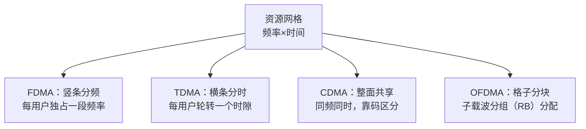
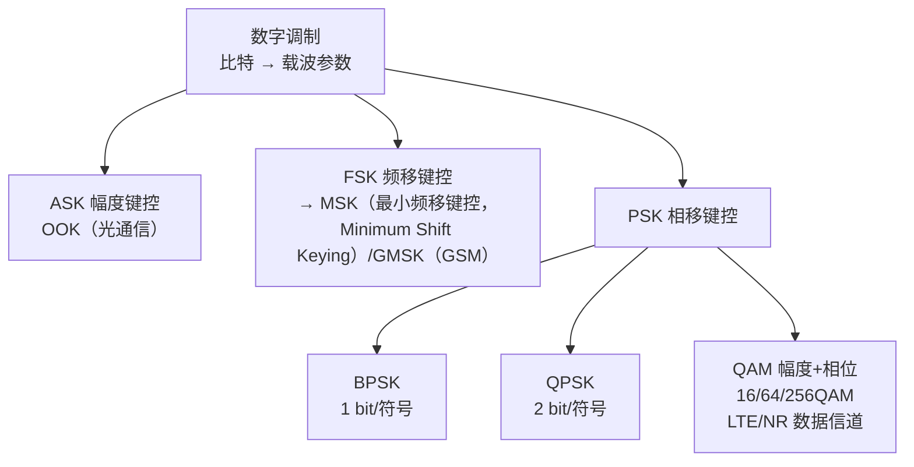
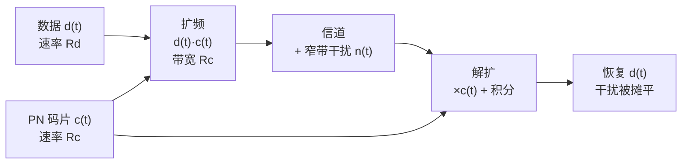

# 通信基础三件套 Implementation Plan

> **For agentic workers:** REQUIRED SUB-SKILL: Use superpowers:subagent-driven-development (recommended) or superpowers:executing-plans to implement this plan task-by-task. Steps use checkbox (`- [ ]`) syntax for tracking.

**Goal:** 补齐知识库缺失的通信基础三件套（详细分析）：多址接入（FDMA/TDMA/CDMA/OFDMA）、键控调制（ASK/FSK/PSK）、扩频与解扩（DSSS）。3 篇独立概念笔记 + 同步清单 + 术语工具九项扩展 + 全量验证 + 双推。

**Architecture:** 按拷问锁定版 `docs/superpowers/plans/PLAN-communication-fundamentals.md`（grill-me，2026-08-11）执行。变更文件：新建概念笔记 3 个、修改图谱入口/术语表 2 个、修改审计工具 1 个。每篇笔记 200-400 行详细分析（六段式 + 图 + 公式）。**执行顺序**：在协议栈计划（2026-08-11-protocol-stack-osi.md）SDD 流全部完成后执行。

**Tech Stack:** Markdown + Mermaid（mmdc 渲染验证）+ LaTeX（KaTeX/--syntax-only）+ 项目 audit 工具链。

## Global Constraints

- 所有命令在仓库根 `/home/yys/AGENT/obsidian` 下以 `cd 3gpp && …` 运行。
- Mermaid 节点一律引号节点 `id["text"]`，块首 `%%{init: {'theme': 'default'}}%%`（CLAUDE.md 第 6 条）。
- LaTeX 块级公式成对双美元围栏独立成行（Rule 20）；运算符前换行缩进。
- 标题正式化（Rule 16）；带圈数字禁令（第 10 条）；英文术语首现「中文（English Full Name, ABBR）」（Rule 10）。
- 概念笔记六段式模板（.claude/rules/documentation.md §三）：独立解释任务/科学定义/直观模型/常见误解/协议锚点/图谱关联，末行「关系语义：…」。
- wikilink 只指向已存在或本计划将要创建的目标。
- 协议溯源精确到 TS 编号 + 章节号 + 本地 processed 路径；**WCDMA（TS 25.213）与 GMSK（GSM）本地无资料，必须标注"本地无该制式资料，锚点仅指标准"**（Rule 2 边界声明）。
- 工具缺失（mmdc/KaTeX）必须显式声明验证缺口，不得默认通过。
- 提交后 `git push origin master`（双推）。

---

### Task B1: 新建概念笔记 `docs/concepts/Multiple_Access_多址接入.md`

**Files:**
- Create: `3gpp/docs/concepts/Multiple_Access_多址接入.md`

**Interfaces:**
- Produces: 该文件，Task B3（扩频笔记图谱关联）与 Task B4（同步清单）依赖其存在。

- [ ] **Step 1: 写完整概念笔记**

```markdown
---
type: definition
aliases:
  - 多址接入
  - Multiple Access
  - FDMA TDMA CDMA OFDMA
tags:
  - 3gpp
  - concepts
  - physical-layer
  - l1
source_spec: "TS 38.211 Rel-19 §4/§5; TS 36.211; 教材背景知识"
---

# Multiple Access 多址接入

多址接入（Multiple Access）解决"多个用户如何共享同一段无线频谱"的问题。历史上出现过四类主流方案：FDMA（频分多址）、TDMA（时分多址）、CDMA（码分多址）、OFDMA（正交频分多址）——它们分别在频率、时间、码、子载波四个维度上给用户划分互不干扰的资源。LTE/NR 最终选择了 OFDMA（下行）/SC-FDMA（单载波频分多址，Single Carrier Frequency Division Multiple Access）（上行），这个选择是 1G 到 5G 演进的技术收敛。

## 独立解释任务

任务目标：讲清 FDMA/TDMA/CDMA/OFDMA 四种多址方式各自的资源划分原理、代表系统、优缺点，解释为什么 LTE/NR 在 4G/5G 时代选择了 OFDMA 而不是 CDMA。

## 科学定义

### 多址接入的必要性

基站要在同一频段同时服务多个手机。物理层能区分用户的手段只有四个维度：频率（F）、时间（T）、码（C）、空间/子载波——四种多址方式本质是"把资源网格切成互不干扰的块分给用户"。

### FDMA：频分多址（Frequency Division Multiple Access）

- 原理：把可用频带切成互不重叠的频率信道，每用户独占一个信道，相邻信道间留保护间隔（guard band）防串扰。
- 代表系统：1G 模拟蜂窝（AMPS）、GSM（全球移动通信系统，Global System for Mobile Communications）的频段划分部分。
- 优点：实现简单（滤波即可）、用户间无同步要求。
- 缺点：频谱利用率低（保护带浪费）、频点规划复杂（同频干扰要间隔复用距离）。

### TDMA：时分多址（Time Division Multiple Access）

- 原理：同一频率按时间切成时隙（time slot），每用户轮转使用自己的时隙；收发两端只需在分配时隙内工作。
- 代表系统：GSM（2G）是 FDMA + TDMA 结合：先按 200 kHz 频带 FDMA 切分，再在每个频带内按时隙 TDMA 复用 8 个用户。
- 优点：比纯 FDMA 频谱利用率高；手机可只在时隙内收发（省电）。
- 缺点：需要全网时钟同步；时隙间要保护时间（guard period）；单用户突发速率受时隙占比限制。

### CDMA：码分多址（Code Division Multiple Access）

- 原理：所有用户同时同频发射，用不同的扩频码区分——每个用户的数据比特被乘以各自的正交/准正交码片序列，接收端用同一码做相关解扩，把目标用户信号"捞"出来，其他用户的码间干扰被解扩过程抑制。
- 代表系统：3G 的 WCDMA（宽带码分多址）与 cdma2000（码分多址 2000）。WCDMA 码片速率 3.84 Mcps，载波带宽 5 MHz。
- 优点：抗窄带干扰/抗多径能力强；软切换；蜂窝间复用因子可为 1（无需频率规划）。
- 缺点：**远近效应**——近处强用户会淹没远处弱用户，必须快速功率控制；多用户干扰随用户数增长（呼吸效应）；正交码数量有限，容量受干扰而非受带宽约束。

### OFDMA：正交频分多址（Orthogonal Frequency Division Multiple Access）

- 原理：OFDM（正交频分复用，Orthogonal Frequency Division Multiplexing）把宽带信道分成大量正交子载波（相邻子载波间隔 Δf = 15 kHz 等），OFDMA 把子载波按资源块（RB，12 子载波）分组分配给不同用户——频域上的"粒度化 FDMA"，但子载波间正交重叠、无需保护带。
- 代表系统：LTE/NR 下行（DL）用 OFDMA；上行（UL）用 SC-FDMA（DFT（离散傅里叶变换，Discrete Fourier Transform）预编码 OFDM，降低峰均比 PAPR）。
- 优点：频谱效率高（正交子载波无保护带浪费）；资源分配粒度细（RB 级调度，可频率选择性调度把用户放到信道好的子载波）；天然支持 MIMO（多输入多输出，Multiple Input Multiple Output）与频率分集。
- 缺点：对频偏（CFO）敏感（破坏正交性→载波间干扰 ICI）；峰均比 PAPR 高（上行用 SC-FDMA 缓解）。

### 资源划分示意



### 四种方式对比

| 维度 | FDMA | TDMA | CDMA | OFDMA |
|:---|:---|:---|:---|:---|
| 划分维度 | 频率 | 时间 | 码 | 子载波（频+时） |
| 用户间隔离 | 频率不重叠 | 时隙不重叠 | 码正交（理想） | 子载波正交 |
| 同步要求 | 无 | 全网同步 | 码同步 | 时频同步（CP（循环前缀，Cyclic Prefix）内） |
| 频谱效率 | 低（保护带） | 中 | 中高（干扰受限） | 高 |
| 远近效应 | 无 | 无 | 严重（需功率控制） | 轻微（调度缓解） |
| 代表系统 | AMPS（1G） | GSM（2G） | WCDMA/cdma2000（3G） | LTE/NR（4G/5G） |

### 演进史：LTE/NR 选用 OFDMA 的原因

| 代际 | 制式 | 多址方式 |
|:---|:---|:---|
| 1G | AMPS 等 | FDMA（模拟） |
| 2G | GSM | FDMA + TDMA |
| 3G | WCDMA/cdma2000 | CDMA |
| 4G | LTE | OFDMA（DL）+ SC-FDMA（UL） |
| 5G | NR | OFDMA（DL/UL 均可）+ 灵活子载波间隔 |

LTE/NR 弃 CDMA 选 OFDMA 的原因：(1) CDMA 容量受多用户干扰限制、需精细功率控制，OFDMA 在调度器侧做资源分配即可规避干扰；(2) OFDMA 的 RB 粒度支持频率选择性调度与 MIMO 波束成形，CDMA 全带宽共享难以做频域调度；(3) 正交子载波在理想同步下无小区内干扰，接收机简单。代价是 OFDMA 对频偏和 PAPR 敏感——这正是 T2.8（频偏同步）与 T2.18（PAPR）要解决的问题。

## 直观模型

FDMA 是分车道：每辆车独占一条车道；TDMA 是红绿灯轮放：一条路分时段放行；CDMA 是一个大厅里多人同时讲不同语言，你能听懂你的语言就"解扩"出了对方；OFDMA 是停车场划格子：每辆车停在自己的格子里，格子按需求分配。

## 常见误解

| 误解 | 正确理解 |
|:---|:---|
| OFDM 就是 OFDMA | OFDM 是单用户调制方案（所有子载波给一个人），OFDMA 是多址方案（子载波分组给多用户） |
| CDMA 是 3G 技术所以落后 | CDMA 的码分思想仍在抗干扰等领域使用，4G 弃用是工程权衡（调度/MIMO），不是"淘汰=错误" |
| 多址 = 复用 | 复用（Multiplexing）是单链路把多路信号合到一起，多址是共享资源给多用户，概念相邻但对象不同 |
| LTE 上行也是 OFDMA | 上行是 SC-FDMA（DFT 预编码），为降低 PAPR——本笔记详见 T2.18 的 PAPR 背景 |

## 协议锚点

- NR 资源网格与 OFDMA：TS 38.211 §4（帧结构）/§5（OFDM 调制，本地 `3GPP_Rel19/processed/TS_38.211_38211-j30`）。
- LTE 物理资源：TS 36.211 §6（本地 `TS_36.211_*`）。
- SC-FDMA：TS 36.211 §5.6（LTE 上行）、TS 38.211 §5.4（NR 上行 DFT-s-OFDM）。
- 调度粒度 RB/资源分配：TS 38.214 §5.1（本地 `TS_38.214_38214-j30`）。
- WCDMA（TS 25.213）为 3G 制式：**本地 3GPP_Rel19 无 TS 25 系列资料，锚点仅指标准，不核验**。

## 图谱关联

- [[概念图谱入口]]
- [[Spectrum_and_Frequency_Point_频谱与频点]]
- [[Spreading_扩频与解扩]]
- [[T2.0_OFDM_system_overview]]
- 关系语义：多址接入是频谱资源（频谱与频点）之上的"分蛋糕"机制；OFDMA 是 T2.0 OFDM 总览的多用户扩展；CDMA 依赖扩频技术（扩频与解扩）；LTE/NR 接收链路的资源网格与调度全部建立在 OFDMA 划分之上。
```

- [ ] **Step 2: 验证结构、Mermaid、LaTeX、圈号**

Run:

```bash
cd 3gpp && test -f "docs/concepts/Multiple_Access_多址接入.md" && grep -c "^## " "docs/concepts/Multiple_Access_多址接入.md" && bash tools/audit_mermaid_syntax.sh docs/concepts && python3 tools/audit_latex_render.py --syntax-only "docs/concepts/Multiple_Access_多址接入.md" 2>&1 | tail -3 && python3 tools/audit_circled_digits.py 2>&1 | tail -1
```

Expected: `6`（六段式）；mermaid exit 0（或显式声明缺口）；latex syntax-only 通过；圈号无新增 FAIL。

- [ ] **Step 3: 提交**

```bash
cd /home/yys/AGENT/obsidian && git add "3gpp/docs/concepts/Multiple_Access_多址接入.md" && git commit -m "docs(concepts): 新增 Multiple Access 多址接入概念笔记（FDMA/TDMA/CDMA/OFDMA 详细分析）

Co-Authored-By: Claude <noreply@anthropic.com>"
```

---

### Task B2: 新建概念笔记 `docs/concepts/ASK_FSK_PSK_键控调制.md`

**Files:**
- Create: `3gpp/docs/concepts/ASK_FSK_PSK_键控调制.md`

**Interfaces:**
- Produces: 该文件，Task B4 同步清单依赖其存在；与既有 `Modulation_Constellations_调制星座`、`T2.13`、`T2.14` 双链。

- [ ] **Step 1: 写完整概念笔记**

```markdown
---
type: definition
aliases:
  - 键控调制
  - ASK FSK PSK
  - 数字调制基础
tags:
  - 3gpp
  - concepts
  - physical-layer
  - l1
source_spec: "TS 38.211 Rel-19 §5.1; 通信原理教材背景知识"
---

# ASK FSK PSK 键控调制

数字调制把二进制比特"画"到载波上。正弦载波有三个可变的参数——幅度 A、频率 f、相位 φ——键控调制（Keying）就是分别用比特去控制这三个参数：ASK（幅度键控）控幅度、FSK（频移键控）控频率、PSK（相移键控）控相位。LTE/NR 实际使用的是 PSK 家族的 BPSK（二进制相移键控）/QPSK（正交相移键控）以及 QAM（正交幅度调制，Quadrature Amplitude Modulation），但 ASK/FSK 是理解"为什么是 PSK 胜出"的对照基础。

## 独立解释任务

任务目标：讲清 ASK/FSK/PSK 三种键控调制的原理、信号表达式、解调方式与性能差异，说明 PSK 家族如何演进到 BPSK/QPSK 再到 QAM，并衔接知识库既有调制内容（T2.13 软解调、T2.14 QAM）。

## 科学定义

### 通用信号模型

正弦载波的一般形式为 $s(t) = A \cos(2\pi f t + \varphi)$，三个参数各承载信息：

| 调制 | 键控参数 | 比特 → 参数映射 | 解调方式 |
|:---|:---|:---|:---|
| ASK（幅度键控） | A | 1 → A₁（有载波），0 → A₀（或 0） | 包络检波（非相干）或相干 |
| FSK（频移键控） | f | 1 → f₁，0 → f₂ | 鉴频/包络检波（非相干）或相干 |
| PSK（相移键控） | φ | 1 → 0°，0 → 180° | 相干解调（需要本地参考相位） |

### 三种键控的信号表达式（二进制）

ASK：

$$
s_{\mathrm{ASK}}(t) = \begin{cases} A \cos(2\pi f_c t), & \text{bit} = 1 \\ 0, & \text{bit} = 0 \end{cases}
$$

FSK：

$$
s_{\mathrm{FSK}}(t) = \begin{cases} A \cos(2\pi f_1 t), & \text{bit} = 1 \\ A \cos(2\pi f_2 t), & \text{bit} = 0 \end{cases}
$$

PSK（BPSK）：

$$
s_{\mathrm{PSK}}(t) = \begin{cases} A \cos(2\pi f_c t), & \text{bit} = 1 \\ -A \cos(2\pi f_c t), & \text{bit} = 0 \end{cases}
$$

### 性能对比

| 维度 | ASK | FSK | PSK（BPSK 为代表） |
|:---|:---|:---|:---|
| 带宽效率 | 低（抗噪差迫使低速率） | 最低（占用 2 个频点） | 中 |
| 功率效率/抗噪 | 差（幅度易受衰落干扰） | 中 | 最好（星座点距离最大） |
| 解调复杂度 | 低（包络检波） | 中（鉴频） | 高（需载波相位同步） |
| 星座几何 | 同轴两点（A=0 与 A=A） | 两个频率点 | 圆上两点（0° 与 180°） |
| 代表应用 | 早期电报/光通信 OOK（通断键控，On-Off Keying） | GSM（全球移动通信系统，Global System for Mobile Communications）的 GMSK（高斯最小频移键控，Gaussian Minimum Shift Keying，FSK 的连续相位变体） | LTE/NR 控制信道 BPSK/QPSK |

AWGN（加性白高斯噪声，Additive White Gaussian Noise）下误码性能定性：**PSK 优于 FSK 优于 ASK**——星座点间欧氏距离 PSK 最大；ASK 的一个点落在原点（幅度为 0），衰落信道下极易被淹没；FSK 占两个频率位置，带宽代价高。

### 家族演进：从 PSK 到 QAM

- BPSK（1 bit/符号）→ QPSK（2 bit/符号，四相位）→ 8PSK（3 bit/符号）→ QAM（幅度+相位联合键控，16QAM 4 bit/符号、64QAM 6 bit/符号、256QAM 8 bit/符号）。
- LTE/NR 数据信道用 QAM 家族、控制信道用 BPSK/QPSK（可靠性优先）；QPSK 在星座上即"四个正交相位"，可视为 PSK 家族的最高带宽效率形态之一，再往上加星座点需联合调幅度——这就是 QAM。
- 知识库衔接：软解调/LLR（对数似然比，Log-Likelihood Ratio）计算见 T2.13（BPSK/QPSK）与 T2.14（QAM Max-Log-MAP）；星座几何见 Modulation_Constellations_调制星座。

### 调制家族分类树



## 直观模型

三种键控像三种提问方式：ASK 是"灯亮=1，灯灭=0"（幅度）；FSK 是"吹口哨，高音=1 低音=0"（频率）；PSK 是"点头=1，摇头=0"（相位）——点头摇头和摆手幅度无关，所以抗干扰最强，这正是 PSK 胜出的直觉。

## 常见误解

| 误解 | 正确理解 |
|:---|:---|
| PSK 在所有场景都优于 ASK/FSK | PSK 需要载波相位同步（复杂度高），深衰落/非相干场景 FSK 有优势（GMSK 抗噪且频谱好） |
| FSK 带宽效率高 | FSK 占多个频率位置，带宽效率最低；GMSK 是连续相位+高斯滤波后带宽才变窄 |
| 非相干解调一定差 | 非相干省去相位同步，接收机简单；误码损失有限（BPSK 相干 vs 非相干约 1 dB） |
| QAM 与 PSK 无关 | QAM 是 PSK 的推广——先键控相位再加幅度键控，16QAM 可视为 12PSK+4ASK 的合成几何 |

## 协议锚点

- NR 调制映射：TS 38.211 §5.1（BPSK/QPSK/16QAM/64QAM/256QAM 星座表 Table 5.1-1 起，本地 `3GPP_Rel19/processed/TS_38.211_38211-j30`）。
- LTE 调制映射：TS 36.211 §7.1（本地 `TS_36.211_*`）。
- GMSK 为 GSM（2G）调制：**非 3GPP LTE/NR 制式，本地无 GSM 资料，仅作背景对照**。
- 误码率理论：AWGN 下 BPSK 误比特率 $P_b = Q(\sqrt{2E_b/N_0})$（通信原理教材背景，非协议强制）。

## 图谱关联

- [[概念图谱入口]]
- [[Modulation_Constellations_调制星座]]
- [[T2.13_BPSK_QPSK_soft_demapping]]
- [[T2.14_QAM_Max_Log_MAP_demapping]]
- 关系语义：ASK/FSK/PSK 是调制星座的源头家族——LTE/NR 的 BPSK/QPSK/QAM 全部落在 PSK 家族及其 QAM 推广上；软解调（T2.13/T2.14）就是对这些星座点做距离度量与 LLR 计算。
```

- [ ] **Step 2: 验证结构、Mermaid、LaTeX、圈号**

Run:

```bash
cd 3gpp && test -f "docs/concepts/ASK_FSK_PSK_键控调制.md" && grep -c "^## " "docs/concepts/ASK_FSK_PSK_键控调制.md" && bash tools/audit_mermaid_syntax.sh docs/concepts && python3 tools/audit_latex_render.py --syntax-only "docs/concepts/ASK_FSK_PSK_键控调制.md" 2>&1 | tail -3 && python3 tools/audit_circled_digits.py 2>&1 | tail -1
```

Expected: `6`；mermaid exit 0（或显式声明缺口）；latex syntax-only 通过；圈号无新增 FAIL。

- [ ] **Step 3: 提交**

```bash
cd /home/yys/AGENT/obsidian && git add "3gpp/docs/concepts/ASK_FSK_PSK_键控调制.md" && git commit -m "docs(concepts): 新增 ASK FSK PSK 键控调制概念笔记（三键控详细分析 + 家族演进）

Co-Authored-By: Claude <noreply@anthropic.com>"
```

---

### Task B3: 新建概念笔记 `docs/concepts/Spreading_扩频与解扩.md`

**Files:**
- Create: `3gpp/docs/concepts/Spreading_扩频与解扩.md`

**Interfaces:**
- Produces: 该文件，Task B1（多址笔记图谱关联）与之互链，Task B4 同步清单依赖。

- [ ] **Step 1: 写完整概念笔记**

```markdown
---
type: definition
aliases:
  - 扩频
  - 解扩
  - 直接序列扩频
  - DSSS
tags:
  - 3gpp
  - concepts
  - physical-layer
  - l1
source_spec: "WCDMA 背景（TS 25.213，本地无资料）; 通信原理教材背景知识"
---

# Spreading 扩频与解扩

扩频（Spread Spectrum）把窄带数据信号有意地扩展到很宽的频带上去传输——做法是用高速率的码片序列（PN 码，伪随机序列，Pseudo-Noise）去调制数据比特。解扩（De-spreading）是接收端用同一码片序列做相关运算，把宽频信号"挤回"窄带，同时把窄带干扰"摊开"。扩频是 CDMA（码分多址）的技术基石：3G 的 WCDMA（宽带码分多址）用不同正交码区分用户；4G/5G 弃用 CDMA，但扩频的抗干扰思想仍在抗干扰通信、GNSS（全球导航卫星系统，Global Navigation Satellite System）等领域活跃。

## 独立解释任务

任务目标：讲清直接序列扩频（DSSS）的扩频-解扩机制、处理增益公式、抗干扰原理，说明扩频与 CDMA 多址的关系，以及为什么 LTE/NR 不再使用扩频体制。

## 科学定义

### 扩频动机

三个动机：(1) 抗干扰——窄带干扰在解扩后功率被摊平；(2) 抗截获——信号功率谱密度低，隐蔽；(3) 多址能力——不同用户用不同码，实现 CDMA。

### DSSS 原理

数据比特 $d(t)$（速率 $R_d$）与码片序列 $c(t)$（速率 $R_c$，码片 chip 是扩频码的最小单元）相乘：

$$
s_{\mathrm{spread}}(t) = d(t) \cdot c(t)
$$

码片速率远大于数据速率（$R_c \gg R_d$），乘积信号的带宽从 $R_d$ 量级展宽到 $R_c$ 量级——这就是"扩频"。每个数据比特被 `SF = R_c / R_d` 个码片表示，SF 称为扩频因子（Spreading Factor）。

### 处理增益（Processing Gain）

$$
G_p = 10 \log_{10} \frac{R_c}{R_d} \quad \text{dB}
$$

处理增益是扩频体制的核心指标：解扩时目标信号相干累加（幅度按 SF 增加），窄带干扰非相干摊平——信噪比改善约 $G_p$ dB。例：WCDMA 语音 12.2 kbps、码片 3.84 Mcps、SF=128，处理增益约 21 dB。

### 解扩：相关器

接收端用与发送端同步的同一码片序列相乘并积分（相关器）：

1. 接收信号 $r(t) = s_{\mathrm{spread}}(t) + n(t)$（含干扰）
2. 乘以本地 $c(t)$：$r(t) \cdot c(t) = d(t) \cdot c^2(t) + n(t)c(t) = d(t) + n(t)c(t)$（$c^2(t)=1$）
3. 积分一个数据比特周期——$d(t)$ 相干累积，$n(t)c(t)$ 被码片翻转"搅乱"后摊平

**同步是难点**：本地码必须与发送码在码片级对齐，错一个码片相关就塌陷——接收端用滑动相关/匹配滤波器做捕获，再跟踪。这就是"解扩前先同步"的含义。

### 扩频-解扩流程



### 与 CDMA 的关系

CDMA 多址 = 扩频 + 正交码分工：每个用户分配**不同的正交码**（WCDMA 用 OVSF 码（正交可变扩频因子码，Orthogonal Variable Spreading Factor），Walsh 码（沃尔什码）是其基础），所有用户同时同频发射，接收端用目标用户的码解扩——其他用户的信号因码不正交（严格说非目标码与目标码相关为 0 或很低）而"解扩不出来"，等效为摊平的干扰。远近效应与功率控制因此成为 CDMA 的命门（详见 [[Multiple_Access_多址接入]]）。

### 4G/5G 弃用 CDMA/扩频的原因

(1) 多用户干扰限制容量——正交码在真实信道（多径、频偏）下不再严格正交，容量受限；(2) 全带宽共享使频率选择性调度不可行，MIMO（多输入多输出，Multiple Input Multiple Output）波束成形也难以按用户频域分配；(3) OFDMA（正交频分多址）在调度器层面规避干扰，接收机更简单、容量更高。扩频思想仍在抗干扰军事通信、GNSS、以及 NB-IoT（窄带物联网，Narrowband IoT）的窄带设计对照中存在。

### 其他扩频方式（对比）

| 方式 | 原理 | 代表 |
|:---|:---|:---|
| 直接序列 DSSS | 码片序列直接相乘（本笔记主角） | WCDMA、GPS |
| FHSS（跳频扩频，Frequency Hopping Spread Spectrum） | 载波频率按伪随机序列跳变 | 蓝牙、军事抗干扰 |
| 跳时 THSS | 发射时刻按序列跳变 | 军事 |

## 直观模型

扩频像"把一句话用几百个词重复说出（码片）"，解扩是"把重复部分相干叠加找回原话"；一个窄带噪声像一只蚊子，重复说话的人不怕蚊子在某一时刻嗡嗡——因为每次都被"摊平"。CDMA 就是大厅里每对人用不同暗语重复说话。

## 常见误解

| 误解 | 正确理解 |
|:---|:---|
| 扩频 = 加密 | 扩频提高抗截获性（功率密度低）但不是加密——码序列已知即可解扩，密钥安全是另一回事 |
| 扩频浪费带宽 | 换来了抗干扰/抗截获/多址能力，且多用户共享同一带宽，整体频谱效率并不低 |
| CDMA = 扩频 = WCDMA | 扩频是物理层技术，CDMA 是用扩频实现的多址方式，WCDMA 是 3G 的一个具体制式（TS 25 系列） |
| 4G 不用扩频所以扩频过时 | OFDMA 是工程权衡；扩频在 GNSS/抗干扰通信仍是主流 |

## 协议锚点

- WCDMA 扩频与调制：TS 25.213——**本地 3GPP_Rel19 无 TS 25 系列资料，锚点仅指标准，不核验**（3G 制式，Rel-19 收录范围之外）。
- LTE/NR 无扩频体制：上行 DFT-s-OFDM 与 OFDMA 见 TS 38.211 §5.3/§5.4（本地 `TS_38.211_38211-j30`）。
- 扩频因子概念对照：NR 的 SCS（子载波间隔，Subcarrier Spacing）/CP（循环前缀，Cyclic Prefix）结构（TS 38.211 §5.3）与扩频无关，勿混淆。

## 图谱关联

- [[概念图谱入口]]
- [[Multiple_Access_多址接入]]
- [[AWGN_信道模型]]
- [[T2.8_OFDM_CFO_SFO_frequency_synchronization]]
- 关系语义：扩频是 CDMA 多址的物理层基石（多址接入）；解扩的相干累加思想与 LLR 软合并（T7/T9 软缓存）异曲同工；OFDMA 体制下同步仍是解调前提（T2.8）。
```

- [ ] **Step 2: 验证结构、Mermaid、LaTeX、圈号**

Run:

```bash
cd 3gpp && test -f "docs/concepts/Spreading_扩频与解扩.md" && grep -c "^## " "docs/concepts/Spreading_扩频与解扩.md" && bash tools/audit_mermaid_syntax.sh docs/concepts && python3 tools/audit_latex_render.py --syntax-only "docs/concepts/Spreading_扩频与解扩.md" 2>&1 | tail -3 && python3 tools/audit_circled_digits.py 2>&1 | tail -1
```

Expected: `6`；mermaid exit 0（或显式声明缺口）；latex syntax-only 通过；圈号无新增 FAIL。

- [ ] **Step 3: 提交**

```bash
cd /home/yys/AGENT/obsidian && git add "3gpp/docs/concepts/Spreading_扩频与解扩.md" && git commit -m "docs(concepts): 新增 Spreading 扩频与解扩概念笔记（DSSS 详细分析 + 处理增益）

Co-Authored-By: Claude <noreply@anthropic.com>"
```

---

### Task B4: 同步清单（图谱入口 3 行 + L0 术语总表 11 项 + 索引 3 行 + 计数修正）

**Files:**
- Modify: `3gpp/docs/concepts/概念图谱入口.md`（「信道与信号」章节追加 3 行）
- Modify: `3gpp/docs/L0_协议阅读引导/L0_terminology_glossary.md`（「系统与协议」节追加 11 项 + 索引「### 协议、信道与信号」分区追加 3 行 + 引言计数修正）

**Interfaces:**
- Consumes: Task B1-B3 三个笔记名。
- Produces: 术语总表 11 项 + 挂载 3 行 + 索引 3 行。

- [ ] **Step 1: 图谱入口挂载 3 行**

Run: `grep -n "LLR_Quantization_LLR量化" 3gpp/docs/concepts/概念图谱入口.md`
Expected: 行号 M。在 M 行后追加：

```markdown
- [[Multiple_Access_多址接入]]
- [[ASK_FSK_PSK_键控调制]]
- [[Spreading_扩频与解扩]]
```

- [ ] **Step 2: L0 术语总表新增 11 项**

在「## 系统与协议」节（`| 数据链路层 |` 行后，保持逻辑顺序）追加：

```markdown
| FDMA | 频分多址 | Frequency Division Multiple Access；按频率划分用户信道，1G AMPS 代表。→ [[Multiple_Access_多址接入]] |
| TDMA | 时分多址 | Time Division Multiple Access；按时隙划分用户，GSM = FDMA+TDMA。 |
| CDMA | 码分多址 | Code Division Multiple Access；按正交扩频码区分用户，3G WCDMA 代表。 |
| OFDMA | 正交频分多址 | Orthogonal Frequency Division Multiple Access；子载波分组（RB）分配用户，LTE/NR 多址方式。 |
| WCDMA | 宽带码分多址 | Wideband Code Division Multiple Access；3G 制式（TS 25 系列，本地无资料）。 |
| ASK | 幅度键控 | Amplitude Shift Keying；用载波幅度承载比特，OOK 是其特例。→ [[ASK_FSK_PSK_键控调制]] |
| FSK | 频移键控 | Frequency Shift Keying；用载波频率承载比特，GMSK（GSM）是其连续相位变体。 |
| PSK | 相移键控 | Phase Shift Keying；用载波相位承载比特，BPSK/QPSK 是其成员。 |
| DSSS | 直接序列扩频 | Direct Sequence Spread Spectrum；码片序列直接相乘的扩频方式。→ [[Spreading_扩频与解扩]] |
| 扩频 | 扩频 | Spread Spectrum；窄带信号扩展到宽频带传输的技术。 |
| 解扩 | 解扩 | De-spreading；接收端用同步码片序列把宽带信号恢复为窄带。 |
```

- [ ] **Step 3: 概念笔记索引区追加 3 行（2 列格式）**

在「### 协议、信道与信号」分区（`[[Spectrum_and_Frequency_Point_频谱与频点]]` 行后——若该行尚未存在则追加到分区末尾）追加：

```markdown
| [[Multiple_Access_多址接入]] | FDMA/TDMA/CDMA/OFDMA 四种多址方式详细对比。 |
| [[ASK_FSK_PSK_键控调制]] | ASK/FSK/PSK 键控调制家族与到 QAM 的演进。 |
| [[Spreading_扩频与解扩]] | DSSS 扩频-解扩机制、处理增益与 CDMA 关系。 |
```

- [ ] **Step 4: 引言计数修正**

术语总表引言「全部概念笔记（71 篇）」→ 修正为当前实际数量：`ls 3gpp/docs/concepts/*.md | grep -v "概念图谱入口\|3GPP全流程" | wc -l` 的结果（本计划完成后应为 77 篇）。

- [ ] **Step 5: 验证同步完整性**

Run:

```bash
cd 3gpp && grep -c "Multiple_Access_多址接入\|ASK_FSK_PSK_键控调制\|Spreading_扩频与解扩" docs/concepts/概念图谱入口.md docs/L0_协议阅读引导/L0_terminology_glossary.md && grep -c "^| FDMA \|^| TDMA \|^| CDMA \|^| OFDMA \|^| WCDMA \|^| ASK \|^| FSK \|^| PSK \|^| DSSS \|^| 扩频 \|^| 解扩 " docs/L0_协议阅读引导/L0_terminology_glossary.md
```

Expected: 图谱入口 3 处、术语表 ≥6 处（条目+索引）、11 项术语行齐全（输出 `11`）。

- [ ] **Step 6: 提交**

```bash
cd /home/yys/AGENT/obsidian && git add "3gpp/docs/concepts/概念图谱入口.md" "3gpp/docs/L0_协议阅读引导/L0_terminology_glossary.md" && git commit -m "docs(sync): 图谱入口挂载多址/调制/扩频三篇 + L0 术语总表登记 11 项 + 概念数计数修正

Co-Authored-By: Claude <noreply@anthropic.com>"
```

---

### Task B5: 术语审计工具九项扩展

**Files:**
- Modify: `3gpp/tools/audit_lesson_terms.py`（TECH_TERMS 追加 9 项）

**Interfaces:**
- Produces: TECH_TERMS 含 OFDMA/CDMA/TDMA/FDMA/WCDMA/ASK/FSK/PSK/DSSS——自查零返工（独立裸用均 0 处，正则负向断言不误匹配 BPSK/mask 等子串）。

- [ ] **Step 1: TECH_TERMS 追加 9 项**

在 `TECH_TERMS` 字典中（`"GSCN": ...` 行后，与既有条目同格式）追加：

```python
    "OFDMA": "正交频分多址（Orthogonal Frequency Division Multiple Access, OFDMA）",
    "CDMA": "码分多址（Code Division Multiple Access, CDMA）",
    "TDMA": "时分多址（Time Division Multiple Access, TDMA）",
    "FDMA": "频分多址（Frequency Division Multiple Access, FDMA）",
    "WCDMA": "宽带码分多址（Wideband Code Division Multiple Access, WCDMA）",
    "ASK": "幅度键控（Amplitude Shift Keying, ASK）",
    "FSK": "频移键控（Frequency Shift Keying, FSK）",
    "PSK": "相移键控（Phase Shift Keying, PSK）",
    "DSSS": "直接序列扩频（Direct Sequence Spread Spectrum, DSSS）",
```

- [ ] **Step 2: 验证全库术语审计通过**

Run: `cd 3gpp && python3 tools/audit_lesson_terms.py`
Expected: 全部 PASS（零返工前提已自查：独立裸用 0 处；`(?<![A-Za-z0-9])PSK(?![A-Za-z0-9])` 不匹配 BPSK/QPSK/8PSK，`ASK` 不匹配 mask/task 子串）。若有未预期 FAIL，按 Task B6 Step 2 修复流程处理。

- [ ] **Step 3: 提交**

```bash
cd /home/yys/AGENT/obsidian && git add "3gpp/tools/audit_lesson_terms.py" && git commit -m "feat(tools): audit_lesson_terms TECH_TERMS 扩展九项（OFDMA/CDMA/TDMA/FDMA/WCDMA/ASK/FSK/PSK/DSSS）

Co-Authored-By: Claude <noreply@anthropic.com>"
```

---

### Task B6: 全量验证与修复

**Files:**
- 无新增；FAIL 则修复对应文件。

**Interfaces:**
- Consumes: Task B1-B5 全部改动 + 协议栈计划全部改动（两计划合流验证）。

- [ ] **Step 1: 运行全部审计**

```bash
cd 3gpp && python3 tools/audit_markdown_headings.py && python3 tools/audit_lesson_terms.py && python3 tools/audit_latex_render.py --syntax-only docs/concepts && python3 tools/audit_circled_digits.py && python3 tools/audit_link_integrity.py && bash tools/audit_mermaid_syntax.sh
```

Expected: 各工具 PASS/OK；任何 FAIL → Step 2 修复后复跑，直到全绿。

- [ ] **Step 2: 修复 FAIL 并复跑**

按工具输出逐条修复，复跑 Step 1 全部命令。

- [ ] **Step 3: 提交（如有修复）**

```bash
cd /home/yys/AGENT/obsidian && git add -A 3gpp && git commit -m "fix(docs): 通信基础三件套审计修复（如无修复跳过此步）

Co-Authored-By: Claude <noreply@anthropic.com>"
```

---

### Task B7: 双推提交

**Files:**
- 无代码变更。

**Interfaces:**
- Consumes: Task B1-B6 全部提交 + 协议栈计划全部提交（两计划合流推送）。

- [ ] **Step 1: 确认工作区干净**

Run: `git status --porcelain` → 空输出。

- [ ] **Step 2: 推送双远端**

```bash
cd /home/yys/AGENT/obsidian && git push origin master 2>&1 | tail -4
```

Expected: Gitee 与 GitHub 两处 `master -> master`；单远端失败必须报告处理。

- [ ] **Step 3: 登记执行证据**

工具缺失（mmdc/KaTeX）在此汇报中显式声明验证缺口。

---

## 自审记录（writing-plans 内置 + grill-me 拷问合并）

- 规格覆盖：拷问决策 3 项全部落地——组织（3 篇独立笔记）→ Task B1-B3；图表公式（图+公式全配）→ 每篇含 Mermaid + LaTeX；工具扩展（九项全扩）→ Task B5。同步清单 → Task B4（含概念数计数修正）。
- 占位符：无 TBD/TODO；三篇笔记全文写入任务步骤。
- 一致性：三篇互链（多址↔扩频）在 Task B1/B3 的图谱关联中双向声明，wikilink 目标全部在本计划内创建（B1 先于 B3 引用其目标——B3 的 `[[Multiple_Access_多址接入]]` 在 Task B1 已创建 ✓）；术语表 11 项与 TECH_TERMS 9 项定义同词。
- 双链：调制篇 ↔ Modulation_Constellations/T2.13/T2.14（既有目标，存在 ✓）；多址篇 ↔ 频谱与频点（协议栈计划 Task 1 已创建 ✓）/T2.0（存在 ✓）；扩频篇 ↔ AWGN/T2.8（存在 ✓）。
- 边界声明：WCDMA（TS 25.213）与 GMSK（GSM）标注"本地无资料"符合 Rule 2。
- 协议栈计划 Minor 1（术语表引言计数 71→实际）与本计划 Task B4 Step 4 合并处理，不重复提交。
