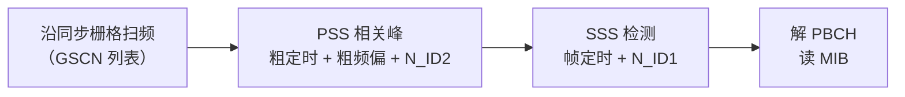

# 控制面主线概念笔记批次 1 Implementation Plan

> **For agentic workers:** REQUIRED SUB-SKILL: Use superpowers:subagent-driven-development (recommended) or superpowers:executing-plans to implement this plan task-by-task. Steps use checkbox (`- [ ]`) syntax for tracking.

**Goal:** 按全链路规划阶段 0 + 阶段 1 控制面主线：结构修复（Pilot 挂载 + T0.1 补分支）+ 6 篇控制面概念笔记（TBCC/PSS_SSS/PBCH/PDCCH/DCI/PUCCH）+ 同步清单 + 工具只扩 TBCC + 全量验证 + 双推。

**Architecture:** 按拷问锁定版 `docs/superpowers/plans/PLAN-control-plane-batch1.md` 执行。变更文件：新建概念笔记 6 个、修改图谱入口/术语表/T0.1 3 个、修改审计工具 1 个。每个任务「内容 → 验证 → 提交」闭环。

**Tech Stack:** Markdown + LaTeX（--syntax-only）+ 项目 audit 工具链。

## Global Constraints

- 所有命令在仓库根 `/home/yys/AGENT/obsidian` 下以 `cd 3gpp && …` 运行。
- 标题正式化（Rule 16）；带圈数字禁令（第 10 条）；英文术语首现**完整三件套**「中文（English Full Name, ABBR）」（Rule 10——A1/B1/B2 三次返工教训，本计划内容已按此写定，逐字转写即可）。
- 概念笔记六段式模板（独立解释任务/科学定义/直观模型/常见误解/协议锚点/图谱关联，末行「关系语义：…」）。
- wikilink 只指向已存在或本计划内将创建的目标（幽灵节点教训）；本计划内创建顺序：TBCC/PSS_SSS 先于被引用者。
- 协议溯源精确到 TS 编号 + 章节号 + 本地 processed 路径；LTE 侧锚点（TS 36.212/36.211）与 NR 侧（TS 38.211/38.212/38.213/38.331）分别标注。
- 工具缺失（KaTeX）显式声明验证缺口。
- 提交后 `git push origin master`（双推，收尾任务统一执行）。

---

### Task C0: 阶段 0 结构修复（Pilot 挂载 + T0.1 补控制面分支）

**Files:**
- Modify: `3gpp/docs/concepts/概念图谱入口.md`（「信道与信号」组挂载 Pilot）
- Modify: `3gpp/docs/L0_协议阅读引导/T0.1_LTE_NR_decoder_protocol_reading_map.md`（补控制面/上行分支小节）

**Interfaces:**
- Produces: Pilot 孤儿节点修复；T0.1 阅读地图覆盖控制面/上行分支，Task C1-C6 笔记的导航锚点。

- [ ] **Step 1: Pilot 挂载**

Run: `grep -n "Soft_Demodulation_软解调" 3gpp/docs/concepts/概念图谱入口.md`
Expected: 行号 M（「信道与信号」组内）。在 M 行前或后（保持组内逻辑）追加：`- [[Pilot_导频]]`

- [ ] **Step 2: T0.1 补控制面/上行分支小节**

Run: `grep -n "三条学习路径\|最小 descriptor 思维" 3gpp/docs/L0_协议阅读引导/T0.1_LTE_NR_decoder_protocol_reading_map.md`
Expected: 行号 N1/N2。在「三条学习路径」小节之后插入（前后各留空行）：

```markdown
## 控制面与上行链路分支

译码三条主线之外，全链路还有两个分支：控制面与上行链路。控制面（PDCCH/DCI/PUCCH/UCI）是译码主线的调度入口——DCI 经 PDCCH 盲检拿到后解析出 MCS/TBS/RV 等 descriptor 字段（T9.0），Polar 译码在控制信道上的 CRC/RNTI 边界见 T10.6/T10.8，UCI 交织见 T10.9。上行链路与下行共用译码核心，差异在波形（DFT-s-OFDM）、功率控制与随机接入（PRACH）。分支的概念锚点：[[TBCC_咬尾卷积码]]、[[PSS_SSS_同步信号与小区搜索]]、[[PBCH_MIB_广播信道]]、[[PDCCH_物理下行控制信道]]、[[DCI_下行控制信息]]、[[PUCCH_上行控制信道与UCI]]。
```

注意：本小节 wikilink 指向 Task C1-C6 将创建的笔记（本计划内创建，非幽灵节点；C0 执行时目标尚未存在，link_integrity 审计在 C7 后统一跑）。

- [ ] **Step 3: 提交**

```bash
cd /home/yys/AGENT/obsidian && git add "3gpp/docs/concepts/概念图谱入口.md" "3gpp/docs/L0_协议阅读引导/T0.1_LTE_NR_decoder_protocol_reading_map.md" && git commit -m "docs(sync): 阶段0 结构修复——Pilot 挂载概念图谱入口 + T0.1 补控制面/上行分支

Co-Authored-By: Claude <noreply@anthropic.com>"
```

---

### Task C1: 新建概念笔记 `docs/concepts/TBCC_咬尾卷积码.md`

**Files:**
- Create: `3gpp/docs/concepts/TBCC_咬尾卷积码.md`

**Interfaces:**
- Produces: 该文件，Task C3（PBCH LTE 侧）与 Task C4（PDCCH 编码）引用；挂在概念图谱入口「Turbo 译码」组。

- [ ] **Step 1: 写完整概念笔记**

```markdown
---
type: definition
aliases:
  - 咬尾卷积码
  - TBCC
  - Tail Biting Convolutional Code
tags:
  - 3gpp
  - concepts
  - coding
  - l2
source_spec: "TS 36.212 Rel-19 §5.1.3.1; TS 36.211 Rel-19 §6.8"
---

# TBCC 咬尾卷积码

咬尾卷积码（Tail Biting Convolutional Code, TBCC）是 LTE 控制信道的信道编码：PDCCH（物理下行控制信道）与 PBCH（物理广播信道）的比特都用它编码。它与 Turbo 的分量码一样是卷积码，但不用收尾比特（tail bits）——编码器的初态被设为"信息比特尾部对应的状态"，使网格首尾相连成环，零比特率损失。它没有迭代译码，是译码器三族（Turbo/LDPC/Polar）之外的第四块拼图。

## 独立解释任务

任务目标：讲清 TBCC 的咬尾机制与普通卷积码（含收尾）的区别、编码结构与译码方式（Viterbi/BCJR），说明它在 LTE 控制信道中的位置，以及与 Turbo 分量码递归系统卷积码（Recursive Systematic Convolutional Code, RSC）的关系与区别。

## 科学定义

### 卷积码基础与收尾问题

卷积码是有限状态机（约束长度 K 的移位寄存器），编码输出依赖当前输入与寄存器状态。一个信息块编码结束时，寄存器停在哪个状态不确定——若把寄存器清零（zero termination）需要追加收尾比特，浪费码率且引入额外约束。咬尾（tail-biting）的解法：**让初始状态 = 信息比特末尾（最后 K-1 个比特）对应的状态**，编码结束后寄存器自然回到初始状态，网格首尾相连成环——零收尾开销。

### LTE TBCC 结构（TS 36.212 §5.1.3.1）

- 约束长度 K = 7（6 级移位寄存器），生成多项式 g0 = 133、g1 = 171、g2 = 165（八进制），码率 1/3（每信息比特输出 3 个校验比特）。
- 咬尾初始化：寄存器初态 = 输入信息比特的最后 6 比特对应的状态。
- 输出三路：g0 路、g1 路、g2 路（三条校验比特流），交织后送入速率匹配（LTE 控制信道速率匹配与数据信道不同，见 TS 36.212 §5.1.4.2 的三路交织）。

### 与 RSC/Turbo 的关系（易混淆点）

| 维度 | TBCC | Turbo 分量码（RSC） |
|:---|:---|:---|
| 网格收尾 | 咬尾（初态=末态，无尾比特） | 网格终止（trellis termination，12 个尾比特归零） |
| 迭代 | 无（单次网格译码） | 有（双 SISO 迭代交换外信息） |
| 反馈 | 非递归（生成多项式无反馈项） | 递归（RSC 有反馈，是 Turbo 成立的前提） |
| 用途 | LTE PDCCH/PBCH | LTE 数据信道（Turbo 分量） |

### 译码：Viterbi 与 BCJR

- 硬判决：Viterbi 算法沿网格找最大似然路径（咬尾网格要求"路径的初态=末态"，标准做法是多次扫描或 trellis 展开）。
- 软判决：BCJR/MAP 在咬尾网格上做前向后向递推（LTE 接收端常用软判决，与 T6.5 BCJR 同一数学，但无迭代、无外信息交换）。
- 对比：TBCC 译码是"单程"的，复杂度远低于 Turbo 迭代，可靠性也低于 Turbo——这正是控制信道（短块、可靠性要求中等）用 TBCC、数据信道用 Turbo 的原因。

## 直观模型

普通卷积码收尾像"停车后必须把车倒回库位"（收尾比特）；咬尾像"环形赛道"——发车位置就是终点位置，车在环上跑一圈，头尾自然相接，没有停车开销。译码就是沿着环形赛道找最可能的整圈路径。

## 常见误解

| 误解 | 正确理解 |
|:---|:---|
| TBCC 是 Turbo 的一种 | TBCC 是普通卷积码（非递归、无迭代），Turbo 是 RSC 双分量迭代码——两者编码结构不同 |
| 咬尾 = 零收尾（zero termination） | 零收尾是"补尾比特归零"，咬尾是"初态=末态无尾比特"，机制不同、码率开销不同 |
| LTE 控制信道也用 Turbo | 数据信道用 Turbo，PDCCH/PBCH 用 TBCC（码率 1/3、短块、无迭代） |
| TBCC 译码和 Turbo 一样要迭代 | TBCC 单程 Viterbi/BCJR 即可，无外信息交换 |

## 协议锚点

- TBCC 编码：TS 36.212（Rel-19 j30）§5.1.3.1，本地 `3GPP_Rel19/processed/TS_36.212_36212-j30`。
- PDCCH 物理处理：TS 36.211（Rel-19 j30）§6.8，本地 `TS_36.211_*`。
- 控制信道速率匹配：TS 36.212 §5.1.4.2（三路交织）。
- 注意：NR 的 PDCCH/PBCH 用 Polar 编码（见 [[Polar_码]] 与 [[PDCCH_物理下行控制信道]]），TBCC 是 LTE 专属——不要把两代控制编码混为一谈。

## 图谱关联

- [[概念图谱入口]]
- [[Turbo_码]]
- [[RSC_Code_递归系统卷积码]]
- [[PDCCH_物理下行控制信道]]
- 关系语义：TBCC 是 LTE 控制信道（PDCCH/PBCH）的编码，与 Turbo（数据）在同一套卷积码家族里分工；理解它需要 RSC/网格基础（Turbo 组），又为 PDCCH 盲检（控制信道组）提供编码侧知识。
```

- [ ] **Step 2: 验证结构、LaTeX、圈号**

Run:

```bash
cd 3gpp && test -f "docs/concepts/TBCC_咬尾卷积码.md" && grep -c "^## " "docs/concepts/TBCC_咬尾卷积码.md" && python3 tools/audit_latex_render.py --syntax-only "docs/concepts/TBCC_咬尾卷积码.md" 2>&1 | tail -2 && python3 tools/audit_circled_digits.py 2>&1 | tail -1
```

Expected: `6`；latex syntax-only 通过；圈号无新增 FAIL。

- [ ] **Step 3: 提交**

```bash
cd /home/yys/AGENT/obsidian && git add "3gpp/docs/concepts/TBCC_咬尾卷积码.md" && git commit -m "docs(concepts): 新增 TBCC 咬尾卷积码概念笔记（LTE 控制信道编码）

Co-Authored-By: Claude <noreply@anthropic.com>"
```

---

### Task C2: 新建概念笔记 `docs/concepts/PSS_SSS_同步信号与小区搜索.md`

**Files:**
- Create: `3gpp/docs/concepts/PSS_SSS_同步信号与小区搜索.md`

**Interfaces:**
- Produces: 该文件，Task C3（PBCH 衔接）引用；挂在概念图谱入口「发送链路」组。

- [ ] **Step 1: 写完整概念笔记**

```markdown
---
type: definition
aliases:
  - 同步信号
  - 小区搜索
  - PSS SSS SSB
  - Cell Search
tags:
  - 3gpp
  - concepts
  - physical-layer
  - l1
source_spec: "TS 38.211 Rel-19 §7.4.2/§7.4.3; TS 36.211 §6.11"
---

# PSS SSS 同步信号与小区搜索

同步信号（PSS/SSS）是 UE 开机后第一个要找的东西：PSS（主同步信号，Primary Synchronization Signal）与 SSS（辅同步信号，Secondary Synchronization Signal）一起让 UE 完成符号/帧定时、频率粗同步并推导物理小区 ID，随后才能解 PBCH（物理广播信道，Physical Broadcast Channel）拿到系统信息。小区搜索（Cell Search）就是"沿同步栅格扫频 → 找 PSS/SSS → 推小区 ID → 读 PBCH"的完整流程——它是全链路的第一步，也是 [[Spectrum_and_Frequency_Point_频谱与频点]] 中同步栅格设计的落地场景。

## 独立解释任务

任务目标：讲清 PSS/SSS 的作用、序列结构与小区 ID 推导、SSB（同步信号块，Synchronization Signal Block）的时频结构，以及小区搜索流程如何与同步栅格、定时同步（T2.7）和频偏同步（T2.8）衔接。

## 科学定义

### PSS/SSS 的必要性

UE 开机时不知道小区频率、定时、小区 ID 的任何信息。PSS/SSS 提供三个功能：(1) 粗定时（符号级/帧级）——相关峰给出边界；(2) 粗频偏估计——相关峰的位置与相位含 CFO（载波频偏，Carrier Frequency Offset）信息（T2.8 利用 PSS/SSS 相关）；(3) 小区 ID 推导。

### 序列结构与小区 ID

NR（TS 38.211 §7.4.2）：

- PSS：长度 127 的 m 序列（BPSK（二进制相移键控，Binary Phase Shift Keying）调制），3 个取值对应 $N_{\mathrm{ID}}^{(2)} \in \{0,1,2\}$。
- SSS：两个 m 序列交织（长度 127），携带 $N_{\mathrm{ID}}^{(1)} \in \{0,\ldots,335\}$。
- 物理小区 ID：$N_{\mathrm{ID}}^{\mathrm{cell}} = 3 N_{\mathrm{ID}}^{(1)} + N_{\mathrm{ID}}^{(2)}$（共 1008 个）。

LTE（TS 36.211 §6.11）：PSS 用 Zadoff-Chu 序列（62 长），SSS 用两个 m 序列；ID 推导逻辑相同（504 个小区 ID）。

### SSB 时频结构（NR）

- SSB = PSS + SSS + PBCH + PBCH DM-RS（解调参考信号，Demodulation Reference Signal），占 4 个符号 × 240 子载波（20 RB）。
- 频域位置由同步栅格（GSCN）决定（TS 38.101-1 §5.4.3.1，见 [[Spectrum_and_Frequency_Point_频谱与频点]]）；时域按 SSB 突发集（SSB burst set）周期性发送（5/10/20 ms 等）。
- SSB 索引（SSB index）隐含在 DM-RS 序列/PBCH 内容中，用于多波束场景区分波束。

### 小区搜索流程



## 直观模型

小区搜索像"深夜在陌生城市找电台"：先按频率表（同步栅格）扫一圈找到有信号的频道（PSS 相关峰），再听台呼（SSS 确认是哪个台），最后听报站信息（PBCH/MIB（主信息块，Master Information Block））确定频道内容。

## 常见误解

| 误解 | 正确理解 |
|:---|:---|
| PSS 就能完成同步 | PSS 只给符号级粗定时与粗频偏，帧定时要 SSS，精细同步靠 T2.7/T2.8 的跟踪环路 |
| 同步信号是数据信号 | PSS/SSS 是固定序列的参考信号，不承载用户数据，仅用于同步与 ID |
| 小区 ID 从 PBCH 读 | 小区 ID 由 PSS+SSS 直接推导（$N_{\mathrm{ID}}^{(1)}$ 有 336 个取值、$N_{\mathrm{ID}}^{(2)}$ 有 3 个取值，共 336×3=1008 个），PBCH 只给帧号等系统信息 |
| SSB = PSS + SSS | SSB 还含 PBCH 与 PBCH DM-RS——同步与广播是一体的 |

## 协议锚点

- NR PSS/SSS：TS 38.211（Rel-19 j30）§7.4.2，本地 `3GPP_Rel19/processed/TS_38.211_38211-j30`。
- NR SSB 结构与位置：TS 38.211 §7.4.3，本地同卷。
- LTE PSS/SSS：TS 36.211（Rel-19 j30）§6.11，本地 `TS_36.211_*`。
- 同步栅格/GSCN：TS 38.101-1 §5.4.3.1（本地 `TS_38.101_38101-1-j60_s00-0504/content.md` 1141 行起，已核验）。
- 与接收链路衔接：T2.7（定时同步）、T2.8（CFO/SFO）——PSS/SSS 相关峰是它们的输入。

## 图谱关联

- [[概念图谱入口]]
- [[Spectrum_and_Frequency_Point_频谱与频点]]
- [[Timing_Sync_定时同步]]
- [[Gold_序列加扰]]
- [[PBCH_MIB_广播信道]]
- 关系语义：小区搜索是接收链路的第一个环节——同步栅格决定搜哪里（频谱与频点），PSS/SSS 给定时与 ID（T2.7/T2.8 的输入），PBCH 把搜索流程接到系统信息获取（广播信道）。
```

- [ ] **Step 2: 验证结构、Mermaid、LaTeX、圈号**

Run:

```bash
cd 3gpp && test -f "docs/concepts/PSS_SSS_同步信号与小区搜索.md" && grep -c "^## " "docs/concepts/PSS_SSS_同步信号与小区搜索.md" && bash tools/audit_mermaid_syntax.sh docs/concepts && python3 tools/audit_latex_render.py --syntax-only "docs/concepts/PSS_SSS_同步信号与小区搜索.md" 2>&1 | tail -2 && python3 tools/audit_circled_digits.py 2>&1 | tail -1
```

Expected: `6`；mermaid exit 0（或显式声明缺口）；latex 通过；圈号无新增 FAIL。
注意：本笔记 wikilink `[[PBCH_MIB_广播信道]]` 指向 Task C3 将创建的笔记（计划内创建，存在性在 C7 后统一审计）。

- [ ] **Step 3: 提交**

```bash
cd /home/yys/AGENT/obsidian && git add "3gpp/docs/concepts/PSS_SSS_同步信号与小区搜索.md" && git commit -m "docs(concepts): 新增 PSS SSS 同步信号与小区搜索概念笔记（小区搜索全流程）

Co-Authored-By: Claude <noreply@anthropic.com>"
```

---

### Task C3: 新建概念笔记 `docs/concepts/PBCH_MIB_广播信道.md`

**Files:**
- Create: `3gpp/docs/concepts/PBCH_MIB_广播信道.md`

**Interfaces:**
- Produces: 该文件；挂在概念图谱入口「发送链路」组。

- [ ] **Step 1: 写完整概念笔记**

```markdown
---
type: definition
aliases:
  - 广播信道
  - PBCH MIB
  - 主信息块
tags:
  - 3gpp
  - concepts
  - physical-layer
  - l1
source_spec: "TS 38.331 Rel-19 §6.2.2; TS 38.212 §7.1; TS 36.211 §6.6"
---

# PBCH MIB 广播信道

PBCH（物理广播信道，Physical Broadcast Channel）承载 MIB（主信息块，Master Information Block）——小区搜索的最后一步：UE 解出 PSS/SSS（主同步信号/辅同步信号，Primary/Secondary Synchronization Signal）拿到小区 ID 后，再解 PBCH 读出 MIB，MIB 里给出接入小区所需的最少系统参数，并指向 SIB1（系统信息块 1，System Information Block 1）的调度位置。NR 的 PBCH 用 Polar（极化码，Polar Code）编码、LTE 的 PBCH 用 TBCC（咬尾卷积码，Tail Biting Convolutional Code）编码——两代广播信道编码不同，但"MIB → SIB1 → 其他 SIB"的层级结构一致。

## 独立解释任务

任务目标：讲清 MIB 承载哪些字段、PBCH 的编码与加扰（NR Polar / LTE TBCC）、MIB 如何指向 SIB1，以及 PBCH 在 SSB（同步信号块，Synchronization Signal Block）内的位置与接收端解调流程。

## 科学定义

### MIB 内容（TS 38.331 §6.2.2，NR）

| 字段 | 含义 | 用途 |
|:---|:---|:---|
| systemFrameNumber | 系统帧号（System Frame Number, SFN）高 6 位 | 帧定时（低 4 位由 PBCH 载荷附加位携带） |
| subCarrierSpacingCommon | SIB1/PRACH（物理随机接入信道，Physical Random Access Channel）的公共子载波间隔 | 接入配置 |
| ssb-SubcarrierOffset | SSB 与资源网格的频域偏移 | 网格对齐 |
| dmrs-TypeA-Position | DMRS（解调参考信号，Demodulation Reference Signal）Type A 位置 | PDSCH（物理下行共享信道，Physical Downlink Shared Channel）解调配置 |
| pdcch-ConfigSIB1 | SIB1 的 PDCCH（物理下行控制信道，Physical Downlink Control Channel）调度配置（CORESET（控制资源集，Control Resource Set）0 + 搜索空间 0） | 指向 SIB1 |

### PBCH 编码与加扰

- NR：PBCH 载荷 32 bit（MIB 24 bit + 8 bit SSB 索引/半帧指示等额外位），加 16 bit CRC 后 Polar 编码（与 PDCCH 同族，见 [[Polar_码]] 与 [[PDCCH_物理下行控制信道]]）；加扰序列初始化仅依赖物理小区 ID，半帧指示位与 SSB 索引位属载荷比特；承载于 SSB 内 PBCH 符号。
- LTE：MIB（14 bit 含 10 bit 保护间隔）→ TBCC 编码（见 [[TBCC_咬尾卷积码]]），40 ms 周期（4 帧），承载于 PBCH 资源（传输信道为 BCH）。
- 接收端：解 PBCH 需要先有小区 ID（PSS/SSS 给出，用于解扰）与信道估计（PBCH DM-RS（解调参考信号，Demodulation Reference Signal））。

### MIB → SIB1 衔接

MIB 中的 pdcch-ConfigSIB1 直接给出 SIB1 的 PDCCH（CORESET 0/搜索空间 0）配置——UE 解完 MIB 立刻去盲检 SIB1 的 PDCCH，拿到 SIB1 的 PDSCH 调度后解 SIB1；SIB1 再给出其他 SIB 的调度。这就是"最小系统信息（MIB+SIB1）→ 其他系统信息"的层级。

## 直观模型

MIB 像"电台的频率报时"：报出频道号（SFN）、信号制式（子载波间隔）和"下一档节目在哪个台"（PDCCH-ConfigSIB1）；听众按提示换台才能听到完整节目（SIB1 及后续系统信息）。

## 常见误解

| 误解 | 正确理解 |
|:---|:---|
| MIB 包含全部系统信息 | MIB 只有最少接入参数，其余在 SIB1 与后续 SIB（SIB2 起）里 |
| PBCH 是数据信道 | PBCH 是广播控制信道，不承载用户数据 |
| NR 与 LTE 的 PBCH 编码相同 | NR 用 Polar、LTE 用 TBCC——两代编码不同 |
| 解 PBCH 不需要小区 ID | PBCH 加扰依赖小区 ID，必须先解 PSS/SSS |

## 协议锚点

- MIB 字段：TS 38.331（Rel-19 j20）§6.2.2，本地 `3GPP_Rel19/processed/TS_38.331_38331-j20`。
- PBCH 编码（Polar）：TS 38.212（Rel-19 j30）§7.1，本地 `TS_38.212_38212-j30`。
- PBCH 物理结构与位置：TS 38.211（Rel-19 j30）§7.3.3/§7.4.3，本地 `TS_38.211_38211-j30`。
- LTE PBCH：TS 36.211（Rel-19 j30）§6.6（物理结构）、TS 36.212 §5.1.3.1（TBCC 咬尾卷积编码），本地 `TS_36.211_*`/`TS_36.212_*`。
- SIB 调度：TS 38.321（Rel-19 j20）§5.3.1（MAC 层系统信息调度），本地 `3GPP_Rel19/processed/TS_38.321_38321-j20`。

## 图谱关联

- [[概念图谱入口]]
- [[PSS_SSS_同步信号与小区搜索]]
- [[TBCC_咬尾卷积码]]
- [[Polar_码]]
- [[PDCCH_物理下行控制信道]]
- 关系语义：PBCH 是小区搜索流程的终点产出（MIB），其编码随制式不同（NR Polar/LTE TBCC）分别挂到两个编码家族；pdcch-ConfigSIB1 字段把广播信道接到控制信道（PDCCH）盲检。
```

- [ ] **Step 2: 验证结构、LaTeX、圈号**

Run:

```bash
cd 3gpp && test -f "docs/concepts/PBCH_MIB_广播信道.md" && grep -c "^## " "docs/concepts/PBCH_MIB_广播信道.md" && python3 tools/audit_latex_render.py --syntax-only "docs/concepts/PBCH_MIB_广播信道.md" 2>&1 | tail -2 && python3 tools/audit_circled_digits.py 2>&1 | tail -1
```

Expected: `6`；latex 通过；圈号无新增 FAIL。

- [ ] **Step 3: 提交**

```bash
cd /home/yys/AGENT/obsidian && git add "3gpp/docs/concepts/PBCH_MIB_广播信道.md" && git commit -m "docs(concepts): 新增 PBCH MIB 广播信道概念笔记（MIB 字段与编码）

Co-Authored-By: Claude <noreply@anthropic.com>"
```

---

### Task C4: 新建概念笔记 `docs/concepts/PDCCH_物理下行控制信道.md`

**Files:**
- Create: `3gpp/docs/concepts/PDCCH_物理下行控制信道.md`

**Interfaces:**
- Produces: 该文件；挂在概念图谱入口「发送链路」组；C1（TBCC）与 C3（PBCH）引用它。

- [ ] **Step 1: 写完整概念笔记**

```markdown
---
type: definition
aliases:
  - 物理下行控制信道
  - PDCCH
  - 盲检
tags:
  - 3gpp
  - concepts
  - physical-layer
  - l2
source_spec: "TS 38.213 Rel-19 §10; TS 38.211 Rel-19 §7.3.2"
---

# PDCCH 物理下行控制信道

PDCCH（物理下行控制信道，Physical Downlink Control Channel）承载 DCI（下行控制信息，Downlink Control Information）——基站调度指令的载体。UE 在每个监测时机（monitor occasion）对一组候选 PDCCH 做盲检测（blind decoding）：不知道 DCI 发给谁、多大、放在哪，就按聚合等级逐个试，用 CRC（循环冗余校验，Cyclic Redundancy Check）加扰的 RNTI（无线网络临时标识，Radio Network Temporary Identifier）判断"这是不是给我的"。盲检是全链路调度入口的核心机制，也是控制面最独特的工程问题。

## 独立解释任务

任务目标：讲清 PDCCH 的时频结构（CORESET/REG/CCE/聚合等级）、搜索空间、盲检流程与 RNTI 机制，说明为什么控制信道需要盲检而数据信道不需要，并与 Polar（极化码，Polar Code）控制译码（T10.6）和 DCI 解析（[[DCI_下行控制信息]]）衔接。

## 科学定义

### 时频结构（NR，TS 38.213 §10 / TS 38.211 §7.3.2）

| 概念 | 定义 |
|:---|:---|
| CORESET | 控制资源集（Control Resource Set）：PDCCH 可占用的时频资源块（频域 RB 集 + 时域 1-3 符号） |
| REG | 资源元素组（Resource Element Group）：1 个 PRB × 1 个 OFDM 符号 |
| CCE | 控制信道单元（Control Channel Element）：6 个 REG（NR 常用 3 REG 一组交织），CCE 是 PDCCH 分配的最小单位 |
| 聚合等级 | 1/2/4/8/16——一个 PDCCH 占用的 CCE 数，决定编码率（聚合越大码率越低越可靠） |
| 搜索空间 | 一组候选 PDCCH 位置（monitor occasion + 聚合等级组合），分 CSS（公共搜索空间，Common Search Space）与 USS（UE 专用搜索空间，UE-specific Search Space） |

### 盲检流程

1. UE 在每个监测时机，按搜索空间配置的候选集（特定 CCE 位置组合），对每个候选做：解调 → Polar 译码 → CRC 校验。
2. 候选的 CRC 用某个 RNTI（无线网络临时标识，Radio Network Temporary Identifier）加扰——UE 用自己的 RNTI 集（C-RNTI/SI-RNTI/RA-RNTI 等）逐个解扰尝试，CRC 通过即"这是我的 DCI"。
3. DCI 大小（payload 长度）预先由配置限定（多个 DCI 格式候选），盲检在不同 DCI 大小间也需尝试。
4. 复杂度：候选数 × RNTI 数 × DCI 大小数——这就是"盲"的代价，工程上用搜索空间配置与聚合等级限制候选总数（UE 能力约束盲检次数上限）。

### 盲检的必要性

UE 没有专用寻址信道，DCI 也没有显式"收件人地址"——收件人信息藏在 CRC 加扰的 RNTI 里。协议选择盲检换取信令简洁：不做"先分配再通知"的两步过程，UE 自己试错。代价是接收复杂度，收益是控制信令零配置开销。

### 编码：Polar（NR）/ TBCC（LTE）

- NR：DCI → CRC（24 bit，RNTI 加扰）→ Polar 编码（见 [[Polar_码]] 与 T10.6 的 CRC/RNTI 边界）。
- LTE：DCI → CRC（16 bit，RNTI 加扰）→ TBCC 编码（见 [[TBCC_咬尾卷积码]]）。

## 直观模型

PDCCH 盲检像"信箱没有门牌号的集体邮箱"：邮差（基站）把信（DCI）放进某个格子（CCE），居民（UE）每天按固定时段（monitor occasion）检查自己常看的格子组合（搜索空间），用钥匙（RNTI）试开——能打开的就是自己的信。收件人地址不在信封上，而在锁芯里。

## 常见误解

| 误解 | 正确理解 |
|:---|:---|
| PDCCH 只在下行 | PDCCH 是下行信道，但承载的 DCI 也调度上行（UL grant） |
| 盲检 = 随机猜 | 盲检按搜索空间配置的确定候选集试，非随机——复杂度受候选数约束 |
| RNTI 是用户地址 | RNTI 是临时标识，加扰在 CRC 上，不是 DCI 里的地址字段 |
| 聚合等级越大越好 | 聚合大=更可靠但占用 CCE 多，调度器按信道质量选择——1/2/4/8/16 自适应 |

## 协议锚点

- PDCCH 监测与搜索空间：TS 38.213（Rel-19 j20）§10，本地 `3GPP_Rel19/processed/TS_38.213_38213-j30`。
- PDCCH 结构与 CCE/REG：TS 38.211（Rel-19 j30）§7.3.2，本地 `TS_38.211_38211-j30`。
- RNTI 类型：TS 38.321（Rel-19 j20）§7.1（RNTI 值表），本地 `3GPP_Rel19/processed/TS_38.321_38321-j20`。
- LTE PDCCH：TS 36.211 §6.8（物理结构）、TS 36.212 §5.3.3（DCI 编码 TBCC），本地 `TS_36.211_*`/`TS_36.212_36212-j30`。
- 与译码衔接：Polar 控制译码的 CRC/RNTI 边界见 T10.6/T10.8（`docs/L2_协议算法/`）。

## 图谱关联

- [[概念图谱入口]]
- [[DCI_下行控制信息]]
- [[TBCC_咬尾卷积码]]
- [[Polar_码]]
- [[Physical_Channels_物理信道]]
- [[PBCH_MIB_广播信道]]
- 关系语义：PDCCH 是控制面调度入口——盲检拿到 DCI（下行控制信息）→ 解析出 descriptor 字段（T9.0）；其编码随制式（NR Polar/LTE TBCC）挂到两个编码家族；MIB 的 pdcch-ConfigSIB1 把广播信道接到这里的 CORESET 0 盲检。
```

- [ ] **Step 2: 验证结构、LaTeX、圈号**

Run:

```bash
cd 3gpp && test -f "docs/concepts/PDCCH_物理下行控制信道.md" && grep -c "^## " "docs/concepts/PDCCH_物理下行控制信道.md" && python3 tools/audit_latex_render.py --syntax-only "docs/concepts/PDCCH_物理下行控制信道.md" 2>&1 | tail -2 && python3 tools/audit_circled_digits.py 2>&1 | tail -1
```

Expected: `6`；latex 通过；圈号无新增 FAIL。

- [ ] **Step 3: 提交**

```bash
cd /home/yys/AGENT/obsidian && git add "3gpp/docs/concepts/PDCCH_物理下行控制信道.md" && git commit -m "docs(concepts): 新增 PDCCH 物理下行控制信道概念笔记（CORESET/CCE/盲检/RNTI）

Co-Authored-By: Claude <noreply@anthropic.com>"
```

---

### Task C5: 新建概念笔记 `docs/concepts/DCI_下行控制信息.md`

**Files:**
- Create: `3gpp/docs/concepts/DCI_下行控制信息.md`

**Interfaces:**
- Produces: 该文件；挂在概念图谱入口「发送链路」组；C4（PDCCH）引用它。

- [ ] **Step 1: 写完整概念笔记**

```markdown
---
type: definition
aliases:
  - 下行控制信息
  - DCI
  - DCI 格式
tags:
  - 3gpp
  - concepts
  - protocol
  - l2
source_spec: "TS 38.212 Rel-19 §7.3; TS 36.212 §5.3.3"
---

# DCI 下行控制信息

DCI（下行控制信息，Downlink Control Information）是基站下发给 UE 的调度指令——"这次传输给你什么、在哪、怎么收"。它由 PDCCH 承载（[[PDCCH_物理下行控制信道]] 盲检获得），解析出的字段直接生成译码器的 descriptor（T9.0）：MCS（调制与编码方案，Modulation and Coding Scheme）、资源分配、HARQ（混合自动重传请求，Hybrid Automatic Repeat Request）进程号、NDI、RV 等。DCI 是控制面与译码链路的接口——不理解 DCI 字段，就不知道 LLR 从哪来、译码结果交给谁。

## 独立解释任务

任务目标：讲清 DCI 的格式体系（0_0/0_1/1_0/1_1/2_x）、核心字段语义（资源分配/MCS/HARQ/NDI/RV/TPC）、CRC 与 RNTI（无线网络临时标识，Radio Network Temporary Identifier）加扰，以及 DCI 解析如何映射到译码器 descriptor（与 T9.0 衔接）。

## 科学定义

### DCI 格式体系（NR，TS 38.212 §7.3）

| 格式 | 用途 | 关键差异 |
|:---|:---|:---|
| 0_0 / 0_1 | UL grant（上行授权） | 0_1 支持更多配置（波束/CBG/多载波） |
| 1_0 / 1_1 | DL assignment（下行调度分配） | 1_1 支持更多配置 |
| 2_0/2_1/2_2/2_3 | 组公共（Group Common） | 时隙格式/抢占指示/功率控制，发给一组 UE |

### 核心字段语义（以 DL assignment 1_x 为例）

| 字段 | 语义 | 与译码链路的关系 |
|:---|:---|:---|
| 频域资源分配 | RB 分配位图/起始 RB+长度 | 决定 PDSCH（物理下行共享信道，Physical Downlink Shared Channel）在网格哪里（T2.3） |
| 时域资源分配 | 时域资源索引 → 起始符号+长度 | 决定符号位置 |
| MCS | 调制阶数 + 目标码率（T2.5/T9.0） | 直接进 descriptor |
| HARQ 进程号 | 进程索引（0-N） | 软缓存地址（T9.3） |
| NDI | 新数据指示（New Data Indicator） | 新传/重传判定（覆盖写 vs 增量写，T9.7） |
| RV | 冗余版本（Redundancy Version） | 循环缓存读取起点（T7.3/T9.3） |
| TPC | 发射功率控制命令（Transmit Power Control Command） | 上行功率控制 |

### CRC 与 RNTI

DCI 附 CRC（循环冗余校验，Cyclic Redundancy Check；NR 24 bit / LTE 16 bit），CRC 用 RNTI 加扰（XOR，异或，Exclusive OR）——盲检时 UE 用候选 RNTI 解扰，CRC 通过即匹配。不同 RNTI（C-RNTI/SI-RNTI/RA-RNTI/TC-RNTI 等）区分 DCI 发给谁/给什么用（详见 [[PDCCH_物理下行控制信道]] 与 T10.6）。

### DCI → Descriptor 映射（与 T9.0 衔接）

DCI 解析不是译码算法的一部分，但它生产译码器消费的元数据：T9.0 的 descriptor（MCS/Qm/R/TBS/RV/CBG）几乎全部来自 DCI 字段 + RRC 配置。接收链路：PDCCH 盲检 → DCI 解析 → descriptor 生成 → PDSCH 软解调 → 译码。

## 直观模型

DCI 像"运单"：收货人（RNTI）、货物规格（MCS/TBS）、发车时间（时域资源）、车辆编号（HARQ 进程号）、是否返厂（NDI/RV）都写在上面。运单（DCI）先于货物（PDSCH）到达，收货人按运单验收（descriptor 配置译码器）。

## 常见误解

| 误解 | 正确理解 |
|:---|:---|
| DCI 只用于下行 | 0_x 格式调度上行（UL grant），下行用 1_x |
| DCI 里直接有 TBS | DCI 给 MCS+资源分配，TBS 由 T9.0 的公式/查表算出 |
| NDI 翻转=重传 | NDI 翻转表示新传，不翻转表示重传（与 HARQ 进程号联合判定） |
| DCI 是数据信道 | DCI 是控制信息，承载于 PDCCH，不占 PDSCH |

## 协议锚点

- NR DCI 格式：TS 38.212（Rel-19 j30）§7.3，本地 `3GPP_Rel19/processed/TS_38.212_38212-j30`。
- LTE DCI 格式：TS 36.212（Rel-19 j30）§5.3.3，本地 `TS_36.212_36212-j30`。
- descriptor 生成：T9.0（`docs/L2_协议算法/T9.0_TS38214_MCS_TBS_decoder_descriptor.md`）。
- RNTI 定义：TS 38.321（Rel-19 j20）§7.1（RNTI 值表），本地 `3GPP_Rel19/processed/TS_38.321_38321-j20`。

## 图谱关联

- [[概念图谱入口]]
- [[PDCCH_物理下行控制信道]]
- [[MCS_Table_Effective_Code_Rate_MCS表与有效码率]]
- [[HARQ_混合自动重传请求]]
- [[RV_冗余版本]]
- 关系语义：DCI 是控制面与译码链路的接口——PDCCH 盲检产出 DCI，DCI 字段解析产出 descriptor（T9.0），MCS/HARQ/RV 字段分别挂到调度表、HARQ 合并与速率恢复的知识节点。
```

- [ ] **Step 2: 验证结构、LaTeX、圈号**

Run:

```bash
cd 3gpp && test -f "docs/concepts/DCI_下行控制信息.md" && grep -c "^## " "docs/concepts/DCI_下行控制信息.md" && python3 tools/audit_latex_render.py --syntax-only "docs/concepts/DCI_下行控制信息.md" 2>&1 | tail -2 && python3 tools/audit_circled_digits.py 2>&1 | tail -1
```

Expected: `6`；latex 通过；圈号无新增 FAIL。

- [ ] **Step 3: 提交**

```bash
cd /home/yys/AGENT/obsidian && git add "3gpp/docs/concepts/DCI_下行控制信息.md" && git commit -m "docs(concepts): 新增 DCI 下行控制信息概念笔记（格式体系与字段语义）

Co-Authored-By: Claude <noreply@anthropic.com>"
```

---

### Task C6: 新建概念笔记 `docs/concepts/PUCCH_上行控制信道与UCI.md`

**Files:**
- Create: `3gpp/docs/concepts/PUCCH_上行控制信道与UCI.md`

**Interfaces:**
- Produces: 该文件；挂在概念图谱入口「发送链路」组。

- [ ] **Step 1: 写完整概念笔记**

```markdown
---
type: definition
aliases:
  - 物理上行控制信道
  - PUCCH UCI
  - 上行控制信息
tags:
  - 3gpp
  - concepts
  - physical-layer
  - l2
source_spec: "TS 38.213 Rel-19 §9; TS 38.212 §6.3"
---

# PUCCH 上行控制信道与UCI

PUCCH（物理上行控制信道，Physical Uplink Control Channel）承载 UCI（上行控制信息，Uplink Control Information）——UE 回传给基站的控制反馈：HARQ-ACK（混合自动重传请求确认，Hybrid Automatic Repeat Request Acknowledgment，即下行数据收没收对的回执）、SR（调度请求，Scheduling Request，申请上行资源）与 CSI（信道状态信息，Channel State Information，报告信道质量）。PUCCH 是下行译码链路的"回执"，没有它 HARQ 重传无法闭环。

## 独立解释任务

任务目标：讲清 UCI 三兄弟（HARQ-ACK/SR/CSI）的内容、PUCCH format 0-4 的划分逻辑（短/长格式、承载容量）、UCI 在 PUCCH 与 PUSCH（物理上行共享信道，Physical Uplink Shared Channel）间的承载选择，以及 HARQ-ACK 时序（k1）如何与下行译码的 HARQ 进程衔接。

## 科学定义

### UCI 内容

| 类型 | 内容 | 大小量级 |
|:---|:---|:---|
| HARQ-ACK | 每个 TB（传输块，Transport Block）/CBG（码块组，Code Block Group）的 ACK/NACK | 1-2 bit（TB）/多 bit（CBG） |
| SR | 是否有上行数据要发（0/1 bit） | 1 bit |
| CSI | CQI/PMI/RI（信道质量/预编码/秩） | 数 bit-数十 bit |

### PUCCH format 0-4（NR，TS 38.213 §9）

| Format | 时长 | 承载能力 | 用途 |
|:---|:---|:---|:---|
| 0 | 短（1-2 符号） | ≤2 bit | HARQ-ACK/SR（序列选择编码） |
| 1 | 长（4-14 符号） | ≤2 bit | HARQ-ACK/SR（低速率扩展） |
| 2 | 短 | >2 bit | 多 bit CSI/UCI（DMRS（解调参考信号，Demodulation Reference Signal）辅助相干解调） |
| 3 | 长 | 中等 | 多 bit UCI |
| 4 | 长 | 较大（多 PRB） | 大 UCI（含 DFT-s-OFDM（离散傅里叶变换扩展正交频分复用，Discrete Fourier Transform Spread OFDM）预编码） |

### 承载选择与复用

- UCI 少且无 PUSCH → PUCCH；UCI 多或有 PUSCH → 搭 PUSCH 传输（PUSCH 内 UCI 复用，交织见 T10.9 三角交织器）。
- HARQ-ACK/SR/CSI 同时存在时按优先级与容量复用进同一 PUCCH 资源。
- HARQ-ACK 时序：下行 PDSCH（物理下行共享信道，Physical Downlink Shared Channel）在 slot n 收到 → UCI 在 slot n+k1 的 PUCCH 上报（k1 由 DCI 时域字段指示）——这就是下行译码到上行反馈的时延链路。

### PUCCH 资源分配

PUCCH 资源由高层配置（PUCCH resource set）+ DCI 的 PUCCH resource indicator 动态选择——上行反馈信道的位置由下行调度指令决定。

## 直观模型

PUCCH 像"收货确认单"：收到货（PDSCH）后回一张单子（UCI），写明"货到了没（ACK/NACK）、还有没有货要发（SR）、道路怎么样（CSI）"；单子格式按内容多少选（明信片/挂号信/快递），发货渠道（PUCCH/PUSCH）按包裹大小选。

## 常见误解

| 误解 | 正确理解 |
|:---|:---|
| PUCCH 只传 ACK/NACK | 还传 SR 与 CSI——三类控制信息都在 PUCCH/UCI 里 |
| UCI 只能走 PUCCH | UCI 可复用进 PUSCH（有上行数据时），交织规则见 T10.9 |
| PUCCH format 越大越好 | format 0-4 按容量与场景选择，短格式省资源、长格式抗覆盖 |
| HARQ 反馈时序固定 | k1 由 DCI 指示，可动态调整（时延与重传及时性权衡） |

## 协议锚点

- PUCCH 格式与资源：TS 38.213（Rel-19 j20）§9，本地 `3GPP_Rel19/processed/TS_38.213_38213-j30`。
- UCI 编码：TS 38.212（Rel-19 j30）§6.3（PUCCH 上 UCI 的 Reed-Muller/极化分段），本地 `TS_38.212_38212-j30`。
- UCI 在 PUSCH 的复用与交织：T10.9（`docs/L2_协议算法/T10.9_NR_UCI_interleaving_triangular.md`）。
- LTE PUCCH：TS 36.211 §5.4（物理结构）、TS 36.212 §5.2.3（UCI 编码）。
- HARQ 反馈语义：T9.3/T9.8（HARQ 软缓存与 CBG 反馈）。

## 图谱关联

- [[概念图谱入口]]
- [[Physical_Channels_物理信道]]
- [[HARQ_混合自动重传请求]]
- [[DCI_下行控制信息]]
- [[PDCCH_物理下行控制信道]]
- 关系语义：PUCCH 是下行译码链路的回执通道——HARQ-ACK 由译码结果（T7.4/T9.5 的 CRC 判决）驱动，按 DCI 指示的 k1 时序上报，UCI 编码与交织挂到 T10.9；与 PDCCH（下行指令）构成控制面双向闭环。
```

- [ ] **Step 2: 验证结构、LaTeX、圈号**

Run:

```bash
cd 3gpp && test -f "docs/concepts/PUCCH_上行控制信道与UCI.md" && grep -c "^## " "docs/concepts/PUCCH_上行控制信道与UCI.md" && python3 tools/audit_latex_render.py --syntax-only "docs/concepts/PUCCH_上行控制信道与UCI.md" 2>&1 | tail -2 && python3 tools/audit_circled_digits.py 2>&1 | tail -1
```

Expected: `6`；latex 通过；圈号无新增 FAIL。

- [ ] **Step 3: 提交**

```bash
cd /home/yys/AGENT/obsidian && git add "3gpp/docs/concepts/PUCCH_上行控制信道与UCI.md" && git commit -m "docs(concepts): 新增 PUCCH 上行控制信道与UCI 概念笔记（format 0-4 与承载选择）

Co-Authored-By: Claude <noreply@anthropic.com>"
```

---

### Task C7: 同步清单（图谱入口 6 行 + 术语表 4 条 + 索引 6 行 + 计数修正）

**Files:**
- Modify: `3gpp/docs/concepts/概念图谱入口.md`（「发送链路」组 5 行 + 「Turbo 译码」组 1 行）
- Modify: `3gpp/docs/L0_协议阅读引导/L0_terminology_glossary.md`（「系统与协议」节 4 条 + 索引 6 行 + 引言计数）

**Interfaces:**
- Consumes: Task C1-C6 六个笔记名。
- Produces: 术语总表 4 条（PBCH/MIB/SIB/TBCC）+ 挂载 6 行 + 索引 6 行。

- [ ] **Step 1: 图谱入口挂载 6 行**

Run: `grep -n "Physical_Channels_物理信道\|RSC_Code_递归系统卷积码" 3gpp/docs/concepts/概念图谱入口.md`
Expected: 行号 M1（发送链路组）/M2（Turbo 译码组）。在 Physical_Channels 行后追加 5 行、RSC 行后追加 1 行：

```markdown
- [[PSS_SSS_同步信号与小区搜索]]
- [[PBCH_MIB_广播信道]]
- [[PDCCH_物理下行控制信道]]
- [[DCI_下行控制信息]]
- [[PUCCH_上行控制信道与UCI]]
```
与
```markdown
- [[TBCC_咬尾卷积码]]
```

- [ ] **Step 2: 术语总表新增 4 条**

在「## 系统与协议」节（`| 数据链路层 |` 行后）追加：

```markdown
| PBCH | 物理广播信道 | Physical Broadcast Channel；承载 MIB，NR 用 Polar 编码、LTE 用 TBCC 编码。→ [[PBCH_MIB_广播信道]] |
| MIB | 主信息块 | Master Information Block；小区接入最少系统参数（SFN/公共子载波间隔/PDCCH-ConfigSIB1 等）。 |
| SIB | 系统信息块 | System Information Block；SIB1 由 MIB 指向，其余 SIB 由 SIB1 调度。 |
| TBCC | 咬尾卷积码 | Tail Biting Convolutional Code；LTE PDCCH/PBCH 信道编码，非递归无迭代。→ [[TBCC_咬尾卷积码]] |
```

- [ ] **Step 3: 概念笔记索引区追加 6 行（2 列格式）**

在「### 协议、信道与信号」分区末尾（`[[Spreading_扩频与解扩]]` 行后）追加：

```markdown
| [[TBCC_咬尾卷积码]] | LTE 控制信道编码（PDCCH/PBCH），咬尾网格零码率损失。 |
| [[PSS_SSS_同步信号与小区搜索]] | 小区搜索流程：同步栅格→PSS/SSS→小区 ID→SSB。 |
| [[PBCH_MIB_广播信道]] | MIB 字段与 PBCH 编码（NR Polar / LTE TBCC）。 |
| [[PDCCH_物理下行控制信道]] | CORESET/CCE/聚合等级/搜索空间与盲检机制。 |
| [[DCI_下行控制信息]] | DCI 格式体系与字段语义，调度指令本体。 |
| [[PUCCH_上行控制信道与UCI]] | UCI 三兄弟与 PUCCH format 0-4。 |
```

- [ ] **Step 4: 引言计数修正**

术语总表引言与索引区引言「（77 篇）」→ 修正为实测数（`ls docs/concepts/*.md | grep -v "概念图谱入口\|3GPP全流程" | wc -l`，应为 83）。

- [ ] **Step 5: 验证同步完整性**

Run:

```bash
cd 3gpp && grep -c "TBCC_咬尾卷积码\|PSS_SSS_同步信号与小区搜索\|PBCH_MIB_广播信道\|PDCCH_物理下行控制信道\|DCI_下行控制信息\|PUCCH_上行控制信道与UCI" docs/concepts/概念图谱入口.md docs/L0_协议阅读引导/L0_terminology_glossary.md && grep -c "^| PBCH \|^| MIB \|^| SIB \|^| TBCC " docs/L0_协议阅读引导/L0_terminology_glossary.md
```

Expected: 图谱入口 ≥6、术语表 ≥10（6 索引 + 4 条目）、4 条术语行齐全（输出 `4`）。

- [ ] **Step 6: 提交**

```bash
cd /home/yys/AGENT/obsidian && git add "3gpp/docs/concepts/概念图谱入口.md" "3gpp/docs/L0_协议阅读引导/L0_terminology_glossary.md" && git commit -m "docs(sync): 图谱入口挂载控制面六篇 + L0 术语总表登记 PBCH/MIB/SIB/TBCC + 计数修正

Co-Authored-By: Claude <noreply@anthropic.com>"
```

---

### Task C8: 术语工具扩展（TECH_TERMS +TBCC）+ 全量验证

**Files:**
- Modify: `3gpp/tools/audit_lesson_terms.py`（TECH_TERMS 追加 1 项）
- 无新增；FAIL 则修复对应文件。

**Interfaces:**
- Consumes: Task C0-C7 全部改动。
- Produces: TECH_TERMS 含 TBCC（T11.5 已配对，零返工）。

- [ ] **Step 1: TECH_TERMS 追加 TBCC**

在 `TECH_TERMS` 字典中（`"DSSS": ...` 行后，与既有条目同格式）追加：

```python
    "TBCC": "咬尾卷积码（Tail Biting Convolutional Code, TBCC）",
```

- [ ] **Step 2: 运行全部审计**

```bash
cd 3gpp && python3 tools/audit_markdown_headings.py docs && python3 tools/audit_lesson_terms.py docs && python3 tools/audit_latex_render.py --syntax-only docs/concepts && python3 tools/audit_circled_digits.py && python3 tools/audit_link_integrity.py && bash tools/audit_mermaid_syntax.sh docs
```

Expected: 各工具 PASS/OK。**已知处置**：`3GPP全流程_缩写概念理论清单.md:21` 存量假阳性不改；link_integrity 在 C0-C7 全部落地后应无新 FAIL（T0.1 补节的 6 个前瞻 wikilink 已在 C1-C6 创建，C0 时未创建属中间态，C8 时已闭合）；任何新 FAIL → 修复后复跑直到全绿。

- [ ] **Step 3: 提交（工具 + 如有修复）**

```bash
cd /home/yys/AGENT/obsidian && git add "3gpp/tools/audit_lesson_terms.py" && git add -A 3gpp && git commit -m "feat(tools): audit_lesson_terms TECH_TERMS 扩展 TBCC + 控制面批次审计修复（如无修复跳过 add -A 部分）

Co-Authored-By: Claude <noreply@anthropic.com>"
```

---

### Task C9: 双推提交

**Files:**
- 无代码变更。

**Interfaces:**
- Consumes: Task C0-C8 全部提交。

- [ ] **Step 1: 确认工作区干净**

Run: `git status --porcelain` → 空输出。

- [ ] **Step 2: 推送双远端**

```bash
cd /home/yys/AGENT/obsidian && git push origin master 2>&1 | tail -4
```

Expected: Gitee 与 GitHub 两处 `master -> master`；单远端失败必须报告处理。

- [ ] **Step 3: 登记执行证据**

工具缺失（KaTeX/mmdc）在此汇报中显式声明验证缺口；登记 PDCCH/PUCCH/PBCH 全库配对治理为阶段 2 前置任务（PLAN-control-plane-batch1.md「Out of scope」）。

---

## 自审记录（writing-plans 内置 + grill-me 拷问合并）

- 规格覆盖：拷问决策 4 项全部落地——范围（控制面 6 篇）→ Task C1-C6；工具（只扩 TBCC）→ Task C8；结构修复（Pilot+T0.1）→ Task C0；同步清单 → Task C7。
- 占位符：无 TBD/TODO；六篇笔记全文写入任务步骤。
- 一致性：wikilink 创建顺序正确（TBCC C1、PSS_SSS C2 先建，PBCH C3/PDCCH C4 引用已存在目标；T0.1 补节 C0 的 6 个前瞻链接在 C7 后闭合）；术语配对完整三件套（A1/B1/B2 教训——C1-C6 内容已按「中文（English Full Name, ABBR）」写定）；数值自洽（小区 ID 1008=336×3；聚合等级 1/2/4/8/16）。
- 双链：PDCCH↔DCI（C4/C5 互链）、PBCH↔PSS_SSS（C3/C2 互链）、PUCCH↔DCI/HARQ（C6 双向）；协议锚点 TS 38.213 §9/§10、TS 38.212 §6.3/§7.3 均本地存在（38.213 在 `TS_38.213_38213-j30`、38.212 在 `TS_38.212_38212-j30`）。
- 阶段 2 前置登记：PDCCH（13 篇未配对）/PUCCH（13 篇）/PBCH（6 篇）TECH_TERMS 全库治理。

