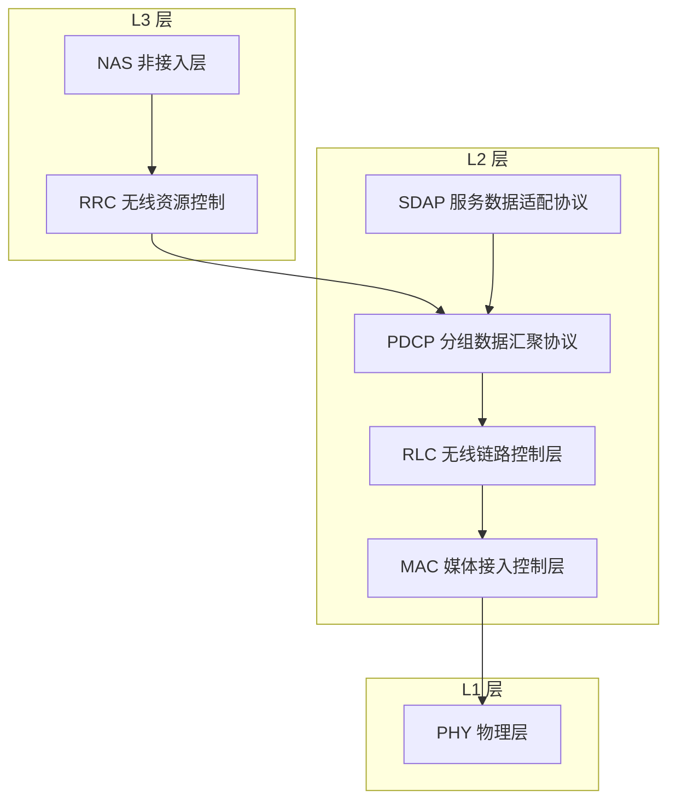

# 协议栈与 OSI 知识点入库 Implementation Plan

> **For agentic workers:** REQUIRED SUB-SKILL: Use superpowers:subagent-driven-development (recommended) or superpowers:executing-plans to implement this plan task-by-task. Steps use checkbox (`- [ ]`) syntax for tracking.

**Goal:** 把「3GPP 层2 vs OSI 数据链路层 + OSI 各层典型协议」知识点写入知识库：新建协议栈概念笔记 + T0.1 充实补节（含 Mermaid 图）+ 同步清单 + 术语审计工具扩展 + 全量验证 + 双推。

**Architecture:** 按设计文档 `docs/superpowers/specs/2026-08-11-protocol-stack-osi-design.md` + 拷问锁定版 `docs/superpowers/plans/PLAN.md`（grill-me，2026-08-11）执行。变更文件 7 个：新建概念笔记 1 个、修改讲义/入口/术语表 3 个、修改审计工具 1 个、连带修复存量讲义 2 个。无代码新逻辑、无图片资产文件、无公式；Mermaid 代码块 2 处（同一源码）。每个任务以「内容 → audit 验证 → 提交」闭环。

**Tech Stack:** Markdown + Mermaid（mmdc 渲染验证）+ 项目 audit 工具链（Python）。

## Global Constraints

- 所有命令在仓库根 `/home/yys/AGENT/obsidian` 下以 `cd 3gpp && …` 运行（工具路径为 `tools/…`）。
- Mermaid 节点一律引号节点 `id["text"]`，块首 `%%{init: {'theme': 'default'}}%%`（CLAUDE.md 第 6 条）。
- 标题正式化（Rule 16），禁止口语化；带圈数字禁令（CLAUDE.md 第 10 条）。
- 英文术语首现必须「中文（English）」（Rule 10）。
- **MAC 中文名全库统一为「媒体接入控制层」**（术语表 + 讲义既有标准；「介质访问控制」是笔误，禁止使用）。
- 概念笔记六段式模板（.claude/rules/documentation.md §三）：独立解释任务/科学定义/直观模型/常见误解/协议锚点/图谱关联，末行「关系语义：…」。
- wikilink 只指向已存在或本计划将要创建的目标（幽灵节点教训）。
- 协议溯源精确到 TS 编号 + 章节号 + 本地 processed 路径（Rule 2）。
- 工具缺失（mmdc/KaTeX）必须显式声明验证缺口，不得默认通过。
- 提交后 `git push origin master`（自动双推 Gitee + GitHub）。

---

### Task 1: 新建概念笔记 `docs/concepts/Protocol_Stack_协议栈.md`

**Files:**
- Create: `3gpp/docs/concepts/Protocol_Stack_协议栈.md`

**Interfaces:**
- Produces: 文件 `docs/concepts/Protocol_Stack_协议栈.md`（六段式齐全），Task 2/3 的 wikilink `[[Protocol_Stack_协议栈]]` 依赖其存在。

- [ ] **Step 1: 写完整概念笔记**

```markdown
---
type: definition
aliases:
  - 协议栈
  - Protocol Stack
  - 无线接口协议栈
tags:
  - 3gpp
  - concepts
  - protocol-stack
  - l0
source_spec: "docs/L0_协议阅读引导/T0.1_LTE_NR_decoder_protocol_reading_map.md"
---

# Protocol Stack 协议栈

3GPP 无线接口协议栈把空口协议按 L1/L2/L3 分三层：L1 物理层（PHY）、L2 的 MAC/RLC/PDCP（NR 另加 SDAP）、L3 的 RRC（控制面）及其上的 NAS。这套三层命名是 3GPP 自己的体系，与 OSI 七层参考模型只是功能上松散对应——「层2 是数据链路层吗」的答案是：功能对应，但不是同一体系。

## 独立解释任务

任务目标：用一张分层图 + 一张对照表讲清 3GPP 无线接口协议栈 L1/L2/L3 如何划分，并回答「3GPP 层2 是不是 OSI 数据链路层」。

## 科学定义

| 3GPP 层 | 子层/协议 | 一句话职责 |
|:---|:---|:---|
| L1 | PHY（物理层） | 比特/符号的调制、信道编码与空口传输 |
| L2 | MAC（媒体接入控制层） | 逻辑信道复用、HARQ、调度 |
| L2 | RLC（无线链路控制层） | 分段重组、ARQ 重传（TM/UM/AM 三模式） |
| L2 | PDCP（分组数据汇聚协议） | 加解密、头压缩、重排序 |
| L2 | SDAP（服务数据适配协议，NR 独有） | QoS 流到无线承载的映射 |
| L3 | RRC（无线资源控制，控制面） | 配置与连接管理；其上为 NAS（非接入层） |

- 用户面 L2 为 SDAP/PDCP/RLC/MAC，控制面在 PDCP 之上换成 RRC/NAS（TS 38.300 §4.4.1/§4.4.2）。
- **层2 是多个子层的集合**，不是单一协议。

## OSI 七层与各层典型协议

OSI（Open Systems Interconnection，开放式系统互联）参考模型把网络功能分为七层，每层有代表性协议：

| OSI 层 | 典型协议/技术 | 一句话职责 |
|:---|:---|:---|
| 应用层 L7 | HTTP、FTP、SMTP、DNS、SSH | 面向用户应用 |
| 表示层 L6 | TLS/SSL（部分观点）、JPEG、ASCII | 数据表示/加密/压缩 |
| 会话层 L5 | RPC、NetBIOS | 会话建立与管理 |
| 传输层 L4 | TCP、UDP | 端到端传输 |
| 网络层 L3 | IP、ICMP、IPsec | 寻址与路由 |
| 数据链路层 L2 | 以太网 MAC、IEEE 802.11、PPP | 相邻节点成帧与差错控制 |
| 物理层 L1 | 以太网物理收发、光纤 | 比特传输 |

**TCP/IP 四层对照**：互联网实际实现是 TCP/IP 模型（链路层 ≈ OSI L1+L2、网络层 ≈ OSI L3、传输层 ≈ OSI L4、应用层 ≈ OSI L5-L7）。OSI 是参考模型，不是实现清单。

## 直观模型

用户数据像寄信：贴面单（SDAP 标记 QoS 流）→ 装信封并加密（PDCP）→ 拆成包裹（RLC 分段）→ 装进卡车（MAC 成帧 + HARQ）→ 发车（PHY 空口传输）；分拣中心按地址路由类比网络层，柜台收件回执类比传输层。



## 常见误解

| 误解 | 正确理解 |
|:---|:---|
| 3GPP 层2 就是 OSI 数据链路层 | 功能对应但体系不同——3GPP 自有三层命名，OSI 映射是教学类比，非 3GPP 标准 |
| PDCP 加密/完整性保护属链路层 | OSI 语境中加密属上层（表示层附近）功能 |
| RRC 是网络层 | RRC 是控制面配置/连接管理协议，无寻址路由功能 |
| OSI 七层是实际实现 | 实际互联网是 TCP/IP 四层；OSI 是参考模型 |

## 协议锚点

- TS 38.300（Rel-19 j20）§4.4 Radio Protocol Architecture（§4.4.1 用户面、§4.4.2 控制面）、§6 Layer 2 —— 本地 `3GPP_Rel19/processed/TS_38.300_38300-j20/content.md`（§4.4 自 2461 行、§6 自 3373 行，已核验）。
- TS 36.300（j10）§6 Layer 2 —— 本地 `3GPP_Rel19/processed/TS_36.300_36300-j10/content.md`（已核验存在；LTE 侧更精确的协议架构章节号实施时登记）。
- 注意：OSI 映射为教学类比，非 3GPP 标准术语；OSI 七层表属参考模型知识，非协议强制要求。

## 图谱关联

- [[概念图谱入口]]
- [[Physical_Channels_物理信道]]
- [[T0.1_LTE_NR_decoder_protocol_reading_map]]
- 关系语义：协议栈分层是所有协议解读的总坐标系——物理信道（L1）与后续 MAC/RLC/PDCP 内容（L2）都挂在这棵树上；「层2 vs OSI 数据链路层」是进入 L2 系列前必须厘清的教学定位。
```

- [ ] **Step 2: 验证文件结构与审计**

Run（在仓库根）：

```bash
cd 3gpp && test -f docs/concepts/Protocol_Stack_协议栈.md && grep -c "^## " docs/concepts/Protocol_Stack_协议栈.md
```

Expected: 文件存在且输出 `7`（六段式 6 段 + OSI 七层独立子节）。再运行 `cd 3gpp && python3 tools/audit_circled_digits.py 2>&1 | tail -2`，Expected: 无带圈数字 FAIL。

- [ ] **Step 3: Mermaid 块可渲染性验证（限定 concepts 范围）**

Run: `cd 3gpp && bash tools/audit_mermaid_syntax.sh docs/concepts`
Expected: exit 0，全部块可渲染；若报 `mmdc: command not found` 等环境缺失 → 在提交信息与「执行与证据记录」中显式声明验证缺口，不得默认通过。

- [ ] **Step 4: 提交**

```bash
cd /home/yys/AGENT/obsidian && git add "3gpp/docs/concepts/Protocol_Stack_协议栈.md" && git commit -m "docs(concepts): 新增 Protocol Stack 协议栈概念笔记（L1/L2/L3 分层 + OSI 七层协议对照）

Co-Authored-By: Claude <noreply@anthropic.com>"
```

---

### Task 2: T0.1 补节「3GPP 分层与 OSI 模型」

**Files:**
- Modify: `3gpp/docs/L0_协议阅读引导/T0.1_LTE_NR_decoder_protocol_reading_map.md`（在「协议分册如何分工」表格末行与 `## 协议发送端顺序与接收端逆序` 之间插入）

**Interfaces:**
- Consumes: Task 1 创建的概念笔记（wikilink `[[Protocol_Stack_协议栈]]`）。
- Produces: T0.1 新增小节（含 Mermaid 图 + 整合对照表），Task 3 术语表 wikilink 与本节互为双链。

- [ ] **Step 1: 定位插入点并插入补节**

Run: `grep -n "协议发送端顺序与接收端逆序" 3gpp/docs/L0_协议阅读引导/T0.1_LTE_NR_decoder_protocol_reading_map.md`
Expected: 行号 N（当前为 79）。在 N-1 行（「协议分册如何分工」表格末行）与 N 行之间插入以下内容（`## 3GPP 分层与 OSI 模型` 与上下文各留一个空行）：

```markdown
## 3GPP 分层与 OSI 模型

译码器工作在 L1 与 L2 的 MAC 交付边界：物理层译码产出的 TB 校验结果（ACK/NACK）就是交付给 MAC 层的信号，认清分层才能定位协议分册。3GPP 无线接口协议栈自有三层命名（不是 OSI 七层模型）：L1 物理层（PHY）、L2 的 MAC（媒体接入控制层）、RLC（无线链路控制层）、PDCP（分组数据汇聚协议）三个子层（NR 另加 SDAP（服务数据适配协议））、L3 的 RRC（无线资源控制，控制面）及其上的 NAS（非接入层）。协议锚点：TS 38.300 §4.4、§6（本地 `3GPP_Rel19/processed/TS_38.300_38300-j20/content.md`）。


图注：3GPP 用户面与控制面协议栈合并示意，参照 TS 38.300 Figure 4.4.1-1/4.4.2-1。层2 = SDAP/PDCP/RLC/MAC 子层的集合；**图示为 NR（含 SDAP），LTE 用户面无 SDAP**。

「3GPP 层2 是数据链路层吗」——功能对应，但不是同一体系。对应关系如下：

| 3GPP 层 | 子层/协议 | OSI 对应层（教学类比） | OSI 该层典型协议 | 职责概述 |
|:---|:---|:---|:---|:---|
| L3 | RRC、NAS | 网络层及以上（粗略） | IP、TCP/UDP | 配置、连接管理、接入控制——RRC 无路由功能 |
| L2 | SDAP/PDCP/RLC/MAC | 数据链路层（功能对应） | 以太网 MAC、IEEE 802.11、PPP | 成帧、复用、分段、重传、加密、HARQ |
| L1 | PHY | 物理层（对应良好） | 以太网物理层、光纤 | 比特/符号传输、调制、信道编码 |

差异要点：(1) 体系不同——3GPP 自有三层命名，OSI 映射是教学类比而非 3GPP 标准；(2) PDCP 的加密/完整性保护在 OSI 语境属上层功能，不在数据链路层；(3) 实际互联网是 TCP/IP 四层模型，OSI 七层只是参考模型。层2 各子层职责与 OSI 各层协议的完整对照见 [[Protocol_Stack_协议栈]]。
```

注意：内嵌 mermaid 代码块的外层三反引号在插入时用真实代码围栏（本计划文档为嵌套展示用四反引号）。

- [ ] **Step 2: 验证插入与 Mermaid**

Run:

```bash
cd 3gpp && grep -n "3GPP 分层与 OSI 模型\|协议发送端顺序与接收端逆序" docs/L0_协议阅读引导/T0.1_LTE_NR_decoder_protocol_reading_map.md && bash tools/audit_mermaid_syntax.sh docs/L0_协议阅读引导
```

Expected: 新小节位于「协议发送端顺序与接收端逆序」之前；mermaid 脚本 exit 0（或显式声明缺口）。

- [ ] **Step 3: 提交**

```bash
cd /home/yys/AGENT/obsidian && git add "3gpp/docs/L0_协议阅读引导/T0.1_LTE_NR_decoder_protocol_reading_map.md" && git commit -m "docs(lectures): T0.1 补节 3GPP 分层与 OSI 模型（Mermaid 分层图 + 整合对照表 + 译码桥接）

Co-Authored-By: Claude <noreply@anthropic.com>"
```

---

### Task 3: 同步清单（图谱入口 + L0 术语总表）

**Files:**
- Modify: `3gpp/docs/concepts/概念图谱入口.md`（「协议结构」章节末尾追加 1 行）
- Modify: `3gpp/docs/L0_协议阅读引导/L0_terminology_glossary.md`（「系统与协议」节追加 5 行 + 「概念笔记索引」→「### 协议、信道与信号」分区追加 1 行）

**Interfaces:**
- Consumes: Task 1 笔记名 `Protocol_Stack_协议栈`。
- Produces: 术语总表 5 项（OSI/协议栈/数据链路层/PDCP/SDAP）+ 图谱入口挂载行 + 概念笔记索引行（2 列格式）。

- [ ] **Step 1: 图谱入口挂载**

Run: `grep -n "MCS_Table_Effective_Code_Rate" 3gpp/docs/concepts/概念图谱入口.md`
Expected: 行号 M（当前为 41）。在 M 行后追加：

```markdown
- [[Protocol_Stack_协议栈]]
```

- [ ] **Step 2: L0 术语总表新增 5 项**

定位 `## 系统与协议` 节（`| MAC |` 行附近，保持表内按逻辑顺序），在 `| MAC |` 行后追加以下 5 行：

```markdown
| OSI | 开放式系统互联参考模型 | Open Systems Interconnection Reference Model；七层参考模型。3GPP 分层与之是功能类比而非同一体系。 |
| 协议栈 | 协议栈 | Protocol Stack；无线接口 L1/L2/L3 分层体系，层2 = MAC/RLC/PDCP（NR 加 SDAP）。→ [[Protocol_Stack_协议栈]] |
| PDCP | 分组数据汇聚协议 | Packet Data Convergence Protocol；层2 子层，负责加解密、头压缩与重排序。 |
| SDAP | 服务数据适配协议 | Service Data Adaptation Protocol；NR 层2 子层，QoS 流到无线承载映射。 |
| 数据链路层 | 数据链路层 | Data Link Layer；OSI 第二层，负责相邻节点成帧与差错控制；与 3GPP 层2 功能对应。 |
```

- [ ] **Step 3: 概念笔记索引区更新（2 列格式，协议信道信号分区）**

Run: `grep -n "协议、信道与信号" 3gpp/docs/L0_协议阅读引导/L0_terminology_glossary.md`
Expected: 行号 K（当前为 212）。查看该分区现有行格式（2 列：`| [ [笔记]] | 一句话 |`），在分区末尾（下个 `###` 前）追加：

```markdown
| [[Protocol_Stack_协议栈]] | 3GPP L1/L2/L3 分层与 OSI 七层模型对照。 |
```

- [ ] **Step 4: 验证同步完整性**

Run:

```bash
cd 3gpp && grep -c "Protocol_Stack_协议栈" docs/concepts/概念图谱入口.md docs/L0_协议阅读引导/L0_terminology_glossary.md && grep -c "^| OSI \|^| 协议栈 \|^| PDCP \|^| SDAP \|^| 数据链路层 " docs/L0_协议阅读引导/L0_terminology_glossary.md
```

Expected: 图谱入口 1 处、术语表 ≥2 处（条目 + 索引）、5 项术语行齐全（输出 `5`）。

- [ ] **Step 5: 提交**

```bash
cd /home/yys/AGENT/obsidian && git add "3gpp/docs/concepts/概念图谱入口.md" "3gpp/docs/L0_协议阅读引导/L0_terminology_glossary.md" && git commit -m "docs(sync): 图谱入口挂载 Protocol_Stack_协议栈 + L0 术语总表登记 OSI/协议栈/PDCP/SDAP/数据链路层

Co-Authored-By: Claude <noreply@anthropic.com>"
```

---

### Task 4: 术语审计工具扩展 + 存量 RLC 首现修复（grill-me 决策）

**Files:**
- Modify: `3gpp/tools/audit_lesson_terms.py`（TECH_TERMS 常量表追加 4 项）
- Modify: `3gpp/docs/L1_基础/T2.14_QAM_Max_Log_MAP_demapping.md:115`（RLC 首现配对）
- Modify: `3gpp/docs/L2_协议算法/T9.6_NR_LDPC_decoder_edge_cases.md:376`（RLC 首现配对，表格行内）

**Interfaces:**
- Consumes: 无（与 Task 1-3 独立）。
- Produces: TECH_TERMS 含 OSI/PDCP/SDAP/RLC——此后全库 L1/L2/L3 讲义中这些缩写首现必须「中文（English）」配对。

- [ ] **Step 1: TECH_TERMS 追加 4 项**

在 `tools/audit_lesson_terms.py` 的 `TECH_TERMS` 字典中（`"MAC": "媒体接入控制层（Medium Access Control, MAC）",` 行后）追加：

```python
    "OSI": "开放式系统互联参考模型（Open Systems Interconnection Reference Model, OSI）",
    "PDCP": "分组数据汇聚协议（Packet Data Convergence Protocol, PDCP）",
    "SDAP": "服务数据适配协议（Service Data Adaptation Protocol, SDAP）",
    "RLC": "无线链路控制层（Radio Link Control, RLC）",
```

- [ ] **Step 2: T2.14 RLC 首现配对**

`docs/L1_基础/T2.14_QAM_Max_Log_MAP_demapping.md:115`：`RLC 状态报告有重复的控制结构` → `RLC（无线链路控制层）状态报告有重复的控制结构`

- [ ] **Step 3: T9.6 RLC 首现配对**

`docs/L2_协议算法/T9.6_NR_LDPC_decoder_edge_cases.md:376`：`MAC/RLC 组包失败` → `MAC/RLC（无线链路控制层）组包失败`

- [ ] **Step 4: 验证全库术语审计通过**

Run: `cd 3gpp && python3 tools/audit_lesson_terms.py`
Expected: 全部 PASS（RLC 扩表后 T2.14/T9.6 已配对，其余 4 篇含 RLC 讲义原本已配对；OSI/PDCP/SDAP 在 L1/L2/L3 讲义中无裸用，预查确认）。若有未预期 FAIL，按 Task 5 Step 2 修复流程处理。

- [ ] **Step 5: 提交**

```bash
cd /home/yys/AGENT/obsidian && git add "3gpp/tools/audit_lesson_terms.py" "3gpp/docs/L1_基础/T2.14_QAM_Max_Log_MAP_demapping.md" "3gpp/docs/L2_协议算法/T9.6_NR_LDPC_decoder_edge_cases.md" && git commit -m "feat(tools): audit_lesson_terms TECH_TERMS 扩展 OSI/PDCP/SDAP/RLC + 存量 RLC 首现配对修复

Co-Authored-By: Claude <noreply@anthropic.com>"
```

---

### Task 5: 全量验证与修复

**Files:**
- 无新增；如审计 FAIL 则修复对应文件。

**Interfaces:**
- Consumes: Task 1-4 的全部改动。

- [ ] **Step 1: 运行全部审计**

```bash
cd 3gpp && python3 tools/audit_markdown_headings.py && python3 tools/audit_lesson_terms.py && python3 tools/audit_latex_render.py --syntax-only docs/L0_协议阅读引导 docs/concepts && python3 tools/audit_circled_digits.py && python3 tools/audit_link_integrity.py && bash tools/audit_mermaid_syntax.sh
```

Expected: 各工具输出 PASS/OK（`LINK_INTEGRITY_AUDIT_OK`、mermaid exit 0）；latex 无公式场景 `--syntax-only` 通过；任何 FAIL → 进入 Step 2，无 FAIL → 跳到 Step 3。
注：`audit_markdown_headings.py` / `audit_lesson_terms.py` 若需路径参数则用全库默认运行方式（工具自带 DOC_ROOTS）。

- [ ] **Step 2: 修复 FAIL 并复跑**

按工具输出逐条修复（如术语首现缺「中文（English）」、标题口语化、死链、mermaid 块语法），修复后重跑 Step 1 全部命令，直到全绿。

- [ ] **Step 3: 提交（如有修复）**

```bash
cd /home/yys/AGENT/obsidian && git add -A 3gpp && git commit -m "fix(docs): 协议栈与 OSI 知识点审计修复（如无修复跳过此步）

Co-Authored-By: Claude <noreply@anthropic.com>"
```

---

### Task 6: 双推提交

**Files:**
- 无代码变更。

**Interfaces:**
- Consumes: Task 1-5 全部提交（本地 master）。

- [ ] **Step 1: 确认工作区干净**

Run: `git status --porcelain`
Expected: 空输出（或仅未跟踪的 spec/plan 文档——确认已提交）。

- [ ] **Step 2: 推送双远端**

```bash
cd /home/yys/AGENT/obsidian && git push origin master 2>&1 | tail -4
```

Expected: 输出含 Gitee 与 GitHub 两处 `master -> master`（或 `Everything up-to-date` 对已推远端）；若单远端已推、另一远端失败，必须报告并处理（双推要求，lesson-dual-push）。

- [ ] **Step 3: 登记执行证据**

若 Task 1 Step 3 / Task 5 Step 1 存在工具缺失（mmdc/KaTeX），在此步骤的汇报中显式声明验证缺口；全部通过则汇报全绿。

---

## 自审记录（writing-plans 内置 + grill-me 拷问合并）

- 规格覆盖：设计文档 §4（概念笔记）→ Task 1；§5（T0.1 补节）→ Task 2；§6（同步清单）→ Task 3；§7（验证）→ Task 5；§8-9（验收/提交）→ Task 6。设计 §6 未显式列「术语表概念笔记索引」更新，已在 Task 3 Step 3 补入。
- **grill-me 拷问修复（2026-08-11，见 PLAN.md）**：(1) MAC 中文名统一「媒体接入控制层」（全库标准）；(2) 概念笔记索引区 2 列格式 + 「### 协议、信道与信号」分区；(3) 图注注明 NR/LTE 差异（LTE 无 SDAP）；(4) 补节开头加译码主线桥接句；(5) TECH_TERMS 扩展 OSI/PDCP/SDAP/RLC + T2.14/T9.6 连带修复（Task 4）。
- 占位符：无 TBD/TODO；所有 Markdown 内容全文写入任务步骤。
- 一致性：wikilink 目标 `Protocol_Stack_协议栈` 在 Task 1 创建后于 Task 2/3 引用；Mermaid 源码两处一致（Task 1 直观模型 + Task 2 补节）；术语表 5 行与设计 §6.2 一致。
- 双链：概念笔记 ↔ T0.1（Task 1 图谱关联 `[[T0.1_LTE_NR_decoder_protocol_reading_map]]` + Task 2 补节 `[[Protocol_Stack_协议栈]]`）闭环。
