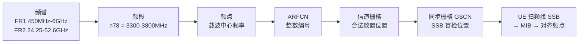

# 频谱与频点知识点入库 Implementation Plan

> **For agentic workers:** REQUIRED SUB-SKILL: Use superpowers:subagent-driven-development (recommended) or superpowers:executing-plans to implement this plan task-by-task. Steps use checkbox (`- [ ]`) syntax for tracking.

**Goal:** 把「频谱和频点」（核心答案 + 深入讲解有机结合）写入知识库：新建概念笔记 + T2.3 充实前置补节（Mermaid 坐标链图 + ARFCN 公式）+ 同步清单 + 术语工具扩展（ARFCN/GSCN）+ 全量验证 + 双推。

**Architecture:** 按拷问锁定版 `docs/superpowers/plans/PLAN-spectrum-frequency-point.md`（grill-me，2026-08-11）执行。变更文件 6 个：新建概念笔记 1 个、修改讲义/入口/术语表 3 个、修改审计工具 1 个、连带修复存量讲义 1 个。Mermaid 代码块 1 处（T2.3 补节）；LaTeX 块级公式 2 处（补节 1 + 概念笔记 1，NR 版；概念笔记另含 LTE 版公式）。每个任务以「内容 → audit 验证 → 提交」闭环。

**Tech Stack:** Markdown + Mermaid（mmdc 渲染验证）+ LaTeX（KaTeX/--syntax-only 验证）+ 项目 audit 工具链。

## Global Constraints

- 所有命令在仓库根 `/home/yys/AGENT/obsidian` 下以 `cd 3gpp && …` 运行。
- Mermaid 节点一律引号节点 `id["text"]`，块首 `%%{init: {'theme': 'default'}}%%`（CLAUDE.md 第 6 条）。
- LaTeX 块级公式成对双美元围栏 + 独立成行 + 运算符前换行缩进（Rule 20/文档格式规范）。
- 标题正式化（Rule 16）；带圈数字禁令（第 10 条）；英文术语首现「中文（English）」（Rule 10）。
- MAC 中文名统一「媒体接入控制层」；**频段/频点/栅格术语以本计划术语表 9 行为准**。
- 概念笔记六段式模板（.claude/rules/documentation.md §三），末行「关系语义：…」。
- wikilink 只指向已存在或本计划将要创建的目标。
- 协议溯源精确到 TS 编号 + 章节号 + 本地 processed 路径（Rule 2）。
- 工具缺失（mmdc/KaTeX）必须显式声明验证缺口，不得默认通过。
- 提交后 `git push origin master`（双推）。**执行顺序**：本计划在协议栈计划（2026-08-11-protocol-stack-osi.md）SDD 流全部完成后执行，两流不混跑。

---

### Task A1: 新建概念笔记 `docs/concepts/Spectrum_and_Frequency_Point_频谱与频点.md`

**Files:**
- Create: `3gpp/docs/concepts/Spectrum_and_Frequency_Point_频谱与频点.md`

**Interfaces:**
- Produces: 该文件（六段式齐全），Task A2/A3 的 wikilink 依赖其存在。

- [ ] **Step 1: 写完整概念笔记**

```markdown
---
type: definition
aliases:
  - 频谱与频点
  - Spectrum and Frequency Point
  - ARFCN 频点定位
tags:
  - 3gpp
  - concepts
  - physical-layer
  - l1
source_spec: "docs/L1_基础/T2.3_NR_frequency_resource_grid.md"
---

# Spectrum and Frequency Point 频谱与频点

频谱是电磁波按频率的连续范围，频段是 3GPP 对它的划分块，频点是频段内一个具体的载波中心频率，ARFCN（绝对射频信道号，Absolute Radio Frequency Channel Number）把这个频率编码成整数，信道栅格（channel raster）规定频点合法放置的离散位置，同步栅格（synchronization raster）是 UE（用户设备，User Equipment）盲检 SSB（同步信号块，Synchronization Signal Block）的稀疏搜索位置。这条链是接收端在时间同步之外首先要完成的频率定位——「频点怎么从连续频率变成协议整数」是本节要回答的问题。

## 独立解释任务

任务目标：讲清频谱 → 频段 → 频点 → ARFCN → 信道栅格/同步栅格的完整关系链，回答「频点如何从连续频率变成协议整数」，并说明 UE 开机找小区时沿哪条栅格搜索。

## 科学定义

| 概念 | 定义 | 协议载体 |
|:---|:---|:---|
| 频谱 | 电磁波按频率的连续排列；3GPP 划分 FR1（Frequency Range 1，450 MHz–6 GHz）与 FR2（Frequency Range 2，24.25–52.6 GHz） | TS 38.101-1 §5.2 |
| 频段 | 频谱的划分块：NR n1–n104、LTE 1–105；如 n78 = 3300–3800 MHz（TDD，时分双工，Time Division Duplexing）、n1 上下行成对（FDD，频分双工，Frequency Division Duplexing） | TS 38.101-1 表 5.2-1 / TS 36.101 表 5.5-1 |
| 频点 | 频段内具体的载波中心频率（如 3450 MHz） | RRC（无线资源控制，Radio Resource Control）信令（absoluteFrequencyPointA 等） |
| ARFCN | 频点的整数编号：NR-ARFCN（绝对射频信道号，N_REF）与 E-UTRA ARFCN（N_DL） | TS 38.101-1 §5.4.2.1 / TS 36.101 §5.7.3 |
| 信道栅格 | 频点合法放置的离散位置集（ΔF_Global 整数倍） | TS 38.104 §5.4.2 |
| 同步栅格 | SSB 中心可放置的更稀疏位置集，用 GSCN（全球同步信道号，Global Synchronization Channel Number）编号 | TS 38.101-1 §5.4.3.1 / TS 38.104 §5.4.3 |

**ARFCN 公式**（频率 ↔ 编号互转）：

NR（TS 38.101-1 §5.4.2.1，ΔF_Global 随频段 5/15/60/100 kHz 不等）：

$$
F_{\mathrm{ref}} = F_{\mathrm{REF\_Offs}} + \Delta F_{\mathrm{Global}} \times (N_{\mathrm{REF}} - N_{\mathrm{REF\_Offs}})
$$

LTE（TS 36.101 §5.7.3，步长固定 100 kHz）：

$$
F_{\mathrm{DL}} = F_{\mathrm{DL\_Low}} + 0.1 \times (N_{\mathrm{DL}} - N_{\mathrm{Offs\_DL}})
$$

信令里传的是编号而不是浮点频率——精确、省比特、无浮点歧义。

## 直观模型

街道类比：频谱是整个城市的街道网络（连续范围）；频段是街区（n78 小区）；频点是具体的门牌位置；ARFCN 是邮政编码规则（把位置变成整数编号）；信道栅格是门牌号的允许步进（只能挂奇数号）；同步栅格是只有大街口才有的大地址标记牌（GSCN）——找小区先找大街口，再精确定位门牌。

## 常见误解

| 误解 | 正确理解 |
|:---|:---|
| 频谱 = 频段 | 频段是 3GPP 对频谱的划分块（n78…），频谱是整个连续范围 |
| 频点 = ARFCN | ARFCN 是频点的整数编号，频率与编号靠公式互转 |
| 信道栅格 = 同步栅格 | 同步栅格是信道栅格的稀疏子集（SSB 专用），用 GSCN 编号 |
| UE 盲检沿信道栅格全扫 | 沿同步栅格（GSCN 列表）扫，把搜索空间收敛到几十个候选 |

## 协议锚点

- NR 频段表：TS 38.101-1 §5.2（表 5.2-1），本地 `3GPP_Rel19/processed/TS_38.101_38101-1-j60_s00-0504/content.md`。
- NR-ARFCN：TS 38.101-1 §5.4.2.1（表 5.4.2.1-1），本地 `3GPP_Rel19/processed/TS_38.101_38101-1-j60_s00-0504/content.md`（§5.4.2.1 在 1085 行、§5.4.3.1 在 1141 行起，已核验）。
- 同步栅格/GSCN：TS 38.101-1 §5.4.3.1（表 5.4.3.1-1），本地同卷 1141 行起（已核验）。
- 信道栅格：TS 38.104 §5.4.2，本地 `3GPP_Rel19/processed/TS_38.104_38104-j50`。
- LTE 频段/ARFCN：TS 36.101 §5.7.3（表 5.7.3-1），本地 `3GPP_Rel19/processed/TS_36.101_36101-j60_s00-07`。

## 图谱关联

- [[概念图谱入口]]
- [[T2.3_NR_frequency_resource_grid]]
- [[T2.8_OFDM_CFO_SFO_frequency_synchronization]]
- 关系语义：频谱定位是资源网格（T2.3）与频率同步（T2.8）的公共前置——先知道「频点在哪」，才能谈资源网格对齐与频偏校正；ARFCN 是信令侧的频率坐标语言。
```

- [ ] **Step 2: 验证文件结构与审计**

Run:

```bash
cd 3gpp && test -f "docs/concepts/Spectrum_and_Frequency_Point_频谱与频点.md" && grep -c "^## " "docs/concepts/Spectrum_and_Frequency_Point_频谱与频点.md" && python3 tools/audit_latex_render.py --syntax-only docs/concepts/Spectrum_and_Frequency_Point_频谱与频点.md 2>&1 | tail -3
```

Expected: 输出 `6`（六段式）；latex 审计 syntax-only 通过（公式围栏成对、\tag 不强制——本计划公式不编号，块级公式无 \tag 允许；若工具强制 \tag 则按工具提示补 `\tag{1}` 系列）。

- [ ] **Step 3: 提交**

```bash
cd /home/yys/AGENT/obsidian && git add "3gpp/docs/concepts/Spectrum_and_Frequency_Point_频谱与频点.md" && git commit -m "docs(concepts): 新增 Spectrum and Frequency Point 频谱与频点概念笔记（ARFCN 公式 + 栅格对照）

Co-Authored-By: Claude <noreply@anthropic.com>"
```

---

### Task A2: T2.3 前置补节「频谱、频点与 ARFCN」

**Files:**
- Modify: `3gpp/docs/L1_基础/T2.3_NR_frequency_resource_grid.md`（「前置知识检查」小节与「RE：时频二维的最小粒度」小节之间插入）

**Interfaces:**
- Consumes: Task A1 概念笔记（wikilink `[[Spectrum_and_Frequency_Point_频谱与频点]]`）。
- Produces: T2.3 新增前置小节（Mermaid 坐标链图 + ARFCN 公式）。

- [ ] **Step 1: 定位插入点**

Run: `grep -n "前置知识检查\|RE：时频二维的最小粒度" 3gpp/docs/L1_基础/T2.3_NR_frequency_resource_grid.md`
Expected: 两个行号 N1（「前置知识检查」）与 N2（「RE」）。在 N2 行（RE 小节标题）之前插入以下内容（前后各留一个空行）：

```markdown
## 频谱、频点与 ARFCN：资源网格的绝对坐标

Point A 是频域公共参考原点，但 Point A 本身挂在一个绝对频率坐标上——这个坐标由「频谱 → 频段 → 频点 → ARFCN」链条给出。频谱是电磁波按频率的连续范围，3GPP 把它划分成频段（NR 如 n78 = 3300–3800 MHz，FR1 为 450 MHz–6 GHz、FR2 为 24.25–52.6 GHz）；运营商在频段内选一个频点（载波中心频率），协议用 ARFCN（绝对射频信道号）把它编码成整数——例如 `absoluteFrequencyPointA` 就是一个 NR-ARFCN 值，信令只传编号不传浮点频率。



频点 → 编号的公式（TS 38.101-1 §5.4.2.1）：

$$
F_{\mathrm{ref}} = F_{\mathrm{REF\_Offs}} + \Delta F_{\mathrm{Global}} \times (N_{\mathrm{REF}} - N_{\mathrm{REF\_Offs}})
$$

UE 开机沿同步栅格（GSCN（全球同步信道号）列表）盲检 SSB，读到 MIB 后用 ARFCN 对齐小区频点——栅格是「路网」，频点是「停车位」。本节之后 RE/PRB/CRB 的编号都从 Point A 这个绝对坐标出发。完整关系链见 [[Spectrum_and_Frequency_Point_频谱与频点]]。
```

注意：内嵌 mermaid 代码块外层三反引号（本计划文档用四反引号嵌套展示）。

- [ ] **Step 2: 验证插入、Mermaid 与 LaTeX**

Run:

```bash
cd 3gpp && grep -n "频谱、频点与 ARFCN" docs/L1_基础/T2.3_NR_frequency_resource_grid.md && bash tools/audit_mermaid_syntax.sh docs/L1_基础 && python3 tools/audit_latex_render.py --syntax-only docs/L1_基础/T2.3_NR_frequency_resource_grid.md 2>&1 | tail -3
```

Expected: 小节存在且位于 RE 小节前；mermaid exit 0（或显式声明缺口）；latex syntax-only 通过。

- [ ] **Step 3: 提交**

```bash
cd /home/yys/AGENT/obsidian && git add "3gpp/docs/L1_基础/T2.3_NR_frequency_resource_grid.md" && git commit -m "docs(lectures): T2.3 前置补节 频谱频点与 ARFCN（Mermaid 坐标链图 + 公式）

Co-Authored-By: Claude <noreply@anthropic.com>"
```

---

### Task A3: 同步清单（图谱入口 + L0 术语总表）

**Files:**
- Modify: `3gpp/docs/concepts/概念图谱入口.md`（「信道与信号」章节末尾追加 1 行）
- Modify: `3gpp/docs/L0_协议阅读引导/L0_terminology_glossary.md`（「系统与协议」节追加 9 行 + 「概念笔记索引」→「### 协议、信道与信号」分区追加 1 行）

**Interfaces:**
- Consumes: Task A1 笔记名。
- Produces: 术语总表 9 项 + 图谱入口挂载行 + 概念笔记索引行（2 列格式）。

- [ ] **Step 1: 图谱入口挂载**

Run: `grep -n "LLR_Quantization_LLR量化" 3gpp/docs/concepts/概念图谱入口.md`
Expected: 行号 M。在 M 行后追加：

```markdown
- [[Spectrum_and_Frequency_Point_频谱与频点]]
```

- [ ] **Step 2: L0 术语总表新增 9 项**

在 `## 系统与协议` 节（`| 3GPP |` 行附近起始处，保持表内逻辑顺序）追加以下 9 行：

```markdown
| 频谱 | 频谱 | Frequency Spectrum；电磁波按频率的连续范围，3GPP 划分 FR1/FR2 频段。→ [[Spectrum_and_Frequency_Point_频谱与频点]] |
| 频段 | 频段 | Frequency Band；3GPP 对频谱的划分块（NR n1-n104、LTE 1-105），如 n78 = 3300-3800 MHz。 |
| 频点 | 频点 | Frequency Point；频段内具体载波中心频率，用 ARFCN 整数编号表达。 |
| FR1 | 频率范围 1 | Frequency Range 1；450 MHz-6 GHz 中低频段。 |
| FR2 | 频率范围 2 | Frequency Range 2；24.25-52.6 GHz 毫米波频段。 |
| ARFCN | 绝对射频信道号 | Absolute Radio Frequency Channel Number；频点的整数编号：NR-ARFCN（TS 38.101-1 §5.4.2.1）/ E-UTRA ARFCN（TS 36.101 §5.7.3）。 |
| GSCN | 全球同步信道号 | Global Synchronization Channel Number；同步栅格上 SSB 参考位置编号（TS 38.101-1 §5.4.3.1）。 |
| 信道栅格 | 信道栅格 | Channel Raster；频点合法放置的离散位置集，步长 ΔF_Global（TS 38.104 §5.4.2）。 |
| 同步栅格 | 同步栅格 | Synchronization Raster；SSB 中心可放置的更稀疏位置集，用 GSCN 编号，UE 盲检搜索位置。 |
```

- [ ] **Step 3: 概念笔记索引区更新（2 列格式，协议信道信号分区）**

Run: `grep -n "协议、信道与信号" 3gpp/docs/L0_协议阅读引导/L0_terminology_glossary.md`
Expected: 行号 K。在该分区（`### 协议、信道与信号` 起）末尾追加：

```markdown
| [[Spectrum_and_Frequency_Point_频谱与频点]] | 频谱→频段→频点→ARFCN→栅格定位链。 |
```

- [ ] **Step 4: 验证同步完整性**

Run:

```bash
cd 3gpp && grep -c "Spectrum_and_Frequency_Point_频谱与频点" docs/concepts/概念图谱入口.md docs/L0_协议阅读引导/L0_terminology_glossary.md && grep -c "^| 频谱 \|^| 频段 \|^| 频点 \|^| FR1 \|^| FR2 \|^| ARFCN \|^| GSCN \|^| 信道栅格 \|^| 同步栅格 " docs/L0_协议阅读引导/L0_terminology_glossary.md
```

Expected: 图谱入口 1 处、术语表 ≥2 处（条目 + 索引）、9 项术语行齐全（输出 `9`）。

- [ ] **Step 5: 提交**

```bash
cd /home/yys/AGENT/obsidian && git add "3gpp/docs/concepts/概念图谱入口.md" "3gpp/docs/L0_协议阅读引导/L0_terminology_glossary.md" && git commit -m "docs(sync): 图谱入口挂载频谱频点笔记 + L0 术语总表登记 9 项（ARFCN/GSCN/栅格/频段等）

Co-Authored-By: Claude <noreply@anthropic.com>"
```

---

### Task A4: 术语审计工具扩展（ARFCN/GSCN）+ T2.8 配对修复

**Files:**
- Modify: `3gpp/tools/audit_lesson_terms.py`（TECH_TERMS 追加 2 项）
- Modify: `3gpp/docs/L1_基础/T2.8_OFDM_CFO_SFO_frequency_synchronization.md:418`（GSCN 首现配对）

**Interfaces:**
- Consumes: 无。
- Produces: TECH_TERMS 含 ARFCN/GSCN；ARFCN 零返工（T2.3 已配对），GSCN 修复 T2.8 一处。

- [ ] **Step 1: TECH_TERMS 追加 2 项**

在 `TECH_TERMS` 字典中（`"MAC": ...` 行后，与既有条目同格式）追加：

```python
    "ARFCN": "绝对射频信道号（Absolute Radio Frequency Channel Number, ARFCN）",
    "GSCN": "全球同步信道号（Global Synchronization Channel Number, GSCN）",
```

- [ ] **Step 2: T2.8 GSCN 首现配对**

`docs/L1_基础/T2.8_OFDM_CFO_SFO_frequency_synchronization.md:418`：`SSB 的参考频率位置用 SSREF/GSCN 编号` → `SSB 的参考频率位置用 SSREF/GSCN（全球同步信道号）编号`

- [ ] **Step 3: 验证全库术语审计通过**

Run: `cd 3gpp && python3 tools/audit_lesson_terms.py`
Expected: 全部 PASS（ARFCN 仅 T2.3 已配对；GSCN 仅 T2.8 已修复；FR1/FR2 未扩展不在检查范围）。若有未预期 FAIL，按 Task A5 Step 2 修复流程处理。

- [ ] **Step 4: 提交**

```bash
cd /home/yys/AGENT/obsidian && git add "3gpp/tools/audit_lesson_terms.py" "3gpp/docs/L1_基础/T2.8_OFDM_CFO_SFO_frequency_synchronization.md" && git commit -m "feat(tools): audit_lesson_terms TECH_TERMS 扩展 ARFCN/GSCN + T2.8 GSCN 首现配对修复

Co-Authored-By: Claude <noreply@anthropic.com>"
```

---

### Task A5: 全量验证与修复

**Files:**
- 无新增；如审计 FAIL 则修复对应文件。

**Interfaces:**
- Consumes: Task A1-A4 全部改动。

- [ ] **Step 1: 运行全部审计**

```bash
cd 3gpp && python3 tools/audit_markdown_headings.py && python3 tools/audit_lesson_terms.py && python3 tools/audit_latex_render.py --syntax-only docs/L1_基础/T2.3_NR_frequency_resource_grid.md docs/concepts/Spectrum_and_Frequency_Point_频谱与频点.md && python3 tools/audit_circled_digits.py && python3 tools/audit_link_integrity.py && bash tools/audit_mermaid_syntax.sh
```

Expected: 各工具输出 PASS/OK；任何 FAIL → Step 2 修复后复跑，直到全绿。

- [ ] **Step 2: 修复 FAIL 并复跑**

按工具输出逐条修复，修复后重跑 Step 1 全部命令。

- [ ] **Step 3: 提交（如有修复）**

```bash
cd /home/yys/AGENT/obsidian && git add -A 3gpp && git commit -m "fix(docs): 频谱频点知识点审计修复（如无修复跳过此步）

Co-Authored-By: Claude <noreply@anthropic.com>"
```

---

### Task A6: 双推提交

**Files:**
- 无代码变更。

**Interfaces:**
- Consumes: Task A1-A5 全部提交。

- [ ] **Step 1: 确认工作区干净**

Run: `git status --porcelain`
Expected: 空输出。

- [ ] **Step 2: 推送双远端**

```bash
cd /home/yys/AGENT/obsidian && git push origin master 2>&1 | tail -4
```

Expected: Gitee 与 GitHub 两处 `master -> master`；单远端失败必须报告处理（lesson-dual-push）。

- [ ] **Step 3: 登记执行证据**

工具缺失（mmdc/KaTeX）在此汇报中显式声明验证缺口。

---

## 自审记录（writing-plans 内置 + grill-me 拷问合并）

- 规格覆盖：拷问决策 4 项全部落地——落点（概念笔记+T2.3 补节）→ Task A1/A2；深度（充实 ~40 行）→ Task A2；图表（图+公式全配）→ Task A2 + A1；工具扩展（只扩 ARFCN/GSCN）→ Task A4。
- 术语表 9 项与「系统与协议」节既有格式（3 列 `| 术语 | 中文/常用名 | 说明 |`）一致。
- 占位符：无 TBD/TODO；概念笔记全文与补节全文写入任务步骤。
- 一致性：wikilink 目标 `Spectrum_and_Frequency_Point_频谱与频点` 在 Task A1 创建后于 A2/A3 引用；ARFCN 公式在 A1（NR+LTE 双版）与 A2（NR 版）一致；T2.8:418 修复与 TECH_TERMS GSCN 定义同词。
- 双链：概念笔记 ↔ T2.3（A1 图谱关联 + A2 补节 wikilink）闭环；T2.8 仅在术语审计层关联（工具扩展），不改正文双链。
- FR1/FR2 不扩 TECH_TERMS 已登记为后续任务（PLAN-spectrum-frequency-point.md「Out of scope」）。
