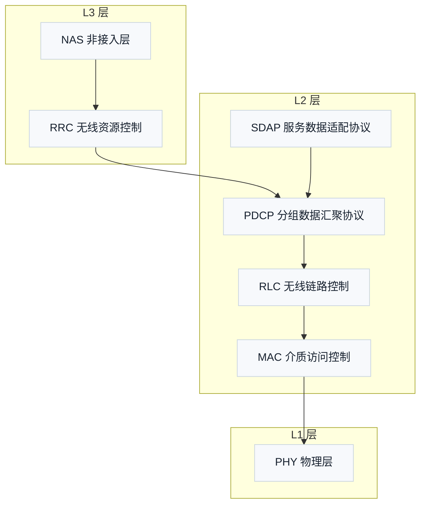

# 设计：3GPP 分层与 OSI 模型知识点入库

## 1. 背景与动机

用户提问「3GPP 协议中的层2 是数据链路层吗」。经检索，知识库现状（`docs/` 128 篇讲义 + `docs/concepts/` 71 篇概念笔记 + L0 术语总表）**无任何 OSI 模型 / 3GPP 分层映射内容**——该知识点全库空缺。本设计将知识点入库，形成可被各层讲义引用的分层总览。

## 2. 决策记录（brainstorming 结论）

| 决策点 | 结论 | 理由 |
|:---|:---|:---|
| 落点 | 新建概念笔记 + T0.1 补节 | 符合知识库「概念笔记 + 讲义首现讲解」既有模式；T0.1 协议阅读地图正是讲分层结构的地方 |
| 笔记主题 | 协议栈总览（非层2 专篇） | 回答「层2 是不是数据链路层」需要 L1/L2/L3 全栈语境；笔记可被 L1/L2/L3 全部讲义引用 |
| 补节深度 | 充实（~70 行） | 用户明确选择：三层定义、子层、OSI 对照表讲透，概念笔记作深化入口 |
| 图表 | T0.1 补节加 1 张 Mermaid 分层结构图 | 用户追加要求；简单结构图 → Mermaid 合法（CLAUDE.md 第 6 条） |
| OSI 各层协议 | 纳入概念笔记完整表 + 补节浓缩整合表 | 用户追加要求：OSI 每层典型协议要讲 |
| 图片资产 | 无（纯文本+表格+Mermaid 代码块） | 不产生资产文件，无台账/审计负担 |

## 3. 变更文件

| 文件 | 操作 |
|:---|:---|
| `docs/concepts/Protocol_Stack_协议栈.md` | 新建（六段式概念笔记） |
| `docs/L0_协议阅读引导/T0.1_LTE_NR_decoder_protocol_reading_map.md` | 修改（第 78/79 行之间插补节） |
| `docs/concepts/概念图谱入口.md` | 修改（协议结构章节挂载一行） |
| `docs/L0_协议阅读引导/L0_terminology_glossary.md` | 修改（新增 5 项术语） |

## 4. 概念笔记 `Protocol_Stack_协议栈.md` 详细内容

### 4.1 frontmatter

```yaml
---
type: definition
aliases: [协议栈, Protocol Stack, 无线接口协议栈]
tags: [3gpp, concepts, l0]
source_spec: "docs/L0_协议阅读引导/T0.1_LTE_NR_decoder_protocol_reading_map.md"
---
```

### 4.2 六段式逐段

1. **独立解释任务**：首行「任务目标：…」——用一张分层图 + 一张对照表讲清 3GPP 无线接口协议栈 L1/L2/L3 如何划分，并回答「层2 是不是 OSI 数据链路层」。
2. **科学定义**：
   - 3GPP 自有三层命名（非 OSI）：L1 = PHY；L2 = MAC + RLC + PDCP（NR 另加 SDAP）；L3 = RRC（控制面），NAS 位于 RRC 之上。
   - 各子层职责一句话：MAC（复用/HARQ/调度）、RLC（分段重组/ARQ）、PDCP（加解密/头压缩/重排序）、SDAP（QoS 流↔无线承载映射，NR 独有）。
   - 锚点：TS 38.300 §4.4.1/§4.4.2/§6、TS 36.300 §6（LTE 侧精确章节号实施时同法核验登记）。
3. **OSI 七层与各层典型协议**（完整表，7 行 + 表头）：

   | OSI 层 | 典型协议/技术 | 一句话职责 |
   |:---|:---|:---|
   | 应用层 L7 | HTTP、FTP、SMTP、DNS、SSH | 面向用户应用 |
   | 表示层 L6 | TLS/SSL（部分观点）、JPEG、ASCII | 数据表示/加密/压缩 |
   | 会话层 L5 | RPC、NetBIOS | 会话建立与管理 |
   | 传输层 L4 | TCP、UDP | 端到端传输 |
   | 网络层 L3 | IP、ICMP、IPsec | 寻址与路由 |
   | 数据链路层 L2 | 以太网 MAC、IEEE 802.11、PPP | 相邻节点成帧与差错控制 |
   | 物理层 L1 | 以太网物理收发、光纤 | 比特传输 |

   附 **TCP/IP 四层**对照：链路层 ≈ OSI L1+L2、网络层 ≈ OSI L3、传输层 ≈ OSI L4、应用层 ≈ OSI L5-L7。要点：OSI 是参考模型，互联网实际实现是 TCP/IP 四层。
4. **直观模型**：邮政/快递系统类比——用户数据像信件：贴面单（SDAP）→ 装信封加密（PDCP）→ 拆段装箱（RLC）→ 装车（MAC）→ 发车（PHY）；分拣中心选址路由类比网络层。本段内嵌与 T0.1 补节**同一张 Mermaid 分层结构图**（源码见 §5.2，两处一致，全库 Mermaid 扫描一次覆盖）。
5. **常见误解**（表格，4 行）：

   | 误解 | 正确理解 |
   |:---|:---|
   | 3GPP 层2 就是 OSI 数据链路层 | 功能对应但体系不同——3GPP 自有三层命名，OSI 映射是教学类比，非 3GPP 标准 |
   | PDCP 加密/完整性保护属链路层 | OSI 语境中加密属上层（表示层附近）功能 |
   | RRC 是网络层 | RRC 是控制面配置/连接管理协议，无寻址路由功能 |
   | OSI 七层是实际实现 | 实际互联网是 TCP/IP 四层；OSI 是参考模型 |
6. **协议锚点**：
   - TS 38.300 §4.4 Radio Protocol Architecture（§4.4.1 用户面、§4.4.2 控制面）、§6 Layer 2 —— 本地 `3GPP_Rel19/processed/TS_38.300_38300-j20/content.md`（2461 行起，**已核验**）
   - TS 36.300 §6 Layer 2 —— 本地 `3GPP_Rel19/processed/TS_36.300_36300-j10/content.md`（**已核验存在**，精确章节号实施时登记）
   - 标注：OSI 映射为教学类比，非 3GPP 标准术语。
7. **图谱关联**：`[[概念图谱入口]]`（协议结构章节）+ `[[Physical_Channels_物理信道]]`（L1 侧）+ `[[T0.1_LTE_NR_decoder_protocol_reading_map]]`；末行「关系语义：…」。

## 5. T0.1 补节详细内容

插入位置：「协议分册如何分工」表格结束（第 78 行）之后、「协议发送端顺序与接收端逆序」（第 79 行）之前。

标题：`## 3GPP 分层与 OSI 模型`，内容顺序：

1. **三层定义段**（~8 行）：L1/L2/L3 及子层组成，一句话 + 锚点（TS 38.300 §4.4/§6）。
2. **Mermaid 分层结构图**（图注：参照 TS 38.300 Figure 4.4.1-1/4.4.2-1，用户面与控制面合并示意；全引号节点）：



3. **整合对照表**（4 行含表头）：3GPP 层 ↔ 子层/协议 ↔ OSI 对应层（类比）↔ OSI 典型协议 ↔ 职责概述。
4. **TCP/IP 四层一句话**：说明 OSI 是参考模型、互联网实际实现是 TCP/IP 四层。
5. **结论段**（~6 行）：层2 ≈ 数据链路层是功能对应而非同一体系；两点差异（PDCP 安全功能、RRC 性质）；`[[Protocol_Stack_协议栈]]` 深化链接。

## 6. 同步清单（强制验收项）

1. 概念图谱入口「协议结构」章节（第 33-42 行区块内）加一行 `- [[Protocol_Stack_协议栈]]`。
2. L0 术语总表新增 5 项（格式仿现有行 `| 缩写 | 中文 | 英文全称+说明 |`）：
   - OSI（开放式系统互联参考模型）、数据链路层、协议栈、PDCP（分组数据汇聚协议）、SDAP（服务数据适配协议）。
3. 双向链接：概念笔记 ↔ T0.1（补节内 wikilink + T0.1 文件头或图谱关联反向）。
4. 无图片资产文件 → 不涉及 `image_asset_inventory.md` / migration 台账。

## 7. 验证清单（具体命令）

```bash
python3 tools/audit_markdown_headings.py   # 标题规范（无口语化标题，Rule 16）
python3 tools/audit_lesson_terms.py        # 术语配对（OSI/PDCP/SDAP/数据链路层首现必须"中文（English）"）
python3 tools/audit_latex_render.py --syntax-only  # 本设计无公式，兜底
python3 tools/audit_circled_digits.py      # 无带圈数字
bash tools/audit_mermaid_syntax.sh         # 新增 Mermaid 块真实渲染；缺 mmdc 显式声明验证缺口
# 死链全格式扫描：wikilink + Markdown + 相对路径（[[Protocol_Stack_协议栈]] 必须可解析）
```

## 8. 验收标准

- 概念笔记六段式齐全、术语首现「中文（English）」、无口语化标题
- T0.1 补节含 Mermaid 图 + 整合表 + 结论句，插入位置正确
- 全部 audit 通过（或工具缺失显式声明缺口）
- 死链零
- L0 术语总表 5 项登记、概念图谱入口挂载完成
- 单次提交 + `git push origin master`（自动双推 Gitee + GitHub）

## 9. 提交

单次提交（含 spec 文档 + 4 个文件变更）+ `git push origin master`。
